# India Consumer

EQUITY: CONSUMER RELATED

## 4QFY26 Staples review – on an improving track

Staples: Volumes/Sales/EBITDA grew c.9%/10%/12% y-y; Foods: Volumes/Sales/EBITDA grew 14%/12%/21% y-y; HPC: Volumes/Sales/EBITDA grew 6%/7%/7% y-y

## Common trends across consumer companies

\- Staples revenue improved sequentially to 10.5% y-y in 4Q, above its eight-quarter average of 6.7% (Fig. 9).

Volumes (Fig. 7): While the organized sector's volume growth of $9\%$ in 4Q was the highest-ever over the past four years, FMCG industry volume growth was down sequentially, indicating that the organized players grew faster than unorganized players. We note that almost all the staple companies under our coverage, except for Godrej Consumer, witnessed either sequentially stable or improved volume growth in 4Q, supported by the GST-rate cut.

\- Pricing-led growth (Fig. 8), excluding Marico, which had taken sharp price hikes of $60\%$ in earlier quarters, was in low to mid-single-digits for companies under our coverage and for the FMCG industry. However, with rising input costs led by the West-Asia war, we note that all the companies have started to take calibrated price increases in the mid-single-digits to alleviate the impact.

\- Margins remained range-bound, leading to average EBITDA growth of 11.6% y-y, which was above its eight-quarter average of 4.6% (Fig. 11): GPM for staple companies remained largely range-bound (Fig. 14), as the expansion of food companies was offset by the contraction recorded by Home and Personal Care (HPC) companies. Structural cost savings along with stable ad spending helped to maintain OPM (Fig. 16) for the sector.

\- Foods revenue improved sequentially to $16\%$ y-y in 4Q, above the segment's eight-quarter average of $10.2\%$ (Fig. 19).

Volumes (Fig. 17): The organized sector's sequential improvement in volume growth of $14\%$ in 4Q was largely supported by GST-led price cuts and consequent grammage increases. While the FMCG industry volume growth was down q-q, we note that all the food companies under our coverage recorded sustained volume recovery, with Nestle leading the pack, indicating that organized players outpaced unorganized players.

\- Pricing-led growth (Fig. 18): While the pricing growth in 4Q at $2\%$ was below its past eight-quarter average of $4\%$ , we note that the companies we cover began initiating price hikes of close to the mid-single digits towards the end of the quarter as the West-Asia war led to input cost inflation. Thus, we expect pricing growth to pick up going forward.

\- Margins: GPM for food players improved by 55bp y-y / -15bp q-q (Fig. 24) on the back of lower-priced inventory. Cost efficiency and operating leverage across companies aided OPM expansion by 86bp y-y / 170bp q-q (Fig. 26).

\- HPC revenue growth remained stable at 7.4% y-y in 4Q, above its eight-quarter average of c.5% (Fig. 29).

Volumes (Fig. 27): Organized sector volume growth improved sequentially to 6.3%, double than its past eight-quarter average of 3.2%.

\- Pricing-led growth (Fig. 28): Price cuts by hair oil companies such as Marico ed to a moderation in the pricing growth for the organized sector to $1.1\%$ in 4Q, below its past eight-quarter average of $1.7\%$ .

\- Margins: While GPM contracted 70bp y-y / 40bp q-q (Fig. 34) amid high

Research Analysts

India Consumer Related

Mihir P. Shah - NFASL

mihir.shah1@NOM.com

+91 22 403 74232

Riya Patni - NFASL

riya.patni@NOM.com

+91 22 405 33473

competitive intensity, cost efficiency measures and better operating leverage helped maintain OPM (5bp y-y) (Fig. 36).

## - Rural volume growth moderated on a high base, while urban remained stable:

We note that until 3Q, rural growth grew faster. However, many companies recently indicated that while rural continues to outpace urban growth, the gap between rural and urban is narrowing as rural demand recorded some moderation (Fig. 3), while urban stagnated after evidence of green shoots (Fig. 4).  
- Going forward, we remain watchful on rural demand as we believe that it will likely face multiple headwinds of below-normal monsoon (Fig. 79), El Nino impact, and product price increases being taken by companies due to the West-Asia crisis. However, we believe that strong reservoir levels after two years' of above-normal monsoon and adequate foodgrain stocks could ease some pressure off.

## - Our view:

GST-led benefits to continue supporting volume growth: While staples performed well during 4Q vs 3Q due to GST-led product price cuts along with grammage increases, companies also highlighted an improvement in the demand environment.

## - Pricing growth to support overall growth with no/limited impact on volumes:

Given the input cost inflation caused by the West-Asia war. we note that consumer companies have taken mid-single-digit price hikes. We believe that this price increases and the overall inflation are in manageable ranges and may not materially put pressure on volumes as the staple categories are usually relatively less price elastic.  
- Going forward, we expect a return of pricing growth with no pushback on volumes to drive higher sales growth. However, if pricing growth touches double-digit+, it can start pressuring volumes.

\- Margins could see near-term pressure, but will be made up later: We note that the consumer companies in the past have not fully passed on the inflation cost; hence, we believe that the near-term margins could be impacted.

Organised players are relatively better placed: Inflationary conditions are usually better for organized players as the unorganized players may find it difficult to procure raw materials in case of sustained inflation given they have weaker ability to pass on price hikes.

## Sector tailwinds

- Volume growth to sustain momentum: We expect the sequential recovery of volume growth to continue led by lower prices after the GST rate cuts.  
- Opportunity to gain market share from local players: Amid the prevailing geopolitical conditions, rising input costs and unavailability of raw materials exert pressure on smaller/local players while the organized companies with strong brands, bargaining power and higher saliency of premium portfolio are relatively less impacted, and are gaining share from local players, in our view.  
- Premiumization improves across the board: Multiple companies continued to highlight outperformance by premium segments, indicating a structural mix improvement.  
- Harsher summer likely to be positive for summer portfolios: Given the strong summer, we believe that the companies having exposure to the summer-centric categories such as packaging water, cold coffees, cold drinks, juices, glucose, cooling hair oils, soaps, deos and sunscreens should benefit.  
- Quick commerce channel is growing faster than any other distribution channels as consumers are availing of both: (1) discount offers by the channel for customer adoption; and (2) convenience of 10-minute delivery. We view brands/companies with high market shares and recall them as key beneficiaries currently, as their premium portfolios are witnessing a tailwind from the new distribution channel, and competition from new or regional brands has been limited so far.  
- Noise levels and competition from Direct to Consumer (D2C) brands have moderated further vs in the past few years, as they face challenges in scaling up

## - Quick commerce channel is a tailwind; competition from D2C is easing

their brands beyond the INR2-5bn level and turn profitable/maintain profitability.

While D2C/digital-first brands witnessed a significant surge from 300 brands in 2018 to 11K brands in 2025, only 233 brands have crossed sales of INR1.5bn, with most still not being profitable.

We believe any competition from private labels and online first/quick-commerce brands will be limited, given the overall weakness in demand and pressure on margins that are making the environment less conducive for new products/brand launches.

## Sector headwinds

- El Nino and below-normal monsoon could impact rural agricultural yield this year and add to the pressure on overall demand/consumption. However, we note that the Agricultural Ministry is making district-wise contingency plan to counter any adverse impact and ensure the availability of alternative cropping if conditions deteriorate,  
- Input cost inflation to impact near-term margins: While consumer companies have already effected price hikes given the uptrend in key input costs led by the West-Asia war, we believe it will still be lower than the inflation witnessed by them, causing near-term margin pressure. We also expect companies to continue investing in their brands and new launches, while executing cost saving initiatives to help sustain/improve OPM.  
- Harsher summer can lead to limited movements and impact out-of-home consumption categories.

## Notable mentions

• Colgate (CLGT IN, Buy): Strategic pillars of growth:

- Lead in the toothpaste category through Oral Health Movement and strengthened core brands - Strong Teeth (8.5x more effective) and MaxFresh (fastest-growing);  
- Accelerate premiumization with premium growing 6x faster than toothpaste category (35% mix increase over the past two years) led by Total and Visible White Purple, and Periogard doubling annually;  
Lead in toothbrush by dominating value/mid-tiers (1.7x/1.5x competitors) while expanding super-premium (Brilliant Star whitening) and capitalizing on replacement gap (urban 6 months, rural 15 months vs recommended 3 months);  
- Build personal care via Palmolive body/hand wash (double-digit growth) with digital-first partnerships and innovation pipeline, all underpinned by AI capabilities and product superiority,

• Hindustan Unilever (HUVR IN, Buy)

HUL is revising its go-to-market across channels: Investments to create a specialized force for general trade specialist stores, such as open format stores, chemists, and cosmetic stores. Q-Comm is focused on driving capability building in terms of demand generation, market, supply, availability, to ensure that right capabilities are built – customer availability has gone up c.1,400bp.

• Marico (MRCO IN, Buy)

Marico launched Parachute Advansed Protein Shampoo – INR370 for 340ml – priced lower than Dove Intense Repair at INR490 for a 340ml bottle.  
Growth levers for delivering double-digit consolidated sales growth in the current tough environment: 1) synergies and scale-up of new acquisitions; 2) unique position of softening copra prices (key raw material) in an inflationary environment; 3) tailwinds from higher exposure to fast-growing E-comm channel to increase saliency of Premium Personal Care and Digital First portfolio (we expect to be 44% in FY27F vs 37% in FY26); and 4) sustained performance in the international business.

• Britannia (BRIT IN, Buy)

Industry likely to transition to price parity in 4Q: Our channel checks suggests that Parle (unlisted) has moved to INR5/10 price points (c.65% of BRIT's business) from mid-March; however, we believe that they will have nearly two months of inventory in the channel, and thus the positive impact of this change to

BRIT's numbers will likely be visible from 2QFY27. The dual pricing impacted transactions growth for BRIT in rural from wholesale channels (c.25% of the business); however, BRIT highlighted that the impact should normalize. Given relatively higher realization of the company, the value market share remains similar for the company.

## - Nestle (NEST IN, Buy)

Nestle is benefiting from a confluence of external and internal factors. Apart from GST rate cut benefits, external factors like low inflation and benign input costs negated the need for price hikes, which in turn drove volumes. Internal factors yielding results, in our view, include: 1) a rise in its distribution reach by continued expansion through route-to-market strategy (the highest numeric increase last year; current reach: c.216k villages) while improving coverage effectiveness; 2) omni-channel strategy of scaling ecomm/q-comm with platform-specific pack portfolio being created across categories, strengthening modern trade and chain pharmacy and sustaining growth via general trade – this led to strong double-digit growth across business channels; 3) improving in-stock availability and tech-enabled replenishment to cut lead time and sharpen channel-wise assortment; and 4) stepping up value-added new product launches and brand building initiatives indicated by a material step-up in ad spends (50%+/42%+ y-y in 4Q/3Q) which augurs well for future volumes, in our view.

## • EPL (EPLL IN, Buy)

Oral care on the path to recovery while Beauty & Cosmetics sustained strong growth momentum.  
Middle-East crisis driving higher raw material cost, but EPL says it will maintain margins: Management is confident in leveraging its strong supplier relationships and operational scale, and indicated that it has supplies secured until mid-July and is expanding its inventory weekly. The company's advanced cost pass-through model (c.50% of business) through contractual agreements (being reviewed proactively) that include landed costs, power, logistics, and currency enables recovery of all additional costs without significant lag, even from non-contractual customers while creating market share opportunities as competitors face supply constraints.

## • GCPL (GCPL IN, Buy)

Palm oil inflation, not as alarming as perceived: GCPL is witnessing 7-9% cost inflation (with crude at USD100-110/bbl and palm oil at MYR4,500-4,800), and took a 5% price hike in soaps and 1HFY27, and 7% in detergents in April, which will lift FY27F consolidated sales growth to double-digits / low teens, in our view.  
Opportunity to gain market share: The entry of domestic competitors in 1H and laundry likely facing high cost / sourcing issues for kerosene / linear alkyl benzene (LAB) could benefit GCPL in terms of share gains.  
- Indonesia continued to improve as pricing pressure bottomed out:

Management expects a meaningful step-up in performance from FY27E, targeting mid-single digit volume and high-single-digit value growth, as operating conditions normalize.

## Company guidance / forward-looking comments and our view

## - Britannia Industries (BRIT IN) (Buy) – 4Q headwinds getting addressed; expect normalization during 1QFY27

- BRIT expects the dual pricing-led impact on transaction growth to normalize as the remaining players transition to coinage price points of INR5/INR10.  
- Our view: We expect price hikes from competition (undertaken in March) to establish price parity in the industry and drive sequential improvement going forward.

## • Dabur India (DABUR IN) (Buy) – Every storm runs out of rain

Dabur expects price hikes to drive double-digit sales growth vs earlier guidance of high-single-digit growth. Management emphasised its strategic intent to prioritize and maintain India margins y-y on the back of price hikes, mix improvement, and cost savings, while continuing to monitor international margins given the geopolitical headwinds.

For FY27E: the company expects HPC to sustain double-digit growth in FY27E and Foods and Beverages (F&B) to deliver double-digit growth, supported by increasing focus shift towards Real Activ, albeit contingent on El Nino.  
Our view: We expect price hikes to drive a sequential improvement to near-double-digit sales growth as we believe that the probability of a harsher summer may support a recovery of Beverages after being impacted for the past 12 quarters.

\- Godrej Consumer Products (GCPL IN) (Buy) – Near-term hiccup, but on a structural upswing

FY27E:

While 1Q/2Q FY27E margins will likely see some pressure and be marginally below normative levels of 24-26%, GCPL expects higher revenue/pricing growth to offset this, leading to reasonably good EBITDA levels.  
Management expects soaps volumes to improve in FY27 on the back of a harsh summer, but it could create headwinds for 1H27 in 1Q.  
GCPL expects FY27E consolidated sales/EBITDA growth to be in double-digits led by high-single-digit standalone volume growth.  
- Indonesia to deliver high-single-digit revenue growth led by mid-single-digit UVG and expects EBITDA to grow in the double-digits for FY27E.

Medium-term target for categories:

GCPL aims for India standalone underlying sales growth in the teens, led by double-digit underlying volume growth (UVG) by FY30E.  
The company plans to achieve this by sustaining mid-single-digit growth in its mothership (core) portfolio (c.80% of business – Household insecticides, Skin Cleansing and Hair Colours), increased contribution from speedboats (brands that have achieved critical mass and are growing at c.35-40%) from 15% in FY26 to c.20%/40% in FY27E/30E, and scale-up jetskis (new launches) for a sustainable high-growth future.

Our view: We believe GCPL will be in an investment phase over the next two years and near-term sales and EBITDA growth will be capped in double-digits. However, innovations over the past few years have seen strong success and we expect them to continue on a strong growth trajectory, become large, and contribute to a compounding effect over the medium term.

\- Marico (MRCO IN) (Buy) – Guidance upgrade in current scenario - a rarity

- FY27E guidance: Expects double-digit consolidated sales growth led by high-single-digit volume growth. MRCO expects EBITDA growth to be in high-teens. International business will likely drive mid-teens constant currency sales growth (up from double-digit guidance earlier).  
Medium-term guidance of double-digit revenue and mid-teens EBITDA CAGR.  
- MRCO expects to grow Foods at 25% y-y over the medium term and it expects Digital First portfolio at 2.5x FY24 sales by FY27E and reach double-digit OPM by FY27E. Management expects double-digit sales growth in VAHO to sustain as the benefits from Project Setu kick in.

\- MRCO expects Digital-first brands to reach double-digit EBITDA margin by end-FY27E and expand to teens by FY30E, led by premiumization, scale and operating synergies.

Our view: MRCO took price cuts of c.10% in Parachute (after a price hike of 60%) as Copra prices are down c.35% from their peak. We expect volumes to revert to positive from 1Q. Apart from lower input prices driving higher EBITDA growth, VAHO sustaining double-digit sales growth is also likely to boost margins for the company, on a low base. MRCO is evolving as a play for best of both worlds, with strong brands in core traditional categories and meaningful exposure in fast-growing new / digits-first categories of the future, in our view.

\- Hindustan Unilever (HUVR IN) (Buy) – 4Q26 better; HUL confident on sustaining

## volumes and margins

Reiterated expectation of FY27 being better than FY26: Given HUL's categories have relatively low price elasticity, HUL seemed relatively confident on sustaining volume-led growth, despite the return of pricing growth to low-to-mid-single digit.  
Return of price hikes give confidence to maintain OPM in the guided range of 22.5%-23.5%: HUL has started taking calibrated price increases of 2-5% across Fabric Wash and Household Care to navigate the input cost inflation led by the West-Asia war – it will take further price hikes, if needed, according to management. This, along with the acceleration of savings funnel and optimization of media spendings, should aid HUL in maintaining OPM within its guidance band of 22.5-23.5%.  
Our view: Given HUL is witnessing an input cost inflation of 8-10%, but has taken price hikes of c.2-5% only, we expect the margins to be at the lower-end in the near-term and recover later to the higher-end of the band. Further, HUL is taking steps to increase its saliency in fast-growing categories and has called out capex plans; we believe benefits of these will be seen over the medium term.

## - Tata Consumer Products (TATACONS IN) (Buy) – Strong performance; guidance unchanged despite cost headwinds

TATACONS expects double-digit consolidated sales growth with EBITDA growth to be higher.

- Tea will sustain mid-single-digit volume growth and drive mid-to-high single digit value growth.  
- Growth business is expected to sustain 30%+ growth on the back of organic launches including new platforms.

Despite input cost inflation, management does not expect significant pressure on margins in the near term and is confident of 50-75bp OPM expansion for FY27E, in addition to a normalized ad-spending-to-sales ratio of 7.5-8.5%, from 6.7% in FY26.

- With Arabica coffee prices declining, the US coffee margins are expected to return to pre-upcycle industry margins.  
- Sampann margins to improve from double-digits currently to mid-teens over the medium term, led by mix improvement, according to management.

Our view: We believe that the strong volume performance in core portfolio is likely to continue and expect salt volumes to grow sustainably in high-single-digit. Thus, we believe, is supporting a case for early double-digit consolidated sales growth to sustain in the near term.

## - Colgate-Palmolive (India) (CLGT IN) (Buy) – Positives coming together

## 。 Our view:

We see Colgate's core portfolio returning back to normative levels vs below-normal levels seen in FY26. CLGT is also doubling down on premiumization, with premium saliency increasing by $35\%$ over the past two years.  
We expect revenue growth momentum to improve and return to near-double-digits in FY27F vs flat in FY26. This should be led by an improvement in volume growth which witnessed a revival in 4Q to 4.5% y-y after seeing four quarters of declines. We expect the favorable base to be supportive and drive mid-single-digit volume growth. We also expect the return of pricing growth back to mid-single-digit after low-single-digit growth in FY26, and do not expect any volume backlash.  
We believe that the worst of the impact of the GST-led inverted duty structure on margins is behind; while 1H27 will likely see some impact, the company is addressing it through logistics optimization, representations to the government, etc. Also, the company has inventory covers for the next two quarters, which along with premiumization-led favorable mix and savings from its Funding the Growth program will likely largely protect gross margins from the West-Asia war-driven inflation. CLGT will also take low-single-digit pricing against some cost pressures, according to management. Thus, we expect the

GPM improvement to continue and the company to reinvest some by stepping up ad spends, largely to support new product launches, which bodes well for future growth.

## - Nestle India (NEST IN) (Buy) – Another blowout quarter

## 。 Our view:

- NEST has been exceeding our/consensus expectation for the past three consecutive quarters. We believe it can sustain the elevated growth until 1Q/1H, after which growth can start moderating down as it will start cycling a higher base.  
On the margins front, the visibility of price cuts seems low despite lower coffee/cocoa prices as NEST had earlier (during coffee/cocoa inflation) taken lower-than-needed price hikes. However, in the rising input cost environment, we believe there is room for certain price hikes without any volume backlash.  
We expect cost savings in staff cost to continue and support a margin improvement in FY27F as well, driving mid-teens EBITDA growth.

## - EPL (EPLL IN) (Buy) – Guidance unchanged despite high RM prices

EPL maintained its guidance of low-double-digit value growth, with EBITDA growth slightly ahead of revenue growth.  
EPL expects to grow its existing business at the higher-end of the 11-13% band, led by a 20% growth in Beauty & Cosmetics (B&C; c.39% of sales), while Oral Care (c.47% of sales) should grow in mid-single-digit. The company expects marginal improvement in margins largely as the B&C (high-margin) mix improves.  
While revenue growth will be elevated due to price hikes, given the company has passed on the entire cost inflation and it does not expect an impact on EBITDA per kg; however, EBITDA margins will see some moderation.  
EPL targets to increase its ROCE from 18% to 25% by FY29E: ROCE was up 96bp y-y to 19%, while net debt/EBITDA improved to 0.52x vs 0.54x y-y. FY27E capex is expected by management to be elevated given B&C investments in frontline, innovation and capabilities.  
- Thailand's plant (greenfield investment of USD5mn) is gaining traction and management expects it to support growth in FY27E.  
Our view: Management has been delivering higher growth and margins, as guided, and still believes that the “best is yet to come”. Given the stock is currently trading at 1-SD lower than its 10-year trading average, it provides comfort on valuation.

## We prefer companies that are executing better and have higher saliency to fast-growing categories.

- We expect healthy volume growth and return of pricing growth to drive an improvement in FY27F vs the past couple of years. Limited headwinds along with staples sector valuations being at 1-SD below its five-year trading average provide comfort.  
- Within staples, we prefer companies that are executing better and demonstrate: (1) superior growth (in volumes/pricing) trajectory than peers/industry; (2) investments in distribution, digitization and R&D capabilities to support innovative new launches; and (3) strong brands, pricing power and higher saliency of premium portfolio to stand out.  
- Top picks: Tata Consumer (TATACONS IN, Buy) and Britannia (BRIT IN, Buy).

## Industry growth trends

Fig. 1: FMCG industry volume growth trends (%)  
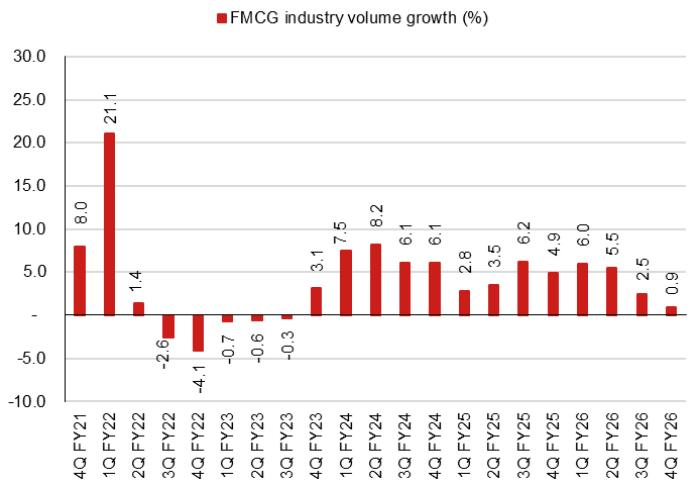

bar chart

FMCG industry volume growth (%)
| Quarter | FMCG industry volume growth (%) |
| :--- | :--- |
| 4Q FY21 | 8.0 |
| 1Q FY22 | 21.1 |
| 2Q FY22 | 1.4 |
| 3Q FY22 | -2.6 |
| 4Q FY22 | -4.1 |
| 1Q FY23 | -0.7 |
| 2Q FY23 | -0.6 |
| 3Q FY23 | -0.3 |
| 4Q FY23 | 3.1 |
| 1Q FY24 | 7.5 |
| 2Q FY24 | 8.2 |
| 3Q FY24 | 6.1 |
| 4Q FY24 | 6.1 |
| 1Q FY25 | 2.8 |
| 2Q FY25 | 3.5 |
| 3Q FY25 | 6.2 |
| 4Q FY25 | 4.9 |
| 1Q FY26 | 6.0 |
| 2Q FY26 | 5.5 |
| 3Q FY26 | 2.5 |
| 4Q FY26 | 0.9 |

Source: Company data, NOM

Fig. 2: FMCG market & organized players volume growth (%)  
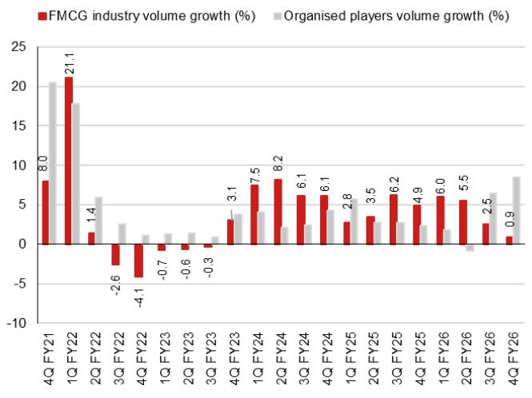

bar chart

| Period | FMCG industry volume growth (%) | Organised players volume growth (%) |
|---|---|---|
| 4Q FY21 | 8.0 | 20.5 |
| 1Q FY22 | 21.1 | 17.9 |
| 2Q FY22 | 1.4 | 6.0 |
| 3Q FY22 | -2.6 | 2.5 |
| 4Q FY22 | -4.1 | 0.8 |
| 1Q FY23 | -0.7 | 1.3 |
| 2Q FY23 | -0.6 | 1.4 |
| 3Q FY23 | -0.3 | 0.6 |
| 4Q FY23 | 3.1 | 3.7 |
| 1Q FY24 | 7.5 | 3.9 |
| 2Q FY24 | 8.2 | 2.1 |
| 3Q FY24 | 6.1 | 2.4 |
| 4Q FY24 | 6.1 | 4.0 |
| 1Q FY25 | 2.8 | 3.0 |
| 2Q FY25 | 3.5 | 2.7 |
| 3Q FY25 | 6.2 | 2.6 |
| 4Q FY25 | 4.9 | 2.3 |
| 1Q FY26 | 6.0 | 1.7 |
| 2Q FY26 | 5.5 | -0.8 |
| 3Q FY26 | 2.5 | 6.4 |
| 4Q FY26 | 0.9 | 8.5 |

Source: Company data, NOM

Fig. 3: Rural market FMCG volume growth trends (%)  
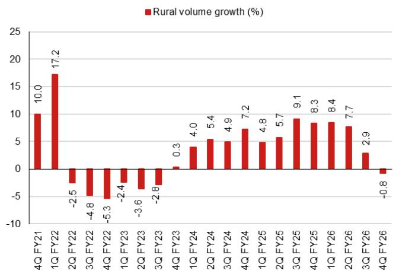

bar chart

Rural volume growth (%)
| Quarter | Rural volume growth (%) |
|---|---|
| 4Q FY21 | 10.0 |
| 1Q FY22 | 17.2 |
| 2Q FY22 | -2.5 |
| 3Q FY22 | -4.8 |
| 4Q FY22 | -5.3 |
| 1Q FY23 | -2.4 |
| 2Q FY23 | -3.6 |
| 3Q FY23 | -2.8 |
| 4Q FY23 | 0.3 |
| 1Q FY24 | 4.0 |
| 2Q FY24 | 5.4 |
| 3Q FY24 | 4.9 |
| 4Q FY24 | 7.2 |
| 1Q FY25 | 4.8 |
| 2Q FY25 | 5.7 |
| 3Q FY25 | 9.1 |
| 4Q FY25 | 8.3 |
| 1Q FY26 | 8.4 |
| 2Q FY26 | 7.7 |
| 3Q FY26 | 2.9 |
| 4Q FY26 | -0.8 |

Source: Company data, NOM

Fig. 4: Urban markets' FMCG volume growth trend (%)  
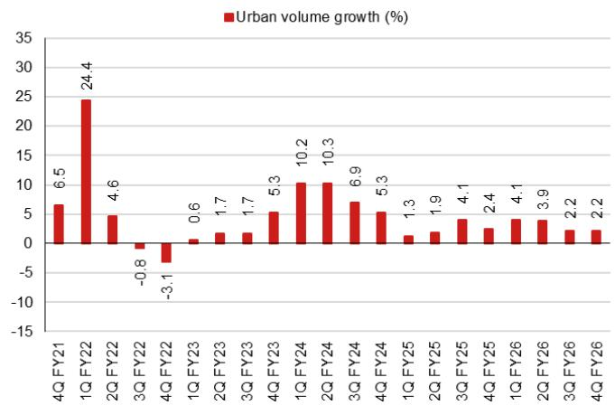

bar chart

Urban volume growth (%)
| Period | Urban volume growth (%) |
|---|---|
| 4Q FY21 | 6.5 |
| 1Q FY22 | 24.4 |
| 2Q FY22 | 4.6 |
| 3Q FY22 | -0.8 |
| 4Q FY22 | -3.1 |
| 1Q FY23 | 0.6 |
| 2Q FY23 | 1.7 |
| 3Q FY23 | 1.7 |
| 4Q FY23 | 5.3 |
| 1Q FY24 | 10.2 |
| 2Q FY24 | 10.3 |
| 3Q FY24 | 6.9 |
| 4Q FY24 | 5.3 |
| 1Q FY25 | 1.3 |
| 2Q FY25 | 1.9 |
| 3Q FY25 | 4.1 |
| 4Q FY25 | 2.4 |
| 1Q FY26 | 4.1 |
| 2Q FY26 | 3.9 |
| 3Q FY26 | 2.2 |
| 4Q FY26 | 2.2 |

Source: Company data, NOM

Fig. 5: HPC industry volume growth (%)  
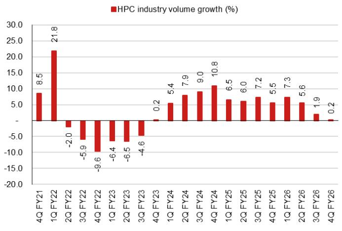

bar chart

HPC industry volume growth (%)
| Quarter | HPC industry volume growth (%) |
|---|---|
| 4Q FY21 | 8.5 |
| 1Q FY22 | 21.8 |
| 2Q FY22 | -2.0 |
| 3Q FY22 | -5.9 |
| 4Q FY22 | -9.6 |
| 1Q FY23 | -6.4 |
| 2Q FY23 | -6.5 |
| 3Q FY23 | -4.6 |
| 4Q FY23 | 0.2 |
| 1Q FY24 | 5.4 |
| 2Q FY24 | 7.9 |
| 3Q FY24 | 9.0 |
| 4Q FY24 | 10.8 |
| 1Q FY25 | 6.5 |
| 2Q FY25 | 6.0 |
| 3Q FY25 | 7.2 |
| 4Q FY25 | 5.5 |
| 1Q FY26 | 7.3 |
| 2Q FY26 | 5.6 |
| 3Q FY26 | 1.9 |
| 4Q FY26 | 0.2 |

Source: Company data, NOM

Fig. 6: Foods industry volume growth (%)  
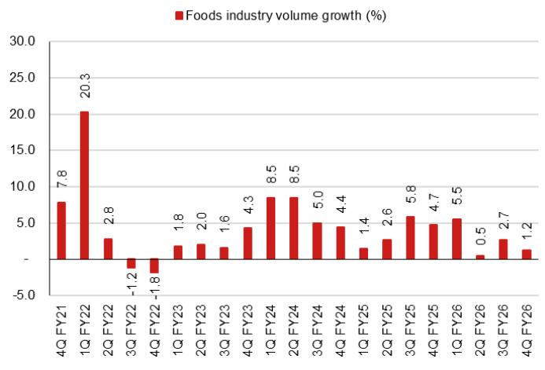

bar chart

Foods industry volume growth (%)
| Quarter | Growth (%) |
|---|---|
| 4Q FY21 | 7.8 |
| 1Q FY22 | 20.3 |
| 2Q FY22 | 2.8 |
| 3Q FY22 | -1.2 |
| 4Q FY22 | -1.8 |
| 1Q FY23 | 1.8 |
| 2Q FY23 | 2.0 |
| 3Q FY23 | 1.6 |
| 4Q FY23 | 4.3 |
| 1Q FY24 | 8.5 |
| 2Q FY24 | 8.5 |
| 3Q FY24 | 5.0 |
| 4Q FY24 | 4.4 |
| 1Q FY25 | 1.4 |
| 2Q FY25 | 2.6 |
| 3Q FY25 | 5.8 |
| 4Q FY25 | 4.7 |
| 1Q FY26 | 5.5 |
| 2Q FY26 | 0.5 |
| 3Q FY26 | 2.7 |
| 4Q FY26 | 1.2 |

Source: Company data, NOM

## Consumer staples sector trends

Fig. 7: Volume growth trend (y-y) – Staples  
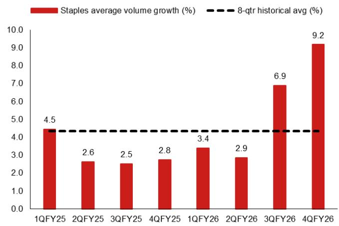

bar chart

| Quarter | Staples average volume growth (%) |
| ------- | --------------------------------- |
| 1QFY25  | 4.5                               |
| 2QFY25  | 2.6                               |
| 3QFY25  | 2.5                               |
| 4QFY25  | 2.8                               |
| 1QFY26  | 3.4                               |
| 2QFY26  | 2.9                               |
| 3QFY26  | 6.9                               |
| 4QFY26  | 9.2                               |

Note: Includes GCPL, BRIT, CLGT, DABUR, HUVR, MRCO, NEST, TATACONS
Source: Company data, NOM

Fig. 8: Price + mix growth trend (y-y) – Staples  
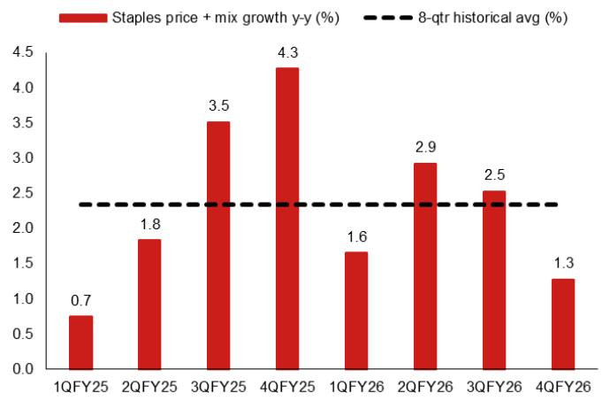

bar chart

| Quarter | Staples price + mix growth y-y (%) |
| ------- | ---------------------------------- |
| 1QFY25  | 0.7                                |
| 2QFY25  | 1.8                                |
| 3QFY25  | 3.5                                |
| 4QFY25  | 4.3                                |
| 1QFY26  | 1.6                                |
| 2QFY26  | 2.9                                |
| 3QFY26  | 2.5                                |
| 4QFY26  | 1.3                                |

Source: Company data, NOM

Fig. 9: Revenue growth trend (y-y) – Staples  
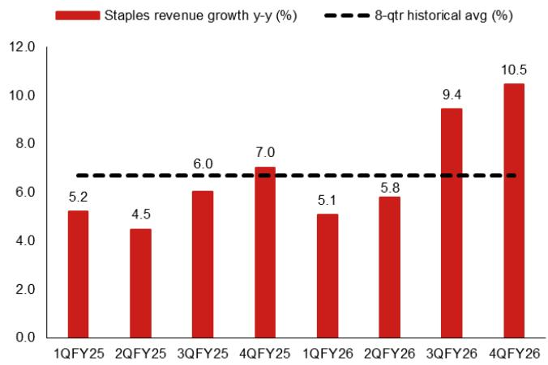

bar chart

| Quarter | Staples revenue growth y-y (%) |
| :--- | :--- |
| 1QFY25 | 5.2 |
| 2QFY25 | 4.5 |
| 3QFY25 | 6.0 |
| 4QFY25 | 7.0 |
| 1QFY26 | 5.1 |
| 2QFY26 | 5.8 |
| 3QFY26 | 9.4 |
| 4QFY26 | 10.5 |
8-qtr historical avg (%)

Note: Includes GCPL, BRIT CLGT, DABUR, HUVR, MRCO, NEST, TATACONS, EMAMI, BECTORS, BAJAJCONS
Source: Company data, NOM

Fig. 10: Gross profit growth trend (y-y) – Staples  
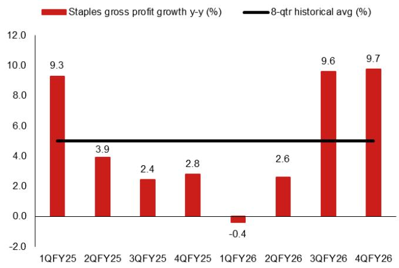

bar chart

| Quarter | Staples gross profit growth y-y (%) |
| ------- | ----------------------------------- |
| 1QFY25  | 9.3                                 |
| 2QFY25  | 3.9                                 |
| 3QFY25  | 2.4                                 |
| 4QFY25  | 2.8                                 |
| 1QFY26  | -0.4                                |
| 2QFY26  | 2.6                                 |
| 3QFY26  | 9.6                                 |
| 4QFY26  | 9.7                                 |

Source: Company data, NOM

Fig. 11: Operating profit growth trend (y-y) – Staples  
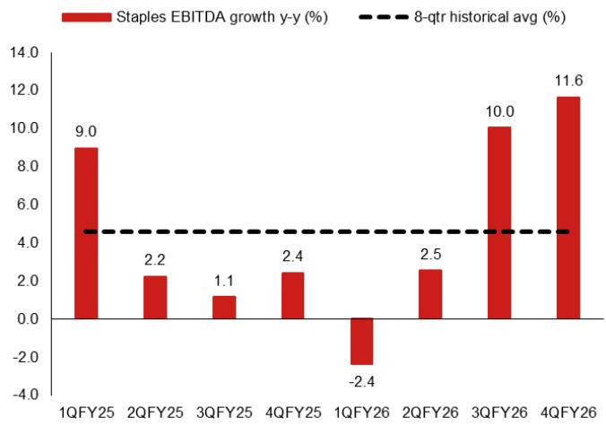

bar chart

| Quarter | Staples EBITDA growth y-y (%) |
| ------- | ----------------------------- |
| 1QFY25  | 9.0                           |
| 2QFY25  | 2.2                           |
| 3QFY25  | 1.1                           |
| 4QFY25  | 2.4                           |
| 1QFY26  | -2.4                          |
| 2QFY26  | 2.5                           |
| 3QFY26  | 10.0                          |
| 4QFY26  | 11.6                          |

Source: Company data, NOM

Fig. 12: Adj. PAT growth trend (y-y) – Staples  
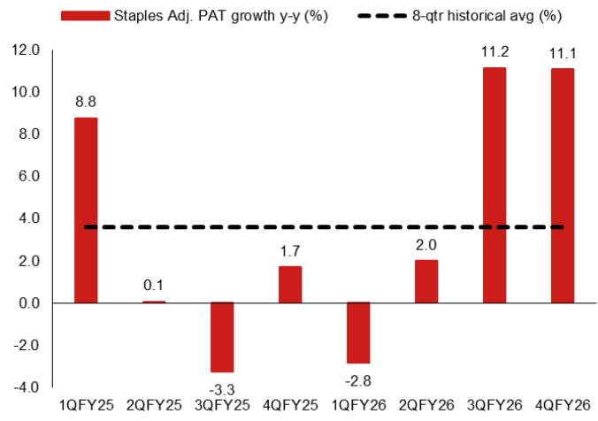

bar chart

| Quarter | Staples Adj. PAT growth y-y (%) |
| ------- | ------------------------------- |
| 1QFY25  | 8.8                             |
| 2QFY25  | 0.1                             |
| 3QFY25  | -3.3                            |
| 4QFY25  | 1.7                             |
| 1QFY26  | -2.8                            |
| 2QFY26  | 2.0                             |
| 3QFY26  | 11.2                            |
| 4QFY26  | 11.1                            |

Source: Company data, NOM

Fig. 13: Gross margin trend – Staples  
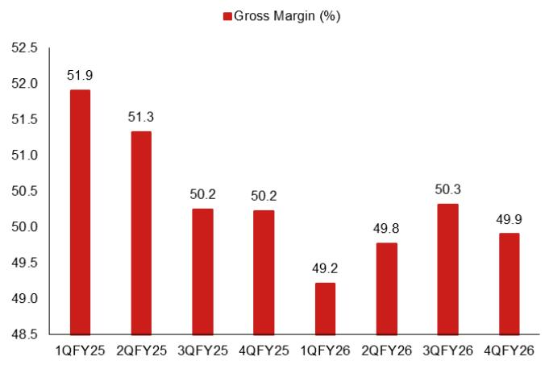

bar chart

Gross Margin (%)
| Quarter | Gross Margin (%) |
|---|---|
| 1QFY25 | 51.9 |
| 2QFY25 | 51.3 |
| 3QFY25 | 50.2 |
| 4QFY25 | 50.2 |
| 1QFY26 | 49.2 |
| 2QFY26 | 49.8 |
| 3QFY26 | 50.3 |
| 4QFY26 | 49.9 |

Source: Company data, NOM

Fig. 14: Gross margin expansion trend – Staples  
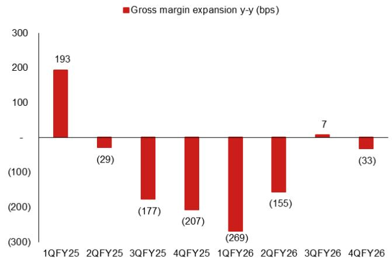

bar chart

Gross margin expansion y-y (bps)
| Quarter | Gross margin expansion y-y (bps) |
| :--- | :--- |
| 1QFY25 | 193 |
| 2QFY25 | -29 |
| 3QFY25 | -177 |
| 4QFY25 | -207 |
| 1QFY26 | -269 |
| 2QFY26 | -155 |
| 3QFY26 | 7 |
| 4QFY26 | -33 |

Source: Company data, NOM

Fig. 15: Operating margin trend – Staples  
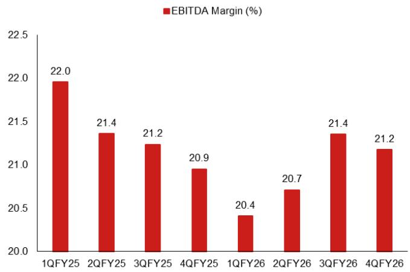

bar chart

EBITDA Margin (%)
| Quarter | EBITDA Margin (%) |
| :--- | :--- |
| 1QFY25 | 22.0 |
| 2QFY25 | 21.4 |
| 3QFY25 | 21.2 |
| 4QFY25 | 20.9 |
| 1QFY26 | 20.4 |
| 2QFY26 | 20.7 |
| 3QFY26 | 21.4 |
| 4QFY26 | 21.2 |

Source: Company data, NOM

Fig. 16: Operating margin expansion trend – Staples  
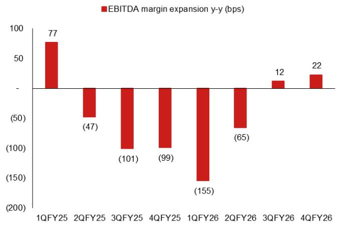

bar chart

EBITDA margin expansion y-y (bps)
| Quarter | EBITDA margin expansion y-y (bps) |
| :--- | :--- |
| 1QFY25 | 77 |
| 2QFY25 | -47 |
| 3QFY25 | -101 |
| 4QFY25 | -99 |
| 1QFY26 | -155 |
| 2QFY26 | -65 |
| 3QFY26 | 12 |
| 4QFY26 | 22 |

Source: Company data, NOM

## Foods sector trends

Fig. 17: Volume growth trend (y-y) – Foods  
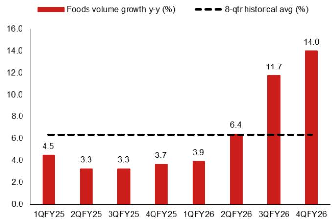

bar chart

| Quarter | Foods volume growth y-y (%) |
| ------- | --------------------------- |
| 1QFY25  | 4.5                         |
| 2QFY25  | 3.3                         |
| 3QFY25  | 3.3                         |
| 4QFY25  | 3.7                         |
| 1QFY26  | 3.9                         |
| 2QFY26  | 6.4                         |
| 3QFY26  | 11.7                        |
| 4QFY26  | 14.0                        |

Note: Includes TATACONS, BRIT, NEST  
Source: Company data, NOM

Fig. 18: Price + mix growth trend (y-y) – Foods  
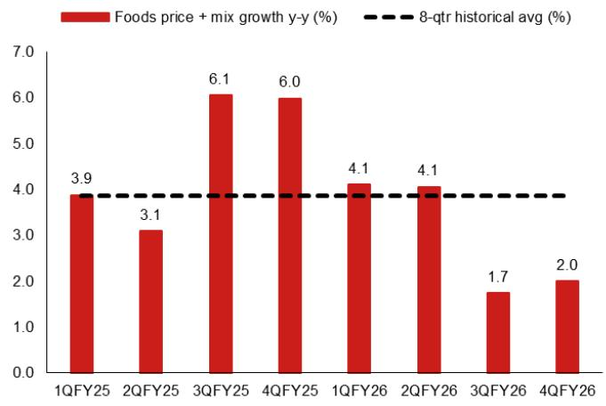

bar chart

| Quarter | Foods price + mix growth y-y (%) |
| ------- | --------------------------------- |
| 1QFY25  | 3.9                               |
| 2QFY25  | 3.1                               |
| 3QFY25  | 6.1                               |
| 4QFY25  | 6.0                               |
| 1QFY26  | 4.1                               |
| 2QFY26  | 4.1                               |
| 3QFY26  | 1.7                               |
| 4QFY26  | 2.0                               |

Source: Company data, NOM

Fig. 19: Revenue growth trend (y-y) – Foods  
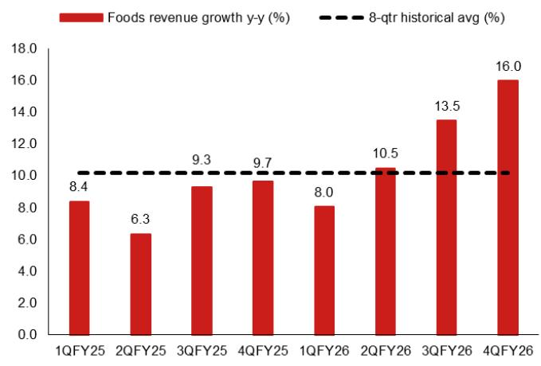

bar chart

| Quarter | Foods revenue growth y-y (%) |
| :--- | :--- |
| 1QFY25 | 8.4 |
| 2QFY25 | 6.3 |
| 3QFY25 | 9.3 |
| 4QFY25 | 9.7 |
| 1QFY26 | 8.0 |
| 2QFY26 | 10.5 |
| 3QFY26 | 13.5 |
| 4QFY26 | 16.0 |
8-qtr historical avg (%)

Note: Includes TATACONS, BRIT, NEST, BECTORS  
Source: Company data, NOM

Fig. 20: Gross profit growth trend (y-y) – Foods  
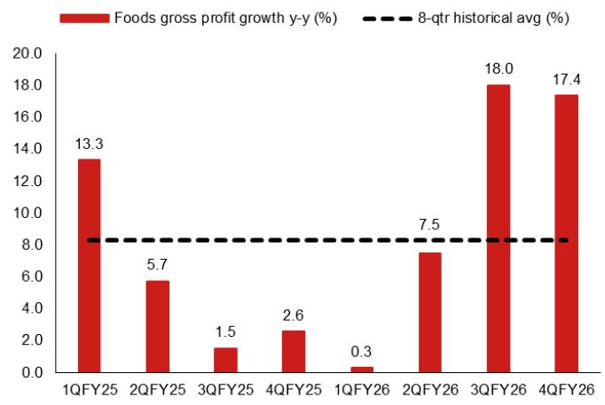

bar chart

| Quarter | Foods gross profit growth y-y (%) |
| ------- | --------------------------------- |
| 1QFY25  | 13.3                              |
| 2QFY25  | 5.7                               |
| 3QFY25  | 1.5                               |
| 4QFY25  | 2.6                               |
| 1QFY26  | 0.3                               |
| 2QFY26  | 7.5                               |
| 3QFY26  | 18.0                              |
| 4QFY26  | 17.4                              |

Source: Company data, NOM

Fig. 21: Operating profit growth trend (y-y) – Foods  
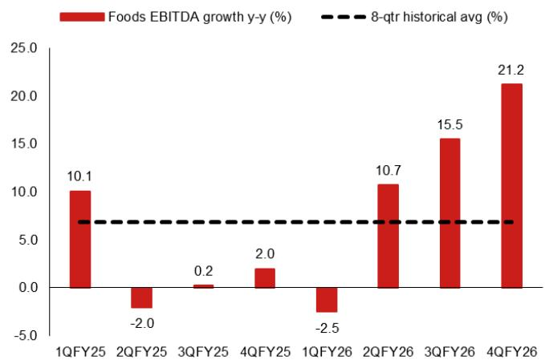

bar chart

| Quarter | Foods EBITDA growth y-y (%) |
| ------- | --------------------------- |
| 1QFY25  | 10.1                        |
| 2QFY25  | -2.0                        |
| 3QFY25  | 0.2                         |
| 4QFY25  | 2.0                         |
| 1QFY26  | -2.5                        |
| 2QFY26  | 10.7                        |
| 3QFY26  | 15.5                        |
| 4QFY26  | 21.2                        |

Source: Company data, NOM

Fig. 22: Adj. PAT growth trend (y-y) – Foods  
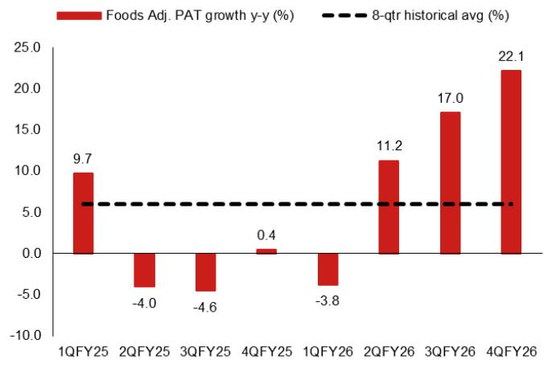

bar chart

| Quarter | Foods Adj. PAT growth y-y (%) |
| ------- | ----------------------------- |
| 1QFY25  | 9.7                           |
| 2QFY25  | -4.0                          |
| 3QFY25  | -4.6                          |
| 4QFY25  | 0.4                           |
| 1QFY26  | -3.8                          |
| 2QFY26  | 11.2                          |
| 3QFY26  | 17.0                          |
| 4QFY26  | 22.1                          |

Source: Company data, NOM

Fig. 23: Gross margin trend – Foods  
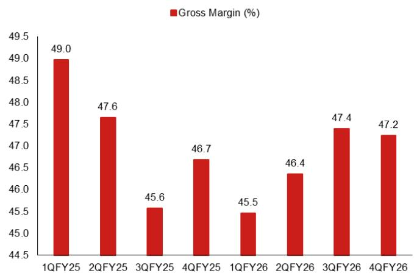

bar chart

| Quarter | Gross Margin (%) |
|---|---|
| 1QFY25 | 49.0 |
| 2QFY25 | 47.6 |
| 3QFY25 | 45.6 |
| 4QFY25 | 46.7 |
| 1QFY26 | 45.5 |
| 2QFY26 | 46.4 |
| 3QFY26 | 47.4 |
| 4QFY26 | 47.2 |

Source: Company data, NOM

Fig. 24: Gross margin expansion trend – Foods  
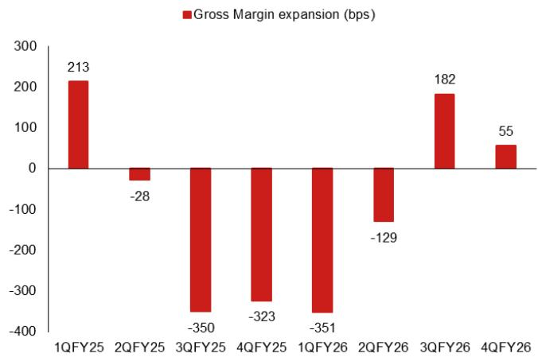

bar chart

Gross Margin expansion (bps)
| Quarter | Gross Margin expansion (bps) |
| :--- | :--- |
| 1QFY25 | 213 |
| 2QFY25 | -28 |
| 3QFY25 | -350 |
| 4QFY25 | -323 |
| 1QFY26 | -351 |
| 2QFY26 | -129 |
| 3QFY26 | 182 |
| 4QFY26 | 55 |

Source: Company data, NOM

Fig. 25: Operating margin trend – Foods  
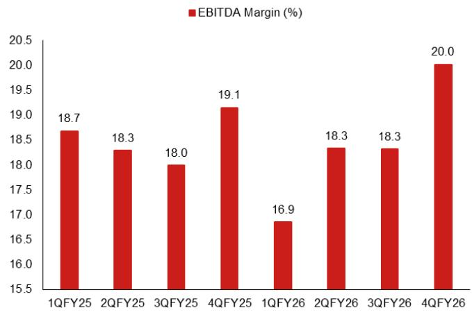

bar chart

| Quarter | EBITDA Margin (%) |
| :--- | :--- |
| 1QFY25 | 18.7 |
| 2QFY25 | 18.3 |
| 3QFY25 | 18.0 |
| 4QFY25 | 19.1 |
| 1QFY26 | 16.9 |
| 2QFY26 | 18.3 |
| 3QFY26 | 18.3 |
| 4QFY26 | 20.0 |

Source: Company data, NOM

Fig. 26: Operating margin expansion trend – Foods  
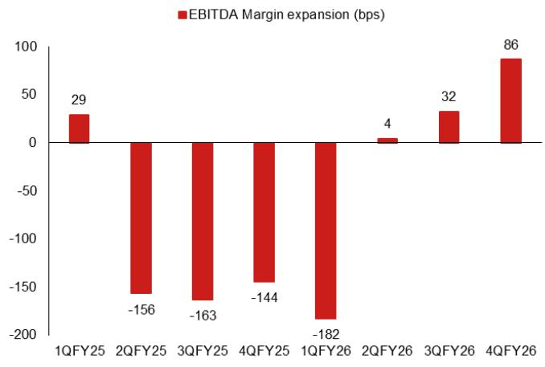

bar chart

EBITDA Margin expansion (bps)
| Quarter | EBITDA Margin expansion (bps) |
| :--- | :--- |
| 1QFY25 | 29 |
| 2QFY25 | -156 |
| 3QFY25 | -163 |
| 4QFY25 | -144 |
| 1QFY26 | -182 |
| 2QFY26 | 4 |
| 3QFY26 | 32 |
| 4QFY26 | 86 |

Source: Company data, NOM

## Home and personal care sector trends

Fig. 27: Volume growth trend (y-y) – HPC  
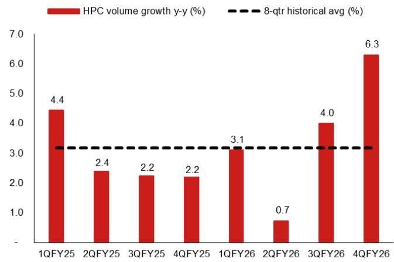

bar chart

| Quarter | HPC volume growth y-y (%) |
| ------- | ------------------------- |
| 1QFY25  | 4.4                       |
| 2QFY25  | 2.4                       |
| 3QFY25  | 2.2                       |
| 4QFY25  | 2.2                       |
| 1QFY26  | 3.1                       |
| 2QFY26  | 0.7                       |
| 3QFY26  | 4.0                       |
| 4QFY26  | 6.3                       |

Note: Includes HUVR, GCPL, MRCO, DABUR, CLGT  
Source: Company data, NOM

Fig. 28: Price + mix growth trend (y-y) - HPC  
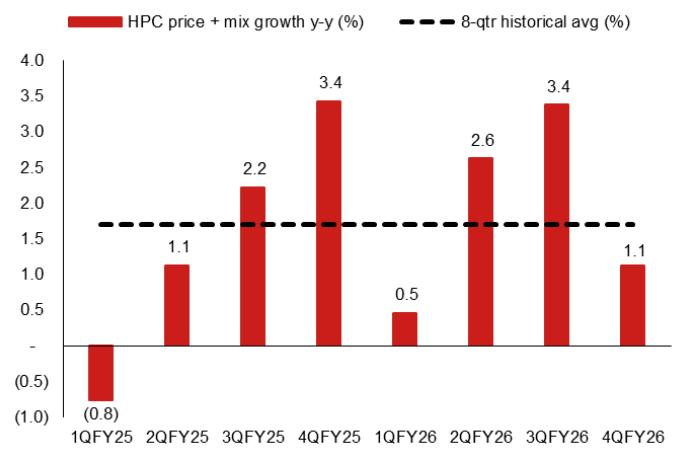

bar chart

| Quarter | HPC price + mix growth y-y (%) |
| :--- | :--- |
| 1QFY25 | -0.8 |
| 2QFY25 | 1.1 |
| 3QFY25 | 2.2 |
| 4QFY25 | 3.4 |
| 1QFY26 | 0.5 |
| 2QFY26 | 2.6 |
| 3QFY26 | 3.4 |
| 4QFY26 | 1.1 |
8-qtr historical avg (%)

Source: Company data, NOM

Fig. 29: Revenue growth trend (y-y) – HPC  
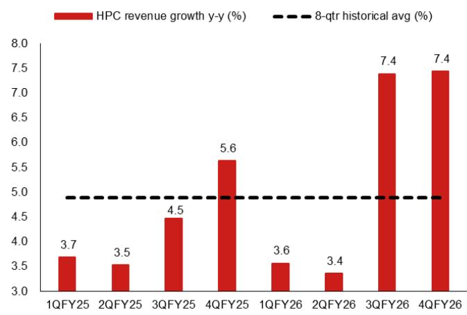

bar chart

| Quarter | HPC revenue growth y-y (%) |
| :--- | :--- |
| 1QFY25 | 3.7 |
| 2QFY25 | 3.5 |
| 3QFY25 | 4.5 |
| 4QFY25 | 5.6 |
| 1QFY26 | 3.6 |
| 2QFY26 | 3.4 |
| 3QFY26 | 7.4 |
| 4QFY26 | 7.4 |
8-qtr historical avg (%)

Note: Includes HUVR, GCPL, MRCO, DABUR, CLGT, HMN, BAJAJCONS  
Source: Company data, NOM

Fig. 30: Gross profit growth trend (y-y) – HPC  
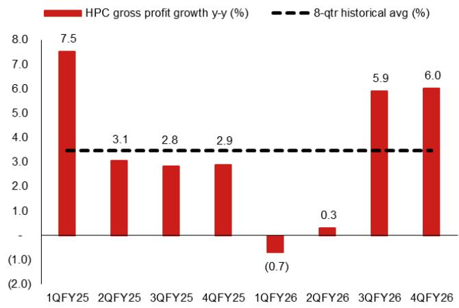

bar chart

| Quarter | HPC gross profit growth y-y (%) |
| :--- | :--- |
| 1QFY25 | 7.5 |
| 2QFY25 | 3.1 |
| 3QFY25 | 2.8 |
| 4QFY25 | 2.9 |
| 1QFY26 | (0.7) |
| 2QFY26 | 0.3 |
| 3QFY26 | 5.9 |
| 4QFY26 | 6.0 |
8-qtr historical avg (%)

Source: Company data, NOM

Fig. 31: Operating profit growth trend (y-y) – HPC  
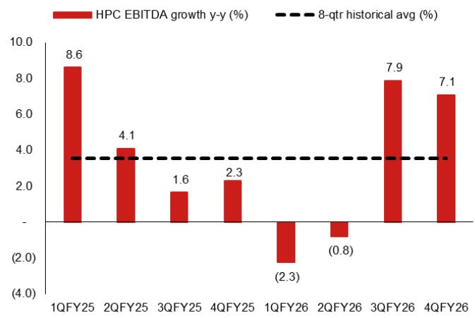

bar chart

| Quarter | HPC EBITDA growth y-y (%) |
| :--- | :--- |
| 1QFY25 | 8.6 |
| 2QFY25 | 4.1 |
| 3QFY25 | 1.6 |
| 4QFY25 | 2.3 |
| 1QFY26 | (2.3) |
| 2QFY26 | (0.8) |
| 3QFY26 | 7.9 |
| 4QFY26 | 7.1 |
8-qtr historical avg (%)

Source: Company data, NOM

Fig. 32: Adj. PAT growth trend (y-y) – HPC  
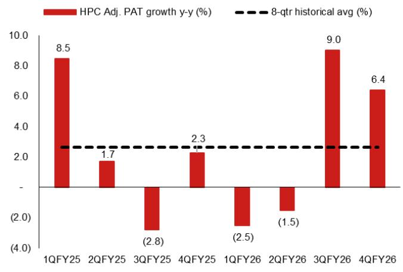

bar chart

| Quarter | HPC Adj. PAT growth y-y (%) |
| ------- | --------------------------- |
| 1QFY25  | 8.5                         |
| 2QFY25  | 1.7                         |
| 3QFY25  | (2.8)                       |
| 4QFY25  | 2.3                         |
| 1QFY26  | (2.5)                       |
| 2QFY26  | (1.5)                       |
| 3QFY26  | 9.0                         |
| 4QFY26  | 6.4                         |

Source: Company data, NOM

Fig. 33: Gross margin trend – HPC  
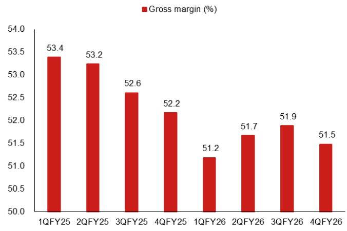

bar chart

| Quarter | Gross margin (%) |
|---|---|
| 1QFY25 | 53.4 |
| 2QFY25 | 53.2 |
| 3QFY25 | 52.6 |
| 4QFY25 | 52.2 |
| 1QFY26 | 51.2 |
| 2QFY26 | 51.7 |
| 3QFY26 | 51.9 |
| 4QFY26 | 51.5 |

Source: Company data, NOM

Fig. 34: Gross margin expansion trend – HPC  
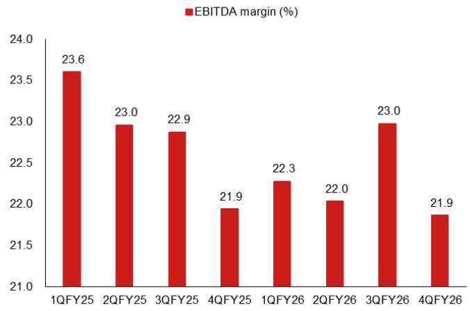

bar chart

EBITDA margin (%)
| Quarter | EBITDA margin (%) |
| :--- | :--- |
| 1QFY25 | 23.6 |
| 2QFY25 | 23.0 |
| 3QFY25 | 22.9 |
| 4QFY25 | 21.9 |
| 1QFY26 | 22.3 |
| 2QFY26 | 22.0 |
| 3QFY26 | 23.0 |
| 4QFY26 | 21.9 |

Source: Company data, NOM

Fig. 35: Operating margin trend – HPC  
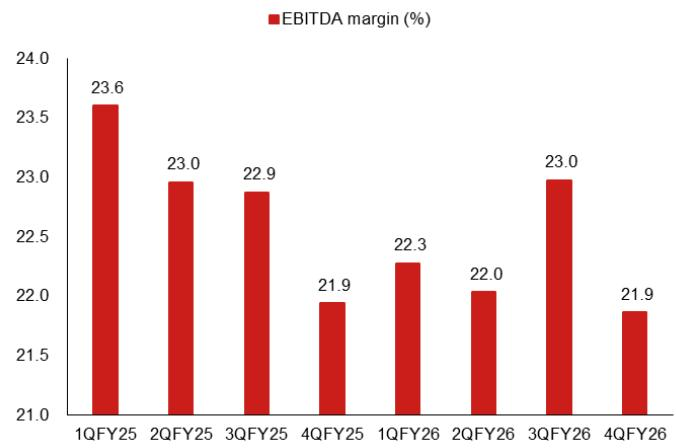

bar chart

| Quarter | EBITDA margin (%) |
| :--- | :--- |
| 1QFY25 | 23.6 |
| 2QFY25 | 23.0 |
| 3QFY25 | 22.9 |
| 4QFY25 | 21.9 |
| 1QFY26 | 22.3 |
| 2QFY26 | 22.0 |
| 3QFY26 | 23.0 |
| 4QFY26 | 21.9 |

Source: Company data, NOM

Fig. 36: Operating margin expansion trend – HPC  
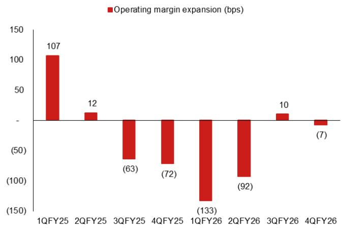

bar chart

Operating margin expansion (bps)
| Quarter | Operating margin expansion (bps) |
| :--- | :--- |
| 1QFY25 | 107 |
| 2QFY25 | 12 |
| 3QFY25 | -63 |
| 4QFY25 | -72 |
| 1QFY26 | -133 |
| 2QFY26 | -92 |
| 3QFY26 | 10 |
| 4QFY26 | -7 |

Source: Company data, NOM

Fig. 37: Foods - Category wise

<table><tr><td>Category</td><td>Companies</td><td>1QFY25</td><td>2QFY25</td><td>3QFY25</td><td>4QFY25</td><td>1QFY26</td><td>2QFY26</td><td>3QFY26</td><td>4QFY26</td></tr><tr><td rowspan="5">Biscuits</td><td>Value growth (%)</td><td>1QFY25</td><td>2QFY25</td><td>3QFY25</td><td>4QFY25</td><td>1QFY26</td><td>2QFY26</td><td>3QFY26</td><td>4QFY26</td></tr><tr><td>Britannia</td><td>6.0</td><td>5.3</td><td>7.9</td><td>8.9</td><td>8.8</td><td>3.7</td><td>7.2</td><td>6.5</td></tr><tr><td>Patanjali</td><td></td><td></td><td></td><td></td><td>8.2</td><td>13.9</td><td>26.0</td><td>12.1</td></tr><tr><td>Mrs. Bectors</td><td></td><td></td><td></td><td></td><td>2.9</td><td>9.4</td><td>5.5</td><td>8.2</td></tr><tr><td>ITC (Sunleast)</td><td>Resilient performance</td><td>Resilient performance</td><td>Strengthened portfolio</td><td>Strengthened portfolio</td><td>Strong performance</td><td>Resilient performance</td><td>Robust growth</td><td>Strong performance</td></tr><tr><td rowspan="3">Noodles</td><td>Value growth (%)</td><td>1QFY25</td><td>2QFY25</td><td>3QFY25</td><td>4QFY25</td><td>1QFY26</td><td>2QFY26</td><td>3QFY26</td><td>4QFY26</td></tr><tr><td>ITC (Yippee)</td><td>Sustained #2 position</td><td>Sustained #2 position</td><td>Sustained #2 position</td><td>Sustained #2 position</td><td>Marked improvement in growth trajectory</td><td>Strengthened portfolio</td><td>Strong growth</td><td>Strong growth</td></tr><tr><td>Nestle (Maggi)</td><td></td><td></td><td>Volume-led high-single-digit growth</td><td>Volume-led mid-single-digit growth</td><td>Volume-led double-digit growth</td><td>Volume-led double-digit growth</td><td>Volume-led double-digit growth</td><td>Strong volume-led growth</td></tr><tr><td rowspan="9">Tea</td><td>Volume growth (%)</td><td>1QFY25</td><td>2QFY25</td><td>3QFY25</td><td>4QFY25</td><td>1QFY26</td><td>2QFY26</td><td>3QFY26</td><td>4QFY26</td></tr><tr><td>Tata Consumer</td><td>0.0</td><td>-4.0</td><td>7.0</td><td>2.0</td><td>1.0</td><td>5.0</td><td>3.0</td><td>4.0</td></tr><tr><td>Hindustan Unilever</td><td></td><td></td><td></td><td></td><td></td><td>Price + Vol</td><td>MSD</td><td>LSD</td></tr><tr><td>Pricing growth (%)</td><td>1QFY25</td><td>2QFY25</td><td>3QFY25</td><td>4QFY25</td><td>1QFY26</td><td>2QFY26</td><td>3QFY26</td><td>4QFY26</td></tr><tr><td>Tata Consumer</td><td>-1.0</td><td>0.0</td><td>3.1</td><td>7.8</td><td>11.4</td><td>7.2</td><td>-0.2</td><td>-4.8</td></tr><tr><td>Hindustan Unilever</td><td></td><td></td><td>Pricing led</td><td></td><td></td><td>Price + Vol</td><td></td><td></td></tr><tr><td>Value growth (%)</td><td>1QFY25</td><td>2QFY25</td><td>3QFY25</td><td>4QFY25</td><td>1QFY26</td><td>2QFY26</td><td>3QFY26</td><td>4QFY26</td></tr><tr><td>Tata Consumer</td><td>-0.9</td><td>-3.5</td><td>10.1</td><td>9.8</td><td>12.4</td><td>12.2</td><td>2.8</td><td>-0.8</td></tr><tr><td>Hindustan Unilever</td><td></td><td></td><td>LSD</td><td>LSD</td><td>HSD</td><td>HSD</td><td>LSD</td><td></td></tr><tr><td rowspan="4">Coffee</td><td>Value growth (%)</td><td>1QFY25</td><td>2QFY25</td><td>3QFY25</td><td>4QFY25</td><td>1QFY26</td><td>2QFY26</td><td>3QFY26</td><td>4QFY26</td></tr><tr><td>Nestle</td><td>Robust DD</td><td>High DD</td><td>High DD</td><td>High DD</td><td>Strong DD</td><td>High DD</td><td>DD</td><td>DD</td></tr><tr><td>Hindustan Unilever</td><td>DD</td><td>DD</td><td>DD</td><td>DD</td><td>DD</td><td>DD</td><td>DD</td><td>DD</td></tr><tr><td>Tata Consumer</td><td>28.0</td><td>29.0</td><td>28.0</td><td>44.0</td><td>67.0</td><td>56.0</td><td>40.0</td><td>20.0</td></tr><tr><td rowspan="5">Spices</td><td>Value growth (%)</td><td>1QFY25</td><td>2QFY25</td><td>3QFY25</td><td>4QFY25</td><td>1QFY26</td><td>2QFY26</td><td>3QFY26</td><td>4QFY26</td></tr><tr><td>Tata Consumer (Sampann)</td><td>37.0</td><td>26.0</td><td>23.0</td><td>30.0</td><td>27.0</td><td>40.0</td><td>45.0</td><td>69.0</td></tr><tr><td>Dabur (Badshah)</td><td>15.0</td><td>15.0</td><td>15.5</td><td>6.0</td><td>6.5</td><td>-3.6</td><td>7.0</td><td>12.0</td></tr><tr><td>ITC (Sunrise)</td><td>Robust growth</td><td>Strong growth</td><td>Strong growth</td><td>Strong growth</td><td>Robust growth</td><td>Strengthened market standing</td><td>Strengthened portfolio</td><td>Robust growth</td></tr><tr><td>Orkla (MTR)</td><td></td><td></td><td></td><td></td><td></td><td>0.1</td><td>3.1</td><td>6.1</td></tr><tr><td rowspan="4">Edible Oils</td><td>Value growth (%)</td><td>1QFY25</td><td>2QFY25</td><td>3QFY25</td><td>4QFY25</td><td>1QFY26</td><td>2QFY26</td><td>3QFY26</td><td>4QFY26</td></tr><tr><td>AWL</td><td></td><td></td><td></td><td></td><td>26.0</td><td>26.0</td><td>12.4</td><td>18.6</td></tr><tr><td>Marico (Saffola)</td><td>-1.0</td><td>2.0</td><td>24.0</td><td>26.0</td><td>28.0</td><td>19.0</td><td>0.0</td><td>8.0</td></tr><tr><td>Patanjali</td><td></td><td></td><td></td><td></td><td>0.0</td><td>0.0</td><td>0.0</td><td>0.0</td></tr><tr><td rowspan="4">Snacks</td><td>Value growth (%)</td><td>1QFY25</td><td>2QFY25</td><td>3QFY25</td><td>4QFY25</td><td>1QFY26</td><td>2QFY26</td><td>3QFY26</td><td>4QFY26</td></tr><tr><td>Bikaji</td><td></td><td></td><td></td><td>-0.1</td><td>14.2</td><td>15.2</td><td>10.5</td><td>17.5</td></tr><tr><td>ITC (Bingo)</td><td>Resilient performance</td><td>Robust performance</td><td>Resilient performance</td><td>Resilient performance</td><td>Strengthened portfolio</td><td>Strengthen product portfolio</td><td>New launches gained customer traction</td><td>Resilient performance</td></tr><tr><td>Gopal Snacks</td><td></td><td></td><td></td><td>-11.5</td><td>-9.1</td><td>-6.7</td><td>1.8</td><td>29.0</td></tr><tr><td rowspan="4">Juices</td><td>Value growth (%)</td><td>1QFY25</td><td>2QFY25</td><td>3QFY25</td><td>4QFY25</td><td>1QFY26</td><td>2QFY26</td><td>3QFY26</td><td>4QFY26</td></tr><tr><td>Dabur</td><td>2.8</td><td>-23.6</td><td>-10.3</td><td>-9.2</td><td>-15.5</td><td>0.4</td><td>-3.65</td><td>0.9</td></tr><tr><td>Varun Beverages</td><td>39.1</td><td>2.7</td><td>0.0</td><td>22.2</td><td>-12.5</td><td>6.2</td><td>25.0</td><td>22.7</td></tr><tr><td>ITC</td><td></td><td></td><td></td><td></td><td></td><td></td><td></td><td></td></tr><tr><td rowspan="3">Chocolates</td><td>Value growth (%)</td><td>1QFY25</td><td>2QFY25</td><td>3QFY25</td><td>4QFY25</td><td>1QFY26</td><td>2QFY26</td><td>3QFY26</td><td>4QFY26</td></tr><tr><td>Nestle</td><td>DD in Kitkat</td><td>HSD in Kitkat</td><td>HSD</td><td>Volume-led HSD</td><td>Volume-led DD</td><td>Volume-led DD</td><td>Strong volume-led DD</td><td>High DD</td></tr><tr><td>ITC</td><td></td><td></td><td></td><td></td><td></td><td></td><td></td><td></td></tr><tr><td rowspan="2">Aerated Drinks</td><td>Volume growth (%)</td><td>1QFY25</td><td>2QFY25</td><td>3QFY25</td><td>4QFY25</td><td>1QFY26</td><td>2QFY26</td><td>3QFY26</td><td>4QFY26</td></tr><tr><td>Varun Beverages (CSD)</td><td>32.3</td><td>25.8</td><td>49.1</td><td>38.5</td><td>-5.2</td><td>1.0</td><td>7.6</td><td>14.5</td></tr><tr><td rowspan="6">Packaged Water</td><td>Volume growth (%)</td><td>1QFY25</td><td>2QFY25</td><td>3QFY25</td><td>4QFY25</td><td>1QFY26</td><td>2QFY26</td><td>3QFY26</td><td>4QFY26</td></tr><tr><td>Tata Consumer (Nourishco)</td><td></td><td></td><td></td><td></td><td>3.0</td><td>31.0</td><td>27.0</td><td>28.0</td></tr><tr><td>Varun Beverages</td><td>6.8</td><td>12.0</td><td>16.7</td><td>5.7</td><td>12.7</td><td>7.1</td><td>16.3</td><td>21.4</td></tr><tr><td>Value growth (%)</td><td>1QFY25</td><td>2QFY25</td><td>3QFY25</td><td>4QFY25</td><td>1QFY26</td><td>2QFY26</td><td>3QFY26</td><td>4QFY26</td></tr><tr><td>Tata Consumer (Nourishco)</td><td>6.1</td><td>-10.5</td><td>-0.6</td><td>3.9</td><td>-12.9</td><td>24.7</td><td>25.9</td><td>22.6</td></tr><tr><td>Varun Beverages</td><td></td><td></td><td></td><td></td><td></td><td></td><td></td><td></td></tr><tr><td rowspan="3">Healthcare</td><td>Value growth (%)</td><td>1QFY25</td><td>2QFY25</td><td>3QFY25</td><td>4QFY25</td><td>1QFY26</td><td>2QFY26</td><td>3QFY26</td><td>4QFY26</td></tr><tr><td>Dabur</td><td>7.2</td><td>-9.8</td><td>-1.2</td><td>-4.6</td><td>-4.4</td><td>1.3</td><td>2.7</td><td>2.2</td></tr><tr><td>Emami</td><td>11.0</td><td>11.0</td><td>13.0</td><td>13.0</td><td>4.0</td><td>1.0</td><td>7.0</td><td>7.0</td></tr><tr><td rowspan="4">Other Foods</td><td>Value growth (%)</td><td>1QFY25</td><td>2QFY25</td><td>3QFY25</td><td>4QFY25</td><td>1QFY26</td><td>2QFY26</td><td>3QFY26</td><td>4QFY26</td></tr><tr><td>Dabur</td><td>21.3</td><td>8.4</td><td>30.0</td><td>14.2</td><td>1.8</td><td>12.0</td><td>14.0</td><td>30.0</td></tr><tr><td>Marico</td><td>37.0</td><td>28.0</td><td>31.0</td><td>44.0</td><td>20.0</td><td>12.0</td><td>5.0</td><td>16.0</td></tr><tr><td>Hindustan Unilever</td><td></td><td></td><td>MSD</td><td>MSD</td><td>MSD</td><td>Muted due to GST</td><td>HSD</td><td>MSD</td></tr><tr><td rowspan="3">Wheat flour (Aata)</td><td>Value growth (%)</td><td>1QFY25</td><td>2QFY25</td><td>3QFY25</td><td>4QFY25</td><td>1QFY26</td><td>2QFY26</td><td>3QFY26</td><td>4QFY26</td></tr><tr><td>ITC (Aashirvaad)</td><td>Strong growth</td><td>Robust growth</td><td>Robust growth</td><td>Robust growth on an elevated base</td><td>Robust growth</td><td>Robust growth</td><td>Strong growth</td><td>Sustained strong growth</td></tr><tr><td>AWL (Fortune) - FMCG &amp; Foods</td><td></td><td></td><td></td><td></td><td>-7.8</td><td>-2.2</td><td>5.7</td><td>18.2</td></tr><tr><td rowspan="4">Honey</td><td>Value growth (%)</td><td>1QFY25</td><td>2QFY25</td><td>3QFY25</td><td>4QFY25</td><td>1QFY26</td><td>2QFY26</td><td>3QFY26</td><td>4QFY26</td></tr><tr><td>Dabur</td><td></td><td>Grew ahead of category</td><td>Soft</td><td>Impacted</td><td>11</td><td>High twenties</td><td>10.0</td><td>Twenties</td></tr><tr><td>Marico</td><td></td><td></td><td></td><td></td><td></td><td></td><td></td><td></td></tr><tr><td>Emami</td><td></td><td></td><td></td><td></td><td></td><td></td><td></td><td></td></tr><tr><td rowspan="4">Malted Food Drinks</td><td>Value growth (%)</td><td>1QFY25</td><td>2QFY25</td><td>3QFY25</td><td>4QFY25</td><td>1QFY26</td><td>2QFY26</td><td>3QFY26</td><td>4QFY26</td></tr><tr><td>Hindustan Unilever (Horlicks)</td><td>Subdued</td><td></td><td>declined</td><td></td><td>Seq improvement</td><td>Declined</td><td>HSD</td><td>DD</td></tr><tr><td>Category growth</td><td>Signs of revival</td><td>Signs of revival</td><td>0.9</td><td></td><td>-2.6</td><td>-3.2</td><td>-4.2</td><td>-4.8</td></tr><tr><td>Zydus Wellness (Complan)</td><td>4.3% market share</td><td>Positive</td><td>4.1% market share</td><td></td><td></td><td>4.1% market share</td><td></td><td>DD (4.1% market share)</td></tr><tr><td rowspan="3">Salt</td><td>Value growth (%)</td><td>1QFY25</td><td>2QFY25</td><td>3QFY25</td><td>4QFY25</td><td>1QFY26</td><td>2QFY26</td><td>3QFY26</td><td>4QFY26</td></tr><tr><td>Tata Consumer (Tata Salt)</td><td>9.0</td><td>2.0</td><td>7.0</td><td>13.0</td><td>13.0</td><td>16.0</td><td>14.0</td><td>14.0</td></tr><tr><td>ITC (Aashirvaad Salt)</td><td>Robust growth</td><td>Robust growth</td><td></td><td></td><td>Robust growth in focus markets</td><td>Robust growth in focus markets</td><td>Robust growth in focus markets</td><td>Strong growth in focus markets</td></tr><tr><td rowspan="2">Pulses</td><td>Value growth (%)</td><td>1QFY25</td><td>2QFY25</td><td>3QFY25</td><td>4QFY25</td><td>1QFY26</td><td>2QFY26</td><td>3QFY26</td><td>4QFY26</td></tr><tr><td>Tata Consumer</td><td>37.0</td><td>26.0</td><td>23.0</td><td>30.0</td><td>27.0</td><td>40.0</td><td>45.0</td><td>69.0</td></tr></table>

Source: Company data, NOM

Fig. 38: Personal Care - Category wise

<table><tr><td>Category</td><td>Companies</td><td>1QFY25</td><td>2QFY25</td><td>3QFY25</td><td>4QFY25</td><td>1QFY26</td><td>2QFY26</td><td>3QFY26</td><td>4QFY26</td></tr><tr><td rowspan="8">Fabric Wash (Detergents)</td><td>Volume growth (%)</td><td></td><td></td><td></td><td></td><td></td><td></td><td></td><td></td></tr><tr><td>Hindustan Unilever</td><td>HSD</td><td>HSD</td><td>HSD</td><td>MSD</td><td>MSD</td><td>MSD</td><td>MSD</td><td></td></tr><tr><td>Jyothy Labs</td><td></td><td></td><td></td><td></td><td></td><td></td><td></td><td></td></tr><tr><td>Godrej Consumer</td><td>Strong DD</td><td>Strong DD</td><td>Strong DD</td><td>Strong DD</td><td>Strong DD</td><td></td><td></td><td></td></tr><tr><td>Value growth (%)</td><td></td><td></td><td></td><td></td><td></td><td></td><td></td><td></td></tr><tr><td>Hindustan Unilever</td><td></td><td></td><td></td><td></td><td></td><td></td><td></td><td>DD</td></tr><tr><td>Jyothy Labs</td><td>8.8</td><td>0.1</td><td>9.3</td><td>2.1</td><td>3.3</td><td>6.1</td><td>9.2</td><td>14.4</td></tr><tr><td>Godrej Consumer</td><td>Strong performance</td><td>Robust performance</td><td>Strong performance</td><td></td><td>Solid performance</td><td>Strong performance</td><td>Robust growth momentum</td><td>Robust DD</td></tr><tr><td rowspan="6">Dishwash</td><td>Volume growth (%)</td><td></td><td></td><td></td><td></td><td></td><td></td><td></td><td></td></tr><tr><td>Hindustan Unilever</td><td>MSD</td><td>HSD</td><td>HSD</td><td>HSD</td><td>DD</td><td>DD</td><td>DD</td><td>DD</td></tr><tr><td>Jyothy Labs</td><td></td><td></td><td></td><td></td><td></td><td></td><td></td><td></td></tr><tr><td>Value growth (%)</td><td></td><td></td><td></td><td></td><td></td><td></td><td></td><td></td></tr><tr><td>Hindustan Unilever</td><td></td><td></td><td></td><td></td><td></td><td></td><td></td><td></td></tr><tr><td>Jyothy Labs</td><td>7.1</td><td>1.3</td><td>3.6</td><td>3.1</td><td>0.1</td><td>-3.8</td><td>-1.3</td><td>0.1</td></tr><tr><td rowspan="8">Skin cleansing</td><td>Volume growth (%)</td><td></td><td></td><td></td><td></td><td></td><td></td><td></td><td></td></tr><tr><td>Hindustan Unilever</td><td>LSD</td><td>Declined</td><td></td><td></td><td></td><td></td><td></td><td></td></tr><tr><td>Jyothy Labs</td><td></td><td></td><td></td><td></td><td></td><td></td><td></td><td></td></tr><tr><td>Godrej Consumer</td><td>LSD</td><td>Flattish</td><td>MSD decline</td><td>MSD decline</td><td></td><td></td><td></td><td></td></tr><tr><td>Value growth (%)</td><td></td><td></td><td></td><td></td><td></td><td></td><td></td><td></td></tr><tr><td>Hindustan Unilever</td><td>Declined</td><td>Declined</td><td></td><td>LSD</td><td>MSD</td><td>Flat due to GST</td><td>MSD</td><td>HSD</td></tr><tr><td>Jyothy Labs</td><td>10.9</td><td>-4.5</td><td>-3.7</td><td>-8.8</td><td>0.7</td><td>-4.3</td><td>10.9</td><td>20.1</td></tr><tr><td>Godrej Consumer</td><td>Steady performance</td><td>Impacted</td><td></td><td></td><td>Flattish</td><td>Most impacted by GST</td><td>Positive trajectory led by GST</td><td>Positive trajectory led by GST</td></tr><tr><td rowspan="5">Oral care</td><td>Value growth (%)</td><td></td><td></td><td></td><td></td><td></td><td></td><td></td><td></td></tr><tr><td>Hindustan Unilever</td><td>MSD</td><td>HSD</td><td>MSD</td><td>LSD</td><td>MSD</td><td>Marginal decline due to GST</td><td>DD</td><td>LSD</td></tr><tr><td>Dabur</td><td>11.4</td><td>-8.0</td><td>9.1</td><td>-5.2</td><td>5.4</td><td>13.0</td><td>8.5</td><td>6.5</td></tr><tr><td>Colgate</td><td>13.1</td><td>10.1</td><td>4.7</td><td>-1.8</td><td>-4.2</td><td>-6.2</td><td>1.7</td><td>9.1</td></tr><tr><td>Patanjali</td><td></td><td></td><td></td><td></td><td></td><td></td><td></td><td></td></tr><tr><td rowspan="13">Hair oil</td><td>Volume growth (%)</td><td></td><td></td><td></td><td></td><td></td><td></td><td></td><td></td></tr><tr><td>Marico (Parachute)</td><td>2.0</td><td>4.0</td><td>3.0</td><td>-1.0</td><td>-1.0</td><td>-3.0</td><td>-1.0</td><td>-1.0</td></tr><tr><td>Marico (VAHO)</td><td></td><td></td><td></td><td></td><td></td><td></td><td></td><td></td></tr><tr><td>Bajaj Consumer</td><td></td><td></td><td></td><td></td><td>0.0</td><td>0.0</td><td>DD</td><td>MSD(Near DD after ml-age adjustments)</td></tr><tr><td>Value growth (%)</td><td></td><td></td><td></td><td></td><td></td><td></td><td></td><td></td></tr><tr><td>Marico (Parachute)</td><td>6.0</td><td>10.0</td><td>15.0</td><td>22.0</td><td>31.0</td><td>59.0</td><td>50.0</td><td>29.0</td></tr><tr><td>Marico (VAHO)</td><td>-5.0</td><td>-8.0</td><td>-2.0</td><td>1.0</td><td>13.0</td><td>16.0</td><td>29.0</td><td>26.0</td></tr><tr><td>Bajaj Consumer (ADHO)</td><td></td><td>LSD Decline</td><td>LSD Decline</td><td>3.0</td><td>4.0</td><td>DD</td><td>Strong growth</td><td>Strong growth</td></tr><tr><td>Bajaj Consumer (Bajaj Coconut)</td><td>Robust growth</td><td>Strong growth</td><td></td><td>19.0</td><td>20.0</td><td>LSD</td><td>HSD</td><td></td></tr><tr><td>Dabur</td><td>3.3</td><td>-11.0</td><td>3.1</td><td>-6.5</td><td>2.4</td><td>5.5</td><td>19.1</td><td>28.0</td></tr><tr><td>Emami (Kesh King range)</td><td>-15.0</td><td>-9.0</td><td>-10.0</td><td>-1.0</td><td>-5.0</td><td>-23.0</td><td>10.0</td><td>14.0</td></tr><tr><td>Emami (Navratna)</td><td>27.0</td><td>10.0</td><td>3.0</td><td>16.0</td><td>-5.0</td><td>-33.0</td><td>1.0</td><td>-21.0</td></tr><tr><td>Emami (7 Oils in One)</td><td>9.0</td><td>-3.0</td><td>0.0</td><td>0.0</td><td>0.0</td><td>-12.0</td><td>41.0</td><td>34.0</td></tr><tr><td rowspan="3">Shampoo</td><td>Value growth (%)</td><td></td><td></td><td></td><td></td><td></td><td></td><td></td><td></td></tr><tr><td>Hindustan Unilever</td><td></td><td>HSD</td><td></td><td>DD</td><td>MSD</td><td>Decline due to GST</td><td>DD</td><td>DD</td></tr><tr><td>Dabur</td><td>13.7</td><td>-5.9</td><td>1.0</td><td>4.0</td><td>0.3</td><td>9.1</td><td>6.0</td><td>20.0</td></tr><tr><td rowspan="4">Skin care</td><td>Value growth (%)</td><td></td><td></td><td></td><td></td><td></td><td></td><td></td><td></td></tr><tr><td>Hindustan Unilever</td><td></td><td>MSD</td><td>Muted</td><td>LSD Decline</td><td>LSD</td><td>HSD</td><td></td><td></td></tr><tr><td>Dabur</td><td>6.1</td><td>-10.8</td><td>5.6</td><td>8.0</td><td>9.2</td><td>8.2</td><td>6.5</td><td>12.5</td></tr><tr><td>Emami (Boroplus)</td><td>4.0</td><td>2.0</td><td>20.0</td><td>27.0</td><td>-5.0</td><td>-30.0</td><td>16.0</td><td>-8.0</td></tr><tr><td rowspan="6">Household insecticides</td><td>Volume growth (%)</td><td></td><td></td><td></td><td></td><td></td><td></td><td></td><td></td></tr><tr><td>Godrej Consumer (Goodknight)</td><td>LSD</td><td>MSD</td><td></td><td></td><td>Strong HSDNon-mosquito - Strong DD UVG</td><td></td><td></td><td></td></tr><tr><td>Value growth (%)</td><td></td><td></td><td></td><td></td><td></td><td></td><td></td><td></td></tr><tr><td>Godrej Consumer (Goodknight)</td><td>Stable performance</td><td>Improved performance</td><td>Impacted</td><td>DD</td><td>Electrics - DDIncense sticks - 2.5x</td><td>Electrics - market share gainsIncense sticks - strong scale upNon-mosquito - solid growth</td><td>Electrics - market share gainsIncense sticks - strong scale upNon-mosquito - solid growth</td><td>Electrics - strong growthIncense sticks - strong scale upNon-mosquito - solid growth</td></tr><tr><td>Jyothy Labs (Maxo)</td><td>2.0</td><td>0.3</td><td>-24.8</td><td>-4.8</td><td>-9.7</td><td>-8.9</td><td>12.6</td><td>3.0</td></tr><tr><td>Dabur (Odomos)</td><td>Surpassed category growth</td><td></td><td>Muted due to category slowdown</td><td>Muted on high base</td><td>DD</td><td></td><td></td><td>Strong DD</td></tr><tr><td rowspan="6">Air freshner</td><td>Volume growth (%)</td><td></td><td></td><td></td><td></td><td></td><td></td><td></td><td></td></tr><tr><td>Godrej Consumer (Aer)</td><td>DD</td><td>Strong DD</td><td>DD</td><td>HSD</td><td></td><td></td><td></td><td></td></tr><tr><td>Dabur (Odonil)</td><td></td><td></td><td>DD</td><td></td><td></td><td></td><td></td><td></td></tr><tr><td>Value growth (%)</td><td></td><td></td><td></td><td></td><td></td><td></td><td></td><td></td></tr><tr><td>Godrej Consumer (Aer)</td><td>DD</td><td>DD</td><td>DD</td><td></td><td>Robust DD</td><td>Strong growth</td><td>Robust growth momentum</td><td>Strong DD growth</td></tr><tr><td>Dabur (Odonil)</td><td>Surpassed category growth</td><td></td><td></td><td>MSD</td><td>DD</td><td>DD</td><td>MSD</td><td>Mid-twenties</td></tr><tr><td rowspan="4">Perfumes and Deodrants</td><td>Volume growth (%)</td><td></td><td></td><td></td><td></td><td></td><td></td><td></td><td></td></tr><tr><td>Godrej Consumer (KS)</td><td></td><td>Strong DD</td><td></td><td></td><td></td><td></td><td></td><td></td></tr><tr><td>Value growth (%)</td><td></td><td></td><td></td><td></td><td></td><td></td><td></td><td></td></tr><tr><td>Godrej Consumer (KS)</td><td></td><td></td><td></td><td></td><td>Mid-teens</td><td>Strong growth</td><td>Steady performance</td><td>DD</td></tr><tr><td rowspan="3">Toilet Cleaner</td><td>Value growth (%)</td><td></td><td></td><td></td><td></td><td></td><td></td><td></td><td></td></tr><tr><td>Godrej Consumer (Spic)</td><td></td><td></td><td></td><td></td><td></td><td></td><td></td><td></td></tr><tr><td>Dabur (Sanifresh)</td><td></td><td></td><td>DD</td><td></td><td></td><td>HSD</td><td>HSD</td><td>Strong DD</td></tr><tr><td rowspan="3">Male grooming</td><td>Value growth (%)</td><td></td><td></td><td></td><td></td><td></td><td></td><td></td><td></td></tr><tr><td>Marico</td><td></td><td></td><td></td><td></td><td></td><td></td><td></td><td></td></tr><tr><td>Emami</td><td></td><td></td><td></td><td>7.0</td><td>-9.0</td><td>-9.0</td><td>4.0</td><td>34.0</td></tr></table>

Source: Company data, NOM

## 4Q26 company trends

Fig. 39: Results vs forecasts and Bloomberg consensus

<table><tr><td rowspan="2">Company</td><td colspan="3">NOM</td><td colspan="3">Bloomberg Consensus</td></tr><tr><td>Revenue</td><td>EBITDA</td><td>PAT</td><td>Revenue</td><td>EBITDA</td><td>PAT</td></tr><tr><td>Britannia</td><td></td><td></td><td></td><td></td><td></td><td></td></tr><tr><td>Colgate</td><td></td><td></td><td></td><td></td><td></td><td></td></tr><tr><td>Dabur</td><td></td><td></td><td></td><td></td><td></td><td></td></tr><tr><td>EPL</td><td></td><td></td><td></td><td></td><td></td><td></td></tr><tr><td>Godrej Consumer</td><td></td><td></td><td></td><td></td><td></td><td></td></tr><tr><td>HUL</td><td></td><td></td><td></td><td></td><td></td><td></td></tr><tr><td>Marico</td><td></td><td></td><td></td><td></td><td></td><td></td></tr><tr><td>Nestle</td><td></td><td></td><td></td><td></td><td></td><td></td></tr><tr><td>Tata Consumer</td><td></td><td></td><td></td><td></td><td></td><td></td></tr></table>

  
Above expectations In line expectations Below expectations  
Source: Bloomberg Finance L.P., company data, NOM estimates

Fig. 40: 4Q26 – company volume growth (% y-y)  
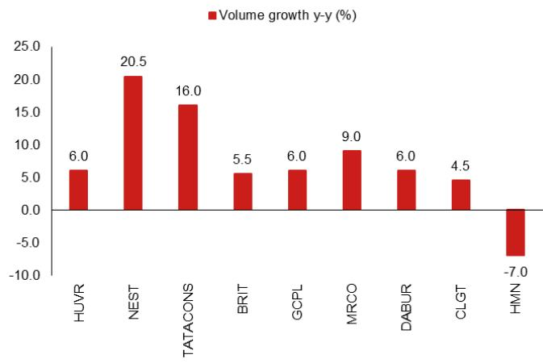

bar chart

| Company | Volume growth y-y (%) |
| :--- | :--- |
| HUVR | 6.0 |
| NEST | 20.5 |
| TATACONS | 16.0 |
| BRIT | 5.5 |
| GCPL | 6.0 |
| MRCO | 9.0 |
| DABUR | 6.0 |
| CLGT | 4.5 |
| HMN | -7.0 |

Source: Company data, NOM

Fig. 41: Volume growth (% y-y) trends

<table><tr><td>Volume growth (%)</td><td>4QFY25</td><td>1QFY26</td><td>2QFY26</td><td>3QFY26</td><td>4QFY26</td></tr><tr><td>Hindustan Unilever</td><td>2.0</td><td>4.0</td><td>0.0</td><td>4.0</td><td>6.0</td></tr><tr><td>Nestle</td><td>1.5</td><td>3.0</td><td>8.3</td><td>15.7</td><td>20.5</td></tr><tr><td>Tata Consumer</td><td>6.0</td><td>6.8</td><td>14.0</td><td>15.0</td><td>16.0</td></tr><tr><td>Britannia</td><td>3.5</td><td>2.0</td><td>-3.0</td><td>4.5</td><td>5.5</td></tr><tr><td>Godrej Consumer</td><td>6.0</td><td>8.0</td><td>3.0</td><td>7.0</td><td>6.0</td></tr><tr><td>Marico</td><td>7.0</td><td>9.0</td><td>7.0</td><td>8.0</td><td>9.0</td></tr><tr><td>Dabur</td><td>-4.0</td><td>-1.0</td><td>2.0</td><td>3.0</td><td>6.0</td></tr><tr><td>Colgate</td><td>0.0</td><td>-4.5</td><td>-8.4</td><td>-2.0</td><td>4.5</td></tr><tr><td>Emami</td><td>5.0</td><td>-3.0</td><td>-16.0</td><td>9.0</td><td>-7.0</td></tr><tr><td>Average (%)</td><td>2.7</td><td>3.8</td><td>2.6</td><td>7.0</td><td>9.0</td></tr></table>

Note: Staples volume growth is average of HUVR, NEST, TATACONS, BRIT, GCPL, MRCO, DABUR, CLGT  
Source: Company data, NOM

Fig. 42: 4Q26 – company revenue growth (% y-y)  
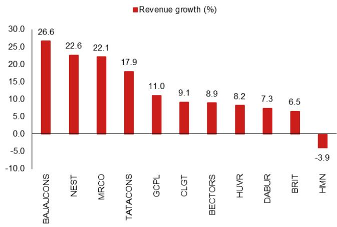

bar chart

| Company | Revenue growth (%) |
| :--- | :--- |
| BAJA CONS | 26.6 |
| NEST | 22.6 |
| MRCO | 22.1 |
| TATA CONS | 17.9 |
| GCPL | 11.0 |
| CLGT | 9.1 |
| BECTORS | 8.9 |
| HUVR | 8.2 |
| DABUR | 7.3 |
| BRIT | 6.5 |
| HMN | -3.9 |

Source: Company data, NOM

Fig. 43: Revenue growth (% y-y) trends

<table><tr><td>Revenue growth (%)</td><td>4QFY25</td><td>1QFY26</td><td>2QFY26</td><td>3QFY26</td><td>4QFY26</td></tr><tr><td>Hindustan Unilever</td><td>5.1</td><td>5.2</td><td>2.1</td><td>5.7</td><td>8.2</td></tr><tr><td>Nestle</td><td>4.5</td><td>5.9</td><td>10.6</td><td>18.6</td><td>22.6</td></tr><tr><td>Tata Consumer</td><td>17.3</td><td>9.8</td><td>17.8</td><td>15.0</td><td>17.9</td></tr><tr><td>Britannia</td><td>8.9</td><td>8.8</td><td>3.7</td><td>7.2</td><td>6.5</td></tr><tr><td>Godrej Consumer</td><td>3.8</td><td>9.7</td><td>3.9</td><td>9.3</td><td>11.0</td></tr><tr><td>Marico</td><td>19.8</td><td>23.3</td><td>30.7</td><td>26.6</td><td>22.1</td></tr><tr><td>Dabur</td><td>0.6</td><td>1.7</td><td>5.4</td><td>6.1</td><td>7.3</td></tr><tr><td>Colgate</td><td>-1.8</td><td>-4.2</td><td>-6.2</td><td>1.7</td><td>9.1</td></tr><tr><td>Emami</td><td>8.1</td><td>-0.2</td><td>-10.3</td><td>9.8</td><td>-3.9</td></tr><tr><td>Mrs. Bectors</td><td>9.8</td><td>7.6</td><td>11.1</td><td>8.4</td><td>8.9</td></tr><tr><td>Bajaj Consumer</td><td>3.2</td><td>4.4</td><td>7.2</td><td>25.1</td><td>26.6</td></tr></table>

Source: Company data, NOM

Fig. 44: 4Q26 – company price + mix growth (% y-y)  
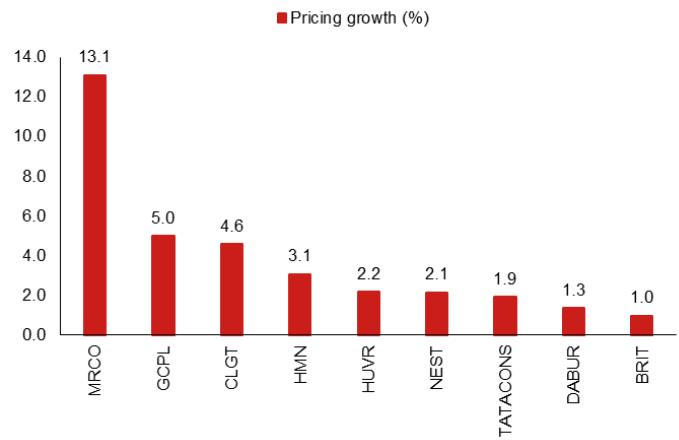

bar chart

| Company | Pricing growth (%) |
| :--- | :--- |
| MRCO | 13.1 |
| GCPL | 5.0 |
| CLGT | 4.6 |
| HMN | 3.1 |
| HUVR | 2.2 |
| NEST | 2.1 |
| TATACONS | 1.9 |
| DABUR | 1.3 |
| BRIT | 1.0 |

Source: Company data, NOM

Fig. 45: Price + mix growth (% y-y) trends

<table><tr><td>Pricing growth (%)</td><td>4QFY25</td><td>1QFY26</td><td>2QFY26</td><td>3QFY26</td><td>4QFY26</td></tr><tr><td>Marico</td><td>12.8</td><td>14.3</td><td>23.7</td><td>18.6</td><td>13.1</td></tr><tr><td>Godrej Consumer</td><td>-2.2</td><td>1.7</td><td>0.9</td><td>2.3</td><td>5.0</td></tr><tr><td>Colgate</td><td>-1.8</td><td>0.3</td><td>2.2</td><td>3.7</td><td>4.6</td></tr><tr><td>Hindustan Unilever</td><td>3.1</td><td>1.2</td><td>2.1</td><td>1.7</td><td>2.2</td></tr><tr><td>Nestle</td><td>3.0</td><td>2.9</td><td>2.3</td><td>2.9</td><td>2.1</td></tr><tr><td>Tata Consumer</td><td>11.3</td><td>3.0</td><td>3.8</td><td>0.0</td><td>1.9</td></tr><tr><td>Dabur</td><td>4.6</td><td>2.7</td><td>3.4</td><td>3.1</td><td>1.3</td></tr><tr><td>Britannia</td><td>5.4</td><td>6.8</td><td>6.7</td><td>2.7</td><td>1.0</td></tr><tr><td>Emami</td><td>3.1</td><td>2.8</td><td>5.7</td><td>0.8</td><td>3.1</td></tr></table>

Source: Company data, NOM

Fig. 46: 4Q26 – company-wise EBITDA growth  
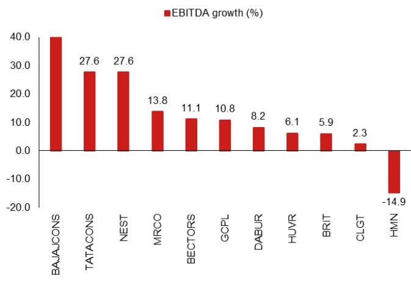

bar chart

| Company | EBITDA growth (%) |
| :--- | :--- |
| BAJAJCONS | 40.0 |
| TATACONS | 27.6 |
| NEST | 27.6 |
| MRCO | 13.8 |
| BECTORS | 11.1 |
| GCPL | 10.8 |
| DABUR | 8.2 |
| HUVR | 6.1 |
| BRIT | 5.9 |
| CLGT | 2.3 |
| HMN | -14.9 |

Source: Company data, NOM

Fig. 47: 4Q26 – company-wise adjusted PAT growth  
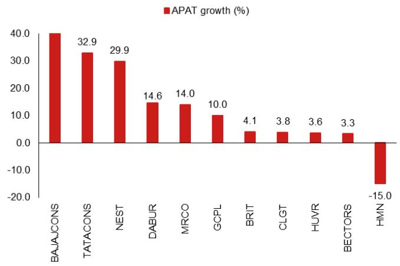

bar chart

| Company | APAT growth (%) |
| :--- | :--- |
| BAJA CONS | 40.0 |
| TATACONS | 32.9 |
| NEST | 29.9 |
| DABUR | 14.6 |
| MRCO | 14.0 |
| GCPL | 10.0 |
| BRIT | 4.1 |
| CLGT | 3.8 |
| HUVR | 3.6 |
| BECTORS | 3.3 |
| HMN | -15.0 |

Source: Company data, NOM

Fig. 48: 4Q26 – company-wise gross margins  
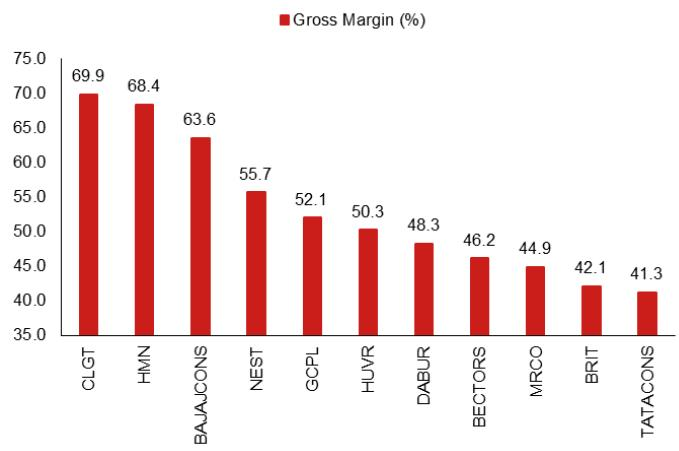

bar chart

| Company | Gross Margin (%) |
| :--- | :--- |
| CLGT | 69.9 |
| HMN | 68.4 |
| BAJAJCONS | 63.6 |
| NEST | 55.7 |
| GCPL | 52.1 |
| HUVR | 50.3 |
| DABUR | 48.3 |
| BECTORS | 46.2 |
| MRCO | 44.9 |
| BRIT | 42.1 |
| TATACONS | 41.3 |

Source: Company data, NOM

Fig. 49: 4Q26 – company-wise gross margin expansion  
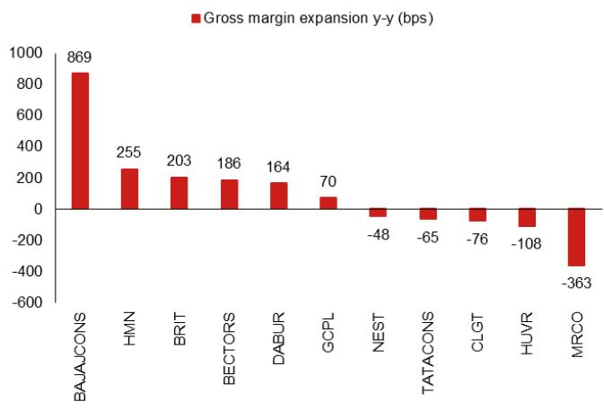

bar chart

Gross margin expansion y-y (bps)
| Company | Gross margin expansion y-y (bps) |
| :--- | :--- |
| BAJAJCONS | 869 |
| HMN | 255 |
| BRIT | 203 |
| BECTORS | 186 |
| DABUR | 164 |
| GCPL | 70 |
| NEST | -48 |
| TATACONS | -65 |
| CLGT | -76 |
| HUVR | -108 |
| MRCO | -363 |

Source: Company data, NOM

Fig. 50: 4Q26 – company-wise operating margins  
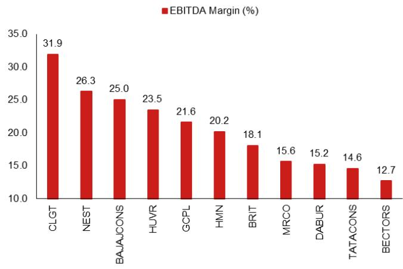

bar chart

| Company | EBITDA Margin (%) |
| :--- | :--- |
| CLGT | 31.9 |
| NEST | 26.3 |
| BAJAJCONS | 25.0 |
| HUVR | 23.5 |
| GCPL | 21.6 |
| HMN | 20.2 |
| BRIT | 18.1 |
| MRCO | 15.6 |
| DABUR | 15.2 |
| TATACONS | 14.6 |
| BECTORS | 12.7 |

Source: Company data, NOM

Fig. 51: 4Q26 – company-wise operating margin expansion  
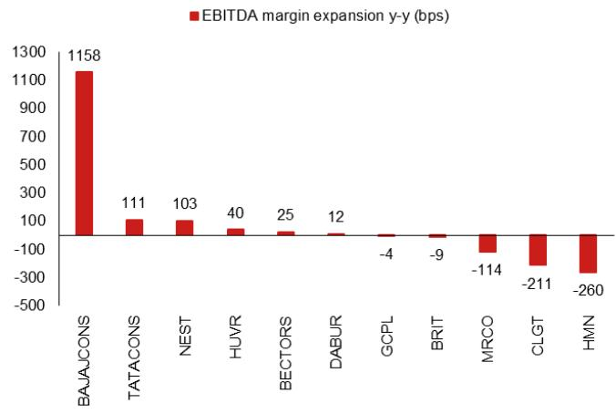

bar chart

EBITDA margin expansion y-y (bps)
| Company | EBITDA margin expansion y-y (bps) |
| :--- | :--- |
| BAJAJCONS | 1158 |
| TATACONS | 111 |
| NEST | 103 |
| HUVR | 40 |
| BECTORS | 25 |
| DABUR | 12 |
| GCPL | -4 |
| BRIT | -9 |
| MRCO | -114 |
| CLGT | -211 |
| HMN | -260 |

Source: Company data, NOM

Fig. 52: Gross margin (%) trends

<table><tr><td rowspan="2">Companies</td><td colspan="5">Gross Margin (%)</td></tr><tr><td>4QFY25</td><td>1QFY26</td><td>2QFY26</td><td>3QFY26</td><td>4QFY26</td></tr><tr><td>Hindustan Unilever</td><td>51.4</td><td>50.3</td><td>51.5</td><td>51.4</td><td>50.3</td></tr><tr><td>Nestle</td><td>56.2</td><td>55.2</td><td>54.3</td><td>55.8</td><td>55.7</td></tr><tr><td>Tata Consumer</td><td>41.9</td><td>40.1</td><td>42.1</td><td>42.8</td><td>41.3</td></tr><tr><td>Britannia</td><td>40.1</td><td>40.3</td><td>41.7</td><td>42.7</td><td>42.1</td></tr><tr><td>Godrej Consumer</td><td>51.4</td><td>50.7</td><td>50.6</td><td>51.7</td><td>52.1</td></tr><tr><td>Marico</td><td>48.6</td><td>46.9</td><td>42.6</td><td>43.5</td><td>44.9</td></tr><tr><td>Dabur</td><td>46.7</td><td>47.0</td><td>49.4</td><td>48.4</td><td>48.3</td></tr><tr><td>Colgate</td><td>70.6</td><td>68.9</td><td>69.5</td><td>70.0</td><td>69.9</td></tr><tr><td>Emami</td><td>65.9</td><td>69.4</td><td>71.0</td><td>70.6</td><td>68.4</td></tr><tr><td>Mrs. Bectors</td><td>44.3</td><td>45.6</td><td>44.2</td><td>45.0</td><td>46.2</td></tr><tr><td>Bajaj Consumer</td><td>54.9</td><td>57.8</td><td>59.9</td><td>59.8</td><td>63.6</td></tr></table>

Source: Company data, NOM

Fig. 53: Operating margin (%) trends

<table><tr><td rowspan="2">Companies</td><td colspan="5">EBITDA Margin (%)</td></tr><tr><td>4QFY25</td><td>1QFY26</td><td>2QFY26</td><td>3QFY26</td><td>4QFY26</td></tr><tr><td>Hindustan Unilever</td><td>23.1</td><td>23.1</td><td>23.8</td><td>23.7</td><td>23.5</td></tr><tr><td>Nestle</td><td>25.2</td><td>21.6</td><td>21.9</td><td>21.2</td><td>26.3</td></tr><tr><td>Tata Consumer</td><td>13.5</td><td>12.7</td><td>13.5</td><td>14.1</td><td>14.6</td></tr><tr><td>Britannia</td><td>18.2</td><td>16.4</td><td>19.7</td><td>20.0</td><td>18.1</td></tr><tr><td>Godrej Consumer</td><td>21.6</td><td>19.5</td><td>19.8</td><td>22.0</td><td>21.6</td></tr><tr><td>Marico</td><td>16.8</td><td>20.1</td><td>16.1</td><td>16.9</td><td>15.6</td></tr><tr><td>Dabur</td><td>15.1</td><td>19.6</td><td>18.4</td><td>20.6</td><td>15.2</td></tr><tr><td>Colgate</td><td>34.1</td><td>31.6</td><td>30.6</td><td>29.7</td><td>31.9</td></tr><tr><td>Emami</td><td>22.8</td><td>23.7</td><td>22.4</td><td>33.4</td><td>20.2</td></tr><tr><td>Mrs. Bectors</td><td>12.5</td><td>12.3</td><td>12.6</td><td>12.8</td><td>12.7</td></tr><tr><td>Bajaj Consumer</td><td>13.5</td><td>16.7</td><td>19.9</td><td>20.1</td><td>25.0</td></tr></table>

Source: Company data, NOM

Fig. 54: 4Q26 – company-wise ad spending growth (y-y)  
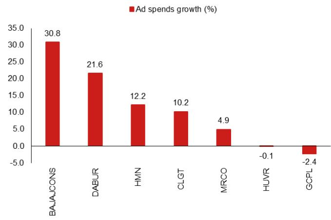

bar chart

| Company | Ad spends growth (%) |
| :--- | :--- |
| BAJA-CONS | 30.8 |
| DABUR | 21.6 |
| HMN | 12.2 |
| CLGT | 10.2 |
| MRCO | 4.9 |
| HUVR | -0.1 |
| GCPL | -2.4 |

Source: Company data, NOM

Fig. 55: 4Q26 – company-wise ad spending to sales  
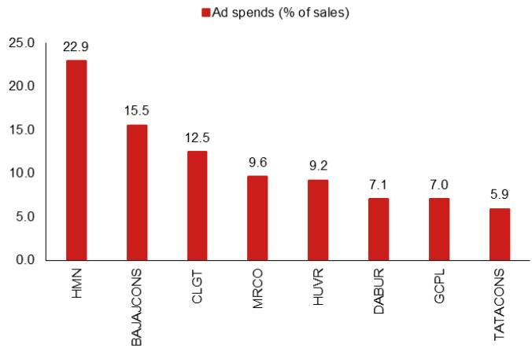

bar chart

| Company | Ad spends (% of sales) |
| :--- | :--- |
| HMN | 22.9 |
| BAJA/JONS | 15.5 |
| CLGT | 12.5 |
| MRCO | 9.6 |
| HUVR | 9.2 |
| DABUR | 7.1 |
| GCPL | 7.0 |
| TATACONS | 5.9 |

Source: Company data, NOM

Fig. 56: 4Q26 – company-wise other expenses growth (y-y)  
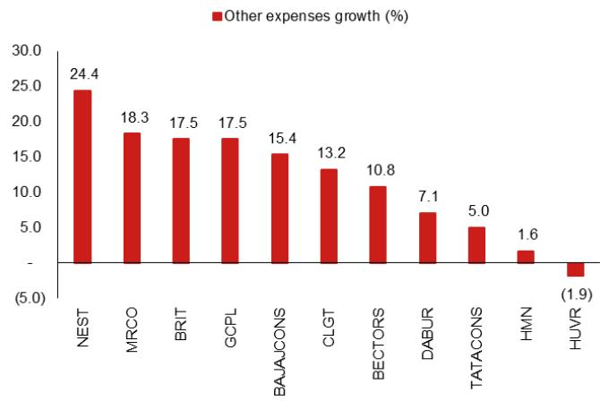

bar chart

| Company | Other expenses growth (%) |
| :--- | :--- |
| NEST | 24.4 |
| MRCO | 18.3 |
| BRIT | 17.5 |
| GCPL | 17.5 |
| BAJA-CONS | 15.4 |
| CLGT | 13.2 |
| BECTORS | 10.8 |
| DABUR | 7.1 |
| TATACONS | 5.0 |
| HMN | 1.6 |
| HUVR | -1.9 |

Source: Company data, NOM

Fig. 57: 4Q26 – company-wise other expenses to sales  
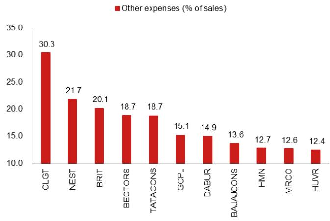

bar chart

| Company | Other expenses (% of sales) |
| :--- | :--- |
| CLGT | 30.3 |
| NEST | 21.7 |
| BRIT | 20.1 |
| BECTORS | 18.7 |
| TATACONS | 18.7 |
| GCPL | 15.1 |
| DABUR | 14.9 |
| BAJAJCONS | 13.6 |
| HMN | 12.7 |
| MRCO | 12.6 |
| HUVR | 12.4 |

Source: Company data, NOM

Fig. 58: 4Q26 – company-wise staff cost growth (y-y)  
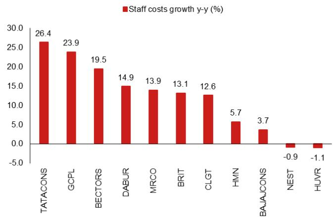

bar chart

Staff costs growth y-y (%)
| Company | Staff costs growth y-y (%) |
| :--- | :--- |
| TATACONS | 26.4 |
| GCPL | 23.9 |
| BECTORS | 19.5 |
| DABUR | 14.9 |
| MRCO | 13.9 |
| BRIT | 13.1 |
| CLGT | 12.6 |
| HMN | 5.7 |
| BAJAJCONS | 3.7 |
| NEST | -0.9 |
| HUVR | -1.1 |

Source: Company data, NOM

Fig. 59: 4Q26 – company-wise staff cost to sales  
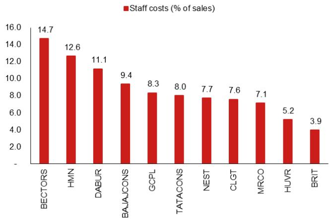

bar chart

| Company | Staff costs (% of sales) |
| :--- | :--- |
| BECTORS | 14.7 |
| HMN | 12.6 |
| DABUR | 11.1 |
| BAJA JONS | 9.4 |
| GCPL | 8.3 |
| TATACONS | 8.0 |
| NEST | 7.7 |
| CLGT | 7.6 |
| MRCO | 7.1 |
| HUVR | 5.2 |
| BRIT | 3.9 |

Source: Company data, NOM

Fig. 60: Retail network across companies  
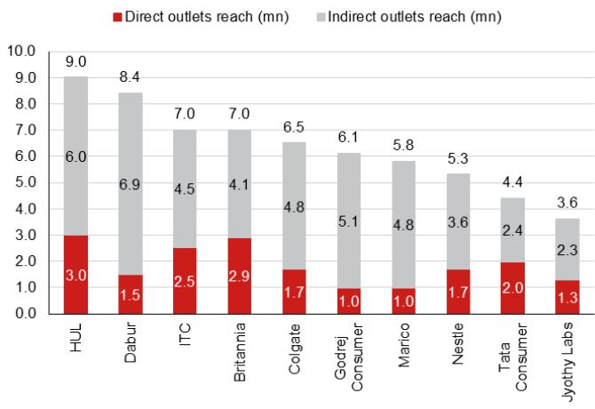

stacked bar chart

| Company | Direct outlets reach (mn) | Indirect outlets reach (mn) |
| :--- | :--- | :--- |
| HUL | 3.0 | 6.0 |
| Dabur | 1.5 | 6.9 |
| ITC | 2.5 | 4.5 |
| Britannia | 2.9 | 4.1 |
| Colgate | 1.7 | 4.8 |
| Godrej Consumer | 1.0 | 5.1 |
| Marico | 1.0 | 4.8 |
| Nestle | 1.7 | 3.6 |
| Tata Consumer | 2.0 | 2.4 |
| Jyothy Labs | 1.3 | 2.3 |
The chart displays the total values for each company (HUL, Dabur, ITC, Britannia, etc.) summing to 100. The red portion represents direct outlets reach (mn), and the gray portion represents indirect outlets reach (mn). The total height of the bars is labeled as HUL at 9.0.

Source: Company data, NOM

Fig. 61: Channel mix across companies  
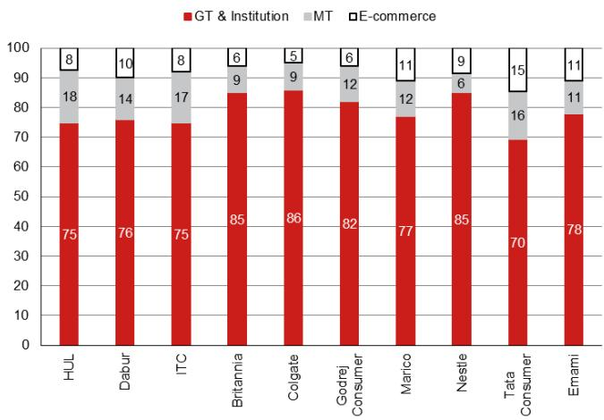

stacked bar chart

| Company | GT & Institution | MT | E-commerce |
| :--- | :--- | :--- | :--- |
| HUL | 75 | 18 | 8 |
| Dabur | 76 | 14 | 10 |
| ITC | 75 | 17 | 8 |
| Britannia | 85 | 9 | 6 |
| Colgate | 86 | 9 | 5 |
| Godrej Consumer | 82 | 12 | 6 |
| Marico | 77 | 12 | 11 |
| Nestle | 85 | 6 | 9 |
| Tata Consumer | 70 | 16 | 15 |
| Emami | 78 | 11 | 11 |

Source: Company data, NOM

## Raw material cost trends

Fig. 62: Raw materials price trends

<table><tr><td rowspan="2">Raw material</td><td colspan="2">4QFY25</td><td colspan="2">1QFY26</td><td colspan="2">2QFY26</td><td colspan="2">3QFY26</td><td colspan="2">4QFY26</td><td colspan="2">1QFYTD27</td></tr><tr><td>YoY %</td><td>QoQ %</td><td>YoY %</td><td>QoQ %</td><td>YoY %</td><td>QoQ %</td><td>YoY %</td><td>QoQ %</td><td>YoY %</td><td>QoQ %</td><td>YoY %</td><td>QoQ %</td></tr><tr><td>Agri-based</td><td></td><td></td><td></td><td></td><td></td><td></td><td></td><td></td><td></td><td></td><td></td><td></td></tr><tr><td>Amla</td><td>11%</td><td>-18%</td><td>11%</td><td>23%</td><td>14%</td><td>23%</td><td>1%</td><td>-18%</td><td>-4%</td><td>-22%</td><td>11%</td><td>41%</td></tr><tr><td>Tea - North</td><td>20%</td><td>-26%</td><td>2%</td><td>29%</td><td>-15%</td><td>-6%</td><td>-11%</td><td>-2%</td><td>9%</td><td>-9%</td><td>5%</td><td>25%</td></tr><tr><td>Liquid Paraffin (LLP)</td><td>24%</td><td>-2%</td><td>26%</td><td>1%</td><td>5%</td><td>-1%</td><td>9%</td><td>12%</td><td>27%</td><td>14%</td><td>42%</td><td>13%</td></tr><tr><td>Palm oil (INR)</td><td>30%</td><td>-1%</td><td>13%</td><td>-12%</td><td>17%</td><td>9%</td><td>-4%</td><td>1%</td><td>5%</td><td>8%</td><td>33%</td><td>12%</td></tr><tr><td>Rice bran</td><td>37%</td><td>-3%</td><td>33%</td><td>2%</td><td>27%</td><td>4%</td><td>2%</td><td>0%</td><td>9%</td><td>3%</td><td>18%</td><td>10%</td></tr><tr><td>Soyabean oil</td><td>41%</td><td>0%</td><td>32%</td><td>-4%</td><td>24%</td><td>0%</td><td>-2%</td><td>2%</td><td>7%</td><td>9%</td><td>21%</td><td>9%</td></tr><tr><td>Palm oil (MYR)</td><td>18%</td><td>-3%</td><td>1%</td><td>-14%</td><td>7%</td><td>5%</td><td>-14%</td><td>-3%</td><td>-12%</td><td>0%</td><td>11%</td><td>8%</td></tr><tr><td>Palm kernel oil (INR)</td><td>92%</td><td>4%</td><td>62%</td><td>-5%</td><td>46%</td><td>9%</td><td>8%</td><td>0%</td><td>15%</td><td>10%</td><td>31%</td><td>8%</td></tr><tr><td>PFAD</td><td>45%</td><td>11%</td><td>18%</td><td>-12%</td><td>20%</td><td>7%</td><td>11%</td><td>7%</td><td>7%</td><td>7%</td><td>28%</td><td>5%</td></tr><tr><td>Milk liquid</td><td>23%</td><td>1%</td><td>8%</td><td>8%</td><td>15%</td><td>3%</td><td>10%</td><td>-3%</td><td>7%</td><td>-1%</td><td>1%</td><td>3%</td></tr><tr><td>Sunflower oil</td><td>47%</td><td>3%</td><td>42%</td><td>3%</td><td>30%</td><td>-5%</td><td>1%</td><td>1%</td><td>16%</td><td>18%</td><td>16%</td><td>3%</td></tr><tr><td>Mentha oil</td><td>-1%</td><td>2%</td><td>-2%</td><td>-3%</td><td>0%</td><td>2%</td><td>4%</td><td>3%</td><td>6%</td><td>4%</td><td>11%</td><td>2%</td></tr><tr><td>Soda ash</td><td>-9%</td><td>-3%</td><td>-4%</td><td>0%</td><td>-5%</td><td>-1%</td><td>-5%</td><td>-1%</td><td>-1%</td><td>1%</td><td>1%</td><td>2%</td></tr><tr><td>Sugar</td><td>6%</td><td>4%</td><td>3%</td><td>-1%</td><td>4%</td><td>0%</td><td>5%</td><td>1%</td><td>0%</td><td>0%</td><td>2%</td><td>1%</td></tr><tr><td>Milk powder</td><td>10%</td><td>0%</td><td>10%</td><td>8%</td><td>7%</td><td>-3%</td><td>0%</td><td>-5%</td><td>3%</td><td>4%</td><td>-3%</td><td>1%</td></tr><tr><td>Maize (sorbitol)</td><td>-3%</td><td>-4%</td><td>0%</td><td>-3%</td><td>-6%</td><td>0%</td><td>-13%</td><td>-7%</td><td>-8%</td><td>2%</td><td>-6%</td><td>-2%</td></tr><tr><td>Wheat</td><td>15%</td><td>0%</td><td>4%</td><td>-11%</td><td>0%</td><td>4%</td><td>-10%</td><td>-3%</td><td>-14%</td><td>-4%</td><td>-6%</td><td>-2%</td></tr><tr><td>Coffee Robusta</td><td>66%</td><td>12%</td><td>18%</td><td>-12%</td><td>-16%</td><td>-14%</td><td>-10%</td><td>6%</td><td>-29%</td><td>-12%</td><td>-27%</td><td>-10%</td></tr><tr><td>Coffee Arabica</td><td>98%</td><td>32%</td><td>65%</td><td>-3%</td><td>39%</td><td>-6%</td><td>37%</td><td>14%</td><td>-15%</td><td>-19%</td><td>-23%</td><td>-12%</td></tr><tr><td>Copra</td><td>73%</td><td>14%</td><td>106%</td><td>18%</td><td>117%</td><td>18%</td><td>44%</td><td>-9%</td><td>3%</td><td>-18%</td><td>-28%</td><td>-18%</td></tr><tr><td>Crude-based</td><td></td><td></td><td></td><td></td><td></td><td></td><td></td><td></td><td></td><td></td><td></td><td></td></tr><tr><td>HDPE</td><td>-6%</td><td>0%</td><td>-8%</td><td>-3%</td><td>-4%</td><td>4%</td><td>-5%</td><td>-6%</td><td>14%</td><td>19%</td><td>82%</td><td>56%</td></tr><tr><td>Brent Crude oil</td><td>-9%</td><td>1%</td><td>-20%</td><td>-10%</td><td>-14%</td><td>2%</td><td>-15%</td><td>-8%</td><td>6%</td><td>26%</td><td>61%</td><td>35%</td></tr><tr><td>Linear Alkyl Benzene</td><td>2%</td><td>3%</td><td>-2%</td><td>0%</td><td>-1%</td><td>3%</td><td>8%</td><td>1%</td><td>9%</td><td>4%</td><td>15%</td><td>6%</td></tr><tr><td>Others</td><td></td><td></td><td></td><td></td><td></td><td></td><td></td><td></td><td></td><td></td><td></td><td></td></tr><tr><td>Gold</td><td>32%</td><td>9%</td><td>32%</td><td>14%</td><td>43%</td><td>8%</td><td>65%</td><td>23%</td><td>81%</td><td>20%</td><td>61%</td><td>1%</td></tr><tr><td>Titanium Dioxide</td><td>1%</td><td>-1%</td><td>2%</td><td>1%</td><td>1%</td><td>0%</td><td>-3%</td><td>-2%</td><td>-5%</td><td>-3%</td><td>0%</td><td>6%</td></tr></table>

Source: Bloomberg Finance L.P., company data, NOM

Fig. 63: Company/sector raw material price trends

<table><tr><td rowspan="2">Company</td><td colspan="2">1QFY26</td><td colspan="2">2QFY26</td><td colspan="2">3QFY26</td><td colspan="2">4QFY26</td><td colspan="2">1QFY27</td><td colspan="2">2QFYTD27</td></tr><tr><td>YoY %</td><td>QoQ %</td><td>YoY %</td><td>QoQ %</td><td>YoY %</td><td>QoQ %</td><td>YoY %</td><td>QoQ %</td><td>YoY %</td><td>QoQ %</td><td>YoY %</td><td>QoQ %</td></tr><tr><td>FMCG</td><td></td><td></td><td></td><td></td><td></td><td></td><td></td><td></td><td></td><td></td><td></td><td></td></tr><tr><td>GCPL</td><td>8%</td><td>3%</td><td>-3%</td><td>-6%</td><td>-1%</td><td>3%</td><td>-2%</td><td>-1%</td><td>12%</td><td>17%</td><td>51%</td><td>27%</td></tr><tr><td>EPL</td><td>5%</td><td>1%</td><td>-5%</td><td>-4%</td><td>1%</td><td>3%</td><td>-2%</td><td>-2%</td><td>10%</td><td>14%</td><td>59%</td><td>40%</td></tr><tr><td>Colgate</td><td>-1%</td><td>-1%</td><td>-3%</td><td>-4%</td><td>-3%</td><td>2%</td><td>-5%</td><td>-3%</td><td>5%</td><td>10%</td><td>28%</td><td>16%</td></tr><tr><td>HUL</td><td>12%</td><td>0%</td><td>3%</td><td>0%</td><td>0%</td><td>1%</td><td>1%</td><td>1%</td><td>7%</td><td>5%</td><td>22%</td><td>13%</td></tr><tr><td>Britannia</td><td>14%</td><td>1%</td><td>5%</td><td>-4%</td><td>6%</td><td>4%</td><td>-2%</td><td>-2%</td><td>0%</td><td>3%</td><td>16%</td><td>10%</td></tr><tr><td>Nestle</td><td>20%</td><td>2%</td><td>6%</td><td>-1%</td><td>5%</td><td>1%</td><td>-3%</td><td>-4%</td><td>-2%</td><td>1%</td><td>12%</td><td>10%</td></tr><tr><td>Dabur</td><td>12%</td><td>-6%</td><td>12%</td><td>8%</td><td>8%</td><td>9%</td><td>2%</td><td>-5%</td><td>6%</td><td>-2%</td><td>25%</td><td>26%</td></tr><tr><td>Marico</td><td>47%</td><td>6%</td><td>62%</td><td>9%</td><td>64%</td><td>10%</td><td>23%</td><td>-3%</td><td>10%</td><td>-3%</td><td>8%</td><td>3%</td></tr><tr><td>Tata Consumer</td><td>23%</td><td>-10%</td><td>6%</td><td>13%</td><td>-9%</td><td>-5%</td><td>-6%</td><td>0%</td><td>1%</td><td>-5%</td><td>6%</td><td>16%</td></tr></table>

Source: Bloomberg Finance L.P., company data, NOM

## Coverage growth trends and forecasts

Fig. 64: Growth trends and forecasts

<table><tr><td rowspan="2">Companies</td><td colspan="7">Revenue growth (%)</td><td rowspan="2">CAGR(FY26-28F)</td><td colspan="7">EBITDA growth (%)</td><td rowspan="2">CAGR(FY26-28F)</td></tr><tr><td>FY19</td><td>FY23</td><td>FY24</td><td>FY25</td><td>FY26</td><td>FY27F</td><td>FY28F</td><td>FY19</td><td>FY23</td><td>FY24</td><td>FY25</td><td>FY26</td><td>FY27F</td><td>FY28F</td></tr><tr><td>BRIT</td><td>11.5</td><td>15.3</td><td>2.9</td><td>7.0</td><td>6.5</td><td>10.5</td><td>10.0</td><td>10.2</td><td>15.4</td><td>27.5</td><td>12.0</td><td>0.5</td><td>11.3</td><td>11.0</td><td>11.3</td><td>11.1</td></tr><tr><td>CLGT</td><td>6.6</td><td>2.5</td><td>8.7</td><td>6.3</td><td>-0.1</td><td>8.8</td><td>8.2</td><td>8.5</td><td>11.0</td><td>-1.2</td><td>22.9</td><td>3.0</td><td>-4.5</td><td>9.4</td><td>9.1</td><td>9.3</td></tr><tr><td>Dabur</td><td>10.3</td><td>5.9</td><td>7.6</td><td>1.3</td><td>5.0</td><td>10.1</td><td>8.7</td><td>9.4</td><td>7.6</td><td>-4.0</td><td>10.9</td><td>-3.5</td><td>5.8</td><td>10.5</td><td>9.6</td><td>10.0</td></tr><tr><td>EPL</td><td>11.7</td><td>7.6</td><td>6.0</td><td>7.6</td><td>13.0</td><td>11.9</td><td>9.5</td><td>10.7</td><td>7.4</td><td>4.0</td><td>19.2</td><td>17.5</td><td>15.8</td><td>9.7</td><td>9.5</td><td>9.6</td></tr><tr><td>GCPL</td><td>4.7</td><td>8.5</td><td>5.9</td><td>-0.7</td><td>8.4</td><td>11.1</td><td>9.9</td><td>10.5</td><td>4.4</td><td>0.6</td><td>21.1</td><td>2.0</td><td>4.9</td><td>11.4</td><td>11.4</td><td>11.4</td></tr><tr><td>HUL</td><td>10.7</td><td>15.5</td><td>2.0</td><td>1.9</td><td>4.9</td><td>8.9</td><td>8.1</td><td>8.5</td><td>18.7</td><td>9.0</td><td>3.0</td><td>1.8</td><td>6.1</td><td>7.8</td><td>9.0</td><td>8.4</td></tr><tr><td>MRCO</td><td>16.0</td><td>2.6</td><td>-1.1</td><td>12.2</td><td>25.7</td><td>10.4</td><td>10.7</td><td>10.6</td><td>16.6</td><td>7.7</td><td>11.9</td><td>5.6</td><td>9.1</td><td>19.0</td><td>15.3</td><td>17.1</td></tr><tr><td>NEST</td><td>12.8</td><td>14.6</td><td>15.5</td><td>3.5</td><td>14.6</td><td>13.4</td><td>9.9</td><td>11.6</td><td>22.8</td><td>4.5</td><td>24.5</td><td>1.7</td><td>11.5</td><td>16.4</td><td>11.5</td><td>13.9</td></tr><tr><td>TATACONS</td><td>6.4</td><td>10.9</td><td>10.3</td><td>15.9</td><td>15.2</td><td>13.7</td><td>11.1</td><td>12.4</td><td>-6.3</td><td>8.0</td><td>23.0</td><td>8.5</td><td>12.6</td><td>17.7</td><td>12.2</td><td>14.9</td></tr></table>

<table><tr><td rowspan="2">Companies</td><td colspan="7">Adj. PAT growth (%)</td><td rowspan="2">CAGR(FY26-28F)</td><td colspan="7">FCF growth (%)</td><td rowspan="2">CAGR(FY26-28F)</td></tr><tr><td>FY19</td><td>FY23</td><td>FY24</td><td>FY25</td><td>FY26</td><td>FY27F</td><td>FY28F</td><td>FY19</td><td>FY23</td><td>FY24</td><td>FY25</td><td>FY26</td><td>FY27F</td><td>FY28F</td></tr><tr><td>BRIT</td><td>15.4</td><td>26.0</td><td>10.1</td><td>2.8</td><td>10.7</td><td>13.2</td><td>12.3</td><td>12.7</td><td>-8.6</td><td>142.2</td><td>11.3</td><td>4.7</td><td>13.7</td><td>19.3</td><td>13.1</td><td>16.2</td></tr><tr><td>CLGT</td><td>8.8</td><td>1.1</td><td>26.9</td><td>3.4</td><td>-4.2</td><td>10.5</td><td>9.8</td><td>10.2</td><td>81.1</td><td>-29.8</td><td>1.5</td><td>0.4</td><td>51.3</td><td>-11.2</td><td>8.6</td><td>-1.8</td></tr><tr><td>Dabur</td><td>10.9</td><td>-5.8</td><td>9.8</td><td>-4.0</td><td>7.9</td><td>10.3</td><td>11.0</td><td>10.7</td><td>43.0</td><td>-30.0</td><td>44.9</td><td>-0.3</td><td>50.3</td><td>-26.5</td><td>31.5</td><td>-1.7</td></tr><tr><td>EPL</td><td>7.3</td><td>2.8</td><td>9.6</td><td>30.2</td><td>22.6</td><td>8.4</td><td>11.5</td><td>10.0</td><td>-41.4</td><td>493.1</td><td>-1.3</td><td>103.9</td><td>-44.1</td><td>75.6</td><td>15.4</td><td>42.3</td></tr><tr><td>GCPL</td><td>-0.2</td><td>-0.2</td><td>13.1</td><td>-0.8</td><td>5.7</td><td>11.9</td><td>12.7</td><td>12.3</td><td>7.7</td><td>64.5</td><td>-7.1</td><td>12.5</td><td>-3.5</td><td>15.8</td><td>14.3</td><td>15.0</td></tr><tr><td>HUL</td><td>18.4</td><td>11.4</td><td>2.7</td><td>2.4</td><td>1.9</td><td>8.8</td><td>9.9</td><td>9.3</td><td>-1.4</td><td>6.3</td><td>56.1</td><td>-22.9</td><td>-7.7</td><td>7.4</td><td>24.1</td><td>15.5</td></tr><tr><td>MRCO</td><td>13.8</td><td>4.5</td><td>14.8</td><td>8.3</td><td>11.0</td><td>19.1</td><td>15.9</td><td>17.5</td><td>133.2</td><td>42.3</td><td>3.1</td><td>1.5</td><td>34.3</td><td>10.7</td><td>28.1</td><td>19.1</td></tr><tr><td>NEST</td><td>27.0</td><td>5.3</td><td>30.0</td><td>-2.5</td><td>7.4</td><td>18.3</td><td>12.9</td><td>15.6</td><td>16.5</td><td>45.7</td><td>4.8</td><td>-59.6</td><td>355.5</td><td>-2.6</td><td>19.3</td><td>7.8</td></tr><tr><td>TATACONS</td><td>-4.8</td><td>8.7</td><td>27.9</td><td>4.1</td><td>20.1</td><td>20.5</td><td>15.0</td><td>17.8</td><td>na</td><td>57.7</td><td>na</td><td>na</td><td>na</td><td>1.0</td><td>29.5</td><td>14.3</td></tr></table>

Source: Company data, NOM estimates

Fig. 65: GPM/OPM trends and forecasts

<table><tr><td rowspan="2">Companies</td><td colspan="6">GPM %</td><td colspan="6">Change in GPM (bps)</td></tr><tr><td>FY19</td><td>FY23</td><td>FY24</td><td>FY25</td><td>FY26</td><td>FY27F</td><td>FY19</td><td>FY23</td><td>FY24</td><td>FY25</td><td>FY26</td><td>FY27F</td></tr><tr><td>MRCO</td><td>45.2</td><td>45.2</td><td>50.8</td><td>50.3</td><td>44.5</td><td>46.6</td><td>-181</td><td>235</td><td>562</td><td>-56</td><td>-579</td><td>215</td></tr><tr><td>CLGT</td><td>65.1</td><td>65.7</td><td>69.7</td><td>69.9</td><td>69.6</td><td>69.9</td><td>62</td><td>-163</td><td>400</td><td>23</td><td>-34</td><td>38</td></tr><tr><td>TATACONS</td><td>44.7</td><td>41.9</td><td>43.7</td><td>42.8</td><td>41.6</td><td>41.8</td><td>-99</td><td>-107</td><td>176</td><td>-83</td><td>-128</td><td>23</td></tr><tr><td>NEST</td><td>59.4</td><td>54.1</td><td>56.1</td><td>56.7</td><td>55.3</td><td>55.3</td><td>258</td><td>-280</td><td>197</td><td>59</td><td>-141</td><td>0</td></tr><tr><td>BRIT</td><td>40.6</td><td>41.2</td><td>43.4</td><td>40.9</td><td>41.7</td><td>41.6</td><td>225</td><td>313</td><td>224</td><td>-250</td><td>83</td><td>-9</td></tr><tr><td>HUVR</td><td>53.0</td><td>47.3</td><td>51.4</td><td>50.9</td><td>50.9</td><td>50.7</td><td>3</td><td>-358</td><td>404</td><td>-47</td><td>-3</td><td>-14</td></tr><tr><td>GCPL</td><td>56.2</td><td>49.7</td><td>55.2</td><td>53.3</td><td>51.3</td><td>51.0</td><td>-36</td><td>-85</td><td>550</td><td>-186</td><td>-202</td><td>-26</td></tr><tr><td>DABUR</td><td>49.6</td><td>45.6</td><td>48.0</td><td>48.0</td><td>48.3</td><td>47.8</td><td>-92</td><td>-257</td><td>239</td><td>-4</td><td>29</td><td>-51</td></tr><tr><td>EPLL</td><td>57.0</td><td>54.7</td><td>57.7</td><td>58.8</td><td>59.8</td><td>58.0</td><td>-26</td><td>-110</td><td>300</td><td>112</td><td>100</td><td>-179</td></tr></table>

<table><tr><td rowspan="2">Companies</td><td colspan="6">OPM %</td><td colspan="6">Change in OPM (bps)</td></tr><tr><td>FY19</td><td>FY23</td><td>FY24</td><td>FY25</td><td>FY26</td><td>FY27F</td><td>FY19</td><td>FY23</td><td>FY24</td><td>FY25</td><td>FY26</td><td>FY27F</td></tr><tr><td>MRCO</td><td>18.1</td><td>18.5</td><td>21.0</td><td>19.7</td><td>17.1</td><td>18.5</td><td>10</td><td>87</td><td>245</td><td>-124</td><td>-260</td><td>133</td></tr><tr><td>NEST</td><td>24.4</td><td>22.2</td><td>24.0</td><td>23.6</td><td>22.9</td><td>23.5</td><td>198</td><td>-215</td><td>174</td><td>-41</td><td>-64</td><td>60</td></tr><tr><td>TATACONS</td><td>10.8</td><td>13.5</td><td>15.0</td><td>14.1</td><td>13.8</td><td>14.2</td><td>-147</td><td>-36</td><td>155</td><td>-95</td><td>-31</td><td>49</td></tr><tr><td>CLGT</td><td>27.7</td><td>29.6</td><td>33.5</td><td>32.4</td><td>31.0</td><td>31.2</td><td>111</td><td>-110</td><td>386</td><td>-105</td><td>-144</td><td>17</td></tr><tr><td>BRIT</td><td>15.7</td><td>17.4</td><td>18.9</td><td>17.8</td><td>18.6</td><td>18.7</td><td>53</td><td>166</td><td>154</td><td>-114</td><td>80</td><td>9</td></tr><tr><td>DABUR</td><td>20.4</td><td>18.8</td><td>19.4</td><td>18.4</td><td>18.6</td><td>18.6</td><td>-52</td><td>-193</td><td>58</td><td>-91</td><td>15</td><td>6</td></tr><tr><td>GCPL</td><td>20.9</td><td>18.3</td><td>20.9</td><td>21.5</td><td>20.8</td><td>20.8</td><td>-7</td><td>-142</td><td>263</td><td>57</td><td>-70</td><td>5</td></tr><tr><td>HUVR</td><td>22.6</td><td>23.0</td><td>23.3</td><td>23.2</td><td>23.5</td><td>23.3</td><td>152</td><td>-137</td><td>23</td><td>-3</td><td>28</td><td>-24</td></tr><tr><td>EPLL</td><td>18.4</td><td>16.2</td><td>18.2</td><td>19.9</td><td>20.4</td><td>20.0</td><td>-74</td><td>-56</td><td>202</td><td>169</td><td>49</td><td>-40</td></tr></table>

Source: Company data, NOM estimates

## Valuations

Fig. 66: Current one-year-forward P/E (x) multiples  
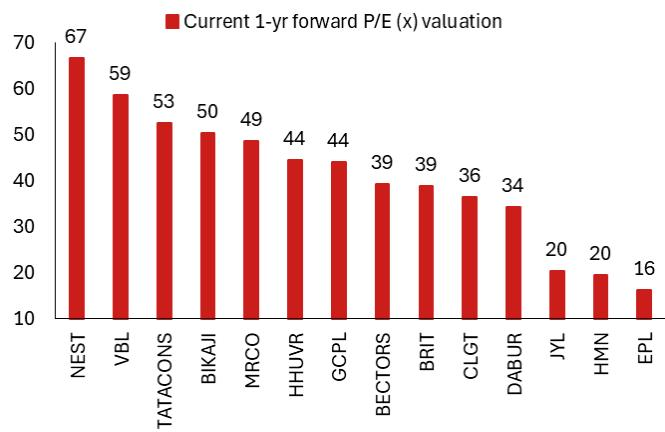

bar chart

Current 1-yr forward P/E (x) valuation
| Company | Current 1-yr forward P/E (x) valuation |
| :--- | :--- |
| NEST | 67 |
| VBL | 59 |
| TATACONS | 53 |
| BIKAJI | 50 |
| MRCO | 49 |
| HHUVR | 44 |
| GCPL | 44 |
| BECTORS | 39 |
| BRIT | 39 |
| CLGT | 36 |
| DABUR | 34 |
| JYL | 20 |
| HMN | 20 |
| EPL | 16 |

Note: NOM estimates for covered stock, Bloomberg Finance L.P. consensus for not rated stocks  
Source: Company data, Bloomberg Finance L.P., NOM estimates

Fig. 67: Staples ex-ITC PE Band Chart  
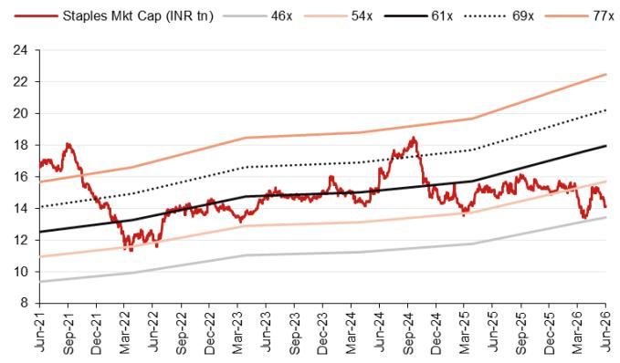

line chart

| Date    | Staples Mkt Cap (INR tn) | 46x  | 54x  | 61x  | 69x  | 77x  |
|---------|--------------------------|------|------|------|------|------|
| Jun-21  | 17                       | 9.5  | 11   | 13   | 14.5 | 16   |
| Sep-21  | 18                       | 10   | 12   | 14   | 15   | 17   |
| Dec-21  | 14                       | 10.5 | 12.5 | 14.5 | 15.5 | 17.5 |
| Mar-22  | 12                       | 11   | 13   | 15   | 16   | 18   |
| Jun-22  | 13                       | 11.5 | 13.5 | 15.5 | 16.5 | 18.5 |
| Sep-22  | 14                       | 12   | 14   | 16   | 17   | 19   |
| Dec-22  | 15                       | 12.5 | 14.5 | 16.5 | 17.5 | 19.5 |
| Mar-23  | 16                       | 13   | 15   | 17   | 18   | 20   |
| Jun-23  | 17                       | 13.5 | 15.5 | 17.5 | 18.5 | 20.5 |
| Sep-23  | 18                       | 14   | 16   | 18   | 19   | 21   |
| Dec-23  | 19                       | 14.5 | 16.5 | 18.5 | 19.5 | 21.5 |
| Mar-24  | 20                       | 15   | 17   | 19   | 20   | 22   |
| Jun-24  | 21                       | 15.5 | 17.5 | 19.5 | 20.5 | 22.5 |
| Sep-24  | 22                       | 16   | 18   | 20   | 21   | 23   |
| Dec-24  | 23                       | 16.5 | 18.5 | 20.5 | 21.5 | 23.5 |
| Mar-25  | 24                       | 17   | 19   | 21   | 22   | 24   |
| Jun-25  | 25                       | 17.5 | 19.5 | 21.5 | 22.5 | 24.5 |
| Sep-25  | 26                       | 18   | 20   | 22   | 23   | 25   |
| Dec-25  | 27                       | 18.5 | 20.5 | 22.5 | 23.5 | 25.5 |
| Mar-26  | 28                       | 19   | 21   | 23   | 24   | 26   |
| Jun-26  | 29                       | 19.5 | 21.5 | 23.5 | 24.5 | 26.5 |

Source: Bloomberg Finance L.P., NOM estimates

Fig. 68: Historical one-year-forward average P/E trading multiples

<table><tr><td rowspan="2">Company</td><td colspan="5">Average P/E (x) multiple - current &amp; historic</td></tr><tr><td>Current</td><td>1-year</td><td>3-year</td><td>5-year</td><td>10-year</td></tr><tr><td>Nestle</td><td>67</td><td>65</td><td>70</td><td>69</td><td>62</td></tr><tr><td>Bikaji Foods</td><td>50</td><td>60</td><td>66</td><td>NA</td><td>NA</td></tr><tr><td>Tata Consumer</td><td>53</td><td>57</td><td>63</td><td>63</td><td>48</td></tr><tr><td>Varun Beverages</td><td>59</td><td>56</td><td>69</td><td>72</td><td>NA</td></tr><tr><td>Mrs. Bectors</td><td>39</td><td>54</td><td>52</td><td>42</td><td>NA</td></tr><tr><td>Godrej Consumer</td><td>44</td><td>53</td><td>58</td><td>55</td><td>50</td></tr><tr><td>Britannia</td><td>39</td><td>52</td><td>53</td><td>51</td><td>49</td></tr><tr><td>Hindustan Unilever</td><td>44</td><td>51</td><td>55</td><td>57</td><td>55</td></tr><tr><td>Marico</td><td>49</td><td>48</td><td>48</td><td>49</td><td>46</td></tr><tr><td>Dabur</td><td>34</td><td>42</td><td>49</td><td>51</td><td>48</td></tr><tr><td>Colgate</td><td>36</td><td>42</td><td>49</td><td>44</td><td>42</td></tr><tr><td>Jyothy</td><td>20</td><td>31</td><td>39</td><td>33</td><td>36</td></tr><tr><td>Emami</td><td>20</td><td>28</td><td>31</td><td>31</td><td>49</td></tr><tr><td>Nifty 50 Index</td><td>20</td><td>21</td><td>20</td><td>21</td><td>20</td></tr><tr><td>EPL</td><td>16</td><td>16</td><td>18</td><td>21</td><td>21</td></tr><tr><td>Staples ex-ITC</td><td>48</td><td>54</td><td>59</td><td>61</td><td>56</td></tr></table>

Source: Company data, Bloomberg Finance L.P., NOM estimates

<table><tr><td colspan="4">% Premium/ discount - current vs. historic</td></tr><tr><td>1-year</td><td>3-year</td><td>5-year</td><td>10-year</td></tr><tr><td>3</td><td>-5</td><td>-4</td><td>7</td></tr><tr><td>-16</td><td>-23</td><td>NA</td><td>NA</td></tr><tr><td>-8</td><td>-17</td><td>-16</td><td>9</td></tr><tr><td>5</td><td>-15</td><td>-19</td><td>NA</td></tr><tr><td>-28</td><td>-25</td><td>-6</td><td>NA</td></tr><tr><td>-17</td><td>-24</td><td>-20</td><td>-12</td></tr><tr><td>-25</td><td>-27</td><td>-24</td><td>-21</td></tr><tr><td>-13</td><td>-19</td><td>-22</td><td>-19</td></tr><tr><td>1</td><td>2</td><td>0</td><td>6</td></tr><tr><td>-18</td><td>-29</td><td>-33</td><td>-29</td></tr><tr><td>-13</td><td>-25</td><td>-17</td><td>-14</td></tr><tr><td>-33</td><td>-47</td><td>-38</td><td>-43</td></tr><tr><td>-30</td><td>-38</td><td>-37</td><td>-60</td></tr><tr><td>-4</td><td>0</td><td>-1</td><td>3</td></tr><tr><td>-1</td><td>-12</td><td>-21</td><td>-24</td></tr><tr><td>-11</td><td>-18</td><td>-21</td><td>-14</td></tr></table>

Fig. 69: Valuation summary

<table><tr><td rowspan="2">Company</td><td rowspan="2">CMP (INR)</td><td rowspan="2">TP (INR)</td><td rowspan="2">Upside (%)</td><td rowspan="2">Rating</td><td rowspan="2">Mkt cap INR bn</td><td colspan="3">EPS (INR)</td><td colspan="3">EPS growth (%)</td><td colspan="3">P/E (x)</td><td rowspan="2">EPS gr % FY26-28F</td><td rowspan="2">ADTV USD mn</td></tr><tr><td>FY26</td><td>FY27F</td><td>FY28F</td><td>FY26</td><td>FY27F</td><td>FY28F</td><td>FY26</td><td>FY27F</td><td>FY28F</td></tr><tr><td>FMCG</td><td></td><td></td><td></td><td></td><td></td><td></td><td></td><td></td><td></td><td></td><td></td><td></td><td></td><td></td><td></td><td></td></tr><tr><td>Hindustan Unilever</td><td>2,109</td><td>2,650</td><td>26</td><td>Buy</td><td>4,956</td><td>44</td><td>48</td><td>53</td><td>2</td><td>9</td><td>10</td><td>48</td><td>44</td><td>40</td><td>9</td><td>48</td></tr><tr><td>Nestle India</td><td>1,398</td><td>1,500</td><td>7</td><td>Buy</td><td>2,696</td><td>17</td><td>20</td><td>23</td><td>7</td><td>18</td><td>13</td><td>81</td><td>69</td><td>61</td><td>16</td><td>20</td></tr><tr><td>Britannia</td><td>5,063</td><td>6,500</td><td>28</td><td>Buy</td><td>1,219</td><td>101</td><td>115</td><td>129</td><td>11</td><td>13</td><td>12</td><td>50</td><td>44</td><td>39</td><td>13</td><td>25</td></tr><tr><td>Godrej Consumer</td><td>996</td><td>1,300</td><td>31</td><td>Buy</td><td>1,019</td><td>20</td><td>23</td><td>25</td><td>6</td><td>12</td><td>13</td><td>49</td><td>44</td><td>39</td><td>12</td><td>18</td></tr><tr><td>Tata Consumer</td><td>1,106</td><td>1,450</td><td>31</td><td>Buy</td><td>1,028</td><td>17</td><td>21</td><td>24</td><td>20</td><td>21</td><td>15</td><td>64</td><td>53</td><td>46</td><td>18</td><td>20</td></tr><tr><td>Marico</td><td>807</td><td>950</td><td>18</td><td>Buy</td><td>1,046</td><td>14</td><td>16</td><td>19</td><td>11</td><td>19</td><td>16</td><td>59</td><td>50</td><td>43</td><td>17</td><td>16</td></tr><tr><td>Dabur</td><td>418</td><td>600</td><td>44</td><td>Buy</td><td>742</td><td>11</td><td>12</td><td>13</td><td>8</td><td>10</td><td>11</td><td>38</td><td>34</td><td>31</td><td>11</td><td>11</td></tr><tr><td>Colgate India</td><td>2,008</td><td>2,500</td><td>25</td><td>Buy</td><td>546</td><td>49</td><td>54</td><td>59</td><td>-4</td><td>11</td><td>10</td><td>41</td><td>37</td><td>34</td><td>10</td><td>10</td></tr><tr><td>EPL</td><td>208</td><td>300</td><td>44</td><td>Buy</td><td>67</td><td>13</td><td>14</td><td>16</td><td>23</td><td>8</td><td>12</td><td>16</td><td>15</td><td>13</td><td>10</td><td>2</td></tr><tr><td>Varun Beverages</td><td>522</td><td></td><td></td><td>NR</td><td>1,816</td><td>9</td><td>10</td><td>12</td><td>6</td><td>20</td><td>17</td><td>61</td><td>50</td><td>43</td><td>19</td><td>32</td></tr><tr><td>Emami</td><td>382</td><td></td><td></td><td>NR</td><td>171</td><td>17</td><td>19</td><td>21</td><td>-5</td><td>13</td><td>11</td><td>22</td><td>20</td><td>18</td><td>12</td><td>3</td></tr><tr><td>Bikaji</td><td>653</td><td></td><td></td><td>NR</td><td>167</td><td>10</td><td>13</td><td>15</td><td>28</td><td>23</td><td>16</td><td>64</td><td>52</td><td>44</td><td>20</td><td>1</td></tr><tr><td>Jyothy Lab</td><td>198</td><td></td><td></td><td>NR</td><td>73</td><td>9</td><td>9</td><td>11</td><td>-10</td><td>5</td><td>18</td><td>22</td><td>21</td><td>18</td><td>11</td><td>2</td></tr><tr><td>Honasa</td><td>415</td><td></td><td></td><td>NR</td><td>132</td><td>6</td><td>7</td><td>9</td><td>210</td><td>29</td><td>23</td><td>72</td><td>56</td><td>45</td><td>26</td><td>5</td></tr><tr><td>Mrs Bector Foods</td><td>169</td><td></td><td></td><td>NR</td><td>53</td><td>na</td><td>6</td><td>7</td><td>na</td><td>na</td><td>28</td><td>na</td><td>30</td><td>23</td><td>na</td><td>2</td></tr><tr><td>Bajaj Consumer</td><td>584</td><td></td><td></td><td>NR</td><td>75</td><td>14</td><td>18</td><td>20</td><td>59</td><td>25</td><td>16</td><td>42</td><td>33</td><td>29</td><td>21</td><td>6</td></tr></table>

Source: Company data, Bloomberg Finance L.P., NOM estimates. Note: (1) For NR, we have taken Bloomberg Consensus estimates and (2) priced as of 9 Jun-2026

Fig. 70: Valuation summary

<table><tr><td rowspan="2">Company</td><td colspan="3">EV/EBITDA (x)</td><td colspan="3">EV/Sales (x)</td><td colspan="3">PEG (x)</td><td colspan="3">Dividend yield (%)</td><td colspan="3">FCF yield (%)</td><td colspan="3">ROE (%)</td></tr><tr><td>FY26F</td><td>FY27F</td><td>FY28F</td><td>FY26F</td><td>FY27F</td><td>FY28F</td><td>FY26F</td><td>FY27F</td><td>FY28F</td><td>FY26F</td><td>FY27F</td><td>FY28F</td><td>FY26F</td><td>FY27F</td><td>FY28F</td><td>FY26F</td><td>FY27F</td><td>FY28F</td></tr><tr><td>FMCG</td><td colspan="3"></td><td colspan="3"></td><td colspan="3"></td><td colspan="3"></td><td colspan="3"></td><td colspan="3"></td></tr><tr><td>Hindustan Unilever</td><td>32.0</td><td>29.7</td><td>27.2</td><td>7.5</td><td>6.9</td><td>6.4</td><td>na</td><td>5.0</td><td>4.0</td><td>1.9</td><td>2.2</td><td>2.4</td><td>1.9</td><td>2.3</td><td>2.6</td><td>23.1</td><td>25.1</td><td>27.4</td></tr><tr><td>Nestle India</td><td>50.9</td><td>43.7</td><td>39.2</td><td>11.7</td><td>10.3</td><td>9.4</td><td>na</td><td>3.8</td><td>4.7</td><td>0.9</td><td>1.3</td><td>1.5</td><td>1.3</td><td>1.5</td><td>1.7</td><td>75.2</td><td>71.2</td><td>74.8</td></tr><tr><td>Britannia</td><td>34.3</td><td>30.9</td><td>27.8</td><td>6.4</td><td>5.8</td><td>5.2</td><td>4.7</td><td>3.3</td><td>3.2</td><td>1.5</td><td>1.9</td><td>2.2</td><td>2.1</td><td>2.3</td><td>2.6</td><td>45.4</td><td>49.7</td><td>54.8</td></tr><tr><td>Godrej Consumer</td><td>32.4</td><td>29.1</td><td>26.1</td><td>6.7</td><td>6.1</td><td>5.5</td><td>8.7</td><td>3.7</td><td>3.1</td><td>2.0</td><td>2.0</td><td>2.1</td><td>-0.3</td><td>2.3</td><td>2.7</td><td>19.1</td><td>20.9</td><td>22.6</td></tr><tr><td>Tata Consumer</td><td>36.4</td><td>30.9</td><td>27.5</td><td>5.0</td><td>4.4</td><td>4.0</td><td>3.2</td><td>2.6</td><td>3.1</td><td>1.0</td><td>1.2</td><td>1.4</td><td>1.8</td><td>1.7</td><td>2.4</td><td>8.7</td><td>9.7</td><td>10.9</td></tr><tr><td>Marico</td><td>44.0</td><td>37.0</td><td>32.1</td><td>7.6</td><td>6.8</td><td>6.2</td><td>5.4</td><td>2.6</td><td>2.7</td><td>1.4</td><td>1.6</td><td>1.9</td><td>1.2</td><td>1.8</td><td>2.2</td><td>47.7</td><td>50.4</td><td>52.9</td></tr><tr><td>Dabur</td><td>29.5</td><td>26.7</td><td>24.3</td><td>5.5</td><td>5.0</td><td>4.6</td><td>4.9</td><td>3.3</td><td>2.8</td><td>1.3</td><td>1.5</td><td>1.6</td><td>3.0</td><td>2.3</td><td>3.5</td><td>17.5</td><td>17.8</td><td>18.3</td></tr><tr><td>Colgate India</td><td>28.6</td><td>26.1</td><td>24.0</td><td>8.9</td><td>8.1</td><td>7.5</td><td>na</td><td>3.5</td><td>3.5</td><td>3.0</td><td>2.6</td><td>2.8</td><td>3.3</td><td>2.4</td><td>2.9</td><td>90.7</td><td>95.0</td><td>100.2</td></tr><tr><td>EPL</td><td>7.3</td><td>6.7</td><td>6.1</td><td>1.5</td><td>1.3</td><td>1.2</td><td>0.7</td><td>1.7</td><td>1.1</td><td>2.3</td><td>2.7</td><td>3.0</td><td>1.9</td><td>6.2</td><td>8.3</td><td>15.2</td><td>15.4</td><td>15.8</td></tr><tr><td>Varun Beverages</td><td>36.7</td><td>30.9</td><td>27.0</td><td>8.7</td><td>7.2</td><td>6.3</td><td>9.6</td><td>2.5</td><td>2.5</td><td>0.2</td><td>0.4</td><td>0.5</td><td>0.0</td><td>1.7</td><td>1.9</td><td>16.8</td><td>16.8</td><td>17.3</td></tr><tr><td>Emami</td><td>17.8</td><td>15.4</td><td>13.9</td><td>4.3</td><td>3.9</td><td>3.6</td><td>-4.8</td><td>1.5</td><td>1.7</td><td>2.6</td><td>3.0</td><td>3.2</td><td>4.8</td><td>4.6</td><td>5.1</td><td>27.6</td><td>26.0</td><td>26.0</td></tr><tr><td>Bikaji</td><td>40.9</td><td>34.0</td><td>30.4</td><td>5.7</td><td>4.8</td><td>4.2</td><td>2.3</td><td>2.2</td><td>2.7</td><td>0.2</td><td>0.3</td><td>0.3</td><td>na</td><td>2.0</td><td>1.8</td><td>17.3</td><td>17.9</td><td>17.8</td></tr><tr><td>Jyothy Lab</td><td>14.6</td><td>14.5</td><td>12.4</td><td>2.2</td><td>2.1</td><td>1.9</td><td>na</td><td>4.6</td><td>1.0</td><td>1.8</td><td>2.0</td><td>2.3</td><td>4.5</td><td>3.3</td><td>4.3</td><td>18.3</td><td>19.0</td><td>20.3</td></tr><tr><td>Honasa</td><td>54.7</td><td>43.0</td><td>34.7</td><td>5.4</td><td>4.6</td><td>4.0</td><td>na</td><td>1.9</td><td>2.0</td><td>0.0</td><td>0.2</td><td>0.5</td><td>na</td><td>1.5</td><td>1.9</td><td>15.4</td><td>16.0</td><td>17.2</td></tr><tr><td>Mrs Bector Foods</td><td>20.1</td><td>16.9</td><td>13.9</td><td>2.5</td><td>2.2</td><td>1.9</td><td>na</td><td>na</td><td>0.8</td><td>0.4</td><td>1.1</td><td>1.4</td><td>0.1</td><td>3.1</td><td>3.5</td><td>na</td><td>12.5</td><td>14.2</td></tr><tr><td>Bajaj Consumer</td><td>32.7</td><td>26.2</td><td>22.6</td><td>6.1</td><td>5.3</td><td>4.7</td><td>0.7</td><td>1.3</td><td>1.8</td><td>0.0</td><td>1.6</td><td>1.7</td><td>2.4</td><td>3.1</td><td>3.4</td><td>25.3</td><td>27.2</td><td>26.6</td></tr></table>

Note: Bloomberg consensus estimates for NR companies JSW Dulux, Indigo Paints and PidiliteSource: Bloomberg Finance L.P., NOM estimates

Fig. 71: Absolute returns (%)

<table><tr><td rowspan="2">Company</td><td colspan="7">Absolute return (%)</td></tr><tr><td>1-month</td><td>3-months</td><td>6-months</td><td>1 year</td><td>3 year</td><td>5 year</td><td>10 year</td></tr><tr><td>Bajaj Consumer</td><td>13</td><td>48</td><td>105</td><td>217</td><td>193</td><td>88</td><td>40</td></tr><tr><td>Zydus Wellness</td><td>-1</td><td>32</td><td>23</td><td>34</td><td>67</td><td>20</td><td>229</td></tr><tr><td>Nestle</td><td>-7</td><td>11</td><td>11</td><td>15</td><td>28</td><td>59</td><td>330</td></tr><tr><td>Marico</td><td>-1</td><td>3</td><td>10</td><td>15</td><td>49</td><td>66</td><td>217</td></tr><tr><td>Varun Beverages</td><td>3</td><td>17</td><td>9</td><td>12</td><td>55</td><td>456</td><td>NA</td></tr><tr><td>EPL</td><td>-5</td><td>9</td><td>8</td><td>-10</td><td>10</td><td>-12</td><td>132</td></tr><tr><td>Prataap Snacks</td><td>15</td><td>18</td><td>7</td><td>5</td><td>46</td><td>87</td><td>NA</td></tr><tr><td>Tata Consumer</td><td>-2</td><td>1</td><td>-3</td><td>2</td><td>45</td><td>67</td><td>859</td></tr><tr><td>Colgate</td><td>-7</td><td>-9</td><td>-8</td><td>-18</td><td>23</td><td>18</td><td>134</td></tr><tr><td>Bikaji Foods</td><td>-4</td><td>7</td><td>-9</td><td>-14</td><td>72</td><td>NA</td><td>NA</td></tr><tr><td>Hindustan Unilever</td><td>-8</td><td>-5</td><td>-9</td><td>-9</td><td>-20</td><td>-8</td><td>140</td></tr><tr><td>Doodla Dairy</td><td>0</td><td>5</td><td>-10</td><td>-18</td><td>105</td><td>NA</td><td>NA</td></tr><tr><td>Nifty</td><td>-4</td><td>-4</td><td>-11</td><td>-6</td><td>26</td><td>49</td><td>183</td></tr><tr><td>Godrej Consumer</td><td>-9</td><td>-11</td><td>-12</td><td>-18</td><td>-5</td><td>17</td><td>94</td></tr><tr><td>Agro Tech Foods</td><td>-4</td><td>3</td><td>-12</td><td>-28</td><td>-19</td><td>-34</td><td>28</td></tr><tr><td>Hatsun Agro Prod</td><td>-9</td><td>-1</td><td>-13</td><td>-9</td><td>2</td><td>7</td><td>261</td></tr><tr><td>Britannia</td><td>-11</td><td>-14</td><td>-14</td><td>-9</td><td>9</td><td>47</td><td>266</td></tr><tr><td>Dabur</td><td>-9</td><td>-11</td><td>-17</td><td>-13</td><td>-23</td><td>-22</td><td>38</td></tr><tr><td>Patanjali Foods</td><td>-9</td><td>-16</td><td>-24</td><td>-25</td><td>22</td><td>6</td><td>-39</td></tr><tr><td>Parag Milk Foods</td><td>6</td><td>18</td><td>-24</td><td>9</td><td>121</td><td>69</td><td>-5</td></tr><tr><td>Adani Wilmar</td><td>-9</td><td>7</td><td>-25</td><td>-29</td><td>-56</td><td>NA</td><td>NA</td></tr><tr><td>Emami</td><td>-15</td><td>-16</td><td>-27</td><td>-34</td><td>-2</td><td>-29</td><td>-25</td></tr><tr><td>Jyothy Labs</td><td>-22</td><td>-18</td><td>-31</td><td>-42</td><td>-2</td><td>26</td><td>38</td></tr><tr><td>Mrs Bectors Food</td><td>-16</td><td>-12</td><td>-33</td><td>-40</td><td>9</td><td>104</td><td>NA</td></tr><tr><td>Heritage Foods</td><td>-11</td><td>5</td><td>-33</td><td>-32</td><td>55</td><td>58</td><td>151</td></tr></table>

Source: Bloomberg Finance L.P., NOM

## Macro indicators Key demographic charts

Fig. 72: Under-indexed per capita spending vs Asian countries (CY22)  
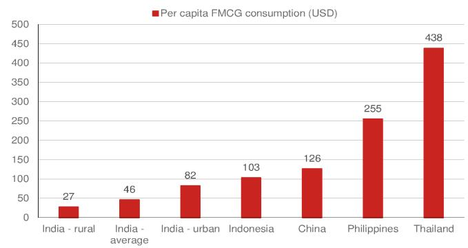

bar chart

| Country/Region | Per capita FMCG consumption (USD) |
| :--- | :--- |
| India - rural | 27 |
| India - average | 46 |
| India - urban | 82 |
| Indonesia | 103 |
| China | 126 |
| Philippines | 255 |
| Thailand | 438 |

Source: Company data, NOM

Fig. 73: India's population mix (CY22)  
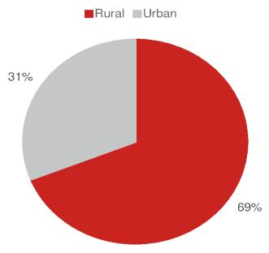

pie chart

| Category | Percentage (%) |
| :--- | :--- |
| Rural | 69 |
| Urban | 31 |

Source: Company data, NOM

Fig. 74: India's real GDP and PFCE (y-y %)  
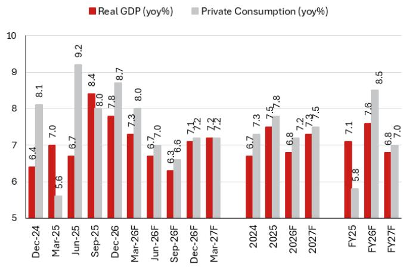

bar chart

| Period | Real GDP (yoy%) | Private Consumption (yoy%) |
| :--- | :--- | :--- |
| Dec-24 | 6.4 | 8.1 |
| Mar-25 | 7.0 | 5.6 |
| Jun-25 | 6.7 | 9.2 |
| Sep-25 | 8.4 | 8.0 |
| Dec-26 | 7.8 | 8.7 |
| Mar-26F | 7.3 | 8.0 |
| Jun-26F | 6.7 | 7.0 |
| Sep-26F | 6.3 | 6.6 |
| Dec-26F | 7.1 | 7.2 |
| Mar-27F | 7.2 | 7.2 |
| 2024 | 6.7 | 7.3 |
| 2025 | 7.5 | 7.8 |
| 2026F | 6.8 | 7.2 |
| 2027F | 7.3 | 7.5 |
| FY25 | 7.1 | 5.8 |
| FY26F | 7.6 | 8.5 |
| FY27F | 6.8 | 7.0 |

Source: NOM Global Economics, NOM estimates

Fig. 75: CPI forecasts  
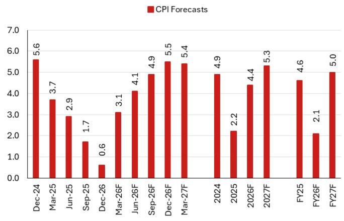

bar chart

| Period | CPI Forecasts |
|---|---|
| Dec-24 | 5.6 |
| Mar-25 | 3.7 |
| Jun-25 | 2.9 |
| Sep-25 | 1.7 |
| Dec-26 | 0.6 |
| Mar-26F | 3.1 |
| Jun-26F | 4.1 |
| Sep-26F | 4.9 |
| Dec-26F | 5.5 |
| Mar-27F | 5.4 |
| 2024 | 4.9 |
| 2025 | 2.2 |
| 2026F | 4.4 |
| 2027F | 5.3 |
| FY25 | 4.6 |
| FY26F | 2.1 |
| FY27F | 5.0 |

Source: NOM Global Economics, NOM estimates

Fig. 76: Rural-urban mix across companies  
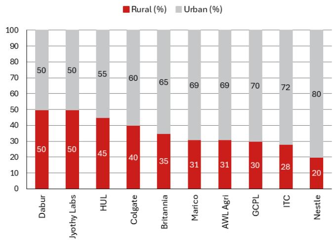

stacked bar chart

| Company | Rural (%) | Urban (%) |
| :--- | :--- | :--- |
| Dabur | 50 | 50 |
| Jyothy Labs | 50 | 50 |
| HUL | 45 | 55 |
| Colgate | 40 | 60 |
| Britannia | 35 | 65 |
| Marico | 31 | 69 |
| AWL Agri | 31 | 69 |
| GCPL | 30 | 70 |
| ITC | 28 | 72 |
| Nestle | 20 | 80 |

Source: Company data, NOM

Fig. 77: Rural-urban CPI  
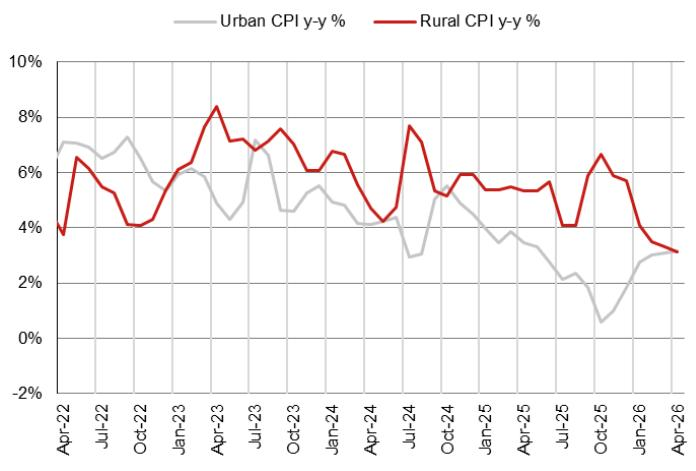

line chart

| Date   | Urban CPI y-y % | Rural CPI y-y % |
|--------|-----------------|-----------------|
| Apr-22 | 7.0%            | 4.0%            |
| Jul-22 | 6.5%            | 5.5%            |
| Oct-22 | 7.0%            | 4.0%            |
| Jan-23 | 6.0%            | 6.0%            |
| Apr-23 | 5.0%            | 8.5%            |
| Jul-23 | 6.5%            | 7.0%            |
| Oct-23 | 4.5%            | 7.5%            |
| Jan-24 | 5.0%            | 6.0%            |
| Apr-24 | 4.0%            | 4.5%            |
| Jul-24 | 3.0%            | 7.5%            |
| Oct-24 | 5.0%            | 5.5%            |
| Jan-25 | 4.0%            | 6.0%            |
| Apr-25 | 3.0%            | 5.5%            |
| Jul-25 | 2.0%            | 4.0%            |
| Oct-25 | 1.0%            | 6.5%            |
| Jan-26 | 3.0%            | 3.0%            |
| Apr-26 | 3.5%            | 3.0%            |

Source: CMIE, NOM

## Monsoon indicators

Fig. 78: India – reservoirs storage trend  
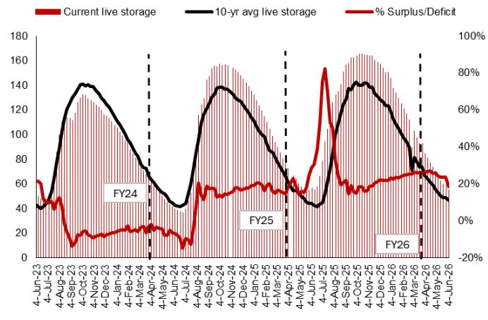

line chart

| Fiscal Year | Current live storage | 10-yr avg live storage | % Surplus/Deficit |
|-------------|----------------------|------------------------|-------------------|
| FY24        | ~60                  | ~140                   | ~20%              |
| FY25        | ~60                  | ~140                   | ~20%              |
| FY26        | ~60                  | ~140                   | ~20%              |

Source: CMIE, NOM

## Rural indicators

Fig. 80: Kharif production increase y-y (%)

<table><tr><td>Crop</td><td>2021-22</td><td>2022-23</td><td>2023-24</td><td>2024-25</td><td>2025-26*</td></tr><tr><td>Total Foodgrains</td><td>3.2%</td><td>0.2%</td><td>0.0%</td><td>8.8%</td><td>2.4%</td></tr><tr><td>Rice</td><td>5.5%</td><td>-0.4%</td><td>2.5%</td><td>8.4%</td><td>0.9%</td></tr><tr><td>Maize</td><td>5.2%</td><td>4.4%</td><td>-6.0%</td><td>11.5%</td><td>21.9%</td></tr><tr><td>Other cereals</td><td>-11.5%</td><td>3.4%</td><td>-4.4%</td><td>6.4%</td><td>-12.8%</td></tr><tr><td>Pulses</td><td>-4.5%</td><td>-7.4%</td><td>-8.5%</td><td>10.9%</td><td>-10.4%</td></tr><tr><td>Total Oilseeds</td><td>1.1%</td><td>9.1%</td><td>-7.6%</td><td>16.0%</td><td>-5.3%</td></tr><tr><td>Sugarcane</td><td>8.4%</td><td>11.6%</td><td>-7.6%</td><td>0.3%</td><td>10.0%</td></tr></table>

Note: Second Advance Estimates for 2025-26  
Source: Department of Agriculture, NOM

Fig. 82: Rural household income breakdown  
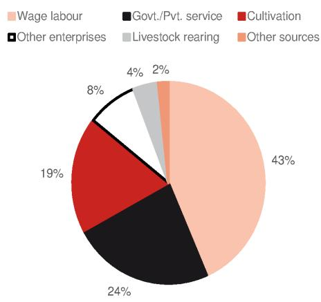

pie chart

| Category | Percentage (%) |
| :--- | :--- |
| Wage labour | 43 |
| Govt./Pvt. service | 24 |
| Cultivation | 19 |
| Other enterprises | 8 |
| Livestock rearing | 4 |
| Other sources | 2 |

Source: National Bank for agriculture and rural development, NOM

Fig. 79: Rainfall departure as a % of LPA  
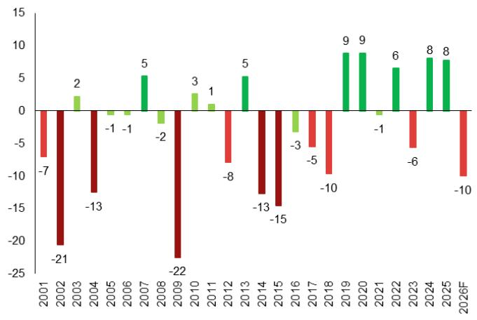

bar chart

| Year | Value |
|---|---|
| 2001 | -7 |
| 2002 | -21 |
| 2003 | 2 |
| 2004 | -13 |
| 2005 | -1 |
| 2006 | -1 |
| 2007 | 5 |
| 2008 | -2 |
| 2009 | -22 |
| 2010 | 3 |
| 2011 | 1 |
| 2012 | -8 |
| 2013 | 5 |
| 2014 | -13 |
| 2015 | -15 |
| 2016 | -3 |
| 2017 | -5 |
| 2018 | -10 |
| 2019 | 9 |
| 2020 | 9 |
| 2021 | -1 |
| 2022 | 6 |
| 2023 | -6 |
| 2024 | 8 |
| 2025 | 8 |
| 2026F | -10 |

Note: 2026 data as per IMD forecasts.  
Source: IMD, NOM

Fig. 81: Rabi sowing area coverage (as on 31-Jan-26)

<table><tr><td rowspan="2">Crop (mn hectares)</td><td rowspan="2">Normal Area</td><td colspan="2">Area Sown</td><td rowspan="2">y-y (%)</td></tr><tr><td>2025-26</td><td>2024-25</td></tr><tr><td>Wheat</td><td>312.4</td><td>334.2</td><td>328.0</td><td>1.9%</td></tr><tr><td>Rice*</td><td>42.9</td><td>45.0</td><td>44.7</td><td>0.6%</td></tr><tr><td>Pulses</td><td>140.4</td><td>139.6</td><td>134.5</td><td>3.7%</td></tr><tr><td>Shri Anna &amp; Coarse Cereals</td><td>55.3</td><td>60.9</td><td>60.0</td><td>1.6%</td></tr><tr><td>Oilseeds</td><td>86.8</td><td>97.2</td><td>93.7</td><td>3.8%</td></tr><tr><td>Total</td><td>637.8</td><td>676.8</td><td>661.0</td><td>2.4%</td></tr></table>

Note: \*Normal area for rice is average of 2022-23 to 2024-25  
Source: Department of Agriculture, NOM

Fig. 83: CPI food  
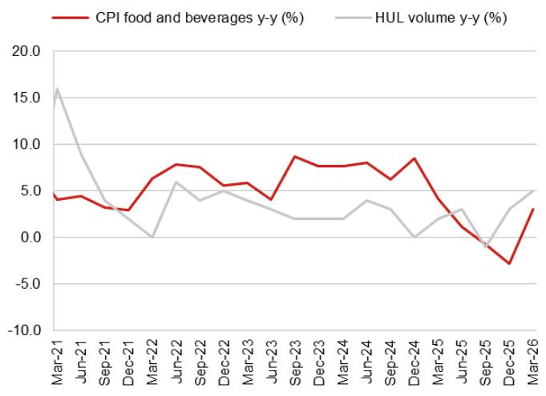

line chart

| Date    | CPI food and beverages y-y (%) | HUL volume y-y (%) |
|---------|----------------------------------|--------------------|
| Mar-21  | 4.5                              | 16.0               |
| Jun-21  | 4.0                              | 8.0                |
| Sep-21  | 3.0                              | 4.0                |
| Dec-21  | 3.0                              | 0.0                |
| Mar-22  | 7.0                              | 6.0                |
| Jun-22  | 8.0                              | 4.0                |
| Sep-22  | 7.5                              | 5.0                |
| Dec-22  | 6.0                              | 4.5                |
| Mar-23  | 5.5                              | 3.5                |
| Jun-23  | 4.0                              | 2.0                |
| Sep-23  | 9.0                              | 1.5                |
| Dec-23  | 8.0                              | 1.5                |
| Mar-24  | 8.0                              | 2.0                |
| Jun-24  | 8.5                              | 4.0                |
| Sep-24  | 6.0                              | 3.0                |
| Dec-24  | 8.5                              | 0.0                |
| Mar-25  | 4.0                              | 2.0                |
| Jun-25  | 1.0                              | 3.0                |
| Sep-25  | -1.0                             | -1.0               |
| Dec-25  | -3.0                             | 3.0                |
| Mar-26  | 3.0                              | 5.0                |

Source: CMIE, Company data, NOM

Fig. 84: MGNREGA budget allocation  
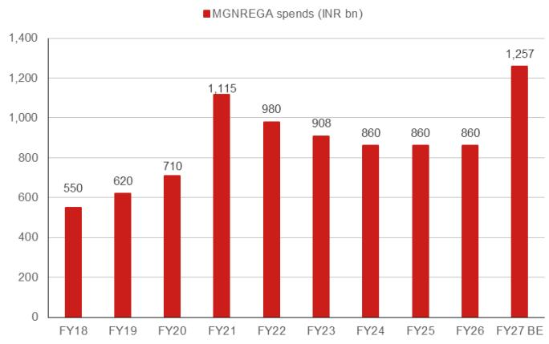

bar chart

| Fiscal Year | MGNREGA spends (INR bn) |
| :--- | :--- |
| FY18 | 550 |
| FY19 | 620 |
| FY20 | 710 |
| FY21 | 1,115 |
| FY22 | 980 |
| FY23 | 908 |
| FY24 | 860 |
| FY25 | 860 |
| FY26 | 860 |
| FY27 BE | 1,257 |

Source: Budget documents, NOM

## Urban indicators

Fig. 86: Home and personal care segment growing at 1.5x GDP in India  
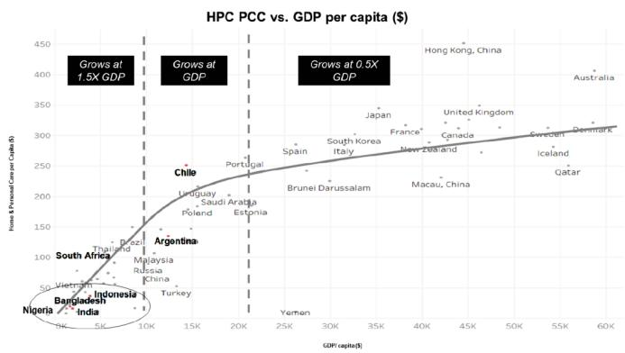

scatterplot

| Country | GDP per capita ($) | HPC PCC vs. GDP per capita ($) |
| --- | --- | --- |
| Hong Kong, China | 45000 | 320 |
| Australia | 58000 | 310 |
| Denmark | 59000 | 300 |
| Sweden | 54000 | 290 |
| Iceland | 53000 | 280 |
| Qatar | 53000 | 270 |
| Macau, China | 41000 | 260 |
| United Kingdom | 43000 | 250 |
| France | 38000 | 240 |
| Canada | 42000 | 230 |
| New Zealand | 41000 | 220 |
| Japan | 36000 | 210 |
| South Korea | 34000 | 200 |
| Italy | 33000 | 190 |
| Spain | 28000 | 180 |
| Brunei Darussalam | 31000 | 170 |
| Estonia | 21000 | 160 |
| Portugal | 21000 | 150 |
| Uruguay | 16000 | 140 |
| Saudi Arabia | 17000 | 130 |
| Poland | 15000 | 120 |
| Estonia | 14000 | 110 |
| Argentina | 13000 | 100 |
| Malaysia | 14000 | 95 |
| Russia | 13500 | 90 |
| China | 13500 | 85 |
| Turkey | 13500 | 80 |
| Indonesia | 13500 | 75 |
| Bangladesh | 13500 | 70 |
| India | 13500 | 65 |
| Vietnam | 7500 | 60 |
| South Africa | 7500 | 55 |
| Thailand | 7500 | 50 |
| Brazil | 7500 | 45 |
| Nigeria | 7500 | 40 |
| Yemen | 24500 | 35 |

Source: Reserve Bank of India, NOM

Fig. 88: Population mix (%)  
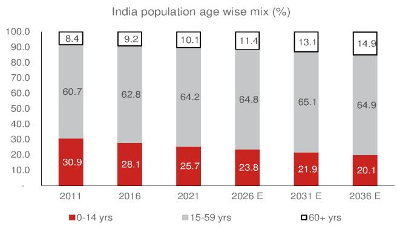

stacked bar chart

| Year   | 0-14 yrs | 15-59 yrs | 60+ yrs |
|--------|----------|-----------|---------|
| 2011   | 30.9     | 60.7      | 8.4     |
| 2016   | 28.1     | 62.8      | 9.2     |
| 2021   | 25.7     | 64.2      | 10.1    |
| 2026 E | 23.8     | 64.8      | 11.4    |
| 2031 E | 21.9     | 65.1      | 13.1    |
| 2036 E | 20.1     | 64.9      | 14.9    |

Source: MOSPI, NOM

Fig. 85: Demand for MGNREGA jobs  
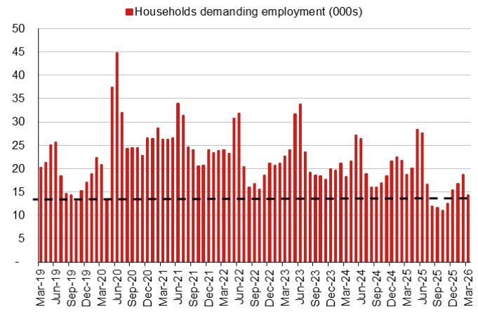

bar chart

| Month    | Households demanding employment (000s) |
| -------- | -------------------------------------- |
| Mar-19   | 20                                     |
| Jun-19   | 25                                     |
| Sep-19   | 18                                     |
| Dec-19   | 14                                     |
| Mar-20   | 22                                     |
| Jun-20   | 45                                     |
| Sep-20   | 24                                     |
| Dec-20   | 26                                     |
| Mar-21   | 27                                     |
| Jun-21   | 34                                     |
| Sep-21   | 24                                     |
| Dec-21   | 23                                     |
| Mar-22   | 24                                     |
| Jun-22   | 31                                     |
| Sep-22   | 20                                     |
| Dec-22   | 18                                     |
| Mar-23   | 23                                     |
| Jun-23   | 34                                     |
| Sep-23   | 19                                     |
| Dec-23   | 20                                     |
| Mar-24   | 27                                     |
| Jun-24   | 19                                     |
| Sep-24   | 16                                     |
| Dec-24   | 22                                     |
| Mar-25   | 19                                     |
| Jun-25   | 28                                     |
| Sep-25   | 16                                     |
| Dec-25   | 13                                     |
| Mar-26   | 19                                     |

Source: CMIE, NOM

Fig. 87: Narrowing rural-urban income gap  
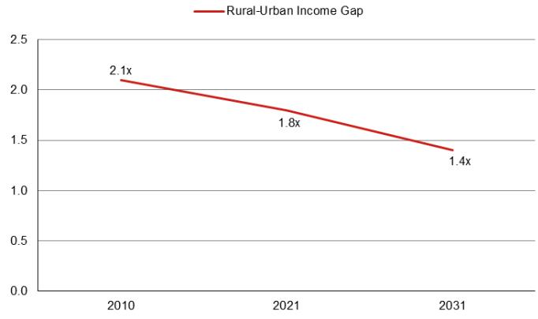

line chart

| Year | Rural-Urban Income Gap |
| ---- | ------------------------ |
| 2010 | 2.1x                     |
| 2021 | 1.8x                     |
| 2031 | 1.4x                     |

Source: Industry data, NOM

Fig. 89: Generation-wise working population split (%)  
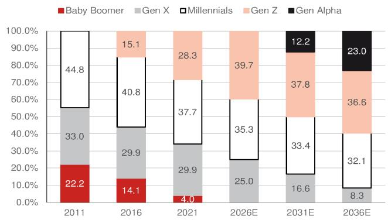

stacked bar chart

| Year | Baby Boomer (%) | Gen X (%) | Millennials (%) | Gen Z (%) | Gen Alpha (%) |
|---|---|---|---|---|---|
| 2011 | 22.2 | 33.0 | 44.8 | | |
| 2016 | 14.1 | 29.9 | 40.8 | 15.1 | |
| 2021 | 4.0 | 29.9 | 37.7 | 28.3 | |
| 2026E | | 25.0 | 35.3 | 39.7 | |
| 2031E | | 16.6 | 33.4 | 37.8 | 12.2 |
| 2036E | | 8.3 | 32.1 | 36.6 | 23.0 |

Source: United Nations Population Division, NOM

Fig. 90: Median age data  
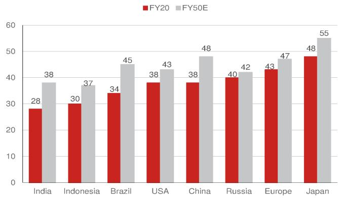

bar chart

| Region | FY20 | FY50E |
| :--- | :--- | :--- |
| India | 28 | 38 |
| Indonesia | 30 | 37 |
| Brazil | 34 | 45 |
| USA | 38 | 43 |
| China | 38 | 48 |
| Russia | 40 | 42 |
| Europe | 43 | 47 |
| Japan | 48 | 55 |

Source: Company data, NOM

Fig. 91: India's dependency ratio  
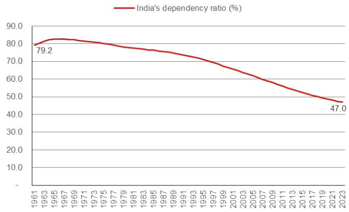

line chart

| Year | India's dependency ratio (%) |
| :--- | :--- |
| 1961 | 79.2 |
| 2023 | 47.0 |

Source: Company data, NOM

Fig. 92: Per-capita income on an uptrend (in USD)  
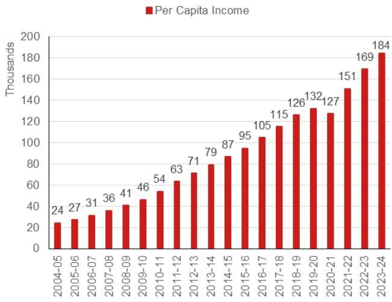

bar chart

| Period | Per Capita Income (Thousands) |
|---|---|
| 2004-05 | 24 |
| 2005-06 | 27 |
| 2006-07 | 31 |
| 2007-08 | 36 |
| 2008-09 | 41 |
| 2009-10 | 46 |
| 2010-11 | 54 |
| 2011-12 | 63 |
| 2012-13 | 71 |
| 2013-14 | 79 |
| 2014-15 | 87 |
| 2015-16 | 95 |
| 2016-17 | 105 |
| 2017-18 | 115 |
| 2018-19 | 126 |
| 2019-20 | 132 |
| 2020-21 | 127 |
| 2021-22 | 151 |
| 2022-23 | 169 |
| 2023-24 | 184 |

Source: Company data, NOM

Fig. 93: Increasing urbanization trend (%)  
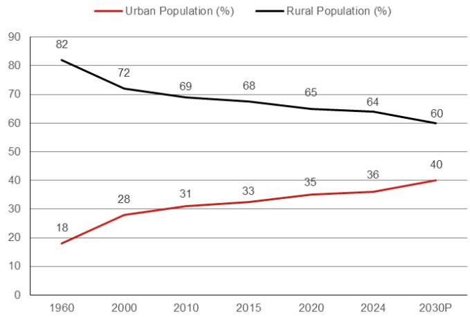

line chart

| Year | Urban Population (%) | Rural Population (%) |
|---|---|---|
| 1960 | 18 | 82 |
| 2000 | 28 | 72 |
| 2010 | 31 | 69 |
| 2015 | 33 | 68 |
| 2020 | 35 | 65 |
| 2024 | 36 | 64 |
| 2030P | 40 | 60 |

Source: Company data, NOM

Fig. 94: Rising women's participation in the workforce (%)

<table><tr><td colspan="10">Labour force participation (LFPR) for persons of age 15 years and above - All India</td></tr><tr><td rowspan="2">Survey Period(July-June)</td><td colspan="3">Rural</td><td colspan="3">Urban</td><td colspan="3">Rural + Urban</td></tr><tr><td>Male</td><td>Female</td><td>Person</td><td>Male</td><td>Female</td><td>Person</td><td>Male</td><td>Female</td><td>Person</td></tr><tr><td>2017-18</td><td>76.4</td><td>24.6</td><td>50.7</td><td>74.5</td><td>20.4</td><td>47.6</td><td>75.8</td><td>23.3</td><td>49.8</td></tr><tr><td>2018-19</td><td>76.4</td><td>26.4</td><td>51.5</td><td>73.7</td><td>20.4</td><td>47.5</td><td>75.5</td><td>24.5</td><td>50.2</td></tr><tr><td>2019-20</td><td>77.9</td><td>33.0</td><td>55.5</td><td>74.6</td><td>23.3</td><td>49.3</td><td>76.8</td><td>30.0</td><td>53.5</td></tr><tr><td>2020-21</td><td>78.1</td><td>36.5</td><td>57.4</td><td>74.6</td><td>23.2</td><td>49.1</td><td>77.0</td><td>32.5</td><td>54.9</td></tr><tr><td>2021-22</td><td>78.2</td><td>36.6</td><td>57.5</td><td>74.7</td><td>23.8</td><td>49.7</td><td>77.2</td><td>32.8</td><td>55.2</td></tr><tr><td>2022-23</td><td>80.2</td><td>41.5</td><td>60.8</td><td>74.5</td><td>25.4</td><td>50.4</td><td>78.5</td><td>37.0</td><td>57.9</td></tr><tr><td>2023-24</td><td>80.2</td><td>47.6</td><td>63.7</td><td>75.6</td><td>28.0</td><td>52.0</td><td>78.8</td><td>41.7</td><td>60.1</td></tr></table>

Source: MOSPI, NOM

Fig. 95: India Gen Z is driving growth  
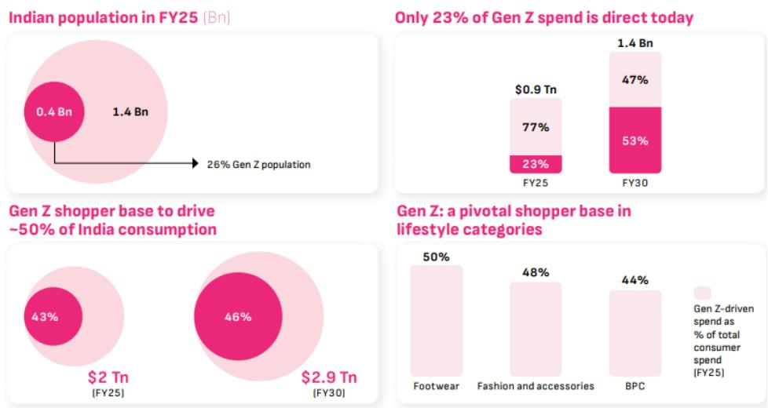  
Source: Company data, NOM

Fig. 96: India's e-commerce market – INR tn (USD bn)  
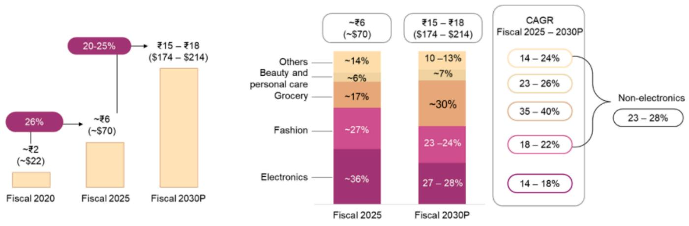  
Source: Meesho, NOM

Fig. 97: E-commerce revenue contribution for FMCG players  
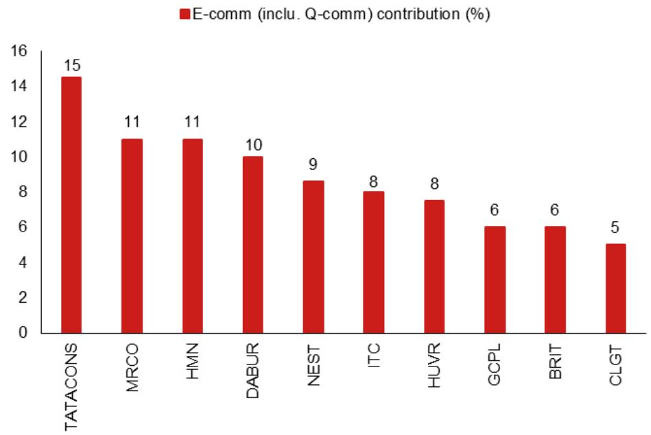

bar chart

| Company | E-comm (incl. Q-comm) contribution (%) |
| :--- | :--- |
| TATACONS | 15 |
| MRCO | 11 |
| HMN | 11 |
| DABUR | 10 |
| NEST | 9 |
| ITC | 8 |
| HUVR | 8 |
| GCPL | 6 |
| BRIT | 6 |
| CLGT | 5 |

Source: Company data, NOM

Fig. 98: Indian household income level trend – rising affluence in consumer base  
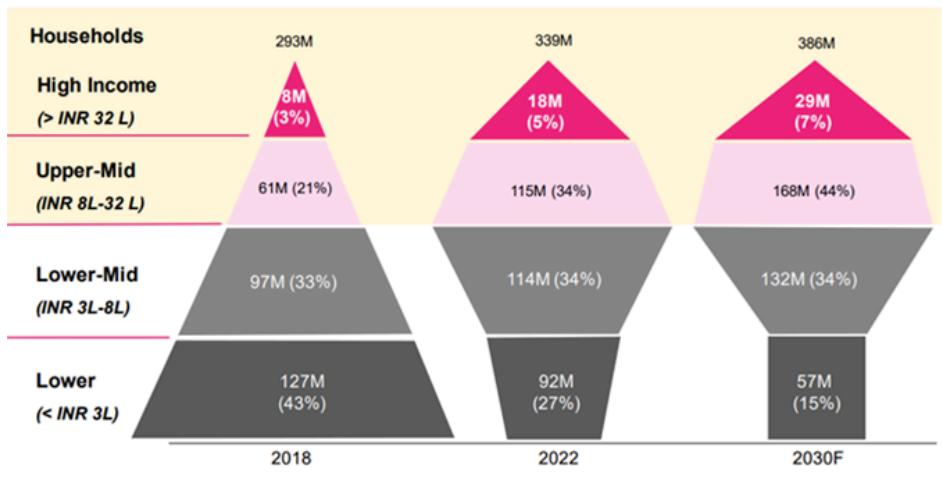

pyramid chart

| Households | 2018 | 2022 | 2030F |
|---|---|---|---|
| High Income (> INR 32 L) | 293M (3%) | 339M (5%) | 386M (7%) |
| Upper-Mid (INR 8L-32 L) | 61M (21%) | 115M (34%) | 168M (44%) |
| Lower-Mid (INR 3L-8L) | 97M (33%) | 114M (34%) | 132M (34%) |
| Lower (< INR 3L) | 127M (43%) | 92M (27%) | 57M (15%) |

Source: Company data, NOM

Fig. 99: FMCG market price segmentation  
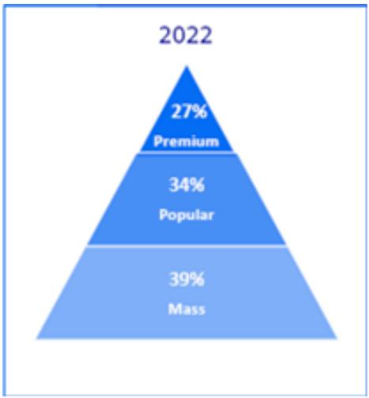

pyramid chart

2022
| Category | Percentage (%) |
| :--- | :--- |
| Premium | 27 |
| Popular | 34 |
| Mass | 39 |

Source: Company data, NOM

## Appendix A-1

This report has been produced by NOM Financial Advisory and Securities (India) Private Limited (NFASL), India. See Disclaimers for NOM Group entity details.

## Analyst Certification

We, Mihir Shah and Riya Patni, hereby certify (1) that the views expressed in this Research report accurately reflect our personal views about any or all of the subject securities or issuers referred to in this Research report, (2) no part of our compensation was, is or will be directly or indirectly related to the specific recommendations or views expressed in this Research report and (3) no part of our compensation is tied to any specific investment banking transactions performed by NOM Securities International, Inc., NOM International plc or any other NOM Group company.

## Important Disclosures

## Online availability of research and conflict-of-interest disclosures

NOM Group research is available on www.NOMnow.com/research, Bloomberg, Capital IQ, Factset, LSEG.

Important disclosures may be read at http://go.NOMnow.com/research/m/Disclosures or requested from NOM Securities International, Inc. If you have any difficulties with the website, please email grpsupport@NOM.com for help.

The analysts responsible for preparing this report have received compensation based upon various factors including the firm's total revenues, a portion of which is generated by Investment Banking activities. Unless otherwise noted, the non-US analysts listed at the front of this report are not registered/qualified as research analysts under FINRA rules, may not be associated persons of NSI, and may not be subject to FINRA Rule 2241 restrictions on communications with covered companies, public appearances, and trading securities held by a research analyst account.

NOM Global Financial Products Inc. (NGFP) NOM Derivative Products Inc. (NDP) and NOM International plc. (NIplc) are registered with the Commodities Futures Trading Commission and the National Futures Association (NFA) as swap dealers. NGFP, NDPI, and NIplc are generally engaged in the trading of swaps and other derivative products, any of which may be the subject of this report.

## Distribution of ratings (NOM Group)

The distribution of all ratings published by NOM Group Global Equity Research is as follows:

57% have been assigned a Buy rating which, for purposes of mandatory disclosures, are classified as a Buy rating; 34% of companies with this rating are investment banking clients of the NOM Group\*. 0% of companies (which are admitted to trading on a regulated market in the EEA) with this rating were supplied material services\*\* by the NOM Group.

41% have been assigned a Neutral rating which, for purposes of mandatory disclosures, is classified as a Hold rating; 57% of companies with this rating are investment banking clients of the NOM Group\*. 0% of companies (which are admitted to trading on a regulated market in the EEA) with this rating were supplied material services by the NOM Group

2% have been assigned a Reduce rating which, for purposes of mandatory disclosures, are classified as a Sell rating; 0% of companies with this rating are investment banking clients of the NOM Group\*. 0% of companies (which are admitted to trading on a regulated market in the EEA) with this rating were supplied material services by the NOM Group.

As at 31 March 2026.

\*The NOM Group as defined in the Disclaimer section at the end of this report.

\*\* As defined by the EU Market Abuse Regulation

## Definition of NOM Group's equity research rating system and sectors

The rating system is a relative system, indicating expected performance against a specific benchmark identified for each individual stock, subject to limited management discretion. An analyst's target price is an assessment of the current intrinsic fair value of the stock based on an appropriate valuation methodology determined by the analyst. Valuation methodologies include, but are not limited to, discounted cash flow analysis, expected return on equity and multiple analysis. Analysts may also indicate expected absolute upside/downside relative to the stated target price, defined as (target price - current price)/current price.

## STOCKS

A rating of 'Buy', indicates that the analyst expects the stock to outperform the Benchmark over the next 12 months. A rating of 'Neutral', indicates that the analyst expects the stock to perform in line with the Benchmark over the next 12 months. A rating of 'Reduce', indicates that the analyst expects the stock to underperform the Benchmark over the next 12 months. A rating of 'Suspended', indicates that the rating, target price and estimates have been suspended temporarily to comply with applicable regulations and/or firm policies. Securities and/or companies that are labelled as 'Not rated' or shown as 'No rating' are not in regular research coverage. Investors should not expect continuing or additional information from NOM relating to such securities and/or companies. Benchmarks are as follows: United States/Europe/Asia ex-Japan: please see valuation methodologies for explanations of relevant benchmarks for stocks, which can be accessed at: http://go.NOMnow.com/research/m/Disclosures; Global Emerging Markets (ex-Asia): MSCI Emerging Markets ex-Asia, unless otherwise

stated in the valuation methodology; Japan: Russell/NOM Large Cap.

## SECTORS

A 'Bullish' stance, indicates that the analyst expects the sector to outperform the Benchmark during the next 12 months. A 'Neutral' stance, indicates that the analyst expects the sector to perform in line with the Benchmark during the next 12 months. A 'Bearish' stance, indicates that the analyst expects the sector to underperform the Benchmark during the next 12 months. Sectors that are labelled as 'Not rated' or shown as 'N/A' are not assigned ratings. Benchmarks are as follows: United States: S&P 500; Europe: Dow Jones STOXX 600; Global Emerging Markets (ex-Asia): MSCI Emerging Markets ex-Asia. Japan/Asia ex-Japan: Sector ratings are not assigned.

## Target Price

A Target Price, if discussed, indicates the analyst's forecast for the share price with a 12-month time horizon, reflecting in part the analyst's estimates for the company's earnings. The achievement of any target price may be impeded by general market and macroeconomic trends, and by other risks related to the company or the market, and may not occur if the company's earnings differ from estimates.

## Disclaimers

This publication contains material that has been prepared by the NOM Group entity identified on page 1 and, if applicable, with the contributions of one or more NOM Group entities whose employees and their respective affiliations are specified on page 1 or identified elsewhere in this publication. The term "NOM Group" used herein refers to NOM Holdings, Inc. and its affiliates and subsidiaries including: (a) NOM Securities Co., Ltd. ('NSC') Tokyo, Japan, (b) NOM Financial Products Europe GmbH ('NFPE'), Germany, (c) NOM International plc ('NIplc'), UK, (d) NOM Securities International, Inc. ('NSI'), New York, US, (e) NOM International (Hong Kong) Ltd. ('NIHK'), Hong Kong, (f) NOM Financial Investment (Korea) Co., Ltd. ('NFIK'), Korea (Information on NOM analysts registered with the Korea Financial Investment Association ('KOFIA') can be found on the KOFIA Intranet at http://dis.kofia.or.kr, (g) NOM Singapore Ltd. ('NSL'), Singapore (Registration number 197201440E, regulated by the Monetary Authority of Singapore) (h) NOM Australia Ltd. ('NAL'), Australia (ABN 48 003 032 513), regulated by the Australian Securities and Investment Commission ('ASIC') and holder of an Australian financial services licence number 246412, (i) NOM Securities Malaysia Sdn. Bhd. ('NSM'), Malaysia, (j) NIHK, Taipei Branch ('NITB'), Taiwan, (k) NOM Financial Advisory and Securities (India) Private Limited ('NFASL'), Mumbai, India (Registered Address: Ceejay House, Level 11, Plot F, Shivsagar Estate, Dr. Annie Besant Road, Worli, Mumbai- 400 018, India; Tel: 91 22 4037 4037, Fax: 91 22 4037 4111; CIN No: U74140MH2007PTC169116, SEBI Registration No. for Stock Broking activities : INZ000255633; SEBI Registration No. for Merchant Banking : INM000011419; SEBI Registration No. for Research: INH000001014 - Compliance Officer: Ms. Pratiksha Tondwalkar, 91 22 40374904, grievance email: investorgrievancesra@NOM.com Webpage: LINK

For reports with respect to Indian public companies or authored by India-based NFASL research analysts: (i) Investment in securities markets is subject to market risks. Read all the related documents carefully before investing. (ii) Registration granted by SEBI, and certification from NISM in no way guarantee performance of the intermediary or provide any assurance of returns to investors. (iii) NFASL terms and conditions for availing research services is disclosed on NFASL webpage.

(I) NOM Fiduciary Research & Consulting Co., Ltd. ('NFRC') Tokyo, Japan. (m) NOM Orient International Securities Co., Ltd ("NOI"), is a majority owned joint venture amongst NOM Group, Orient International (Holding) Co., Ltd, and Shanghai Huangpu Investment Holding (Group) Co., Ltd. In accordance with the laws of the People's Republic of China ("PRC", excluding Hong Kong, Macau and Taiwan, for the purpose of this document), NOI is licensed in the PRC to provide securities research and investment recommendations and it operates independently from the other members of the NOM Group; in particular, NOI's interests in PRC securities are not disclosed to, or aggregated with the holdings of, any other NOM Group entities and the interests in PRC securities of other NOM Group entities are not disclosed to, or aggregated with the holdings of, NOI. An individual name printed next to NOI on the front page of a research report indicates that individual is employed by NOI to provide research assistance to NIHK under a research partnership agreement. 'NSFSPL' next to an employee's name on the front page of a research report indicates that the individual is employed by NOM Structured Finance Services Private Limited to provide assistance to certain NOM entities under inter-company agreements. 'Verdhana' next to an individual's name on the front page of a research report indicates that the individual is employed by PT Verdhana Sekuritas Indonesia ('Verdhana') to provide research assistance to NIHK under a research partnership agreement and neither Verdhana nor such individual is licensed outside of Indonesia.

THIS MATERIAL IS: (I) FOR YOUR PRIVATE INFORMATION, AND WE ARE NOT SOLICITING ANY ACTION BASED UPON IT; (II) NOT TO BE CONSTRUED AS AN OFFER TO SELL OR A SOLICITATION OF AN OFFER TO BUY ANY SECURITIES IN ANY JURISDICTION WHERE SUCH OFFER OR SOLICITATION WOULD BE ILLEGAL; AND (III) OTHER THAN DISCLOSURES RELATING TO THE NOM GROUP, BASED UPON INFORMATION FROM SOURCES THAT WE CONSIDER RELIABLE, BUT HAS NOT BEEN INDEPENDENTLY VERIFIED BY NOM GROUP.

Other than disclosures relating to the NOM Group, the NOM Group does not warrant, represent or undertake, express or implied, that the document is fair, accurate, complete, correct, reliable or fit for any particular purpose or merchantable, and to the maximum extent permissible by law and/or regulation, does not accept liability (in negligence or otherwise, and in whole or in part) for any act (or decision not to act) resulting from use of this document and related data. To the maximum extent permissible by law and/or regulation, all warranties and other assurances by the NOM Group are hereby excluded and the NOM Group shall have no liability (in negligence or otherwise, and in whole or in part) for any loss howsoever arising from the use, misuse, or distribution of this material or the information contained in this material or otherwise arising in connection therewith.

Opinions or estimates expressed are current opinions as of the original publication date appearing on this material and the information, including the opinions and estimates contained herein, are subject to change without notice. The NOM Group, however, expressly disclaims any

obligation, and therefore is under no duty, to update or revise this document. Any comments or statements made herein are those of the author(s) and may differ from views held by other parties within NOM Group. Clients should consider whether any advice or recommendation in this report is suitable for their particular circumstances and, if appropriate, seek professional advice, including tax advice. The NOM Group does not provide tax advice.

The NOM Group, and/or its officers, directors, employees and affiliates, may, to the extent permitted by applicable law and/or regulation, deal as principal, agent, or otherwise, or have long or short positions in, or buy or sell, the securities, commodities or instruments, or options or other derivative instruments based thereon, of issuers or securities mentioned herein. The NOM Group companies may also act as market maker or liquidity provider (within the meaning of applicable regulations in the UK) in the financial instruments of the issuer. Where the activity of market maker is carried out in accordance with the definition given to it by specific laws and regulations of the US or other jurisdictions, this will be separately disclosed within the specific issuer disclosures.

This document may contain information obtained from third parties, including, but not limited to, ratings from credit ratings agencies such as Standard & Poor's. The NOM Group hereby expressly disclaims all representations, warranties or undertakings of originality, fairness, accuracy, completeness, correctness, merchantability or fitness for a particular purpose with respect to any of the information obtained from third parties contained in this material or otherwise arising in connection therewith, and shall not be liable (in negligence or otherwise, and in whole or in part) for any direct, indirect, incidental, exemplary, compensatory, punitive, special or consequential damages, costs, expenses, legal fees, or losses (including lost income or profits and opportunity costs) in connection with any use or misuse of any of the information obtained from third parties contained in this material or otherwise arising in connection therewith. Reproduction and distribution of third-party content in any form is prohibited except with the prior written permission of the related third-party. Third-party content providers do not, express or implied, guarantee the fairness, accuracy, completeness, correctness, timeliness or availability of any information, including ratings, and are not in any way responsible for any errors or omissions (negligent or otherwise), regardless of the cause, or for the results obtained from the use or misuse of such content. Third-party content providers give no express or implied warranties, including, but not limited to, any warranties of merchantability or fitness for a particular purpose or use. Third-party content providers shall not be liable (in negligence or otherwise, and in whole or in part) for any direct, indirect, incidental, exemplary, compensatory, punitive, special or consequential damages, costs, expenses, legal fees, or losses (including lost income or profits and opportunity costs) in connection with any use or misuse of their content, including ratings. Credit ratings are statements of opinions and are not statements of fact or recommendations to purchase hold or sell securities. They do not address the suitability of securities or the suitability of securities for investment purposes, and should not be relied on as investment advice. Any MSCI sourced information in this document is the exclusive property of MSCI Inc. ('MSCI'). Without prior written permission of MSCI, this information and any other MSCI intellectual property may not be duplicated, reproduced, re-disseminated, redistributed or used, in whole or in part, for any purpose whatsoever, including creating any financial products and any indices. This information is provided on an "as is" basis. The user assumes the entire risk of any use made of this information. MSCI, its affiliates and any third party involved in, or related to, computing or compiling the information hereby expressly disclaim all representations, warranties or undertakings of originality, fairness, accuracy, completeness, correctness, merchantability or fitness for a particular purpose with respect to any of this material or the information contained in this material or otherwise arising in connection therewith. Without limiting any of the foregoing, in no event shall MSCI, any of its affiliates or any third party involved in, or related to, computing or compiling the information have any liability (in negligence or otherwise, and in whole or in part) for any damages of any kind. MSCI and the MSCI indexes are services marks of MSCI and its affiliates.

The intellectual property rights and any other rights, in Russell/NOM Japan Equity Index belong to NOM Fiduciary Research & Consulting Co., Ltd. ("NFRC") and FTSE Russell ("Russell"). NFRC and Russell do not guarantee fairness, accuracy, completeness, correctness, reliability, usefulness, marketability, merchantability or fitness of the Index, and do not account for business activities or services that any index user and/or its affiliates undertakes with the use of the Index.

Investors should consider this document as only a single factor in making their investment decision and, as such, the report should not be viewed as identifying or suggesting all risks, direct or indirect, that may be associated with any investment decision. NOM Group produces a number of different types of research product including, among others, fundamental analysis and quantitative analysis; recommendations contained in one type of research product may differ from recommendations contained in other types of research product, whether as a result of differing time horizons, methodologies or otherwise. The NOM Group publishes research product in a number of different ways including the posting of product on the NOM Group portals and/or distribution directly to clients. Different groups of clients may receive different products and services from the research department depending on their individual requirements.

Figures presented herein may refer to past performance or simulations based on past performance which are not reliable indicators of future or likely performance. Where the information contains an expectation, projection or indication of future performance and business prospects, such forecasts may not be a reliable indicator of future or likely performance. Moreover, simulations are based on models and simplifying assumptions which may oversimplify and not reflect the future distribution of returns. Any figure, strategy or index created and published for illustrative purposes within this document is not intended for “use” as a “benchmark” as defined by the European Benchmark Regulation.

Certain securities are subject to fluctuations in exchange rates that could have an adverse effect on the value or price of, or income derived from, the investment.

With respect to Fixed Income Research: Recommendations fall into two categories: tactical, which typically last up to three months; or strategic, which typically last from 6-12 months. However, trade recommendations may be reviewed at any time as circumstances change. 'Stop loss' levels for trades are also provided; which, if hit, closes the trade recommendation automatically. Prices and yields shown in recommendations are taken at the time of submission for publication and are based on either indicative Bloomberg, LSEG or NOM prices and yields at that time. The prices and yields shown are not necessarily those at which the trade recommendation can be implemented.

The securities described herein may not have been registered under the US Securities Act of 1933 (the ‘1933 Act’), and, in such case, may not be offered or sold in the US or to US persons unless they have been registered under the 1933 Act, or except in compliance with an exemption from the registration requirements of the 1933 Act. Unless governing law permits otherwise, any transaction should be executed via a NOM entity in your home jurisdiction.

This document has been approved for distribution in the UK as investment research by NIplc. NIplc is authorised by the Prudential Regulation Authority and regulated by the Financial Conduct Authority and the Prudential Regulation Authority. NIplc is a member of the London Stock

Exchange. This document does not constitute a personal recommendation within the meaning of applicable regulations in the UK, or take into account the particular investment objectives, financial situations, or needs of individual investors. This document is intended only for investors who are 'eligible counterparties' or 'professional clients' for the purposes of applicable regulations in the UK, and may not, therefore, be redistributed to persons who are 'retail clients' for such purposes.

This document has been approved for distribution in the European Economic Area as investment research by NOM Financial Products Europe GmbH (“NFPE”). NFPE is a company organized as a limited liability company under German law registered in the Commercial Register of the Court of Frankfurt/Main under HRB 110223. NFPE is authorized and regulated by the German Federal Financial Supervisory Authority (BaFin).

This document has been approved by NIHK, which is regulated by the Hong Kong Securities and Futures Commission, for distribution in Hong Kong by NIHK. This document is intended only for investors who are 'professional investors' for the purposes of applicable regulations in Hong Kong and may not, therefore, be redistributed to persons who are not 'professional investors' for such purposes.

This document has been approved for distribution in Australia by NAL, which is authorized and regulated in Australia by the ASIC. This document has also been approved for distribution in Malaysia by NSM.

In Singapore, this document has been distributed by NSL, an exempt financial adviser as defined under the Financial Advisers Act (Chapter 110), among other things, and regulated by the Monetary Authority of Singapore. NSL may distribute this document produced by its foreign affiliates pursuant to an arrangement under Regulation 32C of the Financial Advisers Regulations. This document is intended for accredited, expert or institutional investors as defined by the Securities and Futures Act (Chapter 289). Where the recipient of this document is not an accredited, expert or institutional investor, NSL accepts legal responsibility for the contents of this document in respect of such recipient only to the extent required by law. Recipients of this document in Singapore should contact NSL in respect of matters arising from, or in connection with, this document. THIS DOCUMENT IS INTENDED FOR GENERAL CIRCULATION. IT DOES NOT TAKE INTO ACCOUNT THE SPECIFIC INVESTMENT OBJECTIVES, FINANCIAL SITUATION OR PARTICULAR NEEDS OF ANY PARTICULAR PERSON. RECIPIENTS SHOULD TAKE INTO ACCOUNT THEIR SPECIFIC INVESTMENT OBJECTIVES, FINANCIAL SITUATION OR PARTICULAR NEEDS BEFORE MAKING A COMMITMENT TO PURCHASE ANY SECURITIES, INCLUDING SEEKING ADVICE FROM AN INDEPENDENT FINANCIAL ADVISER REGARDING THE SUITABILITY OF THE INVESTMENT, UNDER A SEPARATE ENGAGEMENT, AS THE RECIPIENT DEEMS FIT. Unless prohibited by the provisions of Regulation S of the 1933 Act, this material is distributed in the US, by NSI, a US-registered broker-dealer, which accepts responsibility for its contents in accordance with the provisions of Rule 15a-6, under the US Securities Exchange Act of 1934. The entity that prepared this document permits its separately operated affiliates within the NOM Group to make copies of such documents available to their clients.

This document has not been approved for distribution to persons other than ‘Authorised Persons’, ‘Exempt Persons’ or ‘Institutions’ (as defined by the Capital Markets Authority) in the Kingdom of Saudi Arabia (‘Saudi Arabia’) or a ‘Market Counterparty’ or a ‘Professional Client’ (as defined by the Dubai Financial Services Authority) in the United Arab Emirates (‘UAE’) or a ‘Market Counterparty’ or a ‘Business Customer’ (as defined by the Qatar Financial Centre Regulatory Authority) in the State of Qatar (‘Qatar’) by NOM Saudi Arabia, NIplc or any other member of the NOM Group, as the case may be. Neither this document nor any copy thereof may be taken or transmitted or distributed, directly or indirectly, by any person other than those authorised to do so into Saudi Arabia or in the UAE or in Qatar or to any person other than ‘Authorised Persons’, ‘Exempt Persons’ or ‘Institutions’ located in Saudi Arabia or a ‘Market Counterparty’ or a ‘Professional Client’ in the UAE or a ‘Market Counterparty’ or a ‘Business Customer’ in Qatar. Any failure to comply with these restrictions may constitute a violation of the laws of the UAE or Saudi Arabia or Qatar.

For report with reference of TAIWAN public companies or authored by Taiwan based research analyst:

THIS DOCUMENT IS SOLELY FOR REFERENCE ONLY. You should independently evaluate the investment risks and are solely responsible for your investment decisions. NO PORTION OF THE REPORT MAY BE REPRODUCED OR QUOTED BY THE PRESS OR ANY OTHER PERSON WITHOUT WRITTEN AUTHORIZATION FROM NOM GROUP. Pursuant to Operational Regulations Governing Securities Firms Recommending Trades in Securities to Customers and/or other applicable laws or regulations in Taiwan, you are prohibited to provide the reports to others (including but not limited to related parties, affiliated companies and any other third parties) or engage in any activities in connection with the reports which may involve conflicts of interests. INFORMATION ON SECURITIES / INSTRUMENTS NOT EXECUTABLE BY NOM INTERNATIONAL (HONG KONG) LTD., TAIPEI BRANCH IS FOR INFORMATIONAL PURPOSES ONLY AND IS NOT BE CONSTRUED AS A RECOMMENDATION OR A SOLICITATION TO TRADE IN SUCH SECURITIES / INSTRUMENTS.

This material may not be distributed in Indonesia or passed on within the territory of the Republic of Indonesia or to persons who are Indonesian citizens (wherever they are domiciled or located) or entities of or residents in Indonesia in a manner which constitutes a public offering under the laws of the Republic of Indonesia. The securities mentioned in this document may not be offered or sold in Indonesia or to persons who are citizens of Indonesia (wherever they are domiciled or located) or entities of or residents in Indonesia in a manner which constitutes a public offering under the laws of the Republic of Indonesia.

An individual name printed next to NOI on the front page of a research report indicates that this document is a translation of a research report issued by NOI in the PRC. In all other cases, this document is prepared by NOM Group or its subsidiary or affiliate (collectively, “Offshore Issuers”) that is not licensed in the PRC to provide securities research. This research report is not approved or intended to be circulated in the PRC. The A-share related analysis (if any) is not produced for any persons located or incorporated in the PRC. The recipients should not rely on any information contained in this research report in making investment decisions and Offshore Issuers take no responsibility in this regard. NO PART OF THIS MATERIAL MAY BE (I) COPIED, PHOTOCOPIED, REPRODUCED OR DUPLICATED IN ANY FORM, BY ANY MEANS; OR (II) REDISSEMINATED, REPUBLISHED OR REDISTRIBUTED WITHOUT THE PRIOR WRITTEN CONSENT OF A MEMBER OF THE NOM GROUP. If this document has been distributed by electronic transmission, such as e-mail, then such transmission cannot be guaranteed to be secure or error-free as information could be intercepted, corrupted, lost, destroyed, arrive late or incomplete, or contain viruses. The sender therefore does not accept liability (in negligence or otherwise, and in whole or in part) for any errors or omissions in the contents of this document, which may arise as a result of electronic transmission. If verification is required, please request a hard-copy version.

not limited to, Conflicts of Interest, Chinese Wall and Confidentiality policies) as well as through the maintenance of Chinese Walls and employee training.

Additional information regarding the methodologies or models used in the production of any investment recommendations contained within this document is available upon request by contacting the Research Analysts of NOM listed on the front page. Disclosures information is available upon request and disclosure information is available at the NOM Disclosure web page:

http://go.NOMnow.com/research/m/Disclosures

Copyright © 2026 NOM Financial Advisory and Securities (India) Private Limited, India. All rights reserved.