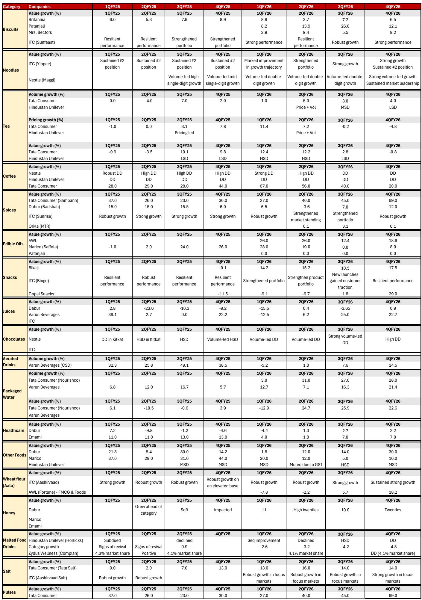
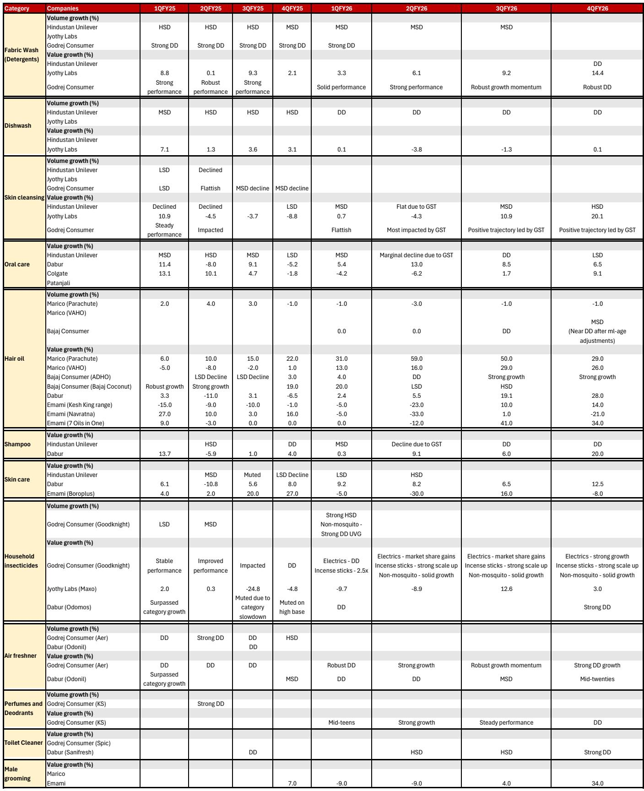
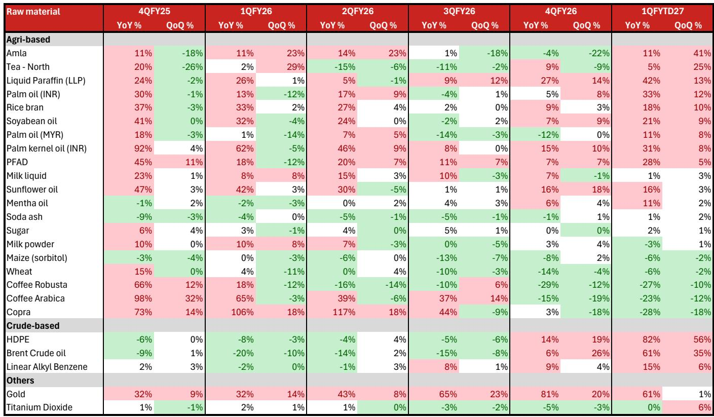

# India's Consumer Staples Recovery Is Real, But the Next Phase Requires a Different Playbook

The Indian consumer staples sector has been waiting for a genuine demand recovery for nearly two years. The fourth quarter of fiscal year 2026 provides the strongest evidence yet that the recovery is finally taking hold—but it is not the uniform, broad-based rebound many investors have been conditioned to expect. Instead, the data reveals a recovery that is structurally uneven, institutionally concentrated, and increasingly dependent on forces that are only partially under the control of management teams.

Revenue growth for staples reached 10.5 percent year-on-year in the fourth quarter, comfortably above the eight-quarter average of 6.7 percent. Volume growth for the organized sector hit 9 percent, the highest reading in four years. These are not ambiguous signals. They represent a genuine inflection point. But the composition of that growth matters far more than the aggregate number. The recovery is being driven by a specific set of catalysts—GST rate cuts, organized sector market share gains, and the rapid expansion of quick commerce—that create a very different set of winners and losers than what the market has historically priced.

The strategic question for investors is not whether the recovery is real. It is whether the current positioning of portfolios and the prevailing consensus on valuation multiples adequately reflect the structural shifts underway beneath the surface. The evidence suggests they do not.

## The Recovery Is Real, But It Is Not a Rising Tide That Lifts All Boats

The headline numbers from the fourth quarter are genuinely encouraging, but they require careful disaggregation. Staples revenue growth improved sequentially to 10.5 percent year-on-year, and the organized sector posted its strongest volume growth in four years. Foods revenue grew 16 percent year-on-year, again above its eight-quarter average. Even home and personal care, the laggard segment, showed revenue growth of 7.4 percent, above its historical average of approximately 5 percent.

Yet the FMCG industry as a whole saw volume growth decline sequentially. This divergence is the single most important analytical fact in the entire report. It means the recovery is not a broad-based demand surge. It is a market share shift. Organized players are growing faster than unorganized players, and the gap is widening. The GST rate cuts, which reduced prices on a range of consumer products, have disproportionately benefited larger, more structured companies that can absorb the margin implications and invest in distribution.

This pattern is not temporary. It reflects a structural advantage that compounds over time. Organized players have better access to capital, stronger brand equity, more sophisticated supply chains, and the ability to navigate regulatory changes. Each quarter of market share gains makes it harder for unorganized players to regain lost ground, because the scale advantages of organized players increase with every incremental percentage point of market share.

The implication for portfolio construction is clear. Passive exposure to the broader consumer staples index is unlikely to capture the full benefit of this recovery. Active selection that favors companies with demonstrated ability to gain market share, particularly in categories where unorganized competition remains meaningful, will be the primary source of alpha.

## Pricing Power Is Returning, But It Will Be Tested by Input Cost Inflation

The pricing environment is undergoing a significant shift. After several quarters of muted pricing growth, companies have begun to implement mid-single-digit price increases in response to rising input costs driven by the West Asia conflict. The report notes that for staples, excluding Marico which had taken sharp price hikes of 60 percent in earlier quarters, pricing-led growth was in the low to mid-single-digit range. But the direction of travel is clear.

The critical assumption embedded in current valuations is that these price increases will not materially pressure volumes. The report supports this view for now, noting that staple categories are relatively less price elastic. But it also provides a threshold: if pricing growth reaches double digits, it could start pressuring volumes. This is not a theoretical risk. Input costs continue to rise, and companies have historically not fully passed on inflation. If the geopolitical situation worsens, companies may be forced to choose between margin compression and volume destruction.

The food segment provides a useful case study. Pricing growth in the fourth quarter was only 2 percent, below the eight-quarter average of 4 percent. But towards the end of the quarter, companies began initiating price hikes of close to mid-single digits. Gross profit margins for food players improved by 55 basis points year-on-year, supported by lower-priced inventory. As that inventory is consumed, margins will face pressure unless pricing accelerates further.

The strategic question for investors is whether management teams have the confidence and the competitive positioning to push pricing hard enough to protect margins without triggering a volume backlash. Companies with strong brand equity, high market share, and limited direct competition from unorganized players are best positioned. Companies in more competitive categories, particularly in home and personal care, face a more delicate balancing act.

## Rural Demand Is Slowing, and the Monsoon Risk Is Real but Not Yet Priced

One of the most important narratives in Indian consumer staples over the past year has been the recovery in rural demand. That narrative is now being tested. The report notes that rural volume growth moderated in the fourth quarter on a high base, while urban demand remained stable. The gap between rural and urban growth is narrowing.

The report identifies three specific headwinds for rural demand: a below-normal monsoon forecast, the potential impact of El Nino, and product price increases being taken by companies due to the West Asia crisis. These are not minor risks. Agriculture remains a significant driver of rural income, and a poor monsoon directly impacts disposable income for a large portion of the consumer base.

The report does offer some mitigating factors. Strong reservoir levels after two years of above-normal monsoon and adequate foodgrain stocks could ease some pressure. The Agricultural Ministry is also making district-level contingency plans. But these are partial offsets, not full solutions.

The market appears to be pricing rural demand as a continuation story rather than a risk factor. Consensus estimates for companies with high rural exposure may need to be revised downward if the monsoon disappoints. This is particularly relevant for companies in categories like biscuits, soaps, and hair oils, where rural consumption is a significant portion of overall demand.

The analytical challenge is that the rural slowdown is happening simultaneously with input cost inflation and pricing increases. These forces are not independent. Higher prices will disproportionately impact rural consumers with lower disposable income. The combination of lower agricultural income and higher product prices creates a potential negative feedback loop that the current consensus does not fully reflect.

## Quick Commerce Is Reshaping Distribution, and the Benefits Are Concentrated

The rise of quick commerce is arguably the most important structural change in Indian consumer goods distribution since the advent of modern trade. The report describes it as growing faster than any other distribution channel, driven by discount offers for customer adoption and the convenience of ten-minute delivery.

The report identifies brands and companies with high market share and strong recall as the key beneficiaries. Their premium portfolios are witnessing a tailwind from the new distribution channel. Competition from new or regional brands has been limited so far.

This is a classic winner-take-most dynamic. Quick commerce platforms have limited shelf space and prioritize fast-moving, high-demand products. Established brands with strong consumer recognition are disproportionately represented. New entrants and smaller brands struggle to gain visibility and distribution.

The report also notes that competition from direct-to-consumer brands has moderated significantly. From 300 brands in 2018 to 11,000 brands in 2025, the D2C explosion has produced only 233 brands that have crossed sales of INR 1.5 billion. Most remain unprofitable. The window for D2C disruption appears to be closing, at least in the near term, as the environment becomes less conducive for new product launches.

For investors, the quick commerce channel represents both an opportunity and a risk. Companies that have successfully adapted their go-to-market strategies, created platform-specific pack portfolios, and invested in supply chain capabilities will benefit disproportionately. Companies that have been slow to adapt risk losing relevance with a growing segment of consumers, particularly in urban markets.

The report highlights Hindustan Unilever's investments in quick commerce capability building, noting that customer availability has increased by approximately 1,400 basis points. This is the kind of operational detail that separates winners from laggards in a rapidly evolving distribution landscape.

## The Margin Story Is More Nuanced Than the Headline Numbers Suggest

Aggregate EBITDA growth for staples was 11.6 percent year-on-year in the fourth quarter, well above the eight-quarter average of 4.6 percent. But the composition of margin performance reveals significant divergence across segments.

Gross profit margins for staple companies remained largely range-bound, as expansion in food was offset by contraction in home and personal care. Structural cost savings and stable advertising spending helped maintain operating profit margins at the sector level. But this is a fragile equilibrium.

Home and personal care companies face particularly challenging margin dynamics. Gross profit margins contracted 70 basis points year-on-year amid high competitive intensity. Operating profit margins were maintained through cost efficiency measures and better operating leverage, but these are not sustainable sources of margin improvement indefinitely.

The food segment, in contrast, showed meaningful margin expansion. Operating profit margins improved by 86 basis points year-on-year and 170 basis points sequentially, driven by cost efficiency and operating leverage. This is consistent with the broader theme of organized players gaining scale and benefiting from fixed cost absorption.

The report's forward view on margins is cautious. It notes that consumer companies in the past have not fully passed on inflation costs, and near-term margins could be impacted. The expectation is that margins will be made up later, but this assumes that pricing power persists and competitive dynamics remain favorable. Both assumptions are worth questioning.

The companies that can protect or expand margins in this environment will be those with a combination of strong brand equity, cost efficiency programs, and the ability to pass through input cost increases without losing market share. This is a high bar, and not all companies will clear it.

## What the Report Does Not Fully Answer: The Interaction of Multiple Forces

The report provides a comprehensive analysis of the current state of Indian consumer staples, but it leaves several important questions unanswered. The most critical is the interaction between the multiple forces that are simultaneously affecting the sector.

How will the combination of input cost inflation, pricing increases, rural demand moderation, and monsoon risk play out over the next two to three quarters? Each of these forces is analyzed individually, but their interaction could produce outcomes that are not captured by linear extrapolation.

For example, if pricing increases reach double digits in some categories, and rural demand is simultaneously pressured by a poor monsoon, the volume impact could be significantly worse than the report's base case. Conversely, if the monsoon is better than expected and input cost inflation moderates, the recovery could accelerate beyond current expectations.

The report also does not fully address the competitive response to the price increases being implemented. If some companies push pricing aggressively while others hold back, market share dynamics could shift in unexpected ways. The report notes that organized players are better positioned to navigate inflation, but it does not model the potential for a price war in categories where competitive intensity is high.

Another open question is the sustainability of the quick commerce tailwind. The channel is growing rapidly, but it is also burning cash through discount offers. If the platforms eventually need to reduce discounts to achieve profitability, the volume boost for brands could moderate. The report does not address this potential headwind.

These are not criticisms of the report. They are the natural boundaries of any analytical exercise. But they highlight the importance of active monitoring and scenario planning rather than assuming that current trends will persist unchanged.

## A Decision Framework for Investors Navigating the Recovery

The report provides the raw material for a structured investment decision framework. Investors should evaluate consumer staples companies along four dimensions:

First, market share trajectory. Companies that are gaining share from unorganized players have a structural tailwind that will persist regardless of the macroeconomic environment. The report's data on organized versus unorganized growth rates provides a clear starting point for identifying these companies.

Second, pricing power. Companies with strong brand equity and high market share in relatively inelastic categories can pass through input cost increases without meaningful volume impact. The report's analysis of pricing trends across segments provides a useful benchmark.

Third, distribution capability. Companies that have successfully adapted to the quick commerce channel and built platform-specific capabilities will benefit from the fastest-growing distribution channel. The report's discussion of specific company initiatives provides actionable insights.

Fourth, rural exposure. Companies with high rural revenue exposure face additional risk from monsoon uncertainty and the potential for demand moderation. The report's analysis of rural trends and the factors that could influence them provides a framework for assessing this risk.

The optimal portfolio positioning, based on the report's analysis, would overweight companies with strong market share momentum, demonstrated pricing power, successful quick commerce adaptation, and manageable rural exposure. It would underweight companies that are losing market share, facing competitive pressure on pricing, slow to adapt to new distribution channels, or heavily dependent on rural demand.

## The Full Picture Requires Deeper Analysis

The report contains a wealth of additional detail that cannot be fully captured in a summary. It includes specific company analyses for Colgate, Hindustan Unilever, Marico, Britannia, Nestle, EPL, and Godrej Consumer Products, each with unique strategic positions and forward guidance. It provides detailed segment-level margin analysis, channel-wise growth data, and management commentary on future expectations.

The charts referenced in the report, including Figures 7 through 36, contain granular data on volume growth, pricing growth, margin trends, and rural-urban dynamics that are essential for building conviction on individual company positions. These are not decoration. They are the analytical foundation for the conclusions drawn in the report.

The report also includes specific forward guidance from management teams that provides insight into how companies are positioning themselves for the coming quarters. Britannia expects normalization of dual pricing impacts. Dabur expects price hikes to drive double-digit sales growth. Godrej Consumer Products has laid out medium-term targets for category growth. Marico has upgraded its guidance in a sign of confidence that is rare in the current environment.

Each of these company-specific analyses contains investment implications that go beyond the sector-level trends discussed in this article. Understanding the nuances of each company's position is essential for making informed investment decisions.

The recovery in Indian consumer staples is real, but it is not simple. The companies that will generate the strongest returns are those that can navigate the interaction of market share shifts, pricing dynamics, distribution evolution, and macroeconomic risks. The report provides the analytical tools to identify those companies, but the final judgment requires a deeper dive into the data and the individual company narratives.

Join the community to read the full report and review the original charts.

*This article is for learning and discussion only and does not constitute investment advice.*

Personal reading notes and learning share only. Not investment advice.

