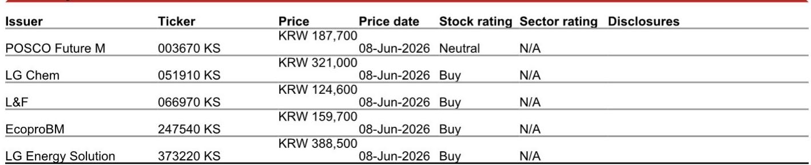
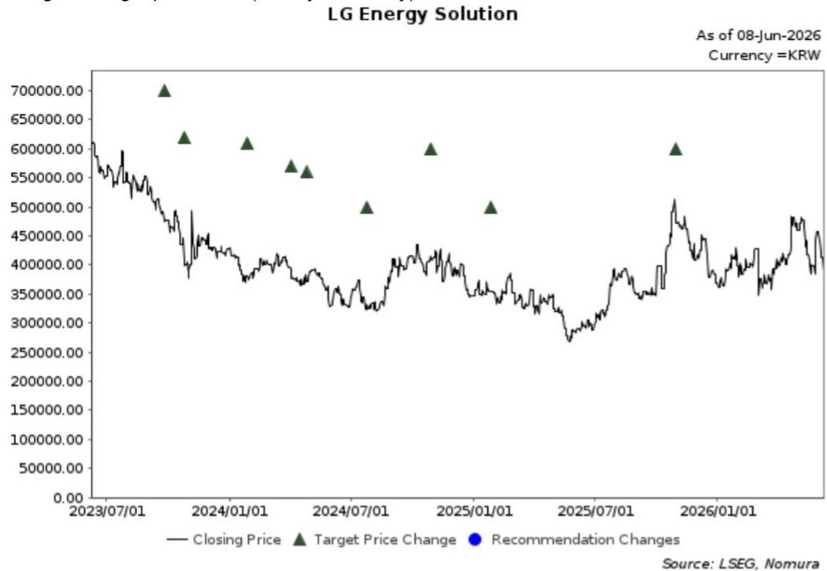

# Korea's Cathode Trio Is Splitting Into Three Distinct Strategies, and Only One Is Built for the Post-Subsidy World

The conventional narrative that all Korean cathode makers are racing toward the same destination is collapsing under the weight of recent disclosures. At the NOM Investment Forum Asia 2026, three of Korea's largest cathode producers—EcoproBM, L&F, and LG Chem—laid out strategic roadmaps that diverge so sharply they no longer compete in the same game. One is doubling down on high-nickel for Europe's subsidy-driven recovery. Another is betting that LFP chemistry will unlock the US energy storage market before any competitor can follow. The third is playing a conglomerate-wide restructuring hand that ties cathode profitability to a chemical division overhaul and a deliberate reduction in its LG Energy Solution stake.

These are not variations on a theme. They are fundamentally different bets on where value will migrate in the battery supply chain over the next five years. The critical question for investors is no longer which company has the largest capacity target for 2030. It is which strategic architecture is most resilient to the forces that will reshape demand after the current wave of government subsidies recedes.

The timing of these disclosures matters deeply. Europe's EV subsidies are returning, with the UK and Germany reviving consumer incentives. The US Inflation Reduction Act continues to drive onshoring of battery supply chains. But the subsidy cycle is inherently finite, and the window for cathode makers to lock in structural advantages is narrowing. Each company's current choices will determine whether it emerges as a long-term winner or a commodity supplier in a market that is already showing signs of overcapacity.

What follows is an analysis of the three strategies, the unresolved tensions within each, and a decision framework for investors trying to navigate a sector where differentiation is suddenly real.

## EcoproBM's European High-Nickel Bet Rests on Execution of a Single Factory

EcoproBM is pursuing the most concentrated strategy of the three. Of its 244,000 tonnes per annum of total cathode capacity, 54,000 tonnes are located in Hungary, with the first line scheduled to commence operations in June 2026 and the second line expected in the second half of the year. The company is also working to convert a third line into NCM production specifically to supply non-Korean battery plants in Europe.

This is a bet with clear logic. Europe's EV market is experiencing a policy-driven revival, and the region's regulatory environment increasingly demands onshore supply-chain installations. EcoproBM's product mix is concentrated on high-nickel cathode for EV applications, which positions it to serve premium European automakers that have not yet committed to LFP chemistries for their core models. The company is also strengthening upstream integration through the Ecopro Group's approximately 10% stake in Indonesian nickel smelters with combined capacity of 150,000 tonnes per annum, with Phase 2 investments under evaluation.

The strategic clarity is admirable, but the risk concentration is significant. The entire European growth thesis hinges on the successful ramp-up of the Hungary plant. Delays in production qualification, customer acceptance, or cost targets would directly impair the company's ability to capture the subsidy-driven demand wave. Moreover, EcoproBM has explicitly deprioritized LFP investments, focusing instead on solid-state cathode from 2027 and Indonesian nickel expansion. This means the company is structurally exposed to any shift in European OEM demand toward lower-cost chemistries, particularly if subsidy programs are phased out or if Chinese LFP producers establish European production capacity faster than expected.

The unanswered question is whether EcoproBM's high-nickel focus will prove to be a premium positioning or a stranded asset if the European market bifurcates into a small premium segment and a large volume segment that demands cost-competitive LFP. The company's near-term priorities are clear, but the strategic hedge is absent.

## L&F's LFP Pivot Creates First-Mover Advantage in US Energy Storage, But the Technology Path Is Unproven

L&F is pursuing a fundamentally different thesis. The company expects its shipment volumes to rise 19% year-on-year to 80,000 tonnes in 2026, with approximately 85% of revenue coming from LG Energy Solution, with Tesla as the end customer. But the real strategic news is the commercialization of Korea's first LFP cathode production.

L&F is building 60,000 tonnes per annum of LFP cathode capacity in Korea, with 30,000 tonnes likely to be commercialized in the third quarter of 2026 and the remaining 30,000 tonnes in the first half of 2027. Initial production will be supplied to Samsung SDI's US energy storage system business under a long-term supply agreement signed in March 2026. Management sounded optimistic about LFP cathode profitability, assuming an ASP of USD 11 per kilogram, although overall profitability likely still favors high-nickel cathodes.

This is a strategically intelligent move. The US ESS market is a large and rapidly growing consumer of cost-competitive LFP batteries, and Samsung SDI's expanding US footprint provides a captive customer base for initial volumes. Longer term, L&F sees a likelihood of its LFP applications extending to EVs, which would open a much larger addressable market. The company is also working to diversify its LFP customer base, though this may require additional capital expenditure if contracts are signed.

The most intriguing technological development is L&F's pursuit of precursor-free LFP. Conventional cathode production involves three steps: making the NCM precursor, mixing the precursor with lithium, and high-temperature calcination. Precursor-free LFP aims to skip the mixing ingredient part and finalize much of production in the calcination process. This is technologically challenging because it requires uniform metal mixing, lithium addition, and crystal structure formation all at once. If successful, however, it would lower costs and reduce dependency on imported Chinese precursor.

The unresolved question here is whether L&F can achieve the cost and quality targets for precursor-free LFP at scale. The technology is not yet proven in commercial production, and the company's profitability assumptions depend on ASP levels that may be challenged by Chinese LFP producers with established cost advantages. L&F is also working on sodium batteries that can be swing-produced from the LFP line, which adds optionality but also complexity to the production planning.

The strategic bet is that first-mover advantage in US ESS, combined with technological differentiation in precursor-free production, will create a defensible position before Chinese competitors establish local production. The risk is that the technology timeline slips or that customer diversification requires more capital than currently anticipated.

## LG Chem's Turnaround Depends on Chemical Restructuring and a Controlled Reduction of Its LGES Stake

LG Chem's strategy is the most complex and the most dependent on factors outside the cathode business itself. The company expects cathode shipment recovery to accelerate in the second half of 2026, supported by the ramp-up of North American battery production and the start of mass production for 2170 cell supplies in the third quarter of 2026. Current utilization is low, but improving volumes should drive a gradual recovery in profitability.

New CEO Dong-chun Kim regards cathode and electronics materials as key growth drivers. In addition to existing nickel-based cathode, LG Chem is preparing to commercialize LFP cathode, possibly by 2027-2028. Management acknowledged that a competing peer gained an early advantage with a leading EV OEM customer, but expects LG Chem's position to improve, targeting a roughly 50:50 share over time.

The most significant structural development is the chemical business restructuring. Management outlined a plan centered on forming a joint venture and rationalizing naphtha cracker capacity. The objective is to consolidate approximately 4.0 million tonnes of NCC capacity and shut down about 1.0 million tonnes, addressing industry oversupply and weak ethylene economics. Management believes significant cost reductions can be achieved through this restructuring.

On the shareholder return front, LG Chem has linked management compensation metrics to ratios such as over 10% ROE, is monitoring its net asset value discount at the board level, and has reiterated plans to reduce its LG Energy Solution stake to 70% over the next five years. This is a deliberate strategy to unlock value by narrowing the conglomerate discount.

The strategic question is whether the cathode business can achieve meaningful profitability before the chemical restructuring is complete. The two are linked: cash flow from chemical operations has historically funded cathode investments, and the restructuring may temporarily reduce that cash generation. The LFP cathode timeline of 2027-2028 also means LG Chem will be a late entrant compared to L&F, which may have already established customer relationships and production scale by then.

The unresolved tension is between the need to invest in cathode capacity to catch up with competitors and the need to restructure the chemical business to improve overall returns. These objectives may conflict in the near term.

## What the Report Does Not Fully Answer: The Demand Elasticity Question and the China Overhang

The report provides detailed capacity expansion plans and shipment forecasts for each company, but it does not fully address two critical variables that will determine whether these strategies succeed.

First, there is the question of demand elasticity. The capacity expansion plans show Korean cathode players targeting combined capacity of over 1.3 million tonnes by 2030, with shipments forecast to reach over 800,000 tonnes. These numbers assume that global EV adoption continues at a robust pace and that Western OEMs maintain their current chemistry preferences. But what happens if European subsidy programs are phased out earlier than expected, or if US policy shifts after the next election cycle? The report's demand assumptions are implicit rather than stress-tested.

Second, there is the China overhang. Chinese cathode producers have significant cost advantages in both high-nickel and LFP chemistries, and they are increasingly establishing production capacity outside China to serve Western customers. The report does not model the impact of Chinese capacity entering the European and US markets at scale. If Chinese LFP producers can deliver at USD 8 per kilogram versus L&F's assumed USD 11, the profitability thesis for Korean LFP production weakens considerably.

These are not flaws in the report; they are analytical gaps that any serious investor must fill with their own scenario analysis. The report's value is in providing the strategic differentiation among the three Korean players. The demand and competitive dynamics require additional work.

## A Decision Framework for Investors: Map Each Company Against Three Critical Variables

To translate these strategic differences into investment decisions, investors should evaluate each company against three variables: demand geography exposure, chemistry diversification, and balance sheet resilience.

On demand geography exposure, EcoproBM is the most concentrated in Europe, L&F is the most exposed to the US ESS market, and LG Chem has the most diversified exposure across Korea, North America, and Europe. If the European subsidy revival proves durable, EcoproBM benefits most. If the US ESS market grows faster than expected, L&F benefits most. If both markets disappoint, LG Chem's diversification provides the most downside protection.

On chemistry diversification, L&F is the most aggressive in LFP, EcoproBM is the most committed to high-nickel, and LG Chem is pursuing both but with a later timeline. If LFP adoption accelerates faster than expected in both ESS and EVs, L&F is best positioned. If high-nickel remains dominant in premium EVs, EcoproBM wins. If the market bifurcates cleanly, LG Chem's dual approach may prove optimal but carries execution risk on both fronts.

On balance sheet resilience, LG Chem has the strongest parent company support but also the most complex restructuring to execute. EcoproBM has the most focused capital allocation but the least financial flexibility if the Hungary plant faces delays. L&F has the most aggressive growth plan relative to its current scale, which means it has the least margin for error.

The optimal portfolio approach may be to own two of the three, hedging the outcome of the subsidy cycle and the LFP adoption curve. But the key insight is that these companies are no longer interchangeable. The strategic divergence is real, and it will produce very different outcomes depending on how the macro environment evolves.

## Join the Community to Read the Full Report and Review the Original Charts

The analysis above is based on takeaways from the NOM Investment Forum Asia 2026, but the full report contains detailed capacity expansion charts, shipment forecasts through 2030, and specific valuation methodologies for each company. The original charts show capacity and shipment trajectories that are not fully captured in the text, and they provide the quantitative basis for the strategic judgments outlined here.

Investors who want to stress-test these strategies against their own demand assumptions will find the full data set essential. The report also includes target prices and risk factors for each company that were not included in this article due to space constraints.

Join the community to read the full report and review the original charts.

*This article is for learning and discussion only and does not constitute investment advice.*

Personal reading notes and learning share only. Not investment advice.

