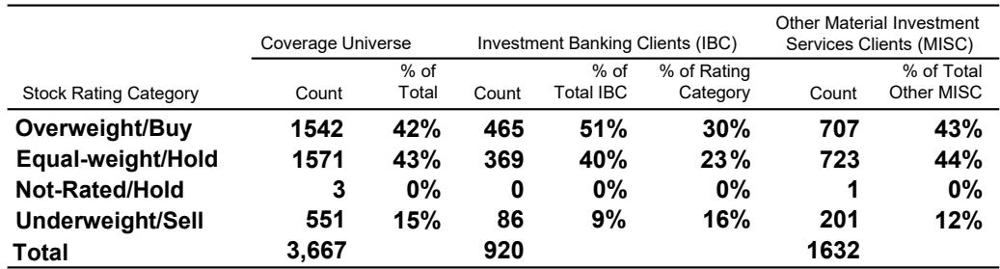

# The Market Has Misread the Labor Report: Why a Neutral Fed and Disinflationary Core Create a Pro-Cyclical Opportunity

The May nonfarm payrolls report delivered a headline number that, on its surface, appears to confirm the overheating narrative that has dominated market discourse for weeks. Payrolls rose 172,000, prior months were revised up by a cumulative 93,000, and the three-month moving average now sits at a robust 188,000. For investors who have been positioning for a renewed rate hike cycle, this data seemed to validate their fears. But this interpretation is precisely the mistake that will separate outperforming portfolios from those that chase the wrong signal.

The critical insight from the latest macro forum is that the market has been too focused on the headline strength of the labor market while ignoring the details beneath the surface. Core CPI is decelerating on softer services, wage dynamics are cooling, and the Federal Reserve remains firmly in neutral territory. This combination—strong employment, disinflationary core, and a patient Fed—has historically been one of the most powerful tailwinds for equity markets, particularly for cyclical sectors. The correction that began last week was overdue from a technical perspective, but it does not signal the start of a sustained downturn.

The strategic question for investors is not whether the economy is overheating. It is whether you have the conviction to look past the noise in the headline data and position for the regime that is actually emerging: a Goldilocks environment where growth supports earnings, inflation remains contained enough to keep the Fed on hold, and liquidity conditions, while tightening, have not yet reached a threshold that would force aggressive central bank intervention.

## The Labor Market Is Strong but Not Overheating, and the Fed Has Room to Remain Patient

The headline payrolls number and the upward revisions to prior months have understandably captured attention. A three-month average of 188,000 is well above the breakeven pace of approximately 50,000 that the economists estimate would keep the unemployment rate stable. If this pace continues, the unemployment rate, currently at 4.3 percent, will likely drift lower. On the surface, this looks like a labor market that is tightening, not loosening.

But the so-what for investors lies in the composition, not the aggregate. Aggregate payroll income growth, while still positive, has decelerated from the peaks seen last summer. The three-month annualized change in aggregate payroll incomes has moderated, and this matters far more for future consumption and inflation than the raw job count does. Income growth drives demand. When income growth slows, the pass-through to core services inflation diminishes, even if employment levels remain high.

The economists make a crucial distinction that many market participants have overlooked: narrow breadth and cooling wage dynamics are not congruent with rate hike risk premium. In plain language, the labor market is adding jobs, but it is doing so in a way that is not generating the kind of wage-price spiral that would force the Fed's hand. Core services inflation ex-rents has been decelerating, and the tariff effects on goods prices, while still present, continue to fade. This is not the setup for a rate hike cycle. It is the setup for a patient, neutral Fed that can afford to look through headline noise.

The implication for portfolio construction is direct: do not hedge against rate hikes. The market has been pricing in a risk premium that the underlying data does not support. If the Fed remains on hold and core inflation continues to decelerate, the current yield levels in USTs represent an opportunity, not a threat. Lower yields on the forecast horizon would support equity valuations, particularly for rate-sensitive sectors.

## Inflation That Does Not Trigger Fed Tightening Is a Positive for Equities, Especially Cyclicals

There is a deeply ingrained reflex in markets that rising inflation is bad for stocks. This reflex is correct only when inflation forces the central bank to raise rates. When inflation rises in an environment where the Fed remains neutral, the relationship flips entirely. This is the single most important macro insight from the current analysis.

The historical data is unambiguous. In environments where earnings growth is above median and the Fed is neutral, the S&P 500 has delivered an average 12-month return of 16.3 percent, with a median of 14.0 percent and a positive hit rate of 92 percent. The worst outcome in these regimes was a decline of just 2.6 percent. This is not a marginal pattern; it is one of the most consistent return regimes in modern market history.

The mechanism is straightforward. Nominal GDP growth drives corporate revenues. When inflation is rising but the Fed is not tightening, nominal sales growth accelerates without a corresponding increase in the discount rate applied to future earnings. The result is a double positive for equities: higher earnings and stable or expanding multiples. The relationship between producer price inflation and S&P 500 sales growth is well-established, with PPI leading sales growth by approximately four months. The current trajectory of PPI suggests that sales growth will remain supportive through the remainder of the year.

Cyclical sectors benefit disproportionately in this regime. When inflation is moderate and the Fed is on hold, the pricing power that cyclical companies enjoy translates directly into margin expansion. Commodity-related equities, industrials, and financials have historically been the primary beneficiaries. The semiconductor index, which had become as extended as it has been since the tech bubble, experienced a overdue correction last week. But the fundamental driver for these sectors—strong demand in a non-recessionary environment—remains intact.

## Rate Volatility, Not Rate Levels, Is the True Risk to Monitor in the Current Environment

The relationship between equities and interest rates has shifted meaningfully. With 10-year UST yields above 4.5 percent, equities have become negatively correlated to rates. This means that when yields rise, stocks fall, and vice versa. This negative correlation is a recent development and reflects the market's sensitivity to the idea that higher yields could eventually constrain equity valuations.

However, the analysis makes a critical distinction that most investors miss. It is not the level of rates that poses the greatest risk to equities; it is rate volatility. When bond volatility spikes, it acts as a trigger that spills over into equity markets through the channel of duration risk and hedging flows. The relationship between the MOVE index and the S&P 500's forward P/E is tight and has been a reliable indicator of equity stress.

The current level of rate volatility is elevated but not yet at a threshold that would force a sustained equity drawdown. The key question is whether the labor market data and inflation prints over the coming months will increase or decrease bond volatility. If core CPI continues to decelerate as forecast, rate volatility should decline, which would remove the primary near-term risk to equities. If, however, headline inflation remains sticky due to energy prices or other supply-side factors, volatility could remain elevated, creating a headwind for multiple expansion.

This is where the distinction between core and headline inflation becomes operationally important. Core CPI is forecast to decelerate to 2.8 percent year-over-year, driven by softer services inflation. Headline CPI, at 4.3 percent, remains elevated due to energy. The market's reaction function will depend on which measure the Fed chooses to emphasize. If the Fed continues to look through energy-driven headline inflation and focuses on core, rate volatility should subside. If the market interprets sticky headline inflation as a signal that the Fed may need to act, volatility could persist.

## Liquidity Is the Most Underappreciated Variable in the Current Market Regime

The analysis identifies liquidity as the most underappreciated and misunderstood factor for risk assets. This is not a reference to central bank balance sheet policy in the abstract; it is a reference to the specific conditions in funding markets that determine when the Fed will intervene more aggressively with its standing repo facility.

Funding market stress, as measured by the SOFR rate and other money market indicators, has historically been the canary in the coal mine for broader risk asset stress. When funding markets tighten, the Fed is forced to intervene, and that intervention often comes with a shift in the overall policy stance. The relationship between aggregate liquidity and the S&P 500 is well-established, with changes in liquidity leading equity returns by approximately three months.

The current liquidity backdrop is mixed. Aggregate liquidity has been tightening, but not at a pace that has historically preceded significant equity drawdowns. The critical threshold to monitor is whether funding market stress reaches a level that forces the Fed to expand its balance sheet support. If it does, that would be a positive for risk assets in the near term, as liquidity injection would support valuations. If it does not, the gradual tightening of liquidity will act as a slow drag on multiple expansion.

The strategic implication is that investors should be monitoring SOFR spreads and repo market conditions as leading indicators, not as lagging confirmations. By the time funding stress becomes obvious in equity prices, the opportunity to adjust positioning has often passed. The current environment does not suggest imminent funding stress, but the trajectory bears watching.

## What the Report Does Not Fully Answer: The Energy Price Risk and the Consumer Threshold

Every analytical framework has its blind spots, and this report is no exception. There are two critical questions that the analysis raises but does not fully resolve, and these represent the primary risks to the constructive view.

The first is the energy price channel. The report notes that there is no sign of an energy drag on the labor market yet, but this is a conditional statement. Energy prices have been volatile, and if they sustain their current elevated levels, the pass-through to consumer spending and corporate margins could become material. The historical relationship between energy prices and consumer confidence is well-documented, and a sustained spike in gasoline prices has often preceded a slowdown in discretionary spending. The report's constructive view on cyclicals implicitly assumes that energy prices do not reach a threshold that damages consumer demand. This assumption is reasonable but not guaranteed.

The second unresolved question is the consumer threshold for rate sensitivity. The analysis correctly notes that equities can stomach inflation as long as the Fed is not raising rates. But this relationship assumes that consumers can also stomach inflation. If headline CPI remains above 4 percent for an extended period, real wage growth will be compressed, and the consumer spending that has supported the economy could weaken. The labor market data is strong today, but labor market data is a lagging indicator. If consumer sentiment deteriorates, the labor market will eventually follow.

These open questions do not invalidate the constructive thesis, but they do define the boundaries within which the thesis operates. As long as energy prices remain contained and consumer spending holds up, the pro-cyclical opportunity is compelling. If either of these conditions breaks, the regime shifts.

## A Decision Framework for Positioning in the Current Regime

For investors trying to translate this analysis into portfolio decisions, a structured framework is more useful than a list of recommendations. The following decision tree captures the key variables and their implications.

First, assess the Fed's reaction function. If the Fed remains neutral and continues to emphasize core inflation over headline, the environment is favorable for equities, particularly cyclicals. If the Fed signals a willingness to hike in response to headline inflation, the regime shifts to defensive positioning. The current evidence supports the former scenario, but this must be monitored after each data release.

Second, evaluate the trajectory of rate volatility. If the MOVE index declines from current levels, the near-term risk to equities recedes, and multiple expansion becomes more likely. If rate volatility increases, reduce exposure to long-duration equities and increase cash or short-duration fixed income. The core CPI forecast supports a decline in volatility, but energy price data could disrupt this path.

Third, monitor funding market conditions. If SOFR spreads remain stable and aggregate liquidity does not deteriorate further, the liquidity backdrop is supportive for risk assets. If funding markets show signs of stress, prepare for a potential Fed intervention that would initially be negative for risk assets but ultimately supportive.

Fourth, position for breadth expansion. The market has been narrow, with a handful of mega-cap technology stocks driving returns. The analysis suggests that broader participation is coming, with cyclicals and value sectors benefiting from the current macro mix. This is not a call to abandon growth stocks entirely, but it is a call to ensure that portfolios are not overly concentrated in the names that have already priced in perfection.

Finally, accept that the correction last week was a healthy technical reset, not a fundamental reversal. Extended positioning in semiconductors and other high-beta sectors needed to be unwound. The fact that this unwinding occurred on strong macro data is a positive signal, not a negative one. It suggests that the correction was about positioning, not about a deterioration in the economic outlook.

## The Full Picture Requires the Data Behind the Charts

The charts and data that support this analysis contain nuances that cannot be fully captured in a written summary. The relationship between PPI and S&P 500 sales growth, the precise thresholds for rate volatility that have historically triggered equity stress, and the detailed breakdown of core CPI components all contain actionable signals that deserve careful study.

The most important unresolved question is whether the market will eventually recognize that it has been pricing the wrong risk. If the Fed remains neutral and core inflation continues to decelerate, the current level of rate hike risk premium in the market represents a mispricing that will correct over time. That correction would be a powerful tailwind for equities, particularly for the cyclical sectors that have been held back by the overheating narrative.

But mispricings can persist longer than investors expect, and the path to recognition is never linear. The data over the coming months will determine whether the constructive thesis is validated or challenged. The charts in the full report provide the granular evidence that supports the current view and the leading indicators that will signal when that view needs to change.

Join the community to read the full report and review the original charts.

*This article is for learning and discussion only and does not constitute investment advice.*

Personal reading notes and learning share only. Not investment advice.

