# Commodity Market Positioning & Flows

Agri and precious metals drive global commodity open interest decline

- The estimated value of open interest across tracked commodity markets decreased by 1% WoW (\$14 billion) to \$1.8 trillion, falling for three consecutive weeks (as of 5 Jun) (Table 2, Figure 2). The decline was led by agri and precious metals markets as prices across grains & oilseeds and gold & silver fell sharply over the week, driving the overall open interest decline even as total net contract-based flows were supported by inflows into metals. On the macro front, our economists see the strong US employment report as reinforcing their view that a cyclical lift in global business spending is now broadening to hiring in a manner that will cushion the energy price drag on household purchasing power. Meanwhile, the combination of a cyclical lift alongside sticky and elevated inflation furthers the case for a Fed hike ahead (Global Data Watch: Yes, and it counts, Kasman et al, 5 June 2026).  
- The estimated value of net investor positioning aggregated across global commodity futures markets remained broadly flat WoW at \$223 billion as of the latest data available (Table 1, Figure 3, Figure 4). Net length in energy markets decreased by \$7.7 billion WoW, as investors cut length across Brent and Dubai crude oil benchmarks and across TTF Natgas. Net length in precious metals increased by \$10 billion WoW and net length in base metals increased by \$2 billion WoW, led by gold and copper respectively. Net length in agri markets decreased by \$6 billion WoW led by a decline in grains & oilseeds. JPM QDS's latest projections, as of June 8, indicate that positioning across commodity markets is expected to decline further by nearly \$15 billion, primarily from a decline in agri (-\$10 billion) and precious metals markets (-\$3 billion).  
- The Global Commodities Inventory Monitor (GCIM) remained broadly stable in May at 69.4 days-of-use. On an ex-China basis—which is a proxy for globally tradeable inventories—the monitor also remained stable in May at 58.6 days-of-use. Across the GCIM, rising US natural gas availability was offset by declines across oil and aluminum availability. Agri availability was largely stable across both monitors over the month. Stripping out the seasonal impact of US natural gas storage, GCIM through May remained broadly stable at 73.2 days-of-use. Ex-China commodity availability (ex US natural gas) also stabilized at 64.7 days-of-use in May. Across the GCIM (ex-US natural gas), inventory availability only rose for lead, zinc and nickel.  
- The estimated value of open interest in energy markets remained broadly flat WoW at \$819 billion (5 Jun, Figure 6) as the decline in the open interest across the crude oil markets was more than offset by an increase across the petroleum products and natural gas markets. The estimated value of open interest across the crude oil and petroleum products markets declined by \$3 billion, driven by net contract-based outflows of \$10 billion from crude oil markets, partially offset by an increase in prices across crude oil (NYM WTI up 4% WoW) and petroleum products markets (ICE Gas Oil up 5% WoW). Our base case assumes the Strait of Hormuz reopens in June,

## Global Commodities Research

## Otar Dgebuadze, CFA

(44-20) 3493-8246

otar.dgebuadze@JPM.com

JPM Securities plc

## Natasha Kaneva

(1-212) 834-3175

natasha.kaneva@JPM.com

JPM Chase Bank NA

## Gregory C. Shearer

(44-20) 7134-8161

gregory.c.shearer@JPM.com

JPM Securities plc

## Tracey Allen

(44-20) 7134-6732

tracey.l.allen@JPM.com

JPM Securities plc

## Ali A. Ibrahim

(44-20) 3493-6438

ali.ibrahim@JPM.com

JPM Securities plc

## Aradhaya Makkar

aradhaya.makkar@jpmchase.com

JPM India Private Limited

## Ananyashree Gupta

(91-22) 6157 3627

ananyashree.gupta@jpmchase.com

JPM India Private Limited

keeping Brent near \$100 for the rest of the year, with sub-\$100 monthly averages only late in 2026. However, we note that if the Strait stays closed, each extra month would materially lift prices (roughly +\$5 for 2026 and +\$15 in 4Q26), as inventories deplete further. The estimated value of open interest in natural gas markets increased by 3% over the week to \$6 billion (5 Jun, Figure 13). This was driven by an increase in prices across European and Asian benchmarks (TTF up 4% WoW), further supported by net contract-based inflows of \$2.3 billion across all trader types. We note that ADNOC's Mubaraz—the first laden LNG tanker to exit the Strait of Hormuz on April 26—re-entered the Strait on June 3. Despite these sporadic movements, only nine LNG vessels are currently inside the Strait, so exports remain capped until a full reopening. Beyond these cargoes, volumes will need to come from renewed upstream and liquefaction operations (as well as normalizing port logistics).

- The estimated value of open interest in precious metals markets decreased by 3% WoW (\$7.2 billion WoW) to \$257 billion, continuing on a multi-week decline (5 Jun, Figure 8). Across all trader types, the sector saw net contract-based inflows totalling \$5.4 billion WoW, mostly into gold (\$2.4 billion WoW) and silver (\$2.7 billion WoW). While, Managed Money positioning in COMEX Gold futures (as of 2 Jun) rose by 14.7k contracts to \~112k contracts net long. Gold prices have faced selling pressure amid a rates repricing across forward rates markets, and since the start of the Middle East conflict, gold prices have declined by 18%, with further downside risks if the Fed turns more hawkish on strong employment data and potentially higher inflation.  
- The estimated value of open interest in base metals markets remained broadly flat WoW at \$239 billion (5 Jun, Figure 9). The sector saw net contract-based inflows across all trader types reaching \$2 billion over the week, which were concentrated in nickel (\$1.2 billion WoW) and copper (\$0.9 billion WoW). With the US tariff review forthcoming, interest has turned back to the COMEX/LME arb dynamics. Later this month, by June 30, 2026, the US Commerce Secretary is to provide the President with an update on whether additional Section 232 copper tariff modifications are necessary. Our view remains that it is more likely than not that the Trump administration will enact an escalating tariff as was laid out in last July's original executive order (i.e. starting at 15% in 2027, increasing to 30% a year later) to 1) ensure that all the copper that has already been imported into the US stays onshore and 2) keep this excess US inventory as a critical reserve, rather than enact policy which incentivizes it to quickly destock in the coming years. A continued strong import pull into the US in the coming quarters would continue to strain ex-US cathode supply, particularly over periods where China's import arb is also open.  
- The estimated value of open interest across environmental markets decreased by 4% WoW to \$73 billion (5 Jun, Figure 7). This was driven by a 6% decline in the EUA prices over the week, while net contract-based flows were positive at \$1.4 billion, primarily into EUAs. Investment Funds increased their net long position across EUAs as of 29 May to 51.2k lots, up by 12.2k lots WoW.  
- The estimated value of open interest in agricultural markets decreased by 3% WoW to \$382 billion (5 Jun, Figure 10, Figure 14). This decline in OI was largely driven by sharp declines in prices across grains & oilseeds markets. Across all trader types, net contract-based inflows were \$1.2 billion WoW, as outflows from grains & oilseeds (-\$1.6 billion WoW) and livestock (-\$2 billion WoW) were more than offset by inflows into soft markets (\$4.8 billion WoW).  
- Price momentum largely decreased across most of the complex over the week (5 Jun, Figure 17, Figure 18). The long-term momentum trading signal on Kansas Wheat, CBOT Soybeans and ICE Cotton switched negative to a ‘sell’ signal during the week. The short-term momentum trading signal on TTF switched to ‘buy’, while the signal on LME Nickel switched to ‘sell’ during the week. Meanwhile, the short-term price momentum trading signals on CMX Gold, CMX Silver, NYM Platinum, NYM

Palladium and ICE NY Cocoa exceeded their respective extreme-negative thresholds, indicating a potential trend exhaustion.

See Agricultural Commodities CFTC COT Report for relevant supplemental data across agricultural markets.

Table 1: Net investor positioning across tracked commodity markets  
USD million

<table><tr><td rowspan="2"></td><td rowspan="2"># of markets /Last reported date</td><td rowspan="2">Lastreportedvalue</td><td rowspan="2">Latestprojection08-Jun-26</td><td rowspan="2">Projectionvs lastreported</td><td colspan="4">Change in Positioning (reported)</td></tr><tr><td>1 Week</td><td>1 Month</td><td>3 Months</td><td>2026 YTD</td></tr><tr><td>Total Commodities</td><td>33</td><td>222,799</td><td>208,067</td><td>-14,732</td><td>201</td><td>-17,081</td><td>9,726</td><td>29,310</td></tr><tr><td>Energy</td><td>8</td><td>35,437</td><td>34,451</td><td>-985</td><td>-7,771</td><td>-12,914</td><td>1,044</td><td>36,725</td></tr><tr><td>Crude Oil</td><td>3</td><td>44,128</td><td>43,261</td><td>-866</td><td>-7,064</td><td>-15,607</td><td>2,397</td><td>30,247</td></tr><tr><td>ICE Brent</td><td>2-Jun-26</td><td>17,585</td><td>17,250</td><td>-334</td><td>-4,259</td><td>-13,165</td><td>13,921</td><td>22,658</td></tr><tr><td>NYMEX WTI</td><td>2-Jun-26</td><td>14,615</td><td>14,083</td><td>-532</td><td>-501</td><td>-3,670</td><td>-4,413</td><td>10,819</td></tr><tr><td>ICE Dubai</td><td>2-Jun-26</td><td>11,929</td><td>na</td><td>na</td><td>-2,304</td><td>1,228</td><td>-7,111</td><td>-3,230</td></tr><tr><td>Petroleum Products</td><td>3</td><td>-16,924</td><td>-17,060</td><td>-136</td><td>1,066</td><td>5,358</td><td>-3,070</td><td>-11,077</td></tr><tr><td>NYMEX Gasoline</td><td>2-Jun-26</td><td>7,345</td><td>7,278</td><td>-67</td><td>-43</td><td>-1,610</td><td>-744</td><td>1,994</td></tr><tr><td>ICE Gasoil</td><td>2-Jun-26</td><td>-24,905</td><td>na</td><td>na</td><td>880</td><td>7,295</td><td>-1,124</td><td>-12,090</td></tr><tr><td>NYMEX Heat Oil</td><td>2-Jun-26</td><td>636</td><td>567</td><td>-68</td><td>229</td><td>-327</td><td>-1,202</td><td>-981</td></tr><tr><td>Natural Gas</td><td>2</td><td>8,233</td><td>8,250</td><td>17</td><td>-1,772</td><td>-2,665</td><td>1,717</td><td>17,555</td></tr><tr><td>NYMEX Natgas</td><td>2-Jun-26</td><td>-5,894</td><td>-5,877</td><td>17</td><td>-14</td><td>-1,248</td><td>-251</td><td>345</td></tr><tr><td>TTF Natgas</td><td>29-May-26</td><td>14,127</td><td>na</td><td>na</td><td>-1,758</td><td>-1,417</td><td>1,968</td><td>17,210</td></tr><tr><td>Environmental</td><td>2</td><td>6,743</td><td>6,743</td><td>0</td><td>1,488</td><td>2,158</td><td>1,292</td><td>-7,204</td></tr><tr><td>EUA</td><td>29-May-26</td><td>4,992</td><td>na</td><td>na</td><td>1,342</td><td>1,791</td><td>586</td><td>-7,271</td></tr><tr><td>UKA</td><td>29-May-26</td><td>1,751</td><td>na</td><td>na</td><td>146</td><td>368</td><td>706</td><td>67</td></tr><tr><td>Metals</td><td>10</td><td>145,164</td><td>141,390</td><td>-3,774</td><td>12,229</td><td>11,820</td><td>6,492</td><td>-21,669</td></tr><tr><td>Precious</td><td>4</td><td>89,453</td><td>86,575</td><td>-2,878</td><td>10,200</td><td>4,581</td><td>-8,625</td><td>-27,199</td></tr><tr><td>CMX Gold</td><td>2-Jun-26</td><td>79,017</td><td>77,093</td><td>-1,924</td><td>9,565</td><td>4,412</td><td>-6,498</td><td>-23,815</td></tr><tr><td>CMX Silver</td><td>2-Jun-26</td><td>9,039</td><td>8,509</td><td>-529</td><td>560</td><td>305</td><td>-1,909</td><td>-2,839</td></tr><tr><td>NYMX Platinum</td><td>2-Jun-26</td><td>1,672</td><td>1,271</td><td>-401</td><td>-51</td><td>-84</td><td>31</td><td>-370</td></tr><tr><td>NYMX Palladium</td><td>2-Jun-26</td><td>-275</td><td>-299</td><td>-24</td><td>126</td><td>-52</td><td>-249</td><td>-175</td></tr><tr><td>Base</td><td>6</td><td>55,711</td><td>54,814</td><td>-896</td><td>2,030</td><td>7,239</td><td>15,117</td><td>5,530</td></tr><tr><td>CMX Copper</td><td>2-Jun-26</td><td>13,158</td><td>12,262</td><td>-896</td><td>1,543</td><td>3,820</td><td>5,532</td><td>4,387</td></tr><tr><td>LME Copper</td><td>5-Jun-26</td><td>15,629</td><td>na</td><td>na</td><td>1,359</td><td>586</td><td>5,704</td><td>-6,725</td></tr><tr><td>LME Aluminum</td><td>5-Jun-26</td><td>18,715</td><td>na</td><td>na</td><td>-872</td><td>1,428</td><td>1,506</td><td>4,623</td></tr><tr><td>LME Zinc</td><td>5-Jun-26</td><td>4,143</td><td>na</td><td>na</td><td>0</td><td>820</td><td>646</td><td>1,478</td></tr><tr><td>LME Nickel</td><td>5-Jun-26</td><td>4,188</td><td>na</td><td>na</td><td>0</td><td>-174</td><td>749</td><td>1,290</td></tr><tr><td>LME Lead</td><td>5-Jun-26</td><td>-123</td><td>na</td><td>na</td><td>0</td><td>758</td><td>980</td><td>477</td></tr><tr><td>Agriculture</td><td>13</td><td>35,455</td><td>25,483</td><td>-9,972</td><td>-5,746</td><td>-18,146</td><td>898</td><td>21,458</td></tr><tr><td>Grains</td><td>6</td><td>25,908</td><td>17,824</td><td>-8,084</td><td>-4,175</td><td>-10,325</td><td>207</td><td>22,015</td></tr><tr><td>CBT Corn</td><td>2-Jun-26</td><td>4,404</td><td>2,349</td><td>-2,055</td><td>-2,505</td><td>-5,683</td><td>-1,219</td><td>3,216</td></tr><tr><td>CBT Wheat</td><td>2-Jun-26</td><td>-1,229</td><td>-1,226</td><td>3</td><td>-928</td><td>-715</td><td>-376</td><td>610</td></tr><tr><td>KBT Wheat</td><td>2-Jun-26</td><td>-286</td><td>-322</td><td>-37</td><td>-227</td><td>-772</td><td>-466</td><td>-238</td></tr><tr><td>CBT Soy beans</td><td>2-Jun-26</td><td>10,941</td><td>7,286</td><td>-3,655</td><td>-1,196</td><td>-2,942</td><td>-2,729</td><td>4,479</td></tr><tr><td>CBT Soy Meal</td><td>2-Jun-26</td><td>5,095</td><td>3,774</td><td>-1,321</td><td>15</td><td>749</td><td>2,002</td><td>5,166</td></tr><tr><td>CBT Soy Oil</td><td>2-Jun-26</td><td>6,983</td><td>5,964</td><td>-1,020</td><td>667</td><td>-961</td><td>2,995</td><td>8,783</td></tr><tr><td>Softs</td><td>4</td><td>2,146</td><td>1,040</td><td>-1,106</td><td>-978</td><td>-2,719</td><td>5,206</td><td>2,016</td></tr><tr><td>ICE Cotton</td><td>2-Jun-26</td><td>3,282</td><td>2,761</td><td>-521</td><td>-110</td><td>-869</td><td>3,969</td><td>4,292</td></tr><tr><td>ICE Sugar</td><td>2-Jun-26</td><td>-1,726</td><td>-1,959</td><td>-233</td><td>-427</td><td>-82</td><td>1,636</td><td>597</td></tr><tr><td>ICE Coffee</td><td>2-Jun-26</td><td>1,301</td><td>987</td><td>-315</td><td>-408</td><td>-1,867</td><td>-388</td><td>-1,967</td></tr><tr><td>ICE Cocoa</td><td>2-Jun-26</td><td>-711</td><td>-748</td><td>-37</td><td>-34</td><td>99</td><td>-11</td><td>-905</td></tr><tr><td>Livestock</td><td>3</td><td>7,401</td><td>6,619</td><td>-782</td><td>-592</td><td>-5,103</td><td>-4,515</td><td>-2,573</td></tr><tr><td>CME Live Cattle</td><td>2-Jun-26</td><td>8,473</td><td>8,241</td><td>-231</td><td>-149</td><td>-2,033</td><td>906</td><td>1,141</td></tr><tr><td>CME Lean Hogs</td><td>2-Jun-26</td><td>-1,418</td><td>-1,849</td><td>-431</td><td>-511</td><td>-1,658</td><td>-4,320</td><td>-2,851</td></tr><tr><td>CME Feeder Cattle</td><td>2-Jun-26</td><td>347</td><td>226</td><td>-120</td><td>67</td><td>-1,412</td><td>-1,101</td><td>-863</td></tr></table>

<table><tr><td>Total Regions</td><td>33</td><td>222,799</td><td>208,067</td><td>-14,732</td><td>201</td><td>-17,081</td><td>9,726</td><td>29,310</td></tr><tr><td>US</td><td>22</td><td>154,768</td><td>140,371</td><td>-14,397</td><td>5,667</td><td>-16,600</td><td>-8,805</td><td>10,822</td></tr><tr><td>UK</td><td>9</td><td>48,912</td><td>48,577</td><td>-334</td><td>-5,050</td><td>-855</td><td>15,977</td><td>8,549</td></tr><tr><td>EU</td><td>2</td><td>19,119</td><td>19,119</td><td>0</td><td>-416</td><td>374</td><td>2,555</td><td>9,939</td></tr></table>

Where projections are not available, latest reported values are used for totals  
Projections by JPM QDS Research; US exchanges data is an aggregate of Managed Money and Other Reportables, European exchanges data is an aggregate of Investment Funds and Other Financial Firms.  
Source: Exchange data, Bloomberg Finance L.P., JPM QDS and Commodities Research

Table 2: The estimated value of commodity market open interest across major global exchanges reached \$1.8 trillion in the week ending 5 June USD million

<table><tr><td rowspan="2">Sector</td><td>Number of futures markets</td><td>Total estimated Open Interest</td><td colspan="4">Change in Open Interest</td><td colspan="4">Cumulative flows</td><td colspan="5">Tracked Open Interest by location of exchange (% of global total)</td></tr><tr><td>Count</td><td>05-Jun-26</td><td>1 Week</td><td>1 Month</td><td>3 Months</td><td>2026 YTD</td><td>1 Week</td><td>1 Month</td><td>3 Months</td><td>2026 YTD</td><td>US</td><td>UK</td><td>EU</td><td>China</td><td>RoW</td></tr><tr><td>Total commodities</td><td>91</td><td>1,808,828</td><td>-13,730</td><td>-80,048</td><td>-180,735</td><td>102,617</td><td>7,343</td><td>-19,518</td><td>-142,413</td><td>-204,717</td><td>45%</td><td>32%</td><td>9%</td><td>13%</td><td>1%</td></tr><tr><td>Energy</td><td>18</td><td>819,069</td><td>2,591</td><td>-36,045</td><td>-109,644</td><td>158,432</td><td>-7,103</td><td>-16,557</td><td>-97,374</td><td>-120,378</td><td>36%</td><td>50%</td><td>9%</td><td>1%</td><td>0%</td></tr><tr><td>Crude Oil</td><td>7</td><td>484,142</td><td>-7,208</td><td>-31,492</td><td>-83,536</td><td>105,517</td><td>-10,584</td><td>-14,486</td><td>-66,504</td><td>-64,185</td><td>33%</td><td>65%</td><td>0%</td><td>1%</td><td>0%</td></tr><tr><td>Petroleum Products</td><td>7</td><td>154,021</td><td>4,100</td><td>-12,913</td><td>-20,151</td><td>27,987</td><td>1,159</td><td>-4,912</td><td>-28,852</td><td>-46,640</td><td>48%</td><td>51%</td><td>0%</td><td>1%</td><td>0%</td></tr><tr><td>Natural Gas</td><td>4</td><td>180,906</td><td>5,699</td><td>8,360</td><td>-5,957</td><td>24,928</td><td>2,322</td><td>2,842</td><td>-2,018</td><td>-9,552</td><td>32%</td><td>9%</td><td>42%</td><td>0%</td><td>0%</td></tr><tr><td>Environmental</td><td>3</td><td>72,722</td><td>-2,951</td><td>4,307</td><td>8,819</td><td>1,096</td><td>1,430</td><td>4,001</td><td>540</td><td>12,623</td><td>0%</td><td>0%</td><td>100%</td><td>0%</td><td>0%</td></tr><tr><td>EU Allowances</td><td>2</td><td>68,262</td><td>-2,695</td><td>3,736</td><td>7,670</td><td>1,275</td><td>1,395</td><td>3,779</td><td>660</td><td>11,700</td><td>0%</td><td>0%</td><td>100%</td><td>0%</td><td>0%</td></tr><tr><td>UK ETS</td><td>1</td><td>4,459</td><td>-256</td><td>571</td><td>1,148</td><td>-179</td><td>34</td><td>222</td><td>-121</td><td>923</td><td>0%</td><td>0%</td><td>100%</td><td>0%</td><td>0%</td></tr><tr><td>Metals</td><td>34</td><td>534,965</td><td>-2,385</td><td>-40,252</td><td>-85,413</td><td>-121,844</td><td>11,862</td><td>-16,366</td><td>-54,400</td><td>-153,022</td><td>43%</td><td>27%</td><td>0%</td><td>29%</td><td>2%</td></tr><tr><td>Precious</td><td>15</td><td>257,097</td><td>-7,152</td><td>-44,762</td><td>-94,049</td><td>-130,093</td><td>5,439</td><td>-18,145</td><td>-47,205</td><td>-128,443</td><td>73%</td><td>0%</td><td>0%</td><td>24%</td><td>3%</td></tr><tr><td>Base</td><td>13</td><td>238,597</td><td>-618</td><td>1,889</td><td>476</td><td>-2,003</td><td>2,139</td><td>41</td><td>-12,717</td><td>-29,587</td><td>17%</td><td>58%</td><td>0%</td><td>24%</td><td>0%</td></tr><tr><td>Bulk</td><td>6</td><td>39,272</td><td>5,385</td><td>2,622</td><td>8,160</td><td>10,253</td><td>4,284</td><td>1,738</td><td>5,522</td><td>5,008</td><td>0%</td><td>8%</td><td>0%</td><td>92%</td><td>0%</td></tr><tr><td>Agriculture</td><td>36</td><td>382,072</td><td>-10,985</td><td>-8,059</td><td>5,503</td><td>64,934</td><td>1,155</td><td>9,403</td><td>8,821</td><td>56,060</td><td>75%</td><td>4%</td><td>3%</td><td>17%</td><td>0%</td></tr><tr><td>Grains &amp; Oilseeds</td><td>17</td><td>228,794</td><td>-11,571</td><td>-797</td><td>1,493</td><td>55,139</td><td>-1,632</td><td>8,209</td><td>6,546</td><td>37,723</td><td>77%</td><td>0%</td><td>3%</td><td>20%</td><td>0%</td></tr><tr><td>Softs</td><td>15</td><td>99,193</td><td>2,227</td><td>-761</td><td>9,027</td><td>8,329</td><td>4,828</td><td>5,897</td><td>7,474</td><td>17,405</td><td>59%</td><td>15%</td><td>6%</td><td>20%</td><td>0%</td></tr><tr><td>Livestock</td><td>4</td><td>54,086</td><td>-1,641</td><td>-6,502</td><td>-5,017</td><td>1,466</td><td>-2,040</td><td>-4,703</td><td>-5,199</td><td>932</td><td>98%</td><td>0%</td><td>0%</td><td>0%</td><td>2%</td></tr><tr><td colspan="16"></td></tr><tr><td>Total Regions</td><td>91</td><td>1,808,828</td><td>-13,730</td><td>-80,048</td><td>-180,735</td><td>102,617</td><td>7,343</td><td>-19,518</td><td>-142,413</td><td>-204,717</td><td></td><td></td><td></td><td></td><td></td></tr><tr><td>US</td><td>32</td><td>807,515</td><td>-14,089</td><td>-51,324</td><td>-94,614</td><td>6,904</td><td>5,918</td><td>-9,884</td><td>-55,695</td><td>-73,450</td><td></td><td></td><td></td><td></td><td></td></tr><tr><td>UK</td><td>20</td><td>605,898</td><td>-6,219</td><td>-29,666</td><td>-76,254</td><td>80,715</td><td>-8,418</td><td>-14,463</td><td>-79,690</td><td>-102,071</td><td></td><td></td><td></td><td></td><td></td></tr><tr><td>EU</td><td>6</td><td>154,722</td><td>1,387</td><td>8,289</td><td>2,737</td><td>10,220</td><td>3,764</td><td>6,822</td><td>-2,829</td><td>-7,687</td><td></td><td></td><td></td><td></td><td></td></tr><tr><td>China</td><td>18</td><td>229,807</td><td>7,093</td><td>-7,180</td><td>-7,927</td><td>9,317</td><td>7,723</td><td>-2,577</td><td>-1,678</td><td>-16,383</td><td></td><td></td><td></td><td></td><td></td></tr><tr><td>RoW</td><td>15</td><td>10,886</td><td>-1,902</td><td>-167</td><td>-4,677</td><td>-4,540</td><td>-1,644</td><td>583</td><td>-2,521</td><td>-5,127</td><td></td><td></td><td></td><td></td><td></td></tr></table>

Open interest is calculated as the number of outstanding contracts (OI) multiplied by contract size and latest price. Weekly flow is calculated as the weekly change in outstanding contracts (OI) multiplied by contract size and previous week's price.  
Source: Exchange data, Bloomberg Finance L.P., JPM Commodities Research

Figure 1: Global commodity flows recovered over the week, owing to metals-led inflows, partially offset by outflows from crude oil  
USD billion, cumulative flows across tracked commodity markets  
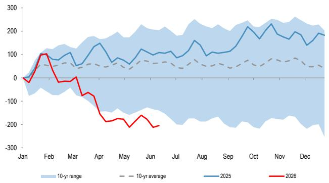

line chart

| Month | 10-yr range | 10-yr average | 2025 | 2026 |
|-------|-------------|---------------|------|------|
| Jan   | ~0          | ~0            | ~0   | ~0   |
| Feb   | ~50         | ~50           | ~100 | ~100 |
| Mar   | ~75         | ~75           | ~100 | ~0   |
| Apr   | ~100        | ~100          | ~150 | ~-100|
| May   | ~125        | ~125          | ~75  | ~-150|
| Jun   | ~150        | ~150          | ~100 | ~-200|
| Jul   | ~175        | ~175          | ~125 | ~-175|
| Aug   | ~200        | ~200          | ~150 | ~-150|
| Sep   | ~225        | ~225          | ~175 | ~-175|
| Oct   | ~250        | ~250          | ~200 | ~-150|
| Nov   | ~275        | ~275          | ~175 | ~-175|
| Dec   | ~300        | ~300          | ~175 | ~-200|

Source: Exchange data, Bloomberg Finance L.P., JPM Commodities Research

Figure 2: The estimated value of global commodity market open interest decreased by 1% WoW  
USD billion, estimated open interest across tracked commodity markets  
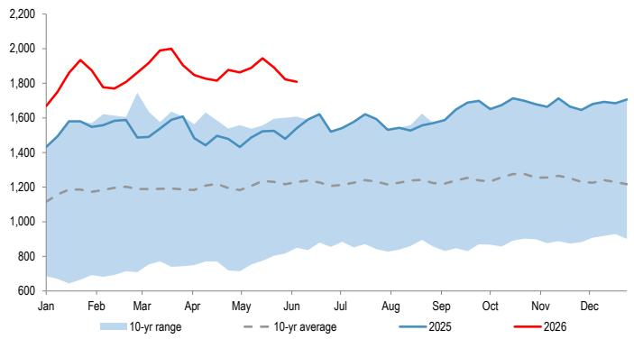

line chart

| Month | 10-yr range | 10-yr average | 2025 | 2026 |
|-------|-------------|---------------|------|------|
| Jan   | ~650        | ~1,150        | ~1,450 | ~1,700 |
| Feb   | ~680        | ~1,180        | ~1,550 | ~1,950 |
| Mar   | ~720        | ~1,200        | ~1,600 | ~2,000 |
| Apr   | ~750        | ~1,220        | ~1,550 | ~1,850 |
| May   | ~730        | ~1,230        | ~1,450 | ~1,850 |
| Jun   | ~780        | ~1,240        | ~1,550 | ~1,950 |
| Jul   | ~800        | ~1,250        | ~1,600 | ~1,850 |
| Aug   | ~820        | ~1,260        | ~1,550 | ~1,850 |
| Sep   | ~850        | ~1,270        | ~1,650 | ~1,850 |
| Oct   | ~880        | ~1,280        | ~1,700 | ~1,850 |
| Nov   | ~900        | ~1,290        | ~1,750 | ~1,850 |
| Dec   | ~920        | ~1,300        | ~1,750 | ~1,850 |

Source: Exchange data, Bloomberg Finance L.P., JPM Commodities Research

Figure 3: Net length across commodity markets increased by \$0.2 billion WoW  
real USD million, Net investor positioning aggregated across tracked commodity markets  
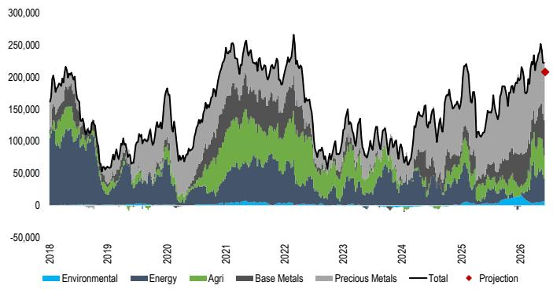

area chart

| Year | Total | Energy | Agri | Base Metals | Precious Metals | Projection |
|------|-------|--------|------|-------------|-----------------|----------|
| 2018 | ~200,000 | ~50,000 | ~10,000 | ~5,000 | ~5,000 | - |
| 2019 | ~150,000 | ~50,000 | ~10,000 | ~5,000 | ~5,000 | - |
| 2020 | ~180,000 | ~50,000 | ~10,000 | ~5,000 | ~5,000 | - |
| 2021 | ~250,000 | ~50,000 | ~15,000 | ~5,000 | ~5,000 | - |
| 2022 | ~270,000 | ~50,000 | ~15,000 | ~5,000 | ~5,000 | - |
| 2023 | ~150,000 | ~50,000 | ~15,000 | ~5,000 | ~5,000 | - |
| 2024 | ~180,000 | ~50,000 | ~15,000 | ~5,000 | ~5,000 | - |
| 2025 | ~220,000 | ~50,000 | ~15,000 | ~5,000 | ~5,000 | - |
| 2026 | ~250,000 | ~50,000 | ~15,000 | ~5,000 | ~5,000 | 215,337 (Projection) |

Projections by JPM QDS Research; US exchanges data is an aggregate of Managed Money and Other Reportables, European exchanges data is an aggregate of Investment Funds and Other Financial Firms.

All data as of June 2, except LME data as of June 5, 2026, and TTF/EUA/UKE as of May 29, 2026. Projection as of June 8, 2026.

Source: Exchange data, Bloomberg Finance L.P., JPM QDS and Commodities Research

Figure 5: The CTA net long positioning in COMEX Gold increased by 11% over the week  
USD/oz (average weekly gold price); bubble size represents magnitude of weekly increase (green) or decrease (red) in CTA F&O net length  
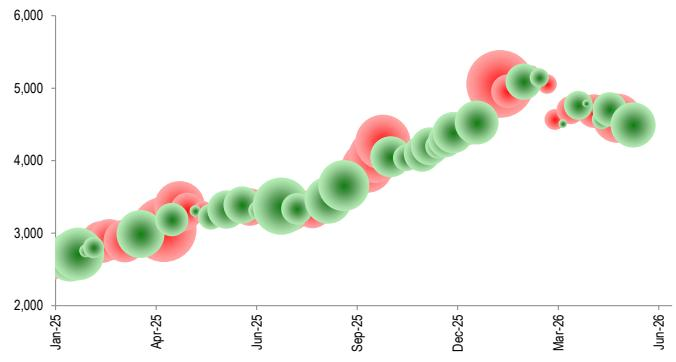

bubble chart

| Month   | Value  |
|---------|--------|
| Jan-25  | 2800   |
| Feb-25  | 3000   |
| Mar-25  | 3200   |
| Apr-25  | 3400   |
| May-25  | 3600   |
| Jun-25  | 3800   |
| Jul-25  | 4000   |
| Aug-25  | 4200   |
| Sep-25  | 4400   |
| Oct-25  | 4600   |
| Nov-25  | 4800   |
| Dec-25  | 5000   |
| Jan-26  | 4800   |
| Feb-26  | 4600   |
| Mar-26  | 4400   |
| Apr-26  | 4200   |
| May-26  | 4000   |
| Jun-26  | 3800   |

As of June 2, 2026.  
Source: Exchange data, Bloomberg Finance L.P., JPM Commodities Research

Figure 4: Latest projections indicate decreasing positioning in agri markets  
0-10 standardised scale: 0 = lowest since 2018, 10 = highest since 2018 positioning data in real USD terms  
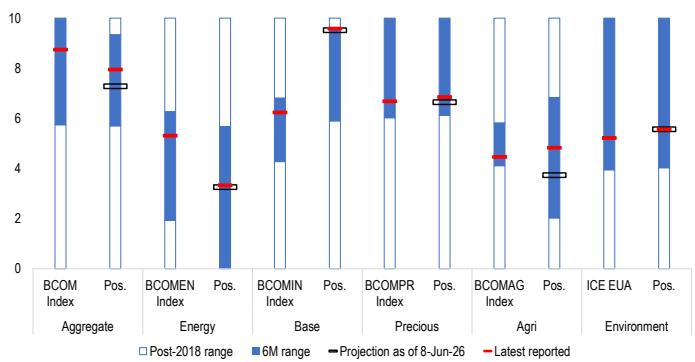

stacked bar chart

| Category | Index | Post-2018 range | 6M range | Projection as of 8-Jun-26 | Latest reported |
| :--- | :--- | :--- | :--- | :--- | :--- |
| Aggregate | BCOM Index | 5.7 | 4.9 | 7.3 | 8.7 |
| Aggregate | Pos. Index | 5.7 | 4.9 | 7.3 | 8.0 |
| Energy | BCOMEN Index | 1.8 | 4.9 | 5.4 | 5.4 |
| Energy | Pos. Index | 5.7 | 4.9 | 5.4 | 3.2 |
| Base | BCOMIN Index | 4.2 | 3.9 | 6.3 | 6.3 |
| Base | Pos. Index | 5.8 | 4.9 | 9.5 | 9.5 |
| Precious | BCOMPR Index | 6.0 | 4.9 | 6.7 | 6.7 |
| Precious | Pos. Index | 6.3 | 4.9 | 6.7 | 6.7 |
| Agri | BCOMAG Index | 4.2 | 4.9 | 4.5 | 4.5 |
| Agri | Pos. Index | 2.0 | 4.9 | 3.8 | 4.8 |
| Environment | ICE EUA | 3.8 | 5.9 | - | 5.2 |
| Environment | Pos. Index | 4.0 | 5.9 | - | 5.5 |

Projections by JPM QDS Research; US exchanges data is an aggregate of Managed Money and Other Reportables, European exchanges data is an aggregate of Investment Funds and Other Financial Firms.

All data as of June 2, except LME data as of June 5, 2026, and TTF/EUA/UKE as of May 29, 2026. Projection as of June 8, 2026.

Source: Exchange data, Bloomberg Finance L.P., JPM QDS and Commodities Research

Figure 6: The estimated value of open interest across energy markets stabilised over the week  
USD billion, estimated open interest across tracked energy markets  
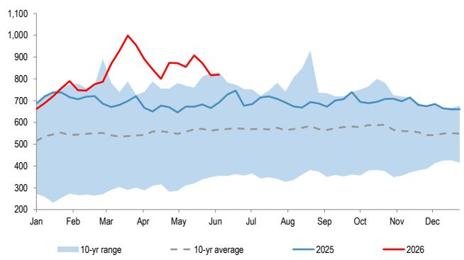

line chart

| Month | 10-yr range | 10-yr average | 2025 | 2026 |
|-------|-------------|---------------|------|------|
| Jan   | ~250        | ~550          | ~700 | ~650 |
| Feb   | ~280        | ~550          | ~720 | ~780 |
| Mar   | ~300        | ~550          | ~700 | ~850 |
| Apr   | ~320        | ~550          | ~680 | ~1,000 |
| May   | ~350        | ~550          | ~650 | ~850 |
| Jun   | ~380        | ~550          | ~700 | ~820 |
| Jul   | ~400        | ~550          | ~720 | ~780 |
| Aug   | ~420        | ~550          | ~750 | ~750 |
| Sep   | ~450        | ~550          | ~780 | ~720 |
| Oct   | ~480        | ~550          | ~750 | ~700 |
| Nov   | ~500        | ~550          | ~720 | ~680 |
| Dec   | ~520        | ~550          | ~700 | ~650 |

Source: Exchange data, Bloomberg Finance L.P., JPM Commodities Research

Figure 7: The estimated value of open interest across environmental markets decreased by 4% WoW  
USD billion, estimated open interest across tracked environmental markets  
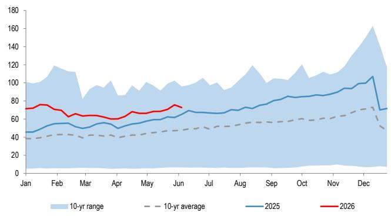

line chart

| Month | 10-yr range | 10-yr average | 2025 | 2026 |
|-------|-------------|---------------|------|------|
| Jan   | ~100        | ~40           | ~45  | ~70  |
| Feb   | ~120        | ~45           | ~55  | ~75  |
| Mar   | ~90         | ~40           | ~55  | ~65  |
| Apr   | ~100        | ~45           | ~50  | ~65  |
| May   | ~100        | ~50           | ~55  | ~70  |
| Jun   | ~100        | ~55           | ~60  | ~75  |
| Jul   | ~100        | ~60           | ~65  | ~75  |
| Aug   | ~110        | ~65           | ~70  | ~75  |
| Sep   | ~120        | ~70           | ~75  | ~75  |
| Oct   | ~120        | ~75           | ~80  | ~75  |
| Nov   | ~130        | ~80           | ~85  | ~75  |
| Dec   | ~160        | ~75           | ~105 | ~75  |

Source: Exchange data, Bloomberg Finance L.P., JPM Commodities Research

Figure 9: The estimated value of open interest across base metals markets plateaued over the week  
USD billion, estimated open interest across tracked base metals markets  
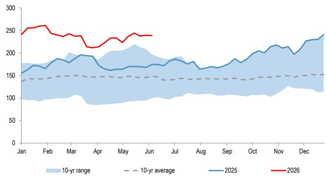

line chart

| Month | 10-yr range | 10-yr average | 2025 | 2026 |
|-------|-------------|---------------|------|------|
| Jan   | ~100        | ~140          | ~150 | ~240 |
| Feb   | ~100        | ~140          | ~170 | ~260 |
| Mar   | ~100        | ~140          | ~190 | ~240 |
| Apr   | ~80         | ~140          | ~170 | ~210 |
| May   | ~100        | ~140          | ~160 | ~230 |
| Jun   | ~100        | ~140          | ~170 | ~240 |
| Jul   | ~100        | ~140          | ~180 | ~240 |
| Aug   | ~100        | ~140          | ~170 | ~240 |
| Sep   | ~100        | ~140          | ~180 | ~240 |
| Oct   | ~100        | ~140          | ~200 | ~240 |
| Nov   | ~100        | ~140          | ~210 | ~240 |
| Dec   | ~100        | ~140          | ~240 | ~240 |

Source: Exchange data, Bloomberg Finance L.P., JPM Commodities Research

Figure 11: The estimated value of open interest in crude oil decreased by 1% WoW  
USD billion, estimated open interest across tracked crude oil markets  
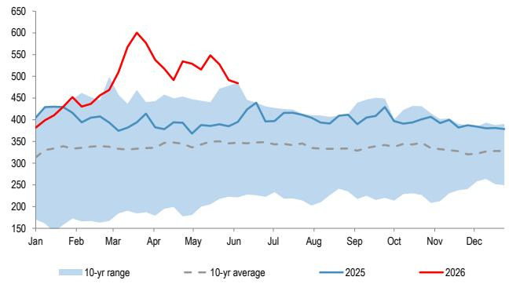

line chart

| Month | 10-yr range | 10-yr average | 2025 | 2026 |
|-------|-------------|---------------|------|------|
| Jan   | ~380        | ~330          | ~420 | ~380 |
| Feb   | ~400        | ~330          | ~410 | ~450 |
| Mar   | ~450        | ~330          | ~400 | ~500 |
| Apr   | ~480        | ~330          | ~410 | ~600 |
| May   | ~470        | ~330          | ~390 | ~520 |
| Jun   | ~480        | ~330          | ~420 | ~480 |
| Jul   | ~460        | ~330          | ~410 | ~450 |
| Aug   | ~450        | ~330          | ~400 | ~420 |
| Sep   | ~460        | ~330          | ~410 | ~430 |
| Oct   | ~470        | ~330          | ~420 | ~410 |
| Nov   | ~460        | ~330          | ~410 | ~390 |
| Dec   | ~450        | ~330          | ~400 | ~380 |

Source: Exchange data, Bloomberg Finance L.P., JPM Commodities Research

Figure 8: The estimated value of open interest across precious metals decreased by 3% WoW  
USD billion, estimated open interest across tracked precious metals markets  
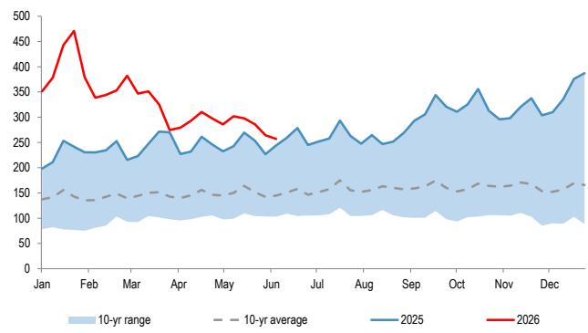

line chart

| Month | 2026 | 2025 | 10-yr average | 10-yr range |
|-------|------|------|---------------|-------------|
| Jan   | 350  | 200  | 150           | 100-200     |
| Feb   | 470  | 250  | 150           | 100-200     |
| Mar   | 380  | 230  | 150           | 100-200     |
| Apr   | 300  | 270  | 150           | 100-200     |
| May   | 310  | 260  | 150           | 100-200     |
| Jun   | 280  | 240  | 150           | 100-200     |
| Jul   | 290  | 270  | 150           | 100-200     |
| Aug   | 270  | 250  | 150           | 100-200     |
| Sep   | 330  | 280  | 150           | 100-200     |
| Oct   | 350  | 320  | 150           | 100-200     |
| Nov   | 340  | 310  | 150           | 100-200     |
| Dec   | 380  | 360  | 150           | 100-200     |

Source: Exchange data, Bloomberg Finance L.P., JPM Commodities Research

Figure 10: The estimated value of open interest in agri markets decreased by 3% WoW  
USD billion, estimated open interest across tracked agricultural markets  
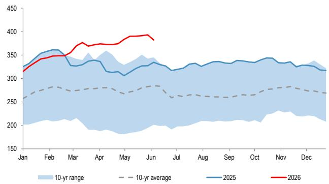

line chart

| Month | 10-yr range | 10-yr average | 2025 | 2026 |
|-------|-------------|---------------|------|------|
| Jan   | ~320        | ~260          | ~320 | ~310 |
| Feb   | ~340        | ~270          | ~350 | ~340 |
| Mar   | ~350        | ~280          | ~360 | ~350 |
| Apr   | ~360        | ~270          | ~340 | ~370 |
| May   | ~370        | ~260          | ~320 | ~380 |
| Jun   | ~380        | ~270          | ~330 | ~390 |
| Jul   | ~370        | ~260          | ~320 | ~380 |
| Aug   | ~360        | ~270          | ~330 | ~370 |
| Sep   | ~350        | ~260          | ~340 | ~360 |
| Oct   | ~340        | ~270          | ~350 | ~350 |
| Nov   | ~330        | ~280          | ~340 | ~340 |
| Dec   | ~320        | ~270          | ~330 | ~330 |

Source: Exchange data, Bloomberg Finance L.P., JPM Commodities Research

Figure 12: Petroleum products estimated open interest value increased by 3% WoW  
USD billion, estimated open interest across tracked petroleum products markets  
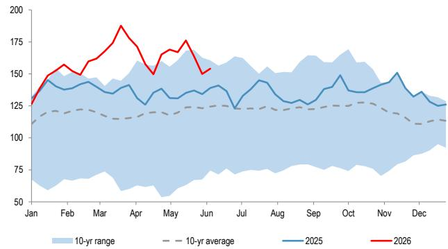

line chart

| Month | 10-yr range | 10-yr average | 2025 | 2026 |
|-------|-------------|---------------|------|------|
| Jan   | ~60         | ~115          | ~140 | ~130 |
| Feb   | ~70         | ~120          | ~145 | ~155 |
| Mar   | ~65         | ~125          | ~140 | ~165 |
| Apr   | ~60         | ~120          | ~135 | ~185 |
| May   | ~55         | ~125          | ~130 | ~170 |
| Jun   | ~70         | ~125          | ~135 | ~150 |
| Jul   | ~75         | ~125          | ~140 | ~160 |
| Aug   | ~80         | ~125          | ~135 | ~155 |
| Sep   | ~85         | ~125          | ~140 | ~160 |
| Oct   | ~90         | ~125          | ~145 | ~165 |
| Nov   | ~85         | ~125          | ~140 | ~150 |
| Dec   | ~90         | ~125          | ~135 | ~145 |

Source: Exchange data, Bloomberg Finance L.P., JPM Commodities Research

Figure 13: The estimated value of open interest in natural gas markets increased by 3% WoW  
USD billion, estimated open interest across tracked natural gas metals markets  
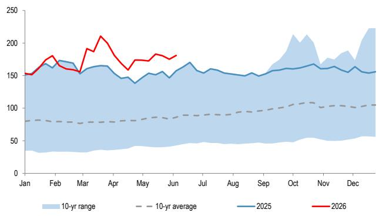

line chart

| Month | 10-yr range | 10-yr average | 2025 | 2026 |
|-------|-------------|---------------|------|------|
| Jan   | ~30         | ~80           | ~150 | ~150 |
| Feb   | ~35         | ~75           | ~160 | ~175 |
| Mar   | ~40         | ~75           | ~165 | ~190 |
| Apr   | ~45         | ~80           | ~160 | ~210 |
| May   | ~50         | ~85           | ~155 | ~170 |
| Jun   | ~55         | ~90           | ~160 | ~180 |
| Jul   | ~60         | ~95           | ~165 | ~175 |
| Aug   | ~65         | ~100          | ~160 | ~170 |
| Sep   | ~70         | ~105          | ~155 | ~165 |
| Oct   | ~75         | ~110          | ~160 | ~170 |
| Nov   | ~80         | ~115          | ~165 | ~175 |
| Dec   | ~85         | ~120          | ~170 | ~180 |

10 year range and average exclude 2022  
Source: Exchange data, Bloomberg Finance L.P., JPM Commodities Research

Figure 15: The estimated value of open interest in soft markets increased by 2% WoW  
USD billion, estimated open interest across tracked soft agricultural markets  
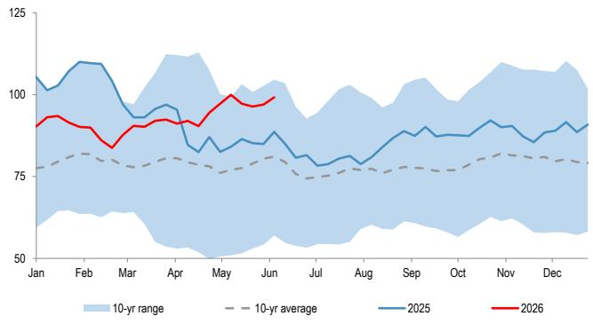

line chart

| Month | 10-yr range | 10-yr average | 2025 | 2026 |
|-------|-------------|---------------|------|------|
| Jan   | ~60         | ~75           | ~105 | ~90  |
| Feb   | ~65         | ~78           | ~110 | ~92  |
| Mar   | ~60         | ~75           | ~95  | ~85  |
| Apr   | ~55         | ~78           | ~98  | ~90  |
| May   | ~50         | ~75           | ~85  | ~95  |
| Jun   | ~55         | ~78           | ~88  | ~98  |
| Jul   | ~50         | ~75           | ~80  | ~90  |
| Aug   | ~55         | ~78           | ~85  | ~95  |
| Sep   | ~60         | ~75           | ~90  | ~98  |
| Oct   | ~65         | ~78           | ~92  | ~95  |
| Nov   | ~60         | ~75           | ~90  | ~98  |
| Dec   | ~65         | ~78           | ~92  | ~95  |

Source: Exchange data, Bloomberg Finance L.P., JPM Commodities Research

Figure 14: The estimated value of open interest in grains & oilseeds markets decreased by 5% WoW  
USD billion, estimated open interest across tracked grains and oilseeds markets  
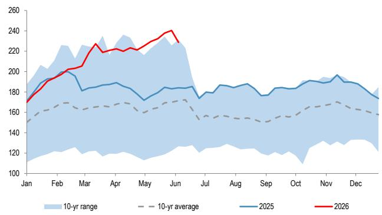

line chart

| Month | 10-yr range | 10-yr average | 2025 | 2026 |
|-------|-------------|---------------|------|------|
| Jan   | ~180        | ~150          | ~170 | ~170 |
| Feb   | ~200        | ~160          | ~190 | ~190 |
| Mar   | ~220        | ~165          | ~185 | ~230 |
| Apr   | ~230        | ~170          | ~190 | ~220 |
| May   | ~220        | ~165          | ~185 | ~230 |
| Jun   | ~240        | ~170          | ~185 | ~240 |
| Jul   | ~180        | ~155          | ~180 | ~180 |
| Aug   | ~185        | ~155          | ~185 | ~185 |
| Sep   | ~185        | ~155          | ~185 | ~185 |
| Oct   | ~185        | ~160          | ~190 | ~185 |
| Nov   | ~190        | ~165          | ~195 | ~190 |
| Dec   | ~185        | ~160          | ~190 | ~185 |

Source: Exchange data, Bloomberg Finance L.P., JPM Commodities Research

Figure 16: The estimated open interest value across livestock markets decreased by 3% WoW  
USD billion, estimated open interest across tracked livestock markets  
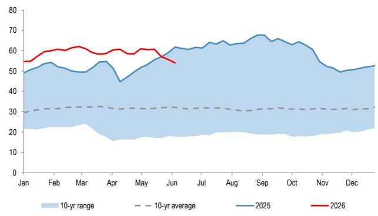

line chart

| Month | 10-yr range | 10-yr average | 2025 | 2026 |
|-------|-------------|---------------|------|------|
| Jan   | ~50         | ~30           | ~50  | ~55  |
| Feb   | ~55         | ~30           | ~55  | ~60  |
| Mar   | ~60         | ~30           | ~50  | ~62  |
| Apr   | ~45         | ~30           | ~55  | ~60  |
| May   | ~55         | ~30           | ~50  | ~60  |
| Jun   | ~60         | ~30           | ~60  | ~55  |
| Jul   | ~65         | ~30           | ~65  | —    |
| Aug   | ~65         | ~30           | ~65  | —    |
| Sep   | ~70         | ~30           | ~70  | —    |
| Oct   | ~65         | ~30           | ~65  | —    |
| Nov   | ~55         | ~30           | ~60  | —    |
| Dec   | ~50         | ~30           | ~55  | —    |

Source: Exchange data, Bloomberg Finance L.P., JPM Commodities Research

# Price momentum and trading signals

Figure 17: Price momentum (z-scores) and trading signals across major commodities
\*see methodology in Figure 18  
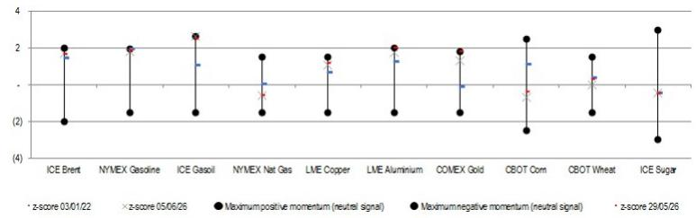

scatterplot

| Category | z-score 03/01/22 | z-score 05/06/26 | Maximum-positive momentum (neutral signal) | Maximum-negative momentum (neutral signal) |
|---|---|---|---|---|
| ICE Brent | 1.8 | 1.7 | -2.0 | -2.0 |
| NYMEX Gasoline | 2.0 | 2.0 | -2.0 | -2.0 |
| ICE Gasoil | 2.4 | 2.5 | -2.0 | -2.0 |
| NYMEX Nat Gas | 1.5 | 1.5 | -1.5 | -1.5 |
| LME Copper | 1.5 | 1.5 | -2.0 | -2.0 |
| LME Aluminium | 1.8 | 1.8 | -2.0 | -2.0 |
| COMEX Gold | 1.8 | 1.8 | -2.0 | -2.0 |
| CBOT Corn | 2.3 | 2.3 | -3.0 | -3.0 |
| CBOT Wheat | 1.5 | 1.5 | -2.0 | -2.0 |
| ICE Sugar | 1.0 | 1.0 | -3.0 | -3.0 |

Source: Bloomberg Finance L.P., JPM Commodities Research, as of June 5, 2026

When the z-score (indicator of momentum) reaches 0, known as the switch point, it often triggers a change in signal from buy-to-sell, or sell-to-buy received by stochastic price/trend following trading models. This can drive heightened price volatility in the underlying commodity price when there is a large presence of CTA/trend-following trading models. When momentum reaches extreme levels, either maximum positive or maximum negative, a neutral signal is often sent, to stop or slow buying or selling. This often drives profit taking or an exit of positions.

Framework developed by JPM Global Markets Strategy (Flows & Liquidity, Panigirtzoglou, Inkinen et al, 3 June 2026)

## Figure 18: Price momentum across commodity markets and trading signals

Optimal lookback period of each momentum strategy combined with a mean reversion indicator that turns signal neutral when momentum z-score exceeds the extreme momentum threshold, and a filter that turns neutral when the z-score is low (below 0.05 and above -0.05) to avoid excessive trading. Lookbacks, current signals and z-scores are shown for shorter-term and longer-term momentum separately, along with performance of a combined signal. Annualised return, volatility and information ratio of the signal; current signal; and z-score of the current return over the relevant lookback period; data from 1999 onward.

<table><tr><td>Market</td><td>Lookback duration</td><td>Lookback sessions</td><td>z-score 05/06/26</td><td>Extreme threshold</td><td>Current signal</td><td>z-score 29/05/26</td><td>Sessions since last signal switch</td><td>Information ratio</td><td>% change of return index from its MA</td></tr><tr><td rowspan="2">ICE Brent</td><td>Long</td><td>504</td><td>1.73</td><td rowspan="2">+/-2</td><td>1</td><td>1.65</td><td>1</td><td>0.52</td><td>50.8%</td></tr><tr><td>Short</td><td>84</td><td>0.49</td><td>1</td><td>0.52</td><td>12</td><td>0.44</td><td>6.0%</td></tr><tr><td rowspan="2">NYMEX WTI</td><td>Long</td><td>462</td><td>1.77</td><td rowspan="2">+/-2</td><td>1</td><td>1.62</td><td>1</td><td>0.48</td><td>52%</td></tr><tr><td>Short</td><td>21</td><td>-0.77</td><td>-1</td><td>-1.49</td><td>1</td><td>0.48</td><td>-4.8%</td></tr><tr><td rowspan="2">NYMEX Gasoline</td><td>Long</td><td>483</td><td>1.83</td><td rowspan="2">+/-1.5</td><td>0</td><td>1.84</td><td>61</td><td>0.21</td><td>49.5%</td></tr><tr><td>Short</td><td>105</td><td>1.01</td><td>1</td><td>1.17</td><td>7</td><td>0.21</td><td>14.1%</td></tr><tr><td rowspan="2">ICE Gasoil</td><td>Long</td><td>378</td><td>2.65</td><td rowspan="2">+/-1.5</td><td>0</td><td>2.47</td><td>68</td><td>0.56</td><td>77%</td></tr><tr><td>Short</td><td>63</td><td>-0.16</td><td>-1</td><td>-0.37</td><td>0</td><td>0.56</td><td>-1.7%</td></tr><tr><td rowspan="2">NYMEX Nat Gas</td><td>Long</td><td>315</td><td>-0.60</td><td rowspan="2">+/-1.5</td><td>-1</td><td>-0.57</td><td>89</td><td>0.57</td><td>-15.8%</td></tr><tr><td>Short</td><td>105</td><td>-0.17</td><td>-1</td><td>-0.06</td><td>0</td><td>0.57</td><td>-2.9%</td></tr><tr><td rowspan="2">TTF Nat gas</td><td>Long</td><td>294</td><td>0.80</td><td rowspan="2">+/-1.5</td><td>1</td><td>0.67</td><td>54</td><td>1.38</td><td>38.0%</td></tr><tr><td>Short</td><td>21</td><td>0.12</td><td>1</td><td>-0.30</td><td>2</td><td>1.38</td><td>1.2%</td></tr><tr><td rowspan="2">ICE EUA</td><td>Long</td><td>483</td><td>0.05</td><td rowspan="2">+/-1.5</td><td>0</td><td>0.17</td><td>0</td><td>0.42</td><td>2.0%</td></tr><tr><td>Short</td><td>42</td><td>0.17</td><td>1</td><td>0.78</td><td>41</td><td>0.42</td><td>1.6%</td></tr><tr><td rowspan="2">COMEX Gold</td><td>Long</td><td>483</td><td>1.30</td><td rowspan="2">+/-1.5</td><td>1</td><td>1.81</td><td>0</td><td>0.43</td><td>17%</td></tr><tr><td>Short</td><td>21</td><td>-1.76</td><td>0</td><td>-0.28</td><td>0</td><td>0.43</td><td>-4.9%</td></tr><tr><td rowspan="2">COMEX Silver</td><td>Long</td><td>462</td><td>1.55</td><td rowspan="2">+/-1.5</td><td>0</td><td>2.15</td><td>181</td><td>0.32</td><td>38.5%</td></tr><tr><td>Short</td><td>10</td><td>-2.08</td><td>0</td><td>-0.13</td><td>0</td><td>0.32</td><td>-7.7%</td></tr><tr><td rowspan="2">NYMEX Palladium</td><td>Long</td><td>273</td><td>-0.69</td><td rowspan="2">+/-1.5</td><td>-1</td><td>-0.29</td><td>14</td><td>0.83</td><td>-15%</td></tr><tr><td>Short</td><td>42</td><td>-2.02</td><td>0</td><td>-1.15</td><td>0</td><td>0.83</td><td>-15.5%</td></tr><tr><td rowspan="2">NYMEX Platinum</td><td>Long</td><td>273</td><td>0.06</td><td rowspan="2">+/-1.5</td><td>1</td><td>0.60</td><td>16</td><td>0.53</td><td>0.9%</td></tr><tr><td>Short</td><td>105</td><td>-1.61</td><td>0</td><td>-1.05</td><td>0</td><td>0.53</td><td>-15.4%</td></tr><tr><td rowspan="2">LME Copper</td><td>Long</td><td>399</td><td>1.08</td><td rowspan="2">+/-1.5</td><td>1</td><td>1.16</td><td>87</td><td>0.52</td><td>25%</td></tr><tr><td>Short</td><td>147</td><td>0.48</td><td>1</td><td>0.62</td><td>87</td><td>0.52</td><td>6.3%</td></tr><tr><td rowspan="2">LME Aluminium</td><td>Long</td><td>357</td><td>1.75</td><td rowspan="2">+/-1.5</td><td>0</td><td>2.00</td><td>49</td><td>0.36</td><td>26.3%</td></tr><tr><td>Short</td><td>105</td><td>0.91</td><td>1</td><td>1.35</td><td>2</td><td>0.36</td><td>7.3%</td></tr><tr><td rowspan="2">LME Lead</td><td>Long</td><td>357</td><td>-0.19</td><td rowspan="2">+/-1.5</td><td>-1</td><td>-0.14</td><td>100</td><td>0.35</td><td>-4%</td></tr><tr><td>Short</td><td>126</td><td>-0.01</td><td>0</td><td>0.07</td><td>1</td><td>0.35</td><td>-0.2%</td></tr><tr><td rowspan="2">LME Nickel</td><td>Long</td><td>336</td><td>0.42</td><td rowspan="2">+/-1.5</td><td>1</td><td>0.54</td><td>113</td><td>0.58</td><td>11.1%</td></tr><tr><td>Short</td><td>42</td><td>-0.15</td><td>-1</td><td>0.30</td><td>1</td><td>0.58</td><td>-1.3%</td></tr><tr><td rowspan="2">LME Zinc</td><td>Long</td><td>399</td><td>0.73</td><td rowspan="2">+/-1.5</td><td>1</td><td>0.76</td><td>164</td><td>0.50</td><td>17%</td></tr><tr><td>Short</td><td>126</td><td>0.50</td><td>1</td><td>0.59</td><td>49</td><td>0.50</td><td>5.9%</td></tr><tr><td rowspan="2">CBOT Corn</td><td>Long</td><td>399</td><td>-0.71</td><td rowspan="2">+/-2.5</td><td>-1</td><td>-0.40</td><td>23</td><td>0.40</td><td>-13.7%</td></tr><tr><td>Short</td><td>63</td><td>-1.25</td><td>-1</td><td>-0.53</td><td>11</td><td>0.31</td><td>-10.1%</td></tr><tr><td rowspan="2">CBOT Wheat</td><td>Long</td><td>294</td><td>-0.02</td><td rowspan="2">+/-1.5</td><td>0</td><td>0.30</td><td>1</td><td>0.15</td><td>-0.3%</td></tr><tr><td>Short</td><td>168</td><td>0.03</td><td>0</td><td>0.48</td><td>0</td><td>0.16</td><td>0.3%</td></tr><tr><td rowspan="2">Kansas Wheat</td><td>Long</td><td>483</td><td>-0.06</td><td rowspan="2">+/-3</td><td>-1</td><td>0.15</td><td>1</td><td>0.25</td><td>-1.3%</td></tr><tr><td>Short</td><td>147</td><td>0.25</td><td>1</td><td>0.68</td><td>82</td><td>0.38</td><td>3.1%</td></tr><tr><td rowspan="2">CBOT Soybeans</td><td>Long</td><td>231</td><td>-0.07</td><td rowspan="2">+/-2.5</td><td>-1</td><td>0.37</td><td>0</td><td>0.35</td><td>-1%</td></tr><tr><td>Short</td><td>42</td><td>-1.04</td><td>-1</td><td>-0.08</td><td>5</td><td>0.30</td><td>-5.6%</td></tr><tr><td rowspan="2">ICE Cotton</td><td>Long</td><td>483</td><td>-0.10</td><td rowspan="2">+/-1.5</td><td>-1</td><td>0.03</td><td>0</td><td>0.15</td><td>-2.4%</td></tr><tr><td>Short</td><td>168</td><td>0.24</td><td>1</td><td>0.51</td><td>16</td><td>0.16</td><td>3.3%</td></tr><tr><td rowspan="2">ICE Sugar</td><td>Long</td><td>252</td><td>-0.42</td><td rowspan="2">+/-3</td><td>-1</td><td>-0.47</td><td>16</td><td>0.40</td><td>-7.4%</td></tr><tr><td>Short</td><td>63</td><td>-0.43</td><td>-1</td><td>-0.48</td><td>8</td><td>0.47</td><td>-3.8%</td></tr><tr><td rowspan="2">ICE Coffee</td><td>Long</td><td>273</td><td>-1.15</td><td rowspan="2">+/-1.5</td><td>-1</td><td>-0.84</td><td>90</td><td>0.16</td><td>-21.5%</td></tr><tr><td>Short</td><td>63</td><td>-1.55</td><td>0</td><td>-0.86</td><td>1</td><td>0.42</td><td>-13.2%</td></tr><tr><td>ICE NY Cocos*</td><td>n/a</td><td>10</td><td>-1.46</td><td>+/-3</td><td>-1</td><td>-0.08</td><td>1</td><td>0.15</td><td>-5.4%</td></tr></table>

Source: Bloomberg Finance L.P., JPM Commodities Research, as of June 5, 2026.

## Energy markets

Table 3: Estimated open interest and flows  
USD million

<table><tr><td rowspan="2">Sector</td><td>Number of futures markets</td><td>Total estimated Open Interest</td><td colspan="4">Change in Open Interest</td><td colspan="4">Cumulative flows</td></tr><tr><td>Count</td><td>05-Jun-26</td><td>1 Week</td><td>1 Month</td><td>3 Months</td><td>2026 YTD</td><td>1 Week</td><td>1 Month</td><td>3 Months</td><td>2026 YTD</td></tr><tr><td>Energy</td><td>18</td><td>819,069</td><td>2,591</td><td>-36,045</td><td>-109,644</td><td>158,432</td><td>-7,103</td><td>-16,557</td><td>-97,374</td><td>-120,378</td></tr><tr><td>Crude Oil</td><td>7</td><td>484,142</td><td>-7,208</td><td>-31,492</td><td>-83,536</td><td>105,517</td><td>-10,584</td><td>-14,486</td><td>-66,504</td><td>-64,185</td></tr><tr><td>WTI Crude Oil</td><td>2</td><td>225,021</td><td>4,490</td><td>-11,417</td><td>-14,688</td><td>75,106</td><td>370</td><td>-6,386</td><td>-12,663</td><td>3,541</td></tr><tr><td>NYM WTI Crude Oil</td><td>1</td><td>159,883</td><td>3,111</td><td>-6,278</td><td>-10,436</td><td>53,953</td><td>170</td><td>-2,521</td><td>-9,189</td><td>2,341</td></tr><tr><td>ICE WTI Crude Oil</td><td>1</td><td>65,138</td><td>1,379</td><td>-5,139</td><td>-4,252</td><td>21,152</td><td>200</td><td>-3,865</td><td>-3,474</td><td>1,200</td></tr><tr><td>ICE Brent Crude Oil</td><td>1</td><td>226,635</td><td>-2,948</td><td>-17,161</td><td>-42,520</td><td>35,271</td><td>-3,563</td><td>-8,193</td><td>-36,155</td><td>-45,996</td></tr><tr><td>Other</td><td>4</td><td>32,486</td><td>-8,749</td><td>-2,914</td><td>-26,327</td><td>-4,860</td><td>-7,390</td><td>93</td><td>-17,686</td><td>-21,730</td></tr><tr><td>DME Oman Crude Oil</td><td>1</td><td>500</td><td>-1,595</td><td>-101</td><td>-1,326</td><td>-555</td><td>-1,557</td><td>20</td><td>-433</td><td>-534</td></tr><tr><td>ICE Dubai Crude Oil</td><td>1</td><td>24,830</td><td>-6,489</td><td>-1,684</td><td>-18,868</td><td>-5,941</td><td>-5,009</td><td>927</td><td>-12,743</td><td>-19,415</td></tr><tr><td>TCM Crude Oil (Tokyo)</td><td>1</td><td>461</td><td>6</td><td>-52</td><td>-311</td><td>-46</td><td>8</td><td>-39</td><td>-292</td><td>-253</td></tr><tr><td>INE Crude Oil (Shanghai)</td><td>1</td><td>6,695</td><td>-672</td><td>-1,076</td><td>-5,824</td><td>1,682</td><td>-832</td><td>-815</td><td>-4,218</td><td>-1,528</td></tr><tr><td>Petroleum Products</td><td>7</td><td>154,021</td><td>4,100</td><td>-12,913</td><td>-20,151</td><td>27,987</td><td>1,159</td><td>-4,912</td><td>-28,852</td><td>-46,640</td></tr><tr><td>Distillates</td><td>3</td><td>115,471</td><td>3,009</td><td>-7,007</td><td>-9,435</td><td>22,905</td><td>-725</td><td>-2,306</td><td>-17,567</td><td>-31,920</td></tr><tr><td>NYM ULSD</td><td>1</td><td>36,607</td><td>2,507</td><td>-773</td><td>-2,997</td><td>6,152</td><td>1,845</td><td>-473</td><td>-4,571</td><td>-12,007</td></tr><tr><td>ICE Heating Oil</td><td>1</td><td>3,407</td><td>-89</td><td>-1,027</td><td>-2,364</td><td>42</td><td>-200</td><td>-937</td><td>-2,552</td><td>-2,566</td></tr><tr><td>ICE Gas Oil</td><td>1</td><td>75,457</td><td>591</td><td>-5,207</td><td>-4,073</td><td>16,711</td><td>-2,370</td><td>-896</td><td>-10,443</td><td>-17,347</td></tr><tr><td>NYM Gasoline (RBOB)</td><td>1</td><td>36,542</td><td>1,195</td><td>-5,608</td><td>-8,828</td><td>4,882</td><td>1,928</td><td>-2,329</td><td>-9,595</td><td>-13,269</td></tr><tr><td>Fuel Oil</td><td>3</td><td>2,008</td><td>-104</td><td>-299</td><td>-1,887</td><td>200</td><td>-43</td><td>-278</td><td>-1,690</td><td>-1,451</td></tr><tr><td>SFE Fuel Oil</td><td>1</td><td>1,708</td><td>48</td><td>-255</td><td>-1,931</td><td>-28</td><td>85</td><td>-270</td><td>-1,778</td><td>-1,622</td></tr><tr><td>NYM Fuel Oil (Rotterdam)</td><td>1</td><td>38</td><td>-46</td><td>-47</td><td>-34</td><td>30</td><td>-41</td><td>-41</td><td>-29</td><td>5</td></tr><tr><td>NYM Fuel Oil (Singapore)</td><td>1</td><td>262</td><td>-107</td><td>3</td><td>78</td><td>198</td><td>-87</td><td>34</td><td>118</td><td>166</td></tr><tr><td>Natural Gas</td><td>4</td><td>180,906</td><td>5,699</td><td>8,360</td><td>-5,957</td><td>24,928</td><td>2,322</td><td>2,842</td><td>-2,018</td><td>-9,552</td></tr><tr><td>NYM Natural Gas</td><td>1</td><td>57,800</td><td>-938</td><td>3,135</td><td>62</td><td>1,020</td><td>-676</td><td>663</td><td>2,297</td><td>10,921</td></tr><tr><td>ICE TTF Natural Gas</td><td>1</td><td>75,120</td><td>3,904</td><td>3,964</td><td>-4,949</td><td>8,175</td><td>1,832</td><td>2,518</td><td>-3,333</td><td>-19,111</td></tr><tr><td>ICE UK Natural Gas</td><td>1</td><td>16,506</td><td>1,216</td><td>199</td><td>-458</td><td>2,904</td><td>616</td><td>-592</td><td>-326</td><td>-3,715</td></tr><tr><td>ICE JKM LNG</td><td>1</td><td>31,481</td><td>1,517</td><td>1,063</td><td>-612</td><td>12,828</td><td>549</td><td>252</td><td>-656</td><td>2,351</td></tr><tr><td colspan="11"></td></tr><tr><td>Total Regions</td><td>18</td><td>819,069</td><td>2,591</td><td>-36,045</td><td>-109,644</td><td>158,432</td><td>-7,103</td><td>-16,557</td><td>-97,374</td><td>-120,378</td></tr><tr><td>US</td><td>7</td><td>366,589</td><td>6,312</td><td>-14,775</td><td>-26,229</td><td>82,946</td><td>768</td><td>-5,563</td><td>-31,413</td><td>-29,190</td></tr><tr><td>UK</td><td>6</td><td>367,996</td><td>-5,413</td><td>-23,750</td><td>-69,074</td><td>66,257</td><td>-7,407</td><td>-12,407</td><td>-55,907</td><td>-68,140</td></tr><tr><td>EU</td><td>1</td><td>75,120</td><td>3,904</td><td>3,964</td><td>-4,949</td><td>8,175</td><td>1,832</td><td>2,518</td><td>-3,333</td><td>-19,111</td></tr><tr><td>China</td><td>2</td><td>8,403</td><td>-623</td><td>-1,331</td><td>-7,755</td><td>1,654</td><td>-748</td><td>-1,085</td><td>-5,997</td><td>-3,151</td></tr><tr><td>RoW</td><td>2</td><td>961</td><td>-1,589</td><td>-154</td><td>-1,636</td><td>-600</td><td>-1,549</td><td>-19</td><td>-725</td><td>-786</td></tr></table>

Source: Exchange data, Bloomberg Finance L.P., JPM Commodities Research

Figure 19: Energy sectoral standardised level chart  
0-10 standardised scale: 0 = lowest since 2018, 10 = highest since 2018 positioning data in real USD terms  
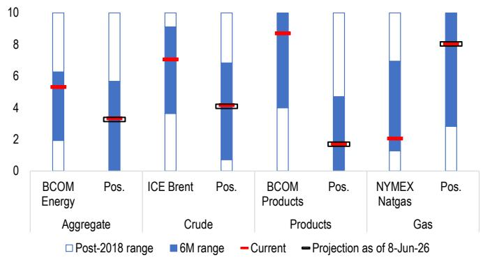

stacked bar chart

| Category | Company | Post-2018 range | 6M range | Current | Projection as of 8-Jun-26 |
| :--- | :--- | :--- | :--- | :--- | :--- |
| Aggregate | BCOM Energy | 5.0 | 4.0 | 5.0 | 0.0 |
| Aggregate | Pos. | 3.0 | 3.0 | 3.0 | 0.0 |
| Crude | ICE Brent | 3.0 | 4.0 | 7.0 | 4.0 |
| Crude | Pos. | 1.0 | 4.0 | 0.0 | 0.0 |
| Products | BCOM Products | 4.0 | 5.0 | 8.0 | 0.0 |
| Products | Pos. | 1.0 | 4.0 | 1.0 | 0.0 |
| Gas | NYMEX Natgas | 2.0 | 5.0 | 2.0 | 0.0 |
| Gas | Pos. | 2.5 | 5.5 | 8.0 | 0.0 |

Projections by JPM QDS Research; US exchanges data is an aggregate of Managed Money and Other Reportables, European exchanges data is an aggregate of Investment Funds and Other Financial Firms.

All data as of June 2, 2026, except TTF as of May 29, 2026.

Source: Exchange data, Bloomberg Finance L.P., JPM QDS and Commodities Research

Figure 21: NYMEX WTI Crude Oil position and price  
LHS: n of contracts; RHS: \$/bbl  
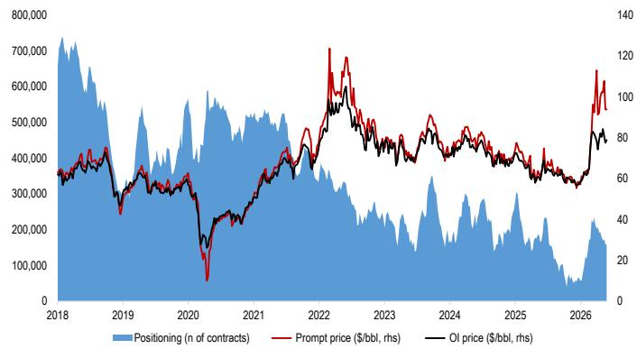

line chart

| Year | Positioning (n of contracts) | Prompt price ($/bbl, rhs) | Oil price ($/bbl, rhs) |
|------|------------------------------|---------------------------|------------------------|
| 2018 | ~700,000                     | ~350,000                  | ~350,000               |
| 2019 | ~500,000                     | ~350,000                  | ~350,000               |
| 2020 | ~100,000                     | ~100,000                  | ~100,000               |
| 2021 | ~350,000                     | ~450,000                  | ~450,000               |
| 2022 | ~550,000                     | ~750,000                  | ~750,000               |
| 2023 | ~350,000                     | ~550,000                  | ~550,000               |
| 2024 | ~350,000                     | ~550,000                  | ~550,000               |
| 2025 | ~350,000                     | ~550,000                  | ~550,000               |
| 2026 | ~250,000                     | ~125,000                  | ~85,000                |

Source: Exchange data, Bloomberg Finance L.P., JPM QDS Commodities Research

Figure 23: ICE Dubai Crude Oil position and price  
LHS: n of contracts; RHS: \$/bbl  
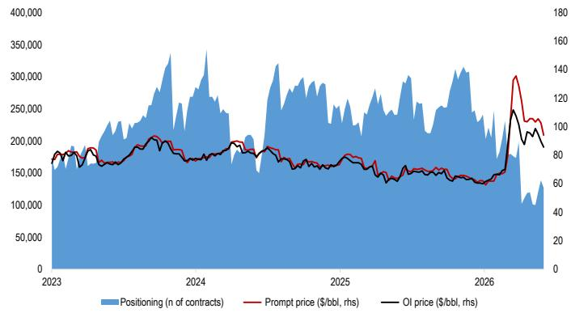

line chart

| Year | Positioning (n of contracts) | Prompt price ($/bbl, rhs) | Oil price ($/bbl, rhs) |
|------|------------------------------|---------------------------|------------------------|
| 2023 | ~180,000                     | ~170,000                  | ~160,000               |
| 2024 | ~350,000                     | ~200,000                  | ~190,000               |
| 2025 | ~280,000                     | ~170,000                  | ~160,000               |
| 2026 | ~130,000                     | ~140,000                  | ~120,000               |

Source: Exchange data, Bloomberg Finance L.P., JPM Commodities Research

Figure 20: Energy underlying commodities standardised level chart  
0-10 standardised scale: 0 = lowest since 2018, 10 = highest since 2018 positioning data in real USD terms  
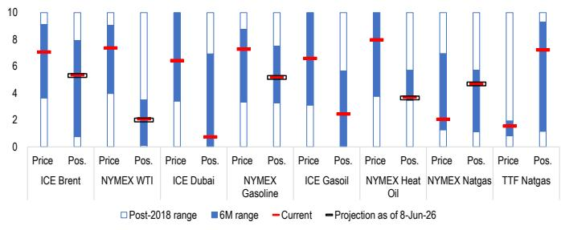

bar chart

| Category         | Current | Projection as of 8-Jun-26 |
| ---------------- | ------- | ------------------------ |
| ICE Brent        | 7       | 5                        |
| NYMEX WTI        | 7       | 2                        |
| ICE Dubai        | 6       | 1                        |
| NYMEX Gasoline   | 7       | 5                        |
| ICE Gasoil       | 6       | 3                        |
| NYMEX Heat Oil   | 8       | 4                        |
| NYMEX Natgas     | 5       | 4                        |
| TTF Natgas       | 7       | 1                        |

Projections by JPM QDS Research: US exchanges data is an aggregate of Managed Money and Other Reportables, European exchanges data is an aggregate of Investment Funds and Other Financial Firms.

All data as of June 2, 2026, except TTF as of May 29, 2026.

Source: Exchange data, Bloomberg Finance L.P., JPM QDS and Commodities Research

Figure 22: ICE Brent Crude Oil position and price  
LHS: n of contracts; RHS: \$/bbl  
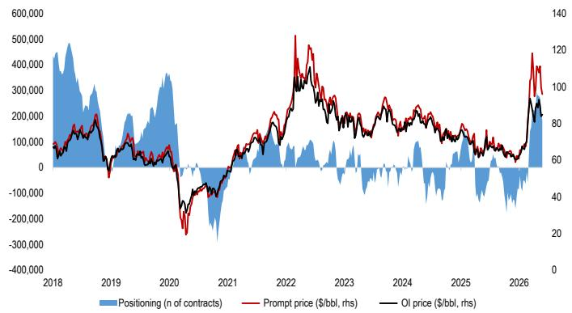

line chart

| Year | Positioning (n of contracts) | Prompt price ($/bbl, rhs) | Oil price ($/bbl, rhs) |
|------|------------------------------|---------------------------|------------------------|
| 2018 | ~450,000                     | ~100,000                  | ~80                    |
| 2019 | ~300,000                     | ~150,000                  | ~70                    |
| 2020 | ~350,000                     | ~50,000                   | ~-20                   |
| 2021 | ~-150,000                    | ~-250,000                 | ~-10                   |
| 2022 | ~150,000                     | ~550,000                  | ~120                   |
| 2023 | ~-50,000                     | ~250,000                  | ~15                    |
| 2024 | ~-50,000                     | ~250,000                  | ~15                    |
| 2025 | ~-50,000                     | ~150,000                  | ~15                    |
| 2026 | ~-50,000                     | ~450,000                  | ~120                   |

Source: Exchange data, Bloomberg Finance L.P., JPM Commodities Research

Figure 24: ICE TTF Natural Gas position and price  
LHS: TWh; RHS: \$/MWh  
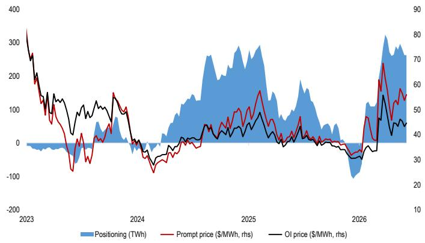

line chart

| Year | Positioning (TWh) | Prompt price ($/MWh, rhs) | OI price ($/MWh, rhs) |
|------|-------------------|----------------------------|------------------------|
| 2023 | ~350              | ~150                       | ~30                    |
| 2024 | ~-50              | ~-100                      | ~-5                     |
| 2025 | ~300              | ~150                       | ~50                    |
| 2026 | ~-100             | ~-50                       | ~-5                    |

Source: Exchange data, Bloomberg Finance L.P., JPM Commodities Research

Figure 25: Weekly change in total OI due to price/flows  
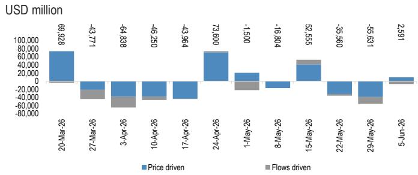

bar chart

| Date       | Price driven | Flows driven |
| ---------- | ------------ | ------------ |
| 20-Mar-26  | 69,928       |              |
| 27-Mar-26  | -43,771      |              |
| 3-Apr-26   | -54,638      |              |
| 10-Apr-26  | -46,250      |              |
| 17-Apr-26  | -43,964      |              |
| 24-Apr-26  | 73,600       |              |
| 1-May-26   | -1,500       |              |
| 8-May-26   | -16,804      |              |
| 15-May-26  | 52,555       |              |
| 22-May-26  | -35,560      |              |
| 29-May-26  | -55,631      |              |
| 5-Jun-26   | 2,591        |              |

Source: Exchange data, Bloomberg Finance L.P., JPM Commodities Research

Figure 27: Weekly change in total OI from changes in contracts (\$flows)  
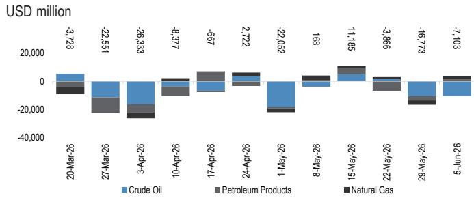

stacked bar chart

| Date | Crude Oil (USD million) | Petroleum Products (USD million) | Natural Gas (USD million) |
| :--- | :--- | :--- | :--- |
| 20-Mar-26 | -3,728 | | |
| 27-Mar-26 | -22,551 | | |
| 3-Apr-26 | -26,333 | | |
| 10-Apr-26 | -8,377 | | |
| 17-Apr-26 | -667 | | |
| 24-Apr-26 | 2,722 | | |
| 1-May-26 | -22,052 | | |
| 8-May-26 | 168 | | |
| 15-May-26 | 11,185 | | |
| 22-May-26 | -3,866 | | |
| 29-May-26 | -16,773 | | |
| 5-Jun-26 | -7,103 | | |

Source: Exchange data, Bloomberg Finance L.P., JPM Commodities Research

Figure 26: Weekly change in total OI from changes in prices  
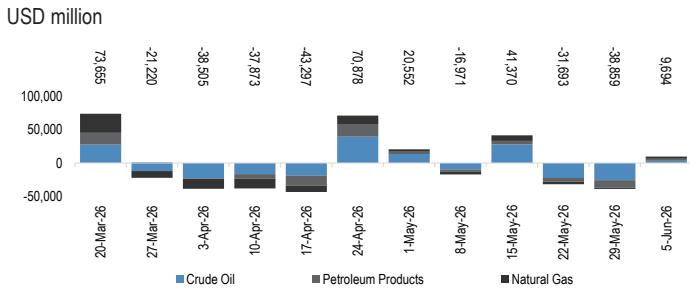

stacked bar chart

| Date | Crude Oil (USD million) | Petroleum Products (USD million) | Natural Gas (USD million) |
| :--- | :--- | :--- | :--- |
| 20-Mar-26 | 25,147 | -1,389 | 73,665 |
| 27-Mar-26 | -1,000 | -1,000 | -1,000 |
| 3-Apr-26 | -1,000 | -1,000 | -1,000 |
| 10-Apr-26 | -1,000 | -1,000 | -1,000 |
| 17-Apr-26 | -1,000 | -1,000 | -1,000 |
| 24-Apr-26 | 45,000 | -1,000 | 70,898 |
| 20-May-26 | 15,000 | -1,000 | 20,522 |
| 8-May-26 | -1,000 | -1,000 | -16,971 |
| 15-May-26 | 35,000 | -1,000 | 41,370 |
| 22-May-26 | -1,000 | -1,000 | -31,693 |
| 29-May-26 | -1,000 | -1,000 | -38,859 |
| 5-Jun-26 | -1,000 | -1,000 | 9,694 |

Source: Exchange data, Bloomberg Finance L.P., JPM Commodities Research

## Environmental markets

Table 4: Estimated open interest and flows  
USD million

<table><tr><td rowspan="2">Sector</td><td>Number of futures markets</td><td>Total estimated Open Interest</td><td colspan="4">Change in Open Interest</td><td colspan="4">Cumulative flows</td></tr><tr><td>Count</td><td>05-Jun-26</td><td>1 Week</td><td>1 Month</td><td>3 Months</td><td>2026 YTD</td><td>1 Week</td><td>1 Month</td><td>3 Months</td><td>2026 YTD</td></tr><tr><td>Environmental Markets</td><td>3</td><td>72,722</td><td>-2,951</td><td>4,307</td><td>8,819</td><td>1,096</td><td>1,430</td><td>4,001</td><td>540</td><td>12,623</td></tr><tr><td>EU Allowances</td><td>2</td><td>68,262</td><td>-2,695</td><td>3,736</td><td>7,670</td><td>1,275</td><td>1,395</td><td>3,779</td><td>660</td><td>11,700</td></tr><tr><td>ICE EUA</td><td>1</td><td>49,605</td><td>-2,014</td><td>2,822</td><td>1,984</td><td>-8,745</td><td>958</td><td>2,851</td><td>-3,204</td><td>641</td></tr><tr><td>EEX EUA</td><td>1</td><td>18,658</td><td>-681</td><td>914</td><td>5,686</td><td>10,020</td><td>438</td><td>929</td><td>3,865</td><td>11,059</td></tr><tr><td>UK ETS</td><td>1</td><td>4,459</td><td>-256</td><td>571</td><td>1,148</td><td>-179</td><td>34</td><td>222</td><td>-121</td><td>923</td></tr><tr><td colspan="11"></td></tr><tr><td>Total Regions</td><td>3</td><td>72,722</td><td>-2,951</td><td>4,307</td><td>8,819</td><td>1,096</td><td>1,430</td><td>4,001</td><td>540</td><td>12,623</td></tr><tr><td>US</td><td>0</td><td>-</td><td>-</td><td>-</td><td>-</td><td>-</td><td>-</td><td>-</td><td>-</td><td>-</td></tr><tr><td>UK</td><td>1</td><td>4,459</td><td>-256</td><td>571</td><td>1,148</td><td>-179</td><td>34</td><td>222</td><td>-121</td><td>923</td></tr><tr><td>EU</td><td>2</td><td>68,262</td><td>-2,695</td><td>3,736</td><td>7,670</td><td>1,275</td><td>1,395</td><td>3,779</td><td>660</td><td>11,700</td></tr><tr><td>China</td><td>0</td><td>-</td><td>-</td><td>-</td><td>-</td><td>-</td><td>-</td><td>-</td><td>-</td><td>-</td></tr><tr><td>RoW</td><td>0</td><td>-</td><td>-</td><td>-</td><td>-</td><td>-</td><td>-</td><td>-</td><td>-</td><td>-</td></tr></table>

Source: Exchange data, Bloomberg Finance L.P., JPM Commodities Research

Figure 28: Environmental markets standardised level chart  
0-10 standardised scale: 0 = lowest since 2018, 10 = highest since 2018 positioning data in real USD terms  
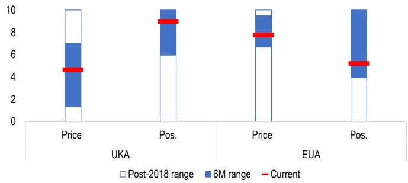

stacked bar chart

| Region | Category | Post-2018 range | 6M range | Current |
| :--- | :--- | :--- | :--- | :--- |
| UKA | Price | 1.5 | 4.5 | 4.5 |
| UKA | Pos. | 6.0 | 3.5 | 9.0 |
| EUA | Price | 6.5 | 2.5 | 8.0 |
| EUA | Pos. | 4.0 | 7.0 | 5.0 |

Projections by JPM QDS Research; US exchanges data is an aggregate of Managed Money and Other Reportables, European exchanges data is an aggregate of Investment Funds and Other Financial Firms.

All data as of May 29, 2026.

Source: Exchange data, Bloomberg Finance L.P., JPM QDS and Commodities Research

Figure 30: Weekly change in total OI due to price/flows  
USD million  
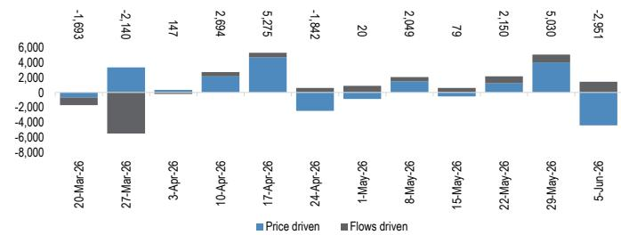

bar chart

| Date       | Price driven | Flows driven |
| ---------- | ------------ | ------------ |
| 20-Mar-26  | -1,693       | -1,693       |
| 27-Mar-26  | -2,140       | -2,140       |
| 3-Apr-26   | 147          | 147          |
| 10-Apr-26  | 2,694        | 2,694        |
| 17-Apr-26  | 5,275        | 5,275        |
| 24-Apr-26  | -1,842       | -1,842       |
| 1-May-26   | 20           | 20           |
| 8-May-26   | 2,049        | 2,049        |
| 15-May-26  | 79           | 79           |
| 22-May-26  | 2,150        | 2,150        |
| 29-May-26  | 5,030        | 5,030        |
| 5-Jun-26   | -2,851       | -2,851       |

Source: Exchange data, Bloomberg Finance L.P., JPM Commodities Research

Figure 29: ICE EUA position and price  
LHS: n of contracts; RHS: \$/MT  
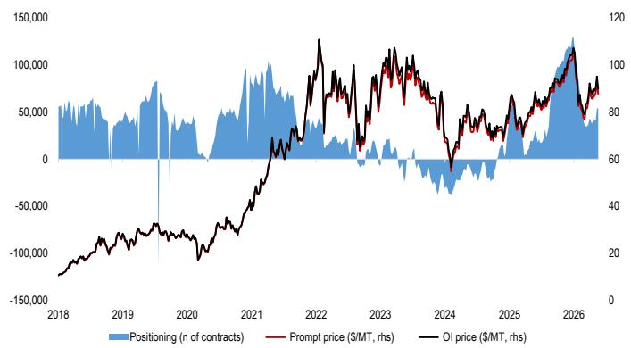

line chart

| Year | Positioning (n of contracts) | Prompt price ($/MT, rhs) | OI price ($/MT, rhs) |
|------|------------------------------|--------------------------|----------------------|
| 2018 | ~50,000                      | ~50,000                  | ~-150,000            |
| 2019 | ~70,000                      | ~70,000                  | ~-100,000            |
| 2020 | ~30,000                      | ~30,000                  | ~-100,000            |
| 2021 | ~100,000                     | ~100,000                 | ~-50,000             |
| 2022 | ~120,000                     | ~120,000                 | ~120,000             |
| 2023 | ~80,000                      | ~80,000                  | ~100,000             |
| 2024 | ~-50,000                     | ~-50,000                 | ~-50,000             |
| 2025 | ~60,000                      | ~60,000                  | ~60,000              |
| 2026 | ~120,000                     | ~120,000                 | ~120,000             |

Source: Exchange data, Bloomberg Finance L.P., JPM Commodities Research

Figure 31: Weekly change in total OI from changes in prices  
USD million  
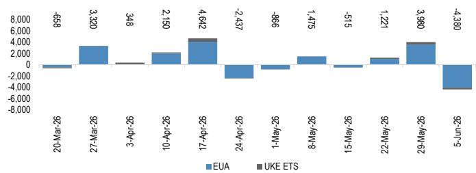

bar chart

| Date       | EUA   | UKE ETS |
| ---------- | ----- | ------- |
| 20-Mar-26  | -668  |         |
| 27-Mar-26  | 3,320 |         |
| 3-Apr-26   | 348   |         |
| 10-Apr-26  | 2,150 |         |
| 17-Apr-26  | 4,642 |         |
| 24-Apr-26  | -2,437|         |
| 1-May-26   | -866  |         |
| 8-May-26   | 1,475 |         |
| 15-May-26  | -515  |         |
| 22-May-26  | 1,221 |         |
| 29-May-26  | 3,980 |         |
| 5-Jun-26   | -4,380|         |

Source: Exchange data, Bloomberg Finance L.P., JPM Commodities Research

Figure 32: Weekly change in total OI from changes in contracts (flows)  
USD million  
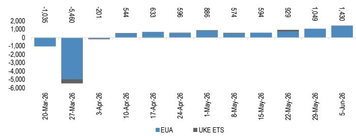

bar chart

| Date       | EUA    | UKE ETS |
| ---------- | ------ | ------- |
| 20-Mar-26  | -1,035 |         |
| 27-Mar-26  | -5,460 |         |
| 3-Apr-26   | -201   |         |
| 10-Apr-26  | 544    |         |
| 17-Apr-26  | 633    |         |
| 24-Apr-26  | 596    |         |
| 9-May-26   | 886    |         |
| 8-May-26   | 574    |         |
| 15-May-26  | 594    |         |
| 22-May-26  | 929    |         |
| 29-May-26  | 1,049  |         |
| 5-Jun-26   | 1,430  |         |

Source: Exchange data, Bloomberg Finance L.P., JPM Commodities Research

## Metals markets

Table 5: Estimated open interest and flows  
USD million

<table><tr><td rowspan="2">Sector</td><td>Number of futures markets</td><td>Total estimated Open Interest</td><td colspan="4">Change in Open Interest</td><td colspan="4">Cumulative flows</td></tr><tr><td>Count</td><td>05-Jun-26</td><td>1 Week</td><td>1 Month</td><td>3 Months</td><td>2026 YTD</td><td>1 Week</td><td>1 Month</td><td>3 Months</td><td>2026 YTD</td></tr><tr><td>Metals</td><td>34</td><td>534,965</td><td>-2,385</td><td>-40,252</td><td>-85,413</td><td>-121,844</td><td>11,862</td><td>-16,366</td><td>-54,400</td><td>-153,022</td></tr><tr><td>Precious</td><td>15</td><td>257,097</td><td>-7,152</td><td>-44,762</td><td>-94,049</td><td>-130,093</td><td>5,439</td><td>-18,145</td><td>-47,205</td><td>-128,443</td></tr><tr><td>Gold</td><td>8</td><td>192,431</td><td>-5,494</td><td>-38,533</td><td>-79,473</td><td>-88,553</td><td>2,377</td><td>-21,048</td><td>-43,553</td><td>-89,016</td></tr><tr><td>COMEX Gold</td><td>1</td><td>143,904</td><td>-4,635</td><td>-31,449</td><td>-67,302</td><td>-78,061</td><td>2,866</td><td>-17,303</td><td>-38,745</td><td>-76,395</td></tr><tr><td>OSE Gold</td><td>1</td><td>5,623</td><td>-183</td><td>-453</td><td>-3,087</td><td>-3,664</td><td>-81</td><td>-38</td><td>-2,094</td><td>-4,096</td></tr><tr><td>RTS Gold</td><td>1</td><td>-</td><td>-</td><td>-</td><td>-</td><td>-</td><td>-</td><td>-</td><td>-</td><td>-</td></tr><tr><td>OSE Mini Gold</td><td>1</td><td>179</td><td>-6</td><td>-10</td><td>-44</td><td>-9</td><td>-3</td><td>3</td><td>-14</td><td>-11</td></tr><tr><td>TFEX Gold</td><td>1</td><td>92</td><td>-8</td><td>-8</td><td>-71</td><td>-60</td><td>-7</td><td>-3</td><td>-51</td><td>-62</td></tr><tr><td>SHF Gold</td><td>1</td><td>42,447</td><td>-655</td><td>-6,590</td><td>-8,961</td><td>-6,805</td><td>-400</td><td>-3,704</td><td>-2,674</td><td>-8,499</td></tr><tr><td>TurkDEX Gold</td><td>1</td><td>171</td><td>-6</td><td>-19</td><td>-3</td><td>59</td><td>2</td><td>-0</td><td>28</td><td>59</td></tr><tr><td>MCX Gold</td><td>1</td><td>15</td><td>-1</td><td>-3</td><td>-4</td><td>-12</td><td>-1</td><td>-3</td><td>-2</td><td>-13</td></tr><tr><td>Silver</td><td>3</td><td>56,233</td><td>-1,371</td><td>-5,181</td><td>-12,973</td><td>-33,536</td><td>2,721</td><td>2,649</td><td>-3,475</td><td>-35,106</td></tr><tr><td>COMEX Silver</td><td>1</td><td>35,276</td><td>-2,281</td><td>-3,945</td><td>-10,643</td><td>-23,089</td><td>1,176</td><td>1,778</td><td>-4,690</td><td>-20,820</td></tr><tr><td>SHFE Silver</td><td>1</td><td>19,854</td><td>747</td><td>-1,744</td><td>-2,860</td><td>-10,220</td><td>1,301</td><td>291</td><td>548</td><td>-14,010</td></tr><tr><td>MCX Silver</td><td>1</td><td>1,103</td><td>163</td><td>507</td><td>530</td><td>-227</td><td>244</td><td>580</td><td>666</td><td>-276</td></tr><tr><td>Platinum</td><td>2</td><td>6,311</td><td>-163</td><td>-633</td><td>-1,265</td><td>-5,649</td><td>267</td><td>247</td><td>-396</td><td>-3,237</td></tr><tr><td>NYMEX Platinum</td><td>1</td><td>5,799</td><td>-168</td><td>-595</td><td>-1,142</td><td>-5,309</td><td>254</td><td>233</td><td>-347</td><td>-2,976</td></tr><tr><td>OSE Platinum</td><td>1</td><td>512</td><td>4</td><td>-38</td><td>-122</td><td>-340</td><td>13</td><td>14</td><td>-49</td><td>-261</td></tr><tr><td>Palladium</td><td>2</td><td>2,122</td><td>-124</td><td>-415</td><td>-338</td><td>-2,355</td><td>74</td><td>7</td><td>219</td><td>-1,084</td></tr><tr><td>NYMEX Palladium</td><td>1</td><td>2,122</td><td>-124</td><td>-415</td><td>-338</td><td>-2,355</td><td>74</td><td>7</td><td>219</td><td>-1,084</td></tr><tr><td>OSE Palladium</td><td>1</td><td>-</td><td>-</td><td>-</td><td>-</td><td>-</td><td>-</td><td>-</td><td>-</td><td>-</td></tr><tr><td>Base</td><td>13</td><td>238,597</td><td>-618</td><td>1,889</td><td>476</td><td>-2,003</td><td>2,139</td><td>41</td><td>-12,717</td><td>-29,587</td></tr><tr><td>Aluminium</td><td>3</td><td>54,856</td><td>-1,605</td><td>338</td><td>67</td><td>6,503</td><td>-658</td><td>-660</td><td>-1,522</td><td>-1,398</td></tr><tr><td>LME Aluminum</td><td>1</td><td>42,718</td><td>-1,158</td><td>702</td><td>747</td><td>5,307</td><td>-271</td><td>-318</td><td>-1,000</td><td>-1,043</td></tr><tr><td>COMEX Aluminum</td><td>1</td><td>229</td><td>-6</td><td>23</td><td>24</td><td>52</td><td>-5</td><td>14</td><td>17</td><td>20</td></tr><tr><td>SHF Aluminum</td><td>1</td><td>11,908</td><td>-440</td><td>-387</td><td>-703</td><td>1,144</td><td>-382</td><td>-356</td><td>-539</td><td>-376</td></tr><tr><td>Copper</td><td>4</td><td>136,560</td><td>-24</td><td>2,912</td><td>1,580</td><td>-12,327</td><td>957</td><td>2,111</td><td>-6,979</td><td>-26,379</td></tr><tr><td>LME Copper</td><td>1</td><td>54,894</td><td>-306</td><td>-310</td><td>-5,792</td><td>-10,981</td><td>209</td><td>-5</td><td>-8,644</td><td>-17,557</td></tr><tr><td>COMEX Copper</td><td>1</td><td>41,040</td><td>602</td><td>5,401</td><td>9,801</td><td>4,581</td><td>1,273</td><td>5,176</td><td>6,508</td><td>1,575</td></tr><tr><td>SHF Copper</td><td>1</td><td>39,879</td><td>-309</td><td>-2,316</td><td>-2,390</td><td>-6,014</td><td>-512</td><td>-3,194</td><td>-4,825</td><td>-10,623</td></tr><tr><td>MCX Copper</td><td>1</td><td>747</td><td>-11</td><td>138</td><td>-39</td><td>86</td><td>-14</td><td>135</td><td>-18</td><td>226</td></tr><tr><td>Lead</td><td>2</td><td>6,583</td><td>171</td><td>-575</td><td>-1,375</td><td>-390</td><td>228</td><td>-616</td><td>-1,675</td><td>-365</td></tr><tr><td>LME Lead</td><td>1</td><td>5,035</td><td>-44</td><td>-854</td><td>-1,218</td><td>-797</td><td>-5</td><td>-926</td><td>-1,524</td><td>-820</td></tr><tr><td>SHF Lead</td><td>1</td><td>1,548</td><td>214</td><td>279</td><td>-157</td><td>407</td><td>233</td><td>310</td><td>-151</td><td>455</td></tr><tr><td>Zinc</td><td>2</td><td>17,172</td><td>181</td><td>-290</td><td>1,132</td><td>1,495</td><td>256</td><td>-757</td><td>109</td><td>-661</td></tr><tr><td>LME Zinc</td><td>1</td><td>13,270</td><td>120</td><td>-967</td><td>451</td><td>906</td><td>176</td><td>-1,348</td><td>-451</td><td>-829</td></tr><tr><td>SHF Zinc</td><td>1</td><td>3,902</td><td>61</td><td>677</td><td>681</td><td>590</td><td>80</td><td>591</td><td>560</td><td>167</td></tr><tr><td>LME Nickel</td><td>1</td><td>20,543</td><td>604</td><td>-25</td><td>-780</td><td>2,362</td><td>1,162</td><td>354</td><td>-2,170</td><td>-664</td></tr><tr><td>LME Tin</td><td>1</td><td>2,882</td><td>55</td><td>-470</td><td>-148</td><td>352</td><td>193</td><td>-391</td><td>-480</td><td>-119</td></tr><tr><td>Industrial</td><td>6</td><td>39,272</td><td>5,385</td><td>2,622</td><td>8,160</td><td>10,253</td><td>4,284</td><td>1,738</td><td>5,522</td><td>5,008</td></tr><tr><td>Coal</td><td>3</td><td>16,287</td><td>4,903</td><td>5,940</td><td>6,880</td><td>7,560</td><td>3,481</td><td>3,909</td><td>4,090</td><td>2,910</td></tr><tr><td>ICE Richards Bay Coal</td><td>1</td><td>324</td><td>-64</td><td>8</td><td>96</td><td>228</td><td>-73</td><td>-10</td><td>66</td><td>163</td></tr><tr><td>ICE Rotterdam Coal</td><td>1</td><td>2,818</td><td>-181</td><td>300</td><td>-69</td><td>221</td><td>-247</td><td>46</td><td>-94</td><td>-490</td></tr><tr><td>DCE Coal</td><td>1</td><td>13,145</td><td>5,148</td><td>5,632</td><td>6,854</td><td>7,111</td><td>3,801</td><td>3,873</td><td>4,118</td><td>3,238</td></tr><tr><td>Iron Ore</td><td>2</td><td>12,090</td><td>485</td><td>-909</td><td>1,765</td><td>1,653</td><td>782</td><td>-84</td><td>2,181</td><td>1,644</td></tr><tr><td>DCE Iron Ore</td><td>1</td><td>12,090</td><td>485</td><td>-909</td><td>1,765</td><td>1,653</td><td>782</td><td>-84</td><td>2,181</td><td>1,644</td></tr><tr><td>COMEX Iron Ore</td><td>1</td><td>-</td><td>-</td><td>-</td><td>-</td><td>-</td><td>-</td><td>-</td><td>-</td><td>-</td></tr><tr><td>SHFE Steel</td><td>1</td><td>10,895</td><td>-3</td><td>-2,410</td><td>-486</td><td>1,040</td><td>21</td><td>-2,087</td><td>-748</td><td>454</td></tr><tr><td colspan="11"></td></tr><tr><td>Total Regions</td><td>34</td><td>534,965</td><td>-2,385</td><td>-40,252</td><td>-85,413</td><td>-121,844</td><td>11,862</td><td>-16,366</td><td>-54,400</td><td>-153,022</td></tr><tr><td>US</td><td>7</td><td>228,370</td><td>-6,612</td><td>-30,980</td><td>-69,600</td><td>-104,181</td><td>5,638</td><td>-10,095</td><td>-37,038</td><td>-99,681</td></tr><tr><td>UK</td><td>8</td><td>142,485</td><td>-974</td><td>-1,617</td><td>-6,714</td><td>-2,400</td><td>1,145</td><td>-2,597</td><td>-14,298</td><td>-21,359</td></tr><tr><td>EU</td><td>0</td><td>-</td><td>-</td><td>-</td><td>-</td><td>-</td><td>-</td><td>-</td><td>-</td><td>-</td></tr><tr><td>China</td><td>9</td><td>155,668</td><td>5,249</td><td>-7,768</td><td>-6,257</td><td>-11,095</td><td>4,925</td><td>-4,361</td><td>-1,530</td><td>-27,550</td></tr><tr><td>RoW</td><td>10</td><td>8,443</td><td>-48</td><td>113</td><td>-2,841</td><td>-4,168</td><td>154</td><td>687</td><td>-1,534</td><td>-4,433</td></tr></table>

Source: Exchange data, Bloomberg Finance L.P., JPM Commodities Research

Figure 33: Metals sectoral standardised level chart  
0-10 standardised scale: 0 = lowest since 2018, 10 = highest since 2018 positioning data in real USD terms  
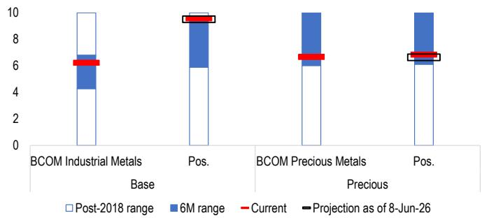

stacked bar chart

| Category | Sub-category | Post-2018 range | 6M range | Current | Projection as of 8-Jun-26 |
| :--- | :--- | :--- | :--- | :--- | :--- |
| Base | BCOM Industrial Metals | 4.0 | 3.5 | 6.0 | 9.5 |
| Base | Pos. | 5.5 | 4.5 | 9.0 | 9.5 |
| Precious | BCOM Precious Metals | 5.5 | 10.0 | 6.5 | 6.5 |
| Precious | Pos. | 5.5 | 10.0 | 6.5 | 6.5 |

Projections by JPM QDS Research; US exchanges data is an aggregate of Managed Money and Other Reportables, European exchanges data is an aggregate of Investment Funds and Other Financial Firms.

All data as of June 2, 2026, except LME data as of June 5, 2026.

Source: Exchange data, Bloomberg Finance L.P., JPM QDS and Commodities Research

Figure 35: Precious Metals standardised level chart  
0-10 standardised scale: 0 = lowest since 2018, 10 = highest since 2018 positioning data in real USD terms  
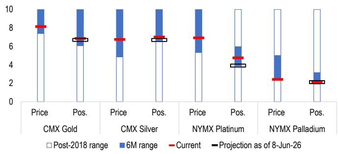

bar chart

| Asset Class       | Current | Projection as of 8-Jun-26 |
| ----------------- | ------- | ------------------------- |
| CMX Gold          | 8       | 7                         |
| CMX Silver        | 7       | 7                         |
| NYMX Platinum     | 7       | 4                         |
| NYMX Palladium   | 2       | 2                         |

Projections by JPM QDS Research; US exchanges data is an aggregate of Managed Money and Other Reportables, European exchanges data is an aggregate of Investment Funds and Other Financial Firms.

All data as of June 2, 2026.

Source: Exchange data, Bloomberg Finance L.P., JPM Commodities Research

Figure 37: COMEX Copper position and price  
LHS: n of contracts; RHS: \$/lb  
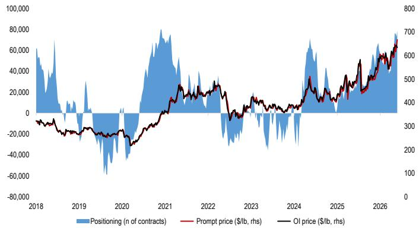

line chart

| Year | Positioning (n of contracts) | Prompt price ($/lb, rhs) | Oil price ($/lb, rhs) |
|------|------------------------------|--------------------------|----------------------|
| 2018 | ~60,000                      | ~300                     | ~300                 |
| 2019 | ~-20,000                     | ~250                     | ~250                 |
| 2020 | ~-60,000                     | ~200                     | ~200                 |
| 2021 | ~80,000                      | ~300                     | ~300                 |
| 2022 | ~20,000                      | ~400                     | ~400                 |
| 2023 | ~-20,000                     | ~350                     | ~350                 |
| 2024 | ~60,000                      | ~500                     | ~500                 |
| 2025 | ~40,000                      | ~450                     | ~450                 |
| 2026 | ~70,000                      | ~650                     | ~650                 |

Source: Exchange data, Bloomberg Finance L.P., JPM Commodities Research

Figure 34: Base Metals standardised level chart  
0-10 standardised scale: 0 = lowest since 2018, 10 = highest since 2018 positioning data in real USD terms  
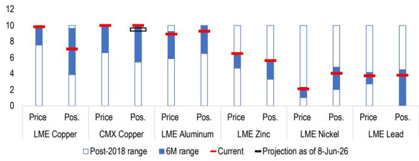

stacked bar chart

| Category | Price | Pos. |
| :--- | :--- | :--- |
| LME Copper | 7.5 | 3.0 |
| CMX Copper | 6.5 | 4.0 |
| LME Aluminum | 5.5 | 4.0 |
| LME Zinc | 4.5 | 3.0 |
| LME Nickel | 1.0 | 2.0 |
| LME Lead | 10.0 | 4.0 |
Post-2018 range (bar), Current (red dot), Projection as of 8-Jun-26 (black dot).

Projections by JPM QDS Research; US exchanges data is an aggregate of Managed Money and Other Reportables, European exchanges data is an aggregate of Investment Funds and Other Financial Firms.

All data as of June 2, 2026, except LME data as of June 5, 2026.

Source: Exchange data, Bloomberg Finance L.P., JPM QDS and Commodities Research

Figure 36: COMEX Gold position and price  
LHS: n of contracts; RHS: \$/t oz  
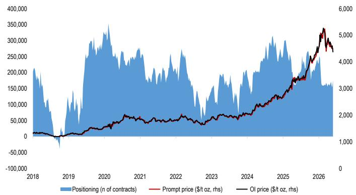

line chart

| Year | Positioning (n of contracts) | Prompt price ($/t oz, rhs) | Oil price ($/t oz, rhs) |
|------|------------------------------|-----------------------------|--------------------------|
| 2018 | ~200,000                     | ~1,000                      | ~1,000                   |
| 2019 | ~-50,000                     | ~1,500                      | ~1,500                   |
| 2020 | ~350,000                     | ~5,000                      | ~5,000                   |
| 2021 | ~250,000                     | ~7,500                      | ~7,500                   |
| 2022 | ~250,000                     | ~1,000                      | ~1,000                   |
| 2023 | ~150,000                     | ~1,500                      | ~1,500                   |
| 2024 | ~250,000                     | ~2,500                      | ~2,500                   |
| 2025 | ~350,000                     | ~3,500                      | ~3,500                   |
| 2026 | ~450,000                     | ~5,500                      | ~5,500                   |

Source: Exchange data, Bloomberg Finance L.P., JPM Commodities Research

Figure 38: LME Copper position and price  
LHS: n of contracts; RHS: \$/MT  
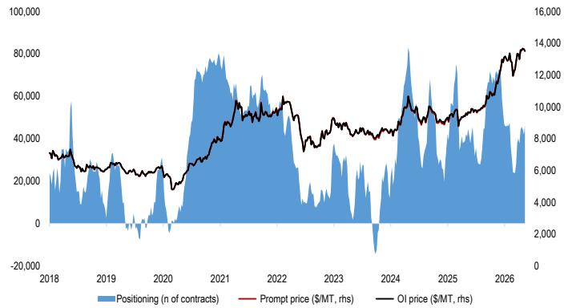

line chart

| Year | Positioning (n of contracts) | Prompt price ($/MT, rhs) | Oil price ($/MT, rhs) |
|------|------------------------------|--------------------------|----------------------|
| 2018 | ~30,000                      | ~30,000                  | ~30,000              |
| 2019 | ~25,000                      | ~25,000                  | ~25,000              |
| 2020 | ~15,000                      | ~15,000                  | ~15,000              |
| 2021 | ~70,000                      | ~70,000                  | ~70,000              |
| 2022 | ~60,000                      | ~60,000                  | ~60,000              |
| 2023 | ~40,000                      | ~40,000                  | ~40,000              |
| 2024 | ~-15,000                     | ~15,000                  | ~15,000              |
| 2025 | ~60,000                      | ~60,000                  | ~60,000              |
| 2026 | ~45,000                      | ~45,000                  | ~45,000              |

Source: Exchange data, Bloomberg Finance L.P., JPM Commodities Research

Figure 39: Weekly change in total OI due to price/flows  
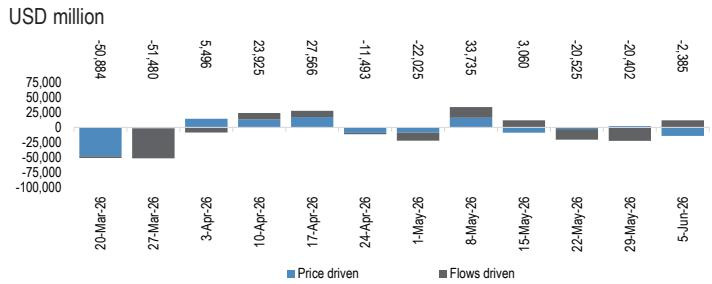

stacked bar chart

| Date | Price driven (USD million) | Flows driven (USD million) |
| :--- | :--- | :--- |
| 20-Mar-26 | -50,884 | |
| 27-Mar-26 | -51,480 | |
| 3-Apr-26 | 5,496 | |
| 10-Apr-26 | 23,925 | |
| 17-Apr-26 | 27,366 | |
| 24-Apr-26 | -11,493 | |
| 1-May-26 | -22,025 | |
| 8-May-26 | 33,735 | |
| 15-May-26 | 3,060 | |
| 22-May-26 | -20,525 | |
| 29-May-26 | -20,402 | |
| 5-Jun-26 | -2,395 | |

Source: Exchange data, Bloomberg Finance L.P., JPM Commodities Research

Figure 41: Weekly change in total OI from changes in contracts (\$flows)  
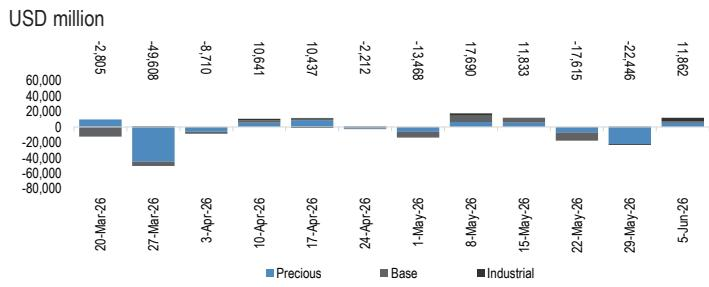

bar chart

| Date       | Precious | Base   | Industrial |
| ---------- | -------- | ------ | ---------- |
| 20-Mar-26  | -2,895   | -      | -          |
| 27-Mar-26  | -49,608  | -      | -          |
| 3-Apr-26   | -8,710   | -      | -          |
| 10-Apr-26  | 10,641   | -      | -          |
| 17-Apr-26  | 10,437   | -      | -          |
| 24-Apr-26  | -2,212   | -      | -          |
| 1-May-26   | -13,468  | -      | -          |
| 8-May-26   | 17,690   | -      | -          |
| 15-May-26  | 11,833   | -      | -          |
| 22-May-26  | -17,615  | -      | -          |
| 29-May-26  | -22,446  | -      | -          |
| 5-Jun-26   | 11,862   | -      | -          |

Source: Exchange data, Bloomberg Finance L.P., JPM Commodities Research

Figure 43: Weekly change in total OI from changes in contracts (flows)-precious metals  
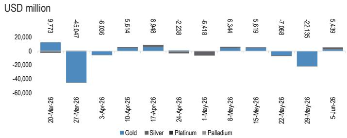

bar chart

| Date       | Gold   | Silver | Platinum | Palladium |
| ---------- | ------ | ------ | -------- | --------- |
| 20-Mar-26  | 9,773  |        |          |           |
| 27-Mar-26  | -45,047|        |          |           |
| 9-Apr-26   | -6,036 |        |          |           |
| 10-Apr-26  | 5,614  |        |          |           |
| 17-Apr-26  | 8,948  |        |          |           |
| 24-Apr-26  | -2,238 |        |          |           |
| 1-May-26   | -6,418 |        |          |           |
| 8-May-26   | 6,344  |        |          |           |
| 15-May-26  | 5,619  |        |          |           |
| 22-May-26  | -7,068 |        |          |           |
| 9-May-26   | -22,135|        |          |           |
| 5-Jun-26   | 5,439  |        |          |           |

Source: Exchange data, Bloomberg Finance L.P., JPM Commodities Research

Figure 40: Weekly change in total OI from changes in prices  
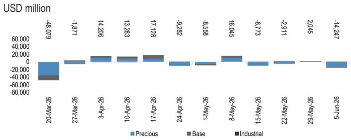

stacked bar chart

| Date | Precious (USD million) | Base (USD million) | Industrial (USD million) |
| :--- | :--- | :--- | :--- |
| 20-04-12 | -48,079 | -35,000 | -40,000 |
| 9-26-May-12 | -1,871 | -1,500 | -1,500 |
| 4-26-May-13 | 14,206 | 5,000 | 5,000 |
| 10-Apr-01 | 13,283 | 5,000 | 5,000 |
| 9-26-Apr-02 | 17,128 | 5,000 | 5,000 |
| 17-Apr-03 | -9,282 | -5,000 | -5,000 |
| 24-Apr-04 | -8,538 | -5,000 | -5,000 |
| 9-27-May-04 | 16,045 | 5,000 | 5,000 |
| 9-27-May-11 | -8,773 | -5,000 | -5,000 |
| 9-27-May-12 | -2,911 | -5,000 | -5,000 |
| 24-May-13 | 2,045 | -5,000 | -5,000 |
| 9-27-Jun-13 | -14,247 | -5,000 | -5,000 |
The chart displays a single series of values for Precious, Base, and Industrial categories across multiple time points. The Y-axis represents the value in USD million. The X-axis is labeled with dates and corresponding numerical values. There are no legend categories provided in the image.

Source: Exchange data, Bloomberg Finance L.P., JPM Commodities Research

Figure 42: Weekly change in total OI from changes in contracts (flows)-industrial and bulk metals  
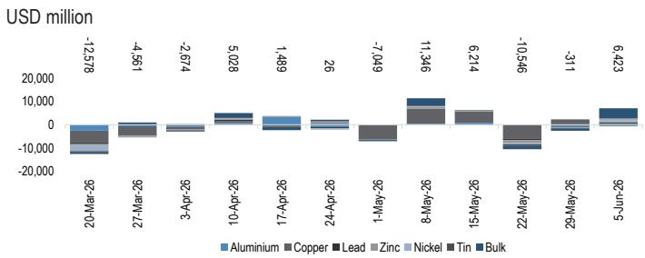

bar chart

| Maturity | Aluminum | Copper | Lead | Zinc | Nickel | Tin | Bulk |
|----------|----------|--------|------|------|--------|-----|------|
| 92-epb-02 | -12,578 | -12,578 | -12,578 | -12,578 | -12,578 | -12,578 | -12,578 |
| 92-epb-12 | -4,561 | -4,561 | -4,561 | -4,561 | -4,561 | -4,561 | -4,561 |
| 92-epb-13 | -2,674 | -2,674 | -2,674 | -2,674 | -2,674 | -2,674 | -2,674 |
| 92-epb-01 | 5,028 | 5,028 | 5,028 | 5,028 | 5,028 | 5,028 | 5,028 |
| 92-epb-11 | 1,489 | 1,489 | 1,489 | 1,489 | 1,489 | 1,489 | 1,489 |
| 92-epb-12 | 26 | 26 | 26 | 26 | 26 | 26 | 26 |
| 92-epb-13 | -7,049 | -7,049 | -7,049 | -7,049 | -7,049 | -7,049 | -7,049 |
| 92-epb-09 | 11,346 | 11,346 | 11,346 | 11,346 | 11,346 | 11,346 | 11,346 |
| 92-epb-09 | 6,214 | 6,214 | 6,214 | 6,214 | 6,214 | 6,214 | 6,214 |
| 92-epb-09 | -10,546 | -10,546 | -10,546 | -10,546 | -10,546 | -10,546 | -10,546 |
| 92-epb-02 | -311 | -311 | -311 | -311 | -311 | -311 | -311 |
| 92-epb-02 | 6,423 | 6,423 | 6,423 | 6,423 | 6,423 | 6,423 | 6,423 |
The chart displays a series of bars representing different metal categories over time. Values are estimated based on the current data point.

Source: Exchange data, Bloomberg Finance L.P., JPM Commodities Research

## Agricultural markets

Table 6: Estimated open interest and flows  
USD million

<table><tr><td rowspan="2">Sector</td><td>Number of futures markets</td><td>Total estimated Open Interest</td><td colspan="4">Change in Open Interest</td><td colspan="4">Cumulative flows</td></tr><tr><td>Count</td><td>05-Jun-26</td><td>1 Week</td><td>1 Month</td><td>3 Months</td><td>2026 YTD</td><td>1 Week</td><td>1 Month</td><td>3 Months</td><td>2026 YTD</td></tr><tr><td>Agriculture</td><td>36</td><td>382,072</td><td>-10,985</td><td>-8,059</td><td>5,503</td><td>64,934</td><td>1,155</td><td>9,403</td><td>8,821</td><td>56,060</td></tr><tr><td>Grains &amp; Oilseeds</td><td>17</td><td>228,794</td><td>-11,571</td><td>-797</td><td>1,493</td><td>55,139</td><td>-1,632</td><td>8,209</td><td>6,546</td><td>37,723</td></tr><tr><td>Corn</td><td>4</td><td>49,164</td><td>-1,841</td><td>-4,310</td><td>-2,020</td><td>7,743</td><td>931</td><td>-665</td><td>750</td><td>8,771</td></tr><tr><td>CBOT Corn</td><td>1</td><td>41,321</td><td>-1,800</td><td>-4,771</td><td>-2,194</td><td>6,518</td><td>905</td><td>-1,319</td><td>462</td><td>8,012</td></tr><tr><td>DCE Corn</td><td>1</td><td>7,474</td><td>-21</td><td>519</td><td>239</td><td>1,411</td><td>30</td><td>704</td><td>361</td><td>963</td></tr><tr><td>Euronext Maize</td><td>1</td><td>369</td><td>-19</td><td>-58</td><td>-64</td><td>-186</td><td>-3</td><td>-50</td><td>-73</td><td>-205</td></tr><tr><td>OSE Corn</td><td>1</td><td>-</td><td>-</td><td>-</td><td>-0</td><td>-0</td><td>-</td><td>-</td><td>-0</td><td>-0</td></tr><tr><td>Wheat</td><td>7</td><td>32,648</td><td>-2,069</td><td>-509</td><td>-708</td><td>2,733</td><td>-457</td><td>998</td><td>217</td><td>-450</td></tr><tr><td>CBOT Wheat</td><td>1</td><td>14,212</td><td>-954</td><td>332</td><td>-774</td><td>1,610</td><td>-218</td><td>1,006</td><td>-53</td><td>291</td></tr><tr><td>KCBT Wheat</td><td>1</td><td>9,586</td><td>-881</td><td>-603</td><td>151</td><td>1,532</td><td>-433</td><td>132</td><td>269</td><td>362</td></tr><tr><td>MAIX Wheat</td><td>1</td><td>2,800</td><td>-279</td><td>-195</td><td>412</td><td>764</td><td>-98</td><td>-10</td><td>471</td><td>625</td></tr><tr><td>Euronext Milling Wheat</td><td>1</td><td>5,487</td><td>60</td><td>-35</td><td>-391</td><td>-958</td><td>294</td><td>-136</td><td>-350</td><td>-1,495</td></tr><tr><td>Euronext Feed Wheat</td><td>1</td><td>208</td><td>-4</td><td>8</td><td>-47</td><td>-63</td><td>4</td><td>14</td><td>-64</td><td>-87</td></tr><tr><td>ZCE Wheat</td><td>1</td><td>-</td><td>-</td><td>-</td><td>-</td><td>-</td><td>-</td><td>-</td><td>-</td><td>-</td></tr><tr><td>SAFEX Wheat</td><td>1</td><td>355</td><td>-10</td><td>-15</td><td>-60</td><td>-153</td><td>-5</td><td>-8</td><td>-57</td><td>-148</td></tr><tr><td>Soybeans</td><td>2</td><td>62,650</td><td>-4,337</td><td>205</td><td>-3,149</td><td>17,458</td><td>-1,379</td><td>3,189</td><td>-30</td><td>13,403</td></tr><tr><td>CBOT Soybean</td><td>1</td><td>58,520</td><td>-4,295</td><td>-346</td><td>-4,470</td><td>14,890</td><td>-1,405</td><td>2,580</td><td>-1,295</td><td>11,417</td></tr><tr><td>DCE Soybean</td><td>1</td><td>4,129</td><td>-42</td><td>551</td><td>1,321</td><td>2,567</td><td>27</td><td>609</td><td>1,265</td><td>1,986</td></tr><tr><td>Soybean Meal</td><td>2</td><td>39,739</td><td>-1,503</td><td>2,940</td><td>4,840</td><td>10,186</td><td>-105</td><td>3,689</td><td>5,985</td><td>10,175</td></tr><tr><td>CBOT Soy Meal</td><td>1</td><td>19,382</td><td>-1,816</td><td>1,185</td><td>2,096</td><td>3,902</td><td>-965</td><td>1,619</td><td>2,526</td><td>3,751</td></tr><tr><td>DCE Soy Meal</td><td>1</td><td>20,357</td><td>313</td><td>1,755</td><td>2,744</td><td>6,284</td><td>861</td><td>2,070</td><td>3,459</td><td>6,424</td></tr><tr><td>Soybean Oil</td><td>2</td><td>44,593</td><td>-1,822</td><td>876</td><td>2,530</td><td>17,019</td><td>-623</td><td>997</td><td>-376</td><td>5,823</td></tr><tr><td>CBOT Soy Oil</td><td>1</td><td>30,697</td><td>-1,883</td><td>-146</td><td>1,753</td><td>11,281</td><td>-877</td><td>-89</td><td>-889</td><td>1,547</td></tr><tr><td>DCE Soy Oil</td><td>1</td><td>13,896</td><td>61</td><td>1,023</td><td>777</td><td>5,738</td><td>254</td><td>1,086</td><td>513</td><td>4,276</td></tr><tr><td>Softs</td><td>15</td><td>99,193</td><td>2,227</td><td>-761</td><td>9,027</td><td>8,329</td><td>4,828</td><td>5,897</td><td>7,474</td><td>17,405</td></tr><tr><td>Cotton</td><td>2</td><td>24,586</td><td>686</td><td>-4,073</td><td>148</td><td>2,365</td><td>1,138</td><td>-2,400</td><td>-1,929</td><td>-980</td></tr><tr><td>NYBOT Cotton</td><td>1</td><td>12,846</td><td>-435</td><td>-1,247</td><td>1,538</td><td>3,010</td><td>-91</td><td>173</td><td>165</td><td>1,451</td></tr><tr><td>ZCE Cotton</td><td>1</td><td>11,740</td><td>1,121</td><td>-2,826</td><td>-1,390</td><td>-645</td><td>1,229</td><td>-2,573</td><td>-2,094</td><td>-2,431</td></tr><tr><td>Coffee</td><td>2</td><td>22,406</td><td>86</td><td>1,377</td><td>2,121</td><td>-641</td><td>1,586</td><td>4,327</td><td>5,750</td><td>6,770</td></tr><tr><td>NYBOT Coffee</td><td>1</td><td>19,297</td><td>297</td><td>1,239</td><td>2,007</td><td>-1,092</td><td>1,675</td><td>3,992</td><td>5,371</td><td>5,661</td></tr><tr><td>ICE Coffee</td><td>1</td><td>3,109</td><td>-210</td><td>137</td><td>114</td><td>451</td><td>-89</td><td>335</td><td>379</td><td>1,109</td></tr><tr><td>Cocoa</td><td>2</td><td>16,976</td><td>-240</td><td>-427</td><td>4,007</td><td>513</td><td>351</td><td>985</td><td>1,481</td><td>6,261</td></tr><tr><td>NYBOT Cocoa</td><td>1</td><td>8,057</td><td>-146</td><td>-131</td><td>1,679</td><td>634</td><td>178</td><td>546</td><td>599</td><td>3,429</td></tr><tr><td>ICE Cocoa</td><td>1</td><td>8,919</td><td>-94</td><td>-296</td><td>2,328</td><td>-121</td><td>173</td><td>439</td><td>882</td><td>2,832</td></tr><tr><td>Sugar</td><td>4</td><td>28,131</td><td>1,663</td><td>1,663</td><td>2,237</td><td>4,269</td><td>1,605</td><td>2,213</td><td>1,844</td><td>4,121</td></tr><tr><td>NYBOT Sugar</td><td>1</td><td>16,515</td><td>506</td><td>271</td><td>-255</td><td>772</td><td>384</td><td>801</td><td>-404</td><td>999</td></tr><tr><td>ICE Sugar</td><td>1</td><td>3,265</td><td>142</td><td>487</td><td>63</td><td>59</td><td>92</td><td>426</td><td>-118</td><td>-2</td></tr><tr><td>ZCE Sugar</td><td>1</td><td>8,140</td><td>1,035</td><td>896</td><td>2,394</td><td>3,401</td><td>1,145</td><td>973</td><td>2,344</td><td>3,098</td></tr><tr><td>NYB Sugar</td><td>1</td><td>211</td><td>-20</td><td>8</td><td>34</td><td>37</td><td>-16</td><td>13</td><td>22</td><td>25</td></tr><tr><td>Other softs</td><td>5</td><td>7,094</td><td>31</td><td>699</td><td>515</td><td>1,822</td><td>147</td><td>772</td><td>328</td><td>1,234</td></tr><tr><td>CBOT Rice</td><td>1</td><td>325</td><td>-23</td><td>-37</td><td>69</td><td>57</td><td>-17</td><td>-51</td><td>31</td><td>-11</td></tr><tr><td>NYBOT Orange Juice</td><td>1</td><td>195</td><td>2</td><td>-21</td><td>-41</td><td>-88</td><td>3</td><td>-3</td><td>-0</td><td>-47</td></tr><tr><td>CBOT Oats</td><td>1</td><td>69</td><td>-23</td><td>3</td><td>-5</td><td>3</td><td>-14</td><td>6</td><td>4</td><td>-1</td></tr><tr><td>CME Milk</td><td>1</td><td>1,023</td><td>-62</td><td>74</td><td>19</td><td>-64</td><td>-70</td><td>109</td><td>26</td><td>-129</td></tr><tr><td>Euronext Rapeseed</td><td>1</td><td>5,483</td><td>137</td><td>681</td><td>472</td><td>1,914</td><td>246</td><td>711</td><td>267</td><td>1,423</td></tr><tr><td>Livestock</td><td>4</td><td>54,086</td><td>-1,641</td><td>-6,502</td><td>-5,017</td><td>1,466</td><td>-2,040</td><td>-4,703</td><td>-5,199</td><td>932</td></tr><tr><td>CME Live Cattle</td><td>1</td><td>31,434</td><td>-1,146</td><td>-3,813</td><td>1,088</td><td>1,754</td><td>-1,558</td><td>-3,444</td><td>-404</td><td>716</td></tr><tr><td>BMF Cattle</td><td>1</td><td>1,127</td><td>-255</td><td>-112</td><td>-139</td><td>382</td><td>-244</td><td>-77</td><td>-205</td><td>240</td></tr><tr><td>CME Feeder Cattle</td><td>1</td><td>10,137</td><td>103</td><td>-1,790</td><td>-2,609</td><td>-1,465</td><td>-54</td><td>-1,307</td><td>-2,851</td><td>-1,728</td></tr><tr><td>CME Lean Hogs</td><td>1</td><td>11,388</td><td>-342</td><td>-787</td><td>-3,357</td><td>795</td><td>-184</td><td>124</td><td>-1,739</td><td>1,704</td></tr><tr><td colspan="11"></td></tr><tr><td>Total Regions</td><td>36</td><td>382,072</td><td>-10,985</td><td>-8,059</td><td>5,503</td><td>64,934</td><td>1,155</td><td>9,403</td><td>8,821</td><td>56,060</td></tr><tr><td>US</td><td>19</td><td>288,014</td><td>-13,198</td><td>-10,776</td><td>-2,858</td><td>44,850</td><td>-2,859</td><td>4,878</td><td>2,313</td><td>38,074</td></tr><tr><td>UK</td><td>4</td><td>15,500</td><td>-167</td><td>336</td><td>2,459</td><td>326</td><td>180</td><td>1,215</td><td>1,078</td><td>3,852</td></tr><tr><td>EU</td><td>3</td><td>11,340</td><td>178</td><td>588</td><td>16</td><td>770</td><td>537</td><td>525</td><td>-156</td><td>-276</td></tr><tr><td>China</td><td>7</td><td>65,737</td><td>2,467</td><td>1,918</td><td>6,085</td><td>18,758</td><td>3,546</td><td>2,869</td><td>5,848</td><td>14,317</td></tr><tr><td>RoW</td><td>3</td><td>1,482</td><td>-265</td><td>-127</td><td>-200</td><td>229</td><td>-249</td><td>-85</td><td>-262</td><td>92</td></tr></table>

Source: Exchange data, Bloomberg Finance L.P., JPM Commodities Research

Figure 44: Agriculture commodities sectoral standardised level chart  
0-10 standardised scale: 0 = lowest since 2018, 10 = highest since 2018 positioning data in real USD terms  
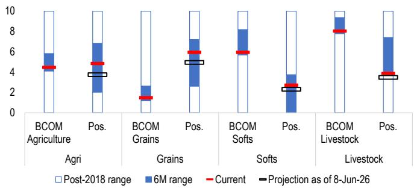

bar chart

| Category       | Sub-category         | Value |
| -------------- | ------------------- | ----- |
| Agri           | BCOM Agriculture    | 10    |
| Agri           | Pos.                | 10    |
| Grains         | BCOM Grains         | 10    |
| Grains         | Pos.                | 10    |
| Softs          | BCOM Softs          | 10    |
| Softs          | Pos.                | 10    |
| Livestock      | BCOM Livestock      | 10    |
| Livestock      | Pos.                | 10    |

Projections by JPM QDS Research; US exchanges data is an aggregate of Managed Money and Other Reportables, European exchanges data is an aggregate of Investment Funds and Other Financial Firms.  
All data as of June 2, 2026.  
Source: Exchange data, Bloomberg Finance L.P., JPM QDS and Commodities Research

Figure 46: Softs standardised level chart  
0-10 standardised scale: 0 = lowest since 2018, 10 = highest since 2018 positioning data in real USD terms  
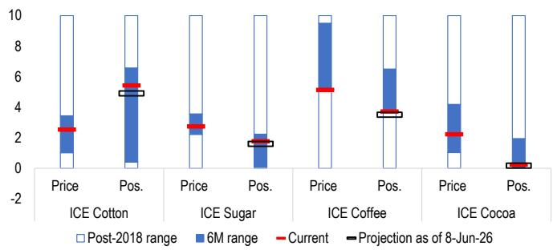

bar chart

| Category     | Price | Pos. |
| ------------ | ----- | ---- |
| ICE Cotton   | 10    | 10   |
| ICE Sugar    | 10    | 10   |
| ICE Coffee   | 10    | 10   |
| ICE Cocoa    | 10    | 10   |

Projections by JPM QDS Research; US exchanges data is an aggregate of Managed Money and Other Reportables, European exchanges data is an aggregate of Investment Funds and Other Financial Firms.  
All data as of June 2, 2026.  
Source: Exchange data, Bloomberg Finance L.P., JPM QDS and Commodities Research

Figure 48: Weekly change in total OI due to price/flows  
USD million  
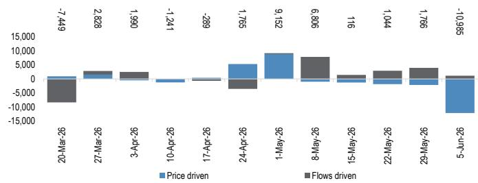

bar chart

| Date       | Price driven | Flows driven |
| ---------- | ------------ | ------------ |
| 20-Mar-26  | -7,449       | -7,449       |
| 9-Sep-26   | 2,828        | 2,828        |
| 9-Apr-26   | 1,990        | 1,990        |
| 9-Apr-21   | -1,241       | -1,241       |
| 9-Apr-21   | -289         | -289         |
| 21-Apr-26  | 1,765        | 1,765        |
| 9-Sep-26   | 9,152        | 9,152        |
| 1-May-26   | 6,806        | 6,806        |
| 9-May-26   | 1,116        | 1,116        |
| 15-May-26  | 1,044        | 1,044        |
| 9-Sep-26   | 1,766        | 1,766        |
| 9-Sep-26   | -10,985      | -10,985      |

Source: Exchange data, Bloomberg Finance L.P., JPM Commodities Research

Figure 45: Grains & oilseeds standardised level chart  
0-10 standardised scale: 0 = lowest since 2018, 10 = highest since 2018 positioning data in real USD terms  
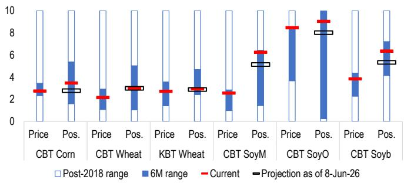

bar chart

| Category     | Price | Pos. |
| ------------ | ----- | ---- |
| CBT Corn     | 10    | 10   |
| CBT Wheat    | 10    | 10   |
| KBT Wheat    | 10    | 10   |
| CBT SoyM     | 10    | 10   |
| CBT SoyO     | 10    | 10   |
| CBT Soyb     | 10    | 10   |

Projections by JPM QDS Research; US exchanges data is an aggregate of Managed Money and Other Reportables, European exchanges data is an aggregate of Investment Funds and Other Financial Firms.  
All data as of June 2, 2026.  
Source: Exchange data, Bloomberg Finance L.P., JPM QDS and Commodities Research

Figure 47: Livestock standardised level chart  
0-10 standardised scale: 0 = lowest since 2018, 10 = highest since 2018 positioning data in real USD terms  
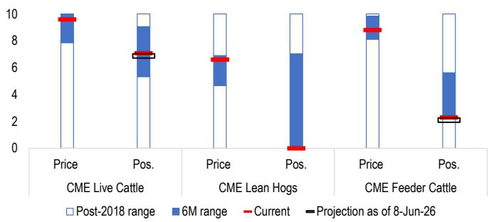

stacked bar chart

| Category | Value | Post-2018 range | 6M range | Current | Projection as of 8-Jun-26 |
| :--- | :--- | :--- | :--- | :--- | :--- |
| CME Live Cattle | 9.5 | 7.5 | 3.0 | 0.5 | 0.0 |
| CME Lean Hogs | 7.0 | 4.5 | 3.0 | 0.5 | 0.0 |
| CME Feeder Cattle | 10.0 | 8.0 | 3.0 | 0.5 | 0.0 |

Projections by JPM QDS Research; US exchanges data is an aggregate of Managed Money and Other Reportables, European exchanges data is an aggregate of Investment Funds and Other Financial Firms.  
All data as of June 2, 2026.  
Source: Exchange data, Bloomberg Finance L.P., JPM QDS and Commodities Research

Figure 49: Weekly change in total OI from changes in prices  
USD million  
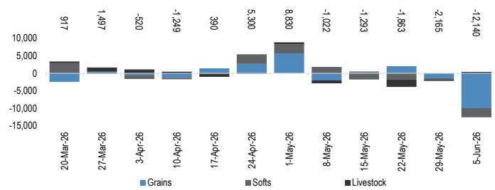

stacked bar chart

| Category | Grains | Softs | Livestock |
|---|---|---|---|
| 92-Jay-02 | -147 | 350 | 100 |
| 92-Jay-12 | -520 | -100 | 50 |
| 92-Jdy-1 | -1249 | -100 | 50 |
| 92-Jdy-11 | 390 | -50 | -50 |
| 92-Jdy-12 | 5300 | 200 | 100 |
| 1-M-Jay-1 | 8830 | 150 | 50 |
| 92-Jay-8 | -1022 | -50 | -50 |
| 92-Jay-15 | -1293 | -50 | -50 |
| 92-Jay-22 | -1863 | -50 | -50 |
| 92-Jay-62 | -2165 | -50 | -50 |
| 92-Jun-5 | -12140 | -10000 | -15000 |
The chart displays a single series of values for each category. The x-axis represents different stock tickers, and the y-axis represents numerical values. Values are explicitly labeled on the bars. There is no additional data series or labels provided in the image.

Source: Exchange data, Bloomberg Finance L.P., JPM Commodities Research

Figure 50: Weekly change in total OI from changes in contracts (\$flows)  
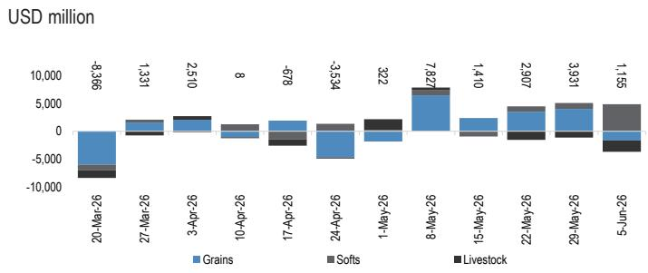

stacked bar chart

USD million
| Date | Grains (USD million) | Softs (USD million) | Livestock (USD million) |
| :--- | :--- | :--- | :--- |
| 20-Mar-26 | -8,366 | | |
| 27-Mar-26 | 1,331 | | |
| 3-Apr-26 | 2,510 | | |
| 10-Apr-26 | 8 | | |
| 17-Apr-26 | -678 | | |
| 24-Apr-26 | -3,534 | | |
| 1-May-26 | 322 | | |
| 8-May-26 | 7,827 | | |
| 15-May-26 | 1,410 | | |
| 22-May-26 | 2,907 | | |
| 29-May-26 | 3,931 | | |
| 5-Jun-26 | 1,155 | | |

Source: Exchange data, Bloomberg Finance L.P., JPM Commodities Research

Figure 51: Weekly change in total OI from changes in contracts (flows) - grains and oilseeds  
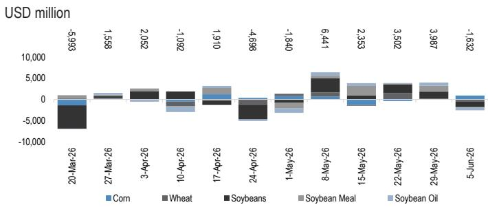

stacked bar chart

| Date | Corn (USD million) | Wheat (USD million) | Soybeans (USD million) | Soybean Meal (USD million) | Soybean Oil (USD million) |
| :--- | :--- | :--- | :--- | :--- | :--- |
| 20-Mar-26 | -5,993 | | -7,800 | | |
| 27-Mar-26 | 1,588 | | | | |
| 3-Apr-26 | 2,052 | | | | |
| 10-Apr-26 | -1,092 | | | | |
| 17-Apr-26 | 1,910 | | | | |
| 24-Apr-26 | -4,998 | | -5,500 | | |
| 1-May-26 | -1,840 | | | | |
| 8-May-26 | 6,441 | | 5,000 | | |
| 15-May-26 | 2,353 | | | | |
| 22-May-26 | 3,502 | | | | |
| 29-May-26 | 3,987 | | | | |
| 5-Jun-26 | -1,632 | | | | |

Source: Exchange data, Bloomberg Finance L.P., JPM Commodities Research

Figure 52: Weekly change in total OI from changes in contracts (flows)-softs and livestock  
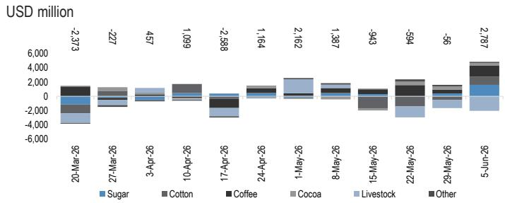  
Source: Exchange data, Bloomberg Finance L.P., JPM Commodities Research

## Global Commodities Inventory Monitor

The Global Commodity Inventory Monitor (GCIM) monthly data series can be accessed through JPM DataQuery; API capabilities are also available (links can be found here).

Figure 53: The Global Commodities Inventory Monitor is estimated on a global and ex-China basis, showing apparent inventories on a days of use basis  
LHS: Inventories in days of use; RHS: BCOM Price index  
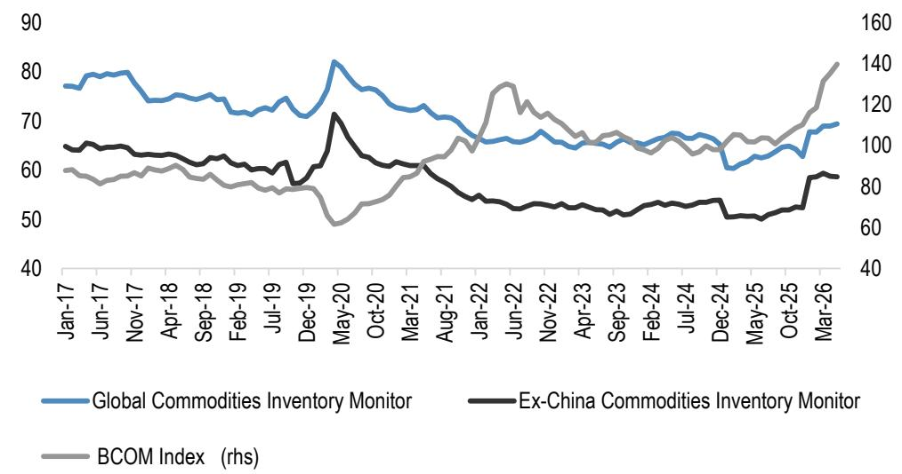

line chart

| Month    | Global Commodities Inventory Monitor | Ex-China Commodities Inventory Monitor | BCOM Index (rhs) |
|----------|--------------------------------------|----------------------------------------|------------------|
| Jan-17   | 78                                   | 65                                     | 90               |
| Jun-17   | 80                                   | 64                                     | 85               |
| Nov-17   | 79                                   | 63                                     | 80               |
| Apr-18   | 77                                   | 62                                     | 75               |
| Sep-18   | 76                                   | 61                                     | 70               |
| Feb-19   | 75                                   | 60                                     | 65               |
| Jul-19   | 74                                   | 59                                     | 60               |
| Dec-19   | 73                                   | 58                                     | 55               |
| May-20   | 82                                   | 70                                     | 45               |
| Oct-20   | 78                                   | 65                                     | 55               |
| Mar-21   | 75                                   | 60                                     | 65               |
| Aug-21   | 72                                   | 55                                     | 75               |
| Jan-22   | 68                                   | 50                                     | 90               |
| Jun-22   | 65                                   | 45                                     | 110              |
| Nov-22   | 63                                   | 40                                     | 100              |
| Apr-23   | 62                                   | 35                                     | 95               |
| Sep-23   | 61                                   | 30                                     | 90               |
| Feb-24   | 60                                   | 25                                     | 85               |
| Jul-24   | 59                                   | 20                                     | 80               |
| Dec-24   | 58                                   | 15                                     | 75               |
| May-25   | 57                                   | 10                                     | 70               |
| Oct-25   | 56                                   | 5                                      | 65               |
| Mar-26   | 70                                   | 60                                     | 140              |

Underlying commodity inventories have been converted to days of use and the relevant annual BCOM weighting factor applied to each underlying. BCOM weights recalculated after excluding: Silver, Gold, Live Cattle, Lean Hogs.  
Source: Bloomberg Finance L.P., S&P Global Platts, IEA, EIA, USDA, various exchanges, JPM Commodities Research

Figure 54: The Ex-US natural gas Global Commodity Inventory Monitor is estimated on a global and ex-China basis, showing apparent inventories on a days of use basis  
LHS: Inventories in days of use; RHS: BCOM Price index  
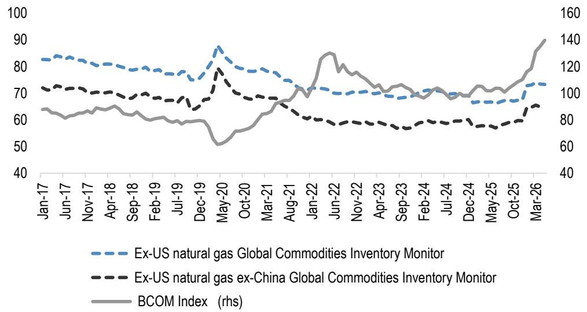

line chart

| Month   | Ex-US natural gas Global Commodities Inventory Monitor | Ex-US natural gas ex-China Global Commodities Inventory Monitor | BCOM Index (rhs) |
|---------|--------------------------------------------------------|---------------------------------------------------------------|------------------|
| Jan-17  | 83                                                     | 72                                                            | 65               |
| Jun-17  | 84                                                     | 71                                                            | 63               |
| Nov-17  | 83                                                     | 70                                                            | 64               |
| Apr-18  | 82                                                     | 69                                                            | 65               |
| Sep-18  | 81                                                     | 68                                                            | 63               |
| Feb-19  | 80                                                     | 67                                                            | 62               |
| Jul-19  | 79                                                     | 66                                                            | 61               |
| Dec-19  | 78                                                     | 65                                                            | 60               |
| May-20  | 88                                                     | 80                                                            | 50               |
| Oct-20  | 80                                                     | 70                                                            | 55               |
| Mar-21  | 78                                                     | 68                                                            | 60               |
| Aug-21  | 75                                                     | 65                                                            | 65               |
| Jan-22  | 72                                                     | 62                                                            | 70               |
| Jun-22  | 70                                                     | 60                                                            | 85               |
| Nov-22  | 68                                                     | 58                                                            | 75               |
| Apr-23  | 67                                                     | 57                                                            | 70               |
| Sep-23  | 68                                                     | 58                                                            | 72               |
| Feb-24  | 69                                                     | 59                                                            | 70               |
| Jul-24  | 70                                                     | 60                                                            | 68               |
| Dec-24  | 68                                                     | 59                                                            | 70               |
| May-25  | 67                                                     | 58                                                            | 72               |
| Oct-25  | 68                                                     | 59                                                            | 75               |
| Mar-26  | 73                                                     | 65                                                            | 90               |

Underlying commodity inventories have been converted to days of use and the relevant annual BCOM weighting factor applied to each underlying. BCOM weights recalculated after excluding: US Natural Gas, Silver, Gold, Live Cattle, Lean Hogs.  
Source: Bloomberg Finance L.P., S&P Global Platts, IEA, EIA, USDA, various exchanges, JPM Commodities Research

Figure 55: China's share of world commodity inventories  
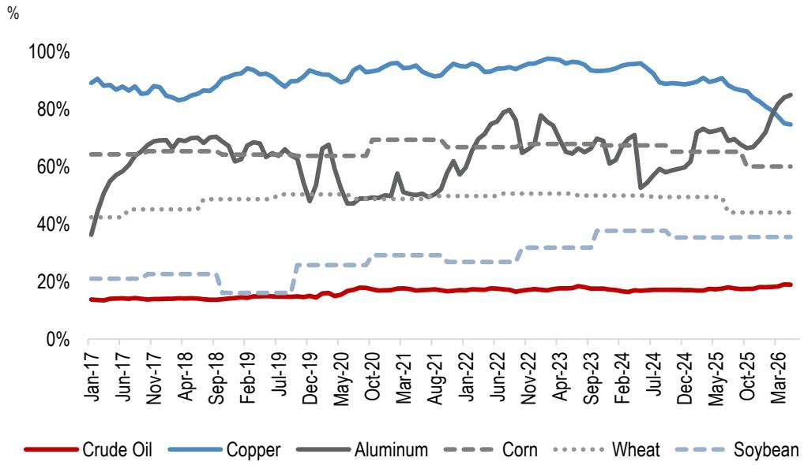

line chart

| Date   | Crude Oil | Copper | Aluminum | Corn | Wheat | Soybean |
|--------|-----------|--------|----------|------|-------|---------|
| Jan-17 | 15%       | 90%    | 35%      | 65%  | 45%   | 20%     |
| Jun-17 | 15%       | 88%    | 60%      | 65%  | 45%   | 20%     |
| Nov-17 | 15%       | 85%    | 68%      | 65%  | 45%   | 20%     |
| Apr-18 | 15%       | 82%    | 70%      | 65%  | 45%   | 20%     |
| Sep-18 | 15%       | 88%    | 68%      | 65%  | 45%   | 20%     |
| Feb-19 | 15%       | 92%    | 65%      | 65%  | 45%   | 20%     |
| Jul-19 | 15%       | 88%    | 68%      | 65%  | 45%   | 20%     |
| Dec-19 | 15%       | 90%    | 48%      | 65%  | 45%   | 25%     |
| May-20 | 15%       | 92%    | 48%      | 65%  | 45%   | 25%     |
| Oct-20 | 15%       | 95%    | 48%      | 65%  | 45%   | 25%     |
| Mar-21 | 15%       | 93%    | 50%      | 65%  | 45%   | 25%     |
| Aug-21 | 15%       | 92%    | 50%      | 65%  | 45%   | 25%     |
| Jan-22 | 15%       | 93%    | 60%      | 65%  | 45%   | 25%     |
| Jun-22 | 15%       | 94%    | 78%      | 65%  | 45%   | 25%     |
| Nov-22 | 15%       | 95%    | 78%      | 65%  | 45%   | 25%     |
| Apr-23 | 15%       | 94%    | 68%      | 65%  | 45%   | 25%     |
| Sep-23 | 15%       | 93%    | 68%      | 65%  | 45%   | 30%     |
| Feb-24 | 15%       | 94%    | 70%      | 65%  | 45%   | 30%     |
| Jul-24 | 15%       | 93%    | 70%      | 65%  | 45%   | 30%     |
| Dec-24 | 15%       | 92%    | 72%      | 65%  | 45%   | 30%     |
| May-25 | 15%       | 90%    | 70%      | 60%  | 40%   | 30%     |
| Oct-25 | 15%       | 88%    | 72%      | 60%  | 40%   | 30%     |
| Mar-26 | 18%       | 75%    | 85%      | 60%  | 40%   | 30%     |

Source: Bloomberg Finance L.P., Kpler, CRU, USDA, various exchanges, JPM Commodities Research

Figure 56: The Global and Ex-China Commodities Inventory Monitors reported in standardised form  
Z-scores of global commodities inventories as days of use  
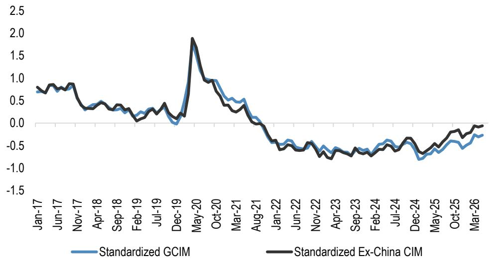

line chart

| Date    | Standardized GCIM | Standardized Ex-China CIM |
|---------|-------------------|--------------------------|
| Jan-17  | ~0.8              | ~0.9                     |
| Jun-17  | ~0.7              | ~0.8                     |
| Nov-17  | ~0.5              | ~0.6                     |
| Apr-18  | ~0.3              | ~0.4                     |
| Sep-18  | ~0.2              | ~0.3                     |
| Feb-19  | ~0.1              | ~0.2                     |
| Jul-19  | ~0.0              | ~0.1                     |
| Dec-19  | ~-0.1             | ~-0.2                    |
| May-20  | ~1.9              | ~1.8                     |
| Oct-20  | ~0.8              | ~0.9                     |
| Mar-21  | ~0.5              | ~0.6                     |
| Aug-21  | ~0.2              | ~0.3                     |
| Jan-22  | ~-0.5             | ~-0.6                    |
| Jun-22  | ~-0.6             | ~-0.7                    |
| Nov-22  | ~-0.7             | ~-0.8                    |
| Apr-23  | ~-0.8             | ~-0.9                    |
| Sep-23  | ~-0.7             | ~-0.8                    |
| Feb-24  | ~-0.6             | ~-0.7                    |
| Jul-24  | ~-0.5             | ~-0.6                    |
| Dec-24  | ~-0.8             | ~-0.9                    |
| May-25  | ~-0.6             | ~-0.7                    |
| Oct-25  | ~-0.4             | ~-0.5                    |
| Mar-26  | ~-0.2             | ~-0.3                    |

Source: S&P Global Platts, IEA, EIA, USDA, various exchanges, JPM

Figure 57: The Ex-US natural gas Global and Ex-US natural gas Ex-China Commodities Inventory Monitors reported in standardised form  
Z-scores of global commodities inventories as days of use  
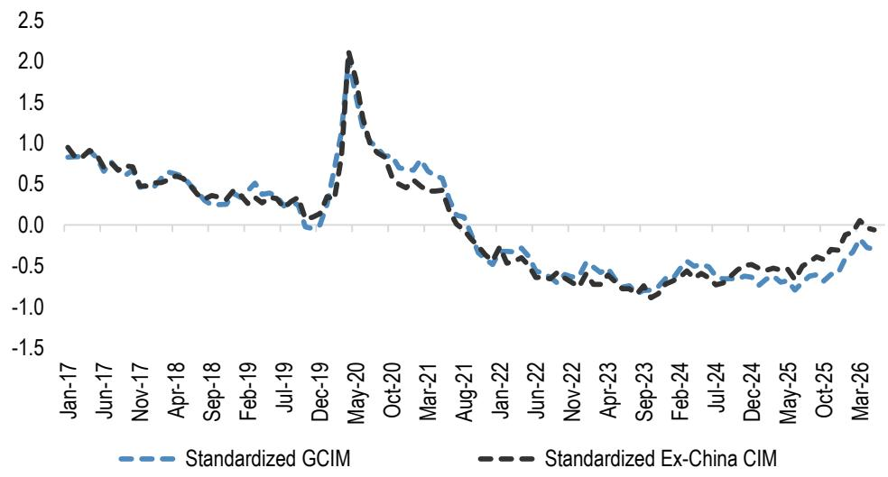

line chart

| Month    | Standardized GCIM | Standardized Ex-China CIM |
| -------- | ----------------- | ------------------------ |
| Jan-17   | 0.9               | 0.9                      |
| Jun-17   | 0.8               | 0.8                      |
| Nov-17   | 0.7               | 0.7                      |
| Apr-18   | 0.6               | 0.6                      |
| Sep-18   | 0.5               | 0.5                      |
| Feb-19   | 0.4               | 0.4                      |
| Jul-19   | 0.3               | 0.3                      |
| Dec-19   | 0.2               | 0.2                      |
| May-20   | 2.1               | 2.1                      |
| Oct-20   | 0.8               | 0.8                      |
| Mar-21   | 0.6               | 0.6                      |
| Aug-21   | 0.3               | 0.3                      |
| Jan-22   | -0.5              | -0.5                     |
| Jun-22   | -0.7              | -0.7                     |
| Nov-22   | -0.8              | -0.8                     |
| Apr-23   | -0.9              | -0.9                     |
| Sep-23   | -0.8              | -0.8                     |
| Feb-24   | -0.7              | -0.7                     |
| Jul-24   | -0.6              | -0.6                     |
| Dec-24   | -0.5              | -0.5                     |
| May-25   | -0.7              | -0.7                     |
| Oct-25   | -0.4              | -0.4                     |
| Mar-26   | -0.1              | -0.1                     |

Source: S&P Global Platts, IEA, EIA, USDA, various exchanges, JPM

Figure 58: Sectoral Global Commodities Inventory Monitors  
Z-scores of global commodities inventories as days of use  
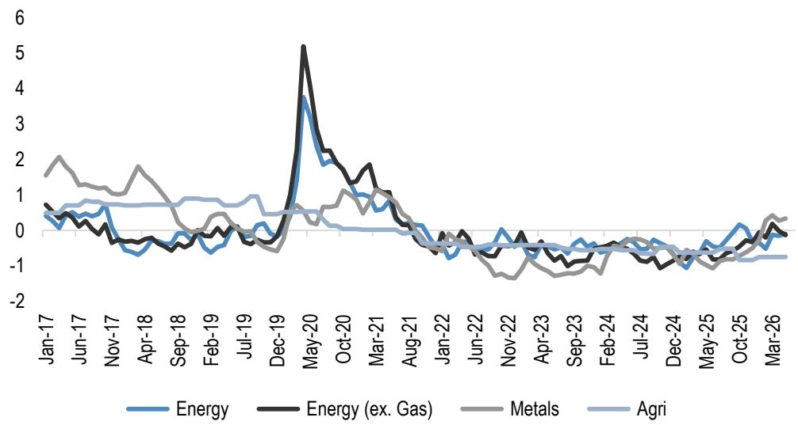

line chart

| Month    | Energy | Energy (ex. Gas) | Metals | Agri |
|----------|--------|------------------|--------|------|
| Jan-17   | 0.5    | 0.8              | 2.0    | 0.7  |
| Jun-17   | 0.3    | 0.6              | 1.8    | 0.6  |
| Nov-17   | 0.4    | 0.5              | 1.5    | 0.7  |
| Apr-18   | -0.2   | -0.1             | 1.8    | 0.6  |
| Sep-18   | -0.5   | -0.3             | 1.2    | 0.7  |
| Feb-19   | -0.3   | -0.2             | 0.5    | 0.8  |
| Jul-19   | -0.1   | -0.1             | 0.3    | 0.9  |
| Dec-19   | -0.2   | -0.3             | -0.5   | 0.8  |
| May-20   | 3.8    | 5.2              | 0.5    | 0.6  |
| Oct-20   | 2.5    | 2.8              | 1.2    | 0.5  |
| Mar-21   | 1.5    | 1.8              | 1.0    | 0.4  |
| Aug-21   | 0.5    | 0.8              | 0.5    | 0.3  |
| Jan-22   | -0.5   | -0.3             | -0.2   | 0.2  |
| Jun-22   | -0.8   | -0.5             | -0.5   | 0.1  |
| Nov-22   | -0.3   | -0.2             | -1.0   | 0.0  |
| Apr-23   | -0.5   | -0.4             | -1.2   | -0.1 |
| Sep-23   | -0.7   | -0.6             | -1.5   | -0.2 |
| Feb-24   | -0.4   | -0.3             | -1.3   | -0.3 |
| Jul-24   | -0.6   | -0.5             | -1.1   | -0.4 |
| Dec-24   | -0.8   | -0.7             | -1.3   | -0.5 |
| May-25   | -0.5   | -0.4             | -1.2   | -0.6 |
| Oct-25   | -0.3   | -0.2             | -1.0   | -0.7 |
| Mar-26   | -0.1   | 0.0              | 0.3    | -0.8 |

NB-incorporates historical revisions to standardised metals inventories  
Source: S&P Global Platts, IEA, EIA, USDA, various exchanges, JPM Commodities Research

Figure 59: Sectoral Ex-China Commodities Inventory Monitors  
Z-scores of global commodities inventories as days of use  
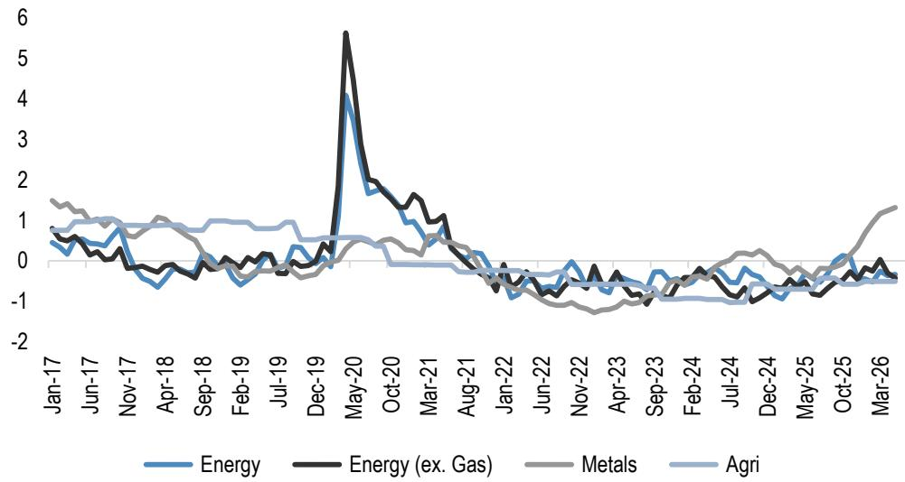

line chart

| Month    | Energy | Energy (ex. Gas) | Metals | Agri |
|----------|--------|------------------|--------|------|
| Jan-17   | 0.5    | 0.8              | 1.5    | 0.9  |
| Jun-17   | 0.3    | 0.6              | 1.2    | 0.8  |
| Nov-17   | 0.7    | 0.4              | 1.0    | 0.7  |
| Apr-18   | -0.2   | -0.1             | 0.9    | 0.6  |
| Sep-18   | -0.5   | -0.3             | 0.8    | 0.5  |
| Feb-19   | -0.8   | -0.6             | 0.7    | 0.4  |
| Jul-19   | -0.3   | -0.2             | 0.6    | 0.3  |
| Dec-19   | 0.2    | 0.1              | 0.5    | 0.2  |
| May-20   | 4.0    | 5.5              | 0.4    | 0.1  |
| Oct-20   | 1.5    | 2.0              | 0.3    | 0.0  |
| Mar-21   | 0.8    | 1.2              | 0.2    | -0.1 |
| Aug-21   | 0.3    | 0.5              | 0.1    | -0.2 |
| Jan-22   | -0.5   | -0.3             | -0.2   | -0.4 |
| Jun-22   | -0.8   | -0.6             | -0.4   | -0.6 |
| Nov-22   | -1.0   | -0.8             | -0.6   | -0.8 |
| Apr-23   | -0.7   | -0.5             | -0.3   | -0.5 |
| Sep-23   | -0.4   | -0.2             | -0.1   | -0.3 |
| Feb-24   | -0.6   | -0.4             | 0.0    | -0.5 |
| Jul-24   | -0.8   | -0.6             | 0.2    | -0.7 |
| Dec-24   | -1.0   | -0.8             | 0.4    | -0.9 |
| May-25   | -0.5   | -0.3             | 0.1    | -0.4 |
| Oct-25   | -0.2   | 0.1              | 0.3    | -0.2 |
| Mar-26   | -0.3   | -0.1             | 1.2    | -0.3 |
| Mar-26   | -0.4   | -0.2             | 1.3    | -0.4 |
The chart displays the monthly values of Energy, Metals, and Agri from Jan-17 to Mar-26.

NB-incorporates historical revisions to standardized metals inventories  
Source: S&P Global Platts, IEA, EIA, USDA, various exchanges, JPM Commodities Research

Figure 60: Global commodities inventory seasonality  
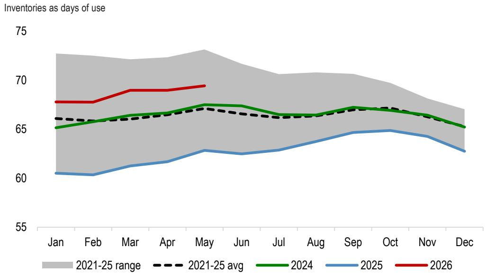

line chart

| Month | 2021-25 range | 2021-25 avg | 2024 | 2025 | 2026 |
|-------|---------------|-------------|------|------|------|
| Jan   | ~73           | ~66         | ~65  | ~60  | ~68  |
| Feb   | ~73           | ~66         | ~66  | ~60  | ~68  |
| Mar   | ~73           | ~66         | ~67  | ~61  | ~69  |
| Apr   | ~73           | ~66         | ~67  | ~61  | ~69  |
| May   | ~73           | ~67         | ~68  | ~63  | ~69  |
| Jun   | ~71           | ~67         | ~68  | ~63  | —    |
| Jul   | ~71           | ~66         | ~67  | ~63  | —    |
| Aug   | ~71           | ~66         | ~67  | ~64  | —    |
| Sep   | ~71           | ~67         | ~68  | ~65  | —    |
| Oct   | ~70           | ~67         | ~68  | ~65  | —    |
| Nov   | ~68           | ~66         | ~67  | ~64  | —    |
| Dec   | ~67           | ~65         | ~65  | ~63  | —    |

Source: S&P Global Platts, IEA, EIA, USDA, various exchanges, JPM Commodities Research

Figure 61: Global commodities inventory seasonality (Ex-natural gas)  
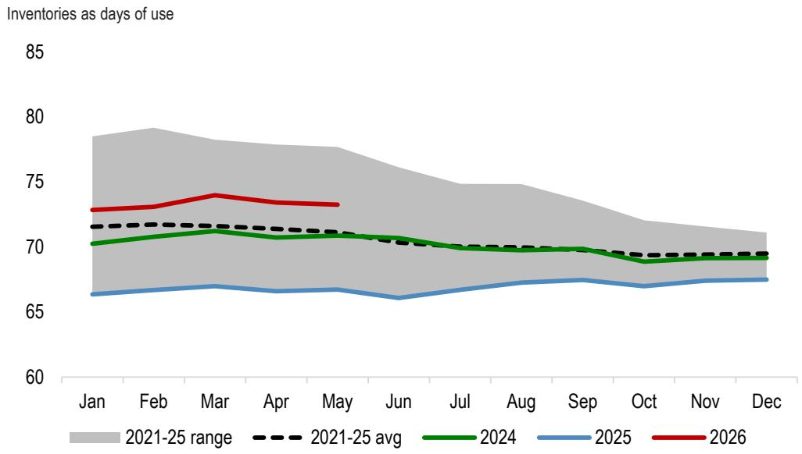

line chart

| Month | 2021-25 range | 2021-25 avg | 2024 | 2025 | 2026 |
|-------|---------------|-------------|------|------|------|
| Jan   | ~78           | ~71.5       | ~70.5| ~66.5| ~73  |
| Feb   | ~79           | ~71.5       | ~71  | ~67  | ~73  |
| Mar   | ~78           | ~71.5       | ~71.5| ~67.5| ~74  |
| Apr   | ~78           | ~71.5       | ~71  | ~67  | ~73.5|
| May   | ~78           | ~71         | ~71  | ~67  | ~73  |
| Jun   | ~76           | ~70.5       | ~70.5| ~66  | -    |
| Jul   | ~75           | ~70         | ~70  | ~67  | -    |
| Aug   | ~75           | ~70         | ~70  | ~67.5| -    |
| Sep   | ~74           | ~69.5       | ~69.5| ~68  | -    |
| Oct   | ~73           | ~69         | ~69  | ~67.5| -    |
| Nov   | ~72           | ~69         | ~69  | ~68  | -    |
| Dec   | ~71           | ~69         | ~69  | ~68  | -    |

Source: S&P Global Platts, IEA, EIA, USDA, various exchanges, JPM Commodities Research

Figure 62: Ex-China commodities inventory seasonality  
Z-scores of global commodities inventories as days of use  
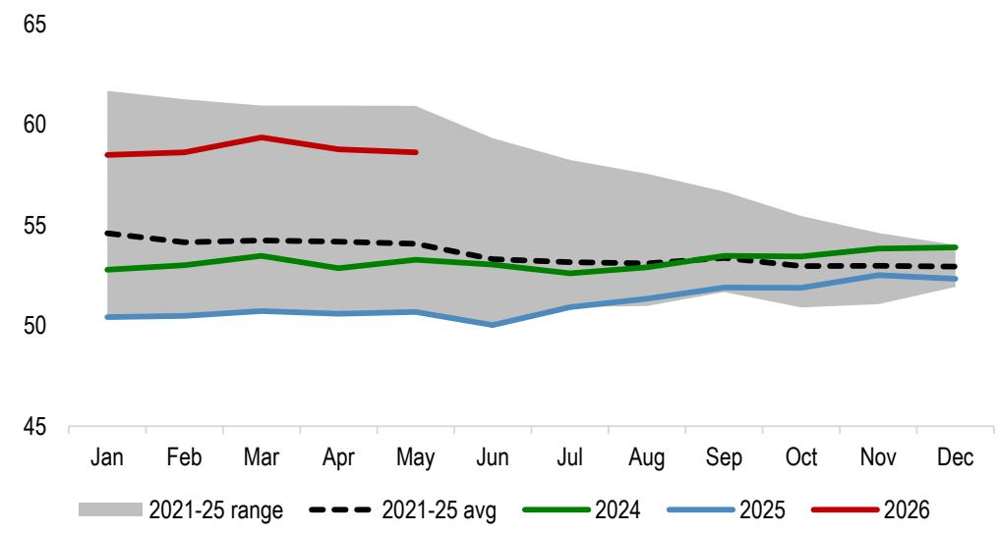

line chart

| Month | 2021-25 range | 2021-25 avg | 2024 | 2025 |
|-------|---------------|-------------|------|------|
| Jan   | ~61           | ~54.5       | ~53  | ~50.5 |
| Feb   | ~61           | ~54.5       | ~53.5| ~50.5 |
| Mar   | ~61           | ~54.5       | ~54  | ~50.5 |
| Apr   | ~61           | ~54.5       | ~53  | ~50.5 |
| May   | ~61           | ~54.5       | ~53.5| ~50.5 |
| Jun   | ~60           | ~53.5       | ~53  | ~50  |
| Jul   | ~59           | ~53.5       | ~53  | ~51  |
| Aug   | ~58           | ~53.5       | ~53.5| ~51.5|
| Sep   | ~57           | ~53.5       | ~54  | ~52  |
| Oct   | ~56           | ~53.5       | ~54  | ~52  |
| Nov   | ~55           | ~53.5       | ~54  | ~52.5|
| Dec   | ~54           | ~53.5       | ~54  | ~52.5|

Source: S&P Global Platts, IEA, EIA, USDA, various exchanges, JPM Commodities Research

Figure 63: Ex-US natural gas Ex-China commodities inventory seasonality  
Z-scores of global commodities inventories as days of use  
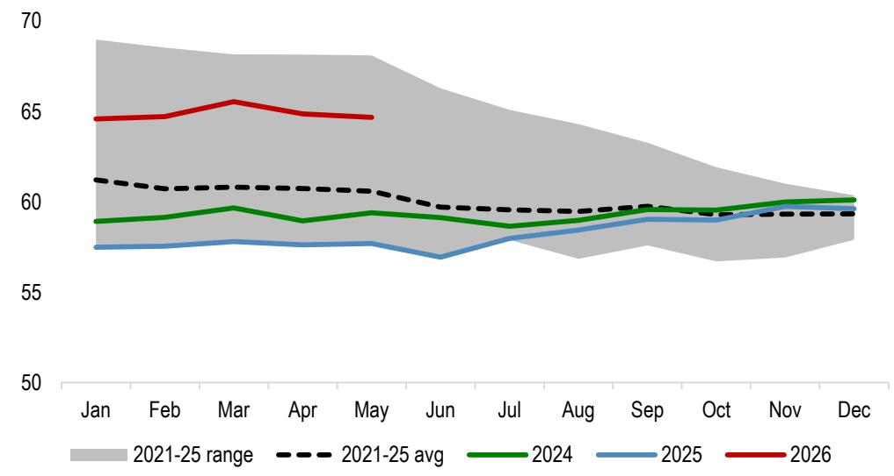

line chart

| Month | 2021-25 range | 2021-25 avg | 2024 | 2025 | 2026 |
|-------|---------------|-------------|------|------|------|
| Jan   | ~68           | ~61         | ~59  | ~57  | 64.5 |
| Feb   | ~68           | ~61         | ~59  | ~57  | 64.5 |
| Mar   | ~68           | ~61         | ~60  | ~57  | 65.5 |
| Apr   | ~68           | ~61         | ~59  | ~57  | 65   |
| May   | ~68           | ~61         | ~59  | ~57  | 64.5 |
| Jun   | ~67           | ~60         | ~59  | ~57  | —    |
| Jul   | ~66           | ~60         | ~59  | ~58  | —    |
| Aug   | ~65           | ~60         | ~59  | ~58  | —    |
| Sep   | ~64           | ~60         | ~60  | ~59  | —    |
| Oct   | ~63           | ~60         | ~59  | ~59  | —    |
| Nov   | ~62           | ~60         | ~60  | ~60  | —    |
| Dec   | ~61           | ~60         | ~60  | ~60  | —    |

Source: S&P Global Platts, IEA, EIA, USDA, various exchanges, JPM Commodities Research

## GCIM Appendix

Figure 64: Oil inventories  
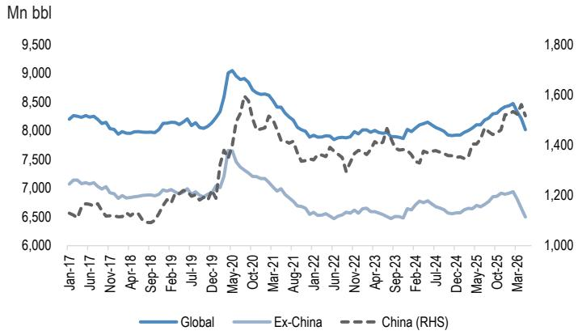

line chart

| Month    | Global | Ex-China | China (RHS) |
|----------|--------|----------|-------------|
| Jan-17   | 8300   | 7100     | 1100        |
| Jun-17   | 8200   | 7000     | 1150        |
| Nov-17   | 8100   | 6900     | 1120        |
| Apr-18   | 8000   | 6800     | 1130        |
| Sep-18   | 8100   | 6900     | 1140        |
| Feb-19   | 8200   | 7000     | 1150        |
| Jul-19   | 8300   | 7100     | 1160        |
| Dec-19   | 8400   | 7200     | 1170        |
| May-20   | 9100   | 7500     | 1450        |
| Oct-20   | 8800   | 7300     | 1550        |
| Mar-21   | 8500   | 7100     | 1500        |
| Aug-21   | 8200   | 6900     | 1450        |
| Jan-22   | 8000   | 6700     | 1400        |
| Jun-22   | 7900   | 6600     | 1350        |
| Nov-22   | 7800   | 6500     | 1380        |
| Apr-23   | 7900   | 6600     | 1420        |
| Sep-23   | 8000   | 6700     | 1450        |
| Feb-24   | 8100   | 6800     | 1480        |
| Jul-24   | 8200   | 6900     | 1500        |
| Dec-24   | 8300   | 7000     | 1520        |
| May-25   | 8400   | 7100     | 1550        |
| Oct-25   | 8500   | 7200     | 1580        |
| Mar-26   | 8300   | 7300     | 1650        |

Source: JPM Commodities Research, IEA, EIA, Wood Mackenzie, Rystad, Genscape, FlightAware, MariTrace, Google, TomTom, US Department of Transportation

Figure 66: US Natural Gas inventories  
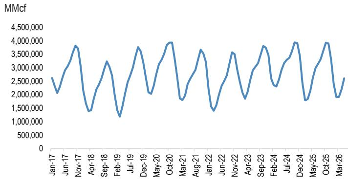

line chart

| Month    | Value     |
| -------- | --------- |
| Jan-17   | 2,500,000 |
| Jun-17   | 3,800,000 |
| Nov-17   | 1,400,000 |
| Apr-18   | 2,200,000 |
| Sep-18   | 3,200,000 |
| Feb-19   | 1,200,000 |
| Jul-19   | 3,800,000 |
| Dec-19   | 2,000,000 |
| May-20   | 3,500,000 |
| Oct-20   | 4,000,000 |
| Mar-21   | 1,800,000 |
| Aug-21   | 3,600,000 |
| Jan-22   | 1,400,000 |
| Jun-22   | 2,500,000 |
| Nov-22   | 3,500,000 |
| Apr-23   | 1,900,000 |
| Sep-23   | 3,800,000 |
| Feb-24   | 2,300,000 |
| Jul-24   | 3,400,000 |
| Dec-24   | 1,800,000 |
| May-25   | 3,900,000 |
| Oct-25   | 1,900,000 |
| Mar-26   | 2,600,000 |

Source: EIA, JPM Commodities Research

Figure 65: Oil inventories on a days of use basis  
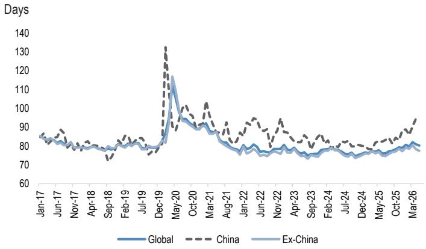

line chart

| Month    | Global | China | Ex-China |
|----------|--------|-------|----------|
| Jan-17   | 85     | 85    | 85       |
| Jun-17   | 80     | 85    | 80       |
| Nov-17   | 80     | 80    | 80       |
| Apr-18   | 75     | 75    | 75       |
| Sep-18   | 75     | 75    | 75       |
| Feb-19   | 80     | 80    | 80       |
| Jul-19   | 80     | 80    | 80       |
| Dec-19   | 80     | 135   | 80       |
| May-20   | 115    | 135   | 115      |
| Oct-20   | 90     | 100   | 90       |
| Mar-21   | 85     | 105   | 85       |
| Aug-21   | 80     | 90    | 80       |
| Jan-22   | 75     | 90    | 75       |
| Jun-22   | 75     | 90    | 75       |
| Nov-22   | 75     | 95    | 75       |
| Apr-23   | 75     | 85    | 75       |
| Sep-23   | 75     | 80    | 75       |
| Feb-24   | 75     | 80    | 75       |
| Jul-24   | 75     | 80    | 75       |
| Dec-24   | 75     | 80    | 75       |
| May-25   | 75     | 80    | 75       |
| Oct-25   | 75     | 80    | 75       |
| Mar-26   | 80     | 90    | 80       |

Source: JPM Commodities Research, IEA, EIA, Wood Mackenzie, Rystad, Genscape, FlightAware, MariTrace, Google, TomTom, US Department of Transportation

Figure 67: US Natural Gas inventories on a days of use basis  
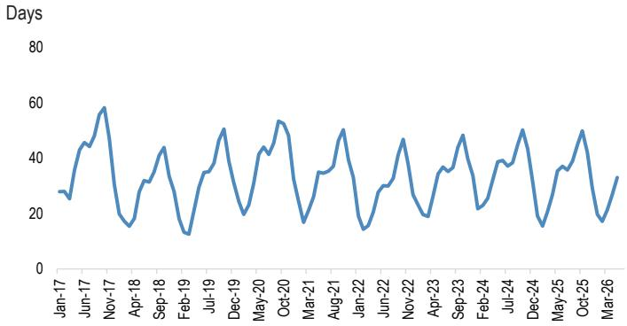

line chart

| Month   | Days |
|---------|------|
| Jan-17  | 25   |
| Jun-17  | 45   |
| Nov-17  | 60   |
| Apr-18  | 15   |
| Sep-18  | 30   |
| Feb-19  | 10   |
| Jul-19  | 35   |
| Dec-19  | 50   |
| May-20  | 20   |
| Oct-20  | 55   |
| Mar-21  | 15   |
| Aug-21  | 35   |
| Jan-22  | 50   |
| Jun-22  | 15   |
| Nov-22  | 30   |
| Apr-23  | 45   |
| Sep-23  | 20   |
| Feb-24  | 35   |
| Jul-24  | 50   |
| Dec-24  | 15   |
| May-25  | 35   |
| Oct-25  | 50   |
| Mar-26  | 30   |

Source: EIA, JPM Commodities Research

Figure 68: Copper inventories  
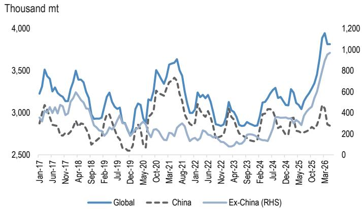

line chart

| Month   | Global | China | Ex-China (RHS) |
|---------|--------|-------|----------------|
| Jan-17  | 3,200  | 3,000 | 3,000          |
| Jun-17  | 3,500  | 2,800 | 3,200          |
| Nov-17  | 3,100  | 2,900 | 3,100          |
| Apr-18  | 3,400  | 2,700 | 3,300          |
| Sep-18  | 3,000  | 2,600 | 2,900          |
| Feb-19  | 3,200  | 2,800 | 2,800          |
| Jul-19  | 3,100  | 2,500 | 2,700          |
| Dec-19  | 3,000  | 2,600 | 2,800          |
| May-20  | 3,100  | 2,700 | 2,900          |
| Oct-20  | 3,500  | 3,200 | 2,800          |
| Mar-21  | 3,600  | 3,400 | 2,700          |
| Aug-21  | 3,400  | 3,300 | 2,600          |
| Jan-22  | 3,200  | 3,100 | 2,500          |
| Jun-22  | 3,100  | 2,900 | 2,400          |
| Nov-22  | 3,200  | 2,800 | 2,300          |
| Apr-23  | 3,100  | 2,700 | 2,200          |
| Sep-23  | 3,000  | 2,600 | 2,100          |
| Feb-24  | 3,100  | 2,700 | 2,200          |
| Jul-24  | 3,300  | 2,800 | 2,300          |
| Dec-24  | 3,400  | 2,900 | 2,400          |
| May-25  | 3,500  | 3,000 | 2,500          |
| Oct-25  | 3,700  | 3,100 | 2,600          |
| Mar-26  | 4,000  | 3,200 | 2,700          |

Source: Company and governmental reports, CRU, Wood Mackenzie, BGRIMM, JPM Commodities Research

Figure 70: Aluminium inventories  
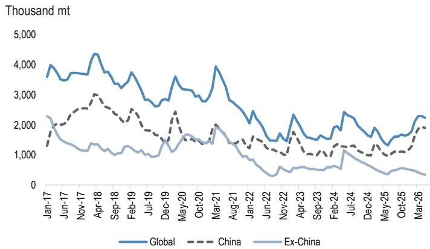

line chart

| Month   | Global | China | Ex-China |
|---------|--------|-------|----------|
| Jan-17  | 3800   | 2000  | 2200     |
| Jun-17  | 3600   | 2200  | 1800     |
| Nov-17  | 3800   | 2400  | 1600     |
| Apr-18  | 4400   | 3000  | 1400     |
| Sep-18  | 3800   | 2600  | 1200     |
| Feb-19  | 3600   | 2400  | 1100     |
| Jul-19  | 3200   | 2200  | 1000     |
| Dec-19  | 3600   | 2400  | 1200     |
| May-20  | 3400   | 2200  | 1400     |
| Oct-20  | 3200   | 2000  | 1600     |
| Mar-21  | 4000   | 2200  | 1800     |
| Aug-21  | 3600   | 2400  | 1600     |
| Jan-22  | 3200   | 2200  | 1400     |
| Jun-22  | 2800   | 2000  | 1200     |
| Nov-22  | 2400   | 1800  | 1000     |
| Apr-23  | 2600   | 1600  | 800      |
| Sep-23  | 2400   | 1400  | 600      |
| Feb-24  | 2600   | 1600  | 800      |
| Jul-24  | 2400   | 1800  | 1200     |
| Dec-24  | 2200   | 1600  | 1400     |
| May-25  | 2400   | 1800  | 1600     |
| Oct-25  | 2600   | 2000  | 1800     |
| Mar-26  | 2800   | 2200  | 2000     |

Source: Company reports, IAI, Government and Industry data, USGS, CRU, Wood Mackenzie, JPM Commodities Research

Figure 72: Zinc inventories  
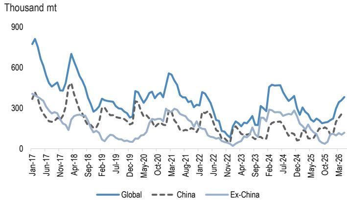

line chart

| Month   | Global | China | Ex-China |
|---------|--------|-------|----------|
| Jan-17  | 850    | 400   | 400      |
| Jun-17  | 600    | 300   | 300      |
| Nov-17  | 500    | 250   | 250      |
| Apr-18  | 700    | 550   | 300      |
| Sep-18  | 400    | 300   | 200      |
| Feb-19  | 300    | 250   | 150      |
| Jul-19  | 350    | 250   | 150      |
| Dec-19  | 250    | 200   | 100      |
| May-20  | 400    | 300   | 200      |
| Oct-20  | 550    | 250   | 300      |
| Mar-21  | 650    | 350   | 350      |
| Aug-21  | 450    | 250   | 250      |
| Jan-22  | 350    | 300   | 250      |
| Jun-22  | 250    | 200   | 150      |
| Nov-22  | 150    | 150   | 100      |
| Apr-23  | 250    | 200   | 150      |
| Sep-23  | 350    | 250   | 250      |
| Feb-24  | 550    | 350   | 350      |
| Jul-24  | 450    | 300   | 350      |
| Dec-24  | 350    | 250   | 300      |
| May-25  | 250    | 200   | 250      |
| Oct-25  | 350    | 350   | 150      |
| Mar-26  | 450    | 400   | 250      |

Source: Company reports, CRU, Wood Mackenzie, LME, JPM Commodities Research

Figure 69: Copper inventories on a days of use basis  
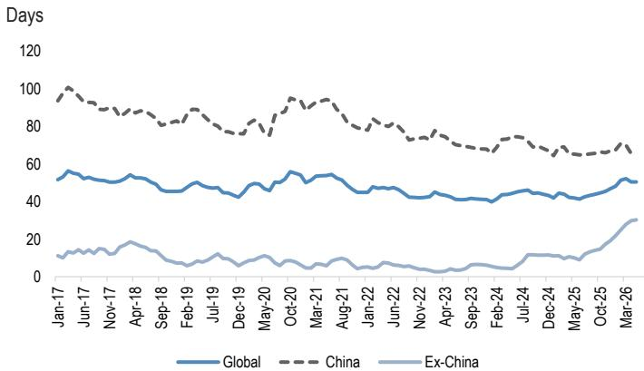

line chart

| Month   | Global | China | Ex-China |
|---------|--------|-------|----------|
| Jan-17  | 55     | 100   | 10       |
| Jun-17  | 53     | 98    | 12       |
| Nov-17  | 52     | 95    | 15       |
| Apr-18  | 54     | 92    | 18       |
| Sep-18  | 50     | 88    | 10       |
| Feb-19  | 48     | 85    | 8        |
| Jul-19  | 45     | 82    | 10       |
| Dec-19  | 43     | 78    | 8        |
| May-20  | 48     | 75    | 10       |
| Oct-20  | 55     | 95    | 8        |
| Mar-21  | 53     | 92    | 10       |
| Aug-21  | 50     | 88    | 8        |
| Jan-22  | 48     | 85    | 6        |
| Jun-22  | 45     | 82    | 5        |
| Nov-22  | 43     | 78    | 4        |
| Apr-23  | 42     | 75    | 3        |
| Sep-23  | 40     | 72    | 4        |
| Feb-24  | 42     | 70    | 5        |
| Jul-24  | 45     | 68    | 10       |
| Dec-24  | 43     | 65    | 12       |
| May-25  | 45     | 63    | 10       |
| Oct-25  | 48     | 60    | 15       |
| Mar-26  | 50     | 65    | 30       |

Source: Company and governmental reports, CRU, Wood Mackenzie, BGRIMM, JPM Commodities Research

Figure 71: Aluminium inventories on a days of use basis  
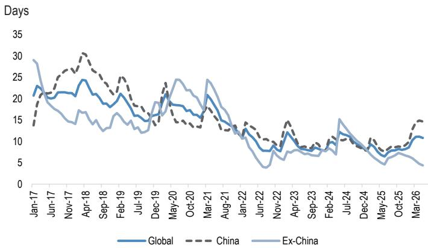

line chart

| Month   | Global | China | Ex-China |
|---------|--------|-------|----------|
| Jan-17  | 22     | 14    | 29       |
| Jun-17  | 21     | 20    | 20       |
| Nov-17  | 21     | 25    | 16       |
| Apr-18  | 24     | 30    | 15       |
| Sep-18  | 20     | 25    | 13       |
| Feb-19  | 18     | 20    | 12       |
| Jul-19  | 15     | 15    | 10       |
| Dec-19  | 15     | 15    | 10       |
| May-20  | 20     | 24    | 25       |
| Oct-20  | 18     | 15    | 20       |
| Mar-21  | 20     | 15    | 25       |
| Aug-21  | 15     | 15    | 15       |
| Jan-22  | 10     | 10    | 10       |
| Jun-22  | 8      | 8     | 4        |
| Nov-22  | 10     | 15    | 8        |
| Apr-23  | 8      | 8     | 8        |
| Sep-23  | 8      | 8     | 8        |
| Feb-24  | 10     | 10    | 15       |
| Jul-24  | 8      | 8     | 10       |
| Dec-24  | 8      | 8     | 5        |
| May-25  | 6      | 6     | 5        |
| Oct-25  | 8      | 8     | 5        |
| Mar-26  | 10     | 15    | 4        |

Source: Company reports, IAI, Government and Industry data, USGS, CRU, Wood Mackenzie, JPM Commodities Research

Figure 73: Zinc inventories on a days of use basis  
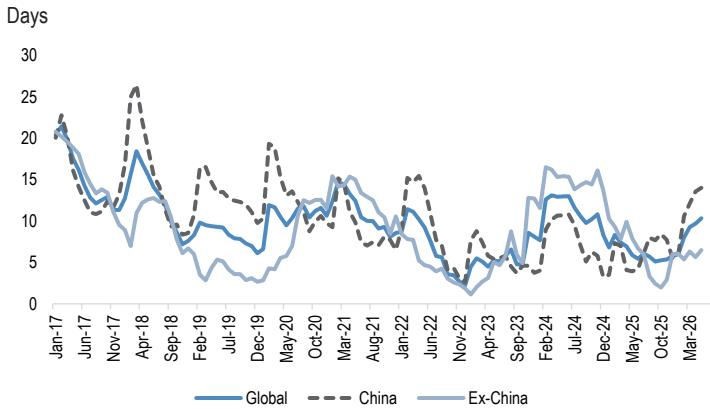

line chart

| Month   | Global | China | Ex-China |
|---------|--------|-------|----------|
| Jan-17  | 21     | 22    | 20       |
| Jun-17  | 18     | 15    | 14       |
| Nov-17  | 12     | 10    | 8        |
| Apr-18  | 18     | 26    | 12       |
| Sep-18  | 10     | 8     | 6        |
| Feb-19  | 9      | 16    | 4        |
| Jul-19  | 8      | 12    | 3        |
| Dec-19  | 6      | 19    | 2        |
| May-20  | 10     | 14    | 3        |
| Oct-20  | 12     | 10    | 5        |
| Mar-21  | 15     | 14    | 12       |
| Aug-21  | 10     | 8     | 6        |
| Jan-22  | 12     | 15    | 4        |
| Jun-22  | 8      | 6     | 3        |
| Nov-22  | 4      | 3     | 2        |
| Apr-23  | 6      | 5     | 4        |
| Sep-23  | 8      | 4     | 6        |
| Feb-24  | 10     | 10    | 16       |
| Jul-24  | 12     | 8     | 14       |
| Dec-24  | 8      | 6     | 8        |
| May-25  | 6      | 4     | 4        |
| Oct-25  | 5      | 3     | 2        |
| Mar-26  | 10     | 14    | 6        |

Source: Company reports, CRU, Wood Mackenzie, LME, JPM Commodities Research

Figure 74: Nickel inventories  
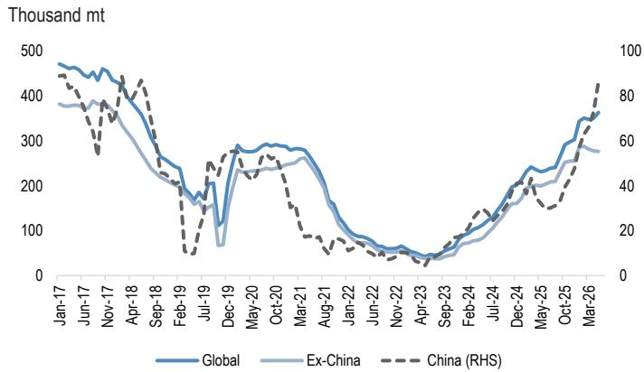

line chart

| Month    | Global | Ex-China | China (RHS) |
|----------|--------|----------|-------------|
| Jan-17   | 480    | 380      | 450         |
| Jun-17   | 460    | 390      | 400         |
| Nov-17   | 440    | 370      | 380         |
| Apr-18   | 420    | 350      | 360         |
| Sep-18   | 380    | 320      | 340         |
| Feb-19   | 250    | 200      | 220         |
| Jul-19   | 150    | 100      | 120         |
| Dec-19   | 280    | 250      | 260         |
| May-20   | 290    | 260      | 270         |
| Oct-20   | 280    | 250      | 260         |
| Mar-21   | 270    | 240      | 250         |
| Aug-21   | 150    | 120      | 130         |
| Jan-22   | 80     | 60       | 70          |
| Jun-22   | 50     | 40       | 50          |
| Nov-22   | 40     | 30       | 40          |
| Apr-23   | 30     | 20       | 30          |
| Sep-23   | 40     | 30       | 40          |
| Feb-24   | 60     | 50       | 60          |
| Jul-24   | 80     | 70       | 80          |
| Dec-24   | 150    | 120      | 130         |
| May-25   | 250    | 220      | 230         |
| Oct-25   | 350    | 320      | 330         |
| Mar-26   | 450    | 420      | 430         |

Source: Company reports, INSG, ISSF, Wood Mackenzie, CRU, LME, JPM Commodities Research

Figure 76: Lead inventories  
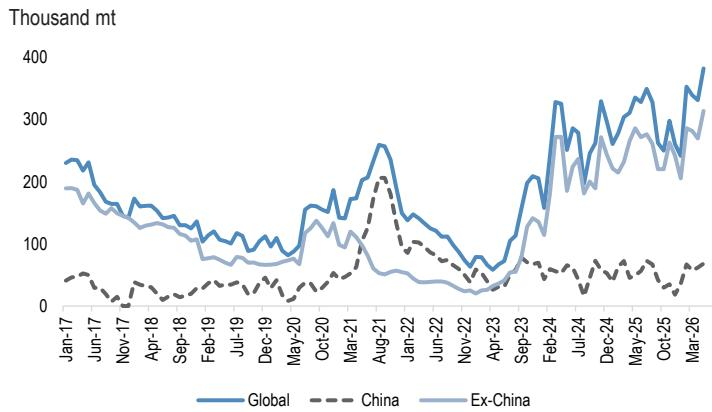

line chart

| Month   | Global | China | Ex-China |
|---------|--------|-------|----------|
| Jan-17  | 230    | 50    | 190      |
| Jun-17  | 200    | 40    | 170      |
| Nov-17  | 180    | 30    | 150      |
| Apr-18  | 160    | 20    | 130      |
| Sep-18  | 140    | 15    | 110      |
| Feb-19  | 120    | 10    | 90       |
| Jul-19  | 100    | 5     | 70       |
| Dec-19  | 80     | 3     | 50       |
| May-20  | 100    | 5     | 70       |
| Oct-20  | 150    | 10    | 120      |
| Mar-21  | 250    | 200   | 150      |
| Aug-21  | 260    | 150   | 100      |
| Jan-22  | 150    | 100   | 80       |
| Jun-22  | 120    | 80    | 60       |
| Nov-22  | 80     | 50    | 40       |
| Apr-23  | 60     | 30    | 30       |
| Sep-23  | 150    | 50    | 80       |
| Feb-24  | 320    | 60    | 250      |
| Jul-24  | 350    | 70    | 300      |
| Dec-24  | 330    | 60    | 280      |
| May-25  | 340    | 70    | 320      |
| Oct-25  | 360    | 80    | 350      |
| Mar-26  | 390    | 90    | 380      |

Source: Wood Mackenzie, JPM Commodities Research

Figure 78: Corn inventories  
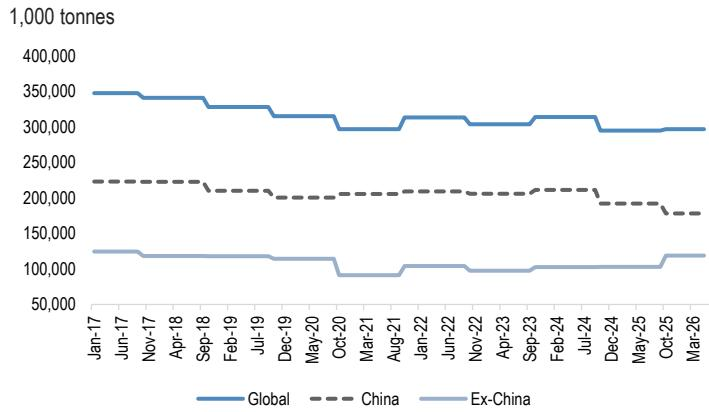

line chart

| Month    | Global   | China     | Ex-China |
| -------- | -------- | --------- | -------- |
| Jan-17   | 350,000  | 220,000   | 120,000  |
| Jun-17   | 345,000  | 220,000   | 120,000  |
| Nov-17   | 340,000  | 220,000   | 120,000  |
| Apr-18   | 335,000  | 215,000   | 120,000  |
| Sep-18   | 330,000  | 215,000   | 120,000  |
| Feb-19   | 325,000  | 215,000   | 120,000  |
| Jul-19   | 320,000  | 215,000   | 120,000  |
| Dec-19   | 315,000  | 215,000   | 120,000  |
| May-20   | 310,000  | 215,000   | 120,000  |
| Oct-20   | 305,000  | 215,000   | 95,000   |
| Mar-21   | 315,000  | 215,000   | 95,000   |
| Aug-21   | 315,000  | 215,000   | 115,000  |
| Jan-22   | 315,000  | 215,000   | 115,000  |
| Jun-22   | 315,000  | 215,000   | 115,000  |
| Nov-22   | 315,000  | 215,000   | 115,000  |
| Apr-23   | 315,000  | 215,000   | 115,000  |
| Sep-23   | 315,000  | 215,000   | 115,000  |
| Feb-24   | 315,000  | 215,000   | 115,000  |
| Jul-24   | 315,000  | 215,000   | 115,000  |
| Dec-24   | 315,000  | 215,000   | 115,000  |
| May-25   | 315,000  | 215,000   | 115,000  |
| Oct-25   | 315,000  | 215,000   | 125,000  |
| Mar-26   | 315,000  | 185,000   | 125,000  |

Source: USDA, JPM Commodities Research

Figure 75: Nickel inventories on a days of use basis  
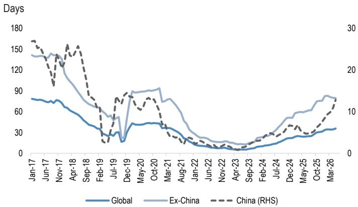

line chart

| Month   | Global | Ex-China | China (RHS) |
|---------|--------|----------|-------------|
| Jan-17  | 80     | 140      | 160         |
| Jun-17  | 75     | 135      | 140         |
| Nov-17  | 70     | 130      | 150         |
| Apr-18  | 65     | 120      | 155         |
| Sep-18  | 60     | 110      | 140         |
| Feb-19  | 55     | 100      | 120         |
| Jul-19  | 50     | 90       | 100         |
| Dec-19  | 45     | 85       | 90          |
| May-20  | 40     | 90       | 85          |
| Oct-20  | 35     | 95       | 80          |
| Mar-21  | 30     | 90       | 75          |
| Aug-21  | 25     | 80       | 70          |
| Jan-22  | 20     | 70       | 65          |
| Jun-22  | 15     | 60       | 60          |
| Nov-22  | 10     | 50       | 55          |
| Apr-23  | 5      | 40       | 45          |
| Sep-23  | 10     | 30       | 35          |
| Feb-24  | 15     | 25       | 30          |
| Jul-24  | 20     | 20       | 25          |
| Dec-24  | 25     | 15       | 20          |
| May-25  | 30     | 10       | 15          |
| Oct-25  | 35     | 5        | 10          |
| Mar-26  | 40     | 10       | 15          |

Source: Company reports, INSG, ISSF, Wood Mackenzie, CRU, LME, JPM Commodities Research

Figure 77: Lead inventories on a days of use basis  
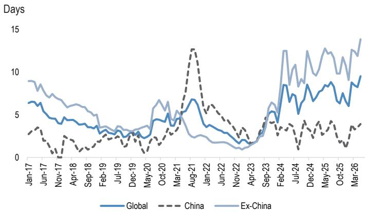

line chart

| Date    | Global | China | Ex-China |
|---------|--------|-------|----------|
| Jan-17  | 6.0    | 3.0   | 9.0      |
| Jun-17  | 5.0    | 0.0   | 8.0      |
| Nov-17  | 4.0    | 2.0   | 7.0      |
| Apr-18  | 3.5    | 1.5   | 6.5      |
| Sep-18  | 3.0    | 2.0   | 6.0      |
| Feb-19  | 2.5    | 2.5   | 5.5      |
| Jul-19  | 2.0    | 3.0   | 5.0      |
| Dec-19  | 2.5    | 3.5   | 4.5      |
| May-20  | 3.0    | 4.0   | 5.0      |
| Oct-20  | 4.0    | 5.0   | 6.0      |
| Mar-21  | 5.0    | 6.0   | 7.0      |
| Aug-21  | 6.0    | 13.0  | 8.0      |
| Jan-22  | 5.0    | 6.0   | 7.0      |
| Jun-22  | 4.0    | 5.0   | 6.0      |
| Nov-22  | 3.0    | 4.0   | 5.0      |
| Apr-23  | 2.0    | 3.0   | 4.0      |
| Sep-23  | 3.0    | 4.0   | 5.0      |
| Feb-24  | 5.0    | 6.0   | 8.0      |
| Jul-24  | 6.0    | 7.0   | 9.0      |
| Dec-24  | 7.0    | 8.0   | 10.0     |
| May-25  | 8.0    | 9.0   | 11.0     |
| Oct-25  | 9.0    | 10.0  | 12.0     |
| Mar-26  | 10.0   | 11.0  | 13.0     |

Source: Wood Mackenzie, JPM Commodities Research

Figure 79: Corn inventories on a days of use basis  
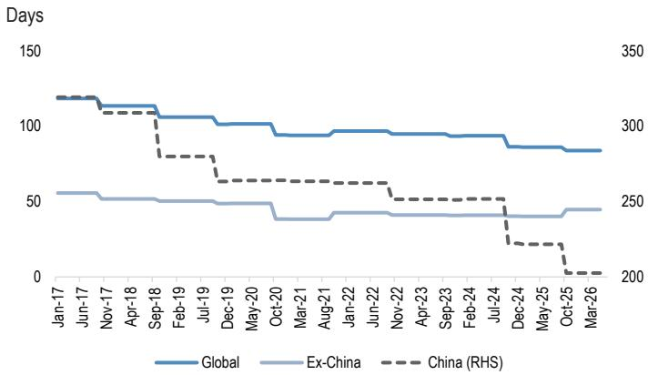

line chart

| Month    | Global | Ex-China | China (RHS) |
| -------- | ------ | -------- | ----------- |
| Jan-17   | 120    | 55       | 320         |
| Jun-17   | 120    | 55       | 320         |
| Nov-17   | 120    | 55       | 320         |
| Apr-18   | 110    | 55       | 300         |
| Sep-18   | 110    | 55       | 250         |
| Feb-19   | 105    | 55       | 200         |
| Jul-19   | 105    | 55       | 200         |
| Dec-19   | 100    | 55       | 200         |
| May-20   | 100    | 55       | 200         |
| Oct-20   | 95     | 40       | 200         |
| Mar-21   | 95     | 40       | 200         |
| Aug-21   | 95     | 40       | 200         |
| Jan-22   | 95     | 40       | 200         |
| Jun-22   | 95     | 40       | 200         |
| Nov-22   | 95     | 40       | 200         |
| Apr-23   | 95     | 40       | 200         |
| Sep-23   | 95     | 40       | 200         |
| Feb-24   | 95     | 40       | 200         |
| Jul-24   | 95     | 40       | 200         |
| Dec-24   | 85     | 40       | 150         |
| May-25   | 85     | 45       | 100         |
| Oct-25   | 85     | 45       | 50          |
| Mar-26   | 85     | 45       | 50          |

Source: USDA, JPM Commodities Research

Figure 80: Wheat inventories  
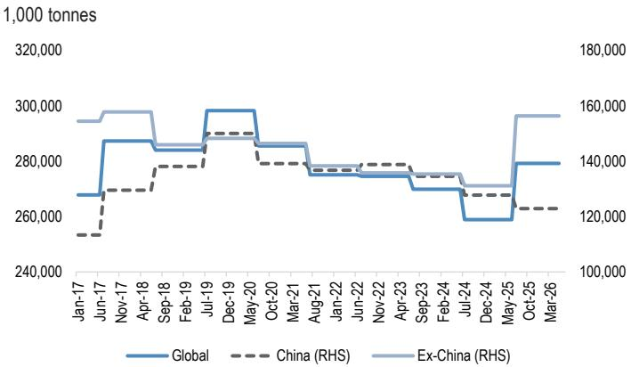

line chart

| Month    | Global | China (RHS) | Ex-China (RHS) |
|----------|--------|-------------|----------------|
| Jan-17   | 270,000| 250,000     | 295,000        |
| Jun-17   | 285,000| 270,000     | 300,000        |
| Nov-17   | 285,000| 275,000     | 300,000        |
| Apr-18   | 285,000| 280,000     | 300,000        |
| Sep-18   | 285,000| 285,000     | 300,000        |
| Feb-19   | 285,000| 290,000     | 300,000        |
| Jul-19   | 295,000| 295,000     | 305,000        |
| Dec-19   | 305,000| 305,000     | 315,000        |
| May-20   | 285,000| 285,000     | 315,000        |
| Oct-20   | 285,000| 285,000     | 315,000        |
| Mar-21   | 285,000| 285,000     | 315,000        |
| Aug-21   | 275,000| 275,000     | 315,000        |
| Jan-22   | 275,000| 275,000     | 315,000        |
| Jun-22   | 275,000| 275,000     | 315,000        |
| Nov-22   | 275,000| 275,000     | 315,000        |
| Apr-23   | 275,000| 275,000     | 315,000        |
| Sep-23   | 275,000| 275,000     | 315,000        |
| Feb-24   | 275,000| 275,000     | 315,000        |
| Jul-24   | 265,000| 265,000     | 315,000        |
| Dec-24   | 265,000| 265,000     | 315,000        |
| May-25   | 285,000| 265,000     | 395,000        |
| Oct-25   | 285,000| 265,000     | 395,000        |
| Mar-26   | 285,000| 265,000     | 395,000        |

Source: USDA, JPM Commodities Research

Figure 82: Cotton inventories  
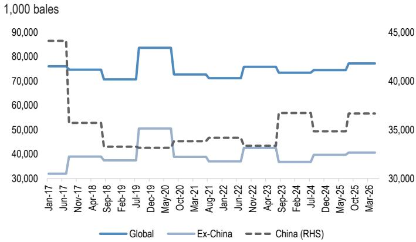

line chart

| Month    | Global | Ex-China | China (RHS) |
|----------|--------|----------|-------------|
| Jan-17   | 75,000 | 32,000   | 45,000      |
| Jun-17   | 75,000 | 39,000   | 35,000      |
| Nov-17   | 75,000 | 39,000   | 35,000      |
| Apr-18   | 75,000 | 38,000   | 35,000      |
| Sep-18   | 75,000 | 38,000   | 35,000      |
| Feb-19   | 75,000 | 38,000   | 35,000      |
| Jul-19   | 85,000 | 51,000   | 35,000      |
| Dec-19   | 85,000 | 51,000   | 35,000      |
| May-20   | 85,000 | 51,000   | 35,000      |
| Oct-20   | 75,000 | 39,000   | 35,000      |
| Mar-21   | 75,000 | 39,000   | 35,000      |
| Aug-21   | 75,000 | 39,000   | 35,000      |
| Jan-22   | 75,000 | 39,000   | 35,000      |
| Jun-22   | 75,000 | 39,000   | 35,000      |
| Nov-22   | 75,000 | 39,000   | 35,000      |
| Apr-23   | 75,000 | 39,000   | 35,000      |
| Sep-23   | 75,000 | 39,000   | 35,000      |
| Feb-24   | 75,000 | 39,000   | 35,000      |
| Jul-24   | 75,000 | 39,000   | 35,000      |
| Dec-24   | 75,000 | 39,000   | 35,000      |
| May-25   | 75,000 | 39,000   | 35,000      |
| Oct-25   | 75,000 | 39,000   | 35,000      |
| Mar-26   | 75,000 | 39,000   | 35,000      |

Source: USDA, JPM Commodities Research

Figure 84: Cocoa global inventories  
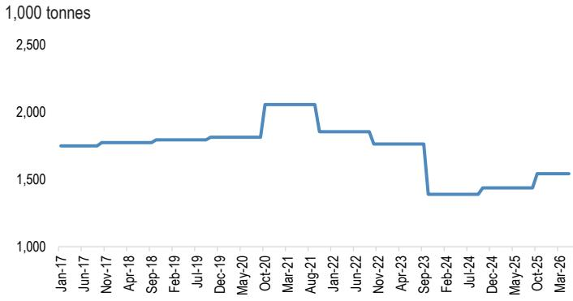

line chart

| Month    | Value     |
| -------- | --------- |
| Jan-17   | 1750      |
| Jun-17   | 1760      |
| Nov-17   | 1770      |
| Apr-18   | 1780      |
| Sep-18   | 1790      |
| Feb-19   | 1800      |
| Jul-19   | 1810      |
| Dec-19   | 1820      |
| May-20   | 1830      |
| Oct-20   | 2050      |
| Mar-21   | 2060      |
| Aug-21   | 1850      |
| Jan-22   | 1860      |
| Jun-22   | 1870      |
| Nov-22   | 1780      |
| Apr-23   | 1770      |
| Sep-23   | 1400      |
| Feb-24   | 1410      |
| Jul-24   | 1420      |
| Dec-24   | 1430      |
| May-25   | 1440      |
| Oct-25   | 1550      |
| Mar-26   | 1560      |

Source: ICCO, JPM Commodities Research

Figure 81: Wheat inventories on a days of use basis  
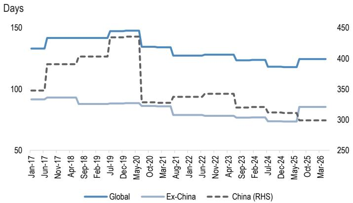

line chart

| Month    | Global | Ex-China | China (RHS) |
| -------- | ------ | -------- | ----------- |
| Jan-17   | 130    | 90       | 100         |
| Jun-17   | 140    | 95       | 120         |
| Nov-17   | 140    | 95       | 125         |
| Apr-18   | 140    | 95       | 130         |
| Sep-18   | 140    | 95       | 135         |
| Feb-19   | 140    | 95       | 140         |
| Jul-19   | 145    | 95       | 145         |
| Dec-19   | 145    | 95       | 145         |
| May-20   | 145    | 95       | 85          |
| Oct-20   | 135    | 90       | 85          |
| Mar-21   | 130    | 85       | 90          |
| Aug-21   | 125    | 80       | 95          |
| Jan-22   | 125    | 80       | 95          |
| Jun-22   | 125    | 80       | 95          |
| Nov-22   | 125    | 80       | 95          |
| Apr-23   | 125    | 80       | 90          |
| Sep-23   | 120    | 80       | 85          |
| Feb-24   | 120    | 80       | 80          |
| Jul-24   | 115    | 75       | 75          |
| Dec-24   | 115    | 75       | 75          |
| May-25   | 120    | 80       | 75          |
| Oct-25   | 120    | 80       | 75          |
| Mar-26   | 120    | 80       | 75          |

Source: USDA, JPM Commodities Research

Figure 83: Cotton inventories on a days of use basis  
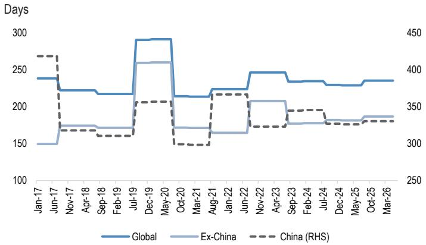

line chart

| Month    | Global | Ex-China | China (RHS) |
|----------|--------|----------|-------------|
| Jan-17   | 240    | 150      | 400         |
| Jun-17   | 220    | 170      | 380         |
| Nov-17   | 220    | 170      | 380         |
| Apr-18   | 220    | 170      | 380         |
| Sep-18   | 220    | 170      | 380         |
| Feb-19   | 220    | 170      | 380         |
| Jul-19   | 290    | 260      | 380         |
| Dec-19   | 290    | 260      | 380         |
| May-20   | 290    | 260      | 380         |
| Oct-20   | 210    | 170      | 380         |
| Mar-21   | 210    | 170      | 380         |
| Aug-21   | 220    | 170      | 380         |
| Jan-22   | 220    | 170      | 380         |
| Jun-22   | 250    | 210      | 380         |
| Nov-22   | 250    | 210      | 380         |
| Apr-23   | 240    | 170      | 380         |
| Sep-23   | 240    | 170      | 380         |
| Feb-24   | 240    | 170      | 380         |
| Jul-24   | 240    | 170      | 380         |
| Dec-24   | 240    | 170      | 380         |
| May-25   | 240    | 170      | 380         |
| Oct-25   | 240    | 170      | 380         |
| Mar-26   | 240    | 170      | 380         |

Source: USDA, JPM Commodities Research

Figure 85: Cocoa global inventories on a days of use basis  
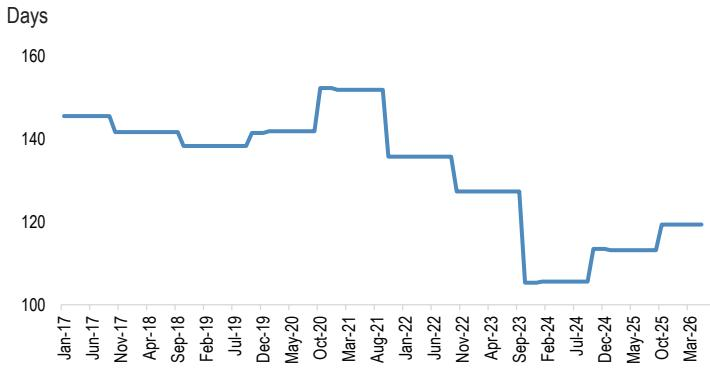

line chart

| Month    | Days |
| -------- | ---- |
| Jan-17   | 145  |
| Jun-17   | 145  |
| Nov-17   | 142  |
| Apr-18   | 142  |
| Sep-18   | 139  |
| Feb-19   | 139  |
| Jul-19   | 140  |
| Dec-19   | 142  |
| May-20   | 142  |
| Oct-20   | 152  |
| Mar-21   | 152  |
| Aug-21   | 152  |
| Jan-22   | 136  |
| Jun-22   | 136  |
| Nov-22   | 128  |
| Apr-23   | 128  |
| Sep-23   | 105  |
| Feb-24   | 105  |
| Jul-24   | 105  |
| Dec-24   | 113  |
| May-25   | 113  |
| Oct-25   | 120  |
| Mar-26   | 120  |

Source: ICCO, JPM Commodities Research

Figure 86: Coffee inventories  
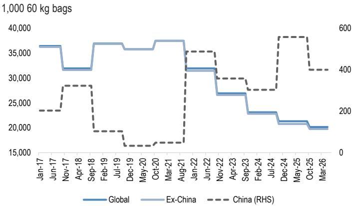

line chart

| Month    | Global | Ex-China | China (RHS) |
|----------|--------|----------|-------------|
| Jan-17   | 36,000 | 36,000   | 24,000      |
| Jun-17   | 32,000 | 32,000   | 28,000      |
| Nov-17   | 32,000 | 32,000   | 28,000      |
| Apr-18   | 32,000 | 32,000   | 28,000      |
| Sep-18   | 32,000 | 32,000   | 19,000      |
| Feb-19   | 32,000 | 32,000   | 19,000      |
| Jul-19   | 32,000 | 32,000   | 19,000      |
| Dec-19   | 32,000 | 32,000   | 16,000      |
| May-20   | 32,000 | 32,000   | 16,000      |
| Oct-20   | 32,000 | 32,000   | 16,000      |
| Mar-21   | 32,000 | 32,000   | 16,000      |
| Aug-21   | 32,000 | 32,000   | 35,000      |
| Jan-22   | 32,000 | 32,000   | 35,000      |
| Jun-22   | 32,000 | 32,000   | 35,000      |
| Nov-22   | 32,000 | 32,000   | 35,000      |
| Apr-23   | 32,000 | 32,000   | 35,000      |
| Sep-23   | 32,000 | 32,000   | 35,000      |
| Feb-24   | 32,000 | 32,000   | 35,000      |
| Jul-24   | 32,000 | 32,000   | 35,000      |
| Dec-24   | 32,000 | 32,000   | 65,000      |
| May-25   | 32,000 | 32,000   | 65,000      |
| Oct-25   | 32,000 | 32,000   | 65,000      |
| Mar-26   | 32,000 | 32,000   | 65,000      |

Source: ICCO, JPM Commodities Research

Figure 88: Sugar global inventories  
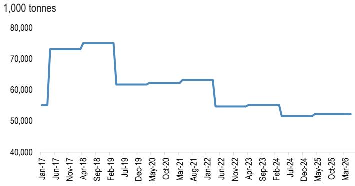

line chart

| Month    | Value     |
| -------- | --------- |
| Jan-17   | 55,000    |
| Jun-17   | 73,000    |
| Nov-17   | 73,000    |
| Apr-18   | 75,000    |
| Sep-18   | 75,000    |
| Feb-19   | 62,000    |
| Jul-19   | 62,000    |
| Dec-19   | 62,000    |
| May-20   | 62,000    |
| Oct-20   | 62,000    |
| Mar-21   | 63,000    |
| Aug-21   | 63,000    |
| Jan-22   | 55,000    |
| Jun-22   | 55,000    |
| Nov-22   | 55,000    |
| Apr-23   | 55,000    |
| Sep-23   | 55,000    |
| Feb-24   | 52,000    |
| Jul-24   | 52,000    |
| Dec-24   | 52,000    |
| May-25   | 52,000    |
| Oct-25   | 52,000    |
| Mar-26   | 52,000    |

Source: Green Pool Commodities Specialists Pty Ltd, JPM Commodities Research

Figure 90: Soybean inventories  
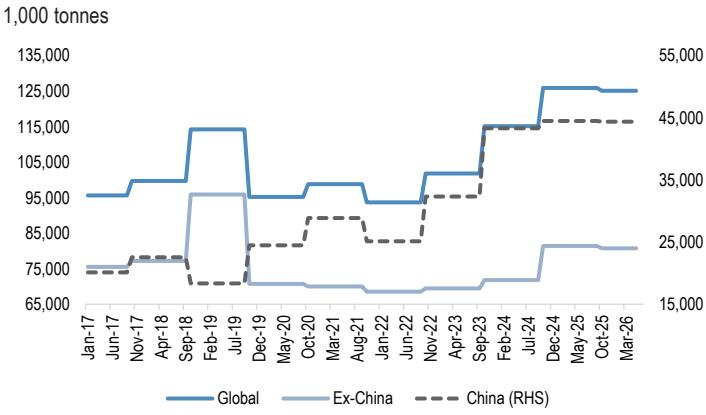

line chart

| Month    | Global | Ex-China | China (RHS) |
|----------|--------|----------|-------------|
| Jan-17   | 95,000 | 75,000   | 25,000      |
| Jun-17   | 95,000 | 75,000   | 25,000      |
| Nov-17   | 95,000 | 75,000   | 25,000      |
| Apr-18   | 95,000 | 75,000   | 25,000      |
| Sep-18   | 115,000| 95,000   | 25,000      |
| Feb-19   | 115,000| 95,000   | 25,000      |
| Jul-19   | 95,000 | 65,000   | 25,000      |
| Dec-19   | 95,000 | 65,000   | 25,000      |
| May-20   | 95,000 | 65,000   | 25,000      |
| Oct-20   | 95,000 | 65,000   | 25,000      |
| Mar-21   | 95,000 | 65,000   | 25,000      |
| Aug-21   | 95,000 | 65,000   | 25,000      |
| Jan-22   | 95,000 | 65,000   | 25,000      |
| Jun-22   | 95,000 | 65,000   | 25,000      |
| Nov-22   | 95,000 | 65,000   | 25,000      |
| Apr-23   | 95,000 | 65,000   | 25,000      |
| Sep-23   | 115,000| 75,000   | 45,000      |
| Feb-24   | 115,000| 75,000   | 45,000      |
| Jul-24   | 125,000| 85,000   | 45,000      |
| Dec-24   | 125,000| 85,000   | 45,000      |
| May-25   | 125,000| 85,000   | 45,000      |
| Oct-25   | 125,000| 85,000   | 45,000      |
| Mar-26   | 125,000| 85,000   | 45,000      |

Source: USDA, JPM Commodities Research

Figure 87: Coffee inventories on a days of use basis  
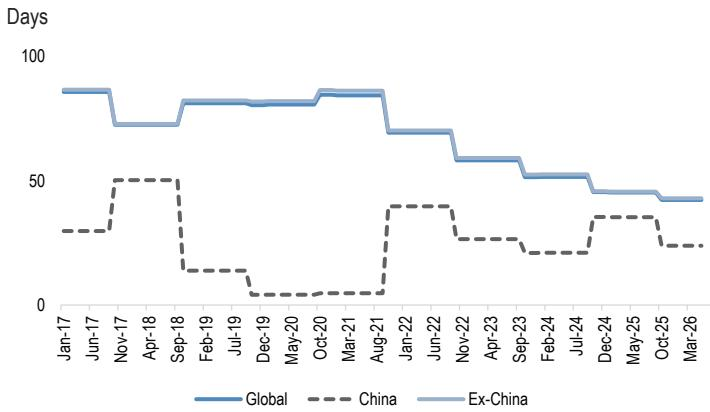

line chart

| Month    | Global | China | Ex-China |
| -------- | ------ | ----- | -------- |
| Jan-17   | 85     | 30    | 85       |
| Jun-17   | 85     | 30    | 85       |
| Nov-17   | 85     | 50    | 75       |
| Apr-18   | 85     | 50    | 75       |
| Sep-18   | 85     | 15    | 80       |
| Feb-19   | 85     | 15    | 80       |
| Jul-19   | 85     | 5     | 80       |
| Dec-19   | 85     | 5     | 80       |
| May-20   | 85     | 5     | 80       |
| Oct-20   | 85     | 5     | 85       |
| Mar-21   | 85     | 5     | 85       |
| Aug-21   | 85     | 40    | 70       |
| Jan-22   | 70     | 40    | 70       |
| Jun-22   | 65     | 30    | 65       |
| Nov-22   | 60     | 30    | 60       |
| Apr-23   | 55     | 30    | 55       |
| Sep-23   | 50     | 25    | 50       |
| Feb-24   | 45     | 25    | 45       |
| Jul-24   | 45     | 30    | 45       |
| Dec-24   | 45     | 30    | 45       |
| May-25   | 45     | 30    | 45       |
| Oct-25   | 45     | 30    | 45       |
| Mar-26   | 40     | 25    | 40       |

Source: ICCO, JPM Commodities Research

Figure 89: Sugar global inventories on a days of use basis  
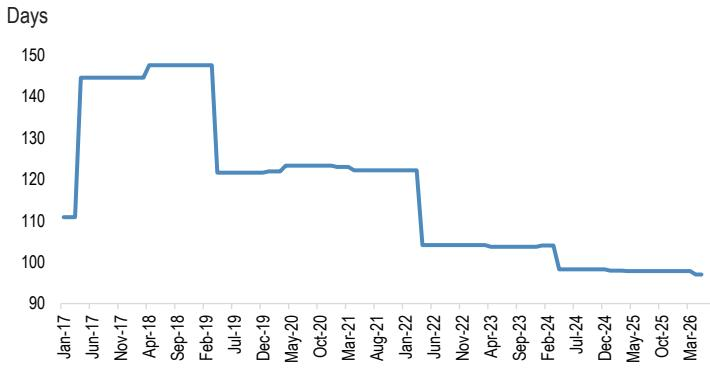

line chart

| Month    | Days |
| -------- | ---- |
| Jan-17   | 110  |
| Jun-17   | 145  |
| Nov-17   | 145  |
| Apr-18   | 148  |
| Sep-18   | 148  |
| Feb-19   | 148  |
| Jul-19   | 120  |
| Dec-19   | 120  |
| May-20   | 123  |
| Oct-20   | 123  |
| Mar-21   | 123  |
| Aug-21   | 123  |
| Jan-22   | 123  |
| Jun-22   | 105  |
| Nov-22   | 105  |
| Apr-23   | 105  |
| Sep-23   | 105  |
| Feb-24   | 105  |
| Jul-24   | 98   |
| Dec-24   | 98   |
| May-25   | 98   |
| Oct-25   | 98   |
| Mar-26   | 98   |

Source: Green Pool Commodities Specialists Pty Ltd, JPM Commodities Research

Figure 91: Soybean inventories on a days of use basis  
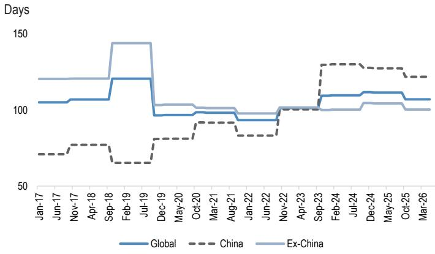

line chart

| Month    | Global | China | Ex-China |
| -------- | ------ | ----- | -------- |
| Jan-17   | 105    | 70    | 120      |
| Jun-17   | 105    | 70    | 120      |
| Nov-17   | 105    | 75    | 120      |
| Apr-18   | 105    | 75    | 120      |
| Sep-18   | 120    | 65    | 145      |
| Feb-19   | 120    | 65    | 145      |
| Jul-19   | 120    | 65    | 145      |
| Dec-19   | 95     | 80    | 105      |
| May-20   | 95     | 80    | 105      |
| Oct-20   | 95     | 90    | 105      |
| Mar-21   | 95     | 90    | 105      |
| Aug-21   | 95     | 85    | 100      |
| Jan-22   | 95     | 85    | 100      |
| Jun-22   | 95     | 85    | 100      |
| Nov-22   | 95     | 100   | 100      |
| Apr-23   | 95     | 100   | 100      |
| Sep-23   | 105    | 130   | 100      |
| Feb-24   | 110    | 130   | 100      |
| Jul-24   | 110    | 130   | 100      |
| Dec-24   | 110    | 130   | 100      |
| May-25   | 110    | 130   | 100      |
| Oct-25   | 110    | 130   | 100      |
| Mar-26   | 110    | 130   | 100      |

Source: USDA, JPM Commodities Research

Figure 92: Soybean Meal inventories  
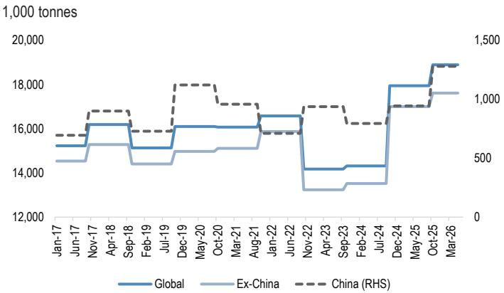

line chart

| Month   | Global | Ex-China | China (RHS) |
|---------|--------|----------|-------------|
| Jan-17  | 15,500 | 14,500   | 16,000      |
| Jun-17  | 16,000 | 15,000   | 17,000      |
| Nov-17  | 16,500 | 15,500   | 17,500      |
| Apr-18  | 16,500 | 15,500   | 17,500      |
| Sep-18  | 16,500 | 15,500   | 17,500      |
| Feb-19  | 16,500 | 15,500   | 17,500      |
| Jul-19  | 16,500 | 15,500   | 18,000      |
| Dec-19  | 16,500 | 15,500   | 18,500      |
| May-20  | 16,500 | 15,500   | 18,500      |
| Oct-20  | 16,500 | 15,500   | 18,500      |
| Mar-21  | 16,500 | 15,500   | 18,500      |
| Aug-21  | 16,500 | 15,500   | 18,500      |
| Jan-22  | 16,500 | 15,500   | 18,500      |
| Jun-22  | 16,500 | 13,500   | 18,500      |
| Nov-22  | 14,500 | 13,500   | 18,500      |
| Apr-23  | 14,500 | 13,500   | 18,500      |
| Sep-23  | 14,500 | 13,500   | 18,500      |
| Feb-24  | 14,500 | 13,500   | 18,500      |
| Jul-24  | 14,500 | 13,500   | 18,500      |
| Dec-24  | 18,000 | 18,500   | 18,500      |
| May-25  | 18,500 | 18,500   | 18,500      |
| Oct-25  | 19,500 | 18,500   | 18,500      |
| Mar-26  | 19,500 | 18,500   | 18,500      |

Source: USDA, JPM Commodities Research

Figure 94: Soybean Oil inventories  
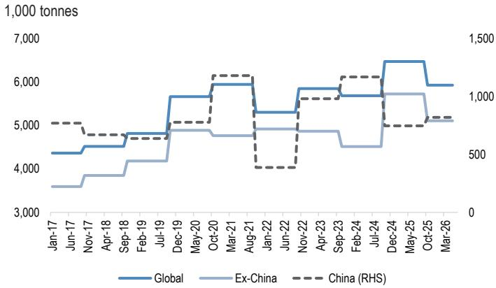

line chart

| Month    | Global | Ex-China | China (RHS) |
|----------|--------|----------|-------------|
| Jan-17   | 4,300  | 3,500    | 5,000       |
| Jun-17   | 4,400  | 3,700    | 5,100       |
| Nov-17   | 4,500  | 3,900    | 5,200       |
| Apr-18   | 4,600  | 4,100    | 5,300       |
| Sep-18   | 4,700  | 4,300    | 5,400       |
| Feb-19   | 4,800  | 4,500    | 5,500       |
| Jul-19   | 4,900  | 4,700    | 5,600       |
| Dec-19   | 5,800  | 4,900    | 5,700       |
| May-20   | 5,900  | 5,000    | 5,800       |
| Oct-20   | 6,000  | 5,100    | 5,900       |
| Mar-21   | 6,100  | 5,200    | 6,000       |
| Aug-21   | 5,300  | 4,900    | 4,800       |
| Jan-22   | 5,400  | 4,800    | 4,700       |
| Jun-22   | 5,500  | 4,700    | 4,600       |
| Nov-22   | 5,600  | 4,600    | 4,500       |
| Apr-23   | 5,700  | 4,500    | 4,400       |
| Sep-23   | 5,800  | 4,400    | 4,300       |
| Feb-24   | 5,900  | 4,300    | 4,200       |
| Jul-24   | 6,500  | 4,200    | 4,100       |
| Dec-24   | 6,600  | 4,100    | 4,000       |
| May-25   | 6,700  | 4,000    | 3,900       |
| Oct-25   | 6,600  | 3,900    | 3,800       |
| Mar-26   | 6,500  | 3,800    | 3,700       |

Source: USDA, JPM Commodities Research

Figure 93: Soybean Meal inventories on a days of use basis  
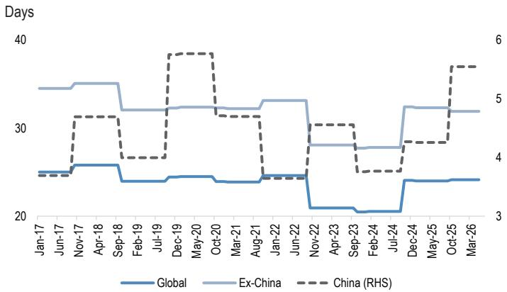

line chart

| Month    | Global | Ex-China | China (RHS) |
|----------|--------|----------|-------------|
| Jan-17   | 25     | 35       | 3           |
| Jun-17   | 25     | 35       | 3           |
| Nov-17   | 25     | 35       | 3           |
| Apr-18   | 25     | 35       | 3           |
| Sep-18   | 25     | 32       | 3           |
| Feb-19   | 25     | 32       | 3           |
| Jul-19   | 25     | 32       | 3           |
| Dec-19   | 25     | 32       | 3           |
| May-20   | 25     | 32       | 3           |
| Oct-20   | 25     | 32       | 3           |
| Mar-21   | 25     | 32       | 3           |
| Aug-21   | 25     | 32       | 3           |
| Jan-22   | 25     | 32       | 3           |
| Jun-22   | 25     | 32       | 3           |
| Nov-22   | 20     | 28       | 3           |
| Apr-23   | 20     | 28       | 3           |
| Sep-23   | 20     | 28       | 3           |
| Feb-24   | 20     | 28       | 3           |
| Jul-24   | 20     | 32       | 3           |
| Dec-24   | 25     | 32       | 3           |
| May-25   | 25     | 32       | 3           |
| Oct-25   | 25     | 32       | 3           |
| Mar-26   | 25     | 32       | 3           |

Source: USDA, JPM Commodities Research

Figure 95: Soybean Oil inventories on a days of use basis  
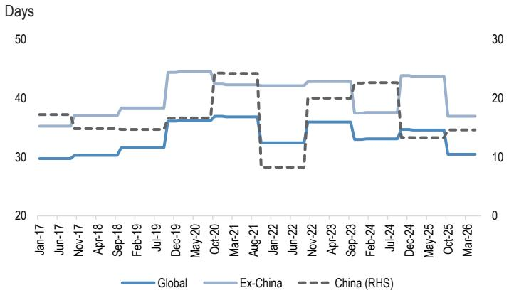

line chart

| Month    | Global | Ex-China | China (RHS) |
|----------|--------|----------|-------------|
| Jan-17   | 30     | 35       | 38          |
| Jun-17   | 30     | 37       | 37          |
| Nov-17   | 30     | 38       | 37          |
| Apr-18   | 30     | 38       | 37          |
| Sep-18   | 30     | 39       | 37          |
| Feb-19   | 30     | 40       | 37          |
| Jul-19   | 35     | 45       | 37          |
| Dec-19   | 35     | 45       | 37          |
| May-20   | 35     | 45       | 37          |
| Oct-20   | 35     | 45       | 45          |
| Mar-21   | 35     | 45       | 45          |
| Aug-21   | 30     | 45       | 30          |
| Jan-22   | 30     | 45       | 30          |
| Jun-22   | 30     | 45       | 30          |
| Nov-22   | 35     | 45       | 40          |
| Apr-23   | 35     | 45       | 40          |
| Sep-23   | 35     | 45       | 40          |
| Feb-24   | 35     | 45       | 40          |
| Jul-24   | 35     | 45       | 40          |
| Dec-24   | 35     | 45       | 40          |
| May-25   | 35     | 45       | 40          |
| Oct-25   | 30     | 45       | 35          |
| Mar-26   | 30     | 45       | 35          |

Source: USDA, JPM Commodities Research

## Disclosures

## History of Investment Recommendations:

A history of JPM investment recommendations disseminated during the preceding 12 months can be accessed on the Research & Commentary page of http://www.JPMmarkets.com where you can also search by analyst name, sector or financial instrument.

Analysts' Compensation: The research analysts responsible for the preparation of this report receive compensation based upon various factors, including the quality and accuracy of research, client feedback, competitive factors, and overall firm revenues.

Company-Specific Disclosures: Important disclosures, including price charts and credit opinion history tables (if applicable), are available for compendium reports and all JPM-covered companies, and certain non-covered companies, by visiting https://www.jpmm.com/research/disclosures, calling 1-800-477-0406, or e-mailing research.disclosure.inquiries@JPM.com with your request.

## Other Disclosures

JPM is a marketing name for investment banking businesses of JPM Chase & Co. and its subsidiaries and affiliates worldwide.

UK MIFID FICC research unbundling exemption: UK clients should refer to UK MIFID Research Unbundling exemption for details of JPM's implementation of the FICC research exemption and guidance on relevant FICC research categorisation.

JPM may, from time to time, write on issuers or securities targeted by economic or financial sanctions imposed or administered by the governmental authorities of the U.S., EU, UK or other relevant jurisdictions (Sanctioned Securities). Nothing in this report is intended to be read or construed as encouraging, facilitating, promoting or otherwise approving investment or dealing in such Sanctioned Securities. Clients should be aware of their own legal and compliance obligations when making investment decisions.

Any digital or crypto assets discussed in this research report are subject to a rapidly changing regulatory landscape. For relevant regulatory advisories on crypto assets, including bitcoin and ether, please see https://www.JPM.com/disclosures/cryptoasset-disclosure.

The author(s) of this research report may not be licensed to carry on regulated activities in your jurisdiction and, if not licensed, do not hold themselves out as being able to do so.

Exchange-Traded Funds (ETFs): JPM Securities LLC (“JPMS”) acts as authorized participant for substantially all U.S.-listed ETFs. To the extent that any ETFs are mentioned in this report, JPMS may earn commissions and transaction-based compensation in connection with the distribution of those ETF shares and may earn fees for performing other trade-related services, such as securities lending to short sellers of the ETF shares. JPMS may also perform services for the ETFs themselves, including acting as a broker or dealer to the ETFs. In addition, affiliates of JPMS may perform services for the ETFs, including trust, custodial, administration, lending, index calculation and/or maintenance and other services.

Options and Futures related research: If the information contained herein regards options- or futures-related research, such information is available only to persons who have received the proper options or futures risk disclosure documents. Please contact your JPM Representative or visit https://www.theocc.com/components/docs/riskstoc.pdf for a copy of the Option Clearing Corporation's Characteristics and Risks of Standardized Options or https://www.finra.org/sites/default/files/2020-08/Security\_Futures\_Risk\_Disclosure\_Statement\_2020.pdf for a copy of the Security Futures Risk Disclosure Statement.

Changes to Interbank Offered Rates (IBORs) and other benchmark rates: Certain interest rate benchmarks are, or may in the future become, subject to ongoing international, national and other regulatory guidance, reform and proposals for reform. For more information, please consult: https://www.JPM.com/global/disclosures/interbank\_offered\_rates

Private Bank Clients: Where you are receiving research as a client of the private banking businesses offered by JPM Chase & Co. and its subsidiaries (“JPM Private Bank”), research is provided to you by JPM Private Bank and not by any other division of JPM, including, but not limited to, the JPM Corporate and Investment Bank and its Global Research division.

Legal entity responsible for the production and distribution of research: The legal entity identified below the name of the Reg AC Research Analyst who authored this material is the legal entity responsible for the production of this research. Where multiple Reg AC Research Analysts authored this material with different legal entities identified below their names, these legal entities are jointly responsible for the production of this research. Where more than one legal entity is listed under an analyst's name, the first legal entity is responsible for the production unless stated otherwise. Research Analysts from various JPM affiliates may have contributed to the production of this material but may not be licensed to carry out regulated activities in your jurisdiction (and do not hold themselves out as being able to do so). Unless otherwise stated below in the legal entity disclosures, this material has been distributed by the legal entity responsible for production, or where more than one legal entity is listed under the analyst's name, the first legal entity will be responsible for distribution. If you have any queries, please contact the relevant Research Analyst in your jurisdiction or the entity in your jurisdiction that has distributed this research material.

Legal Entities Disclosures and Country-/Region-Specific Disclosures:

Argentina: JPM Chase Bank N.A Sucursal Buenos Aires is regulated by Banco Central de la República Argentina (“BCRA”- Central Bank of Argentina) and Comisión Nacional de Valores (“CNV”- Argentinian Securities Commission - ALYC y AN Integral N°51).

Australia: JPM Securities Australia Limited (“JPMSAL”) (ABN 61 003 245 234/AFS Licence No: 238066) is regulated by the Australian Securities and Investments Commission and is a Market Participant of ASX Limited, a Clearing and Settlement Participant of ASX Clear Pty Limited and a Clearing Participant of ASX Clear (Futures) Pty Limited. This material is issued and distributed in Australia by or on behalf of JPMSAL only to "wholesale clients" (as defined in section 761G of the Corporations Act 2001). A list of all financial products covered can be found by visiting https://www.jpmm.com/research/disclosures. JPM seeks to cover companies of relevance to the domestic and international investor base across all Global Industry Classification Standard (GICS) sectors, as well as across a range of market capitalisation sizes. If applicable, in the course of conducting public side due diligence on the subject company(ies), the Research Analyst team may at times perform such diligence through corporate engagements such as site visits, discussions with company representatives, management presentations, etc. Research issued by JPMSAL has been prepared in accordance with JPM Australia’s Research Independence Policy which can be found at the following link: JPM Australia - Research Independence Policy.

Brazil: Banco JPM S.A. is regulated by the Comissao de Valores Mobiliarios (CVM) and by the Central Bank of Brazil. Ombudsman JPM: 0800-7700847 / 0800-7700810 (For Hearing Impaired) / ouvidoria.jp.morgan@jpmchase.com.

Canada: JPM Securities Canada Inc. is a registered investment dealer, regulated by the Canadian Investment Regulatory Organization and the Ontario Securities Commission and is the participating member on Canadian exchanges. This material is distributed in Canada by or on behalf of JPM Securities Canada Inc.

Chile: Inversiones JPM Limitada is an unregulated entity incorporated in Chile.

China: JPM Securities (China) Company Limited has been approved by CSRC to conduct the securities investment consultancy business.

Colombia: Banco JPM Colombia S.A. is supervised by the Superintendencia Financiera de Colombia (SFC). Any reference in this material to products or services offered abroad by entities other than the Bank in Colombia is included exclusively for descriptive purposes. Such references do not constitute, and should not be construed as, promotional activity or the provision of financial products or services within Colombian territory, as defined under applicable Colombian regulation.

Dubai International Financial Centre (DIFC): JPM Chase Bank, N.A., Dubai Branch is regulated by the Dubai Financial Services Authority (DFSA) and its registered address is Dubai International Financial Centre - The Gate, West Wing, Level 3 and 9 PO Box 506551, Dubai, UAE. This material has been distributed by JPM Chase Bank, N.A., Dubai Branch to persons regarded as professional clients or market counterparties as defined under the DFSA rules.

European Economic Area (EEA): Unless specified to the contrary, research is distributed in the EEA by JPM SE (“JPM SE”), which is authorised as a credit institution by the Federal Financial Supervisory Authority (Bundesanstalt für Finanzdienstleistungsaufsicht, BaFin) and jointly supervised by the BaFin, the German Central Bank (Deutsche Bundesbank) and the European Central Bank (ECB). JPM SE is a company headquartered in Frankfurt with registered address at TaunusTurm, Taunustor 1, Frankfurt am Main, 60310, Germany. The material has been distributed in the EEA to persons regarded as professional investors (or equivalent) pursuant to Art. 4 para. 1 no. 10 and Annex II of MiFID II and its respective implementation in their home jurisdictions (“EEA professional investors”). This material must not be acted on or relied on by persons who are not EEA professional investors. Any investment or investment activity to which this material relates is only available to EEA relevant persons and will be engaged in only with EEA relevant persons.

Hong Kong: JPM Securities (Asia Pacific) Limited (CE number AAJ321) is regulated by the Hong Kong Monetary Authority and the Securities and Futures Commission in Hong Kong, and JPM Broking (Hong Kong) Limited (CE number AAB027) is regulated by the Securities and Futures Commission in Hong Kong. JPM Chase Bank, N.A., Hong Kong Branch (CE Number AAL996) is regulated by the Hong Kong Monetary Authority and the Securities and Futures Commission, is organized under the laws of the United States with limited liability. Where the distribution of this material is a regulated activity in Hong Kong, the material is distributed in Hong Kong by or through JPM Securities (Asia Pacific) Limited and/or JPM Broking (Hong Kong) Limited.

India: JPM India Private Limited (Corporate Identity Number - U67120MH1992FTC068724), having its registered office at JPM Tower, Off. C.S.T. Road, Kalina, Santacruz - East, Mumbai – 400098, is registered with the Securities and Exchange Board of India (SEBI) as a 'Research Analyst' having registration number INH000001873. JPM India Private Limited is also registered with SEBI as a member of the National Stock Exchange of India Limited and the Bombay Stock Exchange Limited (SEBI Registration Number – INZ000239730) and as a Merchant Banker (SEBI Registration Number - MB/INM000002970). Telephone: 91-22-6157 3000, Facsimile: 91-22-6157 3990 and Website: http://www.jpmipl.com. JPM Chase Bank, N.A. - Mumbai Branch is licensed by the Reserve Bank of India (RBI) (Licence No. 53/Licence No. BY.4/94; SEBI - IN/CUS/014/ CDSL : IN-DP-CDSL-444-2008/ IN-DP-NSDL-285-2008/ INBI00000984/ INE231311239) as a Scheduled Commercial Bank in India, which is its primary license allowing it to carry on Banking business in India and other activities, which a Bank branch in India are permitted to undertake. For non-local research material, this material is not distributed in India by JPM India Private Limited. Compliance Officer: Ashutosh Sharma; ashutosh.j.sharma@jpmchase.com; +912261575002. Grievance Officer: Ramprasadh K, jpmipl.research.feedback@JPM.com; +912261573000. Registration granted by SEBI and certification from NISM in no way guarantee performance of the intermediary or provide any assurance of returns to investors. Please visit Terms and Conditions and Most Important Terms and Conditions (MITC). The annual Compliance audit report is available at http://www.jpmipl.com/#research.

Indonesia: PT JPM Sekuritas Indonesia is a member of the Indonesia Stock Exchange and is registered and supervised by the Otoritas Jasa Keuangan (OJK).

Korea: JPM Securities (Far East) Limited, Seoul Branch, is a member of the Korea Exchange (KRX). JPM Chase Bank, N.A., Seoul Branch, is licensed as a branch office of foreign bank (JPM Chase Bank, N.A.) in Korea. Both entities are regulated by the Financial Services Commission (FSC) and the Financial Supervisory Service (FSS). For non-macro research material, the material is distributed in Korea by or through JPM Securities (Far East) Limited, Seoul Branch.

Japan: JPM Securities Japan Co., Ltd. and JPM Chase Bank, N.A., Tokyo Branch are regulated by the Financial Services Agency in Japan.

Malaysia: This material is issued and distributed in Malaysia by JPM Securities (Malaysia) Sdn Bhd (18146-X), which is a Participating Organization of Bursa Malaysia Berhad and holds a Capital Markets Services License issued by the Securities Commission in Malaysia.

Mexico: JPM Casa de Bolsa, S.A. de C.V., JPM Grupo Financiero is member of the Mexican Stock Exchange (“Bolsa Mexicana de Valores”) and the Institutional Stock Exchange (“Bolsa Institucional de Valores”), and it is authorized to act as a broker dealer by the National Banking and Securities Exchange Commission (“Comisión Nacional Bancaria y de Valores”).

New Zealand: This material is issued and distributed by JPMSAL in New Zealand only to "wholesale clients" (as defined in the Financial Markets Conduct Act 2013). JPMSAL is registered as a Financial Service Provider under the Financial Service providers (Registration and Dispute Resolution) Act of 2008.

Philippines: JPM Securities Philippines Inc. is a Trading Participant of the Philippine Stock Exchange and a member of the Securities Clearing Corporation of the Philippines and the Securities Investor Protection Fund. It is regulated by the Securities and Exchange Commission.

Singapore: This material is issued and distributed in Singapore by or through JPM Securities Singapore Private Limited (JPMSS) [MDDI (P) 057/08/2025 and Co. Reg. No.: 199405335R], which is a member of the Singapore Exchange Securities Trading Limited, and/or JPM Chase Bank, N.A., Singapore branch (JPMCB Singapore), both of which are regulated by the Monetary Authority of Singapore. This material is issued and distributed in Singapore only to accredited investors, expert investors and institutional investors, as defined in Section 4A of the Securities and Futures Act, Cap. 289 (SFA). This material is not intended to be issued or distributed to any retail investors or any other investors that do not fall into the classes of “accredited investors,” “expert investors” or “institutional investors,” as defined under Section 4A of the SFA. Recipients of this material in Singapore are to contact JPMSS or JPMCB Singapore in respect of any matters arising from, or in connection with, the material.

South Africa: JPM Equities South Africa Proprietary Limited and JPM Chase Bank, N.A., Johannesburg Branch are members of the Johannesburg Securities Exchange and are regulated by the Financial Services Conduct Authority (FSCA).

Taiwan: JPM Securities (Taiwan) Limited is a participant of the Taiwan Stock Exchange (company-type) and regulated by the Taiwan Securities and Futures Bureau. Material relating to equity securities is issued and distributed in Taiwan by JPM Securities (Taiwan) Limited, subject to the license scope and the applicable laws and the regulations in Taiwan. To the extent that JPM Securities (Taiwan) Limited produces research materials on securities not listed on the Taiwan Stock Exchange or Taipei Exchange (“Non-Taiwan Listed Securities”), these materials shall not constitute securities recommendations for the purpose of applicable Taiwan regulations, and, for the avoidance of doubt, JPM Securities (Taiwan) Limited does not act as broker for Non-Taiwan Listed Securities. According to Paragraph 2, Article 7-1 of Operational Regulations Governing Securities Firms Recommending Trades in Securities to Customers (as amended or supplemented) and/or other applicable laws or regulations, please note that the recipient of this material is not permitted to engage in any activities in connection with the material that may give rise to conflicts of interests, unless otherwise disclosed in the “Important Disclosures” in this material.

Thailand: This material is issued and distributed in Thailand by JPM Securities (Thailand) Ltd., which is a member of the Stock Exchange of Thailand and is regulated by the Ministry of Finance and the Securities and Exchange Commission. The registered address is 548 One City Center Building, 50th Floor, Ploenchit Road, Lymphini, Pathum Wan, Bangkok 10330.

UK: Research is produced in the UK by JPM Securities plc (“JPMS plc”) which is a member of the London Stock Exchange and is authorised by the Prudential Regulation Authority and regulated by the Financial Conduct Authority and the Prudential Regulation Authority or JPM Markets Limited (“JPMML Ltd”) which is authorised and regulated by the Financial Conduct Authority. Unless specified to the contrary, this material is distributed in the UK by JPMS plc and is directed in the UK only to: (a) persons having professional experience in matters relating to investments falling within article 19(5) of the Financial Services and Markets Act 2000 (Financial Promotion) (Order) 2005 (“the FPO”); (b) persons outlined in article 49 of the FPO (high net worth companies, unincorporated associations or partnerships, the trustees of high value trusts, etc.); or (c) any persons to whom this communication may otherwise lawfully be made; all such persons being referred to as "UK relevant persons". This material must not be acted on or relied on by persons who are not UK relevant persons. Any investment or investment activity to which this material relates is only available to UK relevant persons and will be engaged in only with UK relevant persons. A description of JPM EMEA’s policy for prevention and avoidance of conflicts of interest related to the production of Research can be found at the following link: JPM EMEA - Research Independence Policy.

U.S.: JPM Securities LLC (“JPMS”) is a member of the NYSE, FINRA, SIPC, and the NFA. JPM Chase Bank, N.A. is a member of the FDIC. Material published by non-U.S. affiliates is distributed in the U.S. by JPMS who accepts responsibility for its content.

General: Additional information is available upon request. The information in this material has been obtained from sources believed to be reliable. While all reasonable care has been taken to ensure that the facts stated in this material are accurate and that the forecasts, opinions and expectations contained herein are fair and reasonable, JPM Chase & Co. or its affiliates and/or subsidiaries (collectively JPM) make no representations or warranties whatsoever to the completeness or accuracy of the material provided, except with respect to any disclosures relative to JPM and the Research Analyst's involvement with the issuer that is the subject of the material. Accordingly, no reliance should be placed on the accuracy, fairness or completeness of the information contained in this material. There may be certain discrepancies with data and/or limited content in this material as a result of calculations, adjustments, translations to different languages, and/or local regulatory restrictions, as applicable. These discrepancies should not impact the overall investment analysis, views and/or recommendations of the subject company(ies) that may be discussed in the material. Artificial intelligence tools may have been used in the preparation of this material, including assisting in data analysis, pattern recognition, and content drafting for research material. JPM accepts no liability whatsoever for any loss arising from any use of this material or its contents, and neither JPM nor any of its respective directors, officers or employees, shall be in any way responsible for the contents hereof, apart from the liabilities and responsibilities that may be imposed on them by the relevant regulatory authority in the jurisdiction in question, or the regulatory regime thereunder. Opinions, forecasts or projections contained in this material represent JPM's current opinions or judgment as of the date of the material only and are therefore subject to change without notice. Periodic updates may be provided on companies/industries based on company-specific developments or announcements, market conditions or any other publicly available information. There can be no assurance that future results or events will be consistent with any such opinions, forecasts or projections, which represent only one possible outcome. Furthermore, such opinions, forecasts or projections are subject to certain risks, uncertainties and assumptions that have not been verified, and future actual results or events could differ materially. The value of, or income from, any investments referred to in this material may fluctuate and/or be affected by changes in exchange rates. All pricing is indicative as of the close of market for the securities discussed, unless otherwise stated. Past performance is not indicative of future results. Accordingly, investors may receive back less than originally invested. This material is not intended as an offer or solicitation for the purchase or sale of any financial instrument. The opinions and recommendations herein do not take into account individual client circumstances, objectives, or needs and are not intended as recommendations of particular securities, financial instruments or strategies to particular clients. This material may include views on structured securities, options, futures and other derivatives. These are complex instruments, may involve a high degree of risk and may be appropriate investments only for sophisticated investors who are capable of understanding and assuming the risks involved. The recipients of this material must make their own independent decisions regarding any securities or financial instruments mentioned herein and should seek advice from such independent financial, legal, tax or other adviser as they deem necessary. JPM may trade as a principal on the basis of the Research Analysts' views and research, and it may also engage in transactions for its own account or for its clients' accounts in a manner inconsistent with the views taken in this material, and JPM is under no obligation to ensure that such other communication is brought to the attention of any recipient of this material. Others within JPM, including Strategists, Sales staff and other Research Analysts, may take views that are inconsistent with those taken in this material. Employees of JPM not involved in the preparation of this material may have investments in the securities (or derivatives of such securities) mentioned in this material and may trade them in ways different from those discussed in this material. This material is not an advertisement for or marketing of any issuer, its products or services, or its securities in any jurisdiction.

Confidentiality and Security Notice: This transmission may contain information that is privileged, confidential, legally privileged, and/or exempt from disclosure under applicable law. If you are not the intended recipient, you are hereby notified that any disclosure, copying, distribution, or use of the information contained herein (including any reliance thereon) is STRICTLY PROHIBITED. Although this transmission and any attachments are believed to be free of any virus or other defect that might affect any computer system into which it is received and opened, it is the responsibility of the recipient to ensure that it is virus free and no responsibility is accepted by JPM Chase & Co., its subsidiaries and affiliates, as applicable, for any loss or damage arising in any way from its use. If you received this transmission in error, please immediately contact the sender and destroy the material in its entirety, whether in electronic or hard copy format. This message is subject to electronic monitoring: https://www.JPM.com/disclosures/email

MSCI: Certain information herein (“Information”) is reproduced by permission of MSCI Inc., its affiliates and information providers (“MSCI”) ©2026. No reproduction or dissemination of the Information is permitted without an appropriate license. MSCI MAKES NO EXPRESS OR IMPLIED WARRANTIES (INCLUDING MERCHANTABILITY OR FITNESS) AS TO THE INFORMATION AND DISCLAIMS ALL LIABILITY TO THE EXTENT PERMITTED BY LAW. No Information constitutes investment advice, except for any applicable Information from MSCI ESG Research. Subject also to msci.com/disclaimer

Sustainalytics: Certain information, data, analyses and opinions contained herein are reproduced by permission of Sustainalytics and: (1) includes the proprietary information of Sustainalytics; (2) may not be copied or redistributed except as specifically authorized; (3) do not constitute investment advice nor an endorsement of any product or project; (4) are provided solely for informational purposes; and (5) are not warranted to be complete, accurate or timely. Sustainalytics is not responsible for any trading decisions, damages or other losses related to it or its use. The use of the data is subject to conditions available at https://www.sustainalytics.com/legal-disclaimers. ©2026 Sustainalytics. All Rights Reserved.

"Other Disclosures" last revised May 16, 2026.

Copyright 2026 JPM Chase & Co. All rights reserved. This material or any portion hereof may not be reprinted, sold or redistributed without the written consent of JPM. It is strictly prohibited to use or share without prior written consent from JPM any research material received from JPM or an authorized third-party (“JPM Data”) in any third-party artificial intelligence (“AI”) systems or models when such JPM Data is accessible by a third-party.

Completed 09 Jun 2026 06:09 PM BST

Disseminated 09 Jun 2026 06:09 PM BST