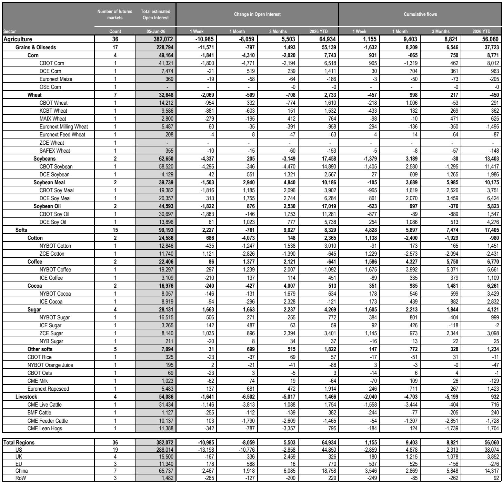
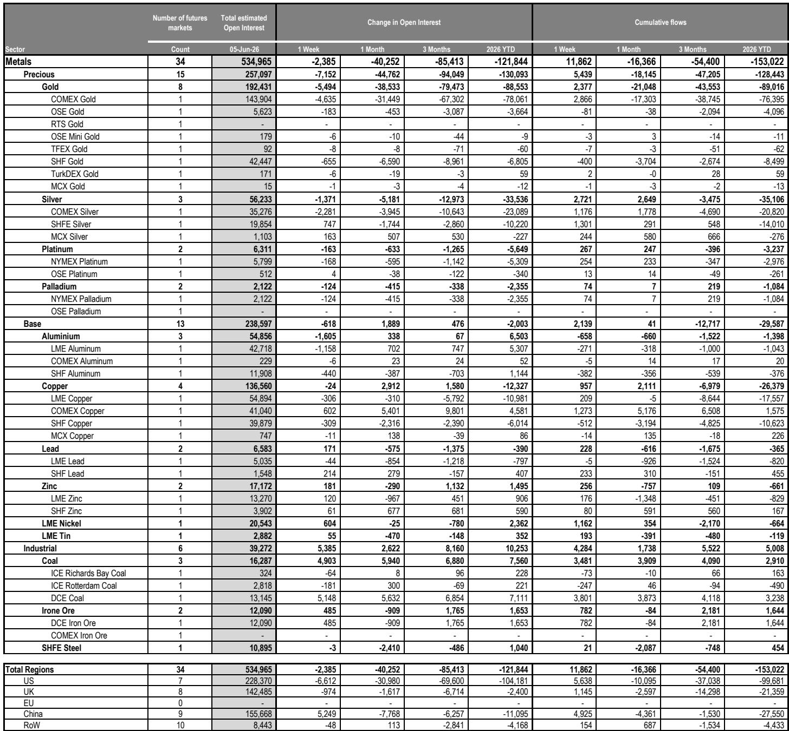
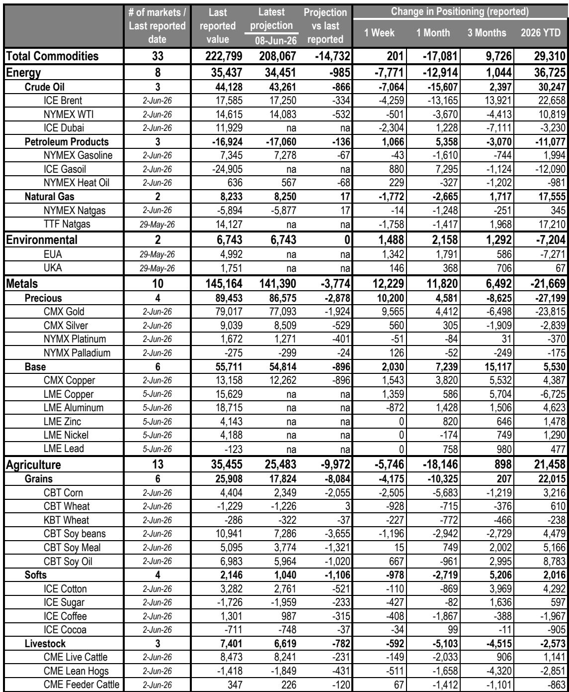

# The Commodity Supercycle Narrative Is Fracturing, But The Strategic Opportunity Lies In The Dispersion

The global commodity complex is no longer moving as one. For three consecutive weeks through early June, the estimated value of open interest across tracked commodity markets has contracted, falling by $14 billion to $1.8 trillion. This is not a uniform pullback. It is a selective, sector-driven repricing that reveals a fundamental shift in how investors are positioning for the second half of 2026. The headline number masks a critical divergence: precious and base metals are attracting net inflows even as energy and agricultural markets bleed positioning. The controlling idea of this moment is that the commodity supercycle narrative—which has dominated institutional allocation since the post-pandemic recovery—is fracturing along the fault lines of macro policy divergence, geopolitical tail risk, and inventory regime shifts. The strategic question is not whether commodities are overowned or underowned, but which commodities are being re-rated for a world of higher-for-longer rates, selective supply constraints, and decelerating demand from key end-markets.

The macro backdrop reinforces this fragmentation. A strong US employment report has, according to global economists, broadened the cyclical lift in business spending into hiring, cushioning household purchasing power against energy price drags. But the same data, combined with sticky and elevated inflation, strengthens the case for a Federal Reserve hike. For commodity investors, this is a double-edged sword: a resilient labor market supports industrial demand, but a more hawkish Fed represses the nominal pricing environment for gold and silver, while simultaneously tightening financial conditions that have historically correlated with commodity drawdowns. The net effect is a market that rewards precision over conviction. Broad-based long exposure is being unwound; targeted, catalyst-driven positions are being built.

The data from the latest positioning report makes this clear. Net investor positioning across global commodity futures markets remained broadly flat week-on-week at $223 billion, but the composition shifted dramatically. Energy net length fell by $7.7 billion, driven by cuts across Brent, Dubai crude, and TTF natural gas. Precious metals net length rose by $10 billion, led by gold. Base metals added $2 billion, concentrated in copper. Agricultural net length dropped by $6 billion, primarily in grains and oilseeds. This is not a market that is undecided. It is a market that is rotating out of consensus longs and into contrarian or event-driven positions. The projections for the week ahead, as of June 8, reinforce this: total commodity positioning is expected to decline by nearly $15 billion, with agriculture taking the largest hit at -$10 billion and precious metals shedding another -$3 billion.

## The Energy Complex Is Pricing A Geopolitical Risk Premium That May Be Misplaced

The energy sector presents the most analytically challenging picture. Open interest remained broadly flat week-on-week at $819 billion, but this stability masks a significant intra-sector rotation. Crude oil and petroleum products saw a decline of $3 billion in open interest, driven by net contract-based outflows of $10 billion from crude oil markets. These outflows were partially offset by a 4% week-on-week increase in NYM WTI prices and a 5% increase in ICE Gas Oil prices. The price action suggests that the market is repricing a geopolitical risk premium that may be too binary.

The base case assumption from the research team is that the Strait of Hormuz reopens in June, keeping Brent near $100 for the rest of the year, with sub-$100 monthly averages only late in 2026. This is a relatively benign scenario that assumes a resolution to the current disruption. But the report explicitly flags the tail risk: if the Strait remains closed, each extra month would materially lift prices, with an estimated $5 increase for 2026 and a $15 increase in the fourth quarter, as inventories deplete further. The market appears to be pricing the base case, as evidenced by the outflows from crude oil futures. Yet the inventory data suggests caution. The Global Commodities Inventory Monitor (GCIM) remained broadly stable in May at 69.4 days-of-use, but on an ex-China basis—a proxy for globally tradeable inventories—it also stabilized at 58.6 days-of-use. Stripping out the seasonal impact of US natural gas storage, the ex-China measure settled at 64.7 days-of-use. Crucially, inventory availability rose only for lead, zinc, and nickel. Oil and aluminum availability declined.

The natural gas market tells a different story. Open interest increased by 3% week-on-week to $6 billion, driven by a 4% increase in TTF prices and net contract-based inflows of $2.3 billion across all trader types. The ADNOC Mubaraz—the first laden LNG tanker to exit the Strait of Hormuz on April 26—re-entered the Strait on June 3. Despite these sporadic movements, only nine LNG vessels are currently inside the Strait, so exports remain capped until a full reopening. Beyond these cargoes, volumes will require renewed upstream and liquefaction operations, as well as normalizing port logistics. This creates a structural bottleneck that is not yet priced into the forward curve for European and Asian natural gas. The market is treating the Strait disruption as a temporary issue, but the logistics of restarting LNG flows suggest a more protracted recovery. The strategic implication is that natural gas may offer a better risk-reward than crude oil for investors who believe the reopening timeline is optimistic.

## Precious Metals Are Caught Between A Rates Repricing And A Physical Flow Reality

Gold and silver present the most paradoxical positioning data in the entire complex. Open interest in precious metals decreased by 3% week-on-week ($7.2 billion) to $257 billion, continuing a multi-week decline. Yet the sector saw net contract-based inflows totalling $5.4 billion week-on-week, with $2.4 billion going into gold and $2.7 billion into silver. Managed Money positioning in COMEX Gold futures rose by 14.7k contracts to approximately 112k contracts net long. This is a market where investors are adding exposure even as the total value of open interest contracts. The explanation lies in price: gold prices have faced selling pressure amid a rates repricing across forward rates markets. Since the start of the Middle East conflict, gold prices have declined by 18%.

The report flags further downside risks if the Fed turns more hawkish on strong employment data and potentially higher inflation. This is the crux of the tension. The fundamental case for gold—geopolitical uncertainty, central bank buying, and currency debasement narratives—remains intact. But the tactical case is being undermined by a repricing of real rates that makes non-yielding assets less attractive. The positioning data suggests that investors are buying the dip, but the momentum signals are flashing warning signs. The short-term price momentum signals on COMEX Gold, COMEX Silver, NYM Platinum, and NYM Palladium all exceeded their respective extreme-negative thresholds, indicating a potential trend exhaustion. This is a classic setup for a contrarian reversal, but it requires a catalyst. The question the report does not fully answer is whether the Fed hiking cycle is the dominant driver of gold prices or whether structural demand from central banks and retail investors in Asia can absorb the selling pressure. The data suggests the latter is providing a floor, but the former is determining the ceiling.

## Base Metals Are Betting On A US Tariff Outcome That Is Far From Certain

Base metals present a more straightforward but equally uncertain picture. Open interest remained broadly flat week-on-week at $239 billion, with net contract-based inflows of $2 billion concentrated in nickel ($1.2 billion) and copper ($0.9 billion). The catalyst is clear: the forthcoming US tariff review. By June 30, 2026, the US Commerce Secretary is to provide the President with an update on whether additional Section 232 copper tariff modifications are necessary.

The research team's view is that the Trump administration is more likely than not to enact an escalating tariff, as laid out in last July's original executive order: starting at 15% in 2027 and increasing to 30% a year later. The rationale is twofold: first, to ensure that all the copper already imported into the US stays onshore, and second, to keep this excess US inventory as a critical reserve, rather than enacting policy that incentivizes rapid destocking. A continued strong import pull into the US in the coming quarters would continue to strain ex-US cathode supply, particularly during periods when China's import arbitrage is also open.

This is a high-conviction call that is not fully reflected in the positioning data. The inflows into copper and nickel suggest that some investors are positioning for a tariff outcome, but the total net length in base metals remains modest relative to the potential price impact. The report does not explicitly address what happens if the tariff review does not result in escalation. If the administration chooses a more moderate path, the premium that has been built into COMEX copper relative to LME copper could unwind quickly, creating a sharp reversal in the positions that have been built. The arbitrage dynamics between COMEX and LME are already attracting attention, and the next three weeks will determine whether the current positioning is prescient or premature.

## What The Report Does Not Fully Answer: The Inventory-Inflation Feedback Loop

The most analytically unsatisfying aspect of the current data is the relationship between inventory levels and inflation expectations. The GCIM data shows that global commodity inventories, on an ex-China and ex-US natural gas basis, stabilized in May at 64.7 days-of-use. This is not a tight inventory regime by historical standards, but it is also not a comfortable one. The report notes that inventory availability rose only for lead, zinc, and nickel. Every other major commodity category saw stable or declining availability.

The open question is whether the current inventory regime is sufficient to absorb a demand shock if the global economy reaccelerates, or whether it is loose enough to prevent a supply-driven price spike if geopolitical disruptions persist. The report's economists see a cyclical lift in business spending broadening to hiring, which should support industrial commodity demand. But the same economists also see sticky inflation strengthening the case for a Fed hike. This creates a feedback loop that the report does not fully resolve: higher rates suppress commodity prices through financial channels, but lower inventories and resilient demand support prices through physical channels. The net effect depends on which channel dominates, and the answer may vary by commodity.

For investors, this means that the traditional correlation between commodities and inflation expectations is breaking down. The energy complex is being driven by geopolitics and inventory draws, not by demand growth. The precious metals complex is being driven by real rates and central bank policy, not by inflation hedging. The base metals complex is being driven by tariff policy and supply chain reshoring, not by Chinese stimulus. The agricultural complex is being driven by weather and crop cycles, not by biofuel mandates. The dispersion across sectors is not a temporary anomaly. It is a structural feature of a world where macro policy, geopolitics, and supply chains are all in flux.

## A Decision Framework For Navigating The Dispersion

For institutional investors, the current environment demands a framework that prioritizes catalyst identification over asset class beta. The following decision framework is derived from the patterns in the data and is designed to help allocate capital across the commodity complex over the next three to six months.

First, assess the geopolitical timeline. The energy complex is the most sensitive to the Strait of Hormuz reopening. If you believe the base case of a June reopening, crude oil positioning should be reduced, and natural gas should be treated as a tactical long given the logistical bottlenecks in LNG restart. If you believe the reopening is delayed, crude oil offers asymmetric upside, and the current outflows represent a buying opportunity.

Second, evaluate the Fed path. Precious metals are currently being repriced for a more hawkish Fed. If you believe the strong employment data will force a hike, gold should be underweighted, and the current inflows into gold and silver should be viewed as a contrarian signal that may reverse. If you believe the Fed will pause or that the labor market data is noise, the extreme-negative momentum signals in gold and silver suggest a potential trend exhaustion that could lead to a sharp reversal higher.

Third, monitor the US tariff review for base metals. The deadline of June 30 is a binary event for copper. If you believe the escalating tariff scenario, copper should be overweighted, particularly on the COMEX-LME arbitrage. If you believe the administration will moderate, the current inflows into copper and nickel should be reduced, and short positions on COMEX copper relative to LME copper should be considered.

Fourth, watch the agricultural inventory cycle. The projected decline in agricultural positioning of $10 billion over the next week is the largest across all sectors. The long-term momentum signals on Kansas Wheat, CBOT Soybeans, and ICE Cotton have all switched to sell. If you believe the current price declines are overdone given the stable inventory data, selective long positions in softs may offer value. If you believe the sell signals reflect a fundamental deterioration in demand, the outflows will continue, and agricultural commodities should be avoided.

Fifth, consider the environmental markets as a separate asset class. Open interest in environmental markets decreased by 4% week-on-week to $73 billion, driven by a 6% decline in EUA prices. But net contract-based flows were positive at $1.4 billion, primarily into EUAs. Investment Funds increased their net long position across EUAs to 51.2k lots, up by 12.2k lots week-on-week. This is a market where policy expectations are driving positioning, and the divergence between price and flows suggests that professional investors see value at current levels.

## Join the community to read the full report and review the original charts.

The commodity complex is entering a phase where the margin for error is thin and the cost of being wrong is high. The data from this week's positioning report provides a snapshot of a market in transition, but it cannot predict the outcomes of the geopolitical, monetary, and trade policy events that will determine prices over the coming months. The full report contains the detailed charts, the CFTC COT data for agricultural commodities, and the granular breakdowns by trader type and exchange location that are essential for constructing a precise portfolio. The strategic opportunity lies not in betting on the direction of the complex as a whole, but in understanding which sectors are being mispriced relative to the catalysts that are about to materialize. The next three weeks will be decisive.

*This article is for learning and discussion only and does not constitute investment advice.*

Personal reading notes and learning share only. Not investment advice.

