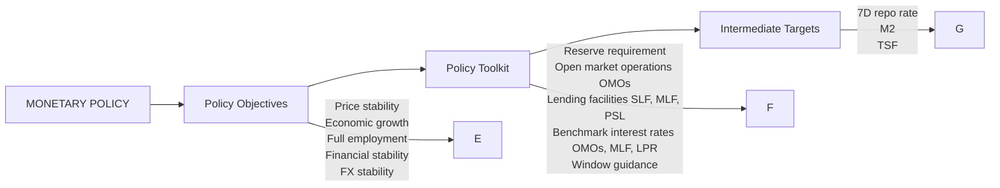
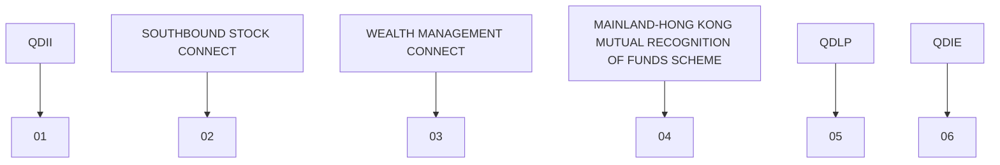

你是财经类 AI Podcast 制作人，擅长把研报内容改写成中文、英文两条独立的访谈式播客脚本。

【目标】
- 基于下面研报解析内容，写两份 podcast 脚本：一份中文，一份英文。
- 每份目标时长约 5 分钟。
- 两份都要是“访谈聊天式”，不是单人念稿。
- 听感：像一位主持人和一位研究员围绕报告做深度但自然的讨论。
- 不要使用 emoji。
- 不要把全文讲完，要留下 1-2 个“完整报告里会继续展开”的悬念。

【输出格式必须严格遵守】
- 中文部分只能使用 `ZH_A:` 和 `ZH_B:` 开头。
- 英文部分只能使用 `EN_A:` 和 `EN_B:` 开头。
- 每一句独立成行。
- 不要输出 Markdown 标题。
- 不要输出舞台说明、音效说明或括号注释。
- 先输出完整中文脚本，再输出完整英文脚本。

【角色设定】
- A 是主持人：负责提问、转场、替听众追问“所以这意味着什么”。
- B 是研究员：负责解释报告逻辑、给出结构化判断和保留悬念。
- 两个角色必须频繁轮换，避免一个人连续说超过 3 句。
- 每句要适合 TTS 朗读：短句、自然、不要太书面。

【中文脚本结构】
1. 开场：A 用一个问题引出报告价值，B 给出主判断。
2. 第一部分：这份报告真正要回答的问题是什么。
3. 第二部分：2-3 个关键洞察，每个洞察都要有“这意味着什么”。
4. 第三部分：哪些问题仍然没有完全展开，为什么值得继续读完整报告。
5. 结尾：自然引导听众加入社群/阅读完整报告，不要硬广。

【英文脚本结构】
- 英文不是中文逐句翻译，而是面向英文听众重新组织。
- 保留同样的主线和洞察，但表达更口语、更 podcast。
- Use natural conversational English.
- Avoid long sentences and avoid reading like a research memo.

【内容边界】
- 可以基于研报内容做适度发散，但必须是从原文逻辑推出的判断。
- 不要编造具体数据、公司动作或引用。
- 对不确定内容要用“这里仍需要继续验证”或 “the report does not fully answer this yet” 表达。
- 默认避免出现具体投行品牌名，比如“GS”“GS”，统一写作“投行研报”或 “a global investment bank report”。

【研报解析内容】
"""
June 10, 2026 02:17 AM GMT

Investor Presentation | Asia Pacific

# Fed Policy Stance: Implications for China

Recent research:

US Economics Mid-Year Outlook: Capex Over Consumption

Global Macro Strategy Mid-Year Outlook: Slippery When Oiled

MS ASIA LIMITED+

Jenny Zheng, CFA

Economist

Jenny.L.Zheng@morganstanley.com

+852 3963-4015

text_image

Asia Summer School 2026

For analyst certification and other important disclosures, refer to the Disclosure Section, located at the end of this report.

## US Economy

## 2026-27 Growth Outlook: Capex Over Consumption

We expect real GDP growth to step up over 2026E-27E...

Contributions to Real GDP (pp, annual rate)  

stacked bar chart

| Year | Consumption | Government | Inventories | Trade | Residential investment | Business fixed investment | Real GDP |
|---|---|---|---|---|---|---|---|
| 2025 | 1.0 | 0.1 | -0.1 | 0.3 | 0.1 | 0.8 | 1.8 |
| 2026E | 1.1 | 0.3 | 0.1 | 0.2 | 0.1 | 0.9 | 2.0 |
| 2027E | 1.3 | 0.2 | 0.2 | 0.3 | 0.1 | 1.0 | 2.5 |

...led by AI-related spending

Contribution to Real GDP Growth, pp  

bar-line hybrid chart

| Year | AI-related | Non-AI-related | NFI    |
|------|------------|----------------|--------|
| 21   | 0.7        | 0.4            | 1.2    |
| 22   | 0.7        | 0.5            | 1.5    |
| 23   | 0.1        | 0.8            | 1.7    |
| 24   | 0.3        | -0.1           | 0.2    |
| 25   | 1.6        | -0.5           | 1.1    |
| 26   | 1.6        | -0.4           | 1.2    |

Source: BEA, MS estimates

## US Economy

## Consumption: Energy Headwind Neutralizes Fiscal Stimulus

We estimate an increase of 15% in gas prices this year would more than offset the average tax refund increase  

bar chart

| YoY % Change in Avg Retail Gas Price | Estimated average household increase in gas spending (annual, $) |
| :--- | :--- |
| 10% | 250 |
| 15% | 375 |
| 20% | 500 |
| 25% | 625 |
| 30% | 750 |
| 35% | 875 |
Average tax refund YoY increase (among those who receive refunds, $) = 325.

Wealth effects for upper income households: The top income cohort holds more than 70% of all net worth  

bar chart

Share of total net worth by income cohorts (Q42025, %)
| Income Cohort | Share of total net worth (%) |
| :--- | :--- |
| 0-20 Pctl | 2.9 |
| 20-40 Pctl | 4.1 |
| 40-60 Pctl | 7.8 |
| 60-80 Pctl | 13.3 |
| 80-99 Pctl | 47.3 |
| Top 1 Pctl | 24.7 |

Source: BLS, IRS, Federal Reserve Board, Haver Analytics, MS

## US Economy

## Labor Market: Strong Payrolls, No Sign Of AI & Energy Drag (Yet?)

The increase in nonfarm payrolls should reduce FOMC's concerns about downside risks to the labor market  

line chart

| Year | Payrolls (k) | 3-m average (k) |
|------|--------------|------------------|
| 2023 | 450          | 275              |
| 2024 | 150          | 150              |
| 2025 | -50          | 100              |
| 2026 | -150         | 50               |

Payroll income growth remains faster than last summer  

line chart

| Year | Aggregate payroll incomes, 3-month % change, a.r. | 12-month % change |
|------|--------------------------------------------------|-------------------|
| 22   | 8.5                                              | 11.8              |
| 23   | 4.5                                              | 7.0               |
| 24   | 4.0                                              | 5.5               |
| 25   | 5.0                                              | 4.5               |
| 26   | 3.0                                              | 4.0               |

Source: BLS, MS

## US Economy

## Will the Unemployment Rate Come Down?

The unemployment rate remains at 4.3%, but continued \~100k NFP prints will likely push it lower  

line chart

| Year | Unemployment rate, % |
| ---- | --------------------- |
| 23   | 3.5                   |
| 24   | 3.9                   |
| 25   | 4.2                   |
| 26   | 4.5                   |

Our estimate of the breakeven pace of NFP is currently at 50k  

line chart

| Year | 12-month average | Projected | Annual |
|------|------------------|---------|--------|
| 23   | ~330             | -       | 240    |
| 24   | ~240             | -       | 170    |
| 25   | ~180             | -       | 170    |
| 26   | ~50              | 50      | 70     |

Source: BLS, MS estimates

## US Economy

## CPI: Core Decelerates, Headline Remains High

Core decelerates on softer services. Goods inflation remains positive, but tariff effect continues to fade  

bar-line hybrid

Contributions to Core CPI (m/m, %)
| Month | Rents (m/m) | Core services ex-rents (m/m) | Vehicles (m/m) | Other core goods (m/m) | Core (m/m) |
| :--- | :--- | :--- | :--- | :--- | :--- |
| May-25 | 0.11 | 0.03 | -0.04 | 0.02 | 0.18 |
| Jun-25 | 0.12 | 0.07 | -0.04 | 0.06 | 0.23 |
| Jul-25 | 0.11 | 0.19 | 0.03 | 0.03 | 0.31 |
| Aug-25 | 0.13 | 0.11 | 0.05 | 0.03 | 0.31 |
| Sep-25 | 0.07 | 0.11 | 0.01 | 0.06 | 0.22 |
| Oct-25 | 0.06 | 0.03 | 0.01 | -0.01 | 0.09 |
| Nov-25 | 0.06 | 0.03 | 0.01 | -0.01 | 0.09 |
| Dec-25 | 0.12 | 0.08 | -0.02 | 0.02 | 0.23 |
| Jan-26 | 0.10 | 0.24 | -0.06 | 0.14 | 0.30 |
| Feb-26 | 0.08 | 0.14 | -0.01 | 0.02 | 0.22 |
| Mar-26 | 0.11 | 0.11 | -0.01 | 0.03 | 0.20 |
| Apr-26 | 0.22 | 0.17 | -0.01 | 0.03 | 0.38 |
| May-26 | 0.11 | 0.11 | -0.01 | 0.03 | 0.22 |
MS F'cst

Source: BLS, MS estimates

## US Economy

## Fed Policy Outlook

Inflation has to behave for the fed to cut  

line chart

| Year | Target | Baseline | Global Oil Recession | Demand shock | AI Productivity & Labor Displacement | Oil Risk Premium |
|------|--------|----------|----------------------|--------------|-------------------------------------|------------------|
| 22   | 0.00   | 0.00     | 0.00                 | 0.00         | 0.00                                | 0.00             |
| 23   | 4.50   | 4.50     | 4.50                 | 4.50         | 4.50                                | 4.50             |
| 24   | 5.50   | 5.50     | 5.50                 | 5.50         | 5.50                                | 5.50             |
| 25   | 4.50   | 4.50     | 4.50                 | 4.50         | 4.50                                | 4.50             |
| 26   | 3.50   | 3.50     | 3.50                 | 3.50         | 3.50                                | 3.50             |
| 27   | 3.50   | 3.50     | 1.50                 | 4.50         | 3.00                                | 3.50             |

Shrinking the balance sheet is possible, but it will only occur slowly and requires a change in regulation  

line chart

| Year | Federal Reserve Balance Sheet (US$, tn) |
| ---- | --------------------------------------- |
| 15   | 4.5                                     |
| 16   | 4.5                                     |
| 17   | 4.5                                     |
| 18   | 4.3                                     |
| 19   | 3.8                                     |
| 20   | 7.0                                     |
| 21   | 8.5                                     |
| 22   | 9.0                                     |
| 23   | 8.5                                     |
| 24   | 7.5                                     |
| 25   | 6.8                                     |

Source: Federal Reserve, Haver Analytics, MS estimates

## US Economy

## Treasuries to Cheapen First, then Outperform Forwards as Oil Tails Fade

MS US Treasury yield forecasts: probability-weighted baseline

<table><tr><td>Quarter</td><td>UST 2y (%)</td><td>UST 5y (%)</td><td>UST 10y (%)</td><td>UST 30y (%)</td></tr><tr><td>12-May-26</td><td>4.00</td><td>4.13</td><td>4.43</td><td>5.03</td></tr><tr><td>4Q25</td><td>3.48</td><td>3.73</td><td>4.12</td><td>4.85</td></tr><tr><td>1Q26</td><td>3.82</td><td>3.95</td><td>4.28</td><td>4.90</td></tr><tr><td>2Q26e</td><td>4.05</td><td>4.15</td><td>4.45</td><td>5.05</td></tr><tr><td>3Q26e</td><td>3.80</td><td>4.00</td><td>4.35</td><td>4.90</td></tr><tr><td>4Q26e</td><td>3.75</td><td>3.90</td><td>4.25</td><td>4.85</td></tr><tr><td>1Q27e</td><td>3.75</td><td>3.90</td><td>4.30</td><td>4.85</td></tr><tr><td>2Q27e</td><td>3.60</td><td>3.85</td><td>4.20</td><td>4.75</td></tr><tr><td>3Q27e</td><td>3.45</td><td>3.75</td><td>4.15</td><td>4.70</td></tr><tr><td>4Q27e</td><td>3.45</td><td>3.75</td><td>4.15</td><td>4.75</td></tr></table>

Market-implied trough fed funds rate vs. 10Y US Treasury yield  

scatterplot

| Date | Market-implied trough fed funds rate (%) | UST 10y yield (%) |
|------|------------------------------------------|-------------------|
| April 3, 2025 to present | ~2.75 | ~4.0 |
| May 12, 2026 | ~3.6 | ~4.5 |
| August 1, 2023 to April 2, 2025 | ~3.7 | ~4.4 |

Source: Federal Reserve, Bloomberg, MS estimates

## China's Monetary Policy Framework

flowchart

Source: MS.

## RMB

## Modest Appreciation in RMB Basket, USDCNY Remains A USD Story

Modest CFETS RMB upside, USDCNY a function of USD moves  

line chart

| Date     | CNYUSD | Official CFETS RMB Index | TWI USD-RS |
|----------|--------|---------------------------|------------|
| 4Q26E    |        |                           | USDCNY: 6.75 |
| 2Q27E    |        |                           | USDCNY: 6.80 |
| End      |        |                           |            |

How PBoC managed RMB moves in the past  

bar chart

FX Rate Changes During Major USD Cycles
| Period | TWI USD (%) | CFETS RMB Index (%) | USDCNY (%) |
| :--- | :--- | :--- | :--- |
| Apr-Nov 2018 | 9.5 | -4.5 | -9.5 |
| Mar-20 to Jan-21 | -12.5 | -0.5 | 9.8 |
| Jun-21 to Sep-22 | 16.0 | 4.0 | -10.5 |
| Sep-22 to Feb-23 | -7.5 | -1.5 | 6.5 |
| Sep-24 to Jan-25 | 7.5 | 3.0 | -4.5 |
| Jan-Jul 2025 | -8.5 | -6.0 | 2.0 |

Source: Bloomberg, CEIC, MS estimates.

## RMB

## China Tightens Outbound Investment Controls to Regulate Flows...

The regulation is not about acute capital flight pressure: RMB depreciation expectations have eased actually  

line chart

| Date   | FX Settlement Ratio for exporters-LS | FX Purchase Ratio for Importers-RS |
|--------|--------------------------------------|------------------------------------|
| Apr-13 | ~60%                                 | ~68%                               |
| Apr-14 | ~68%                                 | ~70%                               |
| Apr-15 | ~50%                                 | ~40%                               |
| Apr-16 | ~55%                                 | ~65%                               |
| Apr-17 | ~58%                                 | ~63%                               |
| Apr-18 | ~62%                                 | ~65%                               |
| Apr-19 | ~55%                                 | ~60%                               |
| Apr-20 | ~58%                                 | ~62%                               |
| Apr-21 | ~60%                                 | ~65%                               |
| Apr-22 | ~58%                                 | ~60%                               |
| Apr-23 | ~55%                                 | ~62%                               |
| Apr-24 | ~58%                                 | ~65%                               |
| Apr-25 | ~45%                                 | ~60%                               |
| Apr-26 | ~55%                                 | ~68%                               |

Our measure of monthly capital flows - more related to FX market equilibrium - have turned from outflows to inflows  

bar-line hybrid

| Date | FX Forwards Transaction (USD Bn) | Cross-border Payment in RMB (USD Bn) | FX Settlement on Capital & Financial Account (USD Bn) | FX Settlement on Current Account (USD Bn) | Total Cross Border Flows (USD Bn) |
|---|---|---|---|---|---|
| Apr-19 | ~5 | ~-10 | ~-5 | ~-5 | ~0 |
| Apr-20 | ~10 | ~-30 | ~5 | ~10 | ~10 |
| Apr-21 | ~30 | ~40 | ~20 | ~30 | ~90 |
| Apr-22 | ~10 | ~60 | ~10 | ~25 | ~50 |
| Apr-23 | ~20 | ~-20 | ~-5 | ~15 | ~10 |
| Apr-24 | ~-5 | ~-40 | ~-30 | ~-20 | ~-80 |
| Apr-25 | ~40 | ~-60 | ~-20 | ~30 | ~30 |
| Apr-26 | ~110 | ~40 | ~40 | ~50 | ~130 |

Source: CEIC, MS

## RMB

## ...Not to Shut Down Overseas Investment Channels

Mainland residents still have several legal routes to gain offshore securities exposure...

CHANNELS FOR OFFSHORE
SECURITIES EXPOSURE  

flowchart

...albeit with various limitations such as insufficient quotas, product eligibility and regional restrictions etc.

line chart

| Date   | Approved QDII Quota (US$bn) |
|--------|-----------------------------|
| May-26 | 176.169                     |

## RMB

## Implications: Near-term Support to RMB

## Regulatory impact on RMB and growth

## IMPACT ON RMB

NEAR-TERM SUPPORT, FLOW-BASED

Tighter capital controls

Less unmonitored outflow & narrowing informal channels

Lower FX demand from households & corporates

More current account surplus converted → Near-term RMB support

## IMPACT ON GROWTH

NEAR-TERM IMPACT LIKELY MARGINAL

More private savings kept onshore

Supports liquidity & asset prices

Lowers financing costs & eases financial conditions

Supports growth — if credit demand picks up

## CONFIDENCE IMPROVES

More borrowing, investment & stronger growth

## CONFIDENCE REMAINS WEAK

Funds sit in deposits, money-market products or government bonds, pressuring risk-free rates

## Tighter controls could reduce risk-adjusted return opportunities for domestic portfolio investors

China Outbound Investment Return, 2025  

bar chart

| Category | Value (%) |
|---|---|
| Direct Investment | 4.4 |
| Portfolio Investment | 9.4 |

## RMB

## China Will Likely Continue with Its Prevailing Capital Account Opening Approa

[中间内容因长度限制已省略]

ccepts responsibility for its contents; in Korea by MS & Co International plc, Seoul Branch; in India by MS India Company Private Limited having Corporate Identification No (CIN) U22990MH1998PTC115305, regulated by the Securities and Exchange Board of India ("SEBI") and holder of licenses as a Research Analyst (SEBI Registration No. INH000001105); Stock Broker (SEBI Stock Broker Registration No. INZ000244438), Merchant Banker (SEBI Registration No. INM000011203), and depository participant with National Securities Depository Limited (SEBI Registration No. IN-DP-NSDL-567-2021) having registered office at Altimus, Level 39 & 40, Pandurang Budhkar Marg, Worli, Mumbai 400018, India; Telephone no. +91-22-61181000; Compliance Officer Details: Mr. Tejarshi Hardas, Tel. No.: +91-22-61181000 or Email: tejarshi.hardas@morganstanley.com; Grievance officer details: Mr. Tejarshi Hardas, Tel. No.: +91-22-61181000 or Email: msic-compliance@morganstanley.com. MS India Company Private Limited (MSICPL) may use AI tools in providing research services. All recommendations contained herein are made by the duly qualified research analysts; in Canada by MS Canada Limited; in Germany and the European Economic Area where required by MS Europe S.E., regulated by Bundesanstalt fuer Finanzdienstleistungsaufsicht (BaFin) under the reference number 149169; in the United States by MS & Co. LLC, which accepts responsibility for its contents. MS & Co. International plc, authorized by the Prudential Regulation Authority and regulated by the Financial Conduct Authority and the Prudential Regulation Authority, disseminates in the UK research that it has prepared, and research which has been prepared by any of its affiliates, only to persons who (i) are investment professionals falling within Article 19(5) of the Financial Services and Markets Act 2000 (Financial Promotion) Order 2005 (as amended, the "Order"); (ii) are persons who are high net worth entities falling within Article 49(2)(a) to (d) of the Order; or (iii) are persons to whom an invitation or inducement to engage in investment activity (within the meaning of section 21 of the Financial Services and Markets Act 2000, as amended) may otherwise lawfully be communicated or caused to be communicated. RMB MS Proprietary Limited is a member of the JSE Limited and A2X (Pty) Ltd. RMB MS Proprietary Limited is a joint venture owned equally by MS International Holdings Inc. and RMB Investment Advisory (Proprietary) Limited, which is wholly owned by FirstRand Limited. The information in MS is being disseminated by MS Saudi Arabia, regulated by the Capital Market Authority in the Kingdom of Saudi Arabia, and is directed at Sophisticated investors only.

The trademarks and service marks contained in MS are the property of their respective owners. Third-party data providers make no warranties or representations relating to the accuracy, completeness, or timeliness of the data they provide and shall not have liability for any damages relating to such data. The Global Industry Classification Standard (GICS) was developed by and is the exclusive property of MSCI and S&P.

MS, or any portion thereof may not be reprinted, sold or redistributed without the written consent of MS.

Indicators and trackers referenced in MS may not be used as, or treated as, a benchmark under Regulation EU 2016/1011, or any other similar framework.

The information in MS is being communicated by MS & Co. International plc (DIFC Branch), regulated by the Dubai Financial Services Authority (the DFSA) or by MS & Co. International plc (ADGM Branch), regulated by the Financial Services Regulatory Authority Abu Dhabi (the FSRA), and is directed at Professional Clients only, as defined by the DFSA or the FSRA, respectively. The financial products or financial services to which this research relates will only be made available to a customer who we are satisfied meets the regulatory criteria of a Professional Client. A distribution of the different MS Research ratings or recommendations, in percentage terms for Investments in each sector covered, is available upon request from your sales representative.

The information in MS is being communicated by MS & Co. International plc (QFC Branch), regulated by the Qatar Financial Centre Regulatory Authority (the QFCRA), and is directed at business customers and market counterparties only and is not intended for Retail Customers as defined by the QFCRA.

As required by the Capital Markets Board of Turkey, investment information, comments and recommendations stated here, are not within the scope of investment advisory activity. Investment advisory service is provided exclusively to persons based on their risk and income preferences by the authorized firms. Comments and recommendations stated here are general in nature. These opinions may not fit to your financial status, risk and return preferences. For this reason, to make an investment decision by relying solely to this information stated here may not bring about outcomes that fit your expectations.

Registration granted by SEBI and certification from the National Institute of Securities Markets (NISM) in no way guarantee performance of the intermediary or provide any assurance of returns to investors. Investment in securities market are subject to market risks. Read all the related documents carefully before investing.

© 2026 MS
"""
