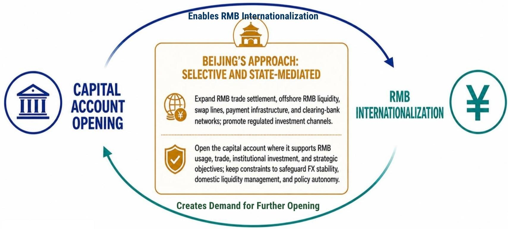
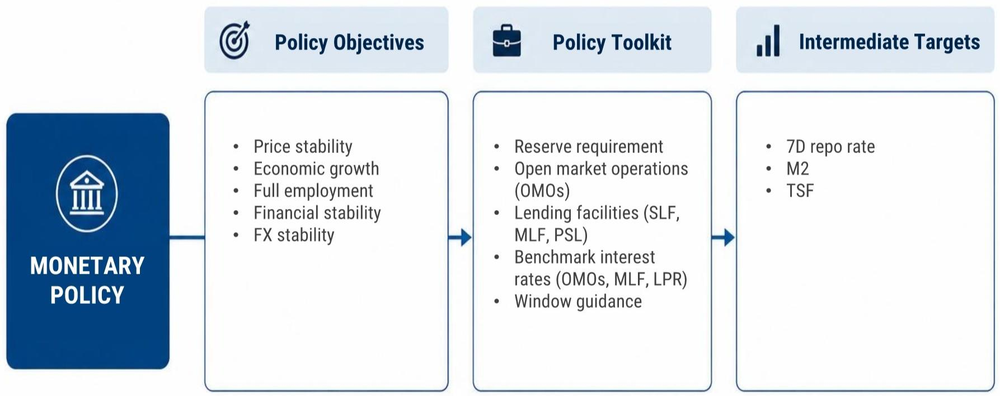
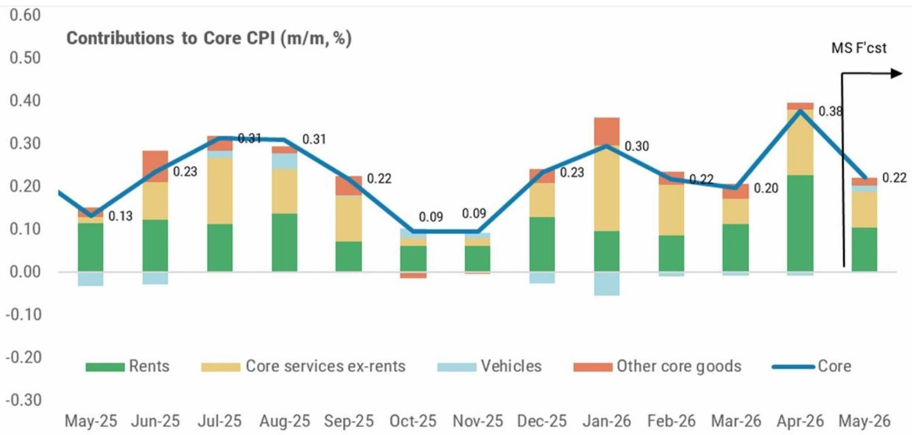

# China's Capital Controls Are Not a Panic Move — They Are a Strategic Pivot That Redefines the RMB and Growth Trade

The Federal Reserve’s policy stance is entering a new phase, and the implications for China are far more structural than most market participants assume. The conventional narrative holds that a less accommodative US central bank inevitably pressures emerging market currencies and forces tighter domestic conditions. But the evidence from a recent global investment bank report suggests a different story is unfolding. The US economy is rotating from consumption-led growth toward capex-driven expansion, with artificial intelligence-related spending as the primary engine. This shift, combined with persistent energy cost headwinds for households, creates a complex macro backdrop. For China, the critical insight is not about how much the Fed cuts or when. The real strategic question is how Beijing uses the window created by US policy uncertainty to recalibrate its own monetary framework and capital account management.

The report’s analysis of China’s recent tightening of outbound investment controls is often misread as a defensive reaction to capital flight. That interpretation is too narrow. The data shows that RMB depreciation expectations have actually eased, and a comprehensive measure of monthly capital flows has turned from outflows to inflows. The regulatory move is not about plugging a leak; it is about reshaping the plumbing. By narrowing informal channels and reducing FX demand from households and corporates, Beijing is deliberately converting more of the current account surplus into near-term RMB support. This is not a crisis measure. It is a calculated intervention to alter the risk-return calculus for domestic portfolio investors and to keep more private savings onshore.

The implications for growth are nuanced and conditional. Tighter capital controls could lower financing costs and ease financial conditions, but only if credit demand picks up. If confidence remains weak, the funds will simply sit in deposits, money-market products, or government bonds, pressuring risk-free rates lower without stimulating real investment. The report’s framework makes clear that the outcome depends on whether the private sector chooses to borrow and invest or to hoard liquidity. This is the central tension that investors must monitor. The controls are a tool, not a solution. Their effectiveness hinges entirely on the confidence channel.

The decision framework for allocators is therefore not about predicting the next Fed move or the next PBoC rate cut. It is about assessing the probability that China’s capital account management will succeed in anchoring the RMB while simultaneously creating conditions for a credit-driven recovery. Investors should evaluate three variables: the trajectory of US Treasury yields relative to forwards, the evolution of China’s credit impulse, and the behavior of domestic savings flows. The report’s yield forecasts suggest Treasuries will cheapen first before outperforming as oil tail risks fade. That sequence matters because it determines the relative attractiveness of carry trades and the timing of capital flow reversals.

One section of the report raises a question it does not fully answer: how durable is the shift in US growth composition? The capex-over-consumption thesis depends heavily on AI-related investment sustaining its momentum. The data shows that AI-related contributions to real GDP growth have been running at 1.6 percentage points, while non-AI business fixed investment has been negative. This is an extraordinarily narrow base for a capex cycle. If AI spending falters or faces regulatory headwinds, the entire US growth narrative collapses, and with it the Fed’s ability to normalize policy. The report acknowledges this implicitly by showing a wide range of possible fed funds rate paths under different scenarios, from a demand shock that would force cuts to 1.50% by 2027 to an oil risk premium scenario that keeps rates higher. The baseline forecast is for gradual easing, but the distribution of outcomes is wide and asymmetric.

For China, the most consequential unknown is whether the tightening of outbound investment controls will prove self-defeating over time. If onshore investors perceive that their risk-adjusted return opportunities are being artificially constrained, they may find new channels to circumvent the regulations, or they may simply reduce their risk appetite altogether, worsening the very confidence problem the policy is meant to solve. The report notes that China outbound portfolio investment returns were 9.4% in 2025, compared to 4.4% for direct investment. Closing that gap without reducing domestic returns is a delicate balancing act. The authorities have preserved several legal channels for offshore exposure, including QDII, Southbound Stock Connect, and Wealth Management Connect, but quotas remain limited. The tension between maintaining openness and controlling outflows is not resolved in the report. It is left as an open analytical question that demands ongoing attention.

The strategic takeaway for serious investors is that the Fed-China nexus is no longer a simple matter of rate differentials and carry trades. The US economy is undergoing a structural shift in its growth drivers, and China is responding with a deliberate tightening of its capital account that has both near-term support for the RMB and longer-term implications for domestic financial conditions. The two stories are connected, but not in the way most models assume. The Fed’s path determines the external envelope within which China operates, but Beijing’s choices about capital controls and monetary transmission will determine the internal dynamics. The most important variable to watch is not the Fed funds rate or the USDCNY fix. It is the behavior of Chinese households and corporates: whether they borrow, invest, and consume, or whether they retreat into safe assets. That decision will determine whether the capital controls support growth or merely suppress volatility without generating momentum.

Join the community to read the full report and review the original charts.

*This article is for learning and discussion only and does not constitute investment advice.*

Personal reading notes and learning share only. Not investment advice.

