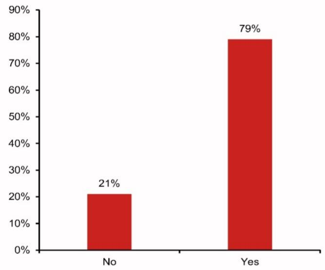
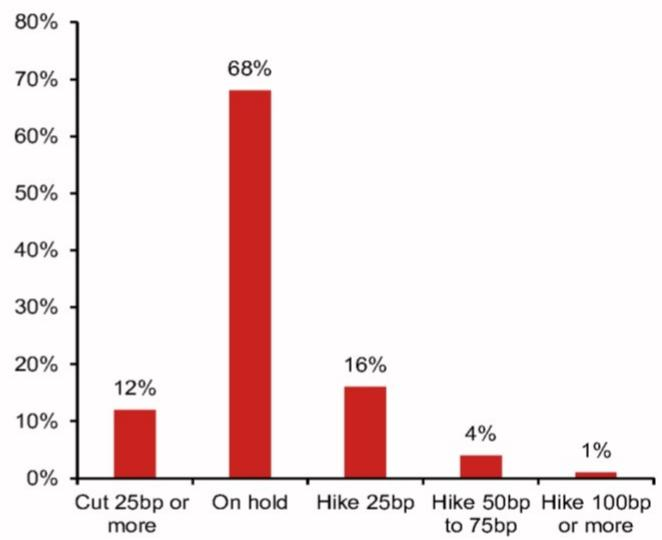
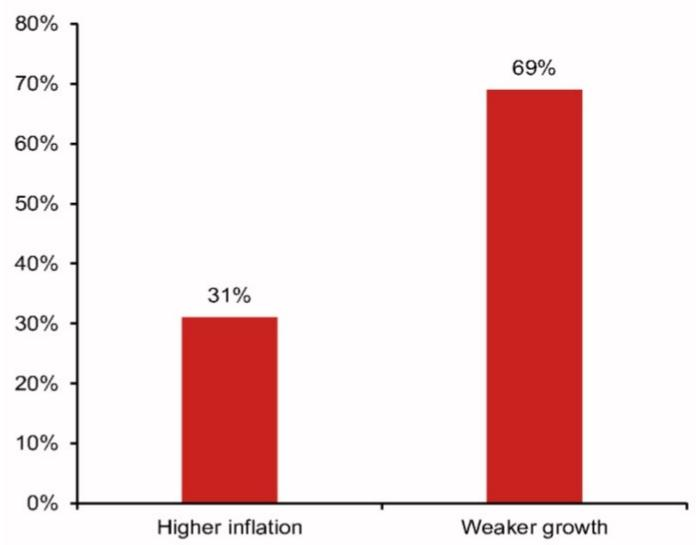
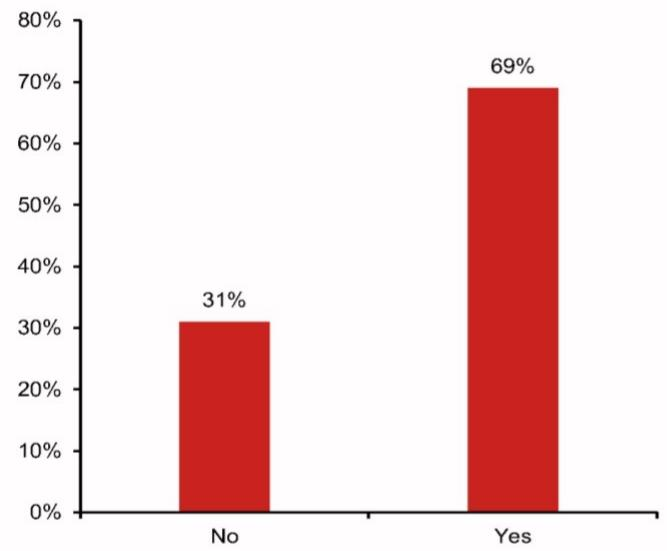
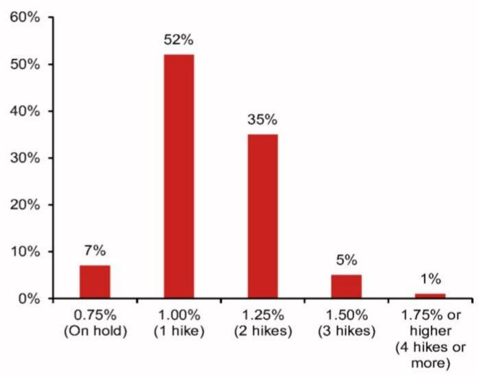
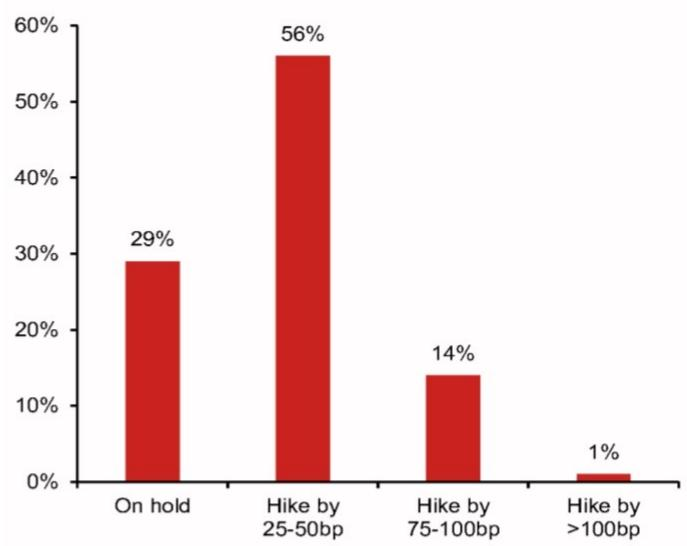

## Economic Insights

Economics - Global

## NOM Investment Forum Asia 2026: A recap of our macro views and what investors think

We hosted our annual flagship Asian investment forum in Singapore over 2-5 June, with our Global Economic Outlook panel held on 3 June, where our chief economists presented their macro outlooks. We also polled the audience on several topics and present the results of our nine polling questions.

## Summary of chief economists' presentations

## Global (Rob Subbaraman)

- Our global economic outlook features increasing divergence with economies marching to different tunes. The US economy is the clear outperformer in the DM world, while many EM economies are struggling from the commodity price surge while benefitting little from the AI boom.  
- Even if the Strait of Hormuz (SoH) reopens soon, there will remain significant inertia when it comes to global supply-side disruptions. Excluding the period during the pandemic, the NY Fed's Global Supply Chain Pressure Index (GSCPI) has risen to its highest level since 1998, and during the pandemic, US CPI inflation peaked six months after the GSCPI peaked in December 2021.  
- The world has been facing a series of supply shocks, and while the media focuses on the oil price shock, it is actually much broader than that. There is a trio of energy, chip and, increasingly, food price shocks that is driving this divergence in economic performance.  
- Broadly speaking, we expect central banks to hike by less than market pricing, as we expect the “stag” part of stagflation to be more serious than during the last 2021-22 global inflation surge, since, unlike the post-Covid inflation surge, there is no post-pandemic, pent-up demand and far less fiscal and monetary stimulus. That said, there could be a few exceptions, notably the US (AI boom and more pricing power muscle memory, given inflation has exceeded the Fed’s target for five years), and Japan (monetary policy remains exceptionally loose and risks of fiscal dominance).  
- Another reason why we generally expect less price pass-through to underlying inflation this time around is because of the China shock 2.0, which is intensifying China-led price competition in Asia and Europe.  
- Time snapshots of bond markets at the end of ultra-low policy rates (December 2021), the end of the global rate hiking cycle (September 2023), the start of the US-Iran war (end-February 2026) and end-May 2026 all highlight rises in sovereign bond yields and steepening curves, which reflect: 1) rising inflation and an erosion of central bank independence; 2) continued large budget deficits and rising public debt ratios; and 3) massive global government bond issuance at a time when mega-tech firms are also starting to issue debt.  
- These four snapshots highlight the fragility in global bond markets and warn that bond market vigilantes could be reawakening. These four snapshots also reveal how China has moved from one of the highest yielding sovereigns to now the lowest yielding while, in terms of the yield curve, Japan has moved from the flattest to the steepest.

## United States (David Seif)

- The US is set to grow above trend and at a faster rate than other DM countries.  
- The US is capturing the lion's share of the AI infrastructure investment, likely raising GDP growth by a full percentage point.  
• Although the Iran war is a negative for the US, it is less of a negative than for most DM

## Research Analysts

## Global Economics

Rob Subbaraman - NSL

rob.subbaraman@NOM.com

+65 6433 6548

George Buckley - Nlplc

george.buckley@NOM.com

+44 (0) 20 7102 1800

Ting Lu - NIHK

ting.lu@NOM.com

+852 2252 1306

Kyohei Morita - NSC

kyohei.morita@NOM.com

+81 3 6703 1395

Euben Paracuelles - NSL

euben.paracuelles@NOM.com

+65 6433 6956

David Seif - NSI

david.seif@NOM.com

+1 212 667 9180

Sonal Varma - NSL

sonal.varma@NOM.com

+65 6433 6527

Si Ying Toh, CFA - NSL

siying.toh@NOM.com

+65 6433 6666

countries, because North America has a separate natural gas market and because the US is a net exporter of oil.

- Core inflation is rising in the US due to “software goods,” which are related to the AI capex boom (note that Steve Miran says its weighting in the PCE is too high).  
- Trimmed-mean PCE, which Chair Warsh favors, has historically lagged core PCE in responding to changes in inflation trends.  
- Warsh likely disagrees with most of the FOMC in that he is more dovish, which will likely limit his ability to have the same level of control over monetary policy as his predecessors.  
• We expect the Fed to keep rates steady through the end of 2027 at least, and we see roughly equal chances of a hike and a cut.

## Euro area (George Buckley)

- The stagflationary revisions to consensus forecasts for the euro area have been among the largest for DM economies since the Iran war began (i.e., weaker GDP, stronger inflation).  
- Rates markets are still strongly bound by oil prices. Current levels (\$95/bbl) are consistent with our view of two ECB rate hikes and one BoE hike this year. We think the BoE will more than unwind that hike by rate cuts in H2 2027.  
- For various reasons the latest inflation shock looks very different to 2022. Notably, monetary and fiscal policy are tighter now (note Germany's fiscal largesse is being offset by tightening elsewhere), labour markets are looser, there is more economic slack and inflation was better behaved ahead of the Iran war than Russia/Ukraine.  
- This justifies a recalibration of monetary policy (only modest tightening) rather than full-on hiking cycles. Residual stickiness in services inflation supports this need for some tightening.  
- Our audience poll suggests that more respondents thought that European central banks should be worried about the downside threat from the Iran war to growth (70%) than the upside risks to inflation (30%), providing further support to the need for only cautious monetary tightening.

## Japan (Kyohei Morita)

- Assuming the Middle East (ME) tensions do not last into H2 2026 and the Strait of Hormuz gradually reopens, we believe Japan's economy will remain on a recovery path after contracting in Q2 2026.  
- Upstream inflation induced by the ME tensions should translate into CPI inflation with a lag of around six months. We expect core CPI inflation (less fresh food) to accelerate, peaking at 3.6% y-o-y in Q1 2027.  
- Shunto (spring wage negotiations) for 2026 is confirming that wage hikes are growing more harmonized and sustainable. Together with companies' efforts to reduce labor dependence via labor saving investment, wage hikes will further increase sustainability, in our view.  
- With underlying inflation inching up to 2%, we expect the BOJ to hike in June and December 2026, and June 2027, bringing the policy rate to 1.5% within the estimated range of the neutral rate.  
- The Takaichi government will most likely publish the "Basic Policy on Economic and Fiscal Management and Reform" in June, and in this report, the government will likely show its commitment to fiscal sustainability and also to implement expansionary fiscal policy, in line with an increase in tax revenue.

## China (Ting Lu)

\- China's big AI boom does support China's economy and stock markets. AI drives the economy mainly through fixed asset investment (FAI) with AI-linked capex contributing around 0.3pp to GDP growth in 2026. As Beijing is pushing an ambitious “AI+” strategy by aiming to integrate AI into 90% of the economy, we expect AI capex to rise further and raise productivity. However, this positive impact should not be overstated.

As China is still heavily reliant on imports of advanced chips for running its AI models and its data centres, part of its AI investment will leak to other economies. Also, surging chip prices worsen its terms of trade and suppress China's net exports.

\- While China has been experiencing an AI boom, the severe property bust has persisted. In the decade before 2021, the property sector was China's single largest growth pillar, contributing around $25\%$ of GDP, $38\%$ of fiscal revenue and $60\%$ of household wealth at the peak in 2021. Then came the dramatic bust, with new home sales values of the top 100 developers slumping by $72.7\%$ in 2021-25 and falling by $19.7\%$ y-o-y in the first four months of 2026. This collapse has sapped domestic demand, damaged the balance sheets of governments, corporates and households, and resulted in a huge amount of bad debt.

\- The AI boom will also likely worsen the two existing intertwined K-shapes, which in turn could dent aggregate demand. The property bust since 2021 has led to 14mn migrant workers losing their construction jobs. As home prices have dropped much more in low-tier cities than in large cities, and as those low-paid migrant workers tended to buy homes in their hometowns in low-tier cities, the property bust increased income and wealth inequality. The AI boom further split the social fabric into two classes: those that benefit from the boom on their talents, well protected jobs and wealth versus those that are fully or partly replaced by AI.

\- There is another K-shape from a geographic perspective. While the 2000-21 property boom was a broad-based wealth creator, the AI supercycle is a centralizing event. Success in this new AI era is gated by massive compute density, data pools and top talents, which are highly concentrated in a handful of existing top-tier cities. A few of those “smart” cities take much of the national gain of AI development and even siphoning resources from the rest of the country.

\- The two K-shapes could be reinforcing each other. As the top talent and financial resources flow to top-tier smart cities, displaced workers tend to be crowded out of those cities and are forced into the gig economy or low-end service sectors, driving down wages in legacy cities and worsening service sector deflation. The rapid demographic shift from the aging and falling population, a surge in college education and a highly unequal social welfare system could further reinforce these two K-shapes.

\- For both markets and Beijing's policymakers, they cannot assume the new AI economy will cure China's economic woes caused mainly by the property bust. Beijing also needs to closely track the divergence between the upper arms and lower arms of the two K-shapes and take some precautionary steps to prevent the gaps from becoming excessive. Despite the AI boom, Beijing may still eventually be impelled to step up policy measures to clean up the mess in the property sector and speed up fiscal reforms to support those cities that have been left behind.

## Asia ex-Japan (Sonal Varma)

\- Asia's outlook is being driven by two themes: AI revolution and energy prices. Together, these themes are likely to create a North-South divide, since AI is benefiting North Asian economies, while higher energy prices will hurt South/Southeast Asia most. We expect growth outperformance in Singapore, Taiwan and Malaysia, while Thailand and the Philippines are likely to lag.

\- South Korea remains one of the largest beneficiaries of the AI upcycle. We expect the AI-related terms-of-trade benefit to boost Korea's current account surplus to a record high of $15.5\%$ of GDP in 2026, but we see more limited spillovers to the domestic economy, leading to K-shaped growth. We expect the BOK to raise rates by 75bp to $3.25\%$ by Q1 2027, less than market pricing, due to a more gradual rise in private consumption.

\- In India, we expect the RBI's monetary policy response to be reactive. Low underlying inflation and uncertainty on the inflation impact (of both the ongoing energy shock and the incoming El Niño) should keep the RBI patient for now. On the other hand, fiscal risks are likely to materialize, as India has mounted a fiscal defense to the energy shock, which we expect to worsen the government's fiscal deficit to $4.6\%$ of GDP in FY27 (versus the $4.3\%$ budget target). Non-monetary measures to manage the currency are more likely to narrow the current account deficit and boost net capital inflows.

\- Asia is being rewired. The transition from a unipolar to a multipolar world order, intense China competition and the AI revolution are structural shifts that require a reshaping of Asia's growth model. In our anchor report, we dive into eleven themes that will create winners and losers at the country, industry and company levels.

## ASEAN (Euben Paracuelles)

- The bifurcated economic outlook in ASEAN is continuing: we still see Singapore and Malaysia as resilient, while Indonesia, the Philippines and Thailand are looking increasingly vulnerable. This divide is only worsened by the war in Iran.  
- We expect 2026 growth in both in Singapore and Malaysia to be above potential for an impressive third year in a row, driven not only by the tech supercycle but also by other domestic drivers, such as infrastructure implementation, progress on the Johor-Singapore special economic zone and strong labor market conditions.  
- Among the laggards, Indonesia faces worsening balance-of-payments pressures, due to widening current account deficits and high policy uncertainty. In the Philippines, political risks are also rising, with the impeachment trial of VP Duterte. In Thailand, structural constraints are more binding, particularly deteriorating competitiveness.  
- We still expect additional rate hikes of 75bp by BSP – as inflation remains above target – and another 25bp by BI in response to FX weakness. We expect a 25bp hike by BNM in Q4 to pre-empt a buildup in financial imbalance risks. In contrast, we see BOT leaving its policy rate unchanged, given growth concerns.

## Results of polling questions to the audience

A large majority of respondents expect the Fed to fall behind the curve: Most respondents (79%) expect the Fed to fall behind the curve this year (Fig. 1), with a majority expecting the Fed to stay on hold through end-2026. Among respondents who expect the Fed to tweak policy, risks are clearly skewed towards hikes rather than cuts. Most of the respondents who leaned towards tighter Fed policy expect only one 25bp rate hike this year (Fig. 2).

An AI-led stock market correction is unlikely in the near term: A majority of respondents expect a major AI-led US S&P500 correction within the next 12 months. Nonetheless, a sizeable one-third of respondents believe in the resilience of the AI-led stock market boom, and do not see a correction within the next 12 months, while among those that do see a major correction, the majority expect it only in 6-12 months, rather than in the near term (Fig. 3).

Europe's central banks are expected to focus more on growth than inflation: A majority of respondents (almost $70\%$ ) hold a dovish view, believing that Europe's central banks should be more concerned about the downside growth impact of the Iran war, as opposed to the upside inflationary impact (Fig. 4).

Japan's monetary policy: Similar to what is thought about the Fed, most respondents (69%) expect the BOJ to fall behind the curve (Fig. 5), although interestingly, the share is lower than that of the Fed (79%). Consistent with this view, a majority (52%) expect only one 25bp BOJ rate hike through end-2026 (Fig. 6).

China's 10-year CGB yield: A majority of respondents (64%) believe that, at the end of 2026, the 10-year CGB yield will be lower than the current, already-low $1.72\%$ , with the most popular option being $1.60 - 1.70\%$ (Fig. 7).

India's monetary policy: Most respondents (71%) expect the RBI to hike rates over the next 12 months, though they expect a gradual hiking cycle rather than an aggressive one, with cumulative hikes of 25bp to 50bp (i.e., 1-2 hikes) being the most popular option (Fig. 8).

Indonesia's currency and BOP challenge: A plurality of respondents (38%) expect subsidy reforms and a delay in recent government policies (e.g., state export agency) as the most likely next step policymakers will take to support the IDR and ease BOP pressures (Fig. 9). Capital flow management measures were voted a close second (32%). On the other hand, more aggressive rate hikes by BI and an allowance for IDR flexibility were deemed by our respondents as less likely measures.

Fig. 1: Do you expect the Fed to fall behind the curve this year in setting monetary policy?

Total vote count = 105

bar chart

| Category | Percentage (%) |
| :--- | :--- |
| No | 21 |
| Yes | 79 |

Source: NOM.  
Fig. 2: How much do you expect the Fed to change interest rates between now and end of 2026?  
Total vote count = 121

bar chart

| Category | Percentage (%) |
| :--- | :--- |
| Cut 25bp or more | 12 |
| On hold | 68 |
| Hike 25bp | 16 |
| Hike 50bp to 75bp | 4 |
| Hike 100bp or more | 1 |

Source: NOM.  
Total vote count = 129

Fig. 3: Do you expect a major AI-led US S&P 500 correction (at least $15\%$ ) in the next 12 months?

bar chart

| Category | Percentage (%) |
| :--- | :--- |
| No | 33 |
| Yes, within next 3 months | 7 |
| Yes, within next 6 months | 19 |
| Yes, within next 12 months | 42 |

Source: NOM.  
Fig. 4: Should Europe's central banks be more concerned about the upside-inflation or downside-growth impacts of the Iran war?  
Total vote count = 126

bar chart

| Category | Value (%) |
|---|---|
| Higher inflation | 31 |
| Weaker growth | 69 |

Source: NOM.

Fig. 5: Do you expect the BOJ to fall behind the curve this year in setting monetary policy?  
Total vote count = 126  

bar chart

| Category | Percentage (%) |
| :--- | :--- |
| No | 31 |
| Yes | 69 |

Source: NOM.

Fig. 6: At what level will the BOJ's policy rate be at the end of 2026 (currently $0.75\%$ )?  
Total vote count = 124  

bar chart

| Category | Percentage (%) |
| :--- | :--- |
| 0.75% (On hold) | 7 |
| 1.00% (1 hike) | 52 |
| 1.25% (2 hikes) | 35 |
| 1.50% (3 hikes) | 5 |
| 1.75% or higher (4 hikes or more) | 1 |

Source: NOM.

Fig. 7: Where will China's 10-year CGB yield be at the end of 2026? (1.70% as of 2 June versus 4.45% in the US)?  
Total vote count = 118  

bar chart

| Category | Percentage (%) |
| :--- | :--- |
| Below 1.6% | 24 |
| 1.6-1.7% | 40 |
| 1.7-1.8% | 25 |
| 1.8-1.9% | 4 |
| Above 1.9% | 8 |

Source: NOM.

Fig. 8: In India, what is your expectation for RBI policy repo rate changes over the next 12 months?  
Total vote count = 106  

bar chart

| Category | Percentage (%) |
| :--- | :--- |
| On hold | 29 |
| Hike by 25-50bp | 56 |
| Hike by 75-100bp | 14 |
| Hike by >100bp | 1 |

Source: NOM.

Fig. 9: In Indonesia, what do you see as the most likely next step policymakers will take to support IDR and ease BOP pressures?  

bar chart

Total vote count = 105
| Category | Value (%) |
|---|---|
| Capital flow management measures | 32 |
| More aggressive rate hikes by BI | 16 |
| Subsidy reforms and delay of recent government policies (e.g. state export agency) | 38 |
| Let the IDR adjust with BI interventions from time to time | 13 |

Source: NOM.

## Appendix A-1

This report has been produced by NOM Singapore Ltd. (NSL), Singapore.

See Disclaimers for NOM Group entity details.

## Analyst Certification

Each research analyst identified herein certifies that all of the views expressed in this report by such analyst accurately reflect his or her personal views about the subject securities and issuers. In addition, each research analyst identified in this report hereby certifies that no part of his or her compensation was, is, or will be, directly or indirectly related to the specific recommendations or views that he or she has expressed in this research report, nor is it tied to any specific investment banking transactions performed by NOM Securities International, Inc., NOM International plc or any other NOM Group company.

## Important Disclosures

## Online availability of research and conflict-of-interest disclosures

NOM Group research is available on www.NOMnow.com/research, Bloomberg, Capital IQ, Factset, LSEG.

Important disclosures may be read at http://go.NOMnow.com/research/m/Disclosures or requested from NOM Securities International, Inc. If you have any difficulties with the website, please email grpsupport@NOM.com for help.

The analysts responsible for preparing this report have received compensation based upon various factors including the firm's total revenues, a portion of which is generated by Investment Banking activities. Unless otherwise noted, the non-US analysts listed at the front of this report are not registered/qualified as research analysts under FINRA rules, may not be associated persons of NSI, and may not be subject to FINRA Rule 2241 restrictions on communications with covered companies, public appearances, and trading securities held by a research analyst account.

NOM Global Financial Products Inc. (NGFP) NOM Derivative Products Inc. (NDP) and NOM International plc. (NIplc) are registered with the Commodities Futures Trading Commission and the National Futures Association (NFA) as swap dealers. NGFP, NDPI, and NIplc are generally engaged in the trading of swaps and other derivative products, any of which may be the subject of this report.

## Disclaimers

This publication contains material that has been prepared by the NOM Group entity identified on page 1 and, if applicable, with the contributions of one or more NOM Group entities whose employees and their respective affiliations are specified on page 1 or identified elsewhere in this publication. The term "NOM Group" used herein refers to NOM Holdings, Inc. and its affiliates and subsidiaries including: (a) NOM Securities Co., Ltd. ('NSC') Tokyo, Japan, (b) NOM Financial Products Europe GmbH ('NFPE'), Germany, (c) NOM International plc ('NIplc'), UK, (d) NOM Securities International, Inc. ('NSI'), New York, US, (e) NOM International (Hong Kong) Ltd. ('NIHK'), Hong Kong, (f) NOM Financial Investment (Korea) Co., Ltd. ('NFIK'), Korea (Information on NOM analysts registered with the Korea Financial Investment Association ('KOFIA') can be found on the KOFIA Intranet at http://dis.kofia.or.kr, (g) NOM Singapore Ltd. ('NSL'), Singapore (Registration number 197201440E, regulated by the Monetary Authority of Singapore) (h) NOM Australia Ltd. ('NAL'), Australia (ABN 48 003 032 513), regulated by the Australian Securities and Investment Commission ('ASIC') and holder of an Australian financial services licence number 246412, (i) NOM Securities Malaysia Sdn. Bhd. ('NSM'), Malaysia, (j) NIHK, Taipei Branch ('NITB'), Taiwan, (k) NOM Financial Advisory and Securities (India) Private Limited ('NFASL'), Mumbai, India (Registered Address: Ceejay House, Level 11, Plot F, Shivsagar Estate, Dr. Annie Besant Road, Worli, Mumbai- 400 018, India; Tel: 91 22 4037 4037, Fax: 91 22 4037 4111; CIN No: U74140MH2007PTC169116, SEBI Registration No. for Stock Broking activities : INZ000255633; SEBI Registration No. for Merchant Banking : INM000011419; SEBI Registration No. for Research: INH000001014 - Compliance Officer: Ms. Pratiksha Tondwalkar, 91 22 40374904, grievance email: investorgrievancesra@NOM.com Webpage: LINK

For reports with respect to Indian public companies or authored by India-based NFASL research analysts: (i) Investment in securities markets is subject to market risks. Read all the related documents carefully before investing. (ii) Registration granted by SEBI, and certification from NISM in no way guarantee performance of the intermediary or provide any assurance of returns to investors. (iii) NFASL terms and conditions for availing research services is disclosed on NFASL webpage.

(I) NOM Fiduciary Research & Consulting Co., Ltd. ('NFRC') Tokyo, Japan. (m) NOM Orient International Securities Co., Ltd ("NOI"), is a majority owned joint venture amongst NOM Group, Orient International (Holding) Co., Ltd, and Shanghai Huangpu Investment Holding (Group) Co., Ltd. In accordance with the laws of the People's Republic of China ("PRC", excluding Hong Kong, Macau and Taiwan, for the purpose of this document), NOI is licensed in the PRC to provide securities research and investment recommendations and it operates independently from the other members of the NOM Group; in particular, NOI's interests in PRC securities are not disclosed to, or aggregated with the holdings of, any other NOM Group entities and the interests in PRC securities of other NOM Group entities are not disclosed to, or aggregated with the holdings of, NOI. An individual name printed next to NOI on the front page of a research report indicates that individual is employed by NOI to provide research assistance to NIHK under a research partnership agreement. 'NSFSPL' next to an employee's name on the front page of a research report indicates that the individual is employed by NOM Structured Finance Services Private Limited to provide assistance to certain NOM entities under inter-company agreements. 'Verdhana' next to an individual's name on the front page of a research report indicates that the individual is employed by PT Verdhana Sekuritas Indonesia ('Verdhana') to provide research assistance to NIHK under a research partnership agreement and neither Verdhana nor such individual is licensed outside of Indonesia.

THIS MATERIAL IS: (I) FOR YOUR PRIVATE INFORMATION, AND WE ARE NOT SOLICITING ANY ACTION BASED UPON IT; (II) NOT TO BE CONSTRUED AS AN OFFER TO SELL OR A SOLICITATION OF AN OFFER TO BUY ANY SECURITIES IN ANY JURISDICTION WHERE SUCH OFFER OR SOLICITATION WOULD BE ILLEGAL; AND (III) OTHER THAN DISCLOSURES RELATING TO THE NOM GROUP, BASED UPON INFORMATION FROM SOURCES THAT WE CONSIDER RELIABLE, BUT HAS NOT BEEN INDEPENDENTLY VERIFIED BY NOM GROUP.

Other than disclosures relating to the NOM Group, the NOM Group does not warrant, represent or undertake, express or implied, that the document is fair, accurate, complete, correct, reliable or fit for any particular purpose or merchantable, and to the maximum extent permissible by law and/or regulation, does not accept liability (in negligence or otherwise, and in whole or in part) for any act (or decision not to act) resulting from use of this document and related data. To the maximum extent permissible by law and/or regulation, all warranties and other assurances by the NOM Group are hereby excluded and the NOM Group shall have no liability (in negligence or otherwise, and in whole or in part) for any loss howsoever arising from the use, misuse, or distribution of this material or the information contained in this material or otherwise arising in connection therewith.

Opinions or estimates expressed are current opinions as of the original publication date appearing on this material and the information, including the opinions and estimates contained herein, are subject to change without notice. The NOM Group, however, expressly disclaims any obligation, and therefore is under no duty, to update or revise this document. Any comments or statements made herein are those of the author(s) and may differ from views held by other parties within NOM Group. Clients should consider whether any advice or recommendation in this report is suitable for their particular circumstances and, if appropriate, seek professional advice, including tax advice. The NOM Group does not provide tax advice.

The NOM Group, and/or its officers, directors, employees and affiliates, may, to the extent permitted by applicable law and/or regulation, deal as principal, agent, or otherwise, or have long or short positions in, or buy or sell, the securities, commodities or instruments, or options or other derivative instruments based thereon, of issuers or securities mentioned herein. The NOM Group companies may also act as market maker or liquidity provider (within the meaning of applicable regulations in the UK) in the financial instruments of the issuer. Where the activity of market maker is carried out in accordance with the definition given to it by specific laws and regulations of the US or other jurisdictions, this will be separately disclosed within the specific issuer disclosures.

This document may contain information obtained from third parties, including, but not limited to, ratings from credit ratings agencies such as Standard & Poor's. The NOM Group hereby expressly disclaims all representations, warranties or undertakings of originality, fairness, accuracy, completeness, correctness, merchantability or fitness for a particular purpose with respect to any of the information obtained from third parties contained in this material or otherwise arising in connection therewith, and shall not be liable (in negligence or otherwise, and in whole or in part) for any direct, indirect, incidental, exemplary, compensatory, punitive, special or consequential damages, costs, expenses, legal fees, or losses (including lost income or profits and opportunity costs) in connection with any use or misuse of any of the information obtained from third parties contained in this material or otherwise arising in connection therewith. Reproduction and distribution of third-party content in any form is prohibited except with the prior written permission of the related third-party. Third-party content providers do not, express or implied, guarantee the fairness, accuracy, completeness, correctness, timeliness or availability of any information, including ratings, and are not in any way responsible for any errors or omissions (negligent or otherwise), regardless of the cause, or for the results obtained from the use or misuse of such content. Third-party content providers give no express or implied warranties, including, but not limited to, any warranties of merchantability or fitness for a particular purpose or use. Third-party content providers shall not be liable (in negligence or otherwise, and in whole or in part) for any direct, indirect, incidental, exemplary, compensatory, punitive, special or consequential damages, costs, expenses, legal fees, or losses (including lost income or profits and opportunity costs) in connection with any use or misuse of their content, including ratings. Credit ratings are statements of opinions and are not statements of fact or recommendations to purchase hold or sell securities. They do not address the suitability of securities or the suitability of securities for investment purposes, and should not be relied on as investment advice. Any MSCI sourced information in this document is the exclusive property of MSCI Inc. ('MSCI'). Without prior written permission of MSCI, this information and any other MSCI intellectual property may not be duplicated, reproduced, re-disseminated, redistributed or used, in whole or in part, for any purpose whatsoever, including creating any financial products and any indices. This information is provided on an "as is" basis. The user assumes the entire risk of any use made of this information. MSCI, its affiliates and any third party involved in, or related to, computing or compiling the information hereby expressly disclaim all representations, warranties or undertakings of originality, fairness, accuracy,

completeness, correctness, merchantability or fitness for a particular purpose with respect to any of this material or the information contained in this material or otherwise arising in connection therewith. Without limiting any of the foregoing, in no event shall MSCI, any of its affiliates or any third party involved in, or related to, computing or compiling the information have any liability (in negligence or otherwise, and in whole or in part) for any damages of any kind. MSCI and the MSCI indexes are services marks of MSCI and its affiliates.

The intellectual property rights and any other rights, in Russell/NOM Japan Equity Index belong to NOM Fiduciary Research & Consulting Co., Ltd. ("NFRC") and FTSE Russell ("Russell"). NFRC and Russell do not guarantee fairness, accuracy, completeness, correctness, reliability, usefulness, marketability, merchantability or fitness of the Index, and do not account for business activities or services that any index user and/or its affiliates undertakes with the use of the Index.

Investors should consider this document as only a single factor in making their investment decision and, as such, the report should not be viewed as identifying or suggesting all risks, direct or indirect, that may be associated with any investment decision. NOM Group produces a number of different types of research product including, among others, fundamental analysis and quantitative analysis; recommendations contained in one type of research product may differ from recommendations contained in other types of research product, whether as a result of differing time horizons, methodologies or otherwise. The NOM Group publishes research product in a number of different ways including the posting of product on the NOM Group portals and/or distribution directly to clients. Different groups of clients may receive different products and services from the research department depending on their individual requirements.

Figures presented herein may refer to past performance or simulations based on past performance which are not reliable indicators of future or likely performance. Where the information contains an expectation, projection or indication of future performance and business prospects, such forecasts may not be a reliable indicator of future or likely performance. Moreover, simulations are based on models and simplifying assumptions which may oversimplify and not reflect the future distribution of returns. Any figure, strategy or index created and published for illustrative purposes within this document is not intended for “use” as a “benchmark” as defined by the European Benchmark Regulation.

Certain securities are subject to fluctuations in exchange rates that could have an adverse effect on the value or price of, or income derived from, the investment.

With respect to Fixed Income Research: Recommendations fall into two categories: tactical, which typically last up to three months; or strategic, which typically last from 6-12 months. However, trade recommendations may be reviewed at any time as circumstances change. 'Stop loss' levels for trades are also provided; which, if hit, closes the trade recommendation automatically. Prices and yields shown in recommendations are taken at the time of submission for publication and are based on either indicative Bloomberg, LSEG or NOM prices and yields at that time. The prices and yields shown are not necessarily those at which the trade recommendation can be implemented.

The securities described herein may not have been registered under the US Securities Act of 1933 (the '1933 Act'), and, in such case, may not be offered or sold in the US or to US persons unless they have been registered under the 1933 Act, or except in compliance with an exemption from the registration requirements of the 1933 Act. Unless governing law permits otherwise, any transaction should be executed via a NOM entity in your home jurisdiction.

This document has been approved for distribution in the UK as investment research by NIplc. NIplc is authorised by the Prudential Regulation Authority and regulated by the Financial Conduct Authority and the Prudential Regulation Authority. NIplc is a member of the London Stock Exchange. This document does not constitute a personal recommendation within the meaning of applicable regulations in the UK, or take into account the particular investment objectives, financial situations, or needs of individual investors. This document is intended only for investors who are 'eligible counterparties' or 'professional clients' for the purposes of applicable regulations in the UK, and may not, therefore, be redistributed to persons who are 'retail clients' for such purposes.

This document has been approved for distribution in the European Economic Area as investment research by NOM Financial Products Europe GmbH ("NFPE"). NFPE is a company organized as a limited liability company under German law registered in the Commercial Register of the Court of Frankfurt/Main under HRB 110223. NFPE is authorized and regulated by the German Federal Financial Supervisory Authority (BaFin).

This document has been approved by NIHK, which is regulated by the Hong Kong Securities and Futures Commission, for distribution in Hong Kong by NIHK. This document is intended only for investors who are 'professional investors' for the purposes of applicable regulations in Hong Kong and may not, therefore, be redistributed to persons who are not 'professional investors' for such purposes.

This document has been approved for distribution in Australia by NAL, which is authorized and regulated in Australia by the ASIC. This document has also been approved for distribution in Malaysia by NSM.

In Singapore, this document has been distributed by NSL, an exempt financial adviser as defined under the Financial Advisers Act (Chapter 110), among other things, and regulated by the Monetary Authority of Singapore. NSL may distribute this document produced by its foreign affiliates pursuant to an arrangement under Regulation 32C of the Financial Advisers Regulations. This document is intended for accredited, expert or institutional investors as defined by the Securities and Futures Act (Chapter 289). Where the recipient of this document is not an accredited, expert or institutional investor, NSL accepts legal responsibility for the contents of this document in respect of such recipient only to the extent required by law. Recipients of this document in Singapore should contact NSL in respect of matters arising from, or in connection with, this document. THIS DOCUMENT IS INTENDED FOR GENERAL CIRCULATION. IT DOES NOT TAKE INTO ACCOUNT THE SPECIFIC INVESTMENT OBJECTIVES, FINANCIAL SITUATION OR PARTICULAR NEEDS OF ANY PARTICULAR PERSON. RECIPIENTS SHOULD TAKE INTO ACCOUNT THEIR SPECIFIC INVESTMENT OBJECTIVES, FINANCIAL SITUATION OR PARTICULAR NEEDS BEFORE MAKING A COMMITMENT TO PURCHASE ANY SECURITIES, INCLUDING SEEKING ADVICE FROM AN INDEPENDENT FINANCIAL ADVISER REGARDING THE SUITABILITY OF THE INVESTMENT, UNDER A SEPARATE ENGAGEMENT, AS THE RECIPIENT DEEMS FIT. Unless prohibited by the provisions of Regulation S of the 1933 Act, this material is distributed in the US, by NSI, a US-registered broker-dealer, which accepts responsibility for its contents in accordance with the provisions of Rule 15a-6, under the US Securities Exchange Act of 1934. The entity that prepared this document permits its separately operated affiliates within the NOM Group to make copies of such documents available to their clients.

This document has not been approved for distribution to persons other than ‘Authorised Persons’, ‘Exempt Persons’ or ‘Institutions’ (as defined by the Capital Markets Authority) in the Kingdom of Saudi Arabia (‘Saudi Arabia’) or a ‘Market Counterparty’ or a ‘Professional Client’ (as defined by the Dubai Financial Services Authority) in the United Arab Emirates (‘UAE’) or a ‘Market Counterparty’ or a ‘Business Customer’ (as defined by the Qatar Financial Centre Regulatory Authority) in the State of Qatar (‘Qatar’) by NOM Saudi Arabia, NIplc or any other member of the NOM Group, as the case may be. Neither this document nor any copy thereof may be taken or transmitted or distributed, directly or indirectly, by any person other than those authorised to do so into Saudi Arabia or in the UAE or in Qatar or to any person other than ‘Authorised Persons’, ‘Exempt Persons’ or ‘Institutions’ located in Saudi Arabia or a ‘Market Counterparty’ or a ‘Professional Client’ in the UAE or a ‘Market Counterparty’ or a ‘Business Customer’ in Qatar. Any failure to comply with these restrictions may constitute a violation of the laws of the UAE or Saudi Arabia or Qatar.

For report with reference of TAIWAN public companies or authored by Taiwan based research analyst:

THIS DOCUMENT IS SOLELY FOR REFERENCE ONLY. You should independently evaluate the investment risks and are solely responsible for your investment decisions. NO PORTION OF THE REPORT MAY BE REPRODUCED OR QUOTED BY THE PRESS OR ANY OTHER PERSON WITHOUT WRITTEN AUTHORIZATION FROM NOM GROUP. Pursuant to Operational Regulations Governing Securities Firms Recommending Trades in Securities to Customers and/or other applicable laws or regulations in Taiwan, you are prohibited to provide the reports to others (including but not limited to related parties, affiliated companies and any other third parties) or engage in any activities in connection with the reports which may involve conflicts of interests. INFORMATION ON SECURITIES / INSTRUMENTS NOT EXECUTABLE BY NOM INTERNATIONAL (HONG KONG) LTD., TAIPEI BRANCH IS FOR INFORMATIONAL PURPOSES ONLY AND IS NOT BE CONSTRUED AS A RECOMMENDATION OR A SOLICITATION TO TRADE IN SUCH SECURITIES / INSTRUMENTS.

This material may not be distributed in Indonesia or passed on within the territory of the Republic of Indonesia or to persons who are Indonesian citizens (wherever they are domiciled or located) or entities of or residents in Indonesia in a manner which constitutes a public offering under the laws of the Republic of Indonesia. The securities mentioned in this document may not be offered or sold in Indonesia or to persons who are citizens of Indonesia (wherever they are domiciled or located) or entities of or residents in Indonesia in a manner which constitutes a public offering under the laws of the Republic of Indonesia.

An individual name printed next to NOI on the front page of a research report indicates that this document is a translation of a research report issued by NOI in the PRC. In all other cases, this document is prepared by NOM Group or its subsidiary or affiliate (collectively, “Offshore Issuers”) that is not licensed in the PRC to provide securities research. This research report is not approved or intended to be circulated in the PRC. The A-share related analysis (if any) is not produced for any persons located or incorporated in the PRC. The recipients should not rely on any information contained in this research report in making investment decisions and Offshore Issuers take no responsibility in this regard. NO PART OF THIS MATERIAL MAY BE (I) COPIED, PHOTOCOPIED, REPRODUCED OR DUPLICATED IN ANY FORM, BY ANY MEANS; OR (II) REDISSEMINATED, REPUBLISHED OR REDISTRIBUTED WITHOUT THE PRIOR WRITTEN CONSENT OF A MEMBER OF THE NOM GROUP. If this document has been distributed by electronic transmission, such as e-mail, then such transmission cannot be guaranteed to be secure or error-free as information could be intercepted, corrupted, lost, destroyed, arrive late or incomplete, or contain viruses. The sender therefore does not accept liability (in negligence or otherwise, and in whole or in part) for any errors or omissions in the contents of this document, which may arise as a result of electronic transmission. If verification is required, please request a hard-copy version.

## NOM Securities Co., Ltd.

Financial instruments firm registered with the Kanto Local Finance Bureau (registration No. 142)

Member associations: Japan Securities Dealers Association; Investment Management Association of Japan; The Financial Futures Association of Japan; Type II Financial Instruments Firms Association; and Japan Security Token Offering Association.

The NOM Group manages conflicts with respect to the production of research through its compliance policies and procedures (including, but not limited to, Conflicts of Interest, Chinese Wall and Confidentiality policies) as well as through the maintenance of Chinese Walls and employee training.

Additional information regarding the methodologies or models used in the production of any investment recommendations contained within this document is available upon request by contacting the Research Analysts of NOM listed on the front page. Disclosures information is available upon request and disclosure information is available at the NOM Disclosure web page:

http://go.NOMnow.com/research/m/Disclosures

Copyright © 2026 NOM Singapore Ltd., Singapore. All rights reserved.