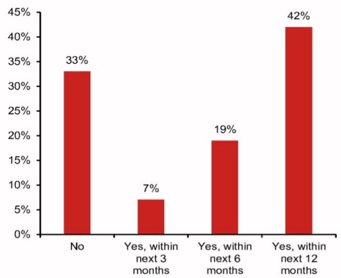

# NOM：全球市场正在为一场“滞胀式供给冲击”重新定价，但真正的分歧在于谁有资格加息

2026年6月，NOM在新加坡举办了年度旗舰亚洲投资论坛。在为期四天的会议中，全球首席经济学家团队给出了一个高度一致的判断：当前全球经济正处于一场“供给冲击复合体”之中，其结构性影响远超市场定价所反映的程度。这份研报的核心价值不在于预测了某个具体利率路径，而在于它提供了一套区分“谁在真正面临通胀压力”与“谁只是在承受增长放缓”的分析框架。

市场目前最大的误判，是认为所有经济体的通胀压力是同质的。NOM经济学家们明确指出：当前的通胀并非需求过热驱动，而是由能源、芯片和食品三重供给冲击叠加而成。这意味着，传统“通胀高则加息”的简单逻辑已经失效。真正值得关注的问题是：哪些经济体有资格、有能力、有必要加息？哪些经济体应当忍受通胀、优先保增长？

以下是我们从这份研报中提炼出的五个关键洞察。

## 1. 供给冲击的广度被严重低估，全球供应链压力指数已回到疫情外历史最高

NOM全球首席经济学家Rob Subbaraman在论坛上指出，即使霍尔木兹海峡很快重新开放，全球供给侧的中断惯性仍将显著存在。纽约联储的全球供应链压力指数（GSCPI）目前已经攀升至1998年以来的最高水平——如果不算疫情期间的极端值。历史经验表明，2021年12月GSCPI见顶后，美国CPI通胀在六个月后才达到峰值。

这意味着什么？当前这轮供给冲击的传导尚未完全反映在终端价格中。市场对通胀“见顶回落”的乐观预期，可能忽视了供应链压力向消费端传导的滞后性。更关键的是，NOM强调这并非单一的油价冲击，而是一个“能源-芯片-食品”三重价格冲击的组合。芯片价格飙升正在通过AI基础设施投资传导至软件和服务价格，而食品价格冲击则与地缘政治和气候因素叠加。

这一判断对资产定价的含义是：债券市场可能低估了通胀持续性的尾部风险。NOM展示了从2021年12月到2026年5月的四个时间点的主权债券收益率曲线快照，清晰地呈现出收益率上升和曲线陡峭化的趋势。该机构认为，这反映了三个结构性变化：通胀上升与央行独立性侵蚀、持续的大规模财政赤字与公共债务比率上升、以及巨型科技公司也开始发债时面临的巨量政府债券供给。

## 2. 美国拥有“加息特权”，但美联储实际可能按兵不动——AI繁荣创造了一种新的通胀粘性

美国首席经济学家David Seif的论述揭示了美国经济的特殊性。美国正以高于趋势的速度增长，且增速快于其他发达经济体。AI基础设施投资正将美国GDP增速拉高整整一个百分点。美国在AI投资中占据了“狮子的份额”，而伊朗战争对美国的负面影响小于大多数发达经济体，因为北美拥有独立的天然气市场且美国是石油净出口国。

但通胀问题并不简单。NOM指出，美国核心通胀上升的一个新来源是“软件商品”，这与AI资本支出繁荣直接相关。更值得注意的是，美联储主席Warsh偏好的“截尾均值PCE”指标在历史上对通胀趋势变化的反应滞后于核心PCE。而Warsh本人比大多数FOMC成员更偏鸽派，这可能限制他对货币政策的掌控力。

NOM的最终判断是：美联储至少到2027年底都将维持利率不变，加息和降息的概率大致相等。这个看似平淡的结论背后，是一个重要的结构性叙事——美国经济已经形成了“AI繁荣支撑增长、供给冲击维持通胀、但政策制定者不愿收紧”的微妙平衡。对于投资者而言，这意味着美国利率的“长期高位”可能比市场预期的更持久，而AI相关资产的定价逻辑需要纳入更高的利率贴现因子。

## 3. 欧元区的“滞胀”比2022年更危险，但央行只能选择“有限收紧”

NOM欧洲首席经济学家George Buckley的论述可能是这份研报中最具警示性的部分。自伊朗战争爆发以来，欧元区是共识预期被“滞胀式下修”幅度最大的发达经济体——增长预期更弱，通胀预期更强。但关键区别在于，当前的政策环境与2022年截然不同：货币和财政政策现在更紧（德国的财政扩张被其他地方的紧缩所抵消）、劳动力市场更宽松、经济闲置产能更多、通胀在伊朗战争前表现得比俄乌冲突前更温和。

这组条件意味着，欧洲央行只能采取“有限收紧”——即对通胀进行适度的货币政策再校准，而不是全面的加息周期。NOM预计，在当前油价每桶95美元的水平下，今年欧洲央行将加息两次、英国央行加息一次，而英国央行将在2027年下半年通过降息完全回吐这次加息。

NOM在场内进行的观众投票进一步印证了这一判断：近70%的受访者认为，欧洲央行更应该担忧伊朗战争对增长的负面影响，而非通胀上行风险。这组数据传递了一个清晰信号：市场参与者已经接受了“滞胀优先保增长”的思维框架。对于欧元区资产而言，这意味着利率峰值将低于市场此前定价，但增长前景的持续疲软将压制风险资产的表现。

## 4. 日本是唯一一个真正需要“正常化加息”的发达经济体——但市场仍认为它会落后于曲线

NOM日本首席经济学家Kyohei Morita的论述在整份报告中显得尤为独特。他假设中东紧张局势不会持续到2026年下半年、霍尔木兹海峡逐步重新开放，在此前提下，日本经济在二季度收缩后将重回复苏轨道。中东局势引发的上游通胀将以约六个月的滞后传导至CPI，核心CPI预计在2027年一季度达到3.6%的峰值。

但真正支撑日本加息逻辑的是劳动力市场结构变化。2026年春季工资谈判（春斗）正在确认工资上涨变得更加协调和可持续。加上企业通过节省劳动力的投资来降低劳动依赖度，工资上涨的可持续性进一步增强。NOM预计，在日本央行将政策利率上调至1.5%（中性利率估计区间内）的过程中，2026年6月和12月、2027年6月将各加息一次。

然而，观众投票结果显示，69%的受访者预期日本央行将落后于曲线——虽然这一比例低于美联储（79%），但仍占绝对多数。这形成了一个有趣的张力：NOM的经济学家认为日本有充分理由加息，但市场参与者普遍认为央行行动会滞后。这种分歧本身就意味着，如果日本央行确实按NOM预测的步伐行动，日元和日本国债收益率将面临显著的上行重估。

## 5. 中国的AI繁荣无法治愈房地产崩盘，两种“K型分化”正在相互强化

NOM中国首席经济学家陆挺的论述可能是整份报告中最具深度的结构性分析。他明确指出，中国的AI繁荣确实在通过固定资产投资支撑经济——AI相关资本支出在2026年对GDP增速的贡献约为0.3个百分点。但这一正面影响不应被夸大。中国仍严重依赖先进芯片进口来运行AI模型和数据中心，部分AI投资将漏出到其他经济体，而飙升的芯片价格正在恶化中国的贸易条件、抑制净出口。

更关键的是，陆挺揭示了两种相互交织的“K型分化”。第一种是收入与财富层面的K型：房地产崩盘以来，1400万农民工失去了建筑行业工作；低线城市房价跌幅远大于大城市，而这些低收入农民工往往在老家低线城市购房，因此房地产崩盘反而加剧了收入和财富不平等。AI繁荣则进一步将社会撕裂为两个阶层：受益于AI的人才、受保护的岗位和财富拥有者，与被AI部分或完全替代的人群。

第二种是地理层面的K型：2000-2021年的房地产繁荣是广泛的财富创造器，而AI超级周期是一个集中化事件。成功进入AI新时代的门槛是巨大的算力密度、数据池和顶尖人才，这些高度集中在少数现有的一线城市。少数“智慧城市”攫取了AI发展的绝大部分收益，甚至从全国其他地方虹吸资源。

这两种K型正在相互强化。当顶尖人才和金融资源流向一线智慧城市时，被替代的工人往往被挤出这些城市，被迫进入零工经济或低端服务业，压低了传统城市的工资水平，加剧了服务业通缩。人口快速老龄化、大学教育普及化以及高度不平等的社会福利体系，可能进一步强化这两种K型分化。

陆挺的结论对政策制定者和投资者都至关重要：不能假设新AI经济能治愈主要由房地产崩盘造成的经济困境。北京需要密切关注两种K型分化的上下臂之间的差距，并采取预防措施防止差距过度扩大。尽管AI繁荣在继续，北京可能仍将被迫加大政策力度清理房地产行业的烂摊子，并加速财政改革以支持那些被甩在后面的城市。

## 报告尚未完全回答的关键问题：AI繁荣的“价格发现”机制如何影响央行的反应函数？

NOM这份研报在供给冲击的分析框架上做出了重要贡献，但它留下了一个值得深入探讨的问题：AI基础设施投资本身正在通过“软件商品”推高通胀，而这一渠道的定价机制与传统商品通胀完全不同。软件和算力的价格形成涉及规模效应、网络效应和知识产权定价等复杂因素。如果AI相关通胀确实具有结构性粘性，那么美联储的“平均通胀目标制”框架是否需要重新校准？

此外，NOM提到“中国冲击2.0”正在加剧亚洲和欧洲的价格竞争，但这一判断与AI投资推高通胀之间存在张力。中国低价商品的输出是否会抵消AI投资带来的通胀压力？这两种力量的相对强度将决定全球通胀路径的最终走向。这可能是下一份报告需要回答的问题。

## 顺着这些未解问题继续读完整报告

NOM这份研报的完整版本包含了更多关于亚洲各国（印度、韩国、东盟经济体）的详细分析，以及十一项关于亚洲增长模式重塑的结构性主题。我们已经在知识星球微信群中对这些内容进行了深度拆解和讨论，特别是关于“亚洲北南分化”的投资含义、韩国AI受益与国内经济K型增长的矛盾、以及印度在能源冲击下的财政与货币政策权衡。欢迎来星球微信群里继续讨论这些未解问题，以及如何在当前供给冲击框架下调整你的资产配置思路。

Personal reading notes and learning share only. Not investment advice.

