## metal&ROCK | Europe

# Scenarios for US Copper Tariffs

A decision on US refined copper import tariffs is due sometime in 2H26. Advanced notice of tariff implementation would be the most bullish scenario for 2H26, while ruling out tariffs would be the most bearish, removing the \~2.5% of global copper going to the US for stockpiling.

## Key Takeaways

We expect a decision sometime after 30th June, once President Trump has received an update on domestic markets from the Secretary of Commerce.  
Most bullish = Advanced notice of a 15% tariff from Jan 2027, driving COMEX and LME copper higher and tightening LME spreads. Less notice would be less bullish.  
Most bearish = Refined copper tariffs are ruled out completely, putting the 2.5% of copper supply currently going to the US for stockpiling at risk.  
Status quo = Decision is delayed, with not enough evidence to make a decision for now.

What is the upcoming decision? The US is due to decide whether to put in place a 15% refined copper import tariff from 1 Jan 2027, potentially escalating to 30% in 2028. A 50% import tariff is already in place for aluminium, steel and most imports of semi-finished copper products and copper derivative products. The 1 June White House fact sheet highlighted recent developments in steel, aluminium and copper output in the US, noting "this buildout [...] is only possible through the continued implementation and strengthening of the President's Section 232 tariff programs."

Why does it matter? The COMEX copper price is a US-delivered benchmark and therefore should reflect any customs duties, meaning it could trade \~15% higher than the LME benchmark if tariffs are announced. It is already trading \~6% higher than the LME benchmark, incentivising market participants to ship copper to the US ahead of potential implementation. We estimate YTD over-importing at 260 kt, or 2.6% of global demand when annualised. The US now holds over a year of "normal" refined copper imports in inventory, we estimate. Whether or not this overimporting continues will be meaningful for copper prices and the supply demand balance.

When will the tariff decision be announced? A report is due to President Trump from the Secretary of Commerce by 30th June (based on this proclamation) or 1st July (90 days from this proclamation), providing "an update on domestic copper markets [...] so that the President may determine whether imposing a phased universal import duty on refined copper [...] is warranted to ensure that copper imports do not continue to threaten to impair the national security." In our view, this means an update from the Trump administration should come sometime in 2H26, but is unlikely to come on 30th June/1st July directly.

For discussion of outcomes, see inside...

MS & CO. INTERNATIONAL PLC+

## Amy Gower (Amy Sergeant), CFA

Commodities Strategist

Amy.Gower1@morganstanley.com +44 20 7677-6937

MS & CO. LLC

## Carlos De Alba

Equity Analyst

Carlos.De.Alba@morganstanley.com +1 212 761-4927

MS & CO. INTERNATIONAL PLC+

## Ben Kelson

Research Associate

Ben.Kelson@morganstanley.com +44 20 7677-1392

## Martijn Rats, CFA

Equity Analyst and Commodities Strategist

Martijn.Rats@morganstanley.com +44 20 7425-6618

Exhibit 1: Using forward curve differentials, the copper market is pricing 43% chance of a 15% tariff in place by Jan 2027 and 73% by Dec 2027  
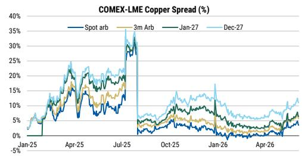

line chart

| Date   | Spot arb | 3m Arb | Jan-27 | Dec-27 |
|--------|----------|--------|--------|--------|
| Jan-25 | ~0%      | ~0%    | ~0%    | ~0%    |
| Apr-25 | ~10%     | ~8%    | ~10%   | ~15%   |
| Jul-25 | ~35%     | ~20%   | ~25%   | ~30%   |
| Oct-25 | ~5%      | ~3%    | ~5%    | ~10%   |
| Jan-26 | ~0%      | ~0%    | ~0%    | ~0%    |
| Apr-26 | ~5%      | ~3%    | ~5%    | ~10%   |

Source: Bloomberg

MS does and seeks to do business with companies covered in MS. As a result, investors should be aware that the firm may have a conflict of interest that could affect the objectivity of MS. Investors should consider MS as only a single factor in making their investment decision.

## For analyst certification and other important disclosures, refer to the Disclosure Section, located at the end of this report.

+= Analysts employed by non-U.S. affiliates are not registered with FINRA, may not be associated persons of the member and may not be subject to FINRA restrictions on communications with a subject company, public appearances and trading securities held by a research analyst account.

## Continued.

## What could the outcomes be and what do they mean for copper prices?

1) Tariffs are announced: Bullish: We assume the decision is purely on whether or not to implement a 15% tariff from 1 Jan 2027, and will not consider another tariff level or a different implementation date. If advanced notice is given, e.g. a July announcement for January implementation, this would accelerate copper flows into the US, tightening ex-US markets and driving both COMEX and LME copper prices higher (all else equal). We would expect LME time spreads to tighten and the forward curve to move into backwardation at the front of the market, and COMEX to move towards a 15% premium to LME. If the tariff is only announced closer to the implementation date, or the implementation date is brought forward, there would be less time to front-load shipments which would be a less bullish outcome.

2) Tariffs are ruled out: Bearish: If the US rules out introducing refined copper tariffs, this extra US importing ( $\sim$ 2.6% of demand) would likely cease, weighing on both benchmarks. COMEX copper would fall to parity with, or even slightly below, LME copper and the LME forward curve would loosen as more metal is available. Both benchmarks would likely fall in absolute terms as this US stockpiling demand ceases. However, we view US copper exports as unlikely given metal could just be moved from COMEX to LME warehouses within the US if COMEX traded below LME. Further, we see support around the 12,000 level given the sector ongoing structural supply issues and expected deficits.

3) Decision is rolled forward: Neutral? The decision could also be rolled over to a future date, keeping the option of tariffs on the table but not necessarily for 1 Jan 2027. This would be more of a continuation of the status quo but could be modestly negative for copper prices if market participants see it as a signal that tariffs are less likely.

What happens in 2027 if a tariff is in place? If a 15% tariff is implemented, we would expect the COMEX-LME copper spread to reflect that tariff level, implying room for some COMEX outperformance versus LME. However, we would expect a drop in the over-importing from the US given the financial incentive to ship excess metal will be removed once tariffs need to be paid. If the tariff is expected to escalate to 30% in 2028, import volumes could stay slightly higher than normal but the US already has >1 year of import cover on our estimates. We would also then expect the COMEX-LME spread to rise to somewhere between 15% and 30%.

MS outlook: We noted in Copper: Fundamentals Improving? that the outlook for copper is supported by tightening supply, strong demand from China and US import demand for stockpiling. The upcoming US tariff decision is therefore key risk event, with the potential to accelerate, or halt, the excess US copper imports. At the moment, the market is pricing around a 43% chance of a 15% tariff being in place by Jan 2027. It is difficult to take a strong call on the decision timing and outcome but it remains a key risk to be aware of. Macro factors matter too, as shown by the negative reaction in copper prices to increased expectations for a Fed rate hike in 2026, with COMEX copper tending to outperform on risk-on days, but underperform on risk-off days. COMEX net long positioning is already at an all-time high.

Exhibit 2: The COMEX-LME spread has been rising  
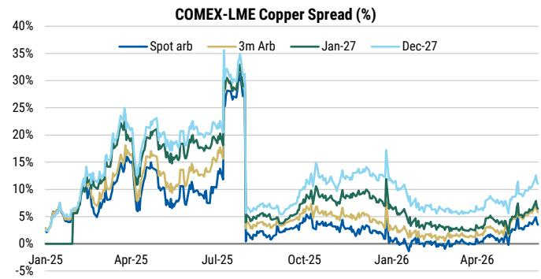

line chart

| Date   | Spot arb | 3m Arb | Jan-27 | Dec-27 |
|--------|----------|--------|--------|--------|
| Jan-25 | ~0%      | ~0%    | ~0%    | ~0%    |
| Apr-25 | ~15%     | ~18%   | ~20%   | ~22%   |
| Jul-25 | ~10%     | ~15%   | ~25%   | ~35%   |
| Oct-25 | ~5%      | ~8%    | ~10%   | ~12%   |
| Jan-26 | ~0%      | ~2%    | ~5%    | ~15%   |
| Apr-26 | ~5%      | ~8%    | ~10%   | ~12%   |

Source: Bloomberg

Exhibit 3: Seaborne copper imports remain above the estimate 15-20kt/week that the US needs  
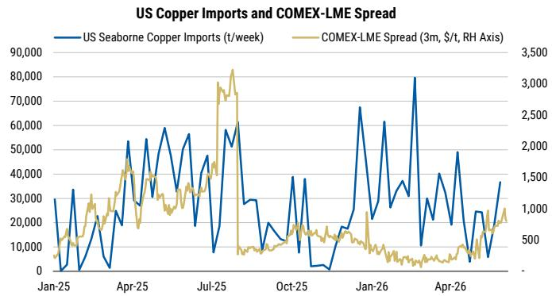

line chart

| Date   | US Seaborne Copper Imports (t/week) | COMEX-LME Spread (3m, $/t, RH Axis) |
|--------|-------------------------------------|--------------------------------------|
| Jan-25 | ~30,000                             | ~500                                 |
| Apr-25 | ~55,000                             | ~1,500                               |
| Jul-25 | ~60,000                             | ~3,000                               |
| Oct-25 | ~35,000                             | ~1,000                               |
| Jan-26 | ~70,000                             | ~500                                 |
| Apr-26 | ~45,000                             | ~1,000                               |

Source: Bloomberg

Exhibit 4: US inventories are now covering >1 year of refined imports  
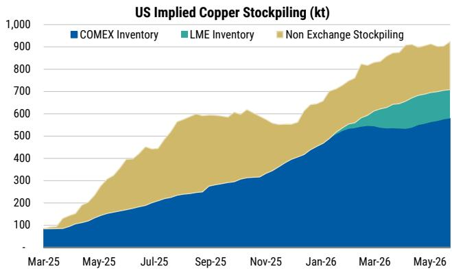

stacked bar chart

US Implied Copper Stockpiling (kt)
| Date | COMEX Inventory (kt) | LME Inventory (kt) | Non Exchange Stockpiling (kt) |
|---|---|---|---|
| Mar-25 | 80 | 0 | 100 |
| May-25 | 120 | 0 | 150 |
| Jul-25 | 180 | 0 | 250 |
| Sep-25 | 240 | 0 | 350 |
| Nov-25 | 300 | 0 | 300 |
| Jan-26 | 400 | 0 | 250 |
| Mar-26 | 550 | 100 | 200 |
| May-26 | 580 | 150 | 180 |

Source: Bloomberg, MS

Exhibit 5: Ex-US LME inventories have been tightening in China and on the LME  
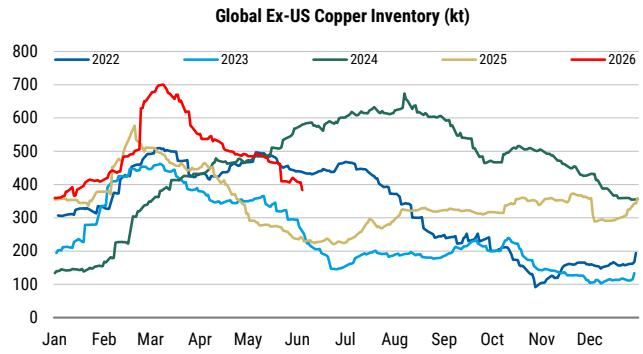

line chart

| Month | 2022 | 2023 | 2024 | 2025 | 2026 |
|-------|------|------|------|------|------|
| Jan   | ~300 | ~200 | ~150 | ~350 | ~350 |
| Feb   | ~350 | ~250 | ~200 | ~400 | ~400 |
| Mar   | ~500 | ~300 | ~350 | ~500 | ~700 |
| Apr   | ~450 | ~350 | ~400 | ~450 | ~500 |
| May   | ~400 | ~300 | ~450 | ~400 | ~450 |
| Jun   | ~350 | ~250 | ~500 | ~350 | ~400 |
| Jul   | ~300 | ~200 | ~550 | ~300 | ~350 |
| Aug   | ~250 | ~150 | ~650 | ~250 | ~300 |
| Sep   | ~200 | ~150 | ~600 | ~250 | ~250 |
| Oct   | ~150 | ~150 | ~550 | ~250 | ~250 |
| Nov   | ~100 | ~150 | ~500 | ~250 | ~250 |
| Dec   | ~150 | ~150 | ~450 | ~350 | ~350 |

Source: Bloomberg

## Week in Review

Base Metals: Base metals are on track to end the week lower with the exception of zinc. Macro factors weighed on the complex with the DXY up 0.9% and the market now pricing in 1 US rate hike by year end after stronger non-farm payrolls data. The biggest drop comes in nickel with Platts reporting that HPAL producers are sourcing sulphur elsewhere. Copper is down 0.4% but LME and COMEX are down 3.3% and 5.3% from their Tuesday highs on growing demand worries. Aluminium fell 1.8%, likely dragged lower by other metals.

Precious Metals: Precious metals weakened sharply this week, with most of the drop on Friday after US employment data boosted rate hike expectations. Gold was trading below its 200 day moving average at the time of writing. India said reports that the RBI was selling gold was incorrect. Silver saw the largest drop, down 8.3% to below \$70/oz for the first time since March but remains below its 200dma for now.

Bulks: Iron ore dropped 3.6% WoW this week to \$101.5/t as hot weather in Asia weighs on construction activity earlier than normal. Met coal was up 1.7% WoW but with stronger price action in China as mine accidents have prompted mine inspections and closures. Thermal coal rose 7.5%, also supported by mine inspections as well as strong demand for cooling in Asia. Indonesia has also issued regulation that palm oil, coal, and ferroalloys can only be exported by a state-owned enterprise.

Exhibit 6: Base metals price indices (12-month rolling)  
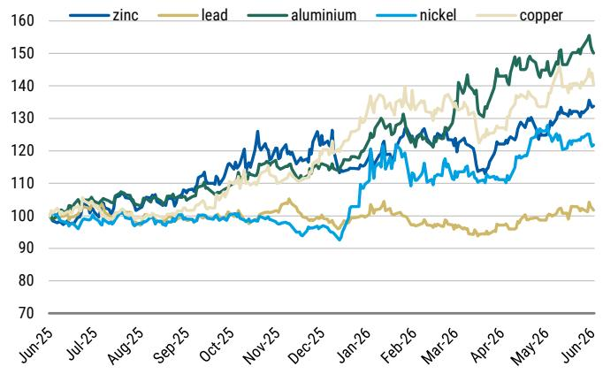

line chart

| Date   | zinc | lead | aluminium | nickel | copper |
|--------|------|------|-----------|--------|--------|
| Jun-25 | 100  | 100  | 100       | 100    | 100    |
| Jul-25 | 105  | 102  | 103       | 98     | 101    |
| Aug-25 | 108  | 104  | 105       | 99     | 103    |
| Sep-25 | 110  | 106  | 107       | 100    | 105    |
| Oct-25 | 115  | 108  | 110       | 102    | 108    |
| Nov-25 | 120  | 110  | 115       | 105    | 112    |
| Dec-25 | 125  | 112  | 120       | 108    | 115    |
| Jan-26 | 130  | 115  | 125       | 110    | 120    |
| Feb-26 | 135  | 118  | 130       | 115    | 125    |
| Mar-26 | 140  | 120  | 135       | 120    | 130    |
| Apr-26 | 145  | 122  | 140       | 125    | 135    |
| May-26 | 150  | 125  | 145       | 130    | 140    |
| Jun-26 | 155  | 128  | 150       | 135    | 145    |

Source: Bloomberg, MS

Exhibit 7: Precious metals indices (12-month rolling)  
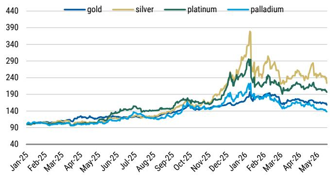

line chart

| Date   | gold | silver | platinum | palladium |
|--------|------|--------|----------|-----------|
| Jan-25 | 90   | 90     | 90       | 90        |
| Feb-25 | 90   | 90     | 90       | 90        |
| Mar-25 | 90   | 90     | 90       | 90        |
| Apr-25 | 90   | 90     | 90       | 90        |
| May-25 | 90   | 90     | 90       | 90        |
| Jun-25 | 90   | 90     | 90       | 90        |
| Jul-25 | 90   | 90     | 90       | 90        |
| Aug-25 | 90   | 90     | 90       | 90        |
| Sep-25 | 90   | 90     | 90       | 90        |
| Oct-25 | 90   | 90     | 90       | 90        |
| Nov-25 | 90   | 90     | 90       | 90        |
| Dec-25 | 90   | 90     | 90       | 90        |
| Jan-26 | 180  | 380    | 300      | 180       |
| Feb-26 | 180  | 380    | 300      | 180       |
| Mar-26 | 180  | 380    | 300      | 180       |
| Apr-26 | 180  | 380    | 300      | 180       |
| May-26 | 180  | 380    | 300      | 180       |

Source: Bloomberg, MS

Exhibit 8: Bulk commodity price indices (12-month rolling)  
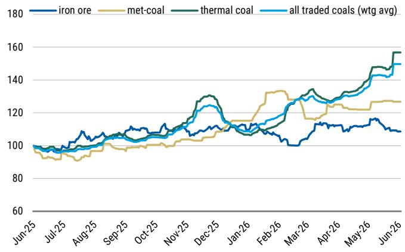

line chart

| Month   | iron ore | met-coal | thermal coal | all traded coals (wtg avg) |
|---------|----------|----------|--------------|-----------------------------|
| Jun-25  | 100      | 95       | 100          | 100                         |
| Jul-25  | 105      | 98       | 102          | 103                         |
| Aug-25  | 108      | 100      | 105          | 106                         |
| Sep-25  | 110      | 102      | 108          | 109                         |
| Oct-25  | 112      | 104      | 110          | 111                         |
| Nov-25  | 115      | 106      | 115          | 116                         |
| Dec-25  | 118      | 108      | 120          | 122                         |
| Jan-26  | 120      | 110      | 125          | 127                         |
| Feb-26  | 125      | 130      | 135          | 132                         |
| Mar-26  | 130      | 125      | 138          | 136                         |
| Apr-26  | 135      | 128      | 140          | 138                         |
| May-26  | 140      | 130      | 145          | 142                         |
| Jun-26  | 145      | 132      | 155          | 150                         |

Source: Platts, Bloomberg, MS

## MS Price Forecasts

Exhibit 9: Summary of MS's commodity price forecasts (set on 8 April 2026)

<table><tr><td>commodity group</td><td>unit</td><td>1Q 26a</td><td>2Q 26e</td><td>3Q 26e</td><td>4Q 26e</td><td>1Q 27e</td><td>2Q 27e</td><td>3Q 27e</td><td>4Q 27e</td><td>2025e</td><td>2026e</td><td>2027e</td><td>2028e</td><td>2029e</td><td>2030e</td><td>2031e</td><td>LT real</td><td>LT nom.</td></tr><tr><td colspan="19">Base Metals</td></tr><tr><td rowspan="2">LME Aluminium</td><td>US$/lb</td><td>1.45</td><td>1.54</td><td>1.56</td><td>1.59</td><td>1.54</td><td>1.47</td><td>1.45</td><td>1.45</td><td>1.20</td><td>1.54</td><td>1.48</td><td>1.43</td><td>1.45</td><td>1.45</td><td>1.36</td><td>1.13</td><td>1.30</td></tr><tr><td>US$/t</td><td>3,195</td><td>3,400</td><td>3,450</td><td>3,500</td><td>3,400</td><td>3,250</td><td>3,200</td><td>3,200</td><td>2,638</td><td>3,386</td><td>3,263</td><td>3,150</td><td>3,200</td><td>3,200</td><td>3,000</td><td>2,500</td><td>2,871</td></tr><tr><td rowspan="2">LME Copper</td><td>US$/lb</td><td>5.81</td><td>5.15</td><td>5.44</td><td>5.90</td><td>5.90</td><td>5.90</td><td>5.22</td><td>5.22</td><td>4.56</td><td>5.58</td><td>5.56</td><td>5.22</td><td>5.22</td><td>5.22</td><td>5.22</td><td>4.40</td><td>5.05</td></tr><tr><td>US$/t</td><td>12,818</td><td>11,350</td><td>12,000</td><td>13,000</td><td>13,000</td><td>13,000</td><td>11,500</td><td>11,500</td><td>10,053</td><td>12,292</td><td>12,250</td><td>11,500</td><td>11,500</td><td>11,500</td><td>11,500</td><td>9,700</td><td>11,141</td></tr><tr><td rowspan="2">COMEX Copper</td><td>US$/lb</td><td>5.83</td><td>5.17</td><td>5.50</td><td>6.01</td><td>6.01</td><td>6.01</td><td>5.32</td><td>5.32</td><td>4.85</td><td>5.63</td><td>5.67</td><td>5.32</td><td>5.32</td><td>5.32</td><td>5.32</td><td>4.49</td><td>5.15</td></tr><tr><td>US$/t</td><td>12,852</td><td>11,407</td><td>12,120</td><td>13,260</td><td>13,260</td><td>13,260</td><td>11,730</td><td>11,730</td><td>10,691</td><td>12,410</td><td>12,495</td><td>11,730</td><td>11,730</td><td>11,730</td><td>11,730</td><td>9,894</td><td>11,364</td></tr><tr><td rowspan="2">LME Nickel</td><td>US$/lb</td><td>7.86</td><td>7.26</td><td>7.71</td><td>7.48</td><td>7.48</td><td>7.48</td><td>7.48</td><td>7.48</td><td>6.94</td><td>7.58</td><td>7.48</td><td>7.48</td><td>7.71</td><td>8.16</td><td>8.16</td><td>7.44</td><td>8.54</td></tr><tr><td>US$/t</td><td>17,325</td><td>16,000</td><td>17,000</td><td>16,500</td><td>16,500</td><td>16,500</td><td>16,500</td><td>16,500</td><td>15,294</td><td>16,706</td><td>16,500</td><td>16,500</td><td>17,000</td><td>18,000</td><td>18,000</td><td>16,400</td><td>18,836</td></tr><tr><td rowspan="2">LME Zinc</td><td>US$/lb</td><td>1.47</td><td>1.29</td><td>1.32</td><td>1.41</td><td>1.36</td><td>1.32</td><td>1.32</td><td>1.32</td><td>1.31</td><td>1.37</td><td>1.33</td><td>1.32</td><td>1.32</td><td>1.36</td><td>1.36</td><td>1.27</td><td>1.46</td></tr><tr><td>US$/t</td><td>3,235</td><td>2,850</td><td>2,900</td><td>3,100</td><td>3,000</td><td>2,900</td><td>2,900</td><td>2,900</td><td>2,879</td><td>3,021</td><td>2,925</td><td>2,900</td><td>2,900</td><td>3,000</td><td>3,000</td><td>2,801</td><td>3,217</td></tr><tr><td rowspan="2">LME Lead</td><td>US$/lb</td><td>0.88</td><td>0.79</td><td>0.82</td><td>0.93</td><td>0.95</td><td>0.95</td><td>0.95</td><td>0.95</td><td>0.90</td><td>0.85</td><td>0.95</td><td>1.00</td><td>1.01</td><td>1.13</td><td>1.13</td><td>1.02</td><td>1.17</td></tr><tr><td>US$/t</td><td>1,930</td><td>1,750</td><td>1,800</td><td>2,050</td><td>2,100</td><td>2,100</td><td>2,100</td><td>2,100</td><td>1,978</td><td>1,883</td><td>2,100</td><td>2,200</td><td>2,238</td><td>2,500</td><td>2,500</td><td>2,250</td><td>2,584</td></tr><tr><td colspan="19">Precious Metals</td></tr><tr><td>Gold</td><td>US$/oz</td><td>4,865</td><td>4,400</td><td>5,200</td><td>5,200</td><td>5,000</td><td>5,000</td><td>5,000</td><td>4,800</td><td>3,469</td><td>4,916</td><td>4,950</td><td>4,500</td><td>4,000</td><td>4,000</td><td>4,000</td><td>2,500</td><td>2,871</td></tr><tr><td>Silver</td><td>US$/oz</td><td>83.7</td><td>62.9</td><td>74.3</td><td>74.3</td><td>71.4</td><td>71.4</td><td>71.4</td><td>68.6</td><td>40.5</td><td>73.8</td><td>70.7</td><td>64.3</td><td>57.1</td><td>57.1</td><td>57.1</td><td>31.3</td><td>35.9</td></tr><tr><td>Platinum</td><td>US$/oz</td><td>2,215</td><td>1,850</td><td>1,950</td><td>1,962</td><td>1,974</td><td>1,987</td><td>1,999</td><td>2,012</td><td>1,291</td><td>1,994</td><td>1,993</td><td>2,043</td><td>2,095</td><td>2,148</td><td>2,202</td><td>1,940</td><td>2,228</td></tr><tr><td>Palladium</td><td>US$/oz</td><td>1,723</td><td>1,400</td><td>1,400</td><td>1,409</td><td>1,418</td><td>1,426</td><td>1,435</td><td>1,444</td><td>1,160</td><td>1,483</td><td>1,431</td><td>1,312</td><td>1,345</td><td>1,379</td><td>1,414</td><td>1,250</td><td>1,436</td></tr><tr><td colspan="19">Bulks</td></tr><tr><td>Iron Ore (fines 61% Fe, cfr N.China)</td><td>US$/t</td><td>104</td><td>105</td><td>98</td><td>95</td><td>95</td><td>95</td><td>95</td><td>100</td><td>102</td><td>100</td><td>96</td><td>98</td><td>100</td><td>100</td><td>100</td><td>90</td><td>103</td></tr><tr><td>Hard Coking Coal (spot, fob Aus)</td><td>US$/t</td><td>235</td><td>225</td><td>240</td><td>225</td><td>225</td><td>225</td><td>225</td><td>230</td><td>188</td><td>231</td><td>226</td><td>214</td><td>215</td><td>215</td><td>215</td><td>191</td><td>219</td></tr><tr><td>Thermal coal (spot, fob Newc)</td><td>US$/t</td><td>123</td><td>170</td><td>160</td><td>150</td><td>140</td><td>140</td><td>140</td><td>130</td><td>107</td><td>151</td><td>138</td><td>125</td><td>130</td><td>135</td><td>135</td><td>120</td><td>138</td></tr><tr><td colspan="19">Other</td></tr><tr><td>Manganese ore (44%)</td><td>US$/mtu</td><td>5.2</td><td>5.6</td><td>5.6</td><td>5.4</td><td>5.4</td><td>5.5</td><td>5.5</td><td>5.5</td><td>4.6</td><td>5.4</td><td>5.5</td><td>5.6</td><td>5.7</td><td>5.8</td><td>5.8</td><td>5.2</td><td>6.0</td></tr><tr><td>Alumina (spot, fob Aus)</td><td>US$/t</td><td>307</td><td>310</td><td>310</td><td>320</td><td>320</td><td>325</td><td>325</td><td>325</td><td>362</td><td>312</td><td>324</td><td>350</td><td>350</td><td>380</td><td>400</td><td>380</td><td>436</td></tr><tr><td>Lithium carbonate (spot China, ex-VAT)</td><td>US$/t</td><td>19,360</td><td>23,500</td><td>25,500</td><td>23,000</td><td>20,000</td><td>20,000</td><td>18,000</td><td>18,000</td><td>9,300</td><td>22,840</td><td>19,000</td><td>16,000</td><td>14,000</td><td>15,000</td><td>16,000</td><td>14,800</td><td>16,998</td></tr><tr><td>Cobalt</td><td>US$/lb</td><td>25.9</td><td>27.0</td><td>27.0</td><td>27.0</td><td>27.0</td><td>27.0</td><td>27.0</td><td>27.0</td><td>17.5</td><td>26.7</td><td>27.0</td><td>17.5</td><td>15.0</td><td>15.0</td><td>17.5</td><td>14.0</td><td>16.1</td></tr><tr><td>Uranium - spot</td><td>US$/lb</td><td>88.5</td><td>90.0</td><td>95.0</td><td>100.0</td><td>105.0</td><td>100.0</td><td>90.0</td><td>80.0</td><td>73.5</td><td>93.4</td><td>93.8</td><td>70.0</td><td>70.0</td><td>70.0</td><td>70.0</td><td>61.0</td><td>70.1</td></tr><tr><td colspan="19">Exchange Rates</td></tr><tr><td>1 AUD = USD</td><td></td><td>0.70</td><td>0.70</td><td>0.70</td><td>0.70</td><td>0.70</td><td>0.70</td><td>0.70</td><td>0.70</td><td>0.65</td><td>0.70</td><td>0.70</td><td>0.70</td><td>0.70</td><td>0.69</td><td>0.69</td><td>0.71</td><td>0.70</td></tr><tr><td>1 USD = BRL</td><td></td><td>5.26</td><td>5.40</td><td>5.50</td><td>5.20</td><td>5.20</td><td>5.20</td><td>5.30</td><td>5.30</td><td>5.72</td><td>5.34</td><td>5.25</td><td>5.30</td><td>5.87</td><td>5.98</td><td>6.08</td><td>5.65</td><td>6.71</td></tr><tr><td>1 USD = CAD</td><td></td><td>1.37</td><td>1.37</td><td>1.36</td><td>1.36</td><td>1.36</td><td>1.36</td><td>1.36</td><td>1.37</td><td>1.40</td><td>1.37</td><td>1.36</td><td>1.28</td><td>1.28</td><td>1.28</td><td>1.28</td><td>1.29</td><td>1.29</td></tr><tr><td>1 USD = ZAR</td><td></td><td>16.34</td><td>17.00</td><td>16.50</td><td>16.62</td><td>16.75</td><td>16.87</td><td>17.00</td><td>17.13</td><td>17.82</td><td>16.62</td><td>16.94</td><td>17.45</td><td>17.98</td><td>18.53</td><td>19.09</td><td>17.00</td><td>22.21</td></tr><tr><td>1 EUR = USD</td><td></td><td>1.17</td><td>1.17</td><td>1.17</td><td>1.18</td><td>1.18</td><td>1.18</td><td>1.18</td><td>1.19</td><td>1.14</td><td>1.17</td><td>1.18</td><td>1.19</td><td>1.20</td><td>1.21</td><td>1.23</td><td>1.27</td><td>1.23</td></tr><tr><td>1 USD = CNY</td><td></td><td>6.93</td><td>6.95</td><td>7.00</td><td>7.05</td><td>7.03</td><td>7.00</td><td>6.98</td><td>6.95</td><td>7.18</td><td>6.98</td><td>6.99</td><td>7.15</td><td>7.12</td><td>7.01</td><td>6.89</td><td>7.90</td><td>6.95</td></tr></table>

Source: LME, Bloomberg, Platts, MS estimates (e). Note: Exchange rate forecasts are the assumptions that are compiled and used by Global Resources Equity Team: all prices are nominal, unless otherwise indicated.

## Commodity Thermometer

Exhibit 10: Metals & Mining Commodity Thermometer

<table><tr><td>Commodity</td><td>Bearish</td><td>Neutral</td><td>Bullish</td><td>Thesis</td></tr><tr><td>Lithium carbonate</td><td></td><td></td><td></td><td>Zimbabwe export ban drives meaningful near-term tightness while continued strength in ESS deployment and an accelerated rotation to energy-transition sectors post conflict should support lithium demand.</td></tr><tr><td>Thermal coal</td><td></td><td></td><td></td><td>Thermal coal has rallied on energy market tightness, and we see further upside in higher-CV grades, as gas-to-coal switching in North Asia lifts power sector demand into summer. More limited gains for low-CV grades on Indonesian spare capacity.</td></tr><tr><td>Uranium</td><td></td><td></td><td></td><td>Energy market tightness is driving uranium upside, with rising term prices and contracting activity, improving nuclear sentiment and limited mine supply growth supporting the market.</td></tr><tr><td>Gold</td><td></td><td></td><td></td><td>Gold&#x27;s liquidity has contributed to recent weakness, but with Fed rate cuts viewed as more likely than hikes this year, we see upside for gold through 2H26. Conflict resolution would likely also be supportive.</td></tr><tr><td>Aluminium</td><td></td><td></td><td></td><td>The market is continuing to tighten as Middle East production cuts drive meaningful, long-lasting supply disruption. With capacity constrained elsewhere and demand holding up, we see further upside for aluminium through 2026.</td></tr><tr><td>Platinum</td><td></td><td></td><td></td><td>Platinum is likely to continue tracking gold with a modest underlying deficit providing support, though downside risks to auto and jewellery demand may limit further upside.</td></tr><tr><td>Cobalt</td><td></td><td></td><td></td><td>Cobalt remains supported by DRC export restrictions, while potential impacts on Indonesian supply from sulphur shortages add modest upside.</td></tr><tr><td>Palladium</td><td></td><td></td><td></td><td>Palladium is moving towards balance as supply constraints are offset by weakening autos demand.</td></tr><tr><td>Hard Coking Coal</td><td></td><td></td><td></td><td>Met coal is likely to remain range bound in 2026, with cost-driven support from higher fuel and freight prices offset by weaker Chinese seaborne demand and growing supply.</td></tr><tr><td>Silver</td><td></td><td></td><td></td><td>Silver is likely to remain volatile in 2026, with industrial demand risks and ETF selling combined with tight inventories and resilient Chinese demand.</td></tr><tr><td>COMEX Copper</td><td></td><td></td><td></td><td>COMEX copper remains resilient on continued US stockpiling demand, while a supportive tariff decision in July may provide further upside.</td></tr><tr><td>Nickel</td><td></td><td></td><td></td><td>Policy uncertainty in Indonesia and forecast surpluses cap potential upside from sulphur-related supply disruptions and potential for stronger-than-expected demand from energy-transition sectors post conflict.</td></tr><tr><td>Alumina</td><td></td><td></td><td></td><td>Alumina faces pressure from reduced smelting demand and rising seaborne supply, though Guinea export restrictions could limit downside.</td></tr><tr><td>Manganese Ore</td><td></td><td></td><td></td><td>Manganese ore is seeing cost support from higher freight and diesel prices, however weakening fundamentals add downward pressure and limit upside.</td></tr><tr><td>LME Copper</td><td></td><td></td><td></td><td>Copper faces near-term growth risks related to an ongoing Middle East conflict, but with Chinese demand seen to be improving and growing focus on strategic stockpiling, structural drivers remain supportive of a rebound in the medium term.</td></tr><tr><td>Lead</td><td></td><td></td><td></td><td>Lead remains structurally challenged as ICE vehicle demand declines, though battery replacement and ESS provide some support.</td></tr><tr><td>Iron Ore</td><td></td><td></td><td></td><td>Iron ore is shifting to oversupply on stronger seaborne supply and softer Chinese demand, though cost curve pressures and Chinese import restrictions are likely to provide short-term support.</td></tr><tr><td>Zinc</td><td></td><td></td><td></td><td>Zinc fundamentals are softening as refined supply recovers, tipping the market into a surplus this year and weighing on prices.</td></tr></table>

Source: MS. Note: Order of preference based on 2Q/3Q26 forecasts vs last two weeks' average prices ending 6 April 2026.

Recent Reports

<table><tr><td>metal&amp;ROCK: Copper: Fundamentals Improving?</td><td>29-May-2026</td></tr><tr><td>metal&amp;ROCK: Nickel: Supply Down, Costs Up</td><td>22-May-2026</td></tr><tr><td>Commodity Matters: Tighter Copper Scrap Market in China?</td><td>14-May-2026</td></tr><tr><td>metal&amp;ROCK: Why Is Aluminium Not Higher?</td><td>08-May-2026</td></tr><tr><td>metal&amp;ROCK: Moving Parts in Metals Markets</td><td>27-Apr-2026</td></tr><tr><td>metal&amp;ROCK: Gold: Safe Haven or Risk Asset?</td><td>17-Apr-2026</td></tr><tr><td>Commodity Matters: China Bans Sulphuric Acid Exports</td><td>10-Apr-2026</td></tr><tr><td>Commodity Matters: Stockpiling, Scarcity and Safe Havens</td><td>08-Apr-2026</td></tr><tr><td>The Price Deck – 2Q26: Two-Way Risks</td><td>08-Apr-2026</td></tr><tr><td>Commodity Matters: Aluminium Tightening Further</td><td>01-Apr-2026</td></tr><tr><td>metal&amp;ROCK: Growth Worries Accelerate</td><td>23-Mar-2026</td></tr><tr><td>metal&amp;ROCK: Scenarios for Gold</td><td>16-Mar-2026</td></tr><tr><td>Commodity Matters: Aluminium Disruptions Adding Up</td><td>16-Mar-2026</td></tr><tr><td>metal&amp;ROCK: Middle East: Sulphur Squeeze</td><td>09-Mar-2026</td></tr><tr><td>Commodity Matters: Middle East Metals Exposure</td><td>04-Mar-2026</td></tr><tr><td>metal&amp;ROCK: Aluminium: Power is King</td><td>02-Mar-2026</td></tr><tr><td>Commodity Matters: Copper: What to Watch Post CNY</td><td>19-Feb-2026</td></tr><tr><td>metal&amp;ROCK: Lithium Overdone?</td><td>17-Feb-2026</td></tr><tr><td>US Reportedly Considers Tariff Reduction on Some Steel &amp; Aluminium Goods</td><td>13-Feb-2026</td></tr><tr><td>Thermal Coal: Upside Risk from Indonesia Output Cuts</td><td>09-Feb-2026</td></tr><tr><td>Copper: Stockpiling, Supply and Substitution</td><td>06-Feb-2026</td></tr><tr><td>Iron Ore: Solid As A Rock?</td><td>02-Feb-2026</td></tr><tr><td>Gold: Bull Case in Play</td><td>23-Jan-2026</td></tr></table>

Exhibit 11: Spot commodity prices vs. the marginal cost of production  
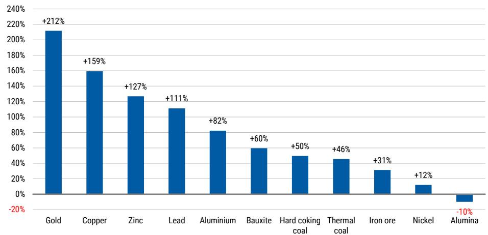

bar chart

| Commodity | Change (%) |
| :--- | :--- |
| Gold | +212 |
| Copper | +159 |
| Zinc | +127 |
| Lead | +111 |
| Aluminium | +82 |
| Bauxite | +60 |
| Hard coking coal | +50 |
| Thermal coal | +46 |
| Iron ore | +31 |
| Nickel | +12 |
| Alumina | -10 |

Source: Wood Mackenzie, Bloomberg, MS. Note: Marginal cost (year 2024); dataset Q1 2026; C1 cash costs.

## Commodity Price Snapshot

Exhibit 12: Key metals: one-week absolute performance  
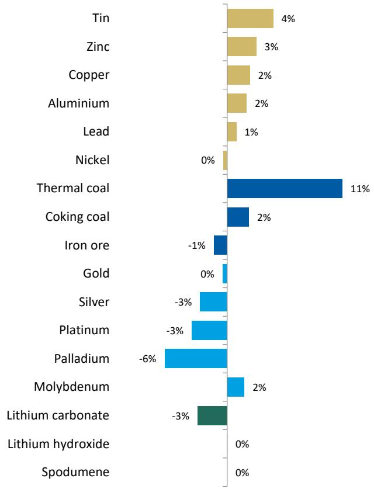

bar chart

| Category | Value (%) |
|---|---|
| Tin | 4 |
| Zinc | 3 |
| Copper | 2 |
| Aluminium | 2 |
| Lead | 1 |
| Nickel | 0 |
| Thermal coal | 11 |
| Coking coal | 2 |
| Iron ore | -1 |
| Gold | 0 |
| Silver | -3 |
| Platinum | -3 |
| Palladium | -6 |
| Molybdenum | 2 |
| Lithium carbonate | -3 |
| Lithium hydroxide | 0 |
| Spodumene | 0 |

Source: Bloomberg, MS

Exhibit 13: Key metals: YTD absolute performance  
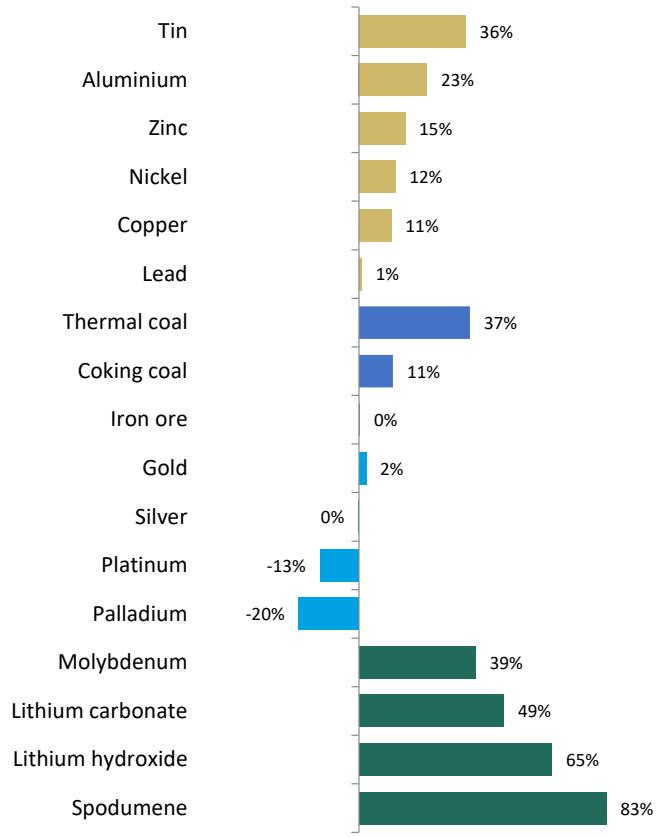

bar chart

| Category | Value (%) |
|---|---|
| Tin | 36 |
| Aluminium | 23 |
| Zinc | 15 |
| Nickel | 12 |
| Copper | 11 |
| Lead | 1 |
| Thermal coal | 37 |
| Coking coal | 11 |
| Iron ore | 0 |
| Gold | 2 |
| Silver | 0 |
| Platinum | -13 |
| Palladium | -20 |
| Molybdenum | 39 |
| Lithium carbonate | 49 |
| Lithium hydroxide | 65 |
| Spodumene | 83 |

Source: Bloomberg, MS

Exhibit 14: Precious Metals: Price Snapshot

<table><tr><td>Precious</td><td>04-Jun-26</td><td>28-May-26</td><td>WoW Change (%)</td><td>02-Jan-26</td><td>YtD (%)</td></tr><tr><td>Gold</td><td>4,475</td><td>4,495</td><td>-0.5%</td><td>4332.29</td><td>3.3%</td></tr><tr><td>Silver</td><td>74</td><td>76</td><td>-2.3%</td><td>72.8181</td><td>1.5%</td></tr><tr><td>Platinum</td><td>1,898</td><td>1,923</td><td>-1.3%</td><td>2142.88</td><td>-11.4%</td></tr><tr><td>Palladium</td><td>1,311</td><td>1,374</td><td>-4.6%</td><td>1636.36</td><td>-19.9%</td></tr></table>

Source: Bloomberg, MS; WoW = Week on week

Exhibit 15: Bulks: price snapshot

<table><tr><td>Bulks</td><td>04-Jun-26</td><td>28-May-26</td><td>WoW Change (%)</td></tr><tr><td>Iron ore</td><td>101</td><td>105</td><td>-3.5%</td></tr><tr><td>Thermal coal</td><td>147</td><td>138</td><td>6.9%</td></tr><tr><td>Coking coal</td><td>249</td><td>243</td><td>2.5%</td></tr></table>

Source: Bloomberg, MS; WoW = Week on week

Exhibit 16: Other Metals: price snapshot

<table><tr><td>Other metals</td><td>04-Jun-26</td><td>28-May-26</td><td>WoW Change (%)</td></tr><tr><td>Molybdenum</td><td>31</td><td>30</td><td>1.9%</td></tr><tr><td>Lithium carbonate</td><td>21,187</td><td>21,820</td><td>0</td></tr><tr><td>Lithium hydroxide</td><td>21,124</td><td>21,120</td><td>0</td></tr><tr><td>China Spodumene 6% min CIF</td><td>2,638</td><td>2,659</td><td>-1%</td></tr></table>

Source: Bloomberg, MS; WoW = Week on week

Exhibit 17: Exchange rate snapshot of major metal producing countries

<table><tr><td>Currency</td><td>03-Jun-26</td><td>27-May-26</td><td>WoW Change (%)</td></tr><tr><td>1 AUD = USD (Australian $)</td><td>0.7</td><td>0.7</td><td>0%</td></tr><tr><td>1 EUR = USD (Euro)</td><td>1.2</td><td>1.2</td><td>0%</td></tr><tr><td>1 USD = BRL (Brazilian Real)</td><td>5.1</td><td>5.1</td><td>0%</td></tr><tr><td>1 USD = CAD (Canadian $)</td><td>1.4</td><td>1.4</td><td>0%</td></tr><tr><td>1 USD = CLP (Chilean Peso)</td><td>895.7</td><td>894.7</td><td>0%</td></tr><tr><td>1 USD = CNY (Chinese Renmimbi)</td><td>6.8</td><td>6.8</td><td>0.0</td></tr><tr><td>1 USD = KZT (Kazakh Tenge)</td><td>487.6</td><td>479.5</td><td>2%</td></tr><tr><td>1 USD = MXN (Mexican Peso)</td><td>17.3</td><td>17.4</td><td>0%</td></tr><tr><td>1 USD = NOK (Norwegian Krone)</td><td>9.3</td><td>9.3</td><td>0%</td></tr><tr><td>1 USD = PEN (Peruvian New Sol)</td><td>3.4</td><td>3.4</td><td>0%</td></tr><tr><td>1 USD = SEK (Swedish Krona)</td><td>9.4</td><td>9.3</td><td>1%</td></tr><tr><td>1 USD = ZAR (S. African Rand)</td><td>16.4</td><td>16.4</td><td>0%</td></tr><tr><td>1 USD = ZMW (Zambian Kwacha)</td><td>17.8</td><td>18.6</td><td>-4%</td></tr></table>

Source: Bloomberg, MS; WoW = Week on week

## China's Macro Indicators

Exhibit 18: China's Electricity Output & Consumption  
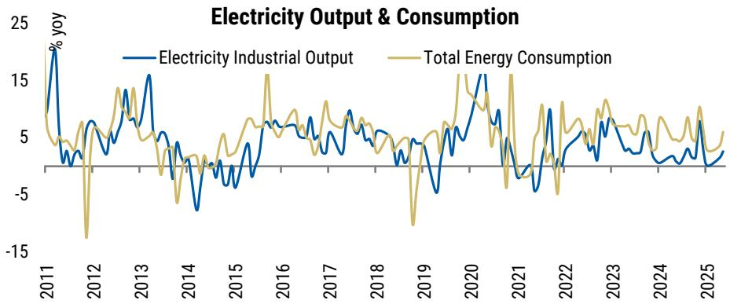

line chart

| Year | Electricity Industrial Output | Total Energy Consumption |
|------|-------------------------------|--------------------------|
| 2011 | ~20% yoy                      | ~5% yoy                  |
| 2012 | ~-5%                          | ~-15%                   |
| 2013 | ~15%                          | ~10%                    |
| 2014 | ~-5%                          | ~-5%                    |
| 2015 | ~-5%                          | ~5%                      |
| 2016 | ~5%                           | ~15%                    |
| 2017 | ~5%                           | ~5%                      |
| 2018 | ~5%                           | ~5%                      |
| 2019 | ~-5%                          | ~-15%                   |
| 2020 | ~15%                          | ~15%                    |
| 2021 | ~-5%                          | ~-5%                    |
| 2022 | ~5%                           | ~5%                      |
| 2023 | ~5%                           | ~5%                      |
| 2024 | ~5%                           | ~5%                      |
| 2025 | ~5%                           | ~5%                      |

Source: CEIC, MS

Exhibit 19: China's Purchasing Managers Index and Industrial Production (IP)  
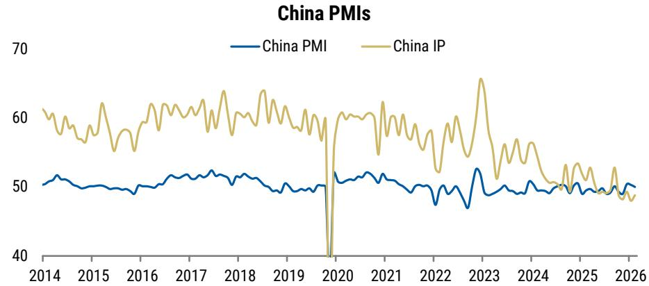

line chart

| Year | China PMI | China IP |
|------|-----------|----------|
| 2014 | ~51       | ~61      |
| 2015 | ~50       | ~58      |
| 2016 | ~49       | ~60      |
| 2017 | ~51       | ~62      |
| 2018 | ~50       | ~63      |
| 2019 | ~49       | ~61      |
| 2020 | ~51       | ~40      |
| 2021 | ~50       | ~60      |
| 2022 | ~48       | ~55      |
| 2023 | ~52       | ~65      |
| 2024 | ~49       | ~55      |
| 2025 | ~49       | ~50      |
| 2026 | ~50       | ~48      |

Source: CEIC, MS

Exhibit 20: China's Money Supply  
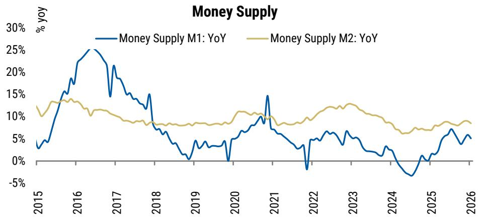

line chart

| Year | Money Supply M1: YoY | Money Supply M2: YoY |
|------|----------------------|----------------------|
| 2015 | ~3%                  | ~10%                 |
| 2016 | ~25%                 | ~12%                 |
| 2017 | ~15%                 | ~10%                 |
| 2018 | ~10%                 | ~8%                  |
| 2019 | ~3%                  | ~8%                  |
| 2020 | ~5%                  | ~9%                  |
| 2021 | ~15%                 | ~10%                 |
| 2022 | ~-3%                 | ~9%                  |
| 2023 | ~5%                  | ~10%                 |
| 2024 | ~-5%                 | ~8%                  |
| 2025 | ~5%                  | ~9%                  |
| 2026 | ~5%                  | ~9%                  |

Source: CEIC, MS

Exhibit 21: China's Output of Industrial Products  
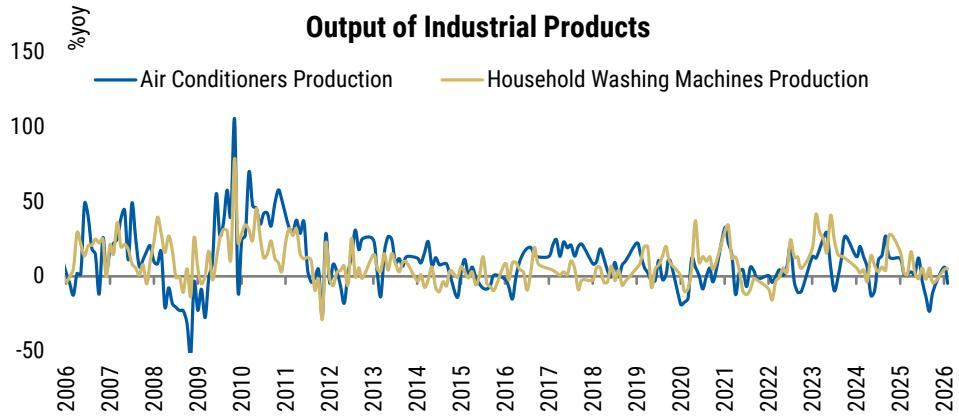

line chart

| Year | Air Conditioners Production | Household Washing Machines Production |
|------|-----------------------------|---------------------------------------|
| 2006 | ~0                          | ~0                                    |
| 2007 | ~40                         | ~20                                   |
| 2008 | ~-20                        | ~30                                   |
| 2009 | ~-50                        | ~-10                                  |
| 2010 | ~100                        | ~70                                   |
| 2011 | ~50                         | ~30                                   |
| 2012 | ~-10                        | ~-30                                  |
| 2013 | ~20                         | ~10                                   |
| 2014 | ~10                         | ~5                                    |
| 2015 | ~5                          | ~0                                    |
| 2016 | ~10                         | ~5                                    |
| 2017 | ~20                         | ~10                                   |
| 2018 | ~10                         | ~5                                    |
| 2019 | ~20                         | ~10                                   |
| 2020 | ~-10                        | ~-5                                   |
| 2021 | ~30                         | ~20                                   |
| 2022 | ~-5                         | ~-10                                  |
| 2023 | ~30                         | ~40                                   |
| 2024 | ~-5                         | ~-10                                  |
| 2025 | ~10                         | ~20                                   |
| 2026 | ~-10                        | ~-5                                   |

Source: CEIC, MS

Exhibit 22: China's Infrastructure Fixed Asset Investments (FAI)  
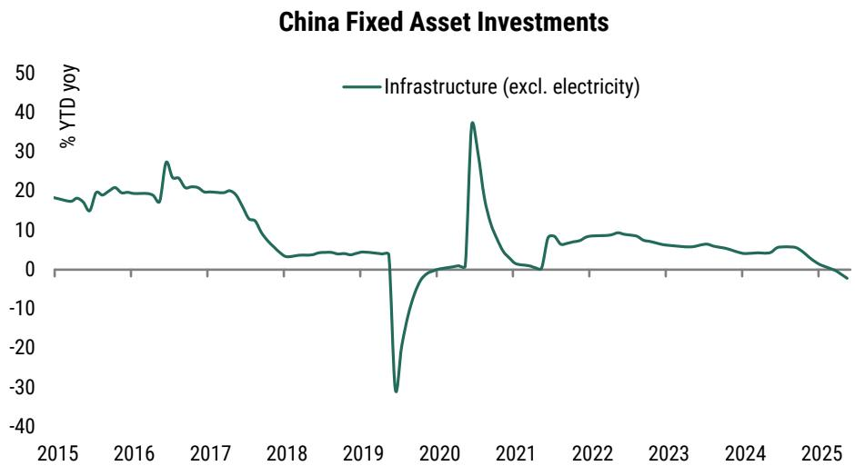

line chart

| Year | Infrastructure (excl. electricity) |
|------|-------------------------------------|
| 2015 | ~18%                                |
| 2016 | ~20%                                |
| 2017 | ~18%                                |
| 2018 | ~3%                                 |
| 2019 | ~4%                                 |
| 2020 | ~-30%                               |
| 2021 | ~35%                                |
| 2022 | ~8%                                 |
| 2023 | ~6%                                 |
| 2024 | ~4%                                 |
| 2025 | ~0%                                 |

Source: CEIC, MS

Exhibit 24: China's Floor Space Started, Sold and Completed  
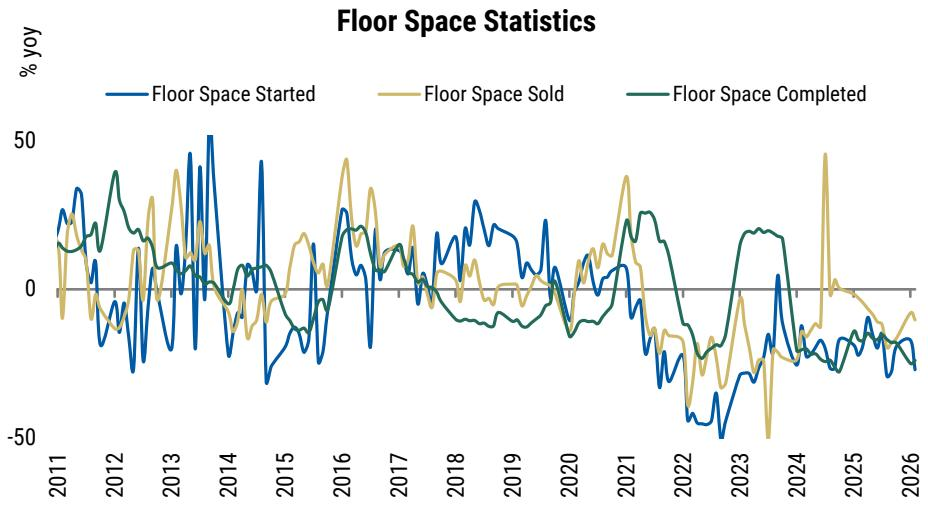

line chart

| Year | Floor Space Started | Floor Space Sold | Floor Space Completed |
|------|---------------------|------------------|-----------------------|
| 2011 | ~20                 | ~-10             | ~15                   |
| 2012 | ~-10                | ~-5              | ~30                   |
| 2013 | ~-20                | ~-10             | ~10                   |
| 2014 | ~50                 | ~-5              | ~5                    |
| 2015 | ~-30                | ~-10             | ~-5                   |
| 2016 | ~20                 | ~40              | ~15                   |
| 2017 | ~-10                | ~-5              | ~-10                  |
| 2018 | ~10                 | ~5               | ~5                    |
| 2019 | ~-5                 | ~-10             | ~-5                   |
| 2020 | ~-10                | ~-5              | ~-10                  |
| 2021 | ~5                  | ~30              | ~20                   |
| 2022 | ~-30                | ~-10             | ~-5                   |
| 2023 | ~-40                | ~-5              | ~-10                  |
| 2024 | ~-20                | ~-10             | ~-5                   |
| 2025 | ~-10                | ~-5              | ~-10                  |
| 2026 | ~-20                | ~-10             | ~-15                  |

Source: CEIC, MS

Exhibit 23: China's Fixed Asset Investments  
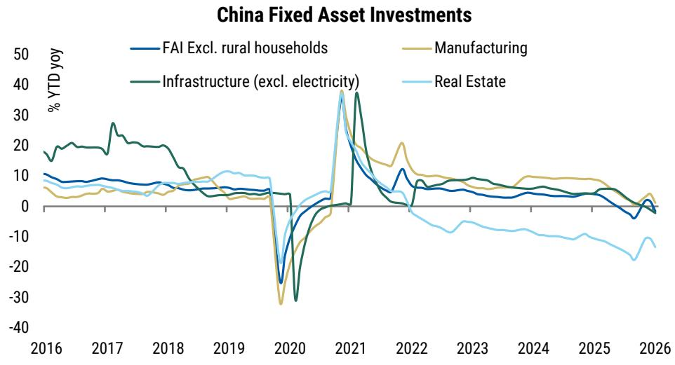

line chart

| Year | FAI Excl. rural households | Infrastructure (excl. electricity) | Manufacturing | Real Estate |
|------|-----------------------------|-------------------------------------|---------------|-------------|
| 2016 | ~10                         | ~18                                 | ~5            | ~8          |
| 2017 | ~8                          | ~25                                 | ~4            | ~6          |
| 2018 | ~7                          | ~15                                 | ~3            | ~5          |
| 2019 | ~6                          | ~5                                  | ~2            | ~10         |
| 2020 | ~-25                        | ~-30                                | ~-30          | ~-20        |
| 2021 | ~20                         | ~35                                 | ~38           | ~35         |
| 2022 | ~10                         | ~5                                  | ~15           | ~-5         |
| 2023 | ~5                          | ~5                                  | ~10           | ~-10        |
| 2024 | ~3                          | ~5                                  | ~10           | ~-15        |
| 2025 | ~2                          | ~3                                  | ~8            | ~-20        |
| 2026 | ~0                          | ~0                                  | ~2            | ~-15        |

Source: CEIC, MS

Exhibit 25: Floor Space of Buildings Newly Started  
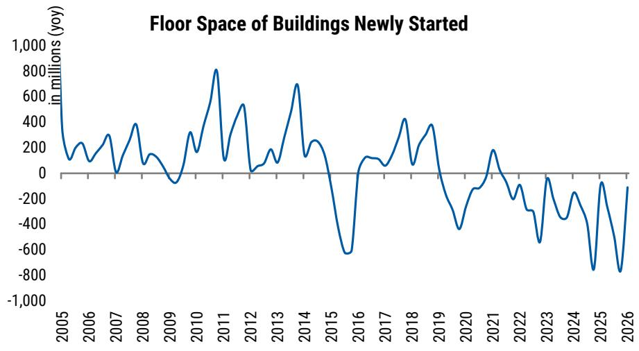

line chart

| Year | Floor Space (in millions yoy) |
| ---- | ----------------------------- |
| 2005 | ~1,000                        |
| 2006 | ~200                          |
| 2007 | ~300                          |
| 2008 | ~400                          |
| 2009 | ~100                          |
| 2010 | ~300                          |
| 2011 | ~800                          |
| 2012 | ~500                          |
| 2013 | ~100                          |
| 2014 | ~700                          |
| 2015 | ~200                          |
| 2016 | ~-600                         |
| 2017 | ~100                          |
| 2018 | ~400                          |
| 2019 | ~300                          |
| 2020 | ~-400                         |
| 2021 | ~200                          |
| 2022 | ~-200                         |
| 2023 | ~-600                         |
| 2024 | ~-300                         |
| 2025 | ~-800                         |
| 2026 | ~-1,000                       |

Source: CEIC, MS

Exhibit 26: China Autos Production  
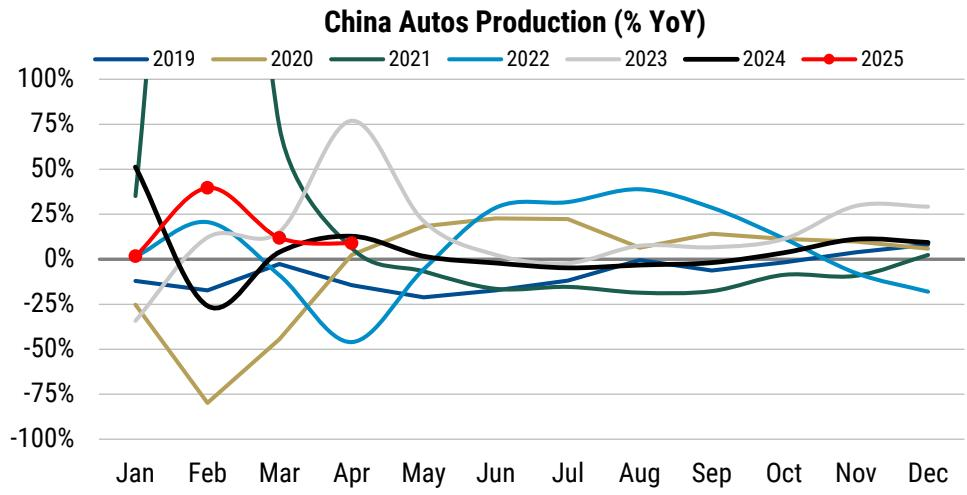

line chart

| Month | 2019   | 2020   | 2021   | 2022   | 2023   | 2024   | 2025   |
|-------|--------|--------|--------|--------|--------|--------|--------|
| Jan   | -10%   | -30%   | 100%   | 50%    | -30%   | 50%    | 0%     |
| Feb   | -15%   | -80%   | -25%   | 20%    | -25%   | -25%   | 40%    |
| Mar   | -5%    | -40%   | 100%   | 0%     | 10%    | 10%    | 10%    |
| Apr   | -10%   | 10%    | -50%   | -50%   | 75%    | 10%    | 10%    |
| May   | -15%   | 15%    | -10%   | 30%    | 30%    | 0%     | 0%     |
| Jun   | -10%   | 20%    | -15%   | 35%    | 35%    | -5%    | 0%     |
| Jul   | -5%    | 25%    | -20%   | 35%    | 35%    | -5%    | 0%     |
| Aug   | 0%     | 20%    | -25%   | 40%    | 40%    | -5%    | 0%     |
| Sep   | -5%    | 15%    | -30%   | 35%    | 35%    | -5%    | 0%     |
| Oct   | -10%   | 10%    | -35%   | 30%    | 30%    | -5%    | 0%     |
| Nov   | -5%    | 15%    | -40%   | 25%    | 25%    | 10%    | 0%     |
| Dec   | 0%     | 10%    | -45%   | -25%   | 25%    | 10%    | 0%     |

Source: CEIC, CAAM

Exhibit 27: China Cumulative Grid Investment  
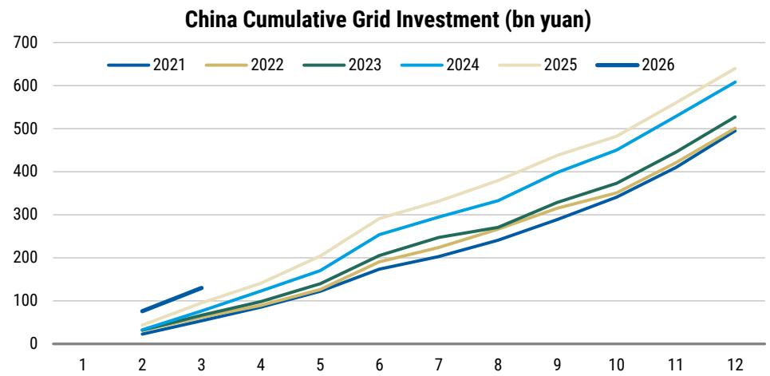

line chart

| Year | Month | Cumulative Investment (bn yuan) |
| --- | --- | --- |
| 2021 | 2 | 30 |
| 2021 | 3 | 80 |
| 2021 | 4 | 100 |
| 2021 | 5 | 130 |
| 2021 | 6 | 170 |
| 2021 | 7 | 200 |
| 2021 | 8 | 240 |
| 2021 | 9 | 330 |
| 2021 | 10 | 450 |
| 2021 | 11 | 500 |
| 2021 | 12 | 500 |
| 2022 |  |  |
| 2022 |  |  |
| 2022 |  |  |
| 2022 |  |  |
| 2022 |  |  |
| 2022 |  |  |
| 2022 |  |  |
| 2023 |  |  |
| 2023 |  |  |
| 2023 |  |  |
| 2023 |  |  |
| 2023 |  |  |
| 2023 |  |  |
| 2023 |  |  |
| 2024 |  |  |
| 2024 |  |  |
| 2024 |  |  |
| 2024 |  |  |
| 2024 |  |  |
| 2024 |  |  |
| 2024 |  |  |
| 2025 |  |  |
| 2025 |  |  |
| 2025 |  |  |
| 2025 |  |  |
| 2025 |  |  |
| 2025 |  |  |
| 2025 |  |  |
| 2026 |  |  |
| 2026 |  |  |
| 2026 |  |  |
| 2026 |  |  |
| 2026 |  |  |
| 2026 |  |  |
| 2026 |  |  |
| 2026 (repeated) | ... (repeated) | ... (repeated) |

Source: Bloomberg

Exhibit 28: China Demand Indicators  
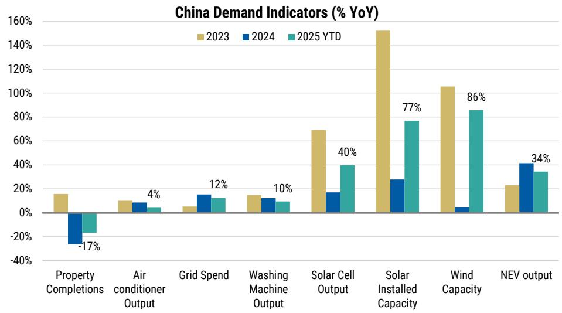

bar chart

China Demand Indicators (% YoY)
| Category | 2023 (%) | 2024 (%) | 2025 YTD (%) |
| :--- | :--- | :--- | :--- |
| Property Completions | 16 | -28 | -17 |
| Air conditioner Output | 10 | 8 | 4 |
| Grid Spend | 4 | 15 | 12 |
| Washing Machine Output | 15 | 12 | 10 |
| Solar Cell Output | 69 | 17 | 40 |
| Solar Installed Capacity | 151 | 27 | 77 |
| Wind Capacity | 105 | 3 | 86 |
| NEV output | 22 | 41 | 34 |

Source: Bloomberg, CEIC

Exhibit 29: China Excavator Sales  
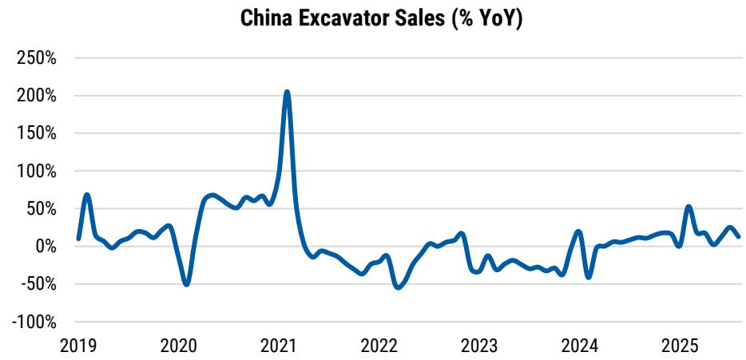

line chart

| Year | China Excavator Sales (% YoY) |
|------|-------------------------------|
| 2019 | ~70%                          |
| 2020 | ~-50%                         |
| 2021 | ~200%                         |
| 2022 | ~-50%                         |
| 2023 | ~0%                           |
| 2024 | ~-50%                         |
| 2025 | ~50%                          |

Source: CEIC

Exhibit 30: China Railway FAI YTD  
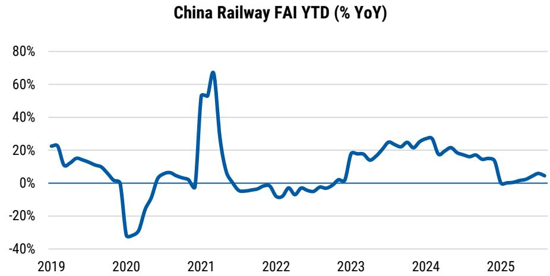

line chart

| Year | YTD % YoY |
|------|-----------|
| 2019 | ~20%      |
| 2020 | ~-30%     |
| 2021 | ~70%      |
| 2022 | ~-5%      |
| 2023 | ~15%      |
| 2024 | ~25%      |
| 2025 | ~5%       |

Source: CEIC

Exhibit 31: China Shipbuilding Output  
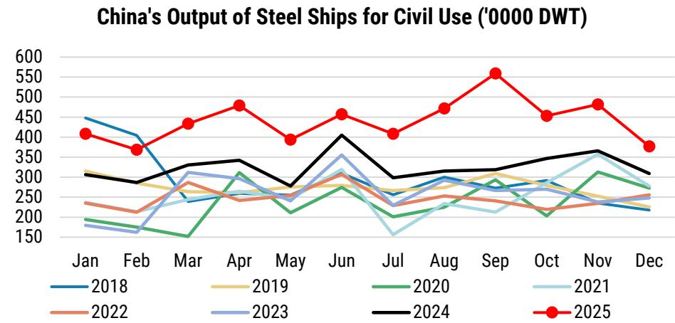

line chart

| Month | 2018 | 2019 | 2020 | 2021 | 2022 | 2023 | 2024 | 2025 |
|-------|------|------|------|------|------|------|------|------|
| Jan   | 450  | 300  | 180  | 300  | 230  | 170  | 300  | 410  |
| Feb   | 400  | 280  | 160  | 280  | 210  | 160  | 280  | 360  |
| Mar   | 250  | 260  | 140  | 260  | 240  | 310  | 320  | 430  |
| Apr   | 260  | 270  | 310  | 270  | 250  | 300  | 340  | 480  |
| May   | 270  | 280  | 210  | 280  | 260  | 250  | 350  | 390  |
| Jun   | 300  | 310  | 270  | 310  | 310  | 350  | 410  | 460  |
| Jul   | 280  | 290  | 190  | 150  | 240  | 230  | 300  | 410  |
| Aug   | 310  | 320  | 240  | 270  | 260  | 290  | 310  | 470  |
| Sep   | 330  | 330  | 280  | 310  | 270  | 350  | 320  | 560  |
| Oct   | 350  | 340  | 260  | 330  | 280  | 360  | 340  | 450  |
| Nov   | 370  | 350  | 310  | 350  | 310  | 370  | 360  | 480  |
| Dec   | 360  | 340  | 270  | 340  | 250  | -    | -    | -    |

Source: NBS

## Aluminium

Exhibit 32: Global Aluminium Inventories  
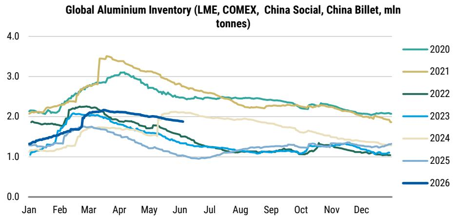

line chart

| Month | 2020 | 2021 | 2022 | 2023 | 2024 | 2025 | 2026 |
|-------|------|------|------|------|------|------|------|
| Jan   | ~2.1 | ~2.1 | ~1.9 | ~1.1 | ~1.1 | ~1.3 | ~1.3 |
| Feb   | ~2.3 | ~2.3 | ~2.0 | ~1.3 | ~1.3 | ~1.5 | ~1.5 |
| Mar   | ~2.8 | ~3.5 | ~2.2 | ~1.7 | ~1.7 | ~1.8 | ~2.0 |
| Apr   | ~3.1 | ~3.4 | ~2.0 | ~1.6 | ~1.8 | ~1.6 | ~2.1 |
| May   | ~2.8 | ~3.0 | ~1.8 | ~1.4 | ~1.9 | ~1.4 | ~2.0 |
| Jun   | ~2.5 | ~2.7 | ~1.6 | ~1.2 | ~2.0 | ~1.2 | ~1.9 |
| Jul   | ~2.4 | ~2.5 | ~1.4 | ~1.1 | ~1.9 | ~1.1 | ~1.8 |
| Aug   | ~2.3 | ~2.4 | ~1.3 | ~1.0 | ~1.8 | ~1.0 | ~1.7 |
| Sep   | ~2.2 | ~2.3 | ~1.2 | ~1.0 | ~1.7 | ~1.0 | ~1.6 |
| Oct   | ~2.1 | ~2.2 | ~1.1 | ~1.0 | ~1.6 | ~1.0 | ~1.5 |
| Nov   | ~2.0 | ~2.1 | ~1.0 | ~1.0 | ~1.5 | ~1.0 | ~1.4 |
| Dec   | ~1.9 | ~2.0 | ~1.0 | ~1.0 | ~1.4 | ~1.0 | ~1.3 |

Source: Bloomberg

Exhibit 33: China Aluminium Inventories  
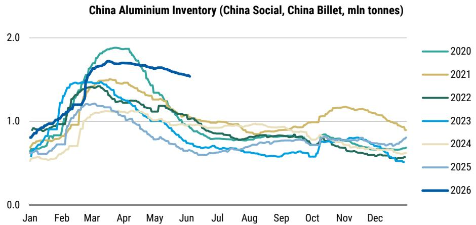

line chart

| Month | 2020 | 2021 | 2022 | 2023 | 2024 | 2025 | 2026 |
|-------|------|------|------|------|------|------|------|
| Jan   | ~0.7 | ~0.7 | ~0.7 | ~0.7 | ~0.6 | ~0.6 | ~0.8 |
| Feb   | ~1.0 | ~1.0 | ~1.0 | ~1.0 | ~0.8 | ~0.8 | ~1.0 |
| Mar   | ~1.8 | ~1.5 | ~1.4 | ~1.5 | ~1.1 | ~1.1 | ~1.7 |
| Apr   | ~1.9 | ~1.4 | ~1.3 | ~1.3 | ~1.0 | ~1.0 | ~1.7 |
| May   | ~1.7 | ~1.3 | ~1.2 | ~1.2 | ~0.9 | ~0.9 | ~1.6 |
| Jun   | ~1.5 | ~1.2 | ~1.1 | ~1.1 | ~0.8 | ~0.8 | ~1.5 |
| Jul   | ~1.3 | ~1.1 | ~1.0 | ~1.0 | ~0.7 | ~0.7 | ~1.4 |
| Aug   | ~1.2 | ~1.0 | ~0.9 | ~0.9 | ~0.6 | ~0.6 | ~1.3 |
| Sep   | ~1.1 | ~0.9 | ~0.8 | ~0.8 | ~0.5 | ~0.5 | ~1.2 |
| Oct   | ~0.9 | ~0.8 | ~0.7 | ~0.7 | ~0.4 | ~0.4 | ~1.1 |
| Nov   | ~0.8 | ~0.7 | ~0.6 | ~0.6 | ~0.3 | ~0.3 | ~1.0 |
| Dec   | ~0.7 | ~0.6 | ~0.5 | ~0.5 | ~0.2 | ~0.2 | ~0.9 |

Source: Bloomberg

Exhibit 34: Indonesia Aluminium Exports  
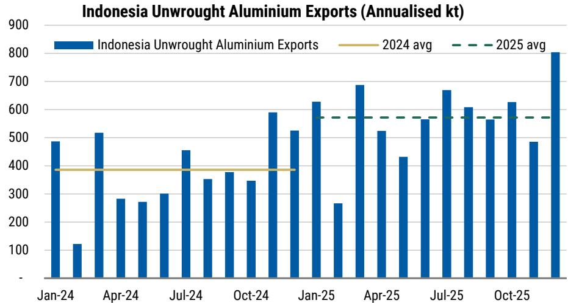

bar chart

| Month   | Indonesia Unwrought Aluminium Exports (kt) |
|---------|-------------------------------------------|
| Jan-24  | 480                                       |
| Feb-24  | 120                                       |
| Mar-24  | 510                                       |
| Apr-24  | 280                                       |
| May-24  | 270                                       |
| Jun-24  | 300                                       |
| Jul-24  | 450                                       |
| Aug-24  | 350                                       |
| Sep-24  | 370                                       |
| Oct-24  | 340                                       |
| Nov-24  | 590                                       |
| Dec-24  | 520                                       |
| Jan-25  | 630                                       |
| Feb-25  | 260                                       |
| Mar-25  | 690                                       |
| Apr-25  | 520                                       |
| May-25  | 430                                       |
| Jun-25  | 560                                       |
| Jul-25  | 670                                       |
| Aug-25  | 610                                       |
| Sep-25  | 560                                       |
| Oct-25  | 630                                       |
| Nov-25  | 480                                       |
| Dec-25  | 800                                       |

Source: Trademap

Exhibit 35: Raw Materials: Spot Alumina vs China Domestic Price  
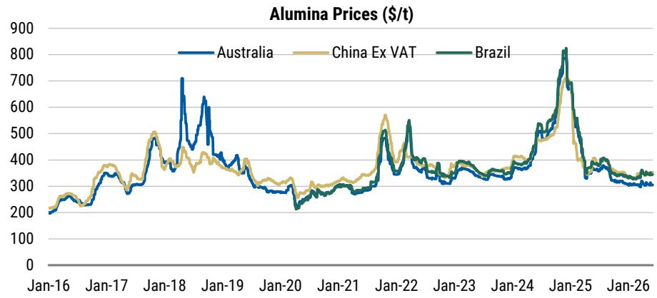

line chart

| Date   | Australia | China Ex VAT | Brazil |
|--------|-----------|--------------|--------|
| Jan-16 | ~200      | ~250         | ~220   |
| Jan-17 | ~350      | ~380         | ~360   |
| Jan-18 | ~700      | ~450         | ~400   |
| Jan-19 | ~650      | ~400         | ~380   |
| Jan-20 | ~300      | ~320         | ~280   |
| Jan-21 | ~350      | ~380         | ~360   |
| Jan-22 | ~550      | ~580         | ~520   |
| Jan-23 | ~350      | ~380         | ~360   |
| Jan-24 | ~400      | ~420         | ~410   |
| Jan-25 | ~800      | ~750         | ~820   |
| Jan-26 | ~300      | ~320         | ~310   |

Source: Platts, Bloomberg

Exhibit 36: Price Differentials: SHFE vs LME  
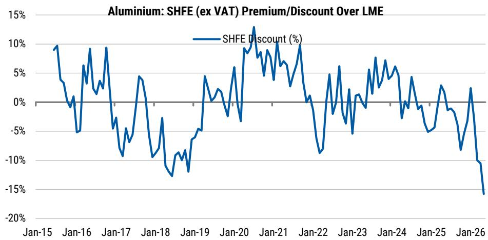

line chart

| Date   | SHFE Discount (%) |
|--------|-------------------|
| Jan-15 | ~10%              |
| Jan-16 | ~-5%              |
| Jan-17 | ~9%               |
| Jan-18 | ~-10%             |
| Jan-19 | ~-5%              |
| Jan-20 | ~10%              |
| Jan-21 | ~13%              |
| Jan-22 | ~-10%             |
| Jan-23 | ~5%               |
| Jan-24 | ~7%               |
| Jan-25 | ~-5%              |
| Jan-26 | ~-15%             |

Source: Bloomberg

Exhibit 37: Physical demand: aluminium premia, by region  
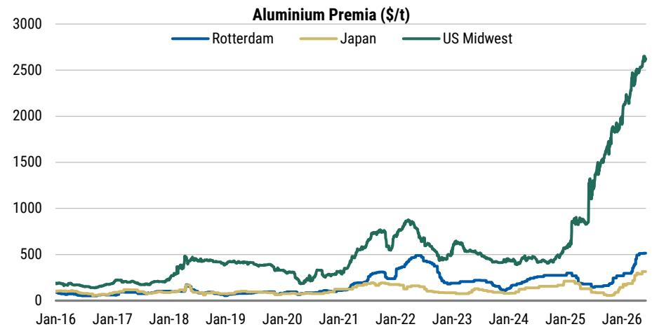

line chart

| Date   | Rotterdam | Japan | US Midwest |
|--------|-----------|-------|------------|
| Jan-16 | ~50       | ~50   | ~150       |
| Jan-17 | ~50       | ~50   | ~150       |
| Jan-18 | ~50       | ~100  | ~400       |
| Jan-19 | ~50       | ~50   | ~350       |
| Jan-20 | ~50       | ~50   | ~300       |
| Jan-21 | ~100      | ~100  | ~400       |
| Jan-22 | ~300      | ~150  | ~800       |
| Jan-23 | ~200      | ~100  | ~400       |
| Jan-24 | ~150      | ~100  | ~450       |
| Jan-25 | ~250      | ~150  | ~800       |
| Jan-26 | ~500      | ~300  | ~2600      |

Source: Platts, Bloomberg

Exhibit 38: IAI Global Aluminium Production  
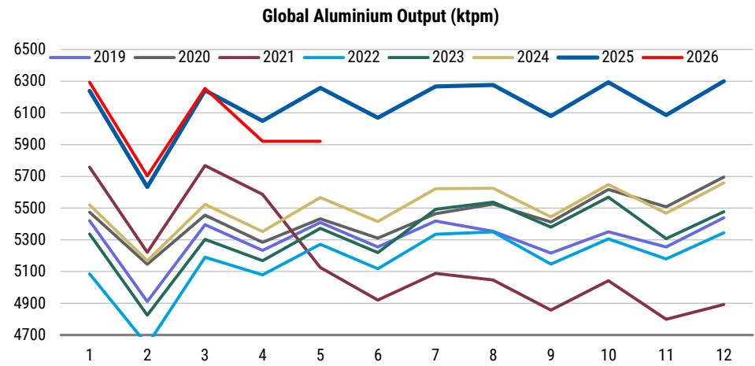

line chart

| Month | 2019  | 2020  | 2021  | 2022  | 2023  | 2024  | 2025  | 2026  |
|-------|-------|-------|-------|-------|-------|-------|-------|-------|
| 1     | 5400  | 5450  | 5750  | 5100  | 5350  | 5500  | 6300  | 6300  |
| 2     | 4900  | 5150  | 5250  | 4700  | 4850  | 5150  | 5700  | 5700  |
| 3     | 5400  | 5450  | 5750  | 5250  | 5350  | 5500  | 6300  | 6300  |
| 4     | 5300  | 5350  | 5650  | 5100  | 5250  | 5350  | 6100  | 5900  |
| 5     | 5400  | 5450  | 5150  | 5300  | 5350  | 5600  | 6300  | 5900  |
| 6     | 5300  | 5350  | 4950  | 5100  | 5250  | 5400  | 6100  | -     |
| 7     | 5400  | 5450  | -     | -     | -     | -     | -     | -     |
| 8     | -     | -     | -     | -     | -     | -     | -     | -     |
| 9     | -     | -     | -     | -     | -     | -     | -     | -     |
| 10    | -     | -     | -     | -     | -     | -     | -     | -     |
| 11    | -     | -     | -     | -     | -     | -     | -     | -     |
| 12    | -     | -     | -     | -     | -     | -     | -     | -     |

Source: IAI

Exhibit 39: China Aluminium Production  
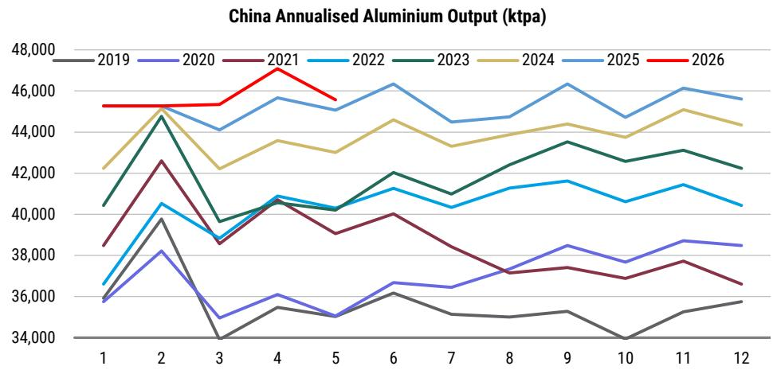

line chart

China Annualised Aluminium Output (ktpa)
| Month | 2019 (ktpa) | 2020 (ktpa) | 2021 (ktpa) | 2022 (ktpa) | 2023 (ktpa) | 2024 (ktpa) | 2025 (ktpa) | 2026 (ktpa) |
|---|---|---|---|---|---|---|---|---|
| 1 | 35,800 | 36,000 | 38,500 | 36,500 | 40,500 | 42,000 | 45,000 | 45,000 |
| 2 | 39,800 | 38,200 | 42,500 | 40,500 | 44,500 | 45,000 | 45,000 | 45,000 |
| 3 | 34,000 | 35,000 | 38,500 | 38,500 | 39,500 | 42,000 | 44,000 | 45,000 |
| 4 | 35,500 | 36,000 | 40,500 | 41,000 | 41,500 | 43,500 | 45,500 | 47,000 |
| 5 | 35,000 | 35,500 | 39,500 | 41,500 | 41,500 | 43,500 | 45,500 | 45,500 |
| 6 | 36,500 | 36,500 | 40,500 | 41,500 | 42,500 | 44,500 | 46,500 | - |
| 7 | 35,500 | 36,500 | 38,500 | 41,500 | 41,500 | 43,500 | 44,500 | - |
| 8 | 35,500 | 37,500 | 37,500 | 41,500 | 42,500 | 43,500 | 44,500 | - |
| 9 | 35,500 | 38,500 | 37,500 | 41,500 | 43,500 | 44,500 | 46,500 | - |
| 10 | 34,500 | 37,500 | 37,500 | 41,500 | 42,500 | 43,500 | 44,500 | - |
| 11 | 35,500 | 38,500 | 37,875 | 41,750 | 43,250 | 44.75 | 46,250 | - |
| 12 | 36,250 | 38,250 | 36,750 | 41,250 | 42,250 | 44,250 | 45.75 | - |

Source: Bloomberg

Exhibit 40: Aluminium C1 Cost Curve vs Spot (\$/t)  
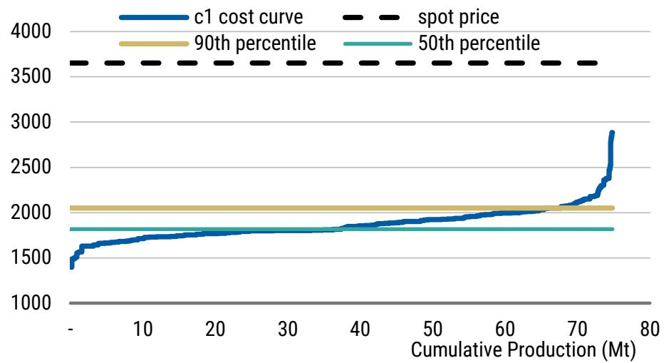

line chart

| Cumulative Production (Mt) | c1 cost curve | spot price | 90th percentile | 50th percentile |
| -------------------------- | ------------- | ---------- | --------------- | --------------- |
| -                          | 1400          | 3600       | 2000            | 1800            |
| 75                         | 2900          | 3600       | 2000            | 1800            |

Source: Wood Mackenzie

Exhibit 41: Aluminium Cost Curve Evolution  
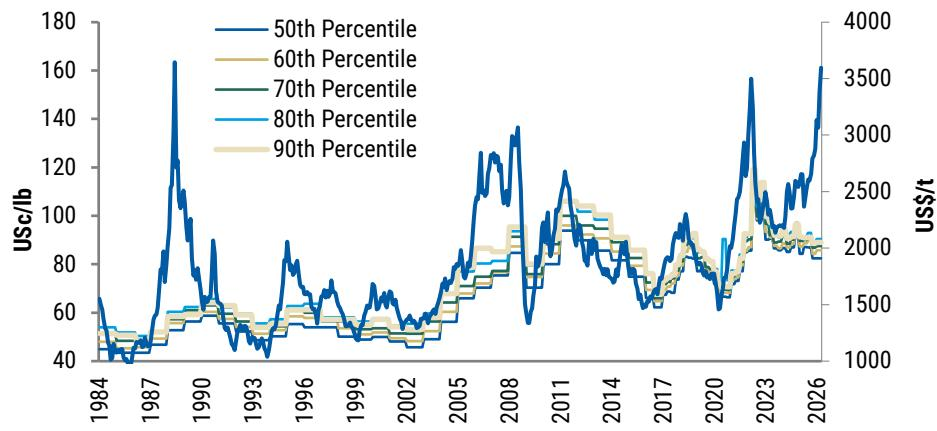

line chart

| Year | 50th Percentile | 60th Percentile | 70th Percentile | 80th Percentile | 90th Percentile |
|------|-----------------|-----------------|-----------------|-----------------|-----------------|
| 1984 | ~60             | ~50             | ~45             | ~40             | ~35             |
| 1987 | ~160            | ~60             | ~55             | ~50             | ~45             |
| 1990 | ~100            | ~60             | ~55             | ~50             | ~45             |
| 1993 | ~40             | ~50             | ~45             | ~40             | ~35             |
| 1996 | ~90             | ~60             | ~55             | ~50             | ~45             |
| 1999 | ~70             | ~50             | ~45             | ~40             | ~35             |
| 2002 | ~60             | ~45             | ~40             | ~35             | ~30             |
| 2005 | ~120            | ~70             | ~60             | ~55             | ~50             |
| 2008 | ~130            | ~80             | ~70             | ~65             | ~60             |
| 2011 | ~110            | ~75             | ~65             | ~60             | ~55             |
| 2014 | ~80             | ~60             | ~55             | ~50             | ~45             |
| 2017 | ~70             | ~55             | ~50             | ~45             | ~40             |
| 2020 | ~60             | ~50             | ~45             | ~40             | ~35             |
| 2023 | ~160            | ~80             | ~70             | ~65             | ~60             |
| 2026 | ~160            | ~80             | ~70             | ~65             | ~60             |

Source: Wood Mackenzie

Exhibit 42: Alumina Total Cost Curve vs Spot (\$/t)  
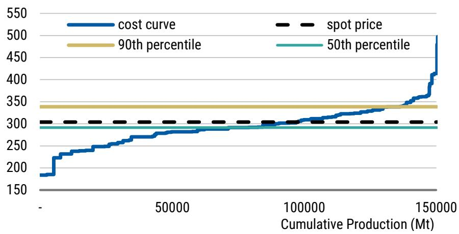

line chart

| Cumulative Production (Mt) | cost curve | spot price | 90th percentile | 50th percentile |
| -------------------------- | ---------- | ---------- | --------------- | --------------- |
| -                          | 180        | 300        | 340             | 290             |
| 50000                      | 280        | 300        | 340             | 290             |
| 100000                     | 320        | 300        | 340             | 290             |
| 150000                     | 500        | 300        | 340             | 290             |

Source: Wood Mackenzie

Exhibit 43: Alumina Cost Curve Evolution  
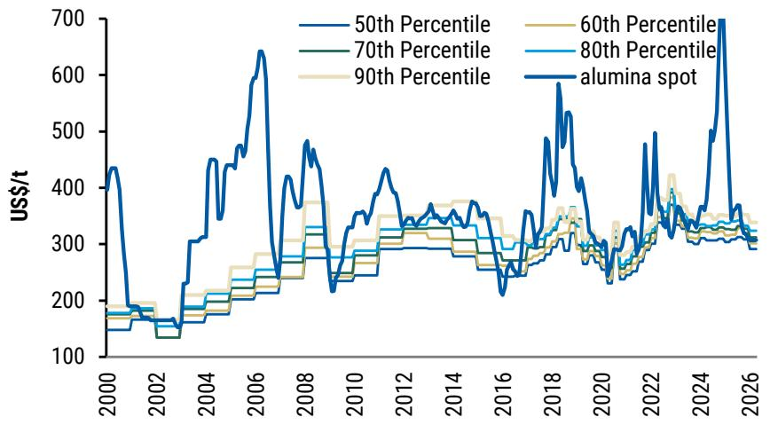

line chart

| Year | 50th Percentile | 60th Percentile | 70th Percentile | 80th Percentile | 90th Percentile | alumina spot |
|------|-----------------|-----------------|-----------------|-----------------|-----------------|-------------|
| 2000 | ~150            | ~160            | ~170            | ~180            | ~190            | ~430        |
| 2002 | ~160            | ~170            | ~180            | ~190            | ~200            | ~150        |
| 2004 | ~200            | ~210            | ~220            | ~230            | ~240            | ~350        |
| 2006 | ~250            | ~260            | ~270            | ~280            | ~290            | ~640        |
| 2008 | ~300            | ~310            | ~320            | ~330            | ~340            | ~480        |
| 2010 | ~350            | ~360            | ~370            | ~380            | ~390            | ~350        |
| 2012 | ~380            | ~390            | ~400            | ~410            | ~420            | ~430        |
| 2014 | ~400            | ~410            | ~420            | ~430            | ~440            | ~370        |
| 2016 | ~350            | ~360            | ~370            | ~380            | ~390            | ~210        |
| 2018 | ~450            | ~460            | ~470            | ~480            | ~490            | ~580        |
| 2020 | ~350            | ~360            | ~370            | ~380            | ~390            | ~350        |
| 2022 | ~450            | ~460            | ~470            | ~480            | ~490            | ~580        |
| 2024 | ~550            | ~560            | ~570            | ~580            | ~590            | ~710        |
| 2026 | ~350            | ~360            | ~370            | ~380            | ~390            | ~350        |

Source: Wood Mackenzie

## Copper

Exhibit 44: Global Copper Inventories  
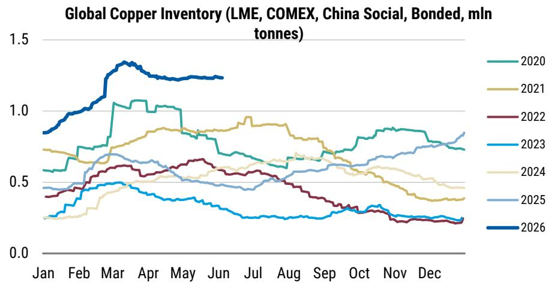

line chart

| Month | 2020 | 2021 | 2022 | 2023 | 2024 | 2025 | 2026 |
|-------|------|------|------|------|------|------|------|
| Jan   | ~0.6 | ~0.7 | ~0.4 | ~0.3 | ~0.2 | ~0.4 | ~0.8 |
| Feb   | ~0.7 | ~0.6 | ~0.5 | ~0.4 | ~0.3 | ~0.5 | ~1.0 |
| Mar   | ~1.1 | ~0.8 | ~0.6 | ~0.5 | ~0.4 | ~0.6 | ~1.3 |
| Apr   | ~1.0 | ~0.9 | ~0.6 | ~0.5 | ~0.5 | ~0.6 | ~1.2 |
| May   | ~0.9 | ~0.9 | ~0.6 | ~0.4 | ~0.5 | ~0.5 | ~1.2 |
| Jun   | ~0.7 | ~0.9 | ~0.5 | ~0.3 | ~0.5 | ~0.4 | ~1.2 |
| Jul   | ~0.6 | ~0.9 | ~0.5 | ~0.3 | ~0.5 | ~0.4 | ~1.2 |
| Aug   | ~0.6 | ~0.8 | ~0.4 | ~0.3 | ~0.5 | ~0.4 | ~1.2 |
| Sep   | ~0.7 | ~0.7 | ~0.3 | ~0.3 | ~0.5 | ~0.5 | ~1.2 |
| Oct   | ~0.8 | ~0.6 | ~0.3 | ~0.3 | ~0.5 | ~0.6 | ~1.2 |
| Nov   | ~0.8 | ~0.5 | ~0.2 | ~0.3 | ~0.5 | ~0.7 | ~1.2 |
| Dec   | ~0.7 | ~0.4 | ~0.2 | ~0.3 | ~0.5 | ~0.8 | ~1.2 |

Source: Bloomberg

Exhibit 46: Copper Price versus China Apparent Consumption  
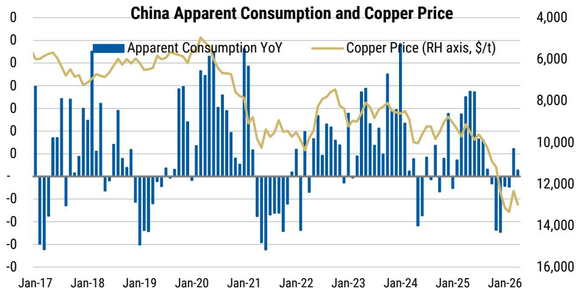

bar-line hybrid chart

China Apparent Consumption and Copper Price
| Date | Apparent Consumption YoY (%) | Copper Price (Rt/ton) |
| :--- | :--- | :--- |
| Jan-17 | -15.0 | 6,500 |
| Jan-18 | 10.0 | 6,000 |
| Jan-19 | -10.0 | 6,200 |
| Jan-20 | 5.0 | 6,800 |
| Jan-21 | 15.0 | 5,500 |
| Jan-22 | -10.0 | 10,000 |
| Jan-23 | 5.0 | 8,500 |
| Jan-24 | 15.0 | 7,500 |
| Jan-25 | 5.0 | 7,000 |
| Jan-26 | -15.0 | 12,000 |

Source: Bloomberg, MS

Exhibit 45: China Copper Inventories  
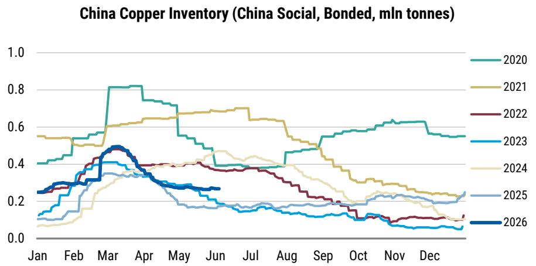

line chart

| Month | 2020 | 2021 | 2022 | 2023 | 2024 | 2025 | 2026 |
|-------|------|------|------|------|------|------|------|
| Jan   | 0.4  | 0.55 | 0.25 | 0.1  | 0.05 | 0.1  | 0.25 |
| Feb   | 0.5  | 0.55 | 0.3  | 0.15 | 0.1  | 0.15 | 0.3  |
| Mar   | 0.8  | 0.6  | 0.45 | 0.35 | 0.3  | 0.35 | 0.5  |
| Apr   | 0.75 | 0.65 | 0.4  | 0.3  | 0.35 | 0.35 | 0.45 |
| May   | 0.7  | 0.65 | 0.4  | 0.25 | 0.4  | 0.3  | 0.35 |
| Jun   | 0.65 | 0.65 | 0.35 | 0.2  | 0.45 | 0.25 | 0.3  |
| Jul   | 0.6  | 0.65 | 0.35 | 0.15 | 0.45 | 0.25 | 0.25 |
| Aug   | 0.55 | 0.6  | 0.3  | 0.15 | 0.4  | 0.25 | 0.25 |
| Sep   | 0.55 | 0.55 | 0.25 | 0.15 | 0.35 | 0.25 | 0.25 |
| Oct   | 0.6  | 0.45 | 0.15 | 0.15 | 0.3  | 0.25 | 0.15 |
| Nov   | 0.65 | 0.4  | 0.15 | 0.15 | 0.25 | 0.25 | 0.15 |
| Dec   | 0.6  | 0.35 | 0.15 | 0.15 | 0.25 | 0.25 | 0.15 |

Source: Bloomberg

Exhibit 47: Copper CFTC Positioning  
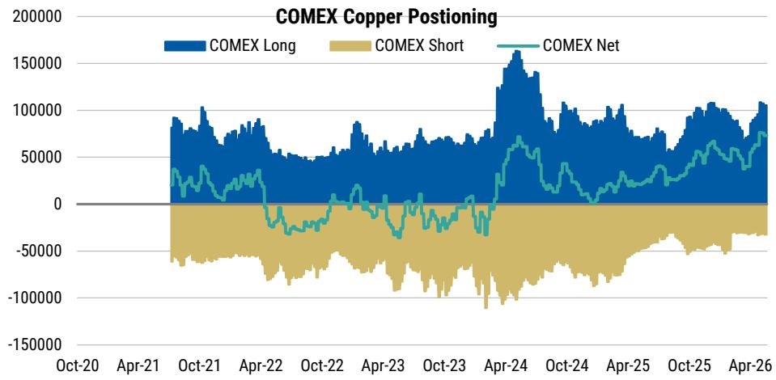

line chart

| Date    | COMEX Long | COMEX Short | COMEX Net |
|---------|------------|-------------|-----------|
| Oct-20  | ~80000     | ~-60000     | ~30000    |
| Apr-21  | ~90000     | ~-65000     | ~35000    |
| Oct-21  | ~100000    | ~-70000     | ~40000    |
| Apr-22  | ~80000     | ~-75000     | ~30000    |
| Oct-22  | ~60000     | ~-80000     | ~20000    |
| Apr-23  | ~70000     | ~-85000     | ~15000    |
| Oct-23  | ~80000     | ~-90000     | ~10000    |
| Apr-24  | ~160000    | ~-110000    | ~60000    |
| Oct-24  | ~120000    | ~-95000     | ~45000    |
| Apr-25  | ~110000    | ~-90000     | ~45000    |
| Oct-25  | ~125000    | ~-85000     | ~55000    |
| Apr-26  | ~115000    | ~-85000     | ~65000    |

Source: COMEX

Exhibit 48: Price Differentials: SHFE vs LME  
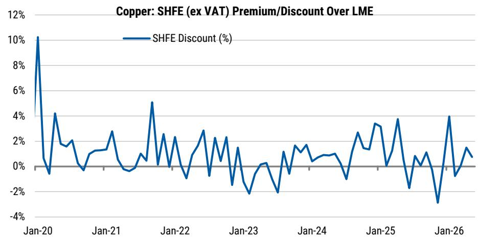

line chart

| Date   | SHFE Discount (%) |
|--------|-------------------|
| Jan-20 | 10.5              |
| Jan-21 | 2.5               |
| Jan-22 | 5.0               |
| Jan-23 | -2.0              |
| Jan-24 | 1.5               |
| Jan-25 | 3.5               |
| Jan-26 | -3.0              |

Source: Bloomberg

Exhibit 50: Raw materials: China's copper concentrate, refined and scrap monthly import  
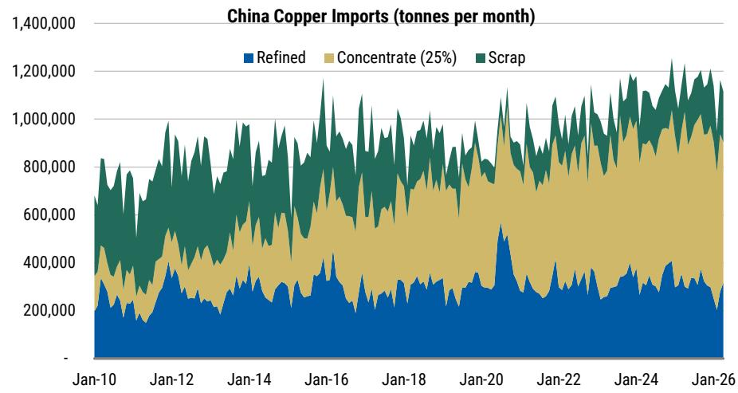

stacked bar chart

China Copper Imports (tonnes per month)
| Date | Refined (tonnes) | Concentrate (25%) (tonnes) | Scrap (tonnes) |
|---|---|---|---|
| Jan-10 | 200,000 | 100,000 | 300,000 |
| Jan-11 | 250,000 | 120,000 | 350,000 |
| Jan-12 | 300,000 | 140,000 | 400,000 |
| Jan-13 | 280,000 | 160,000 | 380,000 |
| Jan-14 | 260,000 | 180,000 | 360,000 |
| Jan-15 | 270,000 | 200,000 | 390,000 |
| Jan-16 | 350,000 | 250,000 | 450,000 |
| Jan-17 | 320,000 | 280,000 | 420,000 |
| Jan-18 | 330,000 | 310,000 | 430,000 |
| Jan-19 | 340,000 | 330,000 | 440,000 |
| Jan-20 | 360,000 | 360,000 | 460,000 |
| Jan-21 | 550,000 | 450,000 | 520,000 |
| Jan-22 | 380,000 | 480,000 | 480,000 |
| Jan-23 | 370,000 | 510,000 | 495,000 |
| Jan-24 | 395,000 | 545,000 | 515,000 |
| Jan-25 | 415,000 | 575,000 | 535,000 |
| Jan-26 | 385,000 | 565,000 | 525,000 |

Source: China Customs, MS

Exhibit 49: Copper treatment charges (TCs)  
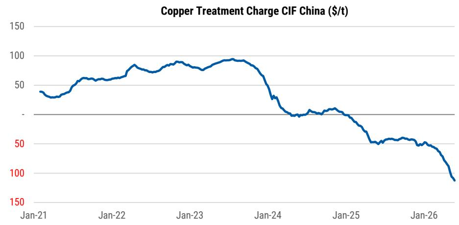

line chart

| Date   | Value ($/t) |
|--------|-------------|
| Jan-21 | ~40         |
| Jan-22 | ~60         |
| Jan-23 | ~85         |
| Jan-24 | ~30         |
| Jan-25 | ~50         |
| Jan-26 | ~100        |

Source: Platts, Bloomberg

Exhibit 51: Physical Demand: Copper Premia By Region  
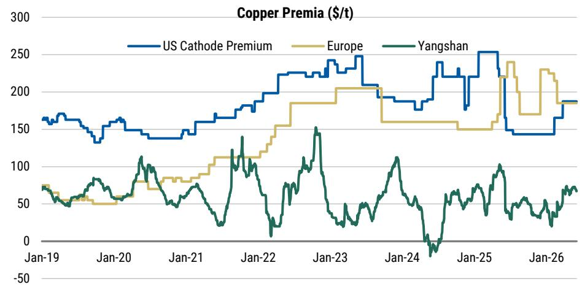

line chart

| Date   | US Cathode Premium | Europe | Yangshan |
|--------|--------------------|--------|----------|
| Jan-19 | ~160               | ~70    | ~60      |
| Jan-20 | ~140               | ~50    | ~80      |
| Jan-21 | ~150               | ~80    | ~60      |
| Jan-22 | ~180               | ~110   | ~120     |
| Jan-23 | ~240               | ~180   | ~150     |
| Jan-24 | ~180               | ~160   | ~10      |
| Jan-25 | ~250               | ~240   | ~100     |
| Jan-26 | ~180               | ~180   | ~70      |

Source: Argus, Bloomberg

Exhibit 52: Copper C1 Cost Curve vs Spot (USc/lb)  
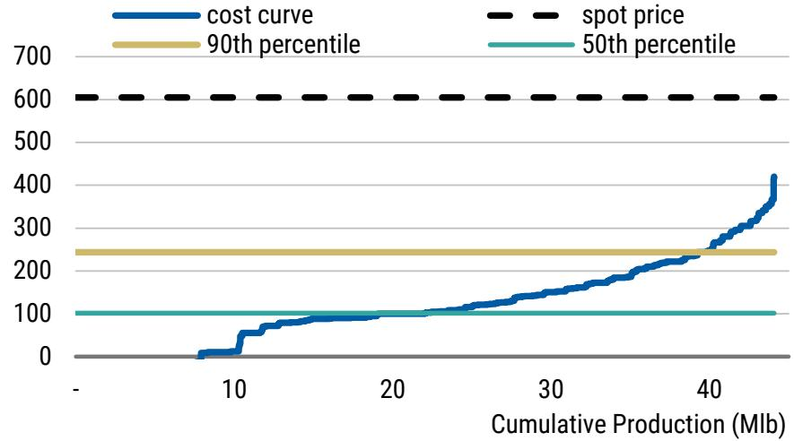

line chart

| Cumulative Production (Mlb) | cost curve | spot price | 90th percentile | 50th percentile |
| --------------------------- | ---------- | ---------- | --------------- | --------------- |
| 0                           | 0          | 600        | 250             | 100             |
| 10                          | 50         | 600        | 250             | 100             |
| 20                          | 100        | 600        | 250             | 100             |
| 30                          | 150        | 600        | 250             | 100             |
| 40                          | 250        | 600        | 250             | 100             |
| 45                          | 420        | 600        | 250             | 100             |

Source: Wood Mackenzie

Exhibit 54: Copper: Aluminium Ratio  
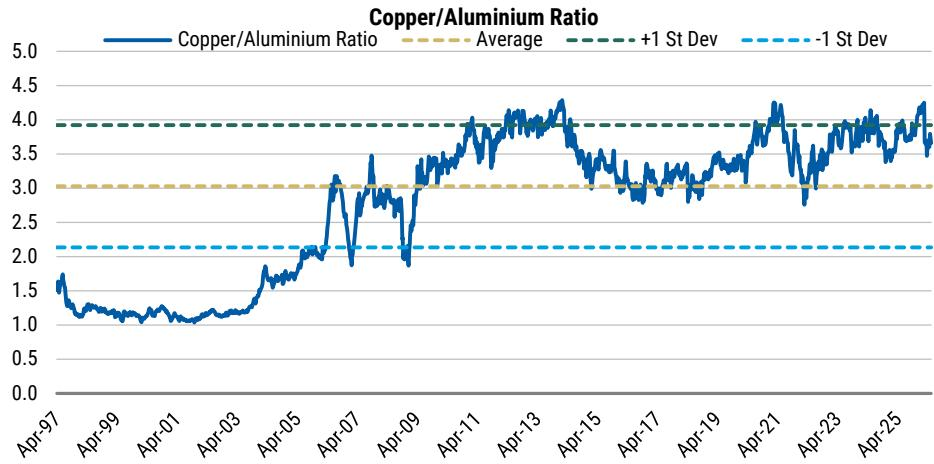

line chart

| Date   | Copper/Aluminium Ratio |
|--------|------------------------|
| Apr-97 | 1.6                    |
| Apr-99 | 1.2                    |
| Apr-01 | 1.1                    |
| Apr-03 | 1.3                    |
| Apr-05 | 1.8                    |
| Apr-07 | 3.1                    |
| Apr-09 | 2.0                    |
| Apr-11 | 3.8                    |
| Apr-13 | 4.2                    |
| Apr-15 | 3.5                    |
| Apr-17 | 3.0                    |
| Apr-19 | 3.4                    |
| Apr-21 | 4.2                    |
| Apr-23 | 3.0                    |
| Apr-25 | 4.2                    |

Source: Bloomberg, MS

Exhibit 53: Copper Cost Curve Evolution  
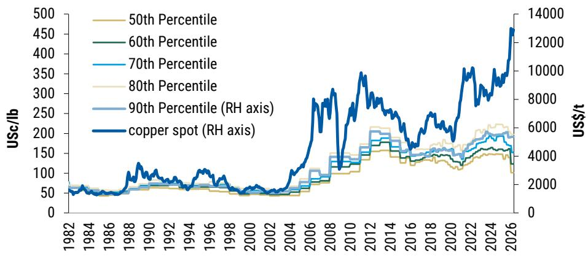

line chart

| Year | copper spot (RH axis) | 50th Percentile | 60th Percentile | 70th Percentile | 80th Percentile | 90th Percentile (RH axis) |
| --- | --- | --- | --- | --- | --- | --- |
| 1982 | ~50 | ~50 | ~50 | ~50 | ~50 | ~50 |
| 1984 | ~50 | ~50 | ~50 | ~50 | ~50 | ~50 |
| 1986 | ~50 | ~50 | ~50 | ~50 | ~50 | ~50 |
| 1988 | ~100 | ~50 | ~50 | ~50 | ~50 | ~50 |
| 1990 | ~120 | ~50 | ~50 | ~50 | ~50 | ~50 |
| 1992 | ~100 | ~50 | ~50 | ~50 | ~50 | ~50 |
| 1994 | ~100 | ~50 | ~50 | ~50 | ~50 | ~50 |
| 1996 | ~100 | ~50 | ~50 | ~50 | ~50 | ~50 |
| 1998 | ~100 | ~50 | ~50 | ~50 | ~50 | ~50 |
| 2000 | ~100 | ~50 | ~50 | ~50 | ~50 | ~50 |
| 2002 | ~100 | ~50 | ~50 | ~50 | ~50 | ~50 |
| 2004 | ~120 | ~50 | ~50 | ~50 | ~50 | ~50 |
| 2006 | ~280 | ~120 | ~120 | ~120 | ~120 | ~120 |
| 2008 | ~320 | ~120 | ~120 | ~120 | ~120 | ~120 |
| 2010 | ~360 | ~120 | ~120 | ~120 | ~120 | ~120 |
| 2012 | ~340 | ~120 | ~120 | ~120 | ~120 | ~120 |
| 2014 | ~320 | ~120 | ~120 | ~120 | ~120 | ~120 |
| 2016 | ~360 | ~120 | ~120 | ~120 | ~120 | ~120 |
| 2018 | ~380 | ~120 | ~120 | ~120 | ~120 | ~120 |
| 2020 | ~420 | ~120 | ~120 | ~120 | ~120 | ~120 |
| 2022 | ~460 | ~120 | ~120 | ~120 | ~120 | ~120 |
| 2024 | ~480 | ~120 | ~120 | ~120 | ~120 | ~120 |
| 2026 | ~480 | ~120 | ~120 | ~120 | ~120 | ~120 |
| 2028* | - | - | - | - | - | - |
| 2036* | - | - | - | - | - | - |
| 23/36* | - | - | - | - | - | - |
| 3/36* | - | - | - | - | - | - |
| 3/36* | - | - | - | - | - | - |
| 3/36* | - | - | - | - | - | - |
| 3/36* | - | - | - | - | - | - |

Source: Wood Mackenzie

Exhibit 55: China Grid Investment  
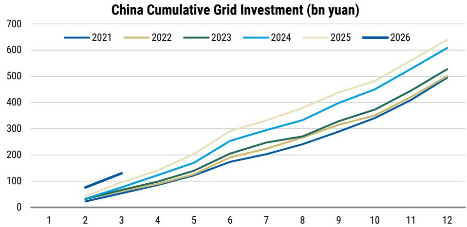

line chart

| Year | Month | Cumulative Grid Investment (bn yuan) |
| --- | --- | --- |
| 2021 | 2 | 30 |
| 2021 | 3 | 80 |
| 2021 | 4 | 100 |
| 2021 | 5 | 130 |
| 2021 | 6 | 170 |
| 2021 | 7 | 200 |
| 2021 | 8 | 230 |
| 2021 | 9 | 270 |
| 2021 | 10 | 330 |
| 2021 | 11 | 400 |
| 2021 | 12 | 490 |
| 2022 |  |  |
| 2022 |  |  |
| 2022 |  |  |
| 2022 |  |  |
| 2022 |  |  |
| 2022 |  |  |
| 2022 |  |  |
| 2023 |  |  |
| 2023 |  |  |
| 2023 |  |  |
| 2023 |  |  |
| 2023 |  |  |
| 2023 |  |  |
| 2023 |  |  |
| 2024 |  |  |
| 2024 |  |  |
| 2024 |  |  |
| 2024 |  |  |
| 2024 |  |  |
| 2024 |  |  |
| 2024 |  |  |
| 2025 |  |  |
| 2025 |  |  |
| 2025 |  |  |
| 2025 |  |  |
| 2025 |  |  |
| 2025 |  |  |
| 2025 |  |  |
| 2026 |  |  |
| 2026 |  |  |
| 2026 |  |  |
| 2026 |  |  |
| 2026 |  |  |
| 2026 |  |  |
| 2026 |  |  |

Source: Bloomberg, MS

## Nickel

Exhibit 56: Global Nickel Inventories  
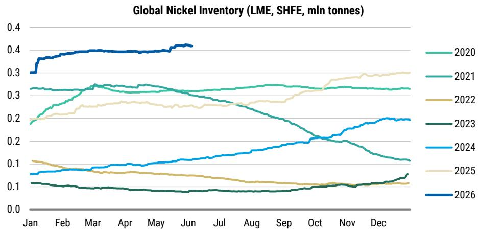

line chart

| Month | 2020 | 2021 | 2022 | 2023 | 2024 | 2025 | 2026 |
|-------|------|------|------|------|------|------|------|
| Jan   | 0.18 | 0.32 | 0.11 | 0.11 | 0.07 | 0.21 | 0.31 |
| Feb   | 0.25 | 0.32 | 0.10 | 0.10 | 0.08 | 0.23 | 0.38 |
| Mar   | 0.34 | 0.33 | 0.09 | 0.09 | 0.09 | 0.25 | 0.40 |
| Apr   | 0.33 | 0.34 | 0.08 | 0.08 | 0.10 | 0.26 | 0.40 |
| May   | 0.33 | 0.34 | 0.08 | 0.08 | 0.11 | 0.27 | 0.41 |
| Jun   | 0.32 | 0.33 | 0.08 | 0.08 | 0.12 | 0.28 | 0.41 |
| Jul   | 0.32 | 0.32 | 0.08 | 0.08 | 0.13 | 0.29 | -    |
| Aug   | 0.33 | 0.31 | 0.08 | 0.08 | 0.14 | 0.30 | -    |
| Sep   | 0.33 | 0.30 | 0.08 | 0.08 | 0.15 | 0.31 | -    |
| Oct   | 0.32 | 0.28 | 0.08 | 0.08 | 0.16 | 0.32 | -    |
| Nov   | 0.32 | 0.26 | 0.08 | 0.08 | 0.17 | 0.33 | -    |
| Dec   | 0.31 | 0.24 | 0.08 | 0.08 | 0.18 | 0.34 | -    |

Source: Bloomberg

Exhibit 58: Nickel C1 Cost Curve vs Spot (USc/lb)  
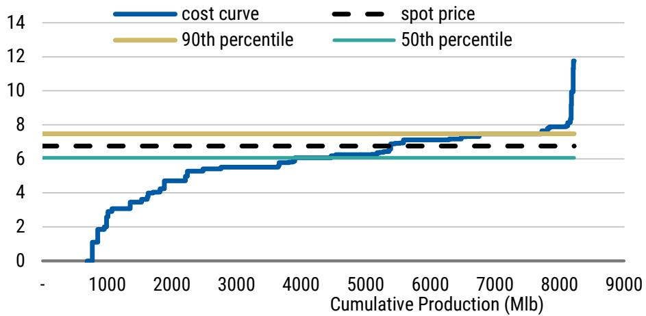

line chart

| Cumulative Production (Mlb) | cost curve | spot price | 90th percentile | 50th percentile |
| --------------------------- | ---------- | ---------- | --------------- | --------------- |
| 0                           | 0          | 6.5        | 7.5             | 6.0             |
| 1000                        | 2          | 6.5        | 7.5             | 6.0             |
| 2000                        | 4          | 6.5        | 7.5             | 6.0             |
| 3000                        | 5          | 6.5        | 7.5             | 6.0             |
| 4000                        | 6          | 6.5        | 7.5             | 6.0             |
| 5000                        | 6.5        | 6.5        | 7.5             | 6.0             |
| 6000                        | 7          | 6.5        | 7.5             | 6.0             |
| 7000                        | 7          | 6.5        | 7.5             | 6.0             |
| 8000                        | 8          | 6.5        | 7.5             | 6.0             |
| 8500                        | 12         | 6.5        | 7.5             | 6.0             |

Source: Wood Mackenzie

Exhibit 57: LME Nickel Positioning  
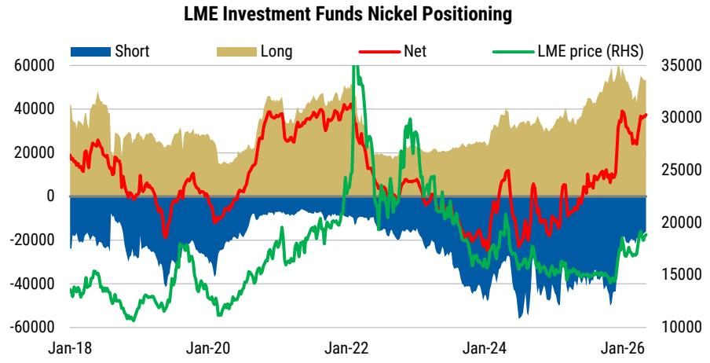

line chart

| Date   | Short | Long | Net  | LME price (RHS) |
|--------|-------|------|------|-----------------|
| Jan-18 | -20000 | 40000 | 20000 | 15000           |
| Jan-20 | -30000 | 30000 | 15000 | 12000           |
| Jan-22 | -10000 | 45000 | 35000 | 35000           |
| Jan-24 | -40000 | 35000 | 25000 | 20000           |
| Jan-26 | -35000 | 55000 | 30000 | 18000           |

Source: Bloomberg

Exhibit 59: Nickel Cost Curve Evolution  
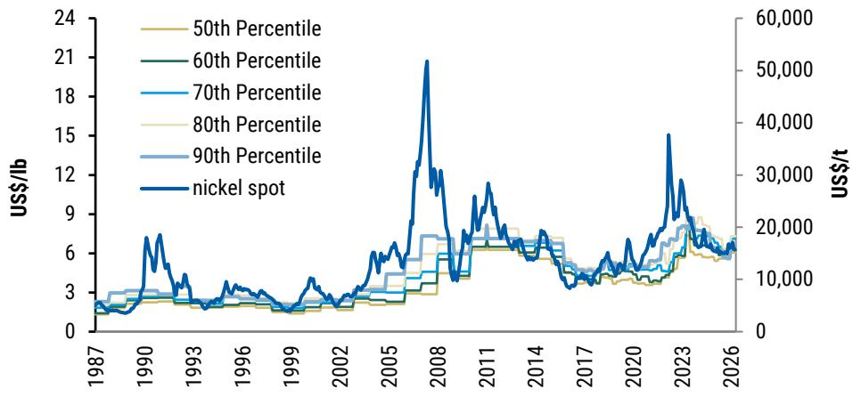

line chart

| Year | nickel spot | 50th Percentile | 60th Percentile | 70th Percentile | 80th Percentile | 90th Percentile |
|------|-------------|-----------------|-----------------|-----------------|-----------------|-----------------|
| 1987 | ~1.5        | ~1.5            | ~1.5            | ~1.5            | ~1.5            | ~1.5            |
| 1990 | ~7.0        | ~1.5            | ~1.5            | ~1.5            | ~1.5            | ~1.5            |
| 1993 | ~3.0        | ~1.5            | ~1.5            | ~1.5            | ~1.5            | ~1.5            |
| 1996 | ~2.5        | ~1.5            | ~1.5            | ~1.5            | ~1.5            | ~1.5            |
| 1999 | ~2.0        | ~1.5            | ~1.5            | ~1.5            | ~1.5            | ~1.5            |
| 2002 | ~3.0        | ~1.5            | ~1.5            | ~1.5            | ~1.5            | ~1.5            |
| 2005 | ~6.0        | ~1.5            | ~1.5            | ~1.5            | ~1.5            | ~1.5            |
| 2008 | ~21.0       | ~6.0            | ~6.0            | ~6.0            | ~6.0            | ~6.0            |
| 2011 | ~12.0       | ~6.0            | ~6.0            | ~6.0            | ~6.0            | ~6.0            |
| 2014 | ~8.0        | ~6.0            | ~6.0            | ~6.0            | ~6.0            | ~6.0            |
| 2017 | ~4.0        | ~6.0            | ~6.0            | ~6.0            | ~6.0            | ~6.0            |
| 2020 | ~6.0        | ~6.0            | ~6.0            | ~6.0            | ~6.0            | ~6.0            |
| 2023 | ~15.0       | ~6.0            | ~6.0            | ~6.0            | ~6.0            | ~6.0            |
| 2026 | ~6.0        | ~6.0            | ~6.0            | ~6.0            | ~6.0            | ~6.0            |

Source: Wood Mackenzie

Exhibit 60: Nickel Product Spreads vs LME Price  
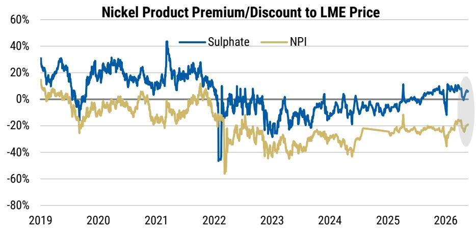

line chart

| Year | Sulphate | NPI |
|------|----------|-----|
| 2019 | ~30%     | ~10% |
| 2020 | ~-10%    | ~-20% |
| 2021 | ~45%     | ~-10% |
| 2022 | ~-50%    | ~-60% |
| 2023 | ~-20%    | ~-30% |
| 2024 | ~-10%    | ~-25% |
| 2025 | ~10%     | ~-20% |
| 2026 | ~15%     | ~-15% |

Source: Argus Metals

Exhibit 62: China NEV Sales  
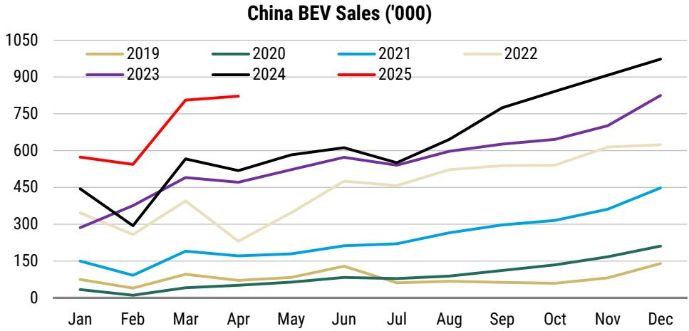

line chart

| Month | 2019 | 2020 | 2021 | 2022 | 2023 | 2024 | 2025 |
|-------|------|------|------|------|------|------|------|
| Jan   | 100  | 50   | 150  | 300  | 300  | 450  | 580  |
| Feb   | 50   | 20   | 100  | 280  | 350  | 300  | 560  |
| Mar   | 100  | 50   | 160  | 350  | 450  | 580  | 780  |
| Apr   | 120  | 80   | 150  | 270  | 450  | 550  | 790  |
| May   | 130  | 100  | 160  | 350  | 500  | 600  | —    |
| Jun   | 140  | 120  | 170  | 450  | 580  | 610  | —    |
| Jul   | 150  | 130  | 180  | 450  | 570  | 570  | —    |
| Aug   | —    | —    | —    | —    | —    | —    | —    |
| Sep   | —    | —    | —    | —    | —    | —    | —    |
| Oct   | —    | —    | —    | —    | —    | —    | —    |
| Nov   | —    | —    | —    | —    | —    | —    | —    |
| Dec   | —    | —    | —    | —    | —    | —    | —    |

Source: CEIC, CAAM

Exhibit 61: Global Battery Deployment by Chemistry  
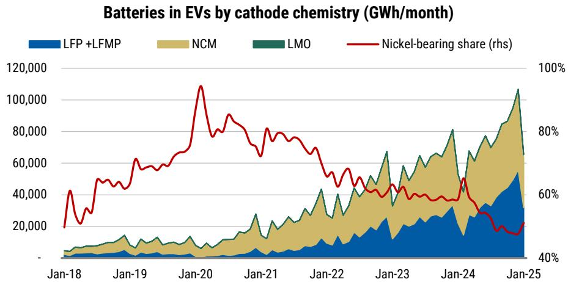

line chart

| Month   | LFP +LFMP | NCM  | LMO  | Nickel-bearing share (rhs) |
|---------|-----------|------|------|-----------------------------|
| Jan-18  | ~0        | ~0   | ~0   | ~40%                        |
| Jan-19  | ~0        | ~0   | ~0   | ~60%                        |
| Jan-20  | ~0        | ~0   | ~0   | ~100%                       |
| Jan-21  | ~0        | ~0   | ~0   | ~80%                        |
| Jan-22  | ~0        | ~0   | ~0   | ~60%                        |
| Jan-23  | ~0        | ~0   | ~0   | ~50%                        |
| Jan-24  | ~0        | ~0   | ~0   | ~40%                        |
| Jan-25  | ~50,000   | ~40,000 | ~110,000 | ~20%                      |

Source: Rho Motion

Exhibit 63: China PHEV Sales  
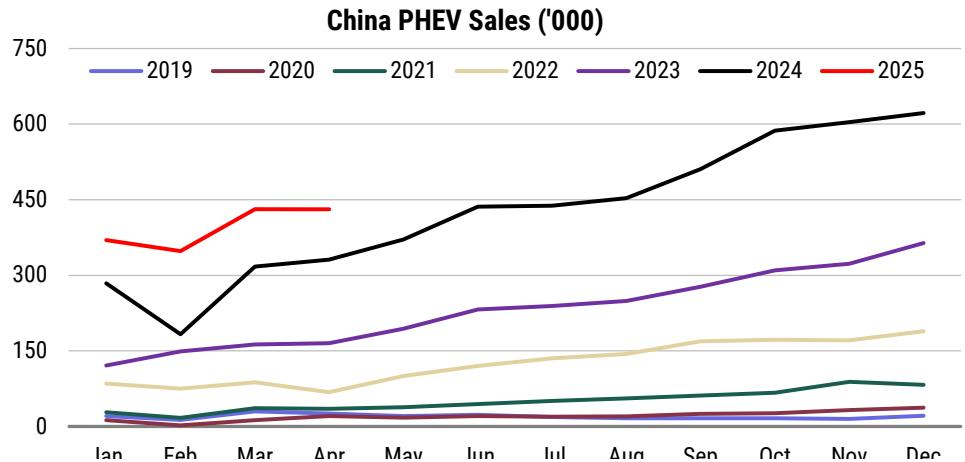

line chart

| Month | 2019 | 2020 | 2021 | 2022 | 2023 | 2024 | 2025 |
|-------|------|------|------|------|------|------|------|
| Jan   | ~5   | ~5   | ~5   | ~10  | ~10  | ~300 | ~350 |
| Feb   | ~5   | ~5   | ~5   | ~10  | ~10  | ~160 | ~350 |
| Mar   | ~5   | ~5   | ~10  | ~15  | ~15  | ~300 | ~450 |
| Apr   | ~5   | ~5   | ~10  | ~15  | ~15  | ~300 | ~450 |
| May   | ~5   | ~5   | ~10  | ~15  | ~15  | ~350 | -    |
| Jun   | ~5   | ~5   | ~10  | ~15  | ~18  | ~450 | -    |
| Jul   | ~5   | ~5   | ~10  | ~15  | ~18  | ~450 | -    |
| Aug   | ~5   | ~5   | ~10  | ~15  | ~18  | ~450 | -    |
| Sep   | ~5   | ~5   | ~10  | ~15  | ~20  | ~500 | -    |
| Oct   | ~5   | ~5   | ~10  | ~15  | ~30  | ~600 | -    |
| Nov   | ~5   | ~5   | ~15  | ~15  | ~32  | ~620 | -    |
| Dec   | ~5   | ~5   | ~15  | ~16  | ~35  | ~630 | -    |

Source: CEIC, CAAM

## Zinc

Exhibit 64: Global Zinc Inventories  
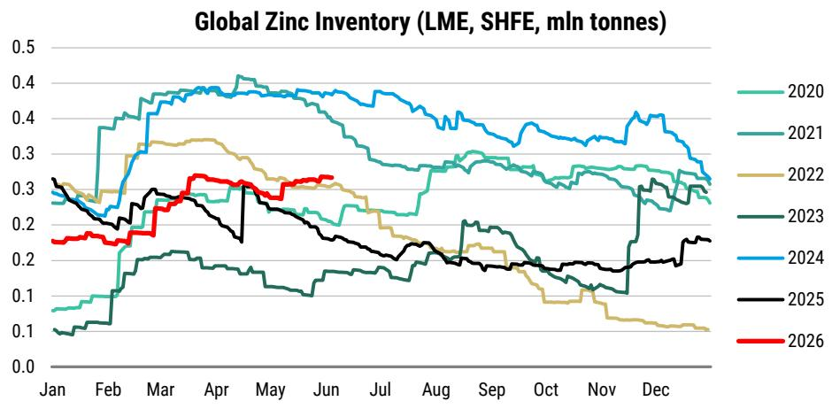

line chart

| Month | 2020 | 2021 | 2022 | 2023 | 2024 | 2025 | 2026 |
|-------|------|------|------|------|------|------|------|
| Jan   | 0.08 | 0.10 | 0.15 | 0.10 | 0.25 | 0.30 | 0.18 |
| Feb   | 0.15 | 0.15 | 0.20 | 0.15 | 0.30 | 0.25 | 0.18 |
| Mar   | 0.25 | 0.35 | 0.30 | 0.20 | 0.40 | 0.25 | 0.25 |
| Apr   | 0.30 | 0.40 | 0.35 | 0.25 | 0.45 | 0.25 | 0.30 |
| May   | 0.35 | 0.45 | 0.35 | 0.25 | 0.45 | 0.25 | 0.30 |
| Jun   | 0.35 | 0.45 | 0.35 | 0.25 | 0.45 | 0.25 | 0.30 |
| Jul   | 0.35 | 0.45 | 0.35 | 0.25 | 0.45 | 0.25 | 0.30 |
| Aug   | 0.35 | 0.45 | 0.35 | 0.25 | 0.45 | 0.25 | 0.30 |
| Sep   | 0.35 | 0.45 | 0.35 | 0.25 | 0.45 | 0.25 | 0.30 |
| Oct   | 0.35 | 0.45 | 0.35 | 0.25 | 0.45 | 0.25 | 0.30 |
| Nov   | 0.35 | 0.45 | 0.35 | 0.25 | 0.45 | 0.25 | 0.30 |
| Dec   | 0.35 | 0.45 | 0.35 | 0.25 | 0.45 | 0.25 | 0.30 |

Source: Bloomberg

Exhibit 65: China Refined Zinc Imports  
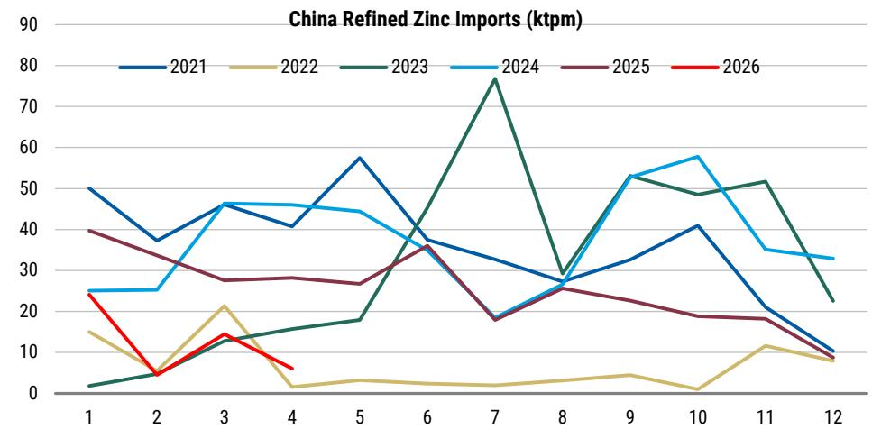

line chart

China Refined Zinc Imports (ktpm)
| Year | Month | Value (ktpm) |
|---|---|---|
| 2021 | 1 | 50 |
| 2021 | 2 | 37 |
| 2021 | 3 | 46 |
| 2021 | 4 | 40 |
| 2021 | 5 | 57 |
| 2021 | 6 | 37 |
| 2021 | 7 | 31 |
| 2021 | 8 | 29 |
| 2021 | 9 | 32 |
| 2021 | 10 | 41 |
| 2021 | 11 | 20 |
| 2021 | 12 | 10 |
| 2022 | 1 | 15 |
| 2022 | 2 | 5 |
| 2022 | 3 | 21 |
| 2022 | 4 | 1 |
| 2022 | 5 | 3 |
| 2022 | 6 | 3 |
| 2022 | 7 | 3 |
| 2022 | 8 | 4 |
| 2022 | 9 | 5 |
| 2022 | 10 | 1 |
| 2023 | 1 | 3 |
| 2023 | 2 | 5 |
| 2023 | 3 | 13 |
| 2023 | 4 | 15 |
| 2023 | 5 | 18 |
| 2023 | 6 | 76 |
| 2023 | 7 | 49 |
| 2023 | 8 | 30 |
| 2023 | 9 | 53 |
| 2023 | 10 | 49 |
| 2023 | 11 | 51 |
| 2023 | 12 | 23 |
| 2024 | 1 | 25 |
| 2024 | 2 | 25 |
| 2024 | 3 | 46 |
| 2024 | 4 | 46 |
| 2024 | 5 | 44 |
| 2024 | 6 | 44 |
| 2024 | 7 | 38 |
| 2024 | 8 | 35 |
| 2024 | 9 | 53 |
| 2024 | 10 | 58 |
| 2024 | 11 | 34 |
| 2024 | 12 | 33 |
| 2025 | 1 | 40 |
| 2025 | 2 | 35 |
| 2025 | 3 | 30 |
| 2025 | 4 | 35 |
| 2025 | 5 | 35 |
| 2025 | 6 | 35 |
| 2025 | 7 | 18 |
| 2025 | 8 | 35 |
| 2025 | 9 | 35 |
| 2025 | 10 | 35 |
| 2025 | 11 | 35 |
| 2026 | -1 | -5 |
| -<fcel>-<fcel>-<nl>

Source: Bloomberg

Exhibit 66: China Zinc Concentrate Imports  
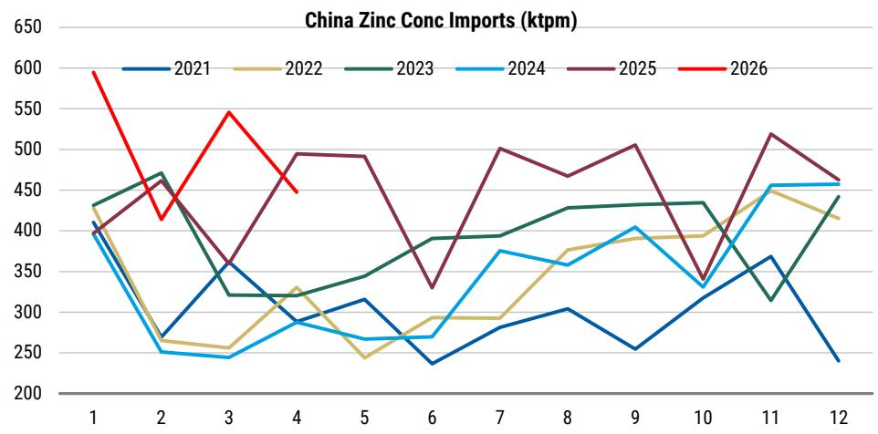

line chart

China Zinc Conc Imports (ktpm)
| Month | 2021 (ktpm) | 2022 (ktpm) | 2023 (ktpm) | 2024 (ktpm) | 2025 (ktpm) | 2026 (ktpm) |
|---|---|---|---|---|---|---|
| 1 | 400 | 430 | 430 | 400 | 400 | 600 |
| 2 | 270 | 260 | 470 | 250 | 460 | 410 |
| 3 | 360 | 250 | 320 | 240 | 360 | 550 |
| 4 | 300 | 330 | 320 | 280 | 495 | 450 |
| 5 | 315 | 245 | 345 | 270 | 495 | - |
| 6 | 235 | 295 | 390 | 270 | 330 | - |
| 7 | 280 | 295 | 395 | 375 | 500 | - |
| 8 | 305 | 375 | 425 | 360 | 470 | - |
| 9 | 255 | 395 | 435 | 405 | 505 | - |
| 10 | 315 | 395 | 435 | 335 | 345 | - |
| 11 | 370 | 455 | 315 | 460 | 520 | - |
| 12 | 240 | 415 | 445 | 460 | 465 | - |

Source: Bloomberg

Exhibit 67: China Refined Zinc Output  
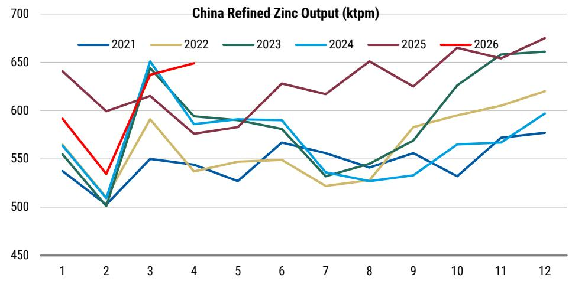

line chart

China Refined Zinc Output (ktpm)
| Month | 2021 (ktpm) | 2022 (ktpm) | 2023 (ktpm) | 2024 (ktpm) | 2025 (ktpm) | 2026 (ktpm) |
|---|---|---|---|---|---|---|
| 1 | 538 | 555 | 557 | 565 | 640 | 592 |
| 2 | 503 | 503 | 503 | 510 | 600 | 535 |
| 3 | 549 | 591 | 648 | 651 | 640 | 638 |
| 4 | 543 | 538 | 593 | 587 | 577 | 649 |
| 5 | 527 | 547 | 591 | 591 | 583 | 583 |
| 6 | 567 | 549 | 583 | 590 | 628 | 630 |
| 7 | 557 | 523 | 533 | 534 | 617 | 617 |
| 8 | 543 | 531 | 544 | 527 | 651 | 651 |
| 9 | 556 | 581 | 567 | 533 | 624 | 668 |
| 10 | 533 | 591 | 627 | 564 | 667 | 671 |
| 11 | 571 | 604 | 658 | 569 | 657 | 660 |
| 12 | 577 | 619 | 661 | 598 | - | - |

Source: Bloomberg

Exhibit 68: Price Differentials: SHFE vs LME  
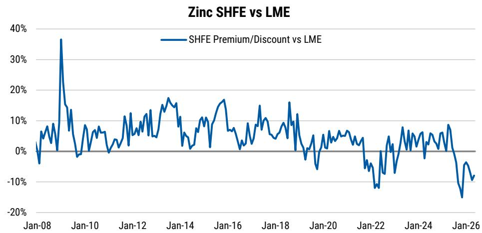

line chart

| Date   | SHFE Premium/Discount vs LME |
|--------|------------------------------|
| Jan-08 | ~0%                          |
| Jan-10 | ~35%                         |
| Jan-12 | ~10%                         |
| Jan-14 | ~15%                         |
| Jan-16 | ~17%                         |
| Jan-18 | ~10%                         |
| Jan-20 | ~5%                          |
| Jan-22 | ~-10%                        |
| Jan-24 | ~5%                          |
| Jan-26 | ~-15%                        |

Source: Bloomberg

Exhibit 70: Zinc Premia  
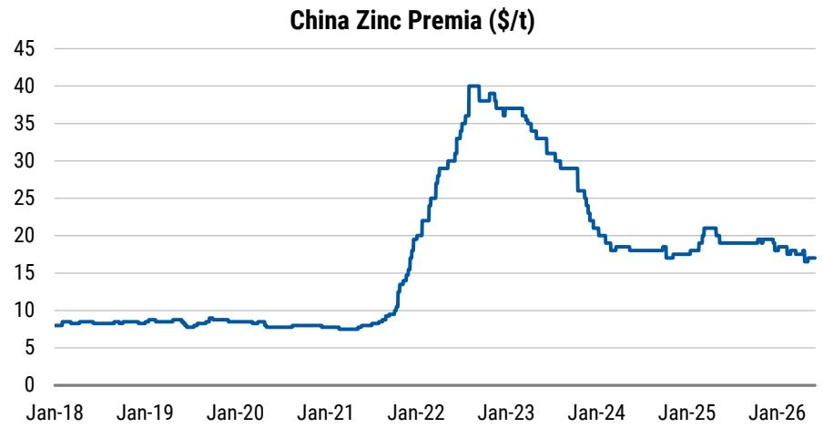

line chart

| Date    | China Zinc Premia ($/t) |
|---------|--------------------------|
| Jan-18  | ~8                       |
| Jan-19  | ~8                       |
| Jan-20  | ~8                       |
| Jan-21  | ~8                       |
| Jan-22  | ~15                      |
| Jan-23  | ~40                      |
| Jan-24  | ~18                      |
| Jan-25  | ~19                      |
| Jan-26  | ~17                      |

Source: Bloomberg

Exhibit 69: Zinc Treatment Charges  
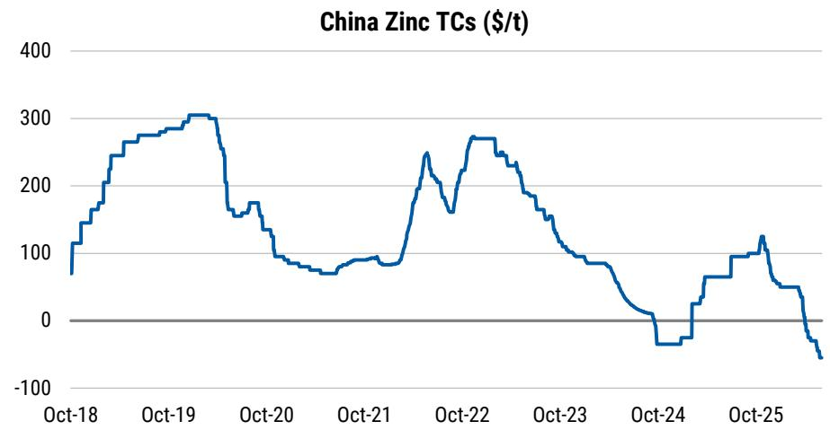

line chart

| Date    | Value |
|---------|-------|
| Oct-18  | ~70   |
| Oct-19  | ~300  |
| Oct-20  | ~150  |
| Oct-21  | ~80   |
| Oct-22  | ~270  |
| Oct-23  | ~100  |
| Oct-24  | ~-50  |
| Oct-25  | ~120  |

Source: Bloomberg

Exhibit 71: Zinc/Lead Ratio  
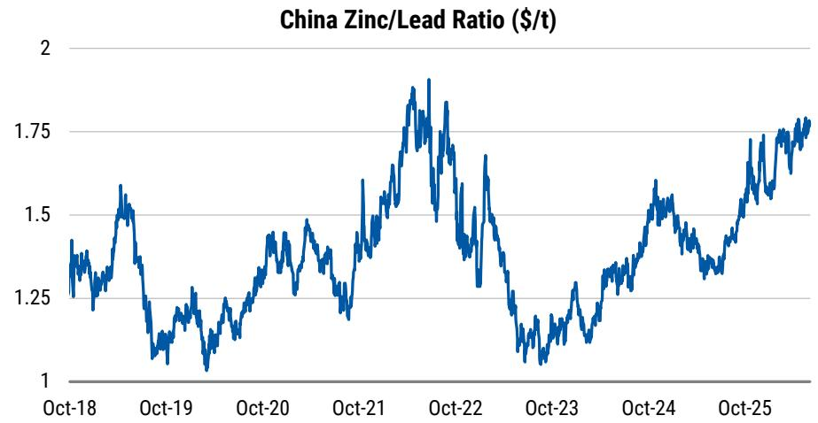

line chart

| Date   | China Zinc/Lead Ratio ($/t) |
|--------|-----------------------------|
| Oct-18 | 1.3                         |
| Oct-19 | 1.1                         |
| Oct-20 | 1.4                         |
| Oct-21 | 1.6                         |
| Oct-22 | 1.8                         |
| Oct-23 | 1.1                         |
| Oct-24 | 1.5                         |
| Oct-25 | 1.7                         |

Source: Bloomberg

Exhibit 72: Zinc C1 Cost Curve vs Spot (\$/t)  
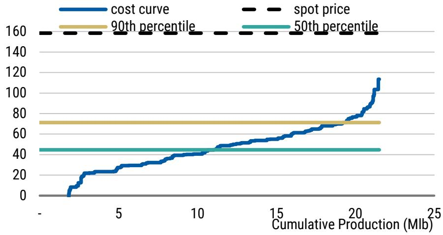

line chart

| Cumulative Production (Mlb) | cost curve | spot price | 90th percentile | 50th percentile |
| --------------------------- | ---------- | ---------- | --------------- | --------------- |
| -                           | 0          | 160        | 70              | 40              |
| 5                           | 20         | 160        | 70              | 40              |
| 10                          | 40         | 160        | 70              | 40              |
| 15                          | 60         | 160        | 70              | 40              |
| 20                          | 80         | 160        | 70              | 40              |
| 25                          | 120        | 160        | 70              | 40              |

Source: Woodmac

Exhibit 74: Zinc Positioning  
LME Investment Funds Zinc Positioning  
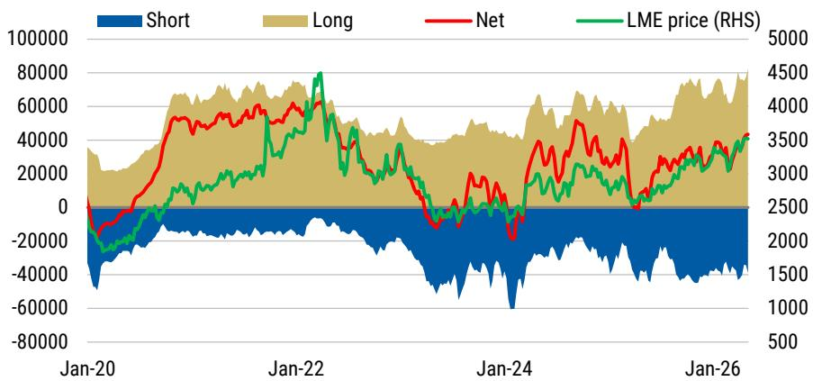

line chart

| Date   | Short | Long | Net  | LME price (RHS) |
|--------|-------|------|------|-----------------|
| Jan-20 | -40000| 30000| 500  | 2500            |
| Jan-22 | -20000| 60000| 4000 | 3500            |
| Jan-24 | -60000| 40000| 3000 | 2500            |
| Jan-26 | -20000| 70000| 4500 | 3500            |

Source: Bloomberg

Exhibit 73: Zinc Cost Curve Evolution  
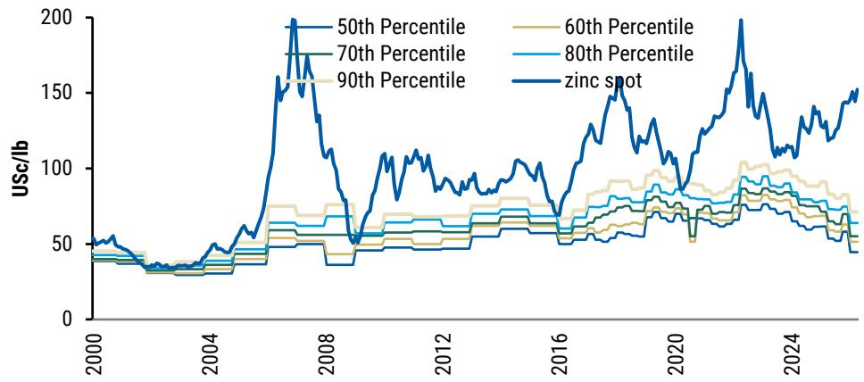

line chart

| Year | 50th Percentile | 60th Percentile | 70th Percentile | 80th Percentile | 90th Percentile | zinc spot |
|------|-----------------|-----------------|-----------------|-----------------|-----------------|---------|
| 2000 | ~40             | ~35             | ~35             | ~35             | ~35             | ~50     |
| 2004 | ~45             | ~40             | ~40             | ~40             | ~40             | ~60     |
| 2008 | ~190            | ~60             | ~60             | ~60             | ~60             | ~190    |
| 2012 | ~110            | ~70             | ~70             | ~70             | ~70             | ~110    |
| 2016 | ~130            | ~80             | ~80             | ~80             | ~80             | ~130    |
| 2020 | ~150            | ~90             | ~90             | ~90             | ~90             | ~150    |
| 2024 | ~140            | ~85             | ~85             | ~85             | ~85             | ~140    |

Source: Woodmac

Exhibit 75: Lead Positioning  
LME Investment Funds Lead Positioning  
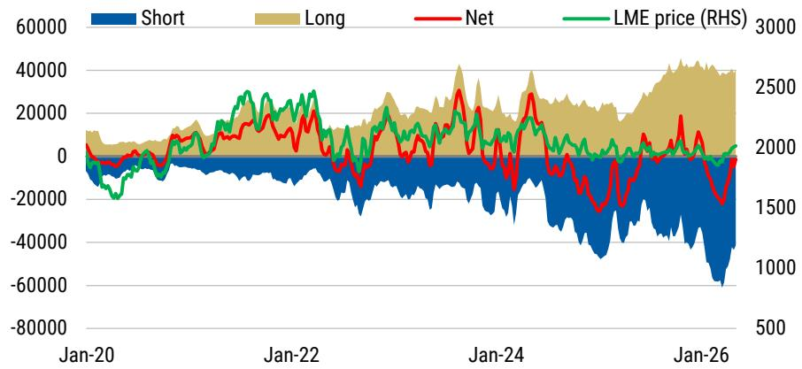

line chart

| Date   | Short | Long | Net  | LME price (RHS) |
|--------|-------|------|------|-----------------|
| Jan-20 | -10000 | 5000 | 500  | 1500            |
| Jan-22 | -5000  | 10000 | 1000 | 2000            |
| Jan-24 | -30000 | 25000 | 2500 | 1500            |
| Jan-26 | -70000 | 40000 | 1500 | 1500            |

Source: Bloomberg

## Lithium

Exhibit 76: Lithium Chemical Prices  
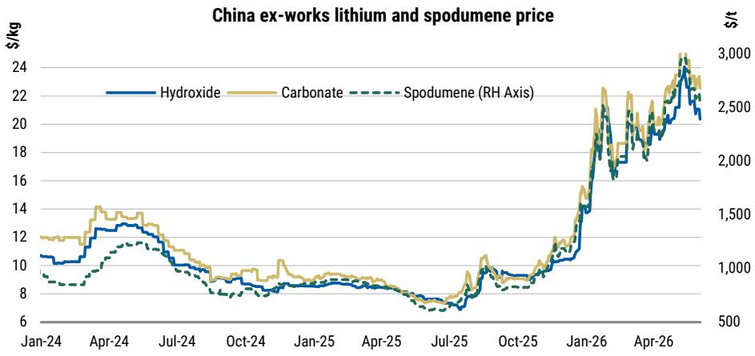

line chart

| Date    | Hydroxide | Carbonate | Spodumene (RH Axis) |
|---------|-----------|-----------|---------------------|
| Jan-24  | ~10       | ~12       | ~9                  |
| Apr-24  | ~13       | ~14       | ~11                 |
| Jul-24  | ~11       | ~11       | ~8                  |
| Oct-24  | ~9        | ~9        | ~7                  |
| Jan-25  | ~8        | ~8        | ~6                  |
| Apr-25  | ~8        | ~8        | ~6                  |
| Jul-25  | ~7        | ~7        | ~6                  |
| Oct-25  | ~9        | ~9        | ~7                  |
| Jan-26  | ~15       | ~16       | ~14                 |
| Apr-26  | ~24       | ~25       | ~23                 |

Source: Fastmarkets, MS

Exhibit 78: China Lithium Carbonate Imports  
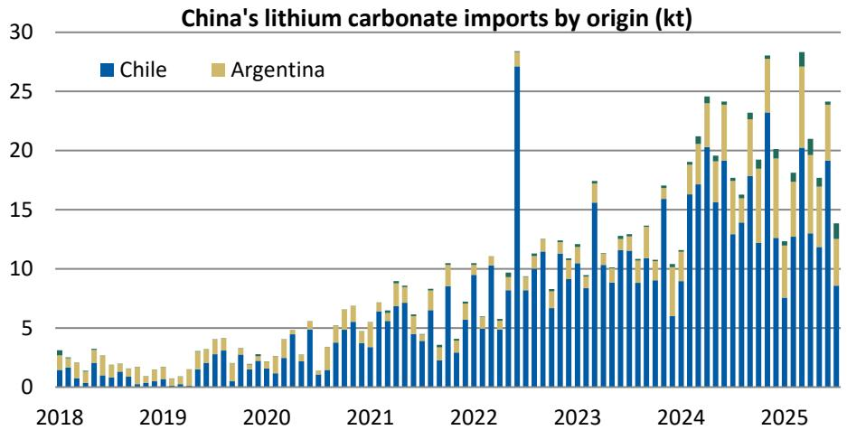

bar chart

| Year | Chile | Argentina |
|------|-------|-----------|
| 2018 | 1.0   | 1.0       |
| 2019 | 1.0   | 1.0       |
| 2020 | 1.0   | 1.0       |
| 2021 | 3.0   | 2.0       |
| 2022 | 5.0   | 3.0       |
| 2023 | 7.0   | 4.0       |
| 2024 | 10.0  | 6.0       |
| 2025 | 13.0  | 8.0       |

Source: Rystad, MS

Exhibit 77: Non-integrated Convertor Margins  
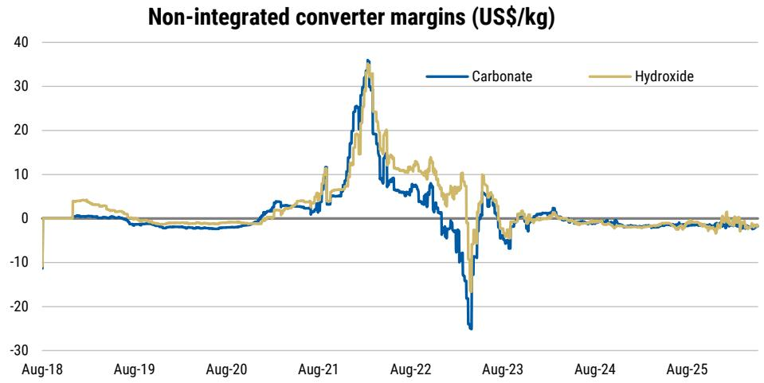

line chart

| Date   | Carbonate | Hydroxide |
|--------|-----------|-----------|
| Aug-18 | 0         | 0         |
| Aug-19 | 0         | 0         |
| Aug-20 | 0         | 0         |
| Aug-21 | 10        | 10        |
| Aug-22 | 35        | 30        |
| Aug-23 | -25       | -5        |
| Aug-24 | 0         | 0         |
| Aug-25 | 0         | 0         |

Source: Fastmarkets, Morgans Stanley Research

Exhibit 79: Chile Lithium Exports  
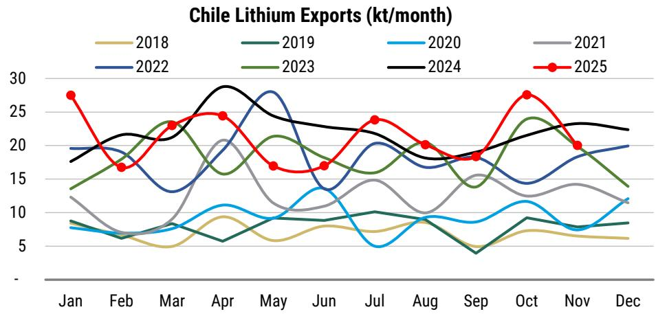

line chart

| Month | 2018 | 2019 | 2020 | 2021 | 2022 | 2023 | 2024 | 2025 |
| --- | --- | --- | --- | --- | --- | --- | --- | --- |
| Jan |  |  |  |  |  |  |  | 27.5 |
| Feb |  |  |  |  |  |  |  | 16.5 |
| Mar |  |  |  |  |  |  |  | 23.0 |
| Apr |  |  |  |  |  |  |  | 24.5 |
| May |  |  |  |  |  |  |  | 17.0 |
| Jun |  |  |  |  |  |  |  | 16.5 |
| Jul |  |  |  |  |  |  |  | 23.5 |
| Aug |  |  |  |  |  |  |  | 20.0 |
| Sep |  |  |  |  |  |  |  | 18.5 |
| Oct |  |  |  |  |  |  |  | 27.5 |
| Nov |  |  |  |  |  |  |  | 20.0 |
| Dec |  |  |  |  |  |  |  |  |

Source: Chile Customs, MS

## Uranium

Exhibit 80: Uranium Price (Spot and Term)  
Monthly Uranium Price (\$/lb)  
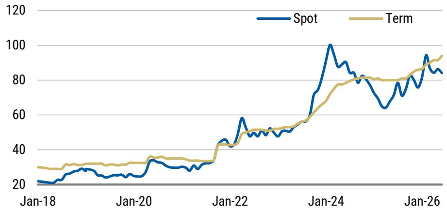

line chart

| Date   | Spot | Term |
|--------|------|------|
| Jan-18 | 20   | 30   |
| Jan-20 | 30   | 35   |
| Jan-22 | 50   | 50   |
| Jan-24 | 100  | 80   |
| Jan-26 | 90   | 95   |

Source: Cameco

Exhibit 82: US Enriched Uranium Imports  
US Imports of Enriched Uranium (tonnes/month)  
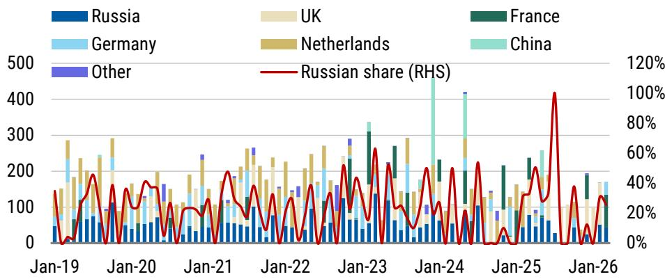

bar-line hybrid

| Month   | Russia | UK  | France | Germany | Netherlands | China | Other | Russian share (RHS) |
|---------|--------|-----|--------|---------|-------------|-------|-------|---------------------|
| Jan-19  | 50     | 100 | 80     | 150     | 250         | 100   | 50    | 10%                 |
| Jan-20  | 70     | 120 | 90     | 130     | 280         | 120   | 60    | 15%                 |
| Jan-21  | 60     | 110 | 85     | 120     | 260         | 110   | 55    | 12%                 |
| Jan-22  | 80     | 130 | 95     | 140     | 270         | 130   | 70    | 18%                 |
| Jan-23  | 90     | 140 | 100    | 150     | 280         | 140   | 80    | 25%                 |
| Jan-24  | 100    | 150 | 110    | 160     | 290         | 150   | 90    | 35%                 |
| Jan-25  | 80     | 130 | 90     | 140     | 270         | 130   | 75    | 28%                 |
| Jan-26  | 60     | 110 | 80     | 130     | 260         | 120   | 65    | 15%                 |

Source: Trademap

Exhibit 81: Sprott ETF Purchases  
Sprott Physical Uranium Purchases (Mn lb) vs Spot Price (\$/lb)  
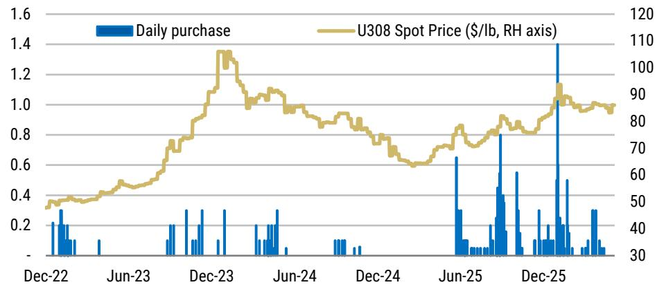

bar-line hybrid chart

| Date    | Daily purchase | U308 Spot Price ($/lb, RH axis) |
|---------|----------------|--------------------------------|
| Dec-22  | 0.2            | 40                             |
| Jun-23  | 0.1            | 50                             |
| Dec-23  | 0.3            | 110                            |
| Jun-24  | 0.2            | 90                             |
| Dec-24  | 0.1            | 70                             |
| Jun-25  | 0.6            | 80                             |
| Dec-25  | 1.4            | 90                             |

Source: Sprott, UxC, MS

Exhibit 83: Quarterly contracting volumes  
Uranium Traded Volumes (mln lbs U308)  
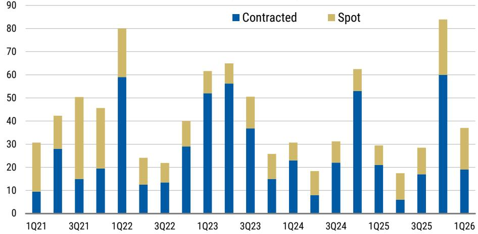

stacked bar chart

| Quarter | Contracted | Spot |
| :--- | :--- | :--- |
| 1Q21 | 9 | 30 |
| 2Q21 | 28 | 17 |
| 3Q21 | 15 | 40 |
| 4Q21 | 19 | 33 |
| 1Q22 | 59 | 25 |
| 2Q22 | 13 | 14 |
| 3Q22 | 14 | 10 |
| 4Q22 | 29 | 14 |
| 1Q23 | 52 | 13 |
| 2Q23 | 56 | 10 |
| 3Q23 | 36 | 16 |
| 4Q23 | 15 | 14 |
| 1Q24 | 23 | 10 |
| 2Q24 | 8 | 14 |
| 3Q24 | 22 | 13 |
| 4Q24 | 53 | 14 |
| 1Q25 | 21 | 13 |
| 2Q25 | 6 | 14 |
| 3Q25 | 17 | 16 |
| 4Q25 | 60 | 30 |
| 1Q26 | 19 | 20 |

Source: Kazatomprom

## Gold and Other Precious Metals

Exhibit 84: CFTC Gold Futures Positioning  
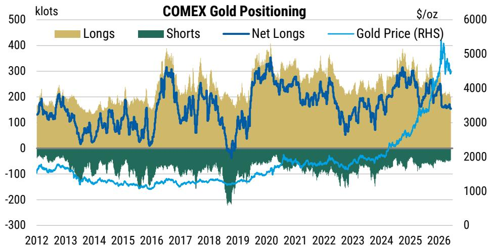

line chart

| Year | Longs (k lots) | Shorts (k lots) | Net Longs ($/oz) | Gold Price ($/oz) |
|------|----------------|-----------------|------------------|-------------------|
| 2012 | ~200           | ~0              | ~150             | ~1000             |
| 2013 | ~250           | ~0              | ~180             | ~1200             |
| 2014 | ~150           | ~0              | ~100             | ~1000             |
| 2015 | ~180           | ~0              | ~120             | ~1100             |
| 2016 | ~350           | ~0              | ~300             | ~1300             |
| 2017 | ~250           | ~0              | ~250             | ~1400             |
| 2018 | ~300           | ~0              | ~280             | ~1500             |
| 2019 | ~400           | ~-250           | ~350             | ~1600             |
| 2020 | ~350           | ~-100           | ~380             | ~1700             |
| 2021 | ~300           | ~-50            | ~350             | ~1800             |
| 2022 | ~350           | ~-50            | ~380             | ~1900             |
| 2023 | ~300           | ~-50            | ~350             | ~2000             |
| 2024 | ~350           | ~-50            | ~380             | ~2500             |
| 2025 | ~400           | ~-50            | ~450             | ~3500             |
| 2026 | ~450           | ~-50            | ~550             | ~4500             |

Source: Bloomberg

Exhibit 86: COMEX Gold Inventories  
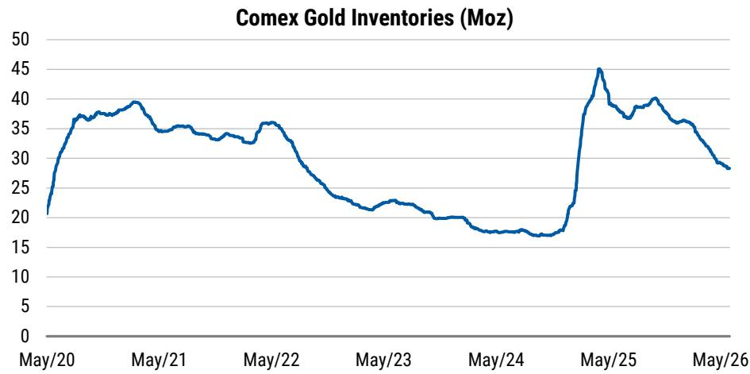

line chart

| Date   | Comex Gold Inventories (Moz) |
|--------|------------------------------|
| May/20 | 20                           |
| May/21 | 38                           |
| May/22 | 35                           |
| May/23 | 22                           |
| May/24 | 17                           |
| May/25 | 45                           |
| May/26 | 28                           |

Source: Bloomberg

Exhibit 85: COMEX-LBMA Gold Premium  
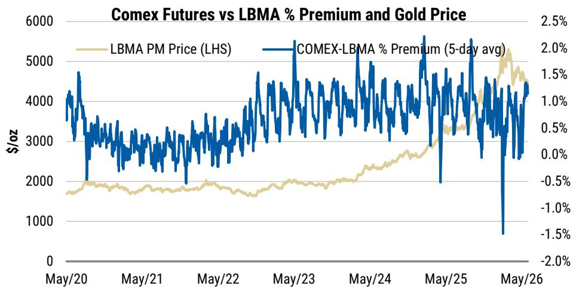

line chart

| Date   | LBMA PM Price (LHS) | COMEX-LBMA % Premium (5-day avg) |
|--------|---------------------|----------------------------------|
| May/20 | ~1800               | ~4.5%                            |
| May/21 | ~1700               | ~3.0%                            |
| May/22 | ~1800               | ~3.5%                            |
| May/23 | ~1900               | ~4.0%                            |
| May/24 | ~2200               | ~4.5%                            |
| May/25 | ~3000               | ~5.5%                            |
| May/26 | ~4500               | ~1.5%                            |

Source: Bloomberg

Exhibit 87: London Gold Vault Stocks  
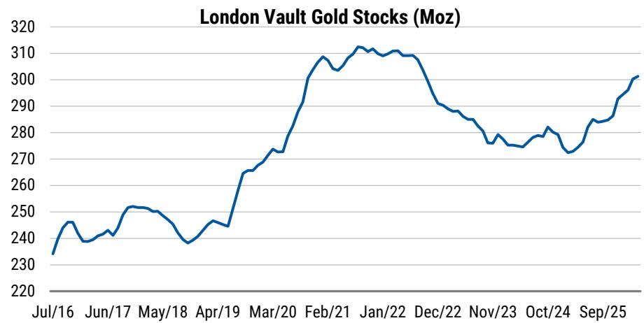

line chart

| Date     | Value |
| -------- | ----- |
| Jul/16   | 235   |
| Jun/17   | 245   |
| May/18   | 250   |
| Apr/19   | 240   |
| Mar/20   | 270   |
| Feb/21   | 310   |
| Jan/22   | 315   |
| Dec/22   | 290   |
| Nov/23   | 280   |
| Oct/24   | 275   |
| Sep/25   | 300   |

Source: LBMA

Exhibit 88: US 10 Year TIPS and DXY  
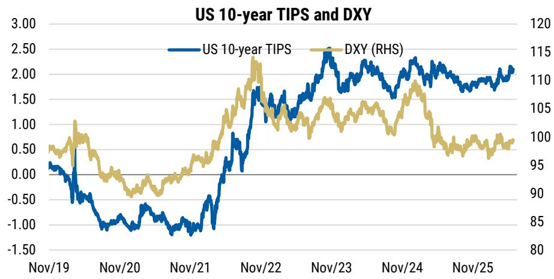

line chart

| Date   | US 10-year TIPS | DXY (RHS) |
|--------|-----------------|-----------|
| Nov/19 | 0.2             | 95        |
| Nov/20 | -1.0            | 85        |
| Nov/21 | -1.2            | 90        |
| Nov/22 | 1.5             | 115       |
| Nov/23 | 2.5             | 105       |
| Nov/24 | 2.0             | 95        |
| Nov/25 | 2.2             | 98        |

Source: Bloomberg

Exhibit 90: Global Gold Demand by Sector  
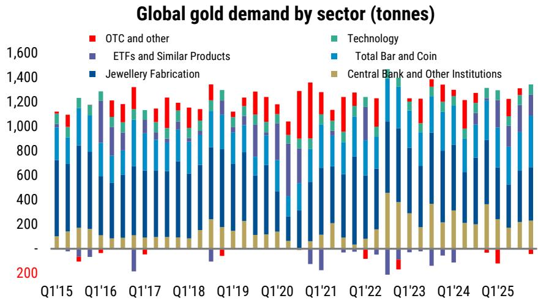

stacked bar chart

| Quarter | OTC and other | Jewellery Fabrication | ETFs and Similar Products | Central Bank and Other Institutions | Technology | Total Bar and Coin |
|---------|---------------|------------------------|---------------------------|--------------------------------------|------------|--------------------|
| Q1'15   | 100           | 700                    | 0                         | 100                                  | 0          | 100                |
| Q1'16   | 100           | 800                    | 0                         | 100                                  | 0          | 100                |
| Q1'17   | 100           | 700                    | 0                         | 100                                  | 0          | 100                |
| Q1'18   | 100           | 700                    | 0                         | 100                                  | 0          | 100                |
| Q1'19   | 100           | 700                    | 0                         | 100                                  | 0          | 100                |
| Q1'20   | 100           | 700                    | 0                         | 100                                  | 0          | 100                |
| Q1'21   | 100           | 700                    | 0                         | 100                                  | 0          | 100                |
| Q1'22   | 100           | 700                    | 0                         | 100                                  | 0          | 100                |
| Q1'23   | 100           | 700                    | 0                         | 100                                  | 0          | 100                |
| Q1'24   | 100           | 700                    | 0                         | 100                                  | 0          | 100                |
| Q1'25   | 100           | 700                    | 0                         | 100                                  | 0          | 100                |

Source: World Gold Council

Exhibit 89: ETF Holdings vs Gold Price  
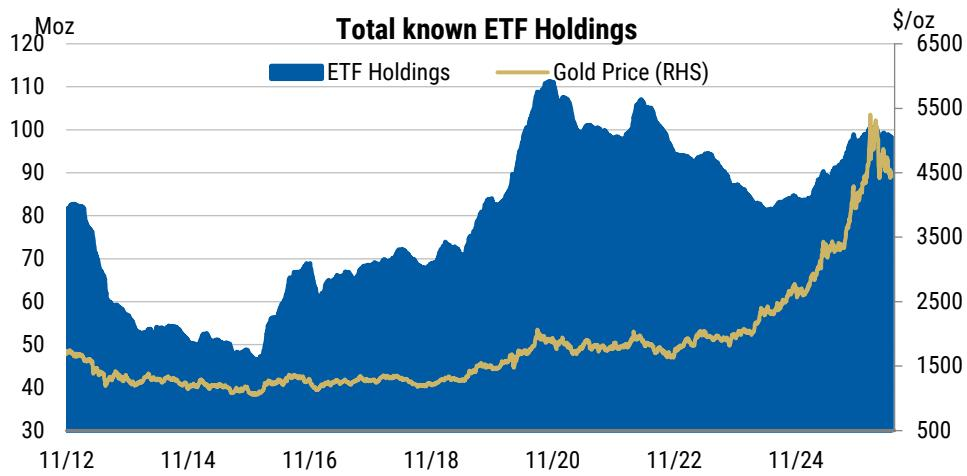

line chart

| Date   | ETF Holdings | Gold Price (RHS) |
|--------|--------------|------------------|
| 11/12  | 83           | 48               |
| 11/14  | 50           | 40               |
| 11/16  | 70           | 42               |
| 11/18  | 75           | 45               |
| 11/20  | 110          | 50               |
| 11/22  | 95           | 55               |
| 11/24  | 100          | 60               |

Source: Bloomberg

Exhibit 91: Gold Cost Curve Evolution  
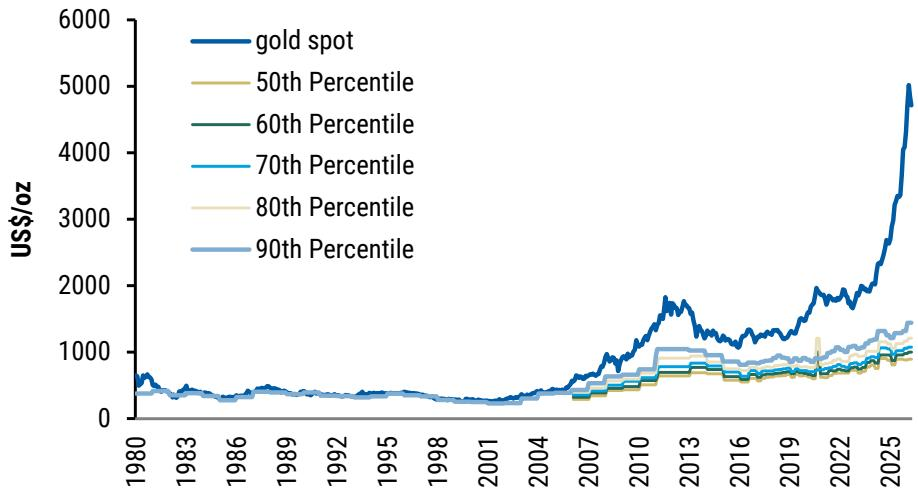

line chart

| Year | gold spot | 50th Percentile | 60th Percentile | 70th Percentile | 80th Percentile | 90th Percentile |
|------|-----------|-----------------|-----------------|-----------------|-----------------|-----------------|
| 1980 | ~500      | ~300            | ~200            | ~200            | ~200            | ~200            |
| 1983 | ~400      | ~300            | ~200            | ~200            | ~200            | ~200            |
| 1986 | ~400      | ~300            | ~200            | ~200            | ~200            | ~200            |
| 1989 | ~400      | ~300            | ~200            | ~200            | ~200            | ~200            |
| 1992 | ~400      | ~300            | ~200            | ~200            | ~200            | ~200            |
| 1995 | ~400      | ~300            | ~200            | ~200            | ~200            | ~200            |
| 1998 | ~400      | ~300            | ~200            | ~200            | ~200            | ~200            |
| 2001 | ~400      | ~300            | ~200            | ~200            | ~200            | ~200            |
| 2004 | ~500      | ~400            | ~300            | ~300            | ~300            | ~300            |
| 2007 | ~700      | ~500            | ~400            | ~400            | ~400            | ~400            |
| 2010 | ~1500     | ~700            | ~600            | ~600            | ~600            | ~600            |
| 2013 | ~1800     | ~800            | ~700            | ~700            | ~700            | ~700            |
| 2016 | ~1200     | ~600            | ~550            | ~550            | ~550            | ~550            |
| 2019 | ~1500     | ~750            | ~650            | ~650            | ~650            | ~650            |
| 2022 | ~1800     | ~900            | ~850            | ~850            | ~850            | ~850            |
| 2025 | ~500      | ~1100           | ~1356           | ~1356           | ~1356           | ~1356           |

Source: Woodmac

Exhibit 92: Geopolitical Risk Index  
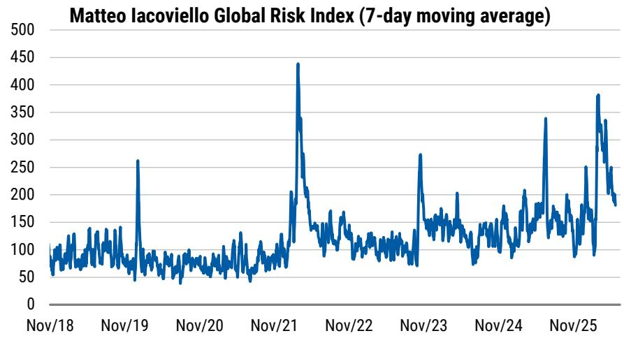

line chart

| Date    | Value |
|---------|-------|
| Nov/18  | ~100  |
| Nov/19  | ~260  |
| Nov/20  | ~80   |
| Nov/21  | ~430  |
| Nov/22  | ~150  |
| Nov/23  | ~270  |
| Nov/24  | ~180  |
| Nov/25  | ~380  |

Source: Mateo Iacoviello

Exhibit 93: Monthly Central Bank Purchasing  
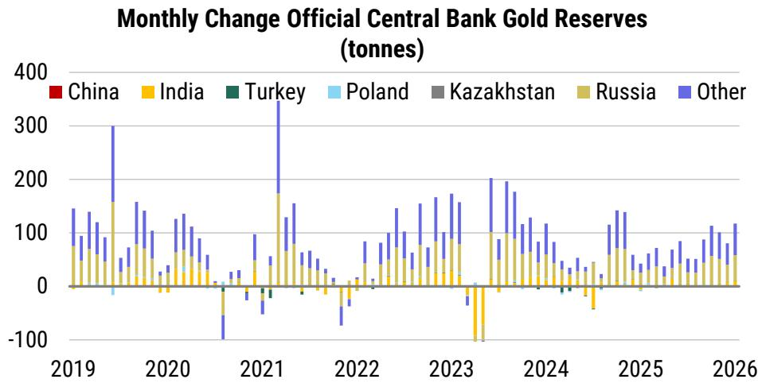

bar chart

| Year | China | India | Turkey | Poland | Kazakhstan | Russia | Other |
|------|-------|-------|--------|--------|------------|--------|-------|
| 2019 |       |       |        |        |            |        | 150   |
| 2020 |       |       |        |        |            |        | 100   |
| 2021 |       |       |        |        |            |        | 350   |
| 2022 |       |       |        |        |            |        | 150   |
| 2023 |       |       |        |        |            |        | 200   |
| 2024 |       |       |        |        |            |        | 150   |
| 2025 |       |       |        |        |            |        | 150   |
| 2026 |       |       |        |        |            |        | 150   |

Source: World Gold Council

Exhibit94: Gold/Silver Ratio  
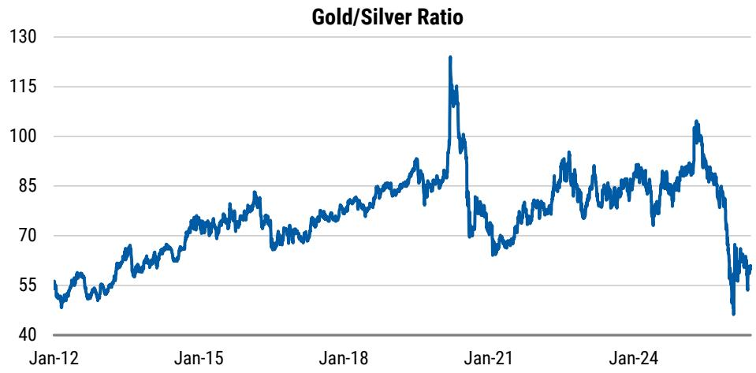

line chart

| Date   | Gold/Silver Ratio |
|--------|-------------------|
| Jan-12 | 50                |
| Jan-15 | 70                |
| Jan-18 | 80                |
| Jan-21 | 120               |
| Jan-24 | 85                |
| End    | 55                |

Source: Bloomberg

Exhibit95: CFTC Silver Futures Positioning  
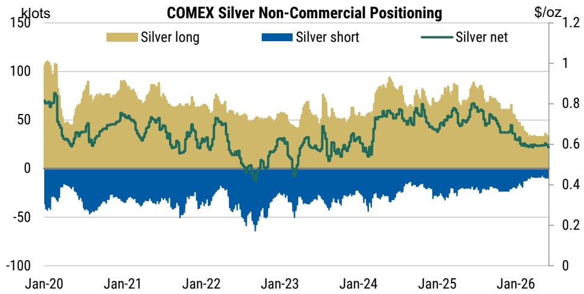

line chart

| Date   | Silver short | Silver long | Silver net |
|--------|-------------|-------------|------------|
| Jan-20 | -50         | 100         | 0.8        |
| Jan-21 | -50         | 80          | 0.7        |
| Jan-22 | -50         | 60          | 0.6        |
| Jan-23 | -50         | 40          | 0.5        |
| Jan-24 | -50         | 80          | 0.7        |
| Jan-25 | -50         | 60          | 0.6        |
| Jan-26 | -50         | 40          | 0.5        |

Source: Bloomberg

Exhibit 96: COMEX Silver Inventories  
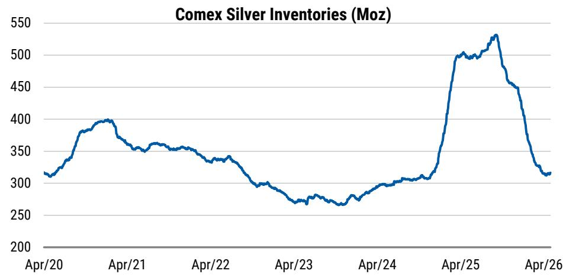

line chart

| Date   | Comex Silver Inventories (Moz) |
|--------|-------------------------------|
| Apr/20 | 310                           |
| Apr/21 | 400                           |
| Apr/22 | 350                           |
| Apr/23 | 270                           |
| Apr/24 | 300                           |
| Apr/25 | 500                           |
| Apr/26 | 310                           |

Source: Bloomberg

Exhibit 98: Total ETF Holdings  
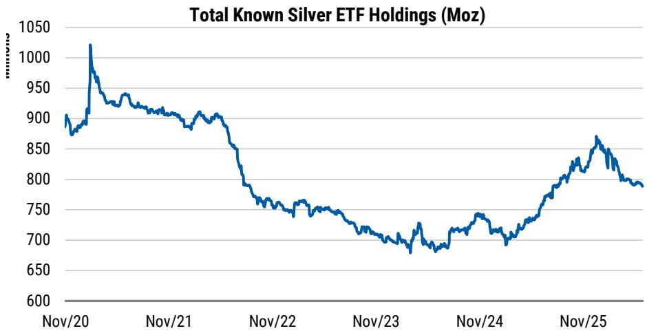

line chart

| Date    | Value |
|---------|-------|
| Nov/20  | 900   |
| Nov/21  | 950   |
| Nov/22  | 750   |
| Nov/23  | 700   |
| Nov/24  | 750   |
| Nov/25  | 850   |

Source: Bloomberg

Exhibit 97: London Vault Silver Stocks  
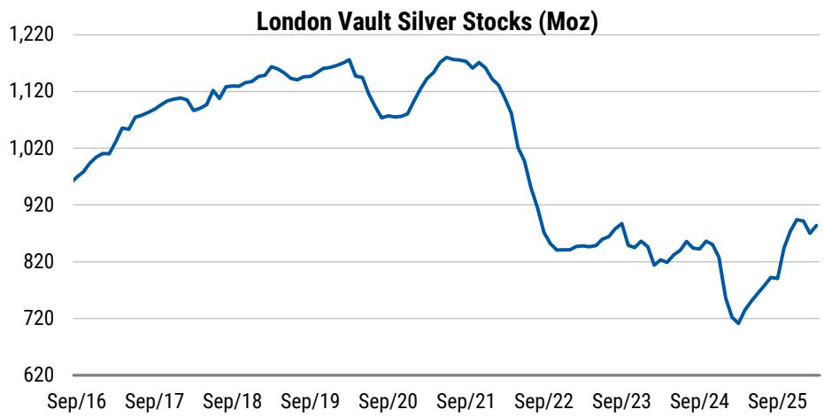

line chart

| Date   | Value |
|--------|-------|
| Sep/16 | 930   |
| Sep/17 | 1050  |
| Sep/18 | 1100  |
| Sep/19 | 1150  |
| Sep/20 | 1080  |
| Sep/21 | 1180  |
| Sep/22 | 820   |
| Sep/23 | 850   |
| Sep/24 | 720   |
| Sep/25 | 880   |

Source: LBMA

Exhibit 99: China Solar Installations  
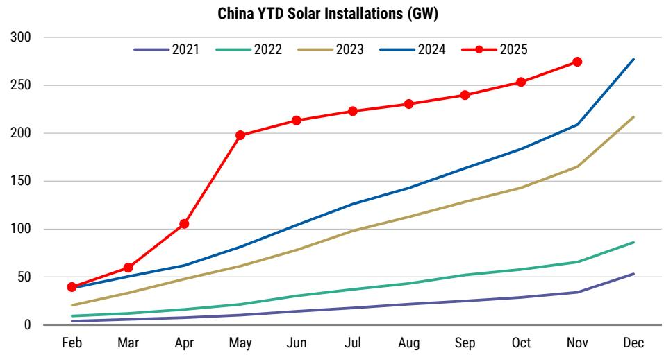

line chart

China YTD Solar Installations (GW)
| Month | 2021 (GW) | 2022 (GW) | 2023 (GW) | 2024 (GW) | 2025 (GW) |
|---|---|---|---|---|---|
| Feb | 5 | 8 | 18 | 38 | 40 |
| Mar | 7 | 12 | 30 | 50 | 60 |
| Apr | 9 | 16 | 45 | 62 | 105 |
| May | 12 | 22 | 60 | 80 | 198 |
| Jun | 15 | 30 | 75 | 105 | 213 |
| Jul | 18 | 38 | 95 | 125 | 223 |
| Aug | 21 | 45 | 110 | 140 | 230 |
| Sep | 24 | 52 | 125 | 160 | 240 |
| Oct | 27 | 58 | 140 | 180 | 253 |
| Nov | 33 | 65 | 163 | 208 | 273 |
| Dec | 53 | 85 | 217 | 277 | - |

Source: Bloomberg

## Iron Ore & Steel

Exhibit 100: China CISA Steel Production  
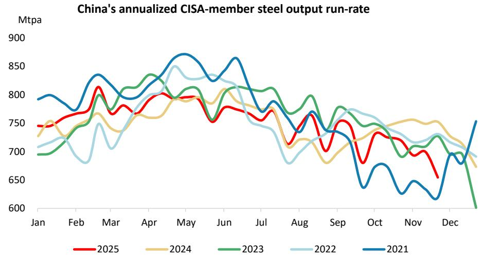

line chart

| Month | 2021 | 2022 | 2023 | 2024 | 2025 |
|-------|------|------|------|------|------|
| Jan   | 795  | 710  | 695  | 730  | 745  |
| Feb   | 780  | 680  | 700  | 740  | 750  |
| Mar   | 830  | 750  | 780  | 760  | 810  |
| Apr   | 840  | 790  | 830  | 770  | 800  |
| May   | 870  | 850  | 810  | 790  | 800  |
| Jun   | 860  | 830  | 810  | 780  | 790  |
| Jul   | 780  | 750  | 810  | 770  | 760  |
| Aug   | 740  | 680  | 790  | 730  | 710  |
| Sep   | 730  | 760  | 780  | 720  | 750  |
| Oct   | 640  | 730  | 740  | 710  | 680  |
| Nov   | 630  | 710  | 720  | 750  | 690  |
| Dec   | 610  | 690  | 600  | 680  | 650  |

Source: CISA

Exhibit 101: China Steel Inventory  
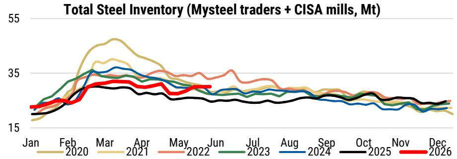

line chart

| Month | 2020 | 2021 | 2022 | 2023 | 2024 | 2025 | 2026 |
|-------|------|------|------|------|------|------|------|
| Jan   | 16   | 17   | 18   | 19   | 18   | 17   | 18   |
| Feb   | 20   | 19   | 20   | 21   | 20   | 19   | 20   |
| Mar   | 35   | 34   | 33   | 34   | 35   | 34   | 33   |
| Apr   | 38   | 37   | 36   | 37   | 36   | 35   | 34   |
| May   | 36   | 35   | 34   | 35   | 34   | 33   | 32   |
| Jun   | 34   | 33   | 32   | 33   | 32   | 31   | 30   |
| Jul   | 32   | 31   | 30   | 31   | 30   | 29   | 28   |
| Aug   | 30   | 29   | 28   | 29   | 28   | 27   | 26   |
| Sep   | 28   | 27   | 26   | 27   | 26   | 25   | 24   |
| Oct   | 26   | 25   | 24   | 25   | 24   | 23   | 22   |
| Nov   | 24   | 23   | 22   | 23   | 22   | 21   | 20   |
| Dec   | 22   | 21   | 20   | 21   | 20   | 19   | 18   |

Source: Mysteel

Exhibit 102: China Steel Exports  
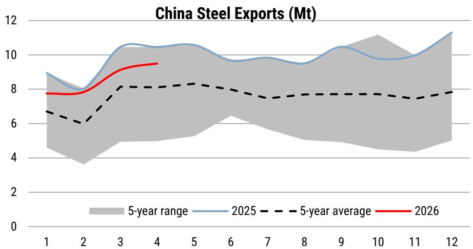

line chart

| Month | 2025 | 2026 | 5-year average |
|-------|------|------|----------------|
| 1     | 9.0  | 7.8  | 6.8            |
| 2     | 8.0  | 7.8  | 6.0            |
| 3     | 10.5 | 8.5  | 8.0            |
| 4     | 10.5 | 9.5  | 8.0            |
| 5     | 10.5 | -    | 8.0            |
| 6     | 10.0 | -    | 7.8            |
| 7     | 10.0 | -    | 7.5            |
| 8     | 10.0 | -    | 7.5            |
| 9     | 10.5 | -    | 7.5            |
| 10    | 11.0 | -    | 7.5            |
| 11    | 10.0 | -    | 7.5            |
| 12    | 11.5 | -    | 7.8            |

Source: Bloomberg

Exhibit 103: Global Steel Production  
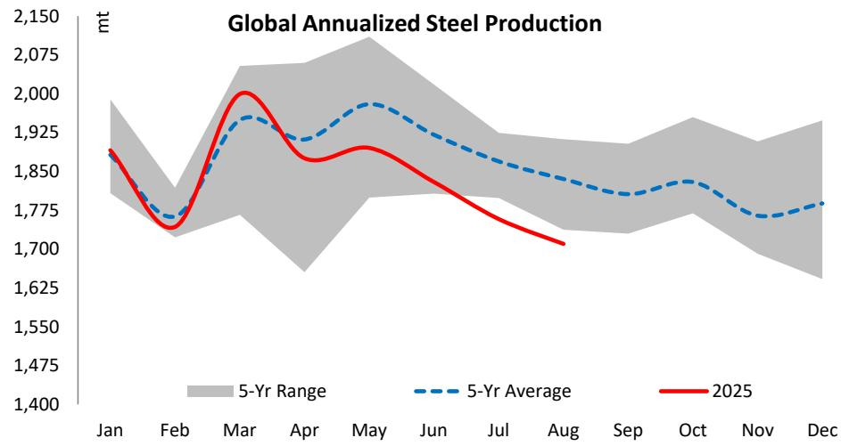

line chart

| Month | 2025  | 5-Yr Average | 5-Yr Range |
|-------|-------|--------------|------------|
| Jan   | 1870  | 1860         | 1900-2000  |
| Feb   | 1730  | 1740         | 1750-1800  |
| Mar   | 2000  | 1950         | 2050-2150  |
| Apr   | 1860  | 1920         | 2000-2100  |
| May   | 1880  | 1980         | 2100-2200  |
| Jun   | 1840  | 1960         | 2050-2150  |
| Jul   | 1780  | 1940         | 2000-2100  |
| Aug   | 1710  | 1920         | 1950-2050  |
| Sep   | -     | 1880         | 1900-2050  |
| Oct   | -     | 1860         | 1950-2100  |
| Nov   | -     | 1840         | 1900-2050  |
| Dec   | -     | 1780         | 1850-2150  |

Source: WSA

Exhibit 104: China BF Utilisation Rate  
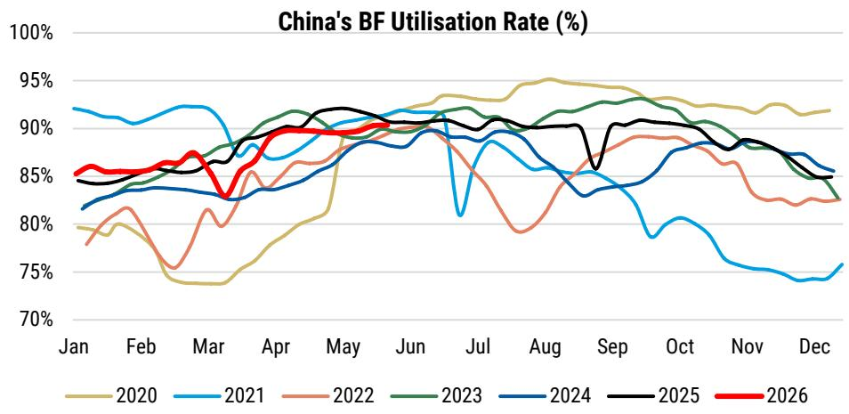

line chart

| Month | 2020 | 2021 | 2022 | 2023 | 2024 | 2025 | 2026 |
|-------|------|------|------|------|------|------|------|
| Jan   | 80%  | 92%  | 78%  | 85%  | 82%  | 85%  | 86%  |
| Feb   | 79%  | 91%  | 81%  | 86%  | 83%  | 86%  | 87%  |
| Mar   | 74%  | 92%  | 75%  | 87%  | 84%  | 87%  | 88%  |
| Apr   | 76%  | 87%  | 85%  | 90%  | 85%  | 90%  | 90%  |
| May   | 80%  | 90%  | 87%  | 91%  | 86%  | 91%  | 91%  |
| Jun   | 85%  | 91%  | 88%  | 92%  | 87%  | 92%  | 91%  |
| Jul   | 88%  | 81%  | 85%  | 91%  | 88%  | 91%  | 90%  |
| Aug   | 95%  | 85%  | 79%  | 93%  | 86%  | 93%  | 89%  |
| Sep   | 94%  | 86%  | 87%  | 92%  | 85%  | 92%  | 88%  |
| Oct   | 93%  | 80%  | 88%  | 91%  | 86%  | 91%  | 87%  |
| Nov   | 92%  | 75%  | 85%  | 89%  | 85%  | 89%  | 86%  |
| Dec   | 91%  | 74%  | 83%  | 87%  | 84%  | 87%  | -    |

Source: Mysteel

Exhibit 105: China EAF Utilisation Rate  
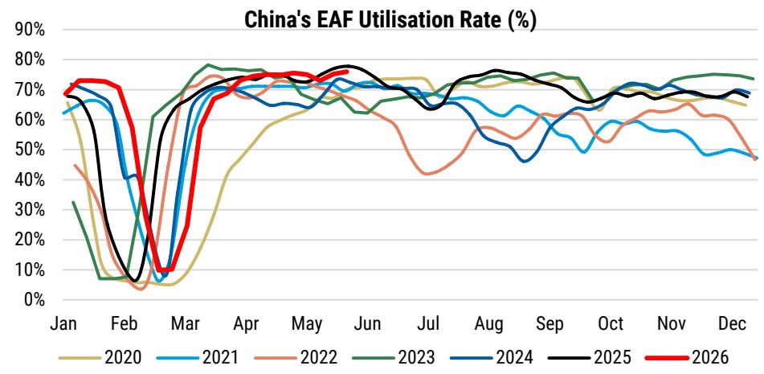

line chart

| Month | 2020 | 2021 | 2022 | 2023 | 2024 | 2025 | 2026 |
|-------|------|------|------|------|------|------|------|
| Jan   | ~65% | ~68% | ~45% | ~32% | ~70% | ~70% | ~72% |
| Feb   | ~5%  | ~5%  | ~5%  | ~5%  | ~40% | ~5%  | ~10% |
| Mar   | ~10% | ~10% | ~10% | ~10% | ~10% | ~10% | ~10% |
| Apr   | ~40% | ~60% | ~65% | ~75% | ~70% | ~75% | ~75% |
| May   | ~60% | ~65% | ~65% | ~75% | ~70% | ~75% | ~75% |
| Jun   | ~70% | ~70% | ~60% | ~75% | ~70% | ~75% | ~75% |
| Jul   | ~65% | ~65% | ~40% | ~70% | ~65% | ~70% | ~70% |
| Aug   | ~65% | ~65% | ~50% | ~75% | ~65% | ~75% | ~75% |
| Sep   | ~65% | ~65% | ~60% | ~75% | ~65% | ~75% | ~75% |
| Oct   | ~65% | ~65% | ~60% | ~75% | ~65% | ~75% | ~75% |
| Nov   | ~65% | ~65% | ~65% | ~75% | ~65% | ~75% | ~75% |
| Dec   | ~65% | ~65% | ~60% | ~75% | ~65% | ~75% | ~75% |

Source: Mysteel

Exhibit 106: China Steel Scrap Ratio  
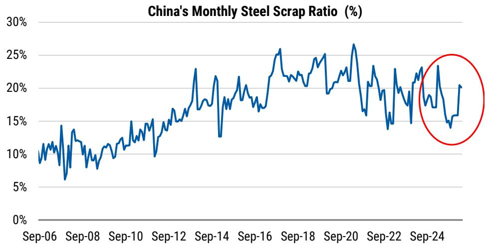

line chart

| Date   | China's Monthly Steel Scrap Ratio (%) |
|--------|----------------------------------------|
| Sep-06 | ~9.5%                                  |
| Sep-08 | ~13.5%                                 |
| Sep-10 | ~11.5%                                 |
| Sep-12 | ~14.5%                                 |
| Sep-14 | ~17.5%                                 |
| Sep-16 | ~20.5%                                 |
| Sep-18 | ~25.5%                                 |
| Sep-20 | ~26.5%                                 |
| Sep-22 | ~14.5%                                 |
| Sep-24 | ~15.5%                                 |

Source: Bloomberg

Exhibit 107: China Steel Mill Margin  
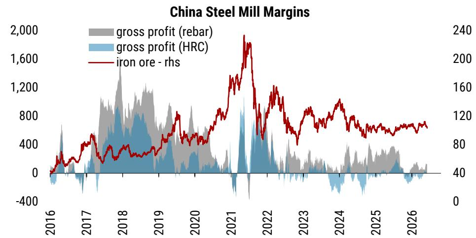

line chart

| Year | gross profit (rebar) | gross profit (HRC) | iron ore - rhs |
|------|----------------------|--------------------|----------------|
| 2016 | ~0                   | ~0                 | ~0             |
| 2017 | ~400                 | ~300               | ~40            |
| 2018 | ~1,500               | ~800               | ~60            |
| 2019 | ~800                 | ~400               | ~80            |
| 2020 | ~600                 | ~300               | ~100           |
| 2021 | ~1,800               | ~1,000             | ~160           |
| 2022 | ~1,200               | ~600               | ~120           |
| 2023 | ~400                 | ~200               | ~80            |
| 2024 | ~600                 | ~300               | ~100           |
| 2025 | ~400                 | ~200               | ~80            |
| 2026 | ~300                 | ~100               | ~70            |

Source: Mysteel

Exhibit 108: China BF Utilisation  
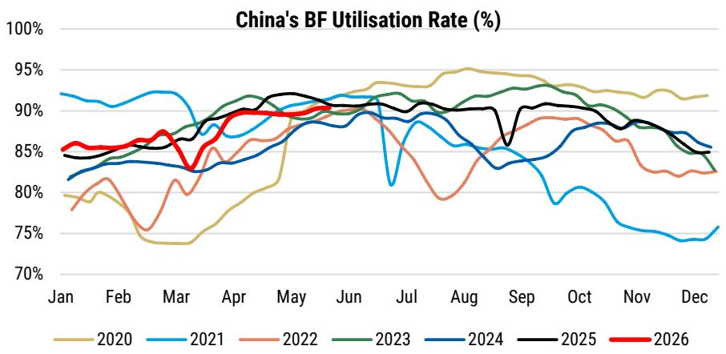

line chart

| Month | 2020 | 2021 | 2022 | 2023 | 2024 | 2025 | 2026 |
|-------|------|------|------|------|------|------|------|
| Jan   | 80%  | 92%  | 78%  | 85%  | 83%  | 85%  | 86%  |
| Feb   | 78%  | 91%  | 82%  | 86%  | 84%  | 86%  | 87%  |
| Mar   | 74%  | 92%  | 75%  | 87%  | 85%  | 87%  | 88%  |
| Apr   | 76%  | 88%  | 85%  | 90%  | 86%  | 90%  | 89%  |
| May   | 80%  | 90%  | 87%  | 91%  | 88%  | 91%  | 90%  |
| Jun   | 93%  | 91%  | 89%  | 92%  | 89%  | 91%  | 91%  |
| Jul   | 94%  | 81%  | 85%  | 91%  | 88%  | 90%  | 90%  |
| Aug   | 95%  | 85%  | 79%  | 92%  | 87%  | 91%  | 90%  |
| Sep   | 94%  | 83%  | 87%  | 93%  | 86%  | 90%  | 89%  |
| Oct   | 93%  | 79%  | 86%  | 92%  | 85%  | 89%  | 88%  |
| Nov   | 92%  | 75%  | 84%  | 91%  | 84%  | 88%  | 87%  |
| Dec   | 91%  | 74%  | 83%  | 85%  | 83%  | 86%  | -    |

Source: Bloomberg

Exhibit 109: China Iron Ore Port Inventory  
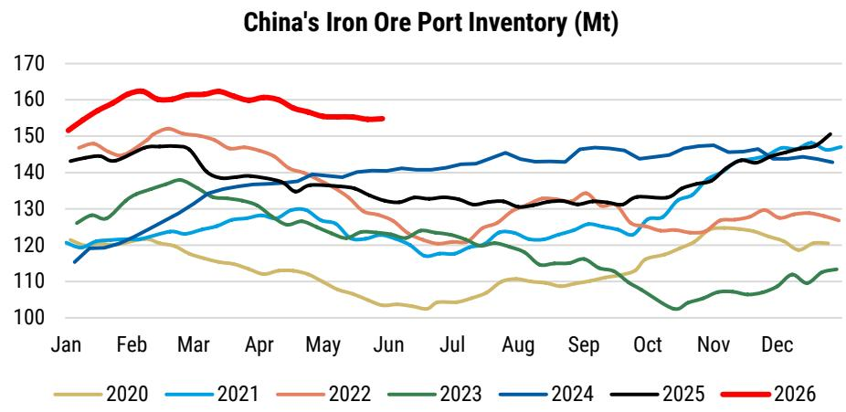

line chart

| Month | 2020 | 2021 | 2022 | 2023 | 2024 | 2025 | 2026 |
|-------|------|------|------|------|------|------|------|
| Jan   | 120  | 120  | 148  | 125  | 115  | 145  | 150  |
| Feb   | 122  | 122  | 150  | 130  | 120  | 148  | 160  |
| Mar   | 120  | 125  | 155  | 135  | 130  | 148  | 160  |
| Apr   | 118  | 128  | 150  | 130  | 135  | 145  | 160  |
| May   | 115  | 130  | 145  | 125  | 138  | 140  | 158  |
| Jun   | 105  | 125  | 135  | 120  | 140  | 135  | 155  |
| Jul   | 108  | 120  | 130  | 125  | 142  | 138  | —    |
| Aug   | 110  | 125  | 135  | 128  | 145  | 135  | —    |
| Sep   | 112  | 130  | 138  | 130  | 148  | 138  | —    |
| Oct   | 115  | 135  | 135  | 135  | 145  | 135  | —    |
| Nov   | 120  | 140  | 138  | 138  | 148  | 140  | —    |
| Dec   | 122  | 145  | 140  | 140  | 145  | 145  | —    |

Source: Mysteel

Exhibit 110: Australia Iron Ore Shipments  
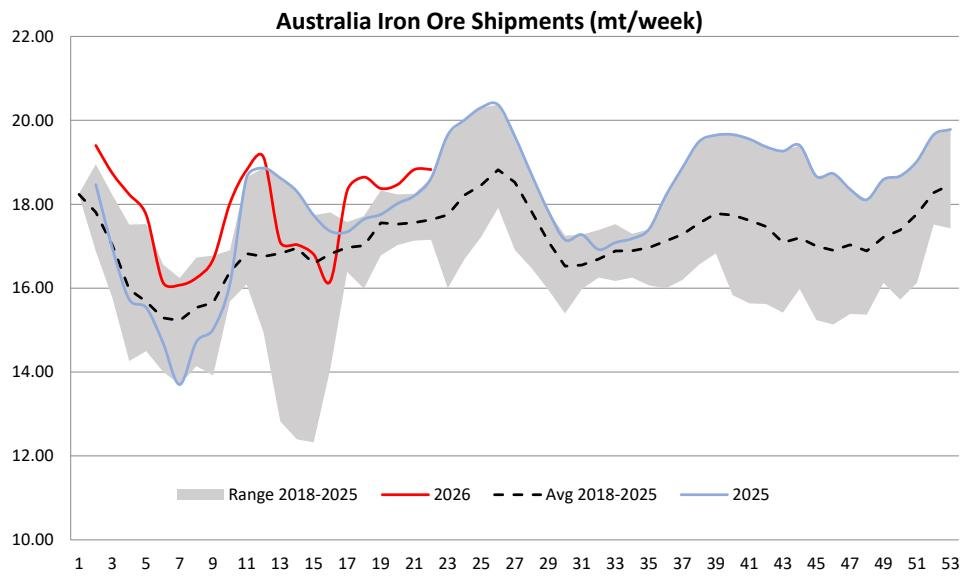

line chart

| Week | Range 2018-2025 | Avg 2018-2025 | 2026 | 2025 |
|------|-----------------|---------------|------|------|
| 1    | ~18.5           | ~18.3         | ~19.5| ~18.7|
| 3    | ~18.0           | ~17.8         | ~18.8| ~18.4|
| 5    | ~17.5           | ~17.3         | ~18.0| ~17.7|
| 7    | ~16.5           | ~16.3         | ~16.0| ~15.7|
| 9    | ~16.0           | ~15.8         | ~16.5| ~16.2|
| 11   | ~16.5           | ~16.3         | ~19.0| ~18.7|
| 13   | ~17.0           | ~16.8         | ~17.0| ~17.5|
| 15   | ~17.5           | ~17.3         | ~16.0| ~16.7|
| 17   | ~17.0           | ~16.8         | ~18.5| ~17.3|
| 19   | ~17.5           | ~17.3         | ~18.3| ~17.7|
| 21   | ~18.0           | ~17.8         | ~18.8| ~18.4|
| 23   | ~18.5           | ~18.3         | ~19.0| ~19.2|
| 25   | ~19.0           | ~18.8         | ~20.5| ~20.3|
| 27   | ~19.5           | ~19.3         | ~20.0| ~20.5|
| 29   | ~19.0           | ~18.8         | ~17.0| ~17.3|
| 31   | ~18.5           | ~18.3         | ~16.5| ~16.7|
| 33   | ~18.0           | ~17.8         | ~16.8| ~17.0|
| 35   | ~17.5           | ~17.3         | ~17.0| ~17.3|
| 37   | ~17.0           | ~16.8         | ~17.5| ~17.8|
| 39   | ~16.5           | ~16.3         | ~17.8| ~18.2|
| 41   | ~16.0           | ~15.8         | ~17.5| ~18.0|
| 43   | ~15.5           | ~15.3         | ~17.3| ~17.8|
| 45   | ~15.0           | ~14.8         | ~17.0| ~17.5|
| 47   | ~14.5           | ~14.3         | ~16.8| ~17.3|
| 49   | ~14.0           | ~13.8         | ~16.5| ~17.0|
| 51   | ~13.5           | ~13.3         | ~16.3| ~16.8|
| 53   | ~13.0           | ~12.8         | ~16.0| ~16.5|

Source: Eikon

Exhibit 111: China Iron Ore Arrivals  
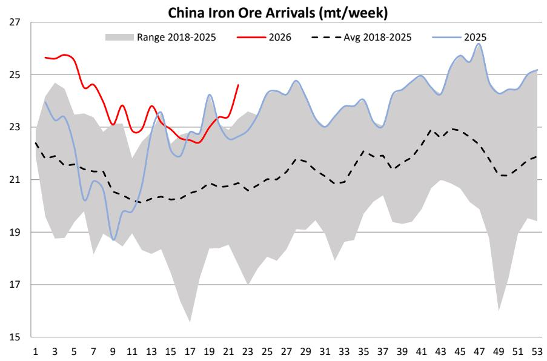

line chart

| Month | 2026 (mt/week) | 2025 (mt/week) | Avg 2018-2025 (mt/week) |
|-------|----------------|----------------|-------------------------|
| 1     | 25.5           | 24.0           | 23.0                    |
| 3     | 25.8           | 24.5           | 23.5                    |
| 5     | 25.7           | 24.8           | 23.8                    |
| 7     | 24.8           | 23.5           | 23.0                    |
| 9     | 23.0           | 19.0           | 21.5                    |
| 11    | 23.5           | 19.5           | 21.8                    |
| 13    | 24.0           | 23.0           | 22.0                    |
| 15    | 23.0           | 23.5           | 21.8                    |
| 17    | 23.5           | 17.0           | 21.5                    |
| 19    | 23.0           | 24.0           | 21.8                    |
| 21    | 23.5           | 23.0           | 21.5                    |
| 23    | 24.5           | 23.5           | 21.8                    |
| 25    | 24.0           | 24.0           | 21.5                    |
| 27    | 24.5           | 24.5           | 21.8                    |
| 29    | 24.0           | 24.0           | 21.5                    |
| 31    | 23.5           | 23.0           | 21.8                    |
| 33    | 23.0           | 23.5           | 21.5                    |
| 35    | 23.5           | 24.0           | 21.8                    |
| 37    | 24.0           | 24.5           | 21.5                    |
| 39    | 24.5           | 24.8           | 21.8                    |
| 41    | 24.8           | 25.0           | 21.5                    |
| 43    | 24.5           | 24.8           | 21.8                    |
| 45    | 24.8           | 25.5           | 21.5                    |
| 47    | 24.5           | 26.0           | 21.8                    |
| 49    | 24.0           | 17.0           | 21.5                    |
| 51    | 24.5           | 24.8           | 21.8                    |
| 53    | 24.8           | 25.0           | 21.5                    |

Source: Eikon

Exhibit 112: India Iron Ore Shipments  
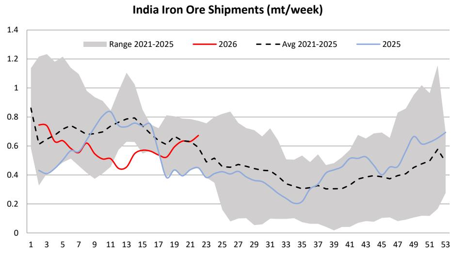

line chart

| Month | 2021-2025 Range | Avg 2021-2025 | 2026 | 2025 |
|-------|-----------------|---------------|------|------|
| 1     | ~1.1            | ~0.8          | ~0.7 | ~0.4 |
| 3     | ~1.2            | ~0.7          | ~0.7 | ~0.4 |
| 5     | ~1.1            | ~0.7          | ~0.6 | ~0.5 |
| 7     | ~1.0            | ~0.7          | ~0.6 | ~0.5 |
| 9     | ~0.9            | ~0.7          | ~0.6 | ~0.6 |
| 11    | ~1.1            | ~0.7          | ~0.5 | ~0.8 |
| 13    | ~1.0            | ~0.7          | ~0.5 | ~0.7 |
| 15    | ~0.9            | ~0.7          | ~0.5 | ~0.7 |
| 17    | ~0.8            | ~0.6          | ~0.5 | ~0.4 |
| 19    | ~0.8            | ~0.6          | ~0.5 | ~0.4 |
| 21    | ~0.8            | ~0.6          | ~0.6 | ~0.4 |
| 23    | ~0.8            | ~0.5          | ~0.6 | ~0.4 |
| 25    | ~0.8            | ~0.5          | ~0.6 | ~0.4 |
| 27    | ~0.8            | ~0.5          | ~0.6 | ~0.4 |
| 29    | ~0.8            | ~0.5          | ~0.6 | ~0.4 |
| 31    | ~0.8            | ~0.5          | ~0.6 | ~0.4 |
| 33    | ~0.8            | ~0.4          | ~0.6 | ~0.3 |
| 35    | ~0.8            | ~0.4          | ~0.6 | ~0.3 |
| 37    | ~0.8            | ~0.4          | ~0.6 | ~0.4 |
| 39    | ~0.8            | ~0.4          | ~0.6 | ~0.4 |
| 41    | ~0.8            | ~0.4          | ~0.6 | ~0.5 |
| 43    | ~0.8            | ~0.4          | ~0.6 | ~0.5 |
| 45    | ~0.8            | ~0.4          | ~0.6 | ~0.5 |
| 47    | ~0.8            | ~0.4          | ~0.6 | ~0.5 |
| 49    | ~1.1            | ~0.4          | ~0.6 | ~0.6 |
| 51    | ~1.1            | ~0.5          | ~0.6 | ~0.7 |
| 53    | ~1.1            | ~0.5          | ~0.6 | ~0.7 |

Source: Eikon

Exhibit 113: Brazil Iron Ore Shipments  
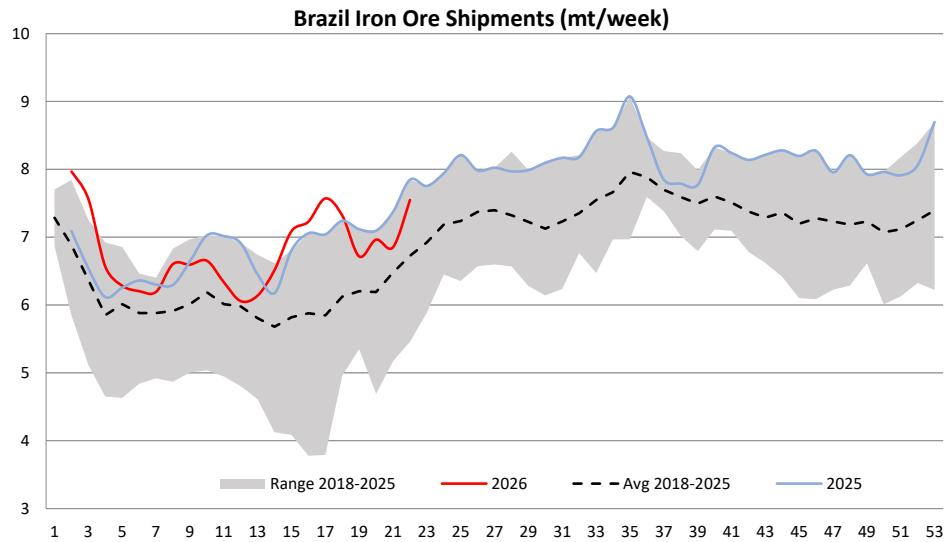

line chart

| Month | 2025 | 2026 | Avg 2018-2025 |
|-------|------|------|---------------|
| 1     |      | 8.0  | 7.3           |
| 3     |      | 7.5  | 6.8           |
| 5     |      | 6.5  | 6.0           |
| 7     |      | 6.3  | 5.9           |
| 9     |      | 6.7  | 6.0           |
| 11    |      | 6.8  | 6.1           |
| 13    |      | 6.0  | 5.8           |
| 15    |      | 6.5  | 6.0           |
| 17    |      | 7.5  | 6.2           |
| 19    |      | 6.8  | 6.4           |
| 21    |      | 7.0  | 6.6           |
| 23    |      | 7.5  | 7.0           |
| 25    |      | 7.8  | 7.3           |
| 27    |      | 8.0  | 7.5           |
| 29    |      | 8.1  | 7.6           |
| 31    |      | 8.2  | 7.7           |
| 33    |      | 8.5  | 7.8           |
| 35    | 9.0  |              |               |
| 37    |      |              |               |
| 39    |      |              |               |
| 41    |      |              |               |
| 43    |      |              |               |
| 45    |      |              |               |
| 47    |      |              |               |
| 49    |      |              |               |
| 51    |      |              |               |
| 53    |      |              |               |

Source: Eikon

Exhibit 114: Freight Rates to China  
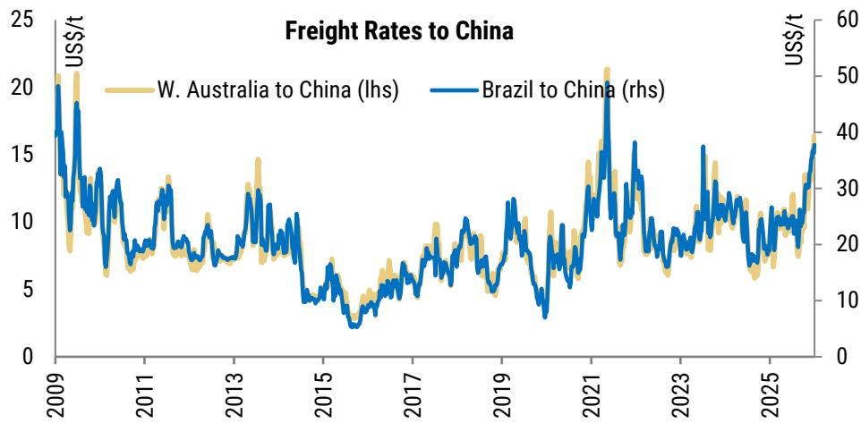

line chart

| Year | W. Australia to China (lhs) | Brazil to China (rhs) |
|------|-----------------------------|------------------------|
| 2009 | ~21                         | ~20                    |
| 2011 | ~13                         | ~14                    |
| 2013 | ~14                         | ~12                    |
| 2015 | ~7                          | ~5                     |
| 2017 | ~8                          | ~6                     |
| 2019 | ~10                         | ~12                    |
| 2021 | ~15                         | ~20                    |
| 2023 | ~13                         | ~16                    |
| 2025 | ~16                         | ~18                    |

Source: Bloomberg

Exhibit 115: Iron Ore Premia/Discount  
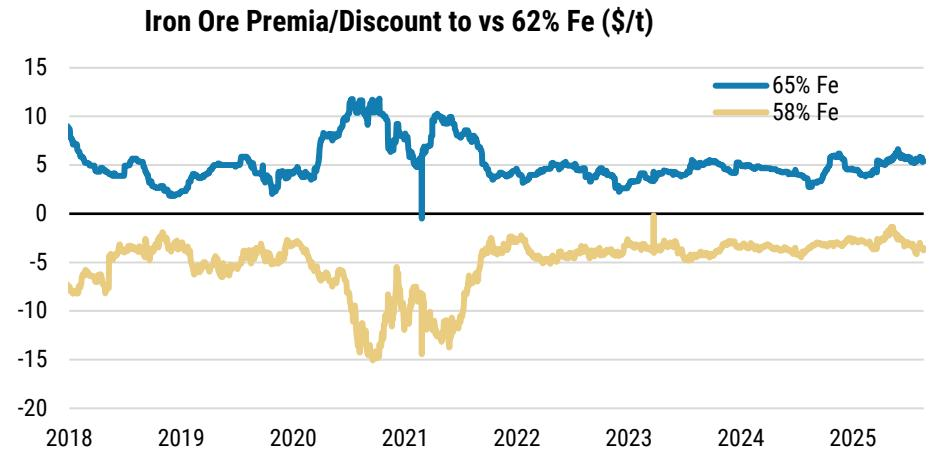

line chart

| Year | 65% Fe | 58% Fe |
|------|--------|--------|
| 2018 | ~9     | ~-7    |
| 2019 | ~4     | ~-5    |
| 2020 | ~3     | ~-4    |
| 2021 | ~11    | ~-15   |
| 2022 | ~4     | ~-3    |
| 2023 | ~3     | ~-2    |
| 2024 | ~5     | ~-3    |
| 2025 | ~6     | ~-3    |

Source: Platts

## Coal

Exhibit 116: China Coal Imports  
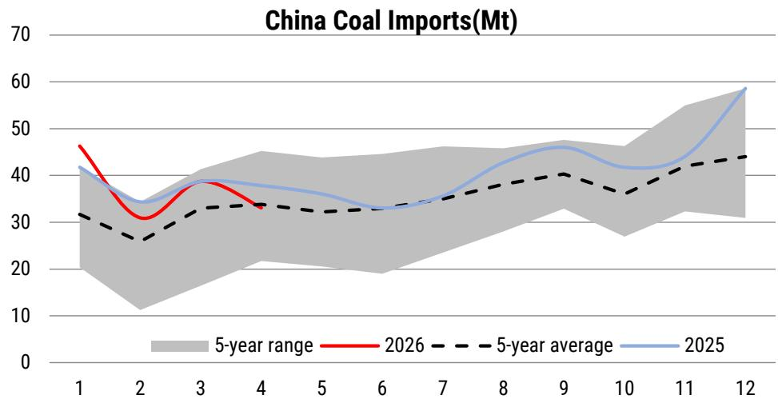

line chart

| Month | 2025 | 2026 | 5-year average |
|-------|------|------|----------------|
| 1     | 42   | 47   | 31             |
| 2     | 34   | 31   | 27             |
| 3     | 38   | 39   | 33             |
| 4     | 36   | 33   | 33             |
| 5     | 35   | -    | 33             |
| 6     | 33   | -    | 33             |
| 7     | 35   | -    | 35             |
| 8     | 40   | -    | 37             |
| 9     | 46   | -    | 40             |
| 10    | 42   | -    | 36             |
| 11    | 48   | -    | 40             |
| 12    | 59   | -    | 44             |

Source: Bloomberg

Exhibit 117: China Coal Production  
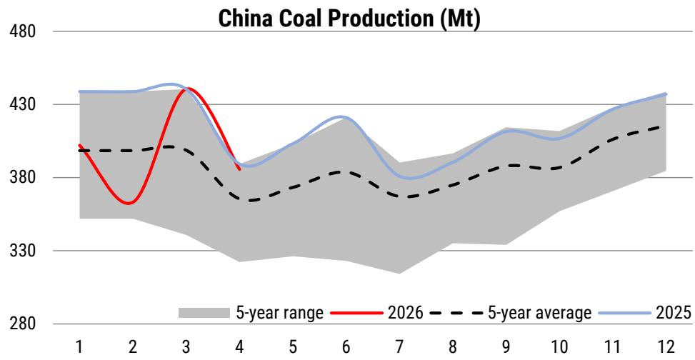

line chart

| Month | 2025 | 2026 | 5-year average | 5-year range |
|-------|------|------|----------------|--------------|
| 1     | 430  | 385  | 385            | 370–430      |
| 2     | 430  | 370  | 385            | 370–430      |
| 3     | 430  | 430  | 385            | 370–430      |
| 4     | 380  | 380  | 375            | 360–410      |
| 5     | 390  | -    | 375            | 360–410      |
| 6     | 400  | -    | 380            | 360–410      |
| 7     | 380  | -    | 375            | 360–410      |
| 8     | 390  | -    | 380            | 360–410      |
| 9     | 400  | -    | 385            | 360–410      |
| 10    | 410  | -    | 390            | 360–410      |
| 11    | 420  | -    | 395            | 360–410      |
| 12    | 430  | -    | 400            | 360–410      |

Source: Bloomberg

Exhibit 118: China Thermal Coal Imports  
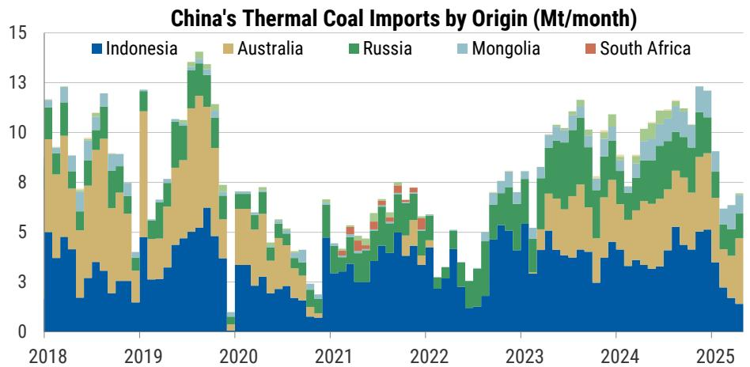

stacked bar chart

China's Thermal Coal Imports by Origin (Mt/month)
| Year | Indonesia (Mt/month) | Australia (Mt/month) | Russia (Mt/month) | Mongolia (Mt/month) | South Africa (Mt/month) |
| :--- | :--- | :--- | :--- | :--- | :--- |
| 2018 | 5.0 | 3.0 | 1.5 | 0.5 | 0.2 |
| 2019 | 4.5 | 3.5 | 1.8 | 0.6 | 0.3 |
| 2020 | 3.5 | 2.5 | 1.2 | 0.4 | 0.1 |
| 2021 | 4.0 | 1.8 | 1.0 | 0.7 | 0.4 |
| 2022 | 4.5 | 2.0 | 1.5 | 0.8 | 0.5 |
| 2023 | 5.0 | 2.5 | 2.0 | 1.0 | 0.6 |
| 2024 | 4.0 | 3.0 | 2.5 | 1.5 | 0.7 |
| 2025 | 5.0 | 3.5 | 2.0 | 1.8 | 0.8 |

Source: McCloskey

Exhibit 119: China Met Coal Imports  
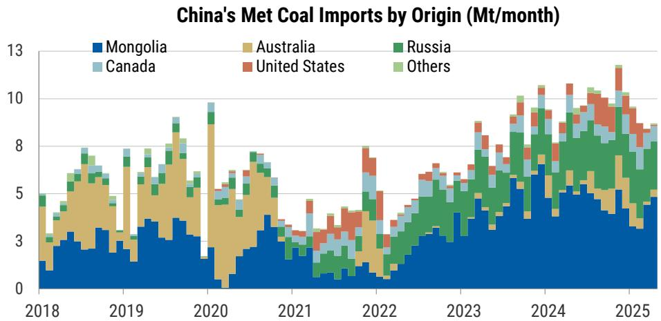

stacked bar chart

China's Met Coal Imports by Origin (Mt/month)
| Year | Mongolia | Australia | Russia | Canada | United States | Others |
|---|---|---|---|---|---|---|
| 2018 | 2.0 | 3.0 | 1.0 | 0.5 | 0.5 | 0.5 |
| 2019 | 2.5 | 3.5 | 1.5 | 0.5 | 0.5 | 0.5 |
| 2020 | 3.0 | 4.0 | 1.0 | 0.5 | 0.5 | 0.5 |
| 2021 | 2.0 | 3.0 | 1.0 | 0.5 | 1.0 | 0.5 |
| 2022 | 1.5 | 2.0 | 1.5 | 1.0 | 2.0 | 0.5 |
| 2023 | 3.0 | 1.0 | 2.0 | 1.0 | 1.0 | 1.0 |
| 2024 | 4.0 | 1.5 | 2.5 | 1.5 | 1.5 | 1.5 |
| 2025 | 4.5 | 1.5 | 3.0 | 1.5 | 2.0 | 1.5 |

Source: McCloskey

Exhibit 120: India Coal Imports  
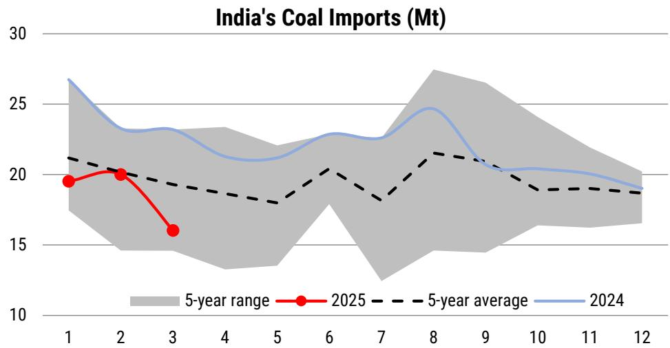

line chart

| Month | 2025 | 5-year average | 2024 |
|-------|------|----------------|------|
| 1     | 19.5 | 21.0           | 26.5 |
| 2     | 20.0 | 20.5           | 23.0 |
| 3     | 16.0 | 18.5           | 23.0 |
| 6     | -    | 20.0           | 23.0 |
| 8     | -    | 21.5           | 24.5 |
| 9     | -    | 21.0           | 26.0 |
| 10    | -    | 19.0           | 20.5 |
| 12    | -    | 18.5           | 19.0 |

Source: McCloskey

Exhibit 121: India Coal Production  
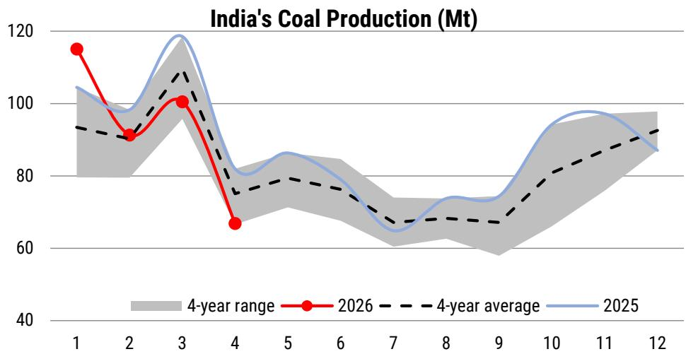

line chart

| Month | 2026 | 4-year average | 2025 |
|-------|------|----------------|------|
| 1     | 115  | 92             | 105  |
| 2     | 90   | 90             | 98   |
| 3     | 100  | 108            | 118  |
| 4     | 67   | 75             | 80   |
| 5     | -    | 78             | 85   |
| 6     | -    | 75             | 80   |
| 7     | -    | 68             | 70   |
| 8     | -    | 68             | 75   |
| 9     | -    | 68             | 75   |
| 10    | -    | 75             | 90   |
| 11    | -    | 80             | 95   |
| 12    | -    | 90             | 88   |

Source: Ministry of Coal, Government of India

Exhibit 122: India Coal Consumption  
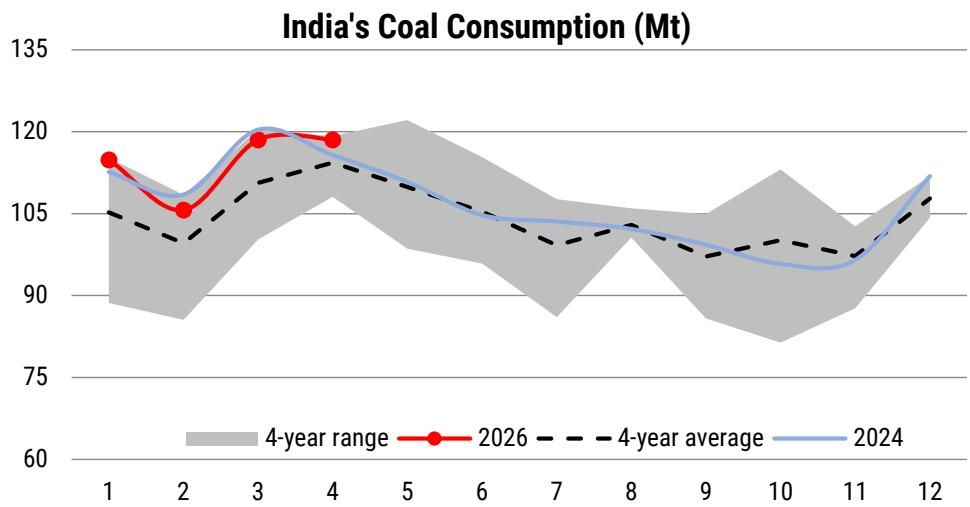

line chart

| Month | 2026 | 4-year average | 2024 |
|-------|------|----------------|------|
| 1     | 118  | 105            | 117  |
| 2     | 105  | 103            | 106  |
| 3     | 119  | 107            | 120  |
| 4     | 119  | 108            | 119  |
| 5     | -    | -              | -    |
| 6     | -    | -              | -    |
| 7     | -    | -              | -    |
| 8     | -    | -              | -    |
| 9     | -    | -              | -    |
| 10    | -    | -              | -    |
| 11    | -    | -              | -    |
| 12    | -    | -              | -    |

Source: Ministry of Coal, Government of India

Exhibit 123: India Coal Inventory at Power Station  
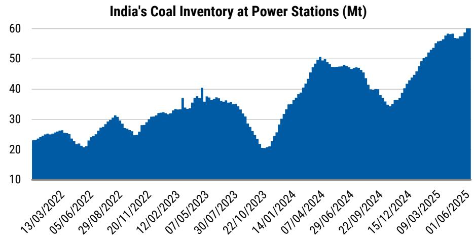

area chart

India's Coal Inventory at Power Stations (Mt)
| Date | Coal Inventory (Mt) |
| :--- | :--- |
| 13/03/2022 | 23 |
| 05/06/2022 | 26 |
| 29/08/2022 | 31 |
| 20/11/2022 | 25 |
| 12/02/2023 | 34 |
| 07/05/2023 | 41 |
| 30/07/2023 | 36 |
| 22/10/2023 | 20 |
| 14/01/2024 | 35 |
| 07/04/2024 | 50 |
| 29/06/2024 | 48 |
| 22/09/2024 | 40 |
| 15/12/2024 | 35 |
| 09/03/2025 | 55 |
| 01/06/2025 | 60 |

Source: McCloskey

Exhibit 124: India Steel Production  
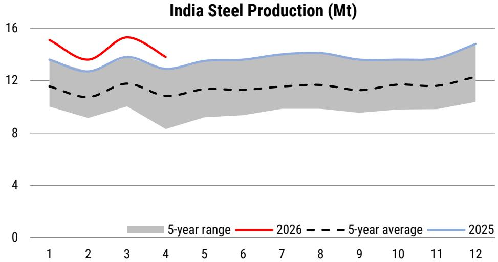

line chart

| Month | 2026 | 5-year average | 2025 |
|-------|------|----------------|------|
| 1     | 15.5 | 11.8           | 13.0 |
| 2     | 14.0 | 11.5           | 12.5 |
| 3     | 15.5 | 11.8           | 13.0 |
| 4     | 14.0 | 11.5           | 12.5 |
| 5     | -    | 11.8           | 13.0 |
| 6     | -    | 11.8           | 13.0 |
| 7     | -    | 11.8           | 13.0 |
| 8     | -    | 11.8           | 13.0 |
| 9     | -    | 11.8           | 13.0 |
| 10    | -    | 11.8           | 13.0 |
| 11    | -    | 11.8           | 13.0 |
| 12    | -    | 12.0           | 14.0 |

Source: Bloomberg

Exhibit 126: India Thermal Coal Imports  
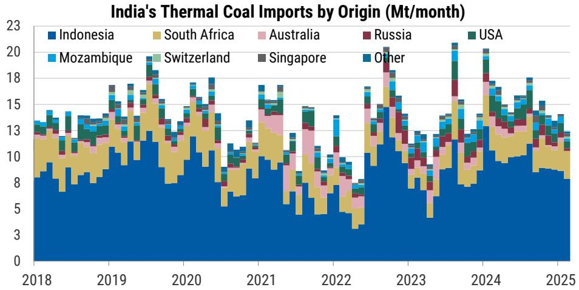

stacked bar chart

India's Thermal Coal Imports by Origin (Mt/month)
| Year | Indonesia (Mt/month) | South Africa (Mt/month) | Australia (Mt/month) | Russia (Mt/month) | USA (Mt/month) | Mozambique (Mt/month) | Switzerland (Mt/month) | Singapore (Mt/month) | Other (Mt/month) |
|---|---|---|---|---|---|---|---|---|---|
| 2018 | 8.5 | 3.0 | 0.5 | 0.5 | 1.0 | 0.5 | 0.5 | 0.5 | 0.5 |
| 2019 | 9.0 | 3.5 | 0.5 | 0.5 | 1.0 | 0.5 | 0.5 | 0.5 | 0.5 |
| 2020 | 10.0 | 4.0 | 0.5 | 0.5 | 1.0 | 0.5 | 0.5 | 0.5 | 0.5 |
| 2021 | 11.0 | 4.5 | 1.0 | 0.5 | 1.0 | 0.5 | 0.5 | 0.5 | 0.5 |
| 2022 | 7.0 | 2.0 | 1.0 | 1.0 | 1.0 | 0.5 | 0.5 | 0.5 | 0.5 |
| 2023 | 12.0 | 4.0 | 1.0 | 1.0 | 1.0 | 0.5 | 0.5 | 0.5 | 0.5 |
| 2024 | 13.0 | 4.5 | 1.0 | 1.0 | 1.0 | 0.5 | 0.5 | 0.5 | 0.5 |
| 2025 | 8.5 | 3.0 | 0.5 | 0.5 | 1.0 | 0.5 | 0.5 | 0.5 | 0.5 |

Source: McCloskey

Exhibit 125: India Coal Arrivals  
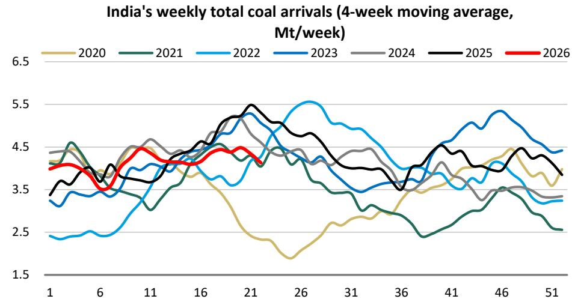

line chart

India's weekly total coal arrivals (4-week moving average, Mt/week)
| Week | 2020 (Mt/week) | 2021 (Mt/week) | 2022 (Mt/week) | 2023 (Mt/week) | 2024 (Mt/week) | 2025 (Mt/week) | 2026 (Mt/week) |
|---|---|---|---|---|---|---|---|
| 1 | 3.8 | 3.9 | 2.4 | 3.4 | 4.4 | 3.5 | 3.7 |
| 6 | 3.6 | 4.5 | 2.5 | 3.5 | 4.3 | 3.6 | 3.5 |
| 11 | 3.7 | 3.4 | 3.0 | 3.6 | 4.5 | 3.7 | 4.0 |
| 16 | 3.5 | 3.6 | 3.5 | 3.8 | 4.5 | 4.2 | 4.1 |
| 21 | 2.5 | 4.0 | 4.0 | 4.5 | 4.8 | 5.5 | 4.5 |
| 26 | 1.7 | 3.8 | 5.5 | 4.8 | 4.5 | 4.8 | 4.0 |
| 31 | 2.5 | 3.5 | 4.8 | 4.2 | 4.0 | 4.0 | 3.8 |
| 36 | 2.8 | 3.0 | 3.8 | 3.5 | 3.5 | 3.5 | 3.5 |
| 41 | 3.5 | 2.5 | 3.8 | 4.5 | 3.8 | 4.5 | 4.0 |
| 46 | 4.0 | 3.0 | 4.5 | 4.8 | 3.5 | 4.8 | 3.8 |
| 51 | 3.5 | 2.5 | 3.8 | 4.5 | 3.5 | 4.5 | 3.7 |

Source: Eikon

Exhibit 127: India Met-Coal Imports  
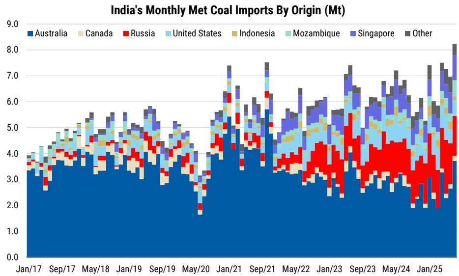

stacked bar chart

| Month    | Australia | Canada | Russia | United States | Indonesia | Mozambique | Singapore | Other |
|----------|-----------|--------|--------|---------------|-----------|------------|-----------|-------|
| Jan/17   | 3.5       | 0.5    | 0.3    | 0.2           | 0.1       | 0.1        | 0.1       | 0.1   |
| Sep/17   | 3.6       | 0.4    | 0.2    | 0.3           | 0.1       | 0.1        | 0.1       | 0.1   |
| May/18   | 3.7       | 0.4    | 0.2    | 0.3           | 0.1       | 0.1        | 0.1       | 0.1   |
| Jan/19   | 3.8       | 0.4    | 0.2    | 0.3           | 0.1       | 0.1        | 0.1       | 0.1   |
| Sep/19   | 3.9       | 0.4    | 0.2    | 0.3           | 0.1       | 0.1        | 0.1       | 0.1   |
| May/20   | 4.0       | 0.4    | 0.2    | 0.3           | 0.1       | 0.1        | 0.1       | 0.1   |
| Jan/21   | 4.1       | 0.4    | 0.2    | 0.3           | 0.1       | 0.1        | 0.1       | 0.1   |
| Sep/21   | 4.2       | 0.4    | 0.2    | 0.3           | 0.1       | 0.1        | 0.1       | 0.1   |
| May/22   | 4.3       | 0.4    | 0.2    | 0.3           | 0.1       | 0.1        | 0.1       | 0.1   |
| Jan/23   | 4.4       | 0.4    | 0.2    | 0.3           | 0.1       | 0.1        | 0.1       | 0.1   |
| Sep/23   | 4.5       | 0.4    | 0.2    | 0.3           | 0.1       | 0.1        | 0.1       | 0.1   |
| May/24   | 4.6       | 0.4    | 0.2    | 0.3           | 0.1       | 0.1        | 0.1       | 0.1   |
| Jan/25   | 4.7       | 0.4    | 0.2    | 0.3           | 0.1       | 0.1        | 0.1       | 0.1   |

Source: McCloskey

Exhibit 128: Queensland Coal Shipments  
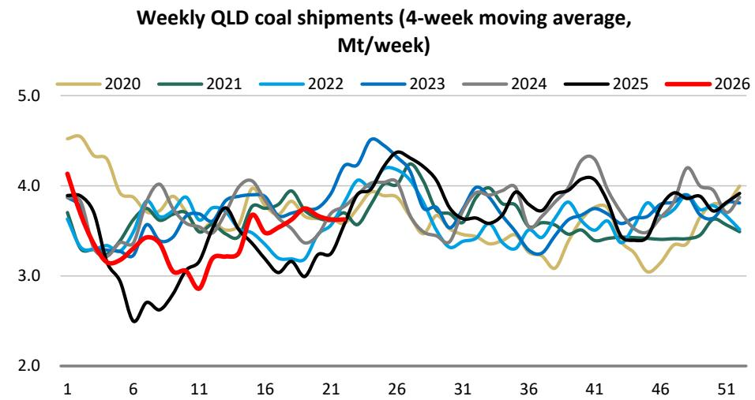

line chart

| Week | 2020 | 2021 | 2022 | 2023 | 2024 | 2025 | 2026 |
|------|------|------|------|------|------|------|------|
| 1    | 4.5  | 3.8  | 3.7  | 3.9  | 3.9  | 4.1  | 4.2  |
| 6    | 3.8  | 3.5  | 3.4  | 3.6  | 3.7  | 2.5  | 3.1  |
| 11   | 3.6  | 3.7  | 3.5  | 3.8  | 3.9  | 2.9  | 3.0  |
| 16   | 3.7  | 3.8  | 3.6  | 3.9  | 4.0  | 3.0  | 3.5  |
| 21   | 3.8  | 3.9  | 3.7  | 4.0  | 4.1  | 3.5  | 3.6  |
| 26   | 4.0  | 4.1  | 4.2  | 4.5  | 4.3  | 4.4  | 4.0  |
| 31   | 3.9  | 3.8  | 3.7  | 4.0  | 3.9  | 3.6  | 3.7  |
| 36   | 3.8  | 3.7  | 3.6  | 3.9  | 3.8  | 3.5  | 3.6  |
| 41   | 3.7  | 3.6  | 3.5  | 3.8  | 4.2  | 4.0  | 3.5  |
| 46   | 3.6  | 3.5  | 3.4  | 3.7  | 4.1  | 3.4  | 3.4  |
| 51   | 3.5  | 3.4  | 3.3  | 3.6  | 3.9  | 3.8  | 3.9  |

Source: Eikon

Exhibit 129: Australia Thermal Coal Shipments  
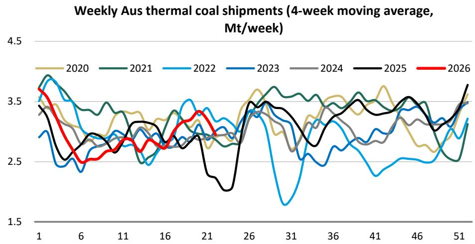

line chart

| Week | 2020 | 2021 | 2022 | 2023 | 2024 | 2025 | 2026 |
|------|------|------|------|------|------|------|------|
| 1    | 3.5  | 3.7  | 3.6  | 3.4  | 3.5  | 3.6  | 3.6  |
| 6    | 3.0  | 3.2  | 3.1  | 2.8  | 2.9  | 3.0  | 2.5  |
| 11   | 3.2  | 3.4  | 3.3  | 3.0  | 3.1  | 3.2  | 2.8  |
| 16   | 3.4  | 3.6  | 3.5  | 3.2  | 3.3  | 3.4  | 3.0  |
| 21   | 3.6  | 3.8  | 3.7  | 3.4  | 3.5  | 3.6  | 3.4  |
| 26   | 3.8  | 4.0  | 3.9  | 3.6  | 3.7  | 3.8  | 3.6  |
| 31   | 4.0  | 4.2  | 4.1  | 3.8  | 3.9  | 4.0  | 3.8  |
| 36   | 4.2  | 4.4  | 4.3  | 4.0  | 4.1  | 4.2  | 4.0  |
| 41   | 4.4  | 4.6  | 4.5  | 4.2  | 4.3  | 4.4  | 4.2  |
| 46   | 4.6  | 4.8  | 4.7  | 4.4  | 4.5  | 4.6  | 4.4  |
| 51   | 4.8  | 5.0  | 4.9  | 4.6  | 4.7  | 4.8  | 4.6  |

Source: Eikon

Exhibit 130: Coal Stocks at Qinhuangdao Port  
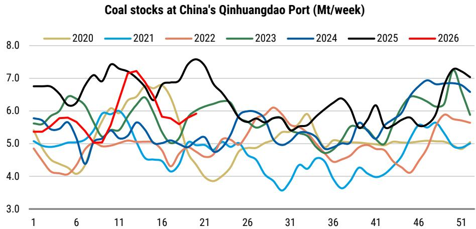

line chart

| Week | 2020 | 2021 | 2022 | 2023 | 2024 | 2025 | 2026 |
|------|------|------|------|------|------|------|------|
| 1    | 5.5  | 5.0  | 4.8  | 5.8  | 5.7  | 6.8  | 5.4  |
| 6    | 4.5  | 5.2  | 4.9  | 6.5  | 5.5  | 6.2  | 5.8  |
| 11   | 6.0  | 6.0  | 5.0  | 6.5  | 5.8  | 7.5  | 7.2  |
| 16   | 6.8  | 4.5  | 4.8  | 6.0  | 5.0  | 6.8  | 5.8  |
| 21   | 4.0  | 5.0  | 4.7  | 6.2  | 5.2  | 7.5  | 5.8  |
| 26   | 4.8  | 4.8  | 5.0  | 5.8  | 5.8  | 6.0  | -    |
| 31   | -    | -    | -    | -    | -    | -    | -    |
| 36   | -    | -    | -    | -    | -    | -    | -    |
| 41   | -    | -    | -    | -    | -    | -    | -    |
| 46   | -    | -    | -    | -    | -    | -    | -    |
| 51   | -    | -    | -    | -    | -    | -    | -    |

Source: Bloomberg

Exhibit 131: China Coal-fired Power Generation  
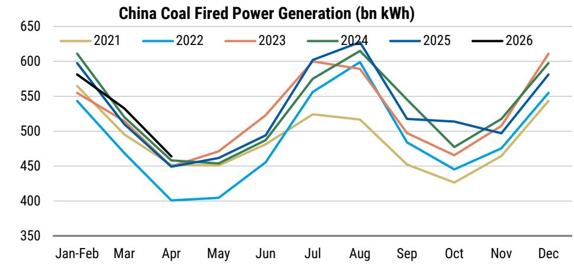

line chart

| Month   | 2021 | 2022 | 2023 | 2024 | 2025 | 2026 |
|---------|------|------|------|------|------|------|
| Jan-Feb | 570  | 545  | 555  | 610  | 595  | 585  |
| Mar     | 500  | 470  | 510  | 530  | 515  | 520  |
| Apr     | 450  | 400  | 460  | 460  | 455  | 455  |
| May     | 455  | 405  | 470  | 460  | 455  | 455  |
| Jun     | 480  | 455  | 520  | 490  | 495  | 495  |
| Jul     | 525  | 560  | 600  | 570  | 605  | 600  |
| Aug     | 515  | 595  | 590  | 620  | 625  | 615  |
| Sep     | 450  | 480  | 490  | 510  | 515  | 515  |
| Oct     | 430  | 445  | 465  | 480  | 495  | 495  |
| Nov     | 460  | 470  | 490  | 510  | 500  | 500  |
| Dec     | 545  | 555  | 610  | 600  | 580  | -    |

Source: Bloomberg

## Equity vs. Commodity – Relative One-Year Performance

Exhibit 132: Aluminium (large cap)  
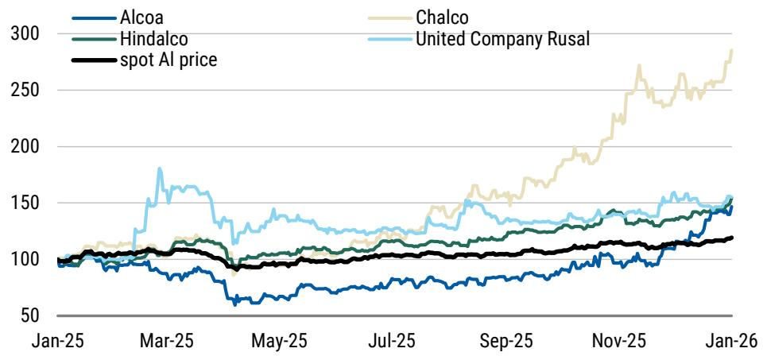

line chart

| Date   | Alcoa | Hindalco | spot Al price | Chalco | United Company Rusal |
|--------|-------|----------|---------------|--------|----------------------|
| Jan-25 | 100   | 100      | 100           | 100    | 100                  |
| Mar-25 | 90    | 110      | 105           | 110    | 180                  |
| May-25 | 70    | 105      | 100           | 105    | 140                  |
| Jul-25 | 80    | 115      | 105           | 120    | 130                  |
| Sep-25 | 90    | 125      | 110           | 160    | 140                  |
| Nov-25 | 100   | 135      | 115           | 220    | 150                  |
| Jan-26 | 140   | 145      | 120           | 280    | 160                  |

Source: Bloomberg, MS

Exhibit133: Aluminium (small-medium cap)  
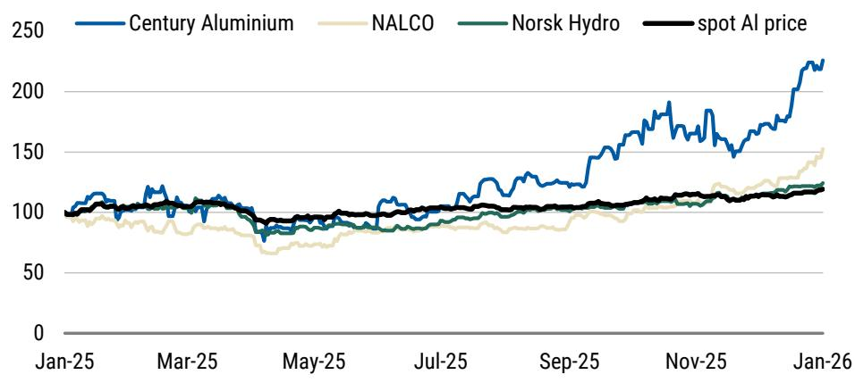

line chart

| Date   | Century Aluminium | NALCO | Norsk Hydro | spot Al price |
|--------|-------------------|-------|-------------|---------------|
| Jan-25 | ~100              | ~95   | ~95         | ~100          |
| Mar-25 | ~110              | ~85   | ~90         | ~100          |
| May-25 | ~90               | ~70   | ~85         | ~95           |
| Jul-25 | ~100              | ~80   | ~90         | ~100          |
| Sep-25 | ~130              | ~90   | ~95         | ~105          |
| Nov-25 | ~180              | ~110  | ~110        | ~115          |
| Jan-26 | ~220              | ~140  | ~120        | ~120          |

Source: Bloomberg, MS

Exhibit134: Alumina  
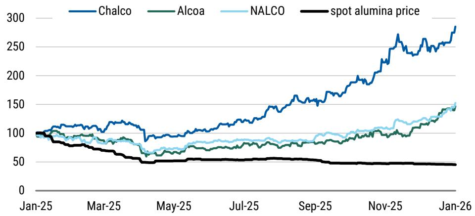

line chart

| Date   | Chalco | Alcoa | NALCO | spot alumina price |
|--------|--------|-------|-------|---------------------|
| Jan-25 | 100    | 100   | 100   | 100                 |
| Mar-25 | 110    | 95    | 90    | 80                  |
| May-25 | 90     | 70    | 75    | 50                  |
| Jul-25 | 120    | 80    | 85    | 50                  |
| Sep-25 | 160    | 90    | 100   | 50                  |
| Nov-25 | 220    | 110   | 120   | 50                  |
| Jan-26 | 280    | 140   | 150   | 50                  |

Source: Bloomberg, MS

Exhibit 135: Copper  
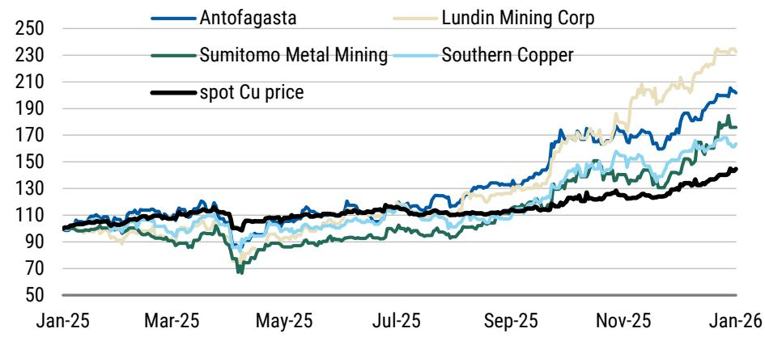

line chart

| Date   | Antofagasta | Lundin Mining Corp | Sumitomo Metal Mining | Southern Copper | spot Cu price |
|--------|-------------|--------------------|------------------------|-----------------|---------------|
| Jan-25 | ~105        | ~100               | ~100                   | ~100            | ~100          |
| Mar-25 | ~110        | ~105               | ~95                    | ~100            | ~105          |
| May-25 | ~115        | ~110               | ~70                    | ~105            | ~110          |
| Jul-25 | ~120        | ~125               | ~90                    | ~110            | ~115          |
| Sep-25 | ~130        | ~140               | ~105                   | ~125            | ~120          |
| Nov-25 | ~170        | ~180               | ~140                   | ~160            | ~130          |
| Jan-26 | ~200        | ~230               | ~180                   | ~170            | ~145          |

Source: Bloomberg, MS

Exhibit136: Nickel (large cap)  
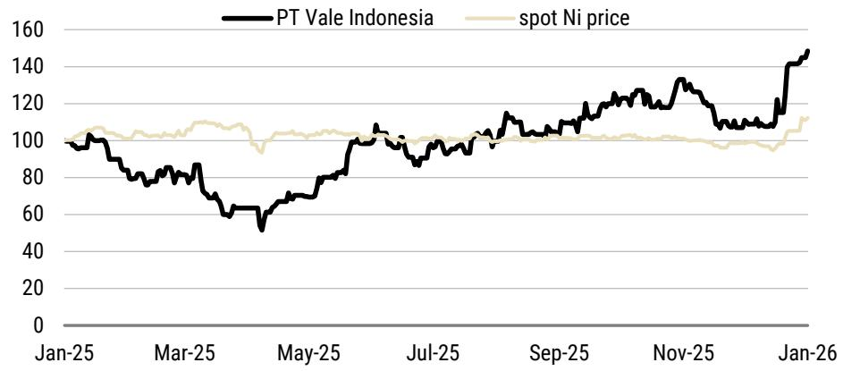

line chart

| Date   | PT Vale Indonesia | spot Ni price |
|--------|-------------------|---------------|
| Jan-25 | 100               | 100           |
| Mar-25 | 80                | 105           |
| May-25 | 60                | 100           |
| Jul-25 | 100               | 100           |
| Sep-25 | 110               | 100           |
| Nov-25 | 130               | 100           |
| Jan-26 | 150               | 110           |

Source: Bloomberg, MS

Exhibit 137: Nickel (small-medium cap)  
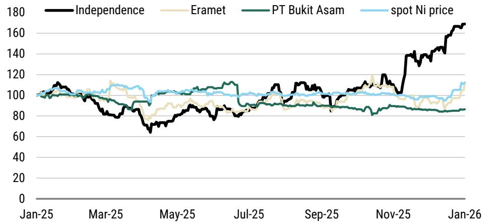

line chart

| Date   | Independence | Eramet | PT Bukit Asam | spot Ni price |
|--------|-------------|--------|--------------|---------------|
| Jan-25 | 100         | 100    | 100          | 100           |
| Mar-25 | 90          | 110    | 95           | 105           |
| May-25 | 70          | 85     | 90           | 100           |
| Jul-25 | 85          | 90     | 95           | 105           |
| Sep-25 | 100         | 105    | 90           | 100           |
| Nov-25 | 140         | 110    | 85           | 105           |
| Jan-26 | 170         | 115    | 85           | 110           |

Source: Bloomberg, MS

Exhibit138: Diversifieds  
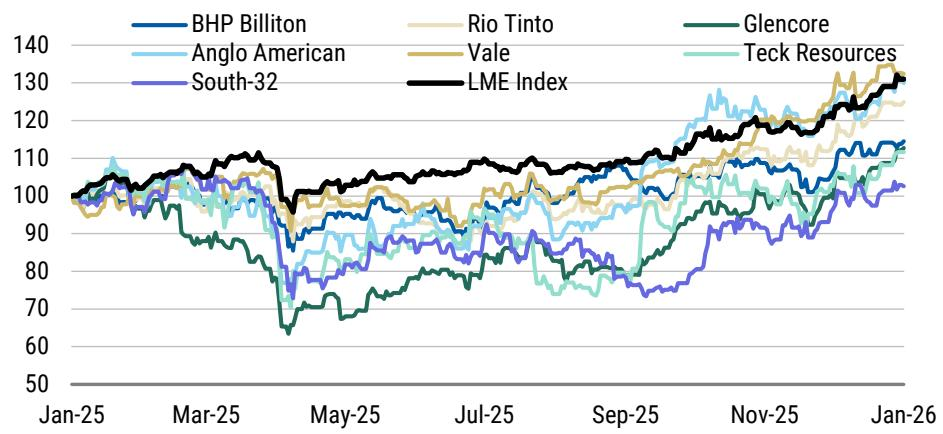

line chart

| Date   | BHP Billiton | Anglo American | South-32 | Rio Tinto | Vale | Glencore | Teck Resources | LME Index |
|--------|--------------|----------------|----------|-----------|------|----------|----------------|-----------|
| Jan-25 | 100          | 100            | 100      | 100       | 100  | 100      | 100            | 100       |
| Mar-25 | 95           | 98             | 97       | 96        | 97   | 95       | 96             | 105       |
| May-25 | 85           | 88             | 82       | 87        | 89   | 70       | 80             | 100       |
| Jul-25 | 90           | 92             | 85       | 91        | 93   | 75       | 82             | 105       |
| Sep-25 | 95           | 98             | 88       | 95        | 97   | 80       | 85             | 110       |
| Nov-25 | 105          | 110            | 95       | 102       | 105  | 90       | 95             | 120       |
| Jan-26 | 115          | 120            | 105      | 115       | 120  | 100      | 105            | 130       |

Source: Bloomberg, MS

Exhibit 139: Zinc  
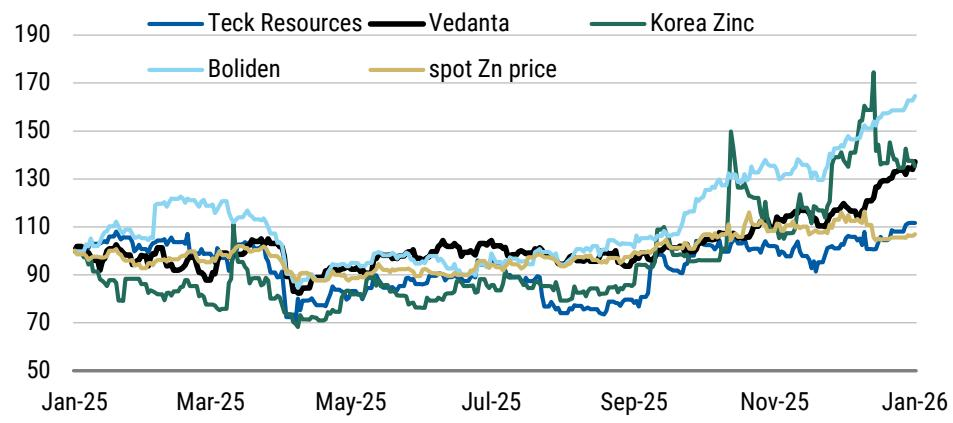

line chart

| Date   | Teck Resources | Vedanta | Korea Zinc | Boliden | spot Zn price |
|--------|----------------|---------|------------|---------|---------------|
| Jan-25 | ~105           | ~105    | ~105       | ~105    | ~105          |
| Mar-25 | ~100           | ~100    | ~95        | ~115    | ~100          |
| May-25 | ~85            | ~90     | ~70        | ~100    | ~90           |
| Jul-25 | ~90            | ~95     | ~85        | ~105    | ~95           |
| Sep-25 | ~95            | ~100    | ~90        | ~110    | ~100          |
| Nov-25 | ~100           | ~110    | ~150       | ~130    | ~110          |
| Jan-26 | ~110           | ~130    | ~170       | ~165    | ~115          |

Source: Bloomberg, MS

Exhibit140: Gold (large cap)  
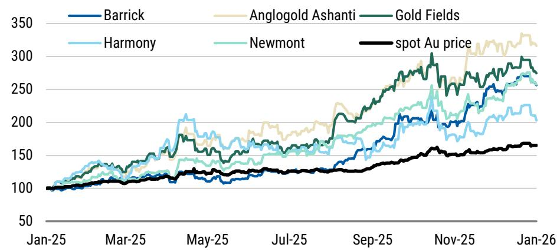

line chart

| Date   | Barrick | Anglogold Ashanti | Gold Fields | Harmony | Newmont | spot Au price |
|--------|---------|-------------------|-------------|---------|---------|---------------|
| Jan-25 | 100     | 100               | 100         | 100     | 100     | 100           |
| Mar-25 | 110     | 115               | 120         | 110     | 115     | 105           |
| May-25 | 120     | 130               | 140         | 125     | 130     | 115           |
| Jul-25 | 130     | 140               | 150         | 135     | 140     | 125           |
| Sep-25 | 150     | 160               | 180         | 150     | 160     | 135           |
| Nov-25 | 200     | 220               | 250         | 180     | 200     | 150           |
| Jan-26 | 250     | 280               | 300         | 220     | 240     | 160           |

Source: Bloomberg, MS

Exhibit141: Gold (small/medium cap)  
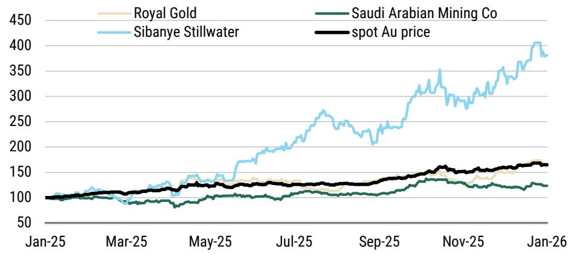

line chart

| Date   | Royal Gold | Sibanye Stillwater | Saudi Arabian Mining Co | spot Au price |
|--------|------------|-------------------|-------------------------|---------------|
| Jan-25 | 100        | 100               | 100                     | 100           |
| Mar-25 | 100        | 100               | 100                     | 100           |
| May-25 | 100        | 150               | 100                     | 120           |
| Jul-25 | 100        | 250               | 100                     | 130           |
| Sep-25 | 100        | 300               | 120                     | 140           |
| Nov-25 | 150        | 350               | 130                     | 150           |
| Jan-26 | 170        | 400               | 120                     | 160           |

Source: Bloomberg, MS

Exhibit142: Gold (small / medium cap)  
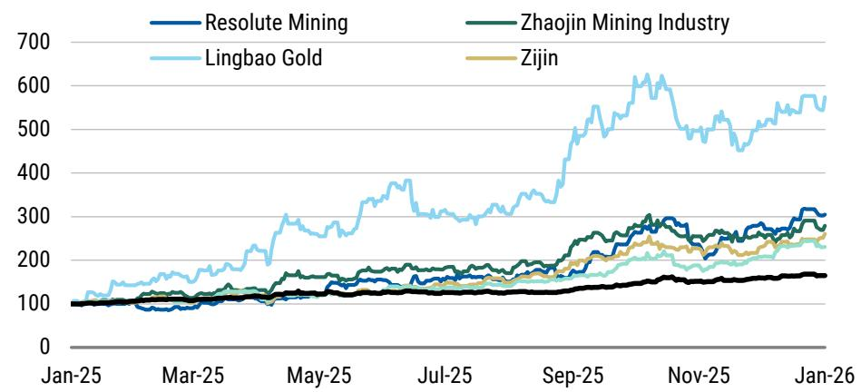

line chart

| Date   | Resolute Mining | Zhaojin Mining Industry | Lingbao Gold | Zijin |
|--------|-----------------|--------------------------|--------------|-------|
| Jan-25 | ~100            | ~100                     | ~100         | ~100  |
| Mar-25 | ~100            | ~100                     | ~150         | ~100  |
| May-25 | ~150            | ~150                     | ~300         | ~100  |
| Jul-25 | ~150            | ~150                     | ~350         | ~100  |
| Sep-25 | ~250            | ~250                     | ~450         | ~150  |
| Nov-25 | ~300            | ~300                     | ~600         | ~200  |
| Jan-26 | ~300            | ~300                     | ~550         | ~250  |

Source: Bloomberg, MS

Exhibit143: Silver  
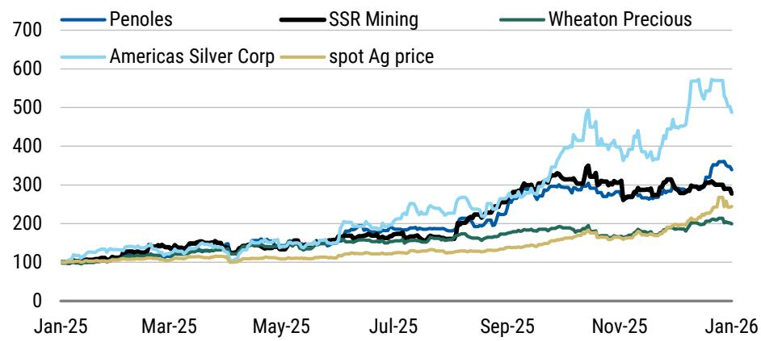

line chart

| Date   | Penoles | SSR Mining | Wheaton Precious | Americas Silver Corp | spot Ag price |
|--------|---------|------------|------------------|----------------------|---------------|
| Jan-25 | ~100    | ~100       | ~100             | ~100                 | ~100          |
| Mar-25 | ~120    | ~120       | ~110             | ~130                 | ~105          |
| May-25 | ~140    | ~140       | ~120             | ~150                 | ~110          |
| Jul-25 | ~180    | ~180       | ~150             | ~200                 | ~120          |
| Sep-25 | ~250    | ~250       | ~180             | ~300                 | ~140          |
| Nov-25 | ~300    | ~300       | ~200             | ~450                 | ~180          |
| Jan-26 | ~350    | ~350       | ~220             | ~550                 | ~250          |

Source: Bloomberg, MS

Exhibit144: Iron ore  
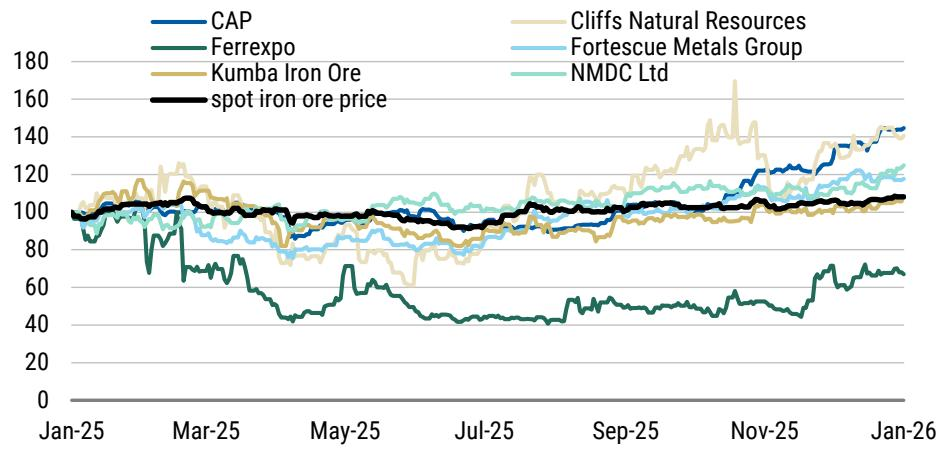

line chart

| Date   | CAP  | Ferrexpo | Kumba Iron Ore | spot iron ore price | Cliffs Natural Resources | Fortescue Metals Group | NMDC Ltd |
|--------|------|----------|----------------|---------------------|---------------------------|------------------------|----------|
| Jan-25 | 100  | 100      | 100            | 100                 | 100                       | 100                    | 100      |
| Mar-25 | 100  | 70       | 100            | 100                 | 120                       | 90                     | 100      |
| May-25 | 100  | 40       | 100            | 100                 | 80                        | 80                     | 100      |
| Jul-25 | 100  | 40       | 100            | 100                 | 100                       | 90                     | 100      |
| Sep-25 | 120  | 40       | 100            | 100                 | 140                       | 110                    | 110      |
| Nov-25 | 140  | 60       | 100            | 100                 | 170                       | 120                    | 120      |
| Jan-26 | 150  | 70       | 100            | 100                 | 150                       | 130                    | 130      |

Source: Bloomberg, MS

Exhibit145: Metallurgical coal  
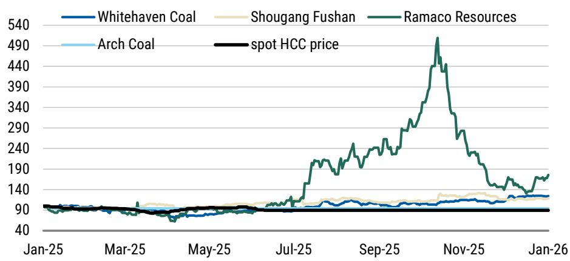

line chart

| Date   | Whitehaven Coal | Shougang Fushan | Ramaco Resources | Arch Coal | spot HCC price |
|--------|-----------------|-----------------|------------------|-----------|----------------|
| Jan-25 | ~90             | ~90             | ~90              | ~90       | ~90            |
| Mar-25 | ~90             | ~90             | ~90              | ~90       | ~90            |
| May-25 | ~90             | ~90             | ~90              | ~90       | ~90            |
| Jul-25 | ~90             | ~90             | ~130             | ~90       | ~90            |
| Sep-25 | ~90             | ~90             | ~240             | ~90       | ~90            |
| Nov-25 | ~90             | ~130            | ~490             | ~90       | ~90            |
| Jan-26 | ~130            | ~130            | ~180             | ~90       | ~90            |

Source: Bloomberg, MS

Exhibit146: Thermal coal – Asia  
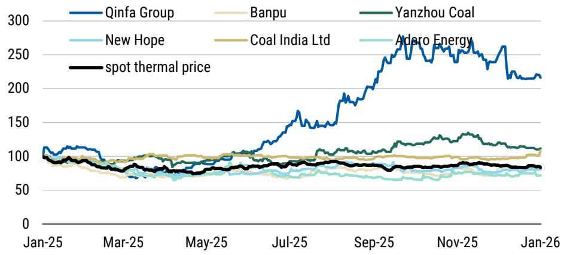

line chart

| Date   | Qinfa Group | Banpu | Yanzhou Coal | New Hope | Coal India Ltd | Adaro Energy | spot thermal price |
|--------|-------------|-------|--------------|----------|----------------|--------------|--------------------|
| Jan-25 | ~110        | ~90   | ~95          | ~85      | ~95            | ~90          | ~90                |
| Mar-25 | ~105        | ~85   | ~90          | ~80      | ~90            | ~85          | ~85                |
| May-25 | ~100        | ~80   | ~95          | ~75      | ~85            | ~80          | ~80                |
| Jul-25 | ~160        | ~75   | ~100         | ~70      | ~80            | ~75          | ~75                |
| Sep-25 | ~240        | ~70   | ~110         | ~65      | ~75            | ~70          | ~70                |
| Nov-25 | ~260        | ~65   | ~120         | ~60      | ~70            | ~65          | ~65                |
| Jan-26 | ~220        | ~60   | ~110         | ~55      | ~65            | ~60          | ~60                |

Source: Bloomberg, MS

Exhibit 147: Thermal coal – North America  
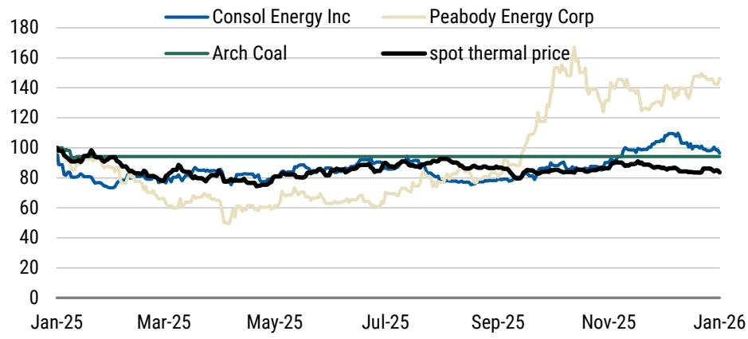

line chart

| Date   | Consol Energy Inc | Peabody Energy Corp | Arch Coal | spot thermal price |
|--------|-------------------|---------------------|-----------|--------------------|
| Jan-25 | 100               | 100                 | 100       | 100                |
| Mar-25 | 80                | 60                  | 100       | 90                 |
| May-25 | 85                | 50                  | 100       | 85                 |
| Jul-25 | 90                | 70                  | 100       | 90                 |
| Sep-25 | 80                | 150                 | 100       | 85                 |
| Nov-25 | 100               | 140                 | 100       | 90                 |
| Jan-26 | 95                | 145                 | 100       | 85                 |

Source: Bloomberg, MS

Exhibit148: Uranium  
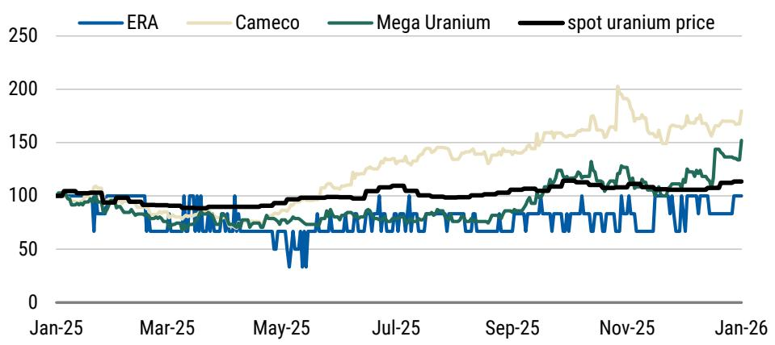

line chart

| Date   | ERA  | Cameco | Mega Uranium | spot uranium price |
|--------|------|--------|--------------|-------------------|
| Jan-25 | 100  | 100    | 100          | 100               |
| Mar-25 | 80   | 90     | 85           | 95                |
| May-25 | 30   | 80     | 75           | 90                |
| Jul-25 | 70   | 130    | 80           | 100               |
| Sep-25 | 80   | 140    | 100          | 105               |
| Nov-25 | 90   | 200    | 120          | 110               |
| Jan-26 | 100  | 180    | 150          | 115               |

Source: Bloomberg, MS

Exhibit149: Oil  
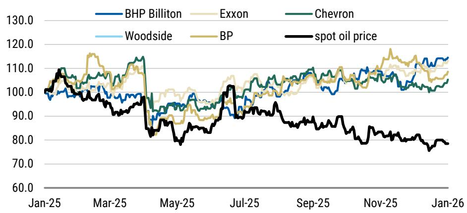

line chart

| Date   | BHP Billiton | Exxon | Chevron | Woodside | BP  | spot oil price |
|--------|--------------|-------|---------|----------|-----|----------------|
| Jan-25 | ~100         | ~105  | ~105    | ~105     | ~105| ~105           |
| Mar-25 | ~100         | ~115  | ~110    | ~105     | ~105| ~95            |
| May-25 | ~95          | ~95   | ~95     | ~95      | ~95 | ~80            |
| Jul-25 | ~100         | ~105  | ~105    | ~100     | ~100| ~90            |
| Sep-25 | ~105         | ~105  | ~105    | ~105     | ~105| ~85            |
| Nov-25 | ~110         | ~110  | ~110    | ~110     | ~110| ~80            |
| Jan-26 | ~115         | ~110  | ~105    | ~110     | ~110| ~75            |

Source: Bloomberg, MS

Exhibit150: Diversifieds  
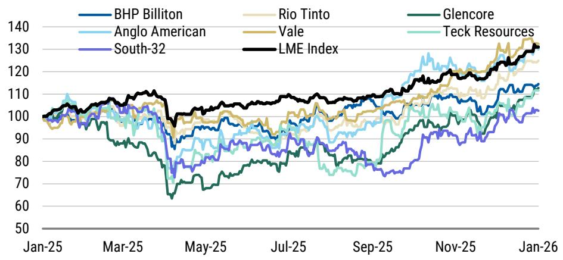

line chart

| Date   | BHP Billiton | Anglo American | South-32 | Rio Tinto | Vale | Glencore | Teck Resources | LME Index |
|--------|--------------|----------------|----------|-----------|------|----------|----------------|-----------|
| Jan-25 | 100          | 100            | 100      | 100       | 100  | 100      | 100            | 100       |
| Mar-25 | 95           | 98             | 97       | 96        | 97   | 95       | 98             | 105       |
| May-25 | 85           | 88             | 82       | 87        | 89   | 80       | 85             | 100       |
| Jul-25 | 90           | 92             | 85       | 91        | 93   | 82       | 88             | 105       |
| Sep-25 | 100          | 102            | 90       | 95        | 97   | 85       | 92             | 110       |
| Nov-25 | 110          | 115            | 100      | 105       | 108  | 95       | 102            | 120       |
| Jan-26 | 120          | 125            | 105      | 110       | 115  | 100      | 108            | 130       |

Source: Bloomberg, MS

Exhibit 151: PGM  
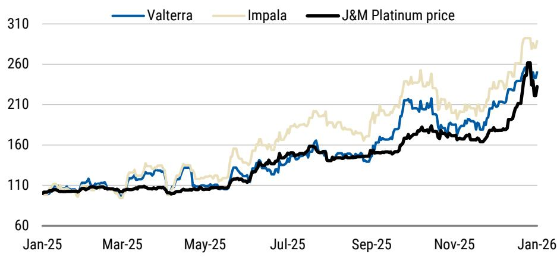

line chart

| Date   | Valterra | Impala | J&M Platinum price |
|--------|----------|--------|---------------------|
| Jan-25 | 110      | 110    | 110                 |
| Mar-25 | 115      | 115    | 110                 |
| May-25 | 110      | 110    | 110                 |
| Jul-25 | 140      | 150    | 140                 |
| Sep-25 | 160      | 170    | 150                 |
| Nov-25 | 180      | 190    | 170                 |
| Jan-26 | 260      | 280    | 260                 |

Source: Bloomberg

## Key MS Forecasts

Exhibit 152: Base metals price forecasts

<table><tr><td rowspan="2">Period</td><td colspan="3">Aluminium</td><td colspan="3">Copper</td><td colspan="3">Nickel</td><td colspan="3">Zinc</td><td colspan="3">Lead</td></tr><tr><td>Bull</td><td>Base US$/lb</td><td>Bear</td><td>Bull</td><td>Base US$/lb</td><td>Bear</td><td>Bull</td><td>Base US$/lb</td><td>Bear</td><td>Bull</td><td>Base US$/lb</td><td>Bear</td><td>Bull</td><td>Base US$/lb</td><td>Bear</td></tr><tr><td>2026e</td><td>1.77</td><td>1.54</td><td>1.18</td><td>6.40</td><td>5.58</td><td>4.34</td><td>8.98</td><td>7.58</td><td>6.74</td><td>1.52</td><td>1.37</td><td>1.17</td><td>0.98</td><td>0.85</td><td>0.76</td></tr><tr><td>2027e</td><td>1.78</td><td>1.48</td><td>1.18</td><td>6.67</td><td>5.56</td><td>4.56</td><td>9.36</td><td>7.48</td><td>5.99</td><td>1.59</td><td>1.33</td><td>1.13</td><td>1.07</td><td>0.95</td><td>0.86</td></tr><tr><td>2028e</td><td>1.71</td><td>1.43</td><td>1.17</td><td>6.26</td><td>5.22</td><td>4.43</td><td>9.73</td><td>7.48</td><td>5.61</td><td>1.64</td><td>1.32</td><td>1.12</td><td>1.20</td><td>1.00</td><td>0.90</td></tr><tr><td>2029e</td><td>1.81</td><td>1.45</td><td>1.23</td><td>6.78</td><td>5.22</td><td>4.69</td><td>10.02</td><td>7.71</td><td>5.40</td><td>1.64</td><td>1.32</td><td>1.18</td><td>1.22</td><td>1.01</td><td>0.91</td></tr><tr><td>2030e</td><td>1.81</td><td>1.45</td><td>1.23</td><td>7.04</td><td>5.22</td><td>4.69</td><td>10.61</td><td>8.16</td><td>5.72</td><td>1.70</td><td>1.36</td><td>1.22</td><td>1.36</td><td>1.13</td><td>1.02</td></tr><tr><td>2031e</td><td>1.70</td><td>1.36</td><td>1.16</td><td>7.04</td><td>5.22</td><td>4.69</td><td>10.61</td><td>8.16</td><td>5.72</td><td>1.63</td><td>1.36</td><td>1.16</td><td>1.36</td><td>1.13</td><td>1.02</td></tr><tr><td>LT nom.</td><td>1.50</td><td>1.30</td><td>1.17</td><td>6.57</td><td>5.05</td><td>4.30</td><td>11.11</td><td>8.54</td><td>5.98</td><td>1.61</td><td>1.46</td><td>1.17</td><td>1.29</td><td>1.17</td><td>0.94</td></tr></table>

Source: MS Commodities Research estimates (e)

Exhibit 153: Precious metals price forecasts

<table><tr><td rowspan="2">Period</td><td colspan="3">Gold</td><td colspan="3">Silver</td><td colspan="3">Platinum</td><td colspan="3">Palladium</td><td colspan="3">Rhodium</td></tr><tr><td>Bull</td><td>Base US$/oz</td><td>Bear</td><td>Bull</td><td>Base US$/oz</td><td>Bear</td><td>Bull</td><td>Base US$/oz</td><td>Bear</td><td>Bull</td><td>Base US$/oz</td><td>Bear</td><td>Bull</td><td>Base US$/oz</td><td>Bear</td></tr><tr><td>2026e</td><td>6,026</td><td>4,916</td><td>4,176</td><td>100.21</td><td>73.79</td><td>52.64</td><td>2,282</td><td>1,994</td><td>1,706</td><td>1,693</td><td>1,483</td><td>1,273</td><td>11,718</td><td>10,214</td><td>8,711</td></tr><tr><td>2027e</td><td>5,940</td><td>4,950</td><td>4,208</td><td>99.00</td><td>70.71</td><td>56.57</td><td>2,392</td><td>1,993</td><td>1,594</td><td>1,860</td><td>1,431</td><td>1,002</td><td>18,397</td><td>10,221</td><td>7,154</td></tr><tr><td>2028e</td><td>5,625</td><td>4,500</td><td>3,825</td><td>90.00</td><td>64.29</td><td>51.43</td><td>2,656</td><td>2,043</td><td>1,839</td><td>1,575</td><td>1,312</td><td>919</td><td>31,436</td><td>10,479</td><td>7,335</td></tr><tr><td>2029e</td><td>5,200</td><td>4,000</td><td>3,400</td><td>80.00</td><td>57.14</td><td>45.71</td><td>2,723</td><td>2,095</td><td>1,885</td><td>1,614</td><td>1,345</td><td>942</td><td>24,226</td><td>8,075</td><td>5,653</td></tr><tr><td>2030e</td><td>5,400</td><td>4,000</td><td>3,400</td><td>77.14</td><td>57.14</td><td>48.57</td><td>2,792</td><td>2,148</td><td>1,933</td><td>1,655</td><td>1,379</td><td>966</td><td>24,837</td><td>8,279</td><td>5,795</td></tr><tr><td>2031e</td><td>5,400</td><td>4,000</td><td>3,400</td><td>77.14</td><td>57.14</td><td>48.57</td><td>2,863</td><td>2,202</td><td>1,982</td><td>1,697</td><td>1,414</td><td>1,131</td><td>25,464</td><td>8,488</td><td>5,942</td></tr><tr><td>LT nom.</td><td>4,738</td><td>2,871</td><td>2,441</td><td>68.19</td><td>35.89</td><td>30.51</td><td>3,231</td><td>2,228</td><td>1,894</td><td>1,723</td><td>1,436</td><td>1,149</td><td>25,842</td><td>8,614</td><td>6,030</td></tr></table>

Source: MS Commodities Research estimates (e)

Exhibit 154: Bulks price forecasts

<table><tr><td rowspan="2">Period</td><td colspan="3">Iron Ore (spot)</td><td colspan="3">Hard Coking Coal (spot)</td><td colspan="3">Thermal Coal</td><td colspan="3">Manganese ore (44%)</td><td colspan="3">Lithium (fob LatAm)</td><td colspan="3">Uranium (spot)</td></tr><tr><td>Bull</td><td>Base US$/t</td><td>Bear</td><td>Bull</td><td>Base US$/t</td><td>Bear</td><td>Bull</td><td>Base US$/t</td><td>Bear</td><td>Bull</td><td>Base US$/lb</td><td>Bear</td><td>Bull</td><td>Base US$/lb</td><td>Bear</td><td>Bull</td><td>Base US$/lb</td><td>Bear</td></tr><tr><td>2026e</td><td>115</td><td>100</td><td>89</td><td>266</td><td>231</td><td>197</td><td>193</td><td>151</td><td>115</td><td>6.3</td><td>5.4</td><td>4.8</td><td>25,554</td><td>21,279</td><td>16,149</td><td>111</td><td>93</td><td>72</td></tr><tr><td>2027e</td><td>125</td><td>96</td><td>77</td><td>294</td><td>226</td><td>181</td><td>179</td><td>138</td><td>110</td><td>6.6</td><td>5.5</td><td>4.4</td><td>28,880</td><td>18,050</td><td>10,830</td><td>131</td><td>94</td><td>66</td></tr><tr><td>2028e</td><td>132</td><td>98</td><td>73</td><td>289</td><td>214</td><td>160</td><td>163</td><td>125</td><td>100</td><td>6.7</td><td>5.6</td><td>4.5</td><td>30,400</td><td>15,200</td><td>9,120</td><td>105</td><td>70</td><td>53</td></tr><tr><td>2029e</td><td>135</td><td>100</td><td>75</td><td>290</td><td>215</td><td>161</td><td>169</td><td>130</td><td>98</td><td>6.9</td><td>5.7</td><td>4.6</td><td>28,000</td><td>14,000</td><td>9,800</td><td>105</td><td>70</td><td>56</td></tr><tr><td>2030e</td><td>135</td><td>100</td><td>75</td><td>290</td><td>215</td><td>161</td><td>176</td><td>135</td><td>101</td><td>7.0</td><td>5.8</td><td>4.7</td><td>30,000</td><td>15,000</td><td>10,500</td><td>105</td><td>70</td><td>56</td></tr><tr><td>2031e</td><td>135</td><td>100</td><td>75</td><td>290</td><td>215</td><td>161</td><td>176</td><td>135</td><td>101</td><td>7.0</td><td>5.8</td><td>4.7</td><td>32,000</td><td>16,000</td><td>11,200</td><td>105</td><td>70</td><td>56</td></tr><tr><td>LT nom.</td><td>150</td><td>103</td><td>78</td><td>296</td><td>219</td><td>165</td><td>179</td><td>138</td><td>103</td><td>6.6</td><td>5.5</td><td>4.4</td><td>33,996</td><td>16,998</td><td>10,199</td><td>105</td><td>70</td><td>56</td></tr></table>

Source: MS Commodities Research estimates (e)

This report references jurisdiction(s) or person(s) which may be the subject of economic sanctions. Readers are solely responsible for ensuring that their investment activities are carried out in compliance with applicable laws.

## Disclosure Section

The information and opinions in MS were prepared or are disseminated by MS Europe S.E., regulated by Bundesanstalt fuer Finanzdienstleistungsaufsicht (BaFin) and/or MS & Co. International plc, authorized by the Prudential Regulation Authority and regulated by the Financial Conduct Authority and the Prudential Regulation Authority. MS & Co. International plc disseminates in the UK research that it has prepared, and which has been prepared by any of its affiliates, only to persons who (i) are investment professionals falling within Article 19(5) of the Financial Services and Markets Act 2000 (Financial Promotion) Order 2005 (as amended, the "Order"); (ii) are persons who are high net worth entities falling within Article 49(2)(a) to (d) of the Order; or (iii) are persons to whom an invitation or inducement to engage in investment activity (within the meaning of section 21 of the Financial Services and Markets Act 2000, as amended) may otherwise lawfully be communicated or caused to be communicated. As used in this disclosure section, MS includes RMB MS Proprietary Limited, MS Europe S.E., MS & Co International plc and its affiliates.

For important disclosures, stock price charts and equity rating histories regarding companies that are the subject of this report, please see the MS Disclosure Website at www.morganstanley.com/eqr/disclosures/webapp/generalresearch, or contact your investment representative or MS at 1585 Broadway, (Attention: Research Management), New York, NY, 10036 USA.

For valuation methodology and risks associated with any recommendation, rating or price target referenced in this research report, please contact the Client Support Team as follows: US/Canada +1 800 303-2495; Hong Kong +852 2848-5999; Latin America +1 718 754-5444 (U.S.); London +44 (0)20-7425-8169; Singapore +65 6834-6860; Sydney +61 (0)2-9770-1505; Tokyo +81 (0)3-6836-9000. Alternatively you may contact your investment representative or MS at 1585 Broadway, (Attention: Research Management), New York, NY 10036 USA.

## Analyst Certification

The following analysts hereby certify that their views about the companies and their securities discussed in this report are accurately expressed and that they have not received and will not receive direct or indirect compensation in exchange for expressing specific recommendations or views in this report: Carlos De Alba; Amy Gower (Amy Sergeant), CFA; Martijn Rats, CFA.

## Global Research Conflict Management Policy

MS has been published in accordance with our conflict management policy, which is available at www.morganstanley.com/institutional/research/conflictpolicies. A Portuguese version of the policy can be found at www.morganstanley.com.br

## Important Regulatory Disclosures on Subject Companies

The equity research analysts or strategists principally responsible for the preparation of MS have received compensation based upon various factors, including quality of research, investor client feedback, stock picking, competitive factors, firm revenues and overall investment banking revenues. Equity Research analysts' or strategists' compensation is not linked to investment banking or capital markets transactions performed by MS or the profitability or revenues of particular trading desks.

MS and its affiliates do business that relates to companies/instruments covered in MS, including market making, providing liquidity, fund management, commercial banking, extension of credit, investment services and investment banking. MS sells to and buys from customers the securities/instruments of companies covered in MS on a principal basis. MS may have a position in the debt of the Company or instruments discussed in this report. MS trades or may trade as principal in the debt securities (or in related derivatives) that are the subject of the debt research report.

Certain disclosures listed above are also for compliance with applicable regulations in non-US jurisdictions.

## STOCK RATINGS

MS uses a relative rating system using terms such as Overweight, Equal-weight, Not-Rated or Underweight (see definitions below). MS does not assign ratings of Buy, Hold or Sell to the stocks we cover. Overweight, Equal-weight, Not-Rated and Underweight are not the equivalent of buy, hold and sell. Investors should carefully read the definitions of all ratings used in MS. In addition, since MS contains more complete information concerning the analyst's views, investors should carefully read MS, in its entirety, and not infer the contents from the rating alone. In any case, ratings (or research) should not be used or relied upon as investment advice. An investor's decision to buy or sell a stock should depend on individual circumstances (such as the investor's existing holdings) and other considerations.

## Global Stock Ratings Distribution

(as of May 31, 2026)

The Stock Ratings described below apply to MS's Fundamental Equity Research and do not apply to Debt Research produced by the Firm.

For disclosure purposes only (in accordance with FINRA requirements), we include the category headings of Buy, Hold, and Sell alongside our ratings of Overweight, Equal-weight, Not-Rated and Underweight. MS does not assign ratings of Buy, Hold or Sell to the stocks we cover. Overweight, Equal-weight, Not-Rated and Underweight are not the equivalent of buy, hold, and sell but represent recommended relative weightings (see definitions below). To satisfy regulatory requirements, we correspond Overweight, our most positive stock rating, with a buy recommendation; we correspond Equal-weight and Not-Rated to hold and Underweight to sell recommendations, respectively.

<table><tr><td></td><td colspan="2">Coverage Universe</td><td colspan="3">Investment Banking Clients (IBC)</td><td colspan="2">Other Material Investment ServicesClients (MISC)</td></tr><tr><td>Stock RatingCategory</td><td>Count</td><td>% of Total</td><td>Count</td><td>% of Total IBC</td><td>% of RatingCategory</td><td>Count</td><td>% of Total OtherMISC</td></tr><tr><td>Overweight/Buy</td><td>1542</td><td>42%</td><td>465</td><td>51%</td><td>30%</td><td>707</td><td>43%</td></tr><tr><td>Equal-weight/Hold</td><td>1571</td><td>43%</td><td>369</td><td>40%</td><td>23%</td><td>723</td><td>44%</td></tr><tr><td>Not-Rated/Hold</td><td>3</td><td>0%</td><td>0</td><td>0%</td><td>0%</td><td>1</td><td>0%</td></tr><tr><td>Underweight/Sell</td><td>551</td><td>15%</td><td>86</td><td>9%</td><td>16%</td><td>201</td><td>12%</td></tr><tr><td>Total</td><td>3,667</td><td></td><td>920</td><td></td><td></td><td>1632</td><td></td></tr></table>

Data include common stock and ADRs currently assigned ratings. Investment Banking Clients are companies from whom MS received investment banking compensation in the last 12 months. Due to rounding off of decimals, the percentages provided in the "% of total" column may not add up to exactly 100 percent.

## Analyst Stock Ratings

Overweight (O). The stock's total return is expected to exceed the average total return of the analyst's industry (or industry team's) coverage universe, on a risk-adjusted basis, over the next 12-18 months.

Equal-weight (E). The stock's total return is expected to be in line with the average total return of the analyst's industry (or industry team's) coverage universe, on a risk-adjusted basis, over the next 12-18 months.

Not-Rated (NR). Currently the analyst does not have adequate conviction about the stock's total return relative to the average total return of the analyst's industry (or industry team's) coverage universe, on a risk-adjusted basis, over the next 12-18 months.

Underweight (U). The stock's total return is expected to be below the average total return of the analyst's industry (or industry team's) coverage universe, on a risk-adjusted basis, over the next 12-18 months.

Unless otherwise specified, the time frame for price targets included in MS is 12 to 18 months.

## Analyst Industry Views

Attractive (A): The analyst expects the performance of his or her industry coverage universe over the next 12-18 months to be attractive vs. the relevant broad market benchmark, as indicated below.

In-Line (I): The analyst expects the performance of his or her industry coverage universe over the next 12-18 months to be in line with the relevant broad market benchmark, as indicated below.

Cautious (C): The analyst views the performance of his or her industry coverage universe over the next 12-18 months with caution vs. the relevant broad market benchmark, as indicated below.

Benchmarks for each region are as follows: North America - S&P 500; Latin America - relevant MSCI country index or MSCI Latin America Index; Europe - MSCI Europe; Japan - TOPIX; Asia - relevant MSCI country index or MSCI sub-regional index or MSCI AC Asia Pacific ex Japan Index.

## Important Disclosures for MS Smith Barney LLC Customers

Important disclosures regarding any material conflict of interest that can reasonably be expected to have influenced MS Smith Barney LLC's choice of a third-party research provider or the subject company of a third-party research report, are available on the MS Wealth Management disclosure website at www.morganstanley.com/online/researchdisclosures. For MS specific disclosures, you may refer to https://www.morganstanley.com/eqr/disclosures/webapp/generalresearch.

Each MS report is reviewed and approved on behalf of MS Smith Barney LLC. This review and approval is conducted by the same person who reviews the research report on behalf of MS. This could create a conflict of interest.

## Other Important Disclosures

MS policy is to update research reports as and when the Research Analyst and Research Management deem appropriate, based on developments with the issuer, the sector, or the market that may have a material impact on the research views or opinions stated therein. In addition, certain Research publications are intended to be updated on a regular periodic basis (weekly/monthly/quarterly/annual) and will ordinarily be updated with that frequency, unless the Research Analyst and Research Management determine that a different publication schedule is appropriate based on current conditions.

MS is not acting as a municipal advisor and the opinions or views contained herein are not intended to be, and do not constitute, advice within the meaning of Section 975 of the Dodd-Frank Wall Street Reform and Consumer Protection Act.

MS produces an equity research product called a "Tactical Idea." Views contained in a "Tactical Idea" on a particular stock may be contrary to the recommendations or views expressed in research on the same stock. This may be the result of differing time horizons, methodologies, market events, or other factors. For all research available on a particular stock, please contact your sales representative or go to Matrix at http://www.morganstanley.com/matrix.

MS is provided to our clients through our proprietary research portal on Matrix and also distributed electronically by MS to clients. Certain, but not all, MS products are also made available to clients through third-party vendors or redistributed to clients through alternate electronic means as a convenience. For access to all available MS, please contact your sales representative or go to Matrix at http://www.morganstanley.com/matrix.

Any access and/or use of MS is subject to MS's Terms of Use (http://www.morganstanley.com/terms.html). By accessing and/or using MS, you are indicating that you have read and agree to be bound by our Terms of Use (http://www.morganstanley.com/terms.html). In addition you consent to MS processing your personal data and using cookies in accordance with our Privacy Policy and our Global Cookies Policy (http://www.morganstanley.com/privacy\_pledge.html), including for the purposes of setting your preferences and to collect readership data so that we can deliver better and more personalized service and products to you. To find out more information about how MS processes personal data, how we use cookies and how to reject cookies see our Privacy Policy and our Global Cookies Policy (http://www.morganstanley.com/privacy\_pledge.html). Please use the provided link to review the Terms and Conditions and Most Important Terms and Conditions for MS India Company Private Limited (https://www.morganstanley.com/assets/pdfs/about-us-global-offices/india/Terms\_and\_conditions.pdf) and the following link to review the audit report (https://ny.matrix.ms.com/eqr/research/webapp/researchdocs/MSICPL\_Morgan\_Stanley\_Research\_Audit\_Report.pdf).

If you do not agree to our Terms of Use and/or if you do not wish to provide your consent to MS processing your personal data or using cookies please do not access our research. MS does not provide individually tailored investment advice. MS has been prepared without regard to the circumstances and objectives of those who receive it. MS recommends that investors independently evaluate particular investments and strategies, and encourages investors to seek the advice of a financial adviser. The appropriateness of an investment or strategy will depend on an investor's circumstances and objectives. The securities, instruments, or strategies discussed in MS may not be suitable for all investors, and certain investors may not be eligible to purchase or participate in some or all of them. MS is not an offer to buy or sell or the solicitation of an offer to buy or sell any security/instrument or to participate in any particular trading strategy. The value of and income from your investments may vary because of changes in interest rates, foreign exchange rates, default rates, prepayment rates, securities/instruments prices, market indexes, operational or financial conditions of companies or other factors. There may be time limitations on the exercise of options or other rights in securities/instruments transactions. Past performance is not necessarily a guide to future performance. Estimates of future performance are based on assumptions that may not be realized. If provided, and unless otherwise stated, the closing price on the cover page is that of the primary exchange for the subject company's securities/instruments.

The fixed income research analysts, strategists or economists principally responsible for the preparation of MS have received compensation based upon various factors, including quality, accuracy and value of research, firm profitability or revenues (which include fixed income trading and capital markets profitability or revenues), client feedback and competitive factors. Fixed Income Research analysts', strategists' or economists' compensation is not linked to investment banking or capital markets transactions performed by MS or the profitability or revenues of particular trading desks.

The "Important Regulatory Disclosures on Subject Companies" section in MS lists all companies mentioned where MS owns 1% or more of a class of common equity securities of the companies. For all other companies mentioned in MS, MS may have an investment of less than 1% in securities/instruments or derivatives of securities/instruments of companies and may trade them in ways different from those discussed in MS. Employees of MS not involved in the preparation of MS may have investments in securities/instruments or derivatives of securities/instruments of companies mentioned and may trade them in ways different from those discussed in MS. Derivatives may be issued by MS or associated persons.

With the exception of information regarding MS, MS is based on public information. MS makes every effort to use reliable, comprehensive information, but we make no representation that it is accurate or complete. We have no obligation to tell you when opinions or information in MS change apart from when we intend to discontinue equity research coverage of a subject company. Facts and views presented in MS have not been reviewed by, and may not reflect information known to, professionals in other MS business areas, including investment banking personnel.

MS personnel may participate in company events such as site visits and are generally prohibited from accepting payment by the company of associated expenses unless pre-approved by authorized members of Research management.

MS may make investment decisions that are inconsistent with the recommendations or views in this report.

To our readers based in Taiwan or trading in Taiwan securities/instruments: Information on securities/instruments that trade in Taiwan is distributed by MS Taiwan Limited ("MSTL"). Such information is for your reference only. The reader should independently evaluate the investment risks and is solely responsible for their investment decisions. MS may not be distributed to the public media or quoted or used by the public media without the express written consent of MS. Any non-customer reader within the scope of Article 7-1 of the Taiwan Stock Exchange Recommendation Regulations accessing and/or receiving MS is not permitted to provide MS to any third party (including but not limited to related parties, affiliated companies and any other third parties) or engage in any activities regarding MS which may create or give the appearance of creating a conflict of interest. Information on securities/instruments that do not trade in Taiwan is for informational purposes only and is not to be construed as a recommendation or a solicitation to trade in such securities/instruments. MSTL may not execute transactions for clients in these securities/instruments.

MS is not incorporated under PRC law and the research in relation to this report is conducted outside the PRC. MS does not constitute an offer to sell or the solicitation of an offer to buy any securities in the PRC. PRC investors shall have the relevant qualifications to invest in such securities and shall be responsible for obtaining all relevant approvals, licenses, verifications and/or registrations from the relevant governmental authorities themselves. Neither this report nor any part of it is intended as, or shall constitute, provision of any consultancy or advisory service of securities investment as defined under PRC law. Such information is provided for your reference only.

MS is disseminated in Brazil by MS C.T.V.M. S.A. located at Av. Brigadeiro Faria Lima, 3600, 6th floor, São Paulo - SP, Brazil; and is regulated by the Comissão de Valores Mobiliários; in Mexico by MS México, Casa de Bolsa, S.A. de C.V which is regulated by Comision Nacional Bancaria y de Valores. Paseo de los Tamarindos 90, Torre 1, Col. Bosques de las Lomas Floor 29, 05120 Mexico City; in Japan by MS MUFG Securities Co., Ltd. and, for Commodities related research reports only, MS Capital Group Japan Co., Ltd; in Hong Kong by MS Asia Limited (which accepts responsibility for its contents) and by MS Bank Asia Limited; in Singapore by MS Asia (Singapore) Pte. (Registration number 199206298Z) and/or MS Asia (Singapore) Securities Pte Ltd (Registration number 200008434H), regulated by the Monetary Authority of Singapore (which accepts legal responsibility for its contents and should be contacted with respect to any matters arising from, or in connection with, MS) and by MS Bank Asia Limited, Singapore Branch (Registration number T14FC0118); in Australia to "wholesale clients" within the meaning of the Australian Corporations Act by MS Australia Limited A.B.N. 67 003 734 576, holder of Australian financial services license No. 233742, which accepts responsibility for its contents; in Australia to "wholesale clients" and "retail clients" within the meaning of the Australian Corporations Act by MS Wealth Management Australia Pty Ltd (A.B.N. 19 009 145 555, holder of Australian financial services license No. 240813, which accepts responsibility for its contents; in Korea by MS & Co International plc, Seoul Branch; in India by MS India Company Private Limited having Corporate Identification No (CIN) U22990MH1998PTC115305, regulated by the Securities and Exchange Board of India ("SEBI") and holder of licenses as a Research Analyst (SEBI Registration No. INH000001105); Stock Broker (SEBI Stock Broker Registration No. INZ000244438), Merchant Banker (SEBI Registration No. INM000011203), and depository participant with National Securities Depository Limited (SEBI Registration No. IN-DP-NSDL-567-2021) having registered office at Altimus, Level 39 & 40, Pandurang Budhkar Marg, Worli, Mumbai 400018, India; Telephone no. +91-22-61181000; Compliance Officer Details: Mr. Tejarshi Hardas, Tel. No.: +91-22-61181000 or Email: tejarshi.hardas@morganstanley.com; Grievance officer details: Mr. Tejarshi Hardas, Tel. No.: +91-22-61181000 or Email: msic-compliance@morganstanley.com. MS India Company Private Limited (MSICPL) may use AI tools in providing research services. All recommendations contained herein are made by the duly qualified research analysts; in Canada by MS Canada Limited; in Germany and the European Economic Area where required by MS Europe S.E., authorised and regulated by Bundesanstalt fuer Finanzdienstleistungsaufsicht (BaFin) under the reference number 149169; in the US by MS & Co. LLC, which accepts responsibility for its contents. MS & Co. International plc, authorized by the Prudential Regulation Authority and regulated by the Financial Conduct Authority and the Prudential Regulation Authority, disseminates in the UK research that it has prepared, and research which has been prepared by any of its affiliates, only to persons who (i) are investment professionals falling within Article 19(5) of the Financial Services and Markets Act 2000 (Financial Promotion) Order 2005 (as amended, the "Order"); (ii) are persons who are high net worth entities falling within Article 49(2)(a) to (d) of the Order; or (iii) are persons to whom an invitation or inducement to engage in investment activity (within the meaning of section 21 of the Financial Services and Markets Act 2000, as amended) may otherwise lawfully be communicated or caused to be communicated. RMB MS Proprietary Limited is a member of the JSE Limited and A2X (Pty) Ltd. RMB MS Proprietary Limited is a joint venture owned equally by MS International Holdings Inc. and RMB Investment Advisory (Proprietary) Limited, which is wholly owned by FirstRand Limited. The information in MS is being disseminated by MS Saudi Arabia, regulated by the Capital Market Authority in the Kingdom of Saudi Arabia, and is directed at Sophisticated investors only.

The information in MS is being communicated by MS & Co. International plc (DIFC Branch), regulated by the Dubai Financial Services Authority (the DFSA) or by MS & Co. International plc (ADGM Branch), regulated by the Financial Services Regulatory Authority Abu Dhabi (the FSRA), and is directed at Professional Clients only, as defined by the DFSA or the FSRA, respectively. The financial products or financial services to which this research relates will only be made available to a customer who we are satisfied meets the regulatory criteria of a Professional Client. A distribution of the different MS Research ratings or recommendations, in percentage terms for Investments in each sector covered, is available upon request from your sales representative.

The information in MS is being communicated by MS & Co. International plc (QFC Branch), regulated by the Qatar Financial Centre Regulatory Authority (the QFCRA), and is directed at business customers and market counterparties only and is not intended for Retail Customers as defined by the QFCRA.

As required by the Capital Markets Board of Turkey, investment information, comments and recommendations stated here, are not within the scope of investment advisory activity. Investment advisory service is provided exclusively to persons based on their risk and income preferences by the authorized firms. Comments and recommendations stated here are general in nature. These opinions may not fit to your financial status, risk and return preferences. For this reason, to make an investment decision by relying solely to this information stated here may not bring about outcomes that fit your expectations.

The trademarks and service marks contained in MS are the property of their respective owners. Third-party data providers make no warranties or representations relating to the accuracy, completeness, or timeliness of the data they provide and shall not have liability for any damages relating to such data. The Global Industry Classification Standard (GICS) was developed by and is the exclusive property of MSCI and S&P.

MS, or any portion thereof may not be reprinted, sold or redistributed without the written consent of MS.

Indicators and trackers referenced in MS may not be used as, or treated as, a benchmark under Regulation EU 2016/1011, or any other similar framework.

The issuers and/or fixed income products recommended or discussed in certain fixed income research reports may not be continuously followed. Accordingly, investors should regard those fixed income research reports as providing stand-alone analysis and should not expect continuing analysis or additional reports relating to such issuers and/or individual fixed income products. MS may hold, from time to time, material financial and commercial interests regarding the company subject to the Research report.

Registration granted by SEBI and certification from the National Institute of Securities Markets (NISM) in no way guarantee performance of the intermediary or provide any assurance of returns to investors. Investment in securities market are subject to market risks. Read all the related documents carefully before investing.

© 2026 MS