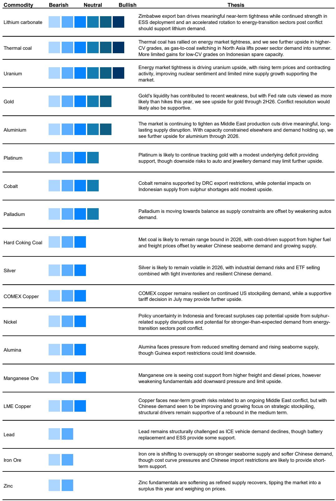
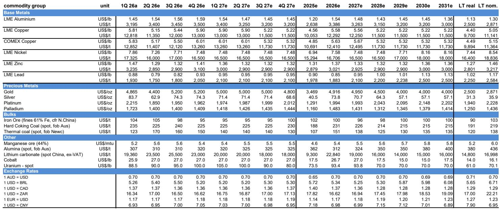
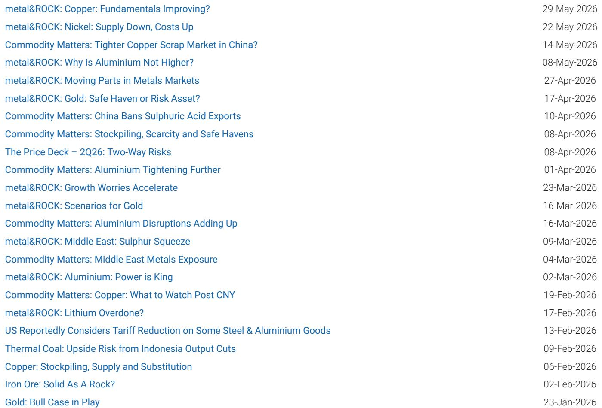

# The US Copper Tariff Decision Is the Most Underappreciated Catalyst in Base Metals Today

The next major inflection point for global copper markets will not come from a mine shutdown, a Chinese stimulus package, or a green energy mandate. It will come from a single administrative decision in Washington: whether to impose a 15% import tariff on refined copper starting January 2027. That decision, expected sometime in the second half of 2026, has already begun distorting physical flows, inventory levels, and pricing benchmarks in ways that most market participants have not yet fully priced in.

The US has already imported an estimated 260,000 tonnes of copper above normal demand so far this year, equivalent to roughly 2.6% of global demand on an annualized basis. That stockpiling is a direct response to the anticipated tariff. The US now holds more than a year of normal refined copper imports in inventory. If tariffs are announced with sufficient lead time, the incentive to front-load shipments will intensify, tightening ex-US markets and driving both COMEX and LME benchmarks higher. If tariffs are ruled out entirely, that 2.6% demand cushion disappears, and the metal sitting in US warehouses becomes a supply overhang that could weigh on prices globally.

The market is currently pricing roughly a 43% probability that a 15% tariff will be in place by January 2027, and a 73% probability by December 2027. Those probabilities are derived from forward curve differentials between COMEX and LME, and they imply that the market sees tariffs as more likely than not over the medium term. But the range of outcomes is wide, and the timing of the decision remains uncertain. The Secretary of Commerce is due to deliver a report to President Trump by late June or early July 2026, but the actual decision could come weeks or months later. For investors positioning in copper, the path to the decision matters as much as the decision itself.

This is not a forecast about copper prices. It is a framework for understanding how a binary policy outcome interacts with structural supply deficits, shifting macro expectations, and the behavior of financial and physical market participants. The tariff decision is not just a catalyst for copper. It is a stress test for how commodity markets absorb policy-driven demand shocks in an era of resource nationalism.

## The Market Is Already Front-Running the Tariff, and That Creates Its Own Dynamics

The COMEX copper benchmark is currently trading at roughly a 6% premium to the LME benchmark. That premium reflects the expectation that tariffs are coming, and it has already created a powerful arbitrage incentive: ship copper to the US now, store it, and sell it later at a higher price once the tariff is in place. The data confirms this behavior. US seaborne copper imports have been running well above the estimated 15,000 to 20,000 tonnes per week that the country needs for normal consumption. In some weeks, imports have exceeded 60,000 tonnes.

This front-running is rational for individual market participants, but it creates a collective vulnerability. The US has already accumulated more than a year of normal import cover in inventory. If tariffs are announced with a long lead time, the stockpiling will accelerate further, pulling metal out of the rest of the world and tightening LME spreads. But if tariffs are ruled out, that inventory becomes a burden. The metal will not be exported, because COMEX and LME warehouses within the US can absorb it, but the overhang will suppress both benchmarks. The key question is not just whether tariffs are imposed, but how much metal has already been moved in anticipation.

The implications extend beyond the US. Ex-US LME inventories have been tightening, particularly in China and in LME-registered warehouses outside the United States. That tightening is partly structural and partly a consequence of the arbitrage-driven diversion of metal to the US. If the tariff decision removes the incentive to ship to America, the metal that would have gone to the US will instead flow to other regions, loosening the global supply-demand balance. The bullish case for copper in 2026 and 2027 depends in part on the continuation of US stockpiling demand. Remove that demand, and the fundamental picture shifts.

## The Three Scenarios Are Not Symmetric in Their Market Impact

The most bullish scenario for copper prices is an advanced notice of tariff implementation. If the administration announces a 15% tariff from January 2027 several months in advance, the arbitrage window widens, and the incentive to ship metal to the US intensifies. COMEX would likely trade toward a 15% premium over LME, and LME time spreads would tighten as metal leaves non-US warehouses. The forward curve would move into backwardation at the front end. This scenario would also reinforce the structural bull case for copper, because it would add a policy-driven demand component to an already tightening physical market.

The most bearish scenario is a complete ruling out of refined copper tariffs. In that case, the 2.6% of global demand currently being absorbed by US stockpiling disappears. Both COMEX and LME would likely fall in absolute terms. COMEX would trade to parity with LME, or even at a slight discount, and the LME forward curve would loosen. The report notes support around the USD 12,000 per tonne level for LME copper, given ongoing structural supply issues and expected deficits, but that support would be tested. The removal of tariff-driven demand would not create a surplus, but it would remove a critical marginal buyer.

The neutral scenario is a delay. The decision could be rolled forward to a future date, keeping the option of tariffs on the table but not committing to the January 2027 implementation. This would be a continuation of the status quo, but it could be modestly negative if market participants interpret the delay as a signal that tariffs are less likely. The market would continue to price a probability, but the uncertainty would persist, and the front-running behavior would likely continue at a reduced pace.

What matters for investors is that these scenarios are not equally probable, and the market is not pricing them symmetrically. The forward curve implies a higher probability of tariffs being in place by late 2027 than by early 2027. That suggests the market sees the decision as more likely to be delayed or phased in than to be implemented immediately. But the tail risks are large. A surprise announcement either way would trigger significant repricing.

## The Report Does Not Fully Answer How Macro Conditions Will Interact with the Tariff Decision

The analysis in the base report is rigorous on the mechanics of the tariff decision and its direct impact on copper flows and pricing. But it leaves several important questions open. The most significant is how the tariff decision interacts with the macro environment. The report notes that copper prices have reacted negatively to increased expectations for a US rate hike in 2026, and that COMEX copper tends to outperform on risk-on days and underperform on risk-off days. But it does not fully model how a tariff decision would amplify or dampen those macro sensitivities.

Consider the following: If tariffs are announced at a time when the Federal Reserve is tightening, the dollar strengthens, and global growth expectations are softening, the positive impact of the tariff on COMEX could be partially offset by macro headwinds. Conversely, if tariffs are ruled out during a period of strong Chinese demand and a weak dollar, the negative impact could be muted. The tariff decision does not operate in a vacuum, and the macro context at the time of the decision will shape the magnitude of the price response.

Another open question is the behavior of COMEX net long positioning, which is already at an all-time high. The report flags this as a risk, but does not fully explore the implications. If the market is already heavily positioned for a tariff announcement, the upside surprise may be limited, while the downside surprise could trigger a sharp deleveraging. The positioning data suggests that the bullish case for copper is already partially priced in, at least in the financial market. The physical market may still have room to adjust, but the financial market may be ahead of itself.

Finally, the report does not address the second-order effects on other metals. If copper tariffs are imposed, what does that signal for aluminum, nickel, or steel? The US already has a 50% tariff on aluminum and steel imports. A copper tariff would complete the picture, and it could signal a broader shift toward resource protectionism. That would have implications for supply chains, capital expenditure decisions, and the pricing of other industrial metals. The copper tariff decision may be a leading indicator for a wider policy shift.

## A Decision Framework for Investors: Focus on Timing, Positioning, and the Path of Inventories

For investors trying to navigate this uncertainty, three variables matter most: the timing of the decision, the level of US inventories at the time of the decision, and the positioning of financial market participants.

First, timing. The Secretary of Commerce is due to report by late June or early July 2026. But the actual decision could come later. If the decision is announced in the third quarter, with implementation set for January 2027, the window for front-loading is roughly six months. That is enough time to move significant tonnage, but not enough to double the current stockpiling rate. If the decision is announced in the fourth quarter, the window narrows, and the price impact is likely to be smaller. If the decision is delayed into 2027, the uncertainty persists, and the market continues to price a probability.

Second, inventories. The US already holds more than a year of normal imports in inventory. Every additional tonne shipped to the US increases the potential overhang if tariffs are ruled out. Investors should track US import data and COMEX inventory levels closely. If inventories continue to rise at the current pace, the bearish scenario becomes more asymmetric: the downside risk of a no-tariff outcome increases, while the upside of a tariff announcement is partially discounted because so much metal has already moved.

Third, positioning. COMEX net long positioning is at an all-time high. That suggests that the bullish case is crowded. If the tariff decision is delayed or ruled out, the unwind could be sharp. Investors should monitor positioning data and be prepared for a volatility event regardless of the decision outcome. The market is not pricing a 50% probability of tariffs. It is pricing a 43% probability for January 2027 and a 73% probability for December 2027. That implies a significant tail risk of no tariffs, and that tail is not fully reflected in positioning.

The decision framework is not about predicting the outcome. It is about understanding the conditions under which each outcome would have the largest market impact, and positioning accordingly. For long-only investors, the key risk is not the tariff decision itself, but the combination of high inventories, crowded positioning, and a macro environment that may not be supportive. For tactical traders, the volatility around the decision creates opportunities, but only if the timing and positioning are managed carefully.

## The Full Report Contains the Charts and Data That Make This Analysis Actionable

The analysis above is based on a detailed report from a global investment bank that includes proprietary data on US import flows, inventory levels, forward curve differentials, and positioning. The charts in the original report show the evolution of the COMEX-LME spread, the pace of US seaborne imports, the buildup of US inventories, and the tightening of ex-US LME inventories. These are not abstract concepts. They are measurable, trackable variables that investors can monitor in real time.

The report also includes price forecasts for copper and other metals across multiple time horizons, as well as a week-in-review section that covers base metals, precious metals, and bulks. The combination of scenario analysis and data visualization makes it a practical tool for portfolio construction, risk management, and trade idea generation.

But the report also leaves meaningful questions unanswered. How will the tariff decision interact with the structural supply deficits that the copper market is facing? What happens to the COMEX-LME spread if tariffs escalate to 30% in 2028? How will Chinese demand respond to a world in which the US is actively stockpiling copper? These are the questions that the full report helps investors think through, and they are the questions that will determine whether the tariff decision is a one-time catalyst or the beginning of a longer-term shift in the copper market.

Join the community to read the full report and review the original charts.

*This article is for learning and discussion only and does not constitute investment advice.*

Personal reading notes and learning share only. Not investment advice.

