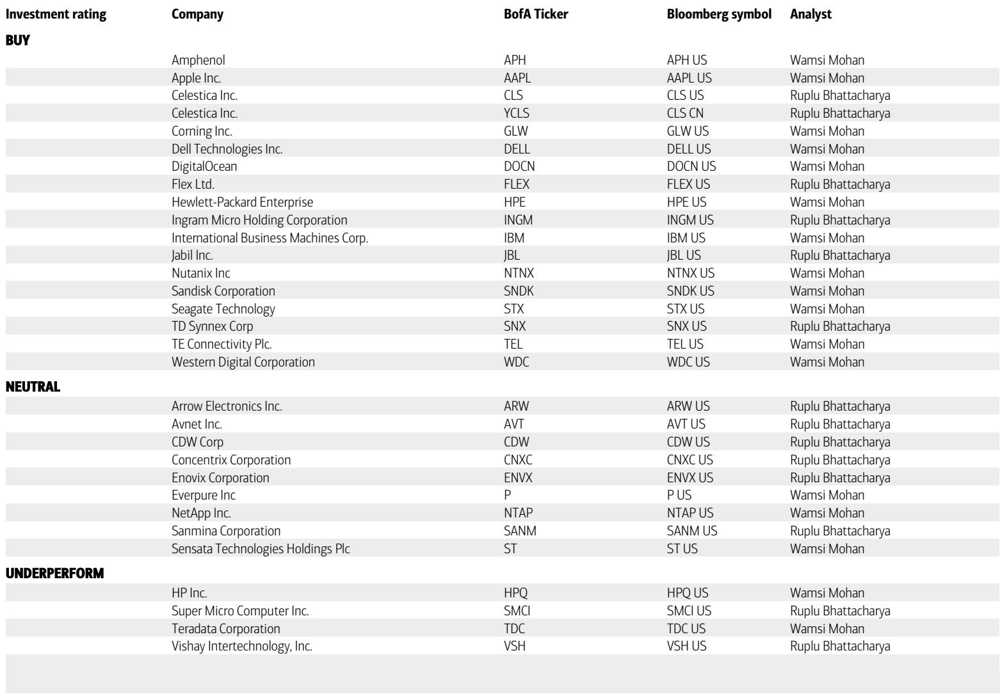
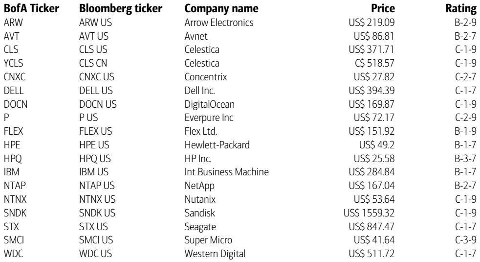
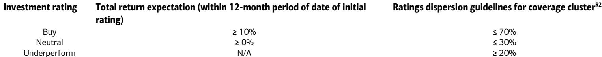

# The AI Infrastructure Cycle Is Broader, Deeper, and More Durable Than Markets Expect—And It Is Reshaping the Entire IT Hardware Landscape

The dominant narrative around artificial intelligence infrastructure has centered on GPU shortages, hyperscaler capital expenditure, and the race to build ever-larger training clusters. That narrative is now incomplete. According to findings from a major investment bank's 2026 Global Technology Conference, the AI infrastructure cycle is entering a new phase—one defined not by peak GPU demand but by a structural broadening of beneficiaries across every segment of IT hardware. Demand visibility is improving, supply remains constrained in critical components, and companies with differentiated intellectual property, scale, and supply-chain access are experiencing simultaneous revenue, market share, and margin expansion. This is not a one-quarter pull-forward story. Customers are planning capacity allocations multiple years out. The implication is clear: the investment opportunity in IT hardware is shifting from a narrow bet on AI server vendors to a much wider thesis encompassing storage, traditional compute, memory, and distribution.

Several signals from the conference support this view. Memory and hard disk drive (HDD) suppliers are introducing new business models that include volume commitments and fixed pricing periods, fundamentally changing the risk profile of their revenue streams. Enterprise storage is being reframed as a strategic bottleneck in AI architectures, not a lagging category. And perhaps most importantly, inference and agentic AI are emerging as powerful demand drivers for traditional CPU-based servers—a development that extends the cycle's duration and broadens its impact beyond the GPU-centric first wave. The price target increases announced for IBM, NetApp, Seagate, and Western Digital reflect this reassessment. But the conference discussions also reveal unresolved questions about demand sustainability, margin quality, and the true durability of the recovery in components distribution.

## The AI Demand Base Is Expanding Beyond GPUs Into Traditional Compute, Storage, and Memory, Creating a Multi-Year Infrastructure Cycle

The most important insight to emerge from the conference is that AI infrastructure demand is no longer a GPU-only story. Inference and agentic workloads are increasingly shifting computation from parallel GPU processing to sequential CPU processing. This is not a theoretical shift. Several major server vendors reported meaningful demand for traditional compute servers, driven by a combination of legacy workload growth, modernization of aging installed bases, and new CPU-intensive AI workloads. One company highlighted that its program-to-program growth on mainframe platforms has accelerated to roughly 135 percent in the latest cycle, supported by AI workloads moving beyond fraud detection into broader inferencing use cases such as insurance modeling and transaction-level intelligence. This is a structural change, not a cyclical blip.

The storage implications are equally significant. As training, inference, and agentic workflows all increase the amount of data that must be stored, protected, queried, and fed back into models, storage is becoming a more strategic bottleneck in AI architectures. One major storage vendor reported roughly 500 AI wins in a single quarter, more than double year over year, with inference, data preparation, and data-lake modernization as the most relevant near-term vectors. Another enterprise storage executive noted that agentic data growth means there is no longer "cold" or "dark" data—all data is potentially relevant and must be accessible. This reframes storage from a slow-growth infrastructure category to a critical layer of AI architecture, with higher-quality mix and better economics over time.

Memory and HDD suppliers are also benefiting from this broadening demand, but with a critical twist: supply growth is restricted. Several suppliers are focused on adding exabyte capacity through technology improvements and higher areal density rather than adding unit capacity. This supply discipline, combined with strong demand, is reshaping pricing dynamics. One memory supplier highlighted new business models that include both volume commitments and fixed pricing for an initial period, followed by variable pricing over the remainder of the contract. This represents a meaningful shift in risk allocation between suppliers and customers and supports more predictable revenue streams for companies with differentiated technology.

## Restricted Supply Growth Combined With Strong Demand Is Fundamentally Reshaping Pricing Power and Business Models in Memory and HDDs

The conference discussions around memory and HDDs reveal a market structure that is fundamentally different from previous cycles. Demand remains above supply, orders are in place for the next four to five quarters, and customers are planning capacity allocations multiple years out. One HDD supplier framed potential earnings before interest and taxes growth as potentially exceeding 25 percent for the next three to five years. This is not the language of a cyclical peak. It is the language of a structural shortage.

The supply discipline is intentional. Suppliers are not adding unit capacity. They are adding capacity through technology improvements—higher areal density, better manufacturing processes, and more efficient architectures. This approach limits the risk of oversupply that has historically ended memory and HDD upcycles. It also gives suppliers greater pricing power and the ability to negotiate more favorable contract terms. The introduction of fixed pricing periods in memory contracts is a particularly important development. It reduces revenue volatility for suppliers and gives customers greater certainty in their own planning. But it also raises a question: if demand softens, will customers be willing to honor volume commitments at prices that may no longer reflect spot market conditions? The answer to that question will determine whether this new business model is sustainable or whether it is a temporary feature of a tight market.

For investors, the key takeaway is that memory and HDD companies are no longer pure commodity plays. The combination of strong demand, restricted supply, and new business models is creating an environment where revenue growth, margin expansion, and earnings visibility can all improve simultaneously. But the sustainability of these dynamics depends on demand remaining strong across multiple end markets, not just AI infrastructure. If enterprise and consumer demand soften, the supply discipline that has supported pricing could break down.

## The Components Distribution Recovery Is Volume-Led and Broad-Based, But Margin Quality and Sustainability Require Further Proof Points

The conference discussions with major components distributors revealed a recovery that is notably different from previous cycles. Book-to-bill ratios are meaningfully above parity across all regions, backlogs are filling in through multiple quarters, and in some cases visibility extends into the following year. But the most constructive element is that the recovery is being driven by unit volume rather than price. One distributor reported little to no price contribution in the most recent quarter and repeatedly pushed back on comparisons to the Covid shortage cycle or concerns about double ordering.

This distinction matters. A volume-led recovery is higher quality than a price-led or shortage-driven cycle because it reflects real end-user demand rather than panic buying or inventory hoarding. The recovery is also broad-based, extending beyond data center and hyperscale into industrial, transportation, aerospace and defense, and consumer markets across multiple geographies. This breadth reduces reliance on any single end market and gives distributors a clearer path to sustaining revenue momentum.

However, the sustainability of this recovery is not yet proven. Memory pricing has become a meaningful near-term revenue tailwind for some distributors, with one noting that memory increased from roughly 5 to 7 percent of the business to roughly 10 to 15 percent largely because prices doubled rather than because of a similar increase in units. This raises the question of how much of the recent strength is driven by pricing inflation rather than genuine volume growth. If memory prices stabilize or decline, revenue growth could slow. Additionally, tightening lead times in memory, high-power products, and data-center-related components should support near-term demand capture, but they also increase the risk that customers are buying ahead of need.

Distributors are also running a different playbook than in prior upcycles. They are focused on selecting higher-quality revenue, holding the line on fixed costs, and using value-added services to improve earnings profiles. One distributor reported that value-added services generated roughly 30 percent of operating income and remain a central lever, particularly supply chain services for hyperscalers. This shift toward higher-margin services should support structurally higher margins over time, but it requires sustained customer demand for these services and the ability to maintain pricing power. The next several quarters will be critical in determining whether the current recovery is sustainable and whether the margin improvements are structural or cyclical.

## What the Report Does Not Fully Answer: The Durability of Demand, the Role of Pricing, and the Risk of a Demand Pull-Forward

Despite the overwhelmingly bullish tone of the conference, several critical questions remain unanswered. The most important is the durability of demand. Customers are placing orders multiple years out, and suppliers are adding capacity through technology rather than unit expansion. But how much of this demand reflects genuine structural growth versus a pull-forward of purchases driven by fear of shortages? If supply constraints ease or demand softens in enterprise and consumer markets, the multi-year visibility that suppliers are reporting could prove to be an artifact of a tight market rather than a reflection of sustainable demand.

The role of pricing is another unresolved question. Memory and HDD pricing has been a significant tailwind for revenue growth, but pricing cycles are inherently unpredictable. If pricing stabilizes or declines, revenue growth could slow even if unit volumes remain strong. The new business models with fixed pricing periods provide some protection, but they also introduce new risks. If spot prices fall below contract prices, customers may seek to renegotiate or reduce volume commitments, creating tension between suppliers and customers.

There is also the question of margin quality in the components distribution recovery. While the recovery is volume-led, some of the recent strength has been driven by memory pricing inflation. If that inflation moderates, distributors may need to demonstrate that they can maintain margins through higher-value services rather than relying on pricing tailwinds. The shift toward value-added services is encouraging, but it is still early, and the earnings contribution from these services has not yet been tested in a more normalized pricing environment.

Finally, the conference discussions did not fully address the potential for demand destruction from higher component costs. If memory, CPU, HDD, and NAND pricing continue to rise, customers may delay purchases, downgrade configurations, or seek alternative solutions. One enterprise storage executive noted that elevated flash pricing may modestly influence customer configuration choices, but the broader impact of cost inflation on demand remains unclear. These open questions do not negate the bullish thesis, but they highlight the need for continued monitoring and suggest that the current cycle is not without risks.

## A Decision Framework for Investors: How to Position Across the IT Hardware Landscape

Given the broadening demand base, restricted supply, and unresolved questions about sustainability, investors need a framework for positioning across the IT hardware landscape. The following decision framework is designed to help assess which segments and companies are best positioned for the current cycle.

First, assess exposure to structural demand drivers versus cyclical tailwinds. Companies with differentiated intellectual property, scale, and supply access are benefiting from structural demand driven by AI inference, agentic workloads, and data growth. These companies have more durable revenue streams and greater pricing power. Companies that are primarily benefiting from cyclical tailwinds, such as memory pricing inflation or component shortage-driven demand, face greater risk if those tailwinds fade. The distinction between structural and cyclical is the most important factor in determining the sustainability of current revenue and margin trends.

Second, evaluate supply dynamics and business model evolution. Companies that are adding capacity through technology rather than unit expansion have greater control over pricing and are less likely to face oversupply risks. Companies that are introducing new business models with volume commitments and fixed pricing periods are changing the risk profile of their revenue streams, but these models need to be tested in a more normalized demand environment. Investors should favor companies with supply discipline and innovative business models but remain cautious about the execution risk.

Third, analyze margin quality and the contribution of value-added services. Companies that are shifting toward higher-margin services, such as supply chain management, demand creation, and engineering support, have a clearer path to structurally higher margins. Companies that are relying primarily on pricing tailwinds or volume growth in low-margin products face greater margin risk if the cycle turns. The quality of earnings matters as much as the level of earnings.

Fourth, monitor end-market diversification. Companies with exposure to multiple end markets, including data center, industrial, transportation, aerospace and defense, and consumer, are less vulnerable to a slowdown in any single market. Companies that are overly reliant on AI infrastructure or hyperscaler demand face greater concentration risk. Diversification is a buffer against demand uncertainty.

Finally, track visibility and order patterns. Companies with multi-year customer commitments and backlogs extending several quarters out have greater earnings visibility, but investors should assess whether this visibility reflects genuine demand or a pull-forward driven by supply constraints. The length of visibility is less important than the quality of the underlying demand.

## The Full Report Contains Detailed Company-Level Analysis, Original Charts, and Price Target Justifications That Cannot Be Fully Captured Here

The conference discussions covered in this article represent only a portion of the insights available in the full research report. The original report includes detailed analysis of individual company positioning, including Dell's supply-gated revenue guidance, IBM's accelerating mainframe cycle, and the specific margin dynamics at Arrow and Avnet. It also contains original charts showing demand trends, pricing trajectories, and visibility metrics that are essential for understanding the current cycle. The price target justifications for IBM, NetApp, Seagate, and Western Digital are based on detailed financial models that cannot be fully replicated here. For investors who want to make informed decisions based on the complete analysis, the full report is essential reading.

Join the community to read the full report and review the original charts.

*This article is for learning and discussion only and does not constitute investment advice.*

Personal reading notes and learning share only. Not investment advice.

