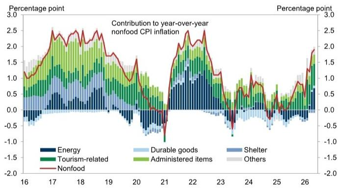
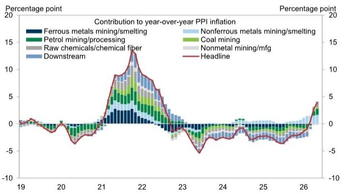
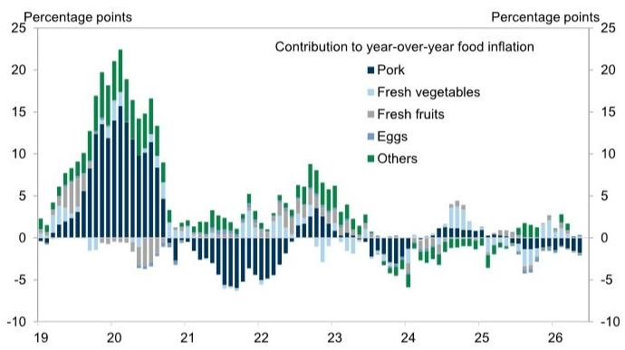

# China's Divergent Inflation Path: Why Upstream Heat Is Not Becoming Downstream Spending

China's May inflation data reveals a critical disconnect that should matter to every investor with exposure to Chinese assets. Headline PPI accelerated to +3.9% year-on-year, driven almost entirely by upstream energy and chemical prices. Core CPI, meanwhile, softened to +1.1% year-on-year, with tourism-related services prices losing momentum. The headline CPI remained flat at +1.2%, masking a structural divergence that tells us more about the state of Chinese demand than any single number can.

This is not a story about inflation returning to China. It is a story about supply-side cost pressures failing to transmit into consumer prices, a pattern that carries significant implications for corporate margins, monetary policy, and sector rotation strategies. When 82% of the PPI rebound comes from upstream sectors while core consumer inflation actually declines, the transmission mechanism from producer to consumer is broken. That is the strategic fact that demands interpretation.

The timing matters. This data arrives as China's economic reopening narrative matures and markets begin questioning the durability of the recovery. The divergence between PPI and core CPI is widening, not closing. For investors, the question is whether this represents a temporary lag or a structural feature of China's current economic configuration. The answer determines which sectors to overweight and which to avoid.

## The Upstream PPI Surge Is Concentrated and Supply-Driven, Not a Sign of Broad Demand Recovery

The headline PPI increase from +2.8% in April to +3.9% in May is striking, but the composition is even more revealing. Chemicals, oil and gas, and coal prices accounted for the bulk of the acceleration, contributing 0.3, 0.2, and 0.2 percentage points respectively to the 1.1 percentage point increase. In aggregate, upstream sectors drove approximately 82% of the rebound.

This concentration tells us the PPI story is not about broad-based industrial demand. It is about specific supply-side constraints and global commodity price pass-through. Chemical prices reflect upstream energy costs and capacity adjustments in the petrochemical chain. Oil and gas prices track global energy markets. Coal prices respond to domestic production policies and power sector demand dynamics.

The month-on-month annualized PPI reading of +9.7% in May, down sharply from +22.4% in April, suggests the pace of upstream price increases is moderating, but the year-on-year comparison remains elevated due to base effects from last year's low levels. This is a technical factor that will persist for several more months, creating a statistical illusion of accelerating producer inflation even as the monthly momentum cools.

The strategic implication is clear: sectors exposed to upstream commodity inputs are experiencing cost increases that are not being driven by their customers' demand strength. This creates margin compression for downstream manufacturers who cannot pass through higher input costs in a soft demand environment. The PPI data is not a signal to buy cyclicals broadly; it is a signal to differentiate between those who benefit from commodity exposure and those who suffer from it.

## Core CPI Softening Reveals Consumer Demand Remains Fragile Despite Reopening

Core CPI inflation edged down to +1.1% year-on-year in May from +1.2% in April, a small move but a significant directional signal. The decline was driven by softer tourism-related services prices, with transportation services inflation easing to +4.7% year-on-year from +5.1% in April.

This is the most important number in the entire release. After the initial reopening surge, services prices are losing momentum. The post-lockdown consumption catch-up is fading faster than many expected. Tourism and transportation are discretionary spending categories that should benefit most from reopening, yet their pricing power is already weakening.

Non-food CPI did edge up to +1.9% year-on-year from +1.8%, but this was entirely attributable to energy prices, specifically fuel costs rising +21.1% year-on-year versus +17.4% in April. Exclude energy, and non-food inflation is essentially flat. This is not a consumer-driven inflation story. It is a cost-pass-through story with no demand multiplier.

Food CPI declined further to -1.7% year-on-year from -1.6%, with pork prices falling -16.1% year-on-year. Pork is a politically sensitive item in China's CPI basket, and its continued decline provides comfort to policymakers that food inflation will not become a constraint on accommodative policy. But it also signals weak protein demand, consistent with the broader consumer caution narrative.

The softening core CPI matters because it removes the urgency for the People's Bank of China to tighten policy. If consumer demand remains fragile, the central bank has room to maintain or even increase accommodation. This is a positive for interest-rate-sensitive sectors and a negative for those betting on a consumption-driven reflation trade.

## The Widening PPI-Core CPI Gap Creates a Margin Squeeze That Demands Sector-Level Differentiation

The divergence between rising PPI and softening core CPI is not merely an academic observation. It is a direct driver of corporate profitability. When producer input costs rise faster than consumer output prices, margins compress. This is the mechanism that will determine relative performance across Chinese equities in the coming quarters.

Consider the chain of causation. Upstream sectors benefit from higher commodity prices. Energy companies, chemical producers, and mining firms see revenue and profit expansion. But their customers in manufacturing and processing industries face higher input costs. These downstream firms, in turn, sell to consumers and businesses that are not experiencing equivalent price increases. The margin squeeze propagates through the value chain.

The magnitude matters. With PPI at +3.9% and core CPI at +1.1%, the gap is 280 basis points. This is not an extreme level historically, but it is large enough to create meaningful profit pressure for firms with limited pricing power. The direction of the gap is also concerning: it is widening, not narrowing. If PPI continues to rise while core CPI softens, the squeeze intensifies.

This framework suggests a clear sector preference. Favor upstream commodity producers with pricing power and exposure to global demand drivers. Avoid downstream manufacturers and consumer-facing firms that must absorb input cost increases. The winners are those whose revenue is tied to commodity prices; the losers are those whose costs are tied to commodity prices but whose revenue is tied to domestic demand.

## What the Report Does Not Fully Answer: The Policy Transmission Channel Remains an Open Question

The report provides excellent data and decomposition, but it leaves several critical questions unanswered. The most important is how the People's Bank of China will interpret this data for monetary policy. The standard framework suggests that rising PPI with soft core CPI should not trigger tightening, because the inflation is supply-driven and not demand-pull. But China's policy response has not always followed textbook logic.

There is also the question of fiscal transmission. The data captures price levels but not the volume effects of fiscal stimulus. If infrastructure spending accelerates, it could boost demand for industrial commodities and further widen the PPI-core CPI gap. Conversely, if stimulus is directed at consumer subsidies, it could support core CPI and close the gap. The report does not model these scenarios.

A third open question is the role of inventory cycles. Some of the PPI increase may reflect inventory restocking rather than genuine demand. If firms are building inventories in anticipation of higher future prices, the PPI spike could be transitory and reverse when destocking begins. The month-on-month deceleration from +22.4% to +9.7% annualized supports this interpretation, but the report does not break down PPI into inventory versus final demand components.

Finally, the report does not address the external demand channel. China's PPI is influenced by global commodity prices, which are themselves driven by factors outside China's control. If global commodity prices moderate due to slowing Western economies, China's PPI could decline rapidly, closing the gap not through stronger consumer demand but through weaker producer prices. This would change the investment implications entirely.

## A Decision Framework for Investors: Three Scenarios and Their Portfolio Implications

The data supports a structured decision framework with three scenarios, each with distinct portfolio implications. Investors should assign probabilities based on their own macro views and adjust positioning accordingly.

Scenario One: The gap persists or widens. This occurs if global commodity prices remain elevated due to supply constraints while Chinese consumer demand remains soft. Under this scenario, overweight upstream energy, chemicals, and mining. Underweight downstream manufacturing, consumer discretionary, and real estate. Fixed income benefits from continued monetary accommodation. This is the base case implied by the current data.

Scenario Two: The gap narrows through stronger consumer demand. This requires fiscal stimulus or labor market improvement to boost household spending. Under this scenario, rotate into consumer-facing sectors, services, and discretionary retail. Core CPI would accelerate, and the PBOC might begin normalization. Duration would underperform. This scenario requires evidence of policy effectiveness that is not yet visible in the data.

Scenario Three: The gap narrows through lower PPI. This occurs if global commodity prices decline due to recession in developed markets or if China's industrial production slows sharply. Under this scenario, downstream manufacturers benefit from lower input costs. Upstream commodity producers underperform. This is a defensive rotation that also favors bonds as growth expectations are revised down.

The current data does not decisively favor any single scenario, but it does rule out the possibility of demand-driven overheating. This constrains the range of plausible outcomes and focuses attention on the scenarios that involve either persistent divergence or external commodity price declines.

## Join the community to read the full report and review the original charts

The May inflation data is one piece of a larger mosaic that includes credit growth, industrial production, retail sales, and property market data. Each data point tells us something about the mechanism, but the full picture only emerges when they are viewed together. The original report includes detailed charts showing the decomposition of CPI and PPI components, the contribution of each sector to inflation, and the historical context for the current divergence.

For serious investors, the value is not in the May number itself but in the analytical framework it validates or challenges. The PPI-core CPI divergence is a recurring pattern in China's economic cycle, and understanding its dynamics is essential for positioning across asset classes. The full report provides the data and analytical tools to make that assessment.

*This article is for learning and discussion only and does not constitute investment advice.*

Personal reading notes and learning share only. Not investment advice.

