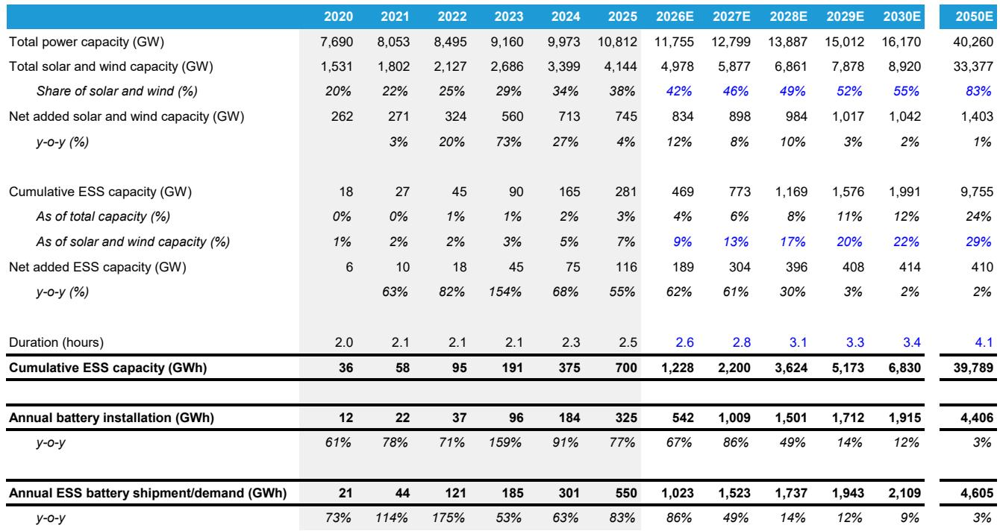
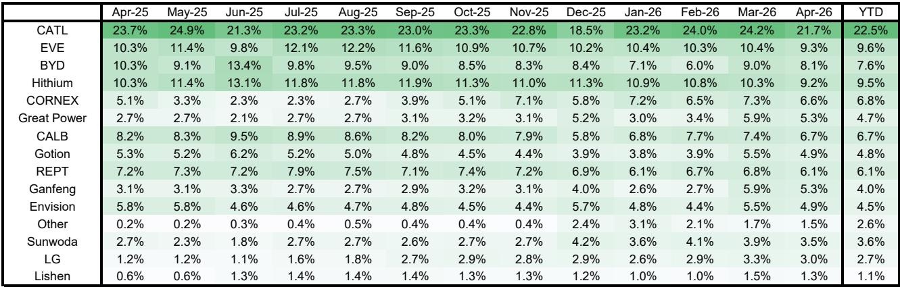
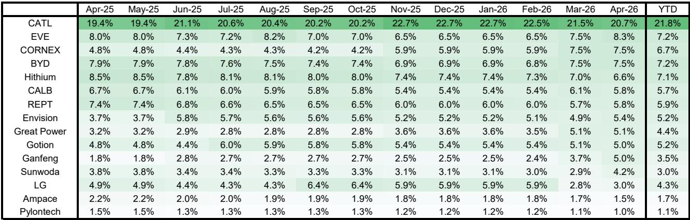

# China's Energy Storage Momentum Is Not a Bubble—It's a Structural Inflection Point That Markets Are Underpricing

The global energy storage industry has entered a phase that few strategists fully appreciate. In April 2026, China's energy storage system shipments reached 93.1 GWh, a 92% year-on-year increase that marks the highest monthly figure on record. This is not a one-month anomaly. Year-to-date shipments through April stand at 309.1 GWh, representing 109% growth over the same period in 2025. For context, this pace already exceeds the full-year global growth estimate of 86% that many analysts had set for 2026. The gap between what is happening on the ground and what is embedded in consensus expectations is widening.

What makes this moment strategically important is not simply the volume growth. It is the confluence of three forces that are reinforcing each other: collapsing battery costs that are making storage economics viable without subsidies, a policy environment in China that is actively incentivizing deployment, and a utilization rate that has surged to 94% from 69% a year ago. That last number is the most telling. When factory utilization rises by 25 percentage points in twelve months, it signals that demand is catching up with capacity far faster than the industry had planned for. The market is tightening, not loosening.

The conventional narrative has been that energy storage is a long-duration theme with gradual adoption curves. That narrative is now obsolete. The data from April 2026 suggests we are in the middle of a structural inflection, not a cyclical upswing. The question for investors is whether the current positioning in battery and storage-related equities reflects this reality, or whether it still prices in a more cautious trajectory. The evidence points to the latter.

## Record Shipment Volumes Are Driven by Domestic Demand, but Overseas Growth Is Accelerating Even Faster—and That Changes the Risk Profile

The dominant story in China's ESS market remains domestic deployment. Domestic shipments in April reached 89.9 GWh, up 89% year-on-year, and year-to-date domestic shipments have grown 107%. These are staggering numbers by any historical standard. But the more interesting dynamic is what is happening outside China. Overseas shipments from Chinese manufacturers reached 3.2 GWh in April, a 192% year-on-year increase. For the year to date, overseas shipments have grown 179%.

On a percentage basis, the overseas segment is growing at nearly double the rate of domestic. The absolute volumes are still small—3.2 GWh versus 89.9 GWh—but the trajectory is what matters. If overseas growth continues at this pace, it will begin to meaningfully contribute to overall shipment volumes within the next twelve to eighteen months. This has two strategic implications.

First, it diversifies the revenue base for Chinese battery manufacturers. A company that is heavily dependent on a single domestic market faces policy and regulatory concentration risk. As overseas revenue grows, that risk diminishes. Second, it signals that Chinese battery technology is becoming globally competitive on cost and performance, not just on price. The fact that international buyers are increasing their orders by nearly 200% year-on-year suggests that non-price factors—such as reliability, energy density, and supply chain security—are also improving.

## Factory Utilization at 94% Signals a Tightening Market That Has Not Yet Been Priced into Supply Chain Valuations

Perhaps the most underappreciated data point in the April report is the utilization rate. China's ESS battery production utilization hit 94% in April, up from 69% in the same month last year. This is not a gradual improvement. It is a step-change. A utilization rate above 90% in a capital-intensive industry typically leads to pricing power, margin expansion, and capacity expansion announcements. It also creates vulnerability: any supply disruption, whether from raw material shortages, regulatory changes, or logistical bottlenecks, will have an outsized impact on output.

The industry has been adding capacity. Monthly capacity reached 98.0 GWh in April, up 46% year-on-year. But demand is growing faster. The ratio of shipments to capacity has shifted from roughly 7:10 to nearly 9.5:10. That means the buffer that existed in 2025 has largely been absorbed. If demand continues to grow at 90% to 100% annually, the industry will need to accelerate capacity additions significantly just to maintain current utilization levels, let alone to build any slack back into the system.

For investors, this creates a classic late-cycle opportunity in the supply chain. Companies with existing capacity and established production lines are in a position to capture margin expansion. New entrants or companies with aggressive capacity expansion plans face execution risk. The winners in this environment will be those who can scale without compromising quality or delivery timelines. The data suggests that the top-tier players—particularly those with the highest market share—are best positioned to benefit from this tightening.

## CATL Maintains Its Lead, but the Fastest Growth Is Coming from Second-Tier Players—a Sign That the Competitive Landscape Is Not Settled

In April, CATL shipped 19.8 GWh of ESS batteries, up 72% year-on-year, maintaining a year-to-date market share of 22.5%. This is consistent with its dominant position in the industry. But the growth rates among the next tier of players tell a different story. EVE Energy shipped 8.5 GWh, up 70%. Hithium shipped 8.4 GWh, up 68%. BYD shipped 7.4 GWh, up 48%. CALB shipped 6.1 GWh, up 52%. These are all strong growth numbers, but they are not the fastest in the market.

The fastest growth is coming from smaller players. Great Power recorded 269% year-on-year growth to 4.8 GWh. Ganfeng Lithium Energy grew 220% to 4.8 GWh. CORNEX grew 140% to 6.0 GWh. These triple-digit growth rates indicate that the market is still fragmented enough for new entrants to gain meaningful share. It also suggests that customer procurement strategies are not locked in. Large-scale buyers—utilities, project developers, and system integrators—are still evaluating multiple suppliers and are willing to shift volume to newer players if they offer better pricing or performance.

This has implications for long-term market structure. If the fastest-growing players can maintain their momentum, the concentration of market share among the top three to five players may decrease over the next two to three years. That would be a departure from the pattern seen in the electric vehicle battery market, where CATL and BYD have consolidated their positions. Energy storage may follow a different competitive logic, one that rewards agility and cost innovation over scale alone.

## Tender Volumes Point to a Robust Forward Pipeline, but the Gap Between Tenders and Awards Raises a Question About Execution Capacity

China's ESS tender activity remained strong in April, with tender battery volumes reaching 55.6 GWh, up 44% year-on-year. Year-to-date tender volumes stand at 224.6 GWh, a 190% increase over the same period in 2025. This is a powerful leading indicator. Tenders represent future demand that has been formally solicited. The fact that year-to-date tenders are growing at nearly double the rate of year-to-date shipments suggests that the demand pipeline is expanding faster than current production can fill it.

However, there is a nuance that deserves attention. Winning bid volumes—the amount of battery capacity that has been awarded in completed tenders—reached only 23.5 GWh in April, which was broadly flat year-on-year at plus 2%. The gap between tenders and awards is widening. This could mean several things. It could mean that project timelines are being extended as developers wait for better pricing or more favorable financing terms. It could mean that the tendering process is becoming more competitive, with multiple rounds of bidding delaying final awards. Or it could mean that supply constraints are causing project sponsors to hold back on committing to awards until they have confirmed battery availability.

Whatever the cause, the gap introduces uncertainty into the near-term demand forecast. Tenders are a useful indicator of intent, but awards are a more reliable measure of committed demand. If the gap persists, it may signal that the industry's forward visibility is not as clear as the headline tender numbers suggest. This is one area where the report provides data but does not fully resolve the analytical question.

## The U.S. and Germany Are Moving in Opposite Directions, and That Divergence Creates Both Risk and Opportunity for Global Investors

The U.S. and German ESS markets are often grouped together as "ex-China" demand drivers, but the April data reveals a sharp divergence. In the United States, ESS battery installations reached 4.3 GWh in April, down 18% year-on-year despite a 71% month-on-month increase. Year-to-date installations stand at 9.9 GWh, down 11% year-on-year. In Germany, by contrast, installations reached 0.8 GWh in April, up 74% year-on-year, with large-scale storage surging 833% to 0.3 GWh. Year-to-date German installations stand at 2.8 GWh, up 39%.

The U.S. data is puzzling on the surface. A 71% month-on-month increase should be a positive signal, but the year-on-year decline suggests that April 2025 was an unusually strong month that created a high base effect. More importantly, the year-to-date decline indicates that the U.S. market is not keeping pace with global growth. This could be due to permitting delays, grid interconnection bottlenecks, or policy uncertainty at the federal level. Whatever the cause, the U.S. is underperforming its potential.

Germany, on the other hand, is demonstrating that large-scale storage can grow rapidly when the regulatory and economic conditions are right. The 833% year-on-year growth in large-scale storage is not a fluke. It reflects a structural shift in how German utilities and project developers are approaching grid stability and renewable integration. If this trend continues, Germany could become a meaningful market for Chinese battery exporters and for European battery manufacturers alike.

The divergence between the U.S. and Germany creates a strategic question for global investors: should they overweight exposure to markets where growth is accelerating, or should they position for a U.S. recovery that may materialize later in the year? The answer depends on one's time horizon and risk tolerance. For the next six to twelve months, the momentum is clearly in China and Germany. For a longer-term perspective, the U.S. remains the largest potential market, and any policy clarity or infrastructure acceleration could trigger a catch-up cycle.

## What the Report Does Not Fully Answer: The Sustainability of Utilization at These Levels and the Implications for Pricing

The report provides a rich dataset on shipments, tenders, installations, and market share. But it leaves several critical questions open. The most important is whether the current 94% utilization rate is sustainable. If demand continues to grow at 90% to 100% annually, utilization would need to remain at or above 90% for the foreseeable future. That would require continuous capacity additions, which in turn require capital, raw materials, and skilled labor. Any disruption in any of these inputs could cause utilization to drop sharply, creating a supply-demand imbalance that would affect pricing and margins.

A related question is about pricing. The report does not provide data on battery cell pricing or system-level pricing. If utilization is high and demand is strong, pricing should theoretically be firming. But the energy storage industry has experienced significant price declines over the past two years, driven by overcapacity and technological improvements. It is not clear whether the current demand surge is enough to reverse that trend or whether it is simply absorbing excess capacity without putting upward pressure on prices. The answer to this question is central to any investment thesis in the sector.

Finally, the report does not address the financial health of the fastest-growing smaller players. Companies like Great Power, Ganfeng, and CORNEX are growing at triple-digit rates, but their profitability, balance sheet strength, and access to capital are not discussed. In a capital-intensive industry, rapid growth can be as much a risk as an opportunity. Investors need to distinguish between growth that is funded by sustainable cash flow and growth that is funded by debt or equity dilution.

## A Decision Framework for Positioning in Energy Storage

For readers who want to translate the report's findings into actionable strategy, a three-part framework may be useful. First, assess exposure to China's domestic market. The data is unequivocal: China is the engine of global ESS growth, and any portfolio that underweights Chinese battery manufacturers or their supply chain partners is likely missing the largest source of momentum. Second, evaluate the mix of shipment growth versus installation growth. Shipments are a leading indicator, but installations are the ultimate measure of end-demand. The gap between the two in the U.S. and the alignment between them in Germany and China can signal where the next leg of growth will come from. Third, monitor the competitive dynamics among battery suppliers. If the fastest-growing players are taking share from the leaders, the market is still in a discovery phase. If the leaders are consolidating their positions, the window for new entrants may be closing.

The report's data supports the view that energy storage is entering a multiyear growth cycle. But the nature of that cycle—whether it will be characterized by margin expansion, volume growth, or a mix of both—depends on factors that are still evolving. The most prudent approach is to build positions in companies that have demonstrated both scale and growth, while maintaining the flexibility to adjust as the competitive landscape clarifies.

Join the community to read the full report and review the original charts.

*This article is for learning and discussion only and does not constitute investment advice.*

Personal reading notes and learning share only. Not investment advice.

