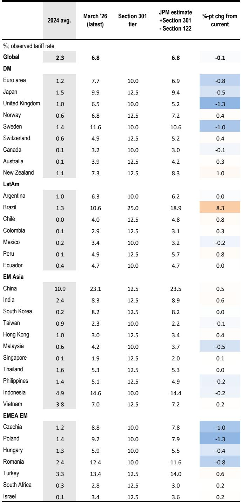
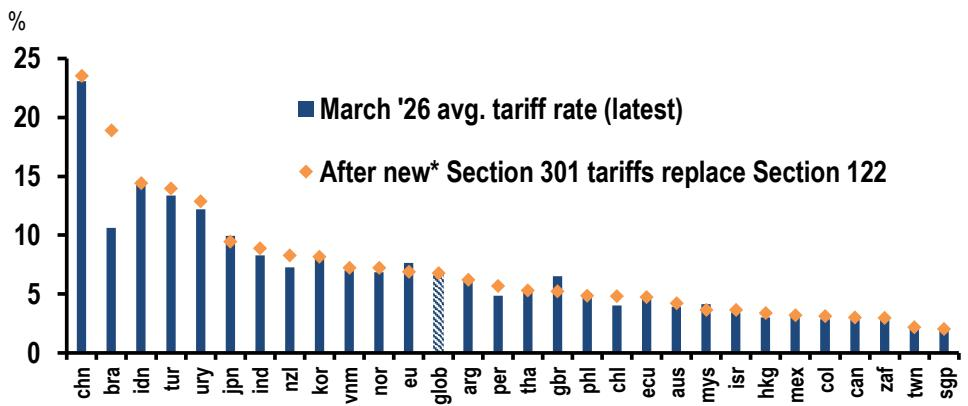

# JPM：关税政策的真正转折不在税率高低，而在法律框架的切换

市场正在低估一个关键变化：美国关税政策的核心博弈点，已经从“加多少”转向了“用什么法律工具来加”。JPM在最新发布的研报中明确指出，随着IEEPA关税被法院推翻、Section 122关税即将于7月24日到期，美国政府正在系统性地将关税权力基础从临时性的紧急授权，转向更具持久性的Section 301框架。这个切换，表面上是法律技术的调整，实质上意味着关税政策的可预期性进一步降低、诉讼风险显著上升，而企业需要面对的，将是一轮比2018年中美贸易摩擦更广泛、更碎片化的政策不确定性。

这不是一个关于关税税率升降的故事。这是一个关于政策工具选择如何重塑全球供应链决策逻辑的故事。

## 1. 关税的“名义税率”和“实际税率”之间存在巨大鸿沟，而豁免清单才是真正的博弈场

JPM的测算揭示了一个被广泛忽视的事实：美国对全球征收的平均关税税率，在静态权重下约为11%，但实际征收中观察到的税率仅有6.7%。这4.3个百分点的差距，几乎全部来自豁免条款。能源、药品、电子产品、USMCA合规贸易——这些领域的大规模豁免，使得实际税率远低于政策声明的水平。

这意味着，企业在评估关税风险时，不能只看白宫发布的税率数字，而必须拆解每一类产品的豁免状态。当前Section 301的强制劳动调查中，美国贸易代表办公室提议对60个经济体征收10%-12.5%的关税，但豁免范围比之前的IEEPA和Section 122更为宽泛——新增了飞机、部分机械设备等品类。对于法国这样的航空出口大国，由于飞机出口占其对美贸易的相当比重，实际有效税率反而可能下降。

这里的核心洞察是：关税政策的真实影响，从来不取决于最高税率，而取决于谁在豁免清单上、谁不在。企业需要建立的不是单一的关税预测模型，而是动态的“豁免-税率”组合评估框架。

## 2. 巴西成为本轮关税调整的最大“意外受害者”，但经济冲击可能有限

在JPM的国别分析中，巴西的关税变动最为剧烈。美国对巴西单独启动了Section 301调查，理由是“不合理”的贸易实践，提议将巴西对美出口的基准关税提高至25%。即便考虑咖啡、肉类、稀土、橙汁、飞机等产品的豁免，加上钢铁50%的关税，巴西的加权平均关税仍将从当前的10.5%跃升至19%，升幅达8个百分点。

但JPM同时指出，这一冲击对巴西经济的实际影响可能有限。原因有二：其一，巴西对美国的直接贸易敞口本身不高；其二，巴西对美出口结构中，石油等大宗商品占比上升，而这些产品受关税影响较小。这是一个典型的“政策冲击大、经济影响小”的案例，但它的信号意义不容忽视——美国政府正在将贸易工具从“针对中国”扩展到“针对特定国家”，哪怕这些国家并非传统意义上的贸易对手。

对于投资者而言，巴西关税案例提供了一个重要的分析模板：当关税冲击与贸易敞口不匹配时，真正的风险不在于直接贸易损失，而在于政策不确定性对投资信心的侵蚀。

## 3. 新关税框架的法律基础可能比IEEPA更脆弱，诉讼将成为常态

JPM在报告中点出了一个关键但容易被忽略的风险点：Section 301关税的法律基础，可能比已经被法院推翻的IEEPA更加脆弱。法院在IEEPA案中的裁决逻辑强调“成文法文本优先于行政解释”，这意味着，如果Section 301的适用被认定为超出了该条款的历史使用范围，它同样可能面临司法挑战。

历史数据显示，Section 301通常用于针对特定国家的特定贸易行为，而非像当前这样，对60个经济体施加近乎普遍性的关税。美国政府试图用这个工具来重建IEEPA时期的关税体系，但这一做法是否合法，最终将由法院裁决。JPM的判断是：无论结果如何，诉讼过程本身将显著推高贸易政策的不确定性。

这里的含义是：关税政策的不确定性，正在从“会不会加”演变为“加了之后会不会被法院推翻”。企业不能再假设关税是稳定的政策变量，而必须将其视为一个持续波动的法律变量。

## 4. 中国关税已接近23%，但边际变化最小——真正值得关注的是“结构性产能过剩”调查

在所有主要经济体中，中国已经是美国关税体系中税率最高的国家，维持在23%左右。JPM的测算显示，即便新的Section 301强制劳动关税生效，中国的税率也只会微升至24%。对于已经高度关税化的中美贸易而言，边际变化已经不大。

但报告暗示，下一轮真正的冲击可能来自另一个方向：针对“结构性产能过剩”的Section 301调查。这项调查于今年3月启动，覆盖16个经济体，目前尚未公布任何关税税率。美国贸易代表Greer表示，调查预计在“数周内”完成。关键在于，这项调查的关税是否会与现有关税叠加。如果答案是肯定的，那么对于某些行业——尤其是受政府补贴影响较大的制造业——将面临关税成本的指数级上升。

这份报告没有完全展开的是：结构性产能过剩调查的关税设计逻辑，可能与传统关税完全不同。它可能不是简单的从价税，而是针对特定产品、特定企业的惩罚性税率。这种“定制化”关税的执行难度和合规成本，将远高于当前的普遍性关税。

## 5. 报告尚未完全回答的问题：关税的传导效应和二阶影响

JPM的这份报告在关税的“第一层影响”——即直接税率变化——上提供了极为详尽的分析，但有两个问题没有得到充分回答。

第一，关税的传导效应。当前的实际税率远低于名义税率，一个重要原因是企业通过调整进口来源、产品组合和定价策略来规避关税。但随着Section 301框架的全面铺开，这种套利空间正在收窄。当更多的经济体被纳入关税体系，企业的“避税”选择将急剧减少，实际税率可能加速向名义税率收敛。这一传导过程的速度和幅度，报告并未给出明确判断。

第二，关税对供应链决策的二阶影响。利率、汇率、关税——这三个变量正在形成复杂的交互作用。高关税推高进口成本，进而影响通胀预期，进而影响美联储的利率路径，进而影响美元汇率，而汇率又反过来影响关税的实际负担。JPM的分析聚焦于关税本身，但未深入讨论这一宏观反馈循环。对于资产定价而言，这恰恰是最需要理解的部分。

## 6. 给决策者的观察框架：从“跟踪税率”转向“跟踪法律工具”

基于这份报告的启示，我们认为，企业和高净值投资者需要建立一个新的关税分析框架。这个框架的核心，不是预测下一轮关税的税率是多少，而是回答三个问题：

第一，关税的法律基础是什么？是Section 232（国家安全）、Section 301（贸易报复），还是新的立法？不同的法律基础，对应着不同的诉讼风险、豁免逻辑和到期时间。

第二，豁免清单如何变化？当前最关键的变量不是税率本身，而是哪些产品、哪些国家被纳入或移出豁免清单。企业需要建立自己的“豁免敏感性”评估。

第三，关税是否可叠加？这是最大的未知数。如果结构性产能过剩调查的关税与现有关税叠加，某些行业的实际税率可能突破40%甚至更高。这个问题的答案，将在未来数周内逐步明朗。

JPM的报告为理解当前关税政策的“技术细节”提供了极好的起点，但真正的投资判断，需要将这些技术细节嵌入到更宏观的政策周期和资产定价框架中。关税不是孤立变量，它是利率、汇率、地缘政治和产业政策的交汇点。

---

这份报告的价值，不在于告诉你关税税率会升还是会降，而在于帮你建立起一套理解关税政策“底层逻辑”的分析框架。但正如我们前面讨论的，报告的局限在于，它没有充分展开关税的传导效应和二阶影响。这些问题的答案，往往藏在报告的图表和脚注里，需要结合其他资产类别的分析才能拼出完整的图景。

如果您希望进一步探讨关税政策如何影响具体的行业配置、汇率策略或国别风险定价，欢迎来我们的星球微信群里继续讨论。在那里，我们会基于JPM等机构的原始报告，每周拆解一份关键研报，并尝试回答那些报告没有完全展开的问题。

Personal reading notes and learning share only. Not investment advice.

