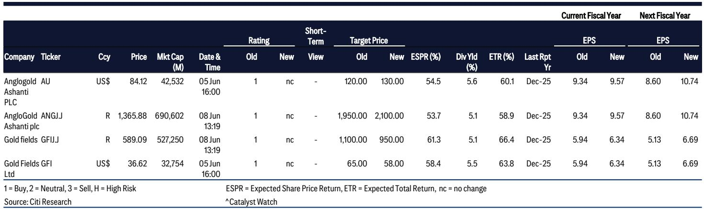

# Citi：黄金股回调是表象，真正的机会藏在现金流与远期定价的错位中

当金价从2026年1月的高点回落约11%，黄金股却经历了高达25%的修正。市场直观地将此解读为“金价跌了，黄金股自然要跌”。但Citi这份最新研报揭示了一个被忽视的核心判断：**黄金股当前的价格，并非在定价金价的短期波动，而是在错误地定价了这些公司未来两年持续改善的自由现金流。** 真正值得关注的，不是金价还能不能回到高点，而是这些公司能否在当前的运营效率下，将现金流转化为估值重估的杠杆。

这份发布于2026年6月8日的报告，覆盖了AngloGold Ashanti和Gold Fields两家标的，均维持“买入”评级。但报告最引人深思的，并非简单的评级，而是Citi在调降目标估值倍数（从8倍降至6-7倍）的同时，仍大幅上调了远期EBITDA预期，并给出了60%以上的预期总回报率。这种“降倍提价”的微妙组合，恰恰点出了当前市场定价中最核心的错位。

## 1. 金价回调并非系统性风险，而是对运营韧性的压力测试

市场对黄金股的担忧，往往集中在金价下跌对盈利的直接侵蚀。Citi的数据显示，自1月高点以来，金价从约5000美元/盎司回落至当前约4350美元，跌幅约13%。但同期两家公司的股价跌幅却远超金价，达到20%-25%。这种非对称下跌，意味着市场正在为“金价继续下跌”这一情景支付过高的保险溢价。

然而，Citi的Q1 2026运营数据给出了相反的信号。两家公司的运营表现均“稳定”，这并非一句套话。在成本端，能源价格高企带来的通胀压力尚未实质性地传导至矿山运营成本；在产量端，Obuasi矿山的爬坡和Nevada项目的推进，正在为AngloGold提供内生增长。Gold Fields的Windfall项目同样在按计划推进。

这意味着，当前股价中隐含的“盈利崩塌”假设，与正在发生的“运营稳定”现实之间存在显著背离。Citi的测算显示，即便在当前的黄金现货价格下，两家公司的自由现金流收益率分别达到10.5%（AngloGold）和12%（Gold Fields），这已经显著高于矿业股历史上8%的平均水平。换句话说，**当前股价反映的不是“金价下跌”，而是“市场不相信运营能持续”。** 而这份报告的核心洞察在于：运营韧性正在被低估。

## 2. 真正的估值锚不在当前金价，而在2027年的5000美元

Citi的研报中有一个容易被忽视的结构性判断：**Citi house views on gold prices are constructive for \$5,000/oz in 2027。** 这是一个极为关键的假设，因为它决定了估值的时间维度。

当前市场更多在交易“金价还会跌多少”，而Citi在交易“2027年金价能达到多少”。这两者的区别，决定了估值方法的选择。如果只看当前金价，AngloGold 4.7倍和Gold Fields 3.6倍的一年前瞻EV/EBITDA似乎合理，甚至略贵。但如果将视角拉长至2027年，情况截然不同。

Citi的模型更新显示，由于上调了2026-2028年的金价假设（分别上调8%/25%/13%），两家公司的EBITDA在2027年将出现24%的同比跃升。这意味着，当前的低估值倍数并非“贵”，而是对远期盈利增长缺乏定价。Citi虽然将目标估值倍数从8倍下调至6-7倍，但这一倍数仍然高于各自的历史长期均值（AngloGold 4.7倍，Gold Fields 5.1倍）。这种“高于历史均值”的定价，所对应的正是2027年5000美元金价下的盈利水平。

**所以，Citi的投资逻辑并非“金价涨了所以买”，而是“当前市场定价的是金价下跌的尾部风险，而非金价上涨的确定性收益”。** 这种不对称性，是当前黄金股最吸引人的地方。

## 3. 自由现金流是估值重估的引擎，而非盈利本身

报告中反复出现一个数字：自由现金流收益率。AngloGold约10.5%，Gold Fields约12%。这个数字的重要性，远超过EBITDA的绝对增长。

原因在于，矿业公司的估值重估，往往不发生在盈利最高的时候，而发生在市场意识到“这些盈利可以持续转化为股东回报”的时候。Citi指出，两家公司都拥有“强劲的资产负债表”和“显著的超额现金”。AngloGold在Q1 2026末拥有约9亿美元的净现金头寸，Gold Fields预计在FY26末也将达到约7亿美元的净现金。

这些超额现金意味着什么？意味着公司既有能力进行资本开支（如Nevada和Windfall项目），也有能力进行股东回报（分红或回购）。在矿业股的历史上，**当一家公司从“资本开支高峰期”进入“自由现金流释放期”时，市场往往愿意给予更高的估值倍数。** Citi的研报明确指出，两家公司的资本开支峰值“很可能已经过去”。这正是估值重估的催化剂。

但这里有一个尚未完全展开的问题：**超额现金的分配优先级是什么？** 是优先投入增长项目，还是优先回报股东？报告没有给出明确的指引。这取决于管理层对资本配置的决策，而这一决策将直接影响股价重估的节奏和幅度。

## 4. 报告尚未完全回答的关键问题：降倍与提价之间的张力

Citi在研报中做了一个看似矛盾的操作：上调了目标价（AngloGold从120美元升至130美元，Gold Fields从65美元降至58美元），但下调了目标估值倍数（从8倍降至6-7倍）。对于Gold Fields，目标价甚至出现了下调。

这种“降倍提价”的背后，反映的是Citi对短期风险的谨慎与对长期价值的乐观之间的平衡。报告明确提到，下调倍数“反映了对黄金的短期谨慎看法”。但问题在于：**如果2027年金价真的达到5000美元，当前6-7倍的估值倍数是否仍然合理？** 如果市场届时对黄金股的信心恢复，估值倍数回到8倍甚至更高，那么当前的目标价可能仍然保守。

另一个尚未回答的问题是：**加纳的监管风险到底有多大？** 报告将“加纳的监管不确定性”列为两家公司的共同风险，但并未量化其影响。考虑到AngloGold约60%的产量来自非洲，Gold Fields同样在加纳有重要资产，这一风险可能成为估值折价的核心来源。如果监管环境恶化，运营成本的上升可能会侵蚀自由现金流，进而削弱重估逻辑。

## 5. 给读者的观察框架：如何跟踪黄金股的估值重估信号

对于关注黄金股的投资者，这份报告提供了一个清晰的观察框架，而非简单的买卖建议。

首先，**关注运营数据的季度趋势，而非金价的日间波动。** Citi的研报之所以有价值，在于它将金价波动与运营基本面剥离开来。Obuasi的产量爬坡速度、Nevada项目的进展、Windfall项目的成本控制，这些才是决定自由现金流能否兑现的关键变量。金价的短期波动，更多影响的是市场情绪，而非企业内在价值。

其次，**关注资本配置的信号。** 当一家矿业公司开始宣布特别分红、股票回购或降低杠杆时，往往是市场开始重新定价其自由现金流价值的信号。Citi的报告已经点出了“超额现金”的存在，但市场需要看到实际的动作。

最后，**关注估值倍数与历史均值的偏离程度。** 当前AngloGold的4.7倍与历史均值持平，但低于全球同业；Gold Fields的3.6倍则低于自身历史均值和同业。这种“折价”能否收窄，取决于市场是否接受Citi对2027年金价的判断。如果金价在未来12个月内稳定在4500美元以上，而非继续下跌，那么当前的低倍数将成为一个极具吸引力的入场点。

Citi的这份研报，本质上是在说：**市场正在为金价下跌的尾部风险定价，却忽略了这些公司正在积累的现金流价值。** 这种错位不会永远持续。当运营数据持续验证、自由现金流开始兑现、股东回报计划落地时，估值重估就会发生。问题只在于：你愿意等多久。

---

以上分析只触及了这份研报的核心逻辑。报告中还有大量关于具体矿山成本曲线、汇率假设敏感性、以及Bull/Bear情景下的股价区间分析，这些内容对于理解投资的安全边际至关重要。如果你希望看到完整的EBITDA预测表、目标价推导过程以及风险情景下的股价区间，欢迎来星球微信群里继续讨论。我们会在群内分享这份研报的完整解读与原始图表，并持续跟踪两家公司的季度运营数据变化。

Personal reading notes and learning share only. Not investment advice.

