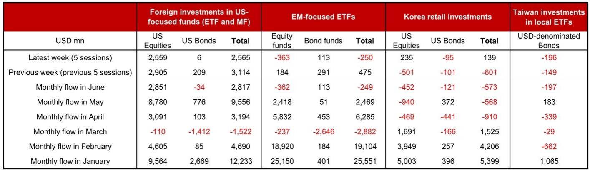
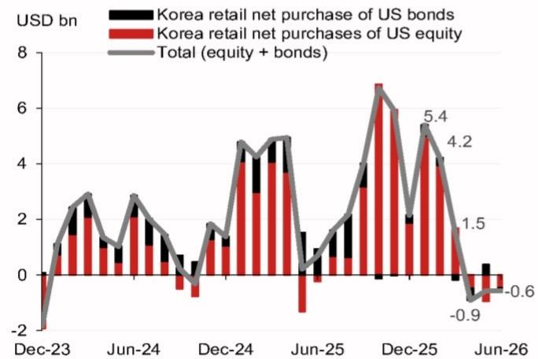
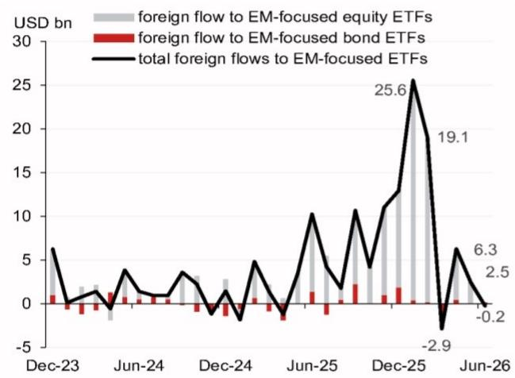

# The AI-Led Dollar Gravitational Pull Is Reshaping Global Capital Flows, Not Just Emerging Market Risk

The most important capital flow story of mid-2026 is not that money is leaving emerging markets. It is that money is being pulled into US equities with a force that overrides nearly every other signal in the global allocation system. Foreign inflows into US-focused equity funds reached USD 2.6 billion in the first week of June alone, extending a May that saw USD 8.8 billion in inflows, the largest monthly total since January 2026. This is not a tactical rebalancing. This is a structural redirection of global savings into US technology and AI-related assets, and it is happening at precisely the moment when emerging market flows are decelerating sharply.

The pattern is clear and it demands a strategic response. EM-focused ETFs experienced outflows of USD 250 million in the first week of June, reversing the prior week's modest inflows of USD 475 million. The monthly comparison is even starker. In April, foreign investors poured USD 6.3 billion into EM funds. In May, that figure collapsed to USD 2.5 billion. The direction of travel is unambiguous, and the speed of the reversal suggests that the AI narrative is not merely a sector story but a macro force that is reordering cross-border portfolio preferences.

This article argues that investors must treat the current flow dynamic not as a temporary rotation but as the early stage of a regime shift. The implications for currency strategy, regional allocation, and portfolio construction are profound. Those who treat this as a repeat of past EM selloffs will miss what is genuinely new about the current environment.

## US Equity Inflows Are Accelerating While Bond Inflows Stall, Signaling a Risk-On Rotation Focused on Growth

The composition of US-focused flows tells a highly specific story. In the first week of June, foreign inflows into US equity funds were USD 2.6 billion, while inflows into US bond funds were essentially flat at USD 6 million. This is not a diversified allocation to the United States. It is a concentrated bet on US corporate equity, driven overwhelmingly by the AI and technology narrative.

The monthly data reinforces this interpretation. In May, foreign investors bought USD 8.8 billion of US equity funds and only USD 776 million of US bond funds. The bond figure, while positive, is dwarfed by the equity number and represents a sharp slowdown from the USD 2.7 billion in bond inflows seen in January. The message from the data is that global capital is not seeking safety in US Treasuries. It is seeking exposure to US earnings growth, specifically the growth expected from the AI infrastructure buildout, semiconductor demand, and large-cap technology platforms.

This distinction matters for currency markets. A flow pattern that is equity-heavy rather than bond-heavy has different implications for the dollar. Equity inflows tend to be more volatile and sentiment-driven, but they also reflect a deeper conviction about US exceptionalism. Bond inflows, by contrast, are often driven by carry and safe-haven demand. The current configuration suggests that global investors are willing to take equity risk in the US but are not yet comfortable extending duration or credit risk in the same market. This creates a dollar that is supported by structural demand but vulnerable to any disappointment in the AI earnings trajectory.

## Emerging Market Flows Are Decelerating Faster Than Headline Numbers Suggest, and the Composition Is Deteriorating

The headline outflow of USD 250 million from EM-focused ETFs in the first week of June is concerning, but the underlying composition is worse. Equity-focused EM funds saw outflows of USD 363 million, while bond-focused EM funds saw inflows of only USD 113 million. The equity outflow is the dominant driver, and it represents a complete reversal from the prior week when EM equity funds attracted USD 184 million.

The monthly trend is even more telling. In April, total EM fund inflows were USD 6.3 billion, split between USD 5.8 billion in equity and USD 453 million in bonds. By May, total inflows had fallen to USD 2.5 billion, with equity inflows dropping to USD 2.4 billion. The equity component is collapsing, and the bond component, while small, is also under pressure. This is not a broad-based EM selloff of the kind seen during a dollar funding crisis. It is a selective withdrawal from EM equities as global capital pivots toward US tech.

For Asia ex-Japan currencies, this creates a challenging environment. The countries most dependent on equity inflows, such as India, Indonesia, and South Korea, are likely to face the greatest FX pressure. The data on Korean retail investors is instructive. After two months of net selling of US portfolio assets, Korean retail investors turned to net buying of USD 139 million in the week ending June 6, with USD 235 million in equity purchases partially offset by USD 95 million in bond sales. Korean retail investors are re-entering US equities at the very moment when EM equity outflows are accelerating. This is a powerful signal of where domestic Asian capital sees the best risk-adjusted return.

## The Korean and Taiwanese Flow Data Reveal a Divergence Between Institutional and Retail Behavior That Has Currency Implications

The granular data from Korea and Taiwan offers a window into the decision-making of Asian investors that is not visible in aggregate EM flow numbers. Korean retail investors net bought USD 139 million of US portfolio assets in the latest week, a sharp reversal from the USD 601 million in net selling the prior week. The buying was concentrated in US equities, which saw net purchases of USD 235 million, while US bonds saw net selling of USD 95 million.

This pattern suggests that Korean retail investors, who are among the most sophisticated and active in the region, are treating any pullback in US tech stocks as a buying opportunity. Their behavior is consistent with a belief that the AI-driven rally has further to run and that US equities will outperform Asian equities over the medium term. This is a bearish signal for the Korean won, because it implies that domestic capital is flowing out of the local market and into dollar-denominated assets.

The Taiwan data tells a different but equally important story. Taiwanese investors net sold USD 196 million of USD-denominated bond funds in the first week of June, extending the prior week's net selling of USD 149 million. This is a continuation of a pattern that has been in place since April, when Taiwanese investors sold USD 339 million of USD bonds. The monthly data shows that Taiwanese investors were net buyers of USD 183 million in May, but that was a partial reversal of the April selling and is now reversing again.

The Taiwan data is significant because it suggests that Asian investors are not simply rotating from EM to US assets. They are also rotating within US assets, from bonds to equities. Taiwanese investors are selling US bonds and, based on the broader flow data, are likely redeploying that capital into US equities. This is consistent with the global pattern of equity inflows dominating bond inflows and reinforces the view that the AI narrative is the primary driver of cross-border allocation.

## What the Report Does Not Yet Explain: The Sustainability of AI-Driven Inflows and the Risk of a Concentration Shock

The report provides a high-frequency snapshot of flows, but it does not address the most critical strategic question: how sustainable is the current pace of US equity inflows? The data shows that foreign inflows into US equity funds totaled USD 8.8 billion in May and USD 2.6 billion in the first week of June. If the weekly pace holds, June would see inflows of roughly USD 10-11 billion, which would be the strongest month since January 2026.

This raises a difficult question. The AI narrative is powerful, but it is also increasingly concentrated in a small number of large-cap US stocks. The inflows we are observing are not diversified across the US equity market. They are likely concentrated in the mega-cap technology names that are most directly exposed to AI infrastructure spending, semiconductor demand, and cloud computing. This creates a risk that the flow dynamic becomes self-referential, with inflows driving prices higher, which attracts more inflows, until a valuation or earnings disappointment triggers a sharp reversal.

The report does not provide data on the specific sectors or stocks receiving the inflows, and it does not model a scenario in which the AI narrative falters. For investors, the key unknown is whether the current flow pattern represents a structural shift in global portfolio allocation or a momentum-driven trade that is vulnerable to a sudden stop. The answer to this question will determine whether the dollar remains supported or whether a reversal in flows triggers a sharp depreciation.

Another open question is the role of Asian central banks. The report focuses on retail and institutional investor flows, but it does not address whether central banks in the region are intervening to manage currency volatility. Given the pressure on Asian currencies from the US equity outflow, it is reasonable to assume that some central banks are using reserves to smooth the adjustment. The effectiveness of such intervention, and the willingness of central banks to continue it, is a critical variable that the data alone cannot answer.

## A Decision Framework for Investors: How to Position for the Current Flow Regime

For investors trying to navigate the current environment, the flow data suggests a clear framework with three strategic considerations.

First, the direction of flows is unambiguous and should be the starting point for any allocation decision. Global capital is flowing into US equities and out of EM equities, and the pace of the rotation is accelerating. This is not a time to fight the tape. Investors should consider reducing exposure to EM equities that are dependent on foreign portfolio inflows and increasing exposure to US equities that benefit from the AI-driven demand for technology and infrastructure.

Second, the composition of flows matters for currency positioning. The fact that US equity inflows are dominating bond inflows means that the dollar is being supported by a growth narrative rather than a safe-haven narrative. This is a more fragile source of support, because it depends on continued positive earnings surprises from US technology companies. Investors should hedge dollar exposure against the risk of an AI-related disappointment, particularly in currencies that are heavily exposed to the US equity cycle, such as the Korean won and the Taiwanese dollar.

Third, the divergence between Korean and Taiwanese investor behavior offers a tactical signal. Korean retail investors are buying US equities aggressively, which suggests that they see further upside in US tech. Taiwanese investors are selling US bonds, which suggests that they are reducing duration exposure and moving up the risk curve. For investors who want to follow the smart money, the Korean retail flow is a bullish signal for US equities and a bearish signal for the won. The Taiwanese bond selling is a signal that the global hunt for yield is giving way to a hunt for growth.

The open question is whether this framework will hold if US earnings growth disappoints or if the AI narrative suffers a setback. In that scenario, the current flow pattern would reverse sharply, and the dollar would come under pressure. Investors should therefore treat the current regime as a conviction trade with a defined risk limit, not as a permanent shift.

## Join the Community to Read the Full Report and Review the Original Charts

The data and analysis presented here are drawn from a detailed weekly report on high-frequency investor flows, including proprietary charts on US equity and bond fund flows, EM ETF flows, and retail investor activity in Korea and Taiwan. The full report contains additional granularity on daily flow patterns, month-over-month comparisons, and the underlying assumptions used to construct the flow proxies.

For investors who want to track these flows in real time and incorporate them into their own decision-making, the original report provides the necessary data and context. Join the community to read the full report and review the original charts.

*This article is for learning and discussion only and does not constitute investment advice.*

Personal reading notes and learning share only. Not investment advice.

