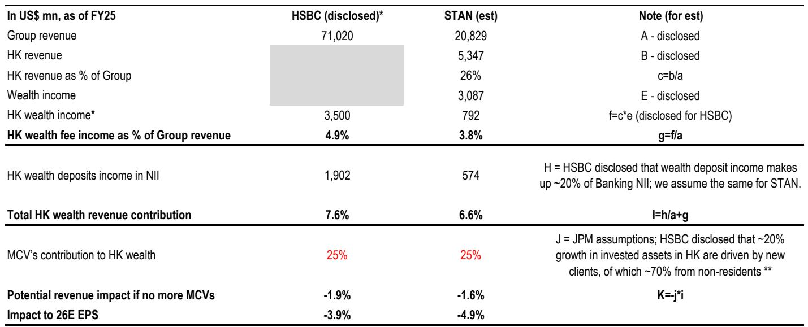
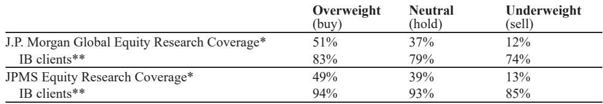

# JPM：中国新ODI框架对全球银行的冲击比预期更广，财富管理业务的增量摩擦才刚刚开始

这份JPM最新研报揭示了一个被市场低估的关键信号：中国新的境外直接投资（ODI）监管框架，其影响范围远不止于跨境资金流动本身。该机构在与法律专家的深入讨论后，得出了一个比此前预期更为悲观的结论——无论是定义中国内地居民的范围，还是对存量海外资产的追溯，乃至对境外收入的覆盖，都意味着全球银行在亚洲财富管理业务上的增量摩擦可能才刚刚开始计价。

为什么这个判断现在值得关注？因为全球银行正处在财富管理业务贡献快速提升的关键阶段。JPM数据显示，HSBC和渣打的财富收入在2025年都实现了24%的同比增长，而未来几年财富业务在集团收入中的占比预计将持续攀升。如果监管框架的执行力度超出预期，这些银行面临的不仅是新增客户的放缓，更是存量资产合规成本的系统性上升。

这份研报的核心价值在于，它通过法律专家的解读，将抽象的政策框架翻译成了具体的业务冲击路径。以下是我们从这份报告中提炼出的五个关键洞察，以及一个报告尚未完全回答的关键问题。

## 1. 中国内地居民的定义远比想象中宽泛，香港身份证不再是“豁免通行证”

市场此前普遍认为，持有香港身份证的个人可以被视为香港居民，从而规避ODI框架的约束。但JPM邀请的法律专家给出了截然不同的解读：只要个人仍持有中国内地户籍（户口），且每年在内地停留超过183天，即使持有香港身份证（包括永久居民身份），仍可能被认定为“中国内地居民”。

这个定义的改变意味着什么？它直接扩大了监管对象的人口基数。许多在香港工作、持有香港身份证但未注销内地户籍的高净值人士，将被纳入监管范围。对于银行而言，这意味着他们需要重新评估客户分类体系，而不是简单地把持有香港身份证的客户视为“非内地居民”。

从竞争格局角度看，那些在香港财富管理业务中高度依赖内地访客（MCV）的银行，受到的冲击将更为直接。JPM的测算显示，如果不再有新的内地访客贡献，HSBC和渣打的EPS将分别面临约4%和5%的下行风险。而考虑到定义范围的扩大，这个风险可能还未完全反映在股价中。

## 2. 存量海外资产可能被追溯，合规成本将系统性上升

市场此前关注的焦点是新增资金流动的监管，但JPM的研报揭示了一个更令人担忧的可能性：现有海外金融资产也可能被纳入监管范围。法律专家预计，新的实施细则可能要求中国内地居民对现有海外金融资产进行备案披露，包括历史持仓和新增境外收入。

这意味着银行需要面对的不仅是新增客户的合规审查，还有存量客户的资产合规检查。对于HSBC这样拥有保险制造业务的银行，其存量保险资产的合规风险尤为突出。相比之下，渣打采用第三方分销模式，在保险资产上的暴露程度相对较低。

这里的关键洞察是：合规成本的上升不是一次性的，而是系统性的。银行需要建立持续的监控体系，对存量客户进行重新分类和审查，这将对成本收入比产生长期压力。JPM的分析师明确指出，直到监管细则明确，银行的股权成本将保持在较高水平。

## 3. 境外IPO退出和子公司收入成为新焦点，瑞士银行的超高净值业务面临更大不确定性

对于UBS和宝盛这样的瑞士银行，其核心业务是为超高净值客户提供跨境财富管理服务。这些客户的资产来源往往包括海外IPO退出所得、境外子公司利润等。根据JPM的法律专家解读，这些“合法生成的境外现金流”现在也可能被纳入ODI框架。

这个判断的影响是双重的。一方面，新增资金流入将面临更高的合规门槛，导致净新增资金的增速放缓。另一方面，如果存量资产也被纳入监管，银行需要投入大量资源进行合规审查，而这些成本最终可能转嫁给客户或侵蚀利润率。

JPM的分析师认为，相比HSBC和渣打，瑞士银行在信息披露方面更为有限，因此市场对这类风险的定价可能更加不充分。报告指出，超高净值客户的净新增资金面临的下行风险高于此前预期，这是一个需要投资者密切关注的风险敞口。

## 4. 长期来看，合规渠道可能受益，但短期内的合规负担是更确定的变量

JPM的研报并非全是负面判断。法律专家也指出，新框架的长期目标是通过提高信息透明度和监管协调，为合规的跨境投资渠道提供更清晰的道路。具体来说，南向通、跨境理财通等合规渠道可能最终受益于监管框架的明确化。

但问题在于，这个“长期”需要多久？从政策发布到实施细则出台，再到执行落地，中间存在较大的不确定性。法律专家预计，执行细则可能在7月1日后陆续出台，但时间表仍不明确。在此之前，银行面临的将是更高的尽职调查要求和合规成本。

对于投资者来说，这意味着需要区分“长期利好”和“短期压力”的节奏。那些能够迅速适应新监管环境、建立高效合规体系的银行，可能在长期竞争中占据优势。但在短期内，所有银行都需要面对成本上升和业务增长放缓的双重压力。

## 5. 报告尚未完全回答的关键问题：执行力度到底有多大？

尽管这份研报提供了比市场预期更悲观的判断，但它也留下了一些关键问题没有完全回答。其中最重要的问题是：监管机构到底有多大的决心和执行力？

法律专家指出，中国监管机构已经通过CRS（共同申报准则）获得了相当广泛的海外资产信息，并且可能利用AI工具进行数据交叉比对。这意味着监管机构对存量资产的掌握程度可能超出市场想象。但问题在于，这些数据将如何被使用？是作为威慑工具，还是会真正启动大规模的合规审查？

另一个未解问题是“重大性门槛”和“祖父条款”的具体设定。法律专家预计，小额历史投资可能被豁免，但门槛的具体数值和过渡期安排仍然模糊。这些细节将直接决定银行存量资产的合规成本。

此外，报告提到家庭办公室客户目前并未出现恐慌情绪，但这可能只是暂时的平静。一旦实施细则出台，客户行为可能发生剧烈变化。银行需要提前做好客户沟通和资产重组的准备。

---

这些未解问题正是我们持续跟踪这份报告的核心原因。监管框架的细节、执行力度、客户反应的时间差，都将决定全球银行在亚洲财富管理业务上的真实风险敞口。欢迎来星球微信群里继续讨论，我们将持续更新政策进展和银行应对策略，帮助读者在不确定性中找到更清晰的判断框架。

Personal reading notes and learning share only. Not investment advice.

