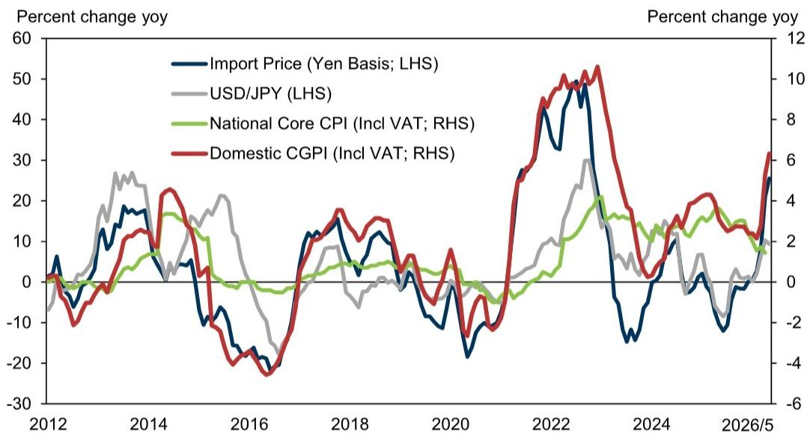
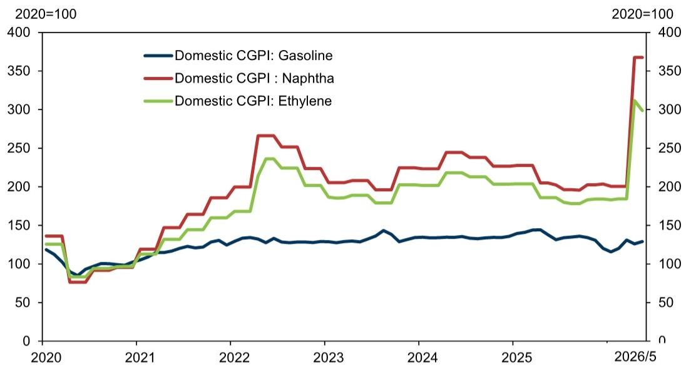

# GS：日本通胀的“二阶导”拐点比绝对水平更重要

五月日本国内企业商品价格指数（CGPI）环比上涨0.9%，较四月2.8%的历史性飙升大幅回落。这份来自GS日本经济团队的月度数据解读，看起来只是一次常规的通胀追踪，但真正值得关注的信号，隐藏在环比增速的减速幅度和品类扩散的边际变化中。

市场通常关注通胀的绝对水平——CPI同比是否破3%，CGPI是否创历史新高。但GS这份报告揭示了一个更微妙的判断：日本通胀正在经历从“全面跳升”到“结构性分化”的转折。四月的价格跳升是一次性的定价调整冲击，五月的读数才是判断持续性通胀压力的真实起点。

对于任何关注日本资产定价、日元走势以及日本企业定价权可持续性的投资者来说，理解这个“二阶导”拐点，远比盯着同比数字的绝对值更重要。

## 1. 四月跳升是一次性定价调整，五月才是压力测试的真实基线

四月CGPI环比飙升2.8%，是1980年4月以来（剔除消费税上调影响）的最大单月涨幅。这个数字本身容易引发对通胀失控的担忧。但GS报告明确指出，五月环比增速回落至0.9%，是因为“四月许多品类因价格修订出现的急剧上涨在五月暂时平息”。

这意味着四月的数据更多反映的是企业集中调价窗口期的一次性行为，而非需求驱动或成本持续攀升的线性外推。五月的0.9%环比增速，虽然仍处于高位，但已经回到更接近趋势性的水平。真正的判断问题应该是：0.9%的月环比增速是否可持续？它背后是成本推动还是需求拉动？

GS报告没有直接回答这个问题，但提供了关键线索：五月环比增速的减速是广泛性的，几乎所有主要品类都在减速，而非少数品类异常回调。这说明四月跳升后的“均值回复”是系统性的，而非结构性力量在减弱。

对于企业决策者而言，这意味着不应将四月的数据作为未来成本预测的基准。对于投资者而言，五月的读数才是评估日本通胀路径更可靠的起点。

## 2. 石油制品仍是核心变量，但“三个月定价周期”的机制值得密切关注

石油及煤炭制品环比上涨3.0%，拉动整体指数0.21个百分点，但相较于四月11.8%的环比涨幅和0.75个百分点的拉动，已显著减速。更关键的信息在于石脑油：五月石脑油价格环比持平，而四月曾暴涨83.2%。

GS报告特别指出，石脑油价格通常每三个月重新定价一次，下一次定价调整预计在七月。这意味着七月可能再次出现一轮集中的价格上行压力。这个机制细节对于理解日本通胀节奏至关重要——它不是连续平滑的，而是脉冲式的，与特定的定价周期挂钩。

如果七月石脑油价格再次大幅上调，将直接传导至汽油、化工产品等下游品类，可能再次推高CGPI月度环比读数。但这次冲击的幅度取决于四月至七月期间国际原油市场的走势以及日元汇率的变动。GS报告没有给出预测，但点明了这个关键的时间节点和机制。

对于关注日本通胀路径的投资者，七月的数据将是验证“四月跳升是否只是孤立事件”的下一个关键观察窗口。

## 3. 进口价格减速但同比仍在加速，日元汇率是未被充分讨论的放大器

日元计价的进口价格五月环比上涨2.7%，较四月8.7%的环比涨幅显著减速。但同比增速从21.0%加速至25.5%。GS报告将此归因于石油相关产品价格的推动，但同时指出化工产品中的乙烯五月环比下跌4.1%，而四月曾暴涨69.0%。

这个数据组合揭示了一个重要但容易被忽视的结论：进口价格的压力正在从“全面扩散”转为“品类分化”。石油相关产品仍是主要推动力，但其他工业原料的价格压力正在缓解。如果这种分化趋势持续，意味着日本输入性通胀的广度正在收窄，但深度（石油品类）仍维持高位。

日元汇率在这一过程中的作用值得进一步拆解。GS报告没有展开讨论，但日元计价的进口价格不仅反映国际商品价格，还叠加了汇率变动。如果日元在此后出现进一步贬值，即使国际商品价格稳定，进口价格仍可能继续攀升。反之，如果日元升值，进口价格压力将显著缓解。这个汇率与通胀的互动关系，是GS这份月度数据报告没有完全展开、但实际影响巨大的变量。

## 4. 出口价格双位数增长暗示日本企业定价权正在发生结构性变化

五月日元计价的出口价格环比上涨0.4%，同比增速达到20.6%。其中电气电子设备出口价格环比上涨3.7%，同比暴涨35.6%。

这个数据点的重要性不亚于CGPI本身。出口价格双位数增长意味着日本企业正在将成本上涨转嫁给海外买家。如果这种定价权能够持续，将从根本上改变日本企业长期面临的“通缩基因”——即企业不敢提价、只能通过压缩利润消化成本。

电气电子设备出口价格同比上涨35.6%，这个数字需要放在日元贬值的背景下理解。但即使剔除汇率因素，以美元计价的出口价格很可能也在上涨。这意味着日本企业在全球市场上的定价能力正在增强，尤其是在半导体设备、精密零部件等具有技术壁垒的领域。

这个趋势如果持续，对日本股市的盈利预期将产生深远影响。日本企业过去二十年最大的结构性问题是“赚了营收但赚不到利润”，而出口定价权的提升直接触及这个核心矛盾。GS报告没有展开讨论这个含义，但数据本身已经提供了足够强的信号。

## 5. 报告尚未完全回答的关键问题：通胀传导到消费端的时滞与力度

GS这份报告聚焦于企业层面的价格指数，但并未直接讨论CGPI向消费者价格指数（CPI）的传导。这是一个需要谨慎对待的缺口。

四月CGPI的跳升还没有完全反映到五月CPI数据中。企业定价调整与消费者价格之间的传导存在1-3个月的时滞。这意味着即使五月CGPI环比增速放缓，未来几个月的CPI数据仍可能因四月CGPI跳升的滞后影响而继续上行。

更关键的问题是传导力度。日本过去三十年的经验表明，企业成本上涨向消费端传导的比率很低，因为消费者对价格高度敏感，企业不敢充分转嫁。但当前的环境可能正在改变这一规律：劳动力短缺推动工资上涨，消费者对涨价的接受度在提升。如果这个判断成立，CGPI向CPI的传导率将高于历史均值，这意味着日本央行对通胀前景的评估可能需要上调。

这个传导率的变化，是GS这份报告没有数据支撑、但值得所有关注日本市场的读者持续追踪的核心问题。

## 6. 对读者的观察框架：关注三个信号而非一个数字

基于GS这份报告的解析，我们建议读者建立以下观察框架，而非仅盯着CGPI同比或环比的单一数字：

第一个信号是品类扩散度。如果价格上涨从石油制品、化工产品等少数品类向机械、食品、服务等更广泛的领域扩散，说明通胀正在从“输入性”转为“内生性”。目前的数据显示扩散度正在收窄而非扩大。

第二个信号是定价周期。石脑油、电力等具有固定调价周期的品类，其下一次调价的时间点和幅度，是预测通胀脉冲的关键变量。七月的石脑油定价将是下一个重要观察节点。

第三个信号是出口价格与进口价格的剪刀差。如果出口价格增速持续高于进口价格增速，说明日本企业正在通过定价权改善贸易条件，这对企业盈利和日元汇率都是正面信号。反之，如果进口价格增速持续高于出口价格增速，意味着企业利润空间被压缩。

这三个信号结合起来，比任何一个单一通胀指标都更能反映日本通胀的结构性变化。

---

GS这份报告的完整版本还包含了对各品类的详细拆解、历史对比图表以及日本经济团队对下半年通胀路径的基准情景预测。限于篇幅，我们无法在此逐一展开。

四月跳升后的五月回落，让市场有机会冷静审视日本通胀的真实图景。但正如我们上面讨论的，真正的问题不在于过去两个月的数据本身，而在于那些尚未被完全验证的假设——定价权的持续性、传导率的提升、以及日元汇率的二阶影响。这些问题的答案，将决定日本通胀故事的下一个章节如何展开。

欢迎来星球微信群里继续讨论。我们已经将GS这份报告的原始PDF、关键图表数据以及我们整理的日本通胀追踪框架放入星球。在群里，我们可以更深入地拆解那些报告没有完全展开、但实际影响巨大的变量。

Personal reading notes and learning share only. Not investment advice.

