# Global LNG Supply & Shipping Tracker

First LNG tanker enters the Strait

ADNOC's Mubaraz which was the first laden LNG ship to exit the Strait of Hormuz on April 26, has now re-entered the Strait on June 3 and is signalling its location near Das Island likely loading LNG cargo. Meanwhile, Qatar Energy exported one more cargo outside Hormuz, as Al Daayen exited the Strait today on June 8, signaling China as its destination (Figure 1).

Figure 1: Recent LNG tanker movements across the Strait of Hormuz  
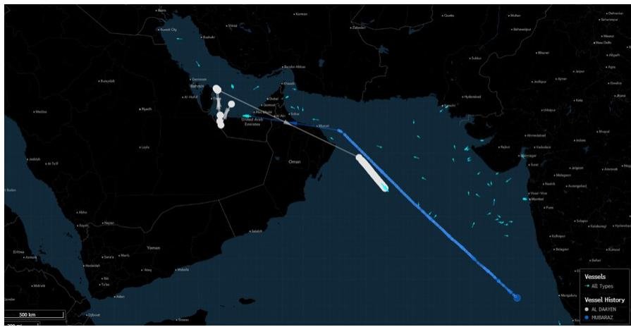

text_image

Vessels
All Types
Vessel History
AL DRAYEN
FIRISRAZ
500 km

Source: Bloomberg Finance L.P.

Following the two observed crossings, we count nine available LNG vessels inside the Strait of Hormuz (Figure 2). We continue to treat sporadic transits as exceptions rather than a new norm until Hormuz fully reopens, with the finite pool of vessels currently inside the strait naturally capping the volume of ready-to-ship cargoes. Beyond these cargoes, volumes will need to come from renewed upstream and liquefaction operations (as well as normalizing port logistics). Consistent with our base case for a June reopening, we model Qatar Energy ramping to 83% utilisation by September, implying a full-year 2026 utilisation rate of 57% — down sharply from 105% in 2025 (Global LNG Analyzer: Initiating JKM forecasts with a declining premium to TTF, 19 May 2026). Since the onset of the conflict, we have argued that restarting Qatari LNG facilities would hinge on complex operational, security, and strategic considerations, and would take two to three months to restore full output, excluding the two damaged trains (Thoughts on Ras Laffan 2.0, 19 March 2026). This view aligns closely with Qatar Energy’s communications and was recently reinforced by the CEO, who stated that “Qatar’s return to normal LNG exports from its undamaged trains will still take two to three months at a minimum to establish, even after the Strait of Hormuz is fully open to vessels.”

## Global Commodities Research

## Otar Dgebuadze, CFA

(44-20) 3493-8246

otar.dgebuadze@JPM.com

JPM Securities plc

## Aradhaya Makkar

aradhaya.makkar@jpmchase.com

JPM India Private Limited

Figure 2: LNG vessels in the Persian Gulf  
As of June 8, 2026

<table><tr><td>Vessel Name</td><td>Beneficial Owner</td><td>DWT</td><td>Insurer</td><td>Insurance country</td><td>Comment</td></tr><tr><td>Umm Al Amad</td><td>Qatar Energy</td><td>121,730</td><td>Japan P&amp;I Club</td><td>Japan</td><td></td></tr><tr><td>Al Sahla</td><td>Qatar Energy</td><td>104,666</td><td>UK P&amp;I</td><td>UK</td><td></td></tr><tr><td>Al Ghashamiya</td><td>Qatar Energy</td><td>108,988</td><td>NorthStandard</td><td>UK</td><td></td></tr><tr><td>Patris</td><td>Chandris Group (Greece)</td><td>95,743</td><td>Japan P&amp;I Club</td><td>Japan</td><td></td></tr><tr><td>Mraikh</td><td>Chandris Group (Greece)</td><td>93,124</td><td>Skuld</td><td>Norway</td><td></td></tr><tr><td>Gaslog Skagen</td><td>China Development Bank</td><td>81,847</td><td>West of England</td><td>UK</td><td></td></tr><tr><td>Lebrethah</td><td>SK Shipping (South Korea)</td><td>94,326</td><td>Skuld</td><td>Norway</td><td></td></tr><tr><td>Disha</td><td>Petronet</td><td>81,097</td><td>NorthStandard</td><td>UK</td><td></td></tr><tr><td>Mubaraz</td><td>ADNOC</td><td>72,950</td><td>NorthStandard</td><td>UK</td><td>Departed laden on April 26, re-entered June 3</td></tr><tr><td>Seapeak Bahrain</td><td>Seapeak</td><td>95,289</td><td>NorthStandard</td><td>UK</td><td>Last signal on March 5</td></tr><tr><td>Rasheeda</td><td>Qatar Energy</td><td>130,208</td><td>NorthStandard</td><td>UK</td><td>Signalled outside of Hormuz on May 15</td></tr><tr><td>Al Daayen</td><td>Seapeak</td><td>90,617</td><td>Skuld</td><td>Norway</td><td>Departed laden on June 8</td></tr><tr><td>Fuwairit</td><td>Mitsui</td><td>74,067</td><td>UK P&amp;I</td><td>UK</td><td>Departed laden on May 24</td></tr><tr><td>Al Rayyan</td><td>Qatar Energy</td><td>72,430</td><td>Britannia P&amp;I</td><td>UK</td><td>Departed laden on May 25</td></tr><tr><td>Mihzem</td><td>China LNG Shipping Holdings</td><td>93,035</td><td>Britannia P&amp;I</td><td>UK</td><td>Departed laden on May 12</td></tr><tr><td>Al Kharaitiyat</td><td>Qatar Energy</td><td>107,153</td><td>NorthStandard</td><td>UK</td><td>Departed laden on May 9</td></tr><tr><td>SoharLng</td><td>Mitsui</td><td>71,997</td><td>UK P&amp;I</td><td>UK</td><td>Departed ballast on April 2</td></tr></table>

Source: Bloomberg Finance L.P., JPM Commodities Research

## US LNG remains more attractive to Asia

JKM remains about \$2/mmbtu premium to TTF prices, supported by approaching summer cooling demand and further strengthened by potential (super) El Niño weather event, which usually implies warmer than normal summer temperatures in Asia. However, US Gulf Coast LNG exports to Europe have recently recovered to levels comparable to this time last year (300 Mcm/day), while all incremental output from US facilities is still heading towards Asian destinations (Figures 3 & 4).

We continue to argue for higher prices (especially in 3Q2026) to support European storage injections by slowing down Asian spot LNG demand as the region enters its summer cooling season, and by incentivising greater coal-over-gas use in the European power sector.

Figure 3: USGC LNG exports to Europe/Mediterranean  
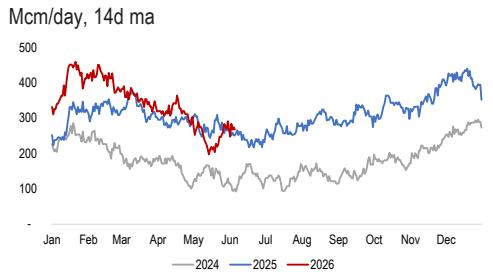

line chart

| Month | 2024 | 2025 | 2026 |
|-------|------|------|------|
| Jan   | ~250 | ~280 | ~320 |
| Feb   | ~270 | ~300 | ~450 |
| Mar   | ~240 | ~320 | ~400 |
| Apr   | ~200 | ~300 | ~350 |
| May   | ~150 | ~280 | ~250 |
| Jun   | ~180 | ~260 | ~280 |
| Jul   | ~160 | ~270 | ~290 |
| Aug   | ~170 | ~290 | ~300 |
| Sep   | ~180 | ~310 | ~320 |
| Oct   | ~190 | ~330 | ~350 |
| Nov   | ~210 | ~350 | ~380 |
| Dec   | ~250 | ~380 | ~420 |

Based on loading dates, in transit volumes based on the current location of the vessels  
Source: Bloomberg Finance L.P., JPM Commodities Research

Figure 4: USGC LNG exports to Asia/RoW  
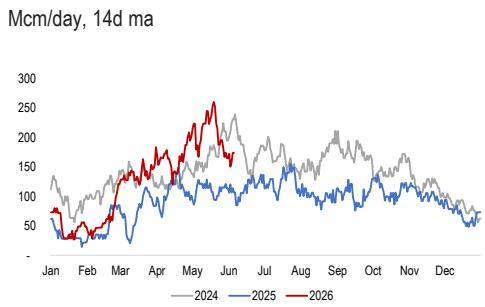

line chart

| Month | 2024 | 2025 | 2026 |
|-------|------|------|------|
| Jan   | ~130 | ~80  | ~90  |
| Feb   | ~100 | ~40  | ~50  |
| Mar   | ~140 | ~80  | ~130 |
| Apr   | ~160 | ~100 | ~170 |
| May   | ~180 | ~120 | ~250 |
| Jun   | ~200 | ~140 | ~260 |
| Jul   | ~180 | ~130 | ~180 |
| Aug   | ~160 | ~110 | ~150 |
| Sep   | ~180 | ~130 | ~210 |
| Oct   | ~160 | ~110 | ~170 |
| Nov   | ~140 | ~90  | ~130 |
| Dec   | ~120 | ~70  | ~100 |

Based on loading dates, in transit volumes based on the current location of the vessels  
Source: Bloomberg Finance L.P., JPM Commodities Research

## Shipping rates

An important driver of JKM/TTF netbacks, LNG shipping rates in the West of Suez basin remained unchanged at \$80,000/day. Similarly, rates in the East of Suez and one-year charter rate assessment also remained unchanged WoW at \$45,000/day and \$50,500/day (Figure 5). Overall, spot shipping rates are now down by more than 60% from their peaks in the second week of the conflict, when they reached \$200,000 and \$110,000 in the West and East of Suez, respectively.

Figure 5: Shipping costs  
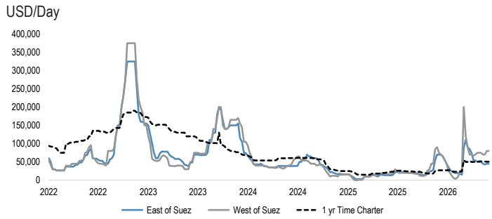

line chart

| Year | East of Suez | West of Suez | 1 yr Time Charter |
|------|--------------|--------------|-------------------|
| 2022 | ~50,000      | ~50,000      | ~100,000          |
| 2023 | ~350,000     | ~375,000     | ~180,000          |
| 2024 | ~50,000      | ~150,000     | ~50,000           |
| 2025 | ~25,000      | ~25,000      | ~25,000           |
| 2026 | ~50,000      | ~200,000     | ~50,000           |

Source: Fearnley Securities, Bloomberg Finance L.P., JPM Commodities Research

## Weekly export/import trends

During the week of June 1-7, LNG deliveries increased overall by 2 Bcm WoW, with half of the increase attributed to higher deliveries into Asian markets, driven by India (0.5 Bcm WoW, 0.6 Bcm YoY) and Singapore (0.3 Bcm WoW, 0.1 Bcm YoY). The other half of the increase was driven by Europe (0.4 Bcm WoW, -0.6 Bcm YoY), Egypt (0.3 Bcm WoW, 0.3 Bcm YoY) and the Latam region (0.2 Bcm WoW, 0.1 Bcm YoY) (Figure 6). With regard to LNG exports, overall weekly loadings increased by 1 Bcm WoW, led by Africa (0.5 Bcm WoW, 0.5 Bcm YoY), Australia (0.2 Bcm WoW, 0.1 Bcm YoY) and the APAC region (0.2 Bcm WoW, 0.2 Bcm YoY) (Figure 7).

Figure 6: Change in LNG imports  
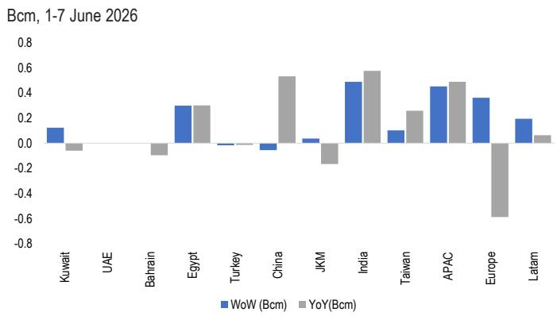

bar chart

Bcm, 1-7 June 2026
| Region | WoW (Bcm) | YoY (Bcm) |
| :--- | :--- | :--- |
| Kuwait | 0.1 | -0.05 |
| UAE | 0.0 | 0.0 |
| Bahrain | 0.0 | -0.1 |
| Egypt | 0.3 | 0.3 |
| Turkey | 0.0 | 0.0 |
| China | -0.05 | 0.55 |
| JKM | 0.05 | -0.2 |
| India | 0.48 | 0.58 |
| Taiwan | 0.1 | 0.25 |
| APAC | 0.45 | 0.48 |
| Europe | 0.35 | -0.6 |
| Latam | 0.2 | 0.05 |

Source: Bloomberg Finance L.P., JPM Commodities Research

Figure 7: Change in LNG exports (loadings)  
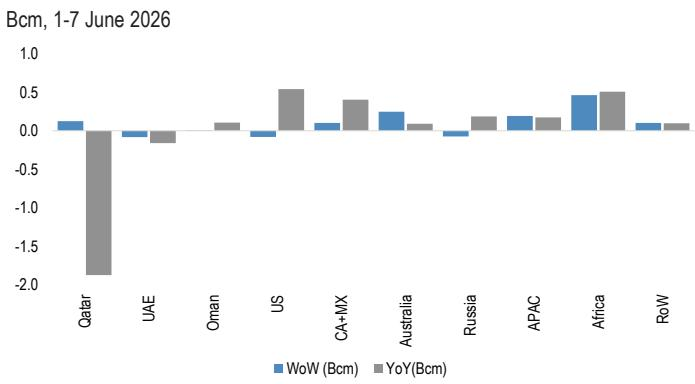

bar chart

Bcm, 1-7 June 2026
| Country | WoW (Bcm) | YoY(Bcm) |
| :--- | :--- | :--- |
| Qatar | 0.1 | -1.8 |
| UAE | -0.05 | -0.1 |
| Oman | 0.0 | 0.1 |
| US | -0.05 | 0.5 |
| CA+MX | 0.05 | 0.4 |
| Australia | 0.25 | 0.05 |
| Russia | -0.05 | 0.15 |
| APAC | 0.15 | 0.15 |
| Africa | 0.45 | 0.5 |
| RoW | 0.05 | 0.05 |

Source: Bloomberg Finance L.P., JPM Commodities Research

## Weekly loadings from recently started projects decreased

Loadings from existing projects, which are expected to increase supply year-over-year, decreased over the week (Figure 8). The decline was primarily due to lower loadings from LNG Canada, Arctic LNG 2, Plaquemines and Tortue, which was only partially offset by higher loadings from Congo, while other projects saw broadly unchanged weekly profiles.

LNG Canada loaded two cargoes, following four the week before, and is tracking at close to a 75% utilisation rate on a 4-week moving average basis, while Arctic LNG 2 loaded one cargo, following two the week before (34% utilization). Loadings in Plaquemines declined by 0.1 Bcm to 0.6 Bcm from 0.7 Bcm the week before. Meanwhile, the decline in loadings from Tortue (no cargoes, following one the week before) was offset by the increase in loadings from Congo (one cargo, following none the week before) (Figures 13-25).

We are watching closely the Golden Pass facility, where feedgas flows dropped again to near zero over the last 3-4 days, following a similar drop in mid-May after the facility exported its second cargo. After achieving its first LNG at the end of March, the facility is operating below our projected utilization rate of 80%, potentially putting up to 5 Bcm of 2026 output at risk.

Figure 8: LNG supply decomposition (2025-27)  
Bcm

<table><tr><td>Country</td><td>Project</td><td>JPMe start date</td><td>Capacity (Bcm/Year)</td><td>2025 Output</td><td>2026 Output</td><td>2027 Output</td><td>2025 y/y</td><td>2026 y/y</td><td>2027 y/y</td></tr><tr><td colspan="10">Projects started in 2025</td></tr><tr><td>US</td><td>Plaquemines LNG Phase 1 + 2</td><td>Jan-25</td><td>38.4</td><td>22.8</td><td>37.4</td><td>37.4</td><td>22.8</td><td>14.5</td><td>-</td></tr><tr><td>Canada</td><td>LNG Canada</td><td>Jul-25</td><td>19.2</td><td>2.7</td><td>15.3</td><td>16.2</td><td>2.7</td><td>12.5</td><td>1.0</td></tr><tr><td>US</td><td>Corpus Christi LNG Stage 3</td><td>Jan-25</td><td>16.4</td><td>2.9</td><td>10.8</td><td>15.6</td><td>2.9</td><td>7.8</td><td>4.8</td></tr><tr><td>Russia</td><td>Arctic LNG 2 - Train 1 + 2</td><td>Jul-25</td><td>18.1</td><td>1.6</td><td>5.8</td><td>6.0</td><td>1.6</td><td>4.2</td><td>0.3</td></tr><tr><td>Mauritania/Senegal</td><td>Tortue Phase 1 FLNG</td><td>Apr-25</td><td>3.3</td><td>1.8</td><td>3.3</td><td>3.3</td><td>1.8</td><td>1.5</td><td>-</td></tr><tr><td colspan="10">Projects starting in 2026</td></tr><tr><td>Australia</td><td>Darwin Restart</td><td>Jan-26</td><td>5.1</td><td>-</td><td>2.1</td><td>3.5</td><td>-</td><td>2.1</td><td>1.5</td></tr><tr><td>Congo</td><td>Nguya FLNG</td><td>Mar-26</td><td>3.3</td><td>-</td><td>2.0</td><td>2.6</td><td>-</td><td>2.0</td><td>0.6</td></tr><tr><td>US</td><td>Golden Pass Export - Train 1</td><td>Apr-26</td><td>8.3</td><td>-</td><td>5.3</td><td>7.8</td><td>-</td><td>5.3</td><td>2.5</td></tr><tr><td>Mexico</td><td>Costa Azul Phase 1</td><td>Sep-26</td><td>4.5</td><td>-</td><td>1.0</td><td>3.6</td><td>-</td><td>1.0</td><td>2.5</td></tr><tr><td>Australia</td><td>Pluto Expansion</td><td>Nov-26</td><td>6.9</td><td>-</td><td>0.7</td><td>5.8</td><td>-</td><td>0.7</td><td>5.1</td></tr><tr><td colspan="10">Projects starting in 2027</td></tr><tr><td>US</td><td>Golden Pass Export - Train 2</td><td>Feb-27</td><td>8.3</td><td>-</td><td>-</td><td>4.6</td><td>-</td><td>-</td><td>4.6</td></tr><tr><td>US</td><td>CP2 LNG Phase 1 + 2</td><td>Sep-27</td><td>39.7</td><td>-</td><td>-</td><td>4.2</td><td>-</td><td>-</td><td>4.2</td></tr><tr><td>US</td><td>Port Arthur LNG - Phase 1 - Train 1</td><td>Dec-27</td><td>8.9</td><td>-</td><td>-</td><td>0.1</td><td>-</td><td>-</td><td>0.1</td></tr><tr><td>Nigeria</td><td>NLNG Seven - Train 1</td><td>Jul-27</td><td>5.3</td><td>-</td><td>-</td><td>1.3</td><td>-</td><td>-</td><td>1.3</td></tr><tr><td>Indonesia</td><td>Genting FLNG</td><td>Jul-27</td><td>1.6</td><td>-</td><td>-</td><td>0.4</td><td>-</td><td>-</td><td>0.4</td></tr><tr><td>Qatar</td><td>Qatar North Field East - Train 1</td><td>Sep-27</td><td>11.0</td><td>-</td><td>-</td><td>1.7</td><td>-</td><td>-</td><td>1.7</td></tr><tr><td>Gabon</td><td>Gabon FLNG</td><td>Sep-27</td><td>1.0</td><td>-</td><td>-</td><td>0.2</td><td>-</td><td>-</td><td>0.2</td></tr><tr><td>Mexico</td><td>Altamira FLNG 1</td><td>Dec-27</td><td>1.9</td><td>-</td><td>-</td><td>0.0</td><td>-</td><td>-</td><td>0.0</td></tr><tr><td></td><td>Total 2025 projects</td><td></td><td></td><td>32.0</td><td>72.5</td><td>78.5</td><td>32.0</td><td>40.5</td><td>6.0</td></tr><tr><td></td><td>Total 2026 projects</td><td></td><td></td><td>-</td><td>11.2</td><td>23.4</td><td>-</td><td>11.2</td><td>12.3</td></tr><tr><td></td><td>Total 2027 projects</td><td></td><td></td><td>-</td><td>-</td><td>12.5</td><td>-</td><td>-</td><td>12.5</td></tr><tr><td></td><td>Total 2025-27 projects</td><td></td><td></td><td>32.0</td><td>83.6</td><td>114.5</td><td>32.0</td><td>51.7</td><td>30.8</td></tr><tr><td>Qatar</td><td>Existing 14 trains</td><td></td><td></td><td>112.6</td><td>60.2</td><td>87.3</td><td>4.7</td><td>-52.4</td><td>27.0</td></tr><tr><td>UAE</td><td>Existing 2 trains</td><td></td><td></td><td>6.3</td><td>4.6</td><td>6.7</td><td>-1.2</td><td>-1.8</td><td>2.1</td></tr><tr><td></td><td>Rest of the world</td><td></td><td></td><td>448.0</td><td>451.6</td><td>451.6</td><td>2.3</td><td>3.6</td><td>-</td></tr><tr><td></td><td>Grand total</td><td></td><td></td><td>598.9</td><td>600.1</td><td>660.1</td><td>37.8</td><td>1.2</td><td>60.0</td></tr></table>

Corpus Christi LNG stage 3 capacity includes potential de-bottlenecking (2mtpa across 9 mid-scale trains). CP2 capacity excludes bolt-on 10mtpa, which is expected in 2028 Source: Wood Mackenzie, company data, Bloomberg Finance L.P., JPM Commodities Research

# LNG shipments through major maritime routes

Figure 9: LNG vessels through the Strait of Hormuz  
n of vessels, 7 day moving sum  
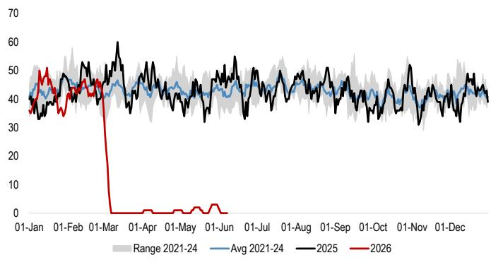

line chart

| Date     | Range 2021-24 | Avg 2021-24 | 2025 | 2026 |
|----------|---------------|-------------|------|------|
| 01-Jan   | ~40           | ~40         | ~40  | ~50  |
| 01-Feb   | ~45           | ~45         | ~45  | ~45  |
| 01-Mar   | ~50           | ~45         | ~60  | 0    |
| 01-Apr   | ~45           | ~45         | ~50  | 0    |
| 01-May   | ~45           | ~45         | ~50  | 0    |
| 01-Jun   | ~45           | ~45         | ~50  | 0    |
| 01-Jul   | ~45           | ~45         | ~50  | 0    |
| 01-Aug   | ~45           | ~45         | ~50  | 0    |
| 01-Sep   | ~45           | ~45         | ~50  | 0    |
| 01-Oct   | ~45           | ~45         | ~50  | 0    |
| 01-Nov   | ~45           | ~45         | ~50  | 0    |
| 01-Dec   | ~45           | ~45         | ~50  | 0    |

Includes all passages by laden and ballast vessels  
Source: Bloomberg Finance L.P., JPM Commodities Research

Figure 11: LNG vessels through the Panama Canal  
n of vessels, 7 day moving sum  
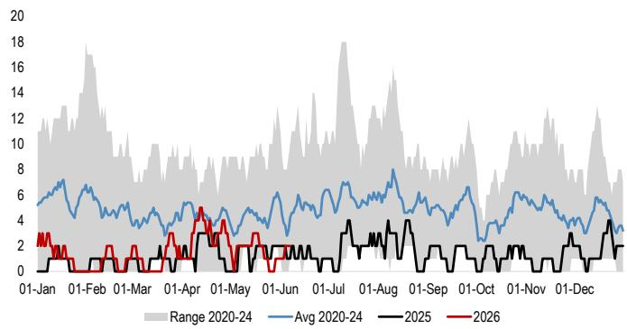

line chart

| Date     | Range 2020-24 | Avg 2020-24 | 2025 | 2026 |
|----------|---------------|-------------|------|------|
| 01-Jan   | ~10           | ~6          | ~1   | ~3   |
| 01-Feb   | ~17           | ~7          | ~1   | ~1   |
| 01-Mar   | ~10           | ~5          | ~1   | ~1   |
| 01-Apr   | ~10           | ~5          | ~1   | ~3   |
| 01-May   | ~10           | ~5          | ~1   | ~4   |
| 01-Jun   | ~10           | ~5          | ~1   | ~3   |
| 01-Jul   | ~18           | ~7          | ~3   | ~3   |
| 01-Aug   | ~15           | ~8          | ~4   | ~3   |
| 01-Sep   | ~10           | ~6          | ~3   | ~3   |
| 01-Oct   | ~10           | ~6          | ~3   | ~3   |
| 01-Nov   | ~10           | ~6          | ~3   | ~3   |
| 01-Dec   | ~10           | ~6          | ~3   | ~3   |

Includes all passages by laden and ballast vessels  
Source: Bloomberg Finance L.P., JPM Commodities Research

Figure 10: LNG vessels through the Suez Canal  
n of vessels, 7 day moving sum  
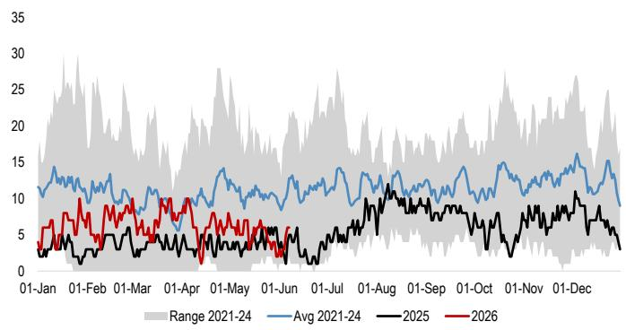

line chart

| Date     | Range 2021-24 | Avg 2021-24 | 2025 | 2026 |
|----------|---------------|-------------|------|------|
| 01-Jan   | ~15           | ~12         | ~3   | ~5   |
| 01-Feb   | ~25           | ~13         | ~4   | ~7   |
| 01-Mar   | ~18           | ~11         | ~3   | ~6   |
| 01-Apr   | ~28           | ~14         | ~5   | ~8   |
| 01-May   | ~20           | ~13         | ~6   | ~7   |
| 01-Jun   | ~15           | ~11         | ~4   | ~5   |
| 01-Jul   | ~22           | ~13         | ~6   | ~7   |
| 01-Aug   | ~18           | ~12         | ~8   | ~9   |
| 01-Sep   | ~20           | ~13         | ~7   | ~8   |
| 01-Oct   | ~25           | ~14         | ~6   | ~7   |
| 01-Nov   | ~22           | ~13         | ~5   | ~6   |
| 01-Dec   | ~20           | ~12         | ~4   | ~5   |

Includes all passages by laden and ballast vessels  
Source: Bloomberg Finance L.P., JPM Commodities Research

Figure 12: LNG vessels through the Cape of Good Hope  
n of vessels, 7 day moving sum  
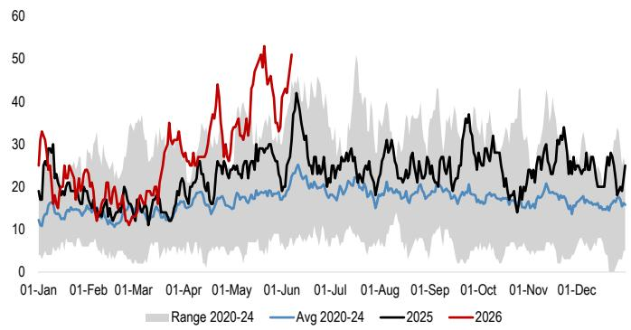

line chart

| Date     | 2020-24 | Avg 2020-24 | 2025 | 2026 |
|----------|---------|-------------|------|------|
| 01-Jan   | ~15     | ~13         | ~30  | ~35  |
| 01-Feb   | ~18     | ~15         | ~25  | ~28  |
| 01-Mar   | ~20     | ~17         | ~20  | ~25  |
| 01-Apr   | ~22     | ~18         | ~25  | ~30  |
| 01-May   | ~25     | ~20         | ~30  | ~45  |
| 01-Jun   | ~28     | ~22         | ~40  | ~55  |
| 01-Jul   | ~30     | ~25         | ~35  | ~40  |
| 01-Aug   | ~32     | ~28         | ~30  | ~35  |
| 01-Sep   | ~35     | ~30         | ~35  | ~30  |
| 01-Oct   | ~38     | ~32         | ~38  | ~35  |
| 01-Nov   | ~40     | ~35         | ~35  | ~30  |
| 01-Dec   | ~42     | ~38         | ~38  | ~35  |

Includes all passages by laden and ballast vessels  
Source: Bloomberg Finance L.P., JPM Commodities Research

## New supply tracker

Figure 13: Plaquemines weekly exports and capacity utilisation  
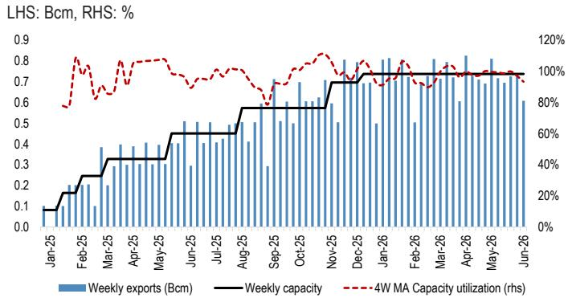

bar-line hybrid chart

| Month   | Weekly exports (Bcm) | Weekly capacity | 4W MA Capacity utilization (%) |
|---------|----------------------|-----------------|-------------------------------|
| Jan-25  | 0.1                  | 0.1             | 60%                           |
| Feb-25  | 0.2                  | 0.2             | 100%                          |
| Mar-25  | 0.3                  | 0.3             | 80%                           |
| Apr-25  | 0.4                  | 0.4             | 90%                           |
| May-25  | 0.5                  | 0.5             | 85%                           |
| Jun-25  | 0.6                  | 0.6             | 75%                           |
| Jul-25  | 0.7                  | 0.7             | 70%                           |
| Aug-25  | 0.8                  | 0.8             | 65%                           |
| Sep-25  | 0.9                  | 0.9             | 60%                           |
| Oct-25  | 1.0                  | 1.0             | 55%                           |
| Nov-25  | 1.1                  | 1.1             | 50%                           |
| Dec-25  | 1.2                  | 1.2             | 45%                           |
| Jan-26  | 1.3                  | 1.3             | 40%                           |
| Feb-26  | 1.4                  | 1.4             | 35%                           |
| Mar-26  | 1.5                  | 1.5             | 30%                           |
| Apr-26  | 1.6                  | 1.6             | 25%                           |
| May-26  | 1.7                  | 1.7             | 20%                           |
| Jun-26  | 1.8                  | 1.8             | 15%                           |

Assumed capacity across 36 trains 28 mtpa (38.4 Bcm/year)  
Source: Company Data, Wood Mackenzie, Bloomberg Finance L.P., JPM Commodities Research

Figure 15: CCL 3 weekly exports and capacity utilisation  

bar-line hybrid chart

| Month   | Weekly exports (Bcm) | Weekly capacity | 4W MA Capacity utilization (%) |
|---------|----------------------|-----------------|-------------------------------|
| Oct-24  | 0.4                  | 0.5             | 90                            |
| Nov-24  | 0.4                  | 0.5             | 95                            |
| Dec-24  | 0.4                  | 0.5             | 100                           |
| Jan-25  | 0.4                  | 0.5             | 95                            |
| Feb-25  | 0.3                  | 0.5             | 90                            |
| Mar-25  | 0.5                  | 0.5             | 100                           |
| Apr-25  | 0.4                  | 0.5             | 95                            |
| May-25  | 0.4                  | 0.5             | 90                            |
| Jun-25  | 0.4                  | 0.5             | 85                            |
| Jul-25  | 0.4                  | 0.5             | 90                            |
| Aug-25  | 0.4                  | 0.5             | 95                            |
| Sep-25  | 0.4                  | 0.5             | 100                           |
| Oct-25  | 0.5                  | 0.6             | 105                           |
| Nov-25  | 0.5                  | 0.6             | 110                           |
| Dec-25  | 0.5                  | 0.6             | 115                           |
| Jan-26  | 0.5                  | 0.6             | 120                           |
| Feb-26  | 0.6                  | 0.6             | 115                           |
| Mar-26  | 0.7                  | 0.6             | 110                           |
| Apr-26  | 0.7                  | 0.6             | 105                           |
| May-26  | 0.6                  | 0.6             | 100                           |
| Jun-26  | 0.7                  | 0.6             | 110                           |

Assumed capacities: 18 mtpa (24.7 Bcm/year) for existing three large scale trains, 10.4 mtpa (14.3 Bcm/year) for seven new mid scale trains (currently 3 in operation), 2mtpa debottlenecking across 9 mid-scale trains  
Source: Company Data, Wood Mackenzie, Bloomberg Finance L.P., JPM Commodities Research

Figure 17: LNG Canada weekly exports and capacity utilisation  
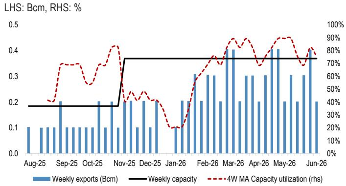

bar-line hybrid chart

| Month    | Weekly exports (Bcm) | Weekly capacity (%) | 4W MA Capacity utilization (%) |
|----------|----------------------|---------------------|-------------------------------|
| Aug-25   | 0.1                  | 0.2                 | 40%                           |
| Sep-25   | 0.2                  | 0.2                 | 70%                           |
| Oct-25   | 0.2                  | 0.2                 | 60%                           |
| Nov-25   | 0.2                  | 0.2                 | 80%                           |
| Dec-25   | 0.2                  | 0.2                 | 70%                           |
| Jan-26   | 0.1                  | 0.2                 | 30%                           |
| Feb-26   | 0.3                  | 0.2                 | 80%                           |
| Mar-26   | 0.4                  | 0.2                 | 90%                           |
| Apr-26   | 0.3                  | 0.2                 | 70%                           |
| May-26   | 0.4                  | 0.2                 | 90%                           |
| Jun-26   | 0.4                  | 0.2                 | 80%                           |

Assumed capacity 7mtpa (9.6 Bcm/year) per train  
Source: Company Data, Wood Mackenzie, Bloomberg Finance L.P., JPM Commodities Research

Figure 14: Plaquemines seasonal exports  
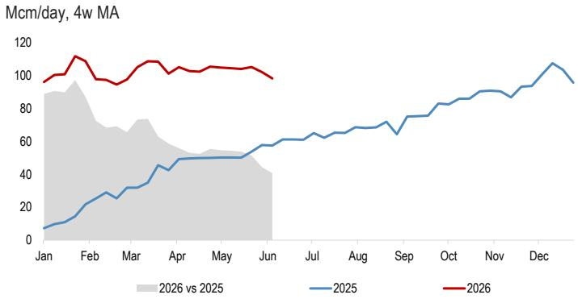

line chart

| Month | 2025 | 2026 |
|-------|------|------|
| Jan   | ~10  | ~95  |
| Feb   | ~30  | ~110 |
| Mar   | ~40  | ~105 |
| Apr   | ~50  | ~105 |
| May   | ~55  | ~105 |
| Jun   | ~60  | ~100 |

Source: Bloomberg Finance L.P., JPM Commodities Research

Figure 16: CCL 3 seasonal exports  
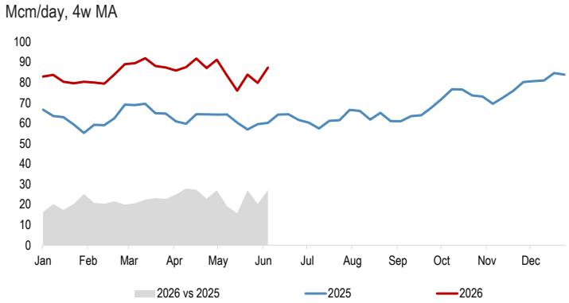

line chart

| Month | 2026 vs 2025 | 2025 |
|-------|--------------|------|
| Jan   | ~18          | ~65  |
| Feb   | ~20          | ~55  |
| Mar   | ~22          | ~70  |
| Apr   | ~23          | ~65  |
| May   | ~25          | ~65  |
| Jun   | ~28          | ~60  |
| Jul   | ~20          | ~60  |
| Aug   | ~22          | ~65  |
| Sep   | ~20          | ~60  |
| Oct   | ~25          | ~75  |
| Nov   | ~20          | ~70  |
| Dec   | ~25          | ~80  |

Source: Bloomberg Finance L.P., JPM Commodities Research

Figure 18: LNG Canada seasonal exports  
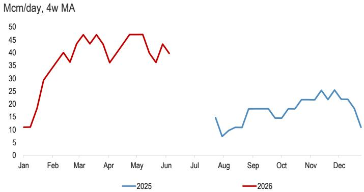

line chart

| Month | 2025 | 2026 |
|-------|------|------|
| Jan   |      | 10   |
| Feb   |      | 30   |
| Mar   |      | 45   |
| Apr   |      | 35   |
| May   |      | 48   |
| Jun   |      | 40   |
| Jul   |      |      |
| Aug   | 15   |      |
| Sep   | 18   |      |
| Oct   | 15   |      |
| Nov   | 20   |      |
| Dec   | 15   |      |

Source: Bloomberg Finance L.P., JPM Commodities Research

Figure 19: Arctic LNG 2 weekly exports and capacity utilisation  
LHS: Bcm, RHS: %  
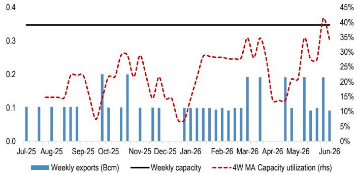

bar-line hybrid chart

| Month    | Weekly exports (Bcm) | 4W MA Capacity utilization (rhs) |
|----------|----------------------|----------------------------------|
| Jul-25   | 0.1                  | 15%                              |
| Aug-25   | 0.1                  | 15%                              |
| Sep-25   | 0.1                  | 20%                              |
| Oct-25   | 0.2                  | 30%                              |
| Nov-25   | 0.1                  | 25%                              |
| Dec-25   | 0.1                  | 15%                              |
| Jan-26   | 0.1                  | 10%                              |
| Feb-26   | 0.1                  | 30%                              |
| Mar-26   | 0.2                  | 35%                              |
| Apr-26   | 0.1                  | 15%                              |
| May-26   | 0.2                  | 30%                              |
| Jun-26   | 0.1                  | 40%                              |

Assumed capacity 6.6mtpa (9 Bcm/year) per train, 2 trains in operation  
Source: Company Data, Wood Mackenzie, Bloomberg Finance L.P., JPM Commodities Research

Figure 21: Darwin weekly exports and capacity utilisation  
LHS: Bcm, RHS: %  
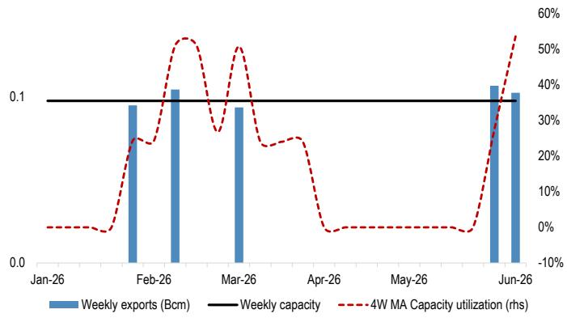

bar-line hybrid chart

| Month   | Weekly exports (Bcm) | 4W MA Capacity utilization (rhs) |
|---------|----------------------|----------------------------------|
| Jan-26  | 0.0                  | 0%                               |
| Feb-26  | 0.1                  | 20%                              |
| Mar-26  | 0.1                  | 50%                              |
| Apr-26  | 0.0                  | 0%                               |
| May-26  | 0.0                  | 0%                               |
| Jun-26  | 0.1                  | 50%                              |

Assumed capacity 3.7mtpa (5.1 Bcm/year)  
Source: Company Data, Wood Mackenzie, Bloomberg Finance L.P., JPM Commodities Research

Figure 23: Tortue LNG weekly exports and capacity utilisation  
LHS: Bcm, RHS: %  
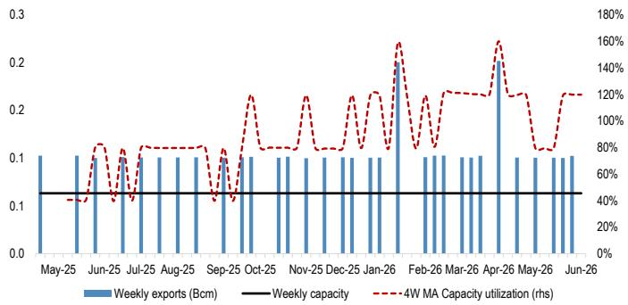

bar-line hybrid chart

| Month    | Weekly exports (Bcm) | Weekly capacity | 4W MA Capacity utilization (rhs) |
|----------|----------------------|-----------------|----------------------------------|
| May-25   | 0.1                  | 0.1             | 0                                |
| Jun-25   | 0.1                  | 0.1             | 80                               |
| Jul-25   | 0.1                  | 0.1             | 80                               |
| Aug-25   | 0.1                  | 0.1             | 80                               |
| Sep-25   | 0.1                  | 0.1             | 80                               |
| Oct-25   | 0.1                  | 0.1             | 120                              |
| Nov-25   | 0.1                  | 0.1             | 120                              |
| Dec-25   | 0.1                  | 0.1             | 120                              |
| Jan-26   | 0.1                  | 0.1             | 160                              |
| Feb-26   | 0.1                  | 0.1             | 120                              |
| Mar-26   | 0.1                  | 0.1             | 120                              |
| Apr-26   | 0.1                  | 0.1             | 160                              |
| May-26   | 0.1                  | 0.1             | 80                               |
| Jun-26   | 0.1                  | 0.1             | 120                              |

Assumed capacity 2.4 mtpa (3.3 Bcm/year)  
Source: Company Data, Wood Mackenzie, Bloomberg Finance L.P., JPM Commodities Research

Figure 20: Arctic 2 seasonal exports  
Mcm/day, 4w MA  
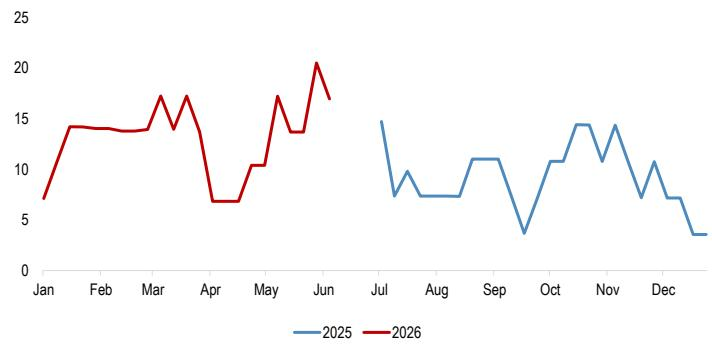

line chart

| Month | 2025 | 2026 |
|-------|------|------|
| Jan   |      | 7    |
| Feb   |      | 14   |
| Mar   |      | 14   |
| Apr   |      | 7    |
| May   |      | 10   |
| Jun   |      | 20   |
| Jul   | 15   |      |
| Aug   | 7    |      |
| Sep   | 11   |      |
| Oct   | 11   |      |
| Nov   | 15   |      |
| Dec   | 7    |      |

Source: Bloomberg Finance L.P., JPM Commodities Research

Figure 22: Congo weekly exports and capacity utilisation  
LHS: Bcm, RHS: %  
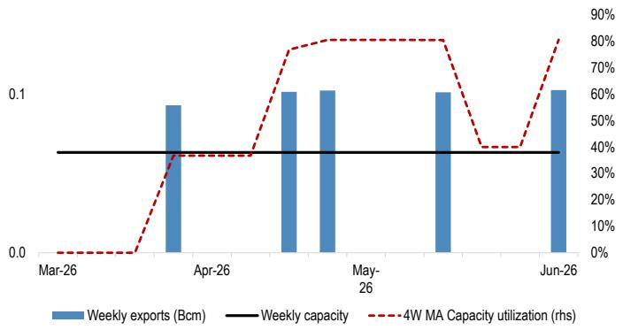

bar-line hybrid chart

| Month   | Weekly exports (Bcm) | Weekly capacity | 4W MA Capacity utilization (%) |
|---------|----------------------|-----------------|-------------------------------|
| Mar-26  | 0.0                  | 0.0             | 0                             |
| Apr-26  | 0.1                  | 0.1             | 35                            |
| May-26  | 0.1                  | 0.1             | 80                            |
| Jun-26  | 0.1                  | 0.1             | 80                            |

Assumed capacity 2.4mtpa (3.3 Bcm/year)  
Source: Company Data, Wood Mackenzie, Bloomberg Finance L.P., JPM Commodities Research

Figure 24: Golden Pass feedgas flows  
MMcf/day  
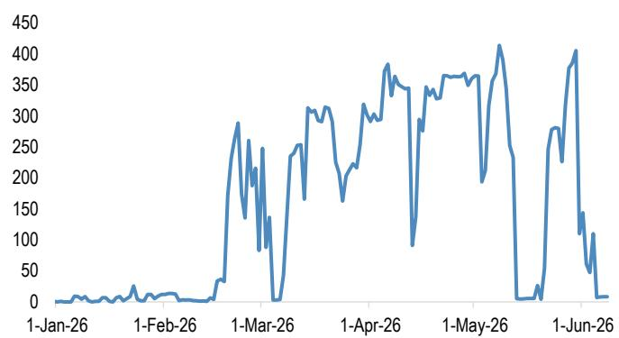

line chart

| Date     | Value |
| -------- | ----- |
| 1-Jan-26 | 0     |
| 1-Feb-26 | 0     |
| 1-Mar-26 | 250   |
| 1-Apr-26 | 350   |
| 1-May-26 | 400   |
| 1-Jun-26 | 100   |

Source: Bloomberg Finance L.P., JPM Commodities Research

Figure 25: Golden Pass weekly exports and capacity utilisation  
LHS: Bcm, RHS: %  
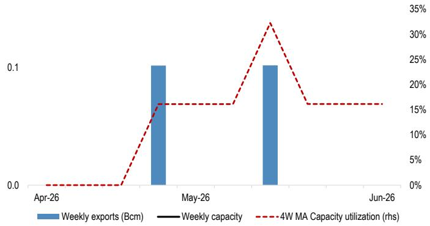

bar-line hybrid chart

| Date   | Weekly exports (Bcm) | Weekly capacity | 4W MA Capacity utilization (rhs) |
|--------|----------------------|-----------------|----------------------------------|
| Apr-26 | 0.0                  | 0.0             | 0.0                              |
| May-26 | 0.1                  | 0.0             | 15.0                             |
| Jun-26 | 0.1                  | 0.0             | 35.0                             |

Assumed capacity 6 mtpa (8.3 Bcm/year)  
Source: Company Data, Wood Mackenzie, Bloomberg Finance L.P., JPM Commodities Research

## Latest Research

Related research on the impact of Middle East conflict on global LNG markets

Global LNG Supply Shipping Tracker: The rebalancing, 01 June 2026

Over the past three months, the closure of the Strait of Hormuz has caused major disruptions to global seaborne oil and gas flows, leading to a sharp decline in Qatari and UAE LNG exports by 300 Mcm/day year-over-year (-95%). Despite this supply shock, global spot LNG prices have remained relatively stable, elevated above pre-conflict levels but well below the peaks of the 2022 energy crisis. The lost Middle Eastern volumes have been largely offset by increased exports from new projects in the US and North America, as well as contributions from Africa, Malaysia, Norway, and Russia. This supply response has limited upward pressure on LNG prices, with Asian markets absorbing most of the demand adjustment and European imports declining. However, European gas storage levels have suffered, falling to 30% compared to the historical average of 56%, as net injections slowed. The flexibility of the global LNG market is now nearing its limits, with incremental supply growth fading and Asian demand declines stabilizing. Looking ahead, as the European peak injection season approaches, we continue to expect prices to move higher from current levels to achieve two objectives that would eventually support the European storage trajectory: a further acceleration of gas-to-coal switching in the European power sector, and a softening of the Asian spot LNG pull, particularly as the region moves into the summer cooling season.

Global LNG Supply Shipping Tracker: Australia strikes again, 26 May 2026

Australia's LNG plants are facing threats of strikes and the three plants at risk have a combined capacity of 44 Bcm/year, equivalent to $35\%$ of Australia's total LNG liquefaction capacity. Despite such a significant supply disruption at risk, markets appear to be discounting the impact and are instead focusing on developments around the Strait of Hormuz and prospects of Qatari (and UAE) LNG supply. However, it is worth remembering the summer of 2023, when similar risks of strikes pushed European natural gas prices from about 27 EUR/MWh at the end of July to about 45 EUR/MWh by late August. Eventually, back in 2023, the unions and LNG plant operators found a middle ground, strikes were avoided and no volumes to global LNG markets were lost. The situation remains evolving with no clear goalposts but clear (limited so far) impacts.

Global LNG Analyzer: Initiating JKM forecasts with a declining premium to TTF, 19 May 2026

Mounting pressure on global oil inventories is expected to drive a re-opening of the Strait of Hormuz in June, enabling Qatar exports to reach \~83% utilisation by September and adding \~15 Bcm of LNG supply during Europe's injection season, about two extra months versus prior assumptions. With quarter-to-date realised prices around €45/MWh, we trim our TTF outlook by \~€5/MWh through 1Q27 (still above the futures curve) and introduce JKM forecasts at a declining premium to TTF—narrowing from \~\$2/MMBtu QTD to \~\$0.5/MMBtu in late 2Q/3Q—supporting Europe as a more profitable destination for USGC spot exports. Qatar's return alongside the potential start of NFE Train 1 will drive roughly half of the projected 60 Bcm increase in global LNG supply in 2027. Other near-term supply additions include Golden Pass (5-6 Bcm in

2026-27), Australia's Pluto expansion (up to 5 Bcm in 2027), and CP2 (40 Bcm/year capacity, starting September 2027). A more significant supply wave of 90-100 Bcm/year is expected in 2028-29 as multiple US projects ramp up alongside further Qatari expansion and developments in Argentina, Nigeria, and elsewhere.

Global LNG Supply Shipping Tracker: First Qatari cargo exits Hormuz, 11 May 2026

Qatar has dispatched its first LNG cargo to Pakistan since the conflict began, with the vessel Al Kharaitiyat having exited the Strait of Hormuz on May 9, reportedly authorised by Iran under a government deal to rebuild confidence. A second vessel, the Chinese-owned Mihzem, also appears headed to Pakistan's Port Qasim. The deliveries are likely under long-term contracts between QatarEnergy and Pakistan State Oil at oil-linked prices (10-13% slope), offering a significant discount to prevailing spot rates. However, these volumes do not meaningfully ease global LNG tightness, and with only 14 LNG vessels remaining in the Persian Gulf and ballast vessels unlikely to enter the Strait for loading, ready-to-ship capacity remains limited for when traffic normalises. Meanwhile, although US LNG remains more attractive to Asian buyers with TTF netbacks discounted to JKM, US maintenance season has pulled Asia-bound shipments down from over 200 Mcm/day to around 175 Mcm/day over the past week.

Global LNG Analyzer: Asia pulls even more US cargoes as JKM premium widens, 5 May 2026

Despite higher global LNG prices during the week, the discount of TTF netbacks compared to JKM has widened over the week. Accordingly, US-origin spot LNG cargoes remain more profitable towards Asian destinations. We estimate that the US LNG facilities loaded about 3.3 Bcm of LNG during the last week, of which only 57% appears to be en route towards European (and Mediterranean) destinations. Meanwhile, on 56th day of the conflict, the second LNG crossing of the Strait took place. The ADNOC-owned Mubaraz, which has been off the radar since late March, re-appeared near Indian shore on April 27, passed through Strait of Malacca on May 3 and is en route to deliver first such cargo to China. This marks the first laden LNG vessel crossing of the Strait of Hormuz since the start of operation “Epic Fury” on February 28 and an effective closure of the Strait of Hormuz.

Global LNG Supply & Shipping Tracker: Kuwait on track for 8th cargo, as US LNG goes to Asia, 27 April 2026

Immediately following the start of the conflict in the Middle East and the effective closure of the Strait of Hormuz, Asia attracted about 100 Mcm/day of LNG that originated in the US Gulf Coast, with Europe effectively giving up the corresponding amount. This trend reversed in the first half of April as European-bound loadings recovered, however over the last 10 days or so Asia has again emerged as the primary destination for the US (primarily spot) cargoes. This dynamic is consistent with near-term JKM and TTF price signals, which continue to imply superior netbacks for Asian destinations. Prices remain the most powerful market mechanism, and we expect them to rise from late 2Q into 3Q, accelerating European storage injections toward the 80% level by November 1.

## Global LNG Analyzer: Again on Qatari restarts, 21 April 2026

Qatar appears to have begun limited liquefaction restarts at its undamaged QatarGas (North) facilities, with steady exports to Kuwait (7 cargos since March 23) suggesting some active production rather than purely storage drawdowns – though only Trains 1-3 are believed operational, representing just \~13% of total capacity and likely running below full capacity. However, as we have argued from the onset of the conflict, it's not the speed of restart but the pace of ramp-up that will dictate LNG availability this summer. With limited progress and visibility on RasGas (South) facilities, the pace remains uncertain and likely still aligned with our 2-3 month timeline. However, a faster-than-anticipated ramp up could meaningfully alter summer balances with up to 4 Bcm of variance in output – potentially putting downward pressure on global LNG prices.

## Global LNG Supply & Shipping Tracker: Did Qatar start the restarts?, 19 April 2026

The steady loading pattern at Ras Laffan raises the question of whether Qatar has resumed liquefaction or is still drawing from onshore storage tanks. Qatar Energy has not officially announced any restart of operations, however, unconfirmed press reports last week have stated the company has restarted 2 trains at Qatargas. We retain our base case of a 2-3 month restart timeline, however, what matters is when the day count begins – and where we currently stand in the timeline.

## Global LNG Analyzer: All eyes on new/alternative supply; spotlight on Qatar restart timeline, 13 April 2026

In the month of March, global LNG imports were 49.5 Bcm, or about $5\%$ lower year-over-year and $13\%$ lower month-over-month. The decline was steepest in Japan and South Korea, where imports declined by $15\%$ MoM, followed by $-10\%$ in the rest of Asia (ex. China). The 300 Mcm/day decline YoY in exports from Qatar/UAE was partially offset by increased output from new projects in the US, Canada and Africa. As we have noted repeatedly, global LNG supply was set to increase by about 50 Bcm in 2026, about $75\%$ of which was to come from projects that are already operational, led by projects like Plaquemines, Corpus Christi LNG Stage 3 and LNG Canada. In this edition of Global LNG Analyzer, we also spotlight Qatar's LNG restart timeline and reiterate our expectation of 2-3 months restart period following the end of hostilities.

## European Natural Gas: Solving for 80%, 7 April 2026

Northwest Europe exited winter with storage at 18% full – the second lowest level on record (excluding 2018). To reach 80% ahead of next winter, in line with last year and consistent with the EU’s amended ‘90% minus 10%’ flexibility target, NWE/EU will need to inject 31/56 Bcm over Apr-Oct, about 5 Bcm more than last year. These injection needs are likely to be met via a mix of gas-to-coal switching, higher Norwegian supply, and stronger LNG imports. In the global LNG, incremental supply from other sources could offset up to half of the lost Qatari/UAE volumes; the remainder would need to be absorbed through demand adjustment. To accelerate already started LNG demand destruction in Asia and for Europe to fill storages, prices will need to move higher. We revise our Q2/Q3/Q4 2026 prices to 55/60/65 EUR/MWh, expecting LNG competition to intensify in Q3 as European storage demand overlaps with potential Asian cooling demand.

Global LNG Supply & Shipping Tracker: Oman-managed (ballast) LNG ship exits the strait. 6 April 2026

On the 33rd day since the start of the operation “Epic Fury” we observed the first LNG vessel transiting via the Strait of Hormuz. Sohar LNG, which appears to be on ballast at the time of the crossing, is co-owned by Japan’s Mitsui OSK and managed by Oman Ship Management Co. The vessel left the strait with two oil tankers also managed by Oman Ship Management Company, and is now on its way towards Oman LNG export facility. This might well indicate some understanding between Iran and Oman to “co-manage” the Strait, but as we have argued since the onset of the conflict, as long as the Qatari LNG facilities remain shut, such occasional transits or even deliveries do not really change the state of the global LNG market. Following the exit of Sohar LNG from the gulf, we now count 16 LNG vessels remaining in the Persian Gulf.

Global LNG Supply & Shipping Tracker: Kuwait imports Qatari cargos, 30 March 2026

Almost a month into the major conflict in the Middle East, the Strait of Hormuz remains firmly shut for any LNG transit, however, last week marked the first successful LNG import in the region, from Qatar to Kuwait. We believe these shipments remain isolated from the wider global LNG market, as there are still the same 17 vessels that were within the Persian Gulf at the start of the regional conflict.

Global LNG Analyzer: Flash Note: Iran–Türkiye pipeline flows stopped, 24 March 2026

Following Israel's strike on Iran's South Pars field last week (the largest gas field in the world and the backbone of the Iranian natural gas industry), press reports indicate that Iranian gas exports to Türkiye have now stopped. Iran exported about 8.2 Bcm to Türkiye in 2025, down from a peak of 9.4 Bcm/year in 2021–22. The latest datapoint (as of January) shows imports of only 4 Mcm/day, well below seasonal norms. The news triggered a €1.5/MWh intraday rise in TTF front-month prices. This relatively modest move is consistent with our expectations outlined in prior research: Ankara would likely offset any potential disruption in Iranian flows through increased Russian pipeline gas supplies, with relatively limited pressure on the global LNG market. Using 2025 as a guide, we expect sufficient spare capacity on Russia-Türkiye pipelines – especially TurkStream 1 – to fully offset the loss of Iranian supplies.

Global LNG Supply & Shipping Tracker: European imports recover, 22 March 2026

European LNG imports recovered in the week of Mar 15–21 (+0.6 Bcm week-on-week, led by U.S. LNG arrivals into Spain), alongside increased deliveries to China (+0.6 Bcm, mainly from Australia) and Egypt (+0.4 Bcm). Deliveries declined in all other major importing regions, led by a decline in Japan/Korea (-0.8 Bcm WoW). We believe Qatar loaded a cargo on March 18, just before the Iranian attacks on Ras Laffan. The tanker Gasslog Skagen currently appears to be en route to Kuwait. If unloaded, this would mark the first LNG delivery in the region since the start of the conflict.

Global LNG Analyzer: Flash Note: Thoughts on Ras Laffan 2.0, 19 March 2026

As we incorporate details on physical damage at Ras Laffan, we reduce the normalized capacity utilization rate from 90% to 80% as the two damaged trains will take 3-5 years to repair, according to the comments by Qatar Energy CEO. We also lower the ramp-up speed and now estimate lost Qatari supply during the summer (March–October) at 36

Bcm (compared to 30 Bcm previously) if the Strait re-opens in one month after the conflict, with an additional 7 Bcm/month at risk for each additional month of delay.

Global LNG Analyzer: Flash Note: Thoughts on Ras Laffan, 19 March 2026

Qatar Energy confirmed that in the early hours of March 19 its LNG facilities came under attack “causing sizeable fires and extensive further damage”. We expect this to reinforce QatarEnergy’s cautious approach that we have highlighted since the force majeure. Qatar’s export resumption and its expansion plans will be guided by a set of logistical, safety, and strategic factors – not just operational or commercial considerations. Ras Laffan Industrial City is a massive complex with an area of about 300km2 (115sq. mi), or about five times the size of Manhattan. In addition to the LNG facilities, it hosts a wide array of other industrial sites, including refineries, petrochemicals, desalination and power plants, as well as civilian infrastructure such as medical centres and workers’ accommodation.

Global LNG Flash Note: The Chinese (and Indian) exception, 16 March 2026

Following reports of limited transits by Chinese ships through the Strait of Hormuz – and the departure of two Indian-flagged LPG tankers – reports emerge that Iran may allow Chinese and Indian tankers to sail through the waterway. Can such an arrangement materially ease the disruption to LNG supply via the Strait? Short answer: no. Of the 17 LNG vessels currently in the Persian Gulf, only two are owned by Chinese companies; at least one is not loaded, and both are insured in the UK. While some tankers might be allowed to exit the Strait and deliver cargoes to end markets, this would not materially change the situation as long as Qatar’s liquefaction facilities remain shut.

Global LNG Supply & Shipping Tracker: More US cargoes heading towards Asia, 15 March, 2026

Following the launch of Operation Epic Fury by the US and Israel on February 28, no LNG vessel has transited through the Strait of Hormuz in either direction, ballast or laden. There are still the same 17 vessels that were within the Persian Gulf at the start of the regional conflict, most of them already loaded and used as floating storage, with no draft changes observed for any of them during the week. In line with increased US loadings, cargo diversions, and rising Asian imports, we note a marginal uptick in LNG vessels routing via the Cape of Good Hope, likely driven by US-origin cargoes bound for Asia.

Global LNG Analyzer: Rise of the spot, 12 March 2026

Qatar's export resumption and its expansion plans will be guided by a set of logistical, safety, and strategic factors – not just operational or commercial considerations. With 2029/30 TTF prices up only €1-1.3/MWh since the start of the conflict, the market still prices in a medium-term oversupply, which we believe warrants a reconsideration. Force majeure and ongoing disruptions will prompt major LNG buyers to increase their spot presence this summer, with South Korea/Taiwan in Asia, and NWE/Italy in Europe, being the most exposed. We still see €60-70/MWh as a fair summer price under persistent disruption, while winter prices will depend on hard-to-predict variables – weather and the reliability/confidence in existing/new supply (esp. Qatar).

Global LNG Analyzer: Who is most affected and is there an alternative supply? 9 March 2026

In the last twelve months (Mar 2025 to Feb 2026), we estimate that Qatar and the UAE exported 115.5 Bcm of LNG, of which 108.4 Bcm exited the Strait of Hormuz, with the remainder delivered within the Gulf to the UAE (Dubai), Kuwait, and Bahrain. China accounted for 24% of the exported volumes, India for 17%, followed by Taiwan, Pakistan, and South Korea (8%-9% each). Imports via Hormuz represented 29% of China's total LNG imports and 56% of India's total LNG imports, and accounted for almost 100% and 67% of LNG imports in Pakistan and Bangladesh, respectively.

Global LNG Supply & Shipping Tracker: First reaction to supply shock—more to Asia, less to Europe, 8 March 2026

Following the launch of Operation Epic Fury by the US and Israel on February 28, LNG vessel transit through the Strait of Hormuz effectively ceased immediately. This marks a significant event in the global LNG and energy markets, as the Strait has never been closed and remained operational even during past conflicts. Initial market reaction was Asian LNG prices rising higher than European benchmarks, leading to the redirection of cargoes from Europe to Asia. Overall in the first week of the conflict, global LNG deliveries declined by 2.6 Bcm week-over-week. Outside of Europe, Turkey and Egypt also saw declines, likely due to security and shipping concerns in the region.

Global LNG Flash Note: First thoughts on demand destruction, 5 March 2026

Despite tentative signs of de-escalation in the conflict and US government efforts to re-open the Strait of Hormuz, restoring LNG flows may take longer than initially thought. Restoring Qatari exports to pre-conflict levels is not a function of operational limits, it's a function of complex security, logistical and strategic considerations. In a scenario of prolonged disruptions, demand destruction appears to be the near-term market response. The most price-sensitive Asian buyers will take the biggest hit, followed by China and gas-to-coal switch in Europe, with JKM power demand setting the “fair value” of demand destruction. Global coal stockpiles are at much healthier levels compared to 2022 (China at 8x), potentially limiting significant price spikes in natural gas markets.

Global LNG Flash Note: Market on the brink of a major reset, 3 March 2026

The potential impact from prolonged regional disruptions in the Middle East is up to 150 Bcm/year (23%) of the global LNG market—elephant in the room is the currently suspended Qatari LNG exports. The duration of the disruption will ultimately define the fundamental impact and the actual amount of molecules lost; unlike 2022 this supply shock is abrupt and largely unexpected. In case of prolonged disruption, the only viable alternative supply source is Russian gas, which can provide up to 80 Bcm/year to European and global markets if certain (difficult) preconditions are met. Otherwise, the market will likely need to balance via significantly higher demand-destruction prices.

## Disclosures

## History of Investment Recommendations:

A history of JPM investment recommendations disseminated during the preceding 12 months can be accessed on the Research & Commentary page of http://www.JPMmarkets.com where you can also search by analyst name, sector or financial instrument.

Analysts' Compensation: The research analysts responsible for the preparation of this report receive compensation based upon various factors, including the quality and accuracy of research, client feedback, competitive factors, and overall firm revenues.

Company-Specific Disclosures: Important disclosures, including price charts and credit opinion history tables (if applicable), are available for compendium reports and all JPM-covered companies, and certain non-covered companies, by visiting https://www.jpmm.com/research/disclosures, calling 1-800-477-0406, or e-mailing research.disclosure.inquiries@JPM.com with your request.

## Other Disclosures

JPM is a marketing name for investment banking businesses of JPM Chase & Co. and its subsidiaries and affiliates worldwide.

UK MIFID FICC research unbundling exemption: UK clients should refer to UK MIFID Research Unbundling exemption for details of JPM's implementation of the FICC research exemption and guidance on relevant FICC research categorisation.

JPM may, from time to time, write on issuers or securities targeted by economic or financial sanctions imposed or administered by the governmental authorities of the U.S., EU, UK or other relevant jurisdictions (Sanctioned Securities). Nothing in this report is intended to be read or construed as encouraging, facilitating, promoting or otherwise approving investment or dealing in such Sanctioned Securities. Clients should be aware of their own legal and compliance obligations when making investment decisions.

Any digital or crypto assets discussed in this research report are subject to a rapidly changing regulatory landscape. For relevant regulatory advisories on crypto assets, including bitcoin and ether, please see https://www.JPM.com/disclosures/cryptoasset-disclosure.

The author(s) of this research report may not be licensed to carry on regulated activities in your jurisdiction and, if not licensed, do not hold themselves out as being able to do so.

Exchange-Traded Funds (ETFs): JPM Securities LLC (“JPMS”) acts as authorized participant for substantially all U.S.-listed ETFs. To the extent that any ETFs are mentioned in this report, JPMS may earn commissions and transaction-based compensation in connection with the distribution of those ETF shares and may earn fees for performing other trade-related services, such as securities lending to short sellers of the ETF shares. JPMS may also perform services for the ETFs themselves, including acting as a broker or dealer to the ETFs. In addition, affiliates of JPMS may perform services for the ETFs, including trust, custodial, administration, lending, index calculation and/or maintenance and other services.

Options and Futures related research: If the information contained herein regards options- or futures-related research, such information is available only to persons who have received the proper options or futures risk disclosure documents. Please contact your JPM Representative or visit https://www.theocc.com/components/docs/riskstoc.pdf for a copy of the Option Clearing Corporation's Characteristics and Risks of Standardized Options or https://www.finra.org/sites/default/files/2020-08/Security\_Futures\_Risk\_Disclosure\_Statement\_2020.pdf for a copy of the Security Futures Risk Disclosure Statement.

Changes to Interbank Offered Rates (IBORs) and other benchmark rates: Certain interest rate benchmarks are, or may in the future become, subject to ongoing international, national and other regulatory guidance, reform and proposals for reform. For more information, please consult: https://www.JPM.com/global/disclosures/interbank\_offered\_rates

Private Bank Clients: Where you are receiving research as a client of the private banking businesses offered by JPM Chase & Co. and its subsidiaries (“JPM Private Bank”), research is provided to you by JPM Private Bank and not by any other division of JPM, including, but not limited to, the JPM Corporate and Investment Bank and its Global Research division.

Legal entity responsible for the production and distribution of research: The legal entity identified below the name of the Reg AC Research Analyst who authored this material is the legal entity responsible for the production of this research. Where multiple Reg AC Research Analysts authored this material with different legal entities identified below their names, these legal entities are jointly responsible for the production of this research. Where more than one legal entity is listed under an analyst's name, the first legal entity is responsible for the production unless stated otherwise. Research Analysts from various JPM affiliates may have contributed to the production of this material but may not be licensed to carry out regulated activities in your jurisdiction (and do not hold themselves out as being able to do so). Unless otherwise stated below in the legal entity disclosures, this material has been distributed by the legal entity responsible for production, or where more than one legal entity is listed under the analyst's name, the first legal entity will be responsible for distribution. If you have any queries, please contact the relevant Research Analyst in your jurisdiction or the entity in your jurisdiction that has distributed this research material.

Legal Entities Disclosures and Country-/Region-Specific Disclosures:

Argentina: JPM Chase Bank N.A Sucursal Buenos Aires is regulated by Banco Central de la República Argentina (“BCRA”- Central Bank of Argentina) and Comisión Nacional de Valores (“CNV”- Argentinian Securities Commission - ALYC y AN Integral N°51).

Australia: JPM Securities Australia Limited (“JPMSAL”) (ABN 61 003 245 234/AFS Licence No: 238066) is regulated by the Australian Securities and Investments Commission and is a Market Participant of ASX Limited, a Clearing and Settlement Participant of ASX Clear Pty Limited and a Clearing Participant of ASX Clear (Futures) Pty Limited. This material is issued and distributed in Australia by or on behalf of JPMSAL only to "wholesale clients" (as defined in section 761G of the Corporations Act 2001). A list of all financial products covered can be found by visiting https://www.jpmm.com/research/disclosures. JPM seeks to cover companies of relevance to the domestic and international investor base across all Global Industry Classification Standard (GICS) sectors, as well as across a range of market capitalisation sizes. If applicable, in the course of conducting public side due diligence on the subject company(ies), the Research Analyst team may at times perform such diligence through corporate engagements such as site visits, discussions with company representatives, management presentations, etc. Research issued by JPMSAL has been prepared in accordance with JPM Australia’s Research Independence Policy which can be found at the following link: JPM Australia - Research Independence Policy.

Brazil: Banco JPM S.A. is regulated by the Comissao de Valores Mobiliarios (CVM) and by the Central Bank of Brazil. Ombudsman JPM: 0800-7700847 / 0800-7700810 (For Hearing Impaired) / ouvidoria.jp.morgan@jpmchase.com.

Canada: JPM Securities Canada Inc. is a registered investment dealer, regulated by the Canadian Investment Regulatory Organization and the Ontario Securities Commission and is the participating member on Canadian exchanges. This material is distributed in Canada by or on behalf of JPM Securities Canada Inc.

Chile: Inversiones JPM Limitada is an unregulated entity incorporated in Chile.

China: JPM Securities (China) Company Limited has been approved by CSRC to conduct the securities investment consultancy business.

Colombia: Banco JPM Colombia S.A. is supervised by the Superintendencia Financiera de Colombia (SFC). Any reference in this material to products or services offered abroad by entities other than the Bank in Colombia is included exclusively for descriptive purposes. Such references do not constitute, and should not be construed as, promotional activity or the provision of financial products or services within Colombian territory, as defined under applicable Colombian regulation.

Dubai International Financial Centre (DIFC): JPM Chase Bank, N.A., Dubai Branch is regulated by the Dubai Financial Services Authority (DFSA) and its registered address is Dubai International Financial Centre - The Gate, West Wing, Level 3 and 9 PO Box 506551, Dubai, UAE. This material has been distributed by JPM Chase Bank, N.A., Dubai Branch to persons regarded as professional clients or market counterparties as defined under the DFSA rules.

European Economic Area (EEA): Unless specified to the contrary, research is distributed in the EEA by JPM SE (“JPM SE”), which is authorised as a credit institution by the Federal Financial Supervisory Authority (Bundesanstalt für Finanzdienstleistungsaufsicht, BaFin) and jointly supervised by the BaFin, the German Central Bank (Deutsche Bundesbank) and the European Central Bank (ECB). JPM SE is a company headquartered in Frankfurt with registered address at TaunusTurm, Taunustor 1, Frankfurt am Main, 60310, Germany. The material has been distributed in the EEA to persons regarded as professional investors (or equivalent) pursuant to Art. 4 para. 1 no. 10 and Annex II of MiFID II and its respective implementation in their home jurisdictions (“EEA professional investors”). This material must not be acted on or relied on by persons who are not EEA professional investors. Any investment or investment activity to which this material relates is only available to EEA relevant persons and will be engaged in only with EEA relevant persons.

Hong Kong: JPM Securities (Asia Pacific) Limited (CE number AAJ321) is regulated by the Hong Kong Monetary Authority and the Securities and Futures Commission in Hong Kong, and JPM Broking (Hong Kong) Limited (CE number AAB027) is regulated by the Securities and Futures Commission in Hong Kong. JPM Chase Bank, N.A., Hong Kong Branch (CE Number AAL996) is regulated by the Hong Kong Monetary Authority and the Securities and Futures Commission, is organized under the laws of the United States with limited liability. Where the distribution of this material is a regulated activity in Hong Kong, the material is distributed in Hong Kong by or through JPM Securities (Asia Pacific) Limited and/or JPM Broking (Hong Kong) Limited.

India: JPM India Private Limited (Corporate Identity Number - U67120MH1992FTC068724), having its registered office at JPM Tower, Off. C.S.T. Road, Kalina, Santacruz - East, Mumbai – 400098, is registered with the Securities and Exchange Board of India (SEBI) as a 'Research Analyst' having registration number INH000001873. JPM India Private Limited is also registered with SEBI as a member of the National Stock Exchange of India Limited and the Bombay Stock Exchange Limited (SEBI Registration Number – INZ000239730) and as a Merchant Banker (SEBI Registration Number - MB/INM000002970). Telephone: 91-22-6157 3000, Facsimile: 91-22-6157 3990 and Website: http://www.jpmipl.com. JPM Chase Bank, N.A. - Mumbai Branch is licensed by the Reserve Bank of India (RBI) (Licence No. 53/Licence No. BY.4/94; SEBI - IN/CUS/014/ CDSL : IN-DP-CDSL-444-2008/ IN-DP-NSDL-285-2008/ INBI00000984/ INE231311239) as a Scheduled Commercial Bank in India, which is its primary license allowing it to carry on Banking business in India and other activities, which a Bank branch in India are permitted to undertake. For non-local research material, this material is not distributed in India by JPM India Private Limited. Compliance Officer: Ashutosh Sharma; ashutosh.j.sharma@jpmchase.com; +912261575002. Grievance Officer: Ramprasadh K, jpmipl.research.feedback@JPM.com; +912261573000. Registration granted by SEBI and certification from NISM in no way guarantee performance of the intermediary or provide any assurance of returns to investors. Please visit Terms and Conditions and Most Important Terms and Conditions (MITC). The annual Compliance audit report is available at http://www.jpmipl.com/#research.

Indonesia: PT JPM Sekuritas Indonesia is a member of the Indonesia Stock Exchange and is registered and supervised by the Otoritas Jasa Keuangan (OJK).

Korea: JPM Securities (Far East) Limited, Seoul Branch, is a member of the Korea Exchange (KRX). JPM Chase Bank, N.A., Seoul Branch, is licensed as a branch office of foreign bank (JPM Chase Bank, N.A.) in Korea. Both entities are regulated by the Financial Services Commission (FSC) and the Financial Supervisory Service (FSS). For non-macro research material, the material is distributed in Korea by or through JPM Securities (Far East) Limited, Seoul Branch.

Japan: JPM Securities Japan Co., Ltd. and JPM Chase Bank, N.A., Tokyo Branch are regulated by the Financial Services Agency in Japan.

Malaysia: This material is issued and distributed in Malaysia by JPM Securities (Malaysia) Sdn Bhd (18146-X), which is a Participating Organization of Bursa Malaysia Berhad and holds a Capital Markets Services License issued by the Securities Commission in Malaysia.

Mexico: JPM Casa de Bolsa, S.A. de C.V., JPM Grupo Financiero is member of the Mexican Stock Exchange (“Bolsa Mexicana de Valores”) and the Institutional Stock Exchange (“Bolsa Institucional de Valores”), and it is authorized to act as a broker dealer by the National Banking and Securities Exchange Commission (“Comisión Nacional Bancaria y de Valores”).

New Zealand: This material is issued and distributed by JPMSAL in New Zealand only to "wholesale clients" (as defined in the Financial Markets Conduct Act 2013). JPMSAL is registered as a Financial Service Provider under the Financial Service providers (Registration and Dispute Resolution) Act of 2008.

Philippines: JPM Securities Philippines Inc. is a Trading Participant of the Philippine Stock Exchange and a member of the Securities Clearing Corporation of the Philippines and the Securities Investor Protection Fund. It is regulated by the Securities and Exchange Commission.

Singapore: This material is issued and distributed in Singapore by or through JPM Securities Singapore Private Limited (JPMSS) [MDDI (P) 057/08/2025 and Co. Reg. No.: 199405335R], which is a member of the Singapore Exchange Securities Trading Limited, and/or JPM Chase Bank, N.A., Singapore branch (JPMCB Singapore), both of which are regulated by the Monetary Authority of Singapore. This material is issued and distributed in Singapore only to accredited investors, expert investors and institutional investors, as defined in Section 4A of the Securities and Futures Act, Cap. 289 (SFA). This material is not intended to be issued or distributed to any retail investors or any other investors that do not fall into the classes of “accredited investors,” “expert investors” or “institutional investors,” as defined under Section 4A of the SFA. Recipients of this material in Singapore are to contact JPMSS or JPMCB Singapore in respect of any matters arising from, or in connection with, the material.

South Africa: JPM Equities South Africa Proprietary Limited and JPM Chase Bank, N.A., Johannesburg Branch are members of the Johannesburg Securities Exchange and are regulated by the Financial Services Conduct Authority (FSCA).

Taiwan: JPM Securities (Taiwan) Limited is a participant of the Taiwan Stock Exchange (company-type) and regulated by the Taiwan Securities and Futures Bureau. Material relating to equity securities is issued and distributed in Taiwan by JPM Securities (Taiwan) Limited, subject to the license scope and the applicable laws and the regulations in Taiwan. To the extent that JPM Securities (Taiwan) Limited produces research materials on securities not listed on the Taiwan Stock Exchange or Taipei Exchange (“Non-Taiwan Listed Securities”), these materials shall not constitute securities recommendations for the purpose of applicable Taiwan regulations, and, for the avoidance of doubt, JPM Securities (Taiwan) Limited does not act as broker for Non-Taiwan Listed Securities. According to Paragraph 2, Article 7-1 of Operational Regulations Governing Securities Firms Recommending Trades in Securities to Customers (as amended or supplemented) and/or other applicable laws or regulations, please note that the recipient of this material is not permitted to engage in any activities in connection with the material that may give rise to conflicts of interests, unless otherwise disclosed in the “Important Disclosures” in this material.

Thailand: This material is issued and distributed in Thailand by JPM Securities (Thailand) Ltd., which is a member of the Stock Exchange of Thailand and is regulated by the Ministry of Finance and the Securities and Exchange Commission. The registered address is 548 One City Center Building, 50th Floor, Ploenchit Road, Lymphini, Pathum Wan, Bangkok 10330.

UK: Research is produced in the UK by JPM Securities plc (“JPMS plc”) which is a member of the London Stock Exchange and is authorised by the Prudential Regulation Authority and regulated by the Financial Conduct Authority and the Prudential Regulation Authority or JPM Markets Limited (“JPMML Ltd”) which is authorised and regulated by the Financial Conduct Authority. Unless specified to the contrary, this material is distributed in the UK by JPMS plc and is directed in the UK only to: (a) persons having professional experience in matters relating to investments falling within article 19(5) of the Financial Services and Markets Act 2000 (Financial Promotion) (Order) 2005 (“the FPO”); (b) persons outlined in article 49 of the FPO (high net worth companies, unincorporated associations or partnerships, the trustees of high value trusts, etc.); or (c) any persons to whom this communication may otherwise lawfully be made; all such persons being referred to as "UK relevant persons". This material must not be acted on or relied on by persons who are not UK relevant persons. Any investment or investment activity to which this material relates is only available to UK relevant persons and will be engaged in only with UK relevant persons. A description of JPM EMEA’s policy for prevention and avoidance of conflicts of interest related to the production of Research can be found at the following link: JPM EMEA - Research Independence Policy.

U.S.: JPM Securities LLC (“JPMS”) is a member of the NYSE, FINRA, SIPC, and the NFA. JPM Chase Bank, N.A. is a member of the FDIC. Material published by non-U.S. affiliates is distributed in the U.S. by JPMS who accepts responsibility for its content.

General: Additional information is available upon request. The information in this material has been obtained from sources believed to be reliable. While all reasonable care has been taken to ensure that the facts stated in this material are accurate and that the forecasts, opinions and expectations contained herein are fair and reasonable, JPM Chase & Co. or its affiliates and/or subsidiaries (collectively JPM) make no representations or warranties whatsoever to the completeness or accuracy of the material provided, except with respect to any disclosures relative to JPM and the Research Analyst's involvement with the issuer that is the subject of the material. Accordingly, no reliance should be placed on the accuracy, fairness or completeness of the information contained in this material. There may be certain discrepancies with data and/or limited content in this material as a result of calculations, adjustments, translations to different languages, and/or local regulatory restrictions, as applicable. These discrepancies should not impact the overall investment analysis, views and/or recommendations of the subject company(ies) that may be discussed in the material. Artificial intelligence tools may have been used in the preparation of this material, including assisting in data analysis, pattern recognition, and content drafting for research material. JPM accepts no liability whatsoever for any loss arising from any use of this material or its contents, and neither JPM nor any of its respective directors, officers or employees, shall be in any way responsible for the contents hereof, apart from the liabilities and responsibilities that may be imposed on them by the relevant regulatory authority in the jurisdiction in question, or the regulatory regime thereunder. Opinions, forecasts or projections contained in this material represent JPM's current opinions or judgment as of the date of the material only and are therefore subject to change without notice. Periodic updates may be provided on companies/industries based on company-specific developments or announcements, market conditions or any other publicly available information. There can be no assurance that future results or events will be consistent with any such opinions, forecasts or projections, which represent only one possible outcome. Furthermore, such opinions, forecasts or projections are subject to certain risks, uncertainties and assumptions that have not been verified, and future actual results or events could differ materially. The value of, or income from, any investments referred to in this material may fluctuate and/or be affected by changes in exchange rates. All pricing is indicative as of the close of market for the securities discussed, unless otherwise stated. Past performance is not indicative of future results. Accordingly, investors may receive back less than originally invested. This material is not intended as an offer or solicitation for the purchase or sale of any financial instrument. The opinions and recommendations herein do not take into account individual client circumstances, objectives, or needs and are not intended as recommendations of particular securities, financial instruments or strategies to particular clients. This material may include views on structured securities, options, futures and other derivatives. These are complex instruments, may involve a high degree of risk and may be appropriate investments only for sophisticated investors who are capable of understanding and assuming the risks involved. The recipients of this material must make their own independent decisions regarding any securities or financial instruments mentioned herein and should seek advice from such independent financial, legal, tax or other adviser as they deem necessary. JPM may trade as a principal on the basis of the Research Analysts' views and research, and it may also engage in transactions for its own account or for its clients' accounts in a manner inconsistent with the views taken in this material, and JPM is under no obligation to ensure that such other communication is brought to the attention of any recipient of this material. Others within JPM, including Strategists, Sales staff and other Research Analysts, may take views that are inconsistent with those taken in this material. Employees of JPM not involved in the preparation of this material may have investments in the securities (or derivatives of such securities) mentioned in this material and may trade them in ways different from those discussed in this material. This material is not an advertisement for or marketing of any issuer, its products or services, or its securities in any jurisdiction.

Confidentiality and Security Notice: This transmission may contain information that is privileged, confidential, legally privileged, and/or exempt from disclosure under applicable law. If you are not the intended recipient, you are hereby notified that any disclosure, copying, distribution, or use of the information contained herein (including any reliance thereon) is STRICTLY PROHIBITED. Although this transmission and any attachments are believed to be free of any virus or other defect that might affect any computer system into which it is received and opened, it is the responsibility of the recipient to ensure that it is virus free and no responsibility is accepted by JPM Chase & Co., its subsidiaries and affiliates, as applicable, for any loss or damage arising in any way from its use. If you received this transmission in error, please immediately contact the sender and destroy the material in its entirety, whether in electronic or hard copy format. This message is subject to electronic monitoring: https://www.JPM.com/disclosures/email

MSCI: Certain information herein (“Information”) is reproduced by permission of MSCI Inc., its affiliates and information providers (“MSCI”) ©2026. No reproduction or dissemination of the Information is permitted without an appropriate license. MSCI MAKES NO EXPRESS OR IMPLIED WARRANTIES (INCLUDING MERCHANTABILITY OR FITNESS) AS TO THE INFORMATION AND DISCLAIMS ALL LIABILITY TO THE EXTENT PERMITTED BY LAW. No Information constitutes investment advice, except for any applicable Information from MSCI ESG Research. Subject also to msci.com/disclaimer

Sustainalytics: Certain information, data, analyses and opinions contained herein are reproduced by permission of Sustainalytics and: (1) includes the proprietary information of Sustainalytics; (2) may not be copied or redistributed except as specifically authorized; (3) do not constitute investment advice nor an endorsement of any product or project; (4) are provided solely for informational purposes; and (5) are not warranted to be complete, accurate or timely. Sustainalytics is not responsible for any trading decisions, damages or other losses related to it or its use. The use of the data is subject to conditions available at https://www.sustainalytics.com/legal-disclaimers. ©2026 Sustainalytics. All Rights Reserved.

"Other Disclosures" last revised May 16, 2026.

Copyright 2026 JPM Chase & Co. All rights reserved. This material or any portion hereof may not be reprinted, sold or redistributed without the written consent of JPM. It is strictly prohibited to use or share without prior written consent from JPM any research material received from JPM or an authorized third-party (“JPM Data”) in any third-party artificial intelligence (“AI”) systems or models when such JPM Data is accessible by a third-party.

Completed 08 Jun 2026 10:18 PM BST

Disseminated 08 Jun 2026 10:22 PM BST