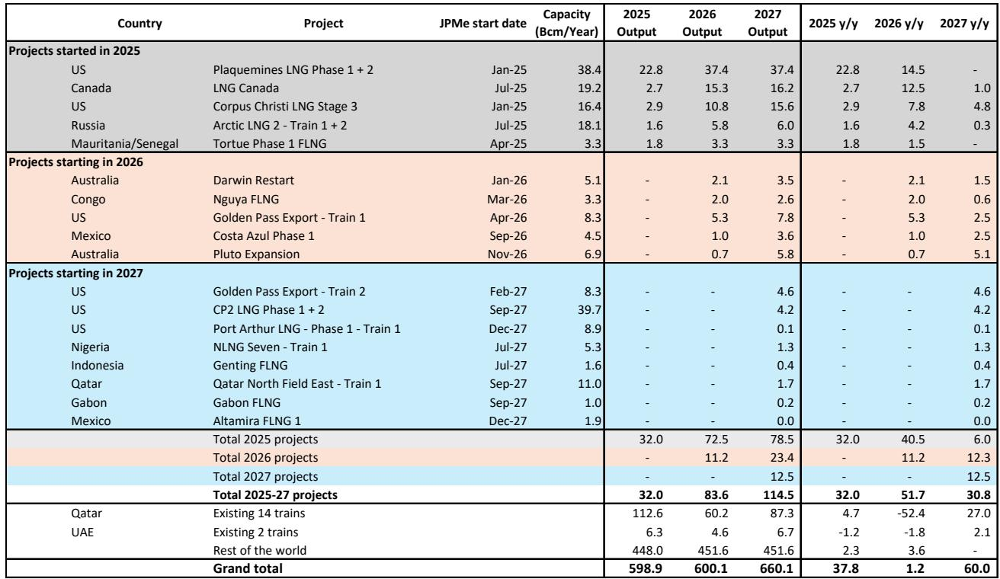
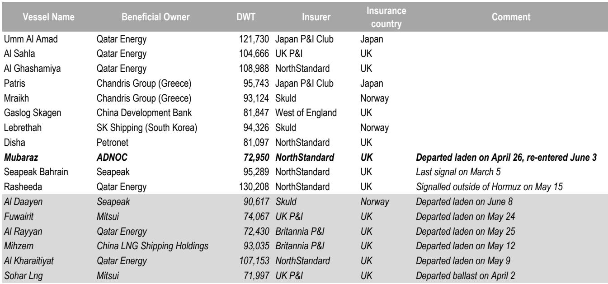
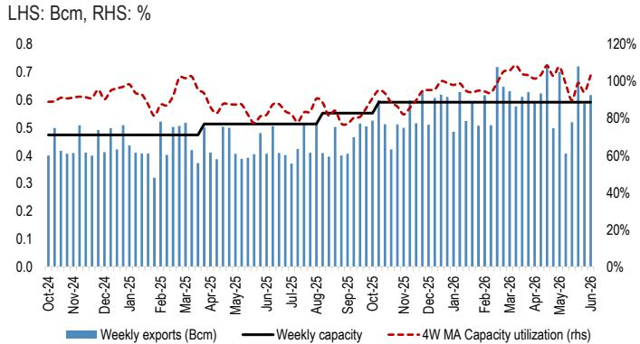

# The Strait of Hormuz Is Reopening, But the Global LNG Market Has Already Been Reshaped

The first laden LNG tanker has re-entered the Strait of Hormuz, and a second has since exited, signaling to China as its destination. These crossings, while still sporadic, mark the beginning of a process that the market has been anticipating for weeks. But the return of Qatari cargoes is not a return to normalcy. It is the start of a structurally different equilibrium for global LNG.

The analytical community has focused on the immediate supply shock and the timing of a reopening. That framing is now outdated. The real question is not when the Strait reopens, but what the global LNG market looks like once it does. The data from the past several weeks reveals a market that has already begun to rewire itself in ways that will persist long after Qatari liquefaction trains are back online. The implications for pricing, shipping, and strategic positioning are profound, and they demand a framework that goes beyond the current headlines.

This article argues that the post-Hormuz LNG market will be defined by three enduring features: a permanent reduction in Qatari supply availability for 2026, a structural shift in the Atlantic Basin's role as the marginal supplier to Asia, and a reset of shipping economics that will alter the calculus for long-term chartering decisions. Each of these forces reinforces the others, creating a market that is more regionally fragmented, more dependent on US supply, and more exposed to weather-driven volatility than at any point in the past decade.

## The Nine Vessels Inside the Gulf Represent a Hard Cap on Near-Term Qatari Supply, Not a Bottleneck

The most immediate data point from the tracker is the count of LNG vessels currently inside the Persian Gulf. As of June 8, the report identifies nine available vessels. This is not a logistical detail; it is a binding constraint. These nine ships represent the total ready-to-load capacity that can be deployed for the first wave of post-reopening cargoes. Every cargo that leaves the Gulf will require one of these vessels, and once they are dispatched, the next wave of supply depends on vessels returning from discharge ports, a round-trip that takes weeks.

This constraint is often misunderstood. The instinct is to treat the Strait reopening as a switch that restores flow. But the physics of shipping means that even with full operational clearance, the volume of LNG that can leave Qatar in the first month is physically capped by the number of hulls available inside the Gulf. The report's modelling of a ramp to 83% utilisation by September, implying a full-year 2026 utilisation rate of 57% for Qatar Energy, is not a pessimistic scenario. It is a mechanical consequence of the fact that the fleet is empty, the trains have been offline for months, and the operational restart of liquefaction facilities is a complex engineering process that takes two to three months.

The strategic implication is clear: the market should not expect Qatari supply to reach anything close to normal levels for the rest of 2026. The 57% utilisation rate for the full year is a stark number. It means that Qatar will produce roughly 60 Bcm from its existing 14 trains, down from 112.6 Bcm in 2025. That is a loss of over 50 Bcm in a single year from the world's largest LNG exporter. No amount of new project supply from other regions can fully compensate for that gap in the near term.

## Atlantic Basin LNG Is Now the Structural Marginal Supplier to Asia, and That Changes the Price Floor

The most consequential structural shift in the data is the redirection of US Gulf Coast LNG. The report notes that all incremental output from US facilities is heading toward Asian destinations, while US exports to Europe have recovered to levels comparable to the previous year. This is not a temporary arbitrage. It is a strategic reallocation driven by the loss of Qatari volumes and the permanent closure of the Suez Canal route for many LNG carriers.

The numbers are telling. US Gulf Coast exports to Asia have jumped from roughly 80-100 Mcm/day in early 2025 to 250 Mcm/day in May and June 2026. That is a tripling of volumes in a year. Meanwhile, the JKM premium to TTF has remained at about USD 2/mmbtu, supported by summer cooling demand and the potential for an El Niño weather event. This premium is the market's way of rationing supply. It signals that Asian buyers are willing to pay a significant premium over European prices to secure cargoes, and that premium is now the mechanism that balances the global market.

The "so what" here is that the price floor for global LNG has structurally shifted upward. In the old equilibrium, Qatari supply acted as a flexible swing producer that could arbitrage between basins. With Qatar effectively sidelined for the year, the marginal barrel of LNG that clears the Asian market is now coming from the US Gulf Coast. That cargo must absorb shipping costs that are significantly higher than the pre-conflict norm, even after the recent decline from crisis peaks. The West of Suez shipping rate remains at USD 80,000/day, down from the crisis peak but still elevated relative to the pre-conflict baseline. That cost gets embedded in the delivered price to Asia.

This creates a self-reinforcing dynamic. As long as Asian demand remains robust, which it will during the summer cooling season, the JKM premium must remain wide enough to attract Atlantic Basin cargoes away from Europe. The report's argument for higher prices in 3Q2026 to support European storage injections is analytically sound. The only way to keep European storage on track is to slow Asian spot demand through price, and the only way to do that is to let JKM rise relative to TTF.

## Shipping Rates Have Collapsed from Crisis Peaks, But the New Normal Is Still Structurally Higher Than Pre-Conflict Levels

The shipping data in the report reveals a market that has normalized in the most superficial sense but remains fundamentally altered. Spot rates in the West of Suez have fallen from their crisis peak of USD 200,000/day to USD 80,000/day. East of Suez rates have fallen from USD 110,000/day to USD 45,000/day. One-year charter rates have settled at USD 50,500/day.

These are not low numbers. Pre-conflict, one-year charter rates were in the range of USD 25,000-35,000/day. The current level of USD 50,500/day represents a structural premium of roughly 50-100% above the historical baseline. The reason is simple: the effective supply of LNG carriers has been reduced by the closure of both the Strait of Hormuz and the Suez Canal for transit. Vessels that used to move freely between basins are now forced into longer routes, reducing their effective utilization and tightening the overall fleet.

The second-order implication is that the shipping premium is now a permanent feature of the LNG cost curve. Any new long-term LNG contract that relies on Atlantic Basin supply to serve Asian demand must account for shipping costs that are structurally higher than the pre-2026 baseline. This changes the economics of new liquefaction projects. It makes US LNG more expensive delivered to Asia, which in turn supports the case for higher JKM prices. It also makes the economics of new Qatari capacity more attractive, but only if the Strait of Hormuz remains reliably open, which is a geopolitical assumption that no trader can take for granted.

## The Report's Data on New Projects Reveals a Supply Pipeline That Is Already Underperforming

The tracker's weekly data on loadings from recently started projects is perhaps the most underappreciated section of the report. Loadings from new projects decreased over the week, driven by declines at LNG Canada, Arctic LNG 2, Plaquemines, and Tortue. LNG Canada is tracking at close to a 75% utilisation rate on a 4-week moving average basis, which is respectable but below initial expectations. Arctic LNG 2 is at 34%. Plaquemines declined by 0.1 Bcm week-over-week.

Most concerning is the Golden Pass facility. Feedgas flows have dropped again to near zero, following a similar drop in mid-May after the facility exported its second cargo. The report explicitly warns that the facility is operating below its projected 80% utilisation rate, potentially putting up to 5 Bcm of 2026 output at risk. This is a material amount of supply that the market may have already priced in.

The pattern is consistent. New LNG projects are ramping more slowly than expected. This is not unusual for the industry, but it becomes a systemic problem when it coincides with the loss of 50 Bcm from Qatar. The supply gap for 2026 is not just about the Strait of Hormuz. It is also about the operational underperformance of the new supply that was supposed to fill the gap.

The report's supply decomposition table shows that total 2025-27 projects are expected to add 83.6 Bcm in 2026, but that number is heavily dependent on Plaquemines (37.4 Bcm), LNG Canada (15.3 Bcm), and Corpus Christi Stage 3 (10.8 Bcm). If Golden Pass falters and other projects continue to underperform, the actual supply addition could be 5-10 Bcm lower than the base case. In a market that is already tight, that is a meaningful swing.

## What the Report Does Not Fully Answer: The Demand Response to Higher Prices

The report makes a compelling case for higher prices, but it leaves one critical question unanswered: how much demand destruction will higher prices cause? The report argues that higher prices are needed to slow Asian spot demand and incentivise coal-over-gas use in Europe. But it does not quantify the price elasticity of demand in either region.

This is the missing variable in the analysis. If Asian buyers are willing to pay any price to secure LNG for summer cooling, then the JKM premium can expand indefinitely, and the market clears at a very high price. But if there is a price point at which Asian buyers switch to coal or reduce consumption, then the market has a natural ceiling.

The report's reference to a potential El Niño event adds another layer of uncertainty. El Niño typically brings warmer summers to Asia, which increases cooling demand. But it also brings milder winters to parts of the Northern Hemisphere, which could reduce heating demand later in the year. The net effect on LNG demand is uncertain, and the report does not attempt to model it in detail.

For readers who want to make their own assessment, the key data to watch is the weekly import figures by country. The report shows that India increased imports by 0.5 Bcm week-over-week and 0.6 Bcm year-over-year. That is a massive jump for a single country. If Indian demand continues to grow at that pace, it will put upward pressure on prices regardless of what happens in the rest of Asia.

## A Decision Framework for LNG Market Participants

For traders, strategists, and corporate planners, the data in this report supports a clear decision framework. The framework has three layers, each corresponding to a different time horizon.

First, for the next three months, the market is supply-constrained and price-responsive. The nine vessels inside the Gulf dictate the pace of Qatari recovery. Any disruption to the reopening process, whether operational or geopolitical, will cause an immediate price spike. The base case is for a gradual ramp, but the risk is skewed to the upside. The appropriate position is long JKM relative to TTF, with a focus on the 3Q2026 contract.

Second, for the next twelve months, the structural shift toward Atlantic Basin supply creates a new cost floor for Asian LNG. The delivered cost of US LNG to Asia, including the new shipping premium, sets a floor that is likely 15-20% higher than the pre-conflict average. This supports a long-term bullish view on JKM, but with the caveat that demand destruction at very high prices could cap the upside.

Third, for the next three years, the supply pipeline is the swing factor. If Golden Pass and other new projects continue to underperform, the supply deficit will persist into 2027 and 2028. If these projects ramp successfully, the market could flip into surplus by late 2027. The key decision point for long-term investors is whether to commit to new offtake agreements now, at what are likely elevated prices, or to wait for the supply pipeline to materialize.

The critical open question is the demand side. The framework above assumes that Asian demand remains robust. If the global economy slows, or if a mild winter reduces heating demand, the entire thesis collapses. The report's data gives us the supply picture. The demand picture is the variable that each reader must assess for themselves.

Join the community to read the full report and review the original charts.

*This article is for learning and discussion only and does not constitute investment advice.*

Personal reading notes and learning share only. Not investment advice.

