## Global EM Strategist

# Finding Your Funder

A divergence in growth trajectories favouring the US, shaky risk appetite amid continued high energy prices is a USD bullish alignment and a headwind for EM. We continue to expect appetite for EM local currency exposure but diversifying funding can help de-risk and isolate the EM view.

## Key Takeaways

We remain constructive on EM currencies, but the rebounding USD has challenged the near-term outlook.  
Even if the USD rebound persists, EM should still perform vs G3. Fundamentals and policy credibility anchor the asset class vs DM.  
We explore the return profiles of long EM exposure with different funding currencies. CAD has been an effective choice by raising returns while lowering vol.  
- Across multiple time frames though, using a basket of funding currencies is generally an improvement across various metrics vs any single DM funding currency.

## Must reads from Global EM Strategy

Global EM Fixed Income Mid-Year Outlook: Ride the Volatility, Keep the Carry | 15-May-2026

Strong EM fundamentals led to resilient performance amidst a roller coaster of oil market and inflation uncertainty. Spreads and FX have performed well. From here a weak USD helps, but limited duration gains and already tight spreads don't, with carry now doing the heavy lifting to year-end.

Poland Economics and Macro Strategy: NBP Preview: Waiting to Act | 28-May-2026

We expect the NBP to remain on hold, with the MPC continuing to signal readiness to tighten if persistent second-round effects start to materialise. We continue to expect one rate hike in September, with risks to our forecast skewed to the upside. In strategy, we prefer to pay 5y5y PLN vs HUF.

LatAm Macro Strategy: Mid-Year Outlook - Top 4 FAQ | 27-May-2026

We provide more color and analysis on the top four questions we have received over the last week, following the publication of our Mid-Year Outlook

Argentina Economics and Sovereign Credit Strategy: IMF Second Review: Our 10 Takeaways | 26-May-2026

The IMF reports have a constructive tone. Argentina appears to be delivering on several key fronts, demonstrating strong commitment to difficult policy

MS & CO. INTERNATIONAL PLC+

## James K Lord

Strategist

James.Lord@morganstanley.com +44 20 7677-3254

MS & CO. LLC

## Simon Waever

Strategist

Simon.Waever@morganstanley.com +1 212 296-8101

## Ioana Zamfir

Strategist

loana.Zamfir@morganstanley.com +1 212 761-4012

## Emma C Cerda

Strategist

Emma.Cerda@morganstanley.com +1 212 761-2344

## Sofia Palacios

Strategist

Sofia.Palacios@morganstanley.com +1 212 761-0428

MS & CO. INTERNATIONAL PLC+

## Neville Z Mandimika

Strategist

Neville.Mandimika@morganstanley.com +44 20 7425-2509

## Arnav Gupta

Strategist

Arnav.Gupta@morganstanley.com +44 20 7677-0382

MS ASIA LIMITED+

## Gek Teng Khoo

Strategist

Gek.Teng.Khoo@morganstanley.com +852 3963-0303

MS INDIA COMPANY PRIVATE LIMITED+

## Nimish M Prabhune

Strategist

Nimish.Prabhune@morganstanley.com +91 22 6996-1862

Please add me to your distribution list.

MS does and seeks to do business with companies covered in MS. As a result, investors should be aware that the firm may have a conflict of interest that could affect the objectivity of MS. Investors should consider MS as only a single factor in making their investment decision.

## For analyst certification and other important disclosures, refer to the Disclosure Section, located at the end of this report.

+= Analysts employed by non-U.S. affiliates are not registered with FINRA, may not be associated persons of the member and may not be subject to FINRA restrictions on communications with a subject company, public appearances and trading securities held by a research analyst account.

measures and the structural reform agenda. The weakest link remains the country's FX reserve position despite recent meaningful progress.

## Global EM Strategy

MS & CO. INTERNATIONAL PLC

MS & CO. LLC

MS ASIA LIMITED+

MS INDIA PRIVATE COMPANY LIMITED

James Lord

James.Lord@morganstanley.com +44 20 7677-3254

Arnav Gupta

Arnav.Gupta@morganstanley.com +44 20 7677-0382

Ioana Zamfir

Ioana.Zamfir@morganstanley.com +1 212 761-4012

Sofia Palacios

Sofia.Palacios@morganstanley.com 112127010428

Gek Teng Khoo

Gek.Teng.Khoo@morganstanley.com +852 3963-0303

Nimish Prabhune

Nimish.Prabhune@morganstanley.com

Strong US data has caused higher volumes of USD, as investors re-engage with long USD vs G3 while taking off short USD vs EM positions. Global headwinds have picked up with core rates repricing, debate over Fed hikes and growing economic divergence between the US and other major economies putting upward pressure on USD once again

We continue to think the bottom up fundamentals of the EM asset class are for the most part strong. Asia continues to underperform but much of the remainder of the asset class remains supported by improving monetary and fiscal credibility relative to much of DM.

As such, we think investors will want to maintain exposure to the asset class but a more diversified funding approach should be considered. CAD is an interesting option within the single currency universe, but we think a basket approach is consistently attractive across multiple time periods.

## Local markets trades overview

\- Rates: CEEMEA: 1y TRY OIS Payers, HUF 5Y5Y receiver versus PLN 5Y5Y payer, long NGOMOB 22-Sep-26 (FX-unhedged); Asia: Pay 5y HKD IRS versus USD IRS, pay 5y INR NDOIS, 1s5s THB NDTHOR steepener; LatAm: Buy 2028 MBonos, Jan 28 versus Jan 31 DI steepener

\- FX: CEEMEA: Short EUR/HUF, short 3m USD/TRY forward; Asia: Long SGD/INR; LatAm: Short PEN/CLP

## EM Under Top Down Pressure

In the weeks since we published our Mid Year Outlook it's clear that clients broadly share our constructive view on two key aspects of our EM investment thesis:

- Improving fundamentals of the EM local currency asset class.  
- Global investors have limited exposure to EM local currency assets with scope to increase.

However, not everyone agrees with other aspects of our investment thesis - namely, the top down aspects:

- Some agree with our bearish USD view, though some do not  
- There is plenty of debate and push back around our call for the Fed to stay on hold in 26 and cut in 27, and our forecast for lower UST yields is similarly debated.

That push back will only grow in the aftermath of last Friday's US strong employment report (see here).

Indeed, many clients believe the outperformance of the US equity market and the growth outlook will likely keep the USD on the front foot - at least on a DXY basis.

USD strength is of course a significant headwind for the asset class, given the majority of investors benchmark returns, but does not mean the EM asset class does not offer value vs DM. While we have not changed our USD view, investors could consider a more diversified approach to funding EM exposure to de-risk from the USD/Fed cycle - an approach we suggested investors took in our Mid-Year Outlook.

Long EM vs basket: Our forecasts suggest an index-weighted basket of EM currencies, funded by an equally-weighted basket of USD, EUR and JPY, would generate steady total returns over the next 12m, while a purely USD funded approach would see returns flatline from the end of 2026 (Exhibit 1 & Exhibit 2).

EUR-funding has outperformed. Year-to-date, funding EM via EUR has generated strong total returns with little volatility. EUR-funded exposure has been the best approach for investors. Yet, given the challenges that can come with picking the most effective funding currency, a basket approach could similarly offer an attractive return profile for investors, with a G3 funding strategy delivering both attractive absolute returns with a Sharpe ratio only modestly below the narrower EUR-funded approach. (Exhibit 3 & Exhibit 4)

Diversified funding with DM commodity currencies, less attractive: Funding EM exposure via a broader basket of DM of G3 + CHF, AUD and CAD would have delivered a less attractive return profile with AUD helping to reduce volatility relative to USD funding but at the expense of returns.

Exhibit 1: EM gains vs G3 expected  
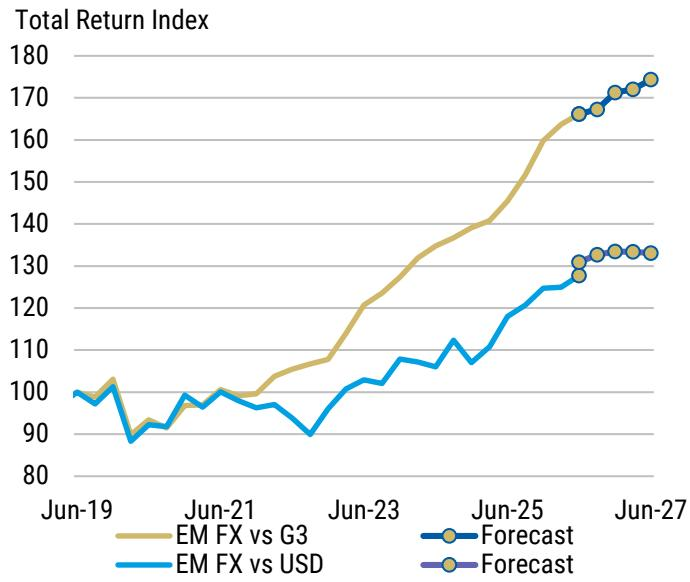

line chart

| Date   | EM FX vs G3 | EM FX vs USD | Forecast |
|--------|-------------|--------------|----------|
| Jun-19 | 100         | 100          | -        |
| Jun-21 | 100         | 95           | -        |
| Jun-23 | 120         | 105          | -        |
| Jun-25 | 140         | 120          | 130      |
| Jun-27 | 175         | 135          | 135      |

Source: Bloomberg, MS

Exhibit 2: Diversified funding reduces risk  
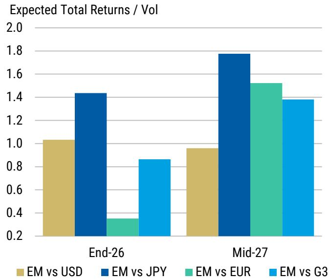

bar chart

Expected Total Returns / Vol
| Period | EM vs USD | EM vs JPY | EM vs EUR | EM vs G3 |
| :--- | :--- | :--- | :--- | :--- |
| End-26 | 1.03 | 1.44 | 0.35 | 0.86 |
| Mid-27 | 0.96 | 1.78 | 1.53 | 1.38 |

Source: Bloomberg, MS

Exhibit 3: EM vs DM Gains Continue  
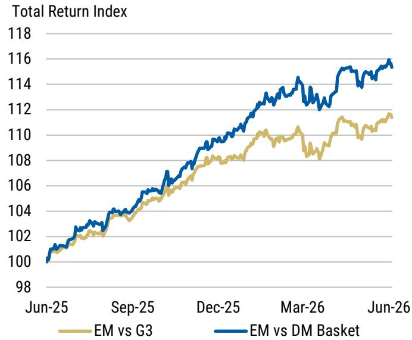

line chart

| Date   | EM vs G3 | EM vs DM Basket |
|--------|----------|-----------------|
| Jun-25 | 100      | 100             |
| Sep-25 | 104      | 105             |
| Dec-25 | 108      | 110             |
| Mar-26 | 110      | 114             |
| Jun-26 | 112      | 116             |

Source: Bloomberg, MS

Exhibit 4: Long EM vs EUR has been effective, but vs G3 also attractive  
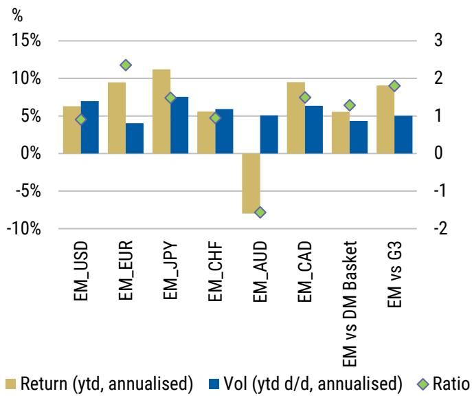

bar chart

| Category       | Return (ytd, annualised) | Vol (ytd d/d, annualised) | Ratio |
| -------------- | ------------------------ | ------------------------- | ----- |
| EM_USD         | 6%                       | 7%                        | 0.5   |
| EM_EUR         | 9%                       | 4%                        | 2.5   |
| EM_JPY         | 11%                      | 7%                        | 1.5   |
| EM_CHF         | 5%                       | 6%                        | 0.5   |
| EM_AUD         | -8%                      | 5%                        | -1.5  |
| EM_CAD         | 9%                       | 6%                        | 1.5   |
| EM vs DM Basket| 5%                       | 4%                        | 1.0   |
| EM vs G3       | 9%                       | 5%                        | 1.5   |

Source: Bloomberg, MS

## Which Currencies or Baskets Have Been the Most Effective Funders Over Longer-Run Trends?

While EUR funded strategies have been the most successful so far this year, what about over a longer period?

We present some return statistics showing the pros and cons of funding EM currency exposure across:

\- a range of different individual DM currencies (USD, EUR, JPY, CHF, AUD, CAD)

\- three baskets of DM funding currencies, including: 1) an equally-weighted basket of these same 5 DM currencies; 2) an equally-weighted basket of the same currencies excluding USD and 3) a basket of USD, EUR and JPY - DM currencies that are more defensive in nature.

Our return statistics examined:

- the cumulative returns of all funding strategies, comparing the non-USD funding strategies vs USD funding  
- Volatility, Sharpe ratios, max drawdown, Calmar, hit ratios, worst 3m performance and the worst 12m performance.

The full sample of our return analysis runs from January 2010 to May 2026, and Exhibit 5 shows the full return statistics across the various funding strategies. The results are just indicative and are for comparative purposes, without taking into account any transaction costs or strategies for implementation. The results should be self explanatory but for clarity:

- The Calmar ratio shows the annualised returns divided by the absolute value of the maximum drawdown - an indicator of overall return vs portfolio stress.  
- The Hit Rate shows the number of positive return periods divided by the total number of periods - we are using daily data so a hit rate of 53% suggests returns were positive of 53% of trading days.

Exhibit 6 shows specifically the Sharpe ratios of the different strategies for funding long EM exposure over different horizons. In addition to the full sample since 2010 we also calculated the return statistics for the last 1, 3 and 5 years. Given the variety of FX market conditions over these time periods, conclusions that are consistent across the different time frames could be more robust.

Baskets outperform: Over the full sample since 2010, the funding EM exposure via baskets results generally produced more consistent outcomes that any single funding currency approach. Over the full sample, all 3 basket funding approaches generated significantly higher Sharpe ratios and materially lower drawdowns than the traditional USD-funded approach.

Importantly, this advantage persisted across the 5-year and 3-year horizons, suggesting that the benefit is not simply a consequence of the long USD bull market from 2010 to 2022. Not taking into account transaction costs of course artificially boosts the relative attractiveness of baskets, as these approaches would likely have involved higher costs.

Among the individual funding currency strategies, CAD stands out. In the full sample since 2010, long EM versus CAD delivered an annualized total return of 3.6%, volatility of 6.3%, and a Sharpe ratio of 0.58, which was close to the best basket result. It also had the lowest maximum drawdown among the individual funders at -12.3%, compared with -28.8% for USD, -25.2% for JPY, and -28.7% for CHF.

CAD also had the best worst-3-month and worst-12-month results among the single funders, at around -8.2% and -8.4%, respectively. This suggests that CAD funding historically provided a more balanced exposure: it improved return versus USD while not introducing the same degree of left-tail risk as JPY or CHF.

With the exception of the last 1y, funding long EM exposure in CAD has produced higher Sharpe ratios than the other individual funding currency choices across all time frames.

Exhibit 5: Return statistics for differently funded long EM currency exposure (since 2010)

<table><tr><td>Strategy</td><td>Ann. Return</td><td>Ann. Vol</td><td>Sharpe</td><td>Max Drawdown</td><td>Worst 3M</td><td>Worst 12M</td><td>Calmar</td><td>Hit Rate</td><td>Total Return</td></tr><tr><td>EM_USD</td><td>1.9%</td><td>7.3%</td><td>0.26</td><td>-28.8%</td><td>-15.5%</td><td>-18.4%</td><td>0.07</td><td>52.4%</td><td>37.2%</td></tr><tr><td>EM_EUR</td><td>3.2%</td><td>6.6%</td><td>0.48</td><td>-15.5%</td><td>-12.8%</td><td>-12.3%</td><td>0.20</td><td>52.4%</td><td>69.7%</td></tr><tr><td>EM_JPY</td><td>5.2%</td><td>10.7%</td><td>0.49</td><td>-25.2%</td><td>-16.9%</td><td>-19.8%</td><td>0.21</td><td>53.9%</td><td>136.8%</td></tr><tr><td>EM_CHF</td><td>0.3%</td><td>9.2%</td><td>0.03</td><td>-28.7%</td><td>-19.5%</td><td>-24.0%</td><td>0.01</td><td>51.4%</td><td>4.6%</td></tr><tr><td>EM_AUD</td><td>3.4%</td><td>7.5%</td><td>0.45</td><td>-18.5%</td><td>-11.2%</td><td>-17.8%</td><td>0.18</td><td>51.4%</td><td>75.0%</td></tr><tr><td>EM_CAD</td><td>3.6%</td><td>6.3%</td><td>0.58</td><td>-12.3%</td><td>-8.2%</td><td>-8.4%</td><td>0.30</td><td>52.9%</td><td>83.6%</td></tr><tr><td>Basket_All_Equal</td><td>3.1%</td><td>5.4%</td><td>0.57</td><td>-12.6%</td><td>-11.9%</td><td>-10.2%</td><td>0.25</td><td>53.4%</td><td>67.8%</td></tr><tr><td>Basket_NonUSD_Equal</td><td>3.3%</td><td>5.6%</td><td>0.59</td><td>-12.3%</td><td>-11.6%</td><td>-10.7%</td><td>0.27</td><td>53.8%</td><td>73.6%</td></tr><tr><td>Basket_G3_USD_EUR_JPY</td><td>3.7%</td><td>6.8%</td><td>0.54</td><td>-13.6%</td><td>-13.5%</td><td>-11.2%</td><td>0.27</td><td>59.6%</td><td>80.9%</td></tr></table>

Source: Bloomberg, MS

Exhibit 6: Funding with either baskets or CAD provided higher Sharpe ratios & more consistent returns  
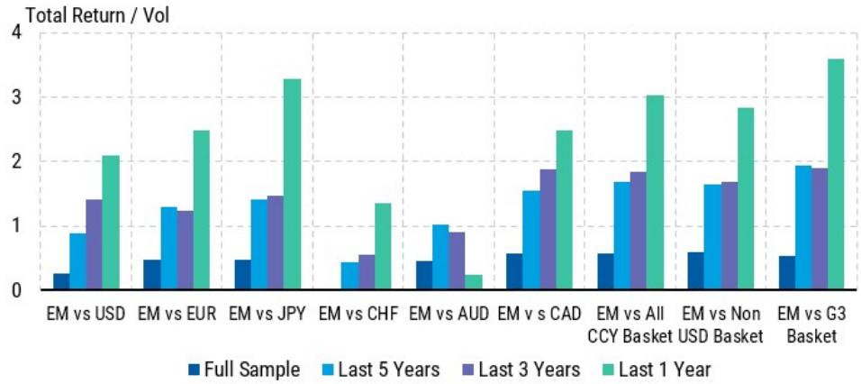

bar chart

Total Return / Vol
| Category | Full Sample | Last 5 Years | Last 3 Years | Last 1 Year |
| :--- | :--- | :--- | :--- | :--- |
| EM vs USD | 0.25 | 0.85 | 1.4 | 2.05 |
| EM vs EUR | 0.45 | 1.25 | 1.2 | 2.45 |
| EM vs JPY | 0.45 | 1.35 | 1.45 | 3.25 |
| EM vs CHF | 0.0 | 0.4 | 0.55 | 1.3 |
| EM vs AUD | 0.45 | 1.0 | 0.9 | 0.25 |
| EM vs CAD | 0.55 | 1.55 | 1.85 | 2.45 |
| EM vs All CCY Basket | 0.55 | 1.65 | 1.8 | 3.0 |
| EM vs Non USD Basket | 0.6 | 1.65 | 1.65 | 2.8 |
| EM vs G3 Basket | 0.55 | 1.9 | 1.85 | 3.6 |

Source: Bloomberg, MS Note: Full Sample - Jan 2010 - Jun 2016

## India Foreign Portfolio Flows

Exhibit 7: Debt flows have somewhat stabilized  
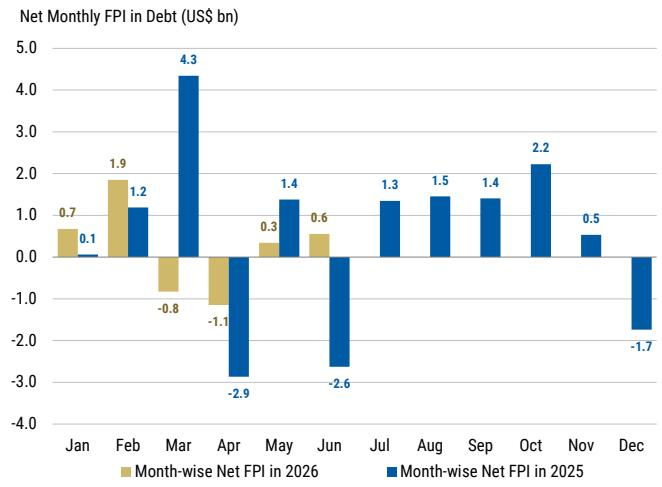

bar chart

Net Monthly FPI in Debt (US$ bn)
| Month | Month-wise Net FPI in 2026 (US$ bn) | Month-wise Net FPI in 2025 (US$ bn) |
| :--- | :--- | :--- |
| Jan | 0.7 | 0.1 |
| Feb | 1.9 | 1.2 |
| Mar | -0.8 | 4.3 |
| Apr | -1.1 | -2.9 |
| May | 0.3 | 1.4 |
| Jun | 0.6 | -2.6 |
| Jul | 1.3 | 1.3 |
| Aug | 1.5 | 1.4 |
| Sep | 1.4 | 1.4 |
| Oct | 2.2 | 0.5 |
| Nov | 0.5 | -1.7 |
| Dec | -0.1 | -1.7 |

Source: NSDL, MS

Exhibit 8: Equities continue to see foreign outflows  
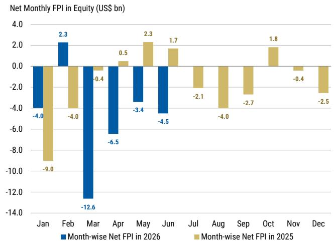

bar chart

Net Monthly FPI in Equity (US$ bn)
| Month | Month-wise Net FPI in 2026 (US$ bn) | Month-wise Net FPI in 2025 (US$ bn) |
| :--- | :--- | :--- |
| Jan | -4.0 | -9.0 |
| Feb | 2.3 | -4.0 |
| Mar | -12.6 | -0.4 |
| Apr | -6.5 | 0.5 |
| May | -3.4 | 2.3 |
| Jun | -4.5 | 1.7 |
| Jul | | -2.1 |
| Aug | | -4.0 |
| Sep | | -2.7 |
| Oct | | 1.8 |
| Nov | | -0.4 |
| Dec | | -2.5 |

Source: NSDL, MS

Exhibit 9: Net FPI flows by financial year  
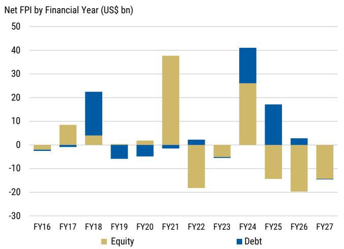

stacked bar chart

Net FPI by Financial Year (US$ bn)
| Financial Year | Equity (US$ bn) | Debt (US$ bn) |
| :--- | :--- | :--- |
| FY16 | -1.5 | -1.0 |
| FY17 | 8.0 | -0.5 |
| FY18 | 3.5 | 19.0 |
| FY19 | -4.0 | -5.0 |
| FY20 | 1.5 | -3.0 |
| FY21 | 38.0 | -1.0 |
| FY22 | -18.0 | 1.5 |
| FY23 | -3.0 | -0.5 |
| FY24 | 25.5 | 13.5 |
| FY25 | -14.0 | 16.5 |
| FY26 | -20.0 | 2.0 |
| FY27 | -10.0 | -0.5 |

Source: NSDL, MS  
Note: Financial Year in India runs from 1st April to 31st March

Exhibit 11: Cumulative debt flow in recent years  
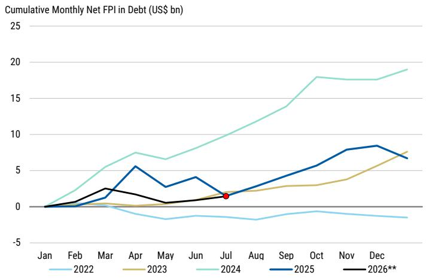

line chart

| Month | 2022 | 2023 | 2024 | 2025 | 2026** |
|-------|------|------|------|------|--------|
| Jan   | 0    | 0    | 0    | 0    | 0      |
| Feb   | 0    | 0    | 2    | 0    | 0      |
| Mar   | 0    | 0    | 5    | 1    | 2      |
| Apr   | -1   | 0    | 7    | 5    | 1      |
| May   | -1   | 0    | 6    | 3    | 0      |
| Jun   | -1   | 0    | 8    | 4    | 1      |
| Jul   | -1   | 1    | 10   | 1    | 1      |
| Aug   | -1   | 2    | 12   | 3    | 1      |
| Sep   | -1   | 3    | 14   | 5    | 1      |
| Oct   | -1   | 3    | 18   | 7    | 1      |
| Nov   | -1   | 4    | 18   | 8    | 1      |
| Dec   | -1   | 7    | 19   | 8    | 1      |

Source: NSDL, MS

Exhibit 10: FAR and General G-Sec flows since JPM GBI-EM inclusion announcement  
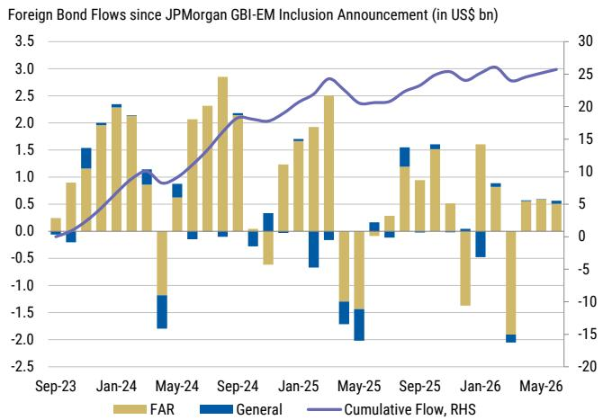

bar-line hybrid chart

Foreign Bond Flows since JPM GBI-EM Inclusion Announcement (in US$ bn)
| Date | FAR (US$ bn) | General (US$ bn) | Cumulative Flow, RHS (US$ bn) |
| :--- | :--- | :--- | :--- |
| Sep-23 | 0.25 | -0.15 | 0.0 |
| Jan-24 | 0.95 | 1.45 | 2.0 |
| May-24 | -1.25 | -0.75 | 8.0 |
| Sep-24 | 2.85 | -0.15 | 18.0 |
| Jan-25 | 1.25 | 0.35 | 19.0 |
| May-25 | -0.65 | -1.45 | 21.0 |
| Sep-25 | 0.95 | 1.45 | 23.0 |
| Jan-26 | -1.45 | -0.45 | 24.0 |
| May-26 | 0.55 | -1.95 | 25.0 |

Source: NSDL, MS

Exhibit 12: Cumulative equity flow in recent years  
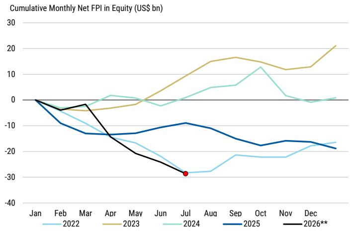

line chart

| Month | 2022 | 2023 | 2024 | 2025 | 2026** |
|-------|------|------|------|------|--------|
| Jan   | 0    | 0    | 0    | 0    | 0      |
| Feb   | -5   | -5   | -5   | -10  | -5     |
| Mar   | -10  | -5   | -5   | -15  | -5     |
| Apr   | -15  | -5   | 5    | -15  | -15    |
| May   | -15  | -5   | 0    | -15  | -20    |
| Jun   | -20  | 0    | -5   | -10  | -25    |
| Jul   | -25  | 10   | 5    | -10  | -30    |
| Aug   | -25  | 15   | 10   | -10  | -        |
| Sep   | -20  | 15   | 15   | -15  | -        |
| Oct   | -20  | 15   | 15   | -20  | -        |
| Nov   | -20  | 10   | 5    | -15  | -        |
| Dec   | -15  | 15   | 0    | -15  | -        |
| Jan   | -15  | 20   | 0    | -15  | -        |

Source: NSDL, MS

## What can we say about positioning?

In EM local currency bond markets, our flow tracker covers 9 EM markets – all benchmark countries – that report data on foreign holdings of local currency government bonds on a reasonably high frequency basis. Some of the data are more timely than others, but overall we can get a reasonable sense of foreign flows by making valuation and exchange rate adjustments.

As of Friday May 29th, we had data from 7 of the 9 countries. The data are a good approximation for trends in the overall market (see our primer here)

- Flat net flows. After heavy outflows in March, modest inflows in April, flows in May were small. YTD inflows are similar to what we saw in 2025. We expect to see inflows pick up as we move through the year particularly if oil prices fall and we see great global fixed income stability.  
- 3m sum flows back to neutral zone: Rolling 3m sum flows have dropped from \$40bn in mid Feb to around -\$20bn. This doesn't reflect new outflows, but prior

inflows dropping out of the rolling sum amid little flows in the more recent data. Nonetheless, the cumulative sum of flows in the past 3m is very low on the 5y historical range. Once the March data drop out we will see 3m flows move back up to around 0 but potentially higher should inflows actually resume.

\- YTD returns are flat: Total returns for EM local markets peaked in 2H Feb and have now unwound all the gains for the year, and the index is now up around 1% ytd.

Exhibit 13: Flows have stabilised  
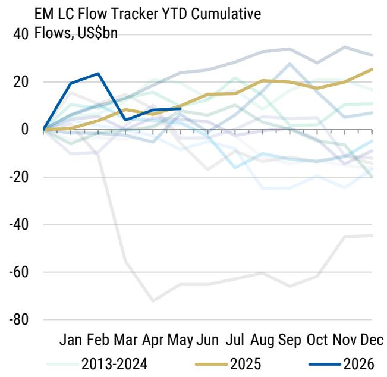

line chart

| Month | 2013-2024 | 2025 | 2026 |
|-------|-----------|------|------|
| Jan   | ~0        | ~0   | 0    |
| Feb   | ~10       | ~5   | 25   |
| Mar   | ~5        | ~10  | ~5   |
| Apr   | ~10       | ~15  | ~10  |
| May   | ~15       | ~20  | ~10  |
| Jun   | ~20       | ~25  | ~10  |
| Jul   | ~25       | ~30  | ~10  |
| Aug   | ~30       | ~35  | ~10  |
| Sep   | ~35       | ~40  | ~10  |
| Oct   | ~30       | ~35  | ~10  |
| Nov   | ~25       | ~30  | ~10  |
| Dec   | ~20       | ~25  | ~10  |

Source: Haver, National Sources, Bloomberg

Exhibit 14: 3m flows negative but the weakness is back-loaded  
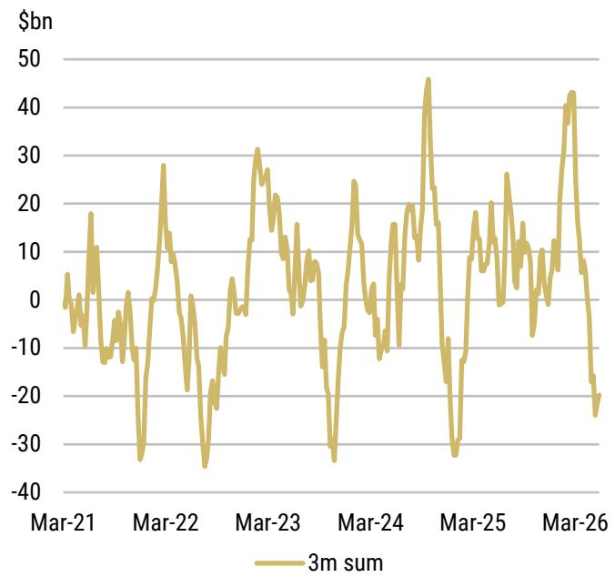

line chart

| Date    | 3m sum |
|---------|--------|
| Mar-21  | ~0     |
| Mar-22  | ~-30   |
| Mar-23  | ~30    |
| Mar-24  | ~-30   |
| Mar-25  | ~-30   |
| Mar-26  | ~-20   |

Source: Haver, National Sources, Bloomberg

Our flow tracker into 9 EM local markets is correlated with the returns of the overall local currency government bond market. This is not surprising, but confirms the validity of our tracker. Over the past 6m, returns and flows are very much in the neutral zone.

Exhibit 15: Inflows are correlated with returns. So if we hit extremes on outflows (not there yet) the risk/reward to enter the market could be strong  
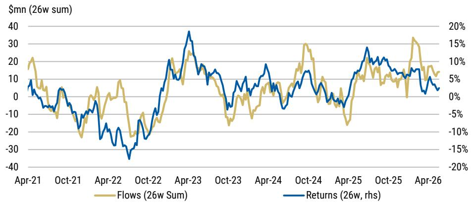

line chart

| Date   | Flows (26w Sum) | Returns (26w, rhs) |
|--------|-----------------|--------------------|
| Apr-21 | ~20             | ~5%                |
| Oct-21 | ~-10            | ~-5%               |
| Apr-22 | ~-20            | ~-10%              |
| Oct-22 | ~-30            | ~-15%              |
| Apr-23 | ~30             | ~15%               |
| Oct-23 | ~-10            | ~-5%               |
| Apr-24 | ~10             | ~5%                |
| Oct-24 | ~30             | ~10%               |
| Apr-25 | ~-10            | ~-5%               |
| Oct-25 | ~10             | ~5%                |
| Apr-26 | ~30             | ~10%               |

Source: MS, Bloomberg

In FX markets, we use FX options data to gauge positioning, and these data continue to show a long USD bias for investors.

\- Unwinding long USD positions: The DXY, BBDXY and the Broad USD are USD indices that investors track. Aggregating the individual currency pairs to reflect these indices shows that investors remain modestly long USD, and have added to these positions modestly over the past couple of weeks.

Recent data have shown the resilience of the US economy amid high oil prices, with more weakness shown in Europe. US equity market outperformance and growing expectations that the Fed may need to hike rates is adding to renewed talk of "US exceptionalism" - a vaguely defined term but generally associated with USD strength.

Across EM, the heavy long HUF position remains unchanged - a position we share with our expectation that EURHUF can fall to 340. Investors remain constructive EM though broadly speaking, adding to long ZAR, PLN and CZK positions recently, while remaining long MXN and TRY though investors have started to cut back on BRL exposure following recent political headlines. We stay bullish on EM currency and share the optimism reflected in FX options data.

Exhibit 16: Positioning in the FX Options Market  
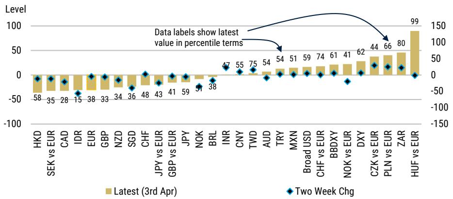

bar-line hybrid

| Entity | Latest (3rd Apr) | Two Week Chg |
| :--- | :--- | :--- |
| HKD | -58 | 0 |
| SEK vs EUR | -35 | -10 |
| CAD | -28 | -20 |
| IDR | -15 | -60 |
| EUR | -38 | -10 |
| GBP | -33 | -10 |
| NZD | -34 | -10 |
| SGD | -36 | -20 |
| CHF | -48 | -10 |
| JPY vs EUR | -43 | -15 |
| GBP vs EUR | -41 | -10 |
| JPY | -59 | -10 |
| NOK | -51 | -30 |
| BRL | -38 | -15 |
| INR | 47 | 10 |
| CNY | 55 | 10 |
| TWD | 75 | 15 |
| AUD | 54 | -10 |
| TRY | 54 | -10 |
| MXN | 51 | 0 |
| Broad USD | 59 | 10 |
| CHF vs EUR | 74 | 10 |
| BBDXY | 61 | 10 |
| NOK vs EUR | 41 | -20 |
| DXY | 62 | 10 |
| CZK vs EUR | 44 | 20 |
| PLN vs EUR | 66 | 20 |
| ZAR | 80 | 20 |
| HUF vs EUR | 99 | -10 |

Source: DTCC, Bloomberg, MS; Note: Using options that were traded in the past three months and expire in the coming one month. Notionals are delta-adjusted. Data as of Friday, March 27. See FX Trading Signals From Options Data and Assessing FX Positioning with Currency Options

EM total returns for the year remain stuck around \~1% though with significant regional variation. Latin America remains the only region with broad positive total returns across multiple countries, with duration and FX both positive. In CEEMEA Hungary is the standout performer, with the highest returns across the asset class of 16% ytd, with ZAR contributing somewhat too. Asia continues to lag, but this compares to the peak of the year pre conflict of around 3.6%. Latam continues to be the regional outperformer, with almost all markets up for the year, with CEEMEA mixed and AXJ once again lagging.

Exhibit 17: Much of CEEMEA and Asia have underperformed ytd)  
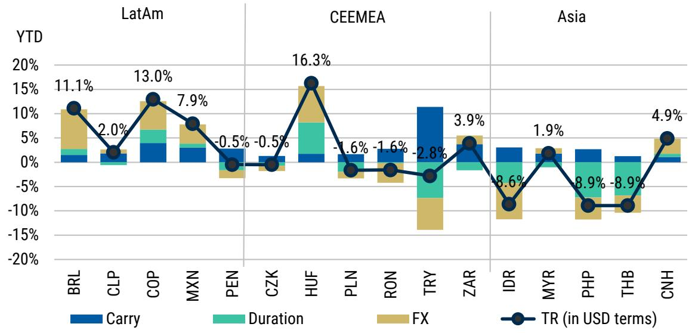

bar-line hybrid chart

| Currency | Carry (%) | Duration (%) | FX (%) | TR (in USD terms) (%) |
| :--- | :--- | :--- | :--- | :--- |
| BRL | 1.0 | 1.0 | 7.5 | 11.1 |
| CLP | 1.0 | 1.0 | 1.0 | 2.0 |
| COP | 4.0 | 3.0 | 6.0 | 13.0 |
| MXN | 3.0 | 2.0 | 4.0 | 7.9 |
| PEN | -1.0 | -2.0 | -3.0 | -0.5 |
| CZK | -1.0 | -1.0 | -1.0 | -0.5 |
| HUF | 2.0 | 5.0 | 8.0 | 16.3 |
| PLN | -1.0 | -2.0 | -2.0 | -1.6 |
| RON | -2.0 | -2.0 | -2.0 | -1.6 |
| TRY | 11.0 | -4.0 | -14.0 | -2.8 |
| ZAR | 3.0 | -2.0 | 4.0 | 3.9 |
| IDR | 3.0 | 1.0 | -11.0 | -8.6 |
| MYR | 2.0 | 1.0 | 1.0 | 1.9 |
| PHP | 3.0 | 2.0 | -11.0 | -8.9 |
| THB | 2.0 | 3.0 | -11.0 | -8.9 |
| CNH | 1.0 | 1.0 | 4.0 | 4.9 |

Source: Bloomberg, MS

## Required reading

Colombia Economics & Strategy: Colombia Election Update: A Constructive Close Call | 01-June-2026

- Colombia's first-round result reinforces a more constructive macro read, with Abelardo De La Espriella leading decisively in the first round.  
- The runoff math continues to favor a regime shift away from policy continuity, with even stressed scenarios favoring Abelardo De La Espriella.  
- The results suggest that we could price in 70% of our bull case scenario levels ahead of round 2, translating into \~3500 in USD/COP and \~12.00% in 10y TES.  
- We expect the market to price in a higher chance of a policy shift in the coming week, with an outperformance of near 20bp, we prefer COLOM 2036.  
- A very tight second round race suggests that incoming polls and endorsements could subsequently inject some volatility in the markets

EM Sovereign Credit Strategy: Where Supply Meets Demand | 29-May-2026

EM flows: Global-mandated EMDD funds saw inflows worth US\$907m last week, from US \$167m inflows from the prior week.

Poland Economics and Macro Strategy: NBP Preview: Waiting to Act | 28-May-2026

We expect the NBP to remain on hold, with the MPC continuing to signal readiness to tighten if persistent second-round effects start to materialise. We continue to expect one rate hike in September, with risks to our forecast skewed to the upside. In strategy, we prefer to pay 5y5y PLN vs HUF.

LatAm Macro Strategy: Mid-Year Outlook - Top 4 FAQ | 27-May-2026

We provide more color and analysis on the top four questions we have received over the last week, following the publication of our Mid-Year Outlook

EM Sovereign Credit Strategy: Rich & Cheap Watch | 27-May-2026

EMBIG-D remains unchanged at 242bp in the past week (1W). Spreads widened the most in B and tightened the most in BB rating categories. Region-wise, spreads widened the most in SSA and tightened the most in Asia.

Argentina Economics and Sovereign Credit Strategy: IMF Second Review: Our 10 Takeaways | 26-May-2026

The IMF reports have a constructive tone. Argentina appears to be delivering on several key fronts, demonstrating strong commitment to difficult policy measures and the structural reform agenda. The weakest link remains the country's FX reserve position despite recent meaningful progress.

Mexico Sovereign Credit Strategy: Rating Agencies Catch Up to Markets | 26-May-2026

While the rating trend for Mexico remains negative, we don't see further negative rating changes in the next year and have high conviction in our base case of Mexico still being IG for at least another two years. With markets already pricing another two downgrades, we see Mexico as too cheap.

## Senegal Sovereign Credit Strategy: Repricing Risks | 26-May-2026

Recent developments add uncertainty to Senegal's IMF path and increase risks of slower fiscal consolidation and delayed reforms. We think the curve will likely underperform in the near term and potentially see 3-4 point moves lower as investors price in higher odds of a debt rework.

## Hungary Economics and Macro Strategy: NBH Review: Deliberate Delay | 26-May-2026

The NBH remained on hold but signalled readiness to consider rate cuts, depending on external financial conditions. We now see a more front-loaded easing cycle but keep our terminal rate forecast unchanged at 4.75% for 2027. We remain positioned for HUF strength, long-end compression vs PLN.

## South Africa Economics & Strategy: SARB Preview: Credibility's Role in the Cycle | 22-May-2026

We expect the MPC to raise rates by 25bp next week. Although the market is pricing a more aggressive cycle from the SARB, we see no reason to fade the pricing just yet.

## Egypt: CBE Review: Tighter stance for longer | 21-May-2026

The CBE kept its rates on hold, in line with our call and consensus. We maintain our base case for unchanged rates throughout 2026. In strategy, we continue to be cautious and prefer to pay NDF curve on the dips.

## Nigeria Sovereign Credit Strategy: More Upgrades Likely Post Election | 18-May-2026

S&P upgraded Nigeria to B, aligning with Fitch, while improving oil revenues and reform momentum continue to support the macro story. We remain bullish as external buffers and reserves could outperform, favouring the long-end particularly the 2046s, while preferring local OMOs on an unhedged FX basis.

## Global EM Fixed Income Mid-Year Outlook: Ride the Volatility, Keep the Carry | 15-May-2026

Strong EM fundamentals led to resilient performance amidst a roller coaster of oil market and inflation uncertainty. Spreads and FX have performed well. From here a weak USD helps, but limited duration gains and already tight spreads don't, with carry now doing the heavy lifting to year-end.

## Trade Table

Exhibit 18: Trades overview

<table><tr><td colspan="2"></td><td>Entry Date</td><td>Entry Level</td><td>Current</td><td>Target</td><td>Stop</td><td>Notional ($m or k DV01*)</td><td>Gross P&amp;L bp</td><td>US$k</td></tr><tr><td colspan="10">SOVEREIGN CREDIT</td></tr><tr><td rowspan="3">Outright Country RV</td><td>Buy ARGENT USD GDP Warrant (price)</td><td>15-May-26</td><td>4.0</td><td>4.9</td><td>8.0</td><td>3.5</td><td>10</td><td>-</td><td>2,268</td></tr><tr><td>Buy MEX Feb&#x27;35 vs BRAZIL Mar&#x27;34 (g-spread)</td><td>15-May-26</td><td>6</td><td>13</td><td>-25</td><td>20</td><td>10x10.7</td><td>-7</td><td>-25</td></tr><tr><td>Switch out of VENZ 38 into PDVSA 26 (price)</td><td>15-May-26</td><td>9.0</td><td>6.8</td><td>6.0</td><td>10.5</td><td>10x10</td><td>-</td><td>220</td></tr><tr><td colspan="10">LOCAL RATES</td></tr><tr><td rowspan="8">Directional RV</td><td>Pay TRY 1Y OIS</td><td>15-May-26</td><td>39.60</td><td>39.45</td><td>43.00</td><td>38.00</td><td>10</td><td>-0</td><td>-1</td></tr><tr><td>Buy NGOMOB 22/09/2026</td><td>23-Mar-26</td><td>18.33</td><td>19.60</td><td>17.00</td><td>19.20</td><td>10</td><td>-1</td><td>-13</td></tr><tr><td>Pay 5y INR NDOIS (limit order)</td><td>16-Jan-26</td><td>6.30</td><td>6.56</td><td>6.90</td><td>6.00</td><td>10</td><td>-</td><td>-</td></tr><tr><td>Buy 2028 MBonos</td><td>18-May-26</td><td>7.65</td><td>7.49</td><td>7.35</td><td>7.90</td><td>10</td><td>16</td><td>161</td></tr><tr><td>Jan 28 vs Jan 31 DI Steepener</td><td>18-May-26</td><td>11</td><td>-4</td><td>50</td><td>-10</td><td>10</td><td>-15</td><td>-145</td></tr><tr><td>Pay 5y HKD IRS vs USD IRS</td><td>18-May-26</td><td>-77</td><td>-61</td><td>-35</td><td>-90</td><td>10</td><td>16</td><td>159</td></tr><tr><td>HUF 5Y5Y vs PLN 5Y5Y</td><td>15-May-26</td><td>0</td><td>-2</td><td>-50</td><td>20</td><td>10</td><td>2</td><td>21</td></tr><tr><td>1s5s THB NDTHOR steepener</td><td>25-Feb-26</td><td>33</td><td>68</td><td>80</td><td>40</td><td>10</td><td>35</td><td>354</td></tr><tr><td colspan="10">CURRENCIES</td></tr><tr><td rowspan="4">Directional RV</td><td>Short USD/TRY 3m FX Forward</td><td>22-Apr-26</td><td>46.17</td><td>48.01</td><td>44.60</td><td>47.20</td><td>10</td><td></td><td>-399</td></tr><tr><td>Short PEN/CLP</td><td>18-May-26</td><td>263</td><td>262</td><td>254</td><td>269</td><td>10</td><td></td><td>23</td></tr><tr><td>Short EUR/HUF</td><td>15-May-26</td><td>361</td><td>356</td><td>340</td><td>370</td><td>10</td><td></td><td>-</td></tr><tr><td>Long SGD/INR</td><td>27-Mar-26</td><td>73.5</td><td>74.2</td><td>77.5</td><td>72.0</td><td>10</td><td></td><td>106</td></tr><tr><td colspan="10">Closed Trades</td></tr><tr><td colspan="10">Buy CHILE 04/31 vs PERU 31 reached stop levels on May 20.CZK 9X12 receiver vs HUF 9X12 payer closed on May 27, 2026</td></tr></table>

Source: MS; Note: Hold to Maturity (HTM).

## Local Markets Snapshots

Ioana Zamfir, Sofia Palacios, Gek Teng Khoo, Nimish Prabhune, Arnav Gupta

<table><tr><td colspan="3">LatAm Local Markets</td></tr><tr><td></td><td>FX</td><td>Rates</td></tr><tr><td>BRL</td><td>BRL now looks less of an attractive long. Earlier-than-expected election noise and softer flows/terms of trade are making the path to 4.75-4.80 less straightforward, with scope for some near-term underperformance vs peers, particularly if oil prices move lower. We still like fading moves above ~5.10 given strong carry and fair valuations, suggesting a broad 4.75-5.10 range as election risk premium builds into 3Q.</td><td>Jan 28 vs Jan 31 DI Steepeners: In Brazil, a sustained rally in DIs remains tricky given ongoing inflationary pressures and uncertainty around oil prices. With only ~55bp of easing priced and election noise picking up earlier-than-expected, we think that the path of least resistance is to see curve steepening (either bull or bear, depending on the direction of upcoming headlines).</td></tr><tr><td>CLP</td><td>Short PEN/CLP: In the near term, CLP should start to reflect a more constructive domestic reform outlook rather than persistent terms of trade deterioration, supporting relative outperformance versus PEN, where political uncertainty continues to weigh on sentiment. While we expect CLP gains to be modest, oil price uncertainty and the risk of a more restrictive BCCh response should cap upside, leaving the cross primarily driven by PEN downside risks.</td><td>We still think markets underprice the risk of a small hiking cycle, but the bar for near-term repricing has risen. While inflation dynamics remain a concern and could warrant up to ~100bp of hikes over time, the April CPI downside surprise effectively removes the case for a near-term move, with hikes now more likely only from 3Q26. In the meantime, weak growth and strong AFP receiver flows should keep the front end range-bound, limiting the ability of offshore paying to drive a sustained repricing without a clear signal from the BCCh.</td></tr><tr><td>COP</td><td>Colombia&#x27;s first-round results have already triggered a positive market reaction, with the sharp improvement in momentum for de la Espriella reducing the perceived probability of an unorthodox outcome. Even after the initial rally, we still see scope for USD/COP to retrace toward ~3,500, implying ~70% of our bull-case scenario. That said, the race into the second round remains tight, and incoming polls and endorsements are likely to reintroduce volatility. As a result, we do not expect a full retracement toward ~3,400, with risks becoming more balanced as second-round uncertainty rises.</td><td>First-round results have already supported a positive repricing in local rates. Even after the move, we see scope for 10y TES to retrace further toward ~12.00%, consistent with pricing in ~70% of our bull-case scenario. However, the second-round setup argues against a full move to ~11.50%, with tighter political uncertainty and positioning likely to cap further compression, keeping rates sensitive to incoming polling and endorsement dynamics.</td></tr><tr><td>MXN</td><td>USMCA risks are now front and center, with negotiations underway and skewed toward a more substantive renegotiation, increasing the risk of headline-driven volatility. Against this backdrop, MXN should still remain supported by a still-restrictive Banxico stance and relatively stable global risk sentiment, even as the easing cycle progresses gradually. However, in our view, MXN continues to carry the sharpest downside risks in the region, as it screens as a hedge to a global growth downturn and easing has begun to erode its carry appeal.</td><td>Long 2028 MBonos: Near term, we continue to favor nominal bonds, mostly given their attractive carry profile. We think that Banxico&#x27;s reaction function points to a pause-and-monitor stance and a preference to move cautiously, even as CPI expectations remain relatively better anchored than in the rest of the region. While easing is not our base case, we see a non-negligible probability that the door to further small cuts remains open in the coming months, contingent on a benign external backdrop. On a relative basis, we favor nominal bonds over TIIE and Udibonos (given the negative seasonality of inflation in May), with the 2028s offering ~40bp of carry/roll over the next three months.</td></tr><tr><td>PEN</td><td>Short PEN/CLP: PEN remains exposed, in our view, as vote counting continues, with uncertainty around the final outcome still elevated. The election remains tight, with quick counts indicating a statistical tie and Keiko Fujimori leading by less than 1%, keeping markets cautious as results come in. At the same time, external dynamics should be more supportive for CLP on a relative basis, given its higher sensitivity to improvements in terms of trade. As a result, risks remain skewed to the downside for PEN.</td><td>BCRP remains in a patient, on-hold stance, viewing recent inflation pressures as largely supply-driven, with expectations still anchored. As a result, domestic policy dynamics are unlikely to be the main driver of rates in the near term. Longer-dated Soberanos should continue to trade primarily off elections and global rates. While an orthodox outcome could support a rally, upside appears limited given tight spreads and elevated global risk premia. By contrast, unorthodox outcomes still present clearer downside risks, particularly given concerns around fiscal slippage under a fragmented Congress. We prefer to remain neutral.</td></tr></table>

AXJ Local Markets

<table><tr><td></td><td>FX</td><td>Rates</td></tr><tr><td>CNY</td><td>We see USD/CNH heading lower towards 6.70 in the coming months as China&#x27;s trade balance remains strong with exports supported by the industrial cycle, and exporters converting their USD receipts into RMB. The gains may be moderate though as the CFETS basket is at elevated levels and is positively correlated with USD, which we expect to weaken. Exporters&#x27; FX conversion ratio is also already at the highs in recent years.</td><td>We see China rates outperforming its peers by staying largely range-bound.Upside pressure on yields may be limited by still-soft domestic demand, keeping China&#x27;s inflation pressures relatively lower and suggesting limited prospects of rate hikes. At the same time, export growth remains strong, limiting the downside for yields. We don&#x27;t expect further monetary or fiscal easing for the rest of the year.</td></tr><tr><td>INR</td><td>Long SGD/INR: INR may continue to face downside risks in 2H26. The current account deficit faces widening pressure from elevated oil prices and unfavourable seasonality. Inflation may normalise over the coming months, weighing on nominal FX valuations. INR also sees limited tailwinds from the industrial super-cycle.</td><td>Pay 5-year INR NDOIS: India yields could head higher as inflation faces upside risks from both energy and food prices, and our economists see risks of fiscal slippage from the FY27 budget deficit. FX remaining under pressure could also keep liquidity risks tilted to the tighter side.</td></tr><tr><td>IDR</td><td>IDR may be one of the relative underperformers in the region as its current account deficit may widen with limited tailwinds from the industrial super-cycle. Portfolio flows have also been weak and may remain so until there is a pickup in the pace of policy reform. BI stabilisation efforts may help to smooth the IDR downside.</td><td>Indonesia rates face downside risks. Policymakers committing to the 3% of GDP fiscal deficit limit and a moderate rise in inflation are positive for IndoGBs.However, IDR weakness raising risks of further rate hikes and fiscal pressures from high oil prices may limit the extent to which IndoGBs can rally.</td></tr><tr><td>KRW</td><td>KRW has potential to outperform if/when the Strait of Hormuz re-opens given its high beta and cheap valuations. It also sees tailwinds from the industrial cycle, with the current account surplus likely to reach a new high. Foreign asset purchases from the NPS and retail investors should also have a less negative impact on KRW with the NPS&#x27;s new FX hedging framework and retail investors&#x27; reduced foreign purchases.</td><td>We continue to see upside risks for Korea yields as inflation is already above the BoK target and may remain so into year-end. Growth is also supported by the industrial cycle, and the expansionary fiscal stance also presents upside risks to yields. While market pricing of BoK hikes is more than our economists&#x27; expectations, yields in the past peaked only after rate hikes started.</td></tr><tr><td>MYR</td><td>MYR could be one of the outperformers in the region as it screens as one of the main beneficiaries of the industrial cycle, with high exposure to both exports of AI-enabling products and energy-transition-related products. FDI inflows have been strong and Malaysia has also been gaining share in global exports.</td><td>We see Malaysia rates as one of the outperformers in the region. While our economists expect BNM to be the next central bank to tighten policy, the hiking cycle may be shallow with just one hike, limiting the extent to which yields can rise.</td></tr><tr><td>SGD</td><td>Long SGD/INR: We see SGD as a favourable long. In our base case of a gradual easing in oil prices, SGD could gain from strong export growth, rising inflation, and expectations of monetary policy tightening. In the risk scenario that oil prices rise further, SGD could also outperform relatively given its safe-haven quality.</td><td>SGD rates could outperform relatively amid SGD FX strength and ample liquidity domestically. Despite the upside risks to inflation, MAS net bill issuance has been low. Our US rates strategists&#x27; expectation of lower US yields over the coming months is also conducive for SGD rates to rally.</td></tr><tr><td>TWD</td><td>TWD could outperform as it is one of the main beneficiaries of the industrial supercycle. With the bulk of lifers&#x27; reduction in FX hedge ratios potentially behind us, foreigners&#x27; equity flows may become more important for TWD, suggesting upside for TWD given our positive outlook for AI. The CBC&#x27;s focus on imported inflation also provides scope for TWD appreciation, and carry is positive.</td><td></td></tr><tr><td>THB</td><td>We see scope for THB to appreciate if/when the Strait of Hormuz re-opens as it has underperformed recently with its exposure to high energy prices. In this scenario, THB could also benefit from a recovery in gold prices as US yields head lower. The domestic growth outlook has also improved with coordinated monetary and fiscal policy accommodation.</td><td>1s5s THB NDTHOR steepener: We continue to see upside for Thai yields in the belly and long-end of the curve given inflation is likely to continue rising, fiscal policy seems to be turning more proactive, and the BoT has signalled keeping rates on hold for as long as possible in the current supply-shock environment.</td></tr><tr><td>PHP</td><td>PHP may underperform within Asia as its current account deficit is the largest in the region and faces widening pressure, it is one of the most exposed economies to high energy prices, and the economy faces stagflationary risks. Carry cushion is also limited at just ~2% annualised versus USD.</td><td>RPGBs may remain under pressure amid high inflation, with the pass-through of oil to domestic gasoline prices being the highest in Asia. Our economists project another 100bp of rate hikes from the BSP, the most within Asia.</td></tr></table>

CEEMEA Local Markets

<table><tr><td></td><td>FX</td><td>Rates</td></tr><tr><td>ZAR</td><td>We think curve flattening reflects stronger fiscal credibility and better-anchored inflation expectations, limiting long-end risk premia. Near term, steepening risks appear limited, with the curve driven mainly by oil and front-end pricing, unless growth concerns emerge.</td><td>USD/ZAR stability has prevented FX from amplifying the shock, supporting the flatter curve. We remain neutral USD/ZAR, with oil and USD trends balanced, likely keeping the pair range-bound near term.</td></tr><tr><td>PLN</td><td>We stay neutral EUR/PLN, with the pair likely to remain range-bound, supported by EU fund conversion flexibility and a broadly stable EM FX backdrop.</td><td>HUF 5y5y receivers vs PLN 5y5y payers: We remain neutral on the front end, but see growing risks at the long end, favouring paying Poland vs Hungary as fiscal dynamics are unlikely to improve ahead of 2027. At current levels, PLN 5y5y acts more as a hedge on oil, with sustained pressures likely to drive further steepening.</td></tr><tr><td>HUF</td><td>Short EUR/HUF: We expect EUR/HUF to move toward 340 in a de-escalation scenario, driven primarily by risk premium compression rather than flows. Positioning remains elevated but supported, with limited scope for intervention, while lower FX volatility will be key in sustaining the longer-term convergence story.</td><td>HUF 5y5y receivers vs PLN 5y5y payers: We see a post-election regime shift supporting stronger policy visibility and EU convergence, driving further compression in HUF risk premia. This underpins our view that HUF 5y5y can move further below Poland, with the long end best positioned to outperform.</td></tr><tr><td>CZK</td><td>We remain neutral on EUR/CZK, with scope for gradual upside if the CNB lags ECB, but broader EM FX resilience likely to cap moves in the near term.</td><td>With high real rates and stable FX, we think the CNB can delay tightening, however we don&#x27;t want to fade the pricing as there is decent risk of CNB following in line with ECB to maintain credibility. In de-escalation, CZK rates should rally more meaningfully as pricing shifts toward less hikes.</td></tr><tr><td>TRY</td><td>Short 3m USD/TRY: We continue to favour short USD/TRY carry in the 3-month tenor, as depreciation—despite accelerating—still undershoots forwards, keeping carry returns intact. Inflows have resumed post initial outflows, and the faster crawl appears a prudent adjustment to manage external balances while maintaining investor confidence.</td><td>1y OIS TRY Payers: We see upside risks to Turkish rates, with inflation proving stickier than expected and risks of second-round effects building. In this environment, we think the balance of risks favours further tightening, despite markets pricing no cuts, making front-end payers attractive on dips.</td></tr><tr><td>EGP</td><td>We think Egypt remains exposed despite a more orthodox policy response, with FX flexibility improving resilience but not offsetting risks from Suez disruptions, weaker tourism, and higher energy imports. While USD/EGP could drift lower in a de-escalation scenario, we do not expect outperformance relative to CEEMEA, and prefer Turkey for carry exposure.</td><td>We remain unconstructive on Egypt rates for carry, with real yields below ~4% insufficient to compensate for rising inflation risks and a more flexible FX regime. Instead, we see NDF curve payers as a tactical hedge, particularly against further escalation and potential policy tightening.</td></tr><tr><td>NGN</td><td>We see NGN stability as a key pillar for the carry trade, with the currency remaining resilient despite recent shocks, supported by strong portfolio inflows and improving external balances. This underpins our preference for unhedged OMO exposure, although risks remain skewed to oil price downside, which could weaken FX and the overall carry profile.</td><td>Buy NGOMOB 22/09/2026: We remain constructive on Nigeria local rates, particularly OMO bills, where attractive nominal yields continue to draw strong demand. Upcoming OMO and T-bill maturities should support issuance. We expect robust refinancing demand—especially in 1-year tenors—to keep yields well supported.</td></tr></table>

Sovereign Credit Snapshots

<table><tr><td>Credit</td><td>Commentary and curve preference</td><td>Curve</td></tr><tr><td colspan="3">Latin America</td></tr><tr><td>Argentina</td><td>Like: Buy ARGENT USD Warrant: Argentina ticks many boxes for a bullish outlook, including a positive fiscal, reform, growth and investment outlook. The next few months should see strong FX reserve purchases, stronger activity and we also expect a full upgrade to a B bucket rating in 2H26, perhaps as soon as July. We see an external issuance post the July amortizations. Bonds retain upside versus peers, and we prefer ARGENT 41.</td><td>USD 41</td></tr><tr><td>Brazil</td><td>Dislike: Sell BRAZIL Mar'34 vs MEX Feb'35: We see risk-reward as negative into the coming months. Our fiscal and rating models suggest Brazil is fair yet this doesn't factor in that the elections may alter the fiscal trajectory. Brazil looks rich versus Mexico and many other BB rated credits, meaning we think the market has already priced the positive impact of higher commodity prices.</td><td>30y bonds</td></tr><tr><td>Chile</td><td>Like: We see the new administration's reform agenda as positive, although we see some headline risks. Chile should remain relatively resilient despite being a net energy importer, supported by regional insulation from the conflict, benefitting compared to other strong IG credits in the GCC region. Its curve remains flat, and we see value in 15-year bonds on its USD curve.</td><td>10y EUR, 15y USD bonds</td></tr><tr><td>Colombia</td><td>We remain neutral after the large valuation adjustment after the first-round election, with Colombia outperforming peers by 35bp, more than we anticipated. The credit is now 15bp of outperformance away from our bull scenario. We still see high uncertainty in the outcome of the second-round, which should result in volatility. With a flat curve, we prefer the belly, particularly COLOM 36, but think recent tenders will keep the long-end supported.</td><td>10y bonds</td></tr><tr><td>Costa Rica</td><td>Dislike: Costa Rica has been one of the strongest-performing LatAm BB importers, helped by stronger buffers and optimism around the new administration, but we think the market is now underpricing fiscal risks. The latest fiscal framework points to a materially weaker debt trajectory. Spreads are pricing 1.2 upgrades and leave little room for disappointment. We still prefer long-end bonds as the curve remains relatively steep, with its 2044 bond relatively cheap.</td><td>30y bonds</td></tr><tr><td>Dominican Republic</td><td>The Dominican Republic has now priced out the upgrade momentum seen earlier this year and has already lagged versus peers amid higher oil prices. While we still see downside risks from weaker fiscal and external dynamics if oil remains elevated, we think the recent underperformance has been sufficient for now. We prefer its 60 bond as it has the most spread across the curve and trades 10pt below par. We expect the long end to hold in best in any decompression due to demand from locals.</td><td>35y bonds</td></tr><tr><td>Ecuador</td><td>Like: Strong external balances, aided by a sizeable current account surplus, support reserve accumulation. The key driver in the months ahead will be to show more progress on fiscal consolidation after a weaker 2025, which we see as feasible given higher oil prices and spending restraint. IMF and US backing remain firm. There is still room to tighten versus peers in Africa and versus its own historical tights.</td><td>40s</td></tr><tr><td>El Salvador</td><td>Dislike: El Salvador has so far kept up with single B average since the middle of February, thanks to its lower beta. However, as energy prices remain higher for longer, we see El Salvador as among the more exposed in the region given its significant energy importer status which will see external balances weaken. IMF collaboration has also weakened. Risk reward is positive on the IO note but we would wait for better entry points to buy.</td><td>54s</td></tr><tr><td>Guatemala</td><td>Guatemala has performed strongly and is now pricing in much of the positive reform and governance story, leaving valuations relatively rich versus BB peers. While the new attorney general appointment should support market sentiment and anti-corruption efforts, we think meaningful reforms will take time and rating agencies are likely to wait until the next presidential election before considering IG upgrades. With a steep curve relative to the rest of EM, we prefer the belly of the curve, particularly its 37 bond.</td><td>11y bonds</td></tr><tr><td>Mexico</td><td>Like: Buy MEX Feb'35 vs BRAZIL Mar'34: Mexico has significantly lagged peers and now looks very cheap, including by pricing two full downgrades. Downgrade concerns will likely persist yet our base case sees no actual downgrades in 2026. Our economist expects activity will pick up from here, we expect external issuance to fall and also include a buy-back. Pemex has richened and we would position only in the long-end bonds now.</td><td>MEX 10y, PEMEX 30y bonds</td></tr><tr><td>Panama</td><td>We remain neutral on Panama and expect technical support to continue in the near term, helped by higher shipping costs. The credit has outperformed, now pricing in 0.6 upgrades, which we do not expect. We continue to see risks in the medium term, expecting continued debt accumulation, and see insufficient fiscal progress resulting in a downgrade to HY. We prefer its long-end bonds, which have generally underperformed.</td><td>30y bonds</td></tr><tr><td>Peru</td><td>Dislike: We continue to think Peru does not price enough election risk and expect the credit to lag versus peers into the run-off election. According to polls there is now a higher possibility of an unorthodox policy outcome, and we do not see a divided congress as a sufficient backstop. While an orthodox candidate victory could reverse some recent underperformance, we still expect Peru to lag EM peers in the medium term given ongoing fiscal and institutional pressures. Its curve has steepened and we prefer its 2055 bond.</td><td>USD 30y bonds</td></tr><tr><td>Uruguay</td><td>Uruguay remains relatively wide versus peers as we have seen fiscals underperform history on the back of an uptick in spending that has pushed debt stocks upwards. While we expect policy continuity from the current administration, we see uncertainty around the impact of the spending plan. We prefer its 60 bond.</td><td>35y bonds</td></tr><tr><td>Venezuela</td><td>Switch out of VENZ 38 into PDVSA 26: Momentum towards a debt restructuring remains strong and there is still upside towards our base case of a fast oil recovery that sees VENZ recover at 60. Further upside is also possible from higher oil price assumptions and the inclusion of a VRI. Among permitted bonds, we favour PDVSA over VENZ, with PDVSA 6% 2022 looking most undervalued, but PDVSA 21, 12.75% 22 and 35 are also attractive. On the other hand, it makes VENZ 27, VENZ 34 and VENZ 38 look rich.</td><td>PDVSA over VENZ</td></tr></table>

<table><tr><td>Credit</td><td>Commentary and curve preference</td><td>Curve</td></tr><tr><td colspan="3">Europe, Middle East and North Africa</td></tr><tr><td>Turkey</td><td>Like: Turkey's macro backdrop is likely to face manageable pressure in 2026 as higher energy prices weigh on growth, fiscal dynamics and external balances. However, we think this weakness should prove temporary, with a rebound expected in 2027 as geopolitical tensions ease and oil prices moderate. Following the recent repricing, spreads now appear to offer sufficient compensation for risks, while both front-end and long-end bonds screen attractively under our framework. Given cheaper valuations and manageable macro risks, we move Turkey to a like stance.</td><td>Belly</td></tr><tr><td>Ukraine</td><td>Ukraine bonds have moved higher in line with the improved prospects of a successful ceasefire, with markets currently implying a pricing of around 67%, now higher than back in February 2025. To break out from this range would require an actual ceasefire, which we assume would require credible security guarantees, which to date have proved challenging for all sides to agree on.</td><td>A29s</td></tr><tr><td>Egypt</td><td>Given the ongoing geopolitical tensions, spillovers to Egypt run mainly through oil, tourism, and the Suez Canal, as direct trade with Iran is negligible. We see the long end being the most vulnerable, and we think the belly offers better protection. The authorities in the recent investor relations email communique note that they still intend to access the international market as well as raise concessional debt to address external payments due this year.</td><td>Belly</td></tr><tr><td>Jordan</td><td>Spreads have remained relatively contained, with no upgrades now priced in. Risks tilt toward wider spreads given its proximity to the conflict. Last year's issuance and tender suggest limited appetite for near-term issuance.</td><td>30s</td></tr><tr><td>Morocco</td><td>Fiscal consolidation is broadly on track, though we expect the 2026 deficit closer to ~3.5% of GDP versus the 3% target due to energy support measures and strong investment spending. Moody's recent outlook upgrade to Positive reinforces the improving ratings story after S&amp;P restored investment grade last year. Spreads now trade close to BBB peers, limiting further upside, and we continue to prefer the EUR 31s and US$33s belly over the richer long end.</td><td>EUR 31s and US $31</td></tr><tr><td>Tunisia</td><td>The 2026 budget points to a modest worsening in the fiscal position. Revenues rise to TND52.6bn on higher taxes, but faster spending growth lifts the deficit to TND11.0bn or 5.7% of GDP. Gross financing needs ease slightly, though reliance on central bank financing increases. Recent rating upgrades support our expectation of around €400m in eurobond issuance in 2026 to partially refinance the July maturity.</td><td>JPY 27s</td></tr><tr><td colspan="3">Sub-Saharan Africa</td></tr><tr><td>South Africa</td><td>Like: The economy is likely to slow in 2026 as higher oil prices weigh on consumption, investment and confidence, although we expect growth to stabilise and improve in 2027 as structural reforms re-emerge. Despite weaker growth, fiscal consolidation remains broadly on track, supported by resilient nominal GDP growth and ongoing expenditure restraint, with the budget deficit expected to move toward 3.0% over the coming years. On bonds, we continue to favour the long end, with the 2054 bond our preferred point on the curve.</td><td>54</td></tr><tr><td>Ghana</td><td>Ghana has weathered higher oil prices relatively well, as strong gold prices have offset what would otherwise have been a negative terms-of-trade shock to the current account. While we continue to look for opportunities to adopt a more constructive stance, current spreads already appear to fully reflect the improving macroeconomic outlook. Bond spreads are currently pricing in roughly two rating upgrades, suggesting that much of the positive macro momentum is already embedded in valuations.</td><td>Belly</td></tr><tr><td>Kenya</td><td>Kenya continues to underperform, as an oil importer, with higher oil prices likely to erode external buffers. The IMF expects fiscal deficits to remain near 6% in 2025 to 2026. We think an IMF programme is possible, although the 2027 elections complicate timing. If oil prices stay high, this could increase the chances of an earlier programme.</td><td>Belly</td></tr><tr><td>Angola</td><td>Angola's recent outperformance has moderated as oil prices have stabilised. Current spreads now price in just 0.2 downgrades, which looks broadly fair given that all rating agencies maintain stable outlooks. In a scenario where geopolitical tensions ease and oil prices decline, we think Angola spreads could come under pressure as part of a broader de-escalation theme. The long end continues to screen as moderately cheap, and we retain a preference for longer-dated bonds.</td><td>Belly</td></tr><tr><td>Zambia</td><td>Over the last few days, attention has shifted to the Zambia 2053 bond following the surprise tender announcement by the authorities last Friday. An ad hoc bondholder committee has since formed and takethe viewthat the tender price deprives noteholders of potential value. In the near term, we think it is likely that the authorities return to the market with a revised tender offer to incentivize investor participation and help achieve the 75% threshold required to trigger a clean-up call. Until then, we expect the bonds to trade in the low-80s range as the market awaits an updated offer. At current levels, we view the risk-reward profile as balanced while awaiting further details.</td><td>33</td></tr><tr><td>Nigeria</td><td>Like: We continue to like Nigeria as higher oil prices remain a net positive for the sovereign. While higher oil prices are likely to increase inflationary pressures, they also support the current account through an improved trade balance. Continued portfolio inflows into OMO bills and T-bills should help support the currency and external buffers. We complement our like stance with a preference for the long end, particularly the 2046 bond, which screens as cheap in our view.</td><td>2046</td></tr><tr><td>Mozambique</td><td>The IMF remains important to anchor fiscal expectations, but politically difficult reforms, including fiscal consolidation and greater exchange rate flexibility, could delay a programme agreement beyond 2026. A broad debt restructuring (not our base case) would likely deliver limited savings given the concessional nature of most external debt. If the 2031 bond were restructured, authorities could extend repayments to align with rising LNG exports from 2029/2030. We estimate fair value at 84.6 versus the current price of 85, leaving risk-reward broadly balanced. A committee has formed and isproposinga pre-emptive restructuring ahead of the September coupon payment. The proposal includes a VRI, which, if implemented, could provide additional upside to our recovery value estimates.</td><td></td></tr><tr><td>Senegal</td><td>Recentpolitical developmentshave led clients to assign a higher probability to a debt restructuring. Key debates we've had with clients have centered on recovery values, which we estimate at an average price of 52, and associated exit yields, with 9% appearing fair given current EM high-yield and African risk pricing. We expect both local law instruments and eurobonds to be included in the debt restructuring perimeter, should it come to that. June and July become critical in this debate given the large external and domestic payments that have to be made. Strong local bond auctions could provide sufficient funding to keep obligations current.</td><td>USD 31 &amp; EUR28</td></tr><tr><td>Ivory Coast</td><td>Like: We continue to favour the Ivory Coast as fiscal and external buffers have improved. With the authorities expected to reach a budget deficit of 3% of GDP alongside a current account deficit of around 1% of GDP in 2026, even in a higher oil price environment, we think the macro backdrop remains supportive. Combined with still cheap valuations in the belly of the curve, we remain constructive and shift our preference to the EUR2040 bond following the recent cheapening.</td><td>EUR44</td></tr></table>

# Valuation Methodology and Risks

Exhibit 19: Rates trades

<table><tr><td>Trade</td><td>Date</td><td>Entry Level</td><td>Target</td><td>Stop</td><td>Rationale</td><td>Risks</td></tr><tr><td>Pay TRY 1Y OIS</td><td>15-May-26</td><td>39.60</td><td>43.00</td><td>38.00</td><td>We think the CBT may have to increase rates eventually to prevent inflation expectations becoming anchored; we also see this as a good hedge to short USD/TRY</td><td>The CBT eases policy faster than markets</td></tr><tr><td>Buy NGOMOB 22/09/2026</td><td>23-Mar-26</td><td>18.33</td><td>17</td><td>19</td><td>A stronger trade balance should offset portfolio outflows, with oil above the US$40/bbl breakeven. We expect inflation to rise, likely halting CBN cuts. We initiate coverage on Nigeria macro strategy and prefer OMO bills for higher carry and resilience. Short duration offers protection in weaker FX and higher yield scenarios, while high oil prices favour local assets</td><td>Substantial decline in oil prices.</td></tr><tr><td>HUF 5Y5Y vs PLN 5Y5Y</td><td>15-May-26</td><td>0.00</td><td>-50</td><td>20</td><td>We expect further risk compression in HUF vs PLN although we understand the big move has happened and those in the trade should take some profit. But we expect long end to compress further against PLN</td><td>Worsening of fiscal scenario and positioning unwind</td></tr><tr><td>Jan 28 versus Jan 31 DI steepener</td><td>18-May-26</td><td>9.00</td><td>50</td><td>-10</td><td>As market pricing now incorporates ~75bp of easing only but election-related noise has intensified, we think that the path of least resistance is to see curve steepening (either bull or bear, depending on the direction of upcoming headlines).</td><td>Continued upside surprises in CPI</td></tr><tr><td>Buy 2028 MBonos</td><td>18-May-26</td><td>7.65</td><td>7.35</td><td>7.90</td><td>We think that Banxico&#x27;s reaction function implies a propensity for delaying any potential hikes as much as possible, though we note that it is the only regional economy whose CPI expectations have yet to de-anchor. If anything, we actually think that there is a non-negligible possibility that the door towards another small adjustment (towards 6.00%) could be open in a few months (perhaps after the World Cup) to the extent that the Middle East conflict is resolved without inflicting meaningful inflationary pressures on Mexico.</td><td>A large sell-off in US rates.</td></tr><tr><td>Pay 5-year HKD vs USD IRS</td><td>15-May-26</td><td>-77</td><td>-35</td><td>-90</td><td>We expect HKD liquidity to tighten over the coming months as the dividend season for HK-listed companies begins in June and liquidity seasonally tightens into year-end. This may allow the strong HKD bond issuance trend to start having more impact on the rates market. The improving Hong Kong property market could also help loan growth to continue picking up. We choose the 5-year point to improve the carry profile.</td><td>HKD liquidity remains ample.</td></tr><tr><td>1s5s THB NDTHOR steepener</td><td>25-Feb-26</td><td>33</td><td>80</td><td>40</td><td>We like positioning for steepeners in Thailand. Front-end rates should be anchored by monetary policy staying on hold, as inflation was low heading into the oil price rally and the BoT has said it will keep rates on hold for as long as possible to support growth. Oil-driven inflation should thus drive yields in the belly and long-end of the curve higher. Prospects of more active fiscal policy could also help the curve to steepen.</td><td>A lack of monetary and fiscal easing to support growth.</td></tr><tr><td>Pay 5-year INR NDOIS (limit order)</td><td>16-Jan-26</td><td>6.30</td><td>6.90</td><td>6.00</td><td>We see room for India yields to rise as higher oil prices puts further upward pressure on inflation, which was already normalising ahead of the oil move, and may also increase risks of a larger fiscal deficit. Forecasts for a weaker monsoon season may also present upside risks to inflation. FX smoothing operations by the central bank could tighten liquidity. Our economists also see risks of slippage from teh FY27 fiscal deficit target.</td><td>Significantly lower oil prices.</td></tr></table>

Source: MS

Exhibit 20: Credit trades

<table><tr><td>Stance/Trade</td><td>Date</td><td>Entry Level</td><td>Target</td><td>Stop</td><td>Rationale</td><td>Risks</td></tr><tr><td>Buy MEX Feb&#x27;35 vs BRAZIL Mar&#x27;34</td><td>15-May-26</td><td>6</td><td>-25</td><td>20</td><td>Mexico has significantly lagged peers and now looks very cheap, including by pricing two full downgrades. Downgrade concerns will likely persist yet our base case sees no actual downgrades in 2026.</td><td>USMCA negotiation entering our bear case or Brazilian polls strongly suggesting a shift towards fiscal consolidation</td></tr><tr><td>Switch out of VENZ 38 into PDVSA 26</td><td>15-May-26</td><td>9.0</td><td>6.0</td><td>10.5</td><td>A price of 9 points, or price to claim of 4.6 points, is not warranted given our base case sees PDVSA and the VENZ treated the same in a restructuring.</td><td>Any negative announcements suggesting PDVSA bonds will be treated worse than the sovereign bonds</td></tr><tr><td>Buy ARGENT USD GDP Warrant</td><td>15-May-26</td><td>4.0</td><td>8.0</td><td>3.5</td><td>Our fair value stands at 8 assuming a conservative assumption of a 33% probability that there is a payout due to the 2013 reference year</td><td>The newly filed 2026 case covering the 2013 payment is dismissed</td></tr></table>

Source: MS

Exhibit 21: Credit stances

<table><tr><td>Stance/Trade</td><td>Date</td><td>Entry Level</td><td>Target</td><td>Stop</td><td>Rationale</td><td>Risks</td></tr><tr><td>Like Turkey Hard Currency Bonds</td><td>15-May-26</td><td>NA</td><td>NA</td><td>NA</td><td>Turkey&#x27;s macro backdrop is likely to face manageable pressure in 2026 as higher energy prices weigh on growth, fiscal dynamics and external balances. Spreads now appear to offer sufficient compensation for risks, while both front-end and long-end bonds screen attractively under our framework.</td><td>A much sharper increase lower in oil prices.</td></tr><tr><td>Dislike Costa Rica Hard Currency Bonds</td><td>15-May-26</td><td>NA</td><td>NA</td><td>NA</td><td>Costa Rica has been one of the strongest-performing LatAm BB importers, helped by stronger buffers and optimism around the new administration, but we think the market is now underpricing fiscal risks. The latest fiscal framework points to a materially weaker debt trajectory. Spreads are pricing 1.5 upgrades and leave little room for disappointment.</td><td>A new fiscal framework created by the new administraiton with a credible fiscal consolidation path.</td></tr><tr><td>Dislike Brazil Hard Currency Bonds</td><td>15-May-26</td><td>NA</td><td>NA</td><td>NA</td><td>We see risk-reward as negative into the coming months. Our fiscal and rating models suggest Brazil is fair yet this doesn&#x27;t factor in that the elections may alter the fiscal trajectory.</td><td>Brazilian polls strongly suggesting a shift towards fiscal consolidation</td></tr><tr><td>Like Mexico Hard Currency Bonds</td><td>15-May-26</td><td>NA</td><td>NA</td><td>NA</td><td>Mexico has significantly lagged peers and now looks very cheap, including by pricing two full downgrades. Downgrade concerns will likely persist yet our base case sees no actual downgrades in 2026.</td><td>USMCA negotiation entering our bear case</td></tr><tr><td>Dislike El Salvador Hard Currency Bonds</td><td>23-Mar-26</td><td>NA</td><td>NA</td><td>NA</td><td>As energy prices remain higher for longer, we see El Salvador as among the more vulnerable in the region given its significant energy importer status. Additionally, progress with the IMF is slow and the upcoming IMF meetings may not yield much positive.</td><td>Rapid fall in the oil price or strong endorsement by the IMF on program progress</td></tr><tr><td>Like Nigeria Hard Currency Bonds</td><td>20-Jan-26</td><td>NA</td><td>NA</td><td>NA</td><td>Nigeria has cheapened modestly relative to peers since the start of the year. We think the current account is in a much stronger position to absorb any downside shock, while fiscal metrics remain manageable for now despite emerging risks.</td><td>A much sharper move lower in oil prices.</td></tr><tr><td>Like Ivory Coast Hard Currency Bonds</td><td>21-Nov-25</td><td>NA</td><td>NA</td><td>NA</td><td>We like Ivory Coast sovereign credit because it offers value and improving fundamentals. The 10y trades about 138bp wide to BB peers due mainly to Senegal spillover. We think this gap should narrow as regional risks ease. Ivory Coast looks set to reach its 3% deficit target in 2025, supported by tax reforms, stronger exports and better external buffers.</td><td>A substantial drop in gold and cocoa prices which impacts the terms of trade.</td></tr><tr><td>Like Chile Hard Currency Bonds</td><td>17-Nov-25</td><td>NA</td><td>NA</td><td>NA</td><td>Chile has shown signs of entering our bull case scenario with a shift to the right in Congress and the presidential election result.</td><td>Much lower copper prices and difficulties in implementing policies to consolidate fiscals</td></tr><tr><td>Like Argentina Hard Currency Bonds</td><td>16-Nov-25</td><td>NA</td><td>NA</td><td>NA</td><td>Argentina&#x27;s bull case is currently playing out, where strong governability comes together with US support to open up the path towards market access, including potential buybacks. Valuations wise there is also still further upside versus other large African single B issuers.</td><td>A wider-than-anticipated current account deficit in addition to lack of demand of local currency due to perceived FX overvaluation.</td></tr><tr><td>Like Ecuador Hard Currency Bonds</td><td>16-Nov-25</td><td>NA</td><td>NA</td><td>NA</td><td>Ecuador remains an improving credit story that now also sees reforms as possible due to the stronger governability of the president. A significant current account surplus also provides a supportive FX flows backdrop. Valuation wise there is also still further upside versus other large African single B issuers.</td><td>Fall in oil price that impacts fiscals negatively.</td></tr><tr><td>Like South Africa Hard Currency Bonds</td><td>12-Aug-25</td><td>NA</td><td>NA</td><td>NA</td><td>SOAF spreads have underperformed peers recently. Combined with waning fiscal risks, we now see risk/reward as positive.</td><td>A resurgence of risks related to the Government of National Unity.</td></tr><tr><td>Dislike Peru Hard Currency Bonds</td><td>31-May-24</td><td>NA</td><td>NA</td><td>NA</td><td>We see risks of a eurobond issuance and further downgrades in the second half of this year, which we do not see as priced in. Wider deficit expectations, growth underperforming and risks associated with Petroperú raise financing needs.</td><td>Announcement of no hard currency issuance this year.</td></tr></table>

Source: MS

Exhibit 22: FX trades

<table><tr><td>Trade</td><td>Date</td><td>Entry Level</td><td>Target</td><td>Stop</td><td>Rationale</td><td>Risks</td></tr><tr><td>Short PEN/CLP</td><td>18-May-26</td><td>At Market Open</td><td>254</td><td>269</td><td>We recommend to short PEN versus CLP as we think that the sol&#x27;s recent rebound does not accurately reflect potential election-related risk premium around the second round of the presidential election. Additionally, both currencies remain exposed to oil and copper prices from a terms of trade standpoint, but CLP&#x27;s domestic narrative should reflect the potential for additional market friendly policies and fiscal consolidation. We acknowledge that given BCRP&#x27;s more proactive FX approach, another spike in global oil prices would pose some risks to our trades, as CLP would remain more exposed.</td><td>Sustained spike in oil prices</td></tr><tr><td>Short EUR/HUF</td><td>15-May-26</td><td>361</td><td>340</td><td>370</td><td>We expect EUR/HUF to move toward 340 in a de-escalation scenario, driven primarily by risk premium compression rather than flows. Positioning remains elevated but supported, with limited scope for intervention, while lower FX volatility will be key in sustaining the longer-term convergence story.</td><td>Global shock to oil prices and central bank cutting rates faster than expectations</td></tr><tr><td>Long SGD/INR</td><td>27-Mar-26</td><td>73.5</td><td>77.5</td><td>72.0</td><td>SGD could outperform relatively if oil prices continue rising given its safe-haven characteristics. In a de-escalation scenario, SGD could also gain from USD weakness and monetary policy tightening expectations. Meanwhile, INR is more exposed to energy and food disruptions. While INR may see a relief rally in a de-escalation scenario, the sustainability could be challenged by rising inflation and a lack of meaningful foreign equity inflows.</td><td>Significantly lower oil prices.</td></tr><tr><td>Short 3m USD/TRY forward</td><td>22-Apr-26</td><td>48.7</td><td>46.8</td><td>47.1</td><td>With the CBT keeping real rates high, the economic programme remaining solid and local political developments becoming less significant for market participants, we continue to like the carry trade in Turkey.</td><td>The CBT cutting rates too quickly.</td></tr></table>

Source: MS

Exhibit 23: History of recommendations for stances

<table><tr><td colspan="3">Dislike Costa Rica Hard Currency Bonds</td></tr><tr><td>Trade</td><td>Entry Date</td><td>Exit Date</td></tr><tr><td>Like Costa Rica Hard Currency Bonds</td><td>02-Feb-2026</td><td>15-May-2026</td></tr><tr><td>Dislike Costa Rica Hard Currency Bonds</td><td>15-May-2026</td><td></td></tr><tr><td colspan="3"></td></tr><tr><td colspan="3">Dislike Brazil Hard Currency Bonds</td></tr><tr><td>Trade</td><td>Entry Date</td><td>Exit Date</td></tr><tr><td>Dislike Brazil Hard Currency Bonds</td><td>22-Oct-2025</td><td>23-Mar-2026</td></tr><tr><td>Dislike Brazil Hard Currency Bonds</td><td>15-May-2026</td><td></td></tr><tr><td colspan="3"></td></tr><tr><td colspan="3">Like Mexico Hard Currency Bonds</td></tr><tr><td>Trade</td><td>Entry Date</td><td>Exit Date</td></tr><tr><td>Like Mexico Hard Currency Bonds</td><td>25-Apr-2025</td><td>02-Mar-2026</td></tr><tr><td>Like Mexico Hard Currency Bonds</td><td>15-May-2026</td><td></td></tr><tr><td colspan="3"></td></tr><tr><td colspan="3">Dislike El Salvador Hard Currency Bonds</td></tr><tr><td>Trade</td><td>Entry Date</td><td>Exit Date</td></tr><tr><td>Dislike El Salvador Hard Currency Bonds</td><td>23-Mar-2026</td><td></td></tr><tr><td colspan="3"></td></tr><tr><td colspan="3">Like Nigeria Hard Currency Bonds</td></tr><tr><td>Trade</td><td>Entry Date</td><td>Exit Date</td></tr><tr><td>Like Nigeria Hard Currency Bonds</td><td>20-Jan-2026</td><td></td></tr><tr><td colspan="3"></td></tr><tr><td colspan="3">Like Ivory Coast Hard Currency Bonds</td></tr><tr><td>Trade</td><td>Entry Date</td><td>Exit Date</td></tr><tr><td>Like Ivory Coast Hard Currency Bonds</td><td>03-Sep-2024</td><td>12-Aug-2025</td></tr><tr><td>Like Ivory Coast Hard Currency Bonds</td><td>21-Nov-2025</td><td></td></tr><tr><td colspan="3"></td></tr><tr><td colspan="3">Like Chile Hard Currency Bonds</td></tr><tr><td>Trade</td><td>Entry Date</td><td>Exit Date</td></tr><tr><td>Like Chile Hard Currency Bonds</td><td>10-Feb-2025</td><td>02-Sep-2025</td></tr><tr><td>Like Chile Hard Currency Bonds</td><td>17-Nov-2025</td><td></td></tr><tr><td colspan="3"></td></tr><tr><td colspan="3">Like Argentina Hard Currency Bonds</td></tr><tr><td>Trade</td><td>Entry Date</td><td>Exit Date</td></tr><tr><td>Like Argentina Hard Currency Bonds</td><td>02-Sep-2025</td><td>08-Sep-2025</td></tr><tr><td>Like Argentina Hard Currency Bonds</td><td>16-Nov-2025</td><td></td></tr><tr><td colspan="3"></td></tr><tr><td colspan="3">Like Ecuador Hard Currency Bonds</td></tr><tr><td>Trade</td><td>Entry Date</td><td>Exit Date</td></tr><tr><td>Like Ecuador Hard Currency Bonds</td><td>16-Nov-2025</td><td></td></tr><tr><td colspan="3"></td></tr><tr><td colspan="3">Like South Africa Hard Currency Bonds</td></tr><tr><td>Trade</td><td>Entry Date</td><td>Exit Date</td></tr><tr><td>Like South Africa Hard Currency Bonds</td><td>12-Aug-2025</td><td></td></tr></table>

Source: MS

Exhibit 24: History of recommendations for trades

<table><tr><td colspan="4">Buy MEX Feb&#x27;35 vs BRAZIL Mar&#x27;34</td><td colspan="7"></td></tr><tr><td>Instrument</td><td>Identifier</td><td>Maturity</td><td>Trade</td><td>Entry Date</td><td>Entry Level</td><td>Exit Date</td><td>Exit Level</td><td>Target/Objective</td><td>Stop/Re-assess</td><td>Size of Trade or Unit/Notional</td></tr><tr><td>BRAZIL 6.625 20350315 Bond Fixed</td><td>US105756CL22</td><td>15-Mar-2035</td><td>Buy BRAZIL 35 vs PANAMA 35</td><td>12-Aug-2025</td><td>-10</td><td>04-Sep-2025</td><td>5</td><td>-50</td><td>5</td><td>9.7x10</td></tr><tr><td>PANAMA 6.400 20350214 Bond Fixed</td><td>US698299BT07</td><td>14-Feb-2035</td><td>Buy BRAZIL 35 vs PANAMA 35</td><td>12-Aug-2025</td><td>-10</td><td>04-Sep-2025</td><td>5</td><td>-50</td><td>5</td><td>9.7x10</td></tr><tr><td>MEX 6.350 20350209 Note Fixed</td><td>US91087BAV27</td><td>09-Feb-2035</td><td>Buy MEX Feb&#x27;35 vs BRAZIL Mar&#x27;34</td><td>15-May-2026</td><td>6</td><td></td><td></td><td>-25</td><td>20</td><td>10x10.7</td></tr><tr><td>BRAZIL 6.625 20350315 Bond Fixed</td><td>US105756CL22</td><td>15-Mar-2035</td><td>Buy MEX Feb&#x27;35 vs BRAZIL Mar&#x27;34</td><td>15-May-2026</td><td>6</td><td></td><td></td><td>-25</td><td>20</td><td>10x10.7</td></tr><tr><td colspan="11"></td></tr><tr><td colspan="4">Switch out of VENZ&#x27;38 into PDVSA&#x27;26</td><td colspan="7"></td></tr><tr><td>Instrument</td><td>Identifier</td><td>Maturity</td><td>Trade</td><td>Entry Date</td><td>Entry Level</td><td>Exit Date</td><td>Exit Level</td><td>Target/Objective</td><td>Stop/Re-assess</td><td>Size of Trade or Unit/Notional</td></tr><tr><td>VENZ 7.000 20380331 Fixed In default</td><td>USP97475AJ95</td><td>31-Mar-2038</td><td>Switch out of VENZ&#x27;38 into PDVSA&#x27;26</td><td>15-May-2026</td><td>9</td><td></td><td></td><td>6</td><td>10.5</td><td>10m</td></tr><tr><td>PDVSA 6.000 20261115 REGS Fixed In default</td><td>USP7807HAR68</td><td>15-Nov-2026</td><td>Switch out of VENZ&#x27;38 into PDVSA&#x27;26</td><td>15-May-2026</td><td>9</td><td></td><td></td><td>6</td><td>10.5</td><td>10m</td></tr><tr><td colspan="11"></td></tr><tr><td colspan="4">HUF 5y5y rec vs PLN 5y5y payer</td><td colspan="7"></td></tr><tr><td>Instrument</td><td>Identifier</td><td>Maturity</td><td>Trade</td><td>Entry Date</td><td>Entry Level</td><td>Exit Date</td><td>Exit Level</td><td>Target/Objective</td><td>Stop/Re-assess</td><td>Size of Trade or Unit/Notional</td></tr><tr><td>HUF 5y5y IRS</td><td>S0325FS 5Y5Y BLC Curncy</td><td>NA</td><td>HUF 5y5y rec vs PLN 5y5y payer</td><td>15-May-2026</td><td>0</td><td></td><td></td><td>-50</td><td>20</td><td>10</td></tr><tr><td>5y5y PLN Forward Swap</td><td>PZFS0505 Curncy</td><td></td><td>HUF 5y5y rec vs PLN 5y5y payer</td><td>15-May-2026</td><td>0</td><td></td><td></td><td>-50</td><td>20</td><td>10</td></tr><tr><td colspan="11"></td></tr><tr><td colspan="4">Short 3m USD/TRY</td><td colspan="7"></td></tr><tr><td>Instrument</td><td>Identifier</td><td>Maturity</td><td>Trade</td><td>Entry Date</td><td>Entry Level</td><td>Exit Date</td><td>Exit Level</td><td>Target/Objective</td><td>Stop/Re-assess</td><td>Size of Trade or Unit/Notional</td></tr><tr><td>USD/TRY</td><td></td><td>3M</td><td>Short USD/TRY 3month</td><td>20-May-2025</td><td>42.66</td><td>20-Aug-2025</td><td>40.89</td><td>39.50</td><td>44.0</td><td></td></tr><tr><td>USD/TRY</td><td></td><td>3M</td><td>Short 3m USD/TRY FX Forward</td><td>24-Sep-2025</td><td>44.75</td><td>26-Dec-2025</td><td>42.8475</td><td>43.20</td><td>45.5</td><td>10</td></tr><tr><td>USD/TRY</td><td></td><td>3M</td><td>Short 3m USD/TRY FX Forward</td><td>15-Jan-2026</td><td>46.17</td><td>16-Apr-2026</td><td></td><td>44.6</td><td>47.2</td><td>10</td></tr><tr><td>USD/TRY</td><td></td><td>3M</td><td>Short 3m USD/TRY</td><td>22-Apr-2026</td><td>48.7</td><td></td><td></td><td>46.84</td><td>47.1</td><td>10</td></tr><tr><td colspan="11"></td></tr><tr><td colspan="4">Buy NGOMOB 22/09/2026</td><td colspan="7"></td></tr><tr><td>Instrument</td><td>Identifier</td><td>Maturity</td><td>Trade</td><td>Entry Date</td><td>Entry Level</td><td>Exit Date</td><td>Exit Level</td><td>Target/Objective</td><td>Stop/Re-assess</td><td>Size of Trade or Unit/Notional</td></tr><tr><td>NGOMOB 20260922 245D Zero coupon</td><td>NGO3G2209267</td><td>22-Sep-2026</td><td>Buy NGOMOB 22/09/2026</td><td>23-Mar-2026</td><td>18.33</td><td></td><td></td><td>17</td><td>19.2</td><td>10</td></tr><tr><td colspan="11"></td></tr><tr><td colspan="4">Pay 1y OIS TRY</td><td colspan="7"></td></tr><tr><td>Instrument</td><td>Identifier</td><td>Maturity</td><td>Trade</td><td>Entry Date</td><td>Entry Level</td><td>Exit Date</td><td>Exit Level</td><td>Target/Objective</td><td>Stop/Re-assess</td><td>Size of Trade or Unit/Notional</td></tr><tr><td>1y TRY OIS</td><td>TYSO1 BGN Curncy</td><td>1Y</td><td>TRY 1Y OIS Receiver</td><td>21-Nov-2025</td><td>36.70</td><td>04-Dec-2025</td><td>35.32</td><td>35.50</td><td>37.50</td><td>1</td></tr><tr><td>1y TRY OIS</td><td>TYSO1 BGN Curncy</td><td>1Y</td><td>TRY 1Y Payer</td><td>15-May-2026</td><td>39.60</td><td></td><td></td><td>43</td><td>38</td><td>1</td></tr></table>

Buy MEX Feb'35 vs BRAZIL Mar'34  
Source: MS

## Definition of terms

Buy/Long: The analyst expects the total or excess return (depending on the nature of the recommendation) of the instrument or issuer that is the subject of the investment recommendation to be positive over the relevant time period.

Sell/Short: The analyst expects the total or excess return (depending on the nature of the recommendation) of the instrument or issuer that is the subject of the investment recommendation to be negative over the relevant time period.

Selling protection or Buying Risk: The analyst expects that the price of protection against the event occurring will decrease over the relevant time period.

Buying protection or Selling Risk: The analyst expects the price of protection against the event occurring will increase over the relevant time period.

Pay: The analyst expects that over the specified time period the variable rate underlying the swap agreement that is the subject of the investment recommendation will increase.

Receive: The analyst expects that over the specified time period the variable rate underlying the swap agreement that is the subject of the investment recommendation will decrease.

Unless otherwise specified, the time frame for recommendations included in the MS Fixed Income Research reports is 1 - 3 months and the price of financial instruments mentioned in the recommendation is as at the date and time of publication of the recommendation.

When more than one issuer or instrument is included in a recommendation, analyst expects one part of the trade to outperform the other trade or combination of other trades included in the recommendation on a relative basis.

For important disclosures related to the proportion of all investment recommendations over the past 12 months that fit each of the categories defined above, and the proportion of issuers corresponding to each of those categories to which MS has supplied material services, please see the MS disclosure at https://ny.matrix.ms.com/eqr/article/webapp/b83487c0-2db9-11f1-b3c0-bb95a716ade2?ch=rp&sch=sr&sr=1

Important note regarding economic sanctions. This report references jurisdictions which may be the subject of economic sanctions. Readers are solely responsible for ensuring that their investment activities are carried out in compliance with applicable laws.

Global Macro Strategy Team

<table><tr><td>MS &amp; CO. LLC</td><td>Matthew Hornbach, CMTMatthew.Hornbach@morganstanley.com</td><td>Global Head of Macro Strategy</td><td>+1 212 761-1837</td></tr><tr><td></td><td>Martin Tobias, CFA, CMT</td><td>US Rates Strategist</td><td>+1 212 761-6076</td></tr><tr><td></td><td>Shaun Zhou</td><td>US Rates Strategist</td><td>+1 212 761-3348</td></tr><tr><td></td><td>Aryaman Singh</td><td>US Rates Strategist</td><td>+1 212 761-1993</td></tr><tr><td></td><td>Eli Carter</td><td>US Rates Strategist</td><td>+1 212 761-4703</td></tr><tr><td>MS &amp; CO. LLC</td><td>Andrew Watrous</td><td>G10 FX Strategist</td><td>+1 212 761-5287</td></tr><tr><td></td><td>Molly Nickolin</td><td>G10 FX Strategist</td><td>+1 212 761-3592</td></tr><tr><td></td><td>Simon WaeverSimon.Waever@morganstanley.com</td><td>Head of EM Sovereign Credit and Latin America Fixed Income Strategy</td><td>+1 212 296-8101</td></tr><tr><td></td><td>Ioana Zamfir</td><td>Latin America Macro Strategist</td><td>+1 212 761-4012</td></tr><tr><td></td><td>Emma Cerda</td><td>Latin America Sovereign Credit</td><td>+1 212 761-2344</td></tr><tr><td></td><td>Sofia Palacios</td><td>Latin America Macro Strategist</td><td>+1 212 761-0428</td></tr><tr><td>MS &amp; CO.INTERNATIONAL PLC</td><td>James K. LordJames.Lord@morganstanley.com</td><td>Global Head of FXEM Strategy</td><td>+44 20 7677-3254</td></tr><tr><td></td><td>Gianluca SalfordLuca.Salford@morganstanley.com</td><td>Head of European Rates Strategy</td><td>+44 20 7677-1337</td></tr><tr><td></td><td>Maria Chiara Russo</td><td>European Rates Strategist</td><td>+44 20 7677-3499</td></tr><tr><td></td><td>Fabio Bassanin, CFA</td><td>UK Rates Strategist</td><td>+44 20 7425-1869</td></tr><tr><td></td><td>David S. Adams, CFADavid.S.Adams@morganstanley.com</td><td>Head of G10 FX Strategy</td><td>+44 20 7425-3518</td></tr><tr><td></td><td>Neville Mandimika</td><td>CEEMEA Sovereign Credit Strategist</td><td>+44 20 7425-2509</td></tr><tr><td></td><td>Arnav Gupta</td><td>CEEMEA Macro Strategist</td><td>+44 20 7677-0382</td></tr><tr><td>MS ASIALIMITED</td><td>Gek Teng Khoo</td><td>AXJ Macro Strategist</td><td>+852 3963-0303</td></tr><tr><td>MS INDIACOMPANY PRIVATE LIMITED</td><td>Nimish Prabhune</td><td>AXJ Macro Strategist</td><td>+91 22 6996-1862</td></tr><tr><td>MS MUFGSECURITIES CO., LTD.</td><td>Koichi SugisakiKoichi.Sugisaki@morganstanleymufg.com</td><td>Head of Japan Macro Strategy</td><td>+81 3 6836-8428</td></tr><tr><td></td><td>Hiromu UezatoHiromu.Uezato@morganstanleymufg.com</td><td>Japan Macro Strategist</td><td>+81 3 6836-8431</td></tr></table>

## Disclosure Section

The information and opinions in MS were prepared or are disseminated by MS & Co. LLC and/or MS C.T.V.M. S.A. and/or MS México, Casa de Bolsa, S.A. de C.V. and/or MS Canada Limited and/or MS & Co. International plc and/or MS Europe S.E. and/or RMB MS Proprietary Limited and/or MS MUFG Securities Co., Ltd. and/or MS Capital Group Japan Co., Ltd. and/or MS Asia Limited and/or MS Asia (Singapore) Pte. (Registration number 199206298Z) and/or MS Asia (Singapore) Securities Pte Ltd (Registration number 200008434H), regulated by the Monetary Authority of Singapore (which accepts legal responsibility for its contents and should be contacted with respect to any matters arising from, or in connection with, MS) and/or MS Taiwan Limited and/or MS & Co International plc, Seoul Branch, and/or MS Australia Limited (A.B.N. 67 003 734 576, holder of Australian financial services license No. 233742, which accepts responsibility for its contents), and/or MS Wealth Management Australia Pty Ltd (A.B.N. 19 009 145 555, holder of Australian financial services license No. 24-0813, which accepts responsibility for its contents), and/or MS India Company Private Limited having Corporate Identification No (CIN) U22990MH1998PTC115305, regulated by the Securities and Exchange Board of India ("SEBI") and holder of licenses as a Research Analyst (SEBI Registration No. INH000001105), Stock Broker (SEBI Stock Broker Registration No. INZ000244438), Merchant Banker (SEBI Registration No. INM000011203), and depository participant with National Securities Depository Limited (SEBI Registration No. IN-DP-NSDL-567-2021) having registered office at Altimus, Level 39 & 40, Pandurang Budhkar Marg, Worli, Mumbai 400018, India; Telephone no. +91-22-61181000; Compliance Officer Details: Mr. Tejarshi Hardas, Tel. No.: +91-22-61181000 or Email: tejarshi.hardas@morganstanley.com; Grievance officer details: Mr. Tejarshi Hardas, Tel. No.: +91-22-61181000 or Email: msic-compliance@morganstanley.com which accepts the responsibility for its contents and should be contacted with respect to any matters arising from, or in connection with, MS, and their affiliates (collectively, "MS"). MS India Company Private Limited (MSICPL) may use AI tools in providing research services. All recommendations contained herein are made by the duly qualified research analysts.

For important disclosures, stock price charts and equity rating histories regarding companies that are the subject of this report, please see the MS Disclosure Website at www.morganstanley.com/eqr/disclosures/webapp/generalresearch, or contact your investment representative or MS at 1585 Broadway, (Attention: Research Management), New York, NY, 10036 USA.

For valuation methodology and risks associated with any recommendation, rating or price target referenced in this research report, please contact the Client Support Team as follows: US/Canada +1 800 303-2495; Hong Kong +852 2848-5999; Latin America +1 718 754-5444 (U.S.); London +44 (0)20-7425-8169; Singapore +65 6834-6860; Sydney +61 (0)2-9770-1505; Tokyo +81 (0)3-6836-9000. Alternatively you may contact your investment representative or MS at 1585 Broadway, (Attention: Research Management), New York, NY 10036 USA.

## Analyst Certification

The following analysts hereby certify that their views about the companies and their securities discussed in this report are accurately expressed and that they have not received and will not receive direct or indirect compensation in exchange for expressing specific recommendations or views in this report: Emma C Cerda; Arnav Gupta; Gek Teng Khoo; James K Lord; Neville Z Mandimika; Sofia Palacios; Nimish M Prabhune; Simon Waever; Ioana Zamfir.

## Global Research Conflict Management Policy

MS has been published in accordance with our conflict management policy, which is available at www.morganstanley.com/institutional/research/conflictpolicies. A Portuguese version of the policy can be found at www.morganstanley.com.br

## Important Regulatory Disclosures on Subject Companies

Within the last 12 months, MS managed or co-managed a public offering (or 144A offering) of securities of Ivory Coast, Mexico, Turkey.

Within the last 12 months, MS has received compensation for investment banking services from Mexico.

In the next 3 months, MS expects to receive or intends to seek compensation for investment banking services from PETROLEOS DE VENEZUELA SA, Argentina, Brazil, Chile, Colombia, Hong Kong, Hungary, India, Mexico, Poland, Turkey, United States of America, Venezuela.

Within the last 12 months, MS has received compensation for products and services other than investment banking services from PETROLEOS DE VENEZUELA SA, Brazil, Poland. Within the last 12 months, MS has provided or is providing investment banking services to, or has an investment banking client relationship with, the following company: PETROLEOS DE VENEZUELA SA, Argentina, Brazil, Chile, Colombia, Hong Kong, Hungary, India, Ivory Coast, Mexico, Poland, Turkey, United States of America, Venezuela.

Within the last 12 months, MS has either provided or is providing non-investment banking, securities-related services to and/or in the past has entered into an agreement to provide services or has a client relationship with the following company: PETROLEOS DE VENEZUELA SA, Brazil, Hungary, Mexico, Poland, Turkey.

The equity research analysts or strategists principally responsible for the preparation of MS have received compensation based upon various factors, including quality of research, investor client feedback, stock picking, competitive factors, firm revenues and overall investment banking revenues. Equity Research analysts' or strategists' compensation is not linked to investment banking or capital markets transactions performed by MS or the profitability or revenues of particular trading desks.

MS and its affiliates do business that relates to companies/instruments covered in MS, including market making, providing liquidity, fund management, commercial banking, extension of credit, investment services and investment banking. MS sells to and buys from customers the securities/instruments of companies covered in MS on a principal basis. MS may have a position in the debt of the Company or instruments discussed in this report. MS trades or may trade as principal in the debt securities (or in related derivatives) that are the subject of the debt research report.

Certain disclosures listed above are also for compliance with applicable regulations in non-US jurisdictions.

## STOCK RATINGS

MS uses a relative rating system using terms such as Overweight, Equal-weight, Not-Rated or Underweight (see definitions below). MS does not assign ratings of Buy, Hold or Sell to the stocks we cover. Overweight, Equal-weight, Not-Rated and Underweight are not the equivalent of buy, hold and sell. Investors should carefully read the definitions of all ratings used in MS. In addition, since MS contains more complete information concerning the analyst's views, investors should carefully read MS, in its entirety, and not infer the contents from the rating alone. In any case, ratings (or research) should not be used or relied upon as investment advice. An investor's decision to buy or sell a stock should depend on individual circumstances (such as the investor's existing holdings) and other considerations.

## Global Stock Ratings Distribution

(as of May 31, 2026)

The Stock Ratings described below apply to MS's Fundamental Equity Research and do not apply to Debt Research produced by the Firm.

For disclosure purposes only (in accordance with FINRA requirements), we include the category headings of Buy, Hold, and Sell alongside our ratings of Overweight, Equal-weight, Not-Rated and Underweight. MS does not assign ratings of Buy, Hold or Sell to the stocks we cover. Overweight, Equal-weight, Not-Rated and Underweight are not the equivalent of buy, hold, and sell but represent recommended relative weightings (see definitions below). To satisfy regulatory requirements, we correspond Overweight, our most positive stock rating, with a buy recommendation; we correspond Equal-weight and Not-Rated to hold and Underweight to sell recommendations, respectively.

<table><tr><td></td><td colspan="2">Coverage Universe</td><td colspan="3">Investment Banking Clients (IBC)</td><td colspan="2">Other Material Investment ServicesClients (MISC)</td></tr><tr><td>Stock RatingCategory</td><td>Count</td><td>% of Total</td><td>Count</td><td>% of Total IBC</td><td>% of RatingCategory</td><td>Count</td><td>% of Total OtherMISC</td></tr><tr><td>Overweight/Buy</td><td>1542</td><td>42%</td><td>465</td><td>51%</td><td>30%</td><td>707</td><td>43%</td></tr><tr><td>Equal-weight/Hold</td><td>1571</td><td>43%</td><td>369</td><td>40%</td><td>23%</td><td>723</td><td>44%</td></tr><tr><td>Not-Rated/Hold</td><td>3</td><td>0%</td><td>0</td><td>0%</td><td>0%</td><td>1</td><td>0%</td></tr><tr><td>Underweight/Sell</td><td>551</td><td>15%</td><td>86</td><td>9%</td><td>16%</td><td>201</td><td>12%</td></tr><tr><td>Total</td><td>3,667</td><td></td><td>920</td><td></td><td></td><td>1632</td><td></td></tr></table>

Data include common stock and ADRs currently assigned ratings. Investment Banking Clients are companies from whom MS received investment banking compensation in the last 12 months. Due to rounding off of decimals, the percentages provided in the "% of total" column may not add up to exactly 100 percent.

## Analyst Stock Ratings

Overweight (O or Over) - The stock's total return is expected to exceed the total return of the relevant country MSCI Index or the average total return of the analyst's industry (or industry team's) coverage universe, on a risk-adjusted basis over the next 12-18 months.

Equal-weight (E or Equal) - The stock's total return is expected to be in line with the total return of the relevant country MSCI Index or the average total return of the analyst's industry (or industry team's) coverage universe, on a risk-adjusted basis over the next 12-18 months.

Not-Rated (NR) - Currently the analyst does not have adequate conviction about the stock's total return relative to the relevant country MSCI Index or the average total return of the analyst's industry (or industry team's) coverage universe, on a risk-adjusted basis, over the next 12-18 months.

Underweight (U or Under) - The stock's total return is expected to be below the total return of the relevant country MSCI Index or the average total return of the analyst's industry (or industry team's) coverage universe, on a risk-adjusted basis, over the next 12-18 months.

Unless otherwise specified, the time frame for price targets included in MS is 12 to 18 months.

## Analyst Industry Views

Attractive (A): The analyst expects the performance of his or her industry coverage universe over the next 12-18 months to be attractive vs. the relevant broad market benchmark, as indicated below.

In-Line (I): The analyst expects the performance of his or her industry coverage universe over the next 12-18 months to be in line with the relevant broad market benchmark, as indicated below. Cautious (C): The analyst views the performance of his or her industry coverage universe over the next 12-18 months with caution vs. the relevant broad market benchmark, as indicated below. Benchmarks for each region are as follows: North America - S&P 500; Latin America - relevant MSCI country index or MSCI Latin America Index; Europe - MSCI Europe; Japan - TOPIX; Asia - relevant MSCI country index or MSCI sub-regional index or MSCI AC Asia Pacific ex Japan Index.

## Important Disclosures for MS Smith Barney LLC Customers

Important disclosures regarding any material conflict of interest that can reasonably be expected to have influenced MS Smith Barney LLC's choice of a third-party research provider or the subject company of a third-party research report, are available on the MS Wealth Management disclosure website at www.morganstanley.com/online/researchdisclosures. For MS specific disclosures, you may refer to https://www.morganstanley.com/eqr/disclosures/webapp/generalresearch.

Each MS report is reviewed and approved on behalf of MS Smith Barney LLC. This review and approval is conducted by the same person who reviews the research report on behalf of MS. This could create a conflict of interest.

## Other Important Disclosures

MS policy is to update research reports as and when the Research Analyst and Research Management deem appropriate, based on developments with the issuer, the sector, or the market that may have a material impact on the research views or opinions stated therein. In addition, certain Research publications are intended to be updated on a regular periodic basis (weekly/monthly/quarterly/annual) and will ordinarily be updated with that frequency, unless the Research Analyst and Research Management determine that a different publication schedule is appropriate based on current conditions.

MS is not acting as a municipal advisor and the opinions or views contained herein are not intended to be, and do not constitute, advice within the meaning of Section 975 of the Dodd-Frank Wall Street Reform and Consumer Protection Act.

MS produces an equity research product called a "Tactical Idea." Views contained in a "Tactical Idea" on a particular stock may be contrary to the recommendations or views expressed in research on the same stock. This may be the result of differing time horizons, methodologies, market events, or other factors. For all research available on a particular stock, please contact your sales representative or go to Matrix at http://www.morganstanley.com/matrix.

MS is provided to our clients through our proprietary research portal on Matrix and also distributed electronically by MS to clients. Certain, but not all, MS products are also made available to clients through third-party vendors or redistributed to clients through alternate electronic means as a convenience. For access to all available MS, please contact your sales representative or go to Matrix at http://www.morganstanley.com/matrix.

Any access and/or use of MS is subject to MS's Terms of Use (http://www.morganstanley.com/terms.html). By accessing and/or using MS, you are indicating that you have read and agree to be bound by our Terms of Use (http://www.morganstanley.com/terms.html). In addition you consent to MS processing your personal data and using cookies in accordance with our Privacy Policy and our Global Cookies Policy (http://www.morganstanley.com/privacy\_pledge.html), including for the purposes of setting your preferences and to collect readership data so that we can deliver better and more personalized service and products to you. To find out more information about how MS processes personal data, how we use cookies and how to reject cookies see our Privacy Policy and our Global Cookies Policy (http://www.morganstanley.com/privacy\_pledge.html). Please use the provided link to review the Terms and Conditions and Most Important Terms and Conditions for MS India Company Private Limited (https://www.morganstanley.com/assets/pdfs/about-us-global-offices/india/Terms\_and\_conditions.pdf) and the following link to review the audit report (https://ny.matrix.ms.com/eqr/research/webapp/researchdocs/MSICPL\_Morgan\_Stanley\_Research\_Audit\_Report.pdf).

If you do not agree to our Terms of Use and/or if you do not wish to provide your consent to MS processing your personal data or using cookies please do not access our research. MS does not provide individually tailored investment advice. MS has been prepared without regard to the circumstances and objectives of those who receive it. MS recommends that investors independently evaluate particular investments and strategies, and encourages investors to seek the advice of a financial adviser. The appropriateness of an investment or strategy will depend on an investor's circumstances and objectives. The securities, instruments, or strategies discussed in MS may not be suitable for all investors, and certain investors may not be eligible to purchase or participate in some or all of them. MS is not an offer to buy or sell or the solicitation of an offer to buy or sell any security/instrument or to participate in any particular trading strategy. The value of and income from your investments may vary because of changes in interest rates, foreign exchange rates, default rates, prepayment rates, securities/instruments prices, market indexes, operational or financial conditions of companies or other factors. There may be time limitations on the exercise of options or other rights in securities/instruments transactions. Past performance is not necessarily a guide to future performance. Estimates of future performance are based on assumptions that may not be realized. If provided, and unless otherwise stated, the closing price on the cover page is that of the primary exchange for the subject company's securities/instruments.

The fixed income research analysts, strategists or economists principally responsible for the preparation of MS have received compensation based upon various factors, including quality, accuracy and value of research, firm profitability or revenues (which include fixed income trading and capital markets profitability or revenues), client feedback and competitive factors. Fixed Income Research analysts', strategists' or economists' compensation is not linked to investment banking or capital markets transactions performed by MS or the profitability or revenues of particular trading desks.

The "Important Regulatory Disclosures on Subject Companies" section in MS lists all companies mentioned where MS owns 1% or more of a class of common equity securities of the companies. For all other companies mentioned in MS, MS may have an investment of less than 1% in securities/instruments or derivatives of securities/instruments of companies and may trade them in ways different from those discussed in MS. Employees of MS not involved in the preparation of MS may have investments in securities/instruments or derivatives of securities/instruments of companies mentioned and may trade them in ways different from those discussed in MS. Derivatives may be issued by MS or associated persons.

With the exception of information regarding MS, MS is based on public information. MS makes every effort to use reliable, comprehensive information, but we make no representation that it is accurate or complete. We have no obligation to tell you when opinions or information in MS change apart from when we intend to discontinue equity research coverage of a subject company. Facts and views presented in MS have not been reviewed by, and may not reflect information known to, professionals in other MS business areas, including investment banking personnel.

MS personnel may participate in company events such as site visits and are generally prohibited from accepting payment by the company of associated expenses unless pre-approved by authorized members of Research management.

MS may make investment decisions that are inconsistent with the recommendations or views in this report.

To our readers based in Taiwan or trading in Taiwan securities/instruments: Information on securities/instruments that trade in Taiwan is distributed by MS Taiwan Limited ("MSTL"). Such information is for your reference only. The reader should independently evaluate the investment risks and is solely responsible for their investment decisions. MS may not be distributed to the public media or quoted or used by the public media without the express written consent of MS. Any non-customer reader within the scope of Article 7-1 of the Taiwan Stock Exchange Recommendation Regulations accessing and/or receiving MS is not permitted to provide MS to any third party (including but not limited to related parties, affiliated companies and any other third parties) or engage in any activities regarding MS which may create or give the appearance of creating a conflict of interest. Information on securities/instruments that do not trade in Taiwan is for informational purposes only and is not to be construed as a recommendation or a solicitation to trade in such securities/instruments. MSTL may not execute transactions for clients in these securities/instruments.

Certain information in MS was sourced by employees of the Shanghai Representative Office of MS Asia Limited for the use of MS Asia Limited. MS is not incorporated under PRC law and the research in relation to this report is conducted outside the PRC. MS does not constitute an offer to sell or the solicitation of an offer to buy any securities in the PRC. PRC investors shall have the relevant qualifications to invest in such securities and shall be responsible for obtaining all relevant approvals, licenses, verifications and/or registrations from the relevant governmental authorities themselves. Neither this report nor any part of it is intended as, or shall constitute, provision of any consultancy or advisory service of securities investment as defined under PRC law. Such information is provided for your reference only.

MS is disseminated in Brazil by MS C.T.V.M. S.A. located at Av. Brigadeiro Faria Lima, 3600, 6th floor, São Paulo - SP, Brazil; and is regulated by the Comissão de Valores Mobiliários; in Mexico by MS México, Casa de Bolsa, S.A. de C.V which is regulated by Comision Nacional Bancaria y de Valores. Paseo de los Tamarindos 90, Torre 1, Col. Bosques de las Lomas Floor 29, 05120 Mexico City; in Japan by MS MUFG Securities Co., Ltd. and, for Commodities related research reports only, MS Capital Group Japan Co., Ltd; in Hong Kong by MS Asia Limited (which accepts responsibility for its contents) and by MS Bank Asia Limited; in Singapore by MS Asia (Singapore) Pte. (Registration number 199206298Z) and/or MS Asia (Singapore) Securities Pte Ltd (Registration number 200008434H), regulated by the Monetary Authority of Singapore (which accepts legal responsibility for its contents and should be contacted with respect to any matters arising from, or in connection with, MS) and by MS Bank Asia Limited, Singapore Branch (Registration number T14FC0118J); in Australia to "wholesale clients" within the meaning of the Australian Corporations Act by MS Australia Limited A.B.N. 67 003 734-576, holder of Australian financial services license No. 233742, which accepts responsibility for its contents; in Australia to "wholesale clients" and "retail clients" within the meaning of the Australian Corporations Act by MS Wealth Management Australia Pty Ltd (A.B.N. 19 009 145 555, holder of Australian financial services license No. 240813, which accepts responsibility for its contents; in Korea by MS & Co International plc, Seoul Branch; in India by MS India Company Private Limited having Corporate Identification No (CIN) U22990MH1998PTC115305, regulated by the Securities and Exchange Board of India ("SEBI") and holder of licenses as a Research Analyst (SEBI Registration No. INH000001105); Stock Broker (SEBI Stock Broker Registration No. INZ000244438), Merchant Banker (SEBI Registration No. INM000011203), and depository participant with National Securities Depository Limited (SEBI Registration No. IN-DP-NSDL-567-2021) having registered office at Altimus, Level 39 & 40, Pandurang Budhkar Marg, Worli, Mumbai 400018, India; Telephone no. +91-22-61181000; Compliance Officer Details: Mr. Tejarshi Hardas, Tel. No.: +91-22-61181000 or Email: tejarshi.hardas@morganstanley.com; Grievance officer details: Mr. Tejarshi Hardas, Tel. No.: +91-22-61181000 or Email: msic-compliance@morganstanley.com. MS India Company Private Limited (MSICPL) may use AI tools in providing research services. All recommendations contained herein are made by the duly qualified research analysts; in Canada by MS Canada Limited; in Germany and the European Economic Area where required by MS Europe S.E., authorised and regulated by Bundesanstalt fuer Finanzdienstleistungsaufsicht (BaFin) under the reference number 149169; in the US by MS & Co. LLC, which accepts responsibility for its contents. MS & Co. International plc, authorized by the Prudential Regulation Authority and regulated by the Financial Conduct Authority and the Prudential Regulation Authority, disseminates in the UK research that it has prepared, and research which has been prepared by any of its affiliates, only to persons who (i)

are investment professionals falling within Article 19(5) of the Financial Services and Markets Act 2000 (Financial Promotion) Order 2005 (as amended, the "Order"); (ii) are persons who are high net worth entities falling within Article 49(2)(a) to (d) of the Order; or (iii) are persons to whom an invitation or inducement to engage in investment activity (within the meaning of section 21 of the Financial Services and Markets Act 2000, as amended) may otherwise lawfully be communicated or caused to be communicated. RMB MS Proprietary Limited is a member of the JSE Limited and A2X (Pty) Ltd. RMB MS Proprietary Limited is a joint venture owned equally by MS International Holdings Inc. and RMB Investment Advisory (Proprietary) Limited, which is wholly owned by FirstRand Limited. The information in MS is being disseminated by MS Saudi Arabia, regulated by the Capital Market Authority in the Kingdom of Saudi Arabia, and is directed at Sophisticated investors only.

The information in MS is being communicated by MS & Co. International plc (DIFC Branch), regulated by the Dubai Financial Services Authority (the DFSA) or by MS & Co. International plc (ADGM Branch), regulated by the Financial Services Regulatory Authority Abu Dhabi (the FSRA), and is directed at Professional Clients only, as defined by the DFSA or the FSRA, respectively. The financial products or financial services to which this research relates will only be made available to a customer who we are satisfied meets the regulatory criteria of a Professional Client. A distribution of the different MS Research ratings or recommendations, in percentage terms for Investments in each sector covered, is available upon request from your sales representative.

The information in MS is being communicated by MS & Co. International plc (QFC Branch), regulated by the Qatar Financial Centre Regulatory Authority (the QFCRA), and is directed at business customers and market counterparties only and is not intended for Retail Customers as defined by the QFCRA.

As required by the Capital Markets Board of Turkey, investment information, comments and recommendations stated here, are not within the scope of investment advisory activity. Investment advisory service is provided exclusively to persons based on their risk and income preferences by the authorized firms. Comments and recommendations stated here are general in nature. These opinions may not fit to your financial status, risk and return preferences. For this reason, to make an investment decision by relying solely to this information stated here may not bring about outcomes that fit your expectations.

The trademarks and service marks contained in MS are the property of their respective owners. Third-party data providers make no warranties or representations relating to the accuracy, completeness, or timeliness of the data they provide and shall not have liability for any damages relating to such data. The Global Industry Classification Standard (GICS) was developed by and is the exclusive property of MSCI and S&P.

MS, or any portion thereof may not be reprinted, sold or redistributed without the written consent of MS.

Indicators and trackers referenced in MS may not be used as, or treated as, a benchmark under Regulation EU 2016/1011, or any other similar framework.

The issuers and/or fixed income products recommended or discussed in certain fixed income research reports may not be continuously followed. Accordingly, investors should regard those fixed income research reports as providing stand-alone analysis and should not expect continuing analysis or additional reports relating to such issuers and/or individual fixed income products. MS may hold, from time to time, material financial and commercial interests regarding the company subject to the Research report.

Registration granted by SEBI and certification from the National Institute of Securities Markets (NISM) in no way guarantee performance of the intermediary or provide any assurance of returns to investors. Investment in securities market are subject to market risks. Read all the related documents carefully before investing.

The following authors are Fixed Income Research Analysts/Strategists and are not opining on or expressing recommendations on equity securities: Nimish M Prabhune; Simon Waever; Ioana Zamfir; Emma C Cerda; Gek Teng Khoo; Neville Z Mandimika; James K Lord.

© 2026 MS