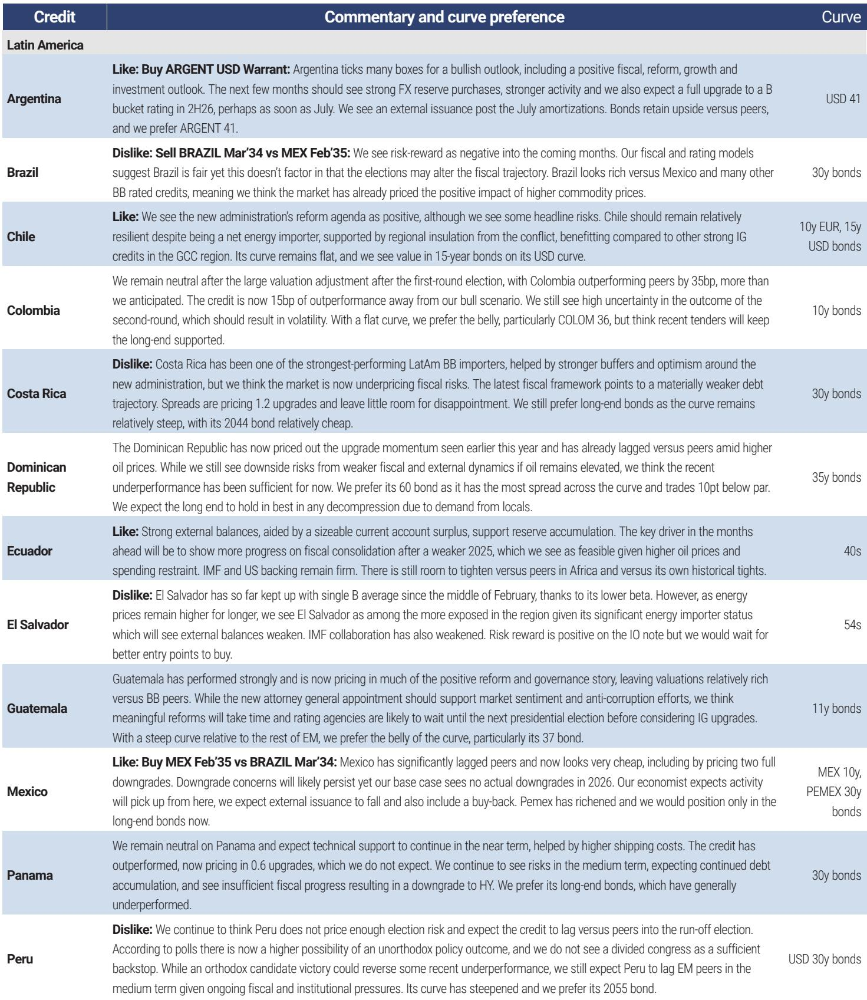
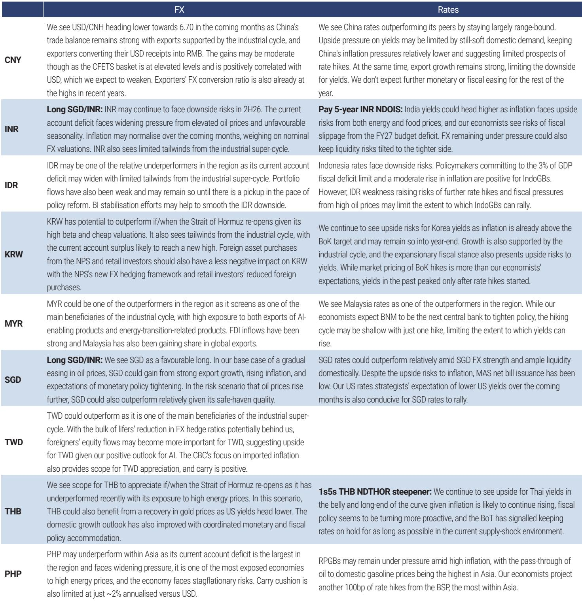
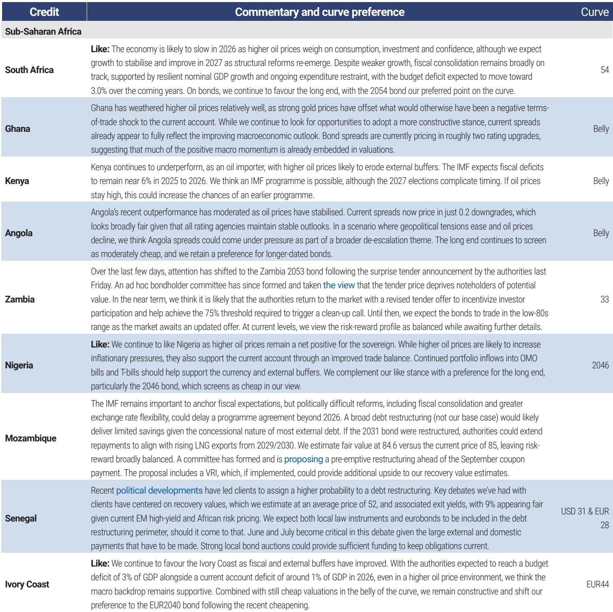

# 摩根斯坦利：新兴市场真正的风险不是基本面，而是融资货币的单一化

全球经济正在经历一个罕见的错位阶段。美国增长强劲、利率预期重新定价、美元走强，而新兴市场的基本面却在持续改善——通胀回落、政策信誉修复、经常账户结构优化。这两个方向同时成立，却让大多数投资者的框架出现了盲区。

摩根斯坦利最新发布的全球新兴市场策略报告《Finding Your Funder》，给出了一个反直觉的结论：市场对新兴市场的担忧方向错了。问题不在于是否应该持有新兴市场资产，而在于用什么货币来为这一头寸融资。

这份报告的核心判断是：新兴市场资产本身的吸引力并未减弱，但传统的美元融资方式正在成为最大的约束。如果投资者继续以美元作为唯一的融资货币，即使新兴市场基本面继续向好，回报也可能被汇率波动侵蚀。而选择正确的融资货币组合——尤其是以加元或G3篮子货币融资——可以在不牺牲收益的情况下显著降低波动。

这不是一个关于“买不买”的讨论，而是一个关于“怎么买”的结构性建议。在当前美元强势的背景下，这个视角可能比大多数宏观判断更具实操价值。

## 1. 美元走强并非新兴市场的终结信号，而是暴露了融资结构的脆弱性

报告开篇就点明了当前市场的核心矛盾。摩根斯坦利团队在5月发布的中期展望中，对新兴市场本地货币资产的基本面持建设性态度，客户也普遍认同两个判断：新兴市场基本面在改善，且全球投资者对新兴市场本地货币资产的配置仍有提升空间。

但分歧出现在宏观层面。美国强劲的就业数据推动利率重新定价，市场对美联储年内降息的预期持续降温，美元指数走强。许多客户认为，美国股市的超额表现和增长前景将继续支撑美元——至少在DXY层面如此。

摩根斯坦利并没有改变其对美元的看空立场，但报告承认，美元走强对新兴市场确实构成显著压力，尤其是考虑到大多数投资者以美元衡量回报。然而，报告的核心洞察在于：美元走强不意味着新兴市场没有价值，而是意味着传统的美元融资方式正在成为回报的拖累。

这里的逻辑值得拆解。新兴市场本地货币资产的回报由两部分组成：资产本身的收益率，以及融资货币的汇率变动。当美元走强时，即使新兴市场资产本身的收益率不变，美元融资者的实际回报也会被侵蚀。这不是新兴市场的问题，而是融资结构的问题。

## 2. 加元融资的历史表现揭示了一个被低估的选择：它在提升回报的同时降低了尾部风险

报告对过去16年的历史数据进行了系统回测，考察了不同融资货币对新兴市场多头头寸的回报特征。结果中最引人注目的单一货币是加元。

自2010年以来，以加元融资的新兴市场多头头寸实现了年化3.6%的总回报，波动率仅6.3%，夏普比率0.58。这一夏普比率接近所有篮子策略中最好的结果。更重要的是，加元融资策略的最大回撤仅为-12.3%，远低于美元融资的-28.8%、日元的-25.2%和瑞郎的-28.7%。

加元融资的最差3个月和最差12个月表现也优于其他单一货币，分别为约-8.2%和-8.4%。这表明加元融资在历史上提供了更均衡的风险收益特征：它在提升回报的同时，没有引入日元或瑞郎那样的左尾风险。

报告指出，除最近一年外，加元融资在所有时间维度上都产生了高于其他单一货币的夏普比率。这一结论在3年和5年的子样本中同样成立，说明加元的优势并非仅仅受益于2010-2022年的美元牛市。

加元的这种特性可以从其经济结构找到解释。作为商品货币，加元与全球增长周期高度相关，但又与美国经济深度绑定。这种双重属性使其在新兴市场多头头寸中既提供了增长敞口，又保持了相对的稳定性。对于无法或不愿构建复杂货币篮子的投资者，加元可能是一个值得认真考虑的替代方案。

## 3. 篮子策略的历史回测证明：分散化融资不是理论，而是持续有效的风险管理工具

如果说加元是单一货币中的佼佼者，那么篮子策略就是整体框架中最稳健的选择。

报告测试了三种篮子策略：所有货币等权篮子、非美元货币等权篮子、以及G3篮子（美元、欧元、日元）。结果显示，自2010年以来的完整样本中，所有三种篮子策略都产生了显著高于美元融资的夏普比率，且最大回撤大幅降低。

以G3篮子为例，其年化总回报为3.7%，波动率6.8%，夏普比率0.54，最大回撤仅-13.6%。相比之下，美元融资的夏普比率仅为0.26，最大回撤高达-28.8%。

关键的是，这一优势在5年和3年的子样本中持续存在。这意味着篮子策略的有效性并非偶然，也不是某个特定市场环境的产物。即使在2023-2025年美元相对强势的阶段，篮子融资仍然提供了更好的风险调整后回报。

报告谨慎地指出，这些回测未考虑交易成本，而篮子策略的执行成本确实可能高于单一货币。但即便如此，从风险管理角度看，分散化融资提供的尾部保护仍然具有显著价值。对于大型机构投资者而言，这些执行成本相对于尾部风险的降低而言，是可以接受的代价。

## 4. 报告尚未完全回答的关键问题：篮子策略的最优权重和动态调整机制

尽管篮子策略在历史回测中表现优异，但报告留下了一个重要问题：篮子权重应该如何设定？

目前报告使用的是等权策略，这虽然简单透明，但在实际操作中可能不是最优解。不同货币在不同宏观环境下的融资效率差异显著。例如，在风险偏好高涨时，商品货币可能更有效；而在避险情绪升温时，日元和瑞郎反而可能成为拖累。

报告没有深入探讨动态权重调整的可能性。一个更成熟的框架可能需要根据宏观经济状态、利率差异、风险偏好等指标，动态调整篮子中不同货币的权重。这种动态策略在理论上可能进一步提升夏普比率，但也引入了更复杂的执行问题和过拟合风险。

此外，报告对加元的分析虽然令人印象深刻，但没有充分解释加元在过去16年中表现优异的驱动因素是否可持续。如果加元的表现部分依赖于全球商品超级周期或美国经济的特定结构，那么未来环境变化可能导致其优势减弱。这是一个需要投资者自行判断的问题。

## 5. 对投资者的实操框架：如何将融资货币选择纳入新兴市场配置决策

基于报告的发现，投资者可以建立一个三层决策框架来优化新兴市场配置：

第一层：确认新兴市场基本面是否支持配置。报告明确指出，新兴市场整体的货币政策信誉和财政纪律在改善，亚洲以外的地区尤为明显。这是配置的前提条件。如果基本面不支持，融资货币的选择就没有意义。

第二层：评估美元前景。报告承认，短期内美元可能继续受到美国增长优势和利率预期的支撑。如果投资者对美元持中性或看空观点，那么美元融资的吸引力会有所提升；但如果是看多美元，那么转向非美元融资或篮子融资就更加迫切。

第三层：选择融资货币。对于无法执行复杂篮子策略的投资者，加元是一个值得优先考虑的单货币选项，因其在回报和风险之间提供了较好的平衡。对于有能力执行多货币策略的机构，G3篮子或非美元篮子提供了更稳健的风险调整后回报。

报告还提供了一个值得注意的观察：欧元融资在今年以来的表现尤为突出，年化回报9%，波动率仅4%，夏普比率高达2.5。但报告也指出，欧元融资的有效性可能部分受益于今年特定的宏观环境，其可持续性需要进一步观察。

最终，这个框架指向一个更根本的认知转变：新兴市场投资不再是一个简单的“买或不买”的二元决策，而是一个包含资产选择、货币融资和风险管理三个维度的综合策略。融资货币的选择，可能比资产选择本身更能决定最终回报。

---

报告中对印度资本流动的数据也提供了有价值的补充视角。数据显示，印度债券市场的海外投资流在经历了年初的波动后趋于稳定，但股票市场持续面临外资流出压力。这一分化值得关注，但受限于篇幅，此处不再展开。

关于篮子策略的动态权重优化、加元优势的可持续性、以及不同新兴市场地区在融资货币选择上的差异化策略，这些报告未完全展开的问题，恰恰是深入理解这份报告价值的关键。欢迎来知识星球的微信群中继续讨论这些未尽议题，我们会在群内分享更多来自原始报告的数据图表和延伸分析。

Personal reading notes and learning share only. Not investment advice.

