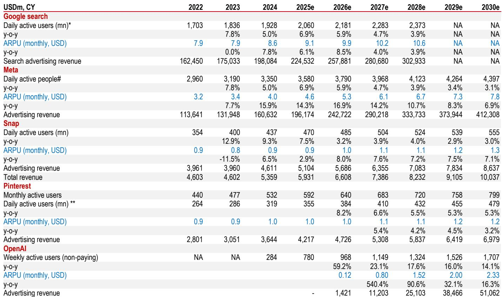
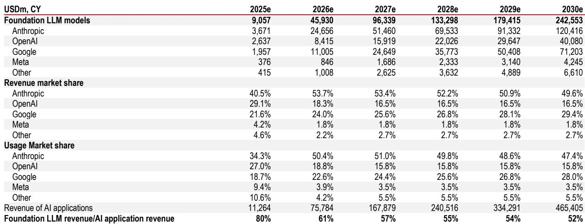
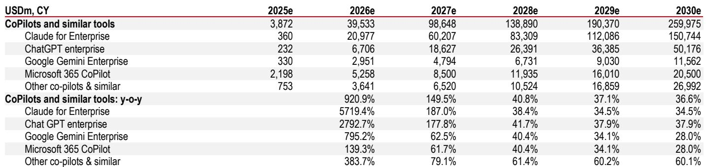

# The AI Industry’s Center of Gravity Has Shifted from Consumer to Enterprise, Reshaping the Competitive Landscape Through 2030

The artificial intelligence industry is undergoing a structural transformation that many investors have yet to fully price in. Over the past six months, the market’s center of gravity has shifted decisively from consumer chatbots to enterprise applications, and this rebalancing carries profound implications for revenue forecasts, competitive dynamics, and capital allocation strategies. The B2B segment is accelerating far faster than most models anticipated, while the B2C side is showing signs of maturation that suggest the era of explosive consumer growth may be giving way to a more complex monetization environment.

According to updated industry revenue forecasts, the total addressable market for AI through 2026-2030 has been revised upward by 38%, a significant increase driven almost entirely by a 74% upward revision in B2B revenue expectations. Meanwhile, B2C revenue forecasts have been cut by 20% over the same period. This is not a marginal adjustment; it is a reordering of the industry’s fundamental growth architecture. The implications extend well beyond revenue numbers to questions about which companies will survive the coming oligopoly, how capital will be deployed, and where the real value creation will occur.

The timing of this shift matters. We are now roughly three and a half years past the launch of ChatGPT, and the industry is entering a phase where early leadership positions are being tested, new competitors are emerging, and the economics of scale are creating barriers that only a handful of players can surmount. The narrative that AI would be a winner-take-most market is giving way to a more nuanced reality: the winners will be determined not by consumer brand recognition but by enterprise integration, coding tool capabilities, and the ability to navigate a capital-intensive sunk-cost economy.

This article synthesizes the latest industry forecasts, examines the strategic logic behind the B2B acceleration, and identifies the open questions that will define the next phase of competition. For serious investors and strategists, understanding this shift is not optional; it is the prerequisite for any informed position in AI-related equities.

## The B2B AI Market Is Surging Because Agentic AI and Coding Tools Have Unlocked Real Enterprise Value, Not Because of Hype

The 74% upward revision in B2B revenue forecasts for 2026-2030 is not a speculative adjustment. It reflects concrete developments in how enterprises are deploying AI. Two use cases are driving the acceleration: agentic AI and coding tools. Agentic AI refers to systems that can autonomously execute multi-step tasks, make decisions within defined parameters, and integrate with existing enterprise workflows. This is fundamentally different from the chatbot paradigm, where a user asks a question and receives a response. Agentic AI transforms AI from a productivity aid into an operational engine.

Coding tools, meanwhile, have progressed faster than most analysts anticipated. The ability of AI to generate, review, and debug code at scale has moved from experimental to production-ready in many organizations. This is not a future promise; it is happening now. Companies that have deployed AI-assisted coding report significant reductions in development cycles and error rates, creating a clear ROI case that justifies continued investment.

The competitive dynamics within B2B are also clarifying. One company has emerged as the clear leader in enterprise AI, with an annualized revenue run rate that has surged from approximately USD 9 billion at the end of 2025 to an estimated USD 47 billion by May 2026. This trajectory is remarkable not just for its speed but for what it signals about enterprise preferences. Businesses are voting with their budgets for models that prioritize reliability, integration, and task completion over general intelligence or brand recognition.

The former consumer leader, by contrast, has seen its B2B position become more contested. While it remains a serious contender alongside other major platforms, its enterprise revenue growth has been slower, and its overall annualized revenue run rate may have only recently crossed the USD 30 billion mark across both B2B and B2C. This gap is not trivial; it suggests that the enterprise market is rewarding specialization and focus over first-mover advantage.

For investors, the so-what is clear: the B2B AI market is not a derivative of the consumer market. It has its own drivers, its own competitive logic, and its own capital requirements. Companies that treat enterprise AI as an extension of their consumer business risk being outmaneuvered by pure-play enterprise specialists.

## Consumer AI Monetization Is Proving More Difficult Than Expected, and the Revenue Implications Are Material

The 20% downward revision in B2C revenue forecasts for 2026-2030 is driven by two interrelated factors: weaker-than-expected user growth at the market leader and a more complex monetization environment than initial models assumed. These are not temporary headwinds; they reflect structural features of the consumer AI market that are unlikely to reverse quickly.

User growth for consumer chatbots has moderated as competitors have gained share. The pioneer’s early lead in brand recognition and user base has not translated into a sustainable growth advantage. New entrants have attracted users with different feature sets, pricing models, or integration capabilities, fragmenting the market in ways that make it harder for any single player to achieve dominant scale.

More importantly, the monetization of consumer AI usage is proving less straightforward than early forecasts anticipated. The introduction of lower-priced subscription tiers has led to a migration of users from premium plans to basic ones, diluting average revenue per user. This is a classic freemium-to-premium conversion challenge, but with an added twist: the cost of serving each user remains high due to compute requirements, compressing margins even as revenue grows.

Advertising revenue, which some had hoped would supplement subscription income, has also not materialized at the scale needed to offset the ARPU dilution. The consumer AI business model, in other words, is under pressure from both the revenue side and the cost side. This is not a death knell for the consumer segment, but it does suggest that the growth trajectory will be slower and less profitable than the bullish scenarios envisioned.

The strategic implication is that consumer AI companies may need to pivot toward higher-value use cases, such as professional productivity tools or niche vertical applications, rather than relying on mass-market chatbot subscriptions. The days of assuming that every consumer will pay for a general-purpose AI assistant are over.

## The Western AI Market Is Converging Toward an Oligopoly Driven by the Economics of Compute, and This Changes the Risk-Reward Calculus

One of the most important structural insights from the updated forecasts is that the Western AI market is shaping into an oligopoly. This is not a prediction; it is an observation based on the economics of the industry. The cost of compute, measured in billions to trillions of dollars and in megawatts to gigawatts of power, has created a barrier to entry that only a handful of well-capitalized players can surmount.

This is a sunk-cost economy. The initial investment in training frontier models is enormous, and the ongoing costs of inference at scale are equally significant. Scaling laws dictate that more compute leads to smarter models, which attract more users, which generate more revenue, which funds more compute. This virtuous cycle creates a self-reinforcing advantage for the largest players, but it also means that falling behind in the compute race can be fatal.

The oligopoly structure increases the probability that the surviving players will achieve long-term returns on invested capital above their cost of capital. In a more fragmented market, competitive pressures would erode margins and make it difficult to recoup sunk costs. In an oligopoly, pricing power improves, and the survivors can earn economic profits. This is the bull case for the leading AI companies, but it comes with a caveat: the path to the oligopoly is brutal, and many well-funded competitors will not make it.

The Asian AI market, by contrast, is evolving differently. Chinese companies, including both large tech giants and independent labs, are pursuing a more fragmented and cost-optimized approach. Their models tend to be smaller, trained on lower budgets, and more focused on specific use cases. This reflects both different capital constraints and different strategic priorities. The Western oligopoly model is not necessarily replicable in Asia, and the two regions may develop along parallel but distinct trajectories.

For global investors, this means that the AI opportunity is not monolithic. The Western market offers a high-concentration, high-return potential if you pick the right survivors. The Asian market offers a more fragmented, lower-margin but potentially faster-adoption opportunity. The two require different analytical frameworks and different risk appetites.

## The Funding Gap for the Former Consumer Leader Has Been Halved, but the Remaining Gap Raises Unanswered Questions About Capital Structure and Exit Pathways

One of the most striking updates in the revised forecasts is the reduction in the estimated funding gap for the former consumer leader through 2030. The gap has been cut from USD 154 billion to USD 77 billion, driven by three factors: a lower projected free cash flow deficit, an incremental equity raise, and an increase in the value of shares that could be sold upon vesting.

The lower free cash flow deficit reflects the updated revenue forecasts, which, despite the cut in B2C expectations, still show a higher total revenue trajectory than previously modeled. The equity raise of USD 122 billion, which included an additional USD 12 billion from financial institutions beyond the initial round, provides a meaningful capital cushion. And the appreciation in the value of a major chip manufacturer’s shares has added USD 8 billion to the potential proceeds from share sales.

Yet USD 77 billion is still a large number. It represents the amount of capital that will need to be raised or generated through operations over the next five years to sustain the company’s trajectory. The options for closing this gap include an initial public offering, which a major competitor has already filed for, or another private funding round. Both options are viable, but they come with trade-offs. An IPO would provide access to public market capital but would also subject the company to quarterly scrutiny and potentially limit strategic flexibility. Another private round would preserve control but could dilute existing shareholders further.

The open question is whether the market will support the valuations needed to close this gap. The competitor that has filed for an IPO is doing so at a time when its revenue trajectory is accelerating, which could set a benchmark for the sector. If that IPO is successful, it could open the door for other companies to follow. If it falters, the funding gap for the former leader becomes more acute.

Investors should also consider the possibility that the funding gap could widen again if B2B revenue growth slows or if compute costs rise faster than anticipated. The USD 77 billion estimate is based on current trends and assumptions, but the AI industry is moving fast, and surprises are the norm.

## A Decision Framework for Investors: Four Questions to Determine Which AI Companies Will Survive and Thrive

Given the structural shifts described above, investors need a framework for evaluating AI companies that goes beyond revenue multiples or user growth metrics. Based on the updated industry forecasts, four questions emerge as critical differentiators.

First, what is the company’s exposure to B2B versus B2C revenue? The B2B market is growing at a much faster rate and has clearer monetization paths. Companies with dominant B2B revenue are better positioned than those relying on consumer subscriptions. The gap in growth rates is not marginal; it is structural, and it will compound over time.

Second, does the company have a credible path to achieving scale in compute without diluting shareholders excessively? The sunk-cost economy means that compute is both a barrier to entry and a source of competitive advantage. Companies that can secure compute at favorable terms, through strategic partnerships or vertical integration, have an edge. Those that must raise capital repeatedly to fund compute costs face a higher risk of dilution or strategic constraints.

Third, is the company’s model architecture optimized for enterprise integration or for general intelligence? The B2B market is rewarding models that can be deeply embedded into enterprise workflows, that can execute multi-step tasks reliably, and that can be customized for specific industries. The race to artificial general intelligence, while exciting, may not be the most commercially relevant objective for the next five years. Companies that prioritize enterprise use cases over AGI may generate more near-term revenue and profitability.

Fourth, what is the company’s capital structure and funding runway? The funding gap analysis for the former consumer leader shows that even well-capitalized companies face significant capital needs. Investors should evaluate whether a company has a realistic plan to achieve cash flow positivity or access to capital markets before its current runway runs out. The ability to raise capital at favorable terms is itself a competitive advantage in this industry.

These four questions do not provide easy answers, but they provide a structured way to evaluate the trade-offs that each AI company faces. The companies that score well on all four dimensions are the most likely to survive the coming consolidation and emerge as long-term winners.

## The Full Report Contains the Data and Charts That Underpin These Insights, and the Community Is the Best Place to Access Them

The analysis presented here is based on the latest industry revenue forecasts, competitive assessments, and funding gap calculations. But the full picture requires access to the original data, charts, and detailed breakdowns by segment and company. The revenue tables, the competitive trajectory charts, and the funding gap waterfall are essential tools for any investor who wants to form an independent view.

Join the community to read the full report and review the original charts. The community provides access to the complete research, including the year-by-year revenue forecasts, the competitive positioning analysis, and the detailed funding gap calculations. It also offers a forum for discussion and debate with other serious investors and industry participants.

The AI industry is at an inflection point. The shift from consumer to enterprise, the emergence of an oligopoly structure, and the capital intensity of the business model all demand a more sophisticated analytical approach. The full report provides the foundation for that analysis.

*This article is for learning and discussion only and does not constitute investment advice.*

Personal reading notes and learning share only. Not investment advice.

