This material is neither intended to be distributed to Mainland China investors nor to provide securities investment consultancy services within the territory of Mainland China. This material or any portion hereof may not be reprinted, sold or redistributed without the written consent of JPM.

# China Auto Industry

We turn more positive after visiting London and Paris

We turn more optimistic on Chinese OEMs' overseas expansion, particularly in Europe, following our annual European Auto Conference last week (here), where we took the opportunity to visit BYD stores in London and Paris. To reflect our positive stance, we raise our 2026 overseas sales forecasts for BYD/Geely by \~15%/30%. Key strategic highlights below:

- Europe: Mixed-propulsion transition market: Chinese OEMs are shifting from single-powertrain exports to balanced portfolios (BEV+PHEV/HEV) plus brand ladders (e.g., BYD to Denza) and tech stories. Our store checks show robust PHEV demand alongside “value-for-money” BEV wins.  
- Retail execution moat: Channels + after-sales + residual value: BYD emphasizes dense dealership/store coverage and high test-drive conversion (\~50%); Chinese OEMs stress after-sales depth to build trust, residual value and monthly payment competitiveness, aiming to avoid pure price competition. Foreign brands face pressure as Chinese cars bundle high feature content as standard vs. options-heavy incumbents. Chinese OEMs reached an 18% share in Europe's NEV segment in Apr-26, tripled from the same time last year.  
- Charging/ecosystem as differentiator (not just the car): BYD is using flash/ultra-fast charging rollout as part of the value proposition, targeting 3,000 flash-charging posts in Europe by end-2026. We believe execution will be key to boosting conversion and reducing buyer friction, helping defend residuals and compete on total ownership experience, rather than sticker price.  
- Export tailwinds are structural: China's export mix is shifting rapidly toward NEVs (NEVs $>50\%$ of PV exports; PHEV share rising within NEVs), supporting overseas revenue/margin upside. BYD focuses on vertical integration, while Geely is more partnership/KD "asset-light." We see localization as critical to mitigating tariff/regulatory risk. Meanwhile, European OEMs will aim to compete via an "in China, for global" strategy, including exporting select models from China and leveraging the cost-competitive Chinese supply chain to the global supply network.  
- Our BYD store visits at Canary Wharf and the Champs-Élysées: Staff at both stores reported strong demand for PHEVs. We learned about: (1) the launch of the Denza flash charging model in the EU/UK; and (2) wait times of about two to three months for most BYD models in France.

Equity Ratings and Price Targets

<table><tr><td rowspan="2">Company</td><td rowspan="2">Ticker</td><td rowspan="2">Mkt Cap ($ mn)</td><td rowspan="2">Price CCY</td><td rowspan="2">Price</td><td colspan="2">Rating</td><td colspan="4">Price Target</td></tr><tr><td>Cur</td><td>Prev</td><td>Cur</td><td>End Date</td><td>Prev</td><td>End Date</td></tr><tr><td>BYD Company Limited - H</td><td>1211 HK</td><td>91,987</td><td>HKD</td><td>88.05</td><td>OW</td><td>n/c</td><td>124.00</td><td>Dec-26</td><td>120.00</td><td>n/c</td></tr><tr><td>BYD Company Limited - A</td><td>002594 CH</td><td>109,946</td><td>CNY</td><td>91.19</td><td>OW</td><td>n/c</td><td>124.00</td><td>Dec-26</td><td>120.00</td><td>n/c</td></tr><tr><td>Geely Automobile Holdings Ltd. (0175)</td><td>175 HK</td><td>21,235</td><td>HKD</td><td>18.17</td><td>OW</td><td>n/c</td><td>29.00</td><td>Dec-26</td><td>28.00</td><td>n/c</td></tr></table>

Source: Company data, Bloomberg Finance L.P., JPM estimates. n/c = no change. All prices as of 08 Jun 26.

## China

## Head of APAC Auto Research

Nick Lai AC

(65) 6801-3176

nick.yc.lai@JPM.com

JPM Securities Singapore Private

Limited/ JPM Securities (Asia Pacific)

Limited/ JPM Broking (Hong Kong)

Limited

## Jiajie Shen, CFA

(86-21) 6106 6352

jiajie.shen@jpmchase.com

SAC Registration Number: S1730520030006

JPM Securities (China) Company

Limited

## Cathy Liu

(852) 2800-8629

cathy.xiao.liu@JPM.com

JPM Securities (Asia Pacific) Limited/

JPM Broking (Hong Kong) Limited

# Four strategic highlights from our store visits, Asia auto tour and European Auto Conference

We visited BYD stores in London and Paris along with our annual European Auto Conference in London last week (note). Our recent annual Asia auto tour along with JPM's China summit yielded similar observations (note). We highlight collective strategic takeaways below. Further, to reflect our positive view on Chinese OEMs' expansion in overseas markets, we lift our 2026 overseas sales estimates for BYD and Geely by \~15% and \~30%, respectively.

Chinese OEMs' market share gains are noticeable not only in Europe (note), but also in other parts of the world, such as Southeast Asia (note) and Latin America. For example, the latest data from Europe (including Eastern and Western Europe) suggest that Chinese OEMs' market share in the NEV space (where Chinese brands are very competitive vs. foreign brands) topped $18\%$ in April, more than tripling from $5\%$ during the same time last year.

Figure 1: Chinese OEMs' annual market share in the NEV space in Europe  
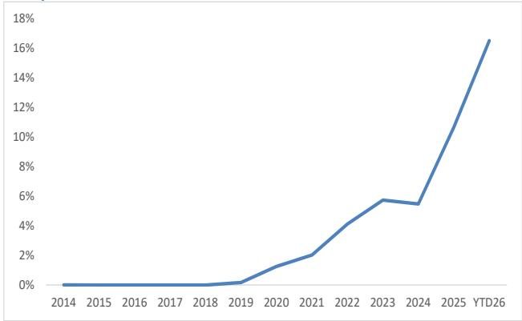

line chart

| Year | Value (%) |
|---|---|
| 2014 | 0 |
| 2015 | 0 |
| 2016 | 0 |
| 2017 | 0 |
| 2018 | 0 |
| 2019 | 0.3 |
| 2020 | 1.5 |
| 2021 | 2.1 |
| 2022 | 4.2 |
| 2023 | 5.8 |
| 2024 | 5.5 |
| YTD26 | 16.5 |

Source: Bloomberg Finance L.P., JATO Dynamics.

Figure 3: BYD market share in Europe's NEV market (8% in Apr-26)  
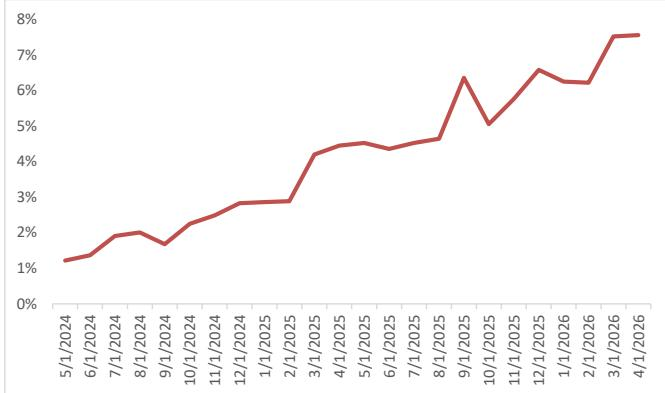

line chart

| Date | Value (%) |
|---|---|
| 5/1/2024 | 1.2 |
| 6/1/2024 | 1.4 |
| 7/1/2024 | 1.9 |
| 8/1/2024 | 1.9 |
| 9/1/2024 | 1.6 |
| 10/1/2024 | 2.3 |
| 11/1/2024 | 2.6 |
| 12/1/2024 | 2.8 |
| 1/1/2025 | 2.8 |
| 2/1/2025 | 3.0 |
| 3/1/2025 | 4.3 |
| 4/1/2025 | 4.5 |
| 5/1/2025 | 4.5 |
| 6/1/2025 | 4.4 |
| 7/1/2025 | 4.5 |
| 8/1/2025 | 4.7 |
| 9/1/2025 | 6.3 |
| 10/1/2025 | 5.1 |
| 11/1/2025 | 5.8 |
| 12/1/2025 | 6.6 |
| 1/1/2026 | 6.3 |
| 2/1/2026 | 6.3 |
| 3/1/2026 | 7.5 |
| 4/1/2026 | 7.6 |

Source: Bloomberg Finance L.P., JATO Dynamics.

Figure 2: Chinese OEMs' monthly market share in the NEV space in Europe  
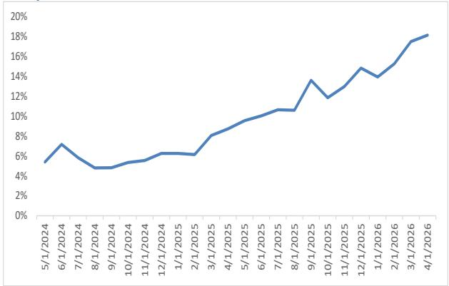

line chart

| Date | Value (%) |
|---|---|
| 5/1/2024 | 5.3 |
| 6/1/2024 | 7.1 |
| 7/1/2024 | 5.8 |
| 8/1/2024 | 4.9 |
| 9/1/2024 | 5.0 |
| 10/1/2024 | 5.5 |
| 11/1/2024 | 5.8 |
| 12/1/2024 | 6.2 |
| 1/1/2025 | 6.1 |
| 2/1/2025 | 6.1 |
| 3/1/2025 | 8.0 |
| 4/1/2025 | 9.0 |
| 5/1/2025 | 9.8 |
| 6/1/2025 | 10.3 |
| 7/1/2025 | 10.7 |
| 8/1/2025 | 10.8 |
| 9/1/2025 | 13.6 |
| 10/1/2025 | 11.8 |
| 11/1/2025 | 13.3 |
| 12/1/2025 | 14.9 |
| 1/1/2026 | 13.8 |
| 2/1/2026 | 15.6 |
| 3/1/2026 | 17.8 |
| 4/1/2026 | 18.3 |

Source: Bloomberg Finance L.P., JATO Dynamics.

Figure 4: MG (under SAIC) market share in Europe's NEV market (2% by Apr-26)  
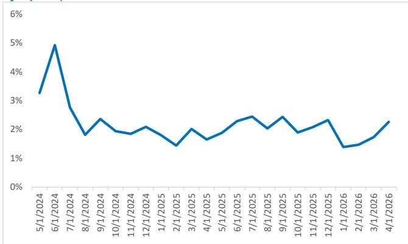

line chart

| Date | Value (%) |
|---|---|
| 5/1/2024 | 3.2 |
| 6/1/2024 | 4.9 |
| 7/1/2024 | 2.8 |
| 8/1/2024 | 1.8 |
| 9/1/2024 | 2.4 |
| 10/1/2024 | 1.9 |
| 11/1/2024 | 1.8 |
| 12/1/2024 | 2.1 |
| 1/1/2025 | 1.7 |
| 2/1/2025 | 1.4 |
| 3/1/2025 | 2.0 |
| 4/1/2025 | 1.6 |
| 5/1/2025 | 1.8 |
| 6/1/2025 | 2.4 |
| 7/1/2025 | 2.5 |
| 8/1/2025 | 2.0 |
| 9/1/2025 | 2.5 |
| 10/1/2025 | 1.9 |
| 11/1/2025 | 2.2 |
| 12/1/2025 | 2.4 |
| 1/1/2026 | 1.3 |
| 2/1/2026 | 1.5 |
| 3/1/2026 | 1.7 |
| 4/1/2026 | 2.3 |

Source: Bloomberg Finance L.P., JATO Dynamics.

## (1) Europe as a mixed-propulsion transition market: Chinese OEMs are winning by offering a portfolio (BEV + PHEV/HEV) plus a clear brand ladder (mainstream → premium), not a single “cheap BEV export” play

Chinese OEMs (e.g., BYD, Geely) are shifting their overseas strategies toward multi-powertrain portfolios and brand/tech storytelling, with Europe explicitly treated as a transition market, where PHEV demand matters alongside BEV.

Examples (store checks): BYD's Paris and London stores show strong PHEV traction (e.g., Seal U DMi highlighted by sales staff we met as a bestselling PHEV; a meaningful share of store orders are PHEV), while certain BEV models (e.g., Sealion 7) are positioned as “value for money” leaders with long wait times, especially at the Paris store, suggesting that demand exceeds supply in inventory.

Implications for overseas markets: We expect share gains to be driven less by “BEV-only price disruption” and more by a menu that matches local charging readiness and consumer needs, with PHEV acting as a commercialization bridge.

Foreign brands' strategy signal: Incumbents face a tougher value equation because Chinese models often bundle high-feature content as standard, e.g., Level 2 ADAS (vs. options-heavy German pricing), shifting competition toward content-per-euro and monthly payments (as opposed to MSRPs or sticker prices).

JPM view: We are surprised at the speed of overseas volume growth among Chinese brands, driven by competitive product offerings, multi-powertrain options and superior interior/content vs. foreign brands at similar price points. To reflect this positive moment, we raise our overseas volume estimates for BYD and Geely in our earnings models.

## (2) Go-to-market is becoming a retail execution game: Dense channels + after-sales credibility + residual value discipline (i.e., monthly payment competitiveness)

One key observation throughout our visits and meetings is that Chinese OEMs are emphasizing rapid channel buildout (stores/dealers), measurable conversion and deepening after-sales to build trust and residual value, explicitly linking this to monthly payment competitiveness, rather than sticker price warfare.

Examples: BYD's Europe expansion plan targets large physical scale (dealers/stores), and management messaging highlights rapid conversion ( $\sim 45 - 50\%$ ) into orders after test drives and solid demand (especially considering supply tightness in Europe, such as at the Paris store we visited).

Overseas market implications: The winning playbook looks closer to “fast retail rollout + service credibility” than to traditional export-only distribution, raising the bar for incumbents that may be slower to reconfigure dealer economics and inventory strategy.

Foreign brands' strategy response: Foreign OEMs are already adjusting, e.g., German premium OEMs have been consolidating dealer networks in China and rightsizing production capacity in China, signaling a broader shift toward

profitability protection and structural resizing, rather than pure volume defense. Outside China, we notice select global OEMs' strategic shift from “in China, for China” previously to “in China, for global” now, meaning that global OEMs are bringing select China-made products to overseas markets and exploring leveraging cost-competitive Chinese suppliers to their global supply chain networks.

JPM view: Based on our store visits and discussions with management, we believe BYD's focus on residual value discipline (and avoiding price competition) is central to sustaining brand health and monthly-payment positioning as volumes scale.

## (3) The next moat is ecosystem + charging (flash/ultra-fast) paired with premium products – used to lift value propositions and reduce price pressure

We learned at our store visits and European auto conference that BYD is positioning charging infrastructure (including flash charging) as an ownership proposition and commercialization lever; management has stated a target of 3,000 flash-charging posts in Europe by end-2026, including 300 in the UK, and a premium-brand Denza launch in 2H26, which will be the first BYD offering with a “flash charging solution.”

What also surprised us was the Paris store sales staff's comment that there are meaningful orders for the newly launched Denza model and that wait times are now about six months, even though Denza has not been formally launched in Europe and buyers know only an initial indicative price of \~€115,000.

Overseas market implications: If executed, OEM-tied charging could reduce buyer friction (range/charging anxiety), support fleets and shift competition from price to total ownership experience, which is particularly important in Europe, where charging availability varies widely across geographies.

Foreign brands' strategy response: This development pressures incumbents to compete not just on vehicle specs, but also on ecosystem partnerships (charging access, software stacks, service plans), and to rethink what is bundled vs. optioned.

JPM view: We believe the charging rollout, if delivered at scale, could support conversion/acceptance and help BYD avoid pure price competition by strengthening the overall value proposition beyond sticker price.

## (4) The “overseas story” is structurally supported by export mix shifts (NEV/PHEV) and a push toward localization, but execution + policy risk is rising

We expect China PV exports to be increasingly NEV-led (NEVs reaching a majority share), with PHEV becoming a larger component of NEV exports, a pattern that may surprise overseas investors and aligns with Europe's transition-market reality.

Overseas market implications: As the mix shifts to higher-ASP electrified products, overseas could become disproportionately important to revenue/profit (vs. volume), which supports more aggressive investment in channels, charging and local footprints.

Localization divergence (BYD vs. Geely): We see strategic differences between OEMs, with BYD pursuing a more vertically integrated overseas footprint (plants outside China), while Geely leans more toward partnership/KD and “asset-light” pathways.

Foreign brands' strategy response (“in China, for global”): Global OEMs are trying to export China-made models and leverage China’s cost-competitive supply chain globally, an explicit attempt to turn China capabilities into an international countermeasure.

JPM view: Longer-term, we view Chinese OEMs' exports/share gains as structural, rather than cyclical. At the same time, Chinese OEMs' localization will be a decisive strategic variable to mitigate tariff/regulatory risk; examples include BYD's plants in Brazil and Hungary, Geely's partnerships with Porton in Malaysia and with Ford in Spain, Leapmotor's JV with Stellantis, and XPeng's alliance with Magna in Austria. Localized solutions should help potential geopolitical headwinds and tariff/non-tariff barriers facing Chinese brands in their overseas endeavors.

## Summary of our BYD store visits in Paris and London

## Paris store

- Bestselling BEV: Sealion 7 with an MSRP of \~€48,000 and a wait time of three  
to four months; monthly installment around €800 if buyers choose the leasing finance option.  
- Bestselling PHEV: Seal U DMI with a starting MSRP of €40,600 and monthly installments around €600-700. Wait time is around one month, where most buyers also consider Tesla Model Y.  
- Most buyers choose BYD for its value-for-money position: BYD offers many features as standard, e.g., 360 view, seat heating, ADAS level 2 vs. German models, where these features are mostly optional and customers need to pay.  
- What surprises us is BYD's introduction of premium-brand Denza Z9 GT, which will be equipped with the company's latest flash-charging solution (i.e., state of charge (SOC) only 9 minutes from $10\%$ to $97\%$ ). The initial indicative price is €115,000, according to sales staff at the store, with formal debut in 2H26.

Despite this, BYD has already received meaningful orders, so wait times are about six months. Most buyers compare the Z9 GT with the Porsche Taycan (starting MSRP \~€103,000). The store manager told us that BYD is starting to building ultra-fast charging stations in Southern France first.

- All in all, BYD sales staff told us that the company currently has 10 models available in the market, and its average order flow is split between around 50-60% PHEVs and the rest BEVs.  
- In terms of promotion, BYD offers around a 5-7% discount for most models. When asked why BYD needs to offer discounts, considering robust demand, sales staff told us it is a marketing practice, as customers like to receive some incentive before making a purchase decision.

## London store

- Similar to Paris, BYD recently introduced the highest-end Denza Z9 GT in the UK, with formal debut scheduled for 2H26. Sales staff told us that estimated starting MSRP would be £80k-85k, more expensive than the BMW i5 (starting at £68k) and the Benz EQE (from £69k). Denza will be equipped with BYD's latest flash-charging battery and solution.  
- BYD indicates that it plans to build 3,000 ultra-fast charging stations or posts in Europe by end-2026, of which 300 will be in the UK.  
- PHEV Seal U DMi is the bestselling model, with a starting MSRP of \~£40k or monthly installments around £420 if buyers choose the leasing finance option.  
- The Sealion 7 BEV SUV is BYD's top-selling BEV in the UK because of its value-for-money strategy. Starting MSRP is \~£60k, and the monthly installment is \~£610.

Figure 3: BYD store in Paris (the bestselling BEV, Sealion 7, at an MSRP of \~€48k or a monthly installment of \~€800 and three months' wait time  
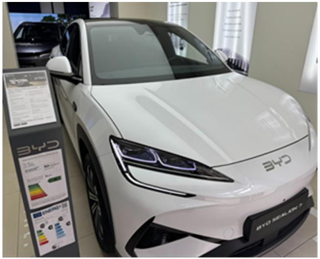

natural_image

Exterior view of a modern white BYD electric vehicle on display at an auto show, with no visible text or symbols on the vehicle itself.

Source: Photo taken by JPM at the BYD store.

Figure 4: BYD store in London  
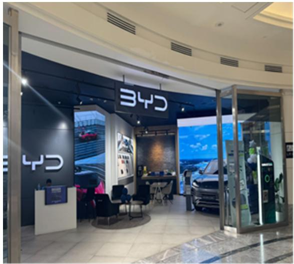

text_image

BYD
BYD

Source: Photo taken by JPM at the BYD store.

## Overweight

1211.HK,1211 HK

Price (08 Jun 26): HK\$88.05

▲ Price Target (Dec-26): HK\$124.00

Prior (Dec-26): HK\$120.00

China

Head of APAC Auto Research

Nick Lai AC

(65) 6801-3176

nick.yc.lai@JPM.com

JPM Securities Singapore Private Limited/ JPM Securities (Asia Pacific) Limited/ JPM Broking (Hong Kong) Limited

Key Changes (FYE Dec)

<table><tr><td></td><td>Prev</td><td>Cur</td><td> $\Delta$ </td></tr><tr><td>Adj. EPS - 26E (Rmb)</td><td>4.54</td><td>4.71</td><td>3.9%</td></tr><tr><td>Adj. EPS - 27E (Rmb)</td><td>5.86</td><td>6.05</td><td>3.2%</td></tr></table>

Style Exposure

<table><tr><td rowspan="2">Quant Factors</td><td rowspan="2">Current %Rank</td><td colspan="4">Hist %Rank (1=Top)</td></tr><tr><td>6M</td><td>1Y</td><td>3Y</td><td>5Y</td></tr><tr><td>Value</td><td>33</td><td>36</td><td>45</td><td>57</td><td>56</td></tr><tr><td>Growth</td><td>51</td><td>20</td><td>9</td><td>18</td><td>69</td></tr><tr><td>Momentum</td><td>75</td><td>97</td><td>3</td><td>26</td><td>24</td></tr><tr><td>Quality</td><td>42</td><td>29</td><td>25</td><td>63</td><td>83</td></tr><tr><td>Low Vol</td><td>68</td><td>59</td><td>56</td><td>79</td><td>94</td></tr><tr><td>ESGQ</td><td>1</td><td>28</td><td>26</td><td>1</td><td>6</td></tr></table>

Sources for: Style Exposure – JPM Global Markets Strategy; all other tables are company data and JPM estimates.

## BYD Company Limited - H

## Stronger-than-expected overseas demand

- Earnings estimate changes: We lift our 2026-27 earnings estimates by a moderate 3-4%, based on two assumption changes: (1) on the positive side, we lift our estimate of BYD's overseas sales volume by \~15%, to 1.75mn units from 1.5mn units, reflecting stronger-than-expected traction from recent Europe channel checks and our positive stance on Chinese OEM overseas expansion; and (2) on the flip side, we trim our domestic volume estimate to 3.4mn units from 3.5mn units to reflect our recent revision of the overall China auto market, where we expect domestic NEV demand to slip \~9% this year.  
- Long-term thesis #1: Overseas growth + mix as key earnings engine: We continue to see BYD's overseas expansion as a core driver, supported by a more balanced multi-powertrain portfolio (BEV + PHEV/HEV) and evidence of demand for both PHEVs and “value-for-money” BEVs in Europe (including indications of long wait times), suggesting traction beyond a “cheap BEV” narrative.  
- Long-term thesis #2: Retail execution moat (distribution, after-sales, residual value discipline): We believe BYD's emphasis on dense retail coverage, strong test-drive conversion and after-sales depth is becoming a competitive advantage, with management focus on protecting residual value and competing on monthly payment/total ownership experience, rather than pure sticker price competition.  
- Long-term thesis #3: Tech + ecosystem differentiation (charging, in-house ADAS chip and potentially humanoid robot business): BYD's strategy increasingly extends beyond the vehicle into ecosystem and technology differentiation – e.g., ultra-fast/flash charging rollout and premium brand laddering – and we see additional optionality from its advanced ADAS roadmap (including an in-house chip) and longer-dated potential from humanoid robotics initiatives.

Price Performance  
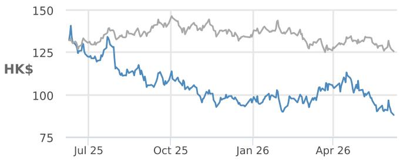

line chart

| Date   | Series 1 | Series 2 |
|--------|----------|----------|
| Jul 25 | 140      | 135      |
| Oct 25 | 110      | 145      |
| Jan 26 | 95       | 130      |
| Apr 26 | 105      | 125      |

— 1211.HK Price (HK\$) HSCEI (rebased)

<table><tr><td></td><td>YTD</td><td>1m</td><td>3m</td><td>12m</td></tr><tr><td>Abs</td><td>-7.7%</td><td>-11.7%</td><td>-7.0%</td><td>-34.4%</td></tr><tr><td>Rel</td><td>-1.3%</td><td>-5.6%</td><td>-3.7%</td><td>-29.5%</td></tr></table>

Company Data

<table><tr><td>Shares O/S (mn)</td><td>8,184</td></tr><tr><td>52-week range (HK$)</td><td>143.60-86.85</td></tr><tr><td>Market cap ($ mn)</td><td>91,987</td></tr><tr><td>Exchange rate</td><td>7.83</td></tr><tr><td>Free float (%)</td><td>100.0%</td></tr><tr><td>3M ADV (mn)</td><td>31.49</td></tr><tr><td>3M ADV ($ mn)</td><td>404.9</td></tr><tr><td>Volatility (90 Day)</td><td>44</td></tr><tr><td>Index</td><td>HSCEI</td></tr><tr><td>BBG ANR (Buy | Hold | Sell)</td><td>32|2|2</td></tr></table>

Key Metrics (FYE Dec)

<table><tr><td>Rmb in millions</td><td>FY25A</td><td>FY26E</td><td>FY27E</td><td>FY28E</td></tr><tr><td colspan="5">Financial Estimates</td></tr><tr><td>Revenue</td><td>803,965</td><td>921,249</td><td>988,874</td><td>1,057,691</td></tr><tr><td>Adj. EBIT</td><td>39,104</td><td>52,972</td><td>67,848</td><td>80,557</td></tr><tr><td>Adj. EBITDA</td><td>119,629</td><td>131,114</td><td>144,949</td><td>156,801</td></tr><tr><td>Adj. net income</td><td>37,039</td><td>42,548</td><td>54,599</td><td>64,790</td></tr><tr><td>Adj. EPS</td><td>4.10</td><td>4.71</td><td>6.05</td><td>7.18</td></tr><tr><td>BBG EPS</td><td>3.98</td><td>4.48</td><td>5.69</td><td>6.78</td></tr><tr><td>Cashflow from operations</td><td>59,136</td><td>257,153</td><td>168,906</td><td>218,809</td></tr><tr><td>FCFF</td><td>(97,672)</td><td>185,153</td><td>96,906</td><td>146,809</td></tr><tr><td colspan="5">Margins and Growth</td></tr><tr><td>Revenue Growth Y/Y (%)</td><td>3.5%</td><td>14.6%</td><td>7.3%</td><td>7.0%</td></tr><tr><td>EBIT margin</td><td>4.9%</td><td>5.8%</td><td>6.9%</td><td>7.6%</td></tr><tr><td>EBIT Growth Y/Y (%)</td><td>(23.2%)</td><td>35.5%</td><td>28.1%</td><td>18.7%</td></tr><tr><td>EBITDA margin</td><td>14.9%</td><td>14.2%</td><td>14.7%</td><td>14.8%</td></tr><tr><td>EBITDA Growth Y/Y (%)</td><td>1.6%</td><td>9.6%</td><td>10.6%</td><td>8.2%</td></tr><tr><td>Net margin</td><td>4.6%</td><td>4.6%</td><td>5.5%</td><td>6.1%</td></tr><tr><td>Adj. EPS growth</td><td>(19.8%)</td><td>14.9%</td><td>28.3%</td><td>18.7%</td></tr><tr><td colspan="5">Ratios</td></tr><tr><td>Adj. tax rate</td><td>13.6%</td><td>15.9%</td><td>16.0%</td><td>16.0%</td></tr><tr><td>Interest cover</td><td>-</td><td>-</td><td>-</td><td>-</td></tr><tr><td>Net debt/Equity</td><td>0.1</td><td>NM</td><td>NM</td><td>NM</td></tr><tr><td>Net debt/EBITDA</td><td>0.3</td><td>NM</td><td>NM</td><td>NM</td></tr><tr><td>ROE</td><td>17.2%</td><td>16.0%</td><td>17.6%</td><td>17.7%</td></tr><tr><td colspan="5">Valuation</td></tr><tr><td>FCFF yield</td><td>(14.2%)</td><td>26.9%</td><td>14.1%</td><td>21.3%</td></tr><tr><td>Dividend yield</td><td>1.7%</td><td>0.5%</td><td>0.6%</td><td>0.8%</td></tr><tr><td>EV/Revenue</td><td>0.4</td><td>0.1</td><td>0.0</td><td>NM</td></tr><tr><td>EV/EBITDA</td><td>2.6</td><td>1.0</td><td>0.3</td><td>NM</td></tr><tr><td>Adj. P/E</td><td>18.6</td><td>16.2</td><td>12.6</td><td>10.6</td></tr></table>

## Summary Investment Thesis and Valuation

With buyers increasingly focusing on ownership cost and the fact that more NEVs today are priced at similar levels as ICE cars in China (even before subsidy), we believe BYD will be able to deliver sustained volume in China and 57% or more growth outside China. Adding to this positive momentum are: (1) the recent introduction of BYD's ultra-fast charging strategy in the domestic market; and (2) production ramps across global factories from 2Q26, e.g., Hungary, Indonesia, Malaysia and Brazil. We rate the stock OW.

We set a Dec-26 PT of HK\$124 (vs. our previous Dec-26 PT of HK\$120) based on a blend of multiples and DCF valuation methodology. Our blended methodology implies a fair value for BYD-H of HK\$124. Our analysis suggests that BYD-H's long-term share price could range from HK\$94 to HK\$154, subject to market sentiment and risk appetite. Our PT is based on the median of the long-term fair value range.

Performance Drivers  
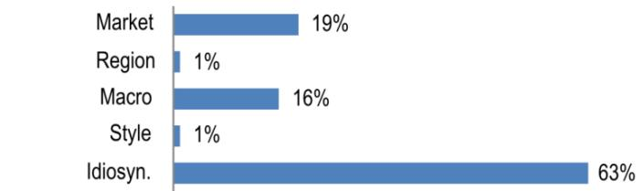

bar chart

| Category | Value (%) |
|---|---|
| Market | 19 |
| Region | 1 |
| Macro | 16 |
| Style | 1 |
| Idiosyn. | 63 |

<table><tr><td>Factors</td><td>6M Corr</td><td>1Y Corr</td></tr><tr><td>Market: MSCI Asia Pac ex JP</td><td>0.58</td><td>0.41</td></tr><tr><td>Region: China</td><td>0.12</td><td>0.18</td></tr><tr><td colspan="3">Macro:</td></tr><tr><td>Generic 1st &#x27;CO&#x27; Future</td><td>-0.17</td><td>-0.35</td></tr><tr><td>US 10 Year Yield</td><td>0.35</td><td>0.33</td></tr><tr><td>Citi Economic Surprise - EM</td><td>-0.23</td><td>-0.24</td></tr><tr><td colspan="3">Quant Styles:</td></tr><tr><td>LowVol</td><td>-0.23</td><td>-0.10</td></tr><tr><td>Growth</td><td>0.19</td><td>0.09</td></tr><tr><td>Momentum</td><td>0.03</td><td>0.08</td></tr></table>

Table 1: BYD estimate revisions

<table><tr><td rowspan="2">Rmb mn</td><td colspan="3">2026E</td><td colspan="3">2027E</td></tr><tr><td>Revised</td><td>Previous</td><td>Change</td><td>Revised</td><td>Previous</td><td>Change</td></tr><tr><td>Revenue</td><td>921,249</td><td>910,832</td><td>1%</td><td>988,874</td><td>977,904</td><td>1%</td></tr><tr><td>Sales growth (%)</td><td>15%</td><td>13%</td><td></td><td>7%</td><td>7%</td><td></td></tr><tr><td>COGS</td><td>751,798</td><td>744,618</td><td>1%</td><td>797,557</td><td>789,975</td><td>1%</td></tr><tr><td>Gross profit</td><td>169,451</td><td>166,214</td><td>2%</td><td>191,317</td><td>187,929</td><td>2%</td></tr><tr><td>Gross margin (%)</td><td>18%</td><td>18%</td><td></td><td>19.3%</td><td>19.2%</td><td></td></tr><tr><td>Operating profit</td><td>53,072</td><td>51,166</td><td>4%</td><td>67,948</td><td>65,885</td><td>3%</td></tr><tr><td>Operating margin (%)</td><td>6%</td><td>6%</td><td></td><td>6.9%</td><td>6.7%</td><td></td></tr><tr><td>Pretax profit</td><td>52,972</td><td>51,066</td><td>4%</td><td>67,848</td><td>65,785</td><td>3%</td></tr><tr><td>Tax rate</td><td>16%</td><td>16%</td><td></td><td>16%</td><td>16%</td><td></td></tr><tr><td>Net profit</td><td>42,548</td><td>40,966</td><td>4%</td><td>54,599</td><td>52,887</td><td>3%</td></tr><tr><td>Net margin (%)</td><td>5%</td><td>4%</td><td></td><td>5.5%</td><td>5.4%</td><td></td></tr><tr><td>Net profit growth (%)</td><td>30%</td><td>26%</td><td></td><td>28%</td><td>29%</td><td></td></tr><tr><td>EPS (basic) (Rmb)</td><td>4.7</td><td>4.5</td><td>4%</td><td>6.0</td><td>5.9</td><td>3%</td></tr></table>

Source: JPM estimates.

## Investment Thesis, Valuation and Risks

## BYD Company Limited - H (Overweight; Price Target: HK\$124.00)

## Investment Thesis

With buyers increasingly focusing on ownership cost and the fact that more NEVs today are priced at similar levels as ICE cars in China (even before subsidy), we believe BYD will be able to deliver sustained volume in China and 57% or more growth outside China. Adding to this positive momentum are: (1) the recent introduction of BYD's ultra-fast charging strategy in the domestic market; and (2) production ramps across global factories from 2Q26, e.g., Hungary, Indonesia, Malaysia and Brazil. We rate the stock OW.

## Valuation

We set a Dec-26 PT of HK\$124 based on a blend of multiples and DCF valuation methodology. Our blended methodology implies a fair value for BYD-H of HK\$124. Our analysis suggests that BYD-H's long-term share price could range from HK\$94 to HK\$154, subject to market sentiment and risk appetite. Our PT is based on the median of the long-term fair value range.

BYD long-term fair value assessment based on different FY30 multiples

<table><tr><td></td><td>2030E</td></tr><tr><td>Sales volume (units)</td><td>7,000,000</td></tr><tr><td>Domestic</td><td>3,670,293</td></tr><tr><td>Overseas</td><td>3,329,707</td></tr><tr><td>NP per unit (Rmb)</td><td></td></tr><tr><td>Domestic</td><td>6,000</td></tr><tr><td>Overseas</td><td>20,000</td></tr><tr><td>Total net profit (Rmb mn)</td><td>88,616</td></tr><tr><td>2030E P/E</td><td>8x</td></tr><tr><td>Implied equity value (Rmb mn)</td><td>708,927</td></tr><tr><td>Implied value/share (Rmb)</td><td>81</td></tr><tr><td>Implied value/share (HK$)</td><td>94</td></tr><tr><td>2030E P/E</td><td>10x</td></tr><tr><td>Implied equity value (Rmb mn)</td><td>886,159</td></tr><tr><td>Implied value/share (Rmb)</td><td>102</td></tr><tr><td>Implied value/share (HK$)</td><td>117</td></tr></table>

Source: JPM estimates.

BYD long-term PT assessment based on DCF analysis

<table><tr><td>Rmb mn</td><td>2026E</td><td>2027E</td><td>2028E</td><td>2029E</td><td>2030E</td><td>2031E</td><td>2032E</td><td>2033E</td><td>2034E</td><td>2035E</td></tr><tr><td>Operating cash flow</td><td>257,153</td><td>168,906</td><td>211,133</td><td>263,916</td><td>303,503</td><td>318,678</td><td>334,612</td><td>351,343</td><td>368,910</td><td>387,355</td></tr><tr><td>Less: Capex</td><td>(72,000)</td><td>(70,000)</td><td>(70,000)</td><td>(70,000)</td><td>(70,000)</td><td>(60,000)</td><td>(60,000)</td><td>(60,000)</td><td>(60,000)</td><td>(60,000)</td></tr><tr><td>FCFF</td><td>185,153</td><td>98,906</td><td>141,133</td><td>193,916</td><td>233,503</td><td>258,678</td><td>274,612</td><td>291,343</td><td>308,910</td><td>327,355</td></tr><tr><td>PV of FCFF</td><td></td><td>86,005</td><td>106,717</td><td>127,503</td><td>133,506</td><td>128,609</td><td>118,722</td><td>109,527</td><td>100,983</td><td>93,055</td></tr><tr><td>WACC</td><td>15%</td><td></td><td></td><td></td><td></td><td></td><td></td><td></td><td></td><td></td></tr><tr><td>Long-term growth rate</td><td>2%</td><td></td><td></td><td></td><td></td><td></td><td></td><td></td><td></td><td></td></tr><tr><td>PV of FCFFs</td><td>1,004,627</td><td></td><td></td><td></td><td></td><td></td><td></td><td></td><td></td><td></td></tr><tr><td>PV of terminal value</td><td>233,998</td><td></td><td></td><td></td><td></td><td></td><td></td><td></td><td></td><td></td></tr><tr><td>Enterprise value</td><td>1,238,625</td><td></td><td></td><td></td><td></td><td></td><td></td><td></td><td></td><td></td></tr><tr><td>Net debt</td><td>35,075</td><td></td><td></td><td></td><td></td><td></td><td></td><td></td><td></td><td></td></tr><tr><td>Equity value</td><td>1,203,550</td><td></td><td></td><td></td><td></td><td></td><td></td><td></td><td></td><td></td></tr><tr><td>No. of shares (mn)</td><td>9,026</td><td></td><td></td><td></td><td></td><td></td><td></td><td></td><td></td><td></td></tr><tr><td>Implied value/share (Rmb)</td><td>133</td><td></td><td></td><td></td><td></td><td></td><td></td><td></td><td></td><td></td></tr><tr><td>Implied value/share (HK$)</td><td>154</td><td></td><td></td><td></td><td></td><td></td><td></td><td></td><td></td><td></td></tr></table>

Source: JPM estimates.

## Risks to Rating and Price Target

Downside risks include worse-than-expected sales and industry competition from Chinese and foreign mass-market brands, such as Volkswagen, Geely and Great Wall Motor.

BYD Company Limited - H: Summary of Financials

<table><tr><td>Income Statement</td><td>FY24A</td><td>FY25A</td><td>FY26E</td><td>FY27E</td><td>FY28E</td></tr><tr><td>Revenue</td><td>777,102</td><td>803,965</td><td>921,249</td><td>988,874</td><td>1,057,691</td></tr><tr><td>COGS</td><td>(626,047)</td><td>(661,305)</td><td>(751,798)</td><td>(797,557)</td><td>(845,205)</td></tr><tr><td>Gross profit</td><td>151,056</td><td>142,660</td><td>169,451</td><td>191,317</td><td>212,486</td></tr><tr><td>SG&amp;A</td><td>(42,730)</td><td>(46,385)</td><td>(54,585)</td><td>(57,543)</td><td>(61,143)</td></tr><tr><td>Adj. EBITDA</td><td>117,803</td><td>119,629</td><td>131,114</td><td>144,949</td><td>156,801</td></tr><tr><td>D&amp;A</td><td>(66,906)</td><td>(80,526)</td><td>(78,142)</td><td>(77,101)</td><td>(76,243)</td></tr><tr><td>Adj. EBIT</td><td>50,897</td><td>39,104</td><td>52,972</td><td>67,848</td><td>80,557</td></tr><tr><td>Net Interest</td><td>0</td><td>0</td><td>0</td><td>0</td><td>0</td></tr><tr><td>Adj. PBT</td><td>54,029</td><td>44,174</td><td>52,972</td><td>67,848</td><td>80,557</td></tr><tr><td>Tax</td><td>(8,093)</td><td>(5,992)</td><td>(8,446)</td><td>(10,851)</td><td>(12,886)</td></tr><tr><td>Minority Interest</td><td>(1,334)</td><td>(1,142)</td><td>(1,979)</td><td>(2,398)</td><td>(2,882)</td></tr><tr><td>Adj. Net Income</td><td>44,603</td><td>37,039</td><td>42,548</td><td>54,599</td><td>64,790</td></tr><tr><td>Reported EPS (Basic)</td><td>5.11</td><td>4.10</td><td>4.71</td><td>6.05</td><td>7.18</td></tr><tr><td>Adj. EPS</td><td>5.11</td><td>4.10</td><td>4.71</td><td>6.05</td><td>7.18</td></tr><tr><td>DPS</td><td>1.03</td><td>1.32</td><td>0.36</td><td>0.47</td><td>0.60</td></tr><tr><td>Payout ratio</td><td>20.2%</td><td>32.3%</td><td>7.6%</td><td>7.8%</td><td>8.4%</td></tr><tr><td>Shares outstanding</td><td>8,721</td><td>9,026</td><td>9,026</td><td>9,026</td><td>9,026</td></tr><tr><td>Balance Sheet</td><td>FY24A</td><td>FY25A</td><td>FY26E</td><td>FY27E</td><td>FY28E</td></tr><tr><td>Cash and cash equivalents</td><td>102,739</td><td>75,425</td><td>257,346</td><td>349,997</td><td>491,347</td></tr><tr><td>Accounts receivable</td><td>62,299</td><td>37,005</td><td>50,142</td><td>61,095</td><td>66,094</td></tr><tr><td>Inventories</td><td>116,036</td><td>138,421</td><td>108,746</td><td>131,614</td><td>99,949</td></tr><tr><td>Other current assets</td><td>89,498</td><td>120,618</td><td>120,618</td><td>120,618</td><td>120,618</td></tr><tr><td>Current assets</td><td>370,572</td><td>371,468</td><td>536,851</td><td>663,324</td><td>778,008</td></tr><tr><td>PP&amp;E</td><td>262,307</td><td>292,776</td><td>290,909</td><td>289,452</td><td>288,314</td></tr><tr><td>LT investments</td><td>-</td><td>-</td><td>-</td><td>-</td><td>-</td></tr><tr><td>Other non current assets</td><td>150,476</td><td>219,486</td><td>215,111</td><td>211,368</td><td>208,162</td></tr><tr><td>Total assets</td><td>783,356</td><td>883,730</td><td>1,042,872</td><td>1,164,144</td><td>1,274,484</td></tr><tr><td>Short term borrowings</td><td>22,326</td><td>44,797</td><td>54,634</td><td>61,800</td><td>67,021</td></tr><tr><td>Payables</td><td>244,027</td><td>209,206</td><td>327,053</td><td>395,583</td><td>443,711</td></tr><tr><td>Other short term liabilities</td><td>229,632</td><td>214,448</td><td>214,448</td><td>214,448</td><td>214,448</td></tr><tr><td>Current liabilities</td><td>495,985</td><td>468,451</td><td>596,135</td><td>671,831</td><td>725,181</td></tr><tr><td>Long-term debt</td><td>8,258</td><td>65,703</td><td>55,866</td><td>48,700</td><td>43,479</td></tr><tr><td>Other long term liabilities</td><td>80,425</td><td>91,036</td><td>91,036</td><td>91,036</td><td>91,036</td></tr><tr><td>Total liabilities</td><td>584,668</td><td>625,191</td><td>743,037</td><td>811,567</td><td>859,696</td></tr><tr><td>Shareholders&#x27; equity</td><td>185,251</td><td>246,275</td><td>285,591</td><td>335,935</td><td>395,265</td></tr><tr><td>Minority interests</td><td>13,437</td><td>12,265</td><td>14,243</td><td>16,641</td><td>19,523</td></tr><tr><td>Total liabilities &amp; equity</td><td>783,356</td><td>883,730</td><td>1,042,872</td><td>1,164,144</td><td>1,274,484</td></tr><tr><td>BVPS</td><td>21.24</td><td>27.28</td><td>31.64</td><td>37.22</td><td>43.79</td></tr><tr><td>y/y Growth</td><td>33.5%</td><td>28.4%</td><td>16.0%</td><td>17.6%</td><td>17.7%</td></tr><tr><td>Net debt/(cash)</td><td>(72,155)</td><td>35,075</td><td>(146,846)</td><td>(239,497)</td><td>(380,847)</td></tr></table>

<table><tr><td>Cash Flow Statement</td><td>FY24A</td><td>FY25A</td><td>FY26E</td><td>FY27E</td><td>FY28E</td></tr><tr><td>Cash flow from operating activities</td><td>133,454</td><td>59,136</td><td>257,153</td><td>168,906</td><td>218,809</td></tr><tr><td>o/w Depreciation &amp; amortization</td><td>66,906</td><td>80,526</td><td>78,142</td><td>77,101</td><td>76,243</td></tr><tr><td>o/w Changes in working capital</td><td>(272)</td><td>(75,327)</td><td>134,385</td><td>34,708</td><td>74,795</td></tr><tr><td>Cash flow from investing activities</td><td>(129,082)</td><td>(197,463)</td><td>(72,000)</td><td>(72,000)</td><td>(72,000)</td></tr><tr><td>o/w Capital expenditure</td><td>(97,360)</td><td>(156,808)</td><td>(72,000)</td><td>(72,000)</td><td>(72,000)</td></tr><tr><td>as % of sales</td><td>12.5%</td><td>19.5%</td><td>7.8%</td><td>7.3%</td><td>6.8%</td></tr><tr><td>Cash flow from financing activities</td><td>(10,268)</td><td>104,614</td><td>(3,231)</td><td>(4,255)</td><td>(5,460)</td></tr><tr><td>o/w Dividends paid</td><td>(9,003)</td><td>(34,668)</td><td>(3,231)</td><td>(4,255)</td><td>(5,460)</td></tr><tr><td>o/w Shares issued/(repurchased)</td><td>98</td><td>40,222</td><td>0</td><td>0</td><td>0</td></tr><tr><td>o/w Net debt issued/(repaid)</td><td>(12,440)</td><td>64,786</td><td>0</td><td>0</td><td>0</td></tr><tr><td>Net change in cash</td><td>(5,896)</td><td>(33,714)</td><td>181,921</td><td>92,651</td><td>141,350</td></tr><tr><td>Adj. Free cash flow to firm</td><td>36,094</td><td>(97,672)</td><td>185,153</td><td>96,906</td><td>146,809</td></tr><tr><td>y/y Growth</td><td>(24.2%)</td><td>(370.6%)</td><td>(289.6%)</td><td>(47.7%)</td><td>51.5%</td></tr></table>

<table><tr><td>Ratio Analysis</td><td>FY24A</td><td>FY25A</td><td>FY26E</td><td>FY27E</td><td>FY28E</td></tr><tr><td>Gross margin</td><td>19.4%</td><td>17.7%</td><td>18.4%</td><td>19.3%</td><td>20.1%</td></tr><tr><td>EBITDA margin</td><td>15.2%</td><td>14.9%</td><td>14.2%</td><td>14.7%</td><td>14.8%</td></tr><tr><td>EBIT margin</td><td>6.5%</td><td>4.9%</td><td>5.8%</td><td>6.9%</td><td>7.6%</td></tr><tr><td>Net profit margin</td><td>5.7%</td><td>4.6%</td><td>4.6%</td><td>5.5%</td><td>6.1%</td></tr><tr><td>ROE</td><td>27.5%</td><td>17.2%</td><td>16.0%</td><td>17.6%</td><td>17.7%</td></tr><tr><td>ROA</td><td>6.1%</td><td>4.4%</td><td>4.4%</td><td>4.9%</td><td>5.3%</td></tr><tr><td>ROCE</td><td>22.0%</td><td>11.8%</td><td>11.8%</td><td>13.5%</td><td>14.2%</td></tr><tr><td>SG&amp;A/Sales</td><td>5.5%</td><td>5.8%</td><td>5.9%</td><td>5.8%</td><td>5.8%</td></tr><tr><td>Net debt/Equity</td><td>NM</td><td>0.1</td><td>NM</td><td>NM</td><td>NM</td></tr><tr><td>Net debt/EBITDA</td><td>NM</td><td>0.3</td><td>NM</td><td>NM</td><td>NM</td></tr><tr><td>Sales/Assets (x)</td><td>1.1</td><td>1.0</td><td>1.0</td><td>0.9</td><td>0.9</td></tr><tr><td>Assets/Equity (x)</td><td>4.5</td><td>3.9</td><td>3.6</td><td>3.6</td><td>3.3</td></tr><tr><td>Interest cover (x)</td><td>-</td><td>-</td><td>-</td><td>-</td><td>-</td></tr><tr><td>Operating leverage</td><td>145.4%</td><td>(670.3%)</td><td>243.1%</td><td>382.6%</td><td>269.2%</td></tr><tr><td>Tax rate</td><td>15.0%</td><td>13.6%</td><td>15.9%</td><td>16.0%</td><td>16.0%</td></tr><tr><td>Revenue y/y Growth</td><td>29.0%</td><td>3.5%</td><td>14.6%</td><td>7.3%</td><td>7.0%</td></tr><tr><td>EBITDA y/y Growth</td><td>49.0%</td><td>1.6%</td><td>9.6%</td><td>10.6%</td><td>8.2%</td></tr><tr><td>EPS y/y Growth</td><td>48.2%</td><td>(19.8%)</td><td>14.9%</td><td>28.3%</td><td>18.7%</td></tr><tr><td>Valuation</td><td>FY24A</td><td>FY25A</td><td>FY26E</td><td>FY27E</td><td>FY28E</td></tr><tr><td>P/E (x)</td><td>14.9</td><td>18.6</td><td>16.2</td><td>12.6</td><td>10.6</td></tr><tr><td>P/BV (x)</td><td>3.6</td><td>2.8</td><td>2.4</td><td>2.0</td><td>1.7</td></tr><tr><td>EV/EBITDA (x)</td><td>1.8</td><td>2.6</td><td>1.0</td><td>0.3</td><td>NM</td></tr><tr><td>Dividend Yield</td><td>1.4%</td><td>1.7%</td><td>0.5%</td><td>0.6%</td><td>0.8%</td></tr></table>

Source: Company reports and JPM estimates.  
Note: Rmb in millions (except per-share data). Fiscal year ends Dec. o/w - out of which

## Overweight

002594.SZ,002594 CH

Price (08 Jun 26): Rmb91.19

▲ Price Target (Dec-26): Rmb124.00

Prior (Dec-26): Rmb120.00

China

Head of APAC Auto Research

Nick Lai AC

(65) 6801-3176

nick.yc.lai@JPM.com

JPM Securities Singapore Private Limited/ JPM Securities (Asia Pacific) Limited/ JPM Broking (Hong Kong) Limited

Key Changes (FYE Dec)

<table><tr><td></td><td>Prev</td><td>Cur</td><td> $\Delta$ </td></tr><tr><td>Adj. EPS - 26E (Rmb)</td><td>4.54</td><td>4.71</td><td>3.9%</td></tr><tr><td>Adj. EPS - 27E (Rmb)</td><td>5.86</td><td>6.05</td><td>3.2%</td></tr></table>

Style Exposure

<table><tr><td rowspan="2">Quant Factors</td><td rowspan="2">Current %Rank</td><td colspan="4">Hist %Rank (1=Top)</td></tr><tr><td>6M</td><td>1Y</td><td>3Y</td><td>5Y</td></tr><tr><td>Value</td><td>32</td><td>40</td><td>43</td><td>62</td><td>65</td></tr><tr><td>Growth</td><td>46</td><td>15</td><td>4</td><td>2</td><td>63</td></tr><tr><td>Momentum</td><td>82</td><td>92</td><td>9</td><td>27</td><td>15</td></tr><tr><td>Quality</td><td>40</td><td>30</td><td>20</td><td>56</td><td>79</td></tr><tr><td>Low Vol</td><td>37</td><td>39</td><td>39</td><td>47</td><td>82</td></tr><tr><td>ESGQ</td><td>1</td><td>26</td><td>26</td><td>1</td><td>9</td></tr></table>

Sources for: Style Exposure – JPM Global Markets Strategy; all other tables are company data and JPM estimates.

## BYD Company Limited - A

## Stronger-than-expected overseas demand

- Earnings estimate changes: We lift our 2026-27 earnings estimates by a moderate 3-4%, based on two assumption changes: (1) on the positive side, we lift our estimate of BYD's overseas sales volume by \~15%, to 1.75mn units from 1.5mn units, reflecting stronger-than-expected traction from recent Europe channel checks and our positive stance on Chinese OEM overseas expansion; and (2) on the flip side, we trim our domestic volume estimate to 3.4mn units from 3.5mn units to reflect our recent revision of the overall China auto market, where we expect domestic NEV demand to slip \~9% this year.  
- Long-term thesis #1: Overseas growth + mix as key earnings engine: We continue to see BYD's overseas expansion as a core driver, supported by a more balanced multi-powertrain portfolio (BEV + PHEV/HEV) and evidence of demand for both PHEVs and “value-for-money” BEVs in Europe (including indications of long wait times), suggesting traction beyond a “cheap BEV” narrative.  
- Long-term thesis #2: Retail execution moat (distribution, after-sales, residual value discipline): We believe BYD's emphasis on dense retail coverage, strong test-drive conversion and after-sales depth is becoming a competitive advantage, with management focus on protecting residual value and competing on monthly payment/total ownership experience, rather than pure sticker price competition.  
- Long-term thesis #3: Tech + ecosystem differentiation (charging, in-house ADAS chip and potentially humanoid robot business): BYD's strategy increasingly extends beyond the vehicle into ecosystem and technology differentiation – e.g., ultra-fast/flash charging rollout and premium brand laddering – and we see additional optionality from its advanced ADAS roadmap (including an in-house chip) and longer-dated potential from humanoid robotics initiatives.

Price Performance  
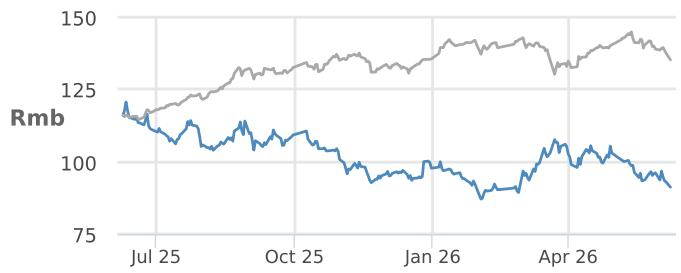

line chart

| Date   | Rmb (Blue Line) | Rmb (Gray Line) |
|--------|-----------------|-----------------|
| Jul 25 | ~115            | ~120            |
| Oct 25 | ~105            | ~130            |
| Jan 26 | ~95             | ~135            |
| Apr 26 | ~90             | ~140            |

— 002594.SZ Price (Rmb) SSEA (rebased)

<table><tr><td></td><td>YTD</td><td>1m</td><td>3m</td><td>12m</td></tr><tr><td>Abs</td><td>-6.7%</td><td>-8.8%</td><td>-2.6%</td><td>-24.0%</td></tr><tr><td>Rel</td><td>-6.5%</td><td>-3.6%</td><td>1.4%</td><td>-40.5%</td></tr></table>

Company Data

<table><tr><td>Shares O/S (mn)</td><td>8,184</td></tr><tr><td>52-week range (Rmb)</td><td>121.99-85.88</td></tr><tr><td>Market cap ($ mn)</td><td>109,946</td></tr><tr><td>Exchange rate</td><td>6.79</td></tr><tr><td>Free float (%)</td><td>40.9%</td></tr><tr><td>3M ADV (mn)</td><td>55.50</td></tr><tr><td>3M ADV ($ mn)</td><td>825.1</td></tr><tr><td>Volatility (90 Day)</td><td>32</td></tr><tr><td>Index</td><td>SHASHR</td></tr><tr><td>BBG ANR (Buy | Hold | Sell)</td><td>39|1|1</td></tr></table>

Key Metrics (FYE Dec)

<table><tr><td>Rmb in millions</td><td>FY25A</td><td>FY26E</td><td>FY27E</td><td>FY28E</td></tr><tr><td colspan="5">Financial Estimates</td></tr><tr><td>Revenue</td><td>803,965</td><td>921,249</td><td>988,874</td><td>1,057,691</td></tr><tr><td>Adj. EBIT</td><td>39,104</td><td>52,972</td><td>67,848</td><td>80,557</td></tr><tr><td>Adj. EBITDA</td><td>119,629</td><td>131,114</td><td>144,949</td><td>156,801</td></tr><tr><td>Adj. net income</td><td>37,039</td><td>42,548</td><td>54,599</td><td>64,790</td></tr><tr><td>Adj. EPS</td><td>4.10</td><td>4.71</td><td>6.05</td><td>7.18</td></tr><tr><td>BBG EPS</td><td>4.00</td><td>4.56</td><td>5.82</td><td>6.97</td></tr><tr><td>Cashflow from operations</td><td>59,136</td><td>257,153</td><td>168,906</td><td>218,809</td></tr><tr><td>FCFF</td><td>(97,672)</td><td>185,153</td><td>96,906</td><td>146,809</td></tr><tr><td colspan="5">Margins and Growth</td></tr><tr><td>Revenue Growth Y/Y (%)</td><td>3.5%</td><td>14.6%</td><td>7.3%</td><td>7.0%</td></tr><tr><td>EBIT margin</td><td>4.9%</td><td>5.8%</td><td>6.9%</td><td>7.6%</td></tr><tr><td>EBIT Growth Y/Y (%)</td><td>(23.2%)</td><td>35.5%</td><td>28.1%</td><td>18.7%</td></tr><tr><td>EBITDA margin</td><td>14.9%</td><td>14.2%</td><td>14.7%</td><td>14.8%</td></tr><tr><td>EBITDA Growth Y/Y (%)</td><td>1.6%</td><td>9.6%</td><td>10.6%</td><td>8.2%</td></tr><tr><td>Net margin</td><td>4.6%</td><td>4.6%</td><td>5.5%</td><td>6.1%</td></tr><tr><td>Adj. EPS growth</td><td>(19.8%)</td><td>14.9%</td><td>28.3%</td><td>18.7%</td></tr><tr><td colspan="5">Ratios</td></tr><tr><td>Adj. tax rate</td><td>13.6%</td><td>15.9%</td><td>16.0%</td><td>16.0%</td></tr><tr><td>Interest cover</td><td>-</td><td>-</td><td>-</td><td>-</td></tr><tr><td>Net debt/Equity</td><td>0.1</td><td>NM</td><td>NM</td><td>NM</td></tr><tr><td>Net debt/EBITDA</td><td>0.3</td><td>NM</td><td>NM</td><td>NM</td></tr><tr><td>ROE</td><td>17.2%</td><td>16.0%</td><td>17.6%</td><td>17.7%</td></tr><tr><td colspan="5">Valuation</td></tr><tr><td>FCFF yield</td><td>(11.9%)</td><td>22.5%</td><td>11.8%</td><td>17.8%</td></tr><tr><td>Dividend yield</td><td>1.5%</td><td>0.4%</td><td>0.5%</td><td>0.7%</td></tr><tr><td>EV/Revenue</td><td>0.4</td><td>0.1</td><td>0.0</td><td>NM</td></tr><tr><td>EV/EBITDA</td><td>2.6</td><td>1.0</td><td>0.3</td><td>NM</td></tr><tr><td>Adj. P/E</td><td>22.2</td><td>19.3</td><td>15.1</td><td>12.7</td></tr></table>

## Summary Investment Thesis and Valuation

With buyers increasingly focusing on ownership cost and the fact that more NEVs today are priced at similar levels as ICE cars in China (even before subsidy), we believe BYD will be able to deliver sustained volume in China and 57% or more growth outside China. Adding to this positive momentum are: (1) the recent introduction of BYD's ultra-fast charging strategy in the domestic market; and (2) production ramps across global factories from 2Q26, e.g., Hungary, Indonesia, Malaysia and Brazil. We rate the stock OW.

We set a Dec-26 PT of Rmb124 (vs. our previous Dec-26 PT of Rmb120) by applying a \~10% premium to our BYD-H PT. BYD-A has been trading at a \~10% premium to BYD-H over the past two to three years, so we believe the 10% premium is fair. Our blended multiples/DCF methodology implies a fair value for BYD-H of HK\$124. Our analysis suggests that BYD-H's long-term share price could range from HK\$94 to HK\$154, subject to market sentiment and risk appetite. Our PT is based on the median of the long-term fair value range.

Performance Drivers  
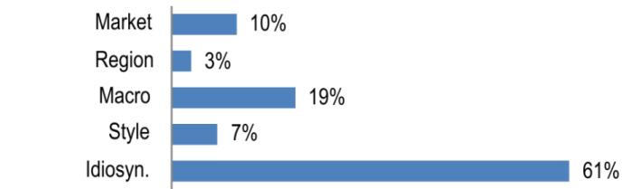

bar chart

| Category | Value (%) |
|---|---|
| Market | 10 |
| Region | 3 |
| Macro | 19 |
| Style | 7 |
| Idiosyn. | 61 |

<table><tr><td>Factors</td><td>6M Corr</td><td>1Y Corr</td></tr><tr><td>Market: MSCI Asia Pac ex JP</td><td>0.38</td><td>0.29</td></tr><tr><td>Region: China</td><td>0.03</td><td>0.25</td></tr></table>

Macro:

<table><tr><td>Generic 1st &#x27;CO&#x27; Future</td><td>-0.12</td><td>-0.36</td></tr><tr><td>US 10 Year Yield</td><td>0.22</td><td>0.32</td></tr><tr><td>Citi Economic Surprise - EM</td><td>-0.22</td><td>-0.30</td></tr><tr><td colspan="3">Quant Styles:</td></tr><tr><td>Growth</td><td>0.40</td><td>0.24</td></tr><tr><td>Value</td><td>-0.42</td><td>-0.21</td></tr><tr><td>DivYld</td><td>-0.41</td><td>-0.20</td></tr></table>

Table 2: BYD estimate revisions

<table><tr><td rowspan="2">Rmb mn</td><td colspan="3">2026E</td><td colspan="3">2027E</td></tr><tr><td>Revised</td><td>Previous</td><td>Change</td><td>Revised</td><td>Previous</td><td>Change</td></tr><tr><td>Revenue</td><td>921,249</td><td>910,832</td><td>1%</td><td>988,874</td><td>977,904</td><td>1%</td></tr><tr><td>Sales growth (%)</td><td>15%</td><td>13%</td><td></td><td>7%</td><td>7%</td><td></td></tr><tr><td>COGS</td><td>751,798</td><td>744,618</td><td>1%</td><td>797,557</td><td>789,975</td><td>1%</td></tr><tr><td>Gross profit</td><td>169,451</td><td>166,214</td><td>2%</td><td>191,317</td><td>187,929</td><td>2%</td></tr><tr><td>Gross margin (%)</td><td>18%</td><td>18%</td><td></td><td>19.3%</td><td>19.2%</td><td></td></tr><tr><td>Operating profit</td><td>53,072</td><td>51,166</td><td>4%</td><td>67,948</td><td>65,885</td><td>3%</td></tr><tr><td>Operating margin (%)</td><td>6%</td><td>6%</td><td></td><td>6.9%</td><td>6.7%</td><td></td></tr><tr><td>Pretax profit</td><td>52,972</td><td>51,066</td><td>4%</td><td>67,848</td><td>65,785</td><td>3%</td></tr><tr><td>Tax rate</td><td>16%</td><td>16%</td><td></td><td>16%</td><td>16%</td><td></td></tr><tr><td>Net profit</td><td>42,548</td><td>40,966</td><td>4%</td><td>54,599</td><td>52,887</td><td>3%</td></tr><tr><td>Net margin (%)</td><td>5%</td><td>4%</td><td></td><td>5.5%</td><td>5.4%</td><td></td></tr><tr><td>Net profit growth (%)</td><td>30%</td><td>26%</td><td></td><td>28%</td><td>29%</td><td></td></tr><tr><td>EPS (basic) (Rmb)</td><td>4.7</td><td>4.5</td><td>4%</td><td>6.0</td><td>5.9</td><td>3%</td></tr></table>

Source: JPM estimates.

## Investment Thesis, Valuation and Risks

## BYD Company Limited - A (Overweight; Price Target: Rmb124.00)

## Investment Thesis

With buyers increasingly focusing on ownership cost and the fact that more NEVs today are priced at similar levels as ICE cars in China (even before subsidy), we believe BYD will be able to deliver sustained volume in China and 57% or more growth outside China. Adding to this positive momentum are: (1) the recent introduction of BYD's ultra-fast charging strategy in the domestic market; and (2) production ramps across global factories from 2Q26, e.g., Hungary, Indonesia, Malaysia and Brazil. We rate the stock OW.

## Valuation

We set a Dec-26 PT of Rmb124 by applying a \~10% premium to our BYD-H PT. BYD-A has been trading at a \~10% premium to BYD-H over the past two to three years, so we believe the 10% premium is fair. Our blended multiples/DCF methodology implies a fair value for BYD-H of HK\$124. Our analysis suggests that BYD-H's long-term share price could range from HK\$94 to HK\$154, subject to market sentiment and risk appetite. Our PT is based on the median of the long-term fair value range.

BYD long-term fair value assessment based on different FY30 multiples

<table><tr><td></td><td>2030E</td></tr><tr><td>Sales volume (units)</td><td>7,000,000</td></tr><tr><td>Domestic</td><td>3,670,293</td></tr><tr><td>Overseas</td><td>3,329,707</td></tr><tr><td>NP per unit (Rmb)</td><td></td></tr><tr><td>Domestic</td><td>6,000</td></tr><tr><td>Overseas</td><td>20,000</td></tr><tr><td>Total net profit (Rmb mn)</td><td>88,616</td></tr><tr><td>2030E P/E</td><td>8x</td></tr><tr><td>Implied equity value (Rmb mn)</td><td>708,927</td></tr><tr><td>Implied value/share (Rmb)</td><td>81</td></tr><tr><td>Implied value/share (HK$)</td><td>94</td></tr><tr><td>2030E P/E</td><td>10x</td></tr><tr><td>Implied equity value (Rmb mn)</td><td>886,159</td></tr><tr><td>Implied value/share (Rmb)</td><td>102</td></tr><tr><td>Implied value/share (HK$)</td><td>117</td></tr></table>

Source: JPM estimates.

BYD long-term PT assessment based on DCF analysis

<table><tr><td>Rmb mn</td><td>2026E</td><td>2027E</td><td>2028E</td><td>2029E</td><td>2030E</td><td>2031E</td><td>2032E</td><td>2033E</td><td>2034E</td><td>2035E</td></tr><tr><td>Operating cash flow</td><td>257,153</td><td>168,906</td><td>211,133</td><td>263,916</td><td>303,503</td><td>318,678</td><td>334,612</td><td>351,343</td><td>368,910</td><td>387,355</td></tr><tr><td>Less: Capex</td><td>(72,000)</td><td>(70,000)</td><td>(70,000)</td><td>(70,000)</td><td>(70,000)</td><td>(60,000)</td><td>(60,000)</td><td>(60,000)</td><td>(60,000)</td><td>(60,000)</td></tr><tr><td>FCFF</td><td>185,153</td><td>98,906</td><td>141,133</td><td>193,916</td><td>233,503</td><td>258,678</td><td>274,612</td><td>291,343</td><td>308,910</td><td>327,355</td></tr><tr><td>PV of FCFF</td><td></td><td>86,005</td><td>106,717</td><td>127,503</td><td>133,506</td><td>128,609</td><td>118,722</td><td>109,527</td><td>100,983</td><td>93,055</td></tr><tr><td>WACC</td><td>15%</td><td></td><td></td><td></td><td></td><td></td><td></td><td></td><td></td><td></td></tr><tr><td>Long-term growth rate</td><td>2%</td><td></td><td></td><td></td><td></td><td></td><td></td><td></td><td></td><td></td></tr><tr><td>PV of FCFFs</td><td>1,004,627</td><td></td><td></td><td></td><td></td><td></td><td></td><td></td><td></td><td></td></tr><tr><td>PV of terminal value</td><td>233,998</td><td></td><td></td><td></td><td></td><td></td><td></td><td></td><td></td><td></td></tr><tr><td>Enterprise value</td><td>1,238,625</td><td></td><td></td><td></td><td></td><td></td><td></td><td></td><td></td><td></td></tr><tr><td>Net debt</td><td>35,075</td><td></td><td></td><td></td><td></td><td></td><td></td><td></td><td></td><td></td></tr><tr><td>Equity value</td><td>1,203,550</td><td></td><td></td><td></td><td></td><td></td><td></td><td></td><td></td><td></td></tr><tr><td>No. of shares (mn)</td><td>9,026</td><td></td><td></td><td></td><td></td><td></td><td></td><td></td><td></td><td></td></tr><tr><td>Implied value/share (Rmb)</td><td>133</td><td></td><td></td><td></td><td></td><td></td><td></td><td></td><td></td><td></td></tr><tr><td>Implied value/share (HK$)</td><td>154</td><td></td><td></td><td></td><td></td><td></td><td></td><td></td><td></td><td></td></tr></table>

Source: JPM estimates.

## Risks to Rating and Price Target

Downside risks include worse-than-expected sales and industry competition from Chinese and foreign mass-market brands, such as Volkswagen, Geely and Great Wall Motor.

BYD Company Limited - A: Summary of Financials

<table><tr><td>Income Statement</td><td>FY24A</td><td>FY25A</td><td>FY26E</td><td>FY27E</td><td>FY28E</td></tr><tr><td>Revenue</td><td>777,102</td><td>803,965</td><td>921,249</td><td>988,874</td><td>1,057,691</td></tr><tr><td>COGS</td><td>(626,047)</td><td>(661,305)</td><td>(751,798)</td><td>(797,557)</td><td>(845,205)</td></tr><tr><td>Gross profit</td><td>151,056</td><td>142,660</td><td>169,451</td><td>191,317</td><td>212,486</td></tr><tr><td>SG&amp;A</td><td>(42,730)</td><td>(46,385)</td><td>(54,585)</td><td>(57,543)</td><td>(61,143)</td></tr><tr><td>Adj. EBITDA</td><td>117,803</td><td>119,629</td><td>131,114</td><td>144,949</td><td>156,801</td></tr><tr><td>D&amp;A</td><td>(66,906)</td><td>(80,526)</td><td>(78,142)</td><td>(77,101)</td><td>(76,243)</td></tr><tr><td>Adj. EBIT</td><td>50,897</td><td>39,104</td><td>52,972</td><td>67,848</td><td>80,557</td></tr><tr><td>Net Interest</td><td>0</td><td>0</td><td>0</td><td>0</td><td>0</td></tr><tr><td>Adj. PBT</td><td>54,029</td><td>44,174</td><td>52,972</td><td>67,848</td><td>80,557</td></tr><tr><td>Tax</td><td>(8,093)</td><td>(5,992)</td><td>(8,446)</td><td>(10,851)</td><td>(12,886)</td></tr><tr><td>Minority Interest</td><td>(1,334)</td><td>(1,142)</td><td>(1,979)</td><td>(2,398)</td><td>(2,882)</td></tr><tr><td>Adj. Net Income</td><td>44,603</td><td>37,039</td><td>42,548</td><td>54,599</td><td>64,790</td></tr><tr><td>Reported EPS (Basic)</td><td>5.11</td><td>4.10</td><td>4.71</td><td>6.05</td><td>7.18</td></tr><tr><td>Adj. EPS</td><td>5.11</td><td>4.10</td><td>4.71</td><td>6.05</td><td>7.18</td></tr><tr><td>DPS</td><td>1.03</td><td>1.32</td><td>0.36</td><td>0.47</td><td>0.60</td></tr><tr><td>Payout ratio</td><td>20.2%</td><td>32.3%</td><td>7.6%</td><td>7.8%</td><td>8.4%</td></tr><tr><td>Shares outstanding</td><td>8,721</td><td>9,026</td><td>9,026</td><td>9,026</td><td>9,026</td></tr><tr><td>Balance Sheet</td><td>FY24A</td><td>FY25A</td><td>FY26E</td><td>FY27E</td><td>FY28E</td></tr><tr><td>Cash and cash equivalents</td><td>102,739</td><td>75,425</td><td>257,346</td><td>349,997</td><td>491,347</td></tr><tr><td>Accounts receivable</td><td>62,299</td><td>37,005</td><td>50,142</td><td>61,095</td><td>66,094</td></tr><tr><td>Inventories</td><td>116,036</td><td>138,421</td><td>108,746</td><td>131,614</td><td>99,949</td></tr><tr><td>Other current assets</td><td>89,498</td><td>120,618</td><td>120,618</td><td>120,618</td><td>120,618</td></tr><tr><td>Current assets</td><td>370,572</td><td>371,468</td><td>536,851</td><td>663,324</td><td>778,008</td></tr><tr><td>PP&amp;E</td><td>262,307</td><td>292,776</td><td>290,909</td><td>289,452</td><td>288,314</td></tr><tr><td>LT investments</td><td>-</td><td>-</td><td>-</td><td>-</td><td>-</td></tr><tr><td>Other non current assets</td><td>150,476</td><td>219,486</td><td>215,111</td><td>211,368</td><td>208,162</td></tr><tr><td>Total assets</td><td>783,356</td><td>883,730</td><td>1,042,872</td><td>1,164,144</td><td>1,274,484</td></tr><tr><td>Short term borrowings</td><td>22,326</td><td>44,797</td><td>54,634</td><td>61,800</td><td>67,021</td></tr><tr><td>Payables</td><td>244,027</td><td>209,206</td><td>327,053</td><td>395,583</td><td>443,711</td></tr><tr><td>Other short term liabilities</td><td>229,632</td><td>214,448</td><td>214,448</td><td>214,448</td><td>214,448</td></tr><tr><td>Current liabilities</td><td>495,985</td><td>468,451</td><td>596,135</td><td>671,831</td><td>725,181</td></tr><tr><td>Long-term debt</td><td>8,258</td><td>65,703</td><td>55,866</td><td>48,700</td><td>43,479</td></tr><tr><td>Other long term liabilities</td><td>80,425</td><td>91,036</td><td>91,036</td><td>91,036</td><td>91,036</td></tr><tr><td>Total liabilities</td><td>584,668</td><td>625,191</td><td>743,037</td><td>811,567</td><td>859,696</td></tr><tr><td>Shareholders&#x27; equity</td><td>185,251</td><td>246,275</td><td>285,591</td><td>335,935</td><td>395,265</td></tr><tr><td>Minority interests</td><td>13,437</td><td>12,265</td><td>14,243</td><td>16,641</td><td>19,523</td></tr><tr><td>Total liabilities &amp; equity</td><td>783,356</td><td>883,730</td><td>1,042,872</td><td>1,164,144</td><td>1,274,484</td></tr><tr><td>BVPS</td><td>21.24</td><td>27.28</td><td>31.64</td><td>37.22</td><td>43.79</td></tr><tr><td>y/y Growth</td><td>33.5%</td><td>28.4%</td><td>16.0%</td><td>17.6%</td><td>17.7%</td></tr><tr><td>Net debt/(cash)</td><td>(72,155)</td><td>35,075</td><td>(146,846)</td><td>(239,497)</td><td>(380,847)</td></tr></table>

<table><tr><td>Cash Flow Statement</td><td>FY24A</td><td>FY25A</td><td>FY26E</td><td>FY27E</td><td>FY28E</td></tr><tr><td>Cash flow from operating activities</td><td>133,454</td><td>59,136</td><td>257,153</td><td>168,906</td><td>218,809</td></tr><tr><td>o/w Depreciation &amp; amortization</td><td>66,906</td><td>80,526</td><td>78,142</td><td>77,101</td><td>76,243</td></tr><tr><td>o/w Changes in working capital</td><td>(272)</td><td>(75,327)</td><td>134,385</td><td>34,708</td><td>74,795</td></tr><tr><td>Cash flow from investing activities</td><td>(129,082)</td><td>(197,463)</td><td>(72,000)</td><td>(72,000)</td><td>(72,000)</td></tr><tr><td>o/w Capital expenditure</td><td>(97,360)</td><td>(156,808)</td><td>(72,000)</td><td>(72,000)</td><td>(72,000)</td></tr><tr><td>as % of sales</td><td>12.5%</td><td>19.5%</td><td>7.8%</td><td>7.3%</td><td>6.8%</td></tr><tr><td>Cash flow from financing activities</td><td>(10,268)</td><td>104,614</td><td>(3,231)</td><td>(4,255)</td><td>(5,460)</td></tr><tr><td>o/w Dividends paid</td><td>(9,003)</td><td>(34,668)</td><td>(3,231)</td><td>(4,255)</td><td>(5,460)</td></tr><tr><td>o/w Shares issued/(repurchased)</td><td>98</td><td>40,222</td><td>0</td><td>0</td><td>0</td></tr><tr><td>o/w Net debt issued/(repaid)</td><td>(12,440)</td><td>64,786</td><td>0</td><td>0</td><td>0</td></tr><tr><td>Net change in cash</td><td>(5,896)</td><td>(33,714)</td><td>181,921</td><td>92,651</td><td>141,350</td></tr><tr><td>Adj. Free cash flow to firm</td><td>36,094</td><td>(97,672)</td><td>185,153</td><td>96,906</td><td>146,809</td></tr><tr><td>y/y Growth</td><td>(24.2%)</td><td>(370.6%)</td><td>(289.6%)</td><td>(47.7%)</td><td>51.5%</td></tr></table>

<table><tr><td>Ratio Analysis</td><td>FY24A</td><td>FY25A</td><td>FY26E</td><td>FY27E</td><td>FY28E</td></tr><tr><td>Gross margin</td><td>19.4%</td><td>17.7%</td><td>18.4%</td><td>19.3%</td><td>20.1%</td></tr><tr><td>EBITDA margin</td><td>15.2%</td><td>14.9%</td><td>14.2%</td><td>14.7%</td><td>14.8%</td></tr><tr><td>EBIT margin</td><td>6.5%</td><td>4.9%</td><td>5.8%</td><td>6.9%</td><td>7.6%</td></tr><tr><td>Net profit margin</td><td>5.7%</td><td>4.6%</td><td>4.6%</td><td>5.5%</td><td>6.1%</td></tr><tr><td>ROE</td><td>27.5%</td><td>17.2%</td><td>16.0%</td><td>17.6%</td><td>17.7%</td></tr><tr><td>ROA</td><td>6.1%</td><td>4.4%</td><td>4.4%</td><td>4.9%</td><td>5.3%</td></tr><tr><td>ROCE</td><td>22.0%</td><td>11.8%</td><td>11.8%</td><td>13.5%</td><td>14.2%</td></tr><tr><td>SG&amp;A/Sales</td><td>5.5%</td><td>5.8%</td><td>5.9%</td><td>5.8%</td><td>5.8%</td></tr><tr><td>Net debt/Equity</td><td>NM</td><td>0.1</td><td>NM</td><td>NM</td><td>NM</td></tr><tr><td>Net debt/EBITDA</td><td>NM</td><td>0.3</td><td>NM</td><td>NM</td><td>NM</td></tr><tr><td>Sales/Assets (x)</td><td>1.1</td><td>1.0</td><td>1.0</td><td>0.9</td><td>0.9</td></tr><tr><td>Assets/Equity (x)</td><td>4.5</td><td>3.9</td><td>3.6</td><td>3.6</td><td>3.3</td></tr><tr><td>Interest cover (x)</td><td>-</td><td>-</td><td>-</td><td>-</td><td>-</td></tr><tr><td>Operating leverage</td><td>145.4%</td><td>(670.3%)</td><td>243.1%</td><td>382.6%</td><td>269.2%</td></tr><tr><td>Tax rate</td><td>15.0%</td><td>13.6%</td><td>15.9%</td><td>16.0%</td><td>16.0%</td></tr><tr><td>Revenue y/y Growth</td><td>29.0%</td><td>3.5%</td><td>14.6%</td><td>7.3%</td><td>7.0%</td></tr><tr><td>EBITDA y/y Growth</td><td>49.0%</td><td>1.6%</td><td>9.6%</td><td>10.6%</td><td>8.2%</td></tr><tr><td>EPS y/y Growth</td><td>48.2%</td><td>(19.8%)</td><td>14.9%</td><td>28.3%</td><td>18.7%</td></tr><tr><td>Valuation</td><td>FY24A</td><td>FY25A</td><td>FY26E</td><td>FY27E</td><td>FY28E</td></tr><tr><td>P/E (x)</td><td>17.8</td><td>22.2</td><td>19.3</td><td>15.1</td><td>12.7</td></tr><tr><td>P/BV (x)</td><td>4.3</td><td>3.3</td><td>2.9</td><td>2.5</td><td>2.1</td></tr><tr><td>EV/EBITDA (x)</td><td>1.8</td><td>2.6</td><td>1.0</td><td>0.3</td><td>NM</td></tr><tr><td>Dividend Yield</td><td>1.1%</td><td>1.5%</td><td>0.4%</td><td>0.5%</td><td>0.7%</td></tr></table>

Source: Company reports and JPM estimates.  
Note: Rmb in millions (except per-share data). Fiscal year ends Dec. o/w - out of which

## Overweight

0175.HK,175 HK

Price (08 Jun 26): HK\$18.17

▲ Price Target (Dec-26): HK\$29.00

Prior (Dec-26): HK\$28.00

China

Head of APAC Auto Research

Nick Lai AC

(65) 6801-3176

nick.yc.lai@JPM.com

JPM Securities Singapore Private Limited/ JPM Securities (Asia Pacific) Limited/ JPM Broking (Hong Kong) Limited

Key Changes (FYE Dec)

<table><tr><td></td><td>Prev</td><td>Cur</td><td>Δ</td></tr><tr><td>Adj. EPS - 26E (Rmb)</td><td>2.32</td><td>2.42</td><td>4.4%</td></tr></table>

Style Exposure

<table><tr><td rowspan="2">Quant Factors</td><td rowspan="2">Current %Rank</td><td colspan="4">Hist %Rank (1=Top)</td></tr><tr><td>6M</td><td>1Y</td><td>3Y</td><td>5Y</td></tr><tr><td>Value</td><td>20</td><td>18</td><td>17</td><td>44</td><td>48</td></tr><tr><td>Growth</td><td>33</td><td>29</td><td>48</td><td>75</td><td>71</td></tr><tr><td>Momentum</td><td>20</td><td>23</td><td>4</td><td>93</td><td>53</td></tr><tr><td>Quality</td><td>32</td><td>29</td><td>75</td><td>83</td><td>71</td></tr><tr><td>Low Vol</td><td>74</td><td>76</td><td>72</td><td>80</td><td>82</td></tr><tr><td>ESGQ</td><td>10</td><td>12</td><td>10</td><td>1</td><td>93</td></tr></table>

Sources for: Style Exposure – JPM Global Markets Strategy; all other tables are company data and JPM estimates.

## Geely Automobile Holdings Ltd. (0175)

## Stronger-than-expected overseas demand

\- Earnings estimate changes: We lift our 2026-27 earnings estimates by a moderate 1-4% after raising our 2026 overseas sales volume assumptions (we raise our 2026 overseas sales forecast by \~30%, to 950k units from 750k units). This is consistent with our view that overseas expansion and mix can be meaningful earnings levers; our revisions also reflect a material step-up in EPS vs. prior assumptions.

\- Thesis #1: Overseas ambitions are scaling and increasingly structured: We remain constructive on Geely's overseas strategy, with management targeting aggressive volume and a pivot toward building scale via regional hubs (LatAm, ASEAN, Europe), supported by an expanding global footprint and dealer network; we continue to view export/overseas business as a key earnings driver.

\- Thesis #2: Energy diversification via hybrid tech strengthens competitiveness: We see Geely's multi-pathway powertrain matrix (BEV/HEV/EREV) and proprietary hybrid advancements as supportive of product competitiveness and market share gains, particularly as overseas markets (e.g., Europe) behave like mixed-propulsion transition markets.

\- Thesis #3: Platform/model cycle + partnerships underpin resilience: We maintain our positive view on Geely's platform-driven model cycle and longer-term technology positioning, supported by partnerships/JVs in overseas markets (e.g., Renault in Korea and Brazil, Proton in Malaysia and Ford in Spain) and group-level integration benefits (cost/expense synergy), which we believe can support earnings resilience, even in a challenging domestic demand backdrop.

Price Performance  
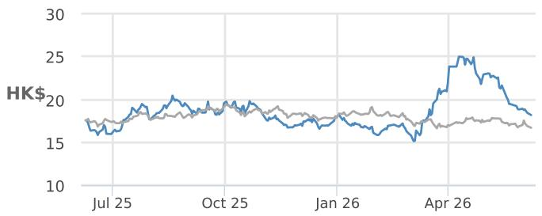

line chart

| Date   | HK$ (Blue Line) | HK$ (Gray Line) |
|--------|-----------------|-----------------|
| Jul 25 | ~17             | ~18             |
| Oct 25 | ~20             | ~19             |
| Jan 26 | ~18             | ~18             |
| Apr 26 | ~25             | ~17             |

— 0175.HK Price (HK\$) HSCEI (rebased)

<table><tr><td></td><td>YTD</td><td>1m</td><td>3m</td><td>12m</td></tr><tr><td>Abs</td><td>1.5%</td><td>-20.1%</td><td>11.1%</td><td>1.3%</td></tr><tr><td>Rel</td><td>7.9%</td><td>-13.9%</td><td>14.4%</td><td>6.3%</td></tr></table>

Company Data

<table><tr><td>Shares O/S (mn)</td><td>9,156</td></tr><tr><td>52-week range (HK$)</td><td>25.62-14.96</td></tr><tr><td>Market cap ($ mn)</td><td>21,235</td></tr><tr><td>Exchange rate</td><td>7.83</td></tr><tr><td>Free float (%)</td><td>56.9%</td></tr><tr><td>3M ADV (mn)</td><td>85.98</td></tr><tr><td>3M ADV ($ mn)</td><td>230.7</td></tr><tr><td>Volatility (90 Day)</td><td>42</td></tr><tr><td>Index</td><td>HSCEI</td></tr><tr><td>BBG ANR (Buy | Hold | Sell)</td><td>44|3|0</td></tr></table>

Key Metrics (FYE Dec)

<table><tr><td>Rmb in millions</td><td>FY25A</td><td>FY26E</td><td>FY27E</td><td>FY28E</td></tr><tr><td colspan="5">Financial Estimates</td></tr><tr><td>Revenue</td><td>345,232</td><td>401,824</td><td>450,367</td><td>505,851</td></tr><tr><td>Adj. EBITDA</td><td>36,013</td><td>47,377</td><td>42,504</td><td>43,279</td></tr><tr><td>Adj. EBIT</td><td>20,093</td><td>26,987</td><td>31,215</td><td>35,998</td></tr><tr><td>Adj. net income</td><td>16,852</td><td>25,057</td><td>29,020</td><td>33,503</td></tr><tr><td>Net margin</td><td>4.9%</td><td>6.2%</td><td>6.4%</td><td>6.6%</td></tr><tr><td>Adj. EPS</td><td>1.63</td><td>2.42</td><td>2.80</td><td>3.24</td></tr><tr><td>BBG EPS</td><td>1.60</td><td>1.98</td><td>2.41</td><td>2.81</td></tr><tr><td>Cashflow from operations</td><td>47,274</td><td>52,196</td><td>59,151</td><td>33,694</td></tr><tr><td>FCFF</td><td>29,357</td><td>34,278</td><td>41,233</td><td>15,776</td></tr><tr><td colspan="5">Margins and Growth</td></tr><tr><td>Revenue Growth Y/Y (%)</td><td>43.7%</td><td>16.4%</td><td>12.1%</td><td>12.3%</td></tr><tr><td>EBITDA margin</td><td>10.4%</td><td>11.8%</td><td>9.4%</td><td>8.6%</td></tr><tr><td>EBITDA Growth Y/Y (%)</td><td>32.9%</td><td>31.6%</td><td>(10.3%)</td><td>1.8%</td></tr><tr><td>EBIT margin</td><td>5.8%</td><td>6.7%</td><td>6.9%</td><td>7.1%</td></tr><tr><td>Adj. EPS growth</td><td>(1.1%)</td><td>48.7%</td><td>15.8%</td><td>15.5%</td></tr><tr><td colspan="5">Ratios</td></tr><tr><td>Adj. tax rate</td><td>17.8%</td><td>9.0%</td><td>9.1%</td><td>9.2%</td></tr><tr><td>Interest cover</td><td>NM</td><td>NM</td><td>NM</td><td>NM</td></tr><tr><td>Net debt/Equity</td><td>NM</td><td>NM</td><td>NM</td><td>NM</td></tr><tr><td>Net debt/EBITDA</td><td>NM</td><td>NM</td><td>NM</td><td>NM</td></tr><tr><td>ROCE</td><td>16.9%</td><td>21.0%</td><td>20.6%</td><td>20.2%</td></tr><tr><td>ROE</td><td>18.8%</td><td>24.4%</td><td>23.4%</td><td>22.7%</td></tr><tr><td colspan="5">Valuation</td></tr><tr><td>FCFF yield</td><td>18.0%</td><td>21.0%</td><td>25.3%</td><td>9.7%</td></tr><tr><td>Dividend yield</td><td>2.0%</td><td>2.9%</td><td>4.3%</td><td>5.0%</td></tr><tr><td>EV/EBITDA</td><td>3.2</td><td>1.9</td><td>1.2</td><td>1.0</td></tr><tr><td>EV/Revenue</td><td>0.3</td><td>0.2</td><td>0.1</td><td>0.1</td></tr><tr><td>Adj. P/E</td><td>9.7</td><td>6.5</td><td>5.6</td><td>4.9</td></tr></table>

## Summary Investment Thesis and Valuation

We are constructive on Geely's powerful model cycle, based on its platform strategy, which should help the company continue to gain market share. We are in favor of management's initiative to develop the NEV business. We also like Geely's long-term prospects and technological leadership among peers in a challenging market through its partnerships or JVs with global/regional leaders such as Daimler and CATL, although at the parentco level. We expect to see business synergies, directly and indirectly, from its tie-up with Volvo and partnerships in platform-sharing, joint product development, back-end cost-sharing/component-sourcing, and a stronger product portfolio. Maintain Overweight.

Our Dec-26 PT of HK\$29 (vs. our previous Dec-26 PT of HK\$28) is based on a 11x 2026E P/E, implying around 15x for Geely's overseas business and 8x for domestic. While a 11x 2026E P/E is lower than what we use for BYD (overall \~20x P/E), we believe this is fair, considering that Geely capitalizes most of R&D, while BYD expenses most. This is below the historical average of 14x to reflect our conservative view of the industry.

Performance Drivers  
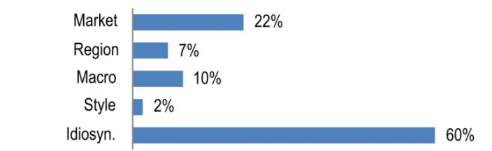

bar chart

| Category | Value (%) |
|---|---|
| Market | 22 |
| Region | 7 |
| Macro | 10 |
| Style | 2 |
| Idiosyn. | 60 |

<table><tr><td>Factors</td><td>6M Corr</td><td>1Y Corr</td></tr><tr><td>Market: MSCI Asia Pac ex JP</td><td>0.45</td><td>0.44</td></tr><tr><td>Region: China</td><td>0.25</td><td>0.36</td></tr><tr><td>Macro:</td><td></td><td></td></tr><tr><td>JPM China A-shares Sentiment</td><td>0.12</td><td>0.30</td></tr><tr><td>Generic 1st &#x27;CO&#x27; Future</td><td>-0.15</td><td>-0.30</td></tr><tr><td>Citi Economic Surprise - EM</td><td>-0.16</td><td>-0.28</td></tr><tr><td>Quant Styles:</td><td></td><td></td></tr><tr><td>Momentum</td><td>-0.22</td><td>-0.10</td></tr><tr><td>Quality</td><td>-0.05</td><td>-0.10</td></tr><tr><td>Growth</td><td>0.01</td><td>0.06</td></tr></table>

Table 3: Geely estimate revisions

<table><tr><td rowspan="2">Rmb mn</td><td colspan="3">2026E</td><td colspan="3">2027E</td></tr><tr><td>Current</td><td>Previous</td><td>% diff.</td><td>Current</td><td>Previous</td><td>% diff.</td></tr><tr><td>Revenue</td><td>401,824</td><td>400,319</td><td>0%</td><td>450,367</td><td>448,508</td><td>0%</td></tr><tr><td>Sales growth (%)</td><td>16%</td><td>16%</td><td></td><td>12%</td><td>12%</td><td></td></tr><tr><td>COGS</td><td>332,252</td><td>331,073</td><td>0%</td><td>371,669</td><td>370,260</td><td>0%</td></tr><tr><td>Gross profit</td><td>69,572</td><td>69,246</td><td>0%</td><td>78,698</td><td>78,248</td><td>1%</td></tr><tr><td>Gross margin (%)</td><td>17%</td><td>17%</td><td></td><td>17%</td><td>17%</td><td></td></tr><tr><td>Operating profit</td><td>24,929</td><td>23,770</td><td>5%</td><td>29,158</td><td>28,912</td><td>1%</td></tr><tr><td>Operating margin (%)</td><td>6%</td><td>6%</td><td></td><td>6%</td><td>6%</td><td></td></tr><tr><td>Pretax profit</td><td>27,183</td><td>26,024</td><td>4%</td><td>31,503</td><td>31,254</td><td>1%</td></tr><tr><td>Tax rate</td><td>9%</td><td>9%</td><td></td><td>9%</td><td>9%</td><td></td></tr><tr><td>Net profit</td><td>25,057</td><td>23,994</td><td>4%</td><td>29,020</td><td>28,791</td><td>1%</td></tr><tr><td>Net margin (%)</td><td>6%</td><td>6%</td><td></td><td>6%</td><td>6%</td><td></td></tr><tr><td>Net profit growth (%)</td><td>49%</td><td>42%</td><td></td><td>16%</td><td>20%</td><td></td></tr><tr><td>EPS (basic) (Rmb)</td><td>2.48</td><td>2.37</td><td>4%</td><td>2.87</td><td>2.85</td><td>1%</td></tr><tr><td>EPS (fully diluted) (Rmb)</td><td>2.42</td><td>2.32</td><td>4%</td><td>2.80</td><td>2.78</td><td>1%</td></tr><tr><td>EPS growth (%)</td><td>49%</td><td>42%</td><td></td><td>16%</td><td>20%</td><td></td></tr></table>

Source: JPM estimates.

## Investment Thesis, Valuation and Risks

## Geely Automobile Holdings Ltd. (Overweight; Price Target: HK\$29.00)

## Investment Thesis

We are constructive on Geely's powerful model cycle, based on its platform strategy, which should help the company continue to gain market share. We are in favor of management's initiative to develop the NEV business. We also like Geely's long-term prospects and technological leadership among peers in a challenging market through its partnerships or JVs with global/regional leaders such as Daimler and CATL, although at the parentco level. We expect to see business synergies, directly and indirectly, from its tie-up with Volvo and partnerships in platform-sharing, joint product development, back-end cost-sharing/component-sourcing, and a stronger product portfolio. Maintain Overweight.

## Valuation

Our Dec-26 PT of HK\$29 is based on a 11x 2026E P/E, implying around 15x for Geely's overseas business and 8x for domestic. While a 11x 2026E P/E is lower than what we use for BYD (overall \~20x P/E), we believe this is fair, considering that Geely capitalizes most of R&D, while BYD expenses most. This is below the historical average of 14x to reflect our conservative view of the industry.

## Risks to Rating and Price Target

Downside risks include worse-than-expected sales performance and worse-than-expected profitability.

Geely Automobile Holdings Ltd. (0175): Summary of Financials

<table><tr><td>Income Statement</td><td>FY24A</td><td>FY25A</td><td>FY26E</td><td>FY27E</td><td>FY28E</td><td>Cash Flow Statement</td><td>FY24A</td><td>FY25A</td><td>FY26E</td><td>FY27E</td><td>FY28E</td></tr><tr><td>Revenue</td><td>240,194</td><td>345,232</td><td>401,824</td><td>450,367</td><td>505,851</td><td>Cash flow from operating activities</td><td>26,507</td><td>47,274</td><td>52,196</td><td>59,151</td><td>33,694</td></tr><tr><td>COGS</td><td>(201,993)</td><td>(287,885)</td><td>(332,252)</td><td>(371,669)</td><td>(415,205)</td><td>o/w Depreciation &amp; amortization</td><td>9,393</td><td>15,920</td><td>20,389</td><td>11,289</td><td>7,281</td></tr><tr><td>Gross profit</td><td>38,201</td><td>57,347</td><td>69,572</td><td>78,698</td><td>90,646</td><td>o/w Changes in working capital</td><td>9,316</td><td>18,278</td><td>6,350</td><td>21,623</td><td>(4,138)</td></tr><tr><td>SG&amp;A</td><td>(4,897)</td><td>(6,482)</td><td>(6,429)</td><td>(7,206)</td><td>(7,942)</td><td></td><td></td><td></td><td></td><td></td><td></td></tr><tr><td>Adj. EBITDA</td><td>27,105</td><td>36,013</td><td>47,377</td><td>42,504</td><td>43,279</td><td>Cash flow from investing activities</td><td>(9,132)</td><td>(23,370)</td><td>(17,160)</td><td>(17,160)</td><td>(17,160)</td></tr><tr><td>D&amp;A</td><td>(9,393)</td><td>(15,920)</td><td>(20,389)</td><td>(11,289)</td><td>(7,281)</td><td>o/w Capital expenditure</td><td>(12,836)</td><td>(17,918)</td><td>(17,918)</td><td>(17,918)</td><td>(17,918)</td></tr><tr><td>Adj. EBIT</td><td>17,711</td><td>20,093</td><td>26,987</td><td>31,215</td><td>35,998</td><td>as % of sales</td><td>5.3%</td><td>5.2%</td><td>4.5%</td><td>4.0%</td><td>3.5%</td></tr><tr><td>Net Interest</td><td>692</td><td>137</td><td>196</td><td>288</td><td>394</td><td></td><td></td><td></td><td></td><td></td><td></td></tr><tr><td>Adj. PBT</td><td>18,404</td><td>20,230</td><td>27,183</td><td>31,503</td><td>36,392</td><td>Cash flow from financing activities</td><td>(13,297)</td><td>(1,839)</td><td>(4,343)</td><td>(6,624)</td><td>(7,611)</td></tr><tr><td>Tax</td><td>(1,604)</td><td>(3,601)</td><td>(2,459)</td><td>(2,869)</td><td>(3,334)</td><td>o/w Dividends paid</td><td>(456,497)</td><td>(3,119)</td><td>(4,539)</td><td>(6,912)</td><td>(8,005)</td></tr><tr><td>Minority Interest</td><td>(167)</td><td>224</td><td>333</td><td>386</td><td>445</td><td>o/w Shares issued/(repurchased)</td><td>0</td><td>0</td><td>0</td><td>0</td><td>0</td></tr><tr><td>Adj. Net Income</td><td>16,632</td><td>16,852</td><td>25,057</td><td>29,020</td><td>33,503</td><td>o/w Net debt issued/(repaid)</td><td>(880)</td><td>(1,667)</td><td>0</td><td>0</td><td>0</td></tr><tr><td>Reported EPS</td><td>1.65</td><td>1.63</td><td>2.42</td><td>2.80</td><td>3.24</td><td>Net change in cash</td><td>4,090</td><td>22,262</td><td>30,693</td><td>35,367</td><td>8,923</td></tr><tr><td>Adj. EPS</td><td>1.65</td><td>1.63</td><td>2.42</td><td>2.80</td><td>3.24</td><td></td><td></td><td></td><td></td><td></td><td></td></tr><tr><td></td><td></td><td></td><td></td><td></td><td></td><td>Adj. Free cash flow to firm</td><td>13,671</td><td>29,357</td><td>34,278</td><td>41,233</td><td>15,776</td></tr><tr><td>DPS</td><td>0.20</td><td>0.31</td><td>0.45</td><td>0.68</td><td>0.79</td><td>y/y Growth</td><td>90.1%</td><td>114.7%</td><td>16.8%</td><td>20.3%</td><td>(61.7%)</td></tr><tr><td>Payout ratio</td><td>12.1%</td><td>19.1%</td><td>18.6%</td><td>24.4%</td><td>24.5%</td><td></td><td></td><td></td><td></td><td></td><td></td></tr><tr><td>Shares outstanding</td><td>10,103</td><td>10,354</td><td>10,354</td><td>10,354</td><td>10,354</td><td></td><td></td><td></td><td></td><td></td><td></td></tr><tr><td>Balance Sheet</td><td>FY24A</td><td>FY25A</td><td>FY26E</td><td>FY27E</td><td>FY28E</td><td>Ratio Analysis</td><td>FY24A</td><td>FY25A</td><td>FY26E</td><td>FY27E</td><td>FY28E</td></tr><tr><td>Cash and cash equivalents</td><td>40,865</td><td>65,319</td><td>96,012</td><td>131,379</td><td>140,302</td><td>Gross margin</td><td>15.9%</td><td>16.6%</td><td>17.3%</td><td>17.5%</td><td>17.9%</td></tr><tr><td>Accounts receivable</td><td>58,307</td><td>58,768</td><td>84,768</td><td>95,009</td><td>106,714</td><td>EBITDA margin</td><td>11.3%</td><td>10.4%</td><td>11.8%</td><td>9.4%</td><td>8.6%</td></tr><tr><td>Inventories</td><td>23,078</td><td>31,934</td><td>40,888</td><td>30,391</td><td>49,237</td><td>EBIT margin</td><td>7.4%</td><td>5.8%</td><td>6.7%</td><td>6.9%</td><td>7.1%</td></tr><tr><td>Other current assets</td><td>3,072</td><td>3,392</td><td>405</td><td>454</td><td>510</td><td>Net profit margin</td><td>6.9%</td><td>4.9%</td><td>6.2%</td><td>6.4%</td><td>6.6%</td></tr><tr><td>Current assets</td><td>125,322</td><td>159,413</td><td>222,074</td><td>257,234</td><td>296,764</td><td></td><td></td><td></td><td></td><td></td><td></td></tr><tr><td>PP&amp;E</td><td>26,384</td><td>34,370</td><td>18,108</td><td>10,947</td><td>7,794</td><td>ROE</td><td>19.9%</td><td>18.8%</td><td>24.4%</td><td>23.4%</td><td>22.7%</td></tr><tr><td>LT investments</td><td>-</td><td>-</td><td>-</td><td>-</td><td>-</td><td>ROA</td><td>7.9%</td><td>6.5%</td><td>7.8%</td><td>7.8%</td><td>8.0%</td></tr><tr><td>Other non current assets</td><td>77,686</td><td>96,627</td><td>111,717</td><td>126,807</td><td>141,896</td><td>ROCE</td><td>18.7%</td><td>16.9%</td><td>21.0%</td><td>20.6%</td><td>20.2%</td></tr><tr><td>Total assets</td><td>229,392</td><td>290,410</td><td>351,899</td><td>394,987</td><td>446,454</td><td>SG&amp;A/Sales</td><td>2.0%</td><td>1.9%</td><td>1.6%</td><td>1.6%</td><td>1.6%</td></tr><tr><td></td><td></td><td></td><td></td><td></td><td></td><td>Net debt/Equity</td><td>NM</td><td>NM</td><td>NM</td><td>NM</td><td>NM</td></tr><tr><td>Short term borrowings</td><td>834</td><td>11,996</td><td>11,996</td><td>11,996</td><td>11,996</td><td>Net debt/EBITDA</td><td>NM</td><td>NM</td><td>NM</td><td>NM</td><td>NM</td></tr><tr><td>Payables</td><td>125,379</td><td>101,568</td><td>133,045</td><td>145,680</td><td>162,449</td><td></td><td></td><td></td><td></td><td></td><td></td></tr><tr><td>Other short term liabilities</td><td>988</td><td>65,895</td><td>75,723</td><td>84,454</td><td>94,098</td><td>Sales/Assets (x)</td><td>1.1</td><td>1.3</td><td>1.3</td><td>1.2</td><td>1.2</td></tr><tr><td>Current liabilities</td><td>127,200</td><td>179,459</td><td>220,763</td><td>242,130</td><td>268,543</td><td>Assets/Equity (x)</td><td>2.52</td><td>2.90</td><td>3.13</td><td>3.01</td><td>2.85</td></tr><tr><td>Long-term debt</td><td>1,762</td><td>2,000</td><td>2,000</td><td>2,000</td><td>2,000</td><td>Interest cover (x)</td><td>NM</td><td>NM</td><td>NM</td><td>NM</td><td>NM</td></tr><tr><td>Other long term liabilities</td><td>8,010</td><td>15,335</td><td>15,335</td><td>15,335</td><td>15,335</td><td>Operating leverage</td><td>887.4%</td><td>30.8%</td><td>209.3%</td><td>129.7%</td><td>124.4%</td></tr><tr><td>Total liabilities</td><td>136,972</td><td>196,795</td><td>238,099</td><td>259,465</td><td>285,878</td><td>Tax rate</td><td>8.7%</td><td>17.8%</td><td>9.0%</td><td>9.1%</td><td>9.2%</td></tr><tr><td>Shareholders&#x27; equity</td><td>86,742</td><td>92,398</td><td>112,917</td><td>135,024</td><td>160,522</td><td>Revenue y/y Growth</td><td>34.0%</td><td>43.7%</td><td>16.4%</td><td>12.1%</td><td>12.3%</td></tr><tr><td>Minority interests</td><td>5,678</td><td>1,217</td><td>884</td><td>498</td><td>53</td><td>EBITDA y/y Growth</td><td>115.0%</td><td>32.9%</td><td>31.6%</td><td>(10.3%)</td><td>1.8%</td></tr><tr><td>Total liabilities &amp; equity</td><td>229,392</td><td>290,410</td><td>351,899</td><td>394,987</td><td>446,453</td><td>EPS y/y Growth</td><td>214.2%</td><td>(1.1%)</td><td>48.7%</td><td>15.8%</td><td>15.5%</td></tr><tr><td>BVPS</td><td>8.62</td><td>9.14</td><td>11.17</td><td>13.36</td><td>15.88</td><td>Valuation</td><td>FY24A</td><td>FY25A</td><td>FY26E</td><td>FY27E</td><td>FY28E</td></tr><tr><td>y/y Growth</td><td>7.7%</td><td>6.1%</td><td>22.2%</td><td>19.6%</td><td>18.9%</td><td>P/E (x)</td><td>9.6</td><td>9.7</td><td>6.5</td><td>5.6</td><td>4.9</td></tr><tr><td></td><td></td><td></td><td></td><td></td><td></td><td>P/BV (x)</td><td>1.8</td><td>1.7</td><td>1.4</td><td>1.2</td><td>1.0</td></tr><tr><td>Net debt/(cash)</td><td>(41,341)</td><td>(54,715)</td><td>(82,422)</td><td>(117,838)</td><td>(126,817)</td><td>EV/EBITDA (x)</td><td>4.9</td><td>3.2</td><td>1.9</td><td>1.2</td><td>1.0</td></tr><tr><td></td><td></td><td></td><td></td><td></td><td></td><td>Dividend Yield</td><td>1.3%</td><td>2.0%</td><td>2.9%</td><td>4.3%</td><td>5.0%</td></tr></table>

Source: Company reports and JPM estimates.  
Note: Rmb in millions (except per-share data). Fiscal year ends Dec. o/w - out of which

Analyst Certification: The Research Analyst(s) denoted by an “AC” on the cover of this report certifies (or, where multiple Research Analysts are primarily responsible for this report, the Research Analyst denoted by an “AC” on the cover or within the document individually certifies, with respect to each security or issuer that the Research Analyst covers in this research) that: (1) all of the views expressed in this report accurately reflect the Research Analyst’s personal views about any and all of the subject securities or issuers; and (2) no part of any of the Research Analyst's compensation was, is, or will be directly or indirectly related to the specific recommendations or views expressed by the Research Analyst(s) in this report. For all Korea-based Research Analysts listed on the front cover, if applicable, they also certify, as per KOFIA requirements, that the Research Analyst’s analysis was made in good faith and that the views reflect the Research Analyst’s own opinion, without undue influence or intervention.

All authors named within this report are Research Analysts who produce independent research unless otherwise specified. In Europe, Sector Specialists (Sales and Trading) may be shown on this report as contacts but are not authors of the report or part of the Research Department.

## Important Disclosures

- Market Maker/ Liquidity Provider: JPM is a market maker and/or liquidity provider in the financial instruments of/related to BYD Company Limited - H, BYD Company Limited - A or related entities.  
- Market Maker/ Liquidity Provider (Hong Kong): JPM Securities (Asia Pacific) Limited and/or JPM Broking (Hong Kong) Limited and/or an affiliate is a market maker and/or liquidity provider in the securities of BYD Company Limited - H, BYD Company Limited - A, Geely Automobile Holdings Ltd. (0175) or related entities and/or warrants or options thereon, which are listed or traded on The Stock Exchange of Hong Kong Limited.  
- Client: JPM currently has, or had within the past 12 months, the following entity(ies) as clients: BYD Company Limited - H, BYD Company Limited - A, Geely Automobile Holdings Ltd. (0175) or related entities.  
- Client/Non-Investment Banking, Securities-Related: JPM currently has, or had within the past 12 months, the following entity(ies) as clients, and the services provided were non-investment-banking, securities-related: BYD Company Limited - H, BYD Company Limited - A, Geely Automobile Holdings Ltd. (0175) or related entities.  
- Client/Non-Securities-Related: JPM currently has, or had within the past 12 months, the following entity(ies) as clients, and the services provided were non-securities-related: BYD Company Limited - H, BYD Company Limited - A, Geely Automobile Holdings Ltd. (0175) or related entities.  
- Potential Investment Banking Compensation: JPM expects to receive, or intends to seek, compensation for investment banking services in the next three months from BYD Company Limited - H, BYD Company Limited - A or related entities.  
- Non-Investment Banking Compensation Received: JPM has received compensation in the past 12 months for products or services other than investment banking from BYD Company Limited - H, BYD Company Limited - A, Geely Automobile Holdings Ltd. (0175) or related entities.  
- Debt Position: JPM may hold a position in the debt securities of BYD Company Limited - H, BYD Company Limited - A, Geely Automobile Holdings Ltd. (0175) or related entities, if any.

Company-Specific Disclosures: JPM does and seeks to do business with companies covered in its research reports. As a result, investors should be aware that the firm may have a conflict of interest that could affect the objectivity of this report. Investors should consider this report as only a single factor in making their investment decision. Important disclosures, including price charts and credit opinion history tables (if applicable), are available for compendium reports and all JPM-covered companies, and certain non-covered companies, by visiting https://www.jpmm.com/research/disclosures, calling 1-800-477-0406, or e-mailing research.disclosure.inquiries@JPM.com with your request.

BYD Company Limited - H (1211.HK, 1211 HK) Price Chart  
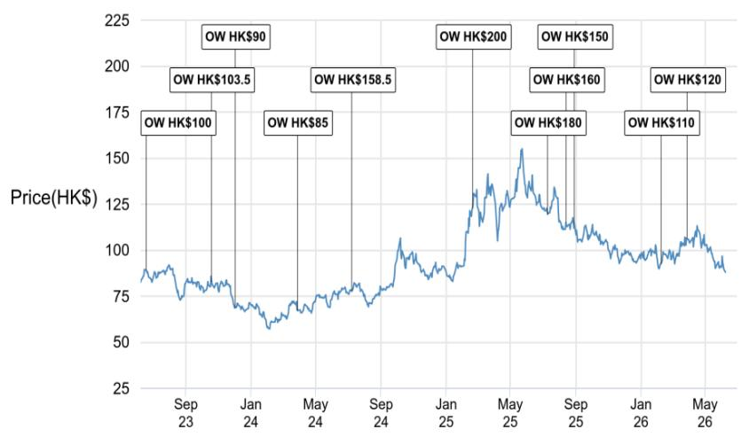

line chart

| Date       | Price(HK$) |
| ---------- | ---------- |
| Sep 23     | 100        |
| Jan 24     | 103.5      |
| May 24     | 85         |
| Sep 24     | 158.5      |
| Jan 25     | 200        |
| May 25     | 180        |
| Sep 25     | 160        |
| Jan 26     | 120        |
| May 26     | 110        |

<table><tr><td>Date</td><td>Rating</td><td>Price (HK$)</td><td>Price Target (HK$)</td></tr><tr><td>19-Jun-23</td><td>OW</td><td>89.13</td><td>100</td></tr><tr><td>20-Oct-23</td><td>OW</td><td>82.67</td><td>103.5</td></tr><tr><td>03-Dec-23</td><td>OW</td><td>68.67</td><td>90</td></tr><tr><td>29-Mar-24</td><td>OW</td><td>67.20</td><td>85</td></tr><tr><td>09-Jul-24</td><td>OW</td><td>77.73</td><td>158.5</td></tr><tr><td>20-Feb-25</td><td>OW</td><td>122.73</td><td>200</td></tr><tr><td>11-Jul-25</td><td>OW</td><td>119.50</td><td>180</td></tr><tr><td>14-Aug-25</td><td>OW</td><td>115.00</td><td>160</td></tr><tr><td>30-Aug-25</td><td>OW</td><td>114.40</td><td>150</td></tr><tr><td>08-Feb-26</td><td>OW</td><td>92.30</td><td>110</td></tr><tr><td>29-Mar-26</td><td>OW</td><td>106.50</td><td>120</td></tr></table>

Source: Bloomberg Finance L.P. and JPM; price data adjusted for stock splits and dividends. Initiated coverage Sep 24, 2002. All share prices are as of market close on the previous business day.

BYD Company Limited - A (002594.SZ, 002594 CH) Price Chart  
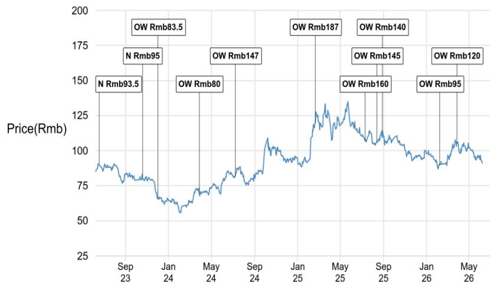

line chart

| Date       | Price(Rmb) |
| ---------- | ---------- |
| Sep 23     | N Rmb93.5  |
| Jan 24     | N Rmb95    |
| May 24     | OW Rmb80   |
| Sep 24     | OW Rmb147  |
| Jan 25     | OW Rmb187  |
| May 25     | OW Rmb140  |
| Sep 25     | OW Rmb160  |
| Jan 26     | OW Rmb145  |
| May 26     | OW Rmb95   |
| May 26     | OW Rmb120  |

<table><tr><td>Date</td><td>Rating</td><td>Price (Rmb)</td><td>Price Target (Rmb)</td></tr><tr><td>19-Jun-23</td><td>N</td><td>90.36</td><td>93.5</td></tr><tr><td>20-Oct-23</td><td>N</td><td>80.20</td><td>95</td></tr><tr><td>03-Dec-23</td><td>OW</td><td>65.68</td><td>83.5</td></tr><tr><td>29-Mar-24</td><td>OW</td><td>69.46</td><td>80</td></tr><tr><td>09-Jul-24</td><td>OW</td><td>81.66</td><td>147</td></tr><tr><td>20-Feb-25</td><td>OW</td><td>119.50</td><td>187</td></tr><tr><td>11-Jul-25</td><td>OW</td><td>107.08</td><td>160</td></tr><tr><td>14-Aug-25</td><td>OW</td><td>106.83</td><td>145</td></tr><tr><td>30-Aug-25</td><td>OW</td><td>114.06</td><td>140</td></tr><tr><td>08-Feb-26</td><td>OW</td><td>89.82</td><td>95</td></tr><tr><td>29-Mar-26</td><td>OW</td><td>105.30</td><td>120</td></tr></table>

Source: Bloomberg Finance L.P. and JPM; price data adjusted for stock splits and dividends. Initiated coverage Dec 03, 2014. All share prices are as of market close on the previous business day.

Geely Automobile Holdings Ltd. (0175) (0175.HK, 175 HK) Price Chart  
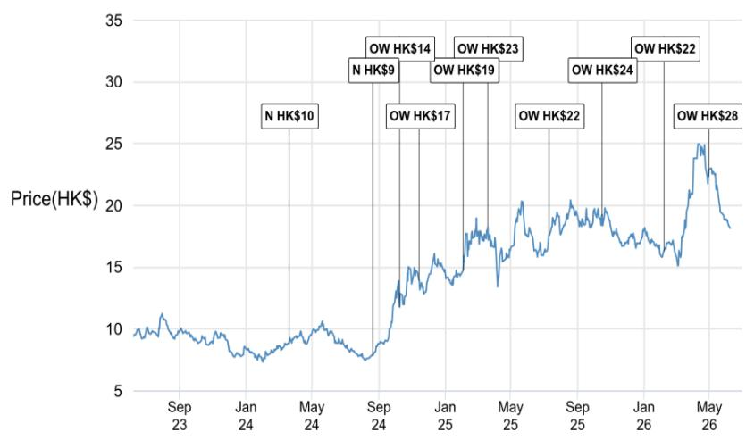

line chart

| Date       | Price(HK$) |
| ---------- | ---------- |
| Sep 23     | ~10        |
| Jan 24     | ~8         |
| May 24     | ~10        |
| Sep 24     | ~15        |
| Jan 25     | ~17        |
| May 25     | ~20        |
| Sep 25     | ~18        |
| Jan 26     | ~16        |
| May 26     | ~25        |

<table><tr><td>Date</td><td>Rating</td><td>Price (HK$)</td><td>Price Target (HK$)</td></tr><tr><td>21-Mar-24</td><td>N</td><td>8.83</td><td>10</td></tr><tr><td>22-Aug-24</td><td>N</td><td>7.88</td><td>9</td></tr><tr><td>10-Oct-24</td><td>OW</td><td>11.78</td><td>14</td></tr><tr><td>15-Nov-24</td><td>OW</td><td>13.90</td><td>17</td></tr><tr><td>04-Feb-25</td><td>OW</td><td>14.78</td><td>19</td></tr><tr><td>21-Mar-25</td><td>OW</td><td>18.24</td><td>23</td></tr><tr><td>11-Jul-25</td><td>OW</td><td>17.60</td><td>22</td></tr><tr><td>16-Oct-25</td><td>OW</td><td>19.17</td><td>24</td></tr><tr><td>08-Feb-26</td><td>OW</td><td>16.31</td><td>22</td></tr><tr><td>30-Apr-26</td><td>OW</td><td>22.34</td><td>28</td></tr></table>

Source: Bloomberg Finance L.P. and JPM; price data adjusted for stock splits and dividends.  
Initiated coverage Sep 26, 2010. All share prices are as of market close on the previous business day.

The chart(s) show JPM's continuing coverage of the stocks; the current analysts may or may not have covered it over the entire period.

JPM ratings or designations: OW = Overweight, N = Neutral, UW = Underweight, NR = Not Rated

## Explanation of Equity Research Ratings, Designations and Analyst(s) Coverage Universe:

JPM uses the following rating system: Overweight (over the duration of the price target indicated in this report, we expect this stock will outperform the average total return of the stocks in the Research Analyst's, or the Research Analyst's team's, coverage universe); Neutral (over the duration of the price target indicated in this report, we expect this stock will perform in line with the average total return of the stocks in the Research Analyst's, or the Research Analyst's team's, coverage universe); and Underweight (over the duration of the price target indicated in this report, we expect this stock will underperform the average total return of the stocks in the Research Analyst's, or the Research Analyst's team's, coverage universe. NR is Not Rated. In this case, JPM has removed the rating and, if applicable, the price target, for this stock because of either a lack of a sufficient fundamental basis or for legal, regulatory or policy reasons. The previous rating and, if applicable, the price target, no longer should be relied upon. An NR designation is not a recommendation or a rating. Some stocks under coverage have a rating but no price target; in these cases, we expect the stock will outperform/perform in line/underperform the average total return of the stocks in the Research Analyst's, or the Research Analyst's team's, coverage universe of the relevant duration of the region. In our Asia (ex-Australia and ex-India) and U.K. small- and mid-cap Equity Research, each stock's expected total return is compared to the expected total return of a benchmark country market index, not to those Research Analysts' coverage universe. If it does not appear in the Important Disclosures section of this report, the certifying Research Analyst's coverage universe can be found on JPM's Research website, https://www.JPMmarkets.com.

Coverage Universe: Lai, Nick YC: BAIC Motor Corp LTD (1958) (1958.HK), BYD Company Limited - A (002594.SZ), BYD Company Limited - H (1211.HK), Brilliance China Automotive (1114) (1114.HK), Chongqing Changan Automobile - A (000625.SZ), Chongqing Changan Automobile - B (200625.SZ), Geely Automobile Holdings Ltd. (0175) (0175.HK), Great Wall Motor - A (601633.SS), Great Wall Motor - H (2333.HK), Guangzhou Automobile Group - A (601238.SS), Guangzhou Automobile Group - H (2238.HK), Li Auto (2015.HK), Li Auto - ADR (LI), NIO (NIO), SAIC Motor Corp - A (600104.SS), Sinotruk (3808) (3808.HK), XPeng (XPEV), XPeng - H (9868.HK), Yongda Auto (3669.HK), Zhejiang Leapmotor Technology Co., Ltd (9863.HK), Zhongsheng Group Holdings (0881) (0881.HK)

JPM Equity Research Ratings Distribution, as of April 04, 2026

<table><tr><td></td><td>Overweight (buy)</td><td>Neutral (hold)</td><td>Underweight (sell)</td></tr><tr><td>JPM Global Equity Research Coverage*</td><td>51%</td><td>37%</td><td>12%</td></tr><tr><td>IB clients**</td><td>83%</td><td>79%</td><td>74%</td></tr><tr><td>JPMS Equity Research Coverage*</td><td>49%</td><td>39%</td><td>13%</td></tr><tr><td>IB clients**</td><td>94%</td><td>93%</td><td>85%</td></tr></table>

\*Please note that the percentages may not add to 100% because of rounding.  
\*\*Percentage of subject companies within each of the "buy," "hold" and "sell" categories for which JPM has provided investment banking services within the previous 12 months.  
For purposes of FINRA ratings distribution rules only, our Overweight rating falls into a buy rating category; our Neutral rating falls into a hold rating category; and our Underweight rating falls into a sell rating category. Please note that stocks with an NR designation are not included in the table above. This information is current as of the end of the most recent calendar quarter.

Equity Valuation and Risks: For valuation methodology and risks associated with covered companies or price targets for covered companies, please see the most recent company-specific research report at http://www.JPMmarkets.com, contact the primary analyst or your JPM representative, or email research.disclosure.inquiries@JPM.com. For material information about the proprietary models used, please see the Summary of Financials in company-specific research reports and the Company Tearsheets, which are available to download on the company pages of our client website, http://www.JPMmarkets.com. This report also sets out within it the material underlying assumptions used.

## History of Investment Recommendations:

A history of JPM investment recommendations disseminated during the preceding 12 months can be accessed on the Research & Commentary page of http://www.JPMmarkets.com where you can also search by analyst name, sector or financial instrument.

Analysts' Compensation: The research analysts responsible for the preparation of this report receive compensation based upon various factors, including the quality and accuracy of research, client feedback, competitive factors, and overall firm revenues.

Registration of non-US Analysts: Unless otherwise noted, the non-US analysts listed on the front of this report are employees of non-US affiliates of JPM Securities LLC, may not be registered as research analysts under FINRA rules, may not be associated persons of JPM Securities LLC, and may not be subject to FINRA Rule 2241 or 2242 restrictions on communications with covered companies, public appearances, and trading securities held by a research analyst account.

## Other Disclosures

JPM is a marketing name for investment banking businesses of JPM Chase & Co. and its subsidiaries and affiliates worldwide.

UK MIFID FICC research unbundling exemption: UK clients should refer to UK MIFID Research Unbundling exemption for details of JPM's implementation of the FICC research exemption and guidance on relevant FICC research categorisation.

All research material made available to clients are simultaneously available on our client website, JPM Markets, unless specifically permitted by relevant laws. Not all research content is redistributed, e-mailed or made available to third-party aggregators. For all research material available on a particular stock, please contact your sales representative.

Any long form nomenclature for references to China; Hong Kong; Taiwan; and Macau within this research material are Mainland China; Hong Kong SAR (China); Taiwan (China); and Macau SAR (China).

JPM may, from time to time, write on issuers or securities targeted by economic or financial sanctions imposed or administered by the governmental authorities of the U.S., EU, UK or other relevant jurisdictions (Sanctioned Securities). Nothing in this report is intended to be read or construed as encouraging, facilitating, promoting or otherwise approving investment or dealing in such Sanctioned Securities. Clients should be aware of their own legal and compliance obligations when making investment decisions.

Any digital or crypto assets discussed in this research report are subject to a rapidly changing regulatory landscape. For relevant regulatory advisories on crypto assets, including bitcoin and ether, please see https://www.JPM.com/disclosures/cryptoasset-disclosure.

The author(s) of this research report may not be licensed to carry on regulated activities in your jurisdiction and, if not licensed, do not hold themselves out as being able to do so.

Exchange-Traded Funds (ETFs): JPM Securities LLC (“JPMS”) acts as authorized participant for substantially all U.S.-listed ETFs. To the extent that any ETFs are mentioned in this report, JPMS may earn commissions and transaction-based compensation in connection with the distribution of those ETF shares and may earn fees for performing other trade-related services, such as securities lending to short sellers of the ETF shares. JPMS may also perform services for the ETFs themselves, including acting as a broker or dealer to the ETFs. In addition, affiliates of JPMS may perform services for the ETFs, including trust, custodial, administration, lending, index calculation and/or maintenance and other services.

Options and Futures related research: If the information contained herein regards options- or futures-related research, such information is available only to persons who have received the proper options or futures risk disclosure documents. Please contact your JPM Representative or visit https://www.theocc.com/components/docs/riskstoc.pdf for a copy of the Option Clearing Corporation's Characteristics and Risks of Standardized Options or https://www.finra.org/sites/default/files/2020-08/Security\_Futures\_Risk\_Disclosure\_Statement\_2020.pdf for a copy of the Security Futures Risk Disclosure Statement.

Changes to Interbank Offered Rates (IBORs) and other benchmark rates: Certain interest rate benchmarks are, or may in the future become, subject to ongoing international, national and other regulatory guidance, reform and proposals for reform. For more information, please consult: https://www.JPM.com/global/disclosures/interbank\_offered\_rates

Private Bank Clients: Where you are receiving research as a client of the private banking businesses offered by JPM Chase & Co. and its subsidiaries (“JPM Private Bank”), research is provided to you by JPM Private Bank and not by any other division of JPM, including, but not limited to, the JPM Corporate and Investment Bank and its Global Research division.

Legal entity responsible for the production and distribution of research: The legal entity identified below the name of the Reg AC Research Analyst who authored this material is the legal entity responsible for the production of this research. Where multiple Reg AC Research Analysts authored this material with different legal entities identified below their names, these legal entities are jointly responsible for the production of this research. Where more than one legal entity is listed under an analyst's name, the first legal entity is responsible for the production unless stated otherwise. Research Analysts from various JPM affiliates may have contributed to the production of this material but may not be licensed to carry out regulated activities in your jurisdiction (and do not hold themselves out as being able to do so). Unless otherwise stated below in the legal entity disclosures, this material has been distributed by the legal entity responsible for production, or where more than one legal entity is listed under the analyst's name, the first legal entity will be responsible for distribution. If you have any queries, please contact the relevant Research Analyst in your jurisdiction or the entity in your jurisdiction that has distributed this research material.

## Legal Entities Disclosures and Country-/Region-Specific Disclosures:

Argentina: JPM Chase Bank N.A Sucursal Buenos Aires is regulated by Banco Central de la República Argentina (“BCRA”-Central Bank of Argentina) and Comisión Nacional de Valores (“CNV”- Argentinian Securities Commission - ALYC y AN Integral N°51).  
Australia: JPM Securities Australia Limited (“JPMSAL”) (ABN 61 003 245 234/AFS Licence No: 238066) is regulated by the Australian Securities and Investments Commission and is a Market Participant of ASX Limited, a Clearing and Settlement Participant of ASX Clear Pty Limited and a Clearing Participant of ASX Clear (Futures) Pty Limited. This material is issued and distributed in Australia by or on behalf of JPMSAL only to "wholesale clients" (as defined in section 761G of the Corporations Act 2001). A list of all financial products covered can be found by visiting https://www.jpmm.com/research/disclosures. JPM seeks to cover companies of relevance to the domestic and international investor base across all Global Industry Classification Standard (GICS) sectors, as well as across a range of market capitalisation sizes. If applicable, in the course of conducting public side due diligence on the subject company(ies), the Research Analyst team may at times perform such diligence through corporate engagements such as site visits, discussions with company representatives, management presentations, etc. Research issued by JPMSAL has been prepared in accordance with JPM Australia’s Research Independence Policy which can be found at the following link: JPM Australia - Research Independence Policy.  
Brazil: Banco JPM S.A. is regulated by the Comissao de Valores Mobiliarios (CVM) and by the Central Bank of Brazil. Ombudsman JPM: 0800-7700847 / 0800-7700810 (For Hearing Impaired) / ouvidoria.jp.morgan@jpmchase.com.  
Canada: JPM Securities Canada Inc. is a registered investment dealer, regulated by the Canadian Investment Regulatory Organization and the Ontario Securities Commission and is the participating member on Canadian exchanges. This material is distributed in Canada by or on behalf of JPM Securities Canada Inc.  
Chile: Inversiones JPM Limitada is an unregulated entity incorporated in Chile.  
China: JPM Securities (China) Company Limited has been approved by CSRC to conduct the securities investment consultancy business.  
Colombia: Banco JPM Colombia S.A. is supervised by the Superintendencia Financiera de Colombia (SFC). Any reference in this material to products or services offered abroad by entities other than the Bank in Colombia is included exclusively for descriptive purposes. Such references do not constitute, and should not be construed as, promotional activity or the provision of financial products or services within Colombian territory, as defined under applicable Colombian regulation.

Dubai International Financial Centre (DIFC): JPM Chase Bank, N.A., Dubai Branch is regulated by the Dubai Financial Services Authority (DFSA) and its registered address is Dubai International Financial Centre - The Gate, West Wing, Level 3 and 9 PO Box 506551, Dubai, UAE. This material has been distributed by JPM Chase Bank, N.A., Dubai Branch to persons regarded as professional clients or market counterparties as defined under the DFSA rules.

European Economic Area (EEA): Unless specified to the contrary, research is distributed in the EEA by JPM SE (“JPM SE”), which is authorised as a credit institution by the Federal Financial Supervisory Authority (Bundesanstalt für Finanzdienstleistungsaufsicht, BaFin) and jointly supervised by the BaFin, the German Central Bank (Deutsche Bundesbank) and the European Central Bank (ECB). JPM SE is a company headquartered in Frankfurt with registered address at TaunusTurm, Taunustor 1, Frankfurt am Main, 60310, Germany. The material has been distributed in the EEA to persons regarded as professional investors (or equivalent) pursuant to Art. 4 para. 1 no. 10 and Annex II of MiFID II and its respective implementation in their home jurisdictions (“EEA professional investors”). This material must not be acted on or relied on by persons who are not EEA professional investors. Any investment or investment activity to which this material relates is only available to EEA relevant persons and will be engaged in only with EEA relevant persons.

Hong Kong: JPM Securities (Asia Pacific) Limited (CE number AAJ321) is regulated by the Hong Kong Monetary Authority and the Securities and Futures Commission in Hong Kong, and JPM Broking (Hong Kong) Limited (CE number AAB027) is regulated by the Securities and Futures Commission in Hong Kong. JPM Chase Bank, N.A., Hong Kong Branch (CE Number AAL996) is regulated by the Hong Kong Monetary Authority and the Securities and Futures Commission, is organized under the laws of the United States with limited liability. Where the distribution of this material is a regulated activity in Hong Kong, the material is distributed in Hong Kong by or through JPM Securities (Asia Pacific) Limited and/or JPM Broking (Hong Kong) Limited. India: JPM India Private Limited (Corporate Identity Number - U67120MH1992FTC068724), having its registered office at JPM Tower, Off. C.S.T. Road, Kalina, Santacruz - East, Mumbai – 400098, is registered with the Securities and Exchange Board of India (SEBI) as a ‘Research Analyst’ having registration number INH000001873. JPM India Private Limited is also registered with SEBI as a member of the National Stock Exchange of India Limited and the Bombay Stock Exchange Limited (SEBI Registration Number – INZ000239730) and as a Merchant Banker (SEBI Registration Number - MB/INM000002970). Telephone: 91-22-6157 3000, Facsimile: 91-22-6157 3990 and Website: http://www.jpmipl.com. JPM Chase Bank, N.A. - Mumbai Branch is licensed by the Reserve Bank of India (RBI) (Licence No. 53/ Licence No. BY.4/94; SEBI - IN/CUS/014/ CDSL : IN-DP-CDSL-444-2008/ IN-DP-NSDL-285-2008/ INBI00000984/ INE231311239) as a Scheduled Commercial Bank in India, which is its primary license allowing it to carry on Banking business in India and other activities, which a Bank branch in India are permitted to undertake. For non-local research material, this material is not distributed in India by JPM India Private Limited. Compliance Officer: Ashutosh Sharma; ashutosh.j.sharma@jpmchase.com; +912261575002. Grievance Officer: Ramprasadh K, jpmipl.research.feedback@JPM.com; +912261573000. Registration granted by SEBI and certification from NISM in no way guarantee performance of the intermediary or provide any assurance of returns to investors. Please visit Terms and Conditions and Most Important Terms and Conditions (MITC). The annual Compliance audit report is available at http://www.jpmipl.com/#research.

Indonesia: PT JPM Sekuritas Indonesia is a member of the Indonesia Stock Exchange and is registered and supervised by the Otoritas Jasa Keuangan (OJK).

Korea: JPM Securities (Far East) Limited, Seoul Branch, is a member of the Korea Exchange (KRX). JPM Chase Bank, N.A., Seoul Branch, is licensed as a branch office of foreign bank (JPM Chase Bank, N.A.) in Korea. Both entities are regulated by the Financial Services Commission (FSC) and the Financial Supervisory Service (FSS). For non-macro research material, the material is distributed in Korea by or through JPM Securities (Far East) Limited, Seoul Branch.

Japan: JPM Securities Japan Co., Ltd. and JPM Chase Bank, N.A., Tokyo Branch are regulated by the Financial Services Agency in Japan.

Malaysia: This material is issued and distributed in Malaysia by JPM Securities (Malaysia) Sdn Bhd (18146-X), which is a Participating Organization of Bursa Malaysia Berhad and holds a Capital Markets Services License issued by the Securities Commission in Malaysia.

Mexico: JPM Casa de Bolsa, S.A. de C.V., JPM Grupo Financiero is member of the Mexican Stock Exchange (“Bolsa Mexicana de Valores”) and the Institutional Stock Exchange (“Bolsa Institucional de Valores”), and it is authorized to act as a broker dealer by the National Banking and Securities Exchange Commission (“Comisión Nacional Bancaria y de Valores”).

New Zealand: This material is issued and distributed by JPMSAL in New Zealand only to "wholesale clients" (as defined in the Financial Markets Conduct Act 2013). JPMSAL is registered as a Financial Service Provider under the Financial Service providers (Registration and Dispute Resolution) Act of 2008.

Philippines: JPM Securities Philippines Inc. is a Trading Participant of the Philippine Stock Exchange and a member of the Securities Clearing Corporation of the Philippines and the Securities Investor Protection Fund. It is regulated by the Securities and Exchange Commission.

Singapore: This material is issued and distributed in Singapore by or through JPM Securities Singapore Private Limited (JPMSS) [MDDI (P) 057/08/2025 and Co. Reg. No.: 199405335R], which is a member of the Singapore Exchange Securities Trading Limited, and/or JPM Chase Bank, N.A., Singapore branch (JPMCB Singapore), both of which are regulated by the Monetary Authority of Singapore. This material is issued and distributed in Singapore only to accredited investors, expert investors and institutional investors, as defined in Section 4A of the Securities and Futures Act, Cap. 289 (SFA). This material is not intended to be issued or distributed to any retail investors or any other investors that do not fall into the classes of “accredited investors,” “expert investors” or “institutional

investors," as defined under Section 4A of the SFA. Recipients of this material in Singapore are to contact JPMSS or JPMCB Singapore in respect of any matters arising from, or in connection with, the material.

South Africa: JPM Equities South Africa Proprietary Limited and JPM Chase Bank, N.A., Johannesburg Branch are members of the Johannesburg Securities Exchange and are regulated by the Financial Services Conduct Authority (FSCA).

Taiwan: JPM Securities (Taiwan) Limited is a participant of the Taiwan Stock Exchange (company-type) and regulated by the Taiwan Securities and Futures Bureau. Material relating to equity securities is issued and distributed in Taiwan by JPM Securities (Taiwan) Limited, subject to the license scope and the applicable laws and the regulations in Taiwan. To the extent that JPM Securities (Taiwan) Limited produces research materials on securities not listed on the Taiwan Stock Exchange or Taipei Exchange (“Non-Taiwan Listed Securities”), these materials shall not constitute securities recommendations for the purpose of applicable Taiwan regulations, and, for the avoidance of doubt, JPM Securities (Taiwan) Limited does not act as broker for Non-Taiwan Listed Securities. According to Paragraph 2, Article 7-1 of Operational Regulations Governing Securities Firms Recommending Trades in Securities to Customers (as amended or supplemented) and/or other applicable laws or regulations, please note that the recipient of this material is not permitted to engage in any activities in connection with the material that may give rise to conflicts of interests, unless otherwise disclosed in the “Important Disclosures” in this material.

Thailand: This material is issued and distributed in Thailand by JPM Securities (Thailand) Ltd., which is a member of the Stock Exchange of Thailand and is regulated by the Ministry of Finance and the Securities and Exchange Commission. The registered address is 548 One City Center Building, 50th Floor, Ploenchit Road, Lymphini, Pathum Wan, Bangkok 10330.

UK: Research is produced in the UK by JPM Securities plc (“JPMS plc”) which is a member of the London Stock Exchange and is authorised by the Prudential Regulation Authority and regulated by the Financial Conduct Authority and the Prudential Regulation Authority or JPM Markets Limited (“JPMML Ltd”) which is authorised and regulated by the Financial Conduct Authority. Unless specified to the contrary, this material is distributed in the UK by JPMS plc and is directed in the UK only to: (a) persons having professional experience in matters relating to investments falling within article 19(5) of the Financial Services and Markets Act 2000 (Financial Promotion) (Order) 2005 (“the FPO”); (b) persons outlined in article 49 of the FPO (high net worth companies, unincorporated associations or partnerships, the trustees of high value trusts, etc.); or (c) any persons to whom this communication may otherwise lawfully be made; all such persons being referred to as "UK relevant persons". This material must not be acted on or relied on by persons who are not UK relevant persons. Any investment or investment activity to which this material relates is only available to UK relevant persons and will be engaged in only with UK relevant persons. A description of JPM EMEA’s policy for prevention and avoidance of conflicts of interest related to the production of Research can be found at the following link: JPM EMEA - Research Independence Policy.

U.S.: JPM Securities LLC (“JPMS”) is a member of the NYSE, FINRA, SIPC, and the NFA. JPM Chase Bank, N.A. is a member of the FDIC. Material published by non-U.S. affiliates is distributed in the U.S. by JPMS who accepts responsibility for its content.

General: Additional information is available upon request. The information in this material has been obtained from sources believed to be reliable. While all reasonable care has been taken to ensure that the facts stated in this material are accurate and that the forecasts, opinions and expectations contained herein are fair and reasonable, JPM Chase & Co. or its affiliates and/or subsidiaries (collectively JPM) make no representations or warranties whatsoever to the completeness or accuracy of the material provided, except with respect to any disclosures relative to JPM and the Research Analyst's involvement with the issuer that is the subject of the material. Accordingly, no reliance should be placed on the accuracy, fairness or completeness of the information contained in this material. There may be certain discrepancies with data and/or limited content in this material as a result of calculations, adjustments, translations to different languages, and/or local regulatory restrictions, as applicable. These discrepancies should not impact the overall investment analysis, views and/or recommendations of the subject company(ies) that may be discussed in the material. Artificial intelligence tools may have been used in the preparation of this material, including assisting in data analysis, pattern recognition, and content drafting for research material. JPM accepts no liability whatsoever for any loss arising from any use of this material or its contents, and neither JPM nor any of its respective directors, officers or employees, shall be in any way responsible for the contents hereof, apart from the liabilities and responsibilities that may be imposed on them by the relevant regulatory authority in the jurisdiction in question, or the regulatory regime thereunder. Opinions, forecasts or projections contained in this material represent JPM's current opinions or judgment as of the date of the material only and are therefore subject to change without notice. Periodic updates may be provided on companies/industries based on company-specific developments or announcements, market conditions or any other publicly available information. There can be no assurance that future results or events will be consistent with any such opinions, forecasts or projections, which represent only one possible outcome. Furthermore, such opinions, forecasts or projections are subject to certain risks, uncertainties and assumptions that have not been verified, and future actual results or events could differ materially. The value of, or income from, any investments referred to in this material may fluctuate and/or be affected by changes in exchange rates. All pricing is indicative as of the close of market for the securities discussed, unless otherwise stated. Past performance is not indicative of future results. Accordingly, investors may receive back less than originally invested. This material is not intended as an offer or solicitation for the purchase or sale of any financial instrument. The opinions and recommendations herein do not take into account individual client circumstances, objectives, or needs and are not intended as recommendations of particular securities, financial instruments or strategies to particular clients. This material may include views on structured securities, options, futures and other derivatives. These are complex instruments, may involve a high degree of risk and may be appropriate investments only for sophisticated investors who are capable of understanding and assuming the risks involved. The recipients of this material must make their own

independent decisions regarding any securities or financial instruments mentioned herein and should seek advice from such independent financial, legal, tax or other adviser as they deem necessary. JPM may trade as a principal on the basis of the Research Analysts' views and research, and it may also engage in transactions for its own account or for its clients' accounts in a manner inconsistent with the views taken in this material, and JPM is under no obligation to ensure that such other communication is brought to the attention of any recipient of this material. Others within JPM, including Strategists, Sales staff and other Research Analysts, may take views that are inconsistent with those taken in this material. Employees of JPM not involved in the preparation of this material may have investments in the securities (or derivatives of such securities) mentioned in this material and may trade them in ways different from those discussed in this material. This material is not an advertisement for or marketing of any issuer, its products or services, or its securities in any jurisdiction.

Confidentiality and Security Notice: This transmission may contain information that is privileged, confidential, legally privileged, and/or exempt from disclosure under applicable law. If you are not the intended recipient, you are hereby notified that any disclosure, copying, distribution, or use of the information contained herein (including any reliance thereon) is STRICTLY PROHIBITED. Although this transmission and any attachments are believed to be free of any virus or other defect that might affect any computer system into which it is received and opened, it is the responsibility of the recipient to ensure that it is virus free and no responsibility is accepted by JPM Chase & Co., its subsidiaries and affiliates, as applicable, for any loss or damage arising in any way from its use. If you received this transmission in error, please immediately contact the sender and destroy the material in its entirety, whether in electronic or hard copy format. This message is subject to electronic monitoring: https://www.JPM.com/disclosures/email

MSCI: Certain information herein (“Information”) is reproduced by permission of MSCI Inc., its affiliates and information providers (“MSCI”) ©2026. No reproduction or dissemination of the Information is permitted without an appropriate license. MSCI MAKES NO EXPRESS OR IMPLIED WARRANTIES (INCLUDING MERCHANTABILITY OR FITNESS) AS TO THE INFORMATION AND DISCLAIMS ALL LIABILITY TO THE EXTENT PERMITTED BY LAW. No Information constitutes investment advice, except for any applicable Information from MSCI ESG Research. Subject also to msci.com/disclaimer

Sustainalytics: Certain information, data, analyses and opinions contained herein are reproduced by permission of Sustainalytics and: (1) includes the proprietary information of Sustainalytics; (2) may not be copied or redistributed except as specifically authorized; (3) do not constitute investment advice nor an endorsement of any product or project; (4) are provided solely for informational purposes; and (5) are not warranted to be complete, accurate or timely. Sustainalytics is not responsible for any trading decisions, damages or other losses related to it or its use. The use of the data is subject to conditions available at https://www.sustainalytics.com/legal-disclaimers. ©2026 Sustainalytics. All Rights Reserved.

"Other Disclosures" last revised May 16, 2026.

Copyright 2026 JPM Chase & Co. All rights reserved. This material or any portion hereof may not be reprinted, sold or redistributed without the written consent of JPM. It is strictly prohibited to use or share without prior written consent from JPM any research material received from JPM or an authorized third-party (“JPM Data”) in any third-party artificial intelligence (“AI”) systems or models when such JPM Data is accessible by a third-party.