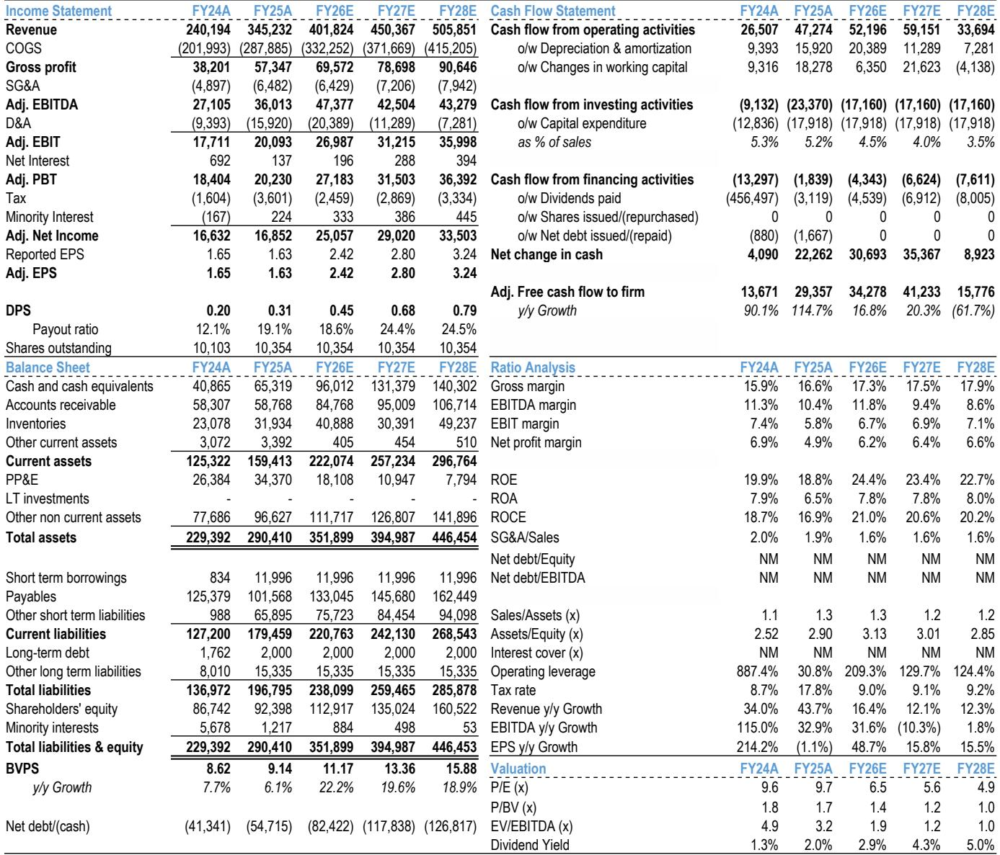
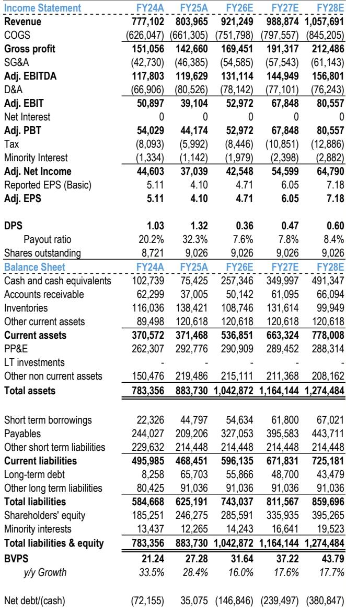

# JPM：中国车企在欧洲的真正优势不是价格，而是零售执行与生态系统的护城河

市场对中国汽车出海的讨论，长期集中在两个叙事上：一是关税壁垒，二是低价倾销。但JPM最近一份基于欧洲实地调研的报告，提供了一个截然不同的判断框架。

这份报告的核心发现是：中国车企在欧洲的份额增长，已经不是简单的“便宜BEV出口”故事。2026年4月，中国品牌在欧洲新能源车市场的份额达到18.3%，是去年同期的三倍以上。更关键的是，这一增长背后，是三个被市场低估的结构性变量在同时起作用——产品组合策略、零售执行能力和充电生态建设。

报告分析师团队在伦敦和巴黎的BYD门店进行了实地走访，并与欧洲汽车大会的行业参与者进行了深度交流。基于这些第一手信息，JPM将比亚迪和吉利2026年的海外销量预测分别上调了约15%和30%。

以下是我们从这份报告中提炼出的四个关键洞察，以及一个报告尚未完全回答的关键问题。

## 1. 欧洲不是一个纯BEV市场，中国车企正在用“混合动力+品牌阶梯”组合赢得过渡期

市场普遍认为中国电动车出海就是卖纯电，但JPM的门店调研揭示了一个截然不同的现实：在欧洲这个“混合动力过渡市场”，PHEV的贡献正在快速上升。

在巴黎和伦敦的BYD门店，销售人员反馈，订单中PHEV占比高达50%到60%。最畅销的PHEV车型Seal U DMi起售价约4万欧元，月供仅600-700欧元，等待时间约一个月。而纯电车型Sealion 7虽然也被定位为“高性价比”产品，但在巴黎门店的等待时间长达三到四个月，表明供应端存在明显瓶颈。

这意味着什么？中国车企的竞争优势并非来自单一价格战，而是来自“多动力总成组合+品牌阶梯”的产品矩阵。比亚迪从主流品牌到高端品牌Denza的布局，吉利通过极氪等品牌的多层次覆盖，都在执行同样的逻辑。

对行业竞争格局的含义：传统欧洲车企面临的不再是“一个便宜BEV对手”，而是一个能同时提供BEV、PHEV和HEV的完整产品组合，并且通过品牌阶梯不断向上延伸的竞争者。这种竞争压力是全方位的，而不是局部的。

## 2. 零售执行正在成为中国车企最深的护城河：渠道密度、试驾转化率和残值管理

JPM报告中一个容易被忽视但极具洞察力的发现是：中国车企正在把“零售执行”变成核心竞争壁垒，而不是简单的渠道铺设。

BYD在欧洲的扩张策略强调物理门店密度和试驾转化率。报告提到，BYD的试驾转化率高达45%到50%，这意味着每两个进店试驾的消费者中，就有一个最终下单。同时，BYD强调残值管理和月供竞争力，而不是依赖MSRP折扣竞争。门店调研显示，BYD大多数车型的折扣仅在5%到7%之间，销售人员解释这是“营销惯例”，而非价格战。

这种“快零售+服务信用”的打法，与传统出口分销模式形成了鲜明对比。传统车企的经销商网络往往更注重库存管理和价格维护，而中国车企正在把零售端的每一个环节都变成可量化的增长引擎。

对竞争格局的含义：传统欧洲车企如果要应对这种竞争，不仅需要调整产品，还需要重新配置经销商网络的经济模型和库存策略。这比单纯降价要困难得多，也慢得多。

## 3. 充电生态正在成为下一个差异化维度，而不仅仅是车辆本身

报告中一个令人意外的发现是，BYD正在将充电基础设施（包括闪充技术）作为整体拥有成本体验的一部分来构建，而不仅仅是卖车。

BYD管理层表示，计划到2026年底在欧洲部署3,000个闪充桩，其中英国300个。更值得注意的是，在巴黎门店，销售人员反馈，尽管Denza Z9 GT尚未在欧洲正式发布，仅有一个约11.5万欧元的初步定价，但已经收到了大量订单，等待时间长达六个月。这款车将搭载BYD最新的闪充解决方案，SOC从10%充到97%仅需9分钟。

这意味着什么？如果BYD的充电网络能够按计划落地，它将从根本上改变消费者的购买决策逻辑。买家将不再仅仅比较车辆价格和配置，而是比较“整体拥有体验”——充电便利性、残值保障、月供竞争力。这将帮助BYD避开纯粹的价格竞争，转而建立基于生态系统的差异化优势。

对传统车企的启示：它们现在不仅需要在车辆规格上竞争，还需要在充电接入、软件堆栈、服务计划等生态维度上做出回应。这要求它们重新思考什么是“捆绑销售”，什么是“选装配置”。

## 4. 出海的结构性支撑正在强化，但本地化落地是决定长期成败的关键变量

JPM认为，中国车企的出口增长是结构性的，而非周期性的。核心支撑来自出口结构的快速变化：中国乘用车出口中，新能源车占比已超过50%，而PHEV在新能车出口中的占比还在持续上升。

但报告也明确指出，本地化将是决定长期成败的关键变量。比亚迪走的是垂直整合路线，在巴西和匈牙利建设工厂；吉利则更倾向于合作伙伴关系/KD模式，与马来西亚宝腾、西班牙福特等合作。两种模式各有优劣，但共同点是都在加速本地化布局。

对投资者的含义：本地化能力将成为区分中国车企长期竞争力的核心指标。能够有效规避关税和非关税壁垒、同时保持成本优势的企业，将在海外市场获得更可持续的增长。

## 报告尚未完全回答的关键问题：充电网络执行能否真正改变品牌溢价？

JPM对BYD充电网络的描述令人振奋，但报告本身也承认，执行将是关键。3,000个闪充桩在欧洲的部署，涉及土地获取、电网接入、当地政策审批等一系列复杂问题。BYD能否在2026年底前完成这一目标，目前仍是一个需要持续验证的假设。

更重要的是，充电网络的部署能否真正转化为品牌溢价？Denza在巴黎门店的初步订单数据令人印象深刻，但这批早期购买者可能是品牌先行者或技术尝鲜者。当Denza正式发布并进入大众市场后，消费者是否愿意为“闪充”支付11.5万欧元的高价，与保时捷Taycan直接竞争？这个问题，报告没有给出答案，但值得所有关注中国车企出海的人持续跟踪。

另外一个未解问题是：传统欧洲车企的“在中国，为全球”战略能否奏效？报告提到，部分全球OEM正在尝试从中国出口车型，并利用中国成本优势的供应链服务全球网络。这一策略能否真正转化为竞争力，取决于它们能否在品牌定位、成本结构和渠道配置上做出根本性调整。

## 对读者的观察框架

基于这份报告，我们建议从以下三个维度持续跟踪中国车企的海外进展：

第一，关注月度市场份额数据，特别是PHEV在海外销量中的占比变化。这比单月销量数字更能反映产品组合策略的成效。

第二，关注门店密度和试驾转化率。如果一家中国车企在某个欧洲国家的门店数量增长快于竞争对手，且试驾转化率维持在40%以上，这通常是份额快速提升的前兆。

第三，关注充电网络的实际部署进度，而不仅仅是规划目标。BYD能否在2026年底前部署3,000个闪充桩，将是检验其生态系统战略执行力的关键指标。

这些维度的变化，远比单月销量波动更能揭示中国车企出海的真实竞争力。

---

关于本地化策略的更多细节，包括比亚迪与吉利在海外工厂布局上的具体差异，以及传统欧洲车企“在中国，为全球”战略的完整分析，欢迎加入我们的知识星球微信群，与产业研究者一同深入讨论。

Personal reading notes and learning share only. Not investment advice.

