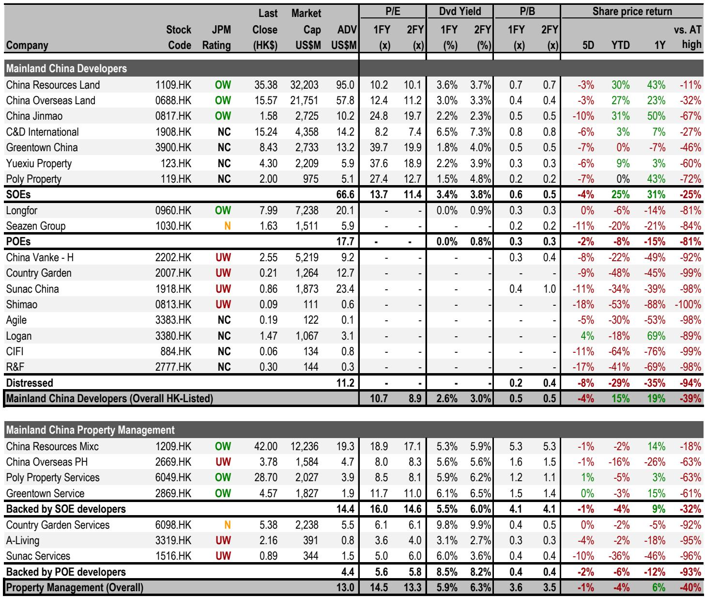
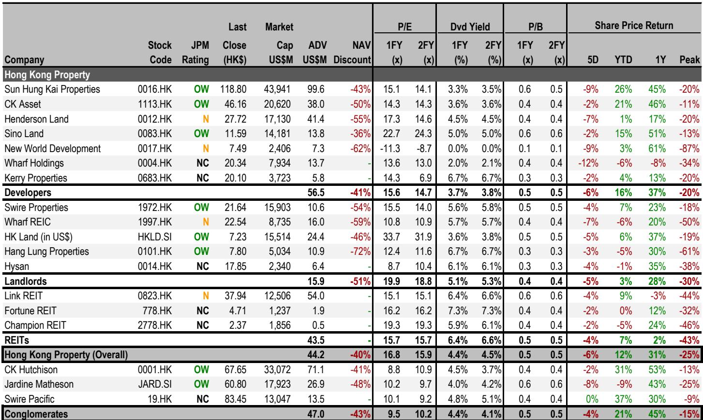
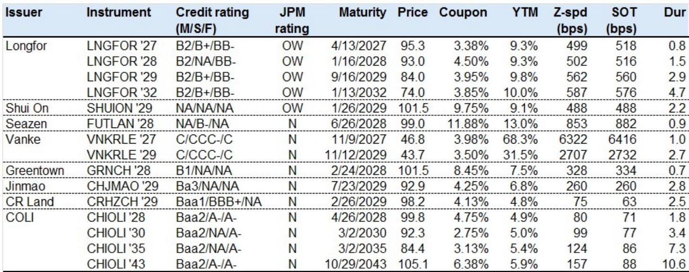

# JPM：香港房价已接近全年预测上限，但真正的不确定性不在价格本身

这份JPM最新发布的Property Data Monitor，数据本身并不复杂。但如果我们只把它当作周度数据读，就错过了报告真正想传递的信号。

核心判断是：香港住宅市场正在快速接近JPM2026年全年房价预测区间10%-15%的上沿——年初至今已涨9.6%，距离上限仅0.4个百分点。这意味着，如果当前趋势延续，JPM对全年的基准预测可能在未来几周内被触及甚至突破。但报告真正值得关注的，不是这个数字本身，而是它背后揭示的市场结构：一手楼定价策略正在发生微妙但重要的转变，而内地市场的库存消化节奏，正在从“量”的改善转向“价”的博弈。

以下是我们从这份报告中提炼的五个关键洞察，以及一个报告尚未完全回答的问题。

## 1. 香港一手楼定价正在从“折让”转向“溢价”，这可能是市场信心分层的信号

过去两年，香港开发商普遍采用“低开”策略——一手楼定价低于或持平于二手市场，以加速去化。但这份报告显示，上周推出的三个新盘中，有两个定价显著高于周边二手物业：Pavilia Rosa（九龙塘）首批均价达33,800港元/平方呎，高出二手市场41%，创过去五年一手新盘定价最高纪录。即使是定价相对保守的Headland Residences（柴湾）和One Victoria Cove Ph4（红磡），仍分别高出二手市场15%和18%。

这组数据意味着什么？不是开发商集体乐观，而是市场正在出现明显的“价格分层”。高端地段（如九龙塘）的一手楼开始敢于定出显著溢价，而中端项目仍在谨慎试水。报告没有直接展开这个判断，但结合其后续提到的深圳高端住宅销售强劲、中端疲软的分化现象，可以合理推断：香港住宅市场正在经历类似的“K型复苏”——高净值买家的购买力依然充沛，但中产阶层的承接力正在减弱。

对投资者的含义：如果这一趋势持续，未来几个月香港住宅市场可能出现“量缩价稳”甚至“量缩价升”的格局——交易量下降，但价格指数因结构性偏向高端成交而继续上行。这会让表面上的价格数据更具误导性。

## 2. 内地二手房挂牌量下降，但库存月数仍高，真正的拐点取决于“卖方退场速度”是否快于“买方入场速度”

报告最值得关注的内地数据，不是18%的同比销售增长，而是两个领先指标：一线城市二手房挂牌量环比下降0.7%，库存月数从18.8个月微降至18.6个月。北京降幅最大（-2%），上海次之（-1%）。

从绝对水平看，18.6个月的库存月数仍然较高——行业一般认为12个月是供需平衡线。但边际变化的方向更重要：挂牌量下降意味着卖方在减少，而非买方在增加。这是一个典型的“供给收缩型改善”。报告中的中原经理信心指数持平于54，也印证了市场情绪并未显著升温。

这意味着当前内地房地产市场的改善，更多来自“卖房的人少了”，而不是“买房的人多了”。这种改善的可持续性，取决于卖方退场速度能否持续快于买方入场速度。如果未来几个月政策刺激或经济预期改善带动需求回升，库存月数有望加速下降；但如果需求维持疲弱，供给收缩的边际效应会递减。

对投资者的含义：当前不宜将销售数据改善简单解读为“市场见底”。更值得跟踪的是库存月数的下降斜率，以及中原挂牌价格指数是否会从当前持平状态转向上行。

## 3. 深圳住宅市场正在出现“AI财富效应”驱动的结构性分化，但这一逻辑能否外推至其他城市仍存疑

报告在Credit View部分引用了JPM在深圳的专家会议信息，这是一个值得单独拆解的洞察。专家指出，深圳住宅市场呈现明显的两极分化：高端住宅销售强劲，背后是AI/股市带来的正向财富效应；中端市场疲弱，低端市场虽有部分成交量恢复，但整体仍不乐观。南山区和福田区表现优于其他区域。

这一观察的重要性在于：它首次明确将“AI财富效应”与住宅需求关联起来。过去我们更多讨论AI对科技产业和资本市场的拉动，但JPM的专家会议提示，这种效应正在溢出到实物资产——尤其是深圳这样的科技中心城市。

但我们必须谨慎：深圳的特殊性在于其经济体量和科技产业集中度，这一逻辑能否外推至其他一线城市（如北京、上海），甚至二线城市，存在很大不确定性。报告没有展开，但我们可以合理推断：AI财富效应在深圳的溢出，可能与当地创投生态、股权激励变现等机制密切相关，这些在其他城市可能并不具备。

对投资者的含义：如果认可“AI财富效应→高端住宅需求”这一传导链，那么深圳高端住宅开发商和持有者可能受益最直接。但这一判断的验证，需要更多城市层面的数据支撑。

## 4. 内地资本外流管控收紧对香港楼市的实际影响，可能低于市场担忧

报告提到，上周香港地产板块下跌6%，跑输恒指，主要原因是市场担忧内地资本外流管控收紧和潜在加息。但JPM的深圳专家会议给出了一个反直觉的判断：专家认为，近期资本管控收紧对内地居民购买香港住宅的实质影响有限。

这一判断的逻辑基础是：内地居民购买香港房产的资金流动，大多数已经通过合规渠道完成，增量管控的边际效应可能不大。此外，香港楼市的本地需求（换楼、投资）仍然存在，并非完全依赖内地买家。

但报告没有完全展开的是：如果管控收紧叠加香港本地加息，两者的叠加效应可能被低估。尤其是当前香港住宅价格已接近全年预测上限，任何负面冲击都可能触发获利回吐。

对投资者的含义：市场对政策风险的定价可能已经过度，但真正的风险在于“政策叠加”而非单一因素。建议关注香港银行体系流动性变化和按揭利率走势，这些才是更直接的领先指标。

## 5. 报告尚未完全回答的关键问题：开发商定价策略的转变，是主动选择还是被动结果？

这是整份报告最值得追问的问题。香港开发商敢于对新盘定出显著溢价，可能有三种解释：一是开发商对后市信心增强；二是土地成本高企倒逼高价开盘；三是开发商在“赌”高端需求能够支撑独立行情。

这三种解释对应完全不同的投资含义。如果是信心增强，那么整个板块估值中枢可能上移；如果是成本倒逼，那么利润率改善空间有限；如果是“赌”需求，那么一旦高端需求不及预期，库存风险会快速暴露。

报告提供了数据，但没有给出判断。这可能是JPM有意留白——毕竟，这需要更多后续销售数据来验证。但对读者而言，这是一个值得持续跟踪的关键变量：未来2-3个月新盘的销售去化率，将直接揭示开发商的定价策略是“底气”还是“赌注”。

---

以上五个洞察，只是这份JPMProperty Data Monitor的冰山一角。报告还包含更详细的60城销售数据拆解、中原领先指标的图表分析、以及JPM在信用债市场的具体推荐标的（如LNGFOR '29s和SHUION '29s的定价与收益率）。

真正有价值的讨论，往往发生在数据之外：比如，AI财富效应的可持续性如何验证？香港开发商定价策略的转变，何时会反映在财报中？内地库存月数的边际改善，是否足以支撑地产板块的估值修复？

这些问题，我们会在知识星球和微信群里继续展开。欢迎加入，与更多关注全球资产配置和产业周期的读者一起，持续追踪这些关键变量的演变。

Personal reading notes and learning share only. Not investment advice.

