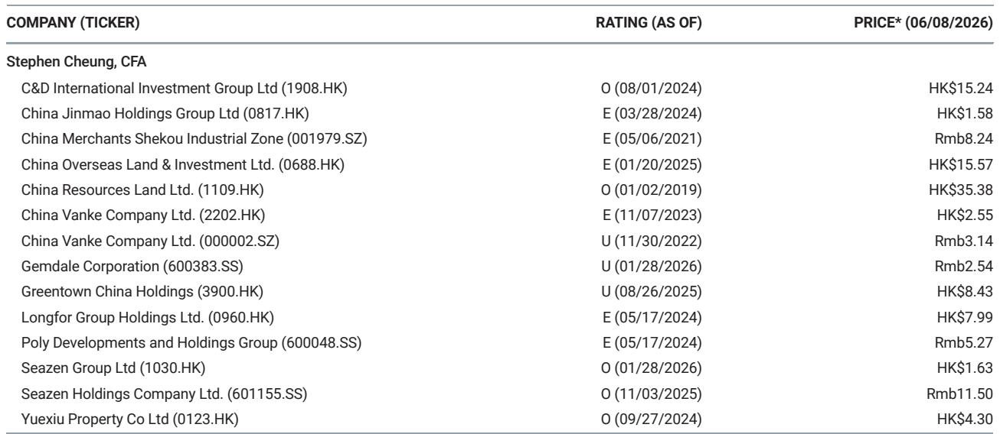
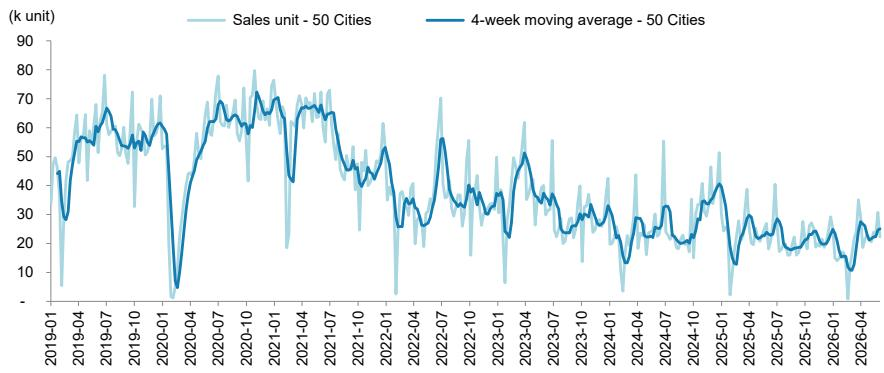

# China’s Property Market Is Not Recovering Evenly — It Is Dividing Into Two Separate Realities

The most important signal from the latest weekly data is not the headline growth in sales. It is the divergence between what the primary and secondary markets are telling us, and the uncomfortable conclusion that policy-driven stabilization in new-home sales is masking a deeper structural weakness in housing demand. For the week ended June 7, primary registered unit sales across 50 Chinese cities rose 23% year-over-year, accelerating from 14% growth the prior week. Year-to-date, however, sales remain 12% below last year’s level. This is not a recovery narrative. This is a market that has become dependent on episodic policy interventions to generate any positive comparison at all, and those comparisons are increasingly fragile when calendar effects and low bases are stripped away.

The data from a leading global investment bank’s China Property Weekly Database Tracker reveals a market that is bifurcating along tier lines, between new and resale, and between price discovery and price control. Investors who treat the 23% weekly growth as a sign of normalization are misreading the signal. The real story is that Tier 1 cities — the bellwether for market confidence — saw primary sales grow only 1% year-over-year, a dramatic deceleration from 27% growth the previous week. Meanwhile, Tier 2 cities surged 30% and Tier 3 cities rose 22%. The growth is happening where it is least sustainable and slowing where it matters most.

This is not a market healing. It is a market being managed. And management creates distortions that require careful interpretation, not blind extrapolation. The question every serious investor should be asking is not whether sales are improving, but whether the improvement is real, durable, and indicative of genuine demand recovery — or whether it is a temporary artifact of policy timing, low comparables, and concentrated supply.

The answer has profound implications for asset allocation across Chinese equities, credit, and property-linked sectors. This article unpacks what the data actually shows, why the conventional interpretation is misleading, and what strategic questions remain unanswered.

## The Apparent Sales Recovery Is Driven by Tier 2 and Tier 3 Cities, Not by Tier 1 Leadership — and That Inverts the Normal Recovery Pattern

In any healthy property cycle, recovery begins in Tier 1 cities. Prime locations see the earliest price stabilization, the fastest absorption of new supply, and the strongest demand from both end-users and investors. That pattern has held across every major Chinese property cycle of the past two decades. The current data breaks that pattern decisively.

Tier 1 primary sales grew just 1% year-over-year in the latest week, down from 27% the week before. This is not a one-week blip. It is a continuation of a trend in which Tier 1 markets have failed to generate sustained momentum despite the most aggressive policy support. The four-week moving average of total 50-city sales, as shown in the report’s exhibit, has been trending sideways to lower since early 2025, oscillating in a narrow range well below pre-2020 levels. The Tier 1 deceleration is the canary in the coal mine.

By contrast, Tier 2 cities posted 30% year-over-year growth, and Tier 3 cities 22%. These are impressive numbers, but they require context. Tier 2 and Tier 3 markets have lower absolute transaction volumes, meaning percentage swings are inherently more volatile. More importantly, these markets are more exposed to policy-driven demand release — such as purchase restriction relaxations, mortgage rate cuts, and down-payment reductions — which can pull forward demand from future quarters. When the policy stimulus fades, the comparison base normalizes, and the risk of a sharp deceleration rises.

The implication is clear: if the recovery cannot sustain itself in Tier 1, it is unlikely to be self-reinforcing nationwide. Tier 1 cities are the price setters and confidence anchors. Their weakness suggests that the underlying demand problem — household income uncertainty, demographic decline, and housing oversupply — remains unresolved. The higher growth in lower-tier cities may reflect a catch-up effect, but it is a fragile one.

## Secondary Market Activity Is Growing Faster Than Primary Market Activity, Signaling That Homeowners Are Exiting While Developers Are Still Trying to Sell

The secondary market data tells a different and potentially more revealing story. Weekly secondary registered unit sales in 10 cities rose 23% year-over-year, accelerating from 9% growth the prior week. Year-to-date, secondary sales are up 6% — a stark contrast to the 12% year-to-date decline in primary sales.

This divergence is critical. In a normal recovery, primary and secondary markets move together, with primary sales leading as developers launch new projects and secondary sales following as homeowners gain confidence to trade up. What we are seeing instead is secondary sales outperforming primary sales. That pattern is consistent with a market in which existing homeowners are using the window of policy-induced price stability to exit their positions, while developers are struggling to move new inventory.

The Tier 1 secondary market data reinforces this interpretation. Weekly secondary unit sales in Tier 1 cities rose 34% year-over-year, compared to just 1% growth in primary sales. This is a massive gap. It suggests that in the most liquid and transparent markets, sellers are finding buyers for existing homes, but demand for new construction is stagnant. That is not a sign of a healthy cycle. It is a sign of inventory rotation: existing stock is changing hands, but the overall stock of unsold new homes is not being absorbed.

The sell-through rate data adds further texture. Total sell-through rate for new launches was 100% last week, compared to 53% the prior week. At first glance, this looks like a dramatic improvement. But the report notes that this was because there were only a few new launches in Shanghai. In Tier 1 cities, the sell-through rate hit 100% versus 63% previously. In Tier 2 cities, there were no new launches at all. A 100% sell-through rate on negligible supply is not a bullish signal. It is a statistical artifact.

What this means for investors is that the primary market is being starved of new supply, not because demand is overwhelming, but because developers are holding back launches in a low-confidence environment. When supply does come to market, it is concentrated in a few high-quality projects that sell out quickly — but that does not indicate broad-based demand recovery. The secondary market is where the real price discovery is happening, and the data there suggests that homeowners are more eager to sell than to buy new.

## The Ask-Price Index Is Flat, but the Agent Activity Index Is Rising — a Contradiction That Points to a Market in Price Discovery, Not Price Recovery

The Centraline six-city secondary asking price tracking index stood at 17.5%, unchanged from the previous week. At the same time, the property agent index in Tier 1 cities rose to 54.4 from 53.8. These two metrics are moving in opposite directions from what a recovery would require.

A rising agent index typically indicates increased transaction activity — more viewings, more listings, more negotiations. That is consistent with the volume growth we see in secondary sales. But if volumes are rising and prices are not, it suggests that the market is clearing at lower or stable prices, not at higher ones. Sellers are accepting current prices to complete transactions, rather than holding out for appreciation. That is the hallmark of a market that is finding a floor, not one that is rebounding.

The flat ask-price index is also notable because it comes after a period of significant price declines. Stabilization at these levels could be interpreted as a base being formed. But the risk is that this is a temporary plateau created by policy intervention — mortgage rate cuts, purchase restriction relaxations, and developer financing support — rather than a genuine equilibrium between supply and demand. If policy support is withdrawn or proves insufficient to reignite household confidence, prices could resume their downward trajectory from this level.

The strategic implication for investors is that price discovery is still underway. The market has not yet reached a clearing price that balances the enormous overhang of unsold inventory with the diminished purchasing power of households. The flat ask-price index may be masking significant heterogeneity at the project and city level. Some locations are seeing genuine demand; others are seeing only distress sales.

## What the Report Does Not Fully Answer: How Much of the Demand Is Real, and How Much Is Policy-Induced Pull-Forward

The report provides a detailed snapshot of transaction volumes, but it does not — and cannot — answer the most important question for forward-looking investors: what portion of current sales represents genuine end-user demand, and what portion represents demand that has been pulled forward from future quarters by aggressive policy stimulus?

This is not a criticism of the data. It is a limitation inherent in any high-frequency tracker. Volume data tells you what happened, not why it happened. The distinction matters enormously for forecasting. If current sales are being driven by households who were already planning to buy and have simply accelerated their purchases in response to lower rates and relaxed restrictions, then future quarters will see a demand hole as that pull-forward effect exhausts itself. If, on the other hand, current sales are being driven by new household formation, immigration into Tier 1 and Tier 2 cities, or genuine improvement in disposable income, then the recovery has legs.

The available evidence tilts toward the pull-forward interpretation. The deceleration in Tier 1 primary sales despite the most aggressive policy support suggests that the pool of willing and able buyers in premium markets is limited. The outperformance of secondary sales suggests that existing homeowners are using the policy window to exit, not to upgrade. And the flat ask-price index suggests that price expectations have not shifted upward, which is inconsistent with a demand-driven recovery.

Investors need to watch for two leading indicators in the coming months. First, whether Tier 1 primary sales can re-accelerate without a new round of policy stimulus. Second, whether the secondary-to-primary sales ratio begins to normalize, which would indicate that new-home demand is catching up with resale activity. Until those signals appear, the current data should be treated as evidence of stabilization, not recovery.

## A Decision Framework for Investors: How to Read the Next Three Months of Data

For investors who need to make portfolio decisions based on incomplete information, the following framework can help distinguish between noise and signal in the coming weeks.

First, focus on the four-week moving average, not the weekly headline. The weekly data is highly volatile due to calendar effects, launch timing, and policy announcements. The four-week moving average shown in the report’s exhibit smooths out these distortions and provides a clearer trend. If the moving average for 50-city primary sales begins to rise sequentially for four consecutive weeks, that would be a meaningful positive signal. If it continues to oscillate in a range, as it has since early 2025, the market remains in a holding pattern.

Second, monitor the ratio of secondary to primary sales volumes. If secondary sales continue to grow faster than primary sales, it suggests that the market is still in a de-leveraging phase where households are reducing exposure to real estate. A convergence of growth rates would indicate that new-home demand is recovering.

Third, watch the Tier 1 primary sales growth rate. Tier 1 cities are the most policy-sensitive and the most liquid. If their growth rate cannot sustain above 10% year-over-year on a four-week moving average basis, the recovery narrative is not credible. The current 1% weekly growth is a warning sign.

Fourth, pay attention to sell-through rates on meaningful launch volumes, not on weeks with negligible supply. A 100% sell-through on 100 units is not the same as 100% on 10,000 units. The report’s data for the latest week is effectively uninformative because of the low launch count. When launches resume in Tier 2 cities, the sell-through data will become actionable.

Finally, do not extrapolate year-to-date trends linearly. The year-to-date primary sales decline of 12% is heavily influenced by the Dragon Boat Festival calendar effect. As the year progresses and these base effects normalize, the year-to-date figure will converge toward the underlying trend. If that trend remains negative, it will confirm that the market is still contracting in real terms.

## Join the Community to Read the Full Report and Review the Original Charts

The data behind this analysis — the full weekly database, the tier-by-tier breakdowns, the historical four-week moving averages, and the secondary market price indices — contains far more granularity than can be covered in a single article. For investors who need to make decisions based on the full picture, the original report and its exhibits are indispensable. The charts alone reveal patterns that text cannot capture: the shape of the sales trajectory since 2019, the magnitude of the post-2021 decline, and the recent stabilization that may or may not hold.

Join the community to read the full report and review the original charts. The discussion among members — analysts, portfolio managers, and strategists — will help contextualize the data in ways that no single interpretation can. The property cycle in China is entering a phase where the difference between a tactical bounce and a structural recovery will determine portfolio outcomes for years to come. The data is available. The interpretation is the challenge.

*This article is for learning and discussion only and does not constitute investment advice.*

Personal reading notes and learning share only. Not investment advice.

