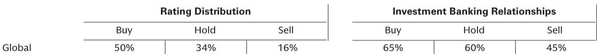

# GS：中国数据中心市场真正被低估的不是投资规模，而是电力需求的非线性跃迁

当市场还在热议“2万亿投资计划”能否落地时，一份来自GS的研报揭示了一个更值得关注的信号：中国国家能源局（NEA）预计，到2030年数据中心电力消费将达到800 TWh。这个数字意味着什么？它意味着中国数据中心用电量将以36%的年复合增速增长，到2030年将占全国总用电量的6%，远超当前1.6%的水平。

更关键的是，这一预期已经超过了GS自己对美国数据中心市场的预测——726 TWh。换句话说，中国正在从“跟随者”变为“引领者”，而市场对这一结构性变化的定价可能还远远不够。

这份报告的核心判断并非“2万亿投资”本身，而是这背后隐含的电力需求非线性增长逻辑。当多数投资者还在纠结于政策能否兑现、建设节奏会不会低于预期时，真正需要追问的问题应该是：如果需求增速真的达到NEA预测的水平，哪些环节会被迫重新定价？

## 1. 2万亿投资计划不是新闻，真正的新信息是NEA的需求预测比GS自己的模型更乐观

2025年1月，国家发改委、国家数据局、工信部联合发布的《国家数据基础设施建设指引》中，国家数据局就已提出未来五年数据基础设施将吸引约2万亿直接投资。这一数字并非新消息，但市场此前并未充分消化其隐含的需求端含义。

GS研报的核心贡献在于，它将NEA在2026年5月发布的数据中心电力需求预测与自己的模型进行了对比。NEA预计2030年数据中心用电量达800 TWh，而GS自己此前的预测是IT电力需求增速约为20%的年复合增长率。两者之间的差距，正是市场认知的盲区。

这里的逻辑链条值得拆解：如果数据中心用电量真的以36%的增速增长，考虑到PUE（电能利用效率）的持续改善，IT设备本身的电力需求增速将更快。这意味着，市场此前关于“数据中心建设过剩”的担忧可能需要重新审视。需求侧的实际增长，可能远超供给侧规划时的预期。

## 2. 中国数据中心用电量增速已现加速迹象，2026年开局数据提供了早期验证

研报引用了NEA公布的2026年1-4月数据：全国互联网数据服务业用电量同比增长44%。这个数字本身已经超过了NEA对全年的预期增速，更不用说GS自己的模型。

从历史经验看，这种早期数据的信号意义不容忽视。2024年全年中国数据中心用电量约为170 TWh，如果2026年前四个月已经实现44%的同比增长，那么全年数据大概率会超出年初的预期。这种“超预期”一旦形成趋势，就会倒逼供给侧加速扩张，进而影响设备采购、电力基础设施投资、乃至电价政策。

对于投资者而言，这意味着关注焦点应从“政策说了什么”转向“数据证明了什么”。当用电量增速持续高于预期时，此前关于“产能过剩”的担忧就会自然瓦解，而相关企业的收入可见度将显著提升。

## 3. 中美数据中心电力需求赛跑：中国正在从追赶者变为领跑者

GS研报提供了一个极为重要的对比维度：到2030年，中国数据中心用电量预计达到800 TWh，而美国为726 TWh。这意味着中国将在这一领域超越美国，成为全球最大的数据中心电力消费国。

这一判断的底层逻辑值得深挖。美国数据中心需求主要受云服务商和AI大模型训练驱动，而中国的驱动力则更为多元：除了AI训练和推理，还有产业数字化、智慧城市、工业互联网等场景。更重要的是，中国的电力基础设施建设和电网扩容能力，在政策推动下具有更强的执行力。

对于全球科技投资者而言，这意味着中国数据中心产业链的估值逻辑正在发生变化。过去，市场习惯于用美国市场的增速和利润率来给中国公司定价，认为中国公司存在“折扣”。但如果中国市场的增速开始超过美国，这种定价逻辑本身就值得质疑。

## 4. 报告尚未完全回答的关键问题：PUE改善的“二阶效应”可能被低估

GS研报提到“考虑到PUE的改善，这可能会转化为更快的IT电力需求增长”，但没有展开计算。这正是报告留给读者的一个关键伏笔。

简单推算：如果数据中心总用电量从170 TWh增长到800 TWh，而PUE从1.5改善到1.2，那么IT设备本身的电力需求将从113 TWh增长到667 TWh，年复合增速接近43%，高于总用电量的36%。这意味着，IT设备层面的需求增长实际上比市场看到的还要快。

但问题在于，PUE改善本身也需要投资——更高效的冷却系统、更优化的电力分配、更先进的芯片制程。这些投资本身又会创造新的需求。这种“改善带来更多需求”的正反馈循环，在研报中没有被量化，但可能是未来几年最重要的结构性变量。

对于投资者而言，这意味着那些能够帮助数据中心降低PUE的技术和解决方案，可能拥有比市场预期更大的成长空间。从液冷到高效电源模块，从智能运维到新型芯片架构，这些细分赛道的价值可能需要重新评估。

## 5. 对投资者的观察框架：用三个维度重新审视中国数据中心标的

基于GS报告的逻辑，我们建议投资者从以下三个维度构建自己的分析框架：

第一，需求增速的验证窗口。2026年全年用电量数据将在2027年初公布，在此之前，每个季度的用电量增速都将是重要的先行指标。如果增速持续高于预期，那么整个行业的收入预期就需要上修。

第二，政策执行力的观察点。2万亿投资计划能否落地，关键在于地方政府和电网公司的配合程度。可以关注各省份的数据中心专项规划、电力审批进度、以及土地和能耗指标的分配情况。

第三，竞争格局的分化信号。GS在报告中给出了对具体公司的评级：买入万国数据、世纪互联、朗源股份，中性上海数据港，卖出光环新网。这种分化本身说明，即使行业整体增速超预期，不同公司在订单获取、成本控制、客户质量上的差异也会导致业绩分化。尤其是那些能够获得优质电力资源、与头部云厂商深度绑定的公司，可能拥有更强的定价权。

## 6. 顺着这些未解问题继续读完整报告

GS这份报告的真正价值，不在于它给出了多少数字，而在于它提出了一个值得反复推敲的问题：当市场还在用“投资规模”来衡量行业前景时，真正决定行业走向的，其实是电力需求的非线性增长。而NEA的预测，恰恰暗示了这种非线性的存在。

但报告也留下了一些未解的疑问：PUE改善的具体路径是什么？不同区域的数据中心电力成本差异有多大？AI推理需求的爆发是否会改变数据中心的地理分布？这些问题在研报中有提及，但未完全展开。而正是这些细节，决定了哪些公司能够真正受益于这一轮结构性增长。

我们已经在星球微信群中整理了这份GS研报的完整原文和核心图表，并围绕上述未解问题展开了讨论。欢迎已经加入的朋友在群里继续交流，也欢迎感兴趣的新朋友进群一起探讨——这些问题的答案，可能比2万亿投资本身更值得关注。

Personal reading notes and learning share only. Not investment advice.

