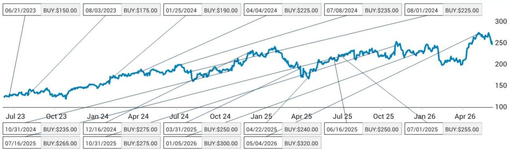
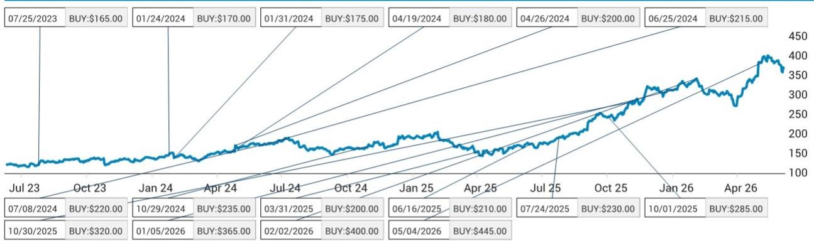
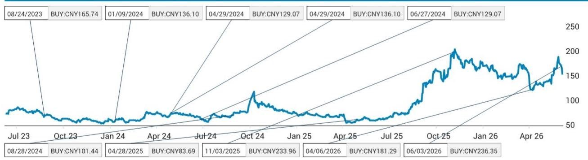

# The Energy Storage Boom Is Real, But the Real Money Lies in the Architecture of AI Data Center Integration

The global energy storage industry is about to cross a threshold that most investors are still underestimating. According to expert projections gathered from the first day of the SNEC 2026 conference, global ESS installations are expected to exceed 150 gigawatt-hours in 2026, representing an 80 percent year-over-year increase. That is not a cyclical uptick. That is a structural break from the past. Yet the conventional narrative—that storage is simply riding the coattails of renewable deployment—misses the more important story. The real driver of the next phase of growth is not solar-plus-storage at all. It is the hyperscale data center, specifically the artificial intelligence data center, and its insatiable demand for power quality, grid stability, and ultimately, off-grid capability.

This shift matters now because the composition of demand is changing faster than the supply chain can adapt. China will continue to dominate with roughly 60 percent of global ESS installations, but the growth vector that will determine which companies win and which ones fade is the US AI data center market. That market is projected to double to 10 gigawatt-hours in 2026 and then explode to 70 to 80 gigawatt-hours by 2030. The strategic question for investors is no longer whether energy storage will grow, but which technological architectures, business models, and geographic exposures will capture the highest margins in a market that is rapidly segmenting into utility-scale commoditization, residential resilience, and the high-stakes, high-specification world of AI infrastructure.

## China's Grid Storage Boom Is Real, But It Is a Two-Year Window, Not a Perpetual Growth Engine

The most important nuance in the China storage story is the timeline. Expert feedback from the conference indicates that grid-related ESS buildouts in China will likely be mostly completed within one to two years. After that, the installation growth will depend on integrated data center plus renewable plus ESS projects. This is a critical distinction. The current wave of Chinese ESS deployment is policy-driven, responding to grid connection requirements and renewable integration mandates. It is real, it is large—approximately 300 gigawatt-hours expected this year—but it is finite.

The implication is straightforward. Companies that have built their growth strategies around selling commoditized utility-scale storage into the Chinese market are facing a margin squeeze and a volume cliff within two years. The only way to sustain growth after 2027 is to have already pivoted toward the integrated project model, where storage is not a standalone product but a component of a larger energy solution for data centers and industrial parks. This is precisely why management teams at companies like Sungrow are already emphasizing their full-stack in-house research and development capability, not just for inverters and battery systems, but for solid-state transformers that bridge the gap between high-voltage transmission and the specific power requirements of AI computing racks.

The so-what for investors is clear. When evaluating Chinese storage companies, the critical metric is not current market share or installation volume. It is the share of revenue coming from integrated, non-grid projects and the technological readiness of products that serve the data center market. Companies that are still heavily reliant on the Chinese grid storage boom without a credible data center strategy are likely to face a valuation re-rating as the two-year window closes.

## The US AI Data Center Market Is the High-Margin Battleground, and Power Conversion Technology Is the Moat

The US AI data center energy storage opportunity is not about bulk energy arbitrage. It is about power quality, load smoothing, and grid connection compliance. Expert feedback reveals that the current ESS installations by AI data center developers are primarily aimed at mitigating the impact of high load volatility on the grid. Systems sized at approximately 30 percent of capacity with two to four hours of duration are currently sufficient for this purpose. But this is only the beginning.

The trajectory is toward off-grid capability, and that changes everything. Off-grid ESS installations will require dramatically more storage capacity per data center. The transition from grid-connected load smoothing to fully islanded operation represents an order-of-magnitude increase in addressable storage demand. More importantly, it raises the technical bar for suppliers. The expert from Envision explicitly stated that companies that can develop power conversion systems supporting system availability of 99.999 percent will have an edge in this business. That is a five-nines reliability standard, typically associated with aerospace and telecommunications infrastructure, not with commercial solar inverters.

This is why Sungrow's positioning is strategically significant. The company's solid-state transformer product, which covers 10 kilovolt to 800 volt and 800 volt to 50 volt conversions, is scheduled for launch in the second half of 2026. Sungrow's full-stack in-house research and development capability allows it to meet customized product requirements from hyperscalers like Amazon and Google. Competitors that are procuring components from the supply chain will struggle to match this level of integration and customization. The margin structure tells the same story. Sungrow is maintaining approximately a 10 percent price premium over peers, and its commercial and industrial plus residential energy storage segment is guiding 40 to 50 percent gross profit margins, which can partially offset pressure on utility-scale margins.

The investment implication is that the US AI data center storage market will not be a commodity market. It will be a specification-driven market where the winners are determined by power conversion efficiency, reliability engineering, and the ability to customize at scale. Investors should be asking which companies have the engineering depth to meet five-nines reliability standards and the balance sheet to invest in product development before the revenue materializes.

## The Residential Storage Story Is More Nuanced Than the Headline Growth Numbers Suggest

The global residential ESS market is projected to grow 14 percent year-over-year to 30 gigawatt-hours in 2026, with Europe accounting for approximately half of that. The European market is expected to grow 30 percent year-over-year, driven by system upgrades to larger capacities and the rapid expansion of balcony solar-plus-storage systems. Australia, despite subsidy phase-downs, is still expected to grow 20 percent year-over-year. These are respectable growth rates, but they mask a significant divergence in competitive dynamics.

The key insight from the Sigenergy management discussion is that premium positioning is sustainable in this market. Sigenergy maintains a 20 to 30 percent price premium over peers and is targeting gross profit margins above 40 percent on its new budget-friendly product line. The company is avoiding direct price competition and instead promoting artificial intelligence integration across residential and utility energy management systems. Japan, in particular, stands out as a high-margin market due to strict certification requirements that limit competition.

The strategic question for residential storage investors is whether the premium positioning can hold as the market scales. The answer likely depends on channel control and software integration. Companies that treat residential storage as a hardware sale will face relentless margin compression. Companies that treat it as an energy management platform, with ongoing software revenue and AI-driven optimization, can sustain premium pricing. The Sigenergy strategy of AI integration across residential and utility systems is a bet that the hardware is becoming a delivery mechanism for software value, not the value itself.

## The Solar Supply Chain Is Still Not Out of the Woods, and the Industry Reform Timeline Is the Key Variable

The polysilicon and solar module supply chain remains in a state of structural oversupply, and the long-awaited industry reform is still in progress. Production cost verification is ongoing, and the reform is expected to launch in August to September 2025, but expert feedback indicates a gradual execution pace. The critical insight from the SMM expert is that the government's intention is not to force bankruptcy of major players, but to shut down old plants while maintaining social stability. This is a slow, managed consolidation, not a cathartic cleansing.

The numbers tell the story. Polysilicon supply could reach 120,000 to 130,000 tons per month in August, while demand is likely staying weak at approximately 80,000 to 90,000 tons per month. Inventory levels are high. The expert sees 30 renminbi per kilogram as a relative low price point, as wafer players might start restocking at that level. But the uncertainty around the Price Law enforcement is the wildcard. Daqo New Energy management indicated that if the Price Law is enforced, polysilicon prices could rise to above 40 renminbi per kilogram. If not, prices will stay at 30 to 35 renminbi. That is a 25 percent swing in pricing, with enormous implications for profitability.

The deeper concern is quality degradation. The SMM expert identified upstream quality degradation for cost reduction as a critical industry risk, potentially triggering large-scale warranty disputes in one to two years. This is a classic signal of a market where price competition has overwhelmed quality discipline. For investors, this means that low-cost producers with the strongest balance sheets and the most disciplined quality control are likely to emerge stronger after the warranty cycle hits, but the near-term pain is far from over.

## What the Report Does Not Fully Answer: The Timing and Shape of the Off-Grid Data Center Transition

The conference feedback provides a clear directional view that the AI data center market will drive storage demand, but it leaves several critical questions unanswered. First, the timeline for the transition from grid-connected load smoothing to off-grid operation is not specified. The expert from Envision noted that off-grid ESS installation will likely need much more storage, but did not provide a timeline for when hyperscalers will begin making that transition at scale. Second, the competitive dynamics between solid-state transformers and traditional uninterruptible power supply systems are still unclear. The report suggests that SST solutions will gradually be adopted and might replace UPS, but the pace of replacement and the cost parity point are not addressed.

Third, the geographic distribution of AI data center storage demand beyond the United States is not explored. China's integrated data center plus renewable plus ESS projects are mentioned, but the scale and timing are vague. Europe's role in AI data center storage is not discussed at all. Fourth, the financial modeling of Sungrow's solid-state transformer business is based on a sum-of-the-parts valuation that discounts 2030 revenue back by three years, which implies high confidence in the trajectory but does not address the risk of technology substitution or hyperscaler vertical integration.

These open questions are not weaknesses in the report. They are the natural boundaries of what can be known at this stage of the industry's evolution. For investors, the most productive approach is to build a decision framework that accounts for multiple scenarios rather than waiting for certainty.

## A Decision Framework for Investors Navigating the Energy Storage Transition

The following framework is designed to help investors evaluate energy storage companies based on the specific demands of the emerging market structure rather than backward-looking metrics.

First, assess technology integration depth. Companies that design and manufacture their own power conversion systems, battery management systems, and software platforms have a structural advantage in the AI data center market, where customization and reliability are paramount. Companies that assemble components from third-party suppliers will struggle to meet five-nines reliability standards and will be limited to lower-margin utility-scale business.

Second, evaluate geographic revenue diversification with a weighting toward high-barrier markets. Japan's strict certification requirements, Europe's evolving regulatory landscape, and the US AI data center opportunity all represent higher-margin markets with defensible positions. Overweighting these markets relative to China's grid storage boom is a bet on margin sustainability over volume growth.

Third, analyze balance sheet strength in the context of the polysilicon and module supply chain. The next one to two years will see continued margin pressure in upstream solar, and companies with high inventory levels and outdated capacity are at risk. The warranty risk from quality degradation is a potential balance sheet event that could wipe out years of profitability for weaker players.

Fourth, model the AI data center storage opportunity with a range of adoption curves. A conservative scenario assumes that grid-connected load smoothing remains the primary use case through 2028, with storage demand growing linearly with data center capacity additions. An aggressive scenario assumes that hyperscalers begin transitioning to off-grid or partial off-grid operation by 2027, driving an order-of-magnitude increase in storage per data center. The difference between these scenarios is the difference between a doubling and a quintupling of addressable market by 2030.

Fifth, watch the sodium battery development trajectory. Sungrow's management believes sodium batteries have comparative advantages in high power rating and high C-rating applications, with cycle life now improved to 10,000 times and better tolerance to extreme temperatures that could reduce liquid-cooling costs. If sodium battery costs reach parity with lithium, the implications for data center storage architecture are profound, potentially accelerating the off-grid transition by reducing the total cost of ownership for large-scale installations.

## The Full Report Contains the Data and Charts That Make These Arguments Actionable

The analysis above is based on the first day of expert conversations at the SNEC 2026 conference, but the full report contains detailed financial models, valuation methodologies, and original charts that translate these strategic insights into specific investment recommendations. The report includes price targets for the key companies discussed, risk assessments, and a comprehensive breakdown of the assumptions behind the numbers.

Join the community to read the full report and review the original charts.

*This article is for learning and discussion only and does not constitute investment advice.*

Personal reading notes and learning share only. Not investment advice.

