## AI Series #48: Agent-to-Agent Partnerships; Models Expand Use-Case Scenario

Highlights (1) Tencent: partnerships across different sectors in Agent-to-Agent (A2A); (2) BABA: Qwen app opens up to third-party Agents and Skill and provides one-stop personalized service to users; (3) Meitu and WPS forms partnerships with former AI design available to WPS users; ; (4) OpenAI is ramping finance and legal agents in Codex after Anthropic in May. (5) OpenRouter: Token consumption was up 13.5% vs prior week

In this report, we provide investors with over 50 data points on token consumption in OpenRouter, pricing for different models, model intelligence in Artificial Analysis, user trends by sub-sector and other industry data for analysis.

Tencent: Building up Agent-to-Agent ecosystem. These include (1) partnership with Meituan's AI assistant Xiaomei and AI Assistant Yuanbao. There will be Agent-to-Agent (A2A) communication when users submit local service requests in Yuanbao; (2) partner with a number of smartphone brands such as OPPO, Xiaomi, Huawei, Vivo and Honor in A2A (Agent to Agent) capabilities. Users can speak with smartphone's built-in AI voice assistant which will help sending Weixin messages or starting Weixin's audio/video calls (vs open Weixin app). Per Tencent Cloud AI Industry Applications Summit (link), Product is one of key areas in AI other than models and frontier tech exploration. Diversified offerings and data insights can further unlock model intelligence in different used cases.

BABA: Qwen app opens up to third-party Agents and Skill with participation of retail brands and airline; Release of Qwen3.7-Plus on 1 Jun. On Agents and Skill, the first batch includes KFC, Luckin, Mixue and China Eastern. We view Qwen app is building agent ecosystem and provides comprehensive personalized services to users. On the other hand, BABA releases Qwen3.7-Plus on 1 Jun post release of Qwen3.7-Max on Alibaba Cloud Summit in May (link). It is a multimodal interactive hybrid agent with unified GUI (Graphical User Interface) / CLI (Command-Line Interface) across visual and text tasks with comprehensive coding agent and productivity offerings with full-modality input. In addition, it has cross-harness generalization under diverse agent frameworks.

Meitu and WPS forms co-operations in office + design. WPS users benefit from using Meitu features in AI posters via text to image/image to image generation, in particular marketing materials for e-commerce merchants. On the other hand, WPS users can also use Meitu in short video generation for live streaming ecommerce.

Kling exceeds 100m global users in Jun-26. This represents a 67% increase from 60m by end of 2025. Number of enterprise customers increased from 30K in 2025 to 50K in Jun-26. It covers 224 countries and regions globally.

Kimi launches AI desktop Kimi Work. Highlights (1) The local agent can run round the clock autonomously; (2) WebBridge enables it to access browsers and complete multi-step tasks; (3) Swarm Intelligence can complete complex problems by using multiple specialized agents and breaking down the tasks into multi-layered tasks simultaneously; (4) it builds for finance sector and pre-integrated with deep data sources across different markets.

OpenAI launches AI tools for finance and legal sectors after Anthropic in May. OpenAI launched 6 new plugins for Codex with specialized skills in finance sector. Plugins for legal sector is under development. This comes after Anthropic launched 10 financial services agent templates in May in areas such as research and client coverage as well as finance and operations

Exhibit 1 - Weekly token consumption over the past 12 months as of 8 Jun (tn)  
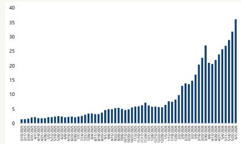

bar chart

| Category | Value |
|---|---|
| 2019 | 1.5 |
| 2020 | 1.6 |
| 2021 | 1.7 |
| 2022 | 1.8 |
| 2023 | 1.9 |
| 2024 | 2.0 |
| 2025 | 2.1 |
| 2026 | 2.2 |
| 2027 | 2.3 |
| 2028 | 2.4 |
| 2029 | 2.5 |
| 2030 | 2.6 |
| 2031 | 2.7 |
| 2032 | 2.8 |
| 2033 | 2.9 |
| 2034 | 3.0 |
| 2035 | 3.1 |
| 2036 | 3.2 |
| 2037 | 3.3 |
| 2038 | 3.4 |
| 2039 | 3.5 |
| 2040 | 3.6 |
| 2041 | 3.7 |
| 2042 | 3.8 |
| 2043 | 3.9 |
| 2044 | 4.0 |
| 2045 | 4.1 |
| 2046 | 4.2 |
| 2047 | 4.3 |
| 2048 | 4.4 |
| 2049 | 4.5 |
| 2050 | 4.6 |
| 2051 | 4.7 |
| 2052 | 4.8 |
| 2053 | 4.9 |
| 2054 | 5.0 |
| 2055 | 5.1 |
| 2056 | 5.2 |
| 2057 | 5.3 |
| 2058 | 5.4 |
| 2059 | 5.5 |
| 2060 | 5.6 |
| 2061 | 5.7 |
| 2062 | 5.8 |
| 2063 | 5.9 |
| 2064 | 6.0 |
| 2065 | 6.1 |
| 2066 | 6.2 |
| 2067 | 6.3 |
| 2068 | 6.4 |
| 2069 | 6.5 |
| 2070 | 6.6 |
| 2071 | 6.7 |
| 2072 | 6.8 |
| 2073 | 6.9 |
| 2074 | 7.0 |
| 2075 | 7.1 |
| 2076 | 7.2 |
| 2077 | 7.3 |
| 2078 | 7.4 |
| 2079 | 7.5 |
| 2080 | 7.6 |
| 2081 | 7.7 |
| 2082 | 7.8 |
| 2083 | 7.9 |
| 2084 | 8.0 |
| 2085 | 8.1 |
| 2086 | 8.2 |
| 2087 | 8.3 |
| 2088 | 8.4 |
| 2089 | 8.5 |
| 2090 | 8.6 |
| 2091 | 8.7 |
| 2092 | 8.8 |
| 2093 | 8.9 |
| 2094 | 9.0 |
| 2095 | 9.1 |
| 2096 | 9.2 |
| 2097 | 9.3 |
| 2098 | 9.4 |
| 2099 | 9.5 |
| 2100 | 9.6 |
| ... (repeated) | ... (repeated)

Source: OpenRouter, JEF

Exhibit 2 - Top 10 ranking in terms of token consumption by model the latest week

<table><tr><td>No</td><td>Company</td><td>Model</td><td>Tokens</td></tr><tr><td>1</td><td>DeepSeek</td><td>DeepSeek V4 Flash</td><td>3.69T</td></tr><tr><td>2</td><td>Tencent</td><td>Hy3 preview</td><td>2.94T</td></tr><tr><td>3</td><td>MiniMax</td><td>MiniMax M3</td><td>2.5T</td></tr><tr><td>4</td><td>Xiaomi</td><td>MiMo-V2.5</td><td>2.19T</td></tr><tr><td>5</td><td>OpenRouter</td><td>Owl Alpha</td><td>1.95T</td></tr><tr><td>6</td><td>Anthropic</td><td>Claude Sonnet 4.6</td><td>1.76T</td></tr><tr><td>7</td><td>DeepSeek</td><td>DeepSeek V4 Pro</td><td>1.7T</td></tr><tr><td>8</td><td>Anthropic</td><td>Claude Opus 4.7</td><td>1.44T</td></tr><tr><td>9</td><td>DeepSeek</td><td>DeepSeek V3.2</td><td>1.17T</td></tr><tr><td>10</td><td>Anthropic</td><td>Claude Opus 4.8</td><td>1.16T</td></tr></table>

Source: OpenRouter, JEF

Thomas Chong \* | Equity Analyst

852 3743 8016 | thomas.chong@JEF.com

Zoey Zong \* | Equity Analyst

852 3743 8163 | zoey.zong@JEF.com

OpenRouter: Token consumption was up 13.5% vs prior week. Based on analysis of

Continued overleaf ...

the week of 1 Jun (vs the week of 25 May) (Exhibit 1), the number of weekly tokens consumed increased by 13.5% to 36.1tn. In terms of ranking, DeepSeek V4 Flash ranked no 1, followed by Tencent's Hy3 preview and MiniMax M3.

BAT, KC, AI labs and Kling are Beneficiaries. We expect surge in token consumption on rising demand for AI models and agents to benefit CSPs like Baidu, Alibaba, Tencent (BAT), Kingsoft Cloud (KC), AI labs and Kling. According to analysis from Artificial Analysis, (1) there is a narrowing intelligence gap between US and China models; (2) API cost is just a fraction vs US benefiting from MoE, linear attention, and MFU; (3) Coding, Workspace scenario and mid- to long-form content should see significant opportunities ahead (Exhibit 69-73).

## China vs US comparison

## AI Models

According to OpenRouter, token consumption went up significantly in Feb-26 due to (a) a surge in adoption of coding / agents, which allows people using AI from "to chat" to "to work". It connects with large models which can be deployed locally or on servers, which allows you to automate workflow through natural language chat; (b) release of a number of high-performance and cost-efficient models which include Kimi K2.5 (Jan-26), M2.5 (Feb-26) and GLM-5 (Feb-26).

Exhibit 3 - Weekly token consumption over the past 12 months as of 8 Jun (tn)  
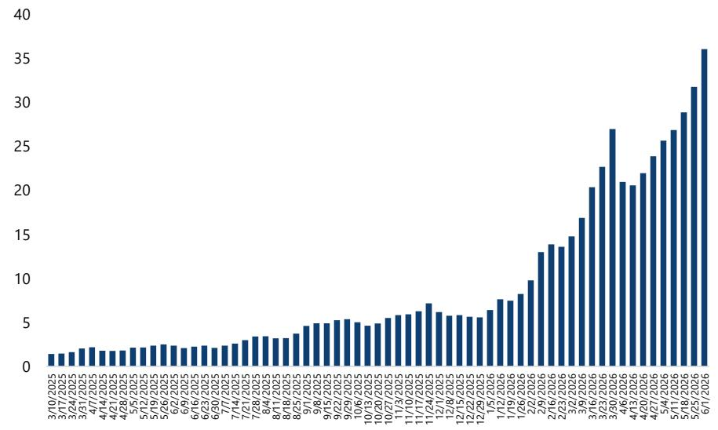

bar chart

| Date | Value |
|---|---|
| 3/10/2025 | 1.0 |
| 3/17/2025 | 1.2 |
| 3/24/2025 | 1.5 |
| 3/31/2025 | 1.8 |
| 4/7/2025 | 1.9 |
| 4/14/2025 | 2.0 |
| 4/21/2025 | 2.1 |
| 4/28/2025 | 2.2 |
| 5/5/2025 | 2.3 |
| 5/12/2025 | 2.4 |
| 5/19/2025 | 2.5 |
| 5/26/2025 | 2.6 |
| 6/2/2025 | 2.7 |
| 6/9/2025 | 2.8 |
| 6/16/2025 | 2.9 |
| 6/23/2025 | 3.0 |
| 6/30/2025 | 3.1 |
| 7/7/2025 | 3.2 |
| 7/14/2025 | 3.3 |
| 7/21/2025 | 3.4 |
| 7/28/2025 | 3.5 |
| 8/4/2025 | 3.6 |
| 8/11/2025 | 3.7 |
| 8/18/2025 | 3.8 |
| 8/25/2025 | 4.0 |
| 9/1/2026 | 4.5 |
| 9/8/2025 | 4.8 |
| 9/15/2025 | 5.0 |
| 9/22/2025 | 5.3 |
| 9/29/2025 | 5.5 |
| 10/6/2025 | 5.7 |
| 10/13/2025 | 4.8 |
| 10/20/2025 | 4.9 |
| 10/27/2025 | 5.3 |
| 11/3/2025 | 5.6 |
| 11/10/2025 | 6.0 |
| 11/17/2025 | 6.3 |
| 11/24/2025 | 7.3 |
| 12/1/2026 | 6.1 |
| 12/8/2026 | 5.9 |
| 12/15/2026 | 5.8 |
| 12/22/2026 | 5.7 |
| 12/29/2026 | 6.3 |
| 1/5/2026 | 7.4 |
| 1/12/2026 | 7.7 |
| 1/19/2026 | 8.3 |
| 1/26/2026 | 9.8 |
| 2/2/2026 | 13.3 |
| 2/9/2026 | 14.0 |
| 2/16/2026 | 14.3 |
| 2/23/2026 | 13.8 |
| 3/2/2026 | 14.9 |
| 3/9/2026 | 17.0 |
| 3/16/2026 | 20.3 |
| 3/23/2026 | 23.0 |
| 3/30/2026 | 27.1 |
| 4/6/2026 | 10.8 |
| 4/13/2026 | 10.7 |
| 4/20/2026 | 14.8 |
| 4/27/2026 | 17.8 |
| 5/4/2026 | 19.8 |
| 5/11/2026 | 19.9 |
| 5/18/2026 | 31.8 |
| 5/25/2026 | 36.4 |
| 6/1/2026 | - |

Source: OpenRouter, JEF  
According to OpenRouter (between 1 and 7 Jun), China models token consumption increased by 27.5% compared to prior week at 14.2tn. This compares to US models at 3.2tn token consumption. DeepSeek V4 Flash weekly token consumptions under rapid growth

According to OpenRouter, rising adoption of Coding / Agents and release of high-performance and cost-efficient China models are driving token consumption

In OpenRouter, China models surpassed US models in terms of token consumption the week of 1 Jun

Exhibit 4 - Market share: weekly token consumption by company as of 8 Jun  
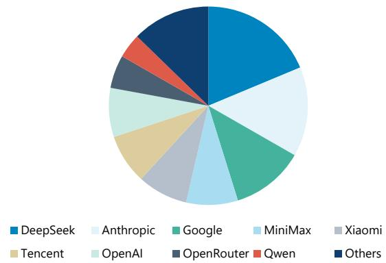

pie chart

| Category | Value |
|---|---|
| DeepSeek | 35 |
| Anthropic | 28 |
| Google | 25 |
| MiniMax | 20 |
| Xiaomi | 18 |
| Tencent | 16 |
| OpenAI | 14 |
| OpenRouter | 12 |
| Qwen | 10 |
| Others | 27 |

Source: OpenRouter, JEF

Exhibit 5 - Weekly token consumption since Jan-26 (bn)  
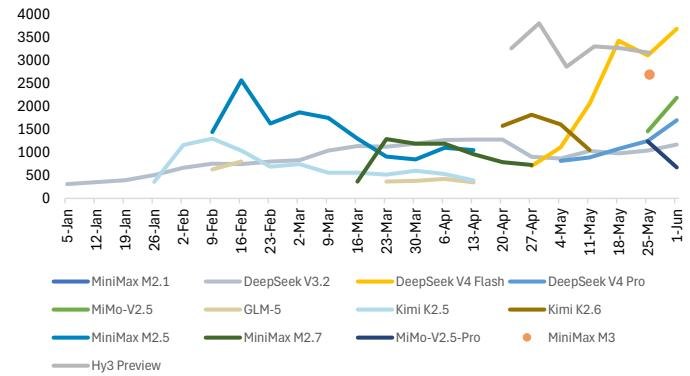

line chart

| Date | MiniMax M2.1 | DeepSeek V3.2 | DeepSeek V4 Flash | DeepSeek V4 Pro | MiMo-V2.5 | GLM-5 | Kimi K2.5 | Kimi K2.6 | MiniMax M2.5 | MiniMax M2.7 | MiniMax M3 | MinMo-V2.5-Pro | Hy3 Preview |
| --- | --- | --- | --- | --- | --- | --- | --- | --- | --- | --- | --- | --- | --- |
| 5-Jan |  |  |  |  |  |  |  |  |  |  |  |  |  |
| 12-Jan |  |  |  |  |  |  |  |  |  |  |  |  |  |
| 19-Jan |  |  |  |  |  |  |  |  |  |  |  |  |  |
| 26-Jan |  |  |  |  |  |  |  |  |  |  |  |  |  |
| 2-Feb |  |  |  |  |  |  |  |  |  |  |  |  |  |
| 9-Feb |  |  |  |  |  |  |  |  |  |  |  |  |  |
| 16-Feb |  |  |  |  |  |  |  |  |  |  |  |  |  |
| 23-Feb |  |  |  |  |  |  |  |  |  |  |  |  |  |
| 2-Mar |  |  |  |  |  |  |  |  |  |  |  |  |  |
| 9-Mar |  |  |  |  |  |  |  |  |  |  |  |  |  |
| 16-Mar |  |  |  |  |  |  |  |  |  |  |  |  |  |
| 23-Mar |  |  |  |  |  |  |  |  |  |  |  |  |  |
| 30-Mar |  |  |  |  |  |  |  |  |  |  |  |  |  |
| 6-Apr |  |  |  |  |  |  |  |  |  |  |  |  |  |
| 13-Apr |  |  |  |  |  |  |  |  |  |  |  |  |  |
| 20-Apr |  |  |  |  |  |  |  |  |  |  |  |  |  |
| 27-Apr |  |  |  |  |  |  |  |  |  |  |  |  |  |
| 4-May |  |  |  |  |  |  |  |  |  |  |  |  |  |
| 11-May |  |  |  |  |  |  |  |  |  |  |  |  |  |

Source: OpenRouter, JEF

On token consumption by company, DeepSeek (18.7%) comes first, followed by Anthropic (14.6%), Google (11.9%), MiniMax (8.4%) and Xiaomi (8.2%). The top 5 in weekly token consumption by model are DeepSeek V4 Flash (3.69tn), Hy3 preview (2.94tn), MiniMax M3 (2.5tn), followed by MiMo V2.5 (2.19tn) and Owl Alpha (1.95tn).

DeepSeek V4 Flash ranked first in terms of token consumption the week of 1 Jun

Exhibit 6 - Top 10 ranking in terms of token consumption by model the latest week

<table><tr><td>No</td><td>Company</td><td>Model</td><td>Tokens</td></tr><tr><td>1</td><td>DeepSeek</td><td>DeepSeek V4 Flash</td><td>3.69T</td></tr><tr><td>2</td><td>Tencent</td><td>Hy3 preview</td><td>2.94T</td></tr><tr><td>3</td><td>MiniMax</td><td>MiniMax M3</td><td>2.5T</td></tr><tr><td>4</td><td>Xiaomi</td><td>MiMo-V2.5</td><td>2.19T</td></tr><tr><td>5</td><td>OpenRouter</td><td>Owl Alpha</td><td>1.95T</td></tr><tr><td>6</td><td>Anthropic</td><td>Claude Sonnet 4.6</td><td>1.76T</td></tr><tr><td>7</td><td>DeepSeek</td><td>DeepSeek V4 Pro</td><td>1.7T</td></tr><tr><td>8</td><td>Anthropic</td><td>Claude Opus 4.7</td><td>1.44T</td></tr><tr><td>9</td><td>DeepSeek</td><td>DeepSeek V3.2</td><td>1.17T</td></tr><tr><td>10</td><td>Anthropic</td><td>Claude Opus 4.8</td><td>1.16T</td></tr></table>

Source: OpenRouter, JEF

Based on Artificial Analysis, China models DeepSeek, Qwen, Kimi, MiniMax and Zhipu are closing the gap with US models in terms of intelligence. China models are highly cost-efficient on Mixture of Experts (MoE) architecture, linear attention, and MLU (Model Flog Utilization). According to 2026 Stanford AI Index Report (Apr-26), the top US model leads Chinese models by 2.7%. Separately, Anthropic (1503), xAI (1495), Google (1494), OpenAI (1481), Alibaba (1449) and DeepSeek (1424) occupy the top tier of Arena Elo ratings as of Mar-26.

Exhibit 7 - No 11-20 ranking in terms of token consumption by model in latest week

<table><tr><td>No</td><td>Company</td><td>Model</td><td>Tokens</td></tr><tr><td>11</td><td>Google</td><td>Gemini 3 Flash Preview</td><td>1.05T</td></tr><tr><td>12</td><td>StepFun</td><td>Step3.7 Flash</td><td>810B</td></tr><tr><td>13</td><td>Xiaomi</td><td>Mimo-V2.5-Pro</td><td>674B</td></tr><tr><td>14</td><td>Google</td><td>Gemini 2.5 Flash</td><td>631B</td></tr><tr><td>15</td><td>Google</td><td>Gemini 2.5 Flash Lite</td><td>594B</td></tr><tr><td>16</td><td>Poolside</td><td>Laguna M.1 (free)</td><td>568B</td></tr><tr><td>17</td><td>NVIDIA</td><td>Nemotron 3 Super (free)</td><td>534B</td></tr><tr><td>18</td><td>Google</td><td>Gemini 3.5 Flash</td><td>487B</td></tr><tr><td>19</td><td>Anthropic</td><td>Claude Opus 4.6</td><td>458B</td></tr><tr><td>20</td><td>OpenAI</td><td>GPT-5.5</td><td>443B</td></tr></table>

Source: OpenRouter, JEF

China models are narrowing the gap with US models in terms of intelligence. On Input/Output API, China large models are highly efficient vs US models.

Exhibit 8 - Cache hit/Input/Output API price for leading models as of 8 Jun  
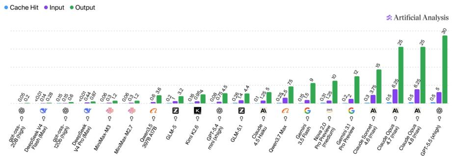

bar chart

| Model | Cache Hit | Input | Output |
|---|---|---|---|
| GPT-cas-2GB (high) | 0.05 | 0.2 | 0.01 |
| DeltaSeek V4 Flash(Max) | 0.04 | 0.28 | 0.15 |
| GPT-cas-72GB1 (high) | 0.06 | 0.28 | 0.15 |
| DeltaSeek V4 F3 (max) | 0.09 | 0.24 | 0.07 |
| MiniMax-M3 | 0.08 | 0.12 | 0.18 |
| MiniMax-M2.7 | 0.06 | 0.12 | 0.08 |
| Qwen3.5 39TB R1TB | 0.05 | 0.18 | 0.36 |
| GLM-5 | 0.1 | 0.2 | 0.2 |
| Kinn-KJ.6 | 0.16 | 0.054 | 0.2 |
| GPT-5.4 min (kHigh) | 0.09 | 0.18 | 0.45 |
| GLM-5.1 | 0.26 | 0.44 | 0.1 |
| Clavide 4.5 Taku | 0.1 | 0.26 | 0.6 |
| Qwen3.7 Max | 0.25 | 0.25 | 7.5 |
| Gemini 3.5 Fast | 0.16 | 0.15 | 9 |
| Novo 2.0 Pro Preview (medium) | 0.19 | 0.25 | 10 |
| Gemini 31 Pro Preview | 0.22 | 0.2 | 2 |
| Clavide Spreeer 4.61 (max) | 0.3 | 0.375 | 15 |
| Clavide Optus 4 (max) | 0.5 | 0.35 | 25 |
| Clavide Optus 4.8 (max) | 0.5 | 0.325 | 25 |
| GPT-5.1(kHigh) | 0.5 | 0.6 | 30 |
Artificial Analysis

Source: Artificial Analysis, JEF

In terms of Input/Output API price, China models are just a fraction vs US models.

Exhibit 9 - Intelligence index for top 20 models as of 8 Jun  
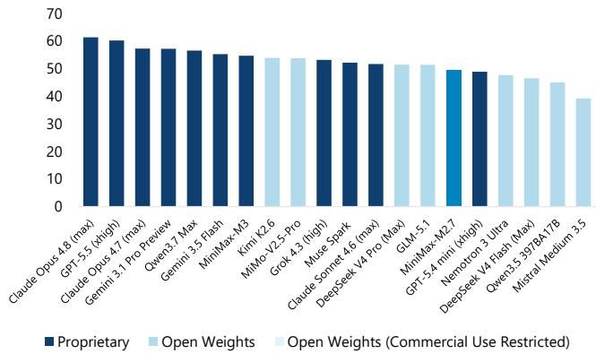

bar chart

| Model | Proprietary | Open Weights | Open Weights (Commercial Use Restricted) |
|---|---|---|---|
| Claude Opus 48 (max) | 61 | 0 | 0 |
| GPT-5.5 (xhigh) | 60 | 0 | 0 |
| Claude Opus 4.7 (max) | 57 | 0 | 0 |
| Gemini 3.1 Pro Preview | 57 | 0 | 0 |
| Qwen3.7 Max | 56 | 0 | 0 |
| Gemini 3.5 Flash | 55 | 0 | 0 |
| MiniMax-M3 | 54 | 0 | 0 |
| Kim K2.6 | 54 | 0 | 0 |
| MiMo-V2.5-Pro | 53 | 0 | 0 |
| Grok 4.3 (high) | 52 | 0 | 0 |
| Muse Spark | 51 | 0 | 0 |
| Claude Sonnet 46 (max) | 51 | 0 | 0 |
| DeepSeek V4 Pro (Max) | 51 | 0 | 0 |
| GLM-5.1 | 51 | 0 | 0 |
| MiniMax-M2.7 | 49 | 0 | 0 |
| GPT-5.4 mini (xhigh) | 49 | 0 | 0 |
| Nenotron 3 Ultra | 47 | 0 | 0 |
| DeepSeek V4 Flash (Max) | 46 | 0 | 0 |
| Qwen3.5 S97BA17B | 45 | 0 | 0 |
| Mistral Medium 3.5 | 39 | 0 | 0 |

Source: Artificial Analysis, JEF

Among top 20 large models, there are 9 which are China models and open weighted as of 1 Jun.

Exhibit 10 - Frontier Language Model Intelligence over time as of 8 Jun  
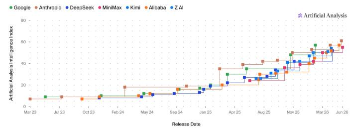

line chart

| Release Date | Google | Anthropic | DeepSeek | MiniMax | Kimi | Alibaba | Z AI |
| ------------ | ------ | --------- | -------- | ------- | ---- | ------- | ---- |
| Mar 23       | 5      | 5         | 5        | 5       | 5    | 5       | 5    |
| Jul 23       | 5      | 5         | 5        | 5       | 5    | 5       | 5    |
| Oct 23       | 5      | 5         | 5        | 5       | 5    | 5       | 5    |
| Feb 24       | 10     | 10        | 10       | 10      | 10   | 10      | 10   |
| May 24       | 15     | 15        | 15       | 15      | 15   | 15      | 15   |
| Sep 24       | 20     | 20        | 20       | 20      | 20   | 20      | 20   |
| Jan 25       | 25     | 25        | 25       | 25      | 25   | 25      | 25   |
| Apr 25       | 30     | 30        | 30       | 30      | 30   | 30      | 30   |
| Aug 25       | 35     | 35        | 35       | 35      | 35   | 35      | 35   |
| Nov 25       | 40     | 40        | 40       | 40      | 40   | 40      | 40   |
| Mar 26       | 45     | 45        | 45       | 45      | 45   | 45      | 45   |
| Jun 26       | 50     | 50        | 50       | 50      | 50   | 50      | 50   |

Source: Artificial Analysis, JEF

Exhibit 11 - Agentic index for top 20 models as of 8 Jun  
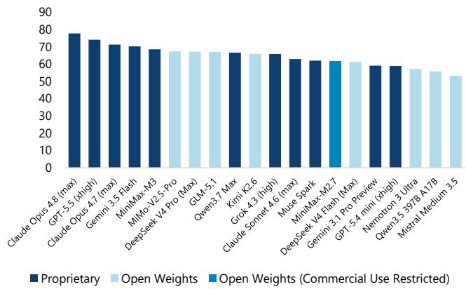

bar chart

| Model | Proprietary | Open Weights | Open Weights (Commercial Use Restricted) |
| :--- | :--- | :--- | :--- |
| Claude Opus 4.8 (max) | 78 | 0 | 0 |
| GP1-5.5 (xhigh) | 74 | 0 | 0 |
| Claude Opus 4.7 (max) | 72 | 0 | 0 |
| Gemini 3.5 Flash | 71 | 0 | 0 |
| MiniMax-M3 | 69 | 0 | 0 |
| MIMo-V2.5-Pro | 68 | 0 | 0 |
| DeepSeek V4 Pro (Max) | 67 | 0 | 0 |
| GLM-5.1 | 67 | 0 | 0 |
| Qwen3.7 Max | 67 | 0 | 0 |
| Kimi K2.6 | 66 | 0 | 0 |
| Grok 4.3 (high) | 66 | 0 | 0 |
| Claude Sonnet 4.6 (max) | 63 | 0 | 0 |
| Muse Spark | 62 | 0 | 0 |
| MiniMax-M2.7 | 61 | 0 | 0 |
| DeepSeek V4 Flash (Max) | 61 | 0 | 0 |
| Gemini 3.1 Pro Preview | 59 | 0 | 0 |
| GPT-5.4 mini (xhigh) | 59 | 0 | 0 |
| Nemotron 3 Ultra | 57 | 0 | 0 |
| Qwen3.5 397B A17B | 56 | 0 | 0 |
| Mistral Medium 3.5 | 54 | 0 | 0 |

Source: Artificial Analysis, JEF

Exhibit 13 - Cost to run Artificial Intelligence Index as of 8 Jun  
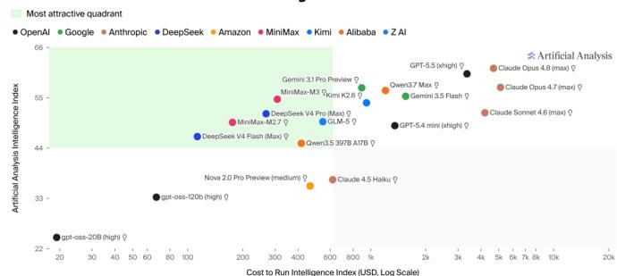

scatterplot

| Model | Cost to Run Intelligence Index (USD, Log Scale) | Artificial Analysis Index |
|---|---|---|
| gpt-oss-20B (high) | 65 | 22 |
| GPT-5.4 mini (high) | 1300 | 45 |
| GPT-5.5 (high) | 3300 | 57 |
| Claude Opus 4.8 (max) | 4700 | 56 |
| Claude Opus 4.7 (max) | 4700 | 56 |
| Claude Sonnet 4.6 (max) | 4600 | 54 |
| GPT-5.3 (high) | 3300 | 56 |
| Qwen3.7 Max | 1100 | 55 |
| Gemini 3.5 Flash | 1400 | 55 |
| Gemini 3.1 Pro Preview | 800 | 56 |
| MiniMax-M3 | 300 | 55 |
| Kimi K2.6 | 900 | 56 |
| DeepSeek V4 Pro (Max) | 500 | 45 |
| GLM-5 | 500 | 45 |
| DeepSeek V4 Flash (Max) | 400 | 44 |
| Nova 2.0 Pro Preview (medium) | 450 | 33 |
| GPT-oss-120b (high) | 65 | 33 |
| GPT-5.4 mini (high) | 1300 | 45 |
| Claude 4.5 Haiku | 600 | 33 |
The chart is a scatter plot with color-coded markers indicating different AI platforms and their corresponding cost values. The top-left label 'Most attractive quadrant' appears in the top left corner.

Source: Artificial Analysis, JEF

Exhibit 12 - Coding index for top 20 models as of 8 Jun  
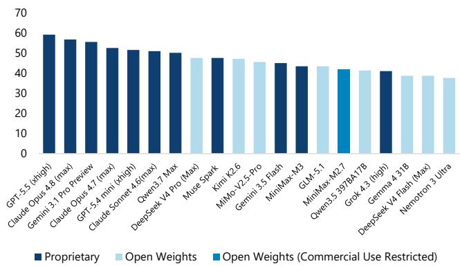

bar chart

| Model | Proprietary | Open Weights | Open Weights (Commercial Use Restricted) |
|---|---|---|---|
| GPT-5.5 (xhigh) | 60 | 0 | 0 |
| Claude Opus 4.8 (max) | 57 | 0 | 0 |
| Gemini 3.1 Pro Preview | 56 | 0 | 0 |
| Claude Opus 4.7 (max) | 52 | 0 | 0 |
| GPT-5.4 mini (xhigh) | 51 | 0 | 0 |
| Claude Sonnet 4.6(max) | 51 | 0 | 0 |
| Owen3.7 Max | 51 | 0 | 0 |
| DeepSeek V4 Pro (Max) | 50 | 48 | 0 |
| Muse Spark | 48 | 48 | 0 |
| Kimi K2.6 | 48 | 47 | 0 |
| MIMo-V2.5-Pro | 46 | 46 | 0 |
| Gemini 3.5 Flash | 45 | 0 | 0 |
| MiniMax-M3 | 44 | 0 | 0 |
| GLM-5.1 | 43 | 0 | 0 |
| MiniMax-M2.7 | 42 | 0 | 42 |
| Owen3.5-397BA17B | 41 | 0 | 0 |
| Grok 4.3 (high) | 41 | 0 | 0 |
| Gemma 4-31B | 39 | 0 | 0 |
| DeepSeek V4 Flash (Max) | 39 | 0 | 0 |
| Nemotron 3 Ultra | 38 | 0 | 0 |

Source: Artificial Analysis, JEF

Exhibit 14 - Output speed to run Artificial Intelligence Index as of 8 Jun  
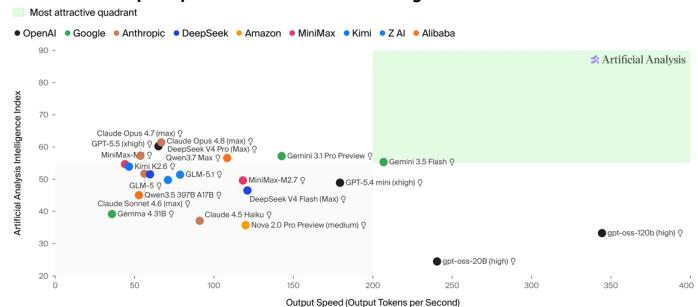

scatter plot

| Model | Output Speed (Output Tokens per Second) | Artificial Analysis Intelligence Index |
| --- | --- | --- |
| Claude Opus 4.7 (max) | ~50 | ~60 |
| GPT-5.5 (high) | ~50 | ~60 |
| Claude Opus 4.8 (max) | ~50 | ~60 |
| DeepSeek V4 Pro (Max) | ~100 | ~60 |
| MiniMax-M2.6 | ~50 | ~55 |
| GlM-5 | ~50 | ~50 |
| GlM-5.1 | ~100 | ~50 |
| GPT-5.4 mini (high) | ~200 | ~45 |
| MiniMax-M2.7 | ~100 | ~45 |
| DeepSeek V4 Flash (Max) | ~100 | ~45 |
| Nova 2.0 Pro Preview (medium) | ~100 | ~40 |
| Claude Sonnet 4.6 (max) | ~50 | ~40 |
| Gemma 4.3B | ~50 | ~40 |
| Claude 4.5 Hasku | ~100 | ~35 |
| gemmi 3.5 Flash | ~200 | ~35 |
| gemmi 3.1 Pro Preview | ~150 | ~35 |
| OpenAI | ~350 | ~30 |
| Google | ~250 | ~25 |
| Amazon | ~120 | ~45 |
| Z AI | ~120 | ~45 |
| Alibaba | ~120 | ~45 |
| OpenAI - gpt-oss-120b (high) ? | ~350 | ~25 |
The chart is divided into three quadrants by a green shaded area labeled “Artificial Analysis”.

Source: Artificial Analysis, JEF

# Input/Output Price for Different Models / Pricing for Coding Plan and Agents Offerings

Red color denotes price hike / new price during the month

Exhibit 15 - Pricing plans for Alibaba, Tencent, Baidu and ByteDance

<table><tr><td>Models Provider</td><td>Model</td><td>Context</td><td colspan="2">Jun-26</td></tr><tr><td></td><td></td><td></td><td>Input (RMB)</td><td>Output (RMB)</td></tr><tr><td></td><td></td><td></td><td>(million tokens)</td><td>(million tokens)</td></tr><tr><td rowspan="10">Alibaba</td><td>Qwen3.7-Max</td><td>(0, 1m]</td><td>6 (original 12, promo till 22 Jun)</td><td>18 (original 36, promo till 22 Jun)</td></tr><tr><td rowspan="2">Qwen3.7-Plus</td><td>(0, 256k]</td><td>1.6 (original 2, promo till 2 Jul)</td><td>6.4 (original 8, promo till 2 Jul)</td></tr><tr><td>(256k, 1m]</td><td>4.8 (original 6, promo till 2 Jul)</td><td>19.2 (original 24, promo till 2 Jul)</td></tr><tr><td rowspan="2">Qwen3.6-Max-Preview</td><td>(0, 128k]</td><td>9</td><td>54</td></tr><tr><td>(128k, 256k]</td><td>15</td><td>90</td></tr><tr><td rowspan="2">Qwen3.6-Plus</td><td>(0, 256k]</td><td>2</td><td>12</td></tr><tr><td>(256k, 1m]</td><td>8</td><td>48</td></tr><tr><td rowspan="3">Qwen3.5-Plus</td><td>(0, 128k]</td><td>0.8</td><td>4.8</td></tr><tr><td>(128k, 256k]</td><td>2</td><td>12</td></tr><tr><td>(256k, 1m]</td><td>4</td><td>24</td></tr><tr><td rowspan="11">Tencent</td><td rowspan="3">HY 3.0 Preview</td><td>(0, 16k]</td><td>1.2</td><td>4</td></tr><tr><td>(16k,32k]</td><td>1.6</td><td>6.4</td></tr><tr><td>(32k,256k]</td><td>2</td><td>8</td></tr><tr><td rowspan="2">HY 2.0 Think</td><td>(0, 32k]</td><td>3.975</td><td>15.9</td></tr><tr><td>(32k,128k]</td><td>5.3</td><td>21.2</td></tr><tr><td rowspan="2">HY 2.0 Instruct</td><td>(0, 32k]</td><td>3.18</td><td>7.95</td></tr><tr><td>(32k,128k]</td><td>4.505</td><td>11.13</td></tr><tr><td>Hunyuan-T1</td><td></td><td>1</td><td>4</td></tr><tr><td>Hunyuan-TurboS</td><td></td><td>0.8</td><td>2</td></tr><tr><td>Tencent HY Vision 1.5 Instruct</td><td></td><td>3</td><td>9</td></tr><tr><td>Hunyuan-translation</td><td></td><td>1.2</td><td>3.6</td></tr><tr><td rowspan="6">Baidu</td><td rowspan="2">ERNIE-5.1</td><td>(0, 32k]</td><td>4</td><td>18</td></tr><tr><td>(32k, 128k]</td><td>6</td><td>22</td></tr><tr><td rowspan="2">ERNIE-5.0</td><td>(0, 32k]</td><td>6</td><td>24</td></tr><tr><td>(32k, 128k]</td><td>10</td><td>40</td></tr><tr><td>ERNIE-4.5-Turbo</td><td></td><td>0.8</td><td>3.2</td></tr><tr><td>ERNIE-4.5-Turbo-VL</td><td></td><td>3</td><td>9</td></tr><tr><td rowspan="12">ByteDance</td><td rowspan="3">Doubao-seed-2.0-pro</td><td>[0, 32k]</td><td>3.2</td><td>16</td></tr><tr><td>(32k, 128k]</td><td>4.8</td><td>24</td></tr><tr><td>(128k, 256k]</td><td>9.6</td><td>48</td></tr><tr><td rowspan="3">Doubao-seed-2.0-lite</td><td>[0, 32k]</td><td>0.6</td><td>3.6</td></tr><tr><td>(32k, 128k]</td><td>0.9</td><td>5.4</td></tr><tr><td>(128k, 256k]</td><td>1.8</td><td>10.8</td></tr><tr><td rowspan="3">Doubao-seed-2.0-mini</td><td>[0, 32k]</td><td>0.2</td><td>2</td></tr><tr><td>(32k, 128k]</td><td>0.4</td><td>4</td></tr><tr><td>(128k, 256k]</td><td>0.8</td><td>8</td></tr><tr><td rowspan="3">Doubao-seed-2.0-code</td><td>[0, 32k]</td><td>3.2</td><td>16</td></tr><tr><td>(32k, 128k]</td><td>4.8</td><td>24</td></tr><tr><td>(128k, 256k]</td><td>9.6</td><td>48</td></tr></table>

Source: Company, JEF

Exhibit 16 - Pricing plans for AI Labs MiniMax, Zhipu, Kimi

<table><tr><td>Models Provider</td><td>Model</td><td>Context</td><td colspan="2">Jun-26</td></tr><tr><td></td><td></td><td></td><td>Input (RMB)</td><td>Output (RMB)</td></tr><tr><td></td><td></td><td></td><td>(million tokens)</td><td>(million tokens)</td></tr><tr><td rowspan="6">MiniMax</td><td rowspan="2">MiniMax-M3</td><td>Input: [0, 512k]</td><td>2.1</td><td>8.4</td></tr><tr><td>Input: [512k+)</td><td>4.2</td><td>16.8</td></tr><tr><td>MiniMax-M2.7</td><td></td><td>2.1</td><td>8.4</td></tr><tr><td>MiniMax-M2.7-highspeed</td><td></td><td>4.2</td><td>16.8</td></tr><tr><td>MiniMax-M2.5</td><td></td><td>2.1</td><td>8.4</td></tr><tr><td>MiniMax-M2.5-highspeed</td><td></td><td>4.2</td><td>16.8</td></tr><tr><td rowspan="9">Zhipu AI</td><td rowspan="2">GLM-5.1</td><td>[0, 32k)</td><td>6</td><td>24</td></tr><tr><td>[32k+)</td><td>8</td><td>28</td></tr><tr><td rowspan="2">GLM-5-Turbo</td><td>[0, 32k)</td><td>5</td><td>22</td></tr><tr><td>[32k+)</td><td>7</td><td>26</td></tr><tr><td rowspan="2">GLM-5</td><td>[0, 32k)</td><td>4</td><td>18</td></tr><tr><td>[32k+)</td><td>6</td><td>22</td></tr><tr><td rowspan="3">GLM-4.7</td><td>Input length: [0,32k)Output length: [0,0.2k)</td><td>2</td><td>8</td></tr><tr><td>Input length: [0,32k)Output length: [0,2k+)</td><td>3</td><td>14</td></tr><tr><td>[32k, 200k)</td><td>4</td><td>16</td></tr><tr><td rowspan="8">Kimi</td><td>Kimi K2.6</td><td></td><td>6.5</td><td>27</td></tr><tr><td>Kimi K2.5</td><td></td><td>4</td><td>21</td></tr><tr><td>kimi-k2-thinking</td><td></td><td>4</td><td>16</td></tr><tr><td>kimi-k2-thinking-turbo kimi-k2-turbo-preview</td><td></td><td>8</td><td>58</td></tr><tr><td>kimi-k2-0905-preview kimi-k2-0711-preview</td><td></td><td>4</td><td>16</td></tr><tr><td>moonshot-v1-8k moonshot-v1-8k-vision-preview</td><td></td><td>2</td><td>10</td></tr><tr><td>moonshot-v1-32k moonshot-v1-32k-vision-preview</td><td></td><td>5</td><td>20</td></tr><tr><td>moonshot-v1-128k moonshot-v1-128k-vision-preview</td><td></td><td>10</td><td>30</td></tr></table>

Source: Company, JEF

Exhibit 17 - Pricing plans for AI Labs StepFun, Xiaomi, and DeepSeek

<table><tr><td>Models Provider</td><td>Model</td><td>Context</td><td colspan="2">Jun-26</td></tr><tr><td></td><td></td><td></td><td>Input (RMB)</td><td>Output (RMB)</td></tr><tr><td></td><td></td><td></td><td>(million tokens)</td><td>(million tokens)</td></tr><tr><td rowspan="9">StepFun</td><td>step-3.5-flash</td><td></td><td>0.7</td><td>2.1</td></tr><tr><td>step-r1-v-mini</td><td></td><td>2.5</td><td>8</td></tr><tr><td rowspan="3">step-3</td><td>input≤4k &amp; output≤4k</td><td>1.5</td><td>4</td></tr><tr><td>input≤4k &amp; output&gt;4k</td><td>1.5</td><td>8</td></tr><tr><td>4k &lt; input ≤64k</td><td>4</td><td>10</td></tr><tr><td>step-2-mini</td><td></td><td>1</td><td>2</td></tr><tr><td>step-2-16k step-2-16k-exp</td><td></td><td>38</td><td>120</td></tr><tr><td>step-1-8k</td><td></td><td>5</td><td>20</td></tr><tr><td>step-1-32k</td><td></td><td>15</td><td>70</td></tr><tr><td rowspan="7">Xiaomi</td><td>MiMo-V2.5-Pro</td><td></td><td>3</td><td>6</td></tr><tr><td>MiMo-V2.5</td><td></td><td>1</td><td>2</td></tr><tr><td rowspan="2">MiMo-V2-Pro</td><td>(0, 256k]</td><td>7</td><td>21</td></tr><tr><td>(256k, 1m]</td><td>14</td><td>42</td></tr><tr><td>MiMo-V2-Omni</td><td></td><td>2.8</td><td>14</td></tr><tr><td>MiMo-V2-TTS</td><td></td><td>limited-time free</td><td></td></tr><tr><td>MiMo-V2-Flash</td><td></td><td>0.7</td><td>2.1</td></tr><tr><td rowspan="3">DeepSeek</td><td>DeepSeek V4 Flash</td><td></td><td>1</td><td>2</td></tr><tr><td>DeepSeek V4 Pro</td><td></td><td>3</td><td>6</td></tr><tr><td>DeepSeek V3.2</td><td></td><td>2</td><td>3</td></tr></table>

Source: Company, JEF

Exhibit 18 - Pricing plans for overseas players Anthropic, OpenAI and Google

<table><tr><td>LLM Provider</td><td>Model</td><td>Context</td><td colspan="2">Jun-26</td></tr><tr><td></td><td></td><td></td><td>Input (US$)</td><td>Output (US$)</td></tr><tr><td></td><td></td><td></td><td>(million tokens)</td><td>(million tokens)</td></tr><tr><td rowspan="4">Anthropic</td><td>Opus 4.8</td><td></td><td>5</td><td>25</td></tr><tr><td>Opus 4.7/4.6/4.5</td><td></td><td>5</td><td>25</td></tr><tr><td>Sonnet 4.6/4.5</td><td></td><td>3</td><td>15</td></tr><tr><td>Haiku 4.5</td><td></td><td>1</td><td>5</td></tr><tr><td rowspan="9">OpenAI</td><td>GPT-5.5</td><td></td><td>5</td><td>30</td></tr><tr><td>GPT-5.4</td><td></td><td>2.5</td><td>15</td></tr><tr><td>GPT-5.4-mini</td><td></td><td>0.75</td><td>4.5</td></tr><tr><td>GPT-5.4-nano</td><td></td><td>0.2</td><td>1.25</td></tr><tr><td>GPT-5.4-pro</td><td></td><td>30</td><td>180</td></tr><tr><td>GPT-5.2</td><td></td><td>1.75</td><td>14</td></tr><tr><td>GPT-5.2-pro</td><td></td><td>21</td><td>168</td></tr><tr><td>GPT-5.1</td><td></td><td>1.25</td><td>10</td></tr><tr><td>GPT-5</td><td></td><td>1.25</td><td>10</td></tr><tr><td rowspan="6">Google</td><td rowspan="2">Gemini 3.1 Pro Preview</td><td>(0, 200k]</td><td>2</td><td>12</td></tr><tr><td>(200k+)</td><td>4</td><td>18</td></tr><tr><td rowspan="2">Gemini 3.1 Flash-Lite Preview</td><td>text/image/video</td><td>0.25</td><td>1.5</td></tr><tr><td>audio</td><td>0.5</td><td>1.5</td></tr><tr><td rowspan="2">Gemini 3 Flash Preview</td><td>text/image/video</td><td>0.5</td><td>3</td></tr><tr><td>audio</td><td>1</td><td>3</td></tr></table>

Source: Company, JEF

## Video generation model offerings

Red color denotes price hike / new price during the month

Exhibit 19 - Video generation model pricing in RMB

<table><tr><td>App</td><td>Model</td><td>Monthly standard plan (RMB)</td><td>Monthly credit quota</td><td>Credit per video</td><td>Length per video</td><td>Cost (RMB) per video</td></tr><tr><td>HappyHorse AI</td><td>HappyHorse-1.0</td><td>70</td><td>875</td><td>19-95</td><td>3-15s</td><td>1.52-7.6</td></tr><tr><td rowspan="7">Kling AI</td><td>Video 3.0/3.0 Omni - 720p</td><td>58</td><td>660</td><td>27-135</td><td>3-15s</td><td>2.37-11.86</td></tr><tr><td>Video 3.0/3.0 Omni - 1080p</td><td>58</td><td>660</td><td>36-180</td><td>3-15s</td><td>3.16-15.82</td></tr><tr><td>Video O1 - 720p</td><td>58</td><td>660</td><td>30-60</td><td>5-10s</td><td>2.64-5.27</td></tr><tr><td>Video O1 - 1080p</td><td>58</td><td>660</td><td>40-80</td><td>5-10s</td><td>3.52-7.03</td></tr><tr><td>Video 2.6</td><td>58</td><td>660</td><td>50-100</td><td>5-10s</td><td>4.39-8.79</td></tr><tr><td>Video 2.5 Turbo - 720p</td><td>58</td><td>660</td><td>15-30</td><td>5-10s</td><td>1.32-2.64</td></tr><tr><td>Video 2.5 Turbo - 1080p</td><td>58</td><td>660</td><td>25-50</td><td>5-10s</td><td>2.2-4.39</td></tr><tr><td rowspan="5">Jimeng AI</td><td>Seedance 2.0 Fast</td><td>69</td><td>725</td><td>20-75</td><td>4-15s</td><td>1.9-7.14</td></tr><tr><td>Seedance 2.0</td><td>69</td><td>725</td><td>32-120</td><td>4-15s</td><td>3.05-11.42</td></tr><tr><td>Seedance 1.5 Pro</td><td>69</td><td>725</td><td>50-120</td><td>5-12s</td><td>4.76-11.42</td></tr><tr><td>Seedance 1.0</td><td>69</td><td>725</td><td>50-100</td><td>5-10s</td><td>4.76-9.52</td></tr><tr><td>Hailuo 2.3 - 768p</td><td>68</td><td>1000</td><td>50-100</td><td>6-10s</td><td>3.4-6.8</td></tr><tr><td rowspan="7">Hailuo AI</td><td>Hailuo 2.3 - 1080p</td><td>68</td><td>1000</td><td>160</td><td>6s</td><td>10.88</td></tr><tr><td>Hailuo 2.3 Fast - 768p</td><td>68</td><td>1000</td><td>30-60</td><td>6-10s</td><td>2.04-4.08</td></tr><tr><td>Hailuo 2.3 Fast - 1080p</td><td>68</td><td>1000</td><td>100</td><td>6s</td><td>6.8</td></tr><tr><td>Hailuo 2.0 - 512p</td><td>68</td><td>1000</td><td>24-50</td><td>6-10s</td><td>1.63-3.4</td></tr><tr><td>Hailuo 2.0 - 768p</td><td>68</td><td>1000</td><td>50-100</td><td>6-10s</td><td>3.4-6.8</td></tr><tr><td>Hailuo 2.0 - 1080p</td><td>68</td><td>1000</td><td>160</td><td>6s</td><td>10.88</td></tr><tr><td>Vidu Q3 Pro - 540p</td><td>59</td><td>800</td><td>10-160</td><td>1-16s</td><td>0.74-11.8</td></tr><tr><td rowspan="8">Vidu</td><td>Vidu Q3 Pro - 720p</td><td>59</td><td>800</td><td>25-400</td><td>1-16s</td><td>1.84-29.5</td></tr><tr><td>Vidu Q3 Pro - 1080p</td><td>59</td><td>800</td><td>30-480</td><td>1-16s</td><td>2.21-35.4</td></tr><tr><td>Vidu Q3 Turbo - 540p</td><td>59</td><td>800</td><td>8-128</td><td>1-16s</td><td>0.59-9.44</td></tr><tr><td>Vidu Q3 Turbo- 720p</td><td>59</td><td>800</td><td>12-192</td><td>1-16s</td><td>0.89-14.16</td></tr><tr><td>Vidu Q3 Turbo - 1080p</td><td>59</td><td>800</td><td>14-224</td><td>1-16s</td><td>1.03-16.52</td></tr><tr><td>Vidu Q3 reference - 540p</td><td>59</td><td>800</td><td>30-160</td><td>3-16s</td><td>2.21-11.8</td></tr><tr><td>Vidu Q3 reference - 720p</td><td>59</td><td>800</td><td>60-320</td><td>3-16s</td><td>4.43-23.6</td></tr><tr><td>Vidu Q3 reference - 1080p</td><td>59</td><td>800</td><td>75-400</td><td>3-16s</td><td>5.53-29.5</td></tr></table>

Source: Companies, JEF

Pricing plans for different video generation models

Exhibit 20 - Video generation model pricing in USD

<table><tr><td>App</td><td>Model</td><td>Monthly standard plan (US$)</td><td>Monthly credit quota</td><td>Credit per video</td><td>Length per video</td><td>Cost (US$) per video</td></tr><tr><td rowspan="7">Kling AI</td><td>Video 3.0/3.0 Omni - 720p</td><td>8.8</td><td>660</td><td>27-135</td><td>3-15s</td><td>0.36-1.8</td></tr><tr><td>Video 3.0/3.0 Omni - 1080p</td><td>8.8</td><td>660</td><td>36-180</td><td>3-15s</td><td>0.48-2.4</td></tr><tr><td>Video O1 - 720p</td><td>8.8</td><td>660</td><td>30-60</td><td>5-10s</td><td>0.4-0.8</td></tr><tr><td>Video O1 - 1080p</td><td>8.8</td><td>660</td><td>40-80</td><td>5-10s</td><td>0.53-1.07</td></tr><tr><td>Video 2.6</td><td>8.8</td><td>660</td><td>50-100</td><td>5-10s</td><td>0.67-1.33</td></tr><tr><td>Video 2.5 Turbo - 720p</td><td>8.8</td><td>660</td><td>15-30</td><td>5-10s</td><td>0.2-0.4</td></tr><tr><td>Video 2.5 Turbo - 1080p</td><td>8.8</td><td>660</td><td>25-50</td><td>5-10s</td><td>0.33-0.67</td></tr><tr><td rowspan="4">Dreamina AI</td><td>Seedance 2.0 Fast</td><td>15</td><td>1575</td><td>56-210</td><td>4-15s</td><td>0.53-2</td></tr><tr><td>Seedance 2.0</td><td>15</td><td>1575</td><td>68-225</td><td>4-15s</td><td>0.65-2.14</td></tr><tr><td>Seedance 1.5 Pro</td><td>15</td><td>1575</td><td>100-240</td><td>5-12s</td><td>0.95-2.29</td></tr><tr><td>Seedance 1.0 Mini</td><td>15</td><td>1575</td><td>25-50</td><td>5-10s</td><td>0.24-0.48</td></tr><tr><td rowspan="5">Hailuo AI</td><td>Hailuo 2.3 - 1080p</td><td>9.99</td><td>1000</td><td>160</td><td>6s</td><td>1.6</td></tr><tr><td>Hailuo 2.3 Fast - 768p</td><td>9.99</td><td>1000</td><td>30-60</td><td>6-10s</td><td>0.3-0.6</td></tr><tr><td>Hailuo 2.3 Fast - 1080p</td><td>9.99</td><td>1000</td><td>100</td><td>6s</td><td>1</td></tr><tr><td>Hailuo 2.0 - 768p</td><td>9.99</td><td>1000</td><td>50-100</td><td>6-10s</td><td>0.5-1</td></tr><tr><td>Hailuo 2.0 - 1080p</td><td>9.99</td><td>1000</td><td>160</td><td>6s</td><td>1.6</td></tr><tr><td rowspan="2">Google Gemini</td><td>Veo 3.1 Lite</td><td colspan="3">With Google AI Plus (US$ 7.99 per month with 200 credits) and Pro (US$ 19.99 per month with 1000 credits) plan</td><td>4-8s</td><td></td></tr><tr><td>Veo 3.1</td><td colspan="3">With Google AI Ultra plan at US$249.99 per month with 25,000 credits</td><td>4-8s</td><td></td></tr><tr><td rowspan="8">PixVerse</td><td>PixVerse V6 - 720p</td><td>10</td><td>1200</td><td>10-150</td><td>1-15s</td><td>0.08-1.25</td></tr><tr><td>PixVerse V6 - 1080p</td><td>10</td><td>1200</td><td>20-300</td><td>1-15s</td><td>0.17-2.5</td></tr><tr><td>PixVerse C1 - 720p</td><td>10</td><td>1200</td><td>10-150</td><td>1-15s</td><td>0.08-1.25</td></tr><tr><td>PixVerse C1 - 1080p</td><td>10</td><td>1200</td><td>20-300</td><td>1-15s</td><td>0.17-2.5</td></tr><tr><td>PixVerse V5.6 - 720p</td><td>10</td><td>1200</td><td>10-100</td><td>1-10s</td><td>0.08-0.83</td></tr><tr><td>PixVerse V5.6 - 1080p</td><td>10</td><td>1200</td><td>20-160</td><td>1-8s</td><td>0.17-1.33</td></tr><tr><td>PixVerse V5 - 720p</td><td>10</td><td>1200</td><td>8-80</td><td>1-10s</td><td>0.07-0.67</td></tr><tr><td>PixVerse V5 - 1080p</td><td>10</td><td>1200</td><td>16-128</td><td>1-8s</td><td>0.13-1.07</td></tr><tr><td rowspan="3">Runway</td><td>Gen 4.5</td><td>15</td><td>625</td><td>24-120</td><td>2-10s</td><td>0.58-2.88</td></tr><tr><td>Gen 4 Video</td><td>15</td><td>625</td><td>60-120</td><td>5-10s</td><td>1.44-2.88</td></tr><tr><td>Gen 4 Video Turbo</td><td>15</td><td>625</td><td>25-50</td><td>5-10s</td><td>0.6-1.2</td></tr></table>

Source: Companies, JEF

Exhibit 21 - Video generation membership comparison (original price)

<table><tr><td>App</td><td>Membership</td><td>Monthly price (RMB)</td><td>Cost per credit (RMB)</td><td>Cost per second (720P)</td><td>Cost per second (1080P)</td></tr><tr><td rowspan="2">HappyHorse AI</td><td>Standard</td><td>87.5</td><td>0.10</td><td>RMB 0.9/s</td><td>RMB 1.6/s</td></tr><tr><td>Pro</td><td>350</td><td>0.10</td><td>RMB 0.9/s</td><td>RMB 1.6/s</td></tr><tr><td rowspan="4">Kling AI - Video 3.0</td><td>Gold</td><td>66</td><td>0.10</td><td>RMB 0.9/s</td><td>RMB 1.2/s</td></tr><tr><td>Platinum</td><td>268</td><td>0.09</td><td>RMB 0.8/s</td><td>RMB 1.07/s</td></tr><tr><td>Diamond</td><td>666</td><td>0.08</td><td>RMB 0.75/s</td><td>RMB 1.0/s</td></tr><tr><td>Black Gold</td><td>1314</td><td>0.05</td><td>RMB 0.45/s</td><td>RMB 0.61/s</td></tr><tr><td rowspan="3">Jimeng AI - Seedance 2.0</td><td>Basic</td><td>79</td><td>0.11</td><td colspan="2">RMB 0.87/s</td></tr><tr><td>Standard</td><td>239</td><td>0.11</td><td colspan="2">RMB 0.87/s</td></tr><tr><td>Pro</td><td>649</td><td>0.11</td><td colspan="2">RMB 0.84/s</td></tr></table>

Source: Company, JEF

Exhibit 22 - Video generation membership comparison (after promotion)

<table><tr><td>App</td><td>Membership</td><td>Monthly price (RMB)</td><td>Cost per credit (RMB)</td><td>Cost per second (720P)</td><td>Cost per second (1080P)</td></tr><tr><td rowspan="2">HappyHorse AI</td><td>Standard</td><td>70</td><td>0.08</td><td>RMB 0.51/s</td><td>RMB 0.9/s</td></tr><tr><td>Pro</td><td>245</td><td>0.07</td><td>RMB 0.44/s</td><td>RMB 0.78/s</td></tr><tr><td rowspan="4">Kling AI - Video 3.0</td><td>Gold</td><td>58</td><td>0.09</td><td>RMB 0.79/s</td><td>RMB 1.05/s</td></tr><tr><td>Platinum</td><td>234</td><td>0.08</td><td>RMB 0.70/s</td><td>RMB 0.94/s</td></tr><tr><td>Diamond</td><td>586</td><td>0.07</td><td>RMB 0.66/s</td><td>RMB 0.88/s</td></tr><tr><td>Black Gold</td><td>1314</td><td>0.05</td><td>RMB 0.45/s</td><td>RMB 0.61/s</td></tr><tr><td rowspan="3">Jimeng AI - Seedance 2.0</td><td>Basic</td><td>69</td><td>0.10</td><td colspan="2">RMB 0.76/s</td></tr><tr><td>Standard</td><td>199</td><td>0.09</td><td colspan="2">RMB 0.72/s</td></tr><tr><td>Pro</td><td>499</td><td>0.08</td><td colspan="2">RMB 0.65/s</td></tr></table>

Source: Company, JEF

## Coding Plans and Agents offerings

Red color denotes price hike during the month

Exhibit 23 - Volcano Engine Ark Agent Plan

<table><tr><td>Program</td><td>Price</td><td>Limit</td></tr><tr><td>Small</td><td>RMB 40/month</td><td>Monthly AFP: 20,000Weekly AFP: 7,0005 hrs AFP: 2,000VLM daily AFP: 10,000</td></tr><tr><td>Medium</td><td>RMB 200/month</td><td>Monthly AFP: 100,000Weekly AFP: 35,0005 hrs AFP: 10,000VLM daily AFP: 50,000</td></tr><tr><td>Large</td><td>RMB 500/month</td><td>Monthly AFP: 250,000Weekly AFP: 87,5005 hrs AFP: 25,000VLM daily AFP: 125,000</td></tr><tr><td>Max</td><td>RMB 1000/month</td><td>Monthly AFP: 500,000Weekly AFP: 175,0005 hrs AFP: 50,000VLM daily AFP: 250,000</td></tr></table>

Source: Company, JEF

Pricing Plans for different Coding and Agent offerings by leading players

Exhibit 24 - Tencent AI products pricing

<table><tr><td>Product</td><td>Version</td><td>Pricing</td></tr><tr><td>QClaw</td><td>Internal testing</td><td>TBD</td></tr><tr><td></td><td>Individual Trial</td><td>Limited-time free, 500 credits per month</td></tr><tr><td rowspan="3">WorkBuddy</td><td>Individual Pro</td><td>RMB58 per month, 2,000 credits per month (incl. 500 credits for trial)</td></tr><tr><td>Enterprise Flagship</td><td>RMB78 per month, 2,000 credits per month</td></tr><tr><td>Enterprise Pro</td><td>RMB158 per month, 2,000 credits per month</td></tr><tr><td rowspan="6">Lighthouse</td><td>Starter</td><td>RMB45 per month, 2 vCPUs, 2GB MEM, 40GB SSD, 3Mbps Bandwidth, 200GB monthly data package</td></tr><tr><td>Starter (Basic)</td><td>RMB50 per month, 2 vCPUs, 2GB MEM, 50GB SSD, 4Mbps Bandwidth, 300GB monthly data package</td></tr><tr><td>General (Advanced)</td><td>RMB100 per month, 2 vCPUs, 4GB MEM, 100GB SSD, 7Mbps Bandwidth, 1,000GB monthly data package</td></tr><tr><td>General (Pro)</td><td>RMB245 per month, 4 vCPUs, 8GB MEM, 180GB SSD, 12Mbps Bandwidth, 2,000GB monthly data package</td></tr><tr><td>Razor Speed</td><td>RMB45 per month, 2vCPUs, 2GB MEM, 40GB SSD, 200Mbps Bandwidth, unlimited data package</td></tr><tr><td>Razor Speed</td><td>RMB230 per month, 4 vCPUs, 8GB MEM, 120GB SSD, 200Mbps Bandwidth, unlimited data package</td></tr></table>

Source: Company, JEF

Exhibit 25 - Hy token plan

<table><tr><td>Program</td><td>Price</td><td>Unit price (RMB/Mtok)</td><td>Tokens amount (m)</td></tr><tr><td>Lite</td><td>RMB 28/month</td><td>0.8</td><td>35</td></tr><tr><td>Standard</td><td>RMB 78/month</td><td>0.78</td><td>100</td></tr><tr><td>Pro</td><td>RMB 238/month</td><td>0.74</td><td>320</td></tr><tr><td>Max</td><td>RMB 468/month</td><td>0.72</td><td>650</td></tr></table>

Source: Company, JEF

Exhibit 26 - Tencent token plan

<table><tr><td>Program</td><td>Price</td><td>Tokens amount (m)</td></tr><tr><td>Lite</td><td>RMB 39/month</td><td>35</td></tr><tr><td>Standard</td><td>RMB 99/month</td><td>100</td></tr><tr><td>Pro</td><td>RMB 299/month</td><td>320</td></tr><tr><td>Max</td><td>RMB 599/month</td><td>650</td></tr></table>

Source: Company, JEF

Exhibit 27 - BABA Coding Plan

<table><tr><td>Program</td><td>Price</td><td>Usage limitations</td></tr><tr><td>Coding Plan Pro</td><td>RMB 200/month</td><td>Every 5 hours: Maximum 6000 requestsEvery week: Maximum 45000 requestsEvery subscription month: Maximum 90000 requests</td></tr></table>

Source: Company, JEF

Exhibit 28 - BABA token plan

<table><tr><td>Region</td><td>Program</td><td>Price</td><td>Usage limitations</td></tr><tr><td rowspan="3">China (Team Subscription)</td><td>Standard Seat</td><td>RMB 198/month</td><td>25,000 credits/month</td></tr><tr><td>Pro Seat</td><td>RMB 698/month</td><td>100,000 credits/month</td></tr><tr><td>Max Seat</td><td>RMB 1,398/month</td><td>250,000 credits/month</td></tr><tr><td>Overseas</td><td>Pro Version</td><td>USD 50/month</td><td>Maximum of 90,000 requests/month</td></tr></table>

Source: Company, JEF

Exhibit 29 - Baidu coding plan

<table><tr><td>Program</td><td>Price</td><td>Usage limitations</td></tr><tr><td>Coding Plan Lite</td><td>RMB 40/month</td><td>Every 5 hours: Maximum 1200 requestsEvery week: Maximum 9000 requestsEvery subscription month: Maximum 18000 requests</td></tr><tr><td>Coding Plan Pro</td><td>RMB 200/month</td><td>Every 5 hours: Maximum 6000 requestsEvery week: Maximum 45000 requestsEvery subscription month: Maximum 90000 requests</td></tr></table>

Source: Company, JEF

Exhibit 30 - MaxClaw subscription prices

<table><tr><td colspan="6">MaxClaw subscription prices</td></tr><tr><td>Region</td><td>Program</td><td>Free</td><td>Basic</td><td>Pro</td><td>Ultra</td></tr><tr><td rowspan="3">China</td><td>Standard price</td><td>RMB0</td><td>RMB133 per month</td><td>RMB483 per month</td><td rowspan="3">N/A</td></tr><tr><td>Monthly program</td><td>RMB0</td><td>RMB39 per month</td><td>RMB119 per month</td></tr><tr><td>Privileges</td><td>200 credits per day1,000 free credits (available for 3 days)</td><td>5,000 credits per monthAbout 45 Pro mode tasks available200 daily creditsPeak hour priorityRemove watermarkCustom domainDeploy 24/7 Cloud MaxClaw</td><td>16,000 credits per monthAbout 150 Pro mode tasks available200 daily creditsPeak hour priorityRemove watermarkCustom domainDeploy 24/7 Cloud MaxClaw</td></tr><tr><td rowspan="4">Overseas</td><td>Standard price</td><td>USD0</td><td>USD39 per month</td><td>USD119 per month</td><td>USD219 per month</td></tr><tr><td>Monthly program</td><td>USD0</td><td>USD19 per month</td><td>USD69 per month</td><td>USD129 per month</td></tr><tr><td>Yearly program</td><td>USD0</td><td>USD16 per month</td><td>USD58 per month</td><td>USD109 per month</td></tr><tr><td>Privileges</td><td>200 credits per day1,000 free credits (available for 3 days)</td><td>5,000 credits per monthAbout 30 Pro mode tasks available200 daily creditsPeak hour priorityRemove watermarkCustom domainDeploy 24/7 Cloud MaxClaw</td><td>20,000 credits per monthAbout 120 Pro mode tasks available200 daily creditsPeak hour priorityRemove watermarkCustom domainDeploy 24/7 Cloud MaxClaw</td><td>40,000 credits per monthAbout 240 Pro mode tasks available200 daily creditsPeak hour priorityRemove watermarkCustom domainDeploy 24/7 Cloud MaxClaw</td></tr></table>

Source: Company, JEF

Exhibit 31 - MaxClaw add-on prices

<table><tr><td colspan="4">MaxClaw add-on prices</td></tr><tr><td>Region</td><td>Starter pack</td><td>Booster pack</td><td>Mega pack</td></tr><tr><td>China</td><td>RMB59 for 5,000 credits (valid for 1 year)</td><td>RMB109 for 10,000 credits (valid for 1 year)</td><td>RMB149 for 15,000 credits (valid for 1 year)</td></tr><tr><td>Overseas</td><td>USD39 for 5,000 credits (valid for 1 year)</td><td>USD78 for 10,000 credits (valid for 1 year)</td><td>USD156 for 20,000 credits (valid for 1 year)</td></tr></table>

Source: Company, JEF

Exhibit 32 - MiniMax token plan

<table><tr><td>Program</td><td>Price</td><td>Usage limitations</td></tr><tr><td>Plus</td><td>RMB 49/month</td><td>600 million tokens per month</td></tr><tr><td>Max</td><td>RMB 119/month</td><td>1.8 billion tokens per month</td></tr><tr><td>Ultra</td><td>RMB 469/month</td><td>5.5 billion tokens per month</td></tr></table>

Source: Company. JEF

Exhibit 33 - Xiaomi MiMo token plan

<table><tr><td>Region</td><td>Program</td><td>Price</td><td>Content</td></tr><tr><td rowspan="4">China</td><td>Lite</td><td>RMB 39/month, RMB 34.32/month for the first purchase</td><td>60 million credits</td></tr><tr><td>Standard</td><td>RMB 99/month, RMB 87.12/month for the first purchase</td><td>200 million credits</td></tr><tr><td>Program</td><td>RMB 329/month, RMB 289.52/month for the first purchase</td><td>700 million credits</td></tr><tr><td>Max</td><td>RMB 659/month, RMB 579.92/month, for the first purchase</td><td>1600 million credits</td></tr><tr><td rowspan="4">Overseas</td><td>Lite</td><td>USD 6/month, USD 5.28/month for the first purchase</td><td>60 million credits</td></tr><tr><td>Standard</td><td>USD 16/month, USD 14.08/month for the first purchase</td><td>200 million credits</td></tr><tr><td>Program</td><td>USD 50/month, USD 44/month for the first purchase</td><td>700 million credits</td></tr><tr><td>Max</td><td>USD 100/month, USD 88/month for the first purchase</td><td>1600 million credits</td></tr></table>

Source: Company, JEF

Exhibit 34 - GLM coding plan

<table><tr><td>Region</td><td>Program</td><td>Pricing</td><td>Content</td></tr><tr><td rowspan="9">China</td><td rowspan="3">Lite</td><td>RMB 49/month</td><td rowspan="3">5-hour limit: up to approx. 80 prompts, weekly limit: up to approx. 400 prompts</td></tr><tr><td>RMB 132.3/quarter</td></tr><tr><td>RMB 470.4/year</td></tr><tr><td rowspan="3">Pro</td><td>RMB 149/month</td><td rowspan="3">5-hour limit: up to approx. 400 prompts, weekly limit: up to approx. 2000 prompts</td></tr><tr><td>RMB 402.3/quarter</td></tr><tr><td>RMB 1430.4/year</td></tr><tr><td rowspan="3">Max</td><td>RMB 469/month</td><td rowspan="3">5-hour limit: up to approx. 1600 prompts, weekly limit: up to approx. 8000 prompts</td></tr><tr><td>RMB 1266.3/quarter</td></tr><tr><td>RMB 4502.4/year</td></tr><tr><td rowspan="9">Overseas</td><td rowspan="3">Lite</td><td>USD 18/month</td><td rowspan="3">5-hour limit: up to approx. 80 prompts, weekly limit: up to approx. 400 prompts</td></tr><tr><td>USD 48.6/quarter</td></tr><tr><td>USD 172.8/year</td></tr><tr><td rowspan="3">Pro</td><td>USD 72/month</td><td rowspan="3">5-hour limit: up to approx. 400 prompts, weekly limit: up to approx. 2000 prompts</td></tr><tr><td>USD 194.4/quarter</td></tr><tr><td>USD 691.2/year</td></tr><tr><td rowspan="3">Max</td><td>USD 160/month</td><td rowspan="3">5-hour limit: up to approx. 1600 prompts, weekly limit: up to approx. 8000 prompts</td></tr><tr><td>USD 432/quarter</td></tr><tr><td>USD 1536/year</td></tr></table>

Source: Company, JEF

Exhibit 35 - Kimi membership program

<table><tr><td>Region</td><td>Program</td><td>Price</td><td>Tokens amount (m)</td></tr><tr><td rowspan="5">China</td><td>Adagio</td><td>RMB 0/month</td><td>Agent usage: 6Agent concurrent tasks: 1 taskProfessional data: 200 requestsKimi Work active scheduled tasks: 2 tasks</td></tr><tr><td>Andante</td><td>RMB 49/month</td><td>Agent usage: 30Agent concurrent tasks: 1 taskAgent priority quene: 4x speedKimi Code: 1x creditsProfessional data: 1000 requestsKimi Work active scheduled tasks: 6 tasks</td></tr><tr><td>Moderato</td><td>RMB 99/month</td><td>Agent Usage: 60Agent Concurrent Tasks: 2 tasksAgent priority quene: 4x speedAgent swarm: 25 uses includedAgent swarm concurrent subagents: 2 subagentsKimi Code: 4x creditsProfessional data: 2000 requestsKimi Work Active scheduled tasks: 10 tasks</td></tr><tr><td>Allegretto</td><td>RMB 199/month</td><td>Agent Usage: 150Agent Concurrent Tasks: 2 tasksAgent priority quene: 4x speedAgent swarm: 50 uses includedAgent swarm concurrent subagents: 4 subagentsKimi Code: 20x creditsGroup chat with Claw: 10 group chatsProfessional data: 5000 requestsKimi Work Active scheduled tasks: 15 tasks</td></tr><tr><td>Allegro</td><td>RMB 699/month</td><td>Agent Usage: 360Agent concurrent tasks: 4 tasksAgent priority quene: 4x speedAgent swarm: 120 uses includedAgent swarm concurrent subagents: 4 subagentsKimi Code: 60x creditsGroup chat with Claw: 10 group chatsProfessional data: 12000 requestsKimi Work active scheduled tasks: 20 tasks</td></tr></table>

Source: Company, JEF

Exhibit 36 - Kimi membership program (cont'd)

<table><tr><td>Region</td><td>Program</td><td>Price</td><td>Tokens amount (m)</td></tr><tr><td rowspan="5">Overseas</td><td>Adagio</td><td>USD 0/month</td><td>Agent usage: 6Agent concurrent tasks: 1 taskProfessional data: 200 requestsKimi Work active scheduled tasks: 2 tasks</td></tr><tr><td>Moderato</td><td>USD 19/month</td><td>Agent Usage: 60Agent Concurrent Tasks: 2 tasksAgent priority quene: 4x speedAgent swarm: 25 uses includedAgent swarm concurrent subagents: 2 subagentsKimi Code: 1x creditsProfessional data: 2000 requestsKimi Work Active scheduled tasks: 10 tasks</td></tr><tr><td>Allegretto</td><td>USD 39/month</td><td>Agent Usage: 150Agent Concurrent Tasks: 2 tasksAgent priority quene: 4x speedAgent swarm: 50 uses includedAgent swarm concurrent subagents: 4 subagentsKimi Code: 5x creditsGroup chat with Claw: 10 group chatsProfessional data: 5000 requestsKimi Work Active scheduled tasks: 15 tasks</td></tr><tr><td>Allegro</td><td>USD 99/month</td><td>Agent Usage: 360Agent concurrent tasks: 4 tasksAgent priority quene: 4x speedAgent swarm: 120 uses includedAgent swarm concurrent subagents: 4 subagentsKimi Code: 15x creditsGroup chat with Claw: 10 group chatsProfessional data: 12000 requestsKimi Work active scheduled tasks: 20 tasks</td></tr><tr><td>Vivace</td><td>USD 199/month</td><td>Agent Usage: 720Agent concurrent tasks: 4 tasksAgent priority quene: 4x speedAgent swarm: 240 uses includedAgent swarm concurrent subagents: 8 subagentsKimi Code: 30x creditsGroup chat with Claw: 10 group chatsProfessional data: 24000 requestsKimi Work active scheduled tasks: 20 tasks</td></tr></table>

Source: Company, JEF

## OpenClaw

According to OpenRouter, top 3 models for OpenClaw based on token consumption come from China, namely, DeepSeek V4 Flash, MiniMax M3, and MiniMax M2.7. Other models include DeepSeek V4 Pro, MiniMax M2.5, and GLM 5.1.

According to OpenRouter, DeepSeek V4 Flash, MiniMax M3 and MiniMax M2.7 are ranked top 3 in terms of token consumption on OpenClaw

Exhibit 37 - Token consumption for OpenClaw (bn)  
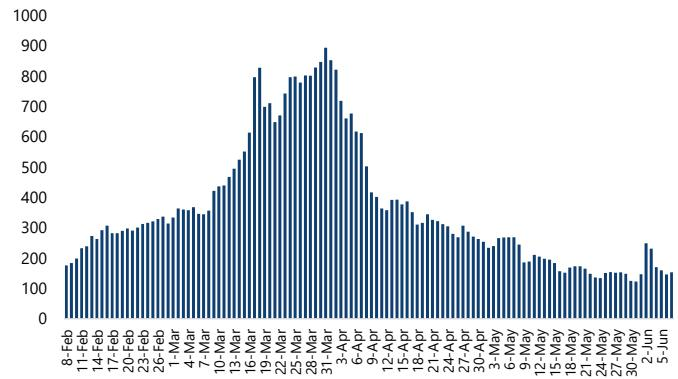

bar chart

| Month    | Value |
| -------- | ----- |
| 8-Feb    | 180   |
| 9-Feb    | 200   |
| 10-Feb   | 220   |
| 11-Feb   | 240   |
| 12-Feb   | 260   |
| 1-Mar    | 280   |
| 2-Mar    | 300   |
| 3-Mar    | 320   |
| 4-Mar    | 340   |
| 5-Mar    | 360   |
| 6-Mar    | 380   |
| 7-Mar    | 400   |
| 8-Mar    | 420   |
| 9-Mar    | 440   |
| 10-Mar   | 460   |
| 11-Mar   | 480   |
| 12-Mar   | 500   |
| 1-Mar    | 520   |
| 2-Mar    | 540   |
| 3-Mar    | 560   |
| 4-Mar    | 580   |
| 5-Mar    | 600   |
| 6-Mar    | 620   |
| 7-Mar    | 640   |
| 8-Mar    | 660   |
| 9-Mar    | 680   |
| 10-Mar   | 700   |
| 11-Mar   | 720   |
| 12-Mar   | 740   |
| 1-Mar    | 760   |
| 2-Mar    | 780   |
| 3-Mar    | 800   |
| 4-Mar    | 820   |
| 5-Mar    | 840   |
| 6-Mar    | 860   |
| 7-Mar    | 880   |
| 8-Mar    | 900   |
| 9-Mar    | 880   |
| 10-Mar   | 860   |
| 11-Mar   | 840   |
| 12-Mar   | 820   |
| 1-Mar    | 800   |
| 2-Mar    | 780   |
| 3-Mar    | 760   |
| 4-Mar    | 740   |
| 5-Mar    | 720   |
| 6-Mar    | 700   |
| 7-Mar    | 680   |
| 8-Mar    | 660   |
| 9-Mar    | 640   |
| 10-Mar   | 620   |
| 11-Mar   | 600   |
| 12-Mar   | 580   |
| 1-Mar    | 560   |
| 2-Mar    | 540   |
| 3-Mar    | 520   |
| 4-Mar    | 500   |
| 5-Mar    | 480   |
| 6-Mar    | 460   |
| 7-Mar    | 440   |
| 8-Mar    | 420   |
| 9-Mar    | 400   |
| 10-Mar   | 380   |
| 11-Mar   | 360   |
| 12-Mar   | 340   |
| 1-Mar    | 320   |
| 2-Mar    | 300   |
| 3-Mar    | 280   |
| 4-Mar    | 260   |
| 5-Mar    | 240   |
| 6-Mar    | 220   |
| 7-Mar    | 200   |
| 8-Mar    | 180   |
| 9-Mar    | 160   |
| 10-Mar   | 140   |
| 11-Mar   | 120   |
| 12-Mar   | 100   |
| 1-Mar    | 80    |
| 2-Mar    | 60    |
| 3-Mar    | 40    |
| 4-Mar    | 20    |
| 5-Mar    | 10    |
| 6-Mar    | -20   |
| ...      | ...   |
| Jun      | -40   |
| May      | -60   |
| Apr      | -80   |
| Mar      | -100                  |
| Feb      | -120                  |
| Jan      | -140                  |
| Dec      | -160                  |
| Nov      | -180                  |
| Oct      | -200                  |
| Sep      | -220                  |
| Aug      | -240                  |
| Jul      | -260                  |
| Jun      | -280                  |

Source: OpenRouter, JEF

Exhibit 39 - Top 15 models used by OpenClaw over the last 30 days (as of 8 Jun)

<table><tr><td>No</td><td>Model</td><td>Tokens</td></tr><tr><td>1</td><td>Claude Sonnet 4.6</td><td>408B</td></tr><tr><td>2</td><td>DeepSeek V4 Flash</td><td>352B</td></tr><tr><td>3</td><td>MiniMax M3</td><td>327B</td></tr><tr><td>4</td><td>Nemotron 3 Super</td><td>310B</td></tr><tr><td>5</td><td>Owl Alpha</td><td>296B</td></tr><tr><td>6</td><td>MiniMax M2.7</td><td>280B</td></tr><tr><td>7</td><td>Gemini 2.5 Flash Lite</td><td>262B</td></tr><tr><td>8</td><td>Claude Opus 4.7</td><td>252B</td></tr><tr><td>9</td><td>Claude Opus 4.6</td><td>169B</td></tr><tr><td>10</td><td>DeepSeek V4 Pro</td><td>158B</td></tr><tr><td>11</td><td>gpt-oss-120b</td><td>156B</td></tr><tr><td>12</td><td>MiniMax M2.5</td><td>132B</td></tr><tr><td>13</td><td>Gemini 3 Flash Preview</td><td>125B</td></tr><tr><td>14</td><td>GPT-5.5</td><td>94.6B</td></tr><tr><td>15</td><td>GLM 5.1</td><td>90.9B</td></tr></table>

Source: OpenRouter, JEF

Exhibit 38 - Token consumption for Hermes Agent (bn)  
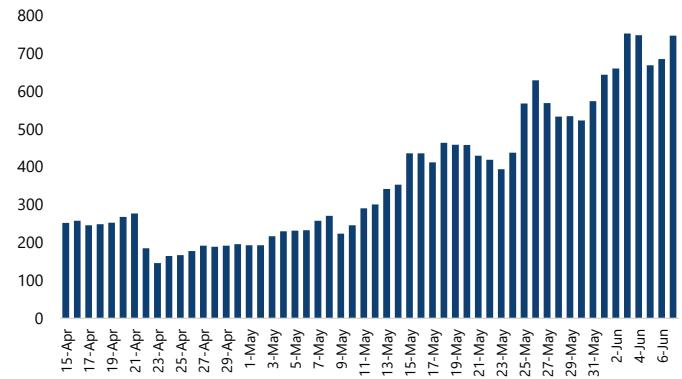

bar chart

| Date | Value |
|---|---|
| 15-Apr | 250 |
| 17-Apr | 245 |
| 19-Apr | 250 |
| 21-Apr | 270 |
| 23-Apr | 140 |
| 25-Apr | 160 |
| 27-Apr | 180 |
| 29-Apr | 190 |
| 1-May | 195 |
| 3-May | 200 |
| 5-May | 220 |
| 7-May | 230 |
| 9-May | 260 |
| 11-May | 240 |
| 13-May | 290 |
| 15-May | 340 |
| 17-May | 430 |
| 19-May | 460 |
| 21-May | 450 |
| 23-May | 420 |
| 25-May | 570 |
| 27-May | 630 |
| 29-May | 570 |
| 31-May | 530 |
| 2-Jun | 650 |
| 4-Jun | 750 |
| 6-Jun | 740 |

Source: OpenRouter, JEF

Exhibit 40 - Top 15 models used by Hermes Agent over the last 30 days (as of 8 Jun)

<table><tr><td>No</td><td>Model</td><td>Tokens</td></tr><tr><td>1</td><td>Owl Alpha</td><td>3.54T</td></tr><tr><td>2</td><td>DeepSeek V4 Flash</td><td>3.51T</td></tr><tr><td>3</td><td>DeepSeek V4 Pro</td><td>1.06T</td></tr><tr><td>4</td><td>Nemotron 3 Super</td><td>693B</td></tr><tr><td>5</td><td>Step 3.7 Flash</td><td>434B</td></tr><tr><td>6</td><td>MiniMax M2.7</td><td>431B</td></tr><tr><td>7</td><td>MiniMax M3</td><td>418B</td></tr><tr><td>8</td><td>Claude Sonnet 4.6</td><td>389B</td></tr><tr><td>9</td><td>Qwen3.6 Plus</td><td>329B</td></tr><tr><td>10</td><td>Kimi K2.6</td><td>308B</td></tr><tr><td>11</td><td>Step 3.5 Flash</td><td>303B</td></tr><tr><td>12</td><td>Claude Opus 4.7</td><td>292B</td></tr><tr><td>13</td><td>GPT-5.5</td><td>222B</td></tr><tr><td>14</td><td>MiMo-V2.5-Pro</td><td>209B</td></tr><tr><td>15</td><td>Gemini 3 Flash Preview</td><td>172B</td></tr></table>

Source: OpenRouter, JEF

According to PinchBench, Anthropic's Claude Opus 4.8 Fast ranked first in terms of success rate (93.5%), followed by Qwen3.7 Max (92.5%) and Claude Opus 4.8 (90.5%).

Exhibit 41 - Global: Top 10 models by success rate as of 8 Jun  
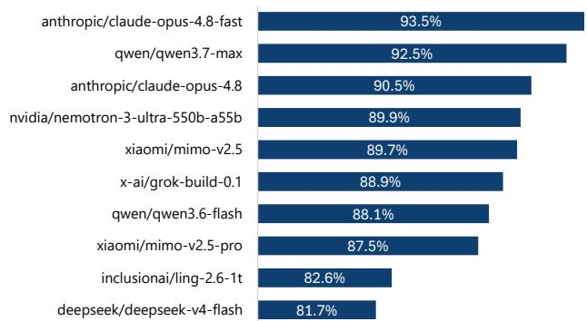

bar chart

| Benchmark | Percentage (%) |
| :--- | :--- |
| anthropic/claude-opus-4.8-fast | 93.5 |
| qwen/qwen3.7-max | 92.5 |
| anthropic/claude-opus-4.8 | 90.5 |
| nvidia/nemotron-3-ultra-550b-a55b | 89.9 |
| xiaomi/mimo-v2.5 | 89.7 |
| x-ai/grok-build-0.1 | 88.9 |
| qwen/qwen3.6-flash | 88.1 |
| xiaomi/mimo-v2.5-pro | 87.5 |
| inclusionai/ling-2.6-1t | 82.6 |
| deepseek/deepseek-v4-flash | 81.7 |

Source: PinchBench, JEF

In Chinese market, Qwen3.7 Max (92.5%) ranked first, followed by MiMo V2.5 (89.7%), Qwen3.6 Flash (88.1%) and MiMo V2.5 Pro (87.5%).

Exhibit 42 - China: Top 10 models by success rate as of 8 Jun  
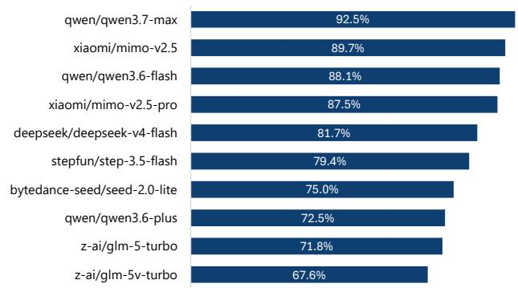

bar chart

| Model | Performance (%) |
| :--- | :--- |
| qwen/qwen3.7-max | 92.5 |
| xiaomi/mimo-v2.5 | 89.7 |
| qwen/qwen3.6-flash | 88.1 |
| xiaomi/mimo-v2.5-pro | 87.5 |
| deepseek/deepseek-v4-flash | 81.7 |
| stepfun/step-3.5-flash | 79.4 |
| bytedance-seed/seed-2.0-lite | 75.0 |
| qwen/qwen3.6-plus | 72.5 |
| z-ai/glm-5-turbo | 71.8 |
| z-ai/glm-5v-turbo | 67.6 |

Source: PinchBench, JEF

## AI Assistants

\- MoM trend: DAU for Qwen reached 29.2m in Apr (vs Mar: 29.1m) and Yuanbao reached 9m (vs Mar:8m). For Doubao, it increased by 13% MoM to 151m (vs Mar: 133m). For DeepSeek, DAU increased by about 1% MoM to about 29m.

DAU for a number of leading players increased MoM in Apr

Exhibit 43 - Weekly DAU for leading AI Assistants in China (mn)  
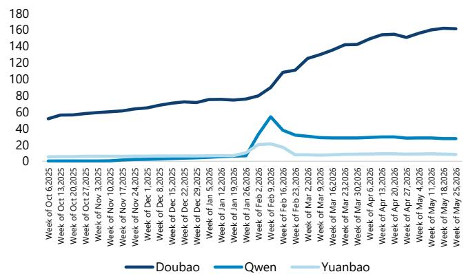

line chart

| Week | Doubao | Qwen | Yuanbao |
| --- | --- | --- | --- |
| Week of Oct 6,2025 | 50 | 0 | 0 |
| Week of Oct 13,2025 | 55 | 0 | 0 |
| Week of Oct 20,2025 | 60 | 0 | 0 |
| Week of Oct 27,2025 | 65 | 0 | 0 |
| Week of Nov 3,2025 | 70 | 0 | 0 |
| Week of Nov 10,2025 | 75 | 0 | 0 |
| Week of Nov 17,2025 | 80 | 0 | 0 |
| Week of Nov 24,2025 | 85 | 0 | 0 |
| Week of Dec 1,2025 | 90 | 0 | 0 |
| Week of Dec 8,2025 | 95 | 0 | 0 |
| Week of Dec 15,2025 | 100 | 0 | 0 |
| Week of Dec 22,2025 | 105 | 0 | 0 |
| Week of Dec 29,2025 | 110 | 0 | 0 |
| Week of Jan 5,2026 | 115 | 0 | 0 |
| Week of Jan 12,2026 | 120 | 0 | 0 |
| Week of Jan 19,2026 | 125 | 0 | 0 |
| Week of Jan 26,2026 | 130 | 0 | 0 |
| Week of Feb 9,2026 | 135 | 55 | 15 |
| Week of Feb 16,2026 | 140 | 35 | 10 |
| Week of Feb 23,2026 | 145 | 30 | 8 |
| Week of Mar 2,2026 | 150 | 30 | 8 |
| Week of Mar 9,2026 | 155 | 30 | 8 |
| Week of Mar 16,2026 | 160 | 30 | 8 |
| Week of Mar 23,2026 | 165 | 30 | 8 |
| Week of Mar 30,2026 | 170 | 30 | 8 |
| Week of Apr 6,2026 | 175 | 30 | 8 |
| Week of Apr 13,2026 | 180 | 30 | 8 |
| Week of Apr 20,2026 | 175 | 30 | 8 |
| Week of Apr 27,2026 | 170 | 30 | 8 |
| Week of May 4,2026 | 165 | 30 | 8 |
| Week of May 11,2026 | 160 | 30 | 8 |
| Week of May 18,2026 | 155 | 30 | 8 |
| Week of May 25,2026 | 150 | 30 | 8 |

Source: QuestMobile, JEF

Exhibit 45 - Weekly user time spent per weekly DAU for leading AI Assistants in China (mins)  
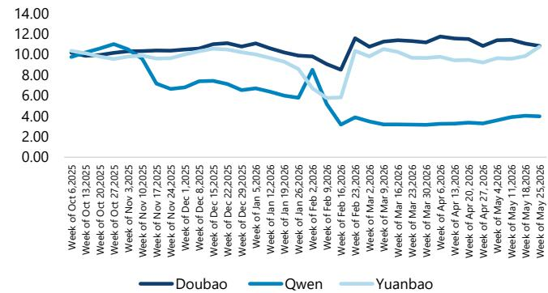

line chart

| Week | Doubao | Qwen | Yuanbao |
| --- | --- | --- | --- |
| Week of Oct 6,2025 | 10.00 | 10.00 | 10.00 |
| Week of Oct 13,2025 | 10.50 | 10.50 | 9.50 |
| Week of Oct 20,2025 | 10.75 | 11.00 | 9.75 |
| Week of Oct 27,2025 | 10.50 | 10.75 | 9.50 |
| Week of Nov 3,2025 | 10.75 | 10.50 | 9.75 |
| Week of Nov 10,2025 | 11.00 | 10.75 | 9.50 |
| Week of Nov 17,2025 | 11.25 | 10.50 | 9.75 |
| Week of Nov 24,2025 | 11.00 | 10.75 | 9.50 |
| Week of Dec 1,2026 | 11.25 | 10.50 | 9.75 |
| Week of Dec 8,2026 | 11.00 | 10.75 | 9.50 |
| Week of Dec 15,2026 | 11.25 | 10.50 | 9.75 |
| Week of Dec 22,2026 | 11.00 | 10.75 | 9.50 |
| Week of Dec 29,2026 | 11.25 | 10.50 | 9.75 |
| Week of Jan 5,2026 | 11.00 | 10.75 | 9.50 |
| Week of Jan 12,2026 | 11.25 | 10.50 | 9.75 |
| Week of Jan 19,2026 | 11.00 | 10.75 | 9.50 |
| Week of Jan 26,2026 | 11.25 | 10.50 | 9.75 |
| Week of Feb 2,2026 | 11.00 | 10.75 | 9.50 |
| Week of Feb 9,2026 | 11.25 | 10.50 | 9.75 |
| Week of Feb 16,2026 | 11.00 | 10.75 | 9.50 |
| Week of Feb 23,2026 | 11.25 | 10.50 | 9.75 |
| Week of Mar 2,2026 | 11.00 | 10.75 | 9.50 |
| Week of Mar 9,2026 | 11.25 | 10.50 | 9.75 |
| Week of Mar 16,2026 | 11.00 | 10.75 | 9.50 |
| Week of Mar 23,2026 | 11.25 | 10.50 | 9.75 |
| Week of Mar 30,2026 | 11.00 | 10.75 | 9.50 |
| Week of Apr 6,2026 | 11.25 | 10.50 | 9.75 |
| Week of Apr 13,2026 | 11.00 | 10.75 | 9.50 |
| Week of Apr 20,2026 | 11.25 | 10.50 | 9.75 |
| Week of Apr 27,2026 | 11.00 | 10.75 | 9.50 |
| Week of May 4,2026 | 11.25 | 10.50 | 9.75 |
| Week of May 11,2026 | 11.00 | 10.75 | 9.50 |
| Week of May 18,2026 | 11.25 | 10.50 | 9.75 |
| Week of May 25,2026 | 11.00 | 10.75 | 9.50 |

Source: QuestMobile, JEF

Exhibit 44 - Monthly DAU for Leading AI Assistants in China (mn)  
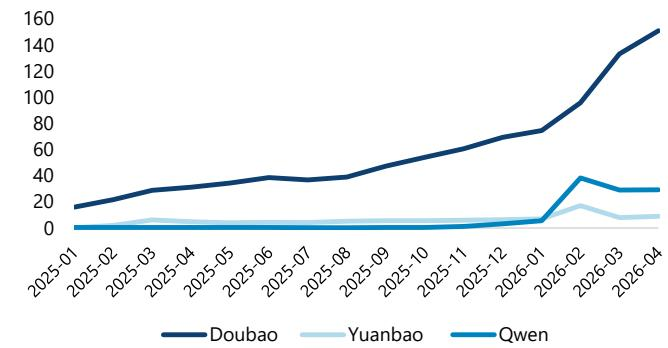

line chart

| Date     | Doubao | Yuanbao | Qwen |
| -------- | ------- | ------- | ---- |
| 2025-01  | 15      | 5       | 5    |
| 2025-02  | 20      | 5       | 5    |
| 2025-03  | 25      | 5       | 5    |
| 2025-04  | 30      | 5       | 5    |
| 2025-05  | 35      | 5       | 5    |
| 2025-06  | 40      | 5       | 5    |
| 2025-07  | 35      | 5       | 5    |
| 2025-08  | 40      | 5       | 5    |
| 2025-09  | 45      | 5       | 5    |
| 2025-10  | 50      | 5       | 5    |
| 2025-11  | 55      | 5       | 5    |
| 2025-12  | 60      | 5       | 5    |
| 2026-01  | 70      | 10      | 10   |
| 2026-02  | 80      | 15      | 40   |
| 2026-03  | 130     | 10      | 30   |
| 2026-04  | 150     | 10      | 30   |

Source: QuestMobile, JEF

Exhibit 46 - Monthly user daily time spent per monthly DAU for leading AI Assistants in China (mins)  
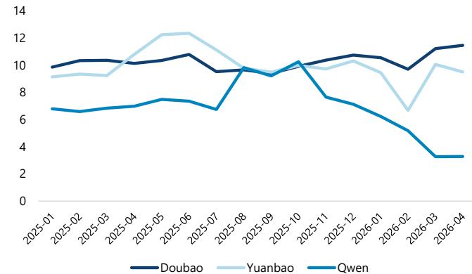

line chart

| Date    | Doubao | Yuanbao | Qwen |
|---------|--------|---------|------|
| 2025-01 | 10.0   | 9.0     | 7.0  |
| 2025-02 | 10.5   | 9.5     | 6.8  |
| 2025-03 | 10.5   | 9.5     | 7.0  |
| 2025-04 | 10.5   | 10.5    | 7.2  |
| 2025-05 | 10.5   | 12.5    | 7.5  |
| 2025-06 | 11.0   | 12.5    | 7.5  |
| 2025-07 | 10.5   | 11.5    | 7.0  |
| 2025-08 | 9.5    | 10.0    | 10.0 |
| 2025-09 | 9.5    | 9.5     | 9.0  |
| 2025-10 | 10.0   | 9.5     | 10.5 |
| 2025-11 | 10.5   | 9.5     | 8.0  |
| 2025-12 | 11.0   | 10.5    | 7.5  |
| 2026-01 | 11.0   | 9.5     | 6.5  |
| 2026-02 | 10.5   | 7.0     | 5.0  |
| 2026-03 | 11.5   | 10.0    | 3.5  |
| 2026-04 | 11.5   | 9.5     | 3.5  |

Source: QuestMobile, JEF

## Video generation models

According to Artificial Analysis (as of 8 Jun), HappyHorse-1.0 ranked top 5 in terms of text to video and image to video. Others include Seedance 2.0, SkyReels V4, Kling 3.0 Omni 1080p, Kling 3.0 1080p, Veo 3.1, and grok-imagine-video.

Exhibit 47 - Top 15 image to video leaderboard (with audio)

<table><tr><td>No</td><td>Model</td><td>ELO</td></tr><tr><td>1</td><td>Dreamina Seedance 2.0 720p</td><td>1,194</td></tr><tr><td>2</td><td>grok-imagine-video-1.5-preview</td><td>1,110</td></tr><tr><td>3</td><td>HappyHorse-1.0</td><td>1,094</td></tr><tr><td>4</td><td>Veo 3.1</td><td>1,089</td></tr><tr><td>5</td><td>grok-imagine-video</td><td>1,081</td></tr><tr><td>6</td><td>SkyReels V4</td><td>1,077</td></tr><tr><td>7</td><td>Veo 3.1 Fast</td><td>1,077</td></tr><tr><td>8</td><td>PixVerse V6</td><td>1,076</td></tr><tr><td>9</td><td>Kling 3.0 1080p(Pro)</td><td>1,076</td></tr><tr><td>10</td><td>Kling 3.0 720p(Standard)</td><td>1,070</td></tr><tr><td>11</td><td>Vidu Q3 Pro</td><td>1,064</td></tr><tr><td>12</td><td>Veo 3.1 Lite</td><td>1,064</td></tr><tr><td>13</td><td>Kling 3.0 Omni 1080p (Pro)</td><td>1,060</td></tr><tr><td>14</td><td>Kling 3.0 Omni 720p (Standard)</td><td>1,061</td></tr><tr><td>15</td><td>Kling 2.6 Pro (January)</td><td>1,011</td></tr></table>

Source: Artificial Analysis, JEF

Exhibit 48 - Top 15 text to video leaderboard (with audio)

<table><tr><td>No</td><td>Model</td><td>ELO</td></tr><tr><td>1</td><td>Dreamina Seedance 2.0 720p</td><td>1,215</td></tr><tr><td>2</td><td>HappyHorse-1.0</td><td>1,122</td></tr><tr><td>3</td><td>SkyReels V4</td><td>1,108</td></tr><tr><td>4</td><td>Kling 3.0 1080p (Pro)</td><td>1,104</td></tr><tr><td>5</td><td>Kling 3.0 Omni1080p (Pro)</td><td>1,099</td></tr><tr><td>6</td><td>Kling 3.0 Omni 720p (Standard)</td><td>1,095</td></tr><tr><td>7</td><td>Kling 3.0 720p (Standard)</td><td>1,094</td></tr><tr><td>8</td><td>Veo 3.1</td><td>1,093</td></tr><tr><td>9</td><td>Sora 2 (December)</td><td>1,088</td></tr><tr><td>10</td><td>Veo 3.1 Fast</td><td>1,087</td></tr><tr><td>11</td><td>Veo 3.1 Lite</td><td>1,083</td></tr><tr><td>12</td><td>Vidu Q3 Pro</td><td>1,082</td></tr><tr><td>13</td><td>Sora 2 Pro</td><td>1,076</td></tr><tr><td>14</td><td>PixVerse V6</td><td>1,069</td></tr><tr><td>15</td><td>grok-imagine-video</td><td>1,069</td></tr></table>

Source: Artificial Analysis, JEF

## Global and China AI Mobile App MAU Ranking

Exhibit 49 - Global AI mobile app MAU ranking (May-26)

<table><tr><td>Rank</td><td>App</td><td>MAU (m)</td><td>MoM</td></tr><tr><td>1</td><td>ChatGPT</td><td>957.8</td><td>3.13%</td></tr><tr><td>2</td><td>Doubao</td><td>329.97</td><td>-1.81%</td></tr><tr><td>3</td><td>Qwen</td><td>233.7</td><td>6.06%</td></tr><tr><td>4</td><td>Quark</td><td>162.13</td><td>-0.10%</td></tr><tr><td>5</td><td>Gemini</td><td>151.23</td><td>8.51%</td></tr><tr><td>6</td><td>DeepSeek</td><td>141.21</td><td>1.60%</td></tr><tr><td>7</td><td>Yuanbao</td><td>111.8</td><td>0.61%</td></tr><tr><td>8</td><td>Baidu Drive</td><td>102.41</td><td>-1.33%</td></tr><tr><td>9</td><td>Jimeng AI</td><td>90.37</td><td>-2.29%</td></tr><tr><td>10</td><td>Dola</td><td>77.81</td><td>9.93%</td></tr><tr><td>11</td><td>Grok</td><td>73.23</td><td>-3.61%</td></tr><tr><td>12</td><td>Meta view</td><td>70.24</td><td>16.84%</td></tr><tr><td>13</td><td>Nova</td><td>62.27</td><td>-10.57%</td></tr><tr><td>14</td><td>Claude</td><td>35.94</td><td>19.10%</td></tr><tr><td>15</td><td>AI Mirror</td><td>34.88</td><td>-0.09%</td></tr></table>

Source: AICPB, JEF

Exhibit 50 - China AI Mobile App MAU Ranking (Mayr-26)

<table><tr><td>Rank</td><td>App</td><td>MAU (m)</td><td>MoM</td></tr><tr><td>1</td><td>Doubao</td><td>329.97</td><td>-1.81%</td></tr><tr><td>2</td><td>Qwen</td><td>233.7</td><td>6.06%</td></tr><tr><td>3</td><td>Quark</td><td>162.13</td><td>-0.10%</td></tr><tr><td>4</td><td>DeepSeek</td><td>141.21</td><td>1.60%</td></tr><tr><td>5</td><td>Yuanbao</td><td>111.8</td><td>0.61%</td></tr><tr><td>6</td><td>Baidu Drive</td><td>102.41</td><td>-1.33%</td></tr><tr><td>7</td><td>Jimeng AI</td><td>90.37</td><td>-2.29%</td></tr><tr><td>8</td><td>Kimi AI</td><td>25.9</td><td>2.26%</td></tr><tr><td>9</td><td>Nano AI Search</td><td>8.46</td><td>-5.04%</td></tr><tr><td>10</td><td>Kling</td><td>8.24</td><td>5.00%</td></tr><tr><td>11</td><td>Baidu Wenku</td><td>7.83</td><td>-7.89%</td></tr><tr><td>12</td><td>ERNIE Bot</td><td>7.03</td><td>-8.72%</td></tr><tr><td>13</td><td>Zhipu Qingyan</td><td>5.02</td><td>-5.16%</td></tr><tr><td>14</td><td>Lovekey Keyboard</td><td>4.96</td><td>8.54%</td></tr><tr><td>15</td><td>Cat Box</td><td>3.92</td><td>-3.07%</td></tr></table>

Source: AICPB, JEF

According to aicpb.com, MAU for China AI apps, which include Doubao, Qwen, Quark, and Yuanbao, experienced strong MoM growth vs ChatGPT due to Chinese New Year in Feb

In domestic market, MAU growth for Kling experienced fast MoM growth in May

## Apr 26: Monthly App Tracker from QuestMobile Analysis

## Online shopping

- MoM trend: DAU for Taobao/PDD decreased by 1%/2% respectively and VIPS increased by 3% in Apr. DAU for JD increased by 2% MoM in Apr.  
- YoY trend: DAU for JD increased 9% YoY and Taobao/PDD increased by 6%/10% YoY respectively.

PDD maintained fast DAU growth YoY basis in Apr

Exhibit 51 - MAU for Taobao / PDD / JD in Apr-26  
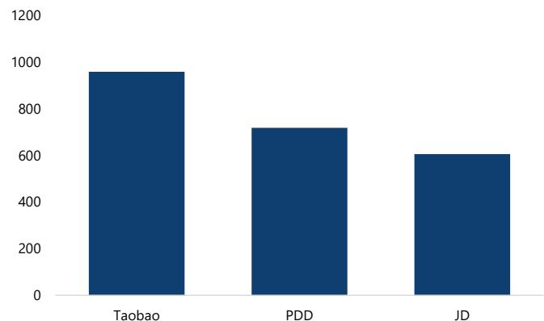

bar chart

| Category | Value |
|---|---|
| Taobao | 960 |
| PDD | 720 |
| JD | 600 |

Source: QuestMobile, JEF

Exhibit 52 - DAU for Taobao / PDD / JD in Apr-26  
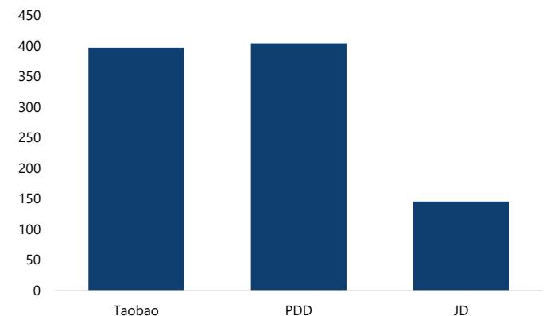

bar chart

| Category | Value |
|---|---|
| Taobao | 400 |
| PDD | 410 |
| JD | 150 |

Source: QuestMobile, JEF

Meituan MAU was largely stable MoM in Apr

## Food delivery

• MoM trend: Meituan MAU increased by 1% MoM during the month.  
• YoY trend: Meituan MAU increased by 4% (vs 3% YoY in Mar) in Apr.

Exhibit 53 - MAU for Meituan app in past 12 months  
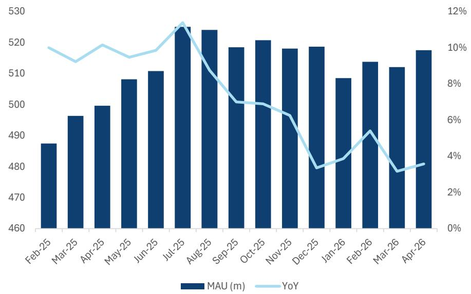

bar-line hybrid chart

| Month   | MAU (m) | YoY  |
|---------|---------|------|
| Feb-25  | 487     | 10.0 |
| Mar-25  | 496     | 9.0  |
| Apr-25  | 500     | 10.5 |
| May-25  | 508     | 9.5  |
| Jun-25  | 511     | 10.0 |
| Jul-25  | 525     | 11.5 |
| Aug-25  | 524     | 9.0  |
| Sep-25  | 518     | 7.0  |
| Oct-25  | 520     | 7.0  |
| Nov-25  | 518     | 6.0  |
| Dec-25  | 519     | 3.5  |
| Jan-26  | 508     | 4.0  |
| Feb-26  | 514     | 5.0  |
| Mar-26  | 512     | 3.0  |
| Apr-26  | 518     | 3.5  |

Source: QuestMobile, JEF

## Online Music

\- MoM trend: MAU for Soda Music increased by 2% MoM to 159.9m in Apr. For TME, MAU for QQ Music/Kugou/Kuwo declined by 6%/3%/3% MoM respectively in Apr. MAU for NetEase Cloud Music increased 1% MoM during the month.

Soda Music maintains fast MAU YoY growth while largely stable MoM in Apr

\- YoY trend: MAU for Soda Music increased by 75% YoY while NetEase Cloud Music MAU increased by 2% YoY in Apr. For TME, MAU for QQ Music increased by 1% while that of Kugou/Kuwo declined by 8%/16% YoY respectively.

Exhibit 54 - MAU for TME, Soda Music and NetEase Cloud Music in Apr-26  
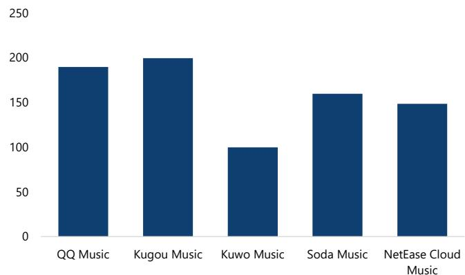

bar chart

| Category | Value |
|---|---|
| QQ Music | 190 |
| Kugou Music | 200 |
| Kuwo Music | 100 |
| Soda Music | 160 |
| NetEase Cloud Music | 150 |

Source: QuestMobile, JEF

Exhibit 55 - MAU for Soda Music in past 12 months  
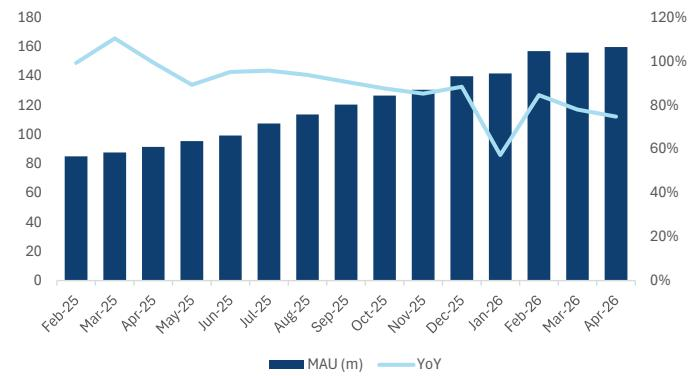

bar-line hybrid chart

| Month | MAU (m) | YoY (%) |
|---|---|---|
| Feb-25 | 84 | 100 |
| Mar-25 | 87 | 110 |
| Apr-25 | 90 | 95 |
| May-25 | 94 | 88 |
| Jun-25 | 98 | 93 |
| Jul-25 | 107 | 95 |
| Aug-25 | 113 | 94 |
| Sep-25 | 120 | 92 |
| Oct-25 | 126 | 89 |
| Nov-25 | 130 | 87 |
| Dec-25 | 138 | 88 |
| Jan-26 | 141 | 60 |
| Feb-26 | 156 | 85 |
| Mar-26 | 155 | 80 |
| Apr-26 | 158 | 77 |

Source: QuestMobile, JEF

## Online video

- MoM trend: MAU for Tencent Video/IQ declined by 3%/7% and Youku increased by 8% MoM. Mango TV maintained stable MoM growth in MAU.  
• YoY trend: MAU for leading long form video players declined YoY during the month.

Exhibit 56 - MAU for IQ, Tencent Video and Youku in Apr-26  
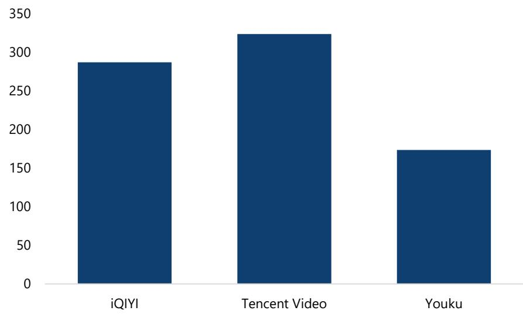

bar chart

| Platform       | Value |
| -------------- | ----- |
| iQIYI          | 290   |
| Tencent Video  | 325   |
| Youku          | 175   |

Source: QuestMobile, JEF

## Live-streaming and short video

- MoM trend: DAU for Douyin main app increased 2% MoM in Apr. For game broadcasting, MAU for Huya increased by 3% and Douyu decreased by 8% MoM in Apr. For BILI, MAU maintained stable MoM during the month.  
- YoY trend: DAU for Douyin main app maintains solid growth at 20% YoY. For game broadcasting, both Huya and Douyu experienced 4% and 15% YoY decline in MAU respectively. For BILI, MAU increased by about 4% YoY during the month.

MAU for leading long form video platform declined YoY in Apr

Douyin DAU maintained solid YoY growth in Apr

Exhibit 57 - DAU for Douyin over the past 12 months  
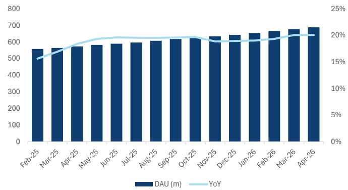

bar-line hybrid chart

| Month | DAU (m) | YoY (%) |
|---|---|---|
| Feb-25 | 560 | 15.0 |
| Mar-25 | 570 | 16.0 |
| Apr-25 | 580 | 17.0 |
| May-25 | 590 | 18.0 |
| Jun-25 | 600 | 19.0 |
| Jul-25 | 610 | 19.0 |
| Aug-25 | 620 | 19.0 |
| Sep-25 | 630 | 19.0 |
| Oct-25 | 640 | 19.0 |
| Nov-25 | 650 | 18.0 |
| Dec-25 | 660 | 18.0 |
| Jan-26 | 670 | 18.0 |
| Feb-26 | 680 | 18.0 |
| Mar-26 | 690 | 19.0 |
| Apr-26 | 700 | 19.0 |

Source: QuestMobile, JEF

Exhibit 58 - MAU for BILI over the past 12 months  
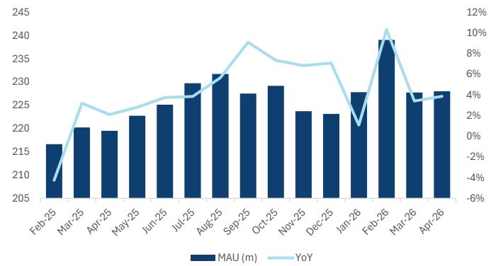

bar-line hybrid chart

| Month | MAU (m) | YoY (%) |
| :--- | :--- | :--- |
| Feb-25 | 216 | -4.5 |
| Mar-25 | 220 | 3.0 |
| Apr-25 | 219 | 2.5 |
| May-25 | 223 | 3.0 |
| Jun-25 | 225 | 3.5 |
| Jul-25 | 230 | 4.0 |
| Aug-25 | 232 | 5.5 |
| Sep-25 | 227 | 9.0 |
| Oct-25 | 229 | 7.5 |
| Nov-25 | 224 | 7.0 |
| Dec-25 | 224 | 7.0 |
| Jan-26 | 228 | 1.0 |
| Feb-26 | 240 | 10.5 |
| Mar-26 | 228 | 3.5 |
| Apr-26 | 228 | 4.0 |

Source: QuestMobile, JEF

## Online travel

• MoM trend: MAU for TCOM / Qunar increased by 7%/8% MoM respectively in Apr.  
• YoY trend: MAU for TCOM/Qunar declined by 5%/10% YoY in Apr.

Exhibit 59 - TCOM's MAU over the past 12 months  
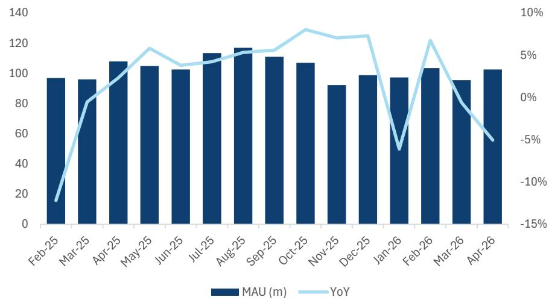

bar-line hybrid chart

| Month   | MAU (m) | YoY    |
|---------|---------|--------|
| Feb-25  | 98      | -13%   |
| Mar-25  | 97      | -5%    |
| Apr-25  | 108     | 0%     |
| May-25  | 105     | 4%     |
| Jun-25  | 103     | 3%     |
| Jul-25  | 114     | 4%     |
| Aug-25  | 118     | 5%     |
| Sep-25  | 112     | 5%     |
| Oct-25  | 107     | 7%     |
| Nov-25  | 93      | 6%     |
| Dec-25  | 99      | 6%     |
| Jan-26  | 98      | -6%    |
| Feb-26  | 104     | 7%     |
| Mar-26  | 96      | -3%    |
| Apr-26  | 103     | -5%    |

Source: QuestMobile, JEF

TCOM MAU in domestic market increased MoM in Apr after CNY in Feb

## News app

• MoM: MAU for Weibo declined by 1% while MAU for Toutiao decreased by 3% in Apr.  
• YoY: MAU for Weibo decreased by 2% YoY while Toutiao decreased by 3% in Apr.

MAU for Weibo experienced negative YoY growth in Apr

Exhibit 60 - Weibo MAU over the past 12 months  
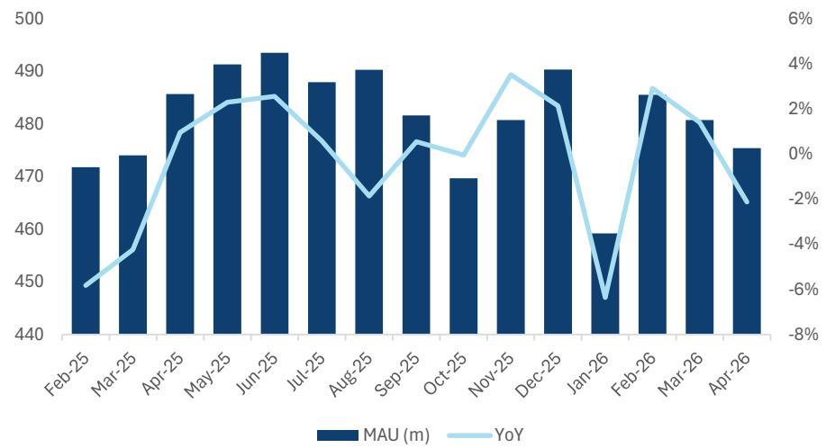

bar-line hybrid chart

| Month   | MAU (m) | YoY    |
|---------|---------|--------|
| Feb-25  | 471     | -4.5%  |
| Mar-25  | 474     | -3.8%  |
| Apr-25  | 486     | 1.2%   |
| May-25  | 491     | 2.5%   |
| Jun-25  | 493     | 2.8%   |
| Jul-25  | 488     | 1.5%   |
| Aug-25  | 490     | -1.5%  |
| Sep-25  | 482     | 0.8%   |
| Oct-25  | 470     | -0.5%  |
| Nov-25  | 481     | 3.5%   |
| Dec-25  | 490     | 2.0%   |
| Jan-26  | 459     | -6.5%  |
| Feb-26  | 486     | 3.0%   |
| Mar-26  | 481     | 1.5%   |
| Apr-26  | 475     | -2.0%  |

Source: QuestMobile, JEF

## Baidu app

• MoM: MAU remained stable and DAU increased by 2% in Apr.  
• YoY: MAU declined by 7% YoY and DAU declined by 20% YoY in Apr.

Exhibit 61 - Baidu MAU over the past 12 months  
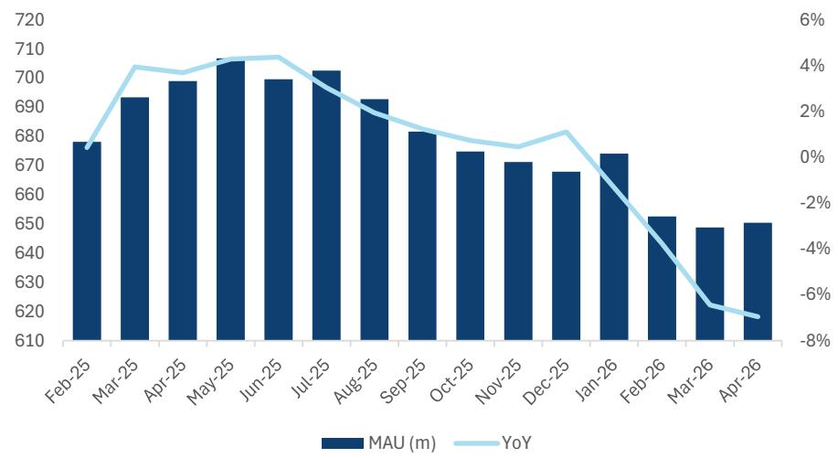

bar-line hybrid chart

| Month    | MAU (m) | YoY   |
| -------- | ------- | ----- |
| Feb-25   | 678     | 1.5%  |
| Mar-25   | 693     | 3.5%  |
| Apr-25   | 698     | 3.0%  |
| May-25   | 705     | 3.5%  |
| Jun-25   | 700     | 3.5%  |
| Jul-25   | 703     | 3.0%  |
| Aug-25   | 693     | 2.0%  |
| Sep-25   | 681     | 1.5%  |
| Oct-25   | 674     | 1.0%  |
| Nov-25   | 671     | 0.5%  |
| Dec-25   | 668     | 1.5%  |
| Jan-26   | 674     | -1.0% |
| Feb-26   | 653     | -3.0% |
| Mar-26   | 648     | -6.0% |
| Apr-26   | 650     | -7.0% |

Source: QuestMobile, JEF

Baidu app MAU experienced stable MoM and declined YoY in Apr

## IDC estimates on tokens consumptions on public cloud and outlook

Exhibit 62 - China's MaaS market monthly average daily token consumption in 2025  
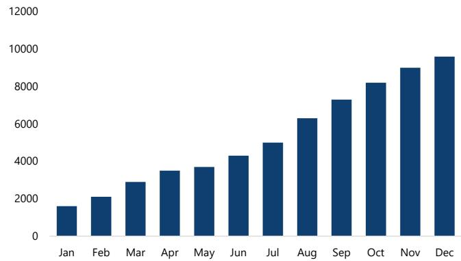

bar chart

| Month | Value |
|---|---|
| Jan | 1600 |
| Feb | 2100 |
| Mar | 2900 |
| Apr | 3500 |
| May | 3700 |
| Jun | 4300 |
| Jul | 5000 |
| Aug | 6300 |
| Sep | 7300 |
| Oct | 8200 |
| Nov | 9000 |
| Dec | 9600 |

Source: IDC, JEF

Exhibit 64 - Market share of major vendors in China's MaaS market in 2025 (revenue basis)  
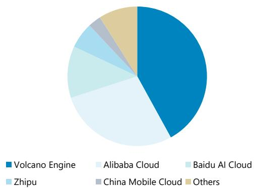

pie chart

| Company | Value |
| :--- | :--- |
| Volcano Engine | 45.0% |
| Alibaba Cloud | 30.0% |
| Baidu AI Cloud | 15.0% |
| Zhipu | 10.0% |
| China Mobile Cloud | 5.0% |
| Others | 10.0% |

Source: IDC, JEF

Exhibit 66 - The most important factors that drive people's decision to deploy model widely  
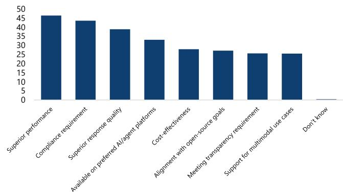

bar chart

| Category                          | Value |
| --------------------------------- | ----- |
| Superior performance              | 47    |
| Compliance requirement            | 44    |
| Superior response quality        | 39    |
| Available on preferred AI/agent platforms | 33    |
| Cost-effectiveness                 | 28    |
| Alignment with open-source goals   | 27    |
| Meeting transparency requirement   | 26    |
| Support for multimodal use cases   | 25    |
| Don't Know                        | 1     |

Source: IDC, JEF

Exhibit 63 - China's MaaS market share by token consumption in 2025  
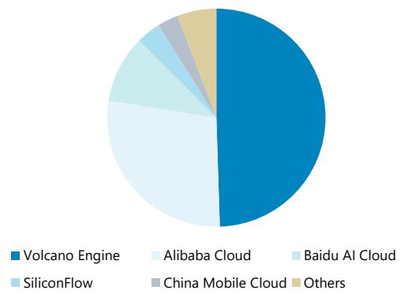

pie chart

| Company | Value |
| :--- | :--- |
| Volcano Engine | 50 |
| Alibaba Cloud | 35 |
| Baidu AI Cloud | 15 |
| SiliconFlow | 10 |
| China Mobile Cloud | 8 |
| Others | 10 |

Source: IDC, JEF

Exhibit 65 - Market share of major vendors in China's private large model platform market in 2025 (revenue basis)  
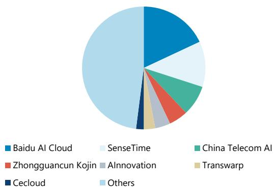

pie chart

| Company | Value |
| :--- | :--- |
| Baidu AI Cloud | 15.0% |
| SenseTime | 12.0% |
| China Telecom AI | 8.0% |
| Zhongguancun Kojin | 6.0% |
| AlInnovation | 4.0% |
| Transwarp | 3.0% |
| Cecloud | 2.0% |
| Others | 50.0% |

Source: IDC, JEF

Exhibit 67 - China's MaaS market scale and forcaset 2024-2030 (token basis)  
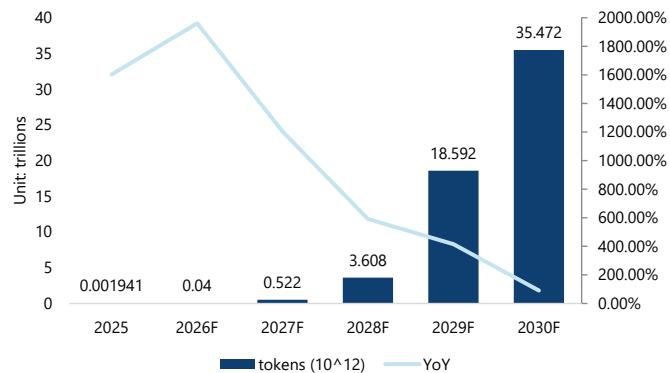

bar-line hybrid

| Year | Tokens (10^12) | YoY (%) |
| :--- | :--- | :--- |
| 2025 | 0.001941 | 1600.00 |
| 2026F | 0.04 | 2000.00 |
| 2027F | 0.522 | 1200.00 |
| 2028F | 3.608 | 600.00 |
| 2029F | 18.592 | 400.00 |
| 2030F | 35.472 | 100.00 |

Source: IDC, JEF

## Appendix

## Omdia heatmap for agentic AI development platform in Asia and Oceania

According to Omdia, agentic AI software market is expected to increase at 105% CAGR from USD271m in 2025 to USD9.7bn by 2030. Alibaba Cloud captures the highest rankings in 5 areas: (1) context engineering, (2) model support, (3) multi-agent framework, (4) operation and lifecycle management, and (5) open source and community.

Exhibit 68 - Omdia heatmap for agentic AI development platform in Asia and Oceania

<table><tr><td rowspan="2"></td><td colspan="5">LEADER</td></tr><tr><td>Alibaba Cloud</td><td>AWS</td><td>Google Cloud Platform</td><td>Microsoft Azure</td><td>Tencent Cloud</td></tr><tr><td>Context engineering</td><td></td><td></td><td></td><td></td><td></td></tr><tr><td>Model support</td><td></td><td></td><td></td><td></td><td></td></tr><tr><td>Multi-agent framework</td><td></td><td></td><td></td><td></td><td></td></tr><tr><td>Operation and lifecycle management</td><td></td><td></td><td></td><td></td><td></td></tr><tr><td>Tools and marketplace</td><td></td><td></td><td></td><td></td><td></td></tr><tr><td>Vertical specific solution</td><td></td><td></td><td></td><td></td><td></td></tr><tr><td>Open source and community</td><td></td><td></td><td></td><td></td><td></td></tr></table>

Source: Omdia, JEF

According to Omdia, Alibaba Cloud is ranked as one of the leaders and top choice for building and deploying AI agents. It captures the highest ranking for 5 out of 7 metrics.

## Market size: Coding, Workspace, and Content Creation

According to Grand View Research, the global AI code tools market is expected to increase by 3x to USD26bn from 2025 to 2030. On the other hand, F&S predicts that the China AI code generation market will reach about USD4.7bn in 2028. KA customized solutions are expected to be a key revenue contributor.

Global AI code tools market is expected to be 3x the scale in 2030 vs 2025

Exhibit 69 - Global AI code tools market size (USDbn)  
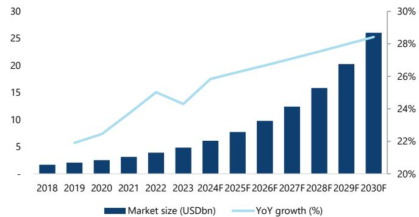

bar-line hybrid

| Year   | Market size (USDbn) | YoY growth (%) |
| ------ | ------------------- | -------------- |
| 2018   | 2                   | -              |
| 2019   | 3                   | -              |
| 2020   | 4                   | -              |
| 2021   | 5                   | -              |
| 2022   | 6                   | -              |
| 2023   | 7                   | -              |
| 2024F  | 8                   | -              |
| 2025F  | 9                   | -              |
| 2026F  | 10                  | -              |
| 2027F  | 12                  | -              |
| 2028F  | 15                  | -              |
| 2029F  | 20                  | -              |
| 2030F  | 26                  | -              |

Source: Grand View Research, JEF

Exhibit 70 - China AI code generation market size by service type (RMBbn)  
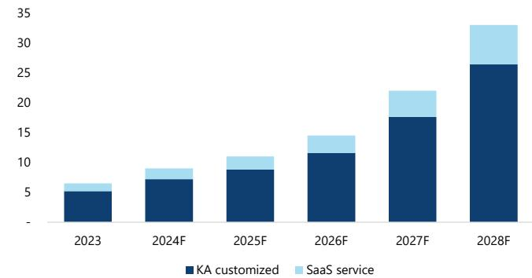

stacked bar chart

| Year | KA customized (Billion) | SaaS service (Billion) |
| :--- | :--- | :--- |
| 2023 | 5 | 1 |
| 2024F | 7 | 1.5 |
| 2025F | 9 | 2 |
| 2026F | 11.5 | 3 |
| 2027F | 17.5 | 4.5 |
| 2028F | 26.5 | 6.5 |

Source: Frost & Sullivan, JEF

Exhibit 71 - China AI code penetration in different industries  
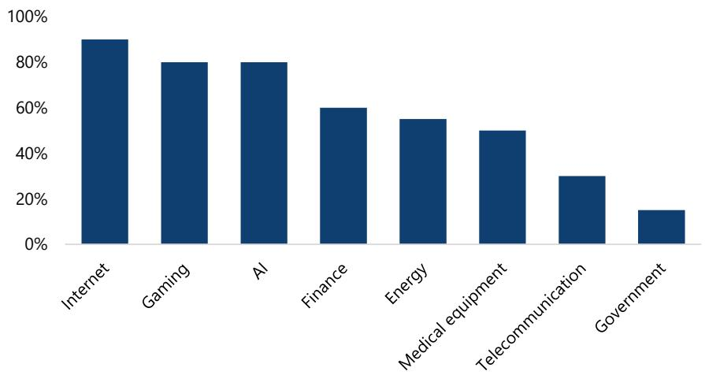

bar chart

| Category | Value (%) |
|---|---|
| Internet | 90 |
| Gaming | 80 |
| AI | 80 |
| Finance | 60 |
| Energy | 55 |
| Medical equipment | 50 |
| Telecommunication | 30 |
| Government | 15 |

Source: Frost & Sullivan, JEF  
According to Gonyn Industry Research (2024), market size of AI+Workspace software is expected to reach RMB191bn in 2028, 6x the scale vs 2024.

In terms of AI code penetration, internet, gaming, AI, finance, and energy are top 5 key sectors

Exhibit 72 - China AI + Workspace Market Size  
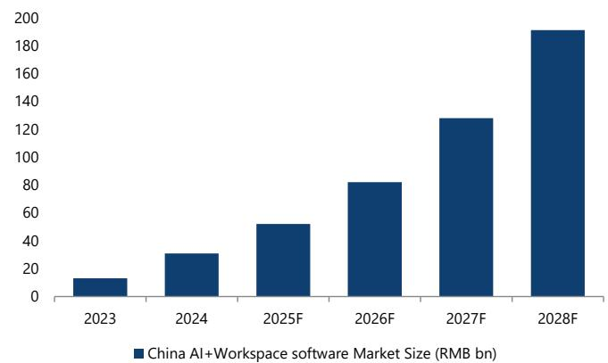

bar chart

| Year | China AI+Workspace software Market Size (RMB bn) |
| :--- | :--- |
| 2023 | 14 |
| 2024 | 31 |
| 2025F | 53 |
| 2026F | 83 |
| 2027F | 129 |
| 2028F | 193 |

Exhibit 73 - Generative AI in Content Creation Market Size 2025 to 2035 (USD bn)  
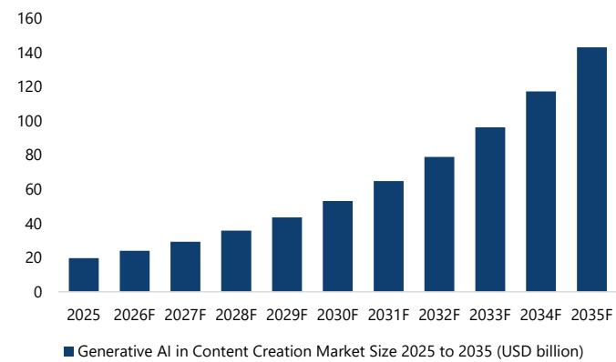

bar chart

| Year | Generative AI in Content Creation Market Size (USD billion) |
| :--- | :--- |
| 2025 | 20 |
| 2026F | 24 |
| 2027F | 30 |
| 2028F | 36 |
| 2029F | 44 |
| 2030F | 54 |
| 2031F | 65 |
| 2032F | 80 |
| 2033F | 97 |
| 2034F | 118 |
| 2035F | 144 |

Source: Precedence Research, JEF  
Source: Gonyn, JEF  
According to Precedence Research, global generative AI content creation market is expected to increase by 7x surpassing USD140bn in 2035 vs 2025.

Exhibit 74 - Daily token consumption in China by enterprises in 2H25 vs 1H25 (tn)  
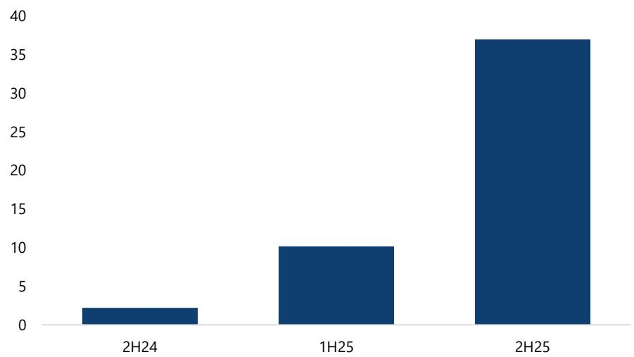

bar chart

| Period | Value |
|---|---|
| 2H24 | 2 |
| 1H25 | 10 |
| 2H25 | 37 |

Source: Frost & Sullivan, JEF

According to F&S, enterprise daily token consumption increased by 263% HoH to 37tn, among which market share for Alibaba Cloud increased the most and captures no 1 position reaching 32% in 2H25 (1H25:17.7%), followed by 21.3% for Doubao (1H25: 14.1%) and 18.4% for DeepSeek (1H25: 10.3%).

Alibaba's Qwen ranked first in terms of token consumption among enterprises in 2H25

Exhibit 75 - Market share in terms of tokens used among enterprises in 1H25  
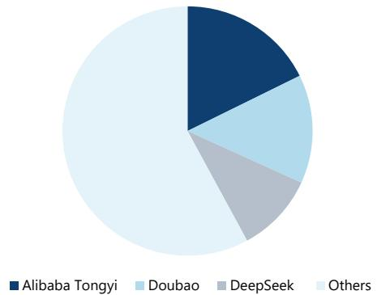

pie chart

| Category | Value |
|---|---|
| Alibaba Tongyi | 15.0% |
| Doubao | 12.0% |
| DeepSeek | 8.0% |
| Others | 60.0% |

Source: Frost & Sullivan, JEF

Exhibit 76 - Market share in terms of tokens used among enterprises in 2H25  
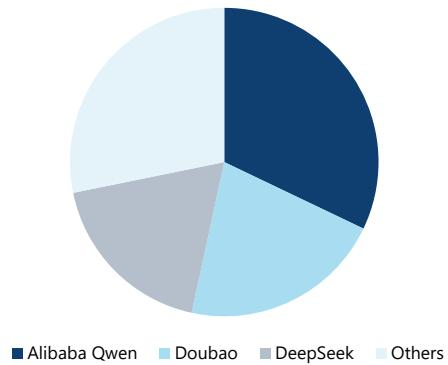

pie chart

| Category | Value |
|---|---|
| Alibaba Qwen | 45 |
| Doubao | 30 |
| DeepSeek | 25 |
| Others | 35 |

Source: Frost & Sullivan, JEF

## China Large Language Models

According to F&S / CAICT, China LLM market is expected to increase by about 64% CAGR between 2024 and 2030 and surpass RMB100bn in 2030. By segment, consumer revenue is expected to grow at a slower rate vs enterprise as willingness to pay remains low.

China large language models are expected to increase by 64% CAGR between 2024 to 2030. By segment, on-premise is key revenue contributor

Exhibit 77 - Market size of China LLM (RMB billions)  
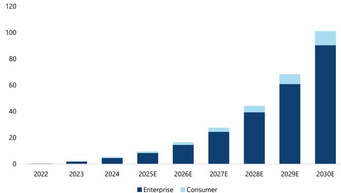

stacked bar chart

| Year | Enterprise | Consumer |
|---|---|---|
| 2022 | 0 | 1 |
| 2023 | 2 | 0 |
| 2024 | 5 | 0 |
| 2025E | 9 | 1 |
| 2026E | 15 | 2 |
| 2027E | 24 | 3 |
| 2028E | 39 | 4 |
| 2029E | 61 | 6 |
| 2030E | 90 | 10 |

Source: Frost & Sullivan, CAICT, JEF

Exhibit 78 - Market size of China Enterprise LLM (RMB billions)  
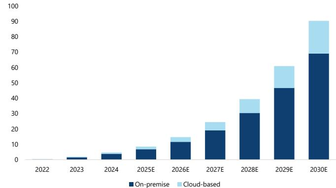

stacked bar chart

| Year | On-premise (%) | Cloud-based (%) |
|---|---|---|
| 2022 | 0 | 1 |
| 2023 | 1 | 0 |
| 2024 | 3 | 0 |
| 2025E | 7 | 1 |
| 2026E | 11 | 2 |
| 2027E | 19 | 3 |
| 2028E | 30 | 6 |
| 2029E | 46 | 11 |
| 2030E | 69 | 18 |

Source: Frost & Sullivan, CAICT, JEF

## Anthropic and OpenAI

- In May-26, Anthropic announces USD965bn post money valuation on 28 May. It raised USD65bn in Series H funding. ARR crossed USD47bn in early May.  
- According to The Information, OpenAI revenue is expected to reach USD200bn in 2030, over 6x the scale in 2026. Rising Agent revenue contribution is expected over the next few years.

Exhibit 79 - ARR of Anthropic  
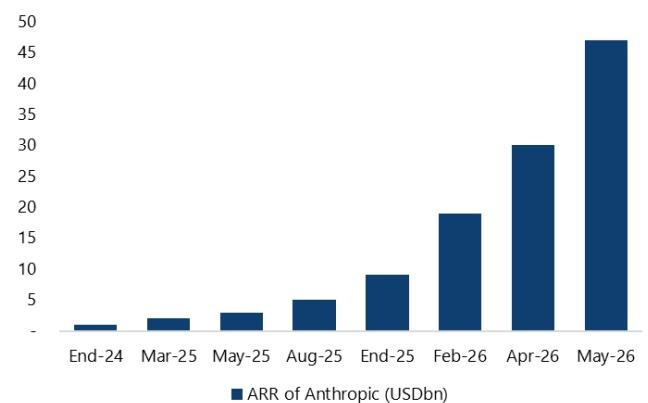

bar chart

| Month | ARR of Anthropic (USDbn) |
|---|---|
| End-24 | 1.0 |
| Mar-25 | 2.5 |
| May-25 | 3.5 |
| Aug-25 | 5.0 |
| End-25 | 9.0 |
| Feb-26 | 19.0 |
| Apr-26 | 30.0 |
| May-26 | 47.0 |

Source: The Information, company reports, JEF

Exhibit 81 - OpenAI revenue between 2023 and 2030F (as of 3Q25)  
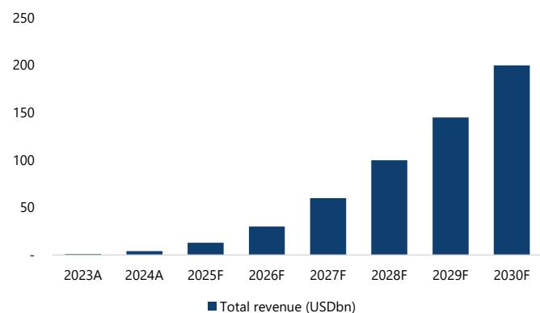

bar chart

| Year | Total revenue (USDbn) |
|---|---|
| 2023A | ~1 |
| 2024A | ~5 |
| 2025F | ~15 |
| 2026F | ~30 |
| 2027F | ~60 |
| 2028F | ~100 |
| 2029F | ~145 |
| 2030F | ~200 |

Source: The Information, JEF

Exhibit 80 - ARR of OpenAI  
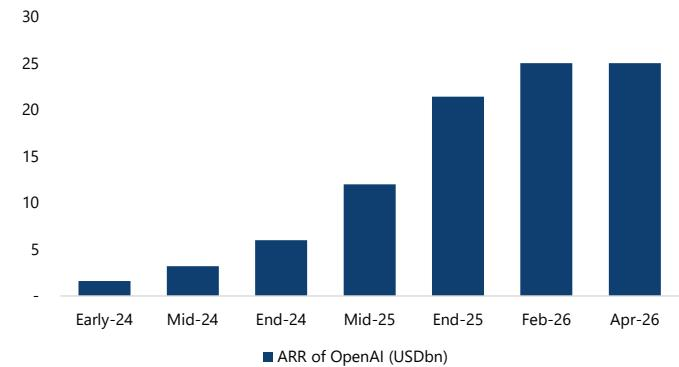

bar chart

| Period | ARR of OpenAI (USDbn) |
|---|---|
| Early-24 | 1.5 |
| Mid-24 | 3.0 |
| End-24 | 6.0 |
| Mid-25 | 12.0 |
| End-25 | 21.5 |
| Feb-26 | 25.0 |
| Apr-26 | 25.0 |

Source: The Information, company reports, JEF

Exhibit 82 - Revenue mix of OpenAI between 2024 and 2030F (as of 3Q25)  
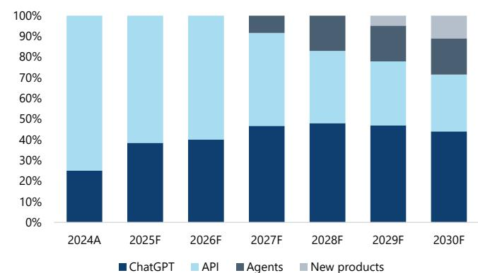

stacked bar chart

| Year | ChatGPT (%) | API (%) | Agents (%) | New products (%) |
|---|---|---|---|---|
| 2024A | 25 | 75 | 0 | 0 |
| 2025F | 39 | 61 | 0 | 0 |
| 2026F | 40 | 61 | 0 | 0 |
| 2027F | 46 | 48 | 5 | 0 |
| 2028F | 48 | 33 | 15 | 0 |
| 2029F | 47 | 31 | 15 | 3 |
| 2030F | 44 | 27 | 19 | 11 |

Source: The Information, JEF

Exhibit 83 - MiniMax: % of OpenAI revenue over the next few years  
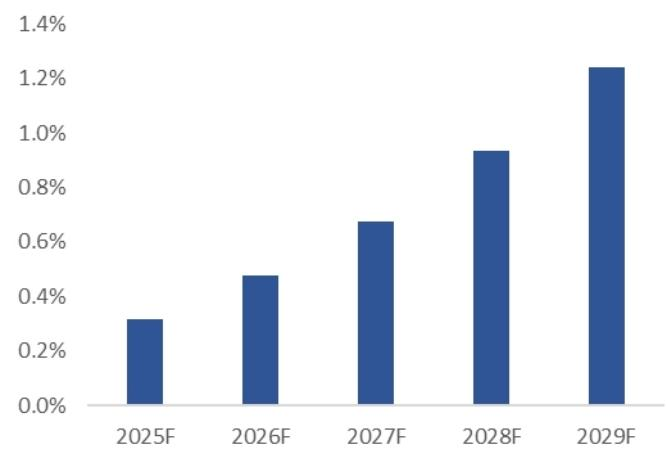

bar chart

| Year | Value (%) |
|---|---|
| 2025F | 0.32 |
| 2026F | 0.48 |
| 2027F | 0.67 |
| 2028F | 0.94 |
| 2029F | 1.24 |

Source: CIC, JEF estimates

## Models of Leading Players in China

Exhibit 84 - Model list of Alibaba

<table><tr><td>Release Date</td><td>Model</td><td>Core Functions</td></tr><tr><td>Jan-24</td><td>Qwen-VL-Plus / Max</td><td>Enhanced visual reasoning, high-resolution OCR, and detailed image understanding via API.</td></tr><tr><td>Feb-24</td><td>Qwen1.5</td><td>First major open-source iteration with improved multilingual support and 0.5B to 72B sizes.</td></tr><tr><td>Jun-24</td><td>Qwen2</td><td>Optimized for coding, mathematics, and long-context processing (up to 128K tokens).</td></tr><tr><td>Aug-24</td><td>Qwen2-Audio</td><td>Native audio-to-text and audio-to-audio dialogue capabilities.</td></tr><tr><td>Aug-24</td><td>Qwen2-VL</td><td>Introduced dynamic resolution for visual inputs and long video understanding.</td></tr><tr><td>Sep-24</td><td>Qwen2.5</td><td>Significant upgrades in instruction following, structured data (tables) processing, and coding.</td></tr><tr><td>Nov-24</td><td>QwQ-32B-Preview</td><td>Reasoning-focused model using Reinforcement Learning for complex logic and chain-of-thought.</td></tr><tr><td>Jan-25</td><td>Qwen2.5-Max</td><td>Large-scale MoE (Mixture of Experts) flagship; matches or exceeds GPT-4o benchmarks.</td></tr><tr><td>Jan-25</td><td>Qwen2.5-VL</td><td>&quot;Agentic&quot; vision model capable of identifying and interacting with mobile/PC UI screens.</td></tr><tr><td>Mar-25</td><td>Qwen2.5-Omni</td><td>End-to-end full-modality model supporting seamless real-time text, audio, and visual interaction.</td></tr><tr><td>Apr-25</td><td>Qwen3 (Series)</td><td>New reasoning architecture with hybrid inference modes to reduce hallucinations in complex tasks.</td></tr><tr><td>Sep-25</td><td>Qwen3-Max-Preview</td><td>Trillion-parameter preview version optimized for massive enterprise-scale applications.</td></tr><tr><td>Dec-25</td><td>Wan2.6-Image</td><td>Supports image editing and mixed image-text output.</td></tr><tr><td>Jan-26</td><td>Qwen3-Max</td><td>Frontier reasoning, 1T+ params, agentic workflow mastery.</td></tr><tr><td>Feb-26</td><td>Qwen3.5</td><td>Latest flagship series featuring a 397B MoE model with superior cross-lingual reasoning.</td></tr><tr><td>Feb-26</td><td>Wan2.6-r2v-flash</td><td>Generates multi-shot videos with automatic dubbing, using a character&#x27;s appearance from a reference video or image.</td></tr><tr><td>Feb-26</td><td>Qwen3.5-Plus</td><td>Outstanding performance comparable to the very latest state-of-the-art models with significant leaps in both pure-text and multimodal capabilities compared to the 3 series.</td></tr><tr><td>Feb-26</td><td>Qwen3-Coder-Next</td><td>Multi-turn tool interactions, future-ready development support.</td></tr><tr><td>Mar-26</td><td>Qwen3.5-Omni</td><td>Support for 256k long-text input and can process more than 10 hours of audio input and over 400 seconds of 720P audio-visual input at 1 FPS.</td></tr><tr><td>Apr-26</td><td>Wan2.7-Image</td><td>The Wan 2.7 image generation and editing model supports text-to-image, text-to-image-set, image-to-image-set, image editing, multi-image reference generation, and interactive editing, with improved performance in text rendering, subject consistency, and complex instruction following. The Pro series supports 4K output; the accelerated version balances quality and response speed.</td></tr><tr><td>Apr-26</td><td>Qwen3.6-Plus</td><td>Native multimodal, 1M context, agentic coding</td></tr><tr><td>Apr-26</td><td>Happy Oyster</td><td>AI model that creates interactive 3D scenes with realistic physics for game, film, and TV.</td></tr><tr><td>Apr-26</td><td>Qwen3.6-Max-Preview</td><td>It brings stronger world knowledge and instruction following, along with significant agentic coding improvements across a wide range of benchmarks.</td></tr><tr><td>Apr-26</td><td>Qwen-Image-2.0</td><td>Delivers a significant leap in visual quality — especially texture detail, lighting, and materials. It supports multilingual in-image text generation and delivers more balanced artistic style performance.</td></tr><tr><td>Apr-26</td><td>HappyHorse-1.0</td><td>It supports all four video generation modalities: Text to Video and Image to Video, each with and without native audio.</td></tr><tr><td>May-26</td><td>Qwen3.7-Max</td><td>Qwen3.7-Max is built to be a versatile agent foundation — equally capable of writing and debugging code, automating office workflows, and sustaining autonomous execution across hundreds or thousands of steps.</td></tr><tr><td>Jun-26</td><td>Qwen3.7-Plus</td><td>A multimodal agent model that unifies vision and language into a single, versatile agent foundation. Building on Qwen3.7&#x27;s strong text backbone, Qwen3.7-Plus delivers a comprehensive upgrade in vision-language capabilities while retaining full agentic strength in coding, tool use, and productivity workflows.</td></tr></table>

Source: Company, JEF

Exhibit 85 - Tencent model list

<table><tr><td>Release Date</td><td>Model</td><td>Core Functions</td></tr><tr><td>May-24</td><td>Hunyuan-DiT</td><td>The industry&#x27;s first Chinese-native Diffusion Transformer (DiT) for high-quality text-to-image generation.</td></tr><tr><td>Sep-24</td><td>Hunyuan-Turbo</td><td>An upgraded LLM based on the Mixture-of-Experts (MoE) architecture, doubling training efficiency and reducing inference costs.</td></tr><tr><td>Nov-24</td><td>Hunyuan3D 1.0</td><td>First open-source 3D generation model supporting text-to-3D and image-to-3D workflows.</td></tr><tr><td>Dec-24</td><td>HunyuanVideo</td><td>A large-scale video generation framework capable of producing high-definition videos with complex motion.</td></tr><tr><td>Jan-25</td><td>Hunyuan3D 2.0</td><td>Significant upgrades in geometry accuracy and texture representation for 3D asset creation.</td></tr><tr><td>Feb-25</td><td>Hunyuan Turbo S</td><td>A “fast-thinking” model using Hybrid-Mamba-Transformer architecture, optimized for near-instant responses and competitive reasoning.</td></tr><tr><td>Mar-25</td><td>HunyuanVideo-I2V</td><td>An specialized image-to-video model built on the foundation of HunyuanVideo.</td></tr><tr><td>Jun-25</td><td>Hunyuan3D 2.1</td><td>Production-ready 3D asset generation with a new PBR (Physically Based Rendering) material model.</td></tr><tr><td>Sep-25</td><td>Hunyuan Image 3.0</td><td>Flagship image generation model (80B parameters) topping global rankings for semantic understanding.</td></tr><tr><td>Nov-25</td><td>HunyuanVideo 1.5</td><td>A highly efficient and powerful update to the foundation video generation model.</td></tr><tr><td>Dec-25</td><td>Hunyuan 2.0</td><td>Next-generation LLM featuring 406B parameters and a 256K context window for complex reasoning tasks.</td></tr><tr><td>Jan-26</td><td>Hunyuan Image 3.0-Instruct</td><td>An image-to-image editing model supporting precise single-sentence editing and multi-image fusion.</td></tr><tr><td>Mar-26</td><td>HY-WU</td><td>A scalable framework for on-the-fly conditional generation of low-rank(LoRA) updates.</td></tr><tr><td>Apr-26</td><td>HY-World 2.0</td><td>A multi-modal world model framework for world generation and world reconstruction. It accepts diverse input modalities — text, single-view images, multi-view images, and videos — and produces 3D world representations</td></tr><tr><td>Apr-26</td><td>Hy3 preview</td><td>A 295B-parameter Mixture-of-Experts (MoE) model with 21B active parameters and 3.8B MTP layer parameters. It improves significantly on complex reasoning, instruction following, context learning, coding, and agent tasks.</td></tr><tr><td>May-26</td><td>Hy-MT2</td><td>A powerful multilingual model supporting seamless translation across 33 languages</td></tr></table>

Source: Company, JEF

Exhibit 86 - Baidu model list

<table><tr><td>Release Date</td><td>Model</td><td>Core Functions</td></tr><tr><td>Mar-24</td><td>ERNIE Speed / Lite / Tiny</td><td>Lightweight models optimized for low latency and high cost-efficiency.</td></tr><tr><td>Jun-24</td><td>ERNIE 4.0 Turbo</td><td>Efficiency upgrade for the 4.0 architecture with faster response speeds.</td></tr><tr><td>Mar-25</td><td>ERNIE 4.5</td><td>Baidu&#x27;s first native multimodal foundation model (text, image, audio, video).</td></tr><tr><td>Mar-25</td><td>ERNIE X1</td><td>Deep-thinking reasoning model designed for complex logic and multi-step tasks.</td></tr><tr><td>Apr-25</td><td>ERNIE 4.5 Turbo / X1 Turbo</td><td>Performance-optimized version of X1 with significantly lower inference costs.</td></tr><tr><td>Sep-25</td><td>ERNIE X1.1</td><td>Major upgrade in factuality, instruction following, and agentic capabilities.</td></tr><tr><td>Nov-25</td><td>ERNIE 5.0 (Preview)</td><td>Preview of next-gen omni-modal model with advanced real-time reasoning.</td></tr><tr><td>Jan-26</td><td>ERNIE 5.0 (Stable)</td><td>Current flagship 2.4T parameter model; top-ranked Chinese model on LMArena.</td></tr><tr><td>Apr-26</td><td>ERNIE-Image</td><td>A text-to-image generation model built on a single-stream Diffusion Transformer (DiT) with 8B DiT parameters, achieving leading performance among open weights models on several challenging benchmarks.</td></tr><tr><td>May-26</td><td>ERNIE 5.1</td><td>Significantly reduces pretraining cost while compressing total parameters to ~1/3 and activated parameters to ~1/2 — using only ~6% of the pretraining cost compared to models at similar scale, while achieving leading performance in its class.</td></tr></table>

Source: Company, JEF

Exhibit 87 - MiniMax model list

<table><tr><td>Release Date</td><td>Model</td><td>Core Function</td></tr><tr><td>Jan-25</td><td>MiniMax-Text-01/MiniMax-VL-01</td><td>New generation of text and vision language model</td></tr><tr><td>Feb-25</td><td>T2V-01-Director/I2V-01-Director</td><td>Director-level video generation model, better adherence to camera movement description instructions</td></tr><tr><td>Apr-25</td><td>Image-01</td><td>Support generating images of various sizes from text descriptions</td></tr><tr><td>Jun-25</td><td>MiniMax-M1</td><td>80K mind chain and 1M input</td></tr><tr><td>Jun-25</td><td>MiniMax-Hailuo 02</td><td>Native 1080p, SOTA instruction following, extreme physics mastery</td></tr><tr><td>Jun-25</td><td>Music-1.5 (Beta)</td><td>Support music generation by inputting musical inspiration and lyrics</td></tr><tr><td>Aug-25</td><td>Sppeech-2.5</td><td>Significantly enhanced multilingual performance, more realistic and accurate voice cloning, over 40 languages</td></tr><tr><td>Sep-25</td><td>Music-1.5</td><td>Extending song generation to a full 4minutes, one person is the band</td></tr><tr><td>Oct-25</td><td>MiniMax M2</td><td>Open-source MoE, strong code &amp; agent</td></tr><tr><td>Oct-25</td><td>MiniMax-Hailuo-2.3</td><td>Complex video performance &amp; media agent</td></tr><tr><td>Oct-25</td><td>MiniMax-Speech-2.6</td><td>Rea-time response, intelligent parsing, fluent LoRA voice</td></tr><tr><td>Oct-25</td><td>Music-2.0</td><td>A lead forward in model&#x27;s understanding and expression of music</td></tr><tr><td>Dec-25</td><td>MiniMax M2.1</td><td>Exceptional multilingual capabilities to elevate code engineering</td></tr><tr><td>Jan-26</td><td>Music-2.5</td><td>Creation more precise and music more real</td></tr><tr><td>Jan-26</td><td>MiniMax M2-Her</td><td>Multi-character roleplay, immersive long-horizon interaction</td></tr><tr><td>Feb-26</td><td>q</td><td>Industry-leading coding and reasoning capabilities at a fraction of the cost</td></tr><tr><td>Mar-26</td><td>Music-2.5+</td><td>Enhanced creation experience &amp; efficiency, smarter melodies, purer sound quality</td></tr><tr><td>Mar-26</td><td>MiniMax M2.7</td><td>M2.7 is capable of building complex agent harnesses and completing highly elaborate productivity tasks, leveraging capabilities such as Agent Teams, complex Skills, and dynamic tool search.</td></tr><tr><td>Apr-26</td><td>Music-2.6</td><td>A text-to-audio music generation model, the output supports up to 256kbps bitrate and 44.1kHz sample rate.</td></tr><tr><td>Jun-26</td><td>MiniMax M3</td><td>M3 reaches frontier-level performance on specialized tasks such as coding and agentic work. It uses MSA (MiniMax Sparse Attention), a new attention architecture proposed by our team, and supports ultra-long context windows of up to 1M tokens.</td></tr></table>

Source: Company, JEF

Exhibit 88 - Moonshot AI model list

<table><tr><td>Release Date</td><td>Model</td><td>Core Function</td></tr><tr><td>Jan-25</td><td>Kimi k1.5</td><td>An o1-level multi-modal model</td></tr><tr><td>Apr-25</td><td>Kimi-VL</td><td>Offers advanced multimodal reasoning, long-context understanding, and strong agent capabilities</td></tr><tr><td>Apr-25</td><td>Kimina-Prover Preview</td><td>Can reason in a human-like way and prove mathematical theorems in the Lean 4 language</td></tr><tr><td>Apr-25</td><td>Kimi-Audio</td><td>Open-source audio foundation model excelling in audio understanding, generation, and conversation</td></tr><tr><td>Jun-25</td><td>Kimi-Dev</td><td>A strong and open-source coding LLM for issue resolution</td></tr><tr><td>Jun-25</td><td>Kimi-Researcher</td><td>End-to-end RL training for emerging agentic capabilities</td></tr><tr><td>Jul-25</td><td>Kimi K2</td><td>A state-of-the-art MoE language mode, featuring 32 billion activated parameters and a total of 1 trillion parameters</td></tr><tr><td>Sep-25</td><td>Kimi-K2-Instruct-0905</td><td>The post-trained model best for drop-in, general-purpose chat and agentic experience</td></tr><tr><td>Nov-25</td><td>Kimi K2 Thinking</td><td>Execute up to 200-300 sequential tool calls without human interference, reasoning coherently across hundreds of stpes to solve complex problems</td></tr><tr><td>Jan-26</td><td>Kimi K2.5</td><td>A multimodal model, state-of-the-art coding, vision capabilities, self-directed agent swarm paradigm</td></tr><tr><td>Apr-26</td><td>Kimi K2.6</td><td>Kimi&#x27;s latest and most intelligent model, possessing stronger and more stable long-term code writing capabilities, significantly improved instruction compliance and self-correction capabilities, and the ability to handle more complex software engineering tasks.</td></tr></table>

Source: Company, JEF

Exhibit 89 - Z.ai model list

<table><tr><td>Release Date</td><td>Model</td><td>Core Function</td></tr><tr><td>Jul-25</td><td>GLM-4.5-Air</td><td>Adopts a more streamlined design with 106B total parameters and 12B active parameters.</td></tr><tr><td>Jul-25</td><td>GLM-4.5</td><td>Total parameter count of 355B with 32B active parameters per forward pass</td></tr><tr><td>Aug-25</td><td>GLM-4.5V</td><td>Achieved SOTA performance among open-source VLMs of the same level with 106B parameters and 12B activation parameters</td></tr><tr><td>Sep-25</td><td>GLM-4.6</td><td>Advanced agentic, reasoning and coding capabilities</td></tr><tr><td>Dec-25</td><td>AutoGLM</td><td>Autonomous foundation agents for GUIs</td></tr><tr><td>Dec-25</td><td>GLM-4.6V</td><td>Open source multimodal models with native tool use</td></tr><tr><td>Dec-25</td><td>GLM-ASR-Nano</td><td>A robust, open-source speech recognition model with 1.5B parameters</td></tr><tr><td>Dec-25</td><td>GLM-TTS</td><td>Zero-shot TTS with multi-reward reinforcement learning</td></tr><tr><td>Dec-25</td><td>GLM-4.7</td><td>Complex systems engineering and long-horizon agentic tasks</td></tr><tr><td>Jan-26</td><td>GLM-4.7-Flash</td><td>Open source and free</td></tr><tr><td>Feb-26</td><td>GLM-OCR</td><td>SOTA performance, mastering complex document recognition</td></tr><tr><td>Feb-26</td><td>GLM-5</td><td>MoE flagship, complex engineering &amp; long-horizon agent</td></tr><tr><td>Mar-26</td><td>GLM-5-Turbo</td><td>GLM-5-Turbo is a foundation model deeply optimized for the OpenClaw scenario. It has been specifically optimized for the core requirements of OpenClaw tasks since the training phase, enhancing key capabilities such as tool invocation, command following, timed and persistent tasks, and long-chain execution.</td></tr><tr><td>Apr-26</td><td>GLM-5V-Turbo</td><td>It strengthens multimodal tool use and GUI task execution, allowing the model to better interpret interfaces, design mocks, documents, and charts, plan the next action, and complete end-to-end Agent workflows while maintaining strong pure-text coding and reasoning performance.</td></tr><tr><td>Apr-26</td><td>GLM-5.1</td><td>Built for long-horizon tasks, it runs autonomously for 8 hours, refining strategies through thousands of iterations, and it delivers significant leaps in coding and agentic performance with 6x performance boost. In high-performance database optimization, it reached 21.5k QPS over 600+ iterations and 6,000+ tool calls, which is 6x the performance of a standard 50-turn session</td></tr></table>

Source: Company, JEF

Exhibit 90 - Benchmark glossary

<table><tr><td>Category</td><td>Benchmark</td><td>Measure</td><td>Definition</td></tr><tr><td rowspan="11">Knowledge &amp; Reasoning</td><td>MMLU-Pro</td><td>General knowledge</td><td>Measuring Massive Multi-task Language Understanding Professional</td></tr><tr><td>SimpleQA-Verified</td><td>Fast accuracy</td><td>Simple Question Answering for factuality evaluation</td></tr><tr><td>Chinese-SimpleQA</td><td>Chinese facts</td><td>Chinese-specific Simple Question Answering benchmark</td></tr><tr><td>GPQA Diamond</td><td>Advanced science</td><td>Graduate-Level Google-Proof Question Answering</td></tr><tr><td>HLE</td><td>Hard reasoning</td><td>Humanity&#x27;s Last Exam for expert-level reasoning</td></tr><tr><td>LiveCodeBench</td><td>Live coding</td><td>Contamination-free Live Code Benchmarking</td></tr><tr><td>Codeforces</td><td>Algorithm solving</td><td>Benchmarking Competition-level Code Generation of LLMs</td></tr><tr><td>HMMT 2026 Feb</td><td>Math Competition</td><td>Feb 2026 Harvard-MIT Mathematics Tournament</td></tr><tr><td>IMOAnswerBench</td><td>Olympiad Math</td><td>International Mathematical Olympiad Answer-based Benchmark</td></tr><tr><td>Apex</td><td>Advanced logic</td><td>The AI Productivity Index, a benchmark for assessing whether frontier AI models can perform knowledge work with high economic value</td></tr><tr><td>Apex Shortlist</td><td>Advanced logic</td><td>The MathArena Apex Shortlist</td></tr><tr><td rowspan="2">Long Context</td><td>MRCR 1M</td><td>Long retrieval</td><td>Multi-Round Coreference Resolution at 1 Million tokens</td></tr><tr><td>CorpusQA 1M</td><td>Long document QA</td><td>A long-context question answering benchmark designed to evaluate models at approximately 1 million token contexts</td></tr><tr><td rowspan="9">Agentic</td><td>Terminal Bench 2.0</td><td>Terminal tasks</td><td>A command-line benchmark suite designed to evaluate AI agents on 89 real-world multi-step terminal tasks</td></tr><tr><td>SWE Verified</td><td>Code repair</td><td>A human-filtered subset of 500 instances from SWE-bench</td></tr><tr><td>SWE Pro</td><td>Code repair</td><td>A substantially more challenging benchmark that builds upon the best practices of SWE-Bench</td></tr><tr><td>SWE Multilingual</td><td>Code repair</td><td>A benchmark designed to evaluate the software engineering capabilities of LLMs across multiple programming languages</td></tr><tr><td>BrowseComp</td><td>Web browsing</td><td>A simple and challenging benchmark that measures the ability of AI agents to locate hard-to-find information</td></tr><tr><td>HLE w/tools</td><td>Tool use</td><td>Humanity&#x27;s Last Exam with external tools</td></tr><tr><td>GDPval-AA</td><td>Task Planning</td><td>A benchmark designed to evaluate AI models on real-world, economically valuable tasks across 44 occupations</td></tr><tr><td>MCPAtlas Public</td><td>Multi-tool use</td><td>A large-scale benchmark for tool-use competency with real MCP servers</td></tr><tr><td>Toolathlon</td><td>Tool Proficiency</td><td>A comprehensive benchmark for evaluating language agents on diverse, realistic, and long-horizon tasks</td></tr></table>

Source: JEF

We see different third party analysis shows China has meaningful contribution to global token consumption. According to Hugging Face, China models accounted for 41% of global downloads in the past 12 months ended Feb-26.

Exhibit 91 - China Daily token usage  
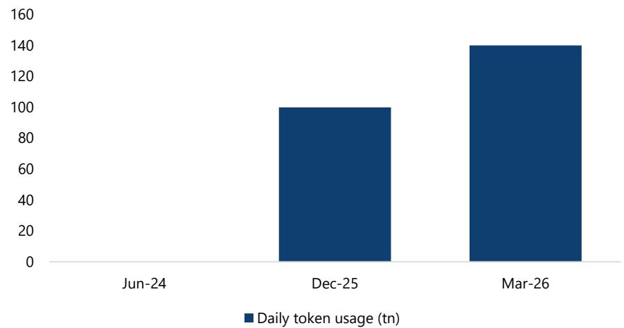

bar chart

| Date    | Daily token usage (tn) |
| ------- | ---------------------- |
| Jun-24  | 0                      |
| Dec-25  | 100                    |
| Mar-26  | 140                    |

Source: National Data Administration (NDA), JEF

Exhibit 92 - Doubao daily token consumption  
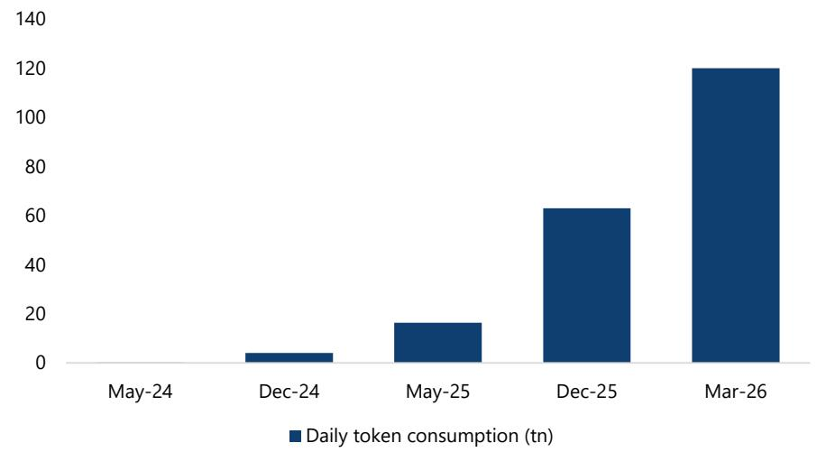

bar chart

| Date | Daily token consumption (tn) |
| :--- | :--- |
| May-24 | 0 |
| Dec-24 | 3 |
| May-25 | 17 |
| Dec-25 | 63 |
| Mar-26 | 120 |

Source: VolcanoEngine, JEF

Exhibit 93 - Token share by region  
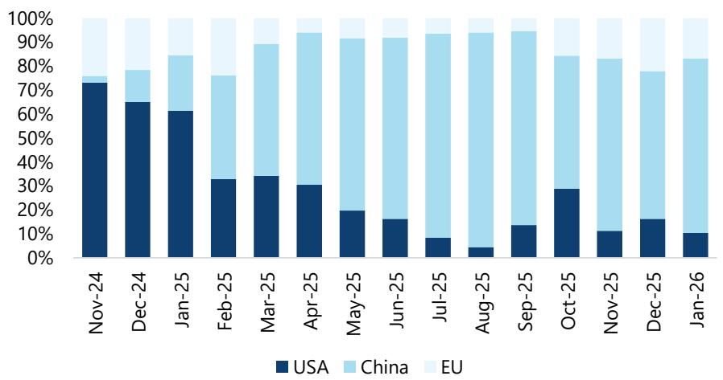

stacked bar chart

| Month | USA (%) | China (%) | EU (%) |
| :--- | :--- | :--- | :--- |
| Nov-24 | 73 | 2 | 19 |
| Dec-24 | 65 | 11 | 18 |
| Jan-25 | 61 | 17 | 13 |
| Feb-25 | 32 | 33 | 17 |
| Mar-25 | 34 | 38 | 11 |
| Apr-25 | 30 | 46 | 4 |
| May-25 | 19 | 53 | 4 |
| Jun-25 | 16 | 54 | 4 |
| Jul-25 | 8 | 60 | 0 |
| Aug-25 | 3 | 68 | 0 |
| Sep-25 | 13 | 67 | 0 |
| Oct-25 | 28 | 43 | 9 |
| Nov-25 | 11 | 54 | 11 |
| Dec-25 | 16 | 40 | 13 |
| Jan-26 | 10 | 57 | 13 |

Source: OpenRouter, JEF

We would like to thank Fiona Fan, employee of Evalueserve Inc., for providing research support services to our preparation of this report. We would like to thank Han Wang, employee of Evalueserve Inc., for providing research support services to our preparation of this report. We would like to thank Erica Qiu, employee of Evalueserve Inc., for providing research support services to our preparation of this report.

## Company Valuation/Risks

For Important Disclosure information on companies recommended in this report, please visit our website at https://javatar.bluematrix.com/sellside/Disclosures.action or call 212.284.2300.

## Analyst Certification:

I, Thomas Chong, certify that all of the views expressed in this research report accurately reflect my personal views about the subject security(ies) and subject company(ies). I also certify that no part of my compensation was, is, or will be, directly or indirectly, related to the specific recommendations or views expressed in this research report.  
I, Zoey Zong, certify that all of the views expressed in this research report accurately reflect my personal views about the subject security(ies) and subject company(ies). I also certify that no part of my compensation was, is, or will be, directly or indirectly, related to the specific recommendations or views expressed in this research report.

Registration of non-US analysts: Thomas Chong is employed by JEF Hong Kong Limited, a non-US affiliate of JEF LLC and is not registered/qualified as a research analyst with FINRA. This analyst(s) may not be an associated person of JEF LLC, a FINRA member firm, and therefore may not be subject to the FINRA Rule 2241 and restrictions on communications with a subject company, public appearances and trading securities held by a research analyst.

Registration of non-US analysts: Zoey Zong is employed by JEF Hong Kong Limited, a non-US affiliate of JEF LLC and is not registered/qualified as a research analyst with FINRA. This analyst(s) may not be an associated person of JEF LLC, a FINRA member firm, and therefore may not be subject to the FINRA Rule 2241 and restrictions on communications with a subject company, public appearances and trading securities held by a research analyst. As is the case with all JEF employees, the analyst(s) responsible for the coverage of the financial instruments discussed in this report receives compensation based in part on the overall performance of the firm, including investment banking income. We seek to update our research as appropriate, but various regulations may prevent us from doing so. Aside from certain industry reports published on a periodic basis, the large majority of reports are published at irregular intervals as appropriate in the analyst's judgement.

## Investment Recommendation Record

## (Article 3(1)e and Article 7 of MAR)

Recommendation Published

June 8, 2026 2:56 A.M.

Recommendation Distributed

June 8, 2026 2:56 A.M.

## Company Specific Disclosures

James Heaney has a long position in Facebook.

JEF Financial Group Inc., its affiliates or subsidiaries make a market in the securities or ADRs of NetEase Cloud Music Inc.

JEF Financial Group Inc., its affiliates or subsidiaries make a market in the securities or ADRs of NetEase Inc.

JEF Financial Group Inc., its affiliates or subsidiaries make a market in the securities or ADRs of Youdao Inc.

Within the past twelve months, Kuaishou Technology has been a client of JEF Financial Group Inc., its affiliates or subsidiaries and investment banking services are being or have been provided.

JEF Financial Group Inc., its affiliates or subsidiaries is acting as a manager or co-manager in the underwriting or placement of securities for Kuaishou Technology or one of its affiliates.

Within the past 12 months, JEF Financial Group Inc., its affiliates or subsidiaries has received compensation from investment banking services from Kuaishou Technology.

JEF International Ltd, its affiliates or subsidiaries has, or had, within the past 12 months an agreement to provide investment services to Kuaishou Technology.

For Important Disclosure information on companies recommended in this report, please visit our website at https://avatar.bluematrix.com/sellside/Disclosures.action or call 212.284.2300.

## Explanation of JEF Ratings

Buy - Describes securities that we expect to provide a total return (price appreciation plus yield) of 15% or more within a 12-month period.

Hold - Describes securities that we expect to provide a total return (price appreciation plus yield) of plus 15% or minus 10% within a 12-month period.

Underperform - Describes securities that we expect to provide a total return (price appreciation plus yield) of minus 10% or less within a 12-month period. The expected total return (price appreciation plus yield) for Buy rated securities with an average security price consistently below \$10 is 20% or more within a 12-month period as these companies are typically more volatile than the overall stock market. For Hold rated securities with an average security price consistently below \$10, the expected total return (price appreciation plus yield) is plus or minus 20% within a 12-month period. For Underperform rated securities with an average security price consistently below \$10, the expected total return (price appreciation plus yield) is minus 20% or less within a 12-month period.

NR - The investment rating and price target have been temporarily suspended. Such suspensions are in compliance with applicable regulations and/or JEF policies.

CS - Coverage Suspended. JEF has suspended coverage of this company.

NC - Not covered. JEF does not cover this company.

Restricted - Describes issuers where, in conjunction with JEF engagement in certain transactions, company policy or applicable securities regulations prohibit certain types of communications, including investment recommendations.

Monitor - Describes securities whose company fundamentals and financials are being monitored, and for which no financial projections or opinions on the investment merits of the company are provided.

## Valuation Methodology

JEF' methodology for assigning ratings may include the following: market capitalization, maturity, growth/value, volatility and expected total return over the next 12 months. The price targets are based on several methodologies, which may include, but are not restricted to, analyses of market risk, growth rate, revenue stream, discounted cash flow (DCF), EBITDA, EPS, cash flow (CF), free cash flow (FCF), EV/EBITDA, P/E, PE/growth, P/CF, P/FCF, premium (discount)/average group EV/EBITDA, premium (discount)/average group P/E, sum of the parts, net asset value, dividend returns, and return on equity (ROE) over the next 12 months.

## JEF Franchise Picks

JEF Franchise Picks include stock selections from among the best stock ideas from our equity analysts over a 12 month period. Stock selection is based on fundamental analysis and may take into account other factors such as analyst conviction, differentiated analysis, a favorable risk/reward ratio and investment themes that JEF analysts are recommending. JEF Franchise Picks will include only Buy rated stocks and the number can vary depending on analyst recommendations for inclusion. Stocks will be added as new opportunities arise and removed when the reason for inclusion changes, the stock has met its desired return, if it is no longer rated Buy and/or if it triggers a stop loss. Stocks having 120 day volatility in the bottom quartile of S&P stocks will continue to have a 15% stop loss, and the remainder will have a 20% stop. Franchise Picks are not intended to represent a recommended portfolio of stocks and is not sector based, but we may note where we believe a Pick falls within an investment style such as growth or value.

## Risks which may impede the achievement of our Price Target

This report was prepared for general circulation and does not provide investment recommendations specific to individual investors. As such, the financial instruments discussed in this report may not be suitable for all investors and investors must make their own investment decisions based upon their specific investment objectives and financial situation utilizing their own financial advisors as they deem necessary. Past performance of the financial instruments recommended in this report should not be taken as an indication or guarantee of future results. The price, value of, and income from, any of the financial instruments mentioned in this report can rise as well as fall and may be affected by changes in economic, financial and political factors. If a financial instrument is denominated in a currency other than the investor's home currency, a change in exchange rates may adversely affect the price of, value of, or income derived from the financial instrument described in this report. To the extent prices are shown in non-US currency, please note that our local currency price targets are based on a currency conversion using an exchange rate as of the prior trading day (unless otherwise noted). Should there be fluctuations in the exchange rate after this date, that will affect the non-US target prices and should no longer be relied upon. In addition, investors in securities such as ADRs, whose values are affected by the currency of the underlying security, effectively assume currency risk.

## Other Companies Mentioned in This Report

• Alibaba Group Holding Limited (9988 HK: HK\$122.40, BUY)

• Alibaba Group Holding Limited (BABA: \$121.06, BUY)

• Alphabet, Inc. (GOOGL: \$368.53, BUY)

• Baidu Inc. (BIDU: \$121.66, BUY)

• Baidu Inc. (9888 HK: HK\$125.60, BUY)

• Beijing Kingsoft Office Software Inc (688111 CH: CNY234.25, BUY)

• Bilibili Inc (BILI: \$17.46, BUY)

• Bilibili Inc (9626 HK: HK\$142.80, BUY)

• China Eastern Air-H (670 HK: HK\$3.41, HOLD)

• DouYu International Holdings (DOYU: \$5.00, HOLD)

• Huya Inc. (HUYA: \$2.48, BUY)

• JD.com, Inc. (9618 HK: HK\$115.80, BUY)

• JD.com, Inc. (JD: \$28.88, BUY)

• Kingsoft Cloud (KC: \$11.69, BUY)

\- Knowledge Atlas Technology Joint Stock Company Limited (2513 HK: HK\$1,297.00, HOLD)

• Kuaishou Technology (1024 HK: HK\$46.86, BUY)

• Meitu Inc (1357 HK: HK\$5.02, BUY)

• Meituan (3690 HK: HK\$79.95, BUY)

• Meta Platforms, Inc. (META: \$593.00, BUY)

\- MiniMax Group Inc. (100 HK: HK\$553.00, BUY)

• NVIDIA Corporation (NVDA: \$205.10, BUY)

• NetEase Cloud Music Inc. (9899 HK: HK\$115.70, BUY)

• NetEase Inc. (NTES: \$119.48, BUY)

• NetEase Inc. (9999 HK: HK\$188.40, BUY)  
• PDD Holdings Inc. (PDD: \$85.07, BUY)  
• Tencent Holdings Ltd. (700 HK: HK\$453.20, BUY)  
- Tencent Music Entertainment Group (TME: \$9.08, BUY)  
• Trip.com Group (TCOM: \$47.69, BUY)  
• Vipshop Holdings Limited (VIPS: \$13.53, BUY)  
• Weibo Corporation (WB: \$7.70, BUY)  
• Xiaomi Corporation (1810 HK: HK\$27.80, UNDERPERFORM)  
• Youdao Inc (DAO: \$11.66, BUY)  
• iQiyi Inc. (IQ: \$1.05, BUY)

Distribution of Ratings  
IB Serv./Past12 Mos.  
JIL Mkt Serv./Past12 Mos.

<table><tr><td></td><td>Count</td><td>Percent</td><td>Count</td><td>Percent</td><td>Count</td><td>Percent</td></tr><tr><td>BUY</td><td>2202</td><td>62.13%</td><td>383</td><td>17.39%</td><td>113</td><td>5.13%</td></tr><tr><td>HOLD</td><td>1179</td><td>33.27%</td><td>111</td><td>9.41%</td><td>20</td><td>1.70%</td></tr><tr><td>UNDERPERFORM</td><td>163</td><td>4.60%</td><td>1</td><td>0.61%</td><td>1</td><td>0.61%</td></tr></table>

## Other Important Disclosure

## Other Important Disclosures

JEF does business and seeks to do business with companies covered in its research reports, and expects to receive or intends to seek compensation for investment banking services among other activities from such companies. As a result, investors should be aware that JEF may have a conflict of interest that could affect the objectivity of this report. Investors should consider this report as only a single factor in making their investment decision.

JEF Equity Research refers to research reports produced by analysts employed by one of the following JEF Financial Group Inc. ("JEF") companies:

United States: JEF LLC which is an SEC registered broker-dealer and a member of FINRA (and distributed by JEF Services, LLC, an SEC registered Investment Adviser, to clients paying separately for such research).

Canada: JEF Securities Inc., which is an investment dealer registered in each of the thirteen Canadian jurisdictions and a dealer member of the Canadian Investment Regulatory Organization, including research reports produced jointly by JEF Securities Inc. and another JEF entity (and distributed by JEF Securities Inc.).

Where JEF Securities Inc. distributes research reports produced by JEF LLC, JEF International Limited, JEF Japan Company Limited, or JEF India Private Limited, you are advised that each of JEF LLC, JEF International Limited, JEF Japan Company Limited, and JEF India Private Limited operates as a dealer in your jurisdiction under an exemption from the dealer registration requirements contained in National Instrument 31-103 Registration Requirements, Exemptions and Ongoing Registrant Obligations and, as such, each of JEF LLC, JEF International Limited, JEF Japan Company Limited, and JEF India Private Limited is not required to be and is not a registered dealer or adviser in your jurisdiction. You are advised that where JEF LLC or JEF International Limited prepared this research report, it was not prepared in accordance with Canadian disclosure requirements relating to research reports in Canada.

United Kingdom: JEF International Limited, which is authorized and regulated by the Financial Conduct Authority; registered in England and Wales No. 1978621; registered office: 100 Bishopsgate, London EC2N 4JL; telephone +44 (0)20 7029 8000; facsimile +44 (0)20 7029 8010.

Germany: JEF GmbH, which is authorized and regulated by the Bundesanstalt fuer Finanzdienstleistungsaufsicht, BaFin-ID: 10150151; registered office: Bockenheimer Landstr. 24, 60323 Frankfurt a.M., Germany; telephone: +49 (0) 69 719 1870

Hong Kong: JEF Hong Kong Limited, which is licensed by the Securities and Futures Commission of Hong Kong with CE number ATS546; located at Level 26, Two International Finance Center, 8 Finance Street, Central, Hong Kong; telephone: +852 3743 8000.

Singapore: JEF Singapore Limited, which is licensed by the Monetary Authority of Singapore; located at 10 Collyer Quay #41-01, Ocean Financial Centre, Singapore 049315, telephone: +65 6551 3950.

Japan: JEF Japan Company Limited, which is a securities company registered by the Financial Services Agency of Japan and is a member of the Japan Securities Dealers Association; located at Tokyo Midtown Hibiya 30F Hibiya Mitsui Tower, 1-1-2 Yuraku-cho, Chiyoda-ku, Tokyo 100-0006; telephone +813 5251 6100; facsimile +813 5251 6101.

India: JEF India Private Limited (CIN - U74140MH2007PTC200509), licensed by the Securities and Exchange Board of India for: Stock Broker (NSE & BSE) INZ000243033, Research Analyst INH000000701 and Merchant Banker INM000011443, located at Level 16, Express Towers, Nariman Point, Mumbai 400 021, India; Tel +91 22 4356 6000. Compliance Officer name: Sanjay Pai, Tel No: +91 22 42246150, Email: spai@JEF.com, Grievance officer name: Sanjay Pai, Tel no. +91 22 42246150, Email: compliance\_india@JEF.com. Registration granted by SEBI and certification from NISM in no way guarantee performance of the intermediary or provide any assurance of returns to investors.

Australia: JEF (Australia) Pty Limited (ACN 623 059 898), which holds an Australian financial services license (AFSL 504712) and is located at Level 20, 60 Martin Place, Sydney NSW 2000; telephone +61 2 9364 2800.

Dubai: JEF International Limited, Dubai branch, which is licensed by the Dubai Financial Services Authority (DFSA Reference Number F007325); registered office Unit L31-06, L31-07, Level 31, ICD Brookfield Pace, DIFC, PO Box 121208, Dubai, UAE.

This report was prepared by personnel who are associated with JEF (JEF Securities Inc., JEF International Limited, JEF GmbH, JEF Hong Kong Limited, JEF Singapore Limited, JEF Japan Company Limited, JEF India Private Limited), and JEF (Australia) Pty Ltd; or by personnel who are associated with both JEF LLC and JEF Services LLC ("JRS"). JEF LLC is a US registered broker-dealer and is affiliated with JRS, which is a US registered investment adviser. JRS does not create tailored or personalized research and all research provided by JRS is impersonal. If you are paying separately for this research, it is being provided to you by JRS. Otherwise, it is being provided by JEF LLC. JEF LLC, JRS, and their affiliates are collectively referred to below as "JEF". JEF may seek to do business with companies covered in this research report. As a result, investors should be aware that JEF may have a conflict of interest that could affect the objectivity of this report. Investors should consider this report as only one of many factors in making their investment decisions. Specific conflict of interest and other disclosures that are required by FINRA, the Canadian Investment Regulatory Organization and other rules are set forth in this disclosure section.

\*\*\*

If you are receiving this report from a non-US JEF entity, please note the following: Unless prohibited by the provisions of Regulation S of the U.S. Securities Act of 1933, as amended, this material is distributed in the United States by JEF LLC, which accepts responsibility for its contents in accordance with the provisions of Rule 15a-6 under the US Securities Exchange Act of 1934, as amended. Transactions by or on behalf of any US person may only be effected through JEF LLC. In the United Kingdom and European Economic Area this report is issued and/or approved for distribution by JEF International Limited ("JIL") and/or JEF GmbH and is intended for use only by persons who have, or have been assessed as having, suitable professional experience and expertise, or by persons to whom it can be otherwise lawfully distributed. JEF LLC, JIL, JEF GmbH and their affiliates, may make a market or provide liquidity in the financial instruments referred to in this report; and where they do make a market, such activity is disclosed specifically in this report under "company specific disclosures".

For Canadian investors, this material is intended for use only by professional or institutional investors. None of the investments or investment services mentioned or described herein is available to other persons or to anyone in Canada who is not a "permitted client" as defined by National Instrument 31-103 Registration Requirements, Exemptions and Ongoing Registrant Obligations, as applicable. This research report is a general discussion of the merits and risks of a security or securities only, and is not in any way meant to be tailored to the needs and circumstances of any recipient. The information contained herein is not, and under no circumstances is to be construed as, an offer to sell securities described herein, or solicitation of an offer to buy securities described herein, in Canada or any province or territory thereof. Any offer or sale of the securities described herein in Canada will be made only under an exemption from the requirements to file a prospectus with the relevant Canadian securities regulators, if applicable, and only by a dealer properly registered under applicable securities laws or, alternatively, pursuant to an exemption from the dealer registration requirement in the relevant province or territory of Canada in which such offer or sale is made. The information contained herein is under no circumstances to be construed as investment advice in any province or territory of Canada and is not tailored to the needs of the recipient. To the extent that the information contained herein references securities of an issuer incorporated, formed or created under the laws of Canada or a province or territory of Canada, any trades in such securities must be conducted through a dealer registered in Canada. No securities commission or similar regulatory authority in Canada has reviewed or in any way passed judgment upon this research report, the information contained herein or the merits of the securities described herein, and any representation to the contrary is an offence. In Singapore, JEF Singapore Limited ("JSL") is regulated by the Monetary Authority of Singapore. For investors in the Republic of Singapore, where this material is prepared and issued by a JEF affiliate outside of Singapore, it is distributed by JSL pursuant to Regulation 32C of the Financial Advisers Regulations. The material contained in this document is intended solely for accredited, expert or institutional investors, as defined under the Securities and Futures Act 2001 (Singapore). If there are any matters arising from, or in connection with this material, please contact JSL, located at 80 Raffles Place #15-20, UOB Plaza 2, Singapore 048624, telephone: +65 6551 3950. In Dubai, this material is issued and distributed by JEF International Limited, Dubai branch, and is intended solely for Professional Clients and should not be distributed to, or relied upon by, Retail Clients (as defined by DFSA). A distribution of ratings in percentage terms in each sector covered is available upon request from your sales representative. In Japan, this material is issued and distributed by JEF Japan Company Limited to institutional investors only. In Hong Kong, this report is issued and approved by JEF Hong Kong Limited and is intended for use only by professional investors as defined in the Hong Kong Securities and Futures Ordinance and its subsidiary legislation. In the Republic of China (Taiwan), this report should not be distributed. The research in relation to this report is conducted outside the People's Republic of China ("PRC"). This report does not constitute an offer to sell or the solicitation of an offer to buy any securities in the PRC. PRC investors shall have the relevant qualifications to invest in such securities and shall be responsible for obtaining all relevant approvals, licenses, verifications and/or registrations from the relevant governmental authorities themselves. In India, this report is made available by JEF India Private Limited. In Australia, this report is issued and/or approved for distribution by, or on behalf of, JEF (Australia) Securities Pty Ltd (ACN 610 977 074), which holds an Australian financial services license (AFSL 487263). It is directed solely at wholesale clients within the meaning of the Corporations Act 2001 (Cth) of Australia (the "Corporations Act"), in connection with their consideration of any investment or investment service that is the subject of this report. This report may contain general financial product advice. Where this report refers to a particular financial product, you should obtain a copy of the relevant product disclosure statement or offer document before making any decision in relation to the product. Recipients of this document in any other jurisdictions should inform themselves about and observe any applicable legal requirements in relation to the receipt of this document.

This report is not an offer or solicitation of an offer to buy or sell any security or derivative instrument, or to make any investment. Any opinion or estimate constitutes the preparer's best judgment as of the date of preparation, and is subject to change without notice. JEF assumes no obligation to maintain or update this report based on subsequent information and events. JEF, and their respective officers, directors, and employees, may have long or short positions in, or may buy or sell any of the securities, derivative instruments or other investments mentioned or described herein, either as agent or as principal for their own account. This material is provided solely for informational purposes and is not tailored to any recipient, and is not based on, and does not take into account, the particular investment objectives, portfolio holdings, strategy, financial situation, or needs of any recipient. As such, any advice or recommendation in this report may not be suitable for a particular recipient. JEF assumes recipients of this report are capable of evaluating the information contained herein and of exercising independent judgment. A recipient of this report should not make any investment decision without first considering whether any advice or recommendation in this report is suitable for the recipient based on the recipient's particular circumstances and, if appropriate or otherwise needed, seeking professional advice, including tax advice. JEF does not perform any suitability or other analysis to check whether an investment decision made by the recipient based on this report is consistent with a recipient's investment objectives, portfolio holdings, strategy, financial situation, or needs.

By providing this report, neither JRS nor any other JEF entity accepts any authority, discretion, or control over the management of the recipient's assets. Any action taken by the recipient of this report, based on the information in the report, is at the recipient's sole judgment and risk. The recipient must perform his or her own independent review of any prospective investment. If the recipient uses the services of JEF LLC (or other affiliated broker-dealers), in connection with a purchase or sale of a security that is a subject of these materials, such broker-dealer may act as principal for its own accounts or as agent for another person. Only JRS is registered with the SEC as an investment adviser; and therefore neither JEF LLC nor any other JEF affiliate has any fiduciary duty in connection with distribution of these reports.

The price and value of the investments referred to herein and the income from them may fluctuate. Past performance is not a guide to future performance, future returns are not guaranteed, and a loss of original capital may occur. Fluctuations in exchange rates could have adverse effects on the value or price of, or income derived from, certain investments.

This report may contain forward looking statements that may be affected by inaccurate assumptions or by known or unknown risks, uncertainties, and other important factors. As a result, the actual results, events, performance or achievements of the financial product may be materially different from those expressed or implied in such statements.

This report has been prepared independently of any issuer of securities mentioned herein and not as agent of any issuer of securities. No Equity Research personnel have authority whatsoever to make any representations or warranty on behalf of the issuer(s). Any comments or statements made herein are those of the JEF entity producing this report and may differ from the views of other JEF entities.

This report may contain information obtained from third parties, including ratings from credit ratings agencies such as Standard & Poor's, and information derived from third-party or proprietary generative artificial intelligence (Gen AI) models. JEF does not guarantee the accuracy, completeness, timeliness or availability of this information, and is not responsible for any errors or omissions (negligent or otherwise), regardless of the cause, or for the results obtained from the use of such content. Neither JEF nor any third-party content providers, including providers of Gen AI models, give any express or implied warranties, including, but not limited to, any warranties of merchantability or fitness for a particular purpose or use. Neither JEF nor any third-party content provider shall be liable for any direct, indirect, incidental, exemplary, compensatory, punitive, special or consequential damages, costs, expenses, legal fees, or losses (including lost income or profits and opportunity costs) in connection with any use of their content, including ratings. Credit ratings are statements of opinions and are not statements of fact or recommendations to purchase, hold or sell securities. They do not address the suitability of securities or the suitability of securities for investment purposes, and should not be relied on as investment advice. Reproduction and distribution of third party content in any form is prohibited except with the prior written permission of the related third party.

JEF reports are disseminated and available electronically, and, in some cases, also in printed form. Electronic research is simultaneously made available to all clients. This report or any portion hereof may not be copied, reprinted, sold, or redistributed or disclosed by the recipient or any third party, by content scraping or extraction, automated processing, or any other form or means, without the prior written consent of JEF. Any unauthorized use is prohibited. Neither JEF nor any of its respective directors, officers or employees, is responsible for guaranteeing the financial success of any investment, or accepts any liability whatsoever for any direct, indirect or consequential damages or losses arising from any use of this report or its contents. Nothing herein shall be construed to waive any liability JEF has under applicable U.S. federal or state securities laws.

For Important Disclosure information relating to JRS, please see https://adviserinfo.sec.gov/IAPD/Content/Common/crd\_iapd\_Brochure.aspx?BRCHR\_VRSN\_ID=483878 and https://adviserinfo.sec.gov/Firm/292142 or visit our website at https://javatar.bluematrix.com/sellside/Disclosures.action, or www.JEF.com, or call 1.888.JEF.

© 2026 JEF