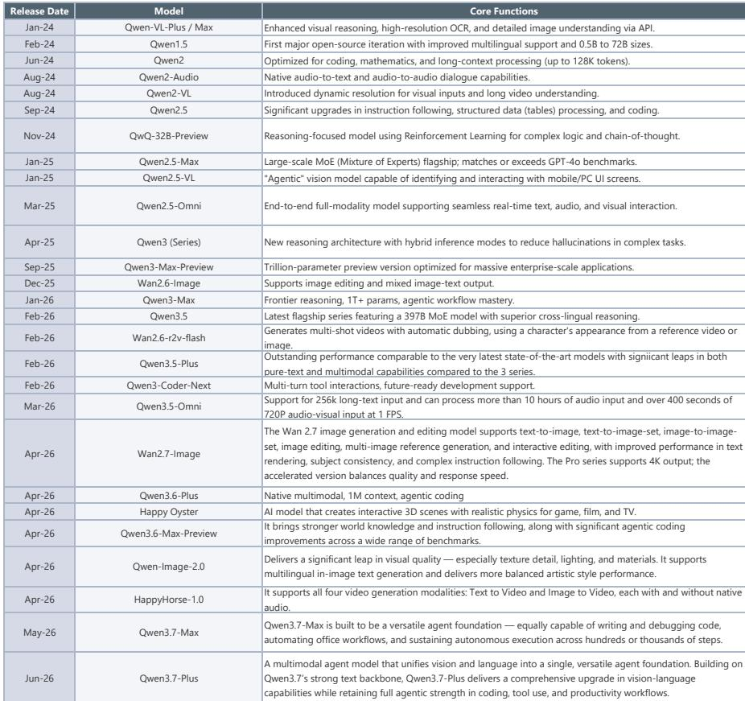
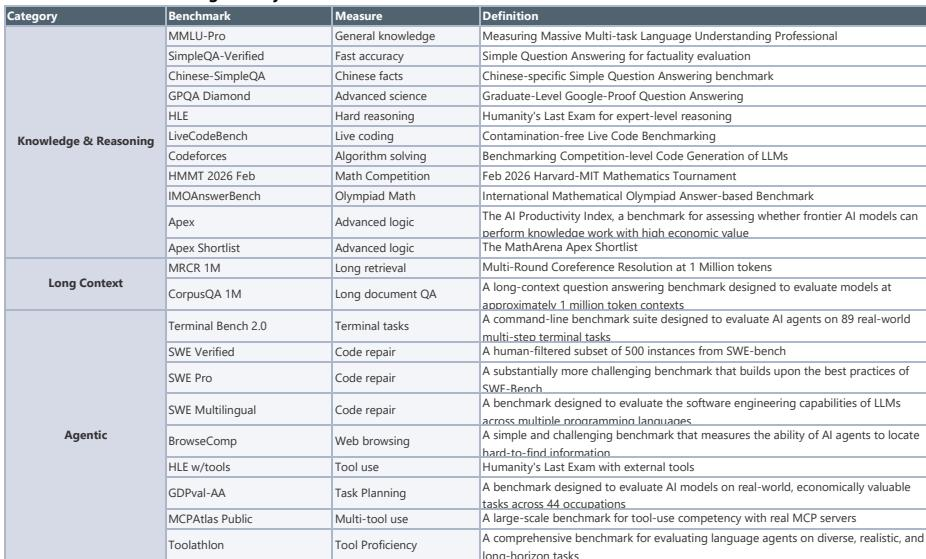
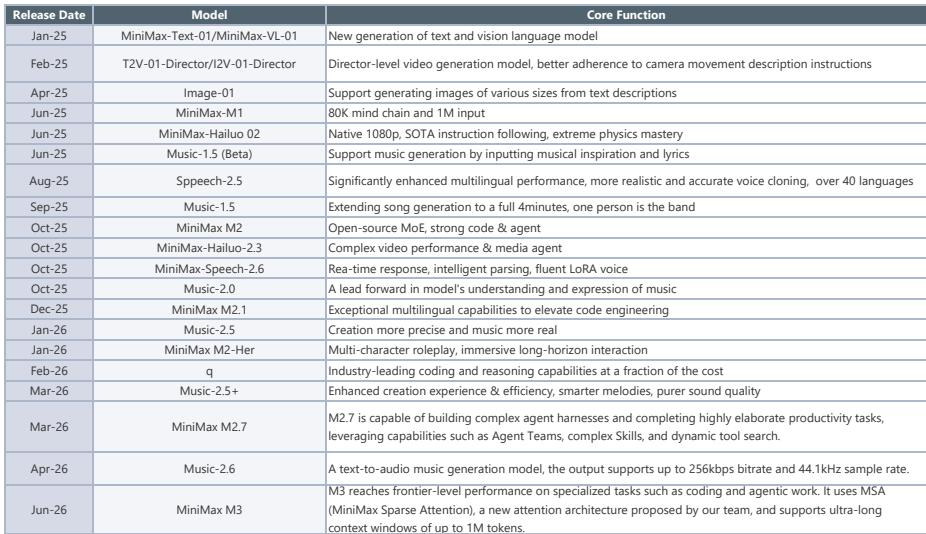

# JEF：AI竞争已从模型性能转向Agent生态与成本效率的再定价

这份报告最值得关注的核心判断是：中国AI模型正在从“追赶性能”切换到“定义成本效率”的新阶段，而真正驱动token消耗爆发式增长的不是聊天场景，而是Agent间协作（A2A）与行业专用工具链的落地。JEF在这期AI系列研报中提供了超过50个数据点，但最关键的信号隐藏在Token消耗的环比变化和模型排名的结构性位移中——中国模型在OpenRouter平台上的周Token消耗首次超越美国模型，而排名第一的DeepSeek V4 Flash单周消耗量达到3.69万亿Token，几乎是第二名腾讯Hy3 preview的1.25倍。

这不是一个简单的“中国大模型跑得更快”的故事。JEF的数据揭示出三个正在重塑行业格局的结构性变量：第一，Agent-to-Agent的生态化协作正在替代单一模型的能力竞赛，腾讯与美团、手机厂商的A2A合作是这一趋势的缩影；第二，中国模型在API成本上仅为美国模型的几分之一，这种成本优势在推理量持续放大的背景下，正在改写云服务商和AI应用层的利润模型；第三，OpenAI和Anthropic正在向金融和法律等垂直领域加速渗透，这意味着通用模型的红利期正在收窄，行业专用Agent将成为下一轮竞争的主战场。

以下五个维度，是理解这份报告真正含义的关键切口。

## 1. Token消耗的结构性跃升背后，是Agent从“对话”到“工作流”的范式切换

JEF的数据显示，截至6月1日当周，OpenRouter平台周Token消耗环比增长13.5%至36.1万亿。表面上看这是用量增长，但真正值得追问的是：什么场景在驱动这种增长？报告明确指出，2026年2月Token消耗的显著跃升有两个直接原因——Coding/Agent采用率的爆发，以及高性能低成本中国模型的密集发布。这意味着Token消耗的增长不是线性的“更多人聊天”，而是“机器替人执行任务”的指数级扩张。

当一个Agent需要调用另一个Agent的能力来完成用户的任务时，每一次交互的Token消耗不是单次对话的线性叠加，而是多Agent协同的多轮嵌套。这正是腾讯正在搭建的Agent-to-Agent生态的本质——用户通过元宝App发起本地服务请求，背后是元宝与美团AI助手小美的A2A通信；用户通过手机语音助手发送微信消息，背后是手机厂商的Agent与微信Agent的协作。每一次“隐形”的Agent间握手，都在消耗Token，但这些Token对用户来说是不可见的。

这对投资判断的含义是：Token消耗的增速本身已经不再是需求指标，而是生态复杂度的映射。那些能够建立Agent间协作网络的公司，将获得不成比例的Token消耗增量，而不仅仅是依赖自有模型推理量的线性增长。

## 2. 中国模型在OpenRouter上首次超越美国模型，但真正的差异不在性能，在成本结构

报告中最引人注目的数据点是：在6月1日当周，中国模型在OpenRouter上的Token消耗达到14.2万亿，环比增长27.5%，而美国模型仅为3.2万亿。DeepSeek V4 Flash以3.69万亿的周消耗量排名第一，腾讯Hy3 preview以2.94万亿紧随其后。按公司维度，DeepSeek以18.7%的市场份额位列第一，超过Anthropic的14.6%和Google的11.9%。

但JEF同时引用了Artificial Analysis的智能指数数据：在前20大模型中，中国模型有9个，且均为开放权重。Anthropic Claude Opus 4.8以61分排名第一，GPT-5.5以60分紧随其后，而Qwen3.7 Max以56分位列第五，MiniMax-M3和Kimi K2.6以54分并列第六。按2026年斯坦福AI指数报告，美国顶级模型领先中国模型仅2.7个百分点。

智能差距在缩小，但成本差距却是数量级的。JEF的API价格对比图显示，中国模型的输入/输出API价格仅为美国模型的几分之一。这意味着在推理量持续放大的假设下，中国模型的单位经济性优势将随用量增长而指数级放大。对于云服务商和AI应用开发者来说，选择中国模型不是“退而求其次”，而是“用更低的成本获得90%以上的性能”。

这里尚未完全回答的问题是：当模型智能差距缩小到接近零时，成本优势是否会引发中国模型厂商的“价格战”，从而压缩整个产业链的利润空间？报告没有展开这一推演，但这是投资者需要自行判断的关键风险。

## 3. 腾讯的A2A生态和阿里巴巴的Qwen Agent平台，正在定义两种不同的生态策略

JEF详细梳理了腾讯和阿里巴巴在Agent生态上的布局，但两者路径截然不同。腾讯的策略是“连接器”——通过元宝App与美团、手机厂商的A2A协作，腾讯不是在做自己的Agent应用，而是在做Agent间的通信协议层。用户通过手机语音助手发送微信消息，本质上是手机厂商的Agent调用了微信的Agent能力，而腾讯在这一过程中既没有获取用户数据，也没有改变微信的产品形态，但微信的Agent接口成为了整个生态的必经节点。

阿里巴巴的路径则更接近“平台型”——Qwen App向第三方Agent和技能开放，首批合作伙伴包括肯德基、瑞幸、蜜雪冰城和中国东方航空。用户可以在Qwen App内一站式获得从点餐到航旅的个性化服务。同时，阿里巴巴在6月1日发布了Qwen3.7-Plus，这是一个多模态交互式混合Agent，统一了GUI和CLI界面。

这两种策略的差异对竞争格局的含义不同。腾讯的A2A策略更像是在“修路”，不直接参与应用层的竞争，但每条路都要经过它的检查站。阿里巴巴的策略更像是在“建商场”，吸引品牌入驻并控制用户体验。哪一种模式能产生更高的商业变现效率，取决于Agent生态的演化方向——是用户更倾向于在一个超级App内完成所有任务，还是更习惯通过多个Agent的协作来完成复杂任务？报告没有给出明确判断，但这是决定腾讯和阿里巴巴AI变现路径的关键变量。

## 4. 美图与WPS的合作，揭示了一个被低估的“办公+设计”交叉场景

JEF提到美图与WPS的合作：WPS用户可以直接使用美图的AI海报生成和短视频生成功能，特别针对电商卖家的营销物料场景。这一合作看似简单，但背后反映的是AI应用落地的真实逻辑——用户不需要从一个App切换到另一个App，而是希望在自己已有的工作流中嵌入AI能力。

WPS本身拥有庞大的办公用户基础，美图在AI图像生成领域积累了技术能力。两者的结合意味着“办公+设计”这个交叉场景正在被重新定义。对于电商卖家来说，在WPS中完成文档编辑后，直接调用美图生成营销海报和短视频，这一无缝体验的壁垒不在于模型性能，而在于产品整合的深度。

报告没有展开的是：这种跨产品合作是否会成为AI应用落地的标准模式？如果答案是肯定的，那么拥有强大用户基数的平台型公司（如WPS、微信、钉钉）将在AI应用分发中占据更有利的位置，而独立AI应用可能需要更依赖平台合作来获取用户。

## 5. 报告尚未完全回答的关键问题：Agent生态的“操作系统”之争将如何演进

JEF在报告中提供了大量数据，但有一个核心问题没有给出明确答案：Agent生态的“操作系统”是什么？是腾讯的A2A通信协议，还是阿里巴巴的Qwen App平台，还是OpenAI的Codex插件生态？

报告提到了OpenAI在Codex中为金融和法律领域推出专用插件，Anthropic在5月发布了10个金融服务Agent模板。这表明美国公司正在加速向垂直行业渗透，而中国公司则在构建更通用的Agent协作网络。两种路径的竞争结果，将决定未来两年AI产业的商业模式。

Kimi推出的AI桌面产品Kimi Work提供了另一个观察窗口：它可以在本地自主运行，通过WebBridge访问浏览器完成多步骤任务，甚至支持“群体智能”——多个专用Agent协同解决复杂问题。Kimi Work专门为金融行业构建，预集成了不同市场的深度数据源。这意味着Agent生态的竞争不仅发生在云端，也正在向桌面端和本地端延伸。

这些未解问题——生态标准、变现路径、垂直行业渗透深度——正是理解这份报告真正价值的关键。JEF提供了足够的数据和框架，但最终的判断需要投资者基于自己的行业认知来做出。

Personal reading notes and learning share only. Not investment advice.

