## Accounting & Valuation | North America

# AI Ecosystem: Charting Recent Trends

As hyperscaler capital intensity reaches more than 40% of sales, incremental capex revisions are now accompanied by capital raises and/or innovative financing. Long-term purchase commitments of \~\$1tn and lease commitments >\$800bn further support the AI buildout, but add off-BS operating leverage.

## Key Takeaways

Our analysts forecast capex-to-sales ratios of 36%, 44%, and 42% in 2026–28, well above the 32% dot-com fiber peak. Finance leases push headline numbers higher.  
AI is dominating overall investment, with AI-related spend expected to make up more than 50% of R1000 capex in 2026, of which hyperscalers contribute \~90%.  
Among major AI compute players, RPO has nearly tripled in the last year, reaching >\$2tn as customers commit to longer-duration contracts.  
Depreciation is the next margin watch item, with MSFT, ORCL, META, and GOOGL depreciation is expected to exceed \$520bn over three years.  
See full slide deck inside with our most popular AI charts updated for the latest SEC filings.

2026 EXTEL

ALL-AMERICA

RESEARCH POLL

May 26 – June 12, 2026

We appreciate your support

VOTE HERE

Please refer to the slides below for refreshed versions of our key charts from the past year, reflecting an updated view of the AI ecosystem.

MS & CO. LLC

Todd Castagno, CFA, CPA

GVAT Strategist

Todd.Castagno@morganstanley.com +1 212 761-6893

Kate Konetzke, CFA, CPA

GVAT Strategist

Kate.Konetzke@morganstanley.com +1 212 761-3457

Mariah Thompson

GVAT Strategist

Mariah.Thompson@morganstanley.com +1 212 761-1147

Clinton Chang, CFA, CPA

GVAT Strategist

Clinton.Chang@morganstanley.com +1 212 761-1185

2026 EXTEL

ALL-AMERICA

RESEARCH POLL

May 26 – June 12, 2026

VIEW OUR

ANALYSTS >

MS does and seeks to do business with companies covered in MS. As a result, investors should be aware that the firm may have a conflict of interest that could affect the objectivity of MS. Investors should consider MS as only a single factor in making their investment decision.

For analyst certification and other important disclosures, refer to the Disclosure Section, located at the end of this report.

Exhibit 1: MSe expects Hyperscaler capex/sales to surpass dot-com peaks reaching 44% in '27  
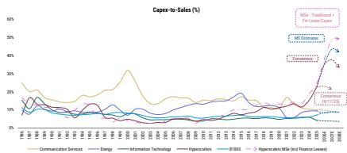

line chart

| Year | Communication Services | Energy | Information Technology | Hypercapers | Hypercapers Mkt (and Finance Leased) |
|------|--------------------------|--------|------------------------|-------------|-------------------------------------|
| 1980 | ~25%                     | ~15%   | ~10%                   | ~10%        | ~5%                                 |
| 1981 | ~24%                     | ~14%   | ~9%                    | ~9%         | ~5%                                 |
| 1982 | ~23%                     | ~13%   | ~8%                    | ~8%         | ~5%                                 |
| 1983 | ~22%                     | ~12%   | ~7%                    | ~7%         | ~5%                                 |
| 1984 | ~21%                     | ~11%   | ~6%                    | ~6%         | ~5%                                 |
| 1985 | ~20%                     | ~10%   | ~5%                    | ~5%         | ~5%                                 |
| 1986 | ~19%                     | ~9%    | ~4%                    | ~4%         | ~5%                                 |
| 1987 | ~18%                     | ~8%    | ~3%                    | ~3%         | ~5%                                 |
| 1988 | ~17%                     | ~7%    | ~2%                    | ~2%         | ~5%                                 |
| 1989 | ~16%                     | ~6%    | ~1%                    | ~1%         | ~5%                                 |
| 1990 | ~15%                     | ~5%    | ~0.5%                  | ~0.5%       | ~5%                                 |
| 1991 | ~14%                     | ~4%    | ~0.3%                  | ~0.3%       | ~5%                                 |
| 1992 | ~13%                     | ~3%    | ~0.2%                  | ~0.2%       | ~5%                                 |
| 1993 | ~12%                     | ~2%    | ~0.1%                  | ~0.1%       | ~5%                                 |
| 1994 | ~11%                     | ~1%    | ~0.05%                 | ~0.05%      | ~5%                                 |
| 1995 | ~10%                     | ~0.5%  | ~0.03%                 | ~0.03%      | ~5%                                 |
| 1996 | ~9%                      | ~0.3%  | ~0.02%                 | ~0.02%      | ~5%                                 |
| 1997 | ~8%                      | ~0.2%  | ~0.01%                 | ~0.01%      | ~5%                                 |
| 1998 | ~7%                      | ~0.1%  | ~0.005%                | ~0.005%     | ~5%                                 |
| 1999 | ~6%                      | ~0.05% | ~0.003%                | ~0.003%     | ~5%                                 |
| 2000 | ~5%                      | ~0.03% | ~0.002%                | ~0.002%     | ~5%                                 |
| 2001 | ~4.5%                    | ~0.02% | ~0.001%                | ~0.001%     | ~5%                                 |
| 2002 | ~4.0%                    | ~0.01% | ~0.0005%               | ~0.0005%    | ~5%                                 |
| 2003 | ~3.5%                    | ~0.005%| ~0.0003%              | ~0.0003%    | ~5%                                 |
| 2004 | ~3.0%                    | ~0.003%| ~0.0002%              | ~0.0002%    | ~5%                                 |
| 2005 | ~2.5%                    | ~0.002%| ~0.0001%              | ~0.0001%    | ~5%                                 |
| 2006 | ~2.0%                    | ~0.001%| ~0.00005%             | ~0.00005%   | ~5%                                 |
| 2007 | ~1.5%                    | ~-0.001| -                      | -           | -                                   |
| 2008 | ~1.0%                    | -      | -                      | -           | -                                   |
| 2009 | -                        | -      | -                      | -           | -                                   |
| 2010 | -                        | -      | -                      | -           | -                                   |
| 2011 | -                        | -      | -                      | -           | -                                   |
| 2012 | -                        | -      | -                      | -           | -                                   |
| 2013 | -                        | -      | -                      | -           | -                                   |
| 2014 | -                        | -      | -                      | -           | -                                   |
| 2015 | -                        | -      | -                      | -           | -                                   |
| 2016 | -                        | -      | -                      | -           | -                                   |
| 2017 | -                        | -      | -                      | -           | -                                   |
| 2018 | -                        | -      | -                      | -           | -                                   |
| 2019 | -                        | -      | -                      | -           | -                                   |
| 2020a-2021e-27 Julya-27e-27e-27e-27e-27e-27e-27e-27e-27e-27e-27e-27e-27e-27e-27e-27e-27e-27e-27e-27e-27e-27e-27e-27e-27e-27f
| -                          | -      | -                      | -           |
| Dec-27e-27e-27e-27e-27e-27e-27e-27e-27e-27e-27e-27e-27e-27e-27e-27e-27e-27e-27e-27e-27e-27e-27e-27e-27d|
| Dec-28e-27e-27e-27e-27e-27e-27e-27e-27e-27e-27e-27e-27e-27e-27e-27e-27e-27e-27e-<lcel><lcel><lcel><lcel><lcel><nl>

Note: The hyperscalers group includes AMZN, GOOGL, META, MSFT, & ORCL and are excluded from the other sector groups. Only MSFT and ORCL finance lease estimates are included. R1000 excludes Real Estate and Financials.
Source: MS Estimates and Factset.

Exhibit 2: Cons expects Hyperscaler capex to reach 45% of the R1000 in '27 and '28  
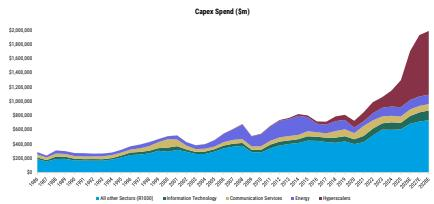

area chart

| Year | All other Sectors ($100M) | Information Technology | Communication Services | Energy | Hyperparameters |
|------|-----------------------------|--------------------------|-------------------------|--------|---------------|
| 2018 | $100,000                    | $100,000                 | $100,000                | $100,000 | $100,000      |
| 2019 | $150,000                    | $150,000                 | $150,000                | $150,000 | $150,000      |
| 2020 | $200,000                    | $200,000                 | $200,000                | $200,000 | $200,000      |
| 2021 | $300,000                    | $300,000                 | $300,000                | $300,000 | $300,000      |
| 2022 | $450,000                    | $450,000                 | $450,000                | $450,000 | $450,000      |
| 2023 | $650,000                    | $650,000                 | $650,000                | $650,000 | $650,000      |

Note: The hyperscalers group includes AMZN, GOOGL, META, MSFT, & ORCL and are excluded from the other sector groups. R1000 excludes Real Estate and Financials. Estimates are based on consensus.
Source: FactSet.

Exhibit 3: Leases not yet started have hit  
>\$800bn across Hyperscalers...  
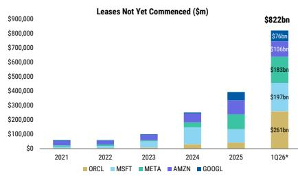

stacked bar chart

| Year | ORCL | MSFT | META | AMZN | GOOGL |
|------|------|------|------|------|-------|
| 2021 |      |      |      |      |       |
| 2022 |      |      |      |      |       |
| 2023 |      |      |      |      |       |
| 2024 |      |      |      |      |       |
| 2025 |      |      |      |      |       |
| 1Q26* | $261bn | $197bn | $183bn | $106bn | $76bn |

Note: Based on fiscal years. ORCL and MSFT 1Q26 = 3FQ26.
MSFT is covered by Josh Baer. ORCL is covered by Sanjit Singh. GOOGL, META, and AMZN are covered by Brian Nowak.
Source: Company filings and MS.

Exhibit 4: ...while purchase commitments reach close to \$1tn  
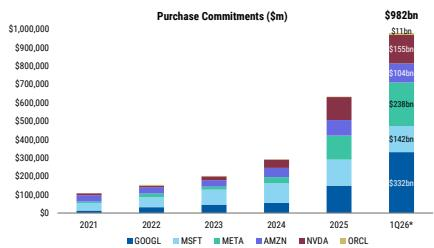

stacked bar chart

| Year | GOOGL | MSFT | META | AMZN | NVDA | ORCL |
| --- | --- | --- | --- | --- | --- | --- |
| 2021 |  |  |  |  |  |  |
| 2022 |  |  |  |  |  |  |
| 2023 |  |  |  |  |  |  |
| 2024 |  |  |  |  |  |  |
| 2025 | $332bn | $142bn | $238bn | $104bn | $155bn | $91bn |
| 1Q26* |  |  |  |  |  | $982bn |

Note: Based on fiscal years. ORCL and MSFT 1Q26 = 3FQ26.
MSFT is covered by Josh Baer. ORCL is covered by Sanjit Singh.
GOOGL, META, and AMZN are covered by Brian Nowak.
Source: Company filings and MS.

Exhibit 5: AI ecosystem has become increasingly interconnected....  
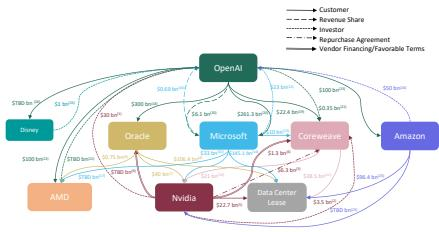

flowchart

```mermaid
graph TD
  A["OpenAI"] -->|10.04 bp| B["Oracle"]
  A -->|261.2 bp| C["Microsoft"]
  A -->|51.2 bp| D["Corewave"]
  A -->|10.04 bp| E["Amazon"]
  A -->|100 bp| F["AMD"]
  A -->|100 bp| G["Disney"]
  A -->|100 bp| H["Nvidia"]
  A -->|100 bp| I["Data Center Lease"]
  A -->|100 bp| J["Repurchase Agreement"]
  A -->|100 bp| K["Vendor Financing/Favorable Terms"]
  A -->|100 bp| L["Customer"]
  A -->|100 bp| M["Revenue Share"]
  A -->|100 bp| N["Investor"]
  A -->|100 bp| O["Subscription"]
  A -->|100 bp| P["Subscription"]
  A -->|100 bp| Q["Subscription"]
  A -->|100 bp| R["Subscription"]
  A -->|100 bp| S["Subscription"]
  A -->|100 bp| T["Subscription"]
  A -->|100 bp| U["Subscription"]
  A -->|100 bp| V["Subscription"]
  A -->|100 bp| W["Subscription"]
  A -->|100 bp| X["Subscription"]
  A -->|100 bp| Y["Subscription"]
  A -->|100 bp| Z["Subscription"]
  A -->|100 bp| AA["Subscription"]
  A -->|100 bp| AB["Subscription"]
  A -->|100 bp| AC["Subscription"]
  A -->|100 bp| AD["Subscription"]
  A -->|100 bp| AE["Subscription"]
  A -->|100 bp| AF["Subscription"]
  A -->|100 bp| AG["Subscription"]
  A -->|100 bp| AH["Subscription"]
  A -->|100 bp| AI["Subscription"]
  A -->|100 bp| AJ["Subscription"]
  A -->|100 bp| AK["Subscription"]
  A -->|100 bp| AL["Subscription"]
  A -->|100 bp| AM["Subscription"]
  A -->|100 bp| AN["Subscription"]
  A -->|100 bp| AO["Subscription"]
  A -->|100 bp| AP["Subscription"]
  A -->|100 bp| AQ["Subscription"]
  A -->|100 bp| AR["Subscription"]
  A -->|100 bp| AS["Subscription"]
  A -->|100 bp| AT["Subscription"]
  A -->|100 bp| AU["Subscription"]
  A -->|100 bp| AV["Subscription"]
  A -->|100 bp| AW["Subscription"]
  A -->|100 bp| AX["Subscription"]
  A -->|100 bp| AY["Subscription"]
  A -->|100 bp| AZ["Subscription"]
  A -->|100 bp| BA["Subscription"]
  A -->|100 bp| BB["Subscription"]
  A -->|100 bp| BC["Subscription"]
  A -->|100 bp| BD["Subscription"]
  A -->|100 bp| BE["Subscription"]
  A -->|100 bp| BF["Subscription"]
  A -->|100 bp| BG["Subscription"]
  A -->|100 bp| BH["Subscription"]
  A -->|100 bp| BI["Subscription"]
  A -->|100 bp| BJ["Subscription"]
  A -->|100 bp| BK["Subscription"]
  A -->|100 bp| BL["Subscription"]
  A -->|100 bp| BM["Subscription"]
  A -->|100 bp| BN["Subscription"]
  A -->|100 bp| BO["Subscription"]
  A -->|100 bp| BP["Subscription"]
  A -->|100 bp| BQ["Subscription"]
  A -->|100 bp| BR["Subscription"]
  A -->|100 bp| BS["Subscription"]
  A -->|100 bp| BT["Subscription"]
  A -->|100 bp| BU["Subscription"]
  A -->|100 bp| BV["Subscription"]
  A -->|100 bp| BW["Subscription"]
  A -->|100 bp| BX["Subscription"]
  A -->|100 bp| BY["Subscription"]
  A -->|100 bp| BZ["Subscription"]
  A -->|100 bp| CA["Subscription"]
  A -->|100 bp| CB["Subscription"]
  A -->|100 bp| CC["Subscription"]
  A -->|100 bp| CD["Subscription"]
  A -->|100 bp| CE["Subscription"]
  A -->|100 bp| CF["Subscription"]
  A -->|100 bp| CG["Subscription"]
  A -->|100 bp| CH["Subscription"]
  A -->|100 bp| CI["Subscription"]
  A -->|100 bp| CJ["Subscription"]
  A -->|100 bp| CK["Subscription"]
  A -->|100 bp| CL["Subscription"]
  A -->|100 bp| CM["Subscription"]
  A -->|100 bp| CN["Subscription"]
  A -->|100 bp| CO["Subscription"]
  A -->|100 bp| CP["Subscription"]
  A -->|100 bp| CZ["Subscription"]
  A -->|100 bp| DA["Subscription"]
  A -->|100 bp| DB["Subscription"]
  A -->|100 bp| DC["Subscription"]
  A -->|100 bp| ED["Subscription"]
  A -->|100 bp| EF["Subscription"]
  A -->|100 bp| GF["Subscription"]
  A -->|100 bp| DG["Subscription"]
  A -->|100 bp| DH["Subscription"]
  A -->|100 bp| DI["Subscription"]
  A -->|100 bp| DJ["Subscription"]
  A -->|100 bp| DK["Subscription"]
```

Note: MSFT, and CRWV are covered by Josh Baer. ORCL is covered by Sanjit Singh. NVDA and AMD are covered by Joseph Moore. AMZN is covered by Brian Nowak. DIS is covered by Sean Diffley. Data as of 3/19/26.
Source: Company Data, MS.

Exhibit 6: .... creating customer concentration within the >\$2tn of RPO reported by major AI players  
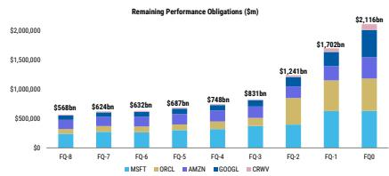

stacked bar chart

| Quarter | MIST   | ORCL   | AMZN   | GODGL  | CRWV   |
|---------|--------|--------|--------|--------|--------|
| FQ-8    | $568bn |        |        |        |        |
| FQ-7    | $624bn |        |        |        |        |
| FQ-6    | $632bn |        |        |        |        |
| FQ-5    | $667bn |        |        |        |        |
| FQ-4    | $748bn |        |        |        |        |
| FQ-3    | $831bn |        |        |        |        |
| FQ-2    | $1,241bn |        |        |        |        |
| FQ-1    | $1,702bn |        |        |        |        |
| FQ0     | $2,116bn |        |        |        |        |

Note: GOOGL, META, and AMZN are covered by Brian Nowak. CRWV, and MSFT are covered by Josh Baer. ORCL is covered by Sanjit Singh.
Source: Company Filings, MS.

## MS

June 2026

Global Valuation, Accounting & Tax

## AI Ecosystem

## We are entering a record-setting capital cycle

Hyperscalers are pouring billions into the AI build-out, with finance lease usage pushing capital intensity even higher, well past the dot-com record. Capex estimates continue to revise higher, while sales revisions lag.

## As investment grows, depreciation is set to rise

A sizable increase to depreciation expense could pressure margins if non-depreciation costs don't decline or if sales don't revise higher. But before these investments become expenses, much of the capital will sit in Construction in Progress (CIP), thus delaying earnings and margin impact.

## Billions in lease and purchase commitments are fueling the AI buildout

Hyperscalers are securing capacity amid surging demand through leases and purchase commitments, creating a timing gap between monetization and supplier payment, leading to a rise in DPO among hyperscalers.

## MS North America

MS & Co. LLC

## Todd Castagno, CFA, CPA

GVAT Strategist

(212) 761-6893

Todd.Castagno@morganstanley.com

## Kate Konetzke, CFA, CPA

GVAT Strategist

(212) 761-3457

Kate.Konetzke@morganstanley.com

## Mariah Thompson

GVAT Strategist

(212) 761-1147

Mariah.Thompson@morganstanley.com

## Clinton Chang, CFA, CPA

GVAT Strategist

(212) 761-1185

Clinton.Chang@morganstanley.com

MS does and seeks to do business with companies covered in MS. As a result, investors should be aware that the firm may have a conflict of interest that could affect the objectivity of MS. Investors should consider MS as only a single factor in making their investment decision.

For analyst certification and other important disclosures, refer to the Disclosure Section, located at the end of this report.

## MS

June 2026

FOUNDATION

GVAT

AI Ecosystem Capital Flows  
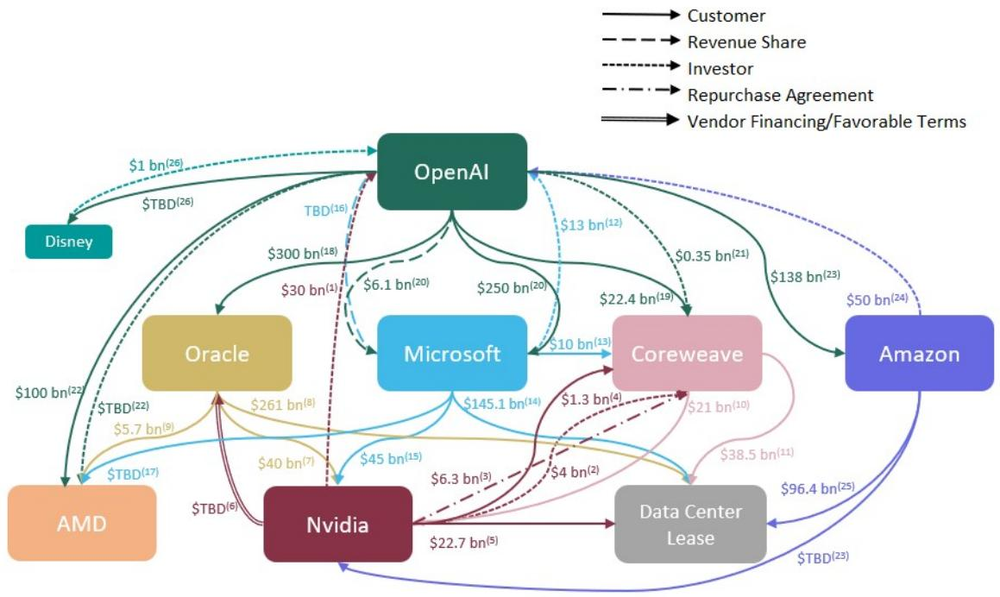

flowchart

```mermaid
graph TD
  Disney -->|TBD26| OpenAI
  OpenAI -->|TBD16| Oracle
  OpenAI -->|TBD18| Nvidia
  OpenAI -->|TBD20| Microsoft
  Microsoft -->|TBD19| Coreweave
  Microsoft -->|TBD21| Amazon
  Coreweave -->|TBD13| Amazon
  Coreweave -->|TBD4| DataCenterLease["Data Center Lease"]
  DataCenterLease -->|TBD23| Amazon
  DataCenterLease -->|TBD25| Amazon
  DataCenterLease -->|TBD26| Oracle
  DataCenterLease -->|TBD27| Nvidia
  DataCenterLease -->|TBD28| Amazon
  DataCenterLease -->|TBD29| Oracle
  DataCenterLease -->|TBD30| Nvidia
  DataCenterLease -->|TBD31| Amazon
  DataCenterLease -->|TBD32| Oracle
  DataCenterLease -->|TBD33| Nvidia
  DataCenterLease -->|TBD34| Amazon
  DataCenterLease -->|TBD35| Oracle
  DataCenterLease -->|TBD36| Nvidia
  DataCenterLease -->|TBD37| Amazon
  DataCenterLease -->|TBD38| Oracle
  DataCenterLease -->|TBD39| Nvidia
  DataCenterLease -->|TBD40| Nvidia
  DataCenterLease -->|TBD41| Nvidia
  DataCenterLease -->|TBD42| Nvidia
  DataCenterLease -->|TBD43| Nvidia
  DataCenterLease -->|TBD44| Nvidia
  DataCenterLease -->|TBD45| Nvidia
  DataCenterLease -->|TBD46| Nvidia
  DataCenterLease -->|TBD47| Nvidia
  DataCenterLease -->|TBD48| Nvidia
  DataCenterLease -->|TBD49| Nvidia
  DataCenterLease -->|TBD50| Amazon
  DataCenterLease -->|TBD51| Amazon
  DataCenterLease -->|TBD52| Amazon
  DataCenterLease -->|TBD53| Amazon
  DataCenterLease -->|TBD54| Amazon
  DataCenterLease -->|TBD55| Amazon
  DataCenterLease -->|TBD56| Amazon
  DataCenterLease -->|TBD57| Amazon
  DataCenterLease -->|TBD58| Amazon
  DataCenterLease -->|TBD59| Amazon
  DataCenterLease -->|TBD60| Amazon
  DataCenterLease -->|TBD61| Nvidia
  DataCenterLease -->|TBD62| Nvidia
  DataCenterLease -->|TBD63| Nvidia
  DataCenterLease -->|TBD64| Nvidia
  DataCenterLease -->|TBD65| Nvidia
  DataCenterLease -->|TBD66| Nvidia
  DataCenterLease -->|TBD67| Nvidia
  DataCenterLease -->|TBD68| Nvidia
  DataCenterLease -->|TBD69| Nvidia
  DataCenterLease -->|TBD70| Nvidia
  DataCenterLease -->|TBD71| Nvidia
  DataCenterLease -->|TBD72| Nvidia
  DataCenterLease -->|TBD73| Nvidia
  DataCenterLease -->|TBD74| Nvidia
  DataCenterLease -->|TBD75| Nvidia
  DataCenterLease -->|TBD76| Nvidia
  DataCenterLease -->|TBD77| Nvidia
  DataCenterLease -->|TBD78| Nvidia
  DataCenterLease -->|TBD79| Nvidia
  DataCenterLease -->|TBD80| Nvidia
  DataCenterLease -->|TBD81| Nvidia
  DataCenterLease -->|TBD82| Nvidia
  DataCenterLease -->|TBD83| Nvidia
  DataCenterLease -->|TBD84| Nvidia
  DataCenterLease -->|TBD85| Nvidia
  DataCenterLease -->|TBD86| Nvidia
  DataCenterLease -->|TBD87| Nvidia
  DataCenterLease -->|TBD88| Nvidia
  DataCenterLease -->|TBD89| Nvidia
  DataCenterLease -->|TBD90| Nvidia
  DataCenterLease -->|TBD91| Nvidia
  DataCenterLease -->|TBD92| Nvidia
  DataCenterLease -->|TBD93| Nvidia
  DataCenterLease -->|TBD94| Nvidia
  DataCenterLease -->|TBD95| Nvidia
  DataCenterLease -->|TBD96| Nvidia
  DataCenterLease -->|TBD97| Nvidia
  DataCenterLease -->|TBD98| Nvidia
  DataCenterLease -->|TBD99| Nvidia
```

Read more: AI: Mapping the AI Ecosystem (22 Mar 2026)  
Note: ORCL, MSFT, and CRWV are covered by Keith Weiss. NVDA and AMD are covered by Joseph Moore. AMZN is covered by Brian Nowak. DIS is covered by Sean Diffley. Data as of 3/19/26.  
Source: Company Data, MS.

## MS

June 2026

FOUNDATION

GVAT

## Capital Intensity

## MS

June 2026

FOUNDATION

GVAT

## AI Boom Poised to Overtake Dot-Com Peak Levels

■ MSe forecasts the AI capex cycle will surpass peak capital intensity level seen during the dot-com era (32%), reaching 36%, 44%, and 42% in 2026-2028.

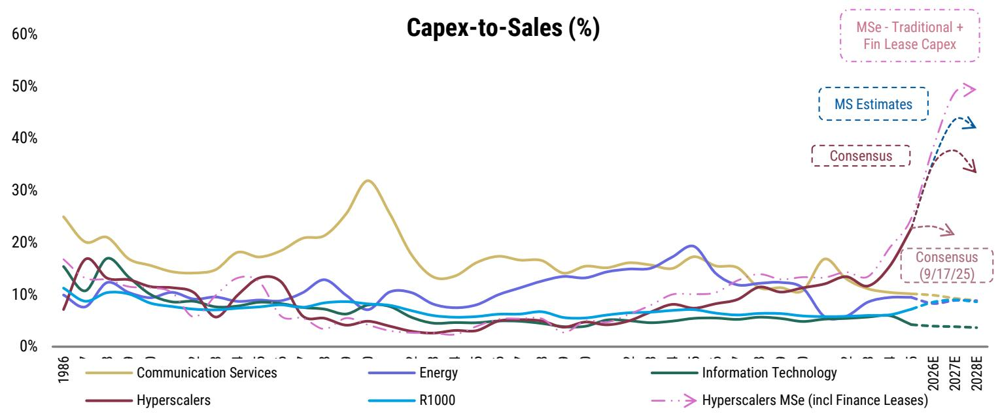

line chart

| Year | Communication Services | Energy | Information Technology | Hyperscalers | R1000 | Hyperscalers MSe (incl Finance Leases) |
|------|------------------------|--------|------------------------|--------------|-------|--------------------------------------|
| 1986 | ~25%                   | ~10%   | ~15%                   | ~7%          | ~10%  | ~16%                                 |
| 2026E| ~10%                   | ~10%   | ~5%                    | ~25%         | ~8%   | ~45%                                 |
| 2028E| ~10%                   | ~10%   | ~5%                    | ~25%         | ~8%   | ~45%                                 |

Read more: AI: Capital Intensity Enters a New Era (26 Feb 2026)  
Note: The hyperscalers group includes AMZN, GOOGL, META, MSFT, & ORCL and are excluded from the other sector groups. Only MSFT and ORCL finance lease estimates are included. R1000 excludes Real Estate and Financials.  
Source: MS and FactSet

## MS

June 2026

## Hyperscalers Capex Spending Trajectory

- Hyperscalers accounted for $>150\%$ of US Large-Cap capex growth in 2025 and are expected to represent $\sim 40\%$ of index capex in 2026, doubling from 2024 levels.  
- Other AI enablers (Energy, Industrials, etc.) will likely drive total AI capex north of 50% of aggregate capex.

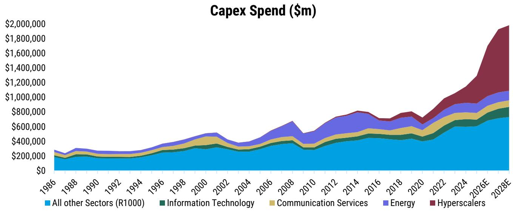  
Read more: AI: Capital Intensity Enters a New Era (26 Feb 2026)  
Note: The hyperscalers group includes AMZN, GOOGL, META, MSFT, & ORCL and are excluded from the other sector groups. R1000 excludes Real Estate and Financials. Estimates are based on consensus.  
Source: MS and FactSet.

FOUNDATION

GVAT

## MS

June 2026

FOUNDATION

GVAT

## Capex Revisions Climb Higher...

- Consensus raised capex estimates by an aggregate of \~\$900bn in 2026-27 vs 9 months ago.  
■ MSe hyperscaler spend forecasts align with consensus in 2026, but diverge in 2027 and 2028 by 20% and 32%, respectively.

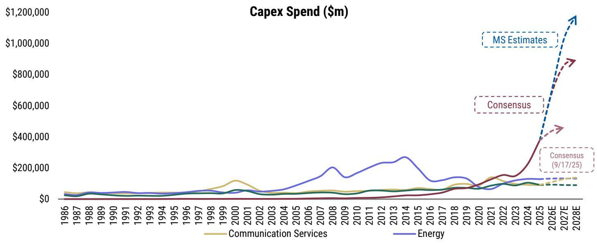

line chart

| Year | Communication Services | Energy |
|------|------------------------|--------|
| 1986 | ~$20,000               | ~$20,000 |
| 1987 | ~$25,000               | ~$25,000 |
| 1988 | ~$30,000               | ~$30,000 |
| 1989 | ~$35,000               | ~$35,000 |
| 1990 | ~$40,000               | ~$40,000 |
| 1991 | ~$45,000               | ~$45,000 |
| 1992 | ~$50,000               | ~$50,000 |
| 1993 | ~$55,000               | ~$55,000 |
| 1994 | ~$60,000               | ~$60,000 |
| 1995 | ~$65,000               | ~$65,000 |
| 1996 | ~$70,000               | ~$70,000 |
| 1997 | ~$75,000               | ~$75,000 |
| 1998 | ~$80,000               | ~$80,000 |
| 1999 | ~$85,000               | ~$85,000 |
| 2000 | ~$90,000               | ~$90,000 |
| 2001 | ~$85,000               | ~$85,000 |
| 2002 | ~$80,000               | ~$80,000 |
| 2003 | ~$75,000               | ~$75,000 |
| 2004 | ~$75,000               | ~$75,000 |
| 2005 | ~$75,000               | ~$75,000 |
| 2006 | ~$75,000               | ~$75,000 |
| 2007 | ~$75,000               | ~$75,000 |
| 2008 | ~$75,000               | ~$75,000 |
| 2009 | ~$75,000               | ~$75,000 |
| 2010 | ~$75,000               | ~$75,000 |
| 2011 | ~$75,000               | ~$75,000 |
| 2012 | ~$75,000               | ~$75,000 |
| 2013 | ~$75,000               | ~$75,000 |
| 2014 | ~$75,000               | ~$75,000 |
| 2015 | ~$75,000               | ~$75,000 |
| 2016 | ~$75,000               | ~$75,000 |
| 2017 | ~$75,000               | ~$75,000 |
| 2018 | ~$75,000               | ~$75,000 |
| 2019 | ~$75,000               | ~$75,000 |
| 2021 | ~$85,000               | ~$85,000 |
| 2022 | ~$95,000               | ~$95,000 |
| 2023 | ~$115,000              | ~$115,00 |
| 2024E | ~$135,0k              | ~$135,k |
| 22E   | ~$145k                 | ~$145k |
| 23E   | ~$145k                 | ~$145k |
| 24E   | ~$145k                 | ~$145k |
| 25E   | ~$145k                 | ~$145k |
| 26E   | ~$145k                 | ~$145k |
| 27E   | ~$145k                 | ~$145k |
| 28E   | ~$145k                 | ~$145k |
MS Estimates; Consensus (9/17/25) for 23E; MS Estimates; Consensus (9/17/25) for 24E; MS Estimates; Consensus (9/17/25) for 25E; MS Estimates; Consensus (9/17/25) for 26E; MS Estimates; Consensus (9/17/25) for 27E; MS Estimates; Consensus (9/17/25) for 28E

Read more: AI: Capital Intensity Enters a New Era (26 Feb 2026)  
Note: The hyperscalers group includes AMZN, GOOGL, META, MSFT, & ORCL and are excluded from the other sector groups. R1000 excludes Real Estate and Financials. Estimates are based on consensus.  
Source: MS and FactSet.

## MS

June 2026

FOUNDATION

GVAT

## Capex Revisions Climb Higher...

■ GOOGL consensus capex revisions for 2026 have increased 139% vs one year ago (June 2025), with META and AMZN up 85% and 81%, respectively.  
■ ORCL had largest jump with revisions up 175% from one year ago.

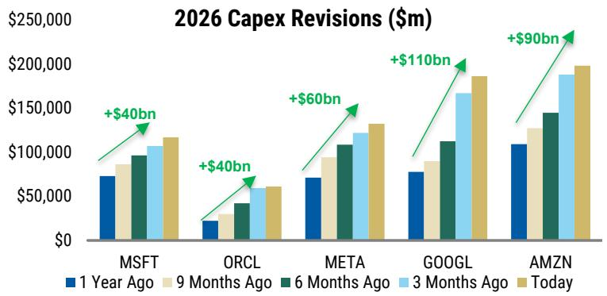

bar chart

| Company | 1 Year Ago | 9 Months Ago | 6 Months Ago | 3 Months Ago | Today |
|---------|------------|--------------|--------------|--------------|-------|
| MSFT    | $75,000    | $85,000      | $95,000      | $105,000     | $115,000 |
| ORCL    | $25,000    | $35,000      | $45,000      | $55,000      | $60,000 |
| META    | $70,000    | $90,000      | $105,000     | $125,000     | $135,000 |
| GOOGL   | $75,000    | $95,000      | $115,000     | $165,000     | $185,000 |
| AMZN    | $110,000   | $125,000     | $145,000     | $185,000     | $200,000 |

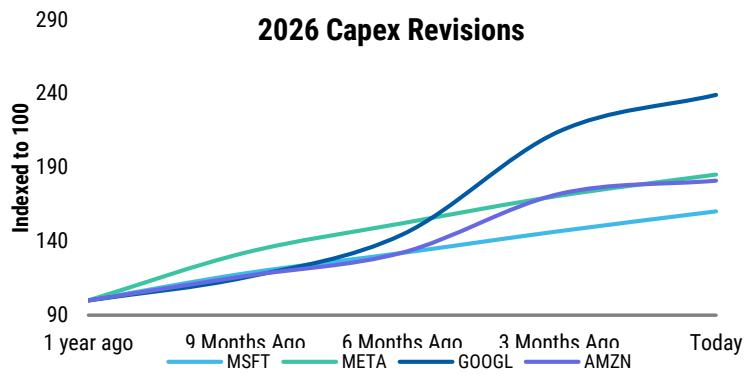

line chart

| Time Period     | MSFT  | META  | GOOGL | AMZN  |
| --------------- | ----- | ----- | ----- | ----- |
| 1 year ago      | 90    | 90    | 90    | 90    |
| 9 Months Ago    | 100   | 130   | 105   | 100   |
| 6 Months Ago    | 110   | 140   | 130   | 115   |
| 3 Months Ago    | 120   | 150   | 180   | 150   |
| Today           | 140   | 185   | 240   | 185   |

Read more: AI: Capital Intensity Enters a New Era (26 Feb 2026)

Note: GOOGL, META, and AMZN are covered by Brian Nowak, MSFT is covered by Keith Weiss. ORCL excluded to preserve scale. Latest data as of 6/4/26.

Source: Company filings and MS.

## MS

June 2026

FOUNDATION

GVAT

...Outpacing Sales and FCF Revisions  
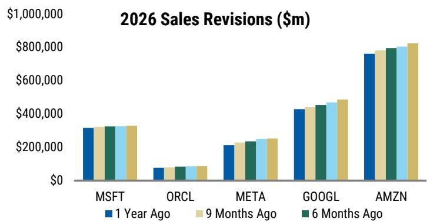

bar chart

2026 Sales Revisions ($m)
| Company | 1 Year Ago ($m) | 9 Months Ago ($m) | 6 Months Ago ($m) |
| :--- | :--- | :--- | :--- |
| MSFT | 320000 | 330000 | 335000 |
| ORCL | 80000 | 90000 | 95000 |
| META | 210000 | 230000 | 245000 |
| GOOGL | 425000 | 440000 | 460000 |
| AMZN | 770000 | 795000 | 815000 |

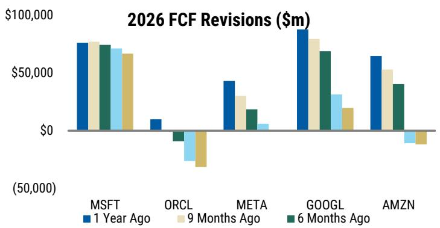

bar chart

2026 FCF Revisions ($m)
| Company | 1 Year Ago ($) | 9 Months Ago ($) | 6 Months Ago ($) |
| :--- | :--- | :--- | :--- |
| MSFT | 75,000 | 78,000 | 73,000 |
| ORCL | 10,000 | -25,000 | -15,000 |
| META | 42,000 | 30,000 | 18,000 |
| GOOGL | 88,000 | 78,000 | 68,000 |
| AMZN | 63,000 | 52,000 | 41,000 |

One Year Change in Capex vs Revenue \$109bn  
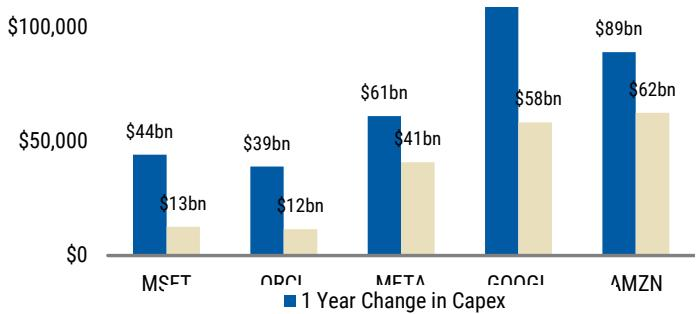

bar chart

| Company | 1 Year Change in Capex ($) |
| :--- | :--- |
| MSFT | 44 |
| OPCI | 39 |
| META | 61 |
| GOOGI | 100 |
| AMZN | 89 |
The chart displays a single value per company: $13bn, $12bn, $41bn, $58bn, and $62bn respectively. The values are labeled on each bar. The legend indicates blue bars represent the first year change in Capex.

Read more: AI: Capital Intensity Enters a New Era (26 Feb 2026)  
Note: GOOGL, META, and AMZN are covered by Brian Nowak, MSFT is covered by Keith Weiss. Latest data as of 6/4/26.  
Source: MS and Factset.

## MS

June 2026

FOUNDATION

GVAT

## Lease & Purchase Commitments

## MS

June 2026

FOUNDATION

GVAT

Lease & Purchase Commitments as % of NTM OCF  
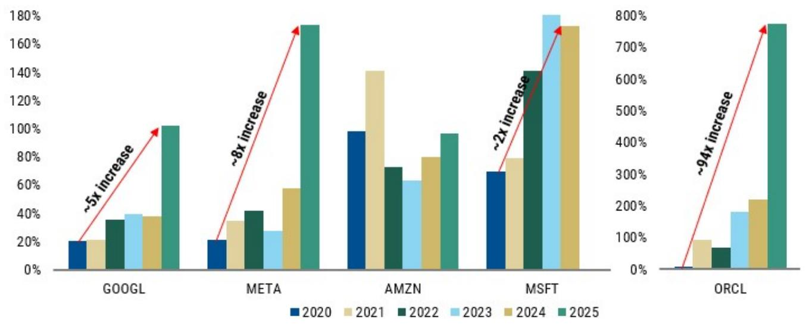

bar chart

| Company | 2020 (%) | 2021 (%) | 2022 (%) | 2023 (%) | 2024 (%) | 2025 (%) |
| :--- | :--- | :--- | :--- | :--- | :--- | :--- |
| GOOGL | 20 | 20 | 35 | 40 | 38 | 102 |
| META | 20 | 33 | 41 | 27 | 57 | 174 |
| AMZN | 98 | 141 | 72 | 62 | 79 | 96 |
| MSFT | 68 | 78 | 141 | 181 | 173 | - |
| ORCL | -1 | -1 | -6 | 180 | 220 | 770 |
The chart includes annotations: ~5x increase for GOOGL; ~8x increase for META; ~2x increase for MSFT; and ~94x increase for ORCL. The right axis is scaled logarithmically from 0% to 800%.

Read more: AI: Off Balance Sheet, On the Hook (15 Apr 2026)  
Note: ORCL and MSFT figures are included in the prior annual period (2024 = FY 2025). MSFT 2025 = 2FQ26. ORCL 2025 = 3FQ26. GOOGL, META, and AMZN are covered by Brian Nowak, MSFT and ORCL is covered by Keith Weiss.  
Source: MS, Company Filings, and Visible Alpha estimates.

## MS

June 2026

FOUNDATION

GVAT

## Suppliers Using Commitments from Hyperscalers & Nvidia to Access Financing

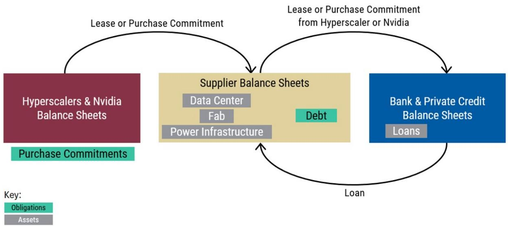

flowchart

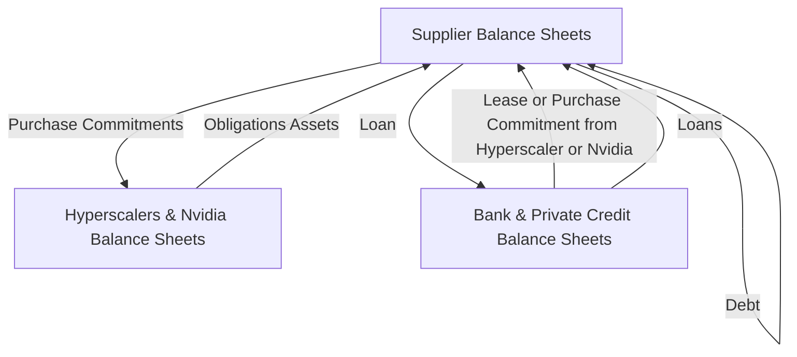
```mermaid
graph TD
  A["Supplier Balance Sheets"] -->|Purchase Commitments| B["Hyperscalers & Nvidia Balance Sheets"]
  A -->|Loan| C["Bank & Private Credit Balance Sheets"]
  C -->|Lease or Purchase Commitment from Hyperscaler or Nvidia| A
  A -->|Lease or Purchase Commitment| A
  A -->|Debt| A
  B -->|Obligations Assets| A
  C -->|Loans| A
```

Read more: AI: Off Balance Sheet, On the Hook (15 Apr 2026)

Source: MS.

## MS

June 2026

FOUNDATION

GVAT

## Hyperscaler/Nvidia Purchase Commitments close to \~\$1T

Unless a company expects a loss on these contracts, these obligations remain off-balance sheet until the underlying goods or services are delivered and a payable is recognized.

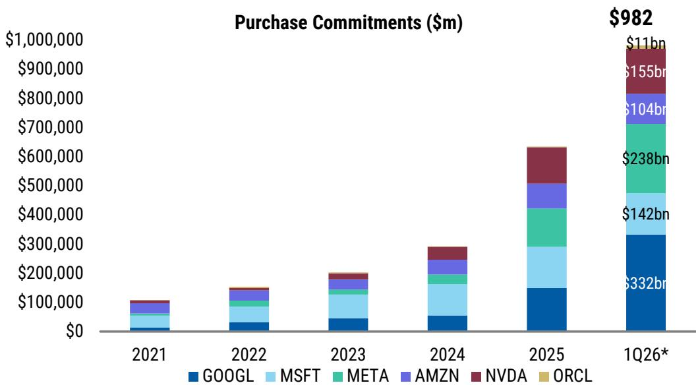

stacked bar chart

| Year   | GOOGL  | MSFT   | META   | AMZN   | NVDA   | ORCL   |
|--------|--------|--------|--------|--------|--------|--------|
| 2021   | $20,000| $30,000| $10,000| $15,000| $5,000 | $1,000 |
| 2022   | $30,000| $40,000| $15,000| $20,000| $10,000| $2,000 |
| 2023   | $40,000| $50,000| $20,000| $25,000| $15,000| $5,000 |
| 2024   | $50,000| $60,000| $25,000| $30,000| $25,000| $10,000|
| 2025   | $150,000| $142,000| $138,000| $144,000| $155,000| $11bn  |
| 1Q26*  | $332,000| $142,000| $238,000| $144,000| $155,000| $11bn  |

Read more: AI: Off Balance Sheet, On the Hook (15 Apr 2026) and AI: Capital Intensity Enters a New Era (26 Feb 2026)  
Note: Based on fiscal years. ORCL 1Q26 = 3FQ26. MSFT 1Q26 = 2025 given no quarterly disclosure. GOOGL, META, and AMZN are covered by Brian Nowak, MSFT and ORCL are covered by Keith Weiss. NVDA is covered by Joe Moore.  
Source: MS and Company Filings

## MS

June 2026

## Nvidia Inventory Purchase Commitments

Nvidia's inventory and inventory purchase commitments have increased from 15–20% historically, to \~32% of consensus FY27 revenue.

NVDA Inventory + Purchase Obligations / NTM Revenue  
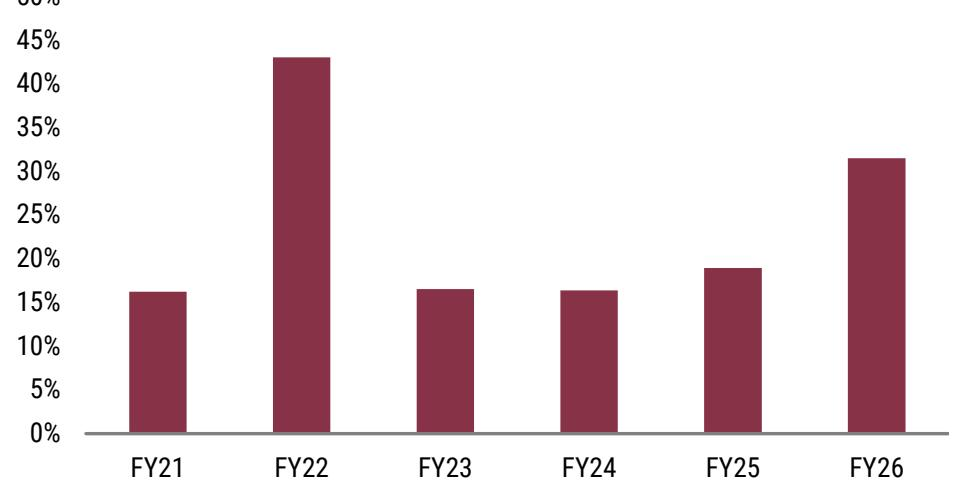

bar chart

| Fiscal Year | Value (%) |
| :--- | :--- |
| FY21 | 16 |
| FY22 | 43 |
| FY23 | 16 |
| FY24 | 16 |
| FY25 | 19 |
| FY26 | 31 |

Read more: AI: Off Balance Sheet, On the Hook (15 Apr 2026)

Note: NVDA is covered by Joe Moore.

Source: Company Filings, Factset, and MS. NTM estimate as of 4/10/25.

## MS

June 2026

FOUNDATION

GVAT

## Compute Capacity Arrangements – Does the Deal Contain a Lease?

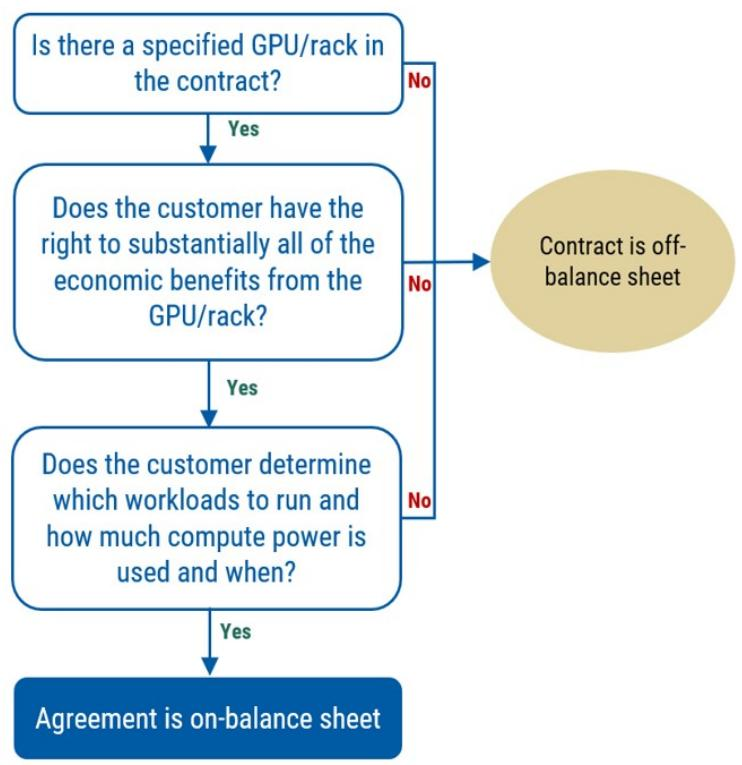

flowchart

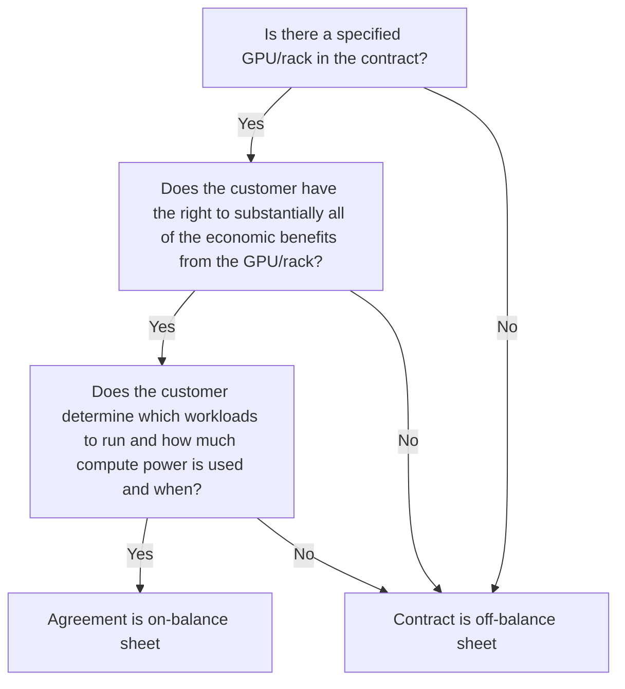
```mermaid
graph TD
  A["Is there a specified GPU/rack in the contract?"] -->|Yes| B["Does the customer have the right to substantially all of the economic benefits from the GPU/rack?"]
  A -->|No| C["Contract is off-balance sheet"]
  B -->|Yes| D["Does the customer determine which workloads to run and how much compute power is used and when?"]
  B -->|No| C
  D -->|Yes| E["Agreement is on-balance sheet"]
  D -->|No| C
```

Read more: AI: Off Balance Sheet, On the Hook (15 Apr 2026)  
Source: MS.

As of their latest filings:

Nvidia: disclosed \$30bn of cloud service agreement commitments  
Oracle: disclosed \$10bn of cloud capacity arrangements  
■ Meta: did not quantify but said that its \$238bn of contractual commitments include third-party cloud capacity arrangements

## MS

June 2026

FOUNDATION

GVAT

## Purchases Driving up Accounts Payable among AI Players

- Unpaid capex embedded in accounts payable and accrued expenses now totals \~\$110bn across major AI players.  
Timing gap from AI monetization to supplier payment is leading to growing DPO vs historical averages.

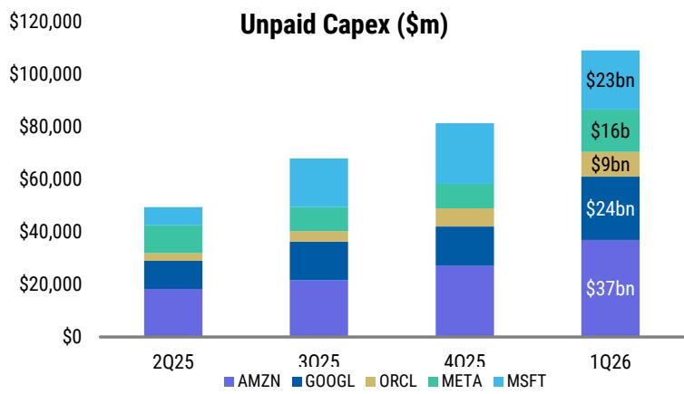

stacked bar chart

| Quarter | AMZN   | GOOGL  | ORCL   | META   | MSFT   |
|---------|--------|--------|--------|--------|--------|
| 2Q25    | $18,000| $10,000| $2,000 | $10,000| $5,000 |
| 3Q25    | $20,000| $12,000| $3,000 | $8,000 | $15,000|
| 4Q25    | $25,000| $15,000| $5,000 | $7,000 | $20,000|
| 1Q26    | $37,000| $24,000| $9,000 | $16,000| $23,000|

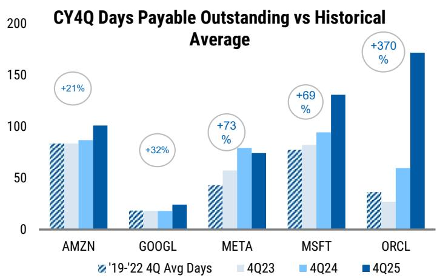

bar chart

| Company | '19-'22 4Q Avg Days | 4Q23 | 4Q24 | 4Q25 |
|---------|---------------------|------|------|------|
| AMZN    | ~85                 | ~85  | ~85  | ~100 |
| GOOGL   | ~15                 | ~15  | ~15  | ~25  |
| META    | ~40                 | ~55  | ~75  | ~70  |
| MSFT    | ~75                 | ~80  | ~95  | ~130 |
| ORCL    | ~35                 | ~25  | ~60  | ~170 |

Read more: AI: Hyperscaling Payables (10 Feb 2026)

Note: GOOGL, META, and AMZN are covered by Brian Nowak. MSFT and ORCL are covered by Keith Weiss. ORCL's quarters based on its FYE (1Q26 = 3FQ26).

Source: Company Filings, MS.

## MS

June 2026

FOUNDATION

GVAT

## On/Off Balance Sheet Leases across Hyperscalers

■ Common types of lease payments that are not included in the lease liability:

■ Leases Signed but Not Yet Started  
■ Variable Lease Payments  
■ Renewal Options  
■ Residual Value Guarantees  
- Third-Party Lease Backstops & Guarantees

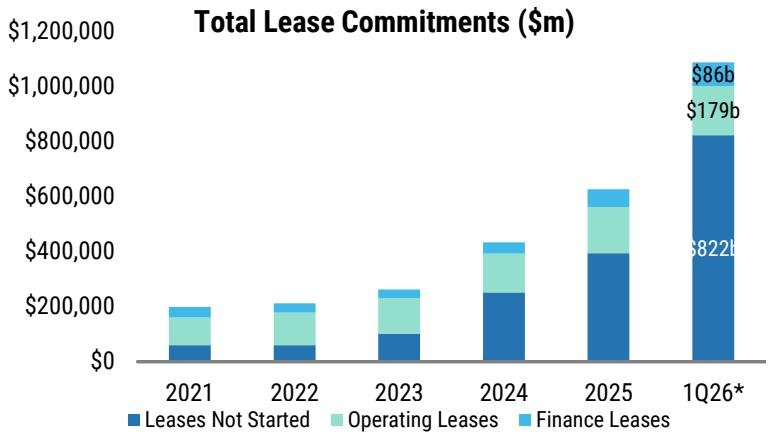

stacked bar chart

| Year   | Leases Not Started | Operating Leases | Finance Leases |
| ------ | ------------------ | ---------------- | -------------- |
| 2021   | $50,000            | $70,000          | $20,000        |
| 2022   | $50,000            | $75,000          | $25,000        |
| 2023   | $75,000            | $90,000          | $30,000        |
| 2024   | $150,000           | $110,000         | $40,000        |
| 2025   | $350,000           | $130,000         | $60,000        |
| 1Q26*  | $822 billion       | $179 billion      | $86 billion     |

Read more: AI: Off Balance Sheet, On the Hook (15 Apr 2026) and AI: Leasing The Future (11 Nov 2025)

Note: Leases not started are undiscounted. Based on fiscal years. ORCL and MSFT 1Q26 = 3FQ26. GOOGL, META, and AMZN are covered by Brian Nowak, MSFT and ORCL are covered by Keith Weiss.

Source: MS and Company Filings.

## MS

June 2026

FOUNDATION

GVAT

## Off-Balance Sheet Example: Variable Lease Payments

\- Variable lease payments exceed 10% of lease costs at AMZN, 25% at META, and 30% at GOOGL (MSFT and ORCL report none, likely due to materiality judgments).

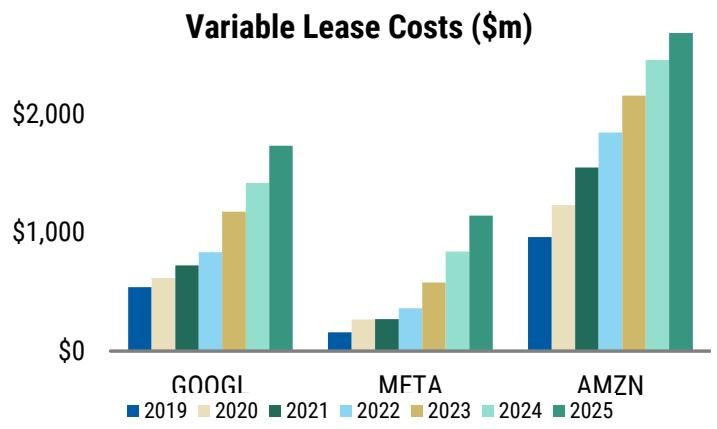

bar chart

Variable Lease Costs ($m)
| Company | 2019 ($m) | 2020 ($m) | 2021 ($m) | 2022 ($m) | 2023 ($m) | 2024 ($m) | 2025 ($m) |
| :--- | :--- | :--- | :--- | :--- | :--- | :--- | :--- |
| GOOGI | 600 | 650 | 750 | 850 | 1150 | 1400 | 1750 |
| MFTA | 150 | 250 | 300 | 350 | 550 | 800 | 1100 |
| AMZN | 950 | 1200 | 1550 | 1850 | 2150 | 2450 | 2750 |

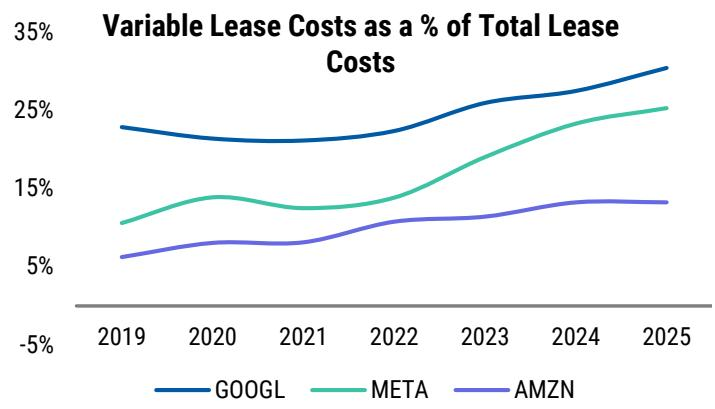

line chart

| Year | GOOGL | META | AMZN |
|------|-------|------|------|
| 2019 | 24%   | 10%  | 5%   |
| 2020 | 23%   | 14%  | 6%   |
| 2021 | 23%   | 13%  | 6%   |
| 2022 | 24%   | 14%  | 7%   |
| 2023 | 26%   | 18%  | 8%   |
| 2024 | 27%   | 22%  | 10%  |
| 2025 | 29%   | 25%  | 10%  |

Read more: AI: Off Balance Sheet, On the Hook (15 Apr 2026)

Note: GOOGL, META, and AMZN are covered by Brian Nowak.

Source: Company Filings and MS.

## MS

June 2026

FOUNDATION

GVAT

## Finance Leases Pushing Up Capital Intensity

- \$800bn+ of lease commitments highlight growing strategy by Hyperscalers to quickly expand AI build-out.  
MSFT's capex-to-sales incl finance leases could jump from $33\%$ and $50\%$ in FY26 and FY27 to $44\%$ and $64\%$ , while ORCL's could jump from $76\%$ and $115\%$ to $101\%$ and $189\%$ , over same period (MSe).

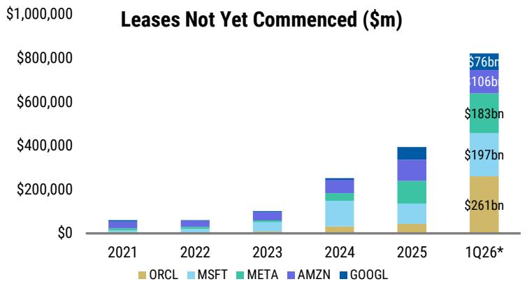

stacked bar chart

| Year     | ORCL   | MSFT   | META   | AMZN   | GOOGL  |
| -------- | ------ | ------ | ------ | ------ | ------ |
| 1Q26*    | $261bn | $197bn | $183bn | $106bn | $76bn  |

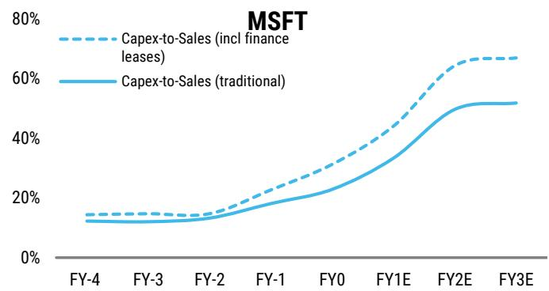

line chart

| Fiscal Year | Capex-to-Sales (incl finance leases) | Capex-to-Sales (traditional) |
|-------------|-------------------------------------|------------------------------|
| FY-4        | ~15%                                | ~10%                         |
| FY-3        | ~15%                                | ~10%                         |
| FY-2        | ~15%                                | ~10%                         |
| FY-1        | ~25%                                | ~15%                         |
| FY0         | ~35%                                | ~20%                         |
| FY1E        | ~50%                                | ~30%                         |
| FY2E        | ~65%                                | ~50%                         |
| FY3E        | ~65%                                | ~50%                         |

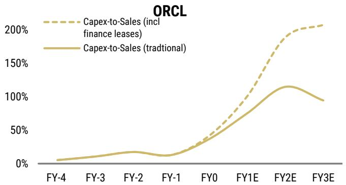

line chart

| Fiscal Year | Capex-to-Sales (incl finance leases) | Capex-to-Sales (traditional) |
|-------------|-------------------------------------|------------------------------|
| FY-4        | ~5%                                 | ~5%                          |
| FY-3        | ~10%                                | ~10%                         |
| FY-2        | ~15%                                | ~15%                         |
| FY-1        | ~20%                                | ~20%                         |
| FY0         | ~50%                                | ~50%                         |
| FY1E        | ~100%                               | ~100%                        |
| FY2E        | ~180%                               | ~120%                        |
| FY3E        | ~200%                               | ~100%                        |

Read more: AI: Off Balance Sheet, On the Hook (15 Apr 2026) and AI: Capital Intensity Enters a New Era (26 Feb 2026)

Note: Based on fiscal years. ORCL and MSFT 1Q26 = 3FQ26. MSFT and ORCL are covered by Keith Weiss, GOOGL, META, and AMZN are covered by Brian Nowak.

Source: Company filings and MS.

# MS

June 2026

FOUNDATION

GVAT

## Depreciation

## MS

June 2026

FOUNDATION

GVAT

## High Capital Investments → Significant Depreciation Expense

We estimate cumulative depreciation for MSFT, ORCL, META, and GOOGL could exceed \$520bn over the next 3 years.

Please reach out for our spreadsheet model that can be adapted to for your inputs.

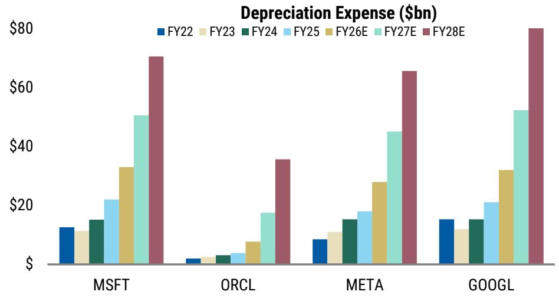

bar chart

Depreciation Expense ($bn)
| Company | FY22 ($) | FY23 ($) | FY24 ($) | FY25 ($) | FY26E ($) | FY27E ($) | FY28E ($) |
| :--- | :--- | :--- | :--- | :--- | :--- | :--- | :--- |
| MSFT | 12 | 11 | 15 | 21 | 33 | 50 | 70 |
| ORCL | 2 | 3 | 4 | 4 | 7 | 17 | 35 |
| META | 8 | 10 | 15 | 17 | 27 | 44 | 65 |
| GOOGL | 15 | 11 | 15 | 20 | 31 | 51 | 80 |

Read more: AI: Appreciating Depreciation Flows (28 Jan 2026) and AI: Depreciation Flows Update (26 Feb 2026)

Note: Depreciation figures in 2026-2028 are estimates derived from our depreciation model, based on MS capex estimates. MSFT and ORCL are covered by Keith Weiss. META and GOOGL are covered by Brian Nowak.

Source: FactSet, Company filings, and MS.

## MS

June 2026

FOUNDATION

GVAT

## Depreciation Impact on Margins

As depreciation becomes a larger % of revenue, all other expenses need to decline to achieve margin expectations.  
ORCL's depreciation as a % of revenue could rise from 7% to 28% in FY28, while META's could jump from 9% to 19%, over the same period.

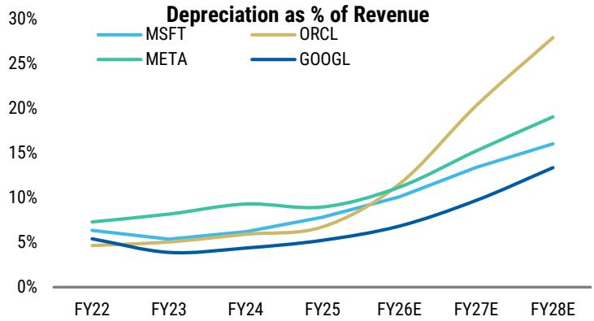

line chart

| Fiscal Year | MSFT  | ORCL  | META  | GOOGL |
|-------------|-------|-------|-------|-------|
| FY22        | ~6%   | ~5%   | ~7%   | ~5%   |
| FY23        | ~5%   | ~5%   | ~8%   | ~4%   |
| FY24        | ~6%   | ~6%   | ~9%   | ~4%   |
| FY25        | ~7%   | ~7%   | ~9%   | ~5%   |
| FY26E       | ~10%  | ~10%  | ~11%  | ~6%   |
| FY27E       | ~13%  | ~18%  | ~15%  | ~9%   |
| FY28E       | ~16%  | ~28%  | ~19%  | ~13%  |

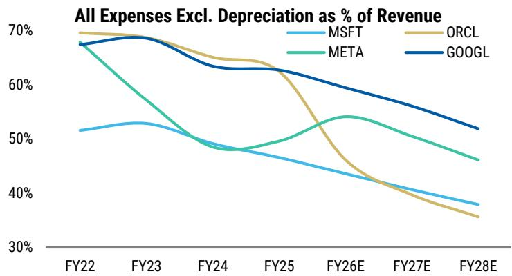

line chart

| Fiscal Year | MSFT  | ORCL  | META  | GOOGL |
|-------------|-------|-------|-------|-------|
| FY22        | 51%   | 70%   | 68%   | 68%   |
| FY23        | 52%   | 69%   | 65%   | 69%   |
| FY24        | 50%   | 65%   | 50%   | 63%   |
| FY25        | 48%   | 63%   | 48%   | 62%   |
| FY26E       | 45%   | 50%   | 54%   | 60%   |
| FY27E       | 42%   | 40%   | 50%   | 57%   |
| FY28E       | 38%   | 35%   | 46%   | 52%   |

Read more: AI: Appreciating Depreciation Flows (28 Jan 2026) and AI: Depreciation Flows Update (26 Feb 2026)

Note: Depreciation figures in 2026-2028 are estimates derived from our depreciation model, based on MS capex estimates. MSFT and ORCL are covered by Keith Weiss. META and GOOGL are covered by Brian Nowak.

Source: FactSet, Company filings, and MS.

## MS

June 2026

FOUNDATION

GVAT

## Construction in Progress Delaying Earnings Impact

■ Rising CIP balances indicate the delay between the capital outlay and the expense hitting net income.  
■ ORCL, META, & GOOGL's CIP balances grew by \~200%, \~90%, & \~55% respectively, over the past year.

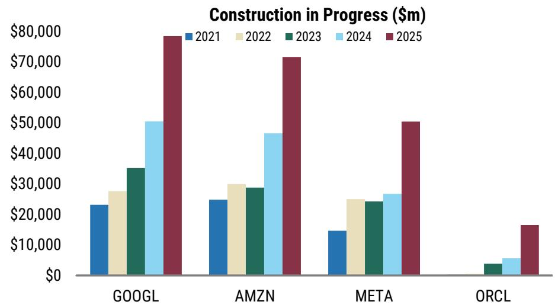

bar chart

Construction in Progress ($m)
| Company | 2021 ($) | 2022 ($) | 2023 ($) | 2024 ($) | 2025 ($) |
| :--- | :--- | :--- | :--- | :--- | :--- |
| GOOGL | 23,000 | 28,000 | 35,000 | 50,000 | 79,000 |
| AMZN | 25,000 | 30,000 | 29,000 | 46,000 | 71,000 |
| META | 15,000 | 25,000 | 24,000 | 27,000 | 50,000 |
| ORCL | -1,000 | -1,500 | 4,000 | 6,000 | 16,500 |

Read more: AI: Appreciating Depreciation Flows (28 Jan 2026) and AI: Depreciation Flows Update (26 Feb 2026)

Note: ORCL is covered by Keith Weiss. GOOGL, META, and AMZN are covered by Brian Nowak.

Source: FactSet, Company filings, and MS.

## MS

June 2026

FOUNDATION

GVAT

## Remaining Performance Obligations (RPO)

## MS

June 2026

## RPO Balances Rising among AI Players

Large AI contracts have pushed up RPO balances with ORCL's RPO balance up $>300\%$ yoy, while MSFT and GOOGL's balances have risen $97\%$ and $406\%$ , over the same period.

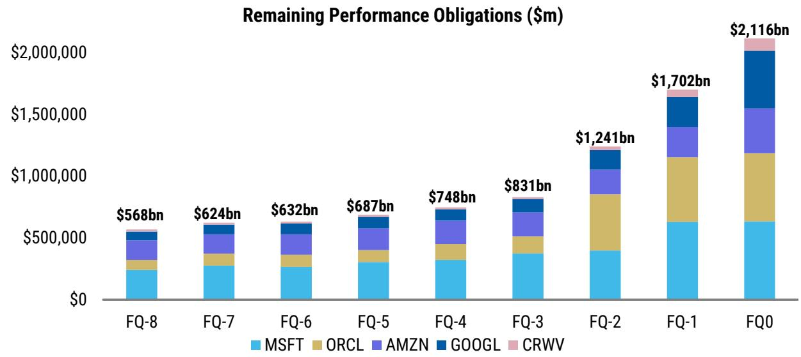

stacked bar chart

| Quarter | MSFT   | ORCL   | AMZN   | GOOGL  | CRWV   |
|---------|--------|--------|--------|--------|--------|
| FQ-8    | $250,000 | $50,000 | $100,000 | $20,000 | $10,000 |
| FQ-7    | $250,000 | $50,000 | $100,000 | $20,000 | $10,000 |
| FQ-6    | $250,000 | $50,000 | $100,000 | $20,000 | $10,000 |
| FQ-5    | $250,000 | $50,000 | $100,000 | $20,000 | $10,000 |
| FQ-4    | $250,000 | $50,000 | $100,000 | $20,000 | $10,000 |
| FQ-3    | $250,000 | $50,000 | $100,000 | $20,000 | $10,000 |
| FQ-2    | $250,000 | $350,000 | $150,000 | $25,000 | $15,000 |
| FQ-1    | $350,000 | $450,000 | $25,000 | $35,000 | $25,000 |
| FQO     | $350,000 | $450,000 | $35,000 | $45,000 | $25,000 |

Read more: AI: RPO Revealed (21 Oct 2025)

Note: GOOGL, META, and AMZN are covered by Brian Nowak. CRWV, MSFT and ORCL are covered by Keith Weiss.

Source: Company Filings, MS.

## MS

June 2026

RPO Duration Differences  
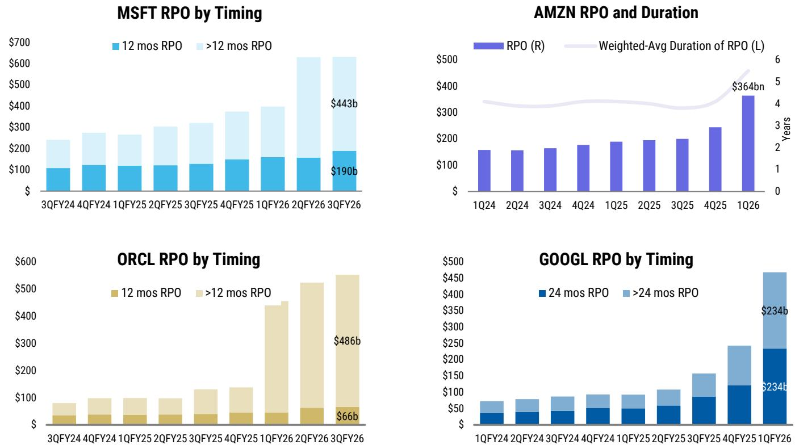  
Read more: AI: RPO Revealed (21 Oct 2025)  
Note: GOOGL, META, and AMZN are covered by Brian Nowak. CRWV, MSFT and ORCL are covered by Keith Weiss.  
Source: Company Filings, MS.

## Disclosure Section

The information and opinions in MS were prepared by MS & Co. LLC, and/or MS C.T.V.M. S.A., and/or MS Mexico, Casa de Bolsa, S.A. de C.V., and/or MS Canada Limited. As used in this disclosure section, "MS" includes MS & Co. LLC, MS C.T.V.M. S.A., MS Mexico, Casa de Bolsa, S.A. de C.V., MS Canada Limited and their affiliates as necessary.

For important disclosures, stock price charts and equity rating histories regarding companies that are the subject of this report, please see the MS Disclosure Website at www.morganstanley.com/eqr/disclosures/webapp/generalresearch, or contact your investment representative or MS at 1585 Broadway, (Attention: Research Management), New York, NY, 10036 USA.

For valuation methodology and risks associated with any recommendation, rating or price target referenced in this research report, please contact the Client Support Team as follows: US/Canada +1 800 303-2495; Hong Kong +852 2848-5999; Latin America +1 718 754-5444 (U.S.); London +44 (0)20-7425-8169; Singapore +65 6834-6860; Sydney +61 (0)2-9770-1505; Tokyo +81 (0)3-6836-9000. Alternatively you may contact your investment representative or MS at 1585 Broadway, (Attention: Research Management), New York, NY 10036 USA.

## Analyst Certification

## Global Research Conflict Management Policy

MS has been published in accordance with our conflict management policy, which is available at www.morganstanley.com/institutional/research/conflictpolicies. A Portuguese version of the policy can be found at www.morganstanley.com.br

## Important Regulatory Disclosures on Subject Companies

As of May 29, 2026, MS beneficially owned 1% or more of a class of common equity securities of the following companies covered in MS: Advanced Micro Devices, Alphabet Inc., Amazon.com Inc, CoreWeave, Meta Platforms Inc, Microsoft, NVIDIA Corp., Oracle Corporation, Walt Disney Co.

Within the last 12 months, MS managed or co-managed a public offering (or 144A offering) of securities of Alphabet Inc., Amazon.com Inc, CoreWeave, Meta Platforms Inc.

Within the last 12 months, MS has received compensation for investment banking services from Advanced Micro Devices, Alphabet Inc., Amazon.com Inc, CoreWeave, Meta Platforms Inc, Microsoft, Walt Disney Co.

In the next 3 months, MS expects to receive or intends to seek compensation for investment banking services from Advanced Micro Devices, Alphabet Inc., Amazon.com Inc, CoreWeave, Meta Platforms Inc, Microsoft, NVIDIA Corp., Oracle Corporation, Walt Disney Co.

Within the last 12 months, MS has received compensation for products and services other than investment banking services from Advanced Micro Devices, Alphabet Inc., Amazon.com Inc, CoreWeave, Meta Platforms Inc, Microsoft, NVIDIA Corp., Oracle Corporation, Walt Disney Co.

Within the last 12 months, MS has provided or is providing investment banking services to, or has an investment banking client relationship with, the following company: Advanced Micro Devices, Alphabet Inc., Amazon.com Inc, CoreWeave, Meta Platforms Inc, Microsoft, NVIDIA Corp., Oracle Corporation, Walt Disney Co.

Within the last 12 months, MS has either provided or is providing non-investment banking, securities-related services to and/or in the past has entered into an agreement to provide services or has a client relationship with the following company: Advanced Micro Devices, Alphabet Inc., Amazon.com Inc, CoreWeave, Meta Platforms Inc, Microsoft, NVIDIA Corp., Oracle Corporation, Walt Disney Co.

An employee, director or consultant of MS is a director of Walt Disney Co. This person is not a research analyst or a member of a research analyst's household.

The equity research analysts or strategists principally responsible for the preparation of MS have received compensation based upon various factors, including quality of research, investor client feedback, stock picking, competitive factors, firm revenues and overall investment banking revenues. Equity Research analysts' or strategists' compensation is not linked to investment banking or capital markets transactions performed by MS or the profitability or revenues of particular trading desks.

MS and its affiliates do business that relates to companies/instruments covered in MS, including market making, providing liquidity, fund management, commercial banking, extension of credit, investment services and investment banking. MS sells to and buys from customers the securities/instruments of companies covered in MS on a principal basis. MS may have a position in the debt of the Company or instruments discussed in this report. MS trades or may trade as principal in the debt securities (or in related derivatives) that are the subject of the debt research report.

Certain disclosures listed above are also for compliance with applicable regulations in non-US jurisdictions.

## STOCK RATINGS

MS uses a relative rating system using terms such as Overweight, Equal-weight, Not-Rated or Underweight (see definitions below). MS does not assign ratings of Buy, Hold or Sell to the stocks we cover. Overweight, Equal-weight, Not-Rated and Underweight are not the equivalent of buy, hold and sell. Investors should carefully read the definitions of all ratings used in MS. In addition, since MS contains more complete information concerning the analyst's views, investors should carefully read MS, in its entirety, and not infer the contents from the rating alone. In any case, ratings (or research) should not be used or relied upon as investment advice. An investor's decision to buy or sell a stock should depend on individual circumstances (such as the investor's existing holdings) and other considerations.

## Global Stock Ratings Distribution

(as of May 31, 2026)

The Stock Ratings described below apply to MS's Fundamental Equity Research and do not apply to Debt Research produced by the Firm.

For disclosure purposes only (in accordance with FINRA requirements), we include the category headings of Buy, Hold, and Sell alongside our ratings of Overweight, Equal-weight, Not-Rated and Underweight. MS does not assign ratings of Buy, Hold or Sell to the stocks we cover. Overweight, Equal-weight, Not-Rated and Underweight are not the equivalent of buy, hold, and sell but represent recommended relative weightings (see definitions below). To satisfy regulatory requirements, we correspond Overweight, our most positive stock rating, with a buy recommendation; we correspond Equal-weight and Not-Rated to hold and Underweight to sell recommendations, respectively.

<table><tr><td></td><td colspan="2">Coverage Universe</td><td colspan="3">Investment Banking Clients (IBC)</td><td colspan="2">Other Material Investment ServicesClients (MISC)</td></tr><tr><td>Stock RatingCategory</td><td>Count</td><td>% of Total</td><td>Count</td><td>% of Total IBC</td><td>% of RatingCategory</td><td>Count</td><td>% of Total OtherMISC</td></tr><tr><td>Overweight/Buy</td><td>1542</td><td>42%</td><td>465</td><td>51%</td><td>30%</td><td>707</td><td>43%</td></tr><tr><td>Equal-weight/Hold</td><td>1571</td><td>43%</td><td>369</td><td>40%</td><td>23%</td><td>723</td><td>44%</td></tr><tr><td>Not-Rated/Hold</td><td>3</td><td>0%</td><td>0</td><td>0%</td><td>0%</td><td>1</td><td>0%</td></tr><tr><td>Underweight/Sell</td><td>551</td><td>15%</td><td>86</td><td>9%</td><td>16%</td><td>201</td><td>12%</td></tr><tr><td>Total</td><td>3,667</td><td></td><td>920</td><td></td><td></td><td>1632</td><td></td></tr></table>

Data include common stock and ADRs currently assigned ratings. Investment Banking Clients are companies from whom MS received investment banking compensation in the last 12 months. Due to rounding off of decimals, the percentages provided in the "% of total" column may not add up to exactly 100 percent.

## Analyst Stock Ratings

Overweight (O). The stock's total return is expected to exceed the average total return of the analyst's industry (or industry team's) coverage universe, on a risk-adjusted basis, over the next 12-18 months.

Equal-weight (E). The stock's total return is expected to be in line with the average total return of the analyst's industry (or industry team's) coverage universe, on a risk-adjusted basis, over the next 12-18 months.

Not-Rated (NR). Currently the analyst does not have adequate conviction about the stock's total return relative to the average total return of the analyst's industry (or industry team's) coverage universe, on a risk-adjusted basis, over the next 12-18 months.

Underweight (U). The stock's total return is expected to be below the average total return of the analyst's industry (or industry team's) coverage universe, on a risk-adjusted basis, over the next 12-18 months.

Unless otherwise specified, the time frame for price targets included in MS is 12 to 18 months.

## Analyst Industry Views

Attractive (A): The analyst expects the performance of his or her industry coverage universe over the next 12-18 months to be attractive vs. the relevant broad market benchmark, as indicated below.

In-Line (I): The analyst expects the performance of his or her industry coverage universe over the next 12-18 months to be in line with the relevant broad market benchmark, as indicated below. Cautious (C): The analyst views the performance of his or her industry coverage universe over the next 12-18 months with caution vs. the relevant broad market benchmark, as indicated below. Benchmarks for each region are as follows: North America - S&P 500; Latin America - relevant MSCI country index or MSCI Latin America Index; Europe - MSCI Europe; Japan - TOPIX; Asia - relevant MSCI country index or MSCI sub-regional index or MSCI AC Asia Pacific ex Japan Index.

## Important Disclosures for MS Smith Barney LLC Customers

Important disclosures regarding any material conflict of interest that can reasonably be expected to have influenced MS Smith Barney LLC's choice of a third-party research provider or the subject company of a third-party research report, are available on the MS Wealth Management disclosure website at www.morganstanley.com/online/researchdisclosures. For MS specific disclosures, you may refer to https://www.morganstanley.com/eqr/disclosures/webapp/generalresearch.

Each MS report is reviewed and approved on behalf of MS Smith Barney LLC. This review and approval is conducted by the same person who reviews the research report on behalf of MS. This could create a conflict of interest.

## Other Important Disclosures

A member of Research who had or could have had access to the research prior to completion owns securities (or related derivatives) in the Microsoft, NVIDIA Corp., Walt Disney Co. This person is not a research analyst or a member of research analyst's household.

MS policy is to update research reports as and when the Research Analyst and Research Management deem appropriate, based on developments with the issuer, the sector, or the market that may have a material impact on the research views or opinions stated therein. In addition, certain Research publications are intended to be updated on a regular periodic basis (weekly/monthly/quarterly/annual) and will ordinarily be updated with that frequency, unless the Research Analyst and Research Management determine that a different publication schedule is appropriate based on current conditions.

MS is not acting as a municipal advisor and the opinions or views contained herein are not intended to be, and do not constitute, advice within the meaning of Section 975 of the Dodd-Frank Wall Street Reform and Consumer Protection Act.

MS produces an equity research product called a "Tactical Idea." Views contained in a "Tactical Idea" on a particular stock may be contrary to the recommendations or views expressed in research on the same stock. This may be the result of differing time horizons, methodologies, market events, or other factors. For all research available on a particular stock, please contact your sales representative or go to Matrix at http://www.morganstanley.com/matrix.

MS is provided to our clients through our proprietary research portal on Matrix and also distributed electronically by MS to clients. Certain, but not all, MS products are also made available to clients through third-party vendors or redistributed to clients through alternate electronic means as a convenience. For access to all available MS, please contact your sales representative or go to Matrix at http://www.morganstanley.com/matrix.

Any access and/or use of MS is subject to MS's Terms of Use (http://www.morganstanley.com/terms.html). By accessing and/or using MS, you are indicating that you have read and agree to be bound by our Terms of Use (http://www.morganstanley.com/terms.html). In addition you consent to MS processing your personal data and using cookies in accordance with our Privacy Policy and our Global Cookies Policy (http://www.morganstanley.com/privacy\_pledge.html), including for the purposes of setting your preferences and to collect readership data so that we can deliver better and more personalized service and products to you. To find out more information about how MS processes personal data, how we use cookies and how to reject cookies see our Privacy Policy and our Global Cookies Policy (http://www.morganstanley.com/privacy\_pledge.html). Please use the provided link to review the Terms and Conditions and Most Important Terms and Conditions for MS India Company Private Limited (https://www.morganstanley.com/assets/pdfs/about-us-global-offices/india/Terms\_and\_conditions.pdf) and the following link to review the audit report (https://ny.matrix.ms.com/eqr/research/webapp/researchdocs/

## MSICPL\_Morgan\_Stanley\_Research\_Audit\_Report.pdf).

If you do not agree to our Terms of Use and/or if you do not wish to provide your consent to MS processing your personal data or using cookies please do not access our research. MS does not provide individually tailored investment advice. MS has been prepared without regard to the circumstances and objectives of those who receive it. MS recommends that investors independently evaluate particular investments and strategies, and encourages investors to seek the advice of a financial adviser. The appropriateness of an investment or strategy will depend on an investor's circumstances and objectives. The securities, instruments, or strategies discussed in MS may not be suitable for all investors, and certain investors may not be eligible to purchase or participate in some or all of them. MS is not an offer to buy or sell or the solicitation of an offer to buy or sell any security/instrument or to participate in any particular trading strategy. The value of and income from your investments may vary because of changes in interest rates, foreign exchange rates, default rates, prepayment rates, securities/instruments prices, market indexes, operational or financial conditions of companies or other factors. There may be time limitations on the exercise of options or other rights in securities/instruments transactions. Past performance is not necessarily a guide to future performance. Estimates of future performance are based on assumptions that may not be realized. If provided, and unless otherwise stated, the closing price on the cover page is that of the primary exchange for the subject company's securities/instruments.

The fixed income research analysts, strategists or economists principally responsible for the preparation of MS have received compensation based upon various factors, including quality, accuracy and value of research, firm profitability or revenues (which include fixed income trading and capital markets profitability or revenues), client feedback and competitive factors. Fixed Income Research analysts', strategists' or economists' compensation is not linked to investment banking or capital markets transactions performed by MS or the profitability or revenues of particular trading desks.

The "Important Regulatory Disclosures on Subject Companies" section in MS lists all companies mentioned where MS owns 1% or more of a class of common equity securities of the companies. For all other companies mentioned in MS, MS may have an investment of less than 1% in securities/instruments or derivatives of securities/instruments of companies and may trade them in ways different from those discussed in MS. Employees of MS not involved in the preparation of MS may have investments in securities/instruments or derivatives of securities/instruments of companies mentioned and may trade them in ways different from those discussed in MS. Derivatives may be issued by MS or associated persons.

With the exception of information regarding MS, MS is based on public information. MS makes every effort to use reliable, comprehensive information, but we make no representation that it is accurate or complete. We have no obligation to tell you when opinions or information in MS change apart from when we intend to discontinue equity research coverage of a subject company. Facts and views presented in MS have not been reviewed by, and may not reflect information known to, professionals in other MS business areas, including investment banking personnel.

MS personnel may participate in company events such as site visits and are generally prohibited from accepting payment by the company of associated expenses unless pre-approved by authorized members of Research management.

MS may make investment decisions that are inconsistent with the recommendations or views in this report.

To our readers based in Taiwan or trading in Taiwan securities/instruments: Information on securities/instruments that trade in Taiwan is distributed by MS Taiwan Limited ("MSTL"). Such information is for your reference only. The reader should independently evaluate the investment risks and is solely responsible for their investment decisions. MS may not be distributed to the public media or quoted or used by the public media without the express written consent of MS. Any non-customer reader within the scope of Article 7-1 of the Taiwan Stock Exchange Recommendation Regulations accessing and/or receiving MS is not permitted to provide MS to any third party (including but not limited to related parties, affiliated companies and any other third parties) or engage in any activities regarding MS which may create or give the appearance of creating a conflict of interest. Information on securities/instruments that do not trade in Taiwan is for informational purposes only and is not to be construed as a recommendation or a solicitation to trade in such securities/instruments. MSTL may not execute transactions for clients in these securities/instruments.

MS is not incorporated under PRC law and the research in relation to this report is conducted outside the PRC. MS does not constitute an offer to sell or the solicitation of an offer to buy any securities in the PRC. PRC investors shall have the relevant qualifications to invest in such securities and shall be responsible for obtaining all relevant approvals, licenses, verifications and/or registrations from the relevant governmental authorities themselves. Neither this report nor any part of it is intended as, or shall constitute, provision of any consultancy or advisory service of securities investment as defined under PRC law. Such information is provided for your reference only.

MS is disseminated in Brazil by MS C.T.V.M. S.A. located at Av. Brigadeiro Faria Lima, 3600, 6th floor, São Paulo - SP, Brazil; and is regulated by the Comissão de Valores Mobiliários; in Mexico by MS México, Casa de Bolsa, S.A. de C.V which is regulated by Comision Nacional Bancaria y de Valores. Paseo de los Tamarindos 90, Torre 1, Col. Bosques de las Lomas Floor 29, 05120 Mexico City; in Japan by MS MUFG Securities Co., Ltd. and, for Commodities related research reports only, MS Capital Group Japan Co., Ltd; in Hong Kong by MS Asia Limited (which accepts responsibility for its contents) and by MS Bank Asia Limited; in Singapore by MS Asia (Singapore) Pte. (Registration number 199206298Z) and/or MS Asia (Singapore) Securities Pte Ltd (Registration number 200008434H), regulated by the Monetary Authority of Singapore (which accepts legal responsibility for its contents and should be contacted with respect to any matters arising from, or in connection with, MS) and by MS Bank Asia Limited, Singapore Branch (Registration number T14FC0118J); in Australia to "wholesale clients" within the meaning of the Australian Corporations Act by MS Australia Limited A.B.N. 67 003 734 576, holder of Australian financial services license No. 233742, which accepts responsibility for its contents; in Australia to "wholesale clients" and "retail clients" within the meaning of the Australian Corporations Act by MS Wealth Management Australia Pty Ltd (A.B.N. 19 009 145 555, holder of Australian financial services license No. 240813, which accepts responsibility for its contents; in Korea by MS & Co International plc, Seoul Branch; in India by MS India Company Private Limited having Corporate Identification No (CIN) U22990MH1998PTC115305, regulated by the Securities and Exchange Board of India ("SEBI") and holder of licenses as a Research Analyst (SEBI Registration No. INH000001105); Stock Broker (SEBI Stock Broker Registration No. INZ000244438), Merchant Banker (SEBI Registration No. INM000011203), and depository participant with National Securities Depository Limited (SEBI Registration No. IN-DP-NSDL-567-2021) having registered office at Altimus, Level 39 & 40, Pandurang Budhkar Marg, Worli, Mumbai 400018, India; Telephone no. +91-22-61181000; Compliance Officer Details: Mr. Tejarshi Hardas, Tel. No.: +91-22-61181000 or Email: tejarshi.hardas@morganstanley.com; Grievance officer details: Mr. Tejarshi Hardas, Tel. No.: +91-22-61181000 or Email: msic-compliance@morganstanley.com. MS India Company Private Limited (MSICPL) may use AI tools in providing research services. All recommendations contained herein are made by the duly qualified research analysts; in Canada by MS Canada Limited; in Germany and the European Economic Area where required by MS Europe S.E., authorised and regulated by Bundesanstalt fuer Finanzdienstleistungsaufsicht (BaFin) under the reference number 149169; in the US by MS & Co. LLC, which accepts responsibility for its contents. MS & Co. International plc, authorized by the Prudential Regulation Authority and regulated by the Financial Conduct Authority and the Prudential Regulation Authority, disseminates in the UK research that it has prepared, and research which has been prepared by any of its affiliates, only to persons who (i) are investment professionals falling within Article 19(5) of the Financial Services and Markets Act 2000 (Financial Promotion) Order 2005 (as amended, the "Order"); (ii) are persons who are high net worth entities falling within Article 49(2)(a) to (d) of the Order; or (iii) are persons to whom an invitation or inducement to engage in investment activity (within the meaning of section 21 of the Financial Services and Markets Act 2000, as amended) may otherwise lawfully be communicated or caused to be communicated. RMB MS Proprietary Limited is a member of the JSE Limited and A2X (Pty) Ltd. RMB MS Proprietary Limited is a joint venture owned equally by MS International Holdings Inc. and RMB Investment Advisory (Proprietary) Limited, which is wholly owned by FirstRand Limited. The information in MS is being disseminated by MS Saudi Arabia, regulated by the Capital Market Authority in the Kingdom of Saudi Arabia, and is directed at Sophisticated investors only.

The information in MS is being communicated by MS & Co. International plc (DIFC Branch), regulated by the Dubai Financial Services Authority (the DFSA) or by MS & Co. International plc (ADGM Branch), regulated by the Financial Services Regulatory Authority Abu Dhabi (the FSRA), and is directed at Professional Clients only, as defined by the DFSA or the FSRA, respectively. The financial products or financial services to which this research relates will only be made available to a customer who we are satisfied meets the regulatory criteria of a Professional Client. A distribution of the different MS Research ratings or recommendations, in percentage terms for Investments in each sector covered, is available upon request from your sales representative.

The information in MS is being communicated by MS & Co. International plc (QFC Branch), regulated by the Qatar Financial Centre Regulatory Authority (the QFCRA), and is directed at business customers and market counterparties only and is not intended for Retail Customers as defined by the QFCRA.

As required by the Capital Markets Board of Turkey, investment information, comments and recommendations stated here, are not within the scope of investment advisory activity. Investment advisory service is provided exclusively to persons based on their risk and income preferences by the authorized firms. Comments and recommendations stated here are general in nature. These opinions may not fit to your financial status, risk and return preferences. For this reason, to make an investment decision by relying solely to this information stated here may not bring about outcomes that fit your expectations.

The trademarks and service marks contained in MS are the property of their respective owners. Third-party data providers make no warranties or representations relating to the accuracy, completeness, or timeliness of the data they provide and shall not have liability for any damages relating to such data. The Global Industry Classification Standard (GICS) was developed by and is the exclusive property of MSCI and S&P.

MS, or any portion thereof may not be reprinted, sold or redistributed without the written consent of MS.

Indicators and trackers referenced in MS may not be used as, or treated as, a benchmark under Regulation EU 2016/1011, or any other similar framework.

The issuers and/or fixed income products recommended or discussed in certain fixed income research reports may not be continuously followed. Accordingly, investors should regard those fixed income research reports as providing stand-alone analysis and should not expect continuing analysis or additional reports relating to such issuers and/or individual fixed income products. MS may hold, from time to time, material financial and commercial interests regarding the company subject to the Research report.

Registration granted by SEBI and certification from the National Institute of Securities Markets (NISM) in no way guarantee performance of the intermediary or provide any assurance of returns to investors. Investment in securities market are subject to market risks. Read all the related documents carefully before investing.

The following authors are neither Equity Research Analysts/Strategists nor Fixed Income Research Analysts/Strategists and are not opining on or expressing recommendations on equity or fixed income securities: Todd Castagno, CFA, CPA; Clinton Chang, CFA, CPA.

© 2026 MS