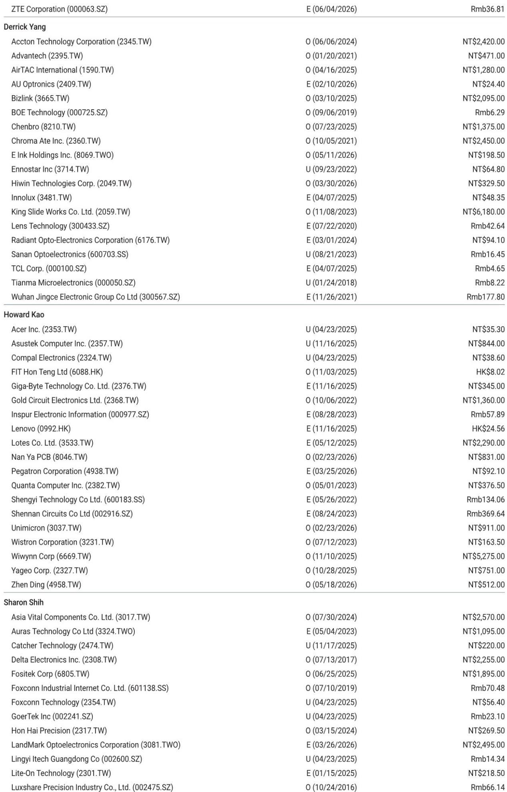
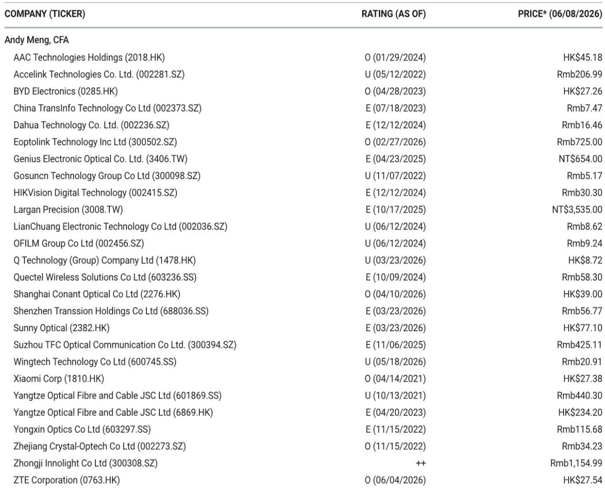
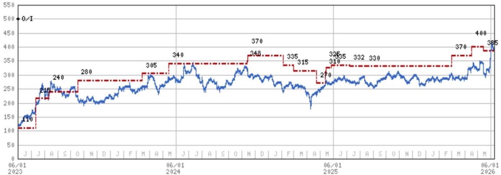

# The AI Rack Build-Out Is Not Peaking, But Its Center of Gravity Is Shifting

The narrative that the artificial intelligence infrastructure build-out is reaching a plateau is premature. In May 2026, the three major original design manufacturers in Taiwan shipped approximately 7,700 GB200 and GB300 NVL72-equivalent racks, a figure that, while down 7% month-over-month, still represents an annualized run rate that would exceed 90,000 units. The headline decline obscures a more consequential development: the market share distribution among ODMs is shifting in ways that reveal which companies are gaining pricing power, which are absorbing margin pressure, and where the next bottlenecks in the supply chain will emerge. The story of May 2026 is not about a demand slowdown. It is about a rebalancing of production that will determine which suppliers capture the most value in the second half of the year.

The data from a major investment bank's tracking of rack shipments provides a granular window into a market that many observers still treat as monolithic. Hon Hai shipped approximately 3,300 racks, maintaining its position as the volume leader but experiencing an 11% month-over-month decline. Quanta shipped 1,800 to 1,900 racks, down from approximately 2,100 in April. Wistron, by contrast, shipped 1,300 to 1,400 rack equivalents, posting a 2% month-over-month increase. These diverging trajectories matter because they are not random. They reflect deliberate strategic choices about which customers to serve, which product configurations to prioritize, and how much capacity to allocate to the highest-margin segments of the AI server market.

The most important insight from the May data is that the market is not experiencing a uniform deceleration. The month-over-month decline is concentrated in two players, and the underlying reasons are different for each. For Hon Hai, the drop appears to reflect a shift in customer mix and a potential rebalancing of orders between the GB200 and GB300 platforms. For Quanta, the decline is more clearly tied to a temporary production adjustment that the bank's analysts expect to reverse in the second half of the year, with full-year estimates unchanged at approximately 18,700 racks. The pattern suggests that the market is entering a phase where quarterly volatility will increase, but the annual trajectory remains strongly upward.

## The May Decline in Rack Shipments Is a Pause, Not a Pivot, and It Reveals Which ODMs Are Gaining Structural Advantage

A 7% month-over-month decline in aggregate shipments would normally raise questions about end-demand softening. In this context, it should not. The bank's analysts continue to forecast 70,000 to 80,000 racks for the full calendar year 2026, representing more than 100% year-over-year growth from approximately 29,000 racks in 2025. The May decline appears to be a timing issue, not a demand issue. Quanta's second-quarter shipments are now expected to come in at approximately 6,700 units, slightly below prior estimates, with the shortfall pushed into the second half. This is a production scheduling adjustment, not a sign that hyperscalers are cutting orders.

The more significant signal is the divergence in performance among the three major ODMs. Hon Hai's 11% month-over-month decline is the largest in percentage terms, and it comes after a period where the company had been gaining share aggressively. Hon Hai's dominance in 2025, when it held approximately 51% of the GB200 and GB300 rack supply, was built on scale and customer relationships that spanned multiple hyperscaler accounts. But the May data suggests that maintaining that share at the highest volumes is becoming more difficult. The question is whether this is a temporary fluctuation or the beginning of a structural shift toward a more balanced distribution among suppliers.

Wistron's 2% month-over-month increase, by contrast, is notable precisely because it happened during a month when the other two major players declined. Wistron's revenue for May was NT$290 billion, up 2% month-over-month and 39% year-over-year. The growth was driven by higher computing tray shipments from its subsidiary Wiwynn, which saw revenue increase 2% month-over-month to NT$84.1 billion. Wistron is not trying to win on volume alone. It is positioning itself to capture the highest-value segments of the rack assembly process, and the May data suggests that strategy is working.

## Wistron's Computing Tray Strategy Is a Bet on Vertical Integration That Will Reshape Margin Dynamics Across the Supply Chain

The distinction between a computing tray and a fully assembled rack is critical to understanding why Wistron's trajectory differs from its peers. The bank's analysts explicitly note that their rack-equivalent figures for Wistron include computing tray shipments at the L10 level, without accounting for the additional time required for rack assembly and testing at the L11 level. This means that Wistron's reported numbers may overstate the number of fully finished racks delivered to end customers, but they also understate the value of the components that Wistron is producing.

Computing trays are the core processing units within an AI rack. They contain the GPUs, the interconnects, and the cooling systems that determine the rack's performance. By focusing on computing tray production, Wistron is positioning itself to capture the highest-margin portion of the assembly process, while potentially leaving the lower-margin rack integration work to other players. This is a deliberate strategic choice that mirrors what happens in other technology supply chains when a product transitions from early-stage scarcity to volume production. The early leaders in volume often find their margins compressed as competition intensifies, while suppliers that focus on the most technically complex components can maintain or even expand their margins.

The implication for investors is straightforward. The ODM that wins on volume may not be the ODM that wins on profitability. Hon Hai's scale advantage is real, but it comes with exposure to pricing pressure from hyperscalers who have significant bargaining power. Wistron's smaller scale, combined with its focus on computing trays and its ownership of Wiwynn, gives it a different risk profile. The bank's analysts express a preference for Wistron based on upside to price target, and the May data supports that view. Wistron is not trying to beat Hon Hai on volume. It is trying to beat Hon Hai on margin.

## The Second-Half Ramp Will Test Whether the Supply Chain Can Absorb the Push-Out Without Creating New Bottlenecks

The bank's analysts expect Quanta's second-quarter shipments to come in at approximately 6,700 units, down slightly from prior estimates, with the shortfall pushed into the second half. This is a manageable adjustment, but it raises a question that the current data does not fully answer. If multiple ODMs are pushing shipments from the second quarter into the second half, will the supply chain be able to handle the concentration of demand in the third and fourth quarters?

The second half of 2026 is already expected to see a significant acceleration in shipments. The bank's full-year forecast of 70,000 to 80,000 racks implies that the second half will need to account for roughly 55% to 60% of total annual volume, given that the first half is tracking at approximately 30,000 to 35,000 units. The push-out from Quanta and the potential for similar adjustments at other ODMs could increase that concentration further. This creates a risk that the supply chain, which has been operating at high utilization rates, could face capacity constraints in the third quarter.

The bottlenecks are unlikely to be in the rack assembly itself. The ODMs have been adding capacity aggressively, and the month-over-month declines in May suggest that they have headroom. The bottlenecks are more likely to appear in the component supply chain, particularly in areas like high-bandwidth memory, advanced cooling solutions, and power management components. The GB300 platform, which is expected to ramp in the second half, introduces additional complexity because it requires new thermal and power architectures. If component suppliers cannot keep pace with the second-half ramp, the ODMs may find themselves with excess rack assembly capacity but insufficient components to fill it.

This is the risk that the current data does not fully illuminate. The bank's estimates for full-year shipments are based on the assumption that the component supply chain will be able to support the second-half ramp. That assumption is reasonable, but it is not guaranteed. Investors should watch for signs of component shortages, extended lead times, or price increases in the memory and cooling segments as leading indicators of whether the second-half ramp is on track.

## The Diverging Trajectories of Hon Hai and Quanta Raise Questions About Customer Concentration and Platform Transition Risk

Hon Hai's 11% month-over-month decline and Quanta's 14% decline from April to May are both notable, but they may have different root causes. Hon Hai's decline could reflect a shift in customer mix if one of its major hyperscaler customers is transitioning from the GB200 to the GB300 platform faster than expected. Platform transitions typically create a temporary dip in shipments as production lines are reconfigured and new components are qualified. If this is what is happening at Hon Hai, the decline in May could be followed by a strong recovery in June and July.

Quanta's decline, by contrast, appears to be more clearly tied to a specific production adjustment. The bank's analysts note that Quanta's May revenue was NT$311.5 billion, down 8% month-over-month, and they attribute the decline primarily to lower GB200 and GB300 rack shipments. The fact that Quanta's notebook shipments were flat month-over-month at 3.5 million units suggests that the decline was concentrated in the AI server business, not in the company's traditional PC operations. This is consistent with a production push-out rather than a demand issue.

The divergence between the two companies highlights a risk that is often overlooked in discussions of AI infrastructure. Customer concentration in the hyperscaler market means that any single customer's ordering pattern can have a disproportionate impact on an individual ODM's quarterly results. Hon Hai serves a broader set of customers than Quanta, which may make it more resilient to any single customer's platform transition, but it also means that Hon Hai's results are more exposed to the aggregate ordering patterns of the largest hyperscalers. Quanta, by virtue of having a more concentrated customer base, may experience more volatility in its quarterly shipments, but it may also have deeper relationships with its key customers that allow it to recover more quickly from temporary disruptions.

## The Decision Framework for Investors Must Shift from Volume Growth to Margin Sustainability and Platform Positioning

The May data provides a useful lens for rethinking how to evaluate the ODM space. The first phase of the AI infrastructure build-out, which ran from late 2024 through early 2026, was characterized by rapid volume growth and relatively undifferentiated demand. All three major ODMs benefited from the surge, and the investment thesis was essentially a bet on the overall market growth rate. That phase is ending. The second phase, which is now beginning, will be characterized by market share battles, platform transitions, and margin differentiation.

The key questions that investors should ask are not about total industry shipments. They are about which ODM has the best positioning for the GB300 platform, which ODM has the most diversified customer base, and which ODM has the highest exposure to the highest-margin components. The bank's analysts have expressed a clear preference order: Wistron, then Hon Hai, then Quanta. The May data supports that ordering, but it also suggests that the ranking could change as the year progresses.

For Hon Hai, the risk is that its volume leadership comes at the expense of margin. The company's scale gives it bargaining power with component suppliers, but it also makes it a target for hyperscalers who want to drive down assembly costs. If Hon Hai's margins come under pressure in the second half, its stock may not fully reflect the volume growth.

For Quanta, the risk is that its customer concentration leaves it exposed to the ordering patterns of a few hyperscalers. The company's full-year estimate of 18,700 racks implies a strong second half, but that estimate depends on its key customers maintaining their build-out schedules. Any delay in those customers' deployment plans would have an outsized impact on Quanta's results.

For Wistron, the risk is that its computing tray strategy works too well. If the company becomes the dominant supplier of computing trays for the GB300 platform, it may find itself capacity-constrained, unable to meet demand, and forced to choose between turning away customers and investing in expensive capacity expansion. That is a high-quality problem to have, but it is a problem nonetheless.

## The Full Picture Requires Granular Data That Goes Beyond Aggregate Shipment Numbers

The May data from the bank's report is valuable, but it is also incomplete in ways that matter for investment decisions. The report provides aggregate shipment numbers for each ODM, but it does not break down those numbers by customer, by platform (GB200 versus GB300), or by product type (computing tray versus full rack). These details matter because they determine the margin profile of each ODM's business and the sustainability of its competitive position.

For example, if Hon Hai's decline in May was driven by a shift from GB200 to GB300 production, that would be a positive signal, because the GB300 platform is expected to have higher average selling prices and potentially higher margins. If the decline was driven by a customer reducing orders, that would be a negative signal. The aggregate data does not distinguish between these two scenarios, and the difference is critical for valuation.

Similarly, the report does not provide visibility into the order books for the second half of the year. The bank's analysts have made estimates based on their industry contacts and their understanding of the hyperscalers' deployment plans, but those estimates are subject to revision. The key unknown is whether the second-half ramp will be as strong as the estimates imply, or whether the push-out from the second quarter will be followed by further delays.

Join the community to read the full report and review the original charts.

*This article is for learning and discussion only and does not constitute investment advice.*

Personal reading notes and learning share only. Not investment advice.

