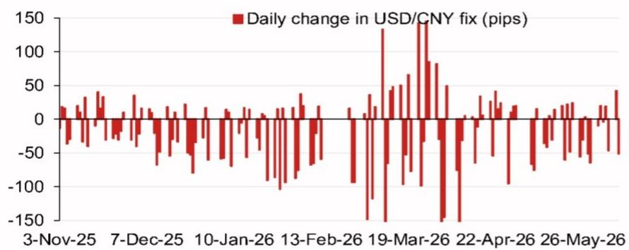
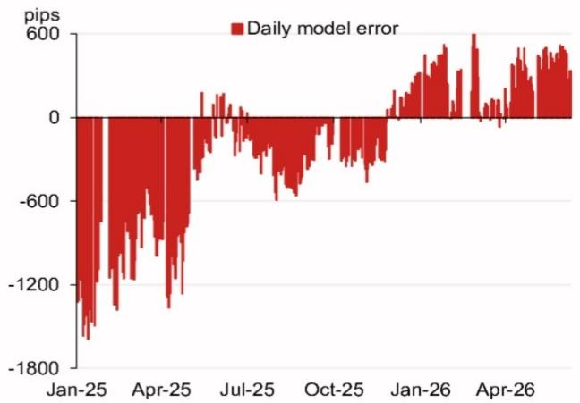

# The USD/CNY Fix Model Is Signaling a Regime Shift, Not Just a Technical Adjustment

Every trading day, the People's Bank of China sets a daily fixing rate for the yuan against the dollar, and for most market participants, this number is simply a reference point. For those who trade Asian foreign exchange professionally, it is the single most important signal of policy intent. A global investment bank's latest USD/CNY fix model projects a fixing of 6.7775, a remarkable 372 pips lower than the previous projection of 6.8147. This is not a marginal tweak. It represents a structural recalibration of how the fixing mechanism is operating in the current environment.

The significance of this shift cannot be overstated. The model's projection, when adjusted for the counter-cyclical factor, lands at 6.7962, still 185 pips lower than the previous fix. This divergence between the raw model output and the adjusted figure tells a story: the authorities are allowing more two-way flexibility while maintaining a guardrail. The market has been conditioned to expect a gradual, managed depreciation path for the yuan. This projection challenges that consensus directly.

What makes this moment particularly consequential is the timing. We are approaching a period dense with political and economic events in China and the broader Asia-Pacific region. The July Politburo meeting, the APEC summit in Shenzhen, the Central Economic Work Conference, and a potential state visit by President Xi to the United States all fall within a six-month window. Each of these events carries implications for currency policy, and the fix model is already pricing in a shift in the underlying calculus.

The core argument here is straightforward: the fix model is not merely forecasting a lower level for USD/CNY. It is revealing a deliberate strategy by Chinese policymakers to reset expectations, reduce the one-way depreciation bias that has dominated the narrative, and prepare the currency for a more volatile and event-driven period ahead. Investors who treat this as a technical model output are missing the forest for the trees.

## The Fix Model's Projection Reveals a Deliberate Policy Signal, Not a Mechanical Forecast

The raw model projection of 6.7775 versus the previous 6.8147 represents a 372-pip downward adjustment. To understand why this matters, one must first understand what the fix model actually does. It is not a predictive algorithm in the conventional sense. It is a systematic framework that weights overnight movements in a basket of currencies, primarily the Australian dollar, the Korean won, the euro, and the Japanese yen, to estimate what the fixing should be if the PBOC were following a purely rules-based approach.

The top four weighted contributions to the projected change are instructive. The Australian dollar contributes 15.3 pips, the Korean won 12.3 pips, the euro 8.0 pips, and the Japanese yen 6.4 pips. This is not a random assortment. These currencies are the most liquid proxies for global risk appetite, commodity demand, and trade competition with China. When all four are moving in a coordinated direction, the fix model captures a broad-based shift in external conditions.

The critical insight is that the model's projection is lower than the previous fix, which means the basket of currencies is signaling that the yuan should be stronger relative to the dollar than where the PBOC has been setting the rate. This is the opposite of what most market participants would expect. The conventional wisdom has been that Chinese authorities are comfortable with a weaker yuan to support exports and offset tariff pressures. The model is telling us that the external environment is actually pushing in the other direction.

The so what here is profound. If the PBOC follows the model's signal, it would mark a departure from the recent pattern of fixing the yuan weaker than the model would suggest. The counter-cyclical factor, which is the adjustment the PBOC can apply to smooth volatility or lean against market momentum, reduces the gap to 185 pips. But even that adjusted figure is lower, not higher. The authorities are signaling that they see room for the yuan to appreciate, or at least to stabilize, in the near term.

## The Pattern of Model Errors Suggests the PBOC Has Been Deliberately Leaning Against Market Pressure

No model is perfect, and the fix model's errors over the past year tell a story of their own. The data shows that daily model errors, the difference between what the model projects and what the PBOC actually fixes, have been large and persistent. In January 2025, the error was approximately minus 1800 pips. By April 2025, it was minus 1200 pips. The error narrowed to near zero by July 2025, then widened again to minus 600 pips in October 2025, before swinging positive to plus 600 pips in both January and April 2026.

This pattern is not random noise. It is a deliberate policy choice. When the error is negative, meaning the actual fix is weaker than the model would suggest, the PBOC is leaning against appreciation pressure. When the error is positive, it is leaning against depreciation pressure. The large negative errors in early 2025 occurred during a period of significant dollar strength and global risk aversion. The PBOC chose to fix the yuan weaker than the model implied, effectively absorbing some of the depreciation pressure to prevent a disorderly move.

The swing to positive errors in early 2026 is the critical development. The model has been projecting a weaker fix than what the PBOC has actually delivered. This means the authorities have been resisting depreciation, not encouraging it. The positive error of 600 pips in both January and April 2026 is a clear signal that the PBOC views the yuan as undervalued relative to where a pure basket-based approach would place it.

The implication for investors is clear: the PBOC is not in a passive depreciation mode. It is actively managing the fix to prevent the yuan from weakening too far, too fast. This is consistent with a broader strategy of maintaining stability ahead of major political events. The July Politburo meeting, the APEC summit, and the Central Economic Work Conference all require a stable currency backdrop. The model errors are telegraphing this intention.

## The Daily Fix Changes Reveal a Market That Is Both Calm and Vulnerable to Sudden Shifts

Examining the daily changes in the USD/CNY fix over the past six months reveals a striking pattern of extended calm punctuated by occasional sharp moves. From November 2025 through February 2026, the daily change in the fix was zero pips on the majority of days. This is extraordinary. In normal market conditions, the fix moves by a few pips each day to reflect overnight developments. A prolonged period of zero change indicates an active decision by the PBOC to hold the line.

Then, on March 19, 2026, the fix changed by 150 pips in a single day. This is a large move by historical standards, and it broke the pattern of stability. The question is whether this was a one-off adjustment or the beginning of a new trend. The data after that date shows a return to zero daily changes, suggesting the authorities wanted to signal that the March move was a recalibration, not a regime change.

The strategic significance of this pattern is that it creates a market dynamic where complacency builds during periods of stability, and the risk of a sudden adjustment increases. Traders who have become accustomed to zero daily changes may be caught off guard when the fix moves again. The PBOC has historically used this tactic of extended calm followed by surprise adjustments to manage expectations and prevent speculative positioning.

For portfolio managers and corporate treasurers with yuan exposure, this pattern demands a different approach to risk management. The assumption that the fix will remain stable for extended periods is dangerous. The PBOC has demonstrated that it can and will move the fix by a significant amount when it judges the timing is right. The 150-pip move on March 19 should be seen as a warning shot, not an anomaly.

## The Calendar of Events Creates a Decision Framework for Positioning Ahead of Known Catalysts

The fix model is a quantitative tool, but its implications must be interpreted through a qualitative lens. The calendar of upcoming events in China provides the framework for understanding when and why the PBOC might adjust its fixing strategy. The July Politburo meeting, the APEC summit in Shenzhen, the Central Economic Work Conference in December, and the potential Xi-Trump meeting all represent inflection points.

For each of these events, the PBOC has a clear incentive to maintain currency stability. A sharp depreciation ahead of the APEC summit would undermine China's message of economic openness and cooperation. A sharp appreciation ahead of the Central Economic Work Conference could signal a policy tightening that the government does not want to telegraph prematurely. The fix model is capturing the tension between these competing objectives.

The decision framework for investors should be as follows. First, assess the current positioning of the fix relative to the model projection. The model is signaling that the yuan should be stronger. If the PBOC follows the model, the fix will move lower, meaning USD/CNY will decline. Second, evaluate the proximity of major events. The closer we get to the July Politburo meeting, the more likely the PBOC is to maintain stability rather than introduce new volatility. Third, monitor the daily change in the fix. A return to zero daily changes after the March move would suggest the PBOC is comfortable with the current level. A new large move would indicate a shift in policy.

The unanswered question is whether the PBOC will allow the fix to converge toward the model's projection or whether it will continue to apply the counter-cyclical factor to maintain a buffer. The model projection with the counter-cyclical factor is 6.7962, still 185 pips lower than the previous fix. This gap represents the PBOC's discretion. If the authorities choose to close the gap, it will be a bullish signal for the yuan. If they maintain the gap, it suggests they are still cautious about allowing too much appreciation.

## What the Report Does Not Fully Answer: The Missing Link Between the Fix and Capital Flows

The fix model is an elegant tool for understanding the daily mechanics of the yuan fixing, but it leaves a critical question unanswered. How does the fix relate to the broader capital account dynamics? The fix is the anchor for the onshore yuan, but the offshore yuan, traded in Hong Kong and other centers, can diverge significantly. The relationship between the fix, the onshore spot rate, and the offshore rate is not fully captured by the model.

The report provides the tools to analyze the fix but does not address the capital flow implications. If the PBOC fixes the yuan stronger, does that encourage capital inflows or outflows? The conventional wisdom is that a stronger currency attracts inflows, but in the current environment of global trade tensions and tariff uncertainty, the relationship may be inverted. A stronger fix could be interpreted as a sign of confidence, but it could also be seen as a headwind for exports.

Another missing piece is the role of the counter-cyclical factor itself. The model provides a projection with and without this adjustment, but it does not explain the criteria the PBOC uses to determine the size of the factor. Is it based on volatility, on the pace of change in the currency, or on broader macroprudential considerations? Without understanding the decision rule, investors are left guessing about the PBOC's reaction function.

Finally, the report does not address the interaction between the fix and the broader monetary policy stance. If the PBOC is fixing the yuan stronger, does that imply a tighter monetary policy, or is it simply a currency management tool independent of interest rate policy? The answer to this question has significant implications for bond yields and credit markets, not just for the foreign exchange market.

## Join the Community to Read the Full Report and Review the Original Charts

The fix model provides a window into the PBOC's thinking, but it is only one piece of a larger puzzle. The full report includes detailed charts of the model's performance over time, the evolution of the counter-cyclical factor, and the historical relationship between the fix and subsequent spot market movements. These charts are essential for any investor who wants to build a systematic framework for trading or hedging the yuan.

The analysis presented here has deliberately left several questions open. How will the fix behave during the APEC summit period? Will the PBOC allow the model error to remain positive, or will it revert to negative as it did in early 2025? What is the threshold for the PBOC to intervene in the spot market, as opposed to adjusting the fix? These are not academic questions. They have direct implications for portfolio returns and risk management.

For those who want to go deeper, the original research report contains the full dataset, the model methodology, and the analyst commentary that provides context for the numbers. The charts, in particular, are valuable because they show the evolution of the model's inputs and outputs over time, allowing readers to form their own judgment about the PBOC's strategy.

Join the community to read the full report and review the original charts. The fix model is a powerful tool, but it is most useful when combined with the qualitative analysis that only comes from engaging with the full research.

*This article is for learning and discussion only and does not constitute investment advice.*

Personal reading notes and learning share only. Not investment advice.

