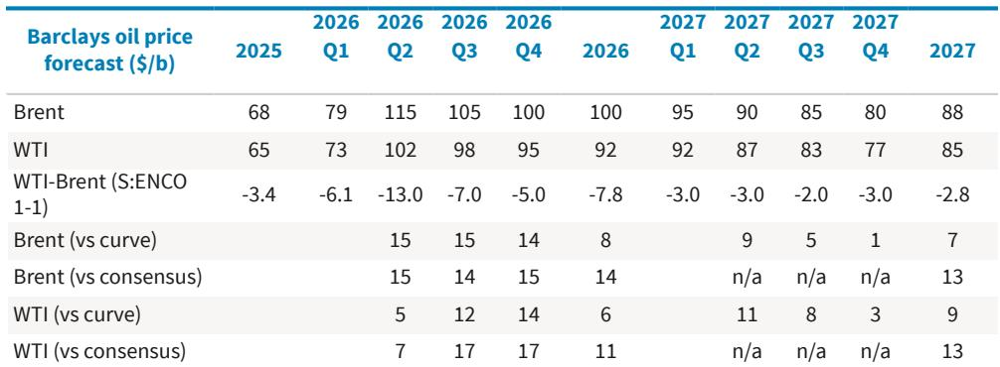
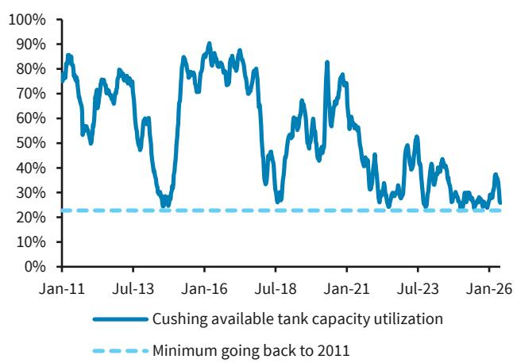
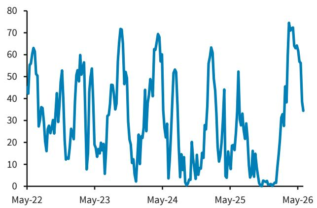

# The Market Is Misreading Oil: Why $100 Brent Is Not a Bubble but a Structural Floor

The consensus view that oil at $100 per barrel is a temporary geopolitical spike is wrong. It is not a spike. It is a signal. A global investment bank report projecting Brent at $100 per barrel for 2026 and $88 per barrel for 2027 is not making a bullish call on geopolitics. It is making a structural argument about supply, demand, and the limits of spare capacity that the market has systematically underpriced. The forward curve at the time of writing was $9 and $7 below these forecasts, respectively, which means the market is still pricing in a return to the old equilibrium that no longer exists.

The Strait of Hormuz remains largely closed, yet managed money positioning in oil futures has retreated to pre-war levels, and implied volatility has collapsed. This is not a sign of market calm. It is a sign of cognitive dissonance. Investors have normalized a disruption that has no historical precedent in duration or magnitude. The report argues that fundamentals have grown into the initial hype, but the pace has been slower than expected. That slower pace is itself a critical insight. It means the market is absorbing a 7 million barrel per day deficit without panic, but also without building any buffer.

The thesis is not about geopolitics. It is about the structural tightening of the global oil system, the surprising behavior of Chinese demand, and the hidden fragility of U.S. commercial inventories. The report makes a clear argument: this is not a new equilibrium, but the path back to the old equilibrium is longer and more expensive than the market believes. The following sections unpack why that matters, what the report reveals, and what it leaves unanswered.

## The Market Has Normalized a Disruption That Has No Historical Precedent, and That Is the Real Risk

The most striking data point in the report is not the price forecast. It is the behavior of market participants. Managed money positioning in Brent and WTI futures and options combined has fallen back to the 50th percentile, essentially where it was before the conflict began. Implied volatility in oil markets, measured as the OVX minus VIX spread, has also reverted to pre-war levels. On the surface, this looks like a market that has priced in the disruption and moved on.

But this is exactly the wrong interpretation. The Strait of Hormuz remains largely closed. The global oil market is running a deficit of roughly 7 million barrels per day, based on observed inventory draws of 4.5 million barrels per day adjusted for historical beta. That is a massive imbalance by any standard. The fact that the market is not pricing this in suggests a dangerous complacency. Investors are treating the current situation as a known unknown that will resolve quickly, when in fact the timeline for resolution is deeply uncertain and the consequences of a prolonged closure are severe.

The report lays out two alternative scenarios. If the Strait normalizes by the end of July, Brent averages $105 in 2026 and $95 in 2027. If it normalizes by the end of August, those numbers rise to $110 and $105. The base case of $100 and $88 assumes normalization by the end of this month. Every month of delay adds roughly $5 to the 2026 average and a similar amount to 2027. This is not a linear extrapolation. It reflects the compounding effect of inventory depletion, the erosion of spare capacity, and the increasing difficulty of restarting supply chains that have been disrupted for months.

The real risk is not that the market is wrong about the price. It is that the market has stopped worrying about the wrong thing. The consensus view is that the Strait will reopen soon, and when it does, a glut will emerge. That may be true. But the timing is everything, and the market is not pricing in the cost of being wrong about timing.

## The Apparent Weakness in Chinese Demand May Be Strategic Stockpiling, Not a Structural Shift

The biggest surprise relative to the scenarios laid out in late March is the sharp decline in Chinese oil demand. In April, demand was down 12 percent year on year, though the first four months of 2026 were still up 2 percent. Most market participants have interpreted this as evidence of higher-than-expected price elasticity of demand. The argument is that Chinese consumers and industry are responding to higher prices by cutting consumption, and that this will act as a natural brake on the market.

The report offers a different hypothesis. Visible crude oil inventories in China have been largely unchanged since the conflict began, while inventories everywhere else have been declining rapidly. This is anomalous. If Chinese demand were truly falling, you would expect to see a build in visible inventories. Instead, they are flat. The report suggests that China may be conserving supplies for a scenario in which the Strait remains closed for much longer than most expect. This is not a demand story. It is a precautionary stockpiling story.

The implications are significant. If China is deliberately restraining consumption to build a strategic buffer, then the demand weakness is not a structural shift that will persist after the Strait reopens. It is a temporary adjustment that will reverse as soon as the risk premium declines. When that happens, the market could face a sudden surge in Chinese demand at a time when inventories are already depleted. The report does not prove this hypothesis, but it raises a question that the market has not adequately considered: What if the apparent demand destruction is actually demand deferral?

## U.S. Commercial Crude Inventories Are at a Critical Inflection Point That the Market Is Ignoring

The report provides a long-term perspective on U.S. commercial crude inventories that is genuinely alarming. Since 2008, commercial inventories have declined by 323 million barrels, adjusting for the drawdown in the Strategic Petroleum Reserve and the increase in pipeline fills. For perspective, commercial inventories stood at 301 million barrels at the end of 2008. The current level is essentially the same, but the context is completely different.

The report highlights two key metrics. First, U.S. commercial crude inventories in days of refining demand, adjusted for pipeline fills, would breach the 20-year minimum in eight to ten weeks at the recent pace of decline. Second, storage capacity utilization at Cushing, Oklahoma, the pricing hub for WTI, is within sight of the lowest level since 2010. These are not abstract data points. They are operational constraints that could force physical market dislocations.

When inventories fall below minimum operating levels, the market does not just see higher prices. It sees backwardation so extreme that it becomes uneconomical to hold inventory. It sees refinery runs cut because feedstock is unavailable. It sees price spikes that are disconnected from any fundamental model. The report does not forecast a specific date for this scenario, but the trajectory is clear. The U.S. crude system is on a path to mechanical failure, and the market is not pricing that risk.

The report also notes that even with the UAE fully utilizing its spare capacity, demand growth is still expected to outpace non-OPEC supply growth in 2027. This is a structural statement about the limits of supply growth. The U.S. has driven the majority of global supply growth for years, but that engine is running out of steam. The Permian Basin is mature. The inventory of drilled but uncompleted wells is dwindling. The capital discipline that has defined the post-2020 era is not going away. The market is relying on a supply response that may not materialize at the scale required.

## The Report Leaves Open the Question of What Happens After the Strait Reopens, and That Is the Most Important Unknown

The report is explicit that this is not a new equilibrium. The Strait cannot remain closed in perpetuity with oil at $100. But the report also acknowledges that its own balances show a large surplus for 2027 based on the assumption that the Strait normalizes by the end of this month. This creates a tension. If the surplus is so large, why are the 2027 forecasts still at $88, which is well above the pre-crisis average?

The answer is that the surplus is conditional on timing. If the Strait reopens in June, the market will have time to rebuild inventories before the demand cycle turns. But if the reopening is delayed by even one month, the inventory deficit becomes much harder to close. The report does not model this explicitly, but the logic is clear. The longer the disruption lasts, the more structural damage is done to the supply chain, and the higher the equilibrium price becomes even after the Strait reopens.

There is also the question of what happens to OPEC+ strategy after the crisis. The report does not address this, but it is a natural extension. If the Strait reopens and inventories are still low, OPEC+ will have an incentive to keep prices high by restraining output. If inventories are high, the opposite is true. The report's base case implies that the surplus is manageable, but it does not explore the political economy of the post-crisis period. That is a meaningful gap.

Another open question is the role of financial positioning. The report notes that managed money has retreated, but it does not explain what would cause that positioning to return. If the Strait reopens and prices fall, speculative shorts could accelerate the decline. If the Strait remains closed and inventories continue to fall, speculative longs could trigger a parabolic move. The market is currently in a state of low conviction, which means any catalyst could produce outsized volatility.

## A Decision Framework for Investors: Three Scenarios and the Key Variables to Watch

The report provides enough data to construct a simple but robust decision framework. Investors should focus on three variables: the timing of Strait normalization, the trajectory of Chinese demand, and the level of U.S. commercial inventories.

The first variable is the most binary. If the Strait reopens by the end of June, the base case holds. If it extends to July, add $5 to the 2026 average. If it extends to August, add $10. The report provides these numbers explicitly. The key is to update the probability of each scenario based on real-time news, not on the forward curve.

The second variable is more subtle. Watch Chinese crude imports and visible inventory data. If inventories remain flat while imports decline, the stockpiling hypothesis is confirmed. If inventories start to build, the demand destruction hypothesis is confirmed. The difference matters because it determines whether the demand weakness is temporary or structural.

The third variable is the most mechanical. Track U.S. commercial crude inventories in days of refining demand. When that metric approaches the 20-year minimum, the market will be forced to reprice. The report estimates that this will happen in eight to ten weeks at the current pace. That is a concrete timeline that investors can monitor.

The report also implies a fourth variable that is harder to quantify but equally important: the behavior of non-OPEC supply growth. If U.S. production begins to decline, the surplus disappears. If it holds steady, the surplus materializes. The report does not provide a forecast for U.S. production, but it notes that demand growth is expected to outpace non-OPEC supply growth in 2027. That is a directional statement that should inform long-term positioning.

## The Full Report Contains the Charts That Make the Argument Visual, and the Data That Makes It Actionable

The analysis above draws on the report's core insights, but the full report includes the charts that bring these arguments to life. The positioning data, the inventory trends, the price forecasts, and the scenario analysis are all presented in visual form. For serious investors, seeing the data is not optional. It is essential.

The report also contains the detailed supply-demand balances that underpin the forecasts. These are not summary tables. They are the building blocks of the argument. Understanding the assumptions about OPEC+ output, non-OPEC growth, and demand elasticities is necessary to stress-test the conclusions.

Join the community to read the full report and review the original charts.

*This article is for learning and discussion only and does not constitute investment advice.*

Personal reading notes and learning share only. Not investment advice.

