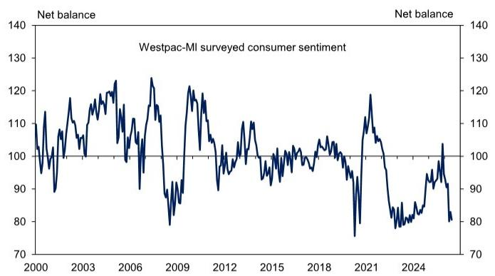

# GS：澳大利亚消费者信心连续三个月低迷，但市场真正该关注的不是情绪本身

澳大利亚消费者信心指数在6月进一步下滑至80.6，较历史均值低约20%。这已经是连续第三个月处于极弱水平。GS最新研报披露了这一数据，但真正值得投资者警觉的，并非情绪本身有多差，而是情绪低迷正在从“可被忽略的噪音”转变为“可能自我实现的经济拖累”。

过去两年，澳大利亚央行一直认为消费者信心与消费行为之间的关联有限。但GS在报告中引用央行的最新表述时留下了一个关键的伏笔：当情绪低迷持续足够久，且伴随资产价格下跌时，它可能开始产生实质性的二阶效应。6月的数据恰好提供了这种转变的初步证据——家庭财务状况感知全面恶化，住房价格预期三年来首次跌破长期均值，悉尼和墨尔本的跌幅尤其显著。

这份报告的价值不在于告诉你“消费者不开心”，而在于它揭示了一个正在形成的反馈循环：信心疲弱正在抑制住房市场，住房市场走弱反过来进一步打击信心。这个循环是否会被打破，取决于接下来的劳动力市场走势和央行的政策路径。

## 1. 家庭财务状况感知全面恶化，这是比整体指数更危险的信号

整体信心指数下降2.9%固然值得关注，但更值得细看的是分项数据。GS报告显示，家庭对当前财务状况的感知环比下降7.5%，对未来一年的财务预期更是暴跌8.5%。这两个分项同时恶化，意味着消费者不仅在抱怨当下，更在提前调低对未来的预期。

这里有一个重要的结构性差异：长期经济前景预期虽然也下降了3.2%，但一年期经济预期反而回升了4.9%。这种“短期经济预期改善、家庭财务预期恶化”的分化，实际上指向了一个更具体的担忧——消费者并不认为宏观经济会崩溃，但他们认为自己的钱包正在被挤压。换句话说，这是一种“我比经济更难过”的微观体感，这种体感一旦形成，往往比宏观悲观更难逆转。

对于关注澳大利亚消费类资产和零售行业的投资者而言，这意味着：即使GDP数据没有大幅走弱，消费行为也可能提前收紧。家庭财务感知是预测消费倾向的领先指标，而非滞后指标。

## 2. 住房市场信心正在经历三年来最严峻的考验

GS报告中最引人注目的数据点之一是：澳大利亚居民房价预期环比暴跌14.9%，三年来首次低于长期均值。分州来看，悉尼和墨尔本的跌幅最为惨烈，分别达到19%和18%，而这两个城市恰好也是实际房价已经在下行的地区。

这里需要厘清一个因果关系：是实际房价下跌导致了预期恶化，还是预期恶化加速了实际房价下跌？GS没有给出明确的归因，但报告提供了另一个值得玩味的数据——“购房时机”指数在经历了5月的急剧下滑后，6月反弹了12.6%。这个反弹与房价预期的大幅下跌形成鲜明对比，意味着部分潜在购房者可能认为价格回调创造了入场机会。

这种“想买但不敢买”的矛盾心理，恰恰是市场处于转折点的典型特征。对于房地产开发商、银行按揭部门和REIT投资者来说，这意味着：短期内交易量可能继续低迷，但价格调整速度可能快于市场共识。如果价格下跌足够快，反而可能提前触发行情企稳。

## 3. 央行对“情绪-消费”传导机制的看法正在微妙变化

GS在报告中特意引用了澳大利亚央行的一个关键判断：过去的研究发现，情绪对消费的独立驱动作用有限，但“如果情绪的大幅变化持续存在，可能会产生更显著的影响”。这句话的潜台词值得反复咀嚼。

过去两年，央行一直用“情绪不等于行为”来安抚市场，认为消费者信心低迷不会自动转化为消费收缩。但连续三个月的极弱数据，加上住房市场信心的系统性恶化，正在挑战这一假设。GS报告虽然没有明确质疑央行的框架，但通过引用央行自身的条件性表述，实际上在提醒读者：这个假设的适用边界可能正在接近。

对于利率市场参与者来说，这意味着：如果后续消费数据出现超预期疲软，央行可能比市场预期的更快调整政策立场。当前市场定价中隐含的降息路径可能低估了这种风险。

## 4. 报告没有完全回答的关键问题：劳动力市场何时成为下一个多米诺骨牌

GS这份报告对消费者信心和住房市场的分析相当透彻，但它留下了一个尚未回答的关键问题：劳动力市场的韧性还能维持多久？

报告显示，失业预期在6月几乎没有变化，仅下降0.1%。这说明到目前为止，消费者对就业前景仍然相对乐观。但问题在于，住房市场走弱和消费信心恶化通常会在6-12个月的滞后后传导至劳动力市场。如果住房价格继续下跌，建筑和相关服务业的就业将首当其冲，进而通过收入渠道放大消费收缩。

GS没有在报告中展开这个二阶效应，但对于试图判断澳大利亚经济走向的投资者来说，这才是未来6-12个月最需要跟踪的变量。劳动力市场数据将是验证“情绪低迷是否会演变为经济放缓”的关键试金石。

## 5. 投资者的观察框架：从“情绪数据”转向“行为数据”

基于GS这份报告的逻辑，投资者不应简单地将消费者信心指数视为一个独立的交易信号，而应建立一套从情绪到行为的跟踪框架：

第一，关注家庭财务感知分项的持续性。如果连续两个月以上维持在恶化区间，消费数据出现超预期下行的概率将显著上升。

第二，跟踪住房价格预期与实际房价的收敛速度。当前预期远低于实际价格，如果实际价格开始加速追赶预期，意味着调整正在深化；如果预期开始修复，则可能意味着市场底部正在形成。

第三，将悉尼和墨尔本的信心数据作为领先指标。这两个城市在房价预期跌幅上领先全国，它们的信心修复节奏将是判断全国趋势的重要参考。

第四，警惕“情绪-消费-就业”的负反馈循环。一旦失业预期开始上升，目前的信心低迷就可能从“可容忍的疲弱”升级为“需要政策回应”的系统性风险。

GS的这份报告提供了一个清晰的信号：澳大利亚消费者信心的恶化已经不再是简单的周期性波动，而是正在形成结构性的负面反馈。但真正的拐点何时到来，取决于劳动力市场能否继续吸收来自住房和消费领域的压力。

这份研报还包含了对各州数据的详细对比、按收入分组的信心差异分析，以及GS对澳大利亚央行政策路径的最新预测——这些内容因为篇幅原因无法在这里一一展开。如果你对完整报告感兴趣，或者想进一步讨论澳大利亚经济的后续走向，欢迎来星球微信群里继续交流。我们会在群内分享报告的原始图表和更多细节，也会定期组织对关键经济变量的跟踪讨论。

Personal reading notes and learning share only. Not investment advice.

