# Base Metals Supply & Demand Tracker

Chinese exports are the relief valve for ex-China aluminium tightness

## Copper:

- China's apparent and end-use copper consumption diverge markedly. Our consumption-weighted end-use indicator for Chinese copper demand declined by 4% yoy (now +1.2% yoy YTD through 4M26) amid continued weakness in renewables installations and white goods production (Figure 22). The slowdown comes despite continued strong grid demand, EV production and product exports which work to offset weakness in other sectors. At the same time, Chinese apparent consumption was remarkable in April (+9% yoy), with inventory draws boosting overall figures reflecting the level of inventory destock across the supply chain over the 4Q25/1Q26 buyers strike in China. More recently, drawing momentum in Chinese inventory has leveled off in recent weeks as copper prices have ranged between \$13,500-14,000/mt (Figure 23).  
- US tariff review forthcoming. Later this month, by June 30, 2026, the US Commerce Secretary is to provide the President with an update on whether additional Section 232 copper tariff modifications are necessary. Our view remains that it is more likely than not that the Trump administration will enact an escalating tariff as was laid out in last July's original executive order (i.e. starting at $15\%$ in 2027, increasing to $30\%$ a year later) to 1) ensure that all the copper that has already been imported into the US stays onshore and 2) keep this excess US inventory as a critical reserve, rather than enact policy which incentivizes it to quickly destock in the coming years. A continued strong import pull into the US in the coming quarters would continue to strain ex-US cathode supply, particularly over periods where China's import arb is also open.

## Aluminium:

- Chinese aluminium semis and finished product exports are the relief valve for ex-China tightness. As LME inventories continue to draw lower to 330 kmt, Chinese visible inventory levels are still sitting near multi-year highs at \~1.4 mmt. With the semis export arb from China to rest of Asia open and at attractive levels (Figure 72), we continue to expect strong exports out of China to accelerate weekly withdrawals from onshore aluminium inventory in China (Figure 53 & Figure 55). So far, in the last 6 weeks only around 90 kmt has been drawn from SHFE and regional warehouses in China as production levels have risen and imports of aluminum have remained firm, with drawing activity only picking up since mid-May.  
- Producers in China are reaping the rewards of higher aluminium prices. Refined production in China in April grew by 3.4% yoy, running at an annualized level of 45 mmt, contributing to YTD growth of \~4% yoy according to CRU (Figure 70). Chinese producers are currently highly incentivized to keep churning out production towards the limiting cap amid elevated aluminium prices. We continue to monitor for disruptions of bauxite exports from Guinea, as this could become a serious bottleneck for Chinese producers

## Global Commodities Research

## Gregory C. Shearer

(44-20) 7134-8161

gregory.c.shearer@JPM.com

JPM Securities plc

## Ali A. Ibrahim

(44-20) 3493-6438

ali.ibrahim@JPM.com

JPM Securities plc

## Ananyashree Gupta

(91-22) 6157 3627

ananyashree.gupta@jpmchase.com

JPM India Private Limited

Contents

<table><tr><td>Base Metals Supply &amp; Demand Tracker</td><td>1</td></tr><tr><td>Global demand indicators</td><td>3</td></tr><tr><td>China demand indicators</td><td>5</td></tr><tr><td>Copper</td><td>9</td></tr><tr><td>Aluminium</td><td>16</td></tr><tr><td>Zinc</td><td>21</td></tr><tr><td>Nickel</td><td>25</td></tr><tr><td>JPM metals price forecasts</td><td>28</td></tr></table>

as $75\%$ of the country's bauxite imports come from Guinea alone. While bauxite imports from Guinea were up by $13\%$ yoy in April, a sharp change here could eventually threaten Chinese output and potentially also influence Chinese policy around exports as domestic supply security becomes more critical.

## Zinc:

- Chinese concentrate imports cooled in April though refined output stayed strong. China's zinc concentrate imports fell by nearly $10\%$ yoy in April, as a lack of concentrate availability is beginning to emerge with spot TCs in China flipping to negative territory since the end of March. Smelter production, on the other hand, remained robust increasing by $5\%$ yoy in April, as smelters work through concentrate inventory following strong imports in 1Q26. Even tighter concentrate markets could eventually weigh on Chinese output, which remains a risk for a tighter than expected refined balance this year.  
- Subdued demand continues to show via elevated and stagnant visible inventory. Total SHFE + social warehouse inventories in China have stabilized near 264 kmt as galvaniser operating rates remain subdued and construction activity remains lifeless in China (Figure 76). Galvaniser demand continues to remain below the 5-yr average, while apparent demand is down by 12% yoy as of April (Figure 78& Figure 86).

## Nickel:

\- Visible inventory builds stagnate. While inventory on SHFE continues to rise, LME stocks modestly declined from a peak in February, leading to net inventory growth of 70 kmt YTD to a total inventory level of \~470 kmt. Meanwhile, Indonesia's policy framework is set to weigh on producer margins amid higher ore benchmarks, potentially weighing on refined output somewhat this year, though the market remains focused on any upcoming additions to Indonesia's ore quota into the summer.

## China demand indicators:

- China's grid investment remains solid as renewables remain under pressure. Following a sharp jump at the start of the year, April grid spend rose by $9\%$ yoy, resulting in $>30\%$ growth yoy on a ytd basis (Figure 5). However, renewable installations continue to stumble, coming off the rapid pace of installations in 1H2025. Solar installations in April decelerated to $\sim 9.5\mathrm{GW}$ in April, decreasing by $79\%$ yoy, while wind installations declined by $7\%$ yoy to 5.4GW (Figure 7 & Figure 8).  
- NEV production in China rebounded in April. Total EV and PHEV production through April in China rose by 4% yoy while EV sales increased by 2.5% yoy in April. US EV sales continued to struggle while other regions such as Europe saw healthy EV sales. Overall, global passenger vehicle sales decreased by 10% yoy in April, with China and US taking the biggest hit (Figure 1).  
- White goods demand stumbled in April. Our estimate for total aggregate white goods copper demand in China decreased by 3% yoy in April, driven by a 9% decline in AC production.

## Global demand indicators

Table 1: Global metals monthly price change heatmap  
Percent change, MoM & YoY

<table><tr><td></td><td>Global Metals Price Heatmap</td><td>May-25</td><td>Jun-25</td><td>Jul-25</td><td>Aug-25</td><td>Sep-25</td><td>Oct-25</td><td>Nov-25</td><td>Dec-25</td><td>Jan-26</td><td>Feb-26</td><td>Mar-26</td><td>Apr-26</td><td>May-26</td><td>2023</td><td>2024</td><td>2025</td><td>2026 YTD</td></tr><tr><td rowspan="16">Metals Prices</td><td>LME Copper</td><td>4.1%</td><td>3.9%</td><td>-2.6%</td><td>3.0%</td><td>3.7%</td><td>6.0%</td><td>2.8%</td><td>11.0%</td><td>5.9%</td><td>1.4%</td><td>-9.3%</td><td>5.3%</td><td>5.0%</td><td>2.2%</td><td>2.4%</td><td>41.7%</td><td>10.5%</td></tr><tr><td>LME Aluminium</td><td>1.9%</td><td>6.3%</td><td>-1.3%</td><td>2.0%</td><td>2.5%</td><td>7.6%</td><td>-0.6%</td><td>4.4%</td><td>5.0%</td><td>-0.1%</td><td>3.8%</td><td>0.2%</td><td>5.5%</td><td>0.3%</td><td>7.0%</td><td>17.4%</td><td>21.7%</td></tr><tr><td>LME Zinc</td><td>1.1%</td><td>5.0%</td><td>0.3%</td><td>2.1%</td><td>5.0%</td><td>3.2%</td><td>0.0%</td><td>2.0%</td><td>9.1%</td><td>-2.5%</td><td>-8.3%</td><td>4.2%</td><td>5.3%</td><td>-10.6%</td><td>12.1%</td><td>4.7%</td><td>14.5%</td></tr><tr><td>LME Nickel</td><td>-1.2%</td><td>-0.1%</td><td>-1.8%</td><td>3.2%</td><td>-1.2%</td><td>-0.1%</td><td>-2.6%</td><td>12.3%</td><td>7.9%</td><td>-0.6%</td><td>-5.0%</td><td>13.8%</td><td>-2.1%</td><td>-44.7%</td><td>-7.7%</td><td>8.6%</td><td>11.3%</td></tr><tr><td>LME Lead</td><td>0.0%</td><td>4.4%</td><td>-3.6%</td><td>1.0%</td><td>-0.1%</td><td>1.4%</td><td>-1.8%</td><td>1.5%</td><td>-0.1%</td><td>-2.3%</td><td>-3.5%</td><td>2.8%</td><td>3.1%</td><td>-9.8%</td><td>-5.6%</td><td>3.0%</td><td>-0.1%</td></tr><tr><td>LME Tin</td><td>-3.0%</td><td>10.9%</td><td>-3.0%</td><td>7.1%</td><td>1.1%</td><td>1.9%</td><td>8.5%</td><td>3.6%</td><td>28.1%</td><td>11.1%</td><td>-23.4%</td><td>5.3%</td><td>12.6%</td><td>2.4%</td><td>14.4%</td><td>39.4%</td><td>33.4%</td></tr><tr><td>LME Cobalt spot</td><td>0.0%</td><td>-1.1%</td><td>0.0%</td><td>0.0%</td><td>5.1%</td><td>39.3%</td><td>0.0%</td><td>9.9%</td><td>5.5%</td><td>0.1%</td><td>0.0%</td><td>0.0%</td><td>0.0%</td><td>-44.3%</td><td>-15.4%</td><td>117.8%</td><td>5.6%</td></tr><tr><td>LME Lithium Hydroxide</td><td>-6.9%</td><td>-3.2%</td><td>-2.1%</td><td>5.4%</td><td>11.9%</td><td>1.0%</td><td>5.8%</td><td>10.1%</td><td>62.0%</td><td>-4.3%</td><td>12.5%</td><td>3.5%</td><td>7.8%</td><td>-80.4%</td><td>-42.9%</td><td>18.5%</td><td>83.4%</td></tr><tr><td>COMEX Copper</td><td>2.6%</td><td>7.5%</td><td>-13.4%</td><td>3.8%</td><td>7.5%</td><td>4.8%</td><td>1.9%</td><td>9.6%</td><td>4.3%</td><td>1.4%</td><td>-9.7%</td><td>5.6%</td><td>7.8%</td><td>2.1%</td><td>3.5%</td><td>41.1%</td><td>12.8%</td></tr><tr><td>SHFE Copper</td><td>0.5%</td><td>2.4%</td><td>-1.9%</td><td>1.0%</td><td>5.1%</td><td>4.8%</td><td>0.0%</td><td>13.1%</td><td>8.3%</td><td>-4.2%</td><td>-7.8%</td><td>5.8%</td><td>3.6%</td><td>4.4%</td><td>6.8%</td><td>33.7%</td><td>6.8%</td></tr><tr><td>SHFE Aluminium</td><td>0.6%</td><td>2.8%</td><td>-0.5%</td><td>0.6%</td><td>0.0%</td><td>2.5%</td><td>1.1%</td><td>5.6%</td><td>10.6%</td><td>-6.0%</td><td>0.1%</td><td>-1.3%</td><td>-0.5%</td><td>4.5%</td><td>1.0%</td><td>14.7%</td><td>6.8%</td></tr><tr><td>SHFE Zinc</td><td>-0.7%</td><td>-0.5%</td><td>-0.6%</td><td>-1.3%</td><td>-1.0%</td><td>2.0%</td><td>0.2%</td><td>4.1%</td><td>12.2%</td><td>-6.0%</td><td>-6.3%</td><td>0.4%</td><td>5.1%</td><td>-9.5%</td><td>19.0%</td><td>-9.4%</td><td>6.3%</td></tr><tr><td>Spot Gold</td><td>0.0%</td><td>0.4%</td><td>-0.4%</td><td>4.8%</td><td>11.9%</td><td>3.7%</td><td>5.9%</td><td>1.9%</td><td>13.3%</td><td>7.9%</td><td>-15.2%</td><td>-1.1%</td><td>-1.7%</td><td>13.1%</td><td>27.2%</td><td>64.6%</td><td>3.3%</td></tr><tr><td>Spot Silver</td><td>1.1%</td><td>9.5%</td><td>1.7%</td><td>8.2%</td><td>17.4%</td><td>4.4%</td><td>16.0%</td><td>26.8%</td><td>18.9%</td><td>10.1%</td><td>-24.1%</td><td>-1.9%</td><td>2.1%</td><td>-0.7%</td><td>21.5%</td><td>148.0%</td><td>1.1%</td></tr><tr><td>Spot Platinum</td><td>9.1%</td><td>28.5%</td><td>-5.0%</td><td>6.1%</td><td>14.9%</td><td>-0.1%</td><td>6.1%</td><td>23.3%</td><td>6.5%</td><td>7.9%</td><td>-18.5%</td><td>1.7%</td><td>-3.4%</td><td>-7.7%</td><td>-8.5%</td><td>127.0%</td><td>-8.7%</td></tr><tr><td>Spot Palladium</td><td>3.2%</td><td>13.6%</td><td>8.3%</td><td>-7.9%</td><td>14.3%</td><td>14.1%</td><td>1.1%</td><td>11.4%</td><td>5.7%</td><td>4.4%</td><td>-19.4%</td><td>3.6%</td><td>-11.2%</td><td>-38.6%</td><td>-17.1%</td><td>77.5%</td><td>-19.6%</td></tr></table>

\*LME is 3-month rolling forward, except cobalt which is spot. Lithium hydroxide and SHFE prices are futures contracts. Prices as of $5^{\text{th}}$ June 2026.  
Source: Bloomberg Finance L.P.

Table 2: Global manufacturing PMI by country

<table><tr><td></td><td></td><td>Jan-25</td><td>Feb-25</td><td>Mar-25</td><td>Apr-25</td><td>May-25</td><td>Jun-25</td><td>Jul-25</td><td>Aug-25</td><td>Sep-25</td><td>Oct-25</td><td>Nov-25</td><td>Dec-25</td><td>Jan-26</td><td>Feb-26</td><td>Mar-26</td><td>Apr-26</td></tr><tr><td rowspan="5">Groups</td><td>JPM Global</td><td>50.1</td><td>50.6</td><td>50.3</td><td>49.8</td><td>49.5</td><td>50.4</td><td>49.7</td><td>50.9</td><td>50.7</td><td>50.7</td><td>50.5</td><td>50.4</td><td>50.9</td><td>51.8</td><td>51.3</td><td>52.6</td></tr><tr><td>Developed Markets</td><td>49.3</td><td>50.0</td><td>49.1</td><td>49.1</td><td>50.0</td><td>50.5</td><td>49.2</td><td>50.9</td><td>50.3</td><td>50.3</td><td>50.5</td><td>50.5</td><td>51.4</td><td>51.8</td><td>52.0</td><td>53.8</td></tr><tr><td>Emerging Markets</td><td>50.8</td><td>51.1</td><td>51.3</td><td>50.5</td><td>49.2</td><td>50.4</td><td>50.1</td><td>50.9</td><td>51.2</td><td>51.2</td><td>50.5</td><td>50.4</td><td>50.6</td><td>52.0</td><td>50.7</td><td>51.6</td></tr><tr><td>European Union</td><td>46.7</td><td>47.8</td><td>48.6</td><td>49.1</td><td>49.2</td><td>49.2</td><td>49.6</td><td>50.4</td><td>49.7</td><td>49.7</td><td>49.5</td><td>48.8</td><td>49.5</td><td>50.5</td><td>51.3</td><td>52.0</td></tr><tr><td>Eurozone</td><td>46.6</td><td>47.6</td><td>48.6</td><td>49.0</td><td>49.4</td><td>49.5</td><td>49.8</td><td>50.7</td><td>49.8</td><td>49.8</td><td>49.6</td><td>48.8</td><td>49.5</td><td>50.8</td><td>51.6</td><td>52.2</td></tr><tr><td rowspan="4">Asia Pacific</td><td>China (Caixin/Markit)</td><td>50.1</td><td>50.8</td><td>51.2</td><td>50.4</td><td>48.3</td><td>50.4</td><td>49.5</td><td>50.5</td><td>51.2</td><td>51.2</td><td>49.9</td><td>50.1</td><td>50.3</td><td>52.1</td><td>50.8</td><td>52.2</td></tr><tr><td>China (Official PMI)</td><td>49.1</td><td>50.2</td><td>50.5</td><td>49.0</td><td>49.5</td><td>49.7</td><td>49.3</td><td>49.4</td><td>49.8</td><td>49.8</td><td>49.2</td><td>50.1</td><td>49.3</td><td>49.0</td><td>50.4</td><td>50.3</td></tr><tr><td>India</td><td>57.7</td><td>56.3</td><td>58.1</td><td>58.2</td><td>57.6</td><td>58.4</td><td>59.1</td><td>59.3</td><td>57.7</td><td>57.7</td><td>56.6</td><td>55.0</td><td>55.4</td><td>56.9</td><td>53.9</td><td>54.7</td></tr><tr><td>Japan</td><td>48.7</td><td>49.0</td><td>48.4</td><td>48.7</td><td>49.4</td><td>50.1</td><td>48.9</td><td>49.7</td><td>48.5</td><td>48.5</td><td>48.7</td><td>50.0</td><td>51.5</td><td>53.0</td><td>51.6</td><td>55.1</td></tr><tr><td rowspan="5">Europe</td><td>France</td><td>45.0</td><td>45.8</td><td>48.5</td><td>48.7</td><td>49.8</td><td>48.1</td><td>48.2</td><td>50.4</td><td>48.2</td><td>48.2</td><td>47.8</td><td>50.7</td><td>51.2</td><td>50.1</td><td>50.0</td><td>52.8</td></tr><tr><td>Germany</td><td>45.0</td><td>46.5</td><td>48.3</td><td>48.4</td><td>48.3</td><td>49.0</td><td>49.1</td><td>49.8</td><td>49.5</td><td>49.5</td><td>48.2</td><td>47.0</td><td>49.1</td><td>50.9</td><td>52.2</td><td>51.4</td></tr><tr><td>Italy</td><td>46.3</td><td>47.4</td><td>46.6</td><td>49.3</td><td>49.2</td><td>48.4</td><td>49.8</td><td>50.4</td><td>49.0</td><td>49.0</td><td>50.6</td><td>47.9</td><td>48.1</td><td>50.6</td><td>51.3</td><td>52.1</td></tr><tr><td>Spain</td><td>50.9</td><td>49.7</td><td>49.5</td><td>48.1</td><td>50.5</td><td>51.4</td><td>51.9</td><td>54.3</td><td>51.5</td><td>51.5</td><td>51.5</td><td>49.6</td><td>49.2</td><td>50.0</td><td>48.7</td><td>51.7</td></tr><tr><td>United Kingdom</td><td>48.3</td><td>46.9</td><td>44.9</td><td>45.4</td><td>46.4</td><td>47.7</td><td>48.0</td><td>47.0</td><td>46.2</td><td>46.2</td><td>50.2</td><td>50.6</td><td>51.8</td><td>51.7</td><td>51.0</td><td>53.7</td></tr><tr><td rowspan="4">Americas</td><td>Canada</td><td>51.6</td><td>47.8</td><td>46.3</td><td>45.3</td><td>46.1</td><td>45.6</td><td>46.1</td><td>48.3</td><td>47.7</td><td>47.7</td><td>48.4</td><td>48.6</td><td>50.4</td><td>51.0</td><td>50.0</td><td>53.3</td></tr><tr><td>Mexico</td><td>49.1</td><td>47.6</td><td>46.5</td><td>44.8</td><td>46.7</td><td>46.3</td><td>49.1</td><td>50.2</td><td>49.6</td><td>49.6</td><td>47.3</td><td>46.1</td><td>46.3</td><td>47.1</td><td>48.9</td><td>47.7</td></tr><tr><td>United States</td><td>51.2</td><td>52.7</td><td>50.2</td><td>50.2</td><td>52.0</td><td>52.9</td><td>49.8</td><td>53.0</td><td>52.0</td><td>52.0</td><td>52.2</td><td>51.8</td><td>52.4</td><td>51.6</td><td>52.3</td><td>54.5</td></tr><tr><td>US ISM</td><td>50.5</td><td>50.0</td><td>48.9</td><td>48.8</td><td>48.6</td><td>49.0</td><td>48.4</td><td>48.9</td><td>48.9</td><td>48.9</td><td>48.0</td><td>47.9</td><td>52.6</td><td>52.4</td><td>52.7</td><td>52.7</td></tr></table>

Source: Bloomberg Finance L.P.

Table 3: Global light vehicle production growth  
Percent change

<table><tr><td>QoQ</td><td>1Q25</td><td>2Q25</td><td>3Q25</td><td>4Q25</td><td>1Q26</td><td>2Q26</td><td>3Q26</td><td>4Q26</td><td>1Q27</td><td>2Q27</td><td>3Q27</td><td>4Q27</td><td>2024</td><td>2025</td><td>2026E</td><td>2027F</td></tr><tr><td>Europe</td><td>0.5%</td><td>2.4%</td><td>-13.4%</td><td>12.0%</td><td>0.8%</td><td>-1.6%</td><td>-11.9%</td><td>11.0%</td><td>0.0%</td><td>4.2%</td><td>-12.6%</td><td>11%</td><td></td><td></td><td></td><td></td></tr><tr><td>China</td><td>-24.5%</td><td>8.0%</td><td>7.8%</td><td>17.1%</td><td>-32.1%</td><td>13.9%</td><td>10.4%</td><td>14.6%</td><td>-26.4%</td><td>16.8%</td><td>-8.6%</td><td>26%</td><td></td><td></td><td></td><td></td></tr><tr><td>Japan/Korea</td><td>-5.4%</td><td>-0.4%</td><td>-3.3%</td><td>6.0%</td><td>0.0%</td><td>-4.1%</td><td>-6.4%</td><td>2.0%</td><td>-0.5%</td><td>1.0%</td><td>-3.5%</td><td>6%</td><td></td><td></td><td></td><td></td></tr><tr><td>North America</td><td>4.2%</td><td>5.0%</td><td>0.3%</td><td>-9.9%</td><td>4.1%</td><td>4.0%</td><td>0.0%</td><td>-9.9%</td><td>4.0%</td><td>6.1%</td><td>-2.2%</td><td>-1%</td><td></td><td></td><td></td><td></td></tr><tr><td>Other</td><td>4.4%</td><td>-4.9%</td><td>6.9%</td><td>1.1%</td><td>0.1%</td><td>-7.2%</td><td>4.6%</td><td>-3.4%</td><td>2.4%</td><td>4.6%</td><td>5.4%</td><td>-2%</td><td></td><td></td><td></td><td></td></tr><tr><td>Global</td><td>-8.9%</td><td>3.0%</td><td>0.8%</td><td>7.4%</td><td>-11.9%</td><td>2.7%</td><td>1.2%</td><td>5.2%</td><td>-9.7%</td><td>8.3%</td><td>-5.3%</td><td>11%</td><td></td><td></td><td></td><td></td></tr><tr><td colspan="17">YoY</td></tr><tr><td>Europe</td><td>-5.3%</td><td>-0.3%</td><td>3.8%</td><td>-0.2%</td><td>0.2%</td><td>-3.8%</td><td>-2.0%</td><td>-2.9%</td><td>-3.7%</td><td>2.0%</td><td>1.1%</td><td>0.9%</td><td>-4.4%</td><td>-0.7%</td><td>-2.1%</td><td>0.0%</td></tr><tr><td>China</td><td>14.5%</td><td>11.0%</td><td>14.6%</td><td>2.8%</td><td>-7.5%</td><td>-2.4%</td><td>-0.1%</td><td>-2.2%</td><td>6.1%</td><td>8.8%</td><td>-10.0%</td><td>-0.7%</td><td>3.6%</td><td>10.0%</td><td>-2.9%</td><td>0.5%</td></tr><tr><td>Japan/Korea</td><td>7.0%</td><td>0.3%</td><td>0.8%</td><td>-3.5%</td><td>2.1%</td><td>-1.7%</td><td>-4.8%</td><td>-8.4%</td><td>-8.9%</td><td>-4.1%</td><td>-1.2%</td><td>2.7%</td><td>-6.4%</td><td>1.0%</td><td>-3.2%</td><td>-3.0%</td></tr><tr><td>North America</td><td>-5.0%</td><td>-3.5%</td><td>5.2%</td><td>-1.1%</td><td>-1.2%</td><td>-2.2%</td><td>-2.5%</td><td>-2.5%</td><td>-2.6%</td><td>-0.6%</td><td>-2.7%</td><td>7.0%</td><td>-1.5%</td><td>-1.2%</td><td>-2.1%</td><td>0.1%</td></tr><tr><td>Other</td><td>4.3%</td><td>5.6%</td><td>1.4%</td><td>7.3%</td><td>2.9%</td><td>0.4%</td><td>-1.8%</td><td>-6.2%</td><td>-4.1%</td><td>8.1%</td><td>9.0%</td><td>10.1%</td><td>-0.5%</td><td>4.6%</td><td>-1.2%</td><td>5.6%</td></tr><tr><td>Global</td><td>3.9%</td><td>3.7%</td><td>6.9%</td><td>1.6%</td><td>-1.8%</td><td>-2.1%</td><td>-1.7%</td><td>-3.8%</td><td>-1.3%</td><td>4.1%</td><td>-2.6%</td><td>2.8%</td><td>-1.0%</td><td>3.9%</td><td>-2.4%</td><td>0.8%</td></tr></table>

\*2Q26-4Q27 is a forecast as of May 2026.  
Source: S&P Global

Figure 1: Vehicle sales and penetration rates  
Vehicles in thousands

<table><tr><td>Global PV Sales (&#x27;000s)</td><td>Apr-26</td><td>Apr-25</td><td>y/y%</td><td>4M26</td><td>4M25</td><td>y/y%</td></tr><tr><td colspan="7">Passenger Vehicles (PV)</td></tr><tr><td>Europe (EU5)</td><td>799</td><td>739</td><td>8.0%</td><td>3,302</td><td>3,118</td><td>5.9%</td></tr><tr><td>Germany</td><td>249</td><td>243</td><td>2.7%</td><td>949</td><td>907</td><td>4.5%</td></tr><tr><td>France</td><td>138</td><td>139</td><td>-0.3%</td><td>540</td><td>549</td><td>-1.6%</td></tr><tr><td>Italy</td><td>155</td><td>139</td><td>11.6%</td><td>642</td><td>583</td><td>10.1%</td></tr><tr><td>Spain</td><td>107</td><td>99</td><td>8.5%</td><td>407</td><td>378</td><td>7.8%</td></tr><tr><td>United Kingdom</td><td>149</td><td>120</td><td>24.0%</td><td>764</td><td>701</td><td>9.0%</td></tr><tr><td>China</td><td>1,384</td><td>1,755</td><td>-21.1%</td><td>5,609</td><td>6,872</td><td>-18.4%</td></tr><tr><td>US</td><td>1,380</td><td>1,466</td><td>-5.9%</td><td>5,096</td><td>5,426</td><td>-6.1%</td></tr><tr><td>Total</td><td>3,563</td><td>3,960</td><td>-10.0%</td><td>14,006</td><td>15,416</td><td>-9.1%</td></tr><tr><td colspan="7">Battery Electric Vehicles (EV)</td></tr><tr><td>Europe (EU5)</td><td>163</td><td>109</td><td>48.9%</td><td>637</td><td>459</td><td>38.8%</td></tr><tr><td>Germany</td><td>64</td><td>46</td><td>41.3%</td><td>224</td><td>159</td><td>41.3%</td></tr><tr><td>France</td><td>36</td><td>26</td><td>41.8%</td><td>148</td><td>100</td><td>48.2%</td></tr><tr><td>Italy</td><td>13</td><td>7</td><td>97.6%</td><td>51</td><td>30</td><td>73.1%</td></tr><tr><td>Spain</td><td>10</td><td>7</td><td>42.3%</td><td>37</td><td>26</td><td>41.8%</td></tr><tr><td>United Kingdom</td><td>39</td><td>25</td><td>59.1%</td><td>177</td><td>145</td><td>22.1%</td></tr><tr><td>China</td><td>579</td><td>565</td><td>2.5%</td><td>1,784</td><td>2,068</td><td>-13.7%</td></tr><tr><td>US</td><td>78</td><td>102</td><td>-23.4%</td><td>298</td><td>410</td><td>-27.1%</td></tr><tr><td>Total</td><td>820</td><td>776</td><td>5.6%</td><td>2,720</td><td>2,937</td><td>-7.4%</td></tr><tr><td colspan="7">Plug-in Hybrid Vehicles (PHEV)</td></tr><tr><td>Europe (EU5)</td><td>83</td><td>65</td><td>28.6%</td><td>327</td><td>241</td><td>35.7%</td></tr><tr><td>Germany</td><td>28</td><td>24</td><td>13.3%</td><td>104</td><td>88</td><td>17.5%</td></tr><tr><td>France</td><td>8</td><td>10</td><td>-13.1%</td><td>22</td><td>29</td><td>-25.9%</td></tr><tr><td>Italy</td><td>14</td><td>8</td><td>79.3%</td><td>54</td><td>26</td><td>104.9%</td></tr><tr><td>Spain</td><td>13</td><td>9</td><td>42.9%</td><td>49</td><td>30</td><td>64.4%</td></tr><tr><td>United Kingdom</td><td>21</td><td>14</td><td>46.4%</td><td>99</td><td>68</td><td>46.5%</td></tr><tr><td>China</td><td>271</td><td>346</td><td>-21.7%</td><td>978</td><td>1,264</td><td>-22.6%</td></tr><tr><td>US</td><td>15</td><td>32</td><td>-53.3%</td><td>49</td><td>127</td><td>-61.0%</td></tr><tr><td>Total</td><td>370</td><td>443</td><td>-16.6%</td><td>1,355</td><td>1,632</td><td>-17.0%</td></tr></table>

<table><tr><td>Global EV/PHEV Penetration (%)</td><td>Apr-26</td><td>Apr-25</td><td>y/y%</td><td>4M26</td><td>4M25</td><td>y/y%</td></tr><tr><td colspan="7">EV/PHEV Penetration (%)</td></tr><tr><td>Europe (EU5)</td><td>30.8%</td><td>23.5%</td><td>7.3%p</td><td>29.2%</td><td>22.5%</td><td>6.8%p</td></tr><tr><td>Germany</td><td>36.9%</td><td>28.8%</td><td>8.1%p</td><td>34.5%</td><td>27.2%</td><td>7.3%p</td></tr><tr><td>France</td><td>32.2%</td><td>25.3%</td><td>6.9%p</td><td>31.5%</td><td>23.6%</td><td>7.9%p</td></tr><tr><td>Italy</td><td>17.5%</td><td>10.4%</td><td>7.1%p</td><td>16.4%</td><td>9.6%</td><td>6.8%p</td></tr><tr><td>Spain</td><td>21.3%</td><td>16.2%</td><td>5.1%p</td><td>21.0%</td><td>14.7%</td><td>6.3%p</td></tr><tr><td>United Kingdom</td><td>40.0%</td><td>32.1%</td><td>7.9%p</td><td>36.1%</td><td>30.3%</td><td>5.8%p</td></tr><tr><td>China</td><td>61.4%</td><td>51.9%</td><td>9.5%p</td><td>49.2%</td><td>48.5%</td><td>0.8%p</td></tr><tr><td>US</td><td>6.8%</td><td>9.2%</td><td>-2.4%p</td><td>6.8%</td><td>9.9%</td><td>-3.1%p</td></tr><tr><td>Total</td><td>33.4%</td><td>30.8%</td><td>2.6%p</td><td>29.1%</td><td>29.6%</td><td>-0.5%p</td></tr><tr><td colspan="7">EV Penetration (%)</td></tr><tr><td>Europe (EU5)</td><td>20.4%</td><td>14.8%</td><td>5.6%p</td><td>19.3%</td><td>14.7%</td><td>4.6%p</td></tr><tr><td>Germany</td><td>25.8%</td><td>18.8%</td><td>7.1%p</td><td>23.6%</td><td>17.5%</td><td>6.1%p</td></tr><tr><td>France</td><td>26.2%</td><td>18.4%</td><td>7.8%p</td><td>27.5%</td><td>18.2%</td><td>9.2%p</td></tr><tr><td>Italy</td><td>8.5%</td><td>4.8%</td><td>3.7%p</td><td>8.0%</td><td>5.1%</td><td>2.9%p</td></tr><tr><td>Spain</td><td>9.1%</td><td>6.9%</td><td>2.2%p</td><td>9.1%</td><td>6.9%</td><td>2.2%p</td></tr><tr><td>United Kingdom</td><td>26.2%</td><td>20.4%</td><td>5.8%p</td><td>23.1%</td><td>20.7%</td><td>2.5%p</td></tr><tr><td>China</td><td>41.8%</td><td>32.2%</td><td>9.6%p</td><td>31.8%</td><td>30.1%</td><td>1.7%p</td></tr><tr><td>US</td><td>5.7%</td><td>7.0%</td><td>-1.3%p</td><td>5.9%</td><td>7.5%</td><td>-1.7%p</td></tr><tr><td>Total</td><td>23.0%</td><td>19.6%</td><td>3.4%p</td><td>19.4%</td><td>19.0%</td><td>0.4%p</td></tr><tr><td colspan="7">PHEV Penetration (%)</td></tr><tr><td>Europe (EU5)</td><td>10.5%</td><td>8.8%</td><td>1.7%p</td><td>9.9%</td><td>7.7%</td><td>2.2%p</td></tr><tr><td>Germany</td><td>11.1%</td><td>10.0%</td><td>1.0%p</td><td>10.9%</td><td>9.7%</td><td>1.2%p</td></tr><tr><td>France</td><td>6.0%</td><td>6.9%</td><td>-0.9%p</td><td>4.0%</td><td>5.3%</td><td>-1.3%p</td></tr><tr><td>Italy</td><td>9.0%</td><td>5.6%</td><td>3.4%p</td><td>8.4%</td><td>4.5%</td><td>3.9%p</td></tr><tr><td>Spain</td><td>12.2%</td><td>9.3%</td><td>2.9%p</td><td>12.0%</td><td>7.8%</td><td>4.1%p</td></tr><tr><td>United Kingdom</td><td>13.8%</td><td>11.7%</td><td>2.1%p</td><td>13.0%</td><td>9.7%</td><td>3.3%p</td></tr><tr><td>China</td><td>19.6%</td><td>19.7%</td><td>-0.1%p</td><td>17.4%</td><td>18.4%</td><td>-1.0%p</td></tr><tr><td>US</td><td>1.1%</td><td>2.2%</td><td>-1.1%p</td><td>1.0%</td><td>2.3%</td><td>-1.4%p</td></tr><tr><td>Total</td><td>10.4%</td><td>11.2%</td><td>-0.8%p</td><td>9.7%</td><td>10.6%</td><td>-0.9%p</td></tr></table>

\*As of April 2026.  
Source: CNEV Post, European Union, US Motor Intelligence, JPM. Note: China data are based on preliminary CPCA retail sales data.

## China demand indicators

Table 4: China metals demand indicator heat map

<table><tr><td rowspan="5">Property</td><td>China End-Use Demand Indicators Heatmap</td><td>Units</td><td>Jan-25</td><td>Feb-25</td><td>Mar-25</td><td>Apr-25</td><td>May-25</td><td>Jun-25</td><td>Jul-25</td><td>Aug-25</td><td>Sep-25</td><td>Oct-25</td><td>Nov-25</td><td>Dec-25</td><td>Jan-26</td><td>Feb-26</td><td>Mar-26</td><td>Apr-26</td></tr><tr><td>70 cities newly built price index</td><td>YoY</td><td>-5.4%</td><td>-5.2%</td><td>-5.0%</td><td>-4.6%</td><td>-4.1%</td><td>-3.7%</td><td>-3.4%</td><td>-3.0%</td><td>-2.7%</td><td>-2.6%</td><td>-2.8%</td><td>-3.1%</td><td>-3.3%</td><td>-3.5%</td><td>-3.6%</td><td>-3.7%</td></tr><tr><td>Residential building starts (million sqm)</td><td>YTD YoY</td><td>-28.9%</td><td>-28.9%</td><td>-23.9%</td><td>-22.3%</td><td>-21.4%</td><td>-19.6%</td><td>-18.3%</td><td>-18.3%</td><td>-18.3%</td><td>-19.3%</td><td>-19.9%</td><td>-19.8%</td><td>-23.3%</td><td>-23.3%</td><td>-22.0%</td><td>-23.6%</td></tr><tr><td>Residential area under const. (million sqm)</td><td>YTD YoY</td><td>-9.7%</td><td>-9.7%</td><td>-9.9%</td><td>-10.1%</td><td>-9.6%</td><td>-9.4%</td><td>-9.4%</td><td>-9.6%</td><td>-9.7%</td><td>-9.7%</td><td>-10.0%</td><td>-10.3%</td><td>-11.9%</td><td>-11.9%</td><td>-12.1%</td><td>-12.5%</td></tr><tr><td>Residential const. completed (m. sqm)</td><td>YTD YoY</td><td>-17.7%</td><td>-17.7%</td><td>-14.7%</td><td>-16.8%</td><td>-17.6%</td><td>-15.5%</td><td>-17.3%</td><td>-18.5%</td><td>-17.1%</td><td>-18.9%</td><td>-20.1%</td><td>-20.2%</td><td>-26.9%</td><td>-26.9%</td><td>-26.5%</td><td>-25.8%</td></tr><tr><td rowspan="8">Infrastructure</td><td>FAI - total (RMB)</td><td>YTD YoY</td><td>4.1%</td><td>4.1%</td><td>4.2%</td><td>4.0%</td><td>3.7%</td><td>2.8%</td><td>1.6%</td><td>0.5%</td><td>-0.5%</td><td>-1.7%</td><td>-2.6%</td><td>-3.8%</td><td>1.8%</td><td>1.8%</td><td>1.7%</td><td>-1.6%</td></tr><tr><td>FAI- manufacturing (RMB)</td><td>YTD YoY</td><td>9.0%</td><td>9.0%</td><td>9.1%</td><td>8.8%</td><td>8.5%</td><td>7.5%</td><td>6.2%</td><td>5.1%</td><td>4.0%</td><td>2.7%</td><td>1.9%</td><td>0.6%</td><td>3.1%</td><td>3.1%</td><td>4.1%</td><td>1.2%</td></tr><tr><td>FAI- electric equipment and machinery (RMB)</td><td>YTD YoY</td><td>-8.6%</td><td>-8.6%</td><td>-7.4%</td><td>-7.5%</td><td>-8.6%</td><td>-7.8%</td><td>-8.7%</td><td>-8.8%</td><td>-9.5%</td><td>-9.4%</td><td>-9.5%</td><td>-10.3%</td><td>5.8%</td><td>5.8%</td><td>0.8%</td><td>2.9%</td></tr><tr><td>FAI- railway transportation (RMB)</td><td>YTD YoY</td><td>0.2%</td><td>0.2%</td><td>0.5%</td><td>1.6%</td><td>2.3%</td><td>4.2%</td><td>5.9%</td><td>4.5%</td><td>4.2%</td><td>3.0%</td><td>2.7%</td><td>-1.2%</td><td>28.7%</td><td>28.7%</td><td>12.6%</td><td>8.6%</td></tr><tr><td>FAI- construction (RMB)</td><td>YTD YoY</td><td>-32.6%</td><td>-32.6%</td><td>-12.6%</td><td>-0.3%</td><td>-19.8%</td><td>-21.2%</td><td>-24.7%</td><td>-24.7%</td><td>-17.2%</td><td>-13.7%</td><td>-14.7%</td><td>-22.2%</td><td>2.2%</td><td>2.2%</td><td>0.1%</td><td>-11.7%</td></tr><tr><td>FAI- real estate (RMB)</td><td>YTD YoY</td><td>-9.1%</td><td>-9.1%</td><td>-10.0%</td><td>-10.6%</td><td>-11.1%</td><td>-11.5%</td><td>-12.4%</td><td>-13.2%</td><td>-14.0%</td><td>-14.9%</td><td>-16.0%</td><td>-17.5%</td><td>-10.7%</td><td>-10.7%</td><td>-10.6%</td><td>-13.4%</td></tr><tr><td>FAI- investment in grid infrastructure (RMB)</td><td>YTD YoY</td><td>33.3%</td><td>33.3%</td><td>24.8%</td><td>14.6%</td><td>19.8%</td><td>14.6%</td><td>12.5%</td><td>14.0%</td><td>9.9%</td><td>7.2%</td><td>5.9%</td><td>5.1%</td><td>92.1%</td><td>92.1%</td><td>43.4%</td><td>32.4%</td></tr><tr><td>Cement production (million tonnes)</td><td>YTD YoY</td><td>-5.7%</td><td>-5.7%</td><td>2.5%</td><td>-5.3%</td><td>-8.1%</td><td>-5.3%</td><td>-5.6%</td><td>-6.2%</td><td>-8.6%</td><td>-15.8%</td><td>-8.2%</td><td>-6.6%</td><td>6.8%</td><td>6.8%</td><td>-21.0%</td><td>-10.8%</td></tr><tr><td rowspan="11">Manufacturing</td><td>China NBS Manufacturing PMI</td><td>Index</td><td>49.1</td><td>50.2</td><td>50.5</td><td>49.0</td><td>49.5</td><td>49.7</td><td>49.3</td><td>49.4</td><td>49.8</td><td>49.0</td><td>49.2</td><td>50.1</td><td>49.3</td><td>49.0</td><td>50.4</td><td>50.3</td></tr><tr><td>Refrigerator Production (units)</td><td>YTD YoY</td><td>10.0%</td><td>10.0%</td><td>2.2%</td><td>-2.0%</td><td>-2.6%</td><td>0.3%</td><td>1.7%</td><td>3.5%</td><td>3.8%</td><td>3.1%</td><td>3.6%</td><td>5.1%</td><td>10.1%</td><td>10.1%</td><td>12.7%</td><td>15.9%</td></tr><tr><td>Washing Machine Production (units)</td><td>YTD YoY</td><td>14.1%</td><td>14.1%</td><td>15.5%</td><td>10.5%</td><td>9.3%</td><td>10.3%</td><td>10.9%</td><td>9.5%</td><td>9.2%</td><td>8.2%</td><td>8.1%</td><td>6.6%</td><td>0.3%</td><td>0.3%</td><td>3.6%</td><td>3.9%</td></tr><tr><td>Airconditioner Production (units)</td><td>YTD YoY</td><td>9.7%</td><td>9.7%</td><td>8.3%</td><td>6.2%</td><td>4.7%</td><td>4.0%</td><td>3.9%</td><td>4.3%</td><td>3.0%</td><td>2.5%</td><td>1.2%</td><td>0.4%</td><td>-2.8%</td><td>-2.8%</td><td>0.2%</td><td>-2.4%</td></tr><tr><td>Freezer Production (units)</td><td>YTD YoY</td><td>-9.3%</td><td>-9.3%</td><td>-8.6%</td><td>-7.0%</td><td>-5.7%</td><td>-2.1%</td><td>0.5%</td><td>2.3%</td><td>1.9%</td><td>-0.7%</td><td>0.0%</td><td>0.8%</td><td>20.5%</td><td>20.5%</td><td>14.5%</td><td>16.2%</td></tr><tr><td>Total Automotive Production (units)</td><td>YoY</td><td>1.7%</td><td>39.6%</td><td>11.9%</td><td>8.9%</td><td>11.6%</td><td>11.4%</td><td>13.3%</td><td>13.0%</td><td>17.1%</td><td>12.1%</td><td>2.8%</td><td>-2.1%</td><td>0.01%</td><td>-20.5%</td><td>-3.0%</td><td>-1.7%</td></tr><tr><td>Automotive Sales for Passenger Vehicles (units)</td><td>YoY</td><td>0.8%</td><td>36.2%</td><td>10.4%</td><td>11.0%</td><td>13.3%</td><td>14.5%</td><td>14.7%</td><td>16.5%</td><td>13.2%</td><td>7.5%</td><td>1.2%</td><td>-8.7%</td><td>-6.8%</td><td>-15.4%</td><td>-2.3%</td><td>-4.2%</td></tr><tr><td>Automotive Sales for Commercial Vehicles (units)</td><td>YoY</td><td>-10.3%</td><td>25.0%</td><td>-2.4%</td><td>2.7%</td><td>-2.0%</td><td>9.5%</td><td>14.1%</td><td>16.3%</td><td>29.6%</td><td>21.0%</td><td>24.4%</td><td>15.3%</td><td>23.5%</td><td>-14.0%</td><td>8.9%</td><td>8.1%</td></tr><tr><td>Automotive Sales for Heavy-Duty Truck (units)</td><td>YoY</td><td>-20.3%</td><td>5.7%</td><td>9.3%</td><td>37.3%</td><td>43.3%</td><td>42.3%</td><td>83.5%</td><td>53.5%</td><td>71.5%</td><td>55.4%</td><td>60.6%</td><td>47.9%</td><td>47.7%</td><td>14.5%</td><td>23.3%</td><td>16.3%</td></tr><tr><td>Automotive Production for Heavy-Duty Truck (units)</td><td>YoY</td><td>-18%</td><td>37%</td><td>7%</td><td>31%</td><td>40%</td><td>40%</td><td>76%</td><td>64%</td><td>64%</td><td>80%</td><td>96%</td><td>69%</td><td>70%</td><td>20%</td><td>23%</td><td>23%</td></tr><tr><td>Sales of BEV Passenger Vehicles</td><td>YoY</td><td>28.8%</td><td>96.0%</td><td>53.7%</td><td>60.5%</td><td>45.9%</td><td>39.5%</td><td>39.7%</td><td>37.4%</td><td>33.1%</td><td>29.8%</td><td>23.6%</td><td>14.0%</td><td>0.4%</td><td>-17.6%</td><td>-4.2%</td><td>-0.8%</td></tr></table>

Source: Bloomberg Finance L.P., NBS, JPM Commodities Research

Figure 2: Building new starts growth  
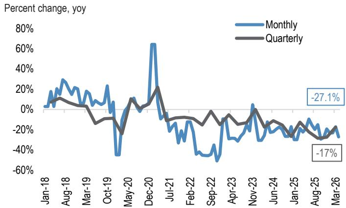

line chart

| Month    | Monthly | Quarterly |
| -------- | ------- | --------- |
| Mar-26   | -27.1%  | -17%      |

\*Includes residential and non-residential. Text box highlights the latest data point; monthly is through April 2026 and quarterly is as of 1Q26.  
Source: China NBS

Figure 3: Building completions growth  
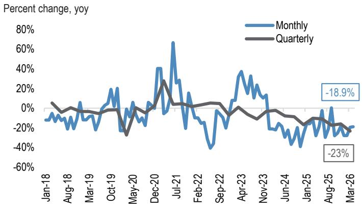

line chart

| Month    | Monthly | Quarterly |
| -------- | ------- | --------- |
| Mar-26   | -18.9%  | -23%      |

\*Includes residential and non-residential. Text box highlights the latest data point; monthly is through April 2026 and quarterly is as of 1Q26.  
Source: China NBS

Figure 4: Investment in power generation  
Percent change, yoy  
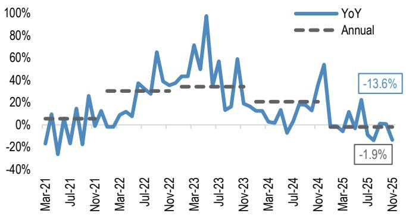

line chart

| Date    | YoY    | Annual |
|---------|--------|--------|
| Nov-25  | -1.9%  | -13.6% |

\*2025 is through November (lagged).  
Source: China National Energy Administration

Figure 6: Solar power plant capacity additions  
LHS: Gigawatts; RHS: Percent change, YTD yoy  
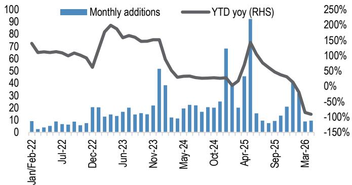

bar-line hybrid chart

| Month     | Monthly additions | YTD yoy (RHS) |
| --------- | ----------------- | ------------- |
| Jan/Feb-22 | 10                | 70%           |
| Jul-22    | 10                | 65%           |
| Dec-22    | 20                | 50%           |
| Jun-23    | 15                | 80%           |
| Nov-23    | 50                | 75%           |
| May-24    | 20                | 40%           |
| Oct-24    | 70                | 40%           |
| Apr-25    | 90                | 150%          |
| Sep-25    | 10                | 0%            |
| Mar-26    | 10                | -100%         |

\*2026 is through April.  
Source: China National Energy Administration

Figure 8: Wind power plant capacity additions  
LHS: Gigawatts; RHS: Percent change, yoy  
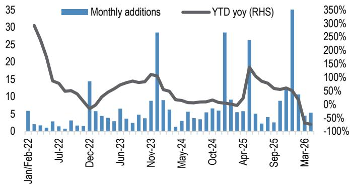

bar-line hybrid chart

| Month     | Monthly additions | YTD yoy (RHS) |
| --------- | ----------------- | ------------- |
| Jan/Feb-22 | 5                 | 300%          |
| Jul-22    | 3                 | 150%          |
| Dec-22    | 15                | 50%           |
| Jun-23    | 7                 | 100%          |
| Nov-23    | 9                 | 150%          |
| May-24    | 5                 | 50%           |
| Oct-24    | 9                 | 50%           |
| Apr-25    | 26                | 150%          |
| Sep-25    | 8                 | 50%           |
| Mar-26    | 35                | -100%         |

\*2026 is through April.  
Source: China National Energy Administration

Figure 5: Fixed asset investment in grid infrastructure  
Percent change, yoy  
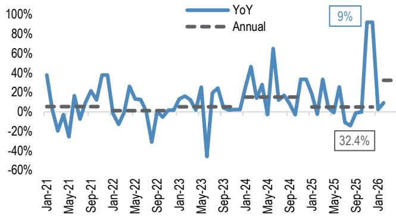

line chart

| Date    | YoY    | Annual |
|---------|--------|--------|
| Sep-25  | 9%     | 32.4%  |

\*2026 is through April.  
Source: China National Energy Administration. JPM estimates for 2M26 based on State Grid and Southern Grid spending.

Figure 7: Solar power plant capacity addition growth  
Percent change, yoy  
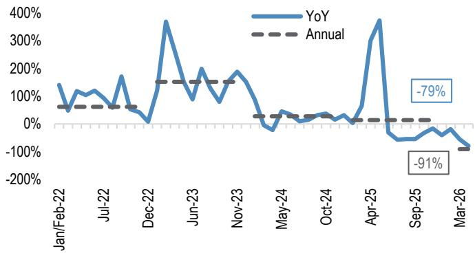

line chart

| Month     | YoY    | Annual |
| --------- | ------ | ------ |
| Mar-26    | -91%   | -79%   |

\*2026 is through April.  
Source: China National Energy Administration

Figure 9: Wind power plant capacity addition growth  
Percent change, yoy  
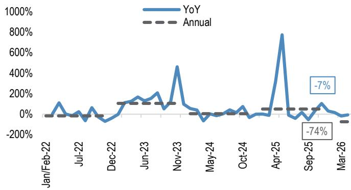

line chart

| Month    | YoY    | Annual |
| -------- | ------ | ------ |
| Mar-26   | -74%   | -7%    |

\*2026 is through April.  
Source: China National Energy Administration

Figure 10: Cumulative wind installed capacity  
LHS: Gigawatts; RHS: Percent change, yoy of monthly installations  
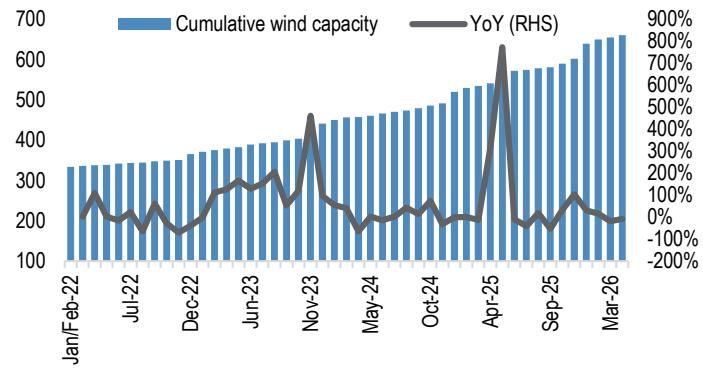

bar-line hybrid chart

| Month     | Cumulative wind capacity | YoY (RHS) |
| --------- | ------------------------ | --------- |
| Jan/Feb-22 | 330                      | 100%      |
| Jul-22    | 340                      | 50%       |
| Dec-22    | 350                      | -50%      |
| Jun-23    | 370                      | 100%      |
| Nov-23    | 400                      | 200%      |
| May-24    | 450                      | -100%     |
| Oct-24    | 480                      | 50%       |
| Apr-25    | 550                      | 800%      |
| Sep-25    | 600                      | -50%      |
| Mar-26    | 650                      | 0%        |

\*2026 is through April.  
Source: China National Energy Administration

Figure 12: Air conditioner production, monthly  
Thousand units  
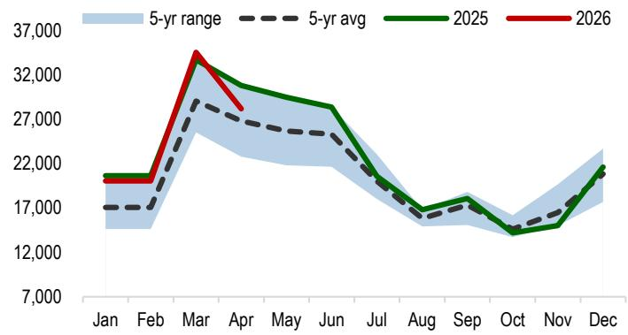

line chart

| Month | 5-yr range | 5-yr avg | 2025 | 2026 |
|-------|------------|----------|------|------|
| Jan   | 17,000     | 17,000   | 18,000 | 18,000 |
| Feb   | 17,000     | 17,000   | 18,000 | 18,000 |
| Mar   | 27,000     | 27,000   | 33,000 | 33,000 |
| Apr   | 26,000     | 26,000   | 31,000 | 27,000 |
| May   | 25,000     | 25,000   | 30,000 | -    |
| Jun   | 24,000     | 24,000   | 29,000 | -    |
| Jul   | 22,000     | 22,000   | 26,000 | -    |
| Aug   | 21,000     | 21,000   | 19,000 | -    |
| Sep   | 21,500     | 21,500   | 19,500 | -    |
| Oct   | 16,500     | 16,500   | 14,500 | -    |
| Nov   | 17,500     | 17,500   | 16,500 | -    |
| Dec   | 22,500     | 22,500   | 21,500 | -    |

Source: China NBS

Figure 14: Fridge and freezer production, monthly  
Thousand units  
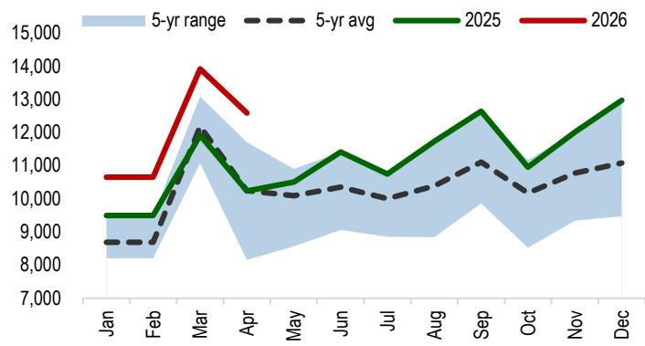

line chart

| Month | 5-yr range | 5-yr avg | 2025 | 2026 |
|-------|------------|----------|------|------|
| Jan   | ~8,500     | ~8,500   | ~9,500 | ~10,500 |
| Feb   | ~8,500     | ~8,500   | ~9,500 | ~10,500 |
| Mar   | ~13,000    | ~12,000  | ~12,000 | ~14,000 |
| Apr   | ~8,500     | ~10,500  | ~10,500 | ~12,500 |
| May   | ~9,500     | ~10,500  | ~11,000 | -    |
| Jun   | ~9,500     | ~10,500  | ~11,500 | -    |
| Jul   | ~9,500     | ~10,500  | ~11,000 | -    |
| Aug   | ~9,500     | ~10,500  | ~11,500 | -    |
| Sep   | ~10,500    | ~11,500  | ~12,500 | -    |
| Oct   | ~8,500     | ~11,500  | ~11,500 | -    |
| Nov   | ~9,500     | ~11,500  | ~12,500 | -    |
| Dec   | ~9,500     | ~11,500  | ~13,500 | -    |

Source: China NBS

Figure 11: Cumulative solar installed capacity  
LHS: Gigawatts; RHS: Percent change, yoy of monthly installations  
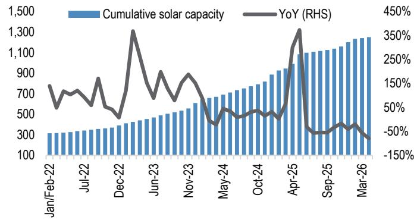

bar-line hybrid chart

| Month     | Cumulative solar capacity | YoY (RHS) |
| --------- | ------------------------- | --------- |
| Jan/Feb-22 | 300                       | 750       |
| Jul-22    | 350                       | 600       |
| Dec-22    | 400                       | 1300      |
| Jun-23    | 450                       | 900       |
| Nov-23    | 500                       | 800       |
| May-24    | 600                       | 400       |
| Oct-24    | 700                       | 500       |
| Apr-25    | 900                       | 350       |
| Sep-25    | 1100                      | -50       |
| Mar-26    | 1300                      | -150      |

\*2026 is through April.  
Source: China National Energy Administration

Figure 13: Air conditioner production growth  
Percent change, yoy  
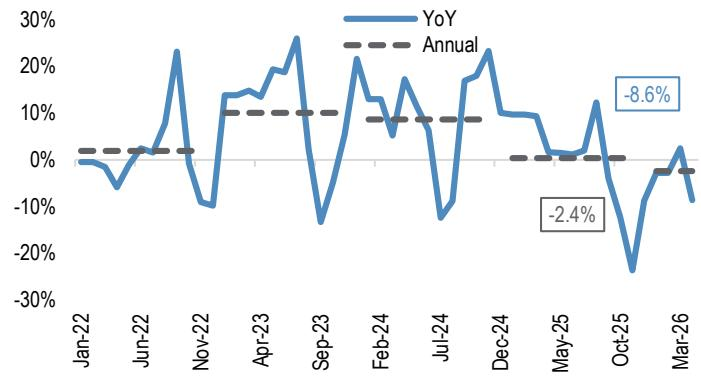

line chart

| Month    | YoY     |
| -------- | ------- |
| Mar-26   | -8.6%   |
| Oct-25   | -2.4%   |

\*2026 is through April.  
Source: China NBS

Figure 15: Fridge and freezer production growth  
Percent change, yoy  
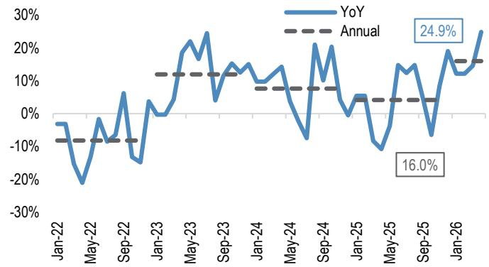

line chart

| Date    | YoY    |
|---------|--------|
| Jan-26  | 24.9%  |
| May-25  | 16.0%  |

\*2026 is through April.  
Source: China NBS

Figure 16: Washing machine production, monthly  
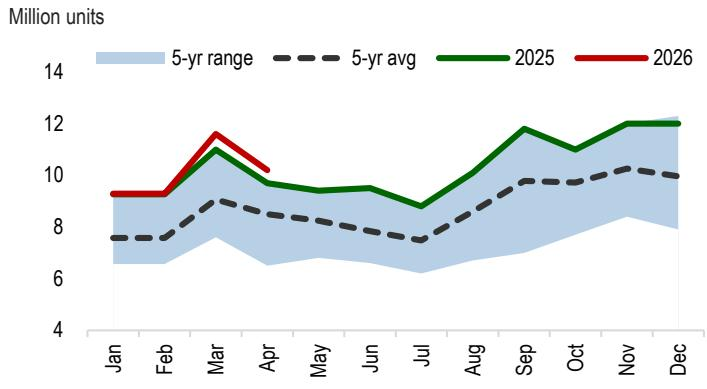

line chart

| Month | 2025 | 2026 | 5-yr avg | 5-yr range |
|-------|------|------|----------|------------|
| Jan   | 9.0  | 9.0  | 7.5      | 6.5–8.0    |
| Feb   | 9.0  | 9.0  | 7.5      | 6.5–8.0    |
| Mar   | 11.0 | 11.5 | 9.0      | 7.5–10.0   |
| Apr   | 10.0 | 10.0 | 8.5      | 6.5–8.5    |
| May   | 9.5  | 9.5  | 8.0      | 6.5–8.0    |
| Jun   | 9.5  | 9.5  | 7.5      | 6.5–8.0    |
| Jul   | 8.5  | 8.5  | 7.5      | 6.0–8.0    |
| Aug   | 10.0 | 10.0 | 8.5      | 6.5–9.0    |
| Sep   | 12.0 | 12.0 | 9.5      | 7.0–10.0   |
| Oct   | 11.0 | 11.0 | 9.5      | 7.5–10.0   |
| Nov   | 12.0 | 12.0 | 10.0     | 8.0–11.0   |
| Dec   | 12.0 | 12.0 | 10.0     | 7.5–11.0   |

Source: Source: China NBS

Figure 18: Passenger vehicle production growth  
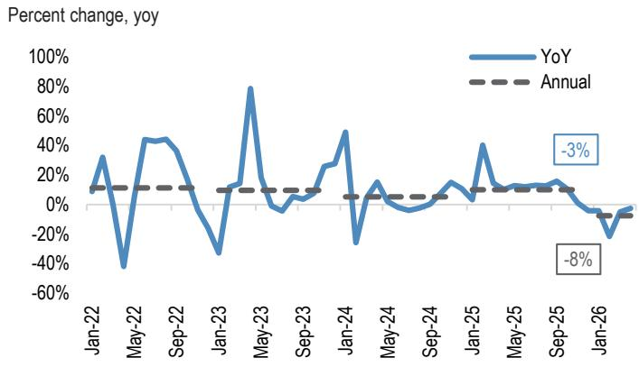

line chart

| Date   | YoY    | Annual |
|--------|--------|--------|
| Jan-26 | -8%    | -3%    |

\*Includes basic passenger, multi-purpose, SUVs, and crossover vehicles. 2026 is through April. Source: China Automotive and Research Center

Figure 20: Industrial robot production growth  
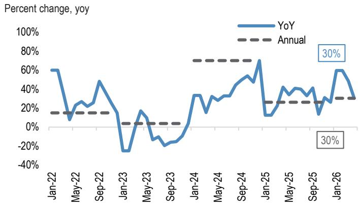

line chart

| Month    | YoY   | Annual |
| -------- | ----- | ------ |
| Jan-26   | 30%   | 30%    |

\*2026 is through April.  
Source: China NBS

Figure 17: Washing machine production growth  
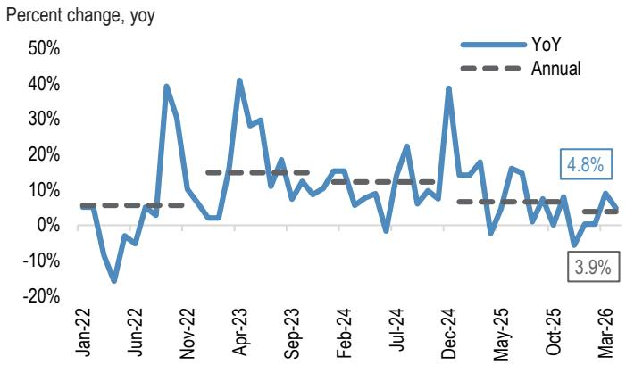

line chart

| Month    | YoY    |
| -------- | ------ |
| Mar-26   | 4.8%   |
| Oct-25   | 3.9%   |

\*2026 is through April.  
Source: China NBS

Figure 19: Passenger NEV production growth  
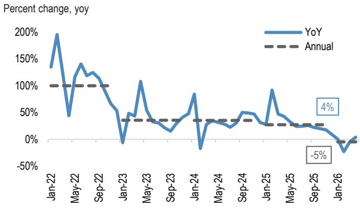

line chart

| Date    | YoY   | Annual |
|---------|-------|--------|
| Jan-26  | -5%   | 4%     |

\*Includes battery electric vehicles, and plug-in hybrids. 2026 is through April.  
Source: China Automotive and Research Center

Figure 21: Excavator production growth  
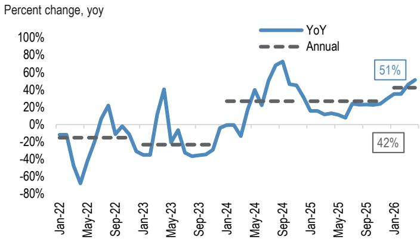

line chart

| Month    | YoY   | Annual |
| -------- | ----- | ------ |
| Jan-26   | 51%   | 42%    |

\*2026 is through April.  
Source: China NBS

## Copper

Figure 22: Consumption-weighted end use indicator for Chinese copper demand growth  
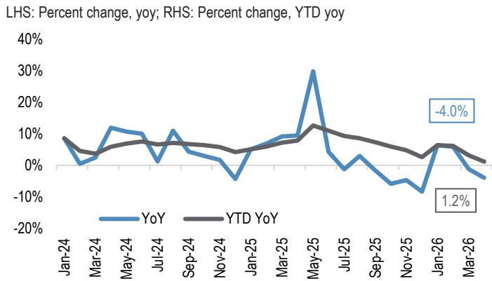

line chart

| Month    | YoY    | YTD YoY |
| -------- | ------ | ------- |
| Mar-26   | -4.0%  | 1.2%    |

\*This indicator applies consumption-weights to underlying reported end-use production/installation/export growth figures to derive an estimate for monthly aggregate Chinese copper demand growth. It covers construction, grid, solar, wind, EVs, other transport, consumer durables, ACs/ refrigeration, machinery and product and cable exports which, combined, roughly account for $90\%$ of Chinese end use demand. Data through April 2026.  
Source: China National Energy Administration, China Automotive Tech and Research Center, Tianjin, NBS, China Customs, Bloomberg Finance L.P., JPM Commodities Research

Figure 24: YoY Growth – Consumption-weighted end use copper demand indicator vs apparent demand  
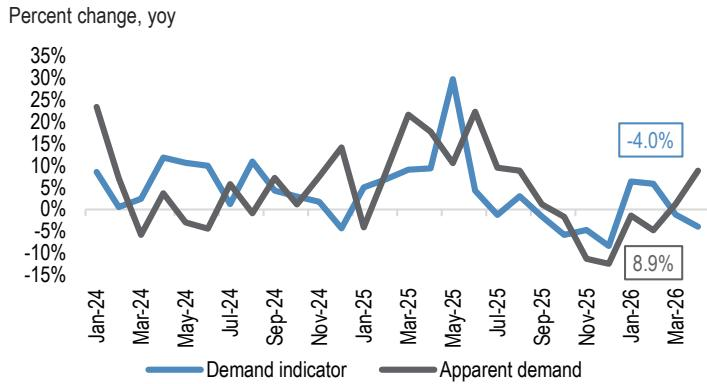

line chart

| Month   | Demand indicator | Apparent demand |
|---------|------------------|-----------------|
| Jan-24  | ~10%             | ~25%            |
| Mar-24  | ~0%              | ~-5%            |
| May-24  | ~10%             | ~-5%            |
| Jul-24  | ~10%             | ~-5%            |
| Sep-24  | ~10%             | ~-5%            |
| Nov-24  | ~0%              | ~-5%            |
| Jan-25  | ~5%              | ~-5%            |
| Mar-25  | ~10%             | ~20%            |
| May-25  | ~30%             | ~10%            |
| Jul-25  | ~5%              | ~20%            |
| Sep-25  | ~0%              | ~10%            |
| Nov-25  | ~-5%             | ~-10%           |
| Jan-26  | -4.0%            | ~-10%           |
| Mar-26  | -4.0%            | 8.9%            |

\*See explanatory notes in Figures 24 & 25. Data through April 2026.  
Source: China National Energy Administration, China Automotive Tech and Research Center, Tianjin, NBS, China Customs, Bloomberg Finance L.P., JPM Commodities Research

Figure 23: China copper apparent demand growth  
Percent change  
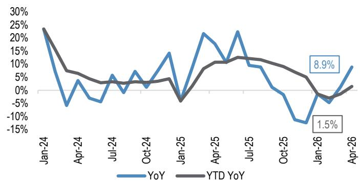

line chart

| Month   | YoY    | YTD YoY |
|---------|--------|---------|
| Jan-24  | 25%    | 25%     |
| Apr-24  | -5%    | 5%      |
| Jul-24  | 5%     | 0%      |
| Oct-24  | 0%     | 0%      |
| Jan-25  | 15%    | -5%     |
| Apr-25  | 20%    | 10%     |
| Jul-25  | 25%    | 10%     |
| Oct-25  | 0%     | 0%      |
| Jan-26  | -15%   | -5%     |
| Apr-26  | 8.9%   | 0%      |

\*Apparent demand is calculated as (Imports-Exports)+Production-Monthly stock changes on the SHFE. Data through April 2026.  
Source: China National Energy Administration, China Automotive Tech and Research Center, Tianjin, NBS, China Customs, Bloomberg Finance L.P., JPM Commodities Research

Figure 25: YTD YoY Growth – Consumption-weighted end use copper demand indicator vs apparent demand  
Percent change, YTD yoy  
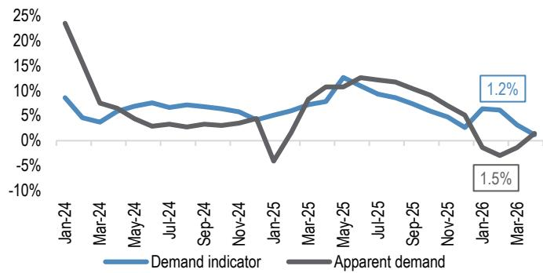

line chart

| Month    | Demand indicator | Apparent demand |
| -------- | ---------------- | --------------- |
| Jan-26   | 1.2%             | 1.5%            |

\*See explanatory notes in Figures 24 & 25. Data through April 2026.  
Source: China National Energy Administration, China Automotive Tech and Research Center, Tianjin, NBS, China Customs, Bloomberg Finance L.P., JPM Commodities Research

Figure 26: China apparent copper demand  
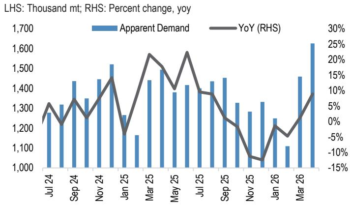

bar-line hybrid chart

| Month   | Apparent Demand (thousand mt) | YoY (%) |
|---------|-------------------------------|---------|
| Jul 24  | 1,280                         | 5.0     |
| Aug 24  | 1,300                         | 3.0     |
| Sep 24  | 1,430                         | 7.0     |
| Oct 24  | 1,350                         | 4.0     |
| Nov 24  | 1,450                         | 9.0     |
| Dec 24  | 1,520                         | 12.0    |
| Jan 25  | 1,250                         | -5.0    |
| Feb 25  | 1,180                         | -8.0    |
| Mar 25  | 1,430                         | 18.0    |
| Apr 25  | 1,500                         | 16.0    |
| May 25  | 1,380                         | 10.0    |
| Jun 25  | 1,410                         | 16.0    |
| Jul 25  | 1,380                         | 9.0     |
| Aug 25  | 1,440                         | 8.0     |
| Sep 25  | 1,320                         | 4.0     |
| Oct 25  | 1,280                         | -3.0    |
| Nov 25  | 1,330                         | -8.0    |
| Dec 25  | 1,350                         | -10.0   |
| Jan 26  | 1,250                         | -5.0    |
| Feb 26  | 1,100                         | -8.0    |
| Mar 26  | 1,450                         | 8.0     |
| Apr 26* | 1,620                         | 10.0    |

Source: China Customs General Administration, SHFE. \*Apparent demand is calculated as (Imports-Exports)+Production-Monthly stock changes on the SHFE.

Figure 28: Global visible copper inventories  
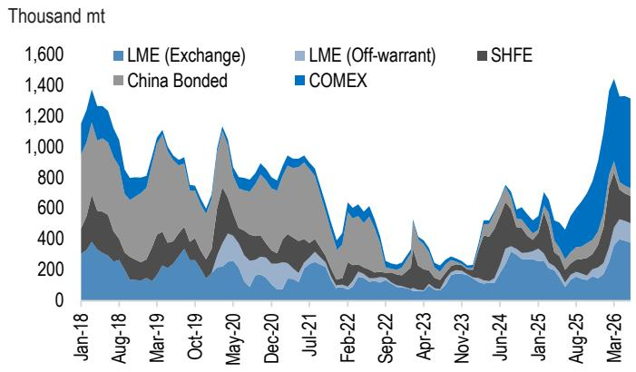

stacked bar chart

| Date | LME (Exchange) (Thousand mt) | LME (Off-warrant) (Thousand mt) | China Bonded (Thousand mt) | SHFE (Thousand mt) | COMEX (Thousand mt) |
|---|---|---|---|---|---|
| Jan-18 | 350 | 150 | 400 | 200 | 100 |
| Aug-18 | 400 | 100 | 450 | 250 | 120 |
| Mar-19 | 300 | 120 | 350 | 200 | 110 |
| Oct-19 | 250 | 150 | 300 | 250 | 130 |
| May-20 | 200 | 180 | 350 | 300 | 140 |
| Dec-20 | 150 | 200 | 300 | 250 | 150 |
| Jul-21 | 180 | 220 | 350 | 280 | 160 |
| Feb-22 | 120 | 150 | 250 | 200 | 180 |
| Sep-22 | 100 | 120 | 200 | 150 | 160 |
| Apr-23 | 80 | 100 | 150 | 120 | 140 |
| Nov-23 | 70 | 90 | 120 | 100 | 130 |
| Jun-24 | 150 | 250 | 350 | 250 | 280 |
| Jan-25 | 250 | 350 | 450 | 350 | 380 |
| Aug-25 | 350 | 450 | 550 | 450 | 480 |
| Mar-26 | 450 | 550 | 650 | 550 | 680 |

Source: CRU, LME, SHFE, COMEX. Bonded includes Chinese bonded stocks in Shanghai, Guangdong and Qingdao. As of 4 $^{th}$ June 2026, while LME off-warrant as of 1 $^{st}$ June 2026.  
Y-axis: Thousand mt; X-axis: Weeks around Chinese New Year (0 = week closest to start of CNY)

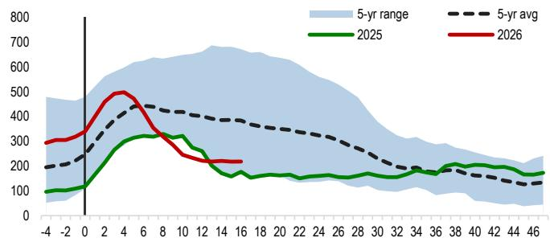

line chart

| x  | 5-yr range | 5-yr avg | 2025 | 2026 |
|----|------------|----------|------|------|
| -4 | 100        | 200      | 100  | 300  |
| -2 | 150        | 250      | 150  | 350  |
| 0  | 200        | 300      | 200  | 400  |
| 2  | 300        | 350      | 250  | 450  |
| 4  | 400        | 400      | 300  | 500  |
| 6  | 500        | 450      | 350  | 450  |
| 8  | 600        | 450      | 350  | 350  |
| 10 | 650        | 450      | 350  | 300  |
| 12 | 650        | 450      | 350  | 250  |
| 14 | 650        | 450      | 350  | 250  |
| 16 | 650        | 450      | 350  | 250  |
| 18 | 650        | 450      | 350  | 250  |
| 20 | 650        | 450      | 350  | 250  |
| 22 | 650        | 450      | 350  | 250  |
| 24 | 650        | 450      | 350  | 250  |
| 26 | 650        | 450      | 350  | 250  |
| 28 | 650        | 450      | 350  | 250  |
| 30 | 650        | 450      | 350  | 250  |
| 32 | 650        | 450      | 350  | 250  |
| 34 | 650        | 450      | 350  | 250  |
| 36 | 650        | 450      | 350  | 250  |
| 38 | 650        | 450      | 350  | 250  |
| 40 | 650        | 450      | 350  | 250  |
| 42 | 650        | 450      | 350  | 250  |
| 44 | 650        | 450      | 350  | 250  |
| 46 | 650        | 450      | 350  | 250   |

Source: SHFE, CRU, SMM, JPM Commodities Research

Figure 30: Total visible China copper inventory (SHFE + Bonded)  
Figure 27: China apparent copper demand  
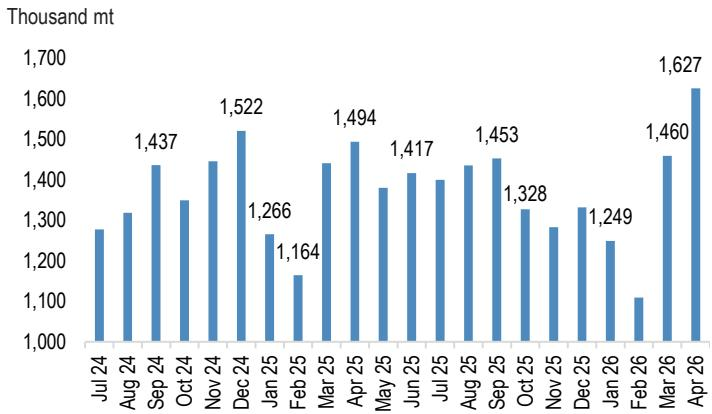

bar chart

| Month | Value (Thousand mt) |
|---|---|
| Jul 24 | 1280 |
| Aug 24 | 1320 |
| Sep 24 | 1437 |
| Oct 24 | 1350 |
| Nov 24 | 1445 |
| Dec 24 | 1522 |
| Jan 25 | 1266 |
| Feb 25 | 1164 |
| Mar 25 | 1440 |
| Apr 25 | 1494 |
| May 25 | 1380 |
| Jun 25 | 1417 |
| Jul 25 | 1400 |
| Aug 25 | 1435 |
| Sep 25 | 1453 |
| Oct 25 | 1328 |
| Nov 25 | 1285 |
| Dec 25 | 1330 |
| Jan 26 | 1249 |
| Feb 26 | 1100 |
| Mar 26 | 1460 |
| Apr 26 | 1627 |

Source: China Customs General Administration, SHFE. \*Apparent demand is calculated as (Imports-Exports)+Production-Monthly stock changes on the SHFE.

Figure 29: Global visible copper inventory in days of use  
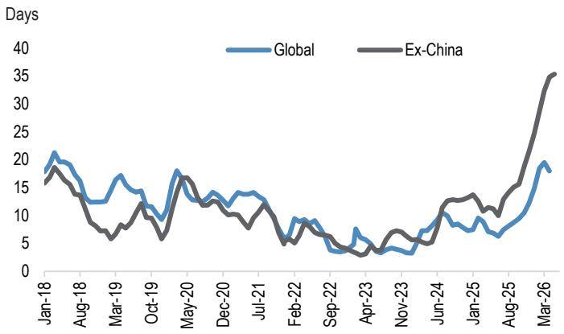

line chart

| Month   | Global | Ex-China |
|---------|--------|----------|
| Jan-18  | 21     | 17       |
| Aug-18  | 19     | 15       |
| Mar-19  | 13     | 6        |
| Oct-19  | 17     | 10       |
| May-20  | 18     | 16       |
| Dec-20  | 14     | 12       |
| Jul-21  | 13     | 10       |
| Feb-22  | 9      | 5        |
| Sep-22  | 4      | 3        |
| Apr-23  | 7      | 4        |
| Nov-23  | 4      | 6        |
| Jun-24  | 8      | 10       |
| Jan-25  | 7      | 12       |
| Aug-25  | 6      | 14       |
| Mar-26  | 19     | 35       |

Source: SHFE, CRU, SMM, JPM Commodities Research

Figure 31: Copper regional premiums  
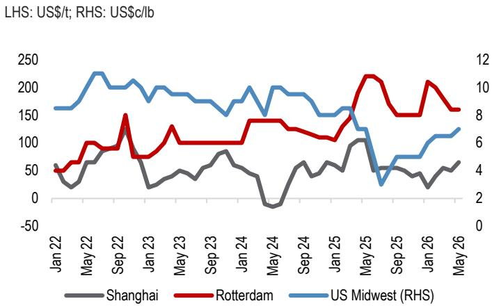

line chart

| Date   | Shanghai | Rotterdam | US Midwest (RHS) |
|--------|----------|-----------|------------------|
| Jan 22 | 50       | 50        | 160              |
| May 22 | 70       | 80        | 230              |
| Sep 22 | 90       | 150       | 210              |
| Jan 23 | 30       | 70        | 190              |
| May 23 | 50       | 100       | 180              |
| Sep 23 | 70       | 100       | 170              |
| Jan 24 | 80       | 100       | 160              |
| May 24 | -10      | 140       | 150              |
| Sep 24 | 60       | 130       | 170              |
| Jan 25 | 70       | 110       | 160              |
| May 25 | 100      | 220       | 130              |
| Sep 25 | 50       | 150       | 30               |
| Jan 26 | 40       | 180       | 60               |
| May 26 | 60       | 160       | 80               |

Source: CRU

Figure 32: Monthly US refined copper imports  
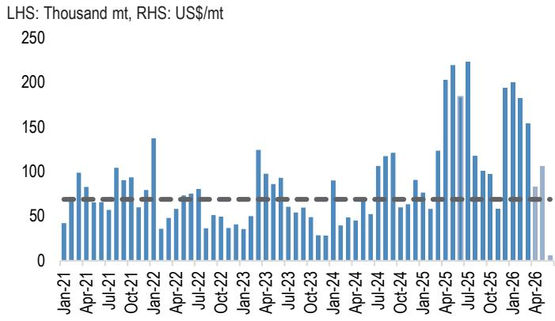

bar chart

| Month    | Value (Thousand mt) |
| -------- | ------------------- |
| Jan-21   | 40                  |
| Feb-21   | 95                  |
| Mar-21   | 80                  |
| Apr-21   | 60                  |
| May-21   | 70                  |
| Jun-21   | 100                 |
| Jul-21   | 90                  |
| Aug-21   | 85                  |
| Sep-21   | 95                  |
| Oct-21   | 80                  |
| Nov-21   | 75                  |
| Dec-21   | 135                 |
| Jan-22   | 35                  |
| Feb-22   | 50                  |
| Mar-22   | 60                  |
| Apr-22   | 70                  |
| May-22   | 80                  |
| Jun-22   | 75                  |
| Jul-22   | 65                  |
| Aug-22   | 50                  |
| Sep-22   | 45                  |
| Oct-22   | 40                  |
| Nov-22   | 35                  |
| Dec-22   | 30                  |
| Jan-23   | 45                  |
| Feb-23   | 50                  |
| Mar-23   | 125                 |
| Apr-23   | 95                  |
| May-23   | 85                  |
| Jun-23   | 90                  |
| Jul-23   | 60                  |
| Aug-23   | 55                  |
| Sep-23   | 50                  |
| Oct-23   | 45                  |
| Nov-23   | 30                  |
| Dec-23   | 25                  |
| Jan-24   | 90                  |
| Feb-24   | 40                  |
| Mar-24   | 45                  |
| Apr-24   | 50                  |
| May-24   | 45                  |
| Jun-24   | 50                  |
| Jul-24   | 105                 |
| Aug-24   | 115                 |
| Sep-24   | 100                 |
| Oct-24   | 85                  |
| Nov-24   | 70                  |
| Dec-24   | 60                  |
| Jan-25   | 120                 |
| Feb-25   | 180                 |
| Mar-25   | 210                 |
| Apr-25   | 185                 |
| May-25   | 190                 |
| Jun-25   | 180                 |
| Jul-25   | 170                 |
| Aug-25   | 160                 |
| Sep-25   | 150                 |
| Oct-25   | 140                 |
| Nov-25   | 130                 |
| Dec-25   | 120                 |
| Jan-26   | 110                 |
| Feb-26   | 100                 |
| Mar-26   | 90                  |
| Apr-26   | 80                  |
| May-26   | 70                  |
| Jun-26   | 60                  |
| Jul-26   | 50                  |
| Aug-26   | 40                  |
| Sep-26   | 30                  |
| Oct-26   | 20                  |
| Nov-26   | 10                  |
| Dec-26   | 5                   |

Note: 1 $^{st}$ April-6 $^{th}$ June 2026 estimated based on bill of lading data.  
Source: US Census Bureau, IHS Markit, COMEX, LME, JPM Commodities Research  
LHS: Thousand mt (cu contained); RHS: Percent change, YoY

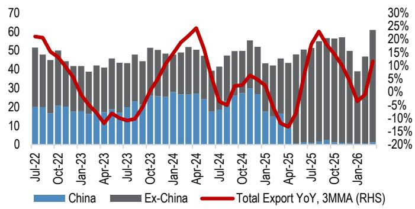

bar-line hybrid chart

| Month | China | Ex-China | Total Export YoY, 3MMA (RHS) (%) |
|---|---|---|---|
| Jul-22 | 20 | 25 | 18 |
| Oct-22 | 20 | 25 | 14 |
| Jan-23 | 18 | 23 | 7 |
| Apr-23 | 15 | 25 | -10 |
| Jul-23 | 20 | 25 | -10 |
| Oct-23 | 25 | 30 | 10 |
| Jan-24 | 28 | 30 | 15 |
| Apr-24 | 28 | 30 | 25 |
| Jul-24 | 18 | 30 | -5 |
| Oct-24 | 28 | 35 | 5 |
| Jan-25 | 18 | 35 | -5 |
| Apr-25 | 10 | 40 | -15 |
| Jul-25 | 5 | 45 | 18 |
| Oct-25 | 5 | 45 | 10 |
| Jan-26 | 5 | 45 | -5 |
| Apr-26 | 5 | 45 | -10 |
| Jul-26 | 5 | 45 | 10 |

\*Data as of March 2026.  
Source: US Census Bureau, JPM Commodities Research

Figure 36: China copper imported concentrate treatment charges vs annual benchmark  
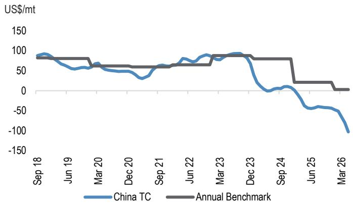

line chart

| Date   | China TC | Annual Benchmark |
|--------|----------|------------------|
| Sep 18 | ~90      | ~90              |
| Jun 19 | ~70      | ~85              |
| Mar 20 | ~60      | ~70              |
| Dec 20 | ~40      | ~65              |
| Sep 21 | ~60      | ~70              |
| Jun 22 | ~80      | ~85              |
| Mar 23 | ~90      | ~90              |
| Dec 23 | ~10      | ~90              |
| Sep 24 | ~-50     | ~85              |
| Jun 25 | ~-60     | ~20              |
| Mar 26 | ~-100    | ~0               |

Source: Metal Bulletin, Platts, Wood Mackenzie  
Figure 33: Jul'26 COMEX/LME copper spread  
LHS: US\$/mt, RHS: Percent of LME price (implied tariff rate)  
Figure 37: China copper concentrate imports

Figure 34: Monthly US copper scrap exports  
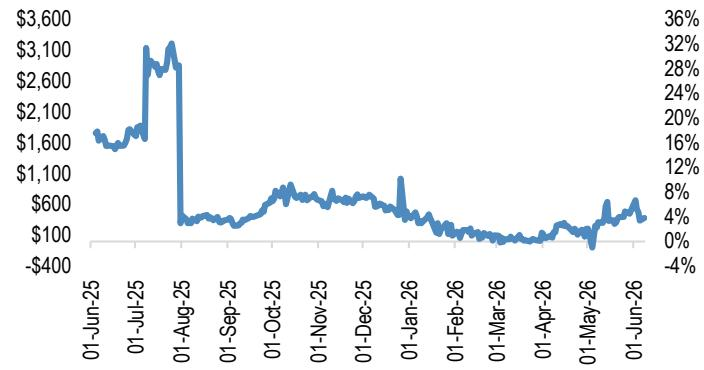

line chart

| Date       | Value  | Percentage |
| ---------- | ------ | ---------- |
| 01-Jun-25  | $1,600 | 16%        |
| 01-Jul-25  | $3,100 | 32%        |
| 01-Aug-25  | $100   | -4%        |
| 01-Sep-25  | $600   | 8%         |
| 01-Oct-25  | $700   | 12%        |
| 01-Dec-25  | $600   | 8%         |
| 01-Jan-26  | $1,100 | 32%        |
| 01-Feb-26  | $500   | 4%         |
| 01-Mar-26  | $400   | 2%         |
| 01-Apr-26  | $300   | 0%         |
| 01-May-26  | $600   | 8%         |
| 01-Jun-26  | $500   | 4%         |

Source: Bloomberg Finance L.P. \*Arb as of London, 8 $^{th}$ June 2026.

Figure 35: Chinese spot copper import arbitrage and onshore spot premium/discount  
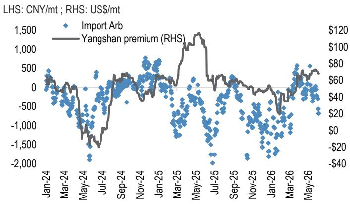

bar-line hybrid chart

| Date    | Import Arb | Yangshan premium (RHS) |
|---------|------------|------------------------|
| Jan-24  |            |                        |
| Mar-24  |            |                        |
| May-24  |            |                        |
| Jul-24  |            |                        |
| Sep-24  |            |                        |
| Nov-24  |            |                        |
| Jan-25  |            |                        |
| Mar-25  |            |                        |
| May-25  |            |                        |
| Jul-25  |            |                        |
| Sep-25  |            |                        |
| Nov-25  |            |                        |
| Jan-26  |            |                        |
| Mar-26  |            |                        |
| May-26  |            |                        |

Source: SMM, Bloomberg Finance L.P., JPM Commodities Research. \*Arb as of 8:00 AM London. As of $4^{\text{th}}$ June 2026.  
LHS: Thousand mt (gross); RHS: Percent change, yoy

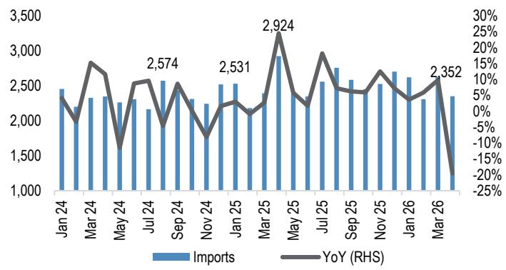

bar-line hybrid chart

| Month | Imports | YoY (%) |
|---|---|---|
| Jan 24 | 2450 | -10 |
| Feb 24 | 2300 | -15 |
| Mar 24 | 2350 | 15 |
| Apr 24 | 2250 | 10 |
| May 24 | 2300 | -15 |
| Jun 24 | 2574 | 15 |
| Jul 24 | 2150 | 10 |
| Aug 24 | 2574 | 5 |
| Sep 24 | 2350 | 10 |
| Oct 24 | 2250 | -10 |
| Nov 24 | 2300 | -15 |
| Dec 24 | 2531 | -5 |
| Jan 25 | 2550 | 0 |
| Feb 25 | 2150 | -5 |
| Mar 25 | 2350 | 5 |
| Apr 25 | 2924 | 30 |
| May 25 | 3000 | 10 |
| Jun 25 | 2550 | -5 |
| Jul 25 | 2700 | 10 |
| Aug 25 | 2600 | -5 |
| Sep 25 | 2600 | -5 |
| Oct 25 | 2600 | -5 |
| Nov 25 | 2600 | -10 |
| Dec 25 | 2700 | -10 |
| Jan 26 | 2600 | -10 |
| Feb 26 | 2350 | -15 |
| Mar 26 | 2352 | -25 |

Source: China Customs General Administration

Figure 38: China refined copper imports  
LHS: Thousand mt; RHS: Percent change, yoy  
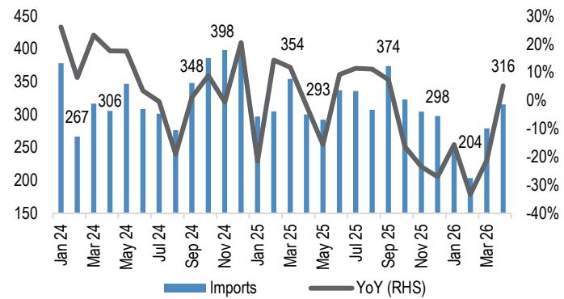

bar-line hybrid chart

| Month | Imports | YoY (%) |
|---|---|---|
| Jan 24 | 378 | 35 |
| Feb 24 | 267 | -10 |
| Mar 24 | 320 | 15 |
| Apr 24 | 306 | 10 |
| May 24 | 348 | 5 |
| Jun 24 | 309 | -5 |
| Jul 24 | 301 | -10 |
| Aug 24 | 273 | -20 |
| Sep 24 | 348 | -15 |
| Oct 24 | 361 | -5 |
| Nov 24 | 398 | 10 |
| Dec 24 | 309 | -25 |
| Jan 25 | 298 | -30 |
| Feb 25 | 309 | -10 |
| Mar 25 | 354 | 5 |
| Apr 25 | 309 | -15 |
| May 25 | 293 | -25 |
| Jun 25 | 337 | 5 |
| Jul 25 | 310 | 10 |
| Aug 25 | 374 | 5 |
| Sep 25 | 327 | -5 |
| Oct 25 | 309 | -10 |
| Nov 25 | 301 | -15 |
| Dec 25 | 298 | -20 |
| Jan 26 | 204 | -30 |
| Feb 26 | 276 | -10 |
| Mar 26 | 316 | 15 |

Source: China Customs General Administration

Figure 40: China contained copper scrap imports, 3mma  
LHS: Thousand mt (Cu contained); RHS: Percent change, yoy  
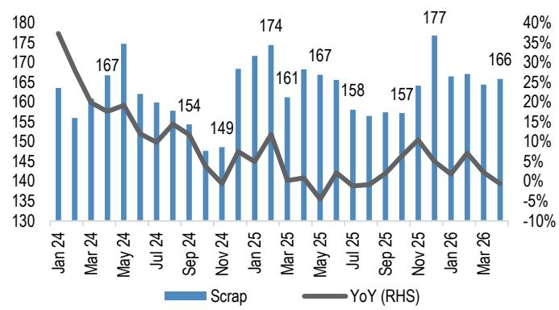

bar-line hybrid chart

| Month | Scrap | YoY (RHS) (%) |
|---|---|---|
| Jan 24 | 163 | 38 |
| Feb 24 | 155 | 30 |
| Mar 24 | 160 | 25 |
| Apr 24 | 167 | 20 |
| May 24 | 175 | 18 |
| Jun 24 | 161 | 15 |
| Jul 24 | 159 | 10 |
| Aug 24 | 156 | 8 |
| Sep 24 | 154 | 12 |
| Oct 24 | 149 | -3 |
| Nov 24 | 147 | -5 |
| Dec 24 | 168 | 5 |
| Jan 25 | 171 | 8 |
| Feb 25 | 174 | 10 |
| Mar 25 | 161 | -2 |
| Apr 25 | 167 | -3 |
| May 25 | 166 | -5 |
| Jun 25 | 158 | -3 |
| Jul 25 | 156 | -3 |
| Aug 25 | 157 | -3 |
| Sep 25 | 157 | 0 |
| Oct 25 | 164 | 3 |
| Nov 25 | 177 | 6 |
| Dec 25 | 167 | -3 |
| Jan 26 | 167 | -3 |
| Feb 26 | 166 | -3 |
| Mar 26 | 166 | -3 |

Source: China Customs General Administration

Figure 42: China refined copper production, monthly  
Thousand mt  
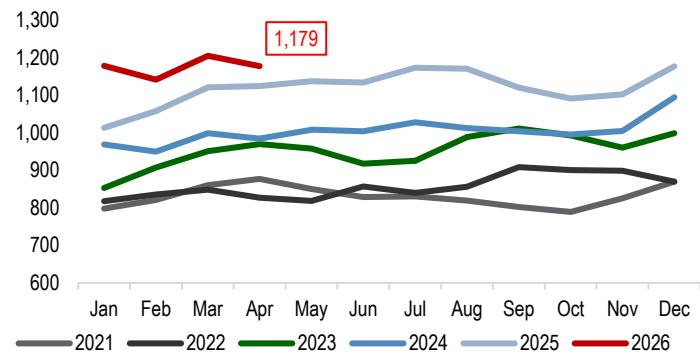

line chart

| Month | 2021 | 2022 | 2023 | 2024 | 2025 | 2026 |
|-------|------|------|------|------|------|------|
| Jan   | 800  | 820  | 850  | 980  | 1020 | 1180 |
| Feb   | 810  | 830  | 870  | 990  | 1050 | 1150 |
| Mar   | 830  | 840  | 890  | 1010 | 1080 | 1210 |
| Apr   | 850  | 850  | 910  | 1030 | 1100 | 1179 |
| May   | 840  | 840  | 930  | 1040 | 1110 | —    |
| Jun   | 830  | 830  | 950  | 1050 | 1120 | —    |
| Jul   | 840  | 840  | 970  | 1060 | 1130 | —    |
| Aug   | 850  | 850  | 990  | 1070 | 1140 | —    |
| Sep   | 860  | 860  | 1010 | 1080 | 1150 | —    |
| Oct   | 870  | 870  | 1030 | 1090 | 1160 | —    |
| Nov   | 880  | 880  | 1050 | 1100 | 1170 | —    |
| Dec   | 890  | 890  | 1070 | 1110 | 1180 | —    |

Source: SMM

Figure 39: China refined copper exports vs LME 3-month copper price  
LHS: Thousand mt; RHS: US\$/mt  
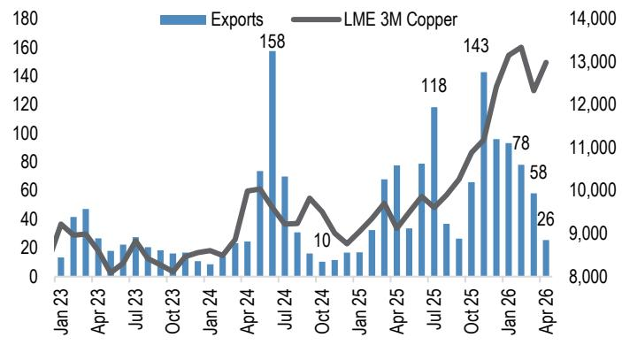

bar-line hybrid chart

| Month   | Exports | LME 3M Copper |
|---------|---------|---------------|
| Jan 23  | 10      | 9000          |
| Apr 23  | 45      | 8500          |
| Jul 23  | 20      | 9500          |
| Oct 23  | 15      | 8000          |
| Jan 24  | 10      | 9000          |
| Apr 24  | 70      | 10000         |
| Jul 24  | 158     | 9500          |
| Oct 24  | 10      | 8500          |
| Jan 25  | 30      | 9500          |
| Apr 25  | 75      | 10500         |
| Jul 25  | 118     | 11000         |
| Oct 25  | 65      | 12000         |
| Jan 26  | 143     | 13000         |
| Apr 26  | 58      | 12500         |

Source: China Customs General Administration, Bloomberg Finance L.P.

Figure 41: China copper imports of concentrate, cathode and contained scrap  
LHS: Thousand mt; RHS: Percent change, yoy  
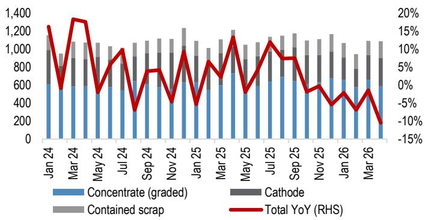

bar-line hybrid chart

| Month | Concentrate (graded) | Cathode | Contained scrap | Total YoY (RHS) (%) |
|---|---|---|---|---|
| Jan 24 | 600 | 350 | 1200 | 18 |
| Mar 24 | 600 | 350 | 1100 | 19 |
| May 24 | 600 | 350 | 1100 | -5 |
| Jul 24 | 600 | 350 | 1100 | 7 |
| Sep 24 | 600 | 350 | 1100 | 7 |
| Nov 24 | 600 | 350 | 1100 | -5 |
| Jan 25 | 600 | 350 | 1200 | -7 |
| Mar 25 | 600 | 350 | 1100 | 7 |
| May 25 | 600 | 350 | 1200 | -5 |
| Jul 25 | 600 | 350 | 1100 | 11 |
| Sep 25 | 600 | 350 | 1200 | -5 |
| Nov 25 | 600 | 350 | 1100 | -5 |
| Jan 26 | 600 | 350 | 1100 | -7 |
| Mar 26 | 600 | 350 | 1100 | -11 |

\*Assumes 25% copper contained in concentrate.  
Source: China Customs General Administration

Figure 43: Annualized China refined copper production  
LHS: Thousand mt; RHS: Percent change, yoy  
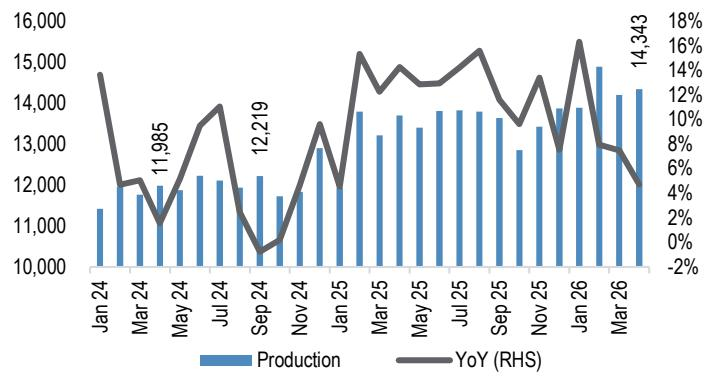

bar-line hybrid chart

| Month   | Production | YoY (RHS) |
|---------|------------|-----------|
| Jan 24  | 11,985     | 18%       |
| Mar 24  | 12,000     | 10%       |
| May 24  | 12,000     | 12%       |
| Jul 24  | 12,000     | 14%       |
| Sep 24  | 12,219     | -2%       |
| Nov 24  | 13,000     | 10%       |
| Jan 25  | 13,500     | 16%       |
| Mar 25  | 13,500     | 14%       |
| May 25  | 13,500     | 14%       |
| Jul 25  | 13,500     | 16%       |
| Sep 25  | 13,500     | 14%       |
| Nov 25  | 13,500     | 12%       |
| Jan 26  | 14,000     | 16%       |
| Mar 26  | 14,343     | 8%        |

Source: SMM

Figure 44: China copper wire and cable producer operating rates  
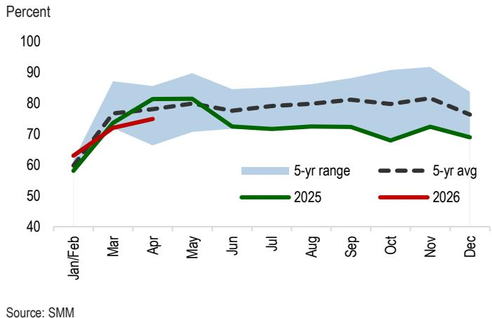

line chart

| Month   | 2025 | 2026 | 5-yr avg | 5-yr range |
|---------|------|------|----------|------------|
| Jan/Feb | 58   | 63   | 63       | 63-70      |
| Mar     | 75   | 70   | 75       | 75-85      |
| Apr     | 80   | 75   | 78       | 78-85      |
| May     | 80   | 75   | 78       | 78-85      |
| Jun     | 72   | 70   | 78       | 78-85      |
| Jul     | 70   | 70   | 78       | 78-85      |
| Aug     | 70   | 70   | 78       | 78-85      |
| Sep     | 70   | 70   | 78       | 78-85      |
| Oct     | 68   | 70   | 78       | 78-85      |
| Nov     | 72   | 70   | 78       | 78-85      |
| Dec     | 69   | 69   | 76       | 76-84      |

Figure 46: China copper tube producer operating rates  
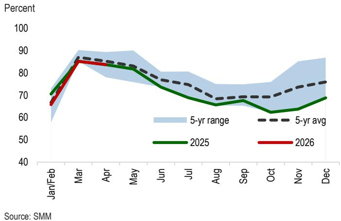

line chart

| Month   | 2025 | 2026 | 5-yr avg |
|---------|------|------|----------|
| Jan/Feb | 70   | 65   | 68       |
| Mar     | 85   | 85   | 85       |
| Apr     | 80   | 80   | 80       |
| May     | 80   | 80   | 80       |
| Jun     | 75   | 75   | 75       |
| Jul     | 70   | 70   | 70       |
| Aug     | 68   | 68   | 68       |
| Sep     | 65   | 65   | 65       |
| Oct     | 63   | 63   | 63       |
| Nov     | 65   | 65   | 65       |
| Dec     | 70   | 70   | 70       |

Figure 48: Chile copper mine production  
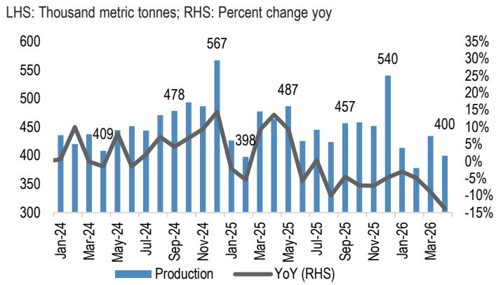

bar-line hybrid chart

| Month | Production (Thousand metric tonnes) | YoY (%) |
| :--- | :--- | :--- |
| Jan-24 | 435 | 0 |
| Feb-24 | 420 | 10 |
| Mar-24 | 435 | -5 |
| Apr-24 | 409 | -8 |
| May-24 | 450 | 6 |
| Jun-24 | 440 | -7 |
| Jul-24 | 460 | 10 |
| Aug-24 | 478 | 12 |
| Sep-24 | 485 | 10 |
| Oct-24 | 495 | 12 |
| Nov-24 | 567 | 15 |
| Dec-24 | 398 | -10 |
| Jan-25 | 475 | 10 |
| Feb-25 | 487 | 12 |
| Mar-25 | 470 | 10 |
| Apr-25 | 430 | -5 |
| May-25 | 450 | -10 |
| Jun-25 | 420 | -8 |
| Jul-25 | 450 | -5 |
| Aug-25 | 430 | -10 |
| Sep-25 | 460 | -5 |
| Oct-25 | 460 | -5 |
| Nov-25 | 450 | -5 |
| Dec-25 | 540 | -3 |
| Jan-26 | 410 | -5 |
| Feb-26 | 380 | -7 |
| Mar-26 | 430 | -10 |
| Apr-26 | 400 | -13 |

Source: Instituto National de Estadístico

Figure 45: China copper cathode-fed rod producer operating rates  
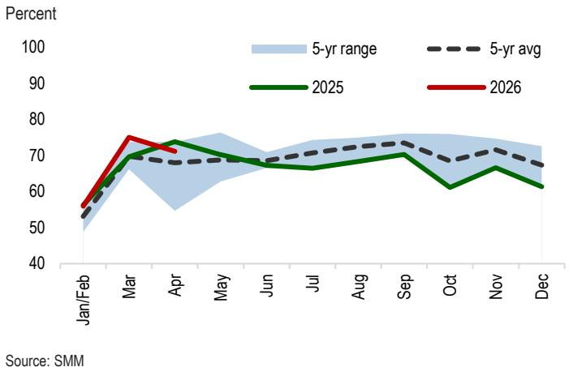

line chart

| Month   | 2025 | 2026 |
|---------|------|------|
| Jan/Feb | 55   | 58   |
| Mar     | 70   | 75   |
| Apr     | 73   | 71   |
| May     | 70   | 69   |
| Jun     | 68   | 68   |
| Jul     | 67   | 68   |
| Aug     | 68   | 70   |
| Sep     | 70   | 72   |
| Oct     | 61   | 69   |
| Nov     | 67   | 71   |
| Dec     | 62   | 68   |

Figure 47: China copper flat-rolled producer operating rates  
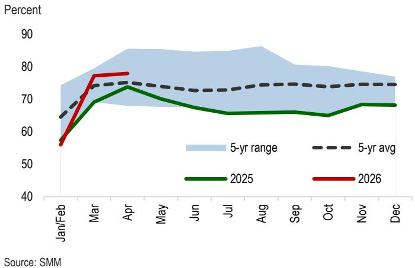

line chart

| Month   | 2025 | 2026 | 5-yr avg | 5-yr range |
|---------|------|------|----------|------------|
| Jan/Feb | 55   | 55   | 65       | 65-75      |
| Mar     | 70   | 78   | 74       | 74-85      |
| Apr     | 74   | 78   | 74       | 74-85      |
| May     | 71   | -    | 73       | 73-85      |
| Jun     | 68   | -    | 73       | 73-85      |
| Jul     | 66   | -    | 73       | 73-85      |
| Aug     | 66   | -    | 73       | 73-85      |
| Sep     | 66   | -    | 73       | 73-85      |
| Oct     | 65   | -    | 73       | 73-85      |
| Nov     | 68   | -    | 73       | 73-85      |
| Dec     | 68   | -    | 73       | 73-85      |

Figure 49: Chile and Peru copper mine production, 12mma  
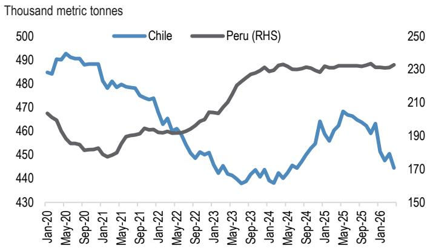

line chart

| Month   | Chile | Peru (RHS) |
|---------|-------|------------|
| Jan-20  | 485   | 470        |
| May-20  | 490   | 460        |
| Sep-20  | 485   | 455        |
| Jan-21  | 480   | 450        |
| May-21  | 475   | 455        |
| Sep-21  | 470   | 460        |
| Jan-22  | 465   | 465        |
| May-22  | 460   | 470        |
| Sep-22  | 455   | 475        |
| Jan-23  | 450   | 480        |
| May-23  | 445   | 485        |
| Sep-23  | 440   | 490        |
| Jan-24  | 435   | 495        |
| May-24  | 440   | 500        |
| Sep-24  | 450   | 505        |
| Jan-25  | 460   | 510        |
| May-25  | 470   | 515        |
| Sep-25  | 465   | 520        |
| Jan-26  | 450   | 525        |

Source: Instituto National de Estadístico, Ministerio de Energias y Minas

Figure 50: Chile copper mine production, monthly  
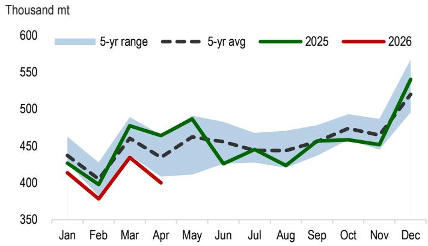

line chart

| Month | 2025 | 2026 | 5-yr avg | 5-yr range |
|-------|------|------|----------|------------|
| Jan   | 430  | 410  | 440      | 460        |
| Feb   | 400  | 380  | 410      | 430        |
| Mar   | 480  | 440  | 470      | 490        |
| Apr   | 460  | 400  | 450      | 470        |
| May   | 490  | -    | 460      | 480        |
| Jun   | 430  | -    | 450      | 470        |
| Jul   | 450  | -    | 460      | 480        |
| Aug   | 420  | -    | 450      | 470        |
| Sep   | 460  | -    | 470      | 490        |
| Oct   | 470  | -    | 480      | 500        |
| Nov   | 450  | -    | 470      | 510        |
| Dec   | 540  | -    | 520      | 560        |

Source: Instituto National de Estadístico

Figure 51: Peru copper mine production, monthly  
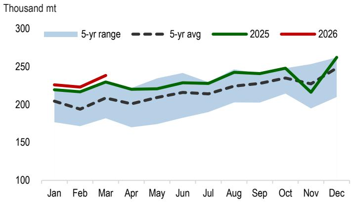

line chart

| Month | 2025 | 2026 | 5-yr avg | 5-yr range |
|-------|------|------|----------|------------|
| Jan   | 215  | 230  | 205      | 175–240    |
| Feb   | 210  | 225  | 195      | 170–230    |
| Mar   | 230  | 240  | 210      | 180–250    |
| Apr   | 220  | —    | 205      | 170–240    |
| May   | 225  | —    | 210      | 175–245    |
| Jun   | 230  | —    | 215      | 180–250    |
| Jul   | 235  | —    | 220      | 185–255    |
| Aug   | 245  | —    | 225      | 190–260    |
| Sep   | 240  | —    | 230      | 195–265    |
| Oct   | 250  | —    | 235      | 200–270    |
| Nov   | 230  | —    | 225      | 190–250    |
| Dec   | 260  | —    | 245      | 210–280    |

Source: Ministerio de Energias y Minas

Figure 52: Global copper mining C1 + sustaining capex costs by %-tile and LME 3M copper price  
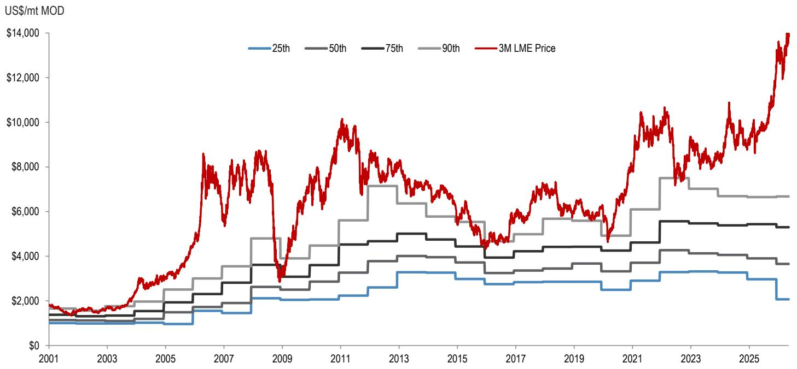

line chart

| Year | 25th | 50th | 75th | 90th | 3M LME Price |
|------|------|------|------|------|--------------|
| 2001 | ~$1,000 | ~$1,200 | ~$1,400 | ~$1,600 | ~$1,800 |
| 2003 | ~$1,200 | ~$1,400 | ~$1,600 | ~$1,800 | ~$2,000 |
| 2005 | ~$1,400 | ~$1,600 | ~$1,800 | ~$2,000 | ~$3,000 |
| 2007 | ~$1,600 | ~$1,800 | ~$2,000 | ~$2,200 | ~$5,000 |
| 2009 | ~$1,800 | ~$2,000 | ~$2,200 | ~$2,400 | ~$3,000 |
| 2011 | ~$2,000 | ~$2,200 | ~$2,400 | ~$2,600 | ~$10,000 |
| 2013 | ~$2,200 | ~$2,400 | ~$2,600 | ~$2,800 | ~$7,000 |
| 2015 | ~$2,400 | ~$2,600 | ~$2,800 | ~$3,000 | ~$5,000 |
| 2017 | ~$2,600 | ~$2,800 | ~$3,000 | ~$3,200 | ~$4,500 |
| 2019 | ~$2,800 | ~$3,000 | ~$3,200 | ~$3,400 | ~$6,500 |
| 2021 | ~$3,000 | ~$3,200 | ~$3,400 | ~$3,600 | ~$8,500 |
| 2023 | ~$3,200 | ~$3,400 | ~$3,600 | ~$3,800 | ~$9,500 |
| 2025 | ~$3,400 | ~$3,600 | ~$3,800 | ~$4,000 | ~$13,500 |
| 2027 | ~$3,600 | ~$3,800 | ~$4,000 | ~$4,200 | ~$14,500 |

Source: Wood Mackenzie, JPM Commodities Research. \*LME prices as of 4 $^{th}$ June 2026.

Table 5: China copper trade flow  
Thousand mt; Percent Change, yoy.

<table><tr><td></td><td>2018</td><td>2019</td><td>2020</td><td>2021</td><td>2022</td><td>2023</td><td>2024</td><td>2025</td><td>2026 YTD</td></tr><tr><td>Copper Concentrate Imports (Gross)</td><td>19,720</td><td>22,024</td><td>21,777</td><td>23,428</td><td>25,318</td><td>27,588</td><td>28,165</td><td>30,365</td><td>9,915</td></tr><tr><td>Refined Copper Imports</td><td>3,753</td><td>3,550</td><td>4,670</td><td>3,627</td><td>3,885</td><td>3,739</td><td>4,042</td><td>3,830</td><td>1,049</td></tr><tr><td>Unwrought Copper and Products Imports</td><td>5,293</td><td>4,991</td><td>6,686</td><td>5,530</td><td>5,872</td><td>5,504</td><td>5,700</td><td>5,350</td><td>1,570</td></tr><tr><td>Contained Copper Imports (from Scrap)</td><td>1,441</td><td>1,243</td><td>733</td><td>1,360</td><td>1,588</td><td>1,721</td><td>1,937</td><td>1,983</td><td>668</td></tr><tr><td>Refined Copper Exports</td><td>282</td><td>316</td><td>190</td><td>266</td><td>253</td><td>279</td><td>458</td><td>795</td><td>255</td></tr><tr><td>Unwrought Copper &amp; Copper Products Exports</td><td>793</td><td>841</td><td>676</td><td>933</td><td>917</td><td>958</td><td>1,287</td><td>1,673</td><td>608</td></tr><tr><td>Net Refined Imports</td><td>3,472</td><td>3,234</td><td>4,480</td><td>3,361</td><td>3,632</td><td>3,459</td><td>3,584</td><td>3,035</td><td>794</td></tr><tr><td colspan="10">YoY-%</td></tr><tr><td>Copper Concentrate Imports</td><td></td><td>11.7%</td><td>-1.1%</td><td>7.6%</td><td>8.1%</td><td>9.0%</td><td>2.1%</td><td>7.8%</td><td>-1.2%</td></tr><tr><td>Refined Copper Imports</td><td></td><td>-5.4%</td><td>31.5%</td><td>-22.3%</td><td>7.1%</td><td>-3.8%</td><td>8.1%</td><td>-5.3%</td><td>-16.5%</td></tr><tr><td>Unwrought Copper and Products Imports</td><td></td><td>-5.7%</td><td>34.0%</td><td>-17.3%</td><td>6.2%</td><td>-6.3%</td><td>3.6%</td><td>-6.1%</td><td>-10.3%</td></tr><tr><td>Contained Copper Imports (from scrap)</td><td></td><td>-13.7%</td><td>-41.0%</td><td>85.4%</td><td>16.8%</td><td>8.4%</td><td>12.5%</td><td>2.4%</td><td>0.0%</td></tr><tr><td>Refined Copper Exports</td><td></td><td>12.4%</td><td>-40.1%</td><td>40.5%</td><td>-5.2%</td><td>10.6%</td><td>63.9%</td><td>73.6%</td><td>30.8%</td></tr><tr><td>Unwrought Copper &amp; Copper Products Exports</td><td></td><td>6.1%</td><td>-19.6%</td><td>38.0%</td><td>-1.8%</td><td>4.5%</td><td>34.3%</td><td>30.0%</td><td>26.6%</td></tr><tr><td>Net Refined Imports</td><td></td><td>-6.8%</td><td>38.5%</td><td>-25.0%</td><td>8.1%</td><td>-4.8%</td><td>3.6%</td><td>24.9%</td><td>-20.9%</td></tr></table>

\*Assumes 25% copper contained in concentrate. 2026 is through April.  
Source: China Customs General Administration

## Aluminium

Figure 53: Global visible aluminium inventories  
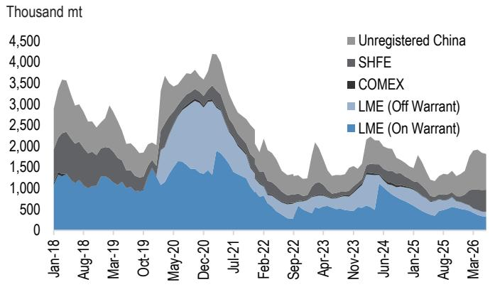

area chart

| Month   | Unregistered China | SHFE | COMEX | LME (Off Warrant) | LME (On Warrant) |
|---------|-------------------|------|-------|-------------------|------------------|
| Jan-18  | ~3,500            | ~1,500 | ~1,000 | ~1,200            | ~1,000           |
| Aug-18  | ~3,000            | ~1,200 | ~800  | ~1,000            | ~800             |
| Mar-19  | ~2,500            | ~1,000 | ~700  | ~900              | ~700             |
| Oct-19  | ~2,000            | ~800  | ~600  | ~700              | ~600             |
| May-20  | ~3,500            | ~1,500 | ~1,200 | ~1,500            | ~1,200           |
| Dec-20  | ~4,000            | ~2,000 | ~1,500 | ~2,000            | ~1,500           |
| Jul-21  | ~3,500            | ~1,800 | ~1,300 | ~1,800            | ~1,300           |
| Feb-22  | ~2,500            | ~1,200 | ~900  | ~1,200            | ~900             |
| Sep-22  | ~1,500            | ~800  | ~600  | ~800              | ~600             |
| Apr-23  | ~1,800            | ~900  | ~700  | ~900              | ~700             |
| Nov-23  | ~2,200            | ~1,100 | ~850  | ~1,100            | ~850             |
| Jun-24  | ~2,500            | ~1,300 | ~950  | ~1,300            | ~950             |
| Jan-25  | ~2,300            | ~1,200 | ~950  | ~1,250            | ~950             |
| Aug-25  | ~2,100            | ~1,150 | ~950  | ~1,250            | ~950             |
| Mar-26  | ~2,500            | ~1,350 | ~1,150 | ~1,450            | ~1,350           |

Source: CRU, LME, SHFE, COMEX. Regional includes stocks in Shanghai, Jiangsu, Nanhai, Zhejiang, Tianjin, Henan, Shandong, Chongqing. As of 5 $^{th}$ June 2026.  
Y-axis: Thousand mt; X-axis: Weeks around Chinese New Year (0 = week closest to start of CNY)

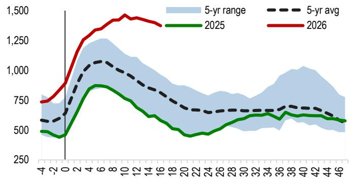

line chart

| Year | 5-yr range | 5-yr avg | 2025 | 2026 |
|------|------------|----------|------|------|
| -4   | 750        | 600      | 500  | 750  |
| -2   | 750        | 600      | 450  | 750  |
| 0    | 750        | 600      | 450  | 750  |
| 2    | 1,250      | 1,000    | 850  | 1,300 |
| 4    | 1,250      | 1,050    | 850  | 1,400 |
| 6    | 1,250      | 1,050    | 850  | 1,450 |
| 8    | 1,250      | 1,050    | 850  | 1,450 |
| 10   | 1,250      | 1,050    | 850  | 1,450 |
| 12   | 1,250      | 1,050    | 850  | 1,450 |
| 14   | 1,250      | 1,050    | 850  | 1,450 |
| 16   | 1,250      | 1,050    | 850  | 1,450 |
| 18   | 1,250      | 1,050    | 850  | 1,450 |
| 20   | 1,250      | 1,050    | 850  | 1,450 |
| 22   | 1,250      | 1,050    | 850  | 1,450 |
| 24   | 1,250      | 1,050    | 850  | 1,450 |
| 26   | 1,250      | 1,050    | 850  | 1,450 |
| 28   | 1,250      | 1,050    | 850  | 1,450 |
| 30   | 1,250      | 1,050    | 850  | 1,450 |
| 32   | 1,250      | 1,050    | 850  | 1,450 |
| 34   | 1,250      | 1,050    | 850  | 1,450 |
| 36   | 1,250      | 1,050    | 850  | 1,450 |
| 38   | 1,250      | 1,050    | 850  | 1,450 |
| 40   | 1,250      | 1,050    | 850  | 1,450 |
| 42   | 1,250      | 1,050    | 850  | 1,450 |
| 44   | 1,250      | 1,050    | 850  | 1,450 |
| 46   | 1,250      | 1,050    | 850  | 1,450 |

Source: SHFE, CRU, SMM, JPM Commodities Research

Figure 57: China apparent aluminium demand  
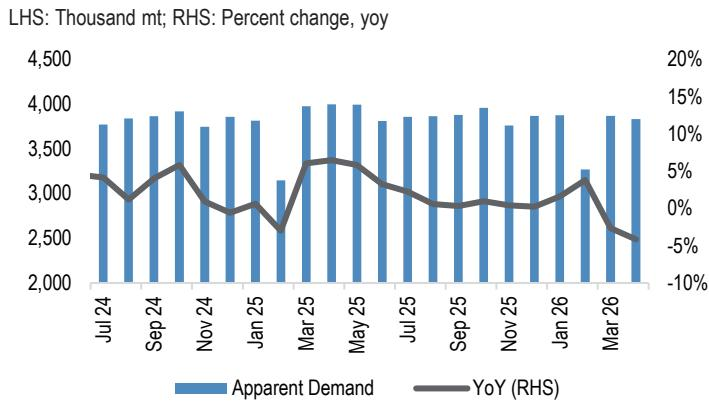

bar-line hybrid chart

| Month   | Apparent Demand (thousand mt) | YoY (%) |
|---------|-------------------------------|---------|
| Jul 24  | 3,800                         | 3.0     |
| Sep 24  | 3,900                         | 2.5     |
| Nov 24  | 3,700                         | 1.0     |
| Jan 25  | 3,800                         | -1.0    |
| Mar 25  | 4,000                         | 5.0     |
| May 25  | 4,000                         | 4.0     |
| Jul 25  | 3,800                         | 2.0     |
| Sep 25  | 3,900                         | 1.0     |
| Nov 25  | 3,700                         | -1.0    |
| Jan 26  | 3,900                         | 1.0     |
| Mar 26  | 3,800                         | -5.0    |

\*Apparent demand is calculated as (Imports-Exports)+Production-Monthly stock changes on the SHFE.  
Source: CRU, China Customs General Administration, SHFE  
Figure 56: Regional aluminium ingot premiums  
Figure 58: China apparent aluminium demand

Figure 55: Total visible China aluminium inventory (SHFE + regional warehouses)  
Figure 54: Global visible aluminium inventory in days of use  
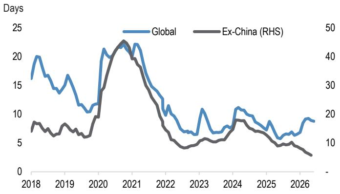

line chart

| Year | Global | Ex-China (RHS) |
|------|--------|----------------|
| 2018 | 17     | 8              |
| 2019 | 14     | 7              |
| 2020 | 11     | 10             |
| 2021 | 23     | 45             |
| 2022 | 10     | 5              |
| 2023 | 7      | 4              |
| 2024 | 11     | 9              |
| 2025 | 8      | 6              |
| 2026 | 9      | 3              |

Source: SHFE, SMM, JPM Commodities Research  
LHS: US\$/mt; RHS: c/lb

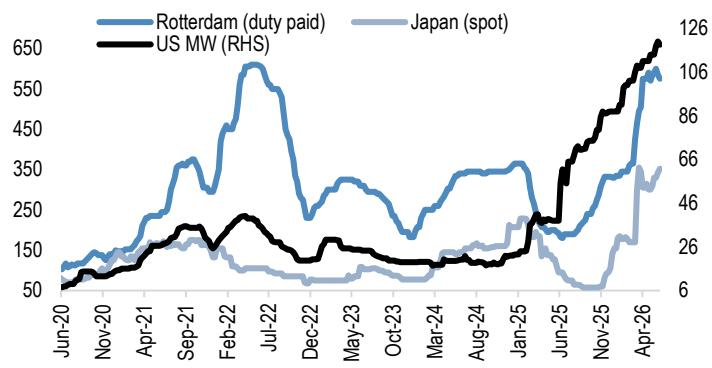

line chart

| Month    | Rotterdam (duty paid) | US MW (RHS) | Japan (spot) |
|----------|------------------------|-------------|--------------|
| Jun-20   | ~100                   | ~80         | ~6           |
| Nov-20   | ~120                   | ~100        | ~7           |
| Apr-21   | ~150                   | ~130        | ~9           |
| Sep-21   | ~200                   | ~160        | ~11          |
| Feb-22   | ~300                   | ~180        | ~13          |
| Jul-22   | ~550                   | ~200        | ~15          |
| Dec-22   | ~250                   | ~150        | ~14          |
| May-23   | ~300                   | ~140        | ~13          |
| Oct-23   | ~250                   | ~130        | ~12          |
| Mar-24   | ~300                   | ~140        | ~13          |
| Aug-24   | ~350                   | ~150        | ~14          |
| Jan-25   | ~350                   | ~160        | ~15          |
| Jun-25   | ~150                   | ~250        | ~16          |
| Nov-25   | ~300                   | ~400        | ~17          |
| Apr-26   | ~550                   | ~600        | ~35          |

Source: CRU  
Thousand metric tonnes

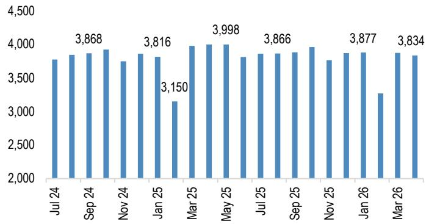

bar chart

| Date | Value |
|---|---|
| Jul 24 | 3780 |
| Sep 24 | 3868 |
| Nov 24 | 3750 |
| Jan 25 | 3816 |
| Mar 25 | 3150 |
| May 25 | 3998 |
| Jul 25 | 3866 |
| Sep 25 | 3880 |
| Nov 25 | 3770 |
| Jan 26 | 3877 |
| Mar 26 | 3834 |

\*Apparent demand is calculated as (Imports-Exports)+Production-Monthly stock changes on the SHFE.  
Source: CRU, China Customs General Administration, SHFE

Figure 59: Chinese unwrought aluminium and aluminium product exports, 3-month rolling average  
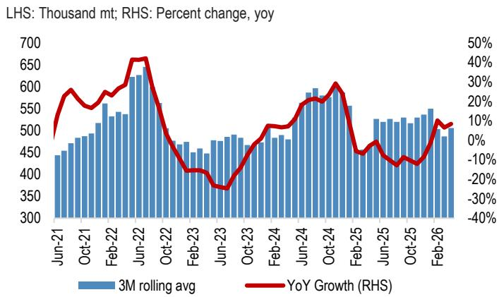

bar-line hybrid chart

| Month    | 3M rolling avg | YoY Growth (RHS) |
|----------|----------------|------------------|
| Jun-21   | ~450           | ~10%             |
| Oct-21   | ~480           | ~20%             |
| Feb-22   | ~550           | ~30%             |
| Jun-22   | ~650           | ~45%             |
| Oct-22   | ~500           | ~10%             |
| Feb-23   | ~450           | ~-10%            |
| Jun-23   | ~480           | ~-25%            |
| Oct-23   | ~470           | ~-10%            |
| Feb-24   | ~490           | ~0%              |
| Jun-24   | ~580           | ~20%             |
| Oct-24   | ~550           | ~30%             |
| Feb-25   | ~500           | ~-10%            |
| Jun-25   | ~520           | ~-15%            |
| Oct-25   | ~530           | ~-10%            |
| Feb-26   | ~550           | ~10%             |

Source: China Customs, JPM Commodities Research

Figure 61: China refined aluminium imports by region  
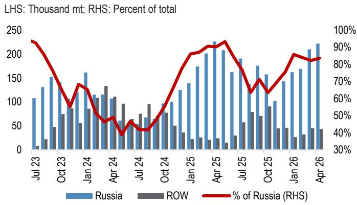

bar-line hybrid chart

LHS: Thousand mt; RHS: Percent of total
| Month | Russia (Thousand mt) | ROW (Thousand mt) | % of Russia (%) |
|---|---|---|---|
| Jul 23 | 105 | 10 | 95 |
| Oct 23 | 150 | 45 | 80 |
| Jan 24 | 160 | 55 | 70 |
| Apr 24 | 110 | 130 | 50 |
| Jul 24 | 60 | 70 | 40 |
| Oct 24 | 100 | 50 | 60 |
| Jan 25 | 140 | 25 | 85 |
| Apr 25 | 200 | 20 | 90 |
| Jul 25 | 160 | 30 | 80 |
| Oct 25 | 175 | 70 | 65 |
| Jan 26 | 160 | 40 | 75 |
| Apr 26 | 220 | 40 | 85 |

Source: China Customs, JPM Commodities Research

Figure 63: China aluminium wire & rod producer operating rates  
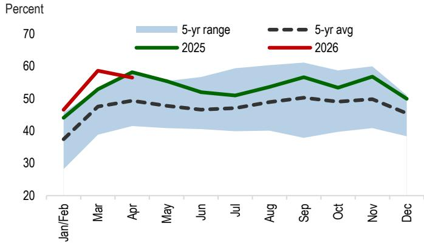

line chart

| Month   | 2025  | 2026  |
|---------|-------|-------|
| Jan/Feb | 43.0  | 46.0  |
| Mar     | 53.0  | 58.0  |
| Apr     | 58.0  | 57.0  |
| May     | 55.0  | -     |
| Jun     | 52.0  | -     |
| Jul     | 51.0  | -     |
| Aug     | 50.0  | -     |
| Sep     | 56.0  | -     |
| Oct     | 53.0  | -     |
| Nov     | 57.0  | -     |
| Dec     | 50.0  | -     |

Source: SMM, Bloomberg Finance L.P.

Figure 60: Chinese unwrought aluminium and aluminium product imports  
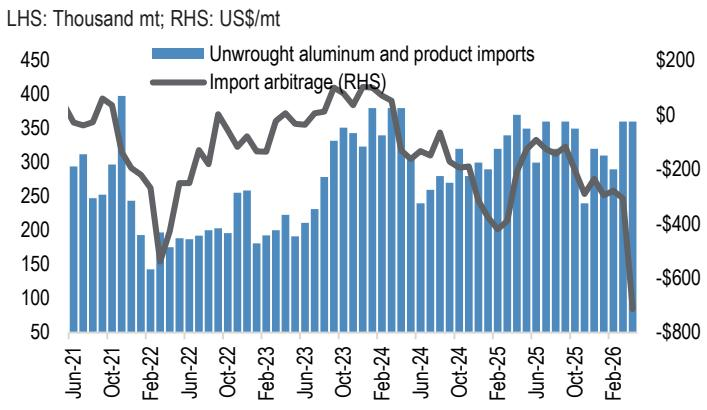

bar-line hybrid chart

| Month    | Unwrought aluminum and product imports (thousand mt) | Import arbitrage (RHS) (US$/mt) |
|----------|------------------------------------------------------|---------------------------------|
| Jun-21   | 300                                                  | 0                               |
| Oct-21   | 400                                                  | 0                               |
| Feb-22   | 150                                                  | -500                            |
| Jun-22   | 200                                                  | 0                               |
| Oct-22   | 250                                                  | 0                               |
| Feb-23   | 200                                                  | 0                               |
| Jun-23   | 350                                                  | 0                               |
| Oct-23   | 375                                                  | 0                               |
| Feb-24   | 350                                                  | 0                               |
| Jun-24   | 300                                                  | 0                               |
| Oct-24   | 350                                                  | 0                               |
| Feb-25   | 375                                                  | -500                            |
| Jun-25   | 350                                                  | -500                            |
| Oct-25   | 375                                                  | -500                            |
| Feb-26   | 350                                                  | -800                            |

Source: China Customs, JPM Commodities Research

Figure 62: China aluminium profile producer operating rates  
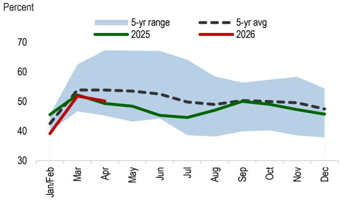

line chart

| Month   | 2025  | 2026  |
|---------|-------|-------|
| Jan/Feb | 45    | 38    |
| Mar     | 52    | 51    |
| Apr     | 50    | 50    |
| May     | 48    | 49    |
| Jun     | 46    | 47    |
| Jul     | 45    | 46    |
| Aug     | 47    | 48    |
| Sep     | 50    | 50    |
| Oct     | 49    | 49    |
| Nov     | 48    | 48    |
| Dec     | 46    | 47    |

Source: SMM, Bloomberg Finance L.P.

Figure 64: China aluminium extrusions producer operating rates  
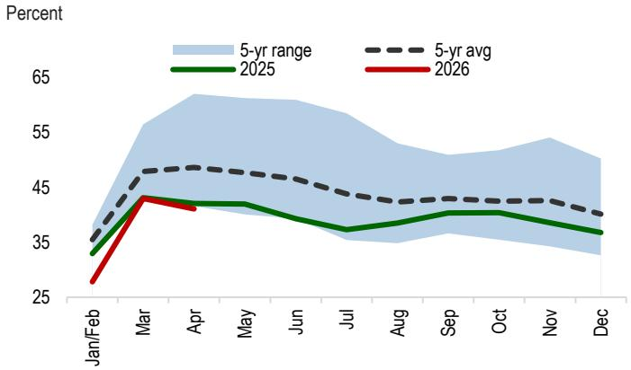

line chart

| Month   | 2025  | 2026  |
|---------|-------|-------|
| Jan/Feb | 34.0  | 27.0  |
| Mar     | 44.0  | 43.0  |
| Apr     | 43.0  | 42.0  |
| May     | 42.0  | 41.0  |
| Jun     | 41.0  | 40.0  |
| Jul     | 38.0  | 37.0  |
| Aug     | 39.0  | 38.0  |
| Sep     | 40.0  | 39.0  |
| Oct     | 41.0  | 40.0  |
| Nov     | 42.0  | 41.0  |
| Dec     | 43.0  | 42.0  |

Source: SMM, Bloomberg Finance L.P.

Figure 65: China total bauxite imports  
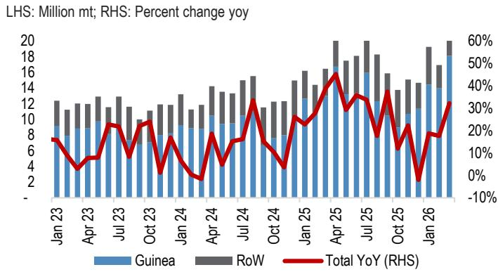

bar-line hybrid chart

LHS: Million mt; RHS: Percent change yoy
| Month | Guinea (Million mt) | RoW (Million mt) | Total YoY (RHS) (%) |
|---|---|---|---|
| Jan 23 | 8 | 4 | 15 |
| Apr 23 | 9 | 4 | 10 |
| Jul 23 | 10 | 4 | 17 |
| Oct 23 | 10 | 4 | 10 |
| Jan 24 | 9 | 4 | 10 |
| Apr 24 | 10 | 4 | 10 |
| Jul 24 | 10 | 4 | 17 |
| Oct 24 | 10 | 4 | 10 |
| Jan 25 | 12 | 4 | 20 |
| Apr 25 | 16 | 4 | 35 |
| Jul 25 | 16 | 4 | 30 |
| Oct 25 | 14 | 4 | 20 |
| Jan 26 | 14 | 4 | -5 |
| Mar 26 | 18 | 4 | 30 |

Source: China Customs

Figure 67: China alumina price  
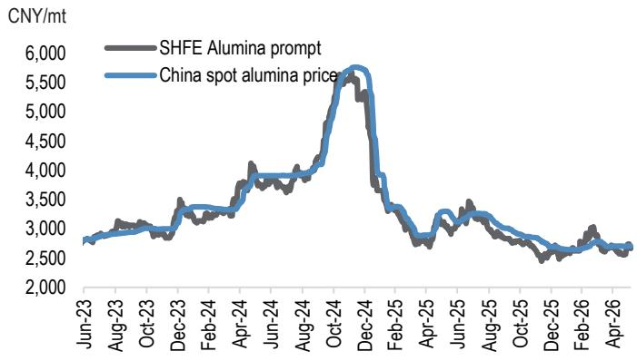

line chart

| Date   | SHFE Alumina prompt | China spot alumina price |
|--------|---------------------|--------------------------|
| Jun-23 | ~2800               | ~2800                    |
| Aug-23 | ~3000               | ~3000                    |
| Oct-23 | ~3100               | ~3100                    |
| Dec-23 | ~3400               | ~3400                    |
| Feb-24 | ~3500               | ~3500                    |
| Apr-24 | ~3800               | ~3800                    |
| Jun-24 | ~3900               | ~3900                    |
| Aug-24 | ~4000               | ~4000                    |
| Oct-24 | ~5500               | ~5700                    |
| Dec-24 | ~5800               | ~5900                    |
| Feb-25 | ~3500               | ~3500                    |
| Apr-25 | ~2800               | ~2800                    |
| Jun-25 | ~3200               | ~3200                    |
| Aug-25 | ~3100               | ~3100                    |
| Oct-25 | ~2900               | ~2900                    |
| Dec-25 | ~2600               | ~2600                    |
| Feb-26 | ~2800               | ~2800                    |
| Apr-26 | ~2700               | ~2700                    |

Source: SHFE, Asian Metal Inc, Bloomberg Finance L.P.

Figure 69: China port inventory of bauxite and alumina  
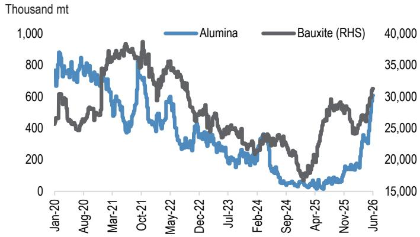

line chart

| Month   | Alumina (Thousand mt) | Bauxite (RHS) (Thousand mt) |
|---------|------------------------|-----------------------------|
| Jan-20  | ~900                   | ~35,000                     |
| Aug-20  | ~850                   | ~30,000                     |
| Mar-21  | ~700                   | ~35,000                     |
| Oct-21  | ~400                   | ~40,000                     |
| May-22  | ~600                   | ~35,000                     |
| Dec-22  | ~350                   | ~30,000                     |
| Jul-23  | ~250                   | ~25,000                     |
| Feb-24  | ~150                   | ~25,000                     |
| Sep-24  | ~50                    | ~15,000                     |
| Apr-25  | ~15,000                | ~35,000                     |
| Nov-25  | ~25,000                | ~35,000                     |
| Jun-26  | ~65,000                | ~35,000                     |

Source: Mysteel Global

Figure 66: China imports of bauxite from Guinea, 3-week ma  
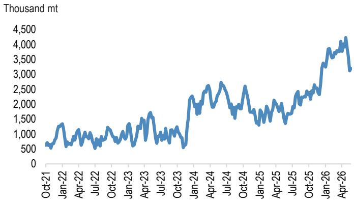

line chart

| Date    | Value (Thousand mt) |
|---------|---------------------|
| Oct-21  | ~700                |
| Jan-22  | ~1,300              |
| Apr-22  | ~800                |
| Jul-22  | ~900                |
| Oct-22  | ~1,000              |
| Jan-23  | ~1,200              |
| Apr-23  | ~1,600              |
| Jul-23  | ~1,000              |
| Oct-23  | ~600                |
| Jan-24  | ~2,000              |
| Apr-24  | ~2,600              |
| Jul-24  | ~2,800              |
| Oct-24  | ~1,800              |
| Jan-25  | ~1,300              |
| Apr-25  | ~1,800              |
| Jul-25  | ~2,200              |
| Oct-25  | ~2,500              |
| Jan-26  | ~3,500              |
| Apr-26  | ~4,200              |

Source: Mysteel Global

Figure 68: China monthly alumina production  
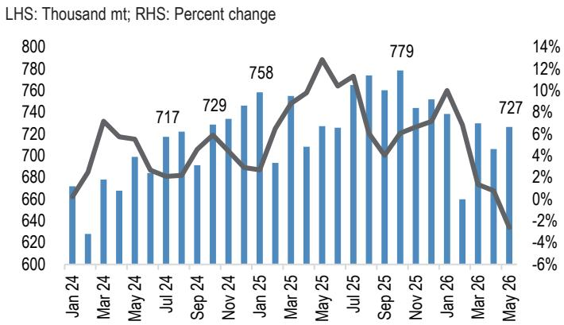

bar-line hybrid chart

LHS: Thousand mt; RHS: Percent change
| Month | Value (Thousand mt) | Percentage Change (%) |
|---|---|---|
| Jan 24 | 665 | 1.5 |
| Feb 24 | 630 | 3.0 |
| Mar 24 | 780 | 8.0 |
| Apr 24 | 665 | 7.5 |
| May 24 | 700 | 7.0 |
| Jun 24 | 717 | 5.0 |
| Jul 24 | 720 | 3.0 |
| Aug 24 | 690 | 2.5 |
| Sep 24 | 729 | 6.0 |
| Oct 24 | 735 | 5.5 |
| Nov 24 | 745 | 4.0 |
| Dec 24 | 758 | 3.5 |
| Jan 25 | 690 | 3.0 |
| Feb 25 | 758 | 7.0 |
| Mar 25 | 760 | 8.0 |
| Apr 25 | 710 | 9.0 |
| May 25 | 725 | 13.0 |
| Jun 25 | 725 | 11.0 |
| Jul 25 | 775 | 11.0 |
| Aug 25 | 760 | 6.0 |
| Sep 25 | 779 | 4.0 |
| Oct 25 | 745 | 6.0 |
| Nov 25 | 750 | 6.5 |
| Dec 25 | 735 | 8.0 |
| Jan 26 | 660 | -1.0 |
| Feb 26 | 730 | -1.5 |
| Mar 26 | 725 | -1.0 |
| Apr 26 | 710 | -1.5 |
| May 26 | 727 | -3.0 |

Source: SMM, Bloomberg Finance L.P.

Figure 70: Annualized Chinese refined monthly aluminium production  
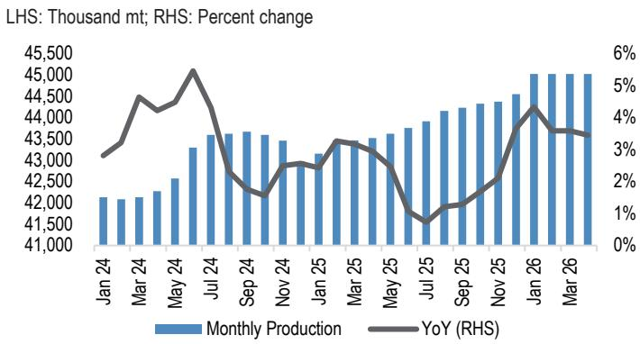

bar-line hybrid chart

| Month   | Monthly Production (thousand mt) | YoY (%) |
|---------|----------------------------------|---------|
| Jan 24  | 42,000                           | 3.0     |
| Mar 24  | 42,000                           | 4.5     |
| May 24  | 42,500                           | 5.0     |
| Jul 24  | 43,500                           | 3.5     |
| Sep 24  | 43,500                           | 2.0     |
| Nov 24  | 43,500                           | 1.5     |
| Jan 25  | 43,500                           | 3.0     |
| Mar 25  | 43,500                           | 3.5     |
| May 25  | 43,500                           | 2.5     |
| Jul 25  | 43,500                           | 1.0     |
| Sep 25  | 43,500                           | 1.5     |
| Nov 25  | 43,500                           | 2.5     |
| Jan 26  | 43,500                           | 4.0     |
| Mar 26  | 43,500                           | 3.5     |

Source: CRU

Figure 71: China aluminium ingot producer operating rates
Percent  
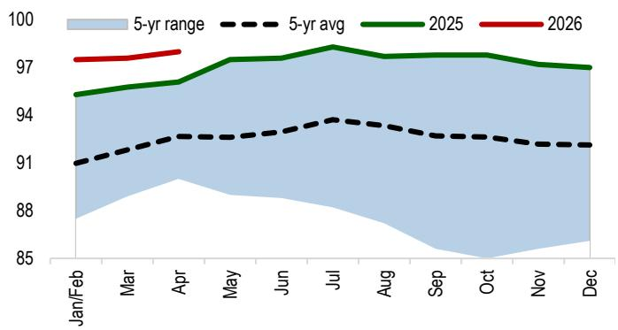

line chart

| Month   | 5-yr range | 5-yr avg | 2025  | 2026  |
|---------|------------|----------|-------|-------|
| Jan/Feb | 87.5       | 91.0     | 94.5  | 97.0  |
| Mar     | 88.5       | 91.5     | 95.0  | 97.0  |
| Apr     | 89.0       | 92.0     | 95.5  | 97.5  |
| May     | 88.5       | 92.5     | 96.0  | 97.5  |
| Jun     | 88.0       | 93.0     | 96.5  | 97.5  |
| Jul     | 87.5       | 93.5     | 97.0  | 97.5  |
| Aug     | 87.0       | 93.0     | 96.5  | 97.5  |
| Sep     | 86.0       | 92.5     | 96.0  | 97.5  |
| Oct     | 85.0       | 92.0     | 96.0  | 97.5  |
| Nov     | 85.5       | 91.5     | 96.0  | 97.5  |
| Dec     | 86.0       | 91.5     | 96.0  | 97.5  |

Source: SMM, Bloomberg Finance L.P.

Figure 72: China aluminium semis export arb proxy (China to rest of Asia)  
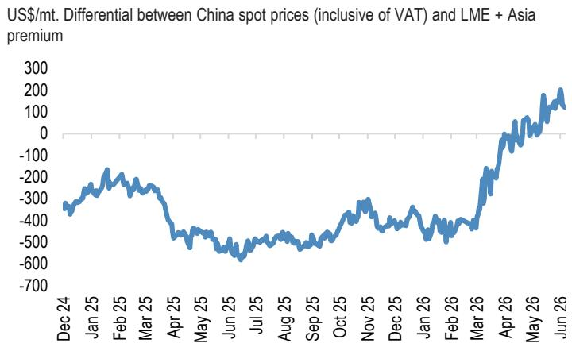

line chart

| Date   | US$/mt. Differential |
|--------|----------------------|
| Dec 24 | -350                 |
| Jan 25 | -250                 |
| Feb 25 | -200                 |
| Mar 25 | -300                 |
| Apr 25 | -450                 |
| May 25 | -500                 |
| Jun 25 | -600                 |
| Jul 25 | -550                 |
| Aug 25 | -500                 |
| Sep 25 | -450                 |
| Oct 25 | -350                 |
| Nov 25 | -300                 |
| Dec 25 | -400                 |
| Jan 26 | -500                 |
| Feb 26 | -450                 |
| Mar 26 | -300                 |
| Apr 26 | 0                    |
| May 26 | 100                  |
| Jun 26 | 200                  |

Note: Export arb is calculated as the differential between China spot prices and LME + Asia premium less conversion costs (ingot to semis), logistics, shipping and financing costs. Source: SHFE, SMM, Shanghai Metals Exchange, LME, Bloomberg L.P., JPM Commodities Research. \*Prices as of 4 $^{th}$ June 2026.

Figure 73: Global primary aluminium smelting C1 costs by %-tile and LME 3M aluminium price  
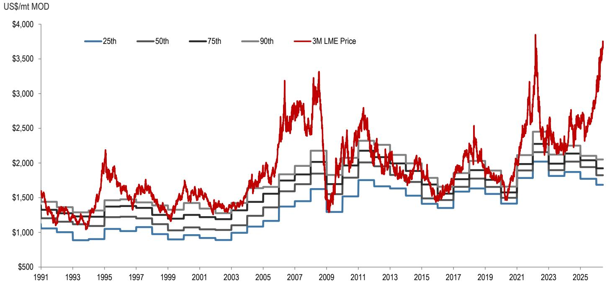

line chart

| Year | 25th  | 50th  | 75th  | 90th  | 3M LME Price |
|------|-------|-------|-------|-------|--------------|
| 1991 | ~$1,000 | ~$1,200 | ~$1,300 | ~$1,400 | ~$1,500 |
| 1993 | ~$900 | ~$1,100 | ~$1,200 | ~$1,300 | ~$1,400 |
| 1995 | ~$1,000 | ~$1,200 | ~$1,300 | ~$1,400 | ~$1,600 |
| 1997 | ~$1,000 | ~$1,200 | ~$1,300 | ~$1,400 | ~$1,600 |
| 1999 | ~$900 | ~$1,100 | ~$1,200 | ~$1,300 | ~$1,400 |
| 2001 | ~$900 | ~$1,100 | ~$1,200 | ~$1,300 | ~$1,400 |
| 2003 | ~$900 | ~$1,100 | ~$1,200 | ~$1,300 | ~$1,400 |
| 2005 | ~$1,200 | ~$1,300 | ~$1,400 | ~$1,600 | ~$1,800 |
| 2007 | ~$1,400 | ~$1,500 | ~$1,700 | ~$2,000 | ~$2,500 |
| 2009 | ~$1,300 | ~$1,600 | ~$1,800 | ~$2,200 | ~$3,500 |
| 2011 | ~$1,600 | ~$2,000 | ~$2,200 | ~$2,400 | ~$2,800 |
| 2013 | ~$1,600 | ~$2,100 | ~$2,300 | ~$2,500 | ~$2,600 |
| 2015 | ~$1,500 | ~$2,200 | ~$2,400 | ~$2,600 | ~$2,700 |
| 2017 | ~$1,600 | ~$2,300 | ~$2,500 | ~$2,700 | ~$2,800 |
| 2019 | ~$1,700 | ~$2,400 | ~$2,600 | ~$2,800 | ~$2,900 |
| 2021 | ~$1,800 | ~$2,500 | ~$2,700 | ~$3,500 | ~$3,800 |
| 2023 | ~$1,900 | ~$2,600 | ~$2,800 | ~$3,600 | ~$3,900 |
| 2025 | ~$1,850 | ~$2,750 | ~$2,950 | ~$3,750 | ~$4,555 |
| 2027 | ~$1,750 | ~$2,850 | ~$3,155 | ~$4,155 | ~$5.555 |
| 2033 | —     | —     | —     | —     | —            |

Source: Wood Mackenzie, LME, JPM Commodities Research. \*LME prices as of 4 $^{th}$ June 2026.

Table 6: China aluminium trade flow  
Thousand mt; Percent Change, yoy.

<table><tr><td></td><td>2018</td><td>2019</td><td>2020</td><td>2021</td><td>2022</td><td>2023</td><td>2024</td><td>2025</td><td>2026 YTD</td></tr><tr><td>Bauxite Imports</td><td>82,689</td><td>100,665</td><td>111,537</td><td>107,421</td><td>125,689</td><td>141,647</td><td>159,179</td><td>201,185</td><td>77,728</td></tr><tr><td>Refined Aluminium Imports</td><td>125</td><td>75</td><td>1,064</td><td>1,580</td><td>668</td><td>1,543</td><td>2,136</td><td>2,547</td><td>911</td></tr><tr><td>Unwrought Aluminium and Products Imports</td><td>596</td><td>646</td><td>2,704</td><td>3,214</td><td>2,391</td><td>3,060</td><td>3,740</td><td>3,920</td><td>1,320</td></tr><tr><td>Aluminum Waste and Scrap Imports</td><td>1,565</td><td>1,395</td><td>825</td><td>1,033</td><td>1,518</td><td>1,753</td><td>1,785</td><td>2,016</td><td>171</td></tr><tr><td>Refined Aluminium Exports</td><td>55</td><td>76</td><td>10</td><td>7</td><td>196</td><td>150</td><td>121</td><td>298</td><td>16</td></tr><tr><td>Unwrought Aluminium &amp; Aluminium Products Exports</td><td>5,800</td><td>5,735</td><td>4,860</td><td>5,620</td><td>6,604</td><td>5,679</td><td>6,660</td><td>6,130</td><td>598</td></tr><tr><td>Net Refined Imports</td><td>70</td><td>-1</td><td>1,055</td><td>1,573</td><td>472</td><td>1,393</td><td>2,015</td><td>2,249</td><td>896</td></tr><tr><td colspan="10">YoY-%</td></tr><tr><td>Bauxite Imports</td><td></td><td>21.7%</td><td>10.8%</td><td>-3.7%</td><td>17.0%</td><td>12.7%</td><td>12.4%</td><td>26.4%</td><td>14.7%</td></tr><tr><td>Refined Aluminium Imports</td><td></td><td>-39.5%</td><td>1309.8%</td><td>48.4%</td><td>-57.7%</td><td>131.0%</td><td>38.4%</td><td>19.2%</td><td>9.2%</td></tr><tr><td>Unwrought Aluminium and Products Imports</td><td></td><td>8.3%</td><td>318.8%</td><td>18.8%</td><td>-25.6%</td><td>28.0%</td><td>22.2%</td><td>4.8%</td><td>0.0%</td></tr><tr><td>Aluminum Waste and Scrap Imports</td><td></td><td>-10.8%</td><td>-40.9%</td><td>25.3%</td><td>46.9%</td><td>15.5%</td><td>1.8%</td><td>12.9%</td><td>-75.5%</td></tr><tr><td>Refined Aluminium Exports</td><td></td><td>38.0%</td><td>-87.3%</td><td>-27.1%</td><td>2680.0%</td><td>-23.4%</td><td>-19.4%</td><td>145.7%</td><td>-75.5%</td></tr><tr><td>Unwrought Aluminium &amp; Aluminium Products Exports</td><td></td><td>-1.1%</td><td>-15.3%</td><td>15.6%</td><td>17.5%</td><td>-14.0%</td><td>17.3%</td><td>-8.0%</td><td>-68.4%</td></tr></table>

\*2026 is through April.  
Source: China Customs General Administration

## Zinc

Figure 74: Global visible zinc inventories  
Thousand metric tonnes  
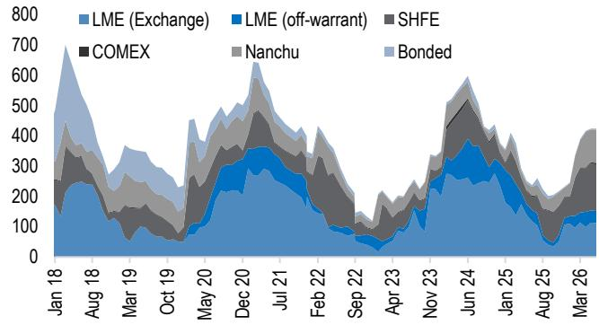

area chart

| Date   | LME (Exchange) | LME (off-warrant) | SHFE | COMEX | Nanchu | Bonded |
|--------|----------------|-------------------|------|-------|--------|--------|
| Jan 18 | 700            | 150               | 100  | 50    | 30     | 40     |
| Aug 18 | 600            | 100               | 80   | 40    | 20     | 30     |
| Mar 19 | 500            | 80                | 60   | 30    | 15     | 25     |
| Oct 19 | 400            | 60                | 40   | 20    | 10     | 20     |
| May 20 | 300            | 40                | 20   | 10    | 5      | 15     |
| Dec 20 | 200            | 20                | 10   | 5     | 2      | 10     |
| Jul 21 | 100            | 10                | 5    | 2     | 1      | 5      |
| Feb 22 | 50             | 5                 | 2    | 1     | 0.5    | 2      |
| Sep 22 | 20             | 2                 | 1    | 0.5   | 0.2    | 1      |
| Apr 23 | 10             | 1                 | 0.5  | 0.2   | 0.1    | 0.5    |
| Nov 23 | 5              | 0.5               | 0.2  | 0.1   | 0.05   | 0.2    |
| Jun 24 | 2              | 0.2               | 0.1  | 0.05  | 0.02   | 0.1    |
| Jan 25 | 1              | 0.1               | 0.05 | 0.02  | 0.01   | 0.05   |
| Aug 25 | 0.5            | 0.05              | 0.02 | 0.01  | 0.005  | 0.02   |
| Mar 26 | 1              | 0.5               | 1    | 0.2   | 0.1    | 0.3    |

Source: CRU, LME, SHFE, COMEX. Nanchu and Bonded warehouses are in China. As of 4 $^{th}$ June 2026.

Figure 76: Total visible China zinc inventory (SHFE + Regional Warehouses)  
Y-axis: Thousand mt; X-axis: Weeks around Chinese New Year (0 = week closest to start of CNY)  
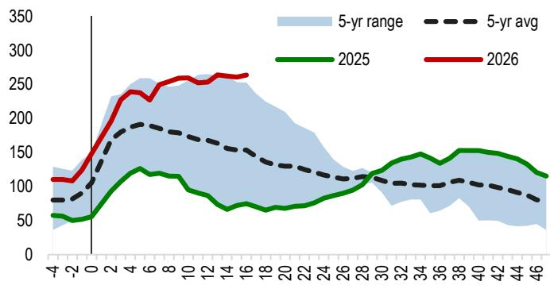

line chart

| X  | 5-yr range | 5-yr avg | 2025 | 2026 |
|----|------------|----------|------|------|
| -4 | 100        | 80       | 50   | 100  |
| -2 | 110        | 90       | 55   | 110  |
| 0  | 120        | 100      | 60   | 120  |
| 2  | 130        | 110      | 70   | 130  |
| 4  | 140        | 120      | 80   | 140  |
| 6  | 150        | 130      | 90   | 150  |
| 8  | 160        | 140      | 100  | 160  |
| 10 | 170        | 150      | 110  | 170  |
| 12 | 180        | 160      | 120  | 180  |
| 14 | 190        | 170      | 130  | 190  |
| 16 | 200        | 180      | 140  | 200  |
| 18 | 210        | 190      | 150  | 210  |
| 20 | 220        | 200      | 160  | 220  |
| 22 | 230        | 210      | 170  | 230  |
| 24 | 240        | 220      | 180  | 240  |
| 26 | 250        | 230      | 190  | 250  |
| 28 | 260        | 240      | 200  | 260  |
| 30 | 270        | 250      | 210  | 270  |
| 32 | 280        | 260      | 220  | 280  |
| 34 | 290        | 270      | 230  | 290  |
| 36 | 300        | 280      | 240  | 300  |
| 38 | 310        | 290      | 250  | 310  |
| 40 | 320        | 300      | 260  | 320  |
| 42 | 330        | 310      | 270  | 330  |
| 44 | 340        | 320      | 280  | 340  |
| 46 | 350        | 330      | 290  | 350  |

Source: SHFE, SMM, JPM Commodities Research

Figure 78: China apparent zinc demand  
LHS: Thousand mt; RHS: Percent change, yoy  
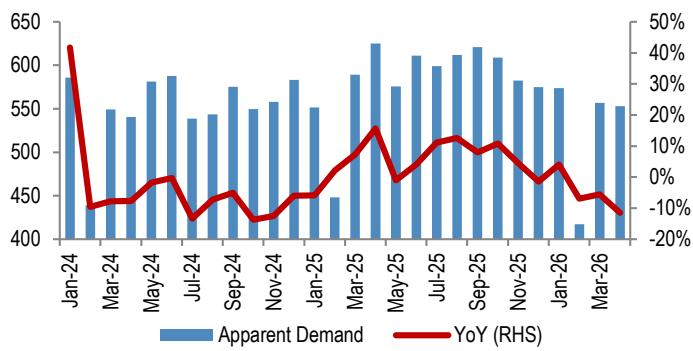

bar-line hybrid chart

| Month   | Apparent Demand | YoY (%) |
|---------|-----------------|---------|
| Jan-24  | 590             | 50      |
| Feb-24  | 550             | -10     |
| Mar-24  | 540             | -10     |
| Apr-24  | 580             | -5      |
| May-24  | 590             | 0       |
| Jun-24  | 540             | -10     |
| Jul-24  | 570             | -5      |
| Aug-24  | 550             | -10     |
| Sep-24  | 560             | -5      |
| Oct-24  | 580             | 0       |
| Nov-24  | 550             | -5      |
| Dec-24  | 560             | -10     |
| Jan-25  | 580             | -5      |
| Feb-25  | 550             | -10     |
| Mar-25  | 590             | 0       |
| Apr-25  | 620             | 10      |
| May-25  | 580             | -5      |
| Jun-25  | 610             | 0       |
| Jul-25  | 600             | 5       |
| Aug-25  | 610             | 10      |
| Sep-25  | 620             | 5       |
| Oct-25  | 610             | 0       |
| Nov-25  | 580             | -5      |
| Dec-25  | 570             | -10     |
| Jan-26  | 580             | -5      |
| Feb-26  | 420             | -10     |
| Mar-26  | 560             | -15     |

\*Apparent demand is calculated as (Imports-Exports)+Production-Monthly stock changes on the SHFE  
Source: China Customs General Administration, SHFE

Figure 75: Global visible zinc inventories in days of use  
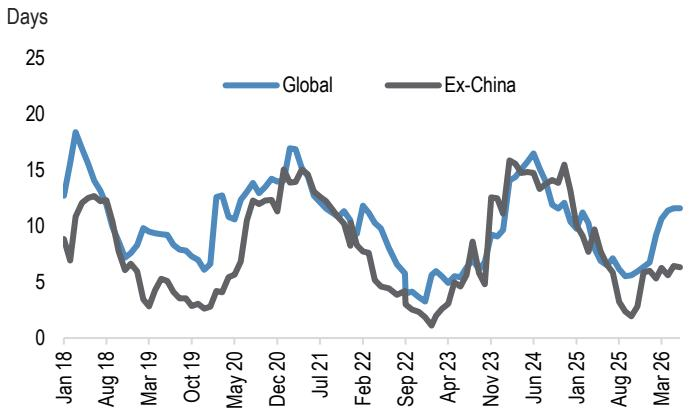

line chart

| Month   | Global | Ex-China |
|---------|--------|----------|
| Jan 18  | 13     | 7        |
| Aug 18  | 19     | 12       |
| Mar 19  | 10     | 5        |
| Oct 19  | 8      | 3        |
| May 20  | 13     | 10       |
| Dec 20  | 17     | 14       |
| Jul 21  | 12     | 10       |
| Feb 22  | 11     | 8        |
| Sep 22  | 5      | 3        |
| Apr 23  | 6      | 4        |
| Nov 23  | 10     | 12       |
| Jun 24  | 17     | 15       |
| Jan 25  | 12     | 10       |
| Aug 25  | 6      | 3        |
| Mar 26  | 12     | 6        |

Source: SHFE, SMM, JPM Commodities Research

Figure 77: Regional zinc premiums  
US\$/mt  
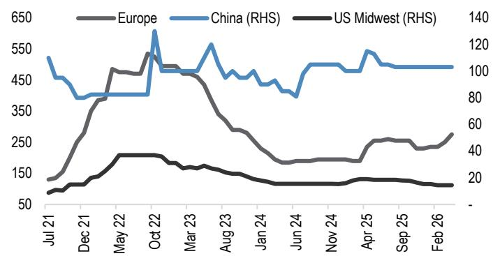

line chart

| Month   | Europe | China (RHS) | US Midwest (RHS) |
|---------|--------|-------------|------------------|
| Jul 21  | 150    | 50          | 10               |
| Dec 21  | 350    | 400         | 15               |
| May 22  | 450    | 450         | 20               |
| Oct 22  | 550    | 600         | 25               |
| Mar 23  | 450    | 450         | 20               |
| Aug 23  | 350    | 550         | 15               |
| Jan 24  | 250    | 450         | 10               |
| Jun 24  | 200    | 350         | 10               |
| Nov 24  | 200    | 450         | 10               |
| Apr 25  | 250    | 500         | 15               |
| Sep 25  | 250    | 450         | 15               |
| Feb 26  | 300    | 450         | 15               |

Source: CRU

Figure 79: China apparent zinc demand  
Thousand mt  
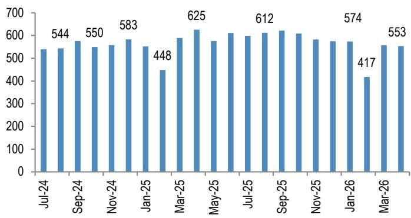

bar chart

| Month | Value |
|---|---|
| Jul-24 | 544 |
| Sep-24 | 550 |
| Nov-24 | 583 |
| Jan-25 | 448 |
| Mar-25 | 625 |
| May-25 | 570 |
| Jul-25 | 612 |
| Sep-25 | 612 |
| Nov-25 | 580 |
| Jan-26 | 574 |
| Mar-26 | 553 |

\*Apparent demand is calculated as (Imports-Exports)+Production-Monthly stock changes on the SHFE.  
Source: China Customs General Administration, SHFE

Figure 80: China zinc spot concentrate treatment charges vs annual benchmark  
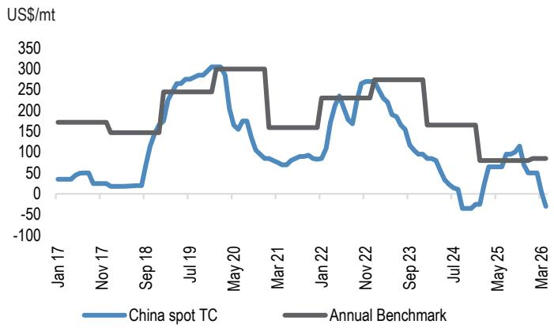

line chart

| Date   | China spot TC | Annual Benchmark |
|--------|---------------|------------------|
| Jan 17 | ~40           | ~180             |
| Nov 17 | ~20           | ~160             |
| Sep 18 | ~150          | ~150             |
| Jul 19 | ~280          | ~250             |
| May 20 | ~300          | ~300             |
| Mar 21 | ~100          | ~150             |
| Jan 22 | ~250          | ~250             |
| Nov 22 | ~280          | ~280             |
| Sep 23 | ~150          | ~280             |
| Jul 24 | ~-50          | ~150             |
| May 25 | ~100          | ~100             |
| Mar 26 | ~-50          | ~100             |

Source: Metal Bulletin, Platts, Wood Mackenzie

Figure 82: China zinc concentrate imports  
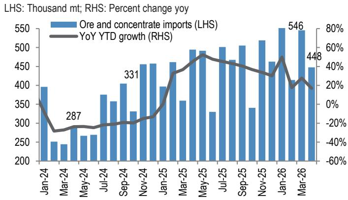

bar-line hybrid chart

| Month    | Ore and concentrate imports (Km) | YoY YTD growth (%) |
| -------- | --------------------------------- | ------------------ |
| Jan-24   | 390                               | 10                 |
| Mar-24   | 250                               | -30                |
| May-24   | 287                               | -25                |
| Jul-24   | 370                               | -20                |
| Sep-24   | 350                               | -15                |
| Nov-24   | 331                               | -10                |
| Jan-25   | 460                               | 10                 |
| Mar-25   | 360                               | 30                 |
| May-25   | 490                               | 50                 |
| Jul-25   | 330                               | 40                 |
| Sep-25   | 500                               | 35                 |
| Nov-25   | 460                               | 30                 |
| Jan-26   | 546                               | 50                 |
| Mar-26   | 448                               | 20                 |

Source: NBS, Bloomberg Finance L.P.

Figure 84: China refined zinc exports  
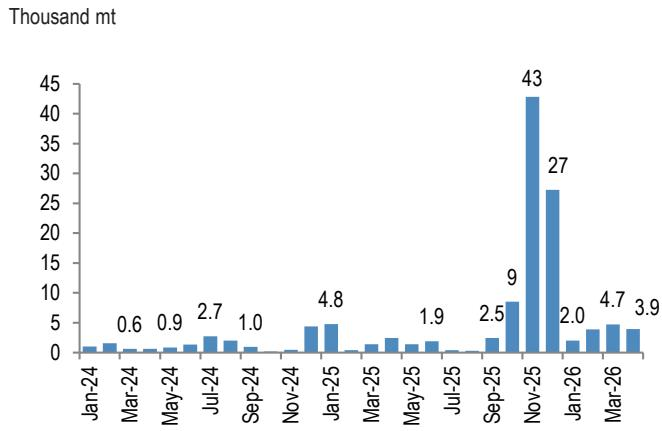

bar chart

| Month | Value (Thousand mt) |
|---|---|
| Jan-24 | 1.0 |
| Feb-24 | 1.5 |
| Mar-24 | 0.6 |
| Apr-24 | 0.7 |
| May-24 | 0.9 |
| Jun-24 | 1.3 |
| Jul-24 | 2.7 |
| Aug-24 | 2.0 |
| Sep-24 | 1.0 |
| Oct-24 | 0.3 |
| Nov-24 | 0.3 |
| Dec-24 | 4.8 |
| Jan-25 | 0.5 |
| Feb-25 | 1.5 |
| Mar-25 | 2.5 |
| Apr-25 | 1.8 |
| May-25 | 1.9 |
| Jun-25 | 0.5 |
| Jul-25 | 0.3 |
| Aug-25 | 2.5 |
| Sep-25 | 9.0 |
| Oct-25 | 43.0 |
| Nov-25 | 27.0 |
| Dec-25 | 2.0 |
| Jan-26 | 4.7 |
| Feb-26 | 4.7 |
| Mar-26 | 3.9 |

Source: NBS, Bloomberg Finance L.P.  
Figure 85: China zinc export arb proxy

Figure 81: China net imports of refined zinc and China's zinc import arb  
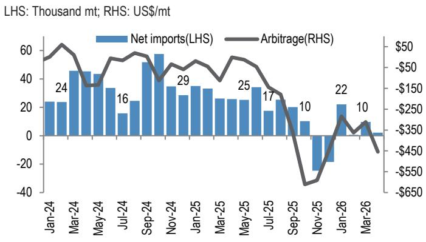

bar-line hybrid chart

| Month    | Net imports (LHS) | Arbitrage (RHS) |
| -------- | ----------------- | --------------- |
| Jan-24   | 24                | $50             |
| Mar-24   | 44                | $40             |
| May-24   | 36                | $30             |
| Jul-24   | 16                | $40             |
| Sep-24   | 58                | $50             |
| Nov-24   | 34                | $40             |
| Jan-25   | 29                | $50             |
| Mar-25   | 34                | $40             |
| May-25   | 25                | $50             |
| Jul-25   | 17                | $40             |
| Sep-25   | 10                | -$650           |
| Nov-25   | -10               | -$50            |
| Jan-26   | 22                | -$35            |
| Mar-26   | 10                | -$45            |

Source: China Customs, CRU, JPM Commodities Research

Figure 83: China zinc ore port inventories  
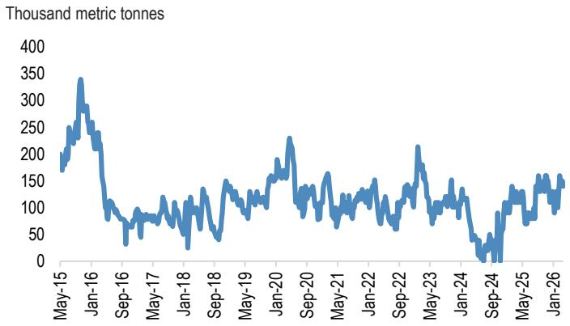

line chart

| Date    | Thousand metric tonnes |
|---------|------------------------|
| May-15  | ~180                   |
| Jan-16  | ~340                   |
| Sep-16  | ~100                   |
| May-17  | ~90                    |
| Jan-18  | ~120                   |
| Sep-18  | ~150                   |
| May-19  | ~130                   |
| Jan-20  | ~230                   |
| Sep-20  | ~140                   |
| May-21  | ~160                   |
| Jan-22  | ~140                   |
| Sep-22  | ~220                   |
| May-23  | ~130                   |
| Jan-24  | ~150                   |
| Sep-24  | ~10                    |
| May-25  | ~140                   |
| Jan-26  | ~160                   |

\*Concentrate inventory at the Lianyungang port.  
Source: SMM  
US\$/mt. Differential between China spot prices (inclusive of VAT) and LME 3M + Asia premium

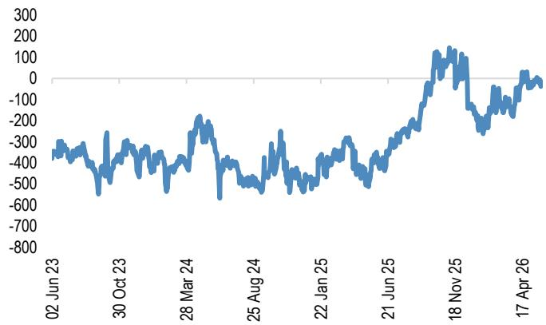

line chart

| Date       | Value |
| ---------- | ----- |
| 02 Jun 23  | -300  |
| 30 Oct 23  | -400  |
| 28 Mar 24  | -200  |
| 25 Aug 24  | -500  |
| 22 Jan 25  | -400  |
| 21 Jun 25  | -300  |
| 18 Nov 25  | 100   |
| 17 Apr 26  | 0     |

Source: SHFE, SMM, Shanghai Metals Exchange, LME, Bloomberg L.P., JPM Commodities Research. \*Prices as of 4 $^{th}$ June 2026.

Figure 86: China zinc galvanizers operating rates  
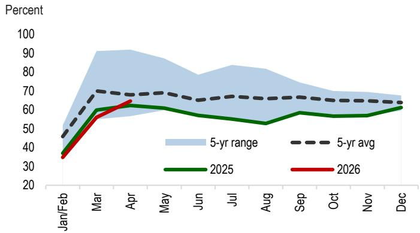

line chart

| Month   | 2025 | 2026 |
|---------|------|------|
| Jan/Feb | 35   | 35   |
| Mar     | 60   | 55   |
| Apr     | 62   | 65   |
| May     | 60   | 65   |
| Jun     | 58   | 65   |
| Jul     | 57   | 65   |
| Aug     | 55   | 65   |
| Sep     | 58   | 65   |
| Oct     | 57   | 65   |
| Nov     | 58   | 65   |
| Dec     | 60   | 65   |

Source: SMM, JPM Commodities Research

Figure 87: China monthly refined zinc production  
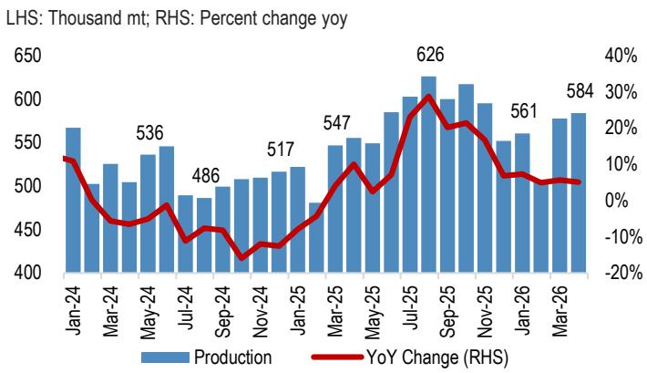

bar-line hybrid chart

LHS: Thousand mt; RHS: Percent change yoy
| Month | Production (Thousand mt) | YoY Change (%) |
|---|---|---|
| Jan-24 | 570 | 12 |
| Feb-24 | 500 | -8 |
| Mar-24 | 525 | -13 |
| Apr-24 | 505 | -11 |
| May-24 | 536 | -9 |
| Jun-24 | 545 | -6 |
| Jul-24 | 486 | -13 |
| Aug-24 | 490 | -11 |
| Sep-24 | 505 | -13 |
| Oct-24 | 510 | -10 |
| Nov-24 | 517 | -9 |
| Dec-24 | 520 | -6 |
| Jan-25 | 470 | -3 |
| Feb-25 | 547 | 6 |
| Mar-25 | 555 | 10 |
| Apr-25 | 548 | 3 |
| May-25 | 580 | 6 |
| Jun-25 | 600 | 17 |
| Jul-25 | 626 | 30 |
| Aug-25 | 600 | 23 |
| Sep-25 | 618 | 21 |
| Oct-25 | 598 | 17 |
| Nov-25 | 550 | 8 |
| Dec-25 | 561 | 7 |
| Jan-26 | 570 | 6 |
| Feb-26 | 580 | 6 |
| Mar-26 | 584 | 6 |

Source: SMM, Bloomberg Finance L.P.

Figure 88: Global zinc C1 mining costs by %-tile and LME 3M copper price  
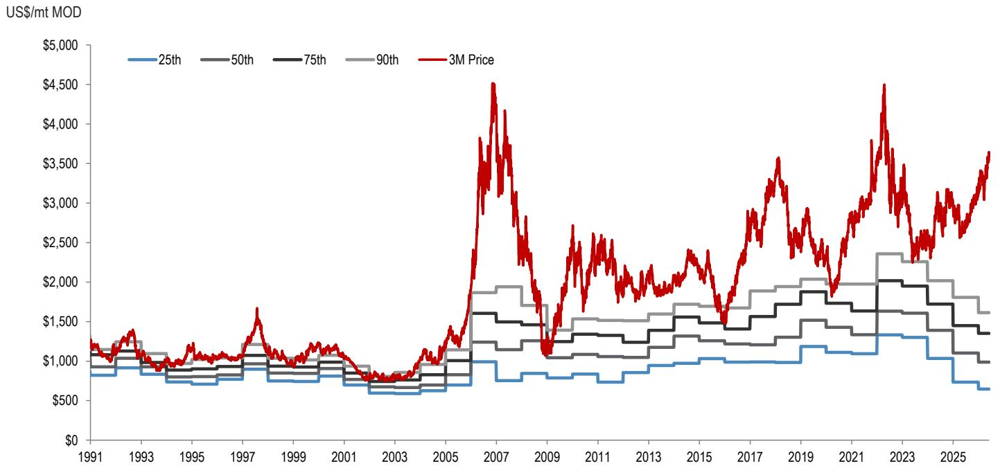

line chart

| Year | 25th | 50th | 75th | 90th | 3M Price |
| --- | --- | --- | --- | --- | --- |
| 1991 | ~$800 | ~$1,000 | ~$1,000 | ~$1,000 | ~$1,000 |
| 1993 | ~$800 | ~$1,000 | ~$1,000 | ~$1,000 | ~$1,400 |
| 1995 | ~$800 | ~$1,000 | ~$1,000 | ~$1,000 | ~$1,000 |
| 1997 | ~$800 | ~$1,000 | ~$1,000 | ~$1,000 | ~$1,600 |
| 1999 | ~$800 | ~$1,000 | ~$1,000 | ~$1,000 | ~$1,200 |
| 2001 | ~$800 | ~$1,000 | ~$1,000 | ~$1,000 | ~$1,200 |
| 2003 | ~$800 | ~$1,000 | ~$1,000 | ~$1,000 | ~$800 |
| 2005 | ~$800 | ~$1,000 | ~$1,000 | ~$1,000 | ~$1,400 |
| 2007 | ~$800 | ~$1,200 | ~$1,500 | ~$2,500 | ~$4,500 |
| 2009 | ~$800 | ~$1,200 | ~$1,500 | ~$2,500 | ~$1,200 |
| 2011 | ~$800 | ~$1,200 | ~$1,500 | ~$2,500 | ~$2,500 |
| 2013 | ~$800 | ~$1,200 | ~$1,500 | ~$2,500 | ~$2,500 |
| 2015 | ~$800 | ~$1,200 | ~$1,500 | ~$2,500 | ~$2,500 |
| 2017 | ~$800 | ~$1,200 | ~$1,500 | ~$2,500 | ~$3,500 |
| 2019 | ~$800 | ~$1,200 | ~$1,500 | ~$2,500 | ~$3,500 |
| 2021 | ~$800 | ~$1,200 | ~$1,500 | ~$2,500 | ~$3,500 |
| 2023 | ~$800 | ~$1,200 | ~$1,500 | ~$2,500 | ~$4,500 |
| 2025 | ~$800 | ~$1,200 | ~$1,500 | ~$2,500 | ~$3,500 |
| 2027 | ~$800 | ~$1,200 | ~$1,500 | ~$2,500 | ~$3,500 |
| 24e-27 | ~$656 | ~$1,156 | ~$1,456 | ~$2,456 | ~$3,656 |
| 24e-26 | - | - | - | - | - |
| 24e-25 | - | - | - | - | - |
| 24e-24 | - | - | - | - | - |
| 24e-23 | - | - | - | - | - |
| 24e-22 | - | - | - | - | - |
| 24e-21 | - | - | - | - | - |

Source: Wood Mackenzie, LME, JPM Commodities Research. \*LME prices as of 4 $^{th}$ June 2026.

Table 7: China zinc trade flow  
Thousand mt; Percent Change, yoy.

<table><tr><td></td><td>2018</td><td>2019</td><td>2020</td><td>2021</td><td>2022</td><td>2023</td><td>2024</td><td>2025</td><td>2026 YTD</td></tr><tr><td>Concentrate Imports (Gross)</td><td>2,969</td><td>3,183</td><td>3,822</td><td>3,648</td><td>4,135</td><td>4,723</td><td>4,097</td><td>5,331</td><td>2,002</td></tr><tr><td>Refined Zinc Imports</td><td>715</td><td>605</td><td>541</td><td>434</td><td>79</td><td>380</td><td>446</td><td>304</td><td>49</td></tr><tr><td>Unwrought Zinc and Alloys Imports</td><td>821</td><td>692</td><td>615</td><td>520</td><td>142</td><td>429</td><td>495</td><td>348</td><td>60</td></tr><tr><td>Refined Zinc Exports</td><td>22</td><td>62</td><td>29</td><td>5</td><td>81</td><td>9</td><td>17</td><td>94</td><td>15</td></tr><tr><td>Unwrought Zinc and Alloys Exports</td><td>24</td><td>64</td><td>32</td><td>7</td><td>83</td><td>12</td><td>22</td><td>101</td><td>15</td></tr><tr><td>Net Refined Imports</td><td>693</td><td>544</td><td>512</td><td>429</td><td>-2</td><td>371</td><td>429</td><td>210</td><td>35</td></tr><tr><td colspan="10">YoY-%</td></tr><tr><td>Concentrate Imports (Gross)</td><td></td><td>7.2%</td><td>20.1%</td><td>-4.6%</td><td>13.3%</td><td>14.2%</td><td>-13.3%</td><td>30.1%</td><td>16.9%</td></tr><tr><td>Refined Zinc Imports</td><td></td><td>-15.4%</td><td>-10.6%</td><td>-19.8%</td><td>-81.8%</td><td>380.1%</td><td>17.2%</td><td>-31.8%</td><td>-62.0%</td></tr><tr><td>Unwrought Zinc and Alloys Imports</td><td></td><td>-15.7%</td><td>-11.2%</td><td>-15.4%</td><td>-72.6%</td><td>201.7%</td><td>15.3%</td><td>-29.8%</td><td>-58.5%</td></tr><tr><td>Refined Zinc Exports</td><td></td><td>181.3%</td><td>-52.5%</td><td>-81.8%</td><td>1415.5%</td><td>-89.0%</td><td>88.2%</td><td>460.0%</td><td>59.7%</td></tr><tr><td>Unwrought Zinc and Alloys Exports</td><td></td><td>163.9%</td><td>-50.8%</td><td>-79.0%</td><td>1154.1%</td><td>-85.1%</td><td>78.4%</td><td>358.4%</td><td>28.7%</td></tr></table>

\*2026 is through April.  
Source: China Customs General Administration

## Nickel

Figure 89: Global visible nickel inventory  
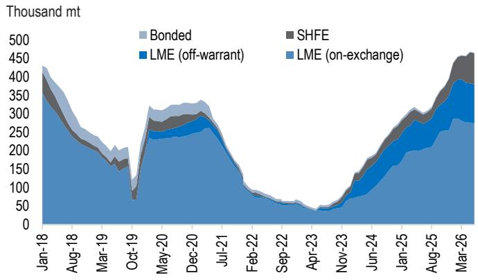

area chart

| Month    | Bonded | SHFE | LME (off-warrant) | LME (on-exchange) |
|----------|--------|------|-------------------|-------------------|
| Jan-18   | 400    | 100  | 100               | 100               |
| Aug-18   | 350    | 100  | 100               | 100               |
| Mar-19   | 250    | 100  | 100               | 100               |
| Oct-19   | 100    | 50   | 50                | 50                |
| May-20   | 300    | 50   | 50                | 50                |
| Dec-20   | 300    | 50   | 50                | 50                |
| Jul-21   | 250    | 50   | 50                | 50                |
| Feb-22   | 100    | 50   | 50                | 50                |
| Sep-22   | 50     | 50   | 50                | 50                |
| Apr-23   | 50     | 50   | 50                | 50                |
| Nov-23   | 100    | 50   | 50                | 50                |
| Jun-24   | 200    | 50   | 50                | 50                |
| Jan-25   | 300    | 50   | 50                | 50                |
| Aug-25   | 400    | 50   | 50                | 50                |
| Mar-26   | 450    | 50   | 50                | 50                |

Source: LME, SHFE, COMEX. Bonded warehouses are in China. As of 4 $^{th}$ June 2026.

Figure 90: Global visible nickel inventory in days of use  
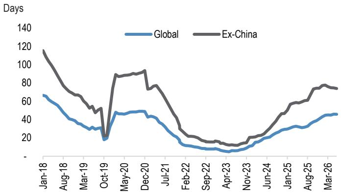

line chart

| Month    | Global | Ex-China |
| -------- | ------ | -------- |
| Jan-18   | 65     | 115      |
| Aug-18   | 50     | 80       |
| Mar-19   | 35     | 60       |
| Oct-19   | 20     | 40       |
| May-20   | 45     | 90       |
| Dec-20   | 45     | 95       |
| Jul-21   | 35     | 75       |
| Feb-22   | 20     | 30       |
| Sep-22   | 15     | 20       |
| Apr-23   | 10     | 15       |
| Nov-23   | 15     | 25       |
| Jun-24   | 25     | 40       |
| Jan-25   | 35     | 55       |
| Aug-25   | 40     | 70       |
| Mar-26   | 45     | 75       |

Source: SHFE, JPM Commodities Research

Figure 91: Chinese nickel pig iron prices (8-12%) and LME cash nickel prices  
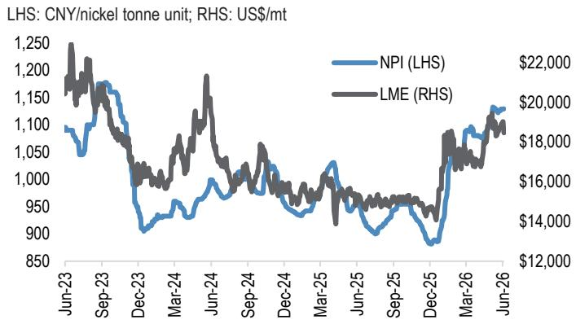

line chart

| Date   | NPI (LHS) | LME (RHS) |
|--------|-----------|-----------|
| Jun-23 | ~1,100    | ~$22,000  |
| Sep-23 | ~1,150    | ~$20,000  |
| Dec-23 | ~950      | ~$16,000  |
| Mar-24 | ~1,000    | ~$18,000  |
| Jun-24 | ~1,150    | ~$22,000  |
| Sep-24 | ~1,050    | ~$18,000  |
| Dec-24 | ~950      | ~$16,000  |
| Mar-25 | ~1,050    | ~$18,000  |
| Jun-25 | ~950      | ~$16,000  |
| Sep-25 | ~950      | ~$16,000  |
| Dec-25 | ~850      | ~$14,000  |
| Mar-26 | ~1,100    | ~$18,000  |
| Jun-26 | ~1,150    | ~$20,000  |

Source: SMM, LME, Bloomberg Finance L.P., JPM Commodities Research. As of 4 $^{th}$ June 2026.

Figure 92: Discount spread of NPI prices compared to LME cash nickel prices  
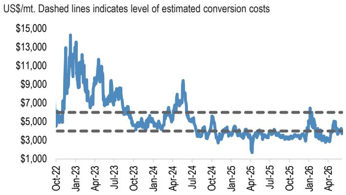

line chart

| Date   | Value     |
|--------|-----------|
| Oct-22 | $5,000    |
| Jan-23 | $14,000   |
| Apr-23 | $11,000   |
| Jul-23 | $9,000    |
| Oct-23 | $7,000    |
| Jan-24 | $5,000    |
| Apr-24 | $9,000    |
| Jul-24 | $5,000    |
| Oct-24 | $3,000    |
| Jan-25 | $3,000    |
| Apr-25 | $1,000    |
| Jul-25 | $3,000    |
| Oct-25 | $3,000    |
| Jan-26 | $7,000    |
| Apr-26 | $5,000    |

Source: SMM, LME, Bloomberg Finance L.P., JPM Commodities Research. As of 4 $^{th}$ June 2026.

Figure 93: China monthly refined nickel imports and exports  
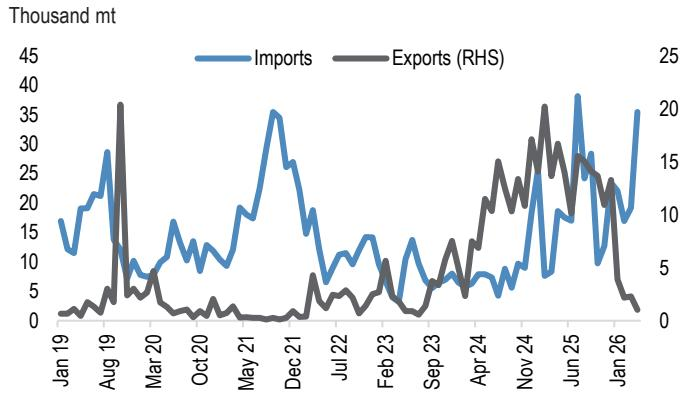

line chart

| Month   | Imports (thousand mt) | Exports (RHS) (thousand mt) |
|---------|------------------------|-----------------------------|
| Jan 19  | ~15                    | ~1                          |
| Aug 19  | ~30                    | ~38                         |
| Mar 20  | ~10                    | ~5                          |
| Oct 20  | ~15                    | ~2                          |
| May 21  | ~20                    | ~1                          |
| Dec 21  | ~35                    | ~5                          |
| Jul 22  | ~15                    | ~5                          |
| Feb 23  | ~10                    | ~5                          |
| Sep 23  | ~5                     | ~5                          |
| Apr 24  | ~10                    | ~10                         |
| Nov 24  | ~20                    | ~25                         |
| Jun 25  | ~35                    | ~20                         |
| Jan 26  | ~30                    | ~10                         |

Source: China Customs, Bloomberg Finance L.P.

Figure 94: China monthly ferronickel and nickel ore imports  
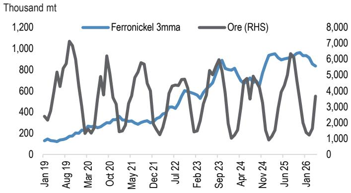

line chart

| Month   | Ferronickel 3mma (Thousand mt) | Ore (RHS) (Thousand mt) |
|---------|-------------------------------|--------------------------|
| Jan 19  | ~150                          | ~350                     |
| Aug 19  | ~200                          | ~1,100                   |
| Mar 20  | ~250                          | ~200                     |
| Oct 20  | ~300                          | ~900                     |
| May 21  | ~350                          | ~850                     |
| Dec 21  | ~400                          | ~200                     |
| Jul 22  | ~500                          | ~700                     |
| Feb 23  | ~600                          | ~200                     |
| Sep 23  | ~700                          | ~900                     |
| Apr 24  | ~650                          | ~150                     |
| Nov 24  | ~750                          | ~500                     |
| Jun 25  | ~900                          | ~950                     |
| Jan 26  | ~850                          | ~200                     |

Source: China Customs, Bloomberg Finance L.P.

Figure 95: Indonesia monthly nickel mine production  
LHS: Thousand mt; RHS: Percent change, yoy  
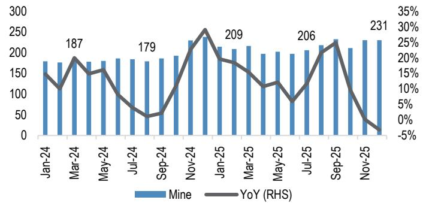

bar-line hybrid chart

| Month | Mine | YoY (RHS) (%) |
|---|---|---|
| Jan-24 | 180 | 15 |
| Feb-24 | 175 | 10 |
| Mar-24 | 187 | 20 |
| Apr-24 | 180 | 15 |
| May-24 | 185 | 15 |
| Jun-24 | 185 | 10 |
| Jul-24 | 185 | 5 |
| Aug-24 | 180 | 0 |
| Sep-24 | 179 | 0 |
| Oct-24 | 190 | 10 |
| Nov-24 | 230 | 25 |
| Dec-24 | 250 | 30 |
| Jan-25 | 240 | 25 |
| Feb-25 | 209 | 20 |
| Mar-25 | 215 | 15 |
| Apr-25 | 200 | 10 |
| May-25 | 200 | 10 |
| Jun-25 | 206 | 5 |
| Jul-25 | 210 | 10 |
| Aug-25 | 220 | 15 |
| Sep-25 | 230 | 25 |
| Oct-25 | 215 | 10 |
| Nov-25 | 231 | -5 |

Source: Bloomberg Finance L.P.

Figure 97: China stainless steel production  
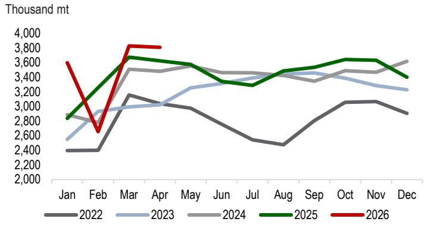

line chart

| Month | 2022  | 2023  | 2024  | 2025  | 2026  |
|-------|-------|-------|-------|-------|-------|
| Jan   | 2,400 | 2,600 | 2,800 | 2,900 | 3,600 |
| Feb   | 2,400 | 2,900 | 3,000 | 3,100 | 2,700 |
| Mar   | 3,100 | 3,000 | 3,500 | 3,700 | 3,800 |
| Apr   | 3,000 | 3,100 | 3,500 | 3,700 | 3,800 |
| May   | 2,900 | 3,200 | 3,500 | 3,600 | -     |
| Jun   | 2,800 | 3,300 | 3,500 | 3,500 | -     |
| Jul   | 2,600 | 3,400 | 3,400 | 3,400 | -     |
| Aug   | 2,500 | 3,400 | 3,400 | 3,500 | -     |
| Sep   | -     | 3,400 | 3,400 | 3,500 | -     |
| Oct   | -     | 3,400 | 3,500 | 3,600 | -     |
| Nov   | -     | 3,400 | 3,500 | 3,600 | -     |
| Dec   | -     | 3,400 | 3,600 | 3,400 | -     |

Source: CRU

Figure 99: Total visible China nickel inventory (SHFE + Regional Warehouses)  
Y-axis: Thousand mt; X-axis: Weeks around Chinese New Year (0 = week closest to start of CNY)  
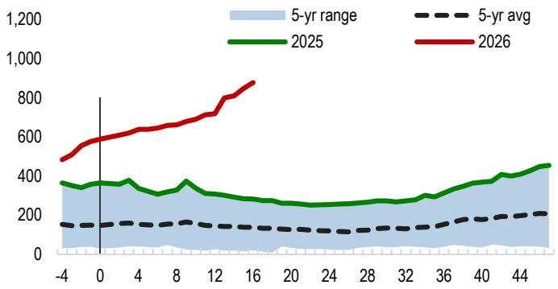

line chart

| X  | 2025 | 2026 | 5-yr avg |
|----|------|------|----------|
| -4 | 380  | 500  | 150      |
| 0  | 370  | 600  | 150      |
| 4  | 360  | 650  | 150      |
| 8  | 350  | 700  | 150      |
| 12 | 340  | 750  | 150      |
| 16 | 330  | 850  | 150      |
| 20 | 320  | —    | 150      |
| 24 | 310  | —    | 150      |
| 28 | 300  | —    | 150      |
| 32 | 310  | —    | 150      |
| 36 | 330  | —    | 150      |
| 40 | 360  | —    | 150      |
| 44 | 450  | —    | 150      |

Source: SHFE, SMM, JPM Commodities Research

Figure 96: Indonesia monthly refined nickel production  
LHS: Thousand mt; RHS: Percent change, yoy  
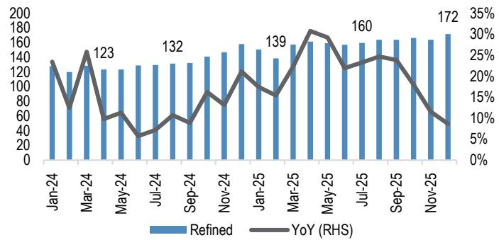

bar-line hybrid chart

| Month | Refined | YoY (RHS) (%) |
|---|---|---|
| Jan-24 | 130 | 25 |
| Feb-24 | 120 | 10 |
| Mar-24 | 140 | 28 |
| Apr-24 | 123 | 12 |
| May-24 | 123 | 10 |
| Jun-24 | 130 | 6 |
| Jul-24 | 132 | 7 |
| Aug-24 | 132 | 9 |
| Sep-24 | 132 | 10 |
| Oct-24 | 140 | 15 |
| Nov-24 | 150 | 18 |
| Dec-24 | 155 | 16 |
| Jan-25 | 150 | 15 |
| Feb-25 | 139 | 13 |
| Mar-25 | 155 | 25 |
| Apr-25 | 160 | 30 |
| May-25 | 160 | 28 |
| Jun-25 | 160 | 25 |
| Jul-25 | 160 | 25 |
| Aug-25 | 160 | 24 |
| Sep-25 | 160 | 23 |
| Oct-25 | 160 | 20 |
| Nov-25 | 172 | 10 |

Source: Bloomberg Finance L.P.

Figure 98: China nickel ore port inventory  
Million tonnes  
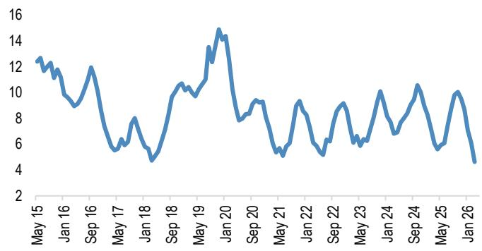

line chart

| Date   | Value |
|--------|-------|
| May 15 | 12.5  |
| Jan 16 | 10.0  |
| Sep 16 | 12.0  |
| May 17 | 5.5   |
| Jan 18 | 4.5   |
| Sep 18 | 10.5  |
| May 19 | 13.0  |
| Jan 20 | 14.5  |
| Sep 20 | 8.0   |
| May 21 | 5.0   |
| Jan 22 | 9.0   |
| Sep 22 | 6.0   |
| May 23 | 9.5   |
| Jan 24 | 7.0   |
| Sep 24 | 10.5  |
| May 25 | 5.5   |
| Jan 26 | 4.5   |

Source: China Customs, Bloomberg Finance L.P. \*In wet metric tonnes, with nickel content of 0.86%.

Figure 100: Global nickel industry C1 costs by %-tile and LME 3M nickel price  
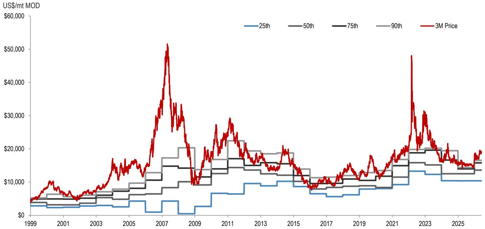

line chart

| Year | 25th   | 50th   | 75th   | 90th   | 3M Price |
|------|--------|--------|--------|--------|----------|
| 1999 | ~$3,000| ~$4,000| ~$5,000| ~$6,000| ~$5,000  |
| 2001 | ~$3,500| ~$5,500| ~$6,500| ~$8,000| ~$8,000  |
| 2003 | ~$4,000| ~$6,500| ~$7,500| ~$9,000| ~$12,000 |
| 2005 | ~$5,000| ~$8,000| ~$10,000| ~$12,000| ~$16,000 |
| 2007 | ~$6,000| ~$10,000| ~$14,000| ~$18,000| ~$51,000 |
| 2009 | ~$7,000| ~$12,000| ~$16,000| ~$22,000| ~$18,000 |
| 2011 | ~$8,000| ~$14,000| ~$18,000| ~$24,000| ~$29,000 |
| 2013 | ~$9,000| ~$16,000| ~$20,000| ~$26,000| ~$22,000 |
| 2015 | ~$10,000| ~$18,000| ~$22,000| ~$28,000| ~$24,000 |
| 2017 | ~$11,000| ~$20,000| ~$24,000| ~$30,000| ~$26,000 |
| 2019 | ~$12,000| ~$22,000| ~$26,000| ~$32,000| ~$28,000 |
| 2021 | ~$13,000| ~$24,000| ~$28,000| ~$34,000| ~$32,000 |
| 2023 | ~$14,000| ~$26,000| ~$30,000| ~$36,000| ~$38,000 |
| 2025 | ~$15,000| ~$28,000| ~$32,000| ~$38,000| ~$42,000 |

Source: Wood Mackenzie, LME, JPM Commodities Research. \*LME prices as of 4 $^{th}$ June 2026.

Table 8: China nickel trade flow  
Thousand mt; Percent Change, yoy

<table><tr><td></td><td>2018</td><td>2019</td><td>2020</td><td>2021</td><td>2022</td><td>2023</td><td>2024</td><td>2025</td><td>2026 YTD</td></tr><tr><td>Nickel Ore Imports</td><td>46,971</td><td>56,116</td><td>39,104</td><td>43,529</td><td>40,241</td><td>44,819</td><td>38,096</td><td>42,263</td><td>7,904</td></tr><tr><td>Refined Nickel Imports</td><td>212</td><td>193</td><td>131</td><td>261</td><td>156</td><td>91</td><td>97</td><td>231</td><td>94</td></tr><tr><td>Refined Nickel Exports</td><td>13</td><td>37</td><td>19</td><td>5</td><td>23</td><td>37</td><td>123</td><td>171</td><td>9</td></tr><tr><td>Net Refined Imports</td><td>199</td><td>156</td><td>112</td><td>256</td><td>133</td><td>54</td><td>-25</td><td>60</td><td>84</td></tr><tr><td colspan="10">YoY-%</td></tr><tr><td>Nickel Ore Imports</td><td></td><td>19.5%</td><td>-30.3%</td><td>11.3%</td><td>-7.6%</td><td>11.4%</td><td>-15.0%</td><td>10.9%</td><td>21.5%</td></tr><tr><td>Refined Nickel Imports</td><td></td><td>-8.9%</td><td>-32.3%</td><td>99.8%</td><td>-40.3%</td><td>-41.6%</td><td>6.8%</td><td>137.7%</td><td>55.8%</td></tr><tr><td>Refined Nickel Exports</td><td></td><td>182.5%</td><td>-49.3%</td><td>-71.3%</td><td>314.2%</td><td>62.7%</td><td>235.0%</td><td>39.7%</td><td>-85.5%</td></tr></table>

\*2026 is through April.  
Source: China Customs General Administration

## JPM metals price forecasts

Quarterly and annual averages

<table><tr><td></td><td>4Q25A</td><td>1Q26A</td><td>2Q26</td><td>3Q26</td><td>4Q26</td><td>1Q27</td><td>2Q27</td><td>3Q27</td><td>4Q27</td><td>2025</td><td>2026</td><td>2027</td></tr><tr><td colspan="13">Base Metals</td></tr><tr><td>Aluminum</td><td>2,828</td><td>3,198</td><td>3,800</td><td>3,600</td><td>3,400</td><td>3,200</td><td>3,000</td><td>2,900</td><td>2,750</td><td>2,631</td><td>3,500</td><td>2,963</td></tr><tr><td>Copper</td><td>11,105</td><td>12,824</td><td>13,500</td><td>13,000</td><td>12,500</td><td>11,800</td><td>11,600</td><td>11,600</td><td>11,500</td><td>9,947</td><td>12,956</td><td>11,625</td></tr><tr><td>Nickel</td><td>14,892</td><td>17,338</td><td>17,500</td><td>17,000</td><td>17,250</td><td>17,500</td><td>18,000</td><td>18,000</td><td>17,500</td><td>15,164</td><td>17,272</td><td>17,750</td></tr><tr><td>Zinc</td><td>3,165</td><td>3,237</td><td>3,420</td><td>3,500</td><td>3,400</td><td>3,300</td><td>3,200</td><td>3,050</td><td>3,000</td><td>2,867</td><td>3,389</td><td>3,138</td></tr><tr><td colspan="13">Precious Metals</td></tr><tr><td>Gold</td><td>4,152</td><td>4,873</td><td>4,800</td><td>5,300</td><td>6,000</td><td>6,200</td><td>6,250</td><td>6,300</td><td>6,300</td><td>3,440</td><td>5,243</td><td>6,263</td></tr><tr><td>Silver</td><td>55.2</td><td>83.7</td><td>78.5</td><td>85.0</td><td>90.0</td><td>88.0</td><td>87.0</td><td>85.0</td><td>83.0</td><td>40.1</td><td>84.3</td><td>85.8</td></tr><tr><td>Platinum</td><td>1,694</td><td>2,204</td><td>2,050</td><td>2,250</td><td>2,400</td><td>2,450</td><td>2,400</td><td>2,300</td><td>2,250</td><td>1,282</td><td>2,226</td><td>2,350</td></tr><tr><td>Palladium</td><td>1,478</td><td>1,706</td><td>1,490</td><td>1,550</td><td>1,600</td><td>1,550</td><td>1,500</td><td>1,450</td><td>1,400</td><td>1,151</td><td>1,586</td><td>1,475</td></tr></table>

Source: JPM Commodities Research. \*Base metals are LME cash and precious metals are spot.

## Disclosures

## History of Investment Recommendations:

A history of JPM investment recommendations disseminated during the preceding 12 months can be accessed on the Research & Commentary page of http://www.JPMmarkets.com where you can also search by analyst name, sector or financial instrument.

Analysts' Compensation: The research analysts responsible for the preparation of this report receive compensation based upon various factors, including the quality and accuracy of research, client feedback, competitive factors, and overall firm revenues.

Company-Specific Disclosures: Important disclosures, including price charts and credit opinion history tables (if applicable), are available for compendium reports and all JPM-covered companies, and certain non-covered companies, by visiting https://www.jpmm.com/research/disclosures, calling 1-800-477-0406, or e-mailing research.disclosure.inquiries@JPM.com with your request.

## Other Disclosures

JPM is a marketing name for investment banking businesses of JPM Chase & Co. and its subsidiaries and affiliates worldwide.

UK MIFID FICC research unbundling exemption: UK clients should refer to UK MIFID Research Unbundling exemption for details of JPM's implementation of the FICC research exemption and guidance on relevant FICC research categorisation.

JPM may, from time to time, write on issuers or securities targeted by economic or financial sanctions imposed or administered by the governmental authorities of the U.S., EU, UK or other relevant jurisdictions (Sanctioned Securities). Nothing in this report is intended to be read or construed as encouraging, facilitating, promoting or otherwise approving investment or dealing in such Sanctioned Securities. Clients should be aware of their own legal and compliance obligations when making investment decisions.

Any digital or crypto assets discussed in this research report are subject to a rapidly changing regulatory landscape. For relevant regulatory advisories on crypto assets, including bitcoin and ether, please see https://www.JPM.com/disclosures/cryptoasset-disclosure.

The author(s) of this research report may not be licensed to carry on regulated activities in your jurisdiction and, if not licensed, do not hold themselves out as being able to do so.

Exchange-Traded Funds (ETFs): JPM Securities LLC (“JPMS”) acts as authorized participant for substantially all U.S.-listed ETFs. To the extent that any ETFs are mentioned in this report, JPMS may earn commissions and transaction-based compensation in connection with the distribution of those ETF shares and may earn fees for performing other trade-related services, such as securities lending to short sellers of the ETF shares. JPMS may also perform services for the ETFs themselves, including acting as a broker or dealer to the ETFs. In addition, affiliates of JPMS may perform services for the ETFs, including trust, custodial, administration, lending, index calculation and/or maintenance and other services.

Options and Futures related research: If the information contained herein regards options- or futures-related research, such information is available only to persons who have received the proper options or futures risk disclosure documents. Please contact your JPM Representative or visit https://www.theocc.com/components/docs/riskstoc.pdf for a copy of the Option Clearing Corporation's Characteristics and Risks of Standardized Options or https://www.finra.org/sites/default/files/2020-08/Security\_Futures\_Risk\_Disclosure\_Statement\_2020.pdf for a copy of the Security Futures Risk Disclosure Statement.

Changes to Interbank Offered Rates (IBORs) and other benchmark rates: Certain interest rate benchmarks are, or may in the future become, subject to ongoing international, national and other regulatory guidance, reform and proposals for reform. For more information, please consult: https://www.JPM.com/global/disclosures/interbank\_offered\_rates

Private Bank Clients: Where you are receiving research as a client of the private banking businesses offered by JPM Chase & Co. and its subsidiaries (“JPM Private Bank”), research is provided to you by JPM Private Bank and not by any other division of JPM, including, but not limited to, the JPM Corporate and Investment Bank and its Global Research division.

Legal entity responsible for the production and distribution of research: The legal entity identified below the name of the Reg AC Research Analyst who authored this material is the legal entity responsible for the production of this research. Where multiple Reg AC Research Analysts authored this material with different legal entities identified below their names, these legal entities are jointly responsible for the production of this research. Where more than one legal entity is listed under an analyst's name, the first legal entity is responsible for the production unless stated otherwise. Research Analysts from various JPM affiliates may have contributed to the production of this material but may not be licensed to carry out regulated activities in your jurisdiction (and do not hold themselves out as being able to do so). Unless otherwise stated below in the legal entity disclosures, this material has been distributed by the legal entity responsible for production, or where more than one legal entity is listed under the analyst's name, the first legal entity will be responsible for distribution. If you have any queries, please contact the relevant Research Analyst in your jurisdiction or the entity in your jurisdiction that has distributed this research material.

Legal Entities Disclosures and Country-/Region-Specific Disclosures:

Argentina: JPM Chase Bank N.A Sucursal Buenos Aires is regulated by Banco Central de la República Argentina (“BCRA”- Central Bank of Argentina) and Comisión Nacional de Valores (“CNV”- Argentinian Securities Commission - ALYC y AN Integral N°51).

Australia: JPM Securities Australia Limited (“JPMSAL”) (ABN 61 003 245 234/AFS Licence No: 238066) is regulated by the Australian Securities and Investments Commission and is a Market Participant of ASX Limited, a Clearing and Settlement Participant of ASX Clear Pty Limited and a Clearing Participant of ASX Clear (Futures) Pty Limited. This material is issued and distributed in Australia by or on behalf of JPMSAL only to "wholesale clients" (as defined in section 761G of the Corporations Act 2001). A list of all financial products covered can be found by visiting https://www.jpmm.com/research/disclosures. JPM seeks to cover companies of relevance to the domestic and international investor base across all Global Industry Classification Standard (GICS) sectors, as well as across a range of market capitalisation sizes. If applicable, in the course of conducting public side due diligence on the subject company(ies), the Research Analyst team may at times perform such diligence through corporate engagements such as site visits, discussions with company representatives, management presentations, etc. Research issued by JPMSAL has been prepared in accordance with JPM Australia’s Research Independence Policy which can be found at the following link: JPM Australia - Research Independence Policy.

Brazil: Banco JPM S.A. is regulated by the Comissao de Valores Mobiliarios (CVM) and by the Central Bank of Brazil. Ombudsman JPM: 0800-7700847 / 0800-7700810 (For Hearing Impaired) / ouvidoria.jp.morgan@jpmchase.com.

Canada: JPM Securities Canada Inc. is a registered investment dealer, regulated by the Canadian Investment Regulatory Organization and the Ontario Securities Commission and is the participating member on Canadian exchanges. This material is distributed in Canada by or on behalf of JPM Securities Canada Inc.

Chile: Inversiones JPM Limitada is an unregulated entity incorporated in Chile.

China: JPM Securities (China) Company Limited has been approved by CSRC to conduct the securities investment consultancy business.

Colombia: Banco JPM Colombia S.A. is supervised by the Superintendencia Financiera de Colombia (SFC). Any reference in this material to products or services offered abroad by entities other than the Bank in Colombia is included exclusively for descriptive purposes. Such references do not constitute, and should not be construed as, promotional activity or the provision of financial products or services within Colombian territory, as defined under applicable Colombian regulation.

Dubai International Financial Centre (DIFC): JPM Chase Bank, N.A., Dubai Branch is regulated by the Dubai Financial Services Authority (DFSA) and its registered address is Dubai International Financial Centre - The Gate, West Wing, Level 3 and 9 PO Box 506551, Dubai, UAE. This material has been distributed by JPM Chase Bank, N.A., Dubai Branch to persons regarded as professional clients or market counterparties as defined under the DFSA rules.

European Economic Area (EEA): Unless specified to the contrary, research is distributed in the EEA by JPM SE (“JPM SE”), which is authorised as a credit institution by the Federal Financial Supervisory Authority (Bundesanstalt für Finanzdienstleistungsaufsicht, BaFin) and jointly supervised by the BaFin, the German Central Bank (Deutsche Bundesbank) and the European Central Bank (ECB). JPM SE is a company headquartered in Frankfurt with registered address at TaunusTurm, Taunustor 1, Frankfurt am Main, 60310, Germany. The material has been distributed in the EEA to persons regarded as professional investors (or equivalent) pursuant to Art. 4 para. 1 no. 10 and Annex II of MiFID II and its respective implementation in their home jurisdictions (“EEA professional investors”). This material must not be acted on or relied on by persons who are not EEA professional investors. Any investment or investment activity to which this material relates is only available to EEA relevant persons and will be engaged in only with EEA relevant persons.

Hong Kong: JPM Securities (Asia Pacific) Limited (CE number AAJ321) is regulated by the Hong Kong Monetary Authority and the Securities and Futures Commission in Hong Kong, and JPM Broking (Hong Kong) Limited (CE number AAB027) is regulated by the Securities and Futures Commission in Hong Kong. JPM Chase Bank, N.A., Hong Kong Branch (CE Number AAL996) is regulated by the Hong Kong Monetary Authority and the Securities and Futures Commission, is organized under the laws of the United States with limited liability. Where the distribution of this material is a regulated activity in Hong Kong, the material is distributed in Hong Kong by or through JPM Securities (Asia Pacific) Limited and/or JPM Broking (Hong Kong) Limited.

India: JPM India Private Limited (Corporate Identity Number - U67120MH1992FTC068724), having its registered office at JPM Tower, Off. C.S.T. Road, Kalina, Santacruz - East, Mumbai – 400098, is registered with the Securities and Exchange Board of India (SEBI) as a 'Research Analyst' having registration number INH000001873. JPM India Private Limited is also registered with SEBI as a member of the National Stock Exchange of India Limited and the Bombay Stock Exchange Limited (SEBI Registration Number – INZ000239730) and as a Merchant Banker (SEBI Registration Number - MB/INM000002970). Telephone: 91-22-6157 3000, Facsimile: 91-22-6157 3990 and Website: http://www.jpmipl.com. JPM Chase Bank, N.A. - Mumbai Branch is licensed by the Reserve Bank of India (RBI) (Licence No. 53/Licence No. BY.4/94; SEBI - IN/CUS/014/ CDSL : IN-DP-CDSL-444-2008/ IN-DP-NSDL-285-2008/ INBI00000984/ INE231311239) as a Scheduled Commercial Bank in India, which is its primary license allowing it to carry on Banking business in India and other activities, which a Bank branch in India are permitted to undertake. For non-local research material, this material is not distributed in India by JPM India Private Limited. Compliance Officer: Ashutosh Sharma; ashutosh.j.sharma@jpmchase.com; +912261575002. Grievance Officer: Ramprasadh K, jpmipl.research.feedback@JPM.com; +912261573000. Registration granted by SEBI and certification from NISM in no way guarantee performance of the intermediary or provide any assurance of returns to investors. Please visit Terms and Conditions and Most Important Terms and Conditions (MITC). The annual Compliance audit report is available at http://www.jpmipl.com/#research.

Indonesia: PT JPM Sekuritas Indonesia is a member of the Indonesia Stock Exchange and is registered and supervised by the Otoritas Jasa Keuangan (OJK).

Korea: JPM Securities (Far East) Limited, Seoul Branch, is a member of the Korea Exchange (KRX). JPM Chase Bank, N.A., Seoul Branch, is licensed as a branch office of foreign bank (JPM Chase Bank, N.A.) in Korea. Both entities are regulated by the Financial Services Commission (FSC) and the Financial Supervisory Service (FSS). For non-macro research material, the material is distributed in Korea by or through JPM Securities (Far East) Limited, Seoul Branch.

Japan: JPM Securities Japan Co., Ltd. and JPM Chase Bank, N.A., Tokyo Branch are regulated by the Financial Services Agency in Japan.

Malaysia: This material is issued and distributed in Malaysia by JPM Securities (Malaysia) Sdn Bhd (18146-X), which is a Participating Organization of Bursa Malaysia Berhad and holds a Capital Markets Services License issued by the Securities Commission in Malaysia.

Mexico: JPM Casa de Bolsa, S.A. de C.V., JPM Grupo Financiero is member of the Mexican Stock Exchange (“Bolsa Mexicana de Valores”) and the Institutional Stock Exchange (“Bolsa Institucional de Valores”), and it is authorized to act as a broker dealer by the National Banking and Securities Exchange Commission (“Comisión Nacional Bancaria y de Valores”).

New Zealand: This material is issued and distributed by JPMSAL in New Zealand only to "wholesale clients" (as defined in the Financial Markets Conduct Act 2013). JPMSAL is registered as a Financial Service Provider under the Financial Service providers (Registration and Dispute Resolution) Act of 2008.

Philippines: JPM Securities Philippines Inc. is a Trading Participant of the Philippine Stock Exchange and a member of the Securities Clearing Corporation of the Philippines and the Securities Investor Protection Fund. It is regulated by the Securities and Exchange Commission.

Singapore: This material is issued and distributed in Singapore by or through JPM Securities Singapore Private Limited (JPMSS) [MDDI (P) 057/08/2025 and Co. Reg. No.: 199405335R], which is a member of the Singapore Exchange Securities Trading Limited, and/or JPM Chase Bank, N.A., Singapore branch (JPMCB Singapore), both of which are regulated by the Monetary Authority of Singapore. This material is issued and distributed in Singapore only to accredited investors, expert investors and institutional investors, as defined in Section 4A of the Securities and Futures Act, Cap. 289 (SFA). This material is not intended to be issued or distributed to any retail investors or any other investors that do not fall into the classes of “accredited investors,” “expert investors” or “institutional investors,” as defined under Section 4A of the SFA. Recipients of this material in Singapore are to contact JPMSS or JPMCB Singapore in respect of any matters arising from, or in connection with, the material.

South Africa: JPM Equities South Africa Proprietary Limited and JPM Chase Bank, N.A., Johannesburg Branch are members of the Johannesburg Securities Exchange and are regulated by the Financial Services Conduct Authority (FSCA).

Taiwan: JPM Securities (Taiwan) Limited is a participant of the Taiwan Stock Exchange (company-type) and regulated by the Taiwan Securities and Futures Bureau. Material relating to equity securities is issued and distributed in Taiwan by JPM Securities (Taiwan) Limited, subject to the license scope and the applicable laws and the regulations in Taiwan. To the extent that JPM Securities (Taiwan) Limited produces research materials on securities not listed on the Taiwan Stock Exchange or Taipei Exchange (“Non-Taiwan Listed Securities”), these materials shall not constitute securities recommendations for the purpose of applicable Taiwan regulations, and, for the avoidance of doubt, JPM Securities (Taiwan) Limited does not act as broker for Non-Taiwan Listed Securities. According to Paragraph 2, Article 7-1 of Operational Regulations Governing Securities Firms Recommending Trades in Securities to Customers (as amended or supplemented) and/or other applicable laws or regulations, please note that the recipient of this material is not permitted to engage in any activities in connection with the material that may give rise to conflicts of interests, unless otherwise disclosed in the “Important Disclosures” in this material.

Thailand: This material is issued and distributed in Thailand by JPM Securities (Thailand) Ltd., which is a member of the Stock Exchange of Thailand and is regulated by the Ministry of Finance and the Securities and Exchange Commission. The registered address is 548 One City Center Building, 50th Floor, Ploenchit Road, Lymphini, Pathum Wan, Bangkok 10330.

UK: Research is produced in the UK by JPM Securities plc (“JPMS plc”) which is a member of the London Stock Exchange and is authorised by the Prudential Regulation Authority and regulated by the Financial Conduct Authority and the Prudential Regulation Authority or JPM Markets Limited (“JPMML Ltd”) which is authorised and regulated by the Financial Conduct Authority. Unless specified to the contrary, this material is distributed in the UK by JPMS plc and is directed in the UK only to: (a) persons having professional experience in matters relating to investments falling within article 19(5) of the Financial Services and Markets Act 2000 (Financial Promotion) (Order) 2005 (“the FPO”); (b) persons outlined in article 49 of the FPO (high net worth companies, unincorporated associations or partnerships, the trustees of high value trusts, etc.); or (c) any persons to whom this communication may otherwise lawfully be made; all such persons being referred to as "UK relevant persons". This material must not be acted on or relied on by persons who are not UK relevant persons. Any investment or investment activity to which this material relates is only available to UK relevant persons and will be engaged in only with UK relevant persons. A description of JPM EMEA’s policy for prevention and avoidance of conflicts of interest related to the production of Research can be found at the following link: JPM EMEA - Research Independence Policy.

U.S.: JPM Securities LLC (“JPMS”) is a member of the NYSE, FINRA, SIPC, and the NFA. JPM Chase Bank, N.A. is a member of the FDIC. Material published by non-U.S. affiliates is distributed in the U.S. by JPMS who accepts responsibility for its content.

General: Additional information is available upon request. The information in this material has been obtained from sources believed to be reliable. While all reasonable care has been taken to ensure that the facts stated in this material are accurate and that the forecasts, opinions and expectations contained herein are fair and reasonable, JPM Chase & Co. or its affiliates and/or subsidiaries (collectively JPM) make no representations or warranties whatsoever to the completeness or accuracy of the material provided, except with respect to any disclosures relative to JPM and the Research Analyst's involvement with the issuer that is the subject of the material. Accordingly, no reliance should be placed on the accuracy, fairness or completeness of the information contained in this material. There may be certain discrepancies with data and/or limited content in this material as a result of calculations, adjustments, translations to different languages, and/or local regulatory restrictions, as applicable. These discrepancies should not impact the overall investment analysis, views and/or recommendations of the subject company(ies) that may be discussed in the material. Artificial intelligence tools may have been used in the preparation of this material, including assisting in data analysis, pattern recognition, and content drafting for research material. JPM accepts no liability whatsoever for any loss arising from any use of this material or its contents, and neither JPM nor any of its respective directors, officers or employees, shall be in any way responsible for the contents hereof, apart from the liabilities and responsibilities that may be imposed on them by the relevant regulatory authority in the jurisdiction in question, or the regulatory regime thereunder. Opinions, forecasts or projections contained in this material represent JPM's current opinions or judgment as of the date of the material only and are therefore subject to change without notice. Periodic updates may be provided on companies/industries based on company-specific developments or announcements, market conditions or any other publicly available information. There can be no assurance that future results or events will be consistent with any such opinions, forecasts or projections, which represent only one possible outcome. Furthermore, such opinions, forecasts or projections are subject to certain risks, uncertainties and assumptions that have not been verified, and future actual results or events could differ materially. The value of, or income from, any investments referred to in this material may fluctuate and/or be affected by changes in exchange rates. All pricing is indicative as of the close of market for the securities discussed, unless otherwise stated. Past performance is not indicative of future results. Accordingly, investors may receive back less than originally invested. This material is not intended as an offer or solicitation for the purchase or sale of any financial instrument. The opinions and recommendations herein do not take into account individual client circumstances, objectives, or needs and are not intended as recommendations of particular securities, financial instruments or strategies to particular clients. This material may include views on structured securities, options, futures and other derivatives. These are complex instruments, may involve a high degree of risk and may be appropriate investments only for sophisticated investors who are capable of understanding and assuming the risks involved. The recipients of this material must make their own independent decisions regarding any securities or financial instruments mentioned herein and should seek advice from such independent financial, legal, tax or other adviser as they deem necessary. JPM may trade as a principal on the basis of the Research Analysts' views and research, and it may also engage in transactions for its own account or for its clients' accounts in a manner inconsistent with the views taken in this material, and JPM is under no obligation to ensure that such other communication is brought to the attention of any recipient of this material. Others within JPM, including Strategists, Sales staff and other Research Analysts, may take views that are inconsistent with those taken in this material. Employees of JPM not involved in the preparation of this material may have investments in the securities (or derivatives of such securities) mentioned in this material and may trade them in ways different from those discussed in this material. This material is not an advertisement for or marketing of any issuer, its products or services, or its securities in any jurisdiction.

Confidentiality and Security Notice: This transmission may contain information that is privileged, confidential, legally privileged, and/or exempt from disclosure under applicable law. If you are not the intended recipient, you are hereby notified that any disclosure, copying, distribution, or use of the information contained herein (including any reliance thereon) is STRICTLY PROHIBITED. Although this transmission and any attachments are believed to be free of any virus or other defect that might affect any computer system into which it is received and opened, it is the responsibility of the recipient to ensure that it is virus free and no responsibility is accepted by JPM Chase & Co., its subsidiaries and affiliates, as applicable, for any loss or damage arising in any way from its use. If you received this transmission in error, please immediately contact the sender and destroy the material in its entirety, whether in electronic or hard copy format. This message is subject to electronic monitoring: https://www.JPM.com/disclosures/email

MSCI: Certain information herein (“Information”) is reproduced by permission of MSCI Inc., its affiliates and information providers (“MSCI”) ©2026. No reproduction or dissemination of the Information is permitted without an appropriate license. MSCI MAKES NO EXPRESS OR IMPLIED WARRANTIES (INCLUDING MERCHANTABILITY OR FITNESS) AS TO THE INFORMATION AND DISCLAIMS ALL LIABILITY TO THE EXTENT PERMITTED BY LAW. No Information constitutes investment advice, except for any applicable Information from MSCI ESG Research. Subject also to msci.com/disclaimer

Sustainalytics: Certain information, data, analyses and opinions contained herein are reproduced by permission of Sustainalytics and: (1) includes the proprietary information of Sustainalytics; (2) may not be copied or redistributed except as specifically authorized; (3) do not constitute investment advice nor an endorsement of any product or project; (4) are provided solely for informational purposes; and (5) are not warranted to be complete, accurate or timely. Sustainalytics is not responsible for any trading decisions, damages or other losses related to it or its use. The use of the data is subject to conditions available at https://www.sustainalytics.com/legal-disclaimers. ©2026 Sustainalytics. All Rights Reserved.

"Other Disclosures" last revised May 16, 2026.

Copyright 2026 JPM Chase & Co. All rights reserved. This material or any portion hereof may not be reprinted, sold or redistributed without the written consent of JPM. It is strictly prohibited to use or share without prior written consent from JPM any research material received from JPM or an authorized third-party (“JPM Data”) in any third-party artificial intelligence (“AI”) systems or models when such JPM Data is accessible by a third-party.

Completed 08 Jun 2026 04:46 PM BST

Disseminated 08 Jun 2026 04:46 PM BST