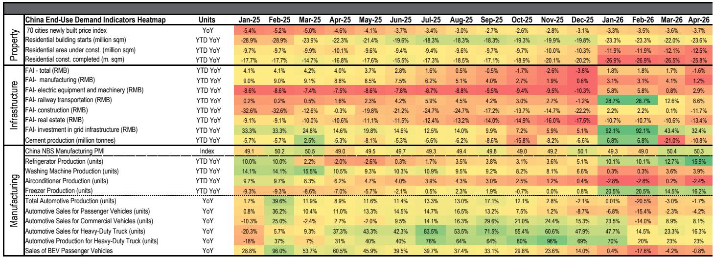
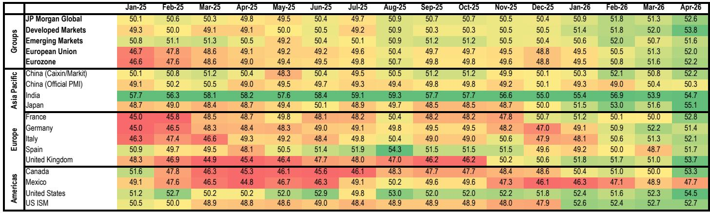
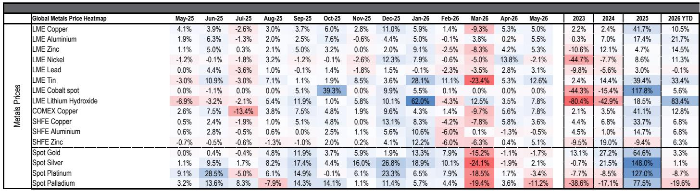

# China’s Dual Role as Both Source and Relief Valve is Reshaping Global Base Metal Markets

The global base metals market is entering a period of structural bifurcation that few participants have fully priced into their strategic models. The data from the latest supply-demand tracker reveals a critical insight: China is no longer simply the world’s largest consumer of base metals. It has become the system’s primary balancing mechanism—simultaneously absorbing surplus and exporting tightness depending on the metal, the policy environment, and the timing of inventory cycles. This dual role creates a more complex and less predictable pricing landscape than the simple “China demand drives prices” narrative of the past decade.

For copper, the divergence between apparent consumption and real end-use demand in China tells a story of inventory dynamics that are masking genuine weakness in renewable energy installations and white goods production. For aluminium, Chinese semis exports are functioning as the relief valve for ex-China tightness, with LME inventories drawing to critically low levels while Chinese visible inventory sits near multi-year highs. For zinc and nickel, the patterns are different again, but the common thread is that Chinese industrial policy, trade flows, and inventory management are now the dominant variables in global price formation.

The strategic question for investors and corporate planners is no longer simply whether Chinese demand is strong or weak. It is whether the current configuration of Chinese export capacity, tariff policy, and domestic supply constraints can persist, and what happens when it cannot. The report provides the data to frame this question. This article interprets what the pattern means and where the unresolved risks lie.

## The Apparent Versus Real Consumption Divergence in Chinese Copper Reveals a Market That Is More Fragile Than Headline Numbers Suggest

The most striking data point in the copper analysis is the divergence between China’s apparent copper consumption, which grew by 9% year-on-year in April, and the consumption-weighted end-use indicator, which declined by 4% year-on-year and stands at only 1.2% growth year-to-date. This is not a minor statistical discrepancy. It is a signal that inventory destocking across the supply chain during the fourth quarter of 2025 and first quarter of 2026—the period of the so-called “buyers’ strike”—is now inflating apparent demand figures as the supply chain rebuilds stocks.

The implications are significant. If the inventory rebuild is the primary driver of current apparent consumption strength, then the sustainability of copper prices in the USD 13,500-14,000 per tonne range depends on whether that rebuild continues or fades. The report notes that drawing momentum in Chinese inventory has already leveled off in recent weeks as copper prices have stabilized in that range. This suggests that the inventory adjustment may be nearing completion, and that the market will soon need to confront the underlying weakness in end-use demand.

That weakness is concentrated in two areas that have been major growth drivers in recent years: renewable energy installations and white goods production. Solar installations in April fell by 79% year-on-year to approximately 9.5 gigawatts, and wind installations declined by 7% year-on-year. White goods copper demand declined by 3% year-on-year, driven by a 9% drop in air conditioner production. These are not marginal shifts. They represent a structural slowdown in the two sectors that have absorbed enormous volumes of copper in the previous cycle.

The countervailing forces—strong grid investment with over 30% year-to-date growth, continued electric vehicle production growth at 4% year-on-year, and robust product exports—are real but insufficient to offset the weakness in renewables and white goods. The question that the report raises but does not fully answer is whether grid investment and EV production can accelerate enough to fill the gap, or whether the slowdown in renewables represents a more permanent deceleration after the rapid installation pace of the first half of 2025.

## Chinese Aluminium Semis Exports Are the Critical Relief Valve for Ex-China Tightness, and the Sustainability of This Flow Is the Central Risk for Global Aluminium Prices

The aluminium market presents a mirror image of the copper story. While LME inventories have drawn down to 330,000 tonnes—a critically low level by historical standards—Chinese visible inventory sits at approximately 1.4 million tonnes, near multi-year highs. The connecting tissue between these two realities is the export of Chinese aluminium semis and finished products, which the report correctly identifies as the relief valve for ex-China tightness.

The semis export arbitrage from China to the rest of Asia is currently open and at attractive levels, and the report expects strong exports to accelerate weekly withdrawals from onshore Chinese inventory. But the data so far shows a more gradual process: only about 90,000 tonnes have been drawn from SHFE and regional warehouses in the last six weeks, with drawing activity only picking up since mid-May. This suggests that the export mechanism is working but at a pace that may not be sufficient to prevent further tightening in ex-China markets.

Chinese producers are highly incentivized to maximize output toward the production cap, with refined production growing by 3.4% year-on-year in April to an annualized rate of 45 million tonnes. Year-to-date growth is approximately 4%. The combination of elevated aluminium prices and open export arbitrage creates a powerful incentive for Chinese producers to keep running at or near capacity.

The unresolved risk here is the bauxite supply chain. Guinea supplies 75% of China’s bauxite imports, and while imports from Guinea were up by 13% year-on-year in April, the report flags that disruptions to bauxite exports from Guinea could become a serious bottleneck for Chinese producers. This is the single most important variable that could change the aluminium market outlook. If bauxite supply is disrupted, Chinese production would be constrained, exports would fall, and the relief valve for global tightness would close. The resulting price impact would be severe, particularly given the already low level of LME inventories.

## Zinc and Nickel Markets Are Telling a Different Story of Inventory Glut and Structural Oversupply That Complicates the Broader Metals Narrative

The zinc and nickel markets serve as important counterpoints to the copper and aluminium stories. They remind us that the base metals complex is not a monolith and that supply-demand dynamics vary significantly by metal.

For zinc, the story is one of subdued demand manifesting in elevated and stagnant visible inventory. Total SHFE plus social warehouse inventories in China have stabilized near 264,000 tonnes. Galvaniser operating rates remain below the five-year average, and apparent demand is down by 12% year-on-year as of April. The construction sector, which is the primary end-use market for zinc, remains lifeless in China.

The supply side is beginning to show signs of constraint. Chinese zinc concentrate imports fell by nearly 10% year-on-year in April, and spot treatment charges in China have flipped to negative territory since the end of March. This indicates that concentrate availability is becoming tight. However, smelter production has remained robust, increasing by 5% year-on-year in April, as smelters work through concentrate inventory accumulated during the strong import period of the first quarter. The risk is that even tighter concentrate markets eventually weigh on Chinese refined output, which could tighten the refined balance more than currently expected.

For nickel, the situation is different again. Visible inventory has grown by 70,000 tonnes year-to-date to a total of approximately 470,000 tonnes. While SHFE inventory continues to rise, LME stocks have modestly declined from their February peak. The market remains focused on Indonesia’s policy framework, which is set to weigh on producer margins amid higher ore benchmarks. Any additions to Indonesia’s ore quota into the summer would be a key variable to watch.

The zinc and nickel stories are important because they demonstrate that the global base metals market is not uniformly tight. The narrative of supply constraints and inventory draws applies most strongly to aluminium and, to a lesser extent, copper. For zinc and nickel, the dominant theme is still one of oversupply and weak demand, albeit with emerging risks on the supply side that could shift the balance.

## The Report Raises a Critical Unanswered Question: What Happens When US Tariff Policy on Copper Becomes Active and Chinese Export Capacity Reaches Its Limit?

The report points to two policy-driven events that could fundamentally alter the market dynamics it describes, but it does not fully explore the interaction between them.

The first is the US copper tariff review, which is due by June 30, 2026. The US Commerce Secretary is to provide an update on whether additional Section 232 copper tariff modifications are necessary. The report’s view is that the Trump administration is more likely than not to enact an escalating tariff starting at 15% in 2027 and increasing to 30% a year later. The stated objectives would be to ensure that copper already imported into the US stays onshore and to keep this excess US inventory as a critical reserve.

If this tariff is implemented, the impact on ex-US cathode supply would be significant. The report notes that a continued strong import pull into the US would continue to strain ex-US cathode supply, particularly over periods where China’s import arbitrage is also open. This creates a scenario where the US becomes a net importer of tightness from the rest of the world, compounding the pressure on already strained supply chains.

The second unresolved question is what happens when Chinese aluminium export capacity reaches its limit. The report describes Chinese semis exports as the relief valve for ex-China tightness, but it does not quantify the maximum sustainable export rate or the conditions under which it could be disrupted. The bauxite supply risk from Guinea is one potential disruption. Another is the possibility that Chinese policymakers decide to prioritize domestic supply security over export earnings, particularly if domestic inventory levels begin to draw down more rapidly.

The interaction between these two policy risks is the analytical gap that the report leaves open. If US copper tariffs are implemented at the same time that Chinese aluminium exports are constrained, the combined impact on global base metal supply could be far greater than either event in isolation. Investors and corporate planners need to stress-test their scenarios for this combined outcome.

## A Decision Framework for Navigating the Current Market Regime: Focus on Inventory Velocity, Policy Triggers, and Substitution Risk

For readers who need to translate this analysis into actionable decisions, three variables should form the core of any strategic framework.

The first variable is inventory velocity. The key metric to watch is not just the absolute level of inventory but the rate of change. For copper, the question is whether the inventory rebuild that has boosted apparent consumption is nearing completion. The recent leveling off of drawing momentum suggests it may be. For aluminium, the question is whether the pace of Chinese inventory draws accelerates as the semis export arbitrage remains open. The report notes that drawing activity only picked up in mid-May, so the next few weeks of data will be critical.

The second variable is policy triggers. The US copper tariff review by June 30 is the most imminent policy event. The outcome will determine whether the US becomes a structural importer of tightness or whether the current configuration of trade flows can persist. For aluminium, the bauxite supply situation from Guinea is the key policy-adjacent risk. Any disruption there would have immediate and severe consequences for Chinese production and global supply.

The third variable is substitution risk. As aluminium prices rise and copper prices remain elevated, the incentive for end-users to substitute materials increases. This is particularly relevant in the automotive and construction sectors, where aluminium can replace copper in certain applications. The report does not address substitution dynamics in detail, but they become increasingly important as price differentials widen.

The strategic implication is clear: this is not a market for static positions based on long-term demand trends. It is a market for dynamic positioning that responds to inventory flows, policy changes, and supply disruptions. The winners will be those who can monitor these variables in real-time and adjust their exposure accordingly.

## Join the community to read the full report and review the original charts

The analysis above draws on specific data points and charts that are essential for a complete understanding of the market dynamics. The full report contains the detailed inventory charts, trade flow data, and price heatmaps that underpin the strategic conclusions discussed here. It also includes the zinc and nickel analyses in greater depth, as well as the global demand indicators and PMI data that provide the macroeconomic context.

For serious investors and corporate strategists who need to make decisions based on this data, the full report is an essential resource. The charts showing Chinese inventory draws, the semis export arbitrage, and the divergence between apparent and end-use copper consumption are particularly valuable for monitoring the key variables identified in this article.

Join the community to read the full report and review the original charts. The data and analysis will equip you with the framework needed to navigate the current market regime and anticipate the inflection points that will define the next phase of the cycle.

*This article is for learning and discussion only and does not constitute investment advice.*

Personal reading notes and learning share only. Not investment advice.

