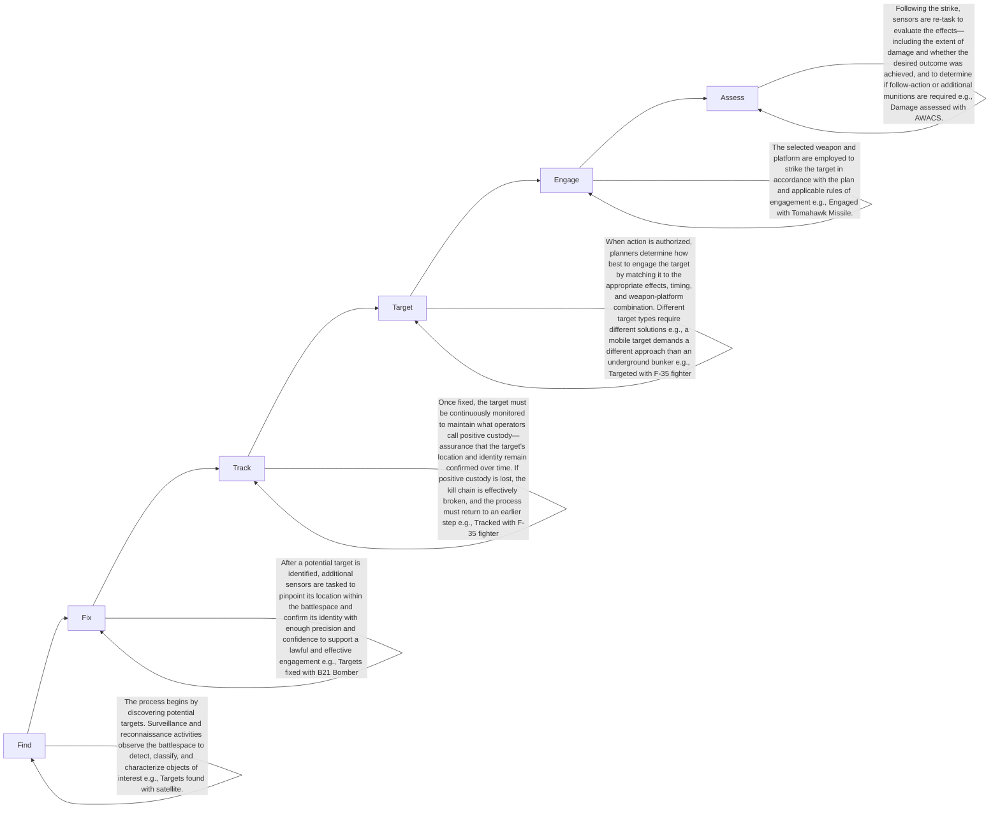

你是麦肯锡/投研风格的微信公众号财经文章主笔，擅长用金字塔原理把研报内容转化为“有主张、有层次、有洞察、但仍保留完整报告阅读欲望”的长文。

【目标】
- 基于下面的研报解析内容，写一篇微信公众号文章 Markdown。
- 风格：稳重、专业、克制、有洞察，像咨询公司合伙人写给高净值读者/产业决策者的研报导读。
- 长度：约 3000 字，允许上下浮动 15%。
- 不要使用 emoji。
- 可以基于报告内容做适度发散，但必须是从原文逻辑推出的判断，不要编造数据、公司动作或引用。
- 不要把研报所有正文内容讲完，要留下明确但自然的伏笔，让读者愿意加入社群阅读完整报告。

【金字塔原理写作原则】
1. 结论先行：文章开头先回答“这份报告最值得看的判断是什么”，而不是介绍背景。
2. 统领思想：全文只能服务一个主判断，避免变成摘要合集。
3. 纵向回答：每一层都要回答上一层提出的“为什么”或“所以呢”。
4. 横向 MECE：每个一级小节必须彼此独立、共同支撑主判断，避免重叠。
5. Synthesis over summary：不要复述报告段落，要提炼“这些事实合在一起意味着什么”。
6. So what：每个小节末尾必须落到对行业、公司、竞争格局、资产定价或读者观察框架的含义。
7. Action title：所有 `##` 小标题必须是“直接讲述洞察的完整句子”，不能是目录标签。

【标题与小标题硬性要求】
- `# 标题` 必须直接表达一个判断，例如“市场真正低估的不是需求，而是供给侧的再定价”。
- `# 标题` 必须包含报告机构的中文名称。已识别机构名：`JPM`。标题格式建议：`# JPM：一句主判断`。如果识别机构名为空，请从研报标题/正文中识别机构并使用中文名，例如GS、摩根斯坦利、HSBC、JPM、UBS、Citi、美国银行、BARC、DB、NOM。
- 机构名只要求出现在 `# 标题` 中，正文可以克制提及，不要为了重复机构名牺牲可读性。
- 禁止使用以下机械标题：
  - 一、核心判断
  - 二、真正重要的是结构性变量
  - 三、报告没有说透
  - 四、对读者的启发
  - 关键变化
  - 投资启示
  - 总结
- 所有 `##` 标题都要像麦肯锡报告里的 action title：读完标题就知道这一节结论。
- 小标题可以带序号，但序号后必须是一句洞察，例如：`## 1. 这轮变化真正考验的是企业能否把规模转化为议价权`。

【建议结构，但不要机械照抄标题】
1. `# 标题`：机构中文名 + 一句主判断，不超过 40 字。
2. 开头 4-6 段：直接给出主判断、为什么现在重要、报告提供了什么新信号。
3. 4-6 个 `##` 小节：每个小节标题都是洞察句，不是栏目名。
4. 至少一个小节讨论“报告尚未完全回答的关键问题”，但标题也要是洞察句。
5. 至少一个小节给出读者的观察框架，但不要命名为“对读者的启发”。
6. 文末自然承接未解问题，引导读者加入社群/微信群继续讨论。不要照抄固定话术，请基于本文未解问题每次重新写一段自然 CTA；语义可以参考：欢迎来星球微信群里继续讨论。
7. 在免责声明前，单独插入这张图片链接：``
8. 结尾只输出英文灰色免责声明：`
Personal reading notes and learning share only. Not investment advice.
`

【hook 要求】
- 不要硬插“加入社群”。
- hook 应该来自正文自然出现的未解问题，比如：关键假设尚未验证、竞争优势仍需拆解、图表背后的二阶影响没有展开。
- 文末 CTA 要像“顺着这些未解问题继续读完整报告/继续讨论”，不是广告口吻。
- CTA 必须每篇重新写，不能固定输出“加入社群，领取完整研报解读与原始图表”。可以类似“欢迎来星球微信群里继续讨论”。

【图片要求】
- 不要主动生成 MinerU 图片 markdown；系统会在文章生成后自动插入 MinerU 原始图片。
- 但文末免责声明前必须保留知识星球图片：``。

【内容边界】
- 只能基于研报原文和解析结果推导，不要编造数据、公司动作、引用。
- 遇到不确定内容，要用“这里仍需验证”“报告没有完全展开”等表达。
- 避免“震惊”“爆款”“一文看懂”等浮夸表达。
- 不要出现小红书话题标签。
- 不要出现 emoji。
- 不要隐藏报告机构名；标题必须出现机构中文名。正文如需概括来源，可写“这份JPM研报”或“该机构报告”，但不要编造机构观点以外的信息。
- 不要解释你的思考过程，不要输出多余说明。

【研报解析内容】
"""
# One battle after another

Revamping the U.S. defense industrial base

Explore curated content from Security and Resilience Initiative, spanning advanced manufacturing, frontier technologies, and more.

EXPLORE

- The U.S. remains the world's apex military power, but its defense industrial base (DIB) is concentrated in a small number of large firms focused on a narrow set of flagship platforms.  
- Since the end of the Cold War, amid uncertain defense budgets, the U.S. has prioritized high-performance systems like the F-35—highly capable of projecting power, but slow to develop, costly, and difficult to scale.  
- Over the past two decades, the threat landscape has diversified, spanning near-peer competitors, mid-tier states armed with low-cost precision weapons, and non-state actors leveraging commercial technologies.  
- Wars in Ukraine and the Middle East, as well as China's Anti-Access/Area-Denial (A2AD) strategy, have amplified these dynamics, reinforcing the need for adaptability.  
- Technological superiority alone is no longer sufficient; military advantage increasingly hinges on industrial capacity, cost discipline, and the speed and adaptability of capability deployment.  
- The Iran and Ukraine wars also highlight the operational value of low-cost, expendable systems such as drones, alongside command-and-control architectures that can iterate rapidly based on real-time feedback.  
- Modern warfare is increasingly defined by the ability to “sense, make sense, and act,” depending on processing vast amounts of data and translating it into timely decisions.  
- Speed and adaptability are now critical differentiators, particularly in battlefield environments shaped by cyber warfare and A2AD tactics.  
- While hardware remains the foundation of military power, software has emerged as the key enabler, integrating systems, accelerating decision-making, and allowing continuous upgrades.  
- This shift demands a new industrial model: advanced but adaptable platforms, scalable and expendable hardware, and software that is continuously updated.  
- The DIB needs to fuse with the commercial sector, leveraging its capacity, technology, and the speed of innovation needed for modern warfare, which are also arguably the U.S.'s most durable advantages.  
- A new ecosystem of unmanned, attritable, and software-defined systems is rising alongside the U.S.'s dominant exquisite tier, but the two need to be integrated into one rather than left to evolve on parallel tracks.  
- This productive shift should be paired with institutional reform, and while commercial-first and software-centric policies are gaining momentum, execution remains a heavy constraint; without follow-through, the U.S. risks its apex position in military power.

## Industry & Policy Thematics Research

Jahangir Aziz AC

(1-212) 834-4328

jahangir.x.aziz@JPM.com

JPM Securities LLC

Armstrong Mbi

(1-212) 622-5896

armstrong.mbi@jpmchase.com

JPM Chase Bank

Steven Palacio

(1-212) 834-5031

steven.palacio@JPM.com

JPM Securities LLC

Contents

<table><tr><td>Arsenal at risk</td><td>2</td></tr><tr><td>The U.S. defense industrial base</td><td>6</td></tr><tr><td>Lessons from Other DIBs</td><td>10</td></tr><tr><td>Asymmetric warfare</td><td>23</td></tr><tr><td>The Imperatives: Integration, Scale, and Innovation</td><td>24</td></tr><tr><td>New names challenge incumbent primes</td><td>28</td></tr><tr><td>Institutional Challenges</td><td>31</td></tr><tr><td>Future-proofing U.S. defense</td><td>32</td></tr><tr><td>Appendix</td><td>34</td></tr><tr><td>I. U.S. and Chinese Military Capabilities</td><td>34</td></tr><tr><td>II. Drones &amp; Robotics in Modern Warfare</td><td>37</td></tr><tr><td>III. The F-35 - A Signature Program</td><td>41</td></tr><tr><td>IV. “High and Low” Strategy - The Barracuda Missiles</td><td>44</td></tr><tr><td>V. Main global public defense companies*</td><td>46</td></tr><tr><td>VI. Main U.S. private defense companies</td><td>51</td></tr></table>

## Arsenal at risk

In the early 1990s, it seemed the world had turned a corner. Francis Fukuyama's “End of History” captured the post-Cold War optimism that, with the collapse of the Soviet Union and the rapid spread of globalization, liberal democracy and market capitalism had emerged as the clear victors in the ideological struggle, making large-scale conflicts between major powers seem obsolete.

But history did not end; it just got messier. In the years that followed, the United States no longer confronted a single, easily defined adversary. Instead, it has had to contend with a diverse array of rivals, from advanced militaries equipped with large arsenals, to revisionist states prepared to endure hardship and escalate tensions, to regional players and proxies skilled in causing disruption. Today's competition spans everything from gray-zone tactics and cyber and electronic warfare to precision strikes, often all at the same time.

## Rising conflicts; rising costs

In just the last 20 years, the number of state-based conflicts has increased by 52%, rising from 44 in 2003 at the start of the U.S.-Iraq war to 67 in 2024 (Figure 1). Defense budgets have followed the same trajectory. Global military spending hit a record \$2.7 trillion in 2024, up 34% since 2010 and 16% since 2022, after Russia launched its full-scale invasion of Ukraine. The U.S. accounts for about 36% of global defense spending, while NATO and China make up roughly 18% and 12%, respectively (Figure 2).

Figure 1: State-based conflicts by region  

stacked bar chart

| Year | Africa | Americas | Asia | Europe | Middle East |
|------|--------|----------|------|--------|-------------|
| 2003 | 14     | 3        | 18   | 2      | 4           |
| 2004 | 11     | 5        | 19   | 2      | 4           |
| 2005 | 9      | 2        | 20   | 2      | 4           |
| 2006 | 12     | 3        | 18   | 2      | 4           |
| 2007 | 12     | 3        | 18   | 2      | 4           |
| 2008 | 13     | 3        | 19   | 2      | 4           |
| 2009 | 12     | 3        | 18   | 2      | 4           |
| 2010 | 12     | 3        | 18   | 2      | 4           |
| 2011 | 17     | 3        | 18   | 2      | 4           |
| 2012 | 13     | 3        | 18   | 2      | 4           |
| 2013 | 16     | 3        | 19   | 2      | 4           |
| 2014 | 15     | 3        | 19   | 3      | 4           |
| 2015 | 28     | 3        | 19   | 4      | 5           |
| 2016 | 27     | 3        | 19   | 4      | 5           |
| 2017 | 28     | 3        | 18   | 4      | 5           |
| 2018 | 27     | 3        | 18   | 4      | 5           |
| 2019 | 30     | 3        | 18   | 4      | 5           |
| 2020 | 33     | 3        | 18   | 4      | 5           |
| 2021 | 28     | 3        | 18   | 4      | 5           |
| 2022 | 28     | 3        | 18   | 4      | 5           |
| 2023 | 30     | 3        | 19   | 5      | 6           |
| 2024 | 30     | 3        | 19   | 5      | 6           |

Source: UCDP

Figure 2: Global defense spending  

stacked bar chart

| Year | US ($ billion) | China ($ billion) | Israel ($ billion) | S Korea ($ billion) | Sweden ($ billion) | Rest of NATO ($ billion) | RoW ($ billion) |
|---|---|---|---|---|---|---|---|
| 95 | 600 | 100 | 50 | 50 | 50 | 200 | 400 |
| 97 | 600 | 100 | 50 | 50 | 50 | 200 | 400 |
| 99 | 600 | 100 | 50 | 50 | 50 | 200 | 400 |
| 01 | 600 | 100 | 50 | 50 | 50 | 200 | 400 |
| 03 | 700 | 150 | 50 | 50 | 50 | 250 | 450 |
| 05 | 800 | 200 | 50 | 50 | 50 | 300 | 500 |
| 07 | 850 | 250 | 50 | 50 | 50 | 350 | 550 |
| 09 | 1000 | 300 | 50 | 50 | 50 | 400 | 600 |
| 11 | 1050 | 350 | 50 | 50 | 50 | 450 | 650 |
| 13 | 1050 | 350 | 50 | 50 | 50 | 450 | 650 |
| 15 | 850 | 350 | 50 | 50 | 50 | 450 | 650 |
| 17 | 850 | 350 | 50 | 50 | 50 | 450 | 650 |
| 19 | 950 | 400 | 50 | 50 | 50 | 450 | 750 |
| 21 | 950 | 450 | 50 | 50 | 50 | 450 | 850 |
| 23 | 1000 | 500 | 50 | 50 | 50 | 450 | 1128 |
The chart displays stacked areas representing different countries or regions. The Y-axis represents the total value in US$ billion, and the X-axis represents the year from '95 to '23. The legend identifies the US (blue), China (gray), Israel (orange), Sweden (light gray), Rest of NATO (purple), and RoW (black). The data is already in English. There are no additional data series or trends beyond the visual representation.

Source: SIPRI

The backbone of U.S. military power lies with its defense industrial base (DIB). It is central to national security, alliance leverage, and military innovation, having evolved through geopolitical shocks, war-driven mobilization, economic restructuring, technological revolutions, and policy choices; in today's era of intensified competition, rapid technology churn, and supply-chain risk, this history explains both current vulnerabilities and the urgency of reform.

## From mobilization to consolidation

World War II catalyzed the most ambitious industrial mobilization in American history. With existential threats at the forefront, the U.S. government activated a vast swath of commercial firms, spanning automotive, electronics, chemical, steel, textiles, and heavy manufacturing, for defense production at unparalleled speed. Engaging more than 800,000 firms (most originally civilian) and creating a highly diversified supplier base with strong resilience and substitutable sourcing, it demonstrated extraordinary surge capacity, exemplified by aircraft output rising from about 6,000 in 1939 to roughly 237,000 in 1944.

During the Cold War, with the Soviet Union as the key military and ideological opponent to the U.S., strategic demands drove greater technological specialization and vertical integration, shifting contracting away from broad commercial manufacturers toward specialized prime contractors; while this deepened expertise and advanced capabilities, it narrowed the supplier base and weakened surge capacity. In his 1961 farewell speech, President Eisenhower famously warned that the rise of the “military-industrial complex” would distort policy, entrench special interests, and erode system flexibility.

The end of the Cold War brought fiscal constraints and strategic uncertainty, leading to calls for efficiency and elimination of redundant capacity. In 1993, then-Deputy Secretary of Defense William Perry hosted an infamous gathering known as the “Last Supper,” urging major industry players to pursue mergers and contractions. Over the next decade, the U.S. defense sector experienced massive consolidation: the number of prime contractors fell from over fifty in 1991 to five by 2000 (Lockheed Martin, Boeing, Northrop Grumman, Raytheon, General Dynamics), with these primes controlling more than 60% of contract value and substantial attrition among Tier 2 and Tier 3 suppliers.

As diversity declined and concentration increased, procurement shifted toward a “flagship-based” doctrine to project overwhelming strength centered on large, technologically integrated platforms (e.g., advanced fighters, carriers, missile systems) that anchor combat capability and alliance interoperability. This approach concentrated resources on marquee programs (such as the F-35 and Ford-class carriers) and deepened integration across weapons, sensors, software, and networks. That architecture produced extraordinary performance in an era when combat advantage could be secured primarily through superior platforms, massed logistics, and uncontested command-and-control.

## New threats; new vulnerabilities

But what worked before may not work now. Today's DIB structure exposes four compounding vulnerabilities:

- Shallow production depth: Thinned ranks of tier-2 and tier-3 suppliers create bottlenecks that can stall or cripple programs.  
- Slow acquisition: Major defense programs drag on for eight years or more, lagging behind rapid technological shifts.  
- Industry concentration: A handful of dominant primes stifle competition, slow alternative production lines, and weaken system resilience.  
- Supply-chain fragility: Global, multi-tiered supply chains are efficient but hard to de-risk—especially with dependencies on China for critical materials and components.

These vulnerabilities are strategically acute because modern warfare magnifies their impact. The U.S. now faces a diversified threat landscape: near-peer rivals like China and Russia, mid-tier states wielding cheap precision weapons, and non-state actors exploiting commercial tech. China’s Anti-Access/Area Denial (A2AD) and Military-Civil Fusion (MCF) strategies have fused commercial and defense sectors, scaled manufacturing, and overcome chokepoints. China’s shipbuilding and missile output dwarfs the U.S., and its supply chain reach—including semiconductors and rare earths—extends globally, even into U.S. defense programs. Other nations (Korea, Sweden, Israel) show the value of tight government-industry integration, supply chain resilience, and rapid adaptation.

## Allure and challenge of “assymetric warfare”

Recent conflicts in Ukraine and Iran have highlighted the need for mass-produced, attritable systems like drones, and the game-changing impact of real-time software and data integration. These developments compress the “kill chain,” enabling faster, more distributed military action and raising tough questions about whether the U.S.—despite its unmatched military power—can both deter and defeat adversaries in a new era of warfare.

Admittedly, these recent wars have increased the allure of asymmetric warfighting, and hence calls for an increased role of large scale, attritable military hardware manufacturing—which the U.S. currently lacks. But a longer term—and just as critical, if not more—lesson is that it has mostly exposed the way in which the digital age has fully permeated into the military realm and the increased role of data technology and software capabilities in shaping the outcomes of future conflicts, or the possibility of avoiding them.

This should not be mistaken for a view that calls for software to replace hardware. It is impossible. Hardware is ultimately always necessary to close what the military refers to as the “kill chain” (Figure 3). Moreover, this should not even be taken as suggesting that attritable hardware should replace the exquisite, powerful, expensive “programs” on which the U.S. has hitherto (and should continue to, in our view) built a good part of its might. The proper way to frame this is that these different layers should complement, enable, and multiply each other’s force capabilities rather than substitute each other.

Figure 3: What is a kill chain?

A kill chain is a structured process to detect, identify, and engage a target, then evaluate the results. One commonly used framework breaks this process into six steps: Find, Fix, Track, Target, Engage, and Assess (F2T2EA). The model describes how sensors, platforms, and weapons work together to move from initial detection to a completed strike and post-strike evaluation.

flowchart

Source: JPM, Ultra I&C .

That said, for these layers to act as complements to each other it is necessary that the U.S. defense industrial base undergoes significant changes that span the institutional, the operational and productive/technological—and success is far from granted. The policy impetus has already been set in motion in past years, and builds on the rapid rise of new defense tech companies, with some of them even developing manufacturing capacity at some scale.

However, the policy push still faces several implementation hurdles, which we address in detail below, and institutional roadblocks remain in place. At the same time, there are doubts regarding the capacity of new defense tech companies to move from innovative solutions to production at scale. Last but not least, there are also questions about how large, incumbent defense companies will adjust to these potential changes, whether resisting them, embracing them and adapting, or slowly fading. So far the results suggest that change is taking place but is being slower than some expected, both in terms of the capacity capabilities of new entrants and signs of change in incumbents.

## Securing the future

Our broader take, however, is that the direction of travel is likely to be shaped by the following factors. First, as mentioned, the nature of war has changed and communication and control capabilities will be fundamental in the digital age. Second, that successful defense industrial bases elsewhere, each in their own way, have largely based their success on the integration of their defen

[中间内容因长度限制已省略]

pdates may be provided on companies/industries based on company-specific developments or announcements, market conditions or any other publicly available information. There can be no assurance that future results or events will be consistent with any such opinions, forecasts or projections, which represent only one possible outcome. Furthermore, such opinions, forecasts or projections are subject to certain risks, uncertainties and assumptions that have not been verified, and future actual results or events could differ materially. The value of, or income from, any investments referred to in this material may fluctuate and/or be affected by changes in exchange rates. All pricing is indicative as of the close of market for the securities discussed, unless otherwise stated. Past performance is not indicative of future results. Accordingly, investors may receive back less than originally invested. This material is not intended as an offer or solicitation for the purchase or sale of any financial instrument. The opinions and recommendations herein do not take into account individual client circumstances, objectives, or needs and are not intended as recommendations of particular securities, financial instruments or strategies to particular clients. This material may include views on structured securities, options, futures and other derivatives. These are complex instruments, may involve a high degree of risk and may be appropriate investments only for sophisticated investors who are capable of understanding and assuming the risks involved. The recipients of this material must make their own independent decisions regarding any securities or financial instruments mentioned herein and should seek advice from such independent financial, legal, tax or other adviser as they deem necessary. JPM may trade as a principal on the basis of the Research Analysts' views and research, and it may also engage in transactions for its own account or for its clients' accounts in a manner inconsistent with the views taken in this material, and JPM is under no obligation to ensure that such other communication is brought to the attention of any recipient of this material. Others within JPM, including Strategists, Sales staff and other Research Analysts, may take views that are inconsistent with those taken in this material. Employees of JPM not involved in the preparation of this material may have investments in the securities (or derivatives of such securities) mentioned in this material and may trade them in ways different from those discussed in this material. This material is not an advertisement for or marketing of any issuer, its products or services, or its securities in any jurisdiction.

Confidentiality and Security Notice: This transmission may contain information that is privileged, confidential, legally privileged, and/or exempt from disclosure under applicable law. If you are not the intended recipient, you are hereby notified that any disclosure, copying, distribution, or use of the information contained herein (including any reliance thereon) is STRICTLY PROHIBITED. Although this transmission and any attachments are believed to be free of any virus or other defect that might affect any computer system into which it is received and opened, it is the responsibility of the recipient to ensure that it is virus free and no responsibility is accepted by JPM Chase & Co., its subsidiaries and affiliates, as applicable, for any loss or damage arising in any way from its use. If you received this transmission in error, please immediately contact the sender and destroy the material in its entirety, whether in electronic or hard copy format. This message is subject to electronic monitoring: https://www.JPM.com/disclosures/email

MSCI: Certain information herein (“Information”) is reproduced by permission of MSCI Inc., its affiliates and information providers (“MSCI”) ©2026. No reproduction or dissemination of the Information is permitted without an appropriate license. MSCI MAKES NO EXPRESS OR IMPLIED WARRANTIES (INCLUDING MERCHANTABILITY OR FITNESS) AS TO THE INFORMATION AND DISCLAIMS ALL LIABILITY TO THE EXTENT PERMITTED BY LAW. No Information constitutes investment advice, except for any applicable Information from MSCI ESG Research. Subject also to msci.com/disclaimer

Sustainalytics: Certain information, data, analyses and opinions contained herein are reproduced by permission of Sustainalytics and: (1) includes the proprietary information of Sustainalytics; (2) may not be copied or redistributed except as specifically authorized; (3) do not constitute investment advice nor an endorsement of any product or project; (4) are provided solely for informational purposes; and (5) are not warranted to be complete, accurate or timely. Sustainalytics is not responsible for any trading decisions, damages or other losses related to it or its use. The use of the data is subject to conditions available at https://www.sustainalytics.com/legal-disclaimers. ©2026 Sustainalytics. All Rights Reserved.

"Other Disclosures" last revised May 16, 2026.

Copyright 2026 JPM Chase & Co. All rights reserved. This material or any portion hereof may not be reprinted, sold or redistributed without the written consent of JPM. It is strictly prohibited to use or share without prior written consent from JPM any research material received from JPM or an authorized third-party (“JPM Data”) in any third-party artificial intelligence (“AI”) systems or models when such JPM Data is accessible by a third-party.

Completed 08 Jun 2026 01:41 PM EDT

Disseminated 08 Jun 2026 02:48 PM EDT
"""
