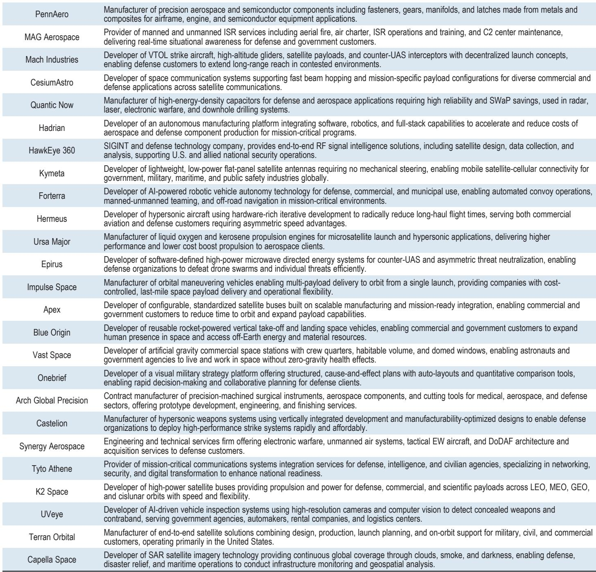
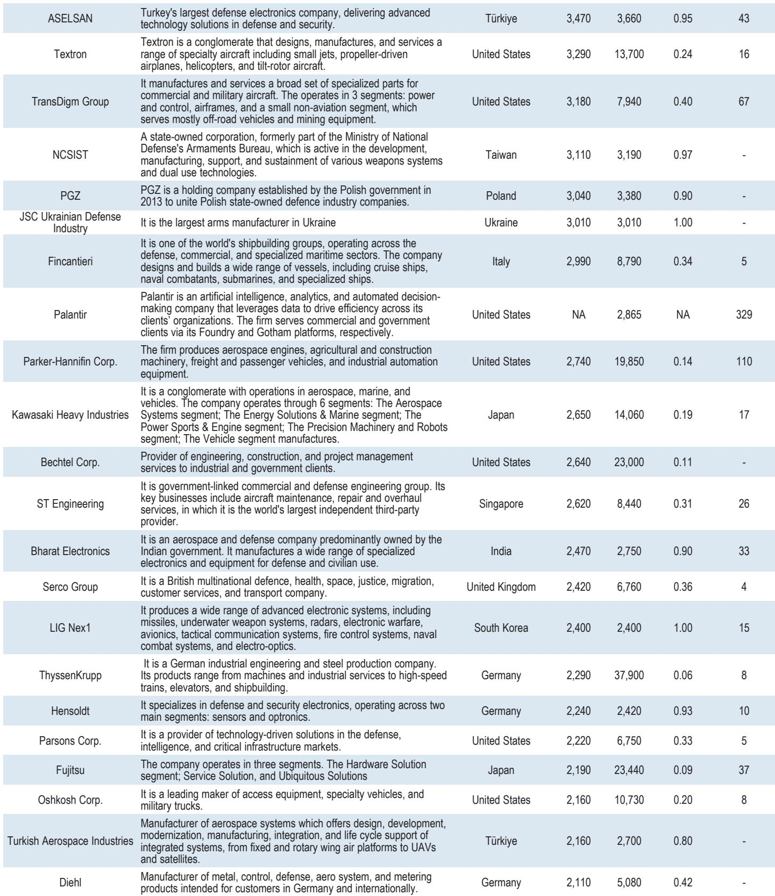
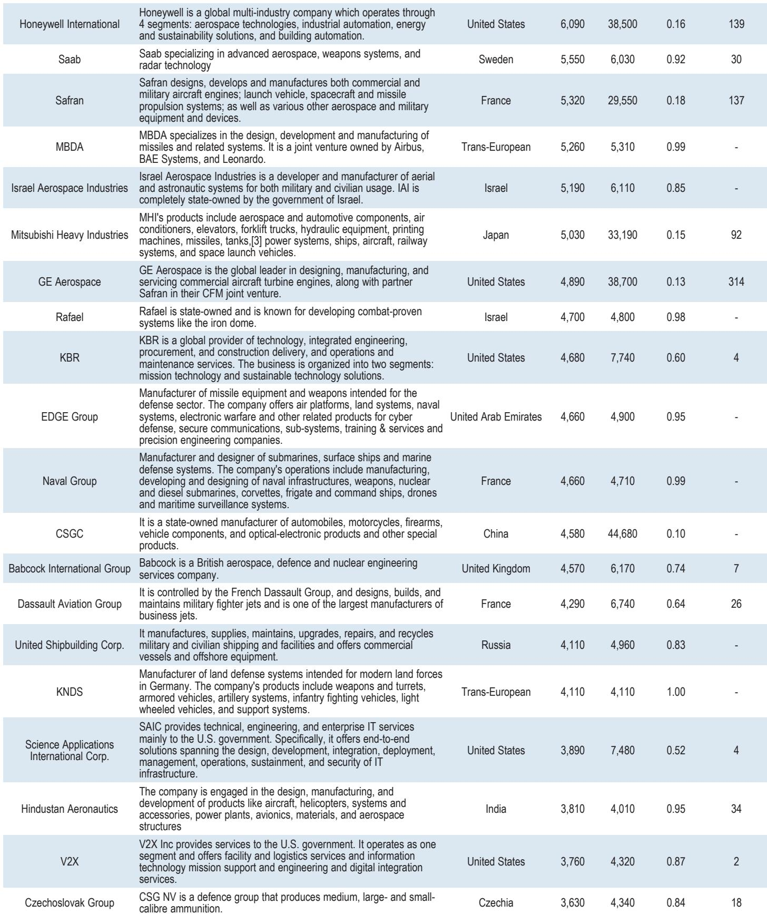

# JPM：美国军工复合体的真正危机不在于预算，而在于工业基础的结构性过时

美国仍然是全球最强大的军事力量。但JPM一份最新发布的深度研报提出了一个让产业决策者无法回避的问题：支撑这种力量的工业基础，是否已经跟不上它所面对的战争形态？

这份报告的核心判断是：美国国防工业基础（DIB）当前面临的挑战，不是钱不够，而是结构不对。过去三十年的整合与集中化，让美国军工体系走向了“精致但脆弱”的路径——以F-35为代表的高端旗舰平台在技术上无可匹敌，但开发周期长、成本高昂、难以规模化。而今天的战场，从乌克兰到中东，再到潜在的台海冲突，正在同时要求三样东西：可消耗的硬件、可迭代的软件、以及能够快速整合两者的工业能力。

这不是一份关于预算拨款的报告。这是一份关于工业逻辑如何被战争形态倒逼重写的分析框架。对于关注军工产业链、国防科技创业、以及中美竞争格局的读者，这份报告的参考价值不仅在于它梳理了历史，更在于它提出了一个尚未被市场充分定价的命题：美国军工股的估值逻辑，可能正站在一个结构性拐点上。

## 1. 冷战后的“旗舰崇拜”让美国军工体系失去了规模弹性

JPM研报追溯了美国DIB的演变轨迹，其核心叙事线非常清晰：从二战时期的全民动员，到冷战时期的专业化与垂直整合，再到冷战结束后的剧烈整合，每一次转变都在提升技术深度，但也在牺牲生产弹性。

二战期间，美国动员了超过80万家民用企业参与国防生产，飞机年产量从1939年的约6000架飙升至1944年的约23.7万架。那是一个“规模即优势”的时代。冷战时期，面对苏联的明确威胁，美国转向了专业化承包商体系，技术深度大幅提升，但供应商基础开始收窄。1993年，时任副国防部长威廉·佩里召集了著名的“最后的晚餐”会议，敦促军工企业合并。到2000年，主要承包商从超过50家锐减至5家——洛克希德·马丁、波音、诺斯罗普·格鲁曼、雷神、通用动力。这五家公司控制了超过60%的合同价值。

这个结构的逻辑是：在一个超级大国对抗明确对手的时代，技术优势可以通过旗舰平台来锁定胜局。F-35、福特级航母、弗吉尼亚级潜艇——这些项目代表了美国军事技术的最前沿，也代表了“精品化”路线的极致。

但问题在于，当威胁从单一超级大国分散为多个层次——近邻竞争对手、中等强国、非国家行为体——时，这套体系暴露了四个相互关联的脆弱点：生产深度不足、采购周期过长、行业集中度过高、供应链韧性脆弱。研报特别指出，这些脆弱点不是理论上的，而是已经在现实中被验证的：乌克兰战争中弹药消耗的速度远超美国当前的产能，而中国在造船和导弹制造上的规模优势，正在从根本上改变“工业能力即战斗力”的方程。

## 2. 乌克兰和加沙的启示：可消耗系统与软件迭代正在改写“杀伤链”

研报在讨论现代战争形态变化时，给出了一个值得反复咀嚼的判断：“技术优势本身已不再足够；军事优势越来越取决于工业产能、成本纪律，以及能力部署的速度和适应性。”

这不是否定高端平台的价值。相反，报告明确强调，可消耗的无人机系统不应替代F-35这样的“精品”平台，而应与之互补。真正需要改变的是两者之间的整合方式。现代战争的杀伤链——从发现、定位、跟踪、瞄准、打击到评估——正在被软件和数据的实时整合彻底重塑。谁能在更短的时间内完成这个闭环，谁就掌握了战场主动权。

这一点在乌克兰战场上表现得尤为明显。低成本无人机与实时指挥控制架构的结合，让传统上需要昂贵平台完成的任务变得可以规模化执行。伊朗在加沙冲突中展示的无人机和导弹战术，同样指向了这个方向。JPM研报的洞察在于：这些冲突暴露的不仅是某种武器系统的有效性，更是一种新的工业逻辑——硬件必须可规模化、软件必须可迭代、系统必须可整合。

对于投资者而言，这意味着传统军工企业的护城河正在被侵蚀。过去，进入壁垒是技术复杂性和政府关系。现在，新的进入者——尤其是那些以软件为核心、以商业供应链为依托的国防科技初创公司——正在以更快的速度、更低的成本切入这个市场。研报列举了一批正在挑战传统“五大承包商”的新名字，虽然具体公司名称在公开摘要中未完全展开，但方向已经非常明确。

## 3. 中国模式带来的不只是威胁，还有工业逻辑的竞争

研报中一个贯穿始终的对比对象是中国。这不是简单的“中国威胁论”，而是对两个国家军工工业逻辑的系统性比较。

中国通过“军事-民用融合”（MCF）战略，将商业部门的制造能力、供应链韧性、以及规模化生产经验系统性地整合进国防体系。中国的造船能力和导弹产量已经远超美国，而在稀土、半导体等关键材料和元器件上的供应链控制力，更是直接渗透到了美国国防项目之中。JPM指出，中国的A2AD（反介入/区域拒止）战略不仅是一个军事概念，它背后是一整套工业能力的支撑：能够以低成本、大规模、快速迭代的方式生产武器系统。

这不是美国当前DIB所能轻易复制的。美国的问题在于，它的工业基础已经被优化为了“精品化”路线——擅长生产少量、高价、高性能的系统，但不擅长生产大量、低价、可消耗的系统。而后者，恰恰是当前和未来冲突中最需要的。

研报引用了其他国家的经验——韩国、瑞典、以色列——这些国家在国防工业整合上各有特色，但共同点是政府与产业之间的紧密协同、供应链的韧性设计、以及快速适应战场反馈的能力。这些经验对美国而言，既是参照，也是挑战。

## 4. 新进入者的机会与旧体系的惯性：执行才是真正的瓶颈

JPM研报在分析政策推动时，给出了一个冷静的判断：“政策动力已经在过去几年启动，并建立在国防科技新公司快速崛起的基础上。但政策推动仍然面临着几个执行障碍，制度性障碍依然存在。”

这里的关键词是“执行”。美国国防部近年来确实在推动“商业优先”和“软件中心”的采购改革，但从政策到产能之间，隔着三重考验。

第一重考验是制度惯性。五角大楼的采购体系是为“精品化”项目设计的，流程冗长、合规要求复杂、风险规避倾向强烈。要让一个初创公司的无人机系统在几个月内进入战场，而不是等上八年走完采购流程，需要的不仅是政策文件，而是整个制度文化的改变。

第二重考验是新进入者的规模化能力。很多国防科技初创公司在技术上令人兴奋，但从原型到量产之间有一个巨大的鸿沟。JPM明确提出了这个问题：“新国防科技公司从创新解决方案转向规模化生产的能力仍然存疑。”这一点至关重要，因为现代战争需要的不是几架原型机，而是成千上万的可消耗系统。

第三重考验是传统承包商的态度。研报提出了三种可能的路径：抵抗、适应、或缓慢衰落。目前来看，变化正在发生，但速度慢于许多人的预期。传统承包商在政治游说、合同关系、以及系统整合能力上仍然拥有巨大优势。新进入者能否真正撬动这个市场，取决于它们能否在规模化生产和制度适应上同时取得突破。

## 5. 报告尚未完全回答的关键问题：整合的代价和路径是什么？

尽管JPM这份报告在问题诊断和方向判断上非常清晰，但它对几个关键问题的回答仍留有悬念。

第一，高端平台与可消耗系统之间的“整合”究竟意味着什么？报告强调两者应互补而非替代，但互补的具体机制是什么？是硬件层面的通用化设计，还是软件层面的统一架构？这种整合的成本由谁承担？如果传统承包商被要求同时维持高端项目的利润率和低端系统的规模化生产，它们的商业模式是否会面临根本性的重构？

第二，新进入者能否真正实现“规模化”？这不是一个技术问题，而是一个供应链、制造能力和资金问题。美国当前的国防采购体系是否愿意为初创公司的规模化生产提供长期、稳定的订单承诺？如果没有这种承诺，资本市场是否愿意持续为这些公司的产能建设提供融资？

第三，制度改革的真正障碍在哪里？报告提到了制度性障碍，但没有深入拆解这些障碍的具体来源——是国会选区的利益分配问题，还是五角大楼内部的官僚文化问题，还是传统承包商的政治游说能力问题？不同的障碍需要不同的解决路径，而目前的讨论还停留在“需要改革”的层面。

这些问题不是报告的缺陷，而是报告留下的自然伏笔。它们指向了一个更深层的判断：美国军工体系的转型，不是技术问题，而是政治经济学问题。而这个判断，对于理解未来几年军工产业链的投资逻辑，至关重要。

---

以上讨论只是这份JPM研报中一小部分内容的提炼。完整的报告还包括对全球主要国防公司的估值比较、对F-35项目的深度案例分析、以及对中国和美国军事能力的详细对比图表。这些内容无法在一篇文章中全部展开，但它们是理解整个判断框架不可或缺的拼图。

如果你对“美国军工转型的底层逻辑”这个话题有进一步研究的兴趣，欢迎来我们的星球微信群里继续讨论。我们会在群内分享完整的研报原文、关键图表的高清版本，以及围绕这些未解问题的后续分析。期待与你一起，把这组问题的答案拼得更完整。

Personal reading notes and learning share only. Not investment advice.

