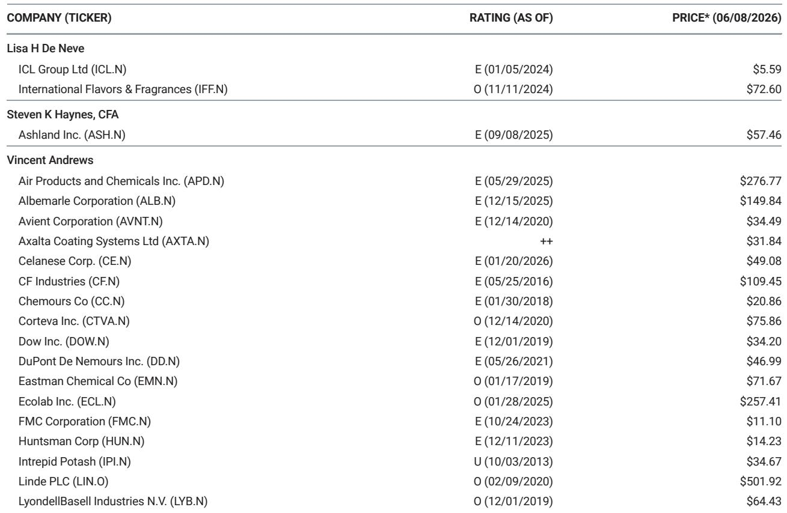
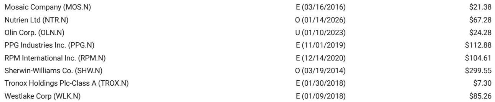
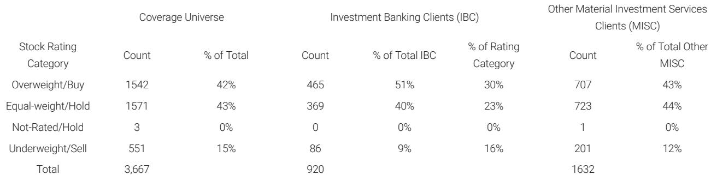

# China's Urea Price Floor Is Not About Trade — It Is A Strategic Inventory Weapon With Global Consequences

China has reinstated urea export price floors at $500 per metric ton FOB for large granular and $510 for auto-grade, effectively locking itself out of the latest India tender that saw offers as low as the $410s per metric ton CFR. This is not a routine trade policy adjustment. It is a deliberate signal that Beijing is willing to forgo export volumes to enforce a pricing floor, even as global urea prices collapse to multi-year lows in the US Gulf, Brazil, and Iran. The decision carries implications far beyond the fertilizer market: it reveals a coordinated industrial strategy to manage domestic producer cash flows, maintain elevated inventory buffers at home, and condition global markets to a higher cost floor for Chinese supply — all while the Strait of Hormuz remains closed.

The timing is critical. Global urea prices have suffered a sharp correction. US Nola prices have fallen into a $360 to $410 per short ton range. Brazil CFR prices dropped $55 in a single week to $530-$540. Iran FOB prices collapsed $100 to $620-$630. Against this backdrop, Chinese exporters would have faced significant losses selling into the India tender at prevailing netback levels below $400 FOB. The floor ensures they do not. But the strategic calculus runs deeper. China has been selectively controlling both urea and DAP/MAP exports since the onset of geopolitical supply disruptions from Russia-Ukraine and now Iran. The result has been domestic oversupply, low prices for Chinese farmers, and compressed margins for local fertilizer producers. The price floor is a tool to reverse the latter without triggering a surge in export volumes that would drain domestic stockpiles.

This article argues that the reinstated price floor is best understood not as a trade barrier but as a multi-objective inventory management mechanism. It protects producer cash flows, retains strategic reserves inside China, and forces global buyers to recalibrate their expectations of Chinese supply availability. The implications for global fertilizer markets, agricultural input costs, and geopolitical risk pricing are profound — and the report from which this analysis is drawn leaves several critical questions unresolved.

## The price floor forces China to cede market share in India, but that may be the point.

The most immediate effect of the $500 floor is that Chinese exporters will not participate in the current India tender for approximately 1.7 million metric tons. At the tender's offer levels in the $410s CFR, the netback to Chinese ports falls below $400 FOB — a full $100 below the floor. By stepping away, China cedes volume to alternative suppliers such as Iran, Russia, and potentially Middle Eastern producers. On the surface, this looks like a self-inflicted loss of market share in the world's largest urea import market.

The strategic logic, however, is the reverse. China has historically used export quotas and licensing to manage urea outflows, but price floors add a new dimension: they prevent the commoditization of Chinese urea at distressed prices. By refusing to sell into a weak tender, China signals that it will not be the marginal supplier that clears the global market at the bottom. This forces other producers to absorb the volume adjustment, which in turn puts upward pressure on global pricing over time. The floor acts as a put option for the entire Chinese industry — it limits downside for producers while keeping inventory inside the country.

The secondary effect is on Indian buyers. India has grown accustomed to sourcing large volumes of Chinese urea at competitive prices. If China remains absent from tenders for an extended period, Indian procurement costs will rise, and the country will need to deepen relationships with alternative suppliers. This shifts bargaining power away from buyers and toward sellers, particularly those with spare capacity and logistical flexibility. The report notes that SABIC has already begun exporting its first urea bulk shipment from Jubail to Yanbu, reaching 40% of daily production transferred via alternative routes. SABIC's ramp-up is a direct response to the supply gap created by China's absence and the Strait of Hormuz disruption. If China's floor remains in place, Saudi exports will likely capture a larger share of Indian demand, permanently altering trade flows.

## The Strait of Hormuz closure creates a structural inventory premium that China is exploiting.

The report explicitly links China's export policy to the ongoing closure of the Strait of Hormuz. The initial price floors were set at much higher levels — $660 FOB for prilled and $670 for granular — before being removed and then reinstated at lower but still elevated levels. The fact that the floors were reinstated while the Strait remains closed is not coincidental. It suggests that Beijing views the current geopolitical disruption as an opportunity to lock in higher prices for its exports while simultaneously building a strategic buffer.

The Strait of Hormuz closure has removed a significant portion of global urea supply from the market, particularly from Iran, which saw its FOB prices drop $100 in a week despite the disruption. This creates a structural supply deficit that China can exploit by keeping its own exports limited and priced high. The floor ensures that even when exports do occur, they generate maximum cash flow per ton. For Chinese producers, this is a direct improvement over the previous regime of low domestic prices and constrained margins.

The deeper implication is that China is treating urea as a strategic commodity akin to rare earths or semiconductors — a resource to be managed for national interest rather than left to market forces. The inventory buildup inside China provides food security insurance, while the price floor provides financial stability for the fertilizer industry. The report raises the possibility that China will remain guarded with urea exports until the Strait reopens, but the reinstatement of floors at lower levels than before suggests a more nuanced approach. China may be willing to export at a premium even during the closure, but only if the price is right.

## The decision framework for global buyers must now incorporate Chinese policy uncertainty as a structural risk.

For procurement teams, agricultural commodity traders, and fertilizer investors, the reinstated price floor introduces a new variable that cannot be modeled using traditional supply-demand fundamentals. Chinese export policy is subject to change with little warning, and the criteria for adjustment are not purely economic. The report explicitly states that "Chinese fertilizer export policy is subject to change," but it does not — and cannot — specify the triggers.

The decision framework that emerges from this analysis has three layers. First, buyers must assess the probability that China will maintain the floor for the next 6 to 12 months. If the Strait of Hormuz reopens, the rationale for the floor weakens, but it may not disappear entirely — China could maintain the floor to support domestic producers regardless of global supply conditions. Second, buyers must evaluate the volume impact. Even with the floor in place, China could still export limited quantities at the floor price, particularly to non-India destinations where the "appropriately reduced" language leaves room for flexibility. The report notes that floors for other destinations remain under discussion, creating a scenario where China selectively opens export windows to preferred buyers.

Third, and most importantly, buyers must recognize that Chinese policy is now a source of tail risk for global fertilizer prices. If China suddenly removes the floor and floods the market with accumulated inventory, prices could collapse further. If China tightens the floor or reduces the quota, prices could spike. This asymmetry creates a premium on optionality — buyers should secure diversified supply agreements, build inventory when possible, and avoid over-reliance on Chinese volumes.

## What the report does not fully answer: the interaction between the price floor and the DAP/MAP resumption timeline.

The report notes that Chinese MAP/DAP exports are expected to resume in August, but it also warns that this timeline is "harder to call at present" given dislocations in sulfur markets. Sulfur availability and costs have been affected by the same geopolitical disruptions — Russia has further reduced exports in recent weeks — and the resumption of phosphate exports may be contingent on sulfur supply normalization.

This creates an unresolved analytical question: will the urea price floor be extended to phosphates? If China applies a similar logic to DAP/MAP exports, the impact on global phosphate markets would be even more significant than in urea, because China is a dominant producer of phosphate fertilizers. The report does not provide a clear answer, but the logic of the analysis suggests that the same strategic considerations apply. China wants to maintain domestic inventory, support producer margins, and use export policy as a geopolitical lever. Extending price floors to phosphates would be consistent with this framework.

Another open question is the volume of Chinese urea inventory that has accumulated during the period of restricted exports. The report references "higher inventory in country" but does not quantify the stockpile. If the inventory is large enough, even limited exports at the floor price could generate substantial cash flow for producers. If the inventory is smaller than expected, the floor may be more about signaling than actual volume control. The market needs clarity on this metric to assess the credibility of the floor.

## The next catalyst: how global prices adjust to the new Chinese supply regime.

Over the balance of the week, the market will be watching how global spot prices respond to the reinstated floor. The initial reaction could be counterintuitive — if traders interpret the floor as a sign that China will not export at all, prices may rise in anticipation of tighter supply. If traders view the floor as a ceiling that will eventually be lowered, prices may continue to fall. The report provides no directional prediction, and the outcome depends on how other suppliers respond.

SABIC's ramp-up is a key variable. If Saudi exports can fill the gap left by China, global prices may stabilize at levels below the Chinese floor, effectively marginalizing Chinese supply. If SABIC's ramp-up is slower than expected, or if other Middle Eastern producers face constraints, the floor may become the new global benchmark. The interaction between Chinese policy and Saudi production capacity will define the next phase of the urea market.

For investors and procurement professionals, the takeaway is clear: Chinese fertilizer policy is no longer a background factor to be monitored — it is a primary driver of global pricing and trade flows. The price floor is the latest manifestation of a strategic shift that began with the Russia-Ukraine conflict and has accelerated with the Strait of Hormuz closure. The report provides the analytical framework to understand this shift, but the full picture requires ongoing monitoring of Chinese policy statements, trade data, and geopolitical developments.

Join the community to read the full report and review the original charts.

*This article is for learning and discussion only and does not constitute investment advice.*

Personal reading notes and learning share only. Not investment advice.

