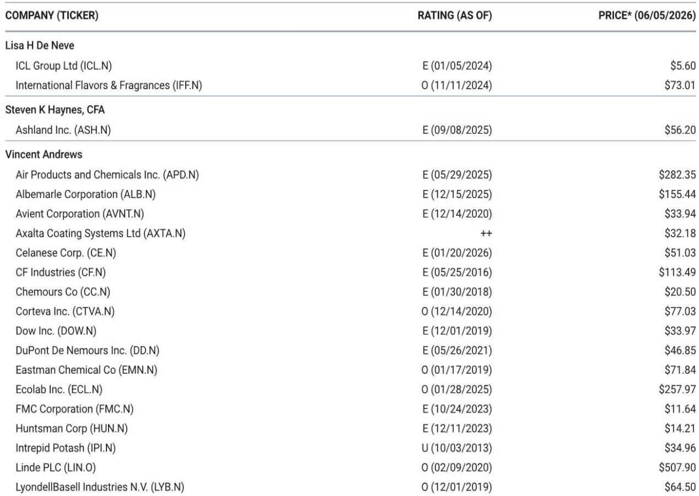
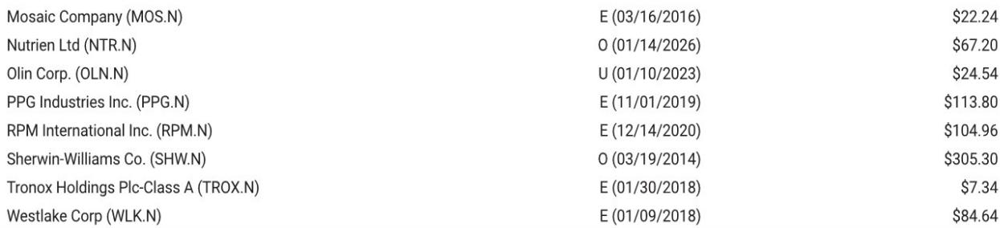
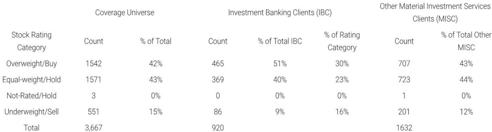

# China’s Removal of Urea Price Floors Signals a Shift from Strategic Restraint to Tactical Market Management

China has quietly removed the price floors on its initial 3 million metric ton urea export quota, a move that carries far more significance than a simple policy adjustment. The decision tells us that Beijing is prioritizing export volume over producer cash flow, even as global supply chains remain fractured by the closure of the Strait of Hormuz. This is not a concession to market forces. It is a calculated recalibration of China's fertilizer export strategy, one that reveals how the world's largest producer is navigating a landscape where geopolitical risk, domestic agricultural priorities, and industrial profitability are increasingly at odds.

The price floors, set on May 27 at $660 per metric ton FOB for prilled urea and $670 for granular, with a separate $680 floor for sales to India, were never designed to hold once global prices collapsed below those levels. What matters is that China chose to remove them rather than defend them. That choice suggests that the alternative scenario—using floors to limit export volumes while maximizing per-ton cash generation for domestic producers—was deemed less attractive than maintaining market share and managing inventory overhang.

For investors tracking global fertilizer markets, this is a pivotal moment. The removal of price floors does not mean China has abandoned its cautious stance on exports. It means the mechanism of control has shifted from price-based to volume-based management. Understanding this distinction is essential for anyone trying to forecast urea, DAP, and MAP prices through the second half of 2026.

## The removal of price floors confirms that China is managing export volumes, not maximizing producer returns

When China first imposed price floors on urea exports in late May, the market interpreted the move in two competing ways. One camp saw it as a protective measure designed to ensure domestic supply security amid geopolitical turmoil. The other viewed it as a tactical play to squeeze maximum revenue from a limited export quota while keeping the bulk of production inside the country.

The removal of the floors settles this debate. China is not interested in extracting maximum cash from its export quota. If that were the goal, the floors would have remained in place, even if they meant lower export volumes. Instead, Beijing has chosen to let volumes flow more freely, accepting lower per-ton revenue in exchange for clearing domestic oversupply.

This logic becomes clear when you examine the domestic dynamics. Years of selective export restraint, first triggered by the Russia-Ukraine conflict and now compounded by disruptions related to Iran and the Strait of Hormuz, have created a persistent surplus of urea within China. Chinese farmers have benefited from extremely low domestic prices, but the country's fertilizer producers have faced compressed margins and weak cash flows. The removal of price floors is, in part, an acknowledgment that the domestic oversupply problem has become acute enough to warrant a more aggressive export stance.

The strategic implication is straightforward: China is willing to accept lower margins on exports to prevent a more severe domestic downturn in its fertilizer industry. This is a supply management decision, not a market liberalization one.

## Global price dislocations have made price-based controls irrelevant, forcing China to adapt its toolkit

The timing of the floor removal is instructive. Global urea prices had already moved well below the Chinese floor levels before the policy change. In that context, maintaining the floors would have achieved nothing except halting exports entirely. But the more interesting question is why global prices fell so far in the first place.

Part of the answer lies in demand destruction. High fertilizer prices in 2024 and early 2025 led to reduced application rates in key importing regions, particularly in South Asia and Southeast Asia. That demand weakness has persisted, creating a buyer's market. But the more structural factor is the ongoing closure of the Strait of Hormuz, which has disrupted sulfur and phosphate supply chains and created uncertainty about the availability of complementary inputs.

China's initial decision to impose price floors may have been linked to the Strait of Hormuz situation. The logic would have been: keep exports limited until the strait reopens and global supply chains normalize, then release product into a tighter market. But the strait remains closed, and waiting has become costly. Domestic inventories are piling up, and producers are running out of storage.

By removing the floors, China is effectively admitting that the wait-and-see approach is no longer viable. The policy toolkit has shifted from price-based to volume-based controls because the external environment no longer supports price floors that make sense on paper.

## The next critical test is whether China resumes MAP and DAP exports in August, and sulfur markets hold the key

Urea is only one part of the story. The report flags that the next major development to watch is whether China resumes monoammonium phosphate (MAP) and diammonium phosphate (DAP) exports in August. This is a far more complex decision than the urea floor removal, and the outcome will have disproportionate impact on global phosphate markets.

The complicating factor is sulfur. Phosphate fertilizer production requires sulfur, and the sulfur market is experiencing dislocations that go beyond the Strait of Hormuz closure. Russia has further reduced sulfur exports in recent weeks, adding another layer of supply constraint. For China to resume MAP and DAP exports in August, it would need to secure adequate sulfur supplies at workable costs. That is not guaranteed.

The report's analysts are right to be cautious here. The resumption of phosphate exports is harder to call than the urea decision because the input cost dynamics are less controllable. China can decide to export urea regardless of global prices because it controls the full production chain domestically. For phosphates, the sulfur dependency introduces a variable that Beijing cannot fully manage.

This creates an interesting asymmetry. Urea exports can resume relatively quickly because the domestic production base is self-sufficient. Phosphate exports will lag because they depend on an imported input that is currently disrupted. Investors should expect a staggered recovery in Chinese fertilizer exports, with urea leading and phosphates following only if sulfur conditions improve.

## What the report leaves unanswered: the India factor, the quota system's flexibility, and the political calculus behind fertilizer policy

The report raises several questions that it does not fully resolve, and these are precisely the areas where deeper analysis is needed.

First, the India dimension. China set a separate price floor of $680 per metric ton for prilled urea sold to India, and the removal of the general floors occurred ahead of the close of the most recent India tender. Yet it remains unclear how much China has participated in that tender. The relationship between Chinese export policy and Indian procurement strategy is one of the most consequential dynamics in global fertilizer markets, and the report leaves this thread dangling.

Second, the quota system itself. China initially authorized 3 million metric tons of urea exports. Is this a hard cap, or is it subject to revision? If global prices remain depressed and domestic inventories continue to build, will Beijing authorize additional quota tranches? The report notes that Chinese fertilizer export policy is subject to change, but it does not model the scenarios under which the quota would expand or contract.

Third, the political calculus. Fertilizer policy in China is not purely economic. It is deeply intertwined with food security, rural stability, and the political imperative to keep domestic agricultural input costs low. The removal of price floors may have been an economic decision, but the broader export framework remains political. Understanding when political considerations will override economic logic is critical for forecasting.

These are not weaknesses in the report. They are the natural boundaries of any timely analysis. But for readers who want to build a robust investment thesis around Chinese fertilizer exports, these open questions are exactly where additional research is needed.

## A decision framework for investors: three variables that will determine the trajectory of Chinese fertilizer exports

For investors trying to position themselves in fertilizer equities or commodity exposures, the Chinese export story can be distilled into three variables that should form the basis of any scenario analysis.

Variable one is the Strait of Hormuz. The longer the strait remains closed, the more pressure builds on China to export urea to relieve domestic oversupply, but the harder it becomes to resume phosphate exports due to sulfur constraints. Investors should track any developments related to the strait's reopening as a leading indicator for the relative timing of urea versus phosphate export resumption.

Variable two is domestic inventory levels. Chinese urea storage is finite. If inventories continue to rise, the pressure to export will intensify, potentially leading to additional quota authorizations or further price concessions. Conversely, if domestic demand picks up—perhaps due to improved farmer economics or government stimulus—the export urgency could diminish. Monitoring Chinese domestic urea prices relative to global prices provides a real-time signal of inventory pressure.

Variable three is sulfur availability and pricing. For phosphate exporters, this is the binding constraint. If sulfur costs remain elevated or supply remains disrupted, China's ability to resume MAP and DAP exports in August will be severely limited. Investors should watch Russian sulfur export data and the status of alternative sulfur sources as closely as they watch Chinese policy announcements.

These three variables are not independent. They interact in ways that create nonlinear outcomes. A reopening of the Strait of Hormuz, for example, would simultaneously ease sulfur constraints for phosphates and reduce the urgency of urea exports. The net effect on fertilizer prices depends on the sequencing and magnitude of these shifts.

## The removal of price floors is a signal, not a solution, and the full picture requires deeper analysis

China's decision to remove urea export price floors is an important data point, but it is not a turning point in itself. It tells us that Beijing is prioritizing volume over margin in the current environment. It does not tell us how long that prioritization will last, how far it will extend into other fertilizer products, or what conditions would cause a reversal.

The report's analysts are right to stay tuned. Chinese fertilizer policy has a history of abrupt changes, and the current geopolitical environment provides ample reason for further adjustments. The removal of price floors could be followed by the imposition of export taxes, the tightening of quota allocations, or the introduction of new domestic price support mechanisms.

For serious investors, the signal from this policy change is that China is actively managing its fertilizer export strategy in response to evolving conditions. That means the old models of Chinese export behavior—based on static assumptions about policy preferences—are no longer reliable. A more dynamic, scenario-based approach is required.

Join the community to read the full report and review the original charts.

*This article is for learning and discussion only and does not constitute investment advice.*

Personal reading notes and learning share only. Not investment advice.

