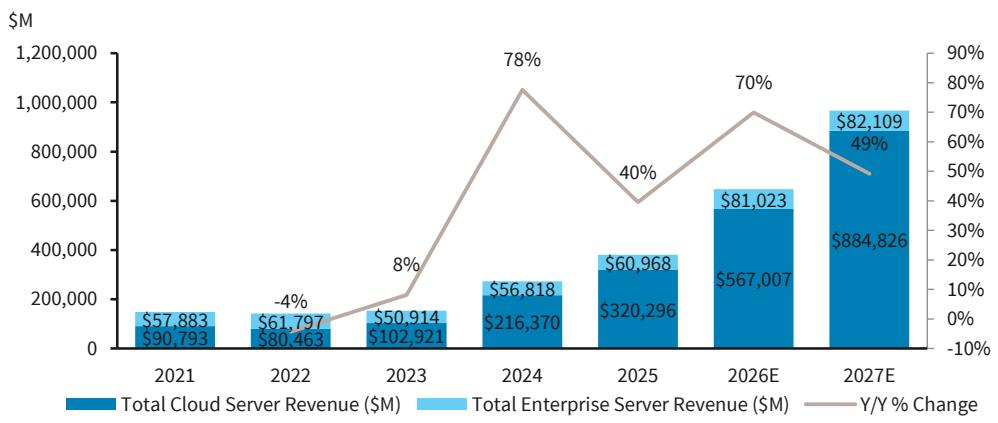
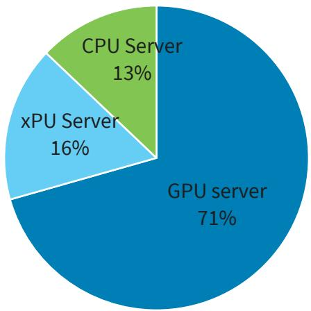
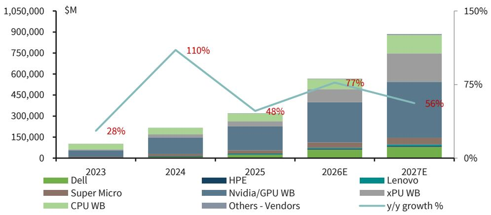
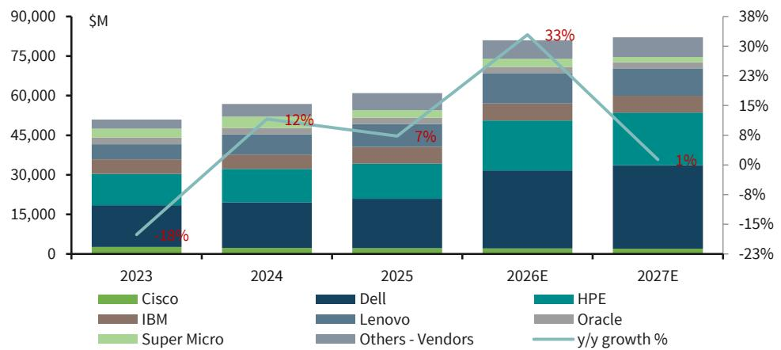
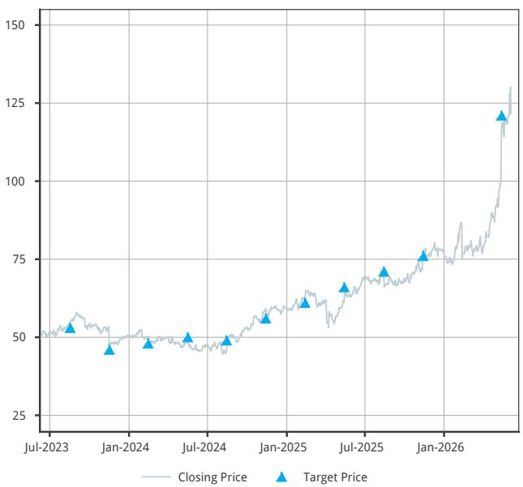
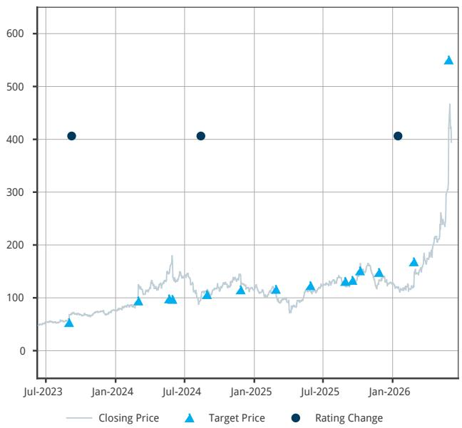
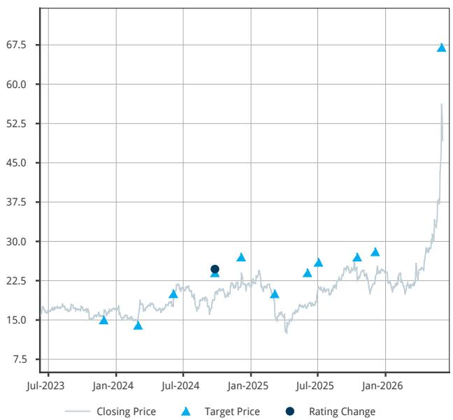
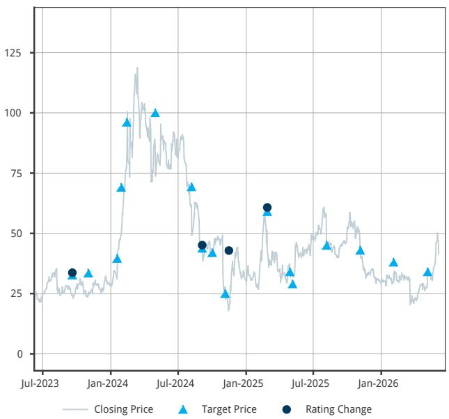

IT Hardware and Communications Equipment

# Server Model Update: Enterprise Surprises Up, AI Momentum Remains

We update our detailed Server model following recent results and industry conversations. Enterprise strength surprised materially to the upside across server players with AI momentum still strong this earnings cycle. We believe ASP is driving a majority of the upside, with unit growth also cited.

Following recent results and industry conversations, we adjust our Cloud and Enterprise server estimates. Recall, this year we changed our model methodology where we now break out Cloud (inclusive of AI) and Enterprise servers vs previously where we used AI vs Traditional.

Our Cloud estimates move higher, in line with major hyperscalers' lifted capex expectations, and we now estimate Cloud growing at a 5-year CAGR of \~62% (2022-27E) up from our prior estimate of \~59%. We view our revenue estimates moving higher as impressive, especially given how large our revenue estimates now are.

Enterprise surprised materially to the upside this past Q across server players. Although we believe the majority of the upward movement was pull-in and ASP driven, companies also cited how agentic AI and inference are driving a new opp for traditional servers. However, we do not expect traditional server growth to continue into next year, and estimate LSD moving forward. Because of this year's expected outsized traditional server growth (we now estimate 33% growth assuming some unit growth coupled with higher ASPs), our Enterprise 5-year CAGR through 2027 is now MSD (\~6%) vs our prior estimate of \~flat.

Positive capex commentary continues from hyperscalers with >\$700Bn in capex now expected in CY26, up from \~\$423Bn in CY25. Recent results from DELL, HPE, and SMCI are positive proof points to this higher capex directly translating into AI-related network infrastructure investments. Despite memory-related headwinds, we now expect Enterprise to grow >30% this year, assuming significant ASP increases and some unit volume. We are of the view that for Enterprise players, where purchases are on bits not necessarily units, pricing actions will fill the gap with potentially lower unit volumes. However, we do expect \~1% growth in CY27, given our estimates this year on top of two strong years of growth in 2024-25 are hard to sustain, especially given continued price increases may erode demand more than current expectations.

IT Hardware and Communications

Equipment

NEUTRAL

IT Hardware and Communications

Equipment

Tim Long

+1 212 526 4043

tim.long@BARC.com

BCI, US

Alyssa Shreves

+1 212 526 7570

alyssa.shreves@BARC.com

BCI, US

Mary Lenox

+1 212 526 6277

mary.lenox@BARC.com

BCI, US

Clarisse Yu

+1 212 526 7025

clarisse.yu@BARC.com

BCI, US

BARC Capital Inc. and/or one of its affiliates does and seeks to do business with companies covered in its research reports. As a result, investors should be aware that the firm may have a conflict of interest that could affect the objectivity of this report. Investors should consider this report as only a single factor in making their investment decision.

## THE 2026 EXTEL SURVEY IS NOW OPEN

# Support our industry-leading analysts with 5-Star votes in this year's Extel All-America Research Survey

Vote Now

View Analysts

## Server Model Wrap Up

- Our CY26Cloud server revenue forecasts move lower and CY27 move higher, accounting for the above-mentioned strength in hyperscaler capex and focus on technical infrastructure investments. However, we do acknowledge some lack of visibility on AI server builds could make numbers lumpy (like we've previously seen with SMCI).  
- Our new Cloud server revenue estimates are \$567Bn/\$885Bn in CY26/27 vs our prior estimates of \$585Bn/\$817Bn, respectively. We model growth of 77% and 56% in 2026/2027 vs our prior estimates of 84% and 40%. xPU server estimates and updated segmentation from HPE (we adjusted our 2025 metrics), primarily accounted for the drop in 2026 growth vs prior estimates (not a fundamental change). DELL (and to lesser extent SMCI) drove the tick up in our estimates on the OEM front, with another increase in implied ODM growth.  
- Despite the move higher in CY27 estimates, we expect there is potential upside bias to our estimates, given the strong capex announcements from the large hypers, the rising interest in enterprise/inferencing opportunities, and if large AI training deals get appropriate funding. However, there is also a scenario in which we could see a push-out in revenues, given some of the larger sovereign deals are scheduled for the Middle East, although we have yet to hear of any deployment delays.  
- We now estimate Enterprise server revenues up \~33% in CY26 (vs prior estimate of \~2%), given the material outperformance and commentary from OEM players. DELL now expects traditional servers to grow >60% for the FY, and HPE cited traditional server orders increased DDD in the Q. DELL also mentioned that despite ASP increases, the company saw traditional server unit growth in the Q. We believe OEM players are enjoying multiple ASP increases coupled with customer buying behavior holding up better than expected. We believe units may be up MSD-HSD, although ASPs are up most likely closer to 40-50%. We expect further ASP increases and the cyclicality of the enterprise business to normalize growth next year down to \~1% growth (with downside bias to estimates, if unit volumes and demand erode further than we've currently estimated).  
- Overall, we model total server revenue growth of 70%/49% in CY26/27, from 71%/36% prior estimates, as we expect continued AI strength momentum coupled with greater than expected Enterprise strength (in terms of revenues).

Server market performance has been bifurcated, with Cloud growth materially diverged from Enterprise over the past few years, and we do not expect this phenomenon to change. Hyperscaler capex is one of the main data points to watch for AI servers.

FIGURE 1. Cloud Server Revs vs Top Hyperscalers' Capex  

bar-line hybrid

Cloud Capex Spend ($B)
| Year | Cloud Server Revenue ($Bn) | Total Cloud Capex ($Bn) | Cloud Server Growth Rate Y/Y (%) |
| :--- | :--- | :--- | :--- |
| 2022 | 80.5 | 158.0 | -11.4 |
| 2023 | 102.9 | 155.9 | 27.9 |
| 2024 | 216.4 | 247.4 | 110.2 |
| 2025 | 320.3 | 422.7 | 48.0 |
| 2026E | 567.0 | 754.0 | 77.0 |
| 2027E | 884.8 | 1,003.8 | 56.1 |

Source: 650 Group, Company Documents, Bloomberg, BARC Estimates

We expect growth from Cloud and Enterprise servers moving through CY26-27. We find the Cloud growth impressive, given the large base it's growing from. Additionally, our Enterprise server growth this year accounts for the ASP increases along with continued volume growth (despite memory headwinds) OEMs cited this past earnings cycle.

FIGURE 2. Total Server Revenue Growth  

bar-line hybrid

| Year | Total Cloud Server Revenue ($M) | Total Enterprise Server Revenue ($M) | Y/Y % Change (%) |
| :--- | :--- | :--- | :--- |
| 2021 | 90,793 | 57,883 | |
| 2022 | 80,463 | 61,797 | -4 |
| 2023 | 102,921 | 50,914 | 8 |
| 2024 | 216,370 | 56,818 | 78 |
| 2025 | 320,296 | 60,968 | 40 |
| 2026E | 567,007 | 81,023 | 70 |
| 2027E | 884,826 | 82,109 | 49 |

Source: 650 Group, Company Documents, Bloomberg, BARC Estimates

AI has been a big positive for the server industry, with a focus on companies' growing AI server share and backlog. The Cloud server market has grown to multiples the size of the Enterprise server market, on a revenue basis. White box (inclusive of NVDA) continues to take market share from branded players, and we expect this to continue. A breakdown below of NVDA-based server revenues compared to xPU and CPU server share for 2026E.

FIGURE 3. % Share of NVDA-based server share, xPU and CPU server share for 2026E  

pie chart

| Category | Percentage (%) |
| :--- | :--- |
| CPU Server | 13 |
| xPU Server | 16 |
| GPU server | 71 |

Source: 650 Group, Company Documents, Bloomberg, BARC Estimates

However, once Enterprise/Inferencing and Sovereign AI ramp more meaningfully, we expect some share distribution towards branded players.

FIGURE 4. Cloud Server Market by Vendor  

bar-line hybrid

| Year | Dell ($M) | Super Micro ($M) | CPU WB ($M) | HPE ($M) | Nvidia/GPU WB ($M) | xPU WB ($M) | Others - Vendors ($M) | y/y growth (%) |
| :--- | :--- | :--- | :--- | :--- | :--- | :--- | :--- | :--- |
| 2023 | 100,000 | 10,000 | 50,000 | 10,000 | 50,000 | 10,000 | 10,000 | 28 |
| 2024 | 150,000 | 15,000 | 60,000 | 15,000 | 100,000 | 20,000 | 15,000 | 110 |
| 2025 | 150,000 | 15,000 | 65,000 | 15,000 | 150,000 | 35,000 | 25,000 | 48 |
| 2026E | 150,000 | 15,000 | 75,000 | 15,000 | 250,000 | 65,000 | 45,000 | 77 |
| 2027E | 150,000 | 15,000 | 85,000 | 15,000 | 350,000 | 95,000 | 65,000 | 56 |

Source: 650 Group, Company Documents, Bloomberg, BARC Estimates

We entered the year under the assumption ASP increases would offset expected unit volume declines. However, ASP increases coupled with unit volumes holding in better than expected caused material upside to our estimates. Although we believe the majority of outperformance is most likely ASP driven (with pull-in benefiting YTD results), the benefit of unit volumes has propelled estimates much higher than expected. We do expect demand erosion to eventually catch up with numbers, especially if companies continue to raise prices, which is why we assume \~1% growth into CY27 (with a downward bias). The market share picture within Enterprise servers has remained largely steady over the past few years with DELL and HPE \~30% and 20s% share, respectively.

FIGURE 5. Enterprise Server Market by Vendor  

stacked bar chart

| Year | Cisco ($M) | Dell ($M) | IBM ($M) | Super Micro ($M) | Lenovo ($M) | HPE ($M) | Oracle ($M) | Others - Vendors ($M) | y/y growth (%) |
| :--- | :--- | :--- | :--- | :--- | :--- | :--- | :--- | :--- | :--- |
| 2023 | 1000 | 5000 | 4000 | 2000 | 6000 | 10000 | 3000 | 1000 | -18% |
| 2024 | 1000 | 15000 | 5000 | 2000 | 8000 | 12000 | 4000 | 1500 | 12% |
| 2025 | 1000 | 15000 | 6000 | 2000 | 9000 | 13000 | 5000 | 1800 | 7% |
| 2026E | 1000 | 31000 | 5000 | 2000 | 12000 | 25000 | 4500 | 2500 | 33% |
| 2027E | 1000 | 32500 | 4500 | 2500 | 11500 | 24500 | 4500 | 2500 | 1% |

Source: 650 Group, Company Documents, Bloomberg, BARC Estimates

## Vendor Takeaways

\- DELL AI server momentum continued last Q with AI server revenue \~37% of total revenue in the Q and up 80% Q/Q. AI backlog increased to \$51.3Bn, up 19% Q/Q, and management guided to \~\$60Bn in FY AI server revenue compared to prior view of \$50B. AI customer base is now \~5,000 customers (up >50% in last six months). Traditional server results were also impressive in the Q, up over 90% y/y with management now expecting traditional servers to grow just over 60% for the FY. We expect pricing and pull-ins are accounting for some of the traditional server demand, although management also highlighted how agentic AI and inference are driving a new opp for traditional servers, and we know ASPs are up a lot on higher commodity costs and richer configurations.

\- HPE saw orders in traditional server up triple digits last Q. However, ASP is playing a significant role right now. The company is seeing customers start new projects even given where ASPs are, with the company seeing agentic AI and inferencing use cases. Customers are early on in their agentic journey but focused on it and what they need to do to invest. \$1.8bn in AI orders in the quarter and \$16.4bn cumulative. We continue to view HPE as being more selective with AI deals, focusing on GM and working capital. Given the acquisition of JNPR, we view HPE now more as a networking company vs server, especially given networking now is expected to comprise >50% of total company operating profit for the year.

\- SMCI results missed on the top line last Q, due to customer readiness, with revenue of \$10.2Bn vs guidance of "at least \$12.3Bn." Management guided to FQ4 revenue in the range of \$11-\$12.5Bn (within range of our prior estimate) and FY26 revenue in the range of \$38.9-\$40.4Bn (slightly below prior guidance of "at least \$40Bn"). Enterprise, which was \~28% of revenue this Q up from \~15% the prior Q, also contributed to margin outperformance this Q. Rev rec visibility remains limited, and we expect this to remain into the following Qs. Some customers have slowed their plans with the company since the indictment and ongoing investigation, although we suspect limited business was lost, given the record backlog.

## Analyst(s) Certification(s):

I, Tim Long, hereby certify (1) that the views expressed in this research report accurately reflect my personal views about any or all of the subject securities or issuers referred to in this research report and (2) no part of my compensation was, is or will be directly or indirectly related to the specific recommendations or views expressed in this research report.

## Important Disclosures:

BARC is produced by the Investment Bank of BARC Bank PLC and its affiliates (collectively and each individually, "BARC"). All authors contributing to this research report are Research Analysts unless otherwise indicated. The publication date at the top of the report reflects the local time where the report was produced and may differ from the release date provided in GMT.

## Availability of Disclosures:

Where any companies are the subject of this research report, for current important disclosures regarding those companies please refer to https://publicresearch.BARC.com or alternatively send a written request to: BARC Compliance, 745 Seventh Avenue, 13th Floor, New York, NY 10019 or call +1-212-526-1072.

The analysts responsible for preparing this research report have received compensation based upon various factors including the firm's total revenues, a portion of which is generated by investment banking activities, the profitability and revenues of the Markets business and the potential interest of the firm's investing clients in research with respect to the asset class covered by the analyst.

Research analysts employed outside the US by affiliates of BARC Capital Inc. are not registered/qualified as research analysts with FINRA. Such non-US research analysts may not be associated persons of BARC Capital Inc., which is a FINRA member, and therefore may not be subject to FINRA Rule 2241 restrictions on communications with a subject company, public appearances and trading securities held by a research analyst's account.

Analysts regularly conduct site visits to view the material operations of covered companies, but BARC policy prohibits them from accepting payment or reimbursement by any covered company of their travel expenses for such visits.

BARC Department produces various types of research including, but not limited to, fundamental analysis, equity-linked analysis, quantitative analysis, and trade ideas. Recommendations contained in one type of BARC may differ from those contained in other types of BARC, whether as a result of differing time horizons, methodologies, or otherwise.

In order to access BARC Statement regarding Research Dissemination Policies and Procedures, please refer to https://publicresearch.BARC.com/S/RD.htm. In order to access BARC Conflict Management Policy Statement, please refer to: https://publicresearch.BARC.com/S/CM.htm.

## Materially Mentioned Stocks (Ticker, Date, Price)

Cisco Systems, Inc. (CSCO, 08-Jun-2026, USD 124.15), Equal Weight/Neutral, CD/CE/D/J/K/L/M

Dell Technologies Inc. (DELL, 08-Jun-2026, USD 400.77), Overweight/Neutral, A/D/E/J/K/L/M/N

Hewlett Packard Enterprise Company (HPE, 08-Jun-2026, USD 49.87), Overweight/Neutral, A/CD/CE/D/E/FA/J/K/L/M

Super Micro (SMCI, 08-Jun-2026, USD 43.99), Equal Weight/Neutral, D/FA/J/L

Unless otherwise indicated, prices are sourced from Bloomberg and reflect the closing price in the relevant trading market, which may not be the last available closing price at the time of publication.

## Disclosure Legend:

A: BARC Bank PLC and/or an affiliate has been lead manager or co-lead manager of a publicly disclosed offer of securities of the issuer in the previous 12 months.

B: An employee or non-executive director of BARC PLC is a director of this issuer.

CD: BARC Bank PLC and/or an affiliate is a market-maker in debt securities issued by this issuer.

CE: BARC Bank PLC and/or an affiliate is a market-maker in equity securities issued by this issuer.

CH: BARC Bank PLC and/or its group companies makes, or will make, a market in the securities (as defined under paragraph 16.2 (k) of the HK SFC Code of Conduct) in respect of this issuer.

D: BARC Bank PLC and/or an affiliate has received compensation for investment banking services from this issuer in the past 12 months.

E: BARC Bank PLC and/or an affiliate expects to receive or intends to seek compensation for investment banking services from this issuer within the next 3 months.

FA: BARC Bank PLC and/or an affiliate beneficially owns 1% or more of a class of equity securities of this issuer, as calculated in accordance with US regulations.

FB: BARC Bank PLC and/or an affiliate beneficially owns a long position of more than 0.5% of a class of equity securities of this issuer, as calculated in accordance with EU regulations.

FC: BARC Bank PLC and/or an affiliate beneficially owns a short position of more than 0.5% of a class of equity securities of this issuer, as calculated in accordance with EU regulations.

FD: BARC Bank PLC and/or an affiliate beneficially owns 1% or more of a class of equity securities of this issuer, as calculated in accordance with South Korean regulations.

FE: BARC Bank PLC and/or its group companies has financial interests in relation to this issuer and such interests aggregate to an amount equal to or more than 1% of this issuer's market capitalization, as calculated in accordance with HK regulations.

GD: One of the Research Analysts on the fundamental credit coverage team (and/or a member of his or her household) has a long position in the common equity securities of this issuer.

GE: One of the Research Analysts on the fundamental equity coverage team (and/or a member of his or her household) has a long position in the common equity securities of this issuer.

H: This issuer beneficially owns more than 5% of any class of common equity securities of BARC PLC.

I: BARC Bank PLC and/or an affiliate is party to an agreement with this issuer for the provision of financial services to BARC Bank PLC and/or an affiliate.

J: BARC Bank PLC and/or an affiliate is a liquidity provider and/or trades regularly in the securities of this issuer and/or in any related derivatives.

K: BARC Bank PLC and/or an affiliate has received non-investment banking related compensation (including compensation for brokerage services, if applicable) from this issuer within the past 12 months.

L: This issuer is, or during the past 12 months has been, an investment banking client of BARC Bank PLC and/or an affiliate.

M: This issuer is, or during the past 12 months has been, a non-investment banking client (securities related services) of BARC Bank PLC and/or an affiliate.

N: This issuer is, or during the past 12 months has been, a non-investment banking client (non-securities related services) of BARC Bank PLC and/or an affiliate.

O: Not in use.

P: A partner, director or officer of BARC Capital Canada Inc. has, during the preceding 12 months, provided services to the subject company for remuneration, other than normal course investment advisory or trade execution services.

Q: BARC Bank PLC and/or an affiliate is a Corporate Broker to this issuer.

R: BARC Capital Canada Inc. has received compensation for investment banking services from this issuer in the past 12 months.

S: This issuer is a Corporate Broker to BARC PLC.

T: BARC Bank PLC and/or an affiliate is providing investor engagement services to this issuer.

U: The equity securities of this Canadian issuer include subordinate voting restricted shares.

V: The equity securities of this Canadian issuer include non-voting restricted shares.

## Risk Disclosure(s)

Master limited partnerships (MLPs) are pass-through entities structured as publicly listed partnerships. For tax purposes, distributions to MLP unit holders may be treated as a return of principal. Investors should consult their own tax advisors before investing in MLP units.

## Disclosure(s) regarding Information Sources

Bloomberg $^{\textregistered}$ is a trademark and service mark of Bloomberg Finance L.P. and its affiliates (collectively “Bloomberg”) and the Bloomberg Indices are trademarks of Bloomberg. Bloomberg or Bloomberg’s licensors own all proprietary rights in the Bloomberg Indices. Bloomberg does not approve or endorse this material, or guarantee the accuracy or completeness of any information herein, or make any warranty, express or implied, as to the results to be obtained therefrom and, to the maximum extent allowed by law, Bloomberg shall have no liability or responsibility for injury or damages arising in connection therewith.

## Guide to the BARC Fundamental Equity Research Rating System:

Our coverage analysts use a relative rating system in which they rate stocks as Overweight, Equal Weight or Underweight (see definitions below) relative to other companies covered by the analyst or a team of analysts that are deemed to be in the same industry (the "industry coverage universe").

In addition to the stock rating, we provide industry views which rate the outlook for the industry coverage universe as Positive, Neutral or Negative (see definitions below). A rating system using terms such as buy, hold and sell is not the equivalent of our rating system. Investors should carefully read the entire research report including the definitions of all ratings and not infer its contents from ratings alone.

## Stock Rating

Overweight - The stock is expected to outperform the unweighted expected total return of the industry coverage universe over a 12-month investment horizon.

Equal Weight - The stock is expected to perform in line with the unweighted expected total return of the industry coverage universe over a 12-month investment horizon.

Underweight - The stock is expected to underperform the unweighted expected total return of the industry coverage universe over a 12-month investment horizon.

Rating Suspended - The rating and target price have been suspended temporarily due to market events that made coverage impracticable or to comply with applicable regulations and/or firm policies in certain circumstances including where the Investment Bank of BARC Bank PLC is acting in an advisory capacity in a merger or strategic transaction involving the company.

## Industry View

Positive - industry coverage universe fundamentals/valuations are improving.

Neutral - industry coverage universe fundamentals/valuations are steady, neither improving nor deteriorating.

Negative - industry coverage universe fundamentals/valuations are deteriorating.

Below is the list of companies that constitute the "industry coverage universe":

## IT Hardware and Communications Equipment

Apple, Inc. (AAPL)

Celestica Inc. (CLS)

Arista Networks, Inc. (ANET)

Ciena Corporation (CIEN)

Axon Enterprise, Inc. (AXON)

Cisco Systems, Inc. (CSCO)

<table><tr><td>Corning Incorporated (GLW)</td><td>Corsair Gaming, Inc. (CRSR)</td><td>Dell Technologies Inc. (DELL)</td></tr><tr><td>Everpure, Inc. (P)</td><td>F5, Inc. (FFIV)</td><td>Fabrinet (FN)</td></tr><tr><td>Flex Ltd (FLEX)</td><td>Garmin (GRMN)</td><td>Harmonic, Inc. (HLIT)</td></tr><tr><td>Hewlett Packard Enterprise Company (HPE)</td><td>HP Inc. (HPQ)</td><td>Jabil (JBL)</td></tr><tr><td>Keysight Technologies, Inc. (KEYS)</td><td>Logitech (LOGI)</td><td>Motorola Solutions, Inc. (MSI)</td></tr><tr><td>NetApp, Inc. (NTAP)</td><td>Nutanix, Inc (NTNX)</td><td>Super Micro (SMCI)</td></tr><tr><td>Ubiquiti, Inc. (UI)</td><td></td><td></td></tr></table>

## Distribution of Ratings:

BARC Equity Research has 1846 companies under coverage.

51% have been assigned an Overweight rating which, for purposes of mandatory regulatory disclosures, is classified as a Buy rating; 47% of companies with this rating are investment banking clients of the Firm; 64% of the issuers with this rating have received financial services from the Firm.  
33% have been assigned an Equal Weight rating which, for purposes of mandatory regulatory disclosures, is classified as a Hold rating; 36% of companies with this rating are investment banking clients of the Firm; 56% of the issuers with this rating have received financial services from the Firm.  
14% have been assigned an Underweight rating which, for purposes of mandatory regulatory disclosures, is classified as a Sell rating; 31% of companies with this rating are investment banking clients of the Firm; 58% of the issuers with this rating have received financial services from the Firm.

## Guide to the BARC Price Target:

Each analyst has a single price target on the stocks that they cover. The price target represents that analyst's expectation of where the stock will trade in the next 12 months. Upside/downside scenarios, where provided, represent potential upside/potential downside to each analyst's price target over the same 12-month period.

## Types of investment recommendations produced by BARC Equity Research:

In addition to any ratings assigned under BARC' formal rating systems, this publication may contain investment recommendations in the form of trade ideas, thematic screens, scorecards or portfolio recommendations that have been produced by analysts within Equity Research. Any such investment recommendations shall remain open until they are subsequently amended, rebalanced or closed in a future research report.

BARC may also re-distribute equity research reports produced by third-party research providers that contain recommendations that differ from and/or conflict with those published by BARC' Equity Research Department.

## Disclosure of other investment recommendations produced by BARC Equity Research:

BARC Equity Research may have published other investment recommendations in respect of the same securities/instruments recommended in this research report during the preceding 12 months. To view all investment recommendations published by BARC Equity Research in the preceding 12 months please refer to https://live.barcap.com/go/research/Recommendations.

## Legal entities involved in producing BARC:

BARC Bank PLC (BARC, UK)

BARC Capital Inc. (BCI, US)

BARC Bank Ireland PLC, Frankfurt Branch (BBI, Frankfurt)

BARC Bank Ireland PLC, Paris Branch (BBI, Paris)

BARC Bank Ireland PLC, Milan Branch (BBI, Milan)

BARC Securities Japan Limited (BSJL, Japan)

BARC Bank PLC, Hong Kong Branch (BARC Bank, Hong Kong)

BARC Bank Mexico, S.A. (BBMX, Mexico)

BARC Capital Casa de Bolsa, S.A. de C.V. (BCCB, Mexico)

BARC Securities (India) Private Limited (BSIPL, India)

BARC Bank PLC, Singapore Branch (BARC Bank, Singapore)

BARC Bank PLC, DIFC Branch (BARC Bank, DIFC)

## Restricted Distribution

This report is not meant for distribution into South Korea.

## Cisco Systems, Inc. (CSCO / CSCO)

Stock Rating: EQUAL WEIGHT

Industry View: NEUTRAL

Closing Price: USD 124.15 (08-Jun-2026)

## Rating and Price Target Chart - USD (as of 08-Jun-2026)

Currency=USD

line chart

| Date     | Closing Price | Target Price |
| -------- | ------------- | ------------ |
| Jul-2023 | ~50           | ~50          |
| Jan-2024 | ~48           | ~45          |
| Jul-2024 | ~47           | ~50          |
| Jan-2025 | ~60           | ~60          |
| Jul-2025 | ~70           | ~70          |
| Jan-2026 | ~80           | ~80          |
| Dec-2026 | ~130          | ~120         |

Source: IDC, BARC

Link to BARC Live for interactive charting

<table><tr><td>Publication Date</td><td>Closing Price*</td><td>Rating</td><td>Adjusted Price Target</td></tr><tr><td>14-May-2026</td><td>101.87</td><td></td><td>121.00</td></tr><tr><td>13-Nov-2025</td><td>73.96</td><td></td><td>76.00</td></tr><tr><td>14-Aug-2025</td><td>70.40</td><td></td><td>71.00</td></tr><tr><td>14-May-2025</td><td>61.29</td><td></td><td>66.00</td></tr><tr><td>12-Feb-2025</td><td>62.43</td><td></td><td>61.00</td></tr><tr><td>13-Nov-2024</td><td>59.18</td><td></td><td>56.00</td></tr><tr><td>14-Aug-2024</td><td>45.44</td><td></td><td>49.00</td></tr><tr><td>16-May-2024</td><td>49.67</td><td></td><td>50.00</td></tr><tr><td>14-Feb-2024</td><td>50.28</td><td></td><td>48.00</td></tr><tr><td>16-Nov-2023</td><td>53.28</td><td></td><td>46.00</td></tr><tr><td>17-Aug-2023</td><td>52.96</td><td></td><td>53.00</td></tr></table>

On 08-Jun-2023, prior to any intra-day change that may have been published, the rating for this security was Equal Weight, and the adjusted price target was 51.00.  
Source: Bloomberg, BARC  
\*This is the closing price referenced in the publication, which may not be the last available closing price at the time of publication.  
Historical stock prices and price targets may have been adjusted for stock splits and dividends.  
CD: BARC Bank PLC and/or an affiliate is a market-maker in debt securities issued by Cisco Systems, Inc..  
CE: BARC Bank PLC and/or an affiliate is a market-maker in equity securities issued by Cisco Systems, Inc..  
D: BARC Bank PLC and/or an affiliate has received compensation for investment banking services from Cisco Systems, Inc. in the past 12 months.  
J: BARC Bank PLC and/or an affiliate is a liquidity provider and/or trades regularly in the securities by Cisco Systems, Inc. and/or in any related derivatives.

K: BARC Bank PLC and/or an affiliate has received non-investment banking related compensation (including compensation for brokerage services, if applicable) from Cisco Systems, Inc. within the past 12 months.

L: Cisco Systems, Inc. is, or during the past 12 months has been, an investment banking client of BARC Bank PLC and/or an affiliate.

M: Cisco Systems, Inc. is, or during the past 12 months has been, a non-investment banking client (securities related services) of BARC Bank PLC and/or an affiliate.

Valuation Methodology: Our PT of \$121 is based on a 25x P/E multiple on our CY27e EPS estimate of \$4.85.

Risks which May Impede the Achievement of the BARC Valuation and Price Target: 1) Cloud. Cisco's shares in key hardware segments are much higher on-prem then on the cloud, so the transition may negatively impact revenues. 2) Software transition. Management is investing to keep the move to software rolling. However, many in the industry are hesitant to take as-a-service offerings for typical hardware purchases. 3) Macro. Future macroeconomic softness could pressure the IT spending environment, and could continue to depress sales growth if economic and/or political uncertainty persist. Upside risks include future share gains in core verticals, better traction in software and cloud, and macro holding up better than expected.

## Dell Technologies Inc. (DELL / DELL)

Stock Rating: OVERWEIGHT

Industry View: NEUTRAL

Closing Price: USD 400.77 (08-Jun-2026)

## Rating and Price Target Chart - USD (as of 08-Jun-2026)

Currency=USD

line chart

| Date     | Closing Price | Target Price | Rating Change |
|----------|---------------|--------------|---------------|
| Jul-2023 | ~50           | -            | -             |
| Jan-2024 | ~80           | -            | -             |
| Jul-2024 | ~150          | -            | -             |
| Jan-2025 | ~100          | -            | -             |
| Jul-2025 | ~120          | ~120         | -             |
| Jan-2026 | ~150          | ~150         | -             |
| Jul-2026 | ~450          | ~550         | -             |

Source: IDC, BARC  
Link to BARC Live for interactive charting

<table><tr><td>Publication Date</td><td>Closing Price*</td><td>Rating</td><td>Adjusted Price Target</td></tr><tr><td>29-May-2026</td><td>317.05</td><td></td><td>550.00</td></tr><tr><td>26-Feb-2026</td><td>121.45</td><td></td><td>168.00</td></tr><tr><td>15-Jan-2026</td><td>118.69</td><td>Overweight</td><td></td></tr><tr><td>26-Nov-2025</td><td>125.92</td><td></td><td>148.00</td></tr><tr><td>07-Oct-2025</td><td>150.87</td><td></td><td>151.00</td></tr><tr><td>17-Sep-2025</td><td>127.68</td><td></td><td>133.00</td></tr><tr><td>29-Aug-2025</td><td>134.05</td><td></td><td>131.00</td></tr><tr><td>29-May-2025</td><td>113.63</td><td></td><td>123.00</td></tr><tr><td>27-Feb-2025</td><td>107.83</td><td></td><td>116.00</td></tr><tr><td>26-Nov-2024</td><td>141.74</td><td></td><td>115.00</td></tr><tr><td>29-Aug-2024</td><td>110.74</td><td></td><td>106.00</td></tr><tr><td>13-Aug-2024</td><td>92.55</td><td>Equal Weight</td><td></td></tr><tr><td>30-May-2024</td><td>169.92</td><td></td><td>97.00</td></tr><tr><td>21-May-2024</td><td>145.45</td><td></td><td>98.00</td></tr><tr><td>01-Mar-2024</td><td>94.66</td><td></td><td>94.00</td></tr><tr><td>07-Sep-2023</td><td>68.10</td><td>Underweight</td><td></td></tr><tr><td>31-Aug-2023</td><td>56.24</td><td></td><td>53.00</td></tr></table>

On 08-Jun-2023, prior to any intra-day change that may have been published, the rating for this security was Equal Weight, and the adjusted price target was 45.00.  
Source: Bloomberg, BARC  
\*This is the closing price referenced in the publication, which may not be the last available closing price at the time of publication.  
Historical stock prices and price targets may have been adjusted for stock splits and dividends.  
A: BARC Bank PLC and/or an affiliate has been lead manager or co-lead manager of a publicly disclosed offer of securities of Dell Technologies Inc. in the previous 12 months.  
D: BARC Bank PLC and/or an affiliate has received compensation for investment banking services from Dell Technologies Inc. in the past 12 months.  
E: BARC Bank PLC and/or an affiliate expects to receive or intends to seek compensation for investment banking services from Dell Technologies Inc. within the next 3 months.  
J: BARC Bank PLC and/or an affiliate is a liquidity provider and/or trades regularly in the securities by Dell Technologies Inc. and/or in any related derivatives.  
K: BARC Bank PLC and/or an affiliate has received non-investment banking related compensation (including compensation for brokerage services, if applicable) from Dell Technologies Inc. within the past 12 months.  
L: Dell Technologies Inc. is, or during the past 12 months has been, an investment banking client of BARC Bank PLC and/or an affiliate.  
M: Dell Technologies Inc. is, or during the past 12 months has been, a non-investment banking client (securities related services) of BARC Bank PLC and/or an affiliate.  
N: Dell Technologies Inc. is, or during the past 12 months has been, a non-investment banking client (non-securities related services) of BARC Bank PLC and/or an affiliate.  
Valuation Methodology: Our price target of \$550 reflects 25x our FY28 EPS estimate of \$22.01.  
Risks which May Impede the Achievement of the BARC Valuation and Price Target: Downside Risks: Slowdown in customer AI investments could lead to AI server revenue deceleration, increased competition in AI space, PC rebound could protract, slowdown in legacy businesses ex-AI, rising commodity costs.

## Hewlett Packard Enterprise Company (HPE / HPE)

Stock Rating: OVERWEIGHT

Industry View: NEUTRAL

Closing Price: USD 49.87 (08-Jun-2026)

## Rating and Price Target Chart - USD (as of 08-Jun-2026)

Currency=USD

line chart

| Date     | Closing Price | Target Price | Rating Change |
|----------|---------------|--------------|---------------|
| Jul-2023 | ~15.0         |              |               |
| Jan-2024 | ~15.0         | 15.0         |               |
| Jul-2024 | ~22.0         | 22.0         |               |
| Jan-2025 | ~28.0         | 28.0         | 28.0          |
| Jul-2025 | ~25.0         | 25.0         |               |
| Jan-2026 | ~30.0         | 30.0         |               |
|            | ~58.0         | 67.5         |               |

Source: IDC, BARC

Link to BARC Live for interactive charting

<table><tr><td>Publication Date</td><td>Closing Price*</td><td>Rating</td><td>Adjusted Price Target</td></tr><tr><td>02-Jun-2026</td><td>47.00</td><td></td><td>67.00</td></tr><tr><td>04-Dec-2025</td><td>22.90</td><td></td><td>28.00</td></tr><tr><td>16-Oct-2025</td><td>25.04</td><td></td><td>27.00</td></tr><tr><td>03-Jul-2025</td><td>21.25</td><td></td><td>26.00</td></tr><tr><td>03-Jun-2025</td><td>17.69</td><td></td><td>24.00</td></tr><tr><td>06-Mar-2025</td><td>17.96</td><td></td><td>20.00</td></tr><tr><td>05-Dec-2024</td><td>21.65</td><td></td><td>27.00</td></tr><tr><td>25-Sep-2024</td><td>18.88</td><td>Overweight</td><td>24.00</td></tr><tr><td>04-Jun-2024</td><td>17.60</td><td></td><td>20.00</td></tr><tr><td>29-Feb-2024</td><td>15.23</td><td></td><td>14.00</td></tr><tr><td>28-Nov-2023</td><td>15.52</td><td></td><td>15.00</td></tr></table>

On 08-Jun-2023, prior to any intra-day change that may have been published, the rating for this security was Equal Weight, and the adjusted price target was 16.00.  
Source: Bloomberg, BARC  
\*This is the closing price referenced in the publication, which may not be the last available closing price at the time of publication.  
Historical stock prices and price targets may have been adjusted for stock splits and dividends.  
A: BARC Bank PLC and/or an affiliate has been lead manager or co-lead manager of a publicly disclosed offer of securities of Hewlett Packard Enterprise Company in the previous 12 months.  
CD: BARC Bank PLC and/or an affiliate is a market-maker in debt securities issued by Hewlett Packard Enterprise Company.  
CE: BARC Bank PLC and/or an affiliate is a market-maker in equity securities issued by Hewlett Packard Enterprise Company.

D: BARC Bank PLC and/or an affiliate has received compensation for investment banking services from Hewlett Packard Enterprise Company in the past 12 months.

E: BARC Bank PLC and/or an affiliate expects to receive or intends to seek compensation for investment banking services from Hewlett Packard Enterprise Company within the next 3 months.

FA: BARC Bank PLC and/or an affiliate beneficially owns 1% or more of a class of equity securities of Hewlett Packard Enterprise Company, as calculated in accordance with US regulations.

J: BARC Bank PLC and/or an affiliate is a liquidity provider and/or trades regularly in the securities by Hewlett Packard Enterprise Company and/or in any related derivatives.

K: BARC Bank PLC and/or an affiliate has received non-investment banking related compensation (including compensation for brokerage services, if applicable) from Hewlett Packard Enterprise Company within the past 12 months.

L: Hewlett Packard Enterprise Company is, or during the past 12 months has been, an investment banking client of BARC Bank PLC and/or an affiliate.

M: Hewlett Packard Enterprise Company is, or during the past 12 months has been, a non-investment banking client (securities related services) of BARC Bank PLC and/or an affiliate.

Valuation Methodology: Our price target of \$67 assumes the stock trades at a P/E multiple of 15x our FY28 EPS estimate of \$4.44. We see balanced risk/reward in the current valuation relative to expectations.

Risks which May Impede the Achievement of the BARC Valuation and Price Target: 1) Cloud Competition. In addition to white box supplying cloud vendors, each segment has become more competitive, with Dell rebounding in storage and competing in server. 2) Macro. HPE and other traditional hardware vendors are susceptible to macro impacts. 3) Longer enterprise recovery could delay product refresh and AI story.

## Super Micro (SMCI / SMCI)

Stock Rating: EQUAL WEIGHT

Industry View: NEUTRAL

Closing Price: USD 43.99 (08-Jun-2026)

## Rating and Price Target Chart - USD (as of 08-Jun-2026)

Currency=USD

line chart

| Date     | Closing Price | Target Price | Rating Change |
|----------|---------------|--------------|---------------|
| Jul-2023 | ~25           | -            | -             |
| Jan-2024 | ~35           | ~95          | -             |
| Jul-2024 | ~100          | ~100         | -             |
| Jan-2025 | ~45           | ~40          | ~45           |
| Jul-2025 | ~50           | ~30          | -             |
| Jan-2026 | ~35           | ~40          | -             |

Source: IDC, BARC  
Link to BARC Live for interactive charting

<table><tr><td>Publication Date</td><td>Closing Price*</td><td>Rating</td><td>Adjusted Price Target</td></tr><tr><td>06-May-2026</td><td>27.83</td><td></td><td>34.00</td></tr><tr><td>03-Feb-2026</td><td>29.67</td><td></td><td>38.00</td></tr><tr><td>05-Nov-2025</td><td>47.40</td><td></td><td>43.00</td></tr><tr><td>06-Aug-2025</td><td>57.26</td><td></td><td>45.00</td></tr><tr><td>06-May-2025</td><td>32.94</td><td></td><td>29.00</td></tr><tr><td>29-Apr-2025</td><td>36.00</td><td></td><td>34.00</td></tr><tr><td>27-Feb-2025</td><td>51.11</td><td>Equal Weight</td><td>59.00</td></tr><tr><td>15-Nov-2024</td><td>18.01</td><td>Rating Suspended</td><td></td></tr><tr><td>05-Nov-2024</td><td>27.70</td><td></td><td>25.00</td></tr><tr><td>01-Oct-2024</td><td>416.40</td><td></td><td>42.00</td></tr><tr><td>04-Sep-2024</td><td>44.18</td><td>Equal Weight</td><td>43.80</td></tr><tr><td>06-Aug-2024</td><td>60.88</td><td></td><td>69.30</td></tr><tr><td>30-Apr-2024</td><td>85.88</td><td></td><td>100.00</td></tr><tr><td>13-Feb-2024</td><td>79.15</td><td></td><td>96.10</td></tr><tr><td>29-Jan-2024</td><td>49.57</td><td></td><td>69.10</td></tr><tr><td>18-Jan-2024</td><td>31.14</td><td></td><td>39.60</td></tr><tr><td>01-Nov-2023</td><td>25.23</td><td></td><td>33.50</td></tr><tr><td>19-Sep-2023</td><td>24.77</td><td>Overweight</td><td>32.70</td></tr></table>

Source: Bloomberg, BARC  
\*This is the closing price referenced in the publication, which may not be the last available closing price at the time of publication.  
Historical stock prices and price targets may have been adjusted for stock splits and dividends.  
D: BARC Bank PLC and/or an affiliate has received compensation for investment banking services from Super Micro in the past 12 months.  
FA: BARC Bank PLC and/or an affiliate beneficially owns 1% or more of a class of equity securities of Super Micro, as calculated in accordance with US regulations.  
J: BARC Bank PLC and/or an affiliate is a liquidity provider and/or trades regularly in the securities by Super Micro and/or in any related derivatives.  
L: Super Micro is, or during the past 12 months has been, an investment banking client of BARC Bank PLC and/or an affiliate.

Valuation Methodology: Our PT of \$34 is based on \$4.24 CY27E EPS with 8x multiple, to account for uncertain AI server builds and GM risk. Risk/reward is balanced, in our view.

Risks which May Impede the Achievement of the BARC Valuation and Price Target: Upside risks: 1) strong AI server revenue growth led by demand from CSP and enterprises; 2) unique global footprint; 3) strong AI partnerships; 4) AI technology differentiation. Downside risks: 1) weaker macro environment; 2) lower-than-expected AI demand; 3) persistent supply constraints; 4) increased competition; 5) share losses; 6) double ordering from customers.

## Disclaimer:

This publication has been produced by BARC Department in the Investment Bank of BARC Bank PLC and/or one or more of its affiliates (collectively and each individually, "BARC").

It has been prepared for institutional investors and not for retail investors. It has been distributed by one or more BARC affiliated legal entities listed below or by an independent and non-affiliated third-party entity (as may be communicated to you by such third-party entity in its communications with you). It is provided for information purposes only, and BARC makes no express or implied warranties, and expressly disclaims all warranties of merchantability or fitness for a particular purpose or use with respect to any data included in this publication. To the extent that this publication states on the front page that it is intended for institutional investors and is not subject to all of the independence and disclosure standards applicable to debt research reports prepared for retail investors under U.S. FINRA Rule 2242, it is an “institutional debt research report” and distribution to retail investors is strictly prohibited. BARC also distributes such institutional debt research reports to various issuers, media, regulatory and academic organisations for their own internal informational news gathering, regulatory or academic purposes and not for the purpose of making investment decisions regarding any debt securities. Media organisations are prohibited from re-publishing any opinion or recommendation concerning a debt issuer or debt security contained in any BARC institutional debt research report. Any such recipients that do not want to continue receiving BARC institutional debt research reports should contact debtresearch@BARC.com. Unless clients have agreed to receive “institutional debt research reports” as required by US FINRA Rule 2242, they will not receive any such reports that may be co-authored by non-debt research analysts. Eligible clients may get access to such cross asset reports by contacting debtresearch@BARC.com. BARC will not treat unauthorized recipients of this report as its clients and accepts no liability for use by them of the contents which may not be suitable for their personal use. Prices shown are indicative and BARC is not offering to buy or sell or soliciting offers to buy or sell any financial instrument.

Without limiting any of the foregoing and to the extent permitted by law, in no event shall BARC, nor any affiliate, nor any of their respective officers, directors, partners, or employees have any liability for (a) any special, punitive, indirect, or consequential damages; or (b) any lost profits, lost revenue, loss of anticipated savings or loss of opportunity or other financial loss, even if notified of the possibility of such damages, arising from any use of this publication or its contents.

Other than disclosures relating to BARC, the information contained in this publication (including third-party data) has been obtained from sources that BARC believes to be reliable, but BARC does not represent or warrant that it is accurate or complete. Third-party data, including third-party forecasts and predictions, is provided for information purposes only, has not been adopted or endorsed by BARC, and does not represent the views or opinions of BARC. Presentations by Third-Party Speakers: Any views or opinions expressed by third-party speakers during a BARC-hosted event are solely those of the speaker and do not represent the views or opinions of BARC. BARC is not responsible for, and makes no warranties whatsoever as to, the information or opinions contained in any written, electronic, audio or video presentations by any third-party speakers, and such presentations have not been adopted or endorsed by BARC and do not represent the views or opinions of BARC. Content from third-party presentations is provided for information purposes only and has not been independently verified by BARC for its accuracy or completeness.

The views in this publication are solely and exclusively those of the authoring analyst(s) and are subject to change, and BARC has no obligation to update its opinions or the information in this publication. Unless otherwise disclosed herein, the analysts who authored this report have not received any compensation from the subject companies in the past 12 months. If this publication contains recommendations, they are general recommendations that were prepared independently of any other interests, including those of BARC and/or its affiliates, and/or the subject companies. This publication does not contain personal investment recommendations or investment advice or take into account the individual financial circumstances or investment objectives of the clients who receive it. BARC is not a fiduciary to any recipient of this publication. The securities and other investments discussed herein may not be suitable for all investors and may not be available for purchase in all jurisdictions. The United States imposed sanctions on certain Chinese companies (https://ofac.treasury.gov/sanctions-programs-and-country-information/chinese-military-companies-sanctions), which may restrict U.S. persons from purchasing securities issued by those companies. Investors must independently evaluate the merits and risks of the investments discussed herein, including any sanctions restrictions that may apply, consult any independent advisors they believe necessary, and exercise independent judgment with regard to any investment decision. The value of and income from any investment may fluctuate from day to day as a result of changes in relevant economic markets (including changes in market liquidity). The information herein is not intended to predict actual results, which may differ substantially from those reflected. Past performance is not necessarily indicative of future results. The information provided does not constitute a financial benchmark and should not be used as a submission or contribution of input data for the purposes of determining a financial benchmark.

This publication is not investment company sales literature as defined by Section 270.24(b) of the US Investment Company Act of 1940, nor is it intended to constitute an offer, promotion or recommendation of, and should not be viewed as marketing (including, without limitation, for the purposes of the UK Alternative Investment Fund Managers Regulations 2013 (SI 2013/1773) or AIFMD (Directive 2011/61)) or pre-marketing (including, without limitation, for the purposes of Directive (EU) 2019/1160) of the securities, products or issuers that are the subject of this report.

Third Party Distribution: Any views expressed in this communication are solely those of BARC and have not been adopted or endorsed by any third party distributor.

United Kingdom: This document is being distributed (1) only by or with the approval of an authorised person (BARC Bank PLC) or (2) to, and is directed at (a) persons in the United Kingdom having professional experience in matters relating to investments and who fall within the definition of "investment professionals" in Article 19(5) of the Financial Services and Markets Act 2000 (Financial Promotion) Order 2005 (the "Order"); or (b) high net worth companies, unincorporated associations and partnerships and trustees of high value trusts as described in Article 49(2) of the Order; or (c) other persons to whom it may otherwise lawfully be communicated (all such persons being "Relevant Persons"). Any investment or investment activity to which this communication relates is only available to and will only be engaged in with Relevant Persons. Any other persons who receive this communication should not rely on or act upon it. BARC Bank PLC is authorised by the Prudential Regulation Authority and regulated by the Financial Conduct Authority and the Prudential Regulation Authority and is a member of the London Stock Exchange.

European Economic Area (“EEA”): This material is being distributed to any “Authorised User” located in a Restricted EEA Country by BARC Bank Ireland PLC. The Restricted EEA Countries are Austria, Bulgaria, Estonia, Finland, Hungary, Iceland, Liechtenstein, Lithuania, Luxembourg, Malta, Portugal, Romania, Slovakia and Slovenia. For any other “Authorised User” located in a country of the European Economic Area, this material is being distributed by BARC Bank PLC. BARC Bank Ireland PLC is a bank authorised by the Central Bank of Ireland whose registered office is at 1 Molesworth Street, Dublin 2, Ireland. BARC Bank PLC is not registered in France with the Autorité des marchés financiers or the Autorité de contrôle prudentiel. Authorised User means each individual associated with the Client who is notified by the Client to BARC and authorised to use the Research Services. The Restricted EEA Countries will be amended if required.

Finland: Notwithstanding Finland's status as a Restricted EEA Country, Research Services may also be provided by BARC Bank PLC where permitted by the terms of its cross-border license.

Americas: The Investment Bank of BARC Bank PLC undertakes U.S. securities business in the name of its wholly owned subsidiary BARC Capital Inc., a FINRA and SIPC member. BARC Capital Inc., a U.S. registered broker/dealer, is distributing this material in the United States and, in connection therewith accepts responsibility for its contents. Any U.S. person wishing to effect a transaction in any security discussed herein should do so only by contacting a representative of BARC Capital Inc. in the U.S. at 745 Seventh Avenue, New York, New York 10019.

Non-U.S. persons should contact and execute transactions through a BARC Bank PLC branch or affiliate in their home jurisdiction unless local regulations permit otherwise.

This material is distributed in Canada by BARC Capital Canada Inc., a registered investment dealer, a Dealer Member of Canadian Investment Regulatory Organization (www.ciro.ca), and a Member of the Canadian Investor Protection Fund (CIPF).

This material is distributed in Mexico by BARC Bank Mexico, S.A. and/or BARC Capital Casa de Bolsa, S.A. de C.V. This material is distributed in the Cayman Islands and in the Bahamas by BARC Capital Inc., which it is not licensed or registered to conduct and does not conduct business in, from or within those jurisdictions and has not filed this material with any regulatory body in those jurisdictions.

Japan: This material is being distributed to institutional investors in Japan by BARC Securities Japan Limited. BARC Securities Japan Limited is a joint-stock company incorporated in Japan with registered office of 6-10-1 Roppongi, Minato-ku, Tokyo 106-6131, Japan. It is a subsidiary of BARC Bank PLC and a registered financial instruments firm regulated by the Financial Services Agency of Japan. Registered Number: Kanto Zaimukyokucho (kinsho) No. 143.

Asia Pacific (excluding Japan): BARC Bank PLC, Hong Kong Branch is distributing this material in Hong Kong as an authorised institution regulated by the Hong Kong Monetary Authority. Registered Office: 41/F, Cheung Kong Center, 2 Queen's Road Central, Hong Kong.

All Indian securities-related research and other equity research produced by BARC' Investment Bank are distributed in India by BARC Securities (India) Private Limited (BSIPL). BSIPL is a company incorporated under the Companies Act, 1956 having CIN U67120MH2006PTC161063. BSIPL is registered and regulated by the Securities and Exchange Board of India (SEBI) as a Research Analyst: INH000001519; Portfolio Manager INP000002585; Stock Broker INZ000269539 (member of NSE and BSE); Depository Participant with the National Securities & Depositories Limited (NSDL): DP ID: IN-DP-NSDL-478-2020; Investment Adviser: INA000000391. BSIPL is also registered as a Mutual Fund Advisor having AMFI ARN No. 53308. The registered office of BSIPL is at Nirlon Knowledge Park, 9th floor, Block B-6, Off. Western Express Highway, Goregaon (East), Mumbai – 400063, India. Telephone No: +91 22 61754000 Fax number: +91 22 61754099. Any other reports produced by BARC' Investment Bank are distributed in India by BARC Bank PLC, India Branch, an associate of BSIPL in India that is registered with Reserve Bank of India (RBI) as a Banking Company under the provisions of The Banking Regulation Act, 1949 (Regn No BOM43) and registered with SEBI as Merchant Banker (Regn No INM000002129) and also as Banker to the Issue (Regn No INBI00000950). BARC Investments and Loans (India) Limited, registered with RBI as Non Banking Financial Company (Regn No RBI CoR-07-00258), and BARC Wealth Trustees (India) Private Limited, registered with Registrar of Companies (CIN U93000MH2008PTC188438), are associates of BSIPL in India that are not authorised to distribute any reports produced by BARC' Investment Bank.

This material is distributed in Singapore by the Singapore Branch of BARC Bank PLC, a bank licensed in Singapore by the Monetary Authority of Singapore. For matters in connection with this material, recipients in Singapore may contact the Singapore branch of BARC Bank PLC, whose registered address is 10 Marina Boulevard, #23-01 Marina Bay Financial Centre Tower 2, Singapore 018983.

This material, where distributed to persons in Australia, is produced or provided by BARC Bank PLC.

This communication is directed at persons who are a “Wholesale Client” as defined by the Australian Corporations Act 2001.

Please note that the Australian Securities and Investments Commission (ASIC) has provided certain exemptions to BARC Bank PLC (BBPLC) under paragraph 911A(2)(I) of the Corporations Act 2001 from the requirement to hold an Australian financial services licence (AFSL) in respect of financial services provided to Australian Wholesale Clients, on the basis that BBPLC is authorised by the Prudential Regulation Authority of the United Kingdom (PRA) and regulated by the Financial Conduct Authority (FCA) of the United Kingdom and the PRA under United Kingdom laws. The United Kingdom has laws which differ from Australian laws. To the extent that this communication involves the provision of financial services by BBPLC to Australian Wholesale Clients, BBPLC relies on the relevant exemption from the requirement to hold an AFSL. Accordingly, BBPLC does not hold an AFSL.

This communication may be distributed to you by either: (i) BARC Bank PLC directly, (ii) Barrenjoey Markets Pty Limited (ACN 636 976 059, "Barrenjoey"), the holder of Australian Financial Services Licence (AFSL) 521800, a non-affiliated third party distributor, where clearly identified to you by Barrenjoey. Barrenjoey is not an agent of BARC Bank PLC or (iii) such other non-affiliated third-party distributor(s) as may be clearly identified to you. Such non-affiliated third-party distributor(s) are not agents of BARC Bank PLC.

This material, where distributed in New Zealand, is produced or provided by BARC Bank PLC. BARC Bank PLC is not registered, filed with or approved by any New Zealand regulatory authority. This material is not provided under or in accordance with the Financial Markets Conduct Act of 2013 (“FMCA”), and is not a disclosure document or “financial advice” under the FMCA. This material is distributed to you by either: (i) BARC Bank PLC directly or (ii) Barrenjoey Markets Pty Limited (“Barrenjoey”), a non-affiliated third party distributor, where clearly identified to you by Barrenjoey. Barrenjoey is not an agent of BARC Bank PLC. This material may only be distributed to “wholesale investors” that meet the “investment business”, “investment activity”, “large”, or “government agency” criteria specified in Schedule 1 of the FMCA.

Middle East: Nothing herein should be considered investment advice as defined in the Israeli Regulation of Investment Advisory, Investment Marketing and Portfolio Management Law, 1995 (“Advisory Law”). This document is being made to eligible clients (as defined under the Advisory Law) only. BARC Israeli branch previously held an investment marketing license with the Israel Securities Authority but it cancelled such license on 30/11/2014 as it solely provides its services to eligible clients pursuant to available exemptions under the Advisory Law, therefore a license with the Israel Securities Authority is not required. Accordingly, BARC does not maintain an insurance coverage pursuant to the Advisory Law.

This material is distributed in the United Arab Emirates (including the Dubai International Financial Centre) and Qatar by BARC Bank PLC. BARC Bank PLC in the Dubai International Financial Centre (Registered No. 0060) is regulated by the Dubai Financial Services Authority (DFSA). Principal place of business in the Dubai International Financial Centre: The Gate Village, Building 4, Level 4, PO Box 506504, Dubai, United Arab Emirates. BARC Bank PLC-DIFC Branch, may only undertake the financial services activities that fall within the scope of its existing DFSA licence. Related financial products or services are only available to Professional Clients, as defined by the Dubai Financial Services Authority. BARC Bank PLC in the UAE is regulated by the Central Bank of the UAE and is licensed to conduct business activities as a branch of a commercial bank incorporated outside the UAE in Dubai (Licence No.: 13/1844/2008, Registered Office: Building No. 6, Burj Dubai Business Hub, Sheikh Zayed Road, Dubai City) and Abu Dhabi (Licence No.: 13/952/2008, Registered Office: Al Jazira Towers, Hamdan Street, PO Box 2734, Abu Dhabi). This material does not constitute or form part of any offer to issue or sell, or any solicitation of any offer to subscribe for or purchase, any securities or investment products in the UAE (including the Dubai International Financial Centre) and accordingly should not be construed as such. Furthermore, this information is being made available on the basis that the recipient acknowledges and understands that the entities and securities to which it may relate have not been approved, licensed by or registered with the UAE Central Bank, the Dubai Financial Services Authority or any other relevant licensing authority or governmental agency in the UAE. The content of this report has not been approved by or filed with the UAE Central Bank or Dubai Financial Services Authority. BARC Bank PLC in the Qatar Financial Centre (Registered No. 00018) is authorised by the Qatar Financial Centre Regulatory Authority (QFCRA). BARC Bank PLC-QFC Branch may only undertake the regulated activities that fall within the scope of its existing QFCRA licence. Principal place of business in Qatar: Qatar Financial Centre, Office 1002, 10th Floor, QFC Tower, Diplomatic Area, West Bay, PO Box 15891, Doha, Qatar. Related financial products or services are only available to Business Customers as defined by the Qatar Financial Centre Regulatory Authority.

Russia: This material is not intended for investors who are not Qualified Investors according to the laws of the Russian Federation as it might contain information about or description of the features of financial instruments not admitted for public offering and/or circulation in the Russian Federation and thus not eligible for non-Qualified Investors. If you are not a Qualified Investor according to the laws of the Russian Federation, please dispose of any copy of this material in your possession.

Sustainable Investing Related Research: There is currently no globally accepted framework or definition (legal, regulatory or otherwise) of, nor market consensus as to what constitutes a ‘sustainable’, ‘ESG’, ‘green’, ‘climate-friendly’ or an equivalent company, investment, strategy or consideration or what precise attributes are required to be eligible to be categorised by such terms. This means there are different ways to evaluate a company or an investment and so different values may be placed on certain sustainability credentials as well as adverse ESG-related impacts of companies and ESG controversies. The evolving nature of sustainable investing considerations, models and methodologies means it can be challenging to definitively and universally classify a company or investment under a sustainable investing label and there may be areas where such companies and investments could improve or where adverse ESG-related impacts or ESG controversies exist. The evolving nature of sustainable finance related regulations and the development of jurisdiction-specific regulatory criteria also means that there is likely to be a degree of divergence as to the interpretation of such terms in the market. We expect industry guidance, market practice, and regulations in this field to continue to evolve.

Any information, data, image, or other content including from a third party source contained, referred to herein or used for whatsoever purpose by BARC or a third party (“Information”), in relation to any actual or potential ‘ESG’, ‘sustainable’ or equivalent objective, issue, factor or consideration is not intended to be relied upon for ESG or sustainability classification, regulatory regime or industry initiative purposes (“ESG Regimes”), unless otherwise stated. Nothing in these materials, including any images included therein, is intended to convey, suggest or indicate that BARC considers or represents any product, service, person or body mentioned in these materials as meeting or qualifying for any ESG or sustainability classification, label or similar standards that may exist under ESG Regimes. BARC has not conducted any assessment of compliance with ESG Regimes. Parties are reminded to make their own assessments for these purposes.

IRS Circular 230 Prepared Materials Disclaimer: BARC does not provide tax advice and nothing contained herein should be construed to be tax advice. Please be advised that any discussion of U.S. tax matters contained herein (including any attachments) (i) is not intended or written to be used, and cannot be used, by you for the purpose of avoiding U.S. tax-related penalties; and (ii) was written to support the promotion or marketing of the transactions or other matters addressed herein. Accordingly, you should seek advice based on your particular circumstances from an independent tax advisor.

© Copyright BARC Bank PLC (2026). All rights reserved. No part of this publication may be reproduced or redistributed in any manner without the prior written permission of BARC. BARC Bank PLC is registered in England No. 1026167. Registered office 1 Churchill Place, London, E14 5HP. Additional information regarding this publication will be furnished upon request.