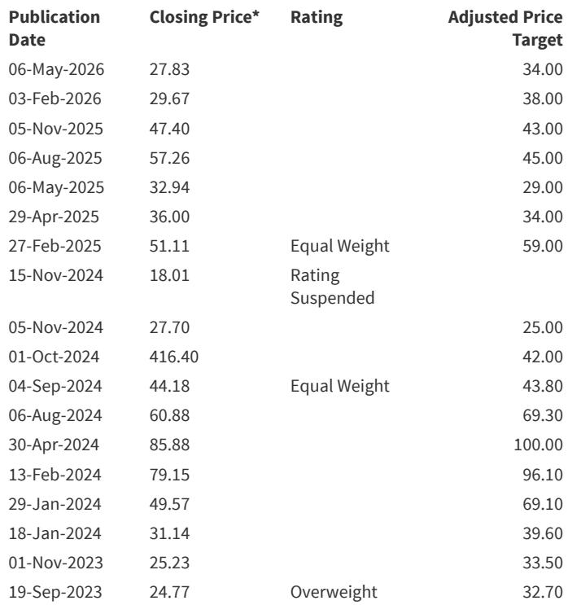
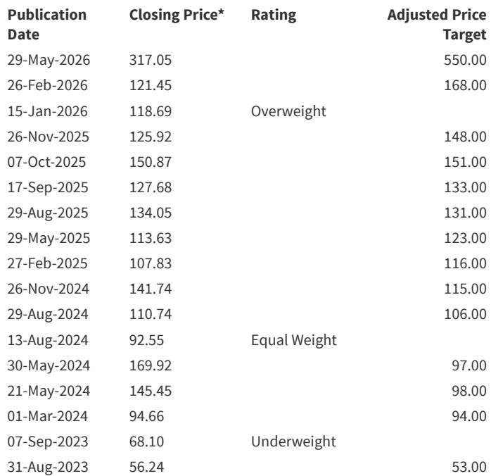
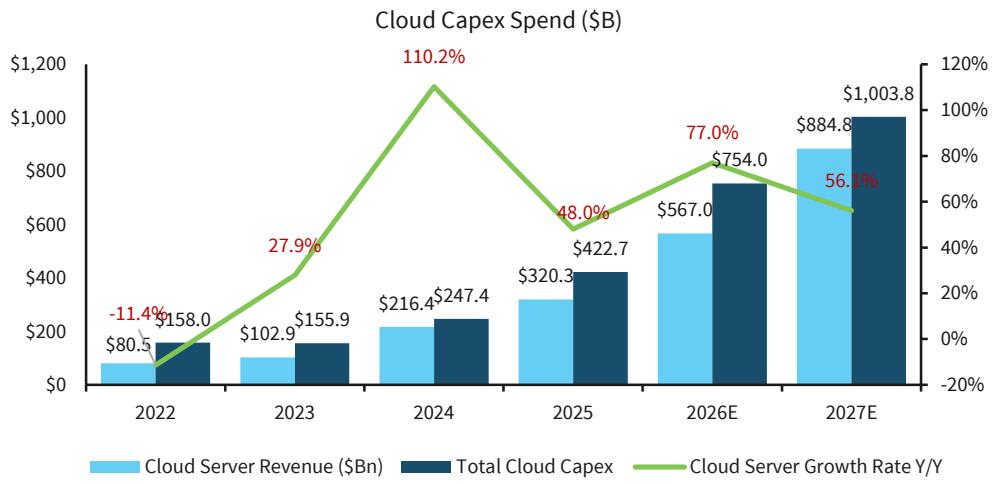

# Enterprise Server Demand Is Surprising to the Upside, Creating a Temporary Bifurcation That Investors Must Navigate Carefully

The server market is telling two very different stories right now, and the more surprising one is not the one getting the most attention. For the past several quarters, the narrative has been dominated by hyperscaler AI buildouts, massive GPU clusters, and the relentless expansion of cloud infrastructure. That story remains intact, but it is no longer the only game in town. What has caught many forecasters off guard is the sudden and material resurgence of enterprise server demand. After years of stagnation, enterprise server revenue is projected to grow by roughly 33 percent this year, a figure that stands in stark contrast to the near-flat expectations that prevailed just a few months ago. The controlling insight for any serious investor in this space is that the server market is experiencing a structural repricing, not merely a cyclical upswing, and the implications for supply chains, vendor positioning, and capital allocation are far from fully priced in.

The conventional wisdom has been that enterprise IT spending would remain tepid as organizations prioritized cloud migration and AI experimentation over traditional on-premises infrastructure. That assumption is now being tested. The evidence from recent earnings cycles across major OEMs points to a different reality: enterprises are buying traditional servers again, and they are paying significantly more per unit than they were a year ago. The question is whether this represents a durable shift in demand or a temporary pull-forward driven by pricing dynamics and inventory concerns. The answer has profound consequences for how one models revenue growth, margin trajectories, and competitive positioning across the hardware ecosystem.

This is not a simple story of AI spillover. While agentic AI and inference workloads are indeed creating new use cases for traditional servers, the bulk of the upside appears to be driven by average selling price increases that have been far more aggressive than anticipated. Unit volumes are holding up better than expected, but the margin expansion is coming primarily from pricing power, not volume growth. That distinction matters because pricing-driven revenue surges are inherently more fragile than volume-driven ones. If enterprises begin to push back against higher prices, or if the pull-forward effect exhausts itself, the revenue trajectory could reverse sharply. The challenge for investors is to distinguish between structural repricing and cyclical noise, and to position accordingly before the market consensus catches up.

## The Surprise in Enterprise Is Real, but Its Sustainability Is the Open Question

The most striking revision in the latest server model is the dramatic upgrade to enterprise server revenue expectations for this year. Where prior estimates called for roughly 2 percent growth, the current projection is approximately 33 percent. That is not a marginal adjustment; it is a complete reassessment of the demand environment. The drivers are twofold. First, OEMs are reporting significant ASP increases, driven by higher commodity costs, richer configurations, and a willingness among enterprise buyers to pay a premium for performance and reliability. Second, and perhaps more importantly, unit volumes have not collapsed as many feared. Dell, for example, reported traditional server unit growth in its most recent quarter, alongside revenue growth of over 90 percent year over year. HPE saw orders for traditional servers rise by triple digits. These are not isolated data points; they represent a pattern that has persisted across multiple vendors and geographies.

Yet the sustainability of this momentum is far from assured. The report explicitly flags that a significant portion of the current strength is likely pull-forward demand, as enterprises accelerate purchases to lock in current configurations before further price increases or to address capacity needs that were deferred during the pandemic and its aftermath. If that interpretation is correct, then the current spike in enterprise server revenue could be followed by a period of normalization, or even contraction, as the pull-forward effect dissipates. The model projects enterprise server growth dropping to roughly 1 percent next year, with a downward bias to that estimate if demand erosion accelerates. That is a sobering forecast, and it underscores the importance of distinguishing between a one-time repricing event and a sustained shift in buying behavior.

The deeper analytical question is whether the enterprise server market has permanently re-rated to a higher revenue base, or whether it is experiencing a temporary boost that will reverse once the current cycle of price increases and inventory building runs its course. The answer likely depends on the trajectory of agentic AI adoption in enterprise environments. If enterprises begin to deploy significant inference workloads on-premises, that could create a durable new demand stream for traditional servers. But that scenario remains speculative, and the report does not provide the data needed to confirm it. The open question is whether the current strength is a leading indicator of a structural shift or a lagging indicator of a cyclical peak.

## Cloud Server Growth Remains the Dominant Engine, but the Shape of the Curve Is Changing

While the enterprise surprise has captured attention, the cloud server story remains the dominant driver of the overall market. The five-year revenue CAGR for cloud servers has been revised upward from roughly 59 percent to approximately 62 percent, reflecting the continued escalation of hyperscaler capital expenditure. With total cloud capex expected to exceed $700 billion in 2026, up from roughly $423 billion in 2025, the scale of investment is staggering. The report projects cloud server revenues of $567 billion in 2026 and $885 billion in 2027, representing growth rates of 77 percent and 56 percent respectively. Those figures are impressive not only in absolute terms but also relative to the already large base from which they are growing.

However, the growth trajectory is not linear, and the revisions reveal an important nuance. The 2026 cloud server revenue estimate has actually been lowered slightly from the prior forecast, while the 2027 estimate has been raised. This reflects a recalibration of the timing of AI server builds, particularly around xPU server shipments and the evolving segmentation from key vendors like HPE. The report notes that some lumpiness in AI server revenues is expected, given the lack of full visibility into deployment schedules and the potential for push-outs in large sovereign deals, particularly in the Middle East. This is not a fundamental change in the growth outlook, but it does introduce a layer of uncertainty that investors should not ignore.

The structural implication is that the cloud server market is becoming increasingly concentrated around a small number of dominant buyers and suppliers. The white box segment, which includes Nvidia-based GPU servers, continues to gain market share at the expense of branded OEMs. In 2026, GPU servers are projected to account for 71 percent of total server revenues, with xPU servers at 16 percent and traditional CPU servers at just 13 percent. This concentration carries risks. If a major hyperscaler were to slow its buildout, or if Nvidia faced supply constraints or competitive pressure from custom ASICs, the impact on the overall market would be outsized. Investors who are overweight on cloud server exposure need to be comfortable with this concentration risk and have a view on the likelihood of disruption.

## The Decision Framework: Three Scenarios for the Server Market Over the Next 18 Months

For investors trying to navigate this environment, the key is not to pick a single forecast but to understand the range of plausible outcomes and the signals that would indicate which scenario is unfolding. The report provides the raw material for constructing such a framework, even if it does not explicitly lay it out. Based on the data and commentary, three scenarios emerge.

The first scenario is the base case embedded in the current model: enterprise server growth normalizes sharply after this year, cloud server growth remains robust but decelerates from the peak, and total server revenue growth settles into a range of 40 to 50 percent annually. In this scenario, the upside is concentrated in the cloud segment, and enterprise vendors face a revenue headwind in the second half of the forecast period. The key signal to watch is enterprise server unit volumes in the next two quarters. If they begin to decline, the base case is likely correct.

The second scenario is a prolonged enterprise boom. If agentic AI inference workloads scale faster than expected, and if enterprises continue to invest in on-premises infrastructure despite rising ASPs, enterprise server revenue could sustain mid-single-digit growth beyond this year. The report hints at this possibility but does not assign a high probability to it. The signal to watch here is the pace of enterprise AI adoption and the extent to which inference workloads are deployed on traditional servers versus cloud instances.

The third scenario is a demand pull-forward that leads to a sharper-than-expected correction. If the current enterprise spending surge is primarily driven by price increases and inventory building, then the subsequent normalization could be more severe than the model assumes. In this scenario, enterprise server revenue could decline year over year in 2027, and the downside bias to the current estimate would materialize. The signal to watch is the trajectory of ASPs. If they stabilize or decline, the pull-forward narrative gains credibility.

Each of these scenarios has different implications for which vendors are best positioned. In the base case, cloud-focused players with exposure to GPU and xPU servers continue to outperform. In the prolonged enterprise scenario, branded OEMs with strong enterprise relationships benefit disproportionately. In the correction scenario, the focus shifts to balance sheet strength and the ability to weather a revenue downturn. The report does not resolve this uncertainty, but it provides the data needed to monitor the evolving situation.

## What the Report Does Not Fully Answer: The Elasticity of Enterprise Demand at Higher Price Points

One of the most critical analytical gaps in the current model is the lack of a clear estimate for price elasticity in the enterprise server segment. The report acknowledges that ASPs are up by an estimated 40 to 50 percent, and that unit volumes have held up better than expected. But it does not provide a rigorous framework for understanding how much further prices can rise before demand begins to erode meaningfully. This is not a criticism of the report; it is a reflection of the inherent uncertainty in the current environment. Vendors themselves are likely uncertain about the elasticity of demand, given the unusual combination of rising prices and resilient volumes.

The implications of this uncertainty are significant. If enterprise demand is relatively inelastic, then the current revenue surge could persist even if prices continue to rise. That would be a bullish signal for OEMs and would justify higher valuation multiples. But if demand is more elastic than currently assumed, then the current growth rate is unsustainable, and the risk of a sharp correction is high. The report leans toward the latter view, given the expectation of only 1 percent growth next year, but it does not provide the data to confirm or refute that assumption.

Investors who want to resolve this question will need to look beyond the aggregate revenue numbers and examine the composition of enterprise server purchases. Are enterprises buying more servers, or are they buying the same number of servers at higher prices? Are they upgrading to richer configurations, or are they simply paying more for the same configurations due to commodity cost pass-through? The answers to these questions will determine whether the current strength is a structural repricing or a temporary anomaly. The report points toward the latter but leaves the door open for the former.

## Join the Community to Read the Full Report and Review the Original Charts

The analysis above draws on a detailed server model update that includes granular revenue forecasts, vendor-level market share data, and a breakdown of cloud versus enterprise server dynamics through 2027. The original report contains charts that illustrate the relationship between hyperscaler capex and cloud server revenues, the evolution of total server revenue growth, and the shifting share of GPU, xPU, and CPU servers. It also includes specific vendor takeaways for Dell, HPE, and Super Micro that provide color on order trends, backlog visibility, and margin dynamics. These details are essential for anyone building a position in the hardware or semiconductor ecosystem. Join the community to read the full report and review the original charts.

*This article is for learning and discussion only and does not constitute investment advice.*

Personal reading notes and learning share only. Not investment advice.

