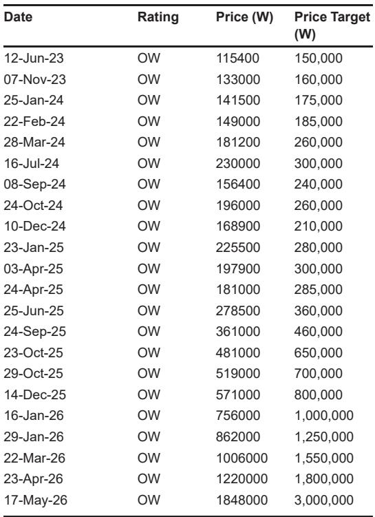
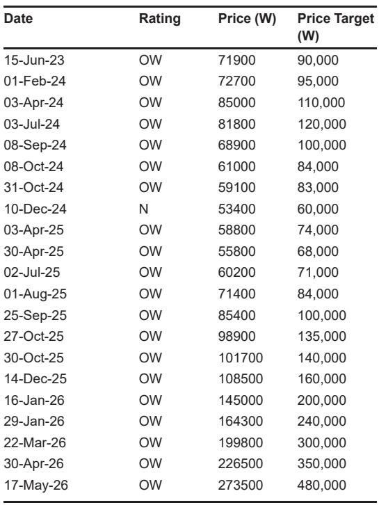
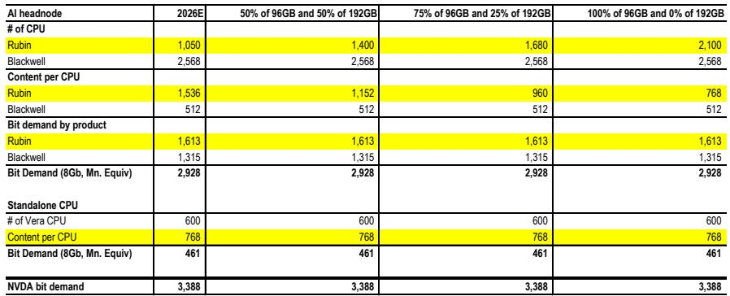

# JPM：市场误读了SOCAMM降配，真正的机会藏在供给硬约束和NVIDIA的生态锁定里

过去一周，全球存储器板块经历了一次幅度约11%的急跌，同期费城半导体指数仅下跌6%。触发因素是一则看似利空的消息：NVIDIA下一代Vera Rubin超级计算系统的CPU内存模组SOCAMM，单颗CPU配置可能从192GB降至96GB。市场的第一反应是“CPU驱动的高阶内存需求逻辑被削弱了”，随即抛售了三星电子、SK海力士等头部厂商的股票。

但JPM在最新发布的这份研报中，提出了一个与市场情绪截然相反的判断。这份报告的核心主张是：**SOCAMM降配并非需求疲软的信号，而是供应极度紧张的副产品。更关键的是，NVIDIA与SK海力士刚刚签署的多年技术合作协议，以及Computex 2026上浮现的AI存储架构变革，正在将存储器产业从“周期博弈”推入“结构锁定”的新阶段。**

对于关注AI基础设施投资的决策者而言，现在需要区分两类信息：一类是短期噪音，另一类是正在重塑行业竞争格局的长期变量。SOCAMM降配属于前者，而NVIDIA的生态圈层化、eSSD在AGI架构中的基础设施化，以及HBM4向HBM4E的加速迭代，都属于后者。JPM认为，过去一周的调整恰恰提供了一个“买入回调”的窗口。

以下是我们从这份研报中提炼出的四个核心洞察和一个尚未完全解答的关键问题。

## 1. SOCAMM降配不是需求萎缩，而是供应瓶颈下的被动重组

市场之所以对SOCAMM从192GB降至96GB反应剧烈，是因为它触及了投资者对AI内存需求增速的核心假设。如果单颗CPU的内存容量腰斩，那么即便Vera Rubin出货量增长，整体内存比特需求也可能达不到预期。

但JPM的供应链核查得出了一个相反的结论：**降配并非因为NVIDIA认为96GB已经足够，而是因为高容量SOCAMM模组的供应根本跟不上需求。** 报告明确指出，96GB规格的SOCAMM需求正在上升，而192GB版本的短缺才是配置调整的真正原因。更关键的是，从整体比特采购量来看，需求并未减少——这意味着降配将被更高数量的低容量模组所弥补。

JPM在报告中提供了一张敏感性分析表格。假设2026年Vera Rubin出货1050个节点，无论96GB与192GB的配置比例如何变化，NVIDIA对SOCAMM的总比特需求始终稳定在约33.88亿Gb当量（以8Gb为单位）。换句话说，**内容量降配与出货量上行之间存在一个近乎完美的对冲关系。** 市场只看到了前者，忽略了后者。

这一节的核心含义是：投资者不应将“单机内容量下降”等同于“总需求下降”。在供应受限的市场中，客户被迫接受更低的配置，但这恰恰说明需求本身并未减弱。如果供应瓶颈在未来得到缓解，内容量还有进一步上行的空间。

## 2. NVIDIA与SK海力士的“全栈”合作，标志着存储器供应商从供应商升级为生态伙伴

在Computex 2026期间，NVIDIA与SK海力士宣布了一项“多年技术合作”协议，SK海力士被正式指定为NVIDIA的“最大内存合作伙伴”，协议期两年以上且附带续约选项。但这份合作的价值远不止于HBM。

JPM指出，这项合作覆盖了NVIDIA的整个产品线：Vera Rubin超级计算机（HBM/DRAM/NAND）、Vera CPU（SOCAMM2）、RTX Spark PC（LPDDR5X）、以及Jetson Thor机器人平台。这意味着SK海力士实际上被嵌入到了NVIDIA正在构建的三个AI市场——AI基础设施、个人AI、以及物理AI——的每一个核心环节。

这一节的核心洞察在于：**存储器供应商的竞争维度正在从“谁能提供更好的产品”转向“谁能与NVIDIA的路线图实现更深度的协同”。** 过去，存储器是一个高度标准化的商品市场，客户可以根据价格和性能自由切换供应商。但现在，NVIDIA正在将特定供应商锁定在自己的技术演进路径中。对于SK海力士而言，这种锁定意味着更长的需求可见性（JPM认为至少延伸至2027年），以及更稳定的利润率。但这也给其他供应商施加了压力：如果不能进入NVIDIA的“圈层”，就可能被边缘化。

此外，NVIDIA CEO黄仁勋在Computex上提到，未来五年DRAM晶圆产能扩张计划“可能不够”，这进一步强化了JPM对“更高更久”上行周期的判断。当需求方开始公开抱怨供应不足时，说明供需缺口远比市场预期的要大。

## 3. Computex 2026揭示了一个正在被忽视的趋势：NAND正在从存储介质升级为AI推理的关键基础设施

在Computex 2026上，Solidigm和Kioxia的展示内容给JPM留下了深刻印象。其中最具颠覆性的信号是：**NAND SSD正在从传统的“数据仓库”角色，演变为AI推理流水线中的主动计算层。**

Solidigm提出的“G3/G3.5/G4”存储分层架构清晰地说明了这一点。在AI推理过程中，KV Cache（键值缓存）的存储和检索效率直接决定了推理延迟。Solidigm的数据显示，将KV Cache卸载到NAND SSD上，相比重新计算上下文，可以将“首次令牌生成时间”缩短最多27倍。这意味着，在推理规模持续扩大的背景下，高性能SSD不再是可选项，而是必要的基础设施。

更值得关注的是Kioxia的进展。这家NAND厂商在Computex上展示了与NVIDIA的深度合作，其AiSAQ软件解决方案被用于超大规模RAG（检索增强生成）服务器。JPM特别指出，**一家硬件厂商开发出具有粘性的软件解决方案，这在NAND行业中极为罕见。** 这种“硬件+软件”的绑定模式，可能会成为Kioxia在与西部数据、美光等对手竞争时的差异化优势。

这一节的核心含义是：AI对存储的需求正在从“容量驱动”转向“性能驱动”。传统的HDD在空间成本上仍有优势，但Solidigm与VAST的联合方案显示，在数据中心空间成本上，SSD可以节省高达90%。随着推理工作负载的指数级增长，eSSD（企业级SSD）将成为AI基础设施中不可替代的一层。

## 4. 报告尚未完全回答的关键问题：供应瓶颈何时缓解，以及这是否会触发新一轮资本开支竞赛

JPM的观点非常明确：当前的SOCAMM降配是供应短缺的结果，而不是需求疲软。但这份报告并没有正面回答一个投资者最关心的问题：**供应瓶颈何时能够缓解？**

从逻辑上看，如果NVIDIA和CSP（云服务提供商）客户都认为内存供应不足，那么上游存储器厂商应该会加速资本开支。但报告并未提供关于三星、SK海力士或美光具体扩产计划的新信息。相反，黄仁勋“产能扩张可能不够”的言论，反而暗示了供应紧张可能持续的时间比市场预期的更长。

另一个未解问题是：NVIDIA与SK海力士的排他性合作，是否会在其他存储器厂商中引发“追赶焦虑”？如果Kioxia通过软件绑定获得了竞争优势，三星和美光是否会采取类似的策略？报告提到了NVIDIA与三星、现代汽车在“AI工厂”方面的合作，但并未详细展开这些合作对存储器需求的直接影响。

对于读者而言，这些未解问题恰恰是观察行业下一步走向的关键变量。如果供应瓶颈在2026年下半年仍未缓解，那么HBM和SOCAMM的定价权将完全掌握在供应商手中，这意味着存储器厂商的盈利能力可能超出当前市场预期。反之，如果扩产节奏加速，则可能提前结束当前的上行周期。

## 5. 投资者的观察框架：从“周期位置”转向“结构锁定程度”

基于JPM这份报告的底层逻辑，我们认为投资者需要调整评估存储器公司的框架。过去，市场主要关注三个周期变量：库存水平、资本开支节奏、以及合约价格走势。这些变量仍然重要，但已经不足以解释当前阶段的超额收益来源。

新的观察框架应该围绕三个维度展开：

第一，**生态锁定深度**。SK海力士与NVIDIA的全栈合作，使其获得了其他供应商难以复制的需求可见性。投资者需要评估每家供应商在NVIDIA、AMD、以及CSP自研芯片生态中的嵌入程度。与主要客户签署多年协议、参与客户下一代产品联合开发的公司，将享有更稳定的盈利预期。

第二，**软件能力**。Kioxia的AiSAQ和Solidigm的分层存储架构表明，在AI时代，纯粹的硬件性能优势正在被“硬件+软件”的综合解决方案所取代。能够通过软件增加客户粘性的公司，将获得更高的估值溢价。

第三，**供应纪律**。黄仁勋的“产能不足”言论，实际上是在向市场传递一个信号：即便现有厂商扩大产能，可能仍然无法满足需求。这意味着，那些在HBM和高端NAND领域拥有先发优势和技术壁垒的公司，将在未来2-3年内持续受益于供不应求的市场格局。

---

以上是我们从JPM这份研报中提炼的核心判断和延伸思考。但这份报告的价值远不止于此。JPM分析师在报告中还提供了详细的敏感性分析、NVIDIA与韩国科技公司的完整合作表格、以及全球存储器厂商的股价表现对比。更重要的是，报告对HBM4E、HBF等下一代技术的时间表给出了具体的判断，这些细节对于判断各公司的相对投资价值至关重要。

由于篇幅限制，我们无法在这里展开所有内容。如果你希望获取完整的研报解读和原始图表，欢迎来星球微信群里继续讨论。我们会在社群中分享报告的全文要点，并围绕“供应瓶颈何时缓解”“哪些二线标的可能受益”等未解问题进行深入交流。

Personal reading notes and learning share only. Not investment advice.

