## China AI Monthly - Excess Fear of AI Disruption in Software, Esp for China

We view AI's impact on SW as a "natural selection" event, rather than SaaS "apocalypse". Our extensive talks with 7 China SW players on AI reveal likelihood of more resilience to AI disruption than US peers, given China's project-based or module-based SaaS pricing. But IT budget pressure is the key headwind. China SW U/P US peers (7%) and CSI 300 (18%) YTD, driven by earnings D/G and multiple compression. Our top pick in China SW remains Kingdee (KD).

China Software underperforms (U/P) US on earnings downgrade and multiple compression. Since Oct 2025, the US software (SW) sector has sold off sharply on fears that AI will disrupt SaaS. Anthropic's release of Claude Cowork on Jan 12, 2026 intensified the downturn through Mar 31 (\~23% decline), before the market realized that disruption fears were overdone, driving \~21% recovery since then. Our US SW basket (14 stocks): has fallen 6.4% YTD purely due to multiple contraction. Cons 2026 rev profit has risen 2% since Jan 12, while EV/S is down 6.5% YTD from 6.1x to 5.7x. Our China (CN) SW basket (19 stocks): has fallen 13% YTD. Cons 2026 rev has fallen 5% since Jan 12, and EV/S is down 15% YTD from 5.0x to 4.3x, suggesting the sell-off was driven by earnings downgrade (D/G) and multiple contraction.

The rise of LLMs and AI agents is driving a structural shift in SW architecture and economics. We believe AI is NOT a SaaS "apocalypse", but a "natural selection mechanism", as players with defensible moats that proactively embrace AI can evolve into AI-native platforms, while those with weak moats and are slow to adopt AI risk displacement. Three key impacts: 1) Architectural shift. SW will transition from UI-centric, human-operated systems to API-first, agent-executable workflow platforms. Agents can automate tasks autonomously but still rely on SW APIs for workflows, business logic, and data. 2) Pressure on seat-based pricing. As agents replace human operators, per-seat pricing models face structural pressure, pushing vendors toward consumption- and outcome-based pricing. 3) Margin pressure. Unlike traditional SW's near-zero marginal cost, LLM inference is a big usage-based variable cost, which means SW players will have to pass such costs on to customers or be able to charge a healthy margin.

CN SW is less prone to AI disruption, but frail IT budgets remain the headwind. Many CN SW players operate on project-based models, serving large SOEs requiring heavy systems integration and customization. Data security concerns and asset-based mentality have limited public cloud SaaS penetration with SOEs. Moreover, Chinese SaaS players rarely use seat-based pricing; instead, they charge by module. This makes CN SW generally more resilient to AI disruption than its US peers. However, the primary headwind remains IT budget pressure for large enterprises in a weak macro environment.

KD still our top pick in China SW. We believe industrial SW, financial IT, and ERP are the most resilient to AI disruption given deep workflow integration, proprietary data, zero tolerance for hallucination, and strict vendor qualifications. We view KD's recent sell-off as a good entry point: 1) KD's ERP is deeply embedded in clients' workflows as a system of record, and is costly and risky to replace; 2) KD's proprietary data and industry know-how is difficult for AI vendors to replicate; 3) module-based pricing insulates rev from workforce reductions; 4) KD has launched its own AI-native ERP suite and Lingee AIOS, guiding Rmb1.0bn in AI rev for 2026; 5) SaaS now >50% of rev, drives teen rev growth, GPM expansion, and strong op leverage aided by internal AI-driven cost efficiencies; 6) valuation at 0.7x 2026E PEG is highly attractive. Cont on next page...

Exhibit 1 - SW Baskets' EV/S - US vs CN  
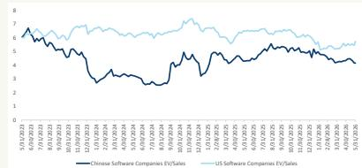

line chart

| Date | Chinese Software Companies EV/Sales | US Software Companies EV/Sales |
| --- | --- | --- |
| 5/1/2021 | 7.0 | 6.5 |
| 6/1/2021 | 6.5 | 6.0 |
| 7/1/2021 | 6.0 | 5.5 |
| 8/1/2021 | 5.5 | 5.0 |
| 9/1/2021 | 5.0 | 4.5 |
| 10/1/2021 | 4.5 | 4.0 |
| 11/1/2021 | 4.0 | 3.5 |
| 12/1/2021 | 3.5 | 3.0 |
| 1/1/2022 | 3.0 | 2.5 |
| 2/1/2022 | 2.5 | 2.0 |
| 3/1/2022 | 2.0 | 1.5 |
| 4/1/2022 | 1.5 | 1.0 |
| 5/1/2022 | 1.0 | 0.5 |
| 6/1/2022 | 0.5 | 0.0 |
| 7/1/2022 | 0.0 | -0.5 |
| 8/1/2022 | -0.5 | -1.0 |
| 9/1/2022 | -1.0 | -1.5 |
| 10/1/2022 | -1.5 | -2.0 |
| 11/1/2022 | -2.0 | -2.5 |
| 12/1/2022 | -2.5 | -3.0 |
| 1/1/2023 | -3.0 | -3.5 |
| 2/1/2023 | -3.5 | -4.0 |
| 3/1/2023 | -4.0 | -4.5 |
| 4/1/2023 | -4.5 | -5.0 |
| 5/1/2023 | -5.0 | -5.5 |
| 6/1/2023 | -5.5 | -6.0 |
| 7/1/2023 | -6.0 | -6.5 |
| 8/1/2023 | -6.5 | -7.0 |
| 9/1/2023 | -7.0 | -7.5 |
| 10/1/2023 | -7.5 | -8.0 |
| 11/1/2023 | -8.0 | -8.5 |
| 12/1/2023 | -8.5 | -9.0 |
| 1/1/2024 | -9.0 | -9.5 |
| 2/1/2024 | -9.5 | -10.0 |
| 3/1/2024 | -10.0 | -10.5 |
| 4/1/2024 | -10.5 | -11.0 |
| 5/1/2024 | -11.0 | -11.5 |
| 6/1/2024 | -11.5 | -12.0 |
| 7/1/2024 | -12.0 | -12.5 |
| 8/1/2024 | -12.5 | -13.0 |
| 9/1/2024 | -13.0 | -13.5 |
| 10/1/2024 | -13.5 | -14.0 |
| 11/1/2024 | -14.0 | -14.5 |
| 12/1/2024 | -14.5 | -15.0 |
| 1/1/2025 | -15.0 | -15.5 |
| 2/1/2025 | -15.5 | -16.0 |
| 3/1/2025 | -16.0 | -16.5 |
| 4/1/2025 | -16.5 | -17.0 |
| 5/1/2025 | -17.0 | -17.5 |
| 6/1/2025 | -17.5 | -18.0 |
| 7/1/2025 | -18.0 | -18.5 |
| 8/1/2025 | -18.5 | -19.0 |
| 9/1/2025 | -19.0 | -19.5 |
| 10/1/2025 | -19.5 | -20.0 |
| 11/1/2025 | -20.0 | -20.5 |
| 12/1/2025 | -20.5 | -21.0 |
| 1/1/2036 | -21.0 | -21.5 |
| 2/1/2036 | -21.5 | -22.0 |
| 3/1/2036 | -22.0 | -22.5 |
| 4/1/2036 | -22.5 | -23.0 |
| 5/1/2036 | -23.0 | -23.5 |
| 6/1/2036 | -23.5 | -24.0 |
| 7/1/2036 | -24.0 | -24.5 |
| 8/1/2036 | -24.5 | -25.0 |
| 9/1/2036 | -25.0 | -25.5 |
| 10/1/2036 | -25.5 | -26.0 |
| 11/1/2036 | -26.0 | -26.5 |
| 12/1/2036 | -26.5 | -27.0 |
| 1/1/2047 | -27.0 | -27.5 |
| 2/1/2047 | -27.5 | -28.0 |
| 3/1/2047 | -28.0 | -28.5 |
| 4/1/2047 | -28.5 | -29.0 |
| 5/1/2047 | -29.0 | -29.5 |
| 6/1/2047 | -29.5 | -30.0 |
| 7/1/2047 | -30.0 | -30.5 |
| 8/1/2047 | -30.5 | -31.0 |
| 9/1/2047 | -31.0 | -31.5 |
| 10/1/2047 | -31.5 | -32.0 |
| 11/1/2047 | -32.0 | -32.5 |
| 12/1/2047 | -32.5 | -33.0 |
| 1/1/48 | -33.0 | -33.5 |
| 2/1/48 | -33.5 | -34.0 |
| 3/1/48 | -34.0 | -34.5 |
| 4/1/48 | -34.5 | -35.0 |
| 5/1/48 | -35.0 | -35.5 |
| ... | +7 | +8 |
| ... | +8 | +9 |
| ... | +9 | +8 |
| ... | +8 | +7 |
| ... | +7 | +6 |
| ... | +6 | +5 |
| ... | +5 | +4 |
| ... | +4 | +3 |
| ... | +3 | +2 |
| ... | +2 | +1 |
| ... | +1 | +0 |
| ... | +0 | +-1 |
| ... | +-1 | +-3 |
| ... | +-3 | +-6 |
| ... | +-6 | +-9 |
| ... | +-9 | +-8 |
| ... | +-8 | +-7 |
| ... | +-7 | +-6 |
| ... | +-6 | +-6 |
| ... | +-6 | +-6 |
| ... | +-6 | +-6 |
| ... | +-6 | +-6 |
| ... | +-6 | +-6 |
| ... | +-6 | +-6 |
| ... | +-6 | +-6 |

Source: FactSet, Bloomberg, JEF Sector EV/S is equal weighted

Exhibit 2 - China SW EV/S Premium over China Internet  
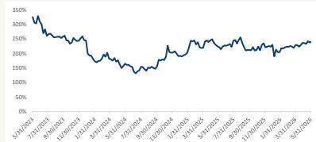

line chart

| Date       | Value |
| ---------- | ----- |
| 5/12/2023  | 300%  |
| 7/12/2023  | 250%  |
| 9/12/2023  | 200%  |
| 11/12/2023 | 150%  |
| 1/1/2024   | 100%  |
| 2/1/2024   | 50%   |
| 3/1/2024   | 100%  |
| 4/1/2024   | 150%  |
| 5/1/2024   | 200%  |
| 6/1/2024   | 250%  |
| 7/1/2024   | 300%  |
| 8/1/2024   | 250%  |
| 9/1/2024   | 200%  |
| 10/1/2024  | 150%  |
| 11/1/2024  | 100%  |
| 12/1/2024  | 50%   |
| 1/1/2025   | 100%  |
| 2/1/2025   | 150%  |
| 3/1/2025   | 200%  |
| 4/1/2025   | 250%  |
| 5/1/2025   | 300%  |
| 6/1/2025   | 250%  |
| 7/1/2025   | 200%  |
| 8/1/2025   | 150%  |
| 9/1/2025   | 100%  |
| 10/1/2025  | 50%   |
| 11/1/2025  | 100%  |
| 12/1/2025  | 150%  |
| 1/1/2026   | 200%  |
| 2/1/2026   | 250%  |
| 3/1/2026   | 300%  |
| 4/1/2026   | 250%  |
| 5/1/2026   | 200%  |

Source: FactSet, Bloomberg, JEF

Exhibit 3 - Ranking of China SW AI Defensibility  
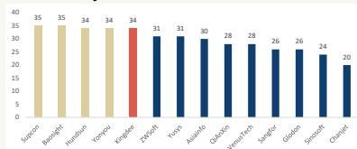

bar chart

| Category | Value |
|---|---|
| Sunrose | 35 |
| Brought | 35 |
| Hamburg | 34 |
| Hambun | 34 |
| Foyou | 34 |
| Kingdee | 34 |
| JFOSO | 31 |
| Youn | 31 |
| Aluata | 30 |
| Chukon | 28 |
| VeroTech | 28 |
| Sangeor | 26 |
| Glodon | 26 |
| Sonset | 24 |
| Cianjin | 20 |

Source: JEF estimates (See Table 1 for details)
Score: Max 40, min 0. High score = less vulnerable to AI

Exhibit 4 - JEF SW coverage's AI moat and timeframe of AI transition  
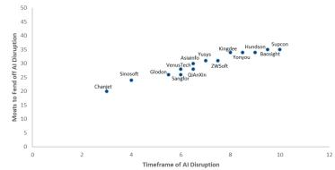

scatter plot

| Entity | Timeframe of All Disruption | Means to find off of All Disruption |
| --- | --- | --- |
| Charest | 3 | 18 |
| Sincout | 4 | 22 |
| Godlar | 5 | 26 |
| Godlar | 6 | 28 |
| Kingdee | 7 | 30 |
| Kingdee | 8 | 32 |
| Hundon | 9 | 34 |
| Iodlon | 10 | 36 |
| Iodlon | 11 | 38 |
| Iodlon | 12 | 40 |
| Iodlon | 13 | 42 |
| Iodlon | 14 | 44 |
| Iodlon | 15 | 46 |
| Iodlon | 16 | 48 |
| Iodlon | 17 | 50 |
| Iodlon | 18 | 52 |
| Iodlon | 19 | 54 |
| Iodlon | 20 | 56 |
| Iodlon | 21 | 58 |
| Iodlon | 22 | 60 |
| Iodlon | 23 | 62 |
| Iodlon | 24 | 64 |
| Iodlon | 25 | 66 |
| Iodlon | 26 | 68 |
| Iodlon | 27 | 70 |
| Iodlon | 28 | 72 |
| Iodlon | 29 | 74 |
| Iodlon | 30 | 76 |
| Iodlon | 31 | 78 |
| Iodlon | 32 | 80 |
| Iodlon | 33 | 82 |
| Iodlon | 34 | 84 |
| Iodlon | 35 | 86 |
| Iodlon | 36 | 88 |
| Iodlon | 37 | 90 |
| Iodlon | 38 | 92 |
| Iodlon | 39 | 94 |
| Iodlon | 40 | 96 |
| Iodlon | 41 | 98 |
| Iodlon | 42 | 100 |
| Iodlon | 43 | 102 |
| Iodlon | 44 | 104 |
| Iodlon | 45 | 106 |
| Iodlon | 46 | 108 |
| Iodlon | 47 | 110 |
| Iodlon | 48 | 112 |
| Iodlon | 49 | 114 |
| Iodlon | 50 | 116 |
| Iodlon | 51 | 118 |
| Iodlon | 52 | 120 |
| Iodlon | 53 | 122 |
| Iodlon | 54 | 124 |
| Iodlon | 55 | 126 |
| Iodlon | 56 | 128 |
| Iodlon | 57 | 130 |
| Iodlon | 58 | 132 |
| Iodlon | 59 | 134 |
| Iodlon | 60 | 136 |
| Iodlon | 61 | 138 |
| Iodlon | 62 | 140 |
| Iodlon | 63 | 142 |
| Iodlon | 64 | 144 |
| Iodlon | 65 | 146 |
| Iodlon | 66 | 148 |
| Iodlon | 67 | 150 |
| Iodlon | 68 | 152 |
| Iodlon | 69 | 154 |
| Iodlon | 70 | 156 |
| Iodlon | 71 | 158 |
| Iodlon | 72 | 160 |
| Iodlon | 73 | 162 |
| Iodlon | 74 | 164 |
| Iodlon | 75 | 166 |
| Iodlon | 76 | 168 |
| Iodlon | 77 | 170 |
| Iodlon | 78 | 172 |
| Iodlon | 79 | 174 |
| Iodlon | 80 | 176 |
| Iodlon | 81 | 178 |
| Iodlon | 82 | 180 |
| Iodlon | 83 | 182 |
| Iodlon | 84 | 184 |
| Iodlon | 85 | 186 |
| Iodlon | 86 | 188 |
| Iodlon | 87 | 190 |
| Iodlon | 88 | 192 |
| Iodlon | 89 | 194 |
| Iodlon | 90 | 196 |
| Iodlon | 91 | 198 |
| Iodlon | 92 | 200 |
| Iodlon | 93 | 202 |
| Iodlon | 94 | 204 |
| Iodlon | 95 | 206 |
| Iodlon | 96 | 208 |
| Iodlon | 97 | 210 |
| Iodlon | 98 | 212 |
| Iodlon | 99 | 214 |
| Iodlon | 100 | 216 |
| JZWSH | - | - |
| Krigdee | - | - |
| Hundon | - | - |
| Bovnight | - | - |
| YZWSH | - | - |
| Krigdee | - | - |
| Hundon | - | - |
| Bovnight | - | - |
| YZWSH | - | - |
| Krigdee | - | - |
| Hundon | - | - |
| Bovnight | - | - |
| Krigdee | - | - |
| Hundon | - | - |
| Bovnight | - | - |
| Krigdee | - | - |
| Hundon | - | - |
| Bovnight | - | - |
| Krigdee | - | - |

Source: Company, JEF
Timeframe only shows relative window for AI transition

CN= China, HW= Hardware, KD=Kingdee, SW= Software, UI= User Interface

Edison Lee, CFA \* | Equity Analyst

852 3743 8009 | edison.lee@JEF.com

Matt Ma \* | Equity Analyst

852 3767 1109 | matt.ma@JEF.com

Annie Ping, CFA, FRM \* | Equity Associate

+852 3767 1273 | annie.ping@JEF.com

Nick Cheng \* | Equity Analyst

+852 3743 8750 | nick.cheng@JEF.com

Jacky He \* | Equity Analyst

+852 3743 8084 | jacky.he@JEF.com

China's AI models narrow the performance gap with the US, while aggressive price cuts intensify competition and could pressure margins. In May, Anthropic's Claude Opus 4.8, OpenAI's GPT 5.5, and Google's Gemini 3.1 Pro remain the top three globally on AA's intelligence ranking. In China, leadership keeps shifting, Qwen 3.7 Max surpassed Kimi K2.6 as the best Chinese model. The US-China performance gap has slightly narrowed, with Qwen 3.7 Max now $8\%$ below the top US model (vs. $10\%$ in April; $18\%$ in Dec 2025). Moreover, Chinese models continue to offer superior value for performance, their avg price as a percentage of US model price fell to $21\%$ in May ( $31\%$ in Apr), driven by Qwen/Xiaomi price cuts on their flagship models by $46\%/86\%$ . DeepSeek also announced the $75\%$ promotional discount on its DS V4 pro would be permanent. This likely signals intensifying competition as incumbents fight for market share. However, given sharply rising HW costs, aggressive API pricing could pressure ROI for Chinese model players.

## The 3-Minute Guide

US SW has Fallen 3% in One Year and 6% YTD; While CN SW Underperformed US SW and has Fallen All Along

Exhibit 5 - US SW Cohort's Mkt Cap Chg  
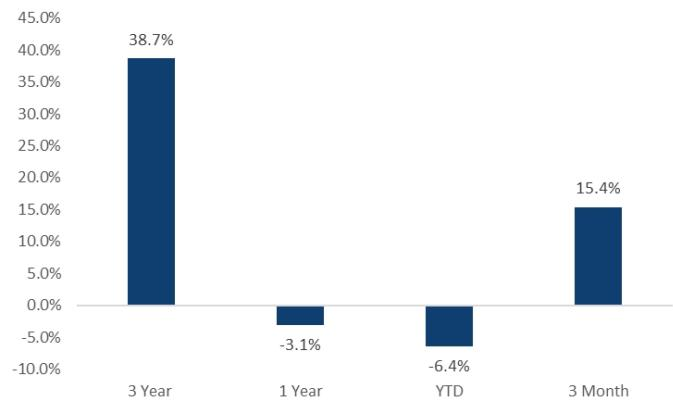

bar chart

| Period | Value (%) |
|---|---|
| 3 Year | 38.7 |
| 1 Year | -3.1 |
| YTD | -6.4 |
| 3 Month | 15.4 |

Source: FactSet, JEF  
Performance is for our US SW basket; date as of May 31

Exhibit 6 - CN SW Cohort's Mkt Cap Chg  
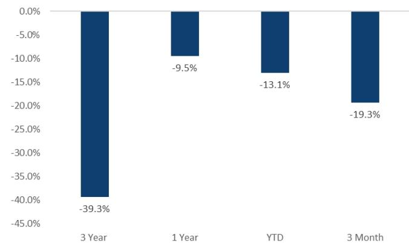

bar chart

| Period | Value (%) |
|---|---|
| 3 Year | -39.3 |
| 1 Year | -9.5 |
| YTD | -13.1 |
| 3 Month | -19.3 |

Source: FactSet, JEF  
Performance is for our CN SW basket; date as of May 31

US SW Cohort's Rev Cons Ests were Upgraded Since January, while CN SW Cohort's Rev Cons Ests were Downgraded

Exhibit 7 - US SW Cohort's Cons Rev Ests  
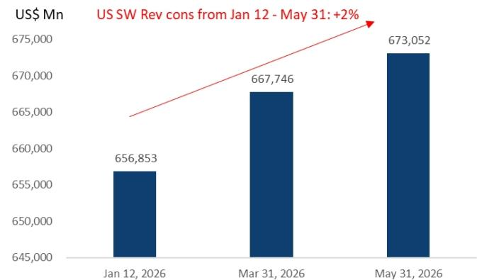

bar chart

US SW Rev cons from Jan 12 - May 31: +2%
| Date | Revenue (US$ Mn) |
| :--- | :--- |
| Jan 12, 2026 | 656,853 |
| Mar 31, 2026 | 667,746 |
| May 31, 2026 | 673,052 |

Source: Bloomberg, JEF

Exhibit 8 - CN SW Cohort's Cons Rev Ests  

bar chart

CN SW Rev cons from Jan 12 - May 31: -5%
| Date | Value (US$ Mn) |
| :--- | :--- |
| Jan 12, 2026 | 19,246 |
| Mar 31, 2026 | 18,808 |
| May 31, 2026 | 18,191 |

Source: Bloomberg, JEF

US SW EV/S premium over CN SW reached a 3-year low in Feb 2026 upon AI-driven sell-off, but has partially recovered since then

Exhibit 9 - SW Companies EV/S - US vs CN  
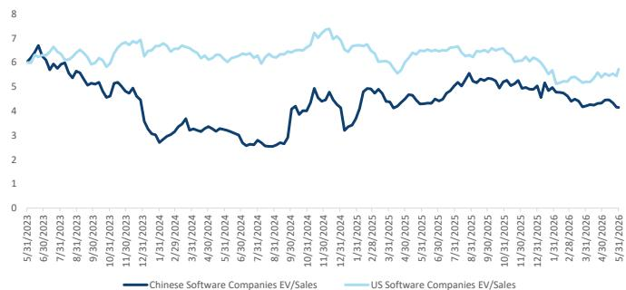

line chart

| Date       | Chinese Software Companies EV/Sales | US Software Companies EV/Sales |
| ---------- | ----------------------------------- | ----------------------------- |
| 5/31/2023  | 6.5                                 | 6.0                           |
| 6/30/2023  | 6.0                                 | 6.5                           |
| 7/31/2023  | 5.5                                 | 6.0                           |
| 8/31/2023  | 5.0                                 | 6.5                           |
| 9/30/2023  | 4.5                                 | 6.0                           |
| 10/31/2023 | 4.0                                 | 6.5                           |
| 11/30/2023 | 3.5                                 | 7.0                           |
| 12/31/2023 | 3.0                                 | 6.5                           |
| 1/31/2024  | 2.5                                 | 6.0                           |
| 2/29/2024  | 3.0                                 | 6.5                           |
| 3/31/2024  | 3.5                                 | 6.0                           |
| 4/30/2024  | 4.0                                 | 6.5                           |
| 5/31/2024  | 4.5                                 | 7.0                           |
| 6/30/2024  | 5.0                                 | 6.5                           |
| 7/31/2024  | 5.5                                 | 6.0                           |
| 8/31/2024  | 6.0                                 | 6.5                           |
| 9/30/2024  | 6.5                                 | 7.0                           |
| 10/31/2024 | 7.0                                 | 7.5                           |
| 11/30/2024 | 7.5                                 | 7.0                           |
| 12/31/2024 | 7.0                                 | 6.5                           |
| 1/31/2025  | 6.5                                 | 6.0                           |
| 2/28/2025  | 6.0                                 | 5.5                           |
| 3/31/2025  | 5.5                                 | 5.0                           |
| 4/30/2025  | 5.0                                 | 4.5                           |
| 5/31/2025  | 4.5                                 | 4.0                           |
| 6/30/2025  | 4.0                                 | 3.5                           |
| 7/31/2025  | 3.5                                 | 3.0                           |
| 8/31/2025  | 3.0                                 | 2.5                           |
| 9/30/2025  | 2.5                                 | 2.0                           |
| 10/31/2025 | 2.0                                 | 1.5                           |
| 11/30/2025 | 1.5                                 | 1.0                           |
| 12/31/2025 | 1.0                                 | 0.5                           |
| 1/31/2026  | 0.5                                 | 0.0                           |
| 2/28/2026  | 0.0                                 | -0.5                          |
| 3/31/2026  | -0.5                                | -1.0                          |
| 4/30/2026  | -1.0                                | -1.5                          |
| 5/31/2026  | -1.5                                | -2.0                          |

Source: FactSet, Bloomberg, JEF

Exhibit 10 - China SW EV/S Premium over China Internet  
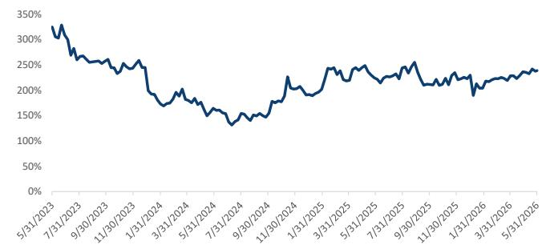

line chart

| Date       | Value |
| ---------- | ----- |
| 5/31/2023  | 350%  |
| 7/31/2023  | 300%  |
| 9/30/2023  | 250%  |
| 11/30/2023 | 200%  |
| 1/31/2024  | 150%  |
| 3/31/2024  | 175%  |
| 5/31/2024  | 150%  |
| 7/31/2024  | 175%  |
| 9/30/2024  | 200%  |
| 11/30/2024 | 225%  |
| 1/31/2025  | 250%  |
| 3/31/2025  | 275%  |
| 5/31/2025  | 250%  |
| 7/31/2025  | 275%  |
| 9/30/2025  | 250%  |
| 11/30/2025 | 275%  |
| 1/31/2026  | 250%  |
| 3/31/2026  | 275%  |
| 5/31/2026  | 250%  |

Source: FactSet, Bloomberg, JEF

AI Is Reshaping SW Architecture and Economics, but We View this as "Natural Selection" Rather than a SaaS "apocalypse"

## Exhibit 11 - Characteris of Defensible SW Players

## Defensible Software Co.s

- Deep integration in customers' mission-critical business process  
• Control proprietary workflow data and metadata  
- Customers have zero error tolerance  
- Owns deep industry know-how  
- Perform “dirty works” like implementation and customization  
- Requires qualifications to serve the customers  
• Could receive strong economies of scale  
- Do not rely on seat-based pricing model

AI as monetization opportunity

## Exhibit 12 - SW Players Vulnerable to AI Disruption

## Vulnerable Software Co.s

• Package generic workflows behind a thin UI  
- Product is highly standardized and can be abstracted by LLMs or agents  
- Adopt the labor outsourcing business model  
- Adopt seat-based pricing model  
- Weak proprietary data/knowhow or low integration depth  
• Do not require qualifications to serve customers  
- Model hallucination would not lead to large economic, vital, social damage

AI as replacement risk

Source: JEF

Source: JEF

Software are Tools Designed for Humans. Agents can Automate tasks but still Rely on SW APIs for Workflows, Biz Logic & Data

## Exhibit 13 - The Architectural Paradigm Shift: From SW-as-tool to SW-as-digital-labor

Traditional Software/ SaaS  

flowchart

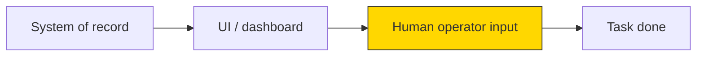
```mermaid
graph LR
  A["System of record"] --> B["UI / dashboard"]
  B --> C["Human operator input"]
  C --> D["Task done"]
    style C fill:#FFD700,stroke:#333
```

AI-native workflow execution  

flowchart

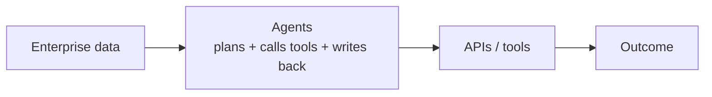
```mermaid
graph LR
  A["Enterprise data"] --> B["Agents<br>plans + calls tools + writes back"]
  B --> C["APIs / tools"]
  C --> D["Outcome"]
```

Value shifts to execution, data context, and measurable outcomes

Source: JEF

"Seat-Based" Biz Model Will be Disrupted by AI as Workforce Shrinks. But the Risk is Higher for US Players

Exhibit 14 - AI will drive consumption-based or outcome-based monetization from Software  
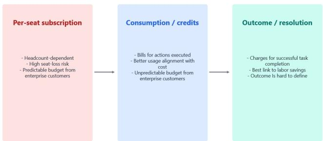

flowchart

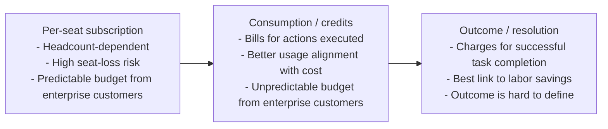
```mermaid
graph LR
  A["Per-seat subscription\n- Headcount-dependent\n- High seat-loss risk\n- Predictable budget from enterprise customers"] --> B["Consumption / credits\n- Bills for actions executed\n- Better usage alignment with cost\n- Unpredictable budget from enterprise customers"]
  B --> C["Outcome / resolution\n- Charges for successful task completion\n- Best link to labor savings\n- Outcome is hard to define"]
```

Source: JEF

Exhibit 15 - JEF SW coverage's AI moat and timeframe of AI transition  
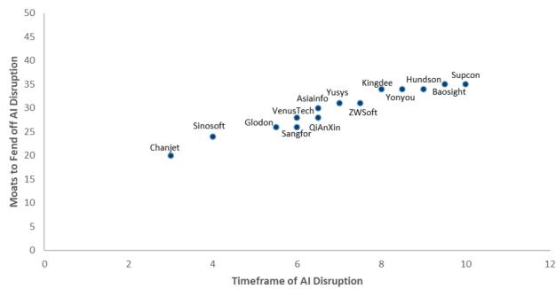

scatterplot

| Company     | Timeframe of AI Disruption | Moats to Fend off AI Disruption |
|-------------|----------------------------|--------------------------------|
| Chanjet     | 3                          | 20                             |
| Sinosoft    | 4                          | 25                             |
| Glodon      | 6                          | 28                             |
| Sengfor     | 6                          | 27                             |
| QianXin     | 6                          | 30                             |
| Asialinfo   | 6                          | 30                             |
| VenusTech   | 6                          | 30                             |
| Yusys       | 7                          | 30                             |
| ZWSoft      | 7                          | 30                             |
| Kingdee     | 8                          | 35                             |
| Yonyou      | 8                          | 35                             |
| Hudson      | 9                          | 35                             |
| Baosight    | 9                          | 35                             |
| Supcon      | 10                         | 35                             |

Source: Company, JEF

Timeframe only shows relative window for AI transition

We Believe Industrial (Supcon, Baosight, ZWSoft), Financial (Hundsun, Yusys) and ERP (Yonyou, Kingdee) SW offer Stronger Moat to Extend Their AI Transition Windows

Table 1 - JEF Software Coverage Ranking on AI Defensibility

<table><tr><td>Moats to Fend off AI Disruption</td><td>Supcon</td><td>Baosight</td><td>Hundsun</td><td>Yonyou</td><td>Kingdee</td><td>ZWSoft</td><td>Yusys</td><td>Asiainfo</td><td>QiAnXin</td><td>VenusTech</td><td>Sangfor</td><td>Glodon</td><td>Sinosoft</td><td>Chanjet</td></tr><tr><td>Deep Integration in Customer&#x27;s Business Process</td><td>5</td><td>5</td><td>5</td><td>5</td><td>5</td><td>4</td><td>4</td><td>4</td><td>3</td><td>3</td><td>3</td><td>4</td><td>3</td><td>3</td></tr><tr><td>Proprietary Data</td><td>5</td><td>5</td><td>5</td><td>5</td><td>5</td><td>5</td><td>4</td><td>4</td><td>3</td><td>3</td><td>3</td><td>4</td><td>3</td><td>3</td></tr><tr><td>Zero Error Tolerance</td><td>5</td><td>4</td><td>5</td><td>5</td><td>5</td><td>4</td><td>4</td><td>3</td><td>3</td><td>3</td><td>3</td><td>4</td><td>3</td><td>2</td></tr><tr><td>Deep Industry Know-how</td><td>5</td><td>5</td><td>5</td><td>5</td><td>5</td><td>5</td><td>4</td><td>4</td><td>3</td><td>3</td><td>3</td><td>5</td><td>3</td><td>3</td></tr><tr><td>Dirty Work of Implementation and Customization</td><td>3</td><td>4</td><td>1</td><td>5</td><td>4</td><td>1</td><td>4</td><td>3</td><td>4</td><td>4</td><td>3</td><td>1</td><td>4</td><td>1</td></tr><tr><td>Industry Qualifications</td><td>4</td><td>4</td><td>4</td><td>2</td><td>2</td><td>2</td><td>3</td><td>4</td><td>5</td><td>5</td><td>4</td><td>2</td><td>2</td><td>1</td></tr><tr><td>Economies of Scale</td><td>3</td><td>3</td><td>4</td><td>3</td><td>4</td><td>5</td><td>3</td><td>3</td><td>2</td><td>2</td><td>2</td><td>5</td><td>1</td><td>4</td></tr><tr><td>Revenue Model NOT Seat/ User Based</td><td>5</td><td>5</td><td>5</td><td>4</td><td>4</td><td>5</td><td>5</td><td>5</td><td>5</td><td>5</td><td>5</td><td>1</td><td>5</td><td>3</td></tr><tr><td>Total Score</td><td>35</td><td>35</td><td>34</td><td>34</td><td>34</td><td>31</td><td>31</td><td>30</td><td>28</td><td>28</td><td>26</td><td>26</td><td>24</td><td>20</td></tr></table>

Source: Company, JEF  
Scoring system: 0-5 scores, 0 = least moat, 5 = largest moat

US Models Still Lead on AA's Model Ranking; BABA's Qwen 3.7 Max Climbed to No.4 Worldwide and No.1 in China

Exhibit 16 - Artificial Analysis AI model Intelligence index  
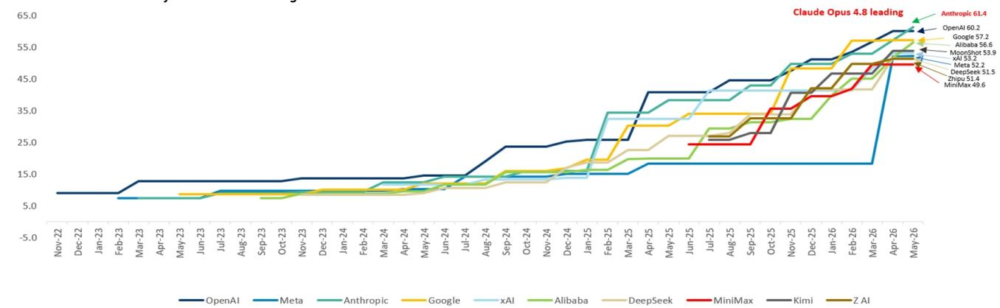

line chart

| Month | OpenAI | Meta | Anthropic | Google | xAI | Alibaba | DeepSeek | MiniMax | Kimi | Z AI |
| --- | --- | --- | --- | --- | --- | --- | --- | --- | --- | --- |
| Nov-22 | 10.0 | 10.0 | 10.0 | 10.0 | 10.0 | 10.0 | 10.0 | 10.0 | 10.0 | 10.0 |
| Dec-22 | 10.0 | 10.0 | 10.0 | 10.0 | 10.0 | 10.0 | 10.0 | 10.0 | 10.0 | 10.0 |
| Jan-23 | 10.0 | 10.0 | 10.0 | 10.0 | 10.0 | 10.0 | 10.0 | 10.0 | 10.0 | 10.0 |
| Feb-23 | 10.0 | 10.0 | 10.0 | 10.0 | 10.0 | 10.0 | 10.0 | 10.0 | 10.0 | 10.0 |
| Mar-23 | 10.0 | 10.0 | 10.0 | 10.0 | 10.0 | 10.0 | 10.0 | 10.0 | 10.0 | 10.0 |
| Apr-23 | 10.0 | 10.0 | 10.0 | 10.0 | 10.0 | 10.0 | 10.0 | 10.0 | 10.0 | 10.0 |
| May-23 | 10.0 | 10.0 | 10.0 | 10.0 | 10.0 | 10.0 | 10.0 | 10.0 | 10.0 | 10.0 |
| Jun-23 | 10.0 | 10.0 | 10.0 | 10.0 | 10.0 | 10.0 | 10.0 | 10.0 | 10.0 | 10.0 |
| Jul-23 | 15.0 | 15.0 | 15.0 | 15.0 | 15.0 | 15.0 | 15.0 | 15.0 | 15.0 | 15.0 |
| Aug-23 | 25.0 | 25.0 | 25.0 | 25.0 | 25.0 | 25.0 | 25.0 | 25.0 | 25.0 | 25.0 |
| Sep-23 | 35.0 | 35.0 | 35.0 | 35.0 | 35.0 | 35.0 | 35.0 | 35.0 | 35.0 | 35.0 |
| Oct-23 | 45.0 | 45.0 | 45.0 | 45.0 | 45.0 | 45.0 | 45.0 | 45.0 | 45.0 | 45.0 |
| Nov-23 | 55.0 | 55.0 | 55.0 | 55.0 | 55.0 | 55.0 | 55.0 | 55.0 | 55.0 | 55.0 |
| Dec-23 | 65.0 | 65.0 | 65.0 | 65.0 | 65.0 | 65.0 | 65.0 | 65.0 | 65.0 | 65.0 |
| Jan-24 | - | - | - | - | - | - | - | - | - | - |
| Feb-24 | - | - | - | - | - | - | - | - | - | - |
| Mar-24 | - | - | - | - | - | - | - | - | - | - |
| Apr-24 | - | - | - | - | - | - | - | - | - | - |
| May-24 | - | - | - | - | - | - | - | - | - | - |
| Jun-24 | - | - | - | - | - | - | - | - | - | - |
| Jul-24 | - | - | - | - | - | - | - | - | - | - |
| Aug-24 | - | - | - | - | - | - | - | - | - | - |
| Sep-24 | - | - | - | - | - | - | - | - | - | - |
| Oct-24 | - | - | - | - | - | - | - | - | - | - |
| Nov-24 | - | - | - | - | - | - | - | - | - | - |
| Dec-24 | - | - | - | - | - | - | - | - | - | - |
| Jan-25 | - | - | - | - | - | - | - | - | - | - |

Source: Artificial Analysis, JEF

Anthropic, OpenAI and GOOGL's LLMs Remain Top 3 in Intelligence; Followed Closely by Those of BABA, Moonshot and Xiaomi

Exhibit 17 - Intelligence Score of Leading AI Labs' Models  
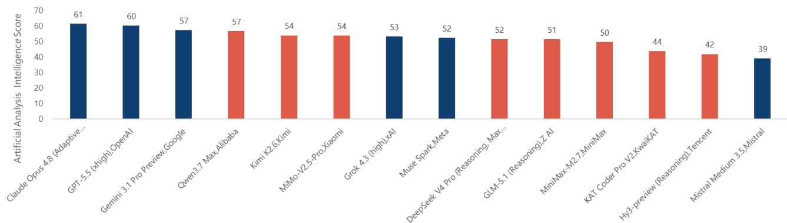

bar chart

| Model | Artificial Analysis Intelligence Score |
|---|---|
| Claude Opus 4.8 (Adaptive...) | 61 |
| GPT-5.5 (xhigh),OpenAI | 60 |
| Gemini 3.1 Pro Preview Google | 57 |
| Qwen3.7 Max Alibaba | 57 |
| Kim K2.6 Kimi | 54 |
| MMo-V2.5 Pro Xiaomi | 54 |
| Grok 4.3 (high),xAI | 53 |
| Muse Spark Meta | 52 |
| DeepSeek V4 Pro (Reasoning, Max...) | 52 |
| GLM-5.1 (Reasoning),Z AI | 51 |
| MiniMax-M2.7 MiniMax | 50 |
| KAT Coder Pro V2,KwaIKAT | 44 |
| Hy3-preview (Reasoning)Tencent | 42 |
| Mistral Medium 3.5,Mistral | 39 |

Source: Artificial Analysis, JEF

## The Performance Gap between Top Chinese and US LLM has Narrowed from 18% to 8% over the Past Six Months

Exhibit 18 - Frontier Language Model Intelligence China vs. US  
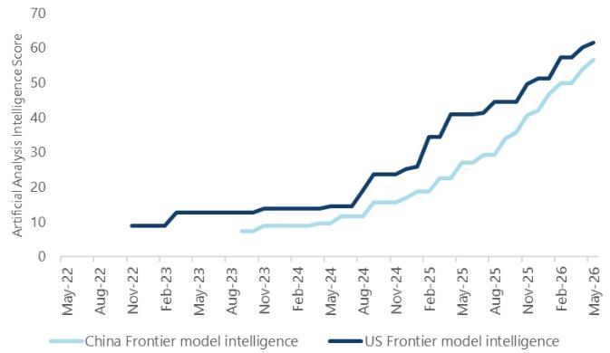

line chart

| Month    | China Frontier model intelligence | US Frontier model intelligence |
| -------- | ---------------------------------- | ------------------------------ |
| May-22   | 0                                  | 10                             |
| Aug-22   | 0                                  | 10                             |
| Nov-22   | 0                                  | 10                             |
| Feb-23   | 0                                  | 10                             |
| May-23   | 0                                  | 10                             |
| Aug-23   | 5                                  | 10                             |
| Nov-23   | 5                                  | 10                             |
| Feb-24   | 5                                  | 10                             |
| May-24   | 10                                 | 10                             |
| Aug-24   | 15                                 | 20                             |
| Nov-24   | 20                                 | 25                             |
| Feb-25   | 25                                 | 35                             |
| May-25   | 30                                 | 40                             |
| Aug-25   | 35                                 | 45                             |
| Nov-25   | 45                                 | 50                             |
| Feb-26   | 50                                 | 55                             |
| May-26   | 55                                 | 60                             |

Source: Artificial Analysis, JEF

Exhibit 19 - Frontier Language Model Intelligence China vs. US  
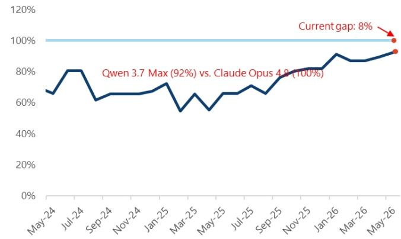

line chart

| Date    | Value |
|---------|-------|
| May-24  | 65%   |
| Jul-24  | 80%   |
| Sep-24  | 60%   |
| Nov-24  | 65%   |
| Jan-25  | 70%   |
| Mar-25  | 55%   |
| May-25  | 65%   |
| Jul-25  | 70%   |
| Sep-25  | 65%   |
| Nov-25  | 75%   |
| Jan-26  | 85%   |
| Mar-26  | 85%   |
| May-26  | 90%   |

Source: Artificial Analysis, JEF  
US frontier model intelligence as benchmark (100%)

## Since End of 2025, Chinese Models Improved More Than Their US Peers

Table 2 - Flagship Models' AA Score Change from Nov 2025 to May 2026

<table><tr><td>Flagship Model In May 2026</td><td>AA Score</td><td>Change</td><td>Flagship Model In Nov 2025</td><td>AA Score</td></tr><tr><td>1.Claude Opus 4.8 (Adaptive Reasoni</td><td>61.4</td><td>+11.7</td><td>1. Claude Opus 4.5 reasoning (Anthrc</td><td>49.7</td></tr><tr><td>2.GPT-5.5 (xhigh),OpenAI</td><td>60.2</td><td>+12.6</td><td>2. Gemini 3 pro preview (Google)</td><td>48.4</td></tr><tr><td>3.Gemini 3.1 Pro Preview,Google</td><td>57.2</td><td>+8.8</td><td>3. GPT5.1 high (OpenAI)</td><td>47.6</td></tr><tr><td>4.Qwen3.7 Max,Alibaba</td><td>56.6</td><td>+24.2</td><td>4. Grok 4 (xAI)</td><td>41.4</td></tr><tr><td>5.Kimi K2.6,Kimi</td><td>53.9</td><td>+13.2</td><td>5. Kimi K2 Thinking (Moonshot)</td><td>40.7</td></tr><tr><td>6.MiMo-V2.5-Pro,Xiaomi</td><td>53.8</td><td>n.a</td><td>6. MiniMax M2 (MiniMax)</td><td>35.7</td></tr><tr><td>7.Grok 4.3 (high),xAI</td><td>53.2</td><td>+11.8</td><td>7. DeepSeek V3.1 Terminus (DeepSe</td><td>33.8</td></tr><tr><td>8.Muse Spark,Meta</td><td>52.2</td><td>n.a</td><td>8. GLM 4.6 Reasoning (zhipu)</td><td>32.5</td></tr><tr><td>9.DeepSeek V4 Pro (Reasoning, Max</td><td>51.5</td><td>+17.7</td><td>9. Qwen3 Max Thinking preview (Alii</td><td>32.5</td></tr><tr><td>10.GLM-5.1 (Reasoning),Z AI</td><td>51.4</td><td>+18.9</td><td>10. Magistral Medium 1.2 (Magistral)</td><td>27.0</td></tr></table>

Source: Artificial Analysis, JEF  
Flagship model = model with the highest Artificial Analysis score; models in orange are Chinese models

Table 3 - In China, Qwen, DS, Kimi Are the Top 3 In Coding  
Flagship Models' Artificial Analysis Coding Score Change From Nov to May

<table><tr><td>Flagship Model In May 2026</td><td>AA Score</td><td>Change</td><td>Flagship Model In Nov 2025</td><td>AA Score</td></tr><tr><td>1.GPT-5.5 (xhigh)</td><td>59</td><td>+14.1</td><td>1. Claude Opus 4.5</td><td>48</td></tr><tr><td>2.Claude Opus 4.8 (Adaptive Reasoni</td><td>57</td><td>+8.7</td><td>2. Gemini 3 Pro preview</td><td>46</td></tr><tr><td>3.Gemini 3.1 Pro Preview</td><td>56</td><td>+9.5</td><td>3. GPT 5.1 (high)</td><td>45</td></tr><tr><td>4.Qwen3.7 Max</td><td>50</td><td>+25.1</td><td>4. Grok 4</td><td>40</td></tr><tr><td>5.DeepSeek V4 Pro (Reasoning, Max</td><td>48</td><td>+13.5</td><td>5. Kimi K2 Thinking</td><td>35</td></tr><tr><td>6.Muse Spark</td><td>48</td><td>n.a</td><td>6. DeepSeek V3.1 Terminus</td><td>34</td></tr><tr><td>7.Kimi K2.6</td><td>47</td><td>+12.1</td><td>7. GLM 4.6</td><td>29</td></tr><tr><td>8.KAT Coder Pro V2</td><td>46</td><td>n.a</td><td>8. MiniMax M2</td><td>29</td></tr><tr><td>9.MiMo-V2.5-Pro</td><td>46</td><td>n.a</td><td>9. Qwen3 Max Thinking preview</td><td>25</td></tr><tr><td>10.GLM-5 (Reasoning)</td><td>44</td><td>+15.2</td><td>10. Magistral Medium 1.2</td><td>22</td></tr></table>

Source: Artificial Analysis, JEF  
models in orange are Chinese models

## As of Week of May 25, DeepSeek ranked No.1 with \~18% in Token Usage Share on OpenRouter and Anthropic is No.2 with \~18% Share

Table 4 - MiMo, DS, GLM are top 3 in Agentic Capability In China  
Flagship Models' Artificial Analysis Agentic Score Change From Nov to May

<table><tr><td>Flagship Model In May 2026</td><td>AA Score</td><td>Change</td><td>Flagship Model In Nov 2025</td><td>AA Score</td></tr><tr><td>1.Claude Opus 4.8 (max)</td><td>78</td><td>+17.8</td><td>1. Claude Opus 4.5</td><td>60</td></tr><tr><td>2.GPT-5.5 (xhigh)</td><td>74</td><td>+23.1</td><td>2. Gemini 3 Pro preview</td><td>52</td></tr><tr><td>3.Gemini 3.5 Flash</td><td>70</td><td>+18.3</td><td>3. GPT 5.1 (high)</td><td>51</td></tr><tr><td>4.MiMo-V2.5-Pro</td><td>67</td><td>n.a</td><td>4. Kimi K2 Thinking</td><td>48</td></tr><tr><td>5.DeepSeek V4 Pro (Max)</td><td>67</td><td>+37.2</td><td>5. MiniMax M2</td><td>48</td></tr><tr><td>6.GLM-5.1</td><td>67</td><td>+25.1</td><td>6. Qwen3 Max Thinking preview</td><td>43</td></tr><tr><td>7.Qwen3.7 Max</td><td>67</td><td>+23.6</td><td>7. GLM 4.6</td><td>42</td></tr><tr><td>8.Kimi K2.6</td><td>66</td><td>+18</td><td>8. Grok 4</td><td>42</td></tr><tr><td>9.Grok 4.3 (high)</td><td>66</td><td>+23.9</td><td>9. DeepSeek V3.1 Terminus</td><td>30</td></tr><tr><td>10.Muse Spark</td><td>62</td><td>n.a</td><td>10. Magistral Medium 1.2</td><td>24</td></tr></table>

Source: Artificial Analysis, JEF  
models in orange are Chinese models

Exhibit 20 - Token Usage Share by Vendors  
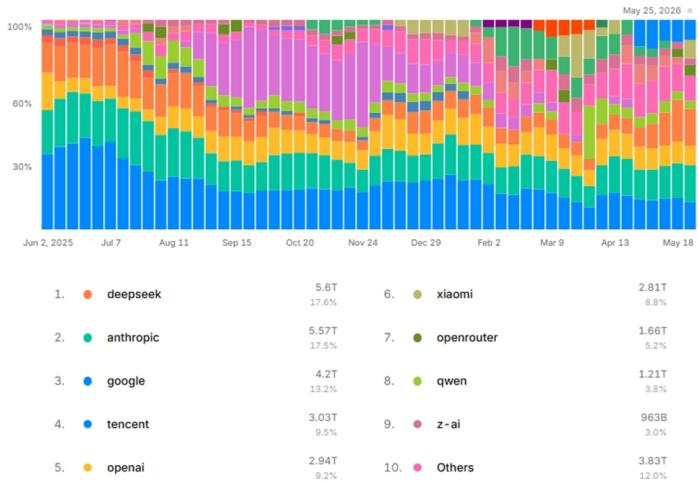

stacked bar chart

| Date | deepseek (%) | xiaomi (%) | anthropic (%) | openrouter (%) | qwen (%) | z - ai (%) | others (%) |
| :--- | :--- | :--- | :--- | :--- | :--- | :--- | :--- |
| Jun 2, 2025 | 5.6T | 17.6 | 17.5 | 5.2 | 3.8 | 963B | 3.83T |
| Jul 7 | 5.6T | 17.6 | 17.5 | 5.2 | 3.8 | 963B | 3.83T |
| Aug 11 | 5.6T | 17.6 | 17.5 | 5.2 | 3.8 | 963B | 3.83T |
| Sep 15 | 5.6T | 17.6 | 17.5 | 5.2 | 3.8 | 963B | 3.83T |
| Oct 20 | 5.6T | 17.6 | 17.5 | 5.2 | 3.8 | 963B | 3.83T |
| Nov 24 | 5.6T | 17.6 | 17.5 | 5.2 | 3.8 | 963B | 3.83T |
| Dec 29 | 5.6T | 17.6 | 17.5 | 5.2 | 3.8 | 963B | 3.83T |
| Feb 2 | 5.6T | 17.6 | 17.5 | 5.2 | 3.8 | 963B | 3.83T |
| Mar 9 | 5.6T | 17.6 | 17.5 | 5.2 | 3.8 | 963B | 3.83T |
| Apr 13 | 5.6T | 17.6 | 17.5 | 5.2 | 3.8 | 963B | 3.83T |
| May 18 | 5.6T | 17.6 | 17.5 | 5.2 | 3.8 | 963B | 3.83T |
The chart displays a stacked bar chart with the same X-axis label but contains only the Y-axis values (e.g., “May 25, 2026” is estimated). The legend lists ten distinct categories: deepseek, xiaomi, anthropic, openrouter, google, qwen, z - ai, openai, and Others. The data for the latest period (May 25, 2026) is estimated based on the total volume of all three platforms in millions.

Source: OpenRouter  
As of the week of May 25, 2026

Of the 11 Top LLMs, 5 Lowered API Prices, 3 Raised Prices, and 3 Kept Prices Unchanged for Their New Flagship Models in May

Exhibit 21 - Frontier Model Price - New vs previous models  
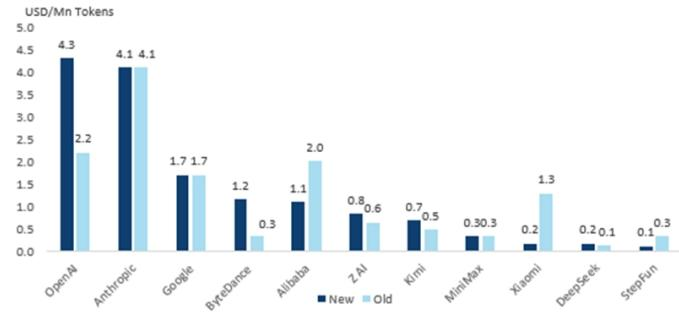

bar chart

| Platform | New (USD/Mn Tokens) | Old (USD/Mn Tokens) |
| :--- | :--- | :--- |
| OpenAI | 4.3 | 2.2 |
| Anthropic | 4.1 | 4.1 |
| Google | 1.7 | 1.7 |
| ByteDance | 1.2 | 0.3 |
| Alibaba | 1.1 | 2.0 |
| Z AI | 0.8 | 0.6 |
| Kimi | 0.7 | 0.5 |
| MiniMax | 0.3 | 0.3 |
| Xiaomi | 0.2 | 1.3 |
| DeepSeek | 0.2 | 0.1 |
| StepFun | 0.1 | 0.3 |

Source: Artificial Analysis, Companies, JEF  
Price per token, represented as USD per million Tokens (assume USD:CNY = 1:7). Price is a blend of Cache-hit & Input & Output token prices (7:2:1 ratio). As of May 2026

Table 5 - Top Model vendor's Flagship Model Price In Each Month

<table><tr><td>USD/Mn tokens</td><td>Nov-25</td><td>Dec-25</td><td>Jan-26</td><td>Feb-26</td><td>Mar-26</td><td>Apr-26</td><td>May-26</td></tr><tr><td>OpenAI</td><td>1.3</td><td>1.9</td><td>1.9</td><td>1.9</td><td>2.2</td><td>4.3</td><td>4.3</td></tr><tr><td>Meta</td><td>0.3</td><td>0.3</td><td>0.3</td><td>0.3</td><td>0.3</td><td></td><td></td></tr><tr><td>Anthropic</td><td>4.1</td><td>4.1</td><td>4.1</td><td>4.1</td><td>4.1</td><td>4.1</td><td>4.1</td></tr><tr><td>Google</td><td>1.7</td><td>1.7</td><td>1.7</td><td>1.7</td><td>1.7</td><td>1.7</td><td>1.7</td></tr><tr><td>xAI</td><td></td><td></td><td></td><td></td><td>1.1</td><td>0.6</td><td>0.6</td></tr><tr><td>US Average</td><td>1.9</td><td>2.0</td><td>2.0</td><td>2.0</td><td>1.9</td><td>2.7</td><td>2.7</td></tr><tr><td>Alibaba</td><td>1.6</td><td>1.6</td><td>0.7</td><td>0.4</td><td>0.4</td><td>2.0</td><td>1.1</td></tr><tr><td>DeepSeek</td><td>0.3</td><td>0.1</td><td>0.1</td><td>0.1</td><td>0.1</td><td>0.2</td><td>0.2</td></tr><tr><td>MiniMax</td><td>0.3</td><td>0.5</td><td>0.5</td><td>0.5</td><td>0.3</td><td>0.3</td><td>0.3</td></tr><tr><td>Kimi</td><td>0.4</td><td>0.4</td><td>0.5</td><td>0.5</td><td>0.5</td><td>0.7</td><td>0.7</td></tr><tr><td>Z AI</td><td>0.4</td><td>0.4</td><td>0.4</td><td>0.6</td><td>0.6</td><td>0.8</td><td>0.8</td></tr><tr><td>Xiaomi</td><td></td><td>0.06</td><td>0.06</td><td>0.06</td><td>1.3</td><td>1.3</td><td>0.2</td></tr><tr><td>ByteDance</td><td>0.3</td><td>0.3</td><td>0.3</td><td>1.2</td><td>1.2</td><td>1.2</td><td>1.2</td></tr><tr><td>StepFun</td><td>0.3</td><td>0.3</td><td>0.3</td><td>0.1</td><td>0.1</td><td>0.1</td><td>0.1</td></tr><tr><td>CN Average</td><td>0.5</td><td>0.5</td><td>0.4</td><td>0.4</td><td>0.6</td><td>0.8</td><td>0.6</td></tr></table>

Source: Artificial Analysis, Companies, JEF

Compared to US Models, Chinese Models Still Offer Superior Value for Performance with Avg Price at only 21% of US Peers'

Exhibit 22 - CH Frontier Model Price As % of US'  
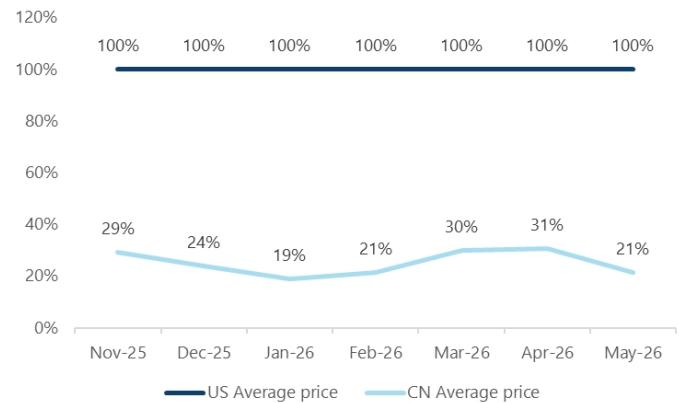

line chart

| Month | US Average price (%) | CN Average price (%) |
|---|---|---|
| Nov-25 | 100 | 29 |
| Dec-25 | 100 | 24 |
| Jan-26 | 100 | 19 |
| Feb-26 | 100 | 21 |
| Mar-26 | 100 | 30 |
| Apr-26 | 100 | 31 |
| May-26 | 100 | 21 |

Source: Companies, Artificial Analysis, JEF  
Model price is calculated by averaging each vendor's flagship model price in each month

Exhibit 23 - Frontier Model Price - US vs. CN  
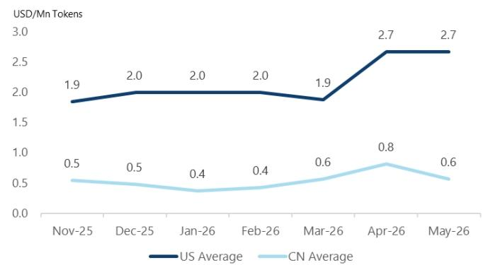

line chart

| Month   | US Average | CN Average |
|---------|------------|------------|
| Nov-25  | 1.9        | 0.5        |
| Dec-25  | 2.0        | 0.5        |
| Jan-26  | 2.0        | 0.4        |
| Feb-26  | 2.0        | 0.4        |
| Mar-26  | 1.9        | 0.6        |
| Apr-26  | 2.7        | 0.8        |
| May-26  | 2.7        | 0.6        |

Source: Companies, Artificial Analysis, JEF  
Model price is calculated by averaging each vendor's flagship model price in each month

After Their Price Cuts, MiMo V2 Pro and DS V4 Pro Now Offer Best Value for Performance In China

Exhibit 24 - API Price vs. Model Intelligence  
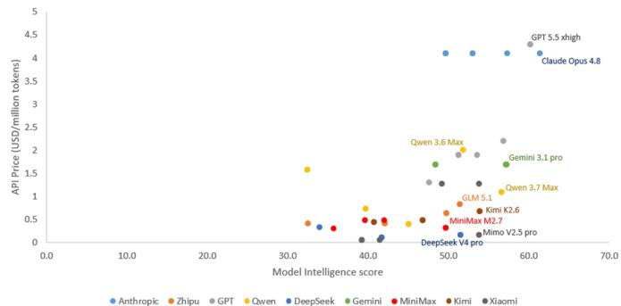

scatterplot

| Model Intelligence score | API Price (USD/million tokens) | Vendor        |
| ------------------------ | ------------------------------ | ------------- |
| ~50                      | ~4.0                           | GPT 5.5 xhigh |
| ~60                      | ~4.2                           | Claude Opus 4.8 |
| ~50                      | ~1.8                           | Qwen 3.6 Max  |
| ~50                      | ~1.9                           | Gemini 3.1 pro |
| ~50                      | ~1.7                           | GLM 5.1       |
| ~50                      | ~1.3                           | Qwen 3.7 Max   |
| ~50                      | ~0.8                           | Kimi K2.6      |
| ~50                      | ~0.6                           | MiniMax M2.7   |
| ~50                      | ~0.4                           | Mimo V2.5 pro  |
| ~50                      | ~0.3                           | DeepSeek V4 pro |
| ~50                      | ~0.2                           | Zhipu         |
| ~50                      | ~0.1                           | MiniMax        |
| ~50                      | ~0.1                           | Kimi          |
| ~50                      | ~0.1                           | Xiaomi        |

Source: Companies, Artificial Analysis, JEF

Exhibit 25 - LLM Intelligence per Dollar  
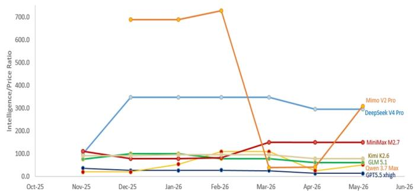

line chart

| Month | Mimo V2 Pro | DeepSeek V4 Pro | MiniMax M2.7 | Kimi K2.6 | GLM 3.1 | Qwen 3.7 Max | GP5.5 xhigh |
| --- | --- | --- | --- | --- | --- | --- | --- |
| Oct-25 |  |  |  |  |  |  |  |
| Nov-25 |  |  |  |  |  |  |  |
| Dec-25 |  |  |  |  |  |  |  |
| Jan-26 |  |  |  |  |  |  |  |
| Feb-26 |  |  |  |  |  |  |  |
| Mar-26 |  |  |  |  |  |  |  |
| Apr-26 |  |  |  |  |  |  |  |
| May-26 |  |  |  |  |  |  |  |
| Jun-26 |  |  |  |  |  |  |  |

Source: Companies, Artificial Analysis, JEF

## China's AI in a Global Context – May 2026

## China AI Monthly - Fear of AI Disruption in SW is Overdone

MAY 2026

Edison Lee, CFA | Equity Analyst

(852) 3743 8009 | edison.lee@JEF.com

Annie Ping, CFA, FRM | Equity Associate

(852) 3767 1273 | annie.ping@JEF.com

Matt Ma | Equity Analyst

(852) 3767 1109 | matt.ma@JEF.com

Jacky He | Equity Analyst

(852) 3743 8084 | jacky.he@JEF.com

Nick Cheng | Equity Analyst

(852) 3743 8750 | nick.cheng@JEF.com

## Executive Summary

## US SW Sell-Off Since Claude Co-Work Driven by Multiple Compression

■ Since Anthropic's Claude Co-work was released on Jan 12, 2026, the US software ETF IGV fell \~30% to Apr 10, 2026, driven by fear of AI's potential disruption of all software players, especially SaaS players.  
- But since Apr 10, IGV has recovered 44%, driven by improving sentiment about software earnings. But YTD, IGV is still down by \~7%, similar to our basket of 14 software stocks (simple avg).  
- The US SW sector's underperformance was driven purely by multiple compression, as cons rev forecasts for our basket of 14 US software stocks have risen $2\%$ between Jan 12, 2026 and May 31, 2026.

IGV Index Performance  

line chart

| Date       | Value  |
| ---------- | ------ |
| Jun        | 94.87  |

Source: Yahoo Finance, JEF

US SW Cohort's Mkt Cap Chg  
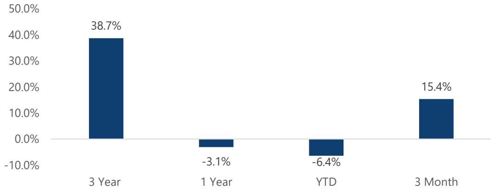

bar chart

| Period | Value (%) |
|---|---|
| 3 Year | 38.7 |
| 1 Year | -3.1 |
| YTD | -6.4 |
| 3 Month | 15.4 |

Source: FactSet, JEF; Note: date as of May 31, 2026

US SW Cohort's Cons Rev  
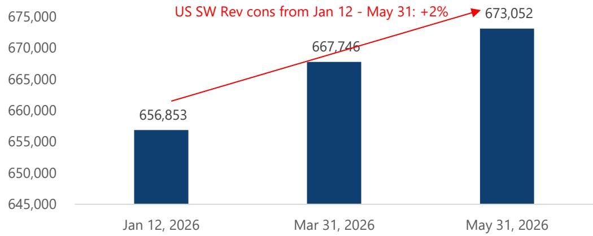

bar chart

| Date       | US SW Rev cons |
| ---------- | -------------- |
| Jan 12, 2026 | 656,853        |
| Mar 31, 2026 | 667,746        |
| May 31, 2026 | 673,052        |

Source: Bloomberg, JEF; Note: date as of May 31, 2026

## China SW Saw Accelerated Decline, Driven by Earnings Downgrade & Multiple Compression

- China software has been weak regardless of the AI theme. Our basket of 19 software stocks fell $27\%$ between Jan 12, 2026 (Claude Co-work's announcement) and Mar 31, and fell a further $2\%$ since Mar 31.  
■ YTD, our China software cohort has fallen by 13%, and has fallen by 10% over one year.  
■ From Jan 12, 2026, 2026E cons rev forecasts have fallen by 5%, while 2026E EV/S has declined by 15% to 4.3x.  
- Therefore, China’s SW de-rating has been driven by earnings downgrade and multiple compression.

CN SW Cohort's Mkt Cap Chg  
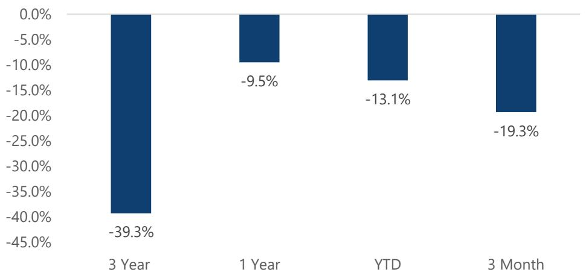

bar chart

| Period | Value (%) |
|---|---|
| 3 Year | -39.3 |
| 1 Year | -9.5 |
| YTD | -13.1 |
| 3 Month | -19.3 |

Source: FactSet, JEF Note: date as of May 31, 2026

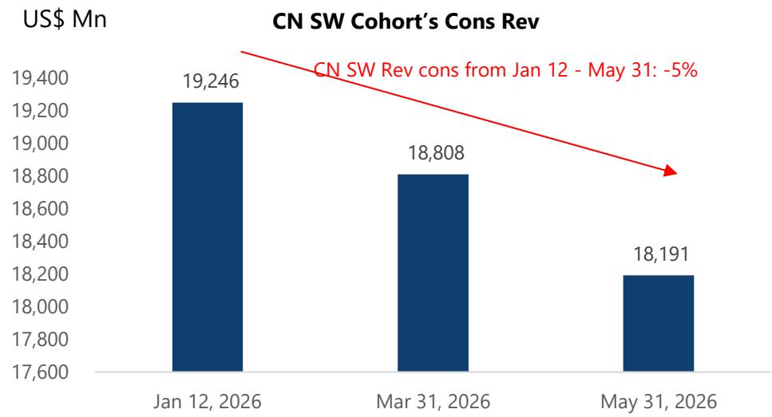

bar chart

| Date       | CN SW Cohort's Cons Rev |
| ---------- | ------------------------ |
| Jan 12, 2026 | 19,246                   |
| Mar 31, 2026 | 18,808                   |
| May 31, 2026 | 18,191                   |

Source: Bloomberg, JEF Note: date as of May 31, 2026

## AI is like a Natural Selection Mechanism, Software Co.s with Moats that Fully Embrace AI will Evolve

■ The rapid rise of large language models (LLM) and autonomous agents is triggering a profound structural transition in the global software sector, aggressively altering traditional software/SaaS architecture and economics.  
■ We believe AI is like a “natural selection mechanism” not a SaaS “apocalypse”.  
- Rather than a rising tide that lifts or sinks all software uniformly, AI will separate the industry into distinct groups: companies with defensible moats that fully embrace AI can extend their transition window and evolve into AI-native application platforms.  
- But those that are slow to adapt and lack moats (e.g. deep integration in customers' business process, proprietary data and know-how, etc.) risk being displaced.

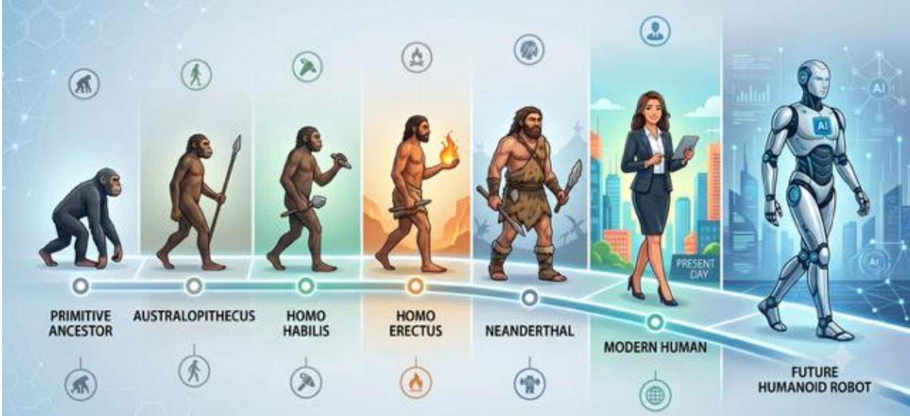

flowchart

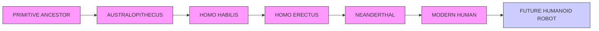
```mermaid
graph LR
  A["PRIMITIVE ANCESTOR"] --> B["AUSTRALOPITHECUS"]
  B --> C["HOMO HABILIS"]
  C --> D["HOMO ERECTUS"]
  D --> E["NEANDERTHAL"]
  E --> F["MODERN HUMAN"]
  F --> G["FUTURE HUMANOID ROBOT"]
    
    style A fill:#f9f,stroke:#333
    style B fill:#f9f,stroke:#333
    style C fill:#f9f,stroke:#333
    style D fill:#f9f,stroke:#333
    style E fill:#f9f,stroke:#333
    style F fill:#f9f,stroke:#333
    style G fill:#ccf,stroke:#333
```

Source: JEF

The survivors will not simply be “software companies with AI.” They are the vendors with strong determination on AI transition and have the defensibility to extend the transition window.

## Defensible Software Players

- Deep integration in customers' mission-critical business process  
• Control proprietary workflow data and metadata  
• Customers have zero error tolerance  
- Owns deep industry know-how  
- Perform “dirty work” like implementation and customization  
- Requires qualifications to serve the customers  
• Could receive strong economies of scale  
• Do not rely on seat-based pricing model

AI as monetization opportunity

## Vulnerable Software Players

• Package generic workflows behind a thin UI  
- Product is highly standardized and can be abstracted by LLMs or agents  
- Adopt the labor outsourcing business model  
- Adopt seat-based pricing model  
- Weak proprietary data/know-how or low integration depth  
• Do not require qualifications to serve customers  
- Model hallucination would not lead to large economic, vital, social damage

AI as replacement risk

Source: JEF

## The Architectural Paradigm Shift: From Software-as-tool to Software-as-digital-labor

Evaluating the structural disruption of generative AI requires understanding the evolution from traditional software/ SaaS to AI agents.  
Traditional Software/SaaS functioned primarily as a database-backed system of record, essentially serving as a digital filing cabinet coupled with a manual workflow interface.  
Software is designed as a tool for human operators. In this legacy model, the human operator served as the primary executor. Human operator needs to interpret data, navigate the user interface (UI), and manually execute discrete tasks.  
We are now transitioning to an AI-native paradigm where software shifts from being a passive tool to an active system of intelligence and action.  
Under this new paradigm, AI agents can autonomously navigate interfaces, interpret complex data, and execute entire workflows with minimal human involvement, thereby transforming the software itself into digital labor.  
Traditional SW will transition from UI-centric, human-operated systems to API-first, agent-executable workflow platforms. Agents can automate tasks autonomously but still rely on SW APIs for workflows, business logic, and data.

## The Architectural Paradigm Shift: From Software-as-tool to Software-as-digital-labor

## Traditional Software/ SaaS

flowchart

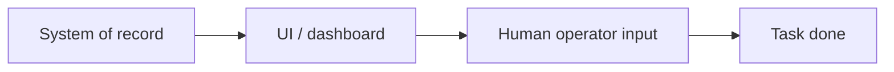
```mermaid
graph LR
  A["System of record"] --> B["UI / dashboard"]
  B --> C["Human operator input"]
  C --> D["Task done"]
```

Value tied to seats and interface usage

## AI-native workflow execution

flowchart

```mermaid
graph LR
  A["Enterprise data"] --> B["Agents<br>plans + calls tools + writes back"]
  B --> C["APIs / tools"]
  C --> D["Outcome"]
```

Value shifts to execution, data context, and measurable outcomes

Source: JEF

## The "Seat-Based" Biz Model Disruption is More Severe in the US than in China

The convergence of generative AI and agentic execution is fundamentally disrupting the pricing models of the software/SaaS sector.  
In the US, legacy SaaS monetization is directly tied to employee headcount as they charge per seat, meaning that as a customer hires more workers, their software spend increases proportionally.  
However, when software evolves into an autonomous agent that replaces human workers, the manual headcount required to operate the software collapses.  
For example, if a customer support team shrinks from 100 agents to just 10 supervisors managing an AI workforce, a vendor relying purely on seat-based licensing will experience a severe contraction in its addressable revenue base.  
In China, however, most of the software companies adopted a project-based business model, as customers are generally large SOEs that demand heavy systems integration and customization services. These customers are also reluctant to adopt SaaS on public cloud due to data security concerns and difficult budget approvals.  
Even for Chinese SaaS companies, they seldom use a seat-based pricing model; instead, they tend to price their products on the number of modules or functions (e.g. Kingdee and Yonyou).

## Software Incumbents' Moat to Extend Their AI Transition Window

Deep Integration in Customer's Business Process: 1) Deep integration creates high switching costs, including operational, compliance, legal, and financial risks. Customers must migrate data, rebuild integrations, retrain users, validate controls, and ensure business continuity. 2) Deeply integrated software often serves as the system of record, storing the authoritative source of truth such as customer records, invoices, contracts, and employee data. AI agents may operate on top of these systems, but still need to interact with them.

Proprietary Data: Software vendors that understand their customers' business logic, historical transactions, approval rules, user behaviors, exceptions, and process bottlenecks can leverage this data to build their own AI agents that deliver more accurate and business-specific outcomes. Once a software platform becomes the official system of record for a customer, it becomes very difficult to replace.

Deep Industry Know-how: Software that encapsulates complex industry logic, unwritten regulatory guidelines, specialized terminology, key pain points, and decades of best practices represents a depth of know-how that is difficult for AI companies to replicate or accumulate.

Zero Error Tolerance/ high compliance critical system : Industries like finance, healthcare, and manufacturing demand absolute accuracy and vendor accountability. AI models cannot reliably meet this standard due to hallucination risks. Moreover, regulated systems such as payroll, HR, and ERP require a legally defensible source of truth, strict access controls, and auditor involvement, replacing them with AI poses significant compliance risks.

"Dirty Work" of Implementation and Customization: Enterprise IT environments are complex and different. Delivering IT solution often requires huge amount of consultation, implementation, customization, and secondary development. AI co.s typically lack the engineering capability to handle this "dirty work".

Industry Qualifications: In China, SOE and govt customers tend to select IT vendors with high qualifications and trustworthiness. This creates a moat to fend off competition from AI model co.s and startups.

Economies of Scale: Software co. with strong scale effect could spread the high costs of R&D, regulatory compliance, and infrastructure across a large number of clients, achieving a unit cost that new startups cannot match.

Revenue Model NOT tied to Seat/ User: Software cos. that price their product based on the number of customer seats or users would face severe contraction pressure on software renewals, as enterprise customers' number of employees shrinks in the AI era.

JEF Software Coverage Ranking on AI Defensibility

<table><tr><td>Moats to Fend off AI Disruption</td><td>Supcon</td><td>Baosight</td><td>Hundsun</td><td>Yonyou</td><td>Kingdee</td><td>ZWSoft</td><td>Yusys</td><td>Asiainfo</td><td>QiAnXin</td><td>VenusTech</td><td>Sangfor</td><td>Glodon</td><td>Sinosoft</td><td>Chanjet</td></tr><tr><td>Deep Integration in Customer&#x27;s Business Process</td><td>5</td><td>5</td><td>5</td><td>5</td><td>5</td><td>4</td><td>4</td><td>4</td><td>3</td><td>3</td><td>3</td><td>4</td><td>3</td><td>3</td></tr><tr><td>Proprietary Data</td><td>5</td><td>5</td><td>5</td><td>5</td><td>5</td><td>5</td><td>4</td><td>4</td><td>3</td><td>3</td><td>3</td><td>4</td><td>3</td><td>3</td></tr><tr><td>Zero Error Tolerance</td><td>5</td><td>4</td><td>5</td><td>5</td><td>5</td><td>4</td><td>4</td><td>3</td><td>3</td><td>3</td><td>3</td><td>4</td><td>3</td><td>2</td></tr><tr><td>Deep Industry Know-how</td><td>5</td><td>5</td><td>5</td><td>5</td><td>5</td><td>5</td><td>4</td><td>4</td><td>3</td><td>3</td><td>3</td><td>5</td><td>3</td><td>3</td></tr><tr><td>Dirty Work of Implementation and Customization</td><td>3</td><td>4</td><td>1</td><td>5</td><td>4</td><td>1</td><td>4</td><td>3</td><td>4</td><td>4</td><td>3</td><td>1</td><td>4</td><td>1</td></tr><tr><td>Industry Qualifications</td><td>4</td><td>4</td><td>4</td><td>2</td><td>2</td><td>2</td><td>3</td><td>4</td><td>5</td><td>5</td><td>4</td><td>2</td><td>2</td><td>1</td></tr><tr><td>Economies of Scale</td><td>3</td><td>3</td><td>4</td><td>3</td><td>4</td><td>5</td><td>3</td><td>3</td><td>2</td><td>2</td><td>2</td><td>5</td><td>1</td><td>4</td></tr><tr><td>Revenue Model NOT Seat/ User Based</td><td>5</td><td>5</td><td>5</td><td>4</td><td>4</td><td>5</td><td>5</td><td>5</td><td>5</td><td>5</td><td>5</td><td>1</td><td>5</td><td>3</td></tr><tr><td>Total Score</td><td>35</td><td>35</td><td>34</td><td>34</td><td>34</td><td>31</td><td>31</td><td>30</td><td>28</td><td>28</td><td>26</td><td>26</td><td>24</td><td>20</td></tr></table>

Source: Company, JEF  
Source: JEF

## JEF Software Coverage's AI Defensibility and Timeframe of AI Transition

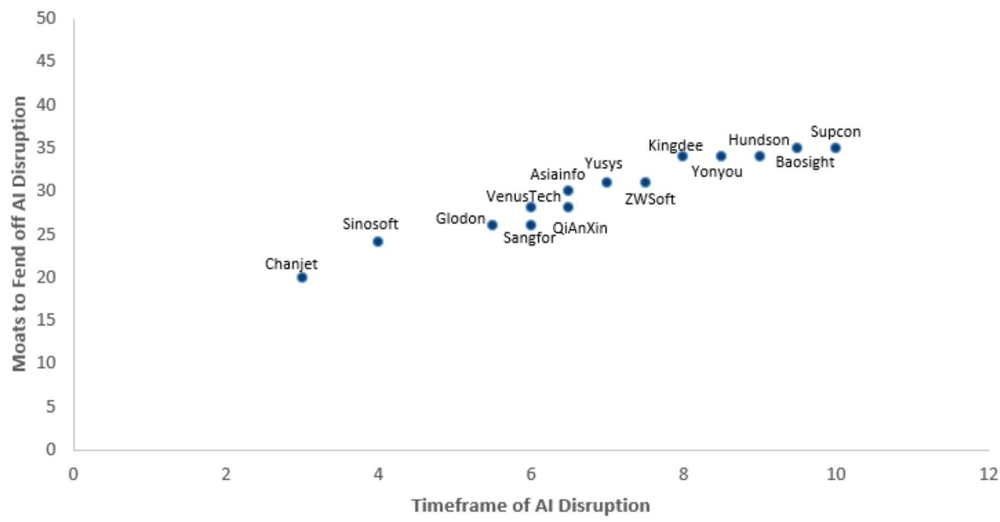

scatterplot

| Company     | Timeframe of AI Disruption | Moats to Fend off AI Disruption |
| ----------- | -------------------------- | ------------------------------- |
| Chanjet     | 3.0                        | 20.0                            |
| Sinosoft    | 4.0                        | 24.0                            |
| Glodon      | 5.5                        | 26.0                            |
| Sangfor     | 6.0                        | 26.0                            |
| QiAnXin     | 6.5                        | 28.0                            |
| VenusTech   | 6.0                        | 28.0                            |
| Asiainfo    | 6.5                        | 30.0                            |
| Yusys       | 7.0                        | 31.0                            |
| ZWSoft      | 7.5                        | 31.0                            |
| Kingdee     | 8.0                        | 34.0                            |
| Yonyou      | 8.5                        | 34.0                            |
| Hudson     | 9.0                        | 34.0                            |
| Baosight    | 9.5                        | 35.0                            |
| Supcon      | 10.0                       | 35.0                            |

Source: Company, JEF Note: Timeframe only shows relative window for AI transition

## CN SW is Less Prone to AI Disruption, but IT Budget Pressure is Still the Headwind; KD is Our Top Pick

■ Most of Chinese software companies adopted a project-based business model that requires vendors to provide lots of customization and system integrations to enterprise clients. Meanwhile, their customers are often SOEs and governments, which requires vendors to have high qualifications and are less willing to send data to LLM via cloud API owing to strong compliance.  
As a result, we believe Chinese software companies are generally more resilient to AI disruption compared to US software companies. Among our coverage, industrial SW, financial IT, and ERP are most resilient to AI disruption given deep workflow integration, proprietary data, zero tolerance for hallucination, and strict vendor qualifications.  
We believe the key problem for Chinese software companies is still customers' shrinking IT budget as enterprises cut their expenses/capex amid a weak macro environment.  
We believe the sell-off of Chinese SaaS companies like KD provides a good entry opportunity: 1) KD's ERP is deeply embedded in clients' workflows as a system of record, and is costly and risky to replace; 2) KD's proprietary data and industry know-how difficult for AI vendors to replicate; 3) module-based pricing insulates rev from workforce reductions; 4) KD has launched its own AI-native ERP suite and Lingee AIOS, guiding Rmb1.0bn in AI rev for 2026; 5) SaaS now >50% of rev, drives teen% rev growth, GPM expansion, and strong op leverage aided by internal AI-driven cost efficiencies; and 6) valuation at 0.7x 2026E PEG is cheap.

## US Models Keep Leading on AA's Model Ranking While Qwen Climbed to no.4 As The Best CN Model

In May, NOT many top model vendors rolled out major new model updates, Anthropic's Claude Opus 4.8, OpenAI's GPT 5.5, and Google's Gemini 3.1 Pro remain top 3 on Artificial Analysis' (AA) model intelligence ranking.  
- Alibaba is the only major Chinese player to have released a new flagship model in May: Qwen 3.7 Max, which surpassed Moonshot's Kimi K2.6 to become the best Chinese model.

Artificial Analysis AI model Intelligence index  
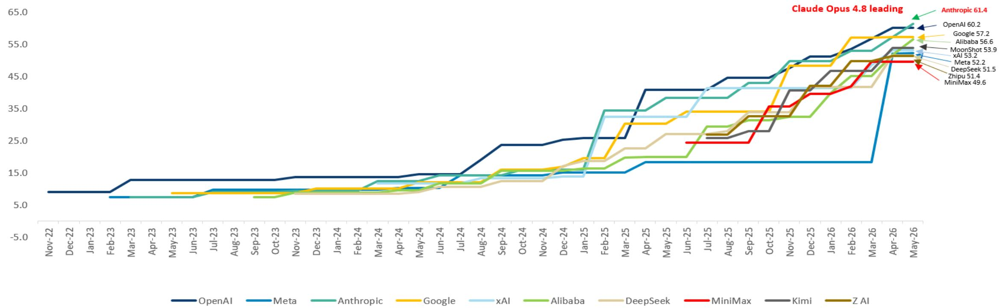  
Footnote: as of May 2026 Source: Artificial Analysis, JEF

## OpenAI, Anthropic and Google's Frontier Models Remain Top 3 of AA' Intelligence Index

- OpenAI, Anthropic and Google remain the world's leading AI labs with the state-of-the-art (SOTA) models.  
In China, the leader keeps changing. Alibaba's Qwen 3.7 Max surpassed Moonshot's Kimi K2.6 as the best Chinese model.  
■ The performance gap between the US and China has narrowed, with the best Chinese model (Qwen 3.7 Max) now 8% below the best US model in intelligence score, vs 10% in Apr 2026 (18% in Dec 2025).  
- Tencent's HY-3 Preview has joined the cohort, ranking No.8 among major Chinese model players.

Intelligence Score of Leading AI Labs' Models  
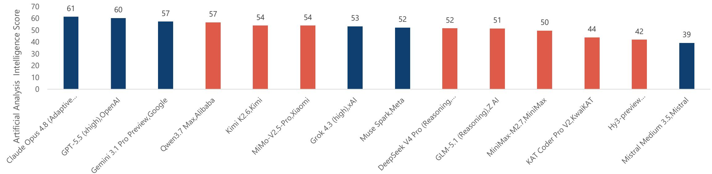

bar chart

| Model | Artificial Analysis Intelligence Score |
| :--- | :--- |
| Claude Opus 4.8 (Adaptive...) | 61 |
| GPT-5.5 (xhigh),OpenAI | 60 |
| Gemini 3.1 Pro Preview,Google | 57 |
| Qwen3.7 Max,Alibaba | 57 |
| Kimi K2.6,Kimi | 54 |
| MiMo-V2.5-Pro,Xiaomi | 54 |
| Grok 4.3 (high),xAI | 53 |
| Muse Spark,Meta | 52 |
| DeepSeek V4 Pro (Reasoning...) | 52 |
| GLM-5.1 (Reasoning),Z AI | 51 |
| MiniMax-M2.7,MiniMax | 50 |
| KAT Coder Pro V2,KwaiKAT | 44 |
| Hy3-preview... | 42 |
| Mistral Medium 3.5,Mistral | 39 |

Source: Artificial Analysis, JEF

## Since End-2025, Chinese Models have Improved More Than Their US Peers

■ Compared to Nov 2025 when we first launched our AI monthly report, many model vendors have seen performance increase in their frontier models.  
- Overall, Chinese models have improved more compared to US models. In China, BABA, Zhipu and DeepSeek's frontier model improved 18\~24 points since Nov 2025.  
- Meanwhile, OAI, Anthropic and Google's best models increased 8-13 points from Nov 2025 to May 2026.

Flagship Models' Artificial Analysis Score Change From Nov to May

<table><tr><td>Flagship Model In May 2026</td><td>AA Score</td><td>Change</td><td>Flagship Model In Nov 2025</td><td>AA Score</td></tr><tr><td>1.Claude Opus 4.8 (Adaptive Reasoni</td><td>61.4</td><td>+11.7</td><td>1. Claude Opus 4.5 reasoning (Anthrc</td><td>49.7</td></tr><tr><td>2.GPT-5.5 (xhigh),OpenAI</td><td>60.2</td><td>+12.6</td><td>2. Gemini 3 pro preview (Google)</td><td>48.4</td></tr><tr><td>3.Gemini 3.1 Pro Preview,Google</td><td>57.2</td><td>+8.8</td><td>3. GPT5.1 high (OpenAI)</td><td>47.6</td></tr><tr><td>4.Qwen3.7 Max,Alibaba</td><td>56.6</td><td>+24.2</td><td>4. Grok 4 (xAI)</td><td>41.4</td></tr><tr><td>5.Kimi K2.6,Kimi</td><td>53.9</td><td>+13.2</td><td>5. Kimi K2 Thinking (Moonshot)</td><td>40.7</td></tr><tr><td>6.MiMo-V2.5-Pro,Xiaomi</td><td>53.8</td><td>n.a</td><td>6. MiniMax M2 (MiniMax)</td><td>35.7</td></tr><tr><td>7.Grok 4.3 (high),xAI</td><td>53.2</td><td>+11.8</td><td>7. DeepSeek V3.1 Terminus (DeepSe</td><td>33.8</td></tr><tr><td>8.Muse Spark,Meta</td><td>52.2</td><td>n.a</td><td>8. GLM 4.6 Reasoning (zhipu)</td><td>32.5</td></tr><tr><td>9.DeepSeek V4 Pro (Reasoning, Max</td><td>51.5</td><td>+17.7</td><td>9. Qwen3 Max Thinking preview (AliI</td><td>32.5</td></tr><tr><td>10.GLM-5.1 (Reasoning),Z AI</td><td>51.4</td><td>+18.9</td><td>10. Magistral Medium 1.2 (Magistral)</td><td>27.0</td></tr></table>

Footnote: Flagship model = model with the highest Artificial Analysis score; models in orange are Chinese models

Source: Artificial Analysis, JEF

## The LLM Performance Gap Between China and US Continues to Narrow

- As of May 2026, the leading Chinese frontier model (Qwen 3.7 Max) reached \~92% of the intelligence level of the leading U.S. frontier model (Claude Opus 4.8).  
- In Dec 2025, the leading Chinese frontier model (GLM 4.7) was at \~82% of the intelligence level of the leading US frontier model (GPT5.2 xhigh).  
• The performance gap between top Chinese and US LLM has narrowed from 18% to 8% over the past six months.  
- However, given the long model training and iteration cycle (\~3–6 months), the gap could be widened again as U.S. players roll out their next flagship models.

Frontier Language Model Intelligence China vs. US  

line chart

| Month    | China Frontier model intelligence | US Frontier model intelligence |
| -------- | ---------------------------------- | ------------------------------ |
| May-22   | 0                                  | 0                              |
| Aug-22   | 0                                  | 0                              |
| Nov-22   | 0                                  | 10                             |
| Feb-23   | 0                                  | 10                             |
| May-23   | 0                                  | 10                             |
| Aug-23   | 5                                  | 10                             |
| Nov-23   | 5                                  | 10                             |
| Feb-24   | 5                                  | 10                             |
| May-24   | 10                                 | 10                             |
| Aug-24   | 15                                 | 25                             |
| Nov-24   | 15                                 | 25                             |
| Feb-25   | 20                                 | 35                             |
| May-25   | 25                                 | 40                             |
| Aug-25   | 30                                 | 45                             |
| Nov-25   | 35                                 | 50                             |
| Feb-26   | 45                                 | 55                             |
| May-26   | 55                                 | 60                             |

Source: Artificial Analysis, JEF

Frontier Language Model Intelligence China vs. US  
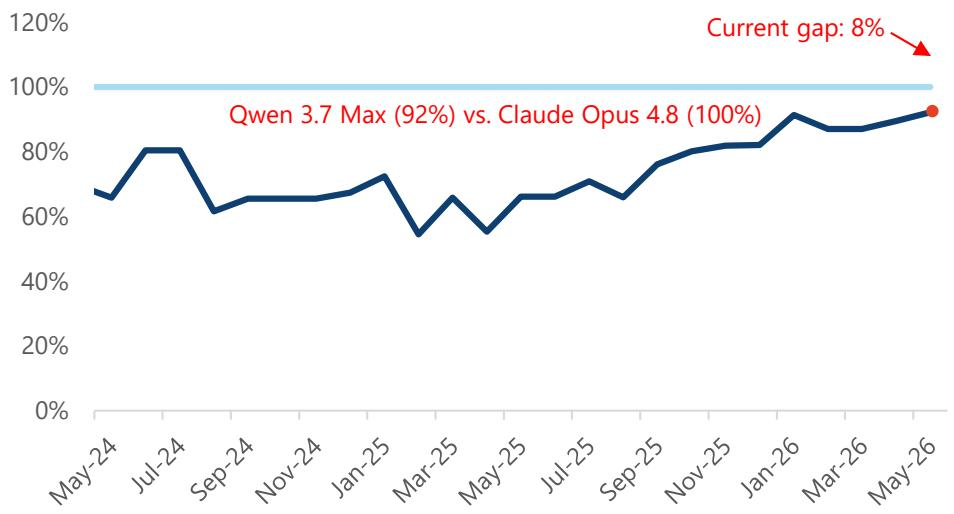

line chart

| Date    | Value |
|---------|-------|
| May-24  | 65%   |
| Jul-24  | 80%   |
| Sep-24  | 60%   |
| Nov-24  | 65%   |
| Jan-25  | 70%   |
| Mar-25  | 55%   |
| May-25  | 65%   |
| Jul-25  | 70%   |
| Sep-25  | 65%   |
| Nov-25  | 80%   |
| Jan-26  | 85%   |
| Mar-26  | 85%   |
| May-26  | 90%   |

Footnote: US frontier model intelligence as benchmark (100%)  
Source: Artificial Analysis, JEF

## US Models Still Leading in Coding & Agentic Capabilities (1)

■ Coding is currently the most promising use case of LLM. Thus, this is the domain every model vendor is competing in.  
- AA's coding index evaluates models' ability to solve programming problems, including those requiring scientific and research domain knowledge. AA's coding index includes benchmarks like SciCode and Terminal-Bench Hard.  
■ U.S. models delivered outstanding performance, with GPT 5.5 xhigh, Claude Opus 4.8, and Gemini 3.1 Pro leading in coding capability. Chinese models like Qwen 3.7 Max, DS V4 Pro, Kimi K2.6, and KAT Coder Pro V2 are ranked 4 $^{th}$ -8 $^{th}$ among peers.

Coding capability Global vs. China  
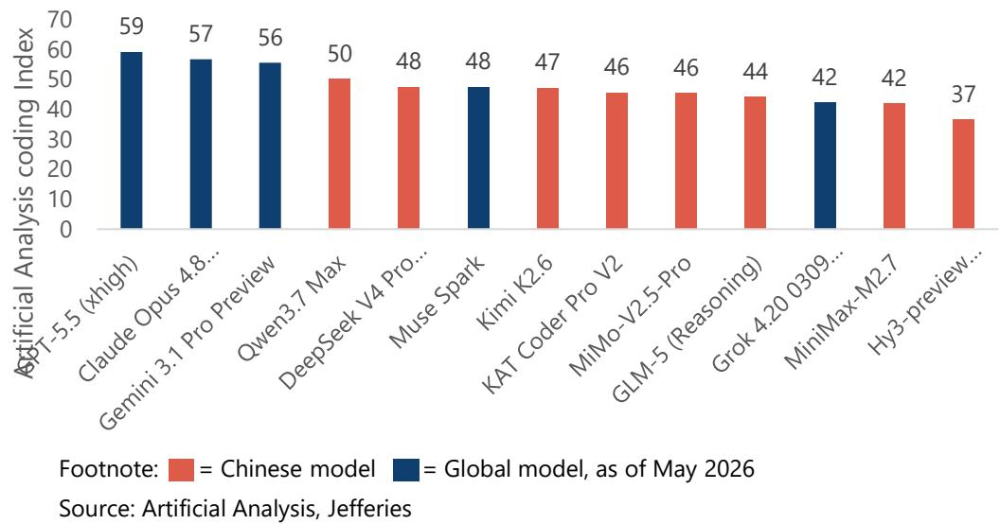

bar chart

Artificial Analysis coding Index
| Model | Value |
| :--- | :--- |
| APT-5.5 (xhigh) | 59 |
| Claude Opus 4.8... | 57 |
| Gemini 3.1 Pro Preview | 56 |
| Qwen3.7 Max | 50 |
| DeepSeek V4 Pro... | 48 |
| Muse Spark | 48 |
| Kimi K2.6 | 47 |
| KAT Coder Pro V2 | 46 |
| MiMo-V2.5-Pro | 46 |
| GLM-5 (Reasoning) | 44 |
| Grok 4.20 0309... | 42 |
| MiniMax-M2.7 | 42 |
| Hy3-preview... | 37 |
Source: Artificial Analysis, JEF

Flagship Models' Artificial Analysis Coding Score Change From Nov to May

<table><tr><td>Flagship Model In May 2026</td><td>AA Score</td><td>Change</td><td>Flagship Model In Nov 2025</td><td>AA Score</td></tr><tr><td>1.GPT-5.5 (xhigh)</td><td>59</td><td>+14.1</td><td>1. Claude Opus 4.5</td><td>48</td></tr><tr><td>2.Claude Opus 4.8 (Adaptive Reasoni</td><td>57</td><td>+8.7</td><td>2. Gemini 3 Pro preview</td><td>46</td></tr><tr><td>3.Gemini 3.1 Pro Preview</td><td>56</td><td>+9.5</td><td>3. GPT 5.1 (high)</td><td>45</td></tr><tr><td>4.Qwen3.7 Max</td><td>50</td><td>+25.1</td><td>4. Grok 4</td><td>40</td></tr><tr><td>5.DeepSeek V4 Pro (Reasoning, Max</td><td>48</td><td>+13.5</td><td>5. Kimi K2 Thinking</td><td>35</td></tr><tr><td>6.Muse Spark</td><td>48</td><td>n.a</td><td>6. DeepSeek V3.1 Terminus</td><td>34</td></tr><tr><td>7.Kimi K2.6</td><td>47</td><td>+12.1</td><td>7. GLM 4.6</td><td>29</td></tr><tr><td>8.KAT Coder Pro V2</td><td>46</td><td>n.a</td><td>8. MiniMax M2</td><td>29</td></tr><tr><td>9.MiMo-V2.5-Pro</td><td>46</td><td>n.a</td><td>9. Qwen3 Max Thinking preview</td><td>25</td></tr><tr><td>10.GLM-5 (Reasoning)</td><td>44</td><td>+15.2</td><td>10. Magistral Medium 1.2</td><td>22</td></tr></table>

Footnote: models in orange are Chinese models  
Source: Artificial Analysis, JEF

## US Models Still Leading in Coding & Agentic Capabilities (2)

- AA's agentic index evaluates performance in agentic workflows, emphasizing behaviors such as tool use, planning, autonomy, instruction following, and complex problem-solving. Agentic index includes benchmarks like $\tau^2$ -Bench Telecom and Terminal-Bench Hard  
■ Higher score on agentic index means more commercializable agents could be built based off the foundational model  
- Frontier model like Claude Opus 4.8 and GPT 5.5 xhigh are leading the pack. Chinese models such as Xiaomi's MiMo-V2.5 Pro, DS V4 Pro and GLM 5.1 are ranked from $4^{\text{th}}$ to $6^{\text{th}}$ with only slightly lower performance scores.

Agentic capability Global vs. China  
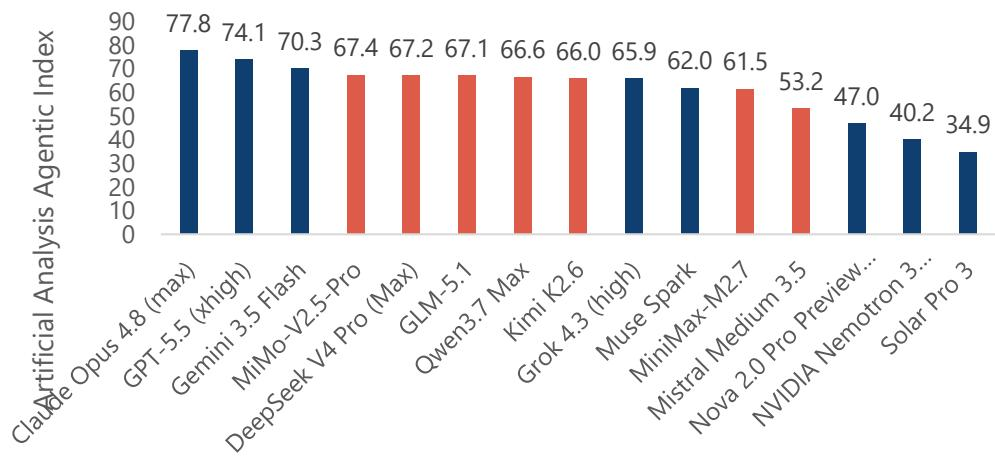

bar chart

Artificial Analysis Agentic Index
| Model | Agentic Index |
| :--- | :--- |
| Claude Opus 4.8 (max) | 77.8 |
| GPT-5.5 (xhigh) | 74.1 |
| Gemini 3.5 Flash | 70.3 |
| MiMo-V2.5-Pro | 67.4 |
| DeepSeek V4 Pro (Max) | 67.2 |
| GLM-5.1 | 67.1 |
| Qwen3.7 Max | 66.6 |
| Kimi K2.6 | 66.0 |
| Grok 4.3 (high) | 65.9 |
| Muse Spark | 62.0 |
| MiniMax-M2.7 | 61.5 |
| Mistral Medium 3.5 | 53.2 |
| Nova 2.0 Pro Preview... | 47.0 |
| NVIDIA Nemotron 3... | 40.2 |
| Solar Pro 3 | 34.9 |

Footnote: ■ = Chinese model ■ = Global model, as of May 2026  
Source: Artificial Analysis, JEF

Flagship Models' Artificial Analysis Agentic Score Change From Nov to May

<table><tr><td>Flagship Model In May 2026</td><td>AA Score</td><td>Change</td><td>Flagship Model In Nov 2025</td><td>AA Score</td></tr><tr><td>1.Claude Opus 4.8 (max)</td><td>78</td><td>+17.8</td><td>1. Claude Opus 4.5</td><td>60</td></tr><tr><td>2.GPT-5.5 (xhigh)</td><td>74</td><td>+23.1</td><td>2. Gemini 3 Pro preview</td><td>52</td></tr><tr><td>3.Gemini 3.5 Flash</td><td>70</td><td>+18.3</td><td>3. GPT 5.1 (high)</td><td>51</td></tr><tr><td>4.MiMo-V2.5-Pro</td><td>67</td><td>n.a</td><td>4. Kimi K2 Thinking</td><td>48</td></tr><tr><td>5.DeepSeek V4 Pro (Max)</td><td>67</td><td>+37.2</td><td>5. MiniMax M2</td><td>48</td></tr><tr><td>6.GLM-5.1</td><td>67</td><td>+25.1</td><td>6. Qwen3 Max Thinking preview</td><td>43</td></tr><tr><td>7.Qwen3.7 Max</td><td>67</td><td>+23.6</td><td>7. GLM 4.6</td><td>42</td></tr><tr><td>8.Kimi K2.6</td><td>66</td><td>+18</td><td>8. Grok 4</td><td>42</td></tr><tr><td>9.Grok 4.3 (high)</td><td>66</td><td>+23.9</td><td>9. DeepSeek V3.1 Terminus</td><td>30</td></tr><tr><td>10.Muse Spark</td><td>62</td><td>n.a</td><td>10. Magistral Medium 1.2</td><td>24</td></tr></table>

Footnote: models in orange are Chinese models  
Source: Artificial Analysis, JEF

## US models are Strong at Image Generation, Chinese Models Dominate in Video Generation (1)

■ Besides LLMs, multimode models that include image, video, and audio are becoming more important, as they provide more information for models to comprehend the world similarly to humans.  
■ We believe LLMs will excel in use cases like search, coding, office applications, and customer service. Meanwhile, multi-modal models are likely to power applications in autonomous driving, AR/VR, content creation, advertising and gaming industries.  
■ Besides text models, US AI labs also lead in text-to-image models as of May 2026, OpenAI’s GPT image 2 significantly outperforms all competitors.  
Notably, in the text-to-video model rankings, Chinese model Bytedance's Seedance 2.0 and BABA's HappyHorse 1.0 now rank first and second, and largely outperformed the others.

LMArena Ranking - Text to Image  

bar chart

| Model | LMArena Score |
| :--- | :--- |
| gpt-image-2 (medium) | 1389 |
| gemini-3.1-flash-image-... | 1270 |
| grok-imagine-image-... | 1228 |
| uni-1.1-max | 1192 |
| mai-image-2 | 1182 |
| recraft-v4.1-utility-pro | 1169 |
| qwen-image-2.0-pro-... | 1168 |
| flux-2-max | 1164 |
| reve-v1.5 | 1158 |
| hunyuan-image-3.0 | 1151 |
Footnote: = Chinese model; = Global model, as of May 2026 Source: LMArena, JEF

LMArena Ranking - Text to Video  
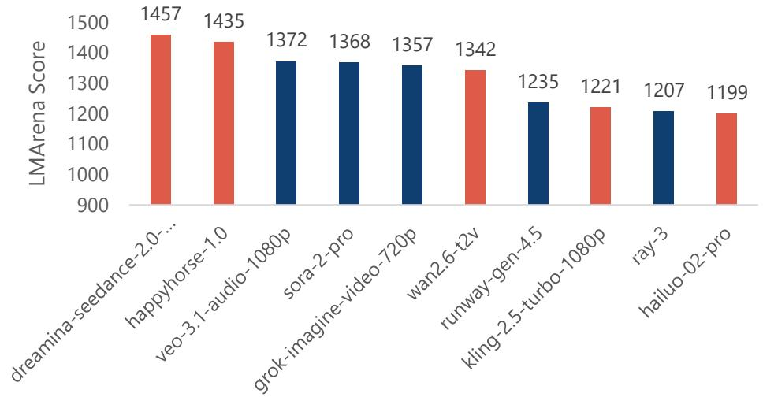

bar chart

| Video Sequence | LMArena Score |
| :--- | :--- |
| dreamina-seedance-2.0-... | 1457 |
| happyhorse-1.0 | 1435 |
| veo-3.1-audio-1080p | 1372 |
| sora-2-pro | 1368 |
| grok-imagine-video-720p | 1357 |
| wan2.6-t2v | 1342 |
| runway-gen-4.5 | 1235 |
| kling-2.5-turbo-1080p | 1221 |
| ray-3 | 1207 |
| hailuo-02-pro | 1199 |

## DeepSeek Top-Ranked in Token Market Share, Followed by Anthropic, Google and Tencent

- OpenRouter is a model marketplace. It allows enterprises and developers to access models from various vendors via its platform. It is also the only platform that publishes token consumption data by models.  
- We believe token consumption market shares provide another perspective on each AI lab's industry position than pure benchmark scores.  
- According to OpenRouter's data, as of the week of May 25, DeepSeek ranked No.1 with \~18% in token consumption market share and Anthropic is No.2 with \~18% share.  
- OpenRouter's data could underestimate consumption of open-source models given it could not track tokens consumed on open-source models deployed in private cloud and on-premise.  
- But we estimate OpenRouter's global share of token consumption is $< 1\%$ , which means its market share data may not be representative of the whole market.

stacked bar chart

| Date       | deepseek | anthropic | google | tencent | openai | xiaomi | openrouter | qwen | z-ai | others |
|------------|----------|-----------|--------|---------|--------|--------|------------|------|------|--------|
| Jun 2, 2025 | 17.6%    | 17.5%     | 13.2%  | 9.5%    | 9.2%   | -      | -          | -    | -    | -      |
| Jul 7      | -        | -         | -      | -       | -      | -      | -          | -    | -    | -      |
| Aug 11     | -        | -         | -      | -       | -      | -      | -          | -    | -    | -      |
| Sep 15     | -        | -         | -      | -       | -      | -      | -          | -    | -    | -      |
| Oct 20     | -        | -         | -      | -       | -      | -      | -          | -    | -    | -      |
| Nov 24     | -        | -         | -      | -       | -      | -      | -          | -    | -    | -      |
| Dec 29     | 5.6T     | -         | -      | -       | -      | -      | -          | -    | -    | -      |
| Feb 2      | -        | -         | -      | 3.03T   | -      | -      | -          | -    | -    | -      |
| Mar 9      | -        | -         | -      | -       | -      | -      | -          | 2.94T| 3.83T| 12.0%  |
| Apr 13     | 2.81T    | -         | -      | 963B    | 3.0%   | 1.21T  | 3.8%       | 3.8% | 3.83T| 12.0%  |
| May 18     | 8.8%     | 1.66T     | 1.21T  | 3.83T   | 3.83T  | 2.81T  | 5.2%       | 3.8% | 3.83T| 12.0%  |
| May 25, 2026| 5.6T     | 17.6%     | 5.57T  | 4.2T    | 9.5%   | 4.2T   | 5.2%       | 3.8% | 3.83T| 12.0%  |
The chart displays the cumulative market share percentages over time for each platform.

Source: OpenRouter  
Footnote: as of the week of May 25, 2026

## We Updated Model API Pricing Methodology Taking Into Consideration of Cache-hit Tokens

In agentic AI use cases, cache-hit tokens are likely to be substantial. Thus, we updated our methodology for calculating the blended model API price, from an input:output ratio of 3:1 to a cache-hit:input:output ratio of 7:2:1. This new methodology has led to decrease in overall model price by c.60%-c70% in both the U.S. and China.  
■ We observed model vendors adopted different pricing strategies: Out of the 11 vendors, 5 lowered prices, 3 raised prices, and 3 kept prices unchanged for their new flagship models.  
■ Efficiency drives LLM scalability and unit economics: higher efficiency enables comparable performance with fewer resources.  
■ Chinese AI players continue to focus on compute and memory efficiency across training and inference

Frontier Model Price (USD/Mn Tokens)  

bar chart

| Model | Value |
| :--- | :--- |
| GPT-5.5 (xhigh) ,OpenAI | 4.3 |
| Claude Opus 4.7 (Adaptive...) | 4.1 |
| Gemini 3.1 Pro... | 1.7 |
| Qwen3.7 Max ,Alibaba | 1.1 |
| GLM-5.1 (Reasoning) ,Z AI | 0.8 |
| Kimi K2.6 ,Kimi | 0.7 |
| Grok 4.3 (high) ,xAI | 0.6 |
| MiniMax-M2.7 ,MiniMax | 0.3 |
| MiMo-V2.5 -Pro ,Xiaomi | 0.2 |
| DeepSeek V4 Pro... | 0.2 |

Source: Artificial Analysis, Companies, JEF

USD/Mn Tokens  

bar chart

| Company | New | Old |
| :--- | :--- | :--- |
| OpenAI | 4.3 | 2.2 |
| Anthropic | 4.1 | 4.1 |
| Google | 1.7 | 1.7 |
| ByteDance | 1.2 | 0.3 |
| Alibaba | 1.1 | 2.0 |
| Z AI | 0.8 | 0.6 |
| Kimi | 0.7 | 0.5 |
| MiniMax | 0.3 | 0.3 |
| Xiaomi | 0.2 | 1.3 |
| DeepSeek | 0.2 | 0.1 |
| StepFun | 0.1 | 0.3 |

Frontier Model Price - New vs previous models  
Source: Artificial Analysis, Companies, JEF  
\*Note: Price per token, represented as USD per million Tokens (assume USD:CNY = 1:7). Price is a blend of Cache-hit & Input & Output token prices (7:2:1 ratio). As of May 2026

## Chinese Models Still Offer Superior Value for Performance (1)

Chinese models' average price as a percentage of US models' price is down from $31\%$ in Apr to $21\%$ in May, mainly driven by Qwen and Xiaomi's price cut on their flagship models.  
The average price of Chinese model has increased by $52\%$ since Jan 2026. We believe this trend is driven by both an increase in inference cost (high-end GPU and memory price hike) and Chinese vendors' increasing focus on monetization.  
However, we noticed that Qwen/Xiaomi lowered their flagship model prices by 46%/86% in May. Meanwhile, DeepSeek announced the 75% promotional discount on its V4 Pro would be permanent.  
We believe this likely signals intensifying competition in the model market as incumbents try to gain market share. However, given sharply higher hardware costs, we remain worried that lower API pricing could depress ROI for Chinese AI model players.

CH Frontier Model Price As % of US'  
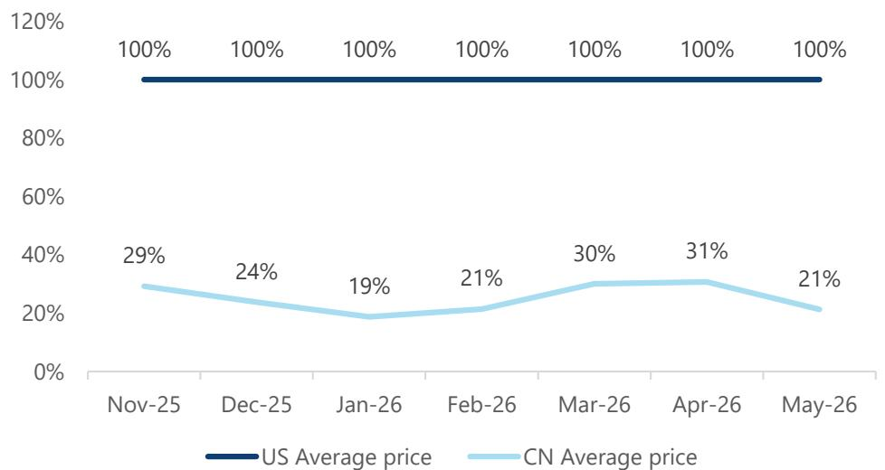

line chart

| Month    | US Average price | CN Average price |
| -------- | ---------------- | ---------------- |
| Nov-25   | 100%             | 29%              |
| Dec-25   | 100%             | 24%              |
| Jan-26   | 100%             | 19%              |
| Feb-26   | 100%             | 21%              |
| Mar-26   | 100%             | 30%              |
| Apr-26   | 100%             | 31%              |
| May-26   | 100%             | 21%              |

Frontier Model Price - US vs. CN  
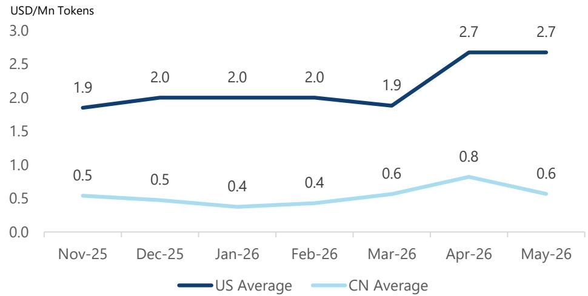

line chart

| Date | US Average (USD/Mn Tokens) | CN Average (USD/Mn Tokens) |
| :--- | :--- | :--- |
| Nov-25 | 1.9 | 0.5 |
| Dec-25 | 2.0 | 0.5 |
| Jan-26 | 2.0 | 0.4 |
| Feb-26 | 2.0 | 0.4 |
| Mar-26 | 1.9 | 0.6 |
| Apr-26 | 2.7 | 0.8 |
| May-26 | 2.7 | 0.6 |

Source: Companies, Artificial Analysis, JEF; Note: Model price is calculated by averaging each vendor's flagship model price in each month

## Chinese Models Still Offer Superior Value for Performance (2)

■ Chinese models continue to deliver high value for performance compared to US models  
- Alibaba lowered its new flagship model Qwen 3.7 Max's price by 46% (vs Qwen 3.6 Max) to US\$1.1/Mn tokens in May 2026, ranking it as the second most expensive model in China (after Doubao Seed Code 2.0's US\$1.2/Mn tokens).  
Despite this, Qwen 3.7 Max's price is only $26\%$ of OpenAI's GPT 5.5 (xhigh)'s price, and $27\%$ of Claude Opus 4.8's; while Qwen 3.7 Max's model intelligence is already at $94\%$ and $92\%$ of these two peers.

China and US' API Price vs. Model Intelligence  
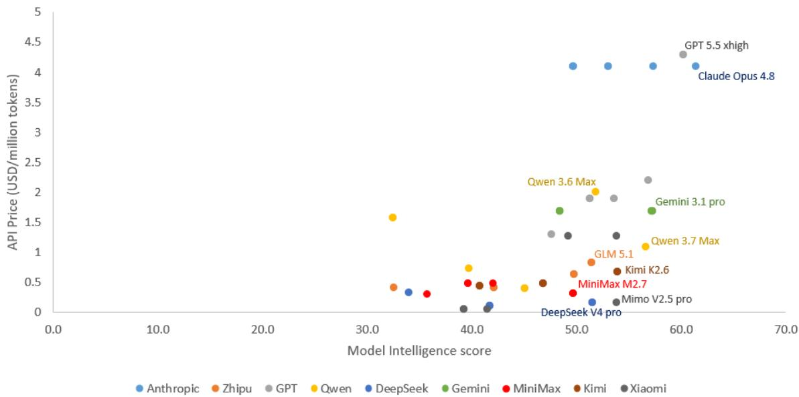

scatterplot

| Model | Model Intelligence score | API Price (USD/million tokens) |
|-------|--------------------------|---------------------------------|
| Claude Opus 4.8 | 61.0 | 4.1 |
| GPT 5.5 xhigh | 60.0 | 4.3 |
| Qwen 3.6 Max | 51.0 | 2.0 |
| Gemini 3.1 pro | 57.0 | 1.7 |
| Qwen 3.7 Max | 56.0 | 1.1 |
| GLM 5.1 | 50.0 | 0.8 |
| MiniMax M2.7 | 49.0 | 0.5 |
| Kimi | 53.0 | 0.7 |
| Mimo V2.5 pro | 54.0 | 0.2 |
| DeepSeek V4 pro | 50.0 | 0.2 |
| Zhipu | 33.0 | 0.4 |
| DeepSeek | 34.0 | 0.3 |
| Gemini | 49.0 | 1.7 |
| MiniMax | 41.0 | 0.4 |
| Kimi | 47.0 | 0.5 |
| Xiaomi | 48.0 | 1.3 |
| AlphaTauri | 41.0 | 0.1 |
| Zhipu | 36.0 | 0.3 |
| GPT | 52.0 | 1.9 |
| Qwen | 32.0 | 1.6 |
| MegaView Xpresser | 48.0 | 1.7 |
| K2.6 | 53.0 | 0.7 |
| MegaView Xpresser | 51.0 | 1.1 |
| MegaView Xpresser | 57.0 | 2.2 |
| MegaView Xpresser | 60.0 | 2.2 |
The chart displays the API Price (USD/million tokens) on the Y-axis against the Model Intelligence score on the X-axis, with each model represented by a distinct color in the legend. The data points are labeled with model names and their corresponding API prices.

LLM Intelligence/Price Ratio - DeepSeek vs. Zhipu vs. Qwen vs. GPT  
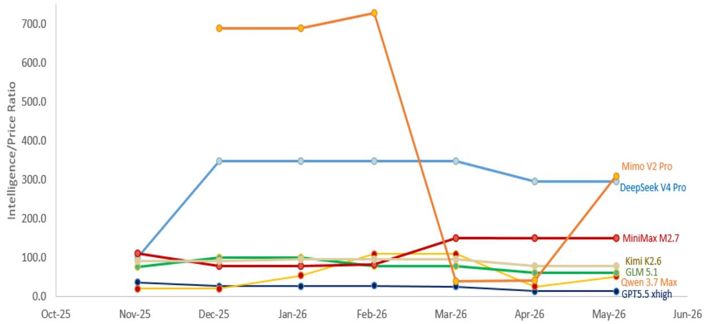

line chart

| Month | Mimo V2 Pro | DeepSeek V4 Pro | MiniMax M2.7 | Kimi K2.6 | GLM 5.1 | Qwen 3.7 Max | GPT5.5 xhigh |
| --- | --- | --- | --- | --- | --- | --- | --- |
| Oct-25 |  |  |  |  |  |  |  |
| Nov-25 |  |  |  |  |  |  |  |
| Dec-25 | 700.0 | 350.0 |  |  |  |  |  |
| Jan-26 | 700.0 | 350.0 |  |  |  |  |  |
| Feb-26 | 720.0 | 350.0 |  |  |  |  |  |
| Mar-26 | 40.0 | 350.0 | 150.0 |  |  |  |  |
| Apr-26 | 40.0 | 300.0 | 150.0 |  |  |  |  |
| May-26 | 310.0 | 300.0 | 150.0 |  |  |  |  |
| Jun-26 |  |  |  |  |  |  |  |

Source: Companies, Artificial Analysis, JEF

## DS V4 Is Highly Cost-effective; Co. Still Focuses on AGI Instead of Short-term Monetization

DS V4 demonstrates advanced intelligence and robust coding capabilities, while maintaining a highly competitive price of \$0.17 per million tokens. Several factors contribute to DS' low pricing strategy: 1) DeepSeek V4 leverages a new KV cache compression technique, enhancing cost-effectiveness; 2) it benefits from lower inherent training costs and full compatibility with Huawei's Ascend chips; 3) the company aims to aggressively gain market share and strengthen its ecosystem; and 4) it has received additional cash support from its latest fundraising round.  
DeepSeek V4 Pro's price is now the second lowest among Chinese flagship models, accounting for only 4% of US frontier model GPT 5.5 xhigh's price (4.3 USD/Mn tokens) and 10% of Google's Gemini 3.1 Pro's price.  
We still noticed that DeepSeek V4's price is $45\%$ higher than its previous flagship model DeepSeek V3.2 (input price is $50\%$ higher and output price is 2x). This price hike is likely driven by the increase in hardware cost (e.g. memory price has increased 4x yoy). Top Model vendor's Flagship Model Price In Each Month DeepSeek's Historical Price of Its best Model in Each Month

Cache:input:output = 7:2:1

<table><tr><td>USD/Mn tokens</td><td>Nov-25</td><td>Dec-25</td><td>Jan-26</td><td>Feb-26</td><td>Mar-26</td><td>Apr-26</td><td>May-26</td></tr><tr><td>OpenAI</td><td>1.3</td><td>1.9</td><td>1.9</td><td>1.9</td><td>2.2</td><td>4.3</td><td>4.3</td></tr><tr><td>Meta</td><td>0.3</td><td>0.3</td><td>0.3</td><td>0.3</td><td>0.3</td><td></td><td></td></tr><tr><td>Anthropic</td><td>4.1</td><td>4.1</td><td>4.1</td><td>4.1</td><td>4.1</td><td>4.1</td><td>4.1</td></tr><tr><td>Google</td><td>1.7</td><td>1.7</td><td>1.7</td><td>1.7</td><td>1.7</td><td>1.7</td><td>1.7</td></tr><tr><td>xAI</td><td></td><td></td><td></td><td></td><td>1.1</td><td>0.6</td><td>0.6</td></tr><tr><td>US Average</td><td>1.9</td><td>2.0</td><td>2.0</td><td>2.0</td><td>1.9</td><td>2.7</td><td>2.7</td></tr><tr><td>Alibaba</td><td>1.6</td><td>1.6</td><td>0.7</td><td>0.4</td><td>0.4</td><td>2.0</td><td>1.1</td></tr><tr><td>DeepSeek</td><td>0.3</td><td>0.1</td><td>0.1</td><td>0.1</td><td>0.1</td><td>0.2</td><td>0.2</td></tr><tr><td>MiniMax</td><td>0.3</td><td>0.5</td><td>0.5</td><td>0.5</td><td>0.3</td><td>0.3</td><td>0.3</td></tr><tr><td>Kimi</td><td>0.4</td><td>0.4</td><td>0.5</td><td>0.5</td><td>0.5</td><td>0.7</td><td>0.7</td></tr><tr><td>Z AI</td><td>0.4</td><td>0.4</td><td>0.4</td><td>0.6</td><td>0.6</td><td>0.8</td><td>0.8</td></tr><tr><td>Xiaomi</td><td></td><td>0.06</td><td>0.06</td><td>0.06</td><td>1.3</td><td>1.3</td><td>0.2</td></tr><tr><td>ByteDance</td><td>0.3</td><td>0.3</td><td>0.3</td><td>1.2</td><td>1.2</td><td>1.2</td><td>1.2</td></tr><tr><td>StepFun</td><td>0.3</td><td>0.3</td><td>0.3</td><td>0.1</td><td>0.1</td><td>0.1</td><td>0.1</td></tr><tr><td>CN Average</td><td>0.5</td><td>0.5</td><td>0.4</td><td>0.4</td><td>0.6</td><td>0.8</td><td>0.6</td></tr></table>

Source: Artificial Analysis, Companies, JEF

DeepSeek's Historical Price of Its best Model in Each Month  

bar chart

| Date | Value |
| :--- | :--- |
| Nov-25 | 0.34 |
| Dec-25 | 0.12 |
| Jan-26 | 0.12 |
| Feb-26 | 0.12 |
| Mar-26 | 0.12 |
| Apr-26 | 0.17 |
| May-26 | 0.17 |
DeepSeek V3.1 Terminus; Dec25 - Mar26: DeepSeek V3.2; Apr26-May26: DeepSeek V4 pro

Source: Company, JEF

## Doubao Still Leading on Mobile APP MAU And has Widened the Gap with Qwen

- LLM apps are crucial to model vendors as they serve as key access points for consumers. These apps unify fragmented services into a single platform (e.g., Alibaba’s Qwen as an “omni access point”). LLM apps also enable agentic AI assistants that not only chat but execute complex tasks and workflows.  
In Apr, Doubao remained the leader on AICPB.com's list as China's largest LLM app as its mobile MAU reached 336m, followed by Qwen at 220m.  
- Qwen's mobile MAU declined 1% MoM in Apr, while Doubao's MAU grew 1.5%, Thus, the MAU gap between Qwen and Doubao has been widened again in Apr.  
- Tencent's Yuanbao and Baidu's Wenxin showed divergent MAU trends of $3\%$ and $-6.6\%$ MoM, respectively.

Top Chinese LLM Apps' Ranking by MAU

<table><tr><td>Developer</td><td>AI Native App</td><td>Jul</td><td>Aug</td><td>Sep</td><td>Oct</td><td>Nov</td><td>Dec</td><td>Jan</td><td>Feb</td><td>Mar</td><td>Apr</td></tr><tr><td>Alibaba</td><td>Quark</td><td>1</td><td>1</td><td>1</td><td>2</td><td>2</td><td>2</td><td>2</td><td>3</td><td>3</td><td>3</td></tr><tr><td>ByteDance</td><td>Doubao</td><td>3</td><td>3</td><td>2</td><td>1</td><td>1</td><td>1</td><td>1</td><td>1</td><td>1</td><td>1</td></tr><tr><td>Tencent</td><td>Yuanbao</td><td>5</td><td>5</td><td>5</td><td>4</td><td>4</td><td>5</td><td>5</td><td>5</td><td>6</td><td>5</td></tr><tr><td>DeepSeek</td><td>DeepSeek</td><td>4</td><td>4</td><td>4</td><td>5</td><td>5</td><td>4</td><td>4</td><td>4</td><td>4</td><td>4</td></tr><tr><td>Moonshot</td><td>Kimi</td><td>7</td><td>7</td><td>7</td><td>7</td><td>7</td><td>8</td><td>8</td><td>8</td><td>8</td><td>8</td></tr><tr><td>Alibaba</td><td>Qwen</td><td>13</td><td>14</td><td>12</td><td>11</td><td>8</td><td>7</td><td>7</td><td>2</td><td>2</td><td>2</td></tr><tr><td>Baidu</td><td>WenXin</td><td>10</td><td>10</td><td>10</td><td>10</td><td>11</td><td>11</td><td>11</td><td>11</td><td>11</td><td>12</td></tr><tr><td>ZhipuAI</td><td>Qingyan</td><td>11</td><td>11</td><td>11</td><td>12</td><td>12</td><td>12</td><td>12</td><td>13</td><td>13</td><td>13</td></tr></table>

Top Chinese LLM Apps' MAU (Mn)

<table><tr><td>Developer</td><td>AI Native App</td><td>Jul</td><td>Aug</td><td>Sep</td><td>Oct</td><td>Nov</td><td>Dec</td><td>Jan</td><td>Feb</td><td>Mar</td><td>Apr</td></tr><tr><td>Alibaba</td><td>Quark</td><td>155.6</td><td>154.5</td><td>151.0</td><td>151.7</td><td>151.9</td><td>147.8</td><td>144.1</td><td>170.4</td><td>172.2</td><td>162.3</td></tr><tr><td>ByteDance</td><td>Doubao</td><td>132.8</td><td>140.9</td><td>150.0</td><td>159.4</td><td>167.9</td><td>163.2</td><td>168.3</td><td>315.3</td><td>331.0</td><td>336.0</td></tr><tr><td>Tencent</td><td>Yuanbao</td><td>44.7</td><td>56.5</td><td>64.2</td><td>73.3</td><td>81.6</td><td>84.4</td><td>88.3</td><td>109.5</td><td>107.9</td><td>111.1</td></tr><tr><td>DeepSeek</td><td>DeepSeek</td><td>82.9</td><td>74.9</td><td>73.4</td><td>72.1</td><td>69.4</td><td>131.5</td><td>129.6</td><td>132.6</td><td>136.5</td><td>139.0</td></tr><tr><td>Moonshot</td><td>Kimi</td><td>23.1</td><td>22.9</td><td>23.0</td><td>23.5</td><td>24.8</td><td>23.6</td><td>23.4</td><td>24.7</td><td>25.8</td><td>25.3</td></tr><tr><td>Alibaba</td><td>Qwen</td><td>5.8</td><td>6.0</td><td>7.0</td><td>7.4</td><td>18.3</td><td>25.5</td><td>31.1</td><td>202.7</td><td>222.6</td><td>220.4</td></tr><tr><td>Baidu</td><td>WenXin</td><td>11.6</td><td>11.1</td><td>10.8</td><td>10.5</td><td>9.9</td><td>9.0</td><td>8.4</td><td>9.3</td><td>8.2</td><td>7.7</td></tr><tr><td>ZhipuAI</td><td>Qingyan</td><td>7.7</td><td>7.4</td><td>7.1</td><td>6.9</td><td>6.6</td><td>6.3</td><td>6.0</td><td>5.8</td><td>5.5</td><td>5.3</td></tr></table>

Top Chinese LLM Apps' MAU (%MoM)

<table><tr><td>Developer</td><td>AI Native App</td><td>Jul</td><td>Aug</td><td>Sep</td><td>Oct</td><td>Nov</td><td>Dec</td><td>Jan</td><td>Feb</td><td>Mar</td><td>Apr</td></tr><tr><td>Alibaba</td><td>Quark</td><td>-0.4%</td><td>-0.7%</td><td>-2.2%</td><td>0.4%</td><td>0.2%</td><td>-2.7%</td><td>-2.5%</td><td>18.2%</td><td>1.1%</td><td>-5.8%</td></tr><tr><td>ByteDance</td><td>Doubao</td><td>5.5%</td><td>6.1%</td><td>6.4%</td><td>6.3%</td><td>5.3%</td><td>-2.8%</td><td>3.1%</td><td>87.4%</td><td>5.0%</td><td>1.5%</td></tr><tr><td>Tencent</td><td>Yuanbao</td><td>9.2%</td><td>26.3%</td><td>13.6%</td><td>14.2%</td><td>11.3%</td><td>3.5%</td><td>4.6%</td><td>24.0%</td><td>-1.4%</td><td>3.0%</td></tr><tr><td>DeepSeek</td><td>DeepSeek</td><td>-11.9%</td><td>-9.7%</td><td>-2.0%</td><td>-1.9%</td><td>-3.7%</td><td>89.5%</td><td>-1.4%</td><td>2.3%</td><td>3.0%</td><td>1.8%</td></tr><tr><td>Moonshot</td><td>Kimi</td><td>-1.6%</td><td>-1.2%</td><td>0.6%</td><td>2.0%</td><td>5.8%</td><td>-5.0%</td><td>-0.9%</td><td>5.8%</td><td>4.2%</td><td>-1.7%</td></tr><tr><td>Alibaba</td><td>Qwen</td><td>1.6%</td><td>4.0%</td><td>16.2%</td><td>5.7%</td><td>149.2%</td><td>38.8%</td><td>22.0%</td><td>552.8%</td><td>9.8%</td><td>-1.0%</td></tr><tr><td>Baidu</td><td>WenXin</td><td>-4.8%</td><td>-4.7%</td><td>-2.9%</td><td>-3.0%</td><td>-5.7%</td><td>-9.0%</td><td>-6.0%</td><td>9.9%</td><td>-10.9%</td><td>-6.6%</td></tr><tr><td>ZhipuAI</td><td>Qingyan</td><td>-4.0%</td><td>-3.6%</td><td>-3.8%</td><td>-3.8%</td><td>-3.6%</td><td>-4.1%</td><td>-4.9%</td><td>-4.3%</td><td>-4.0%</td><td>-4.3%</td></tr></table>

Source: AICPB.com, JEF

## Fear of AI Disruption in Traditional Software and SaaS is Overdone

## US SW Sell-Off Since Claude Co-Work Driven by Multiple Compression

- Since Anthropic's Claude Co-work was released on Jan 12, 2026, the US software ETF IGV fell\~30% to Apr 10, 2026, driven by fear of AI's potential disruption of all software players, especially SaaS players.  
- But since Apr 10, IGV has recovered 44%, driven by improving sentiment about software earnings. But YTD, IGV is still down by \~7%, similar to our basket of 14 software stocks (simple avg).  
- The US SW sector's underperformance was driven purely by multiple compression, as cons rev forecasts for our basket of 14 US software stocks have risen $2\%$ between Jan 12, 2026 and May 31, 2026.

IGV Index Performance  
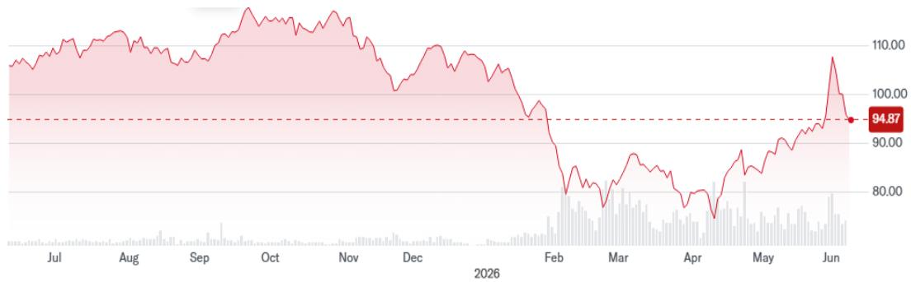

line chart

| Date  | Value  |
|-------|--------|
| Jun   | 94.87  |

Source: Yahoo Finance, JEF

US SW Cohort's Mkt Cap Chg  

bar chart

| Period | Value (%) |
|---|---|
| 3 Year | 38.7 |
| 1 Year | -3.1 |
| YTD | -6.4 |
| 3 Month | 15.4 |

Source: FactSet, JEF; Note: date as of May 31, 2026

US SW Cohort's Cons Rev  

bar chart

US SW Rev cons from Jan 12 - May 31: +2%
| Date | Value |
| :--- | :--- |
| Jan 12, 2026 | 656,853 |
| Mar 31, 2026 | 667,746 |
| May 31, 2026 | 673,052 |

Source: Bloomberg, JEF; Note: date as of May 31, 2026

## China SW Saw Accelerated Decline, Driven by Both Earnings Downgrade & Multiple Compression

- China software has been weak regardless of the AI theme. Our basket of 19 software stocks had fallen $27\%$ between Jan 12, 2026 (Claude Co-work's announcement) and Mar 31, and still fallen $2\%$ since Mar 31.  
■ YTD, our China software cohort has fallen by 13%, and it has fallen by 10% over one year.  
■ From Jan 12, 2026, 2026E cons rev has fallen by 5%, while 2026E EV/S fell by 15% to 4.3x.  
- Therefore, China’s SW de-rating has been driven by both earnings downgrade and multiple compression.

CN SW Cohort's Mkt Cap Chg  
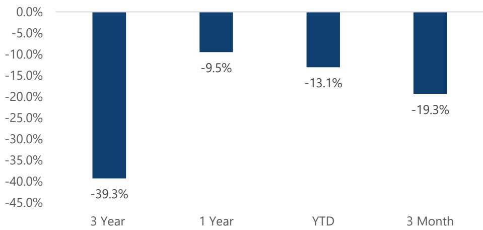

bar chart

| Period | Value (%) |
|---|---|
| 3 Year | -39.3 |
| 1 Year | -9.5 |
| YTD | -13.1 |
| 3 Month | -19.3 |

Source: FactSet, JEF Note: date as of May 31, 2026

US\$ Mn  
CN SW Cohort's Cons Rev  
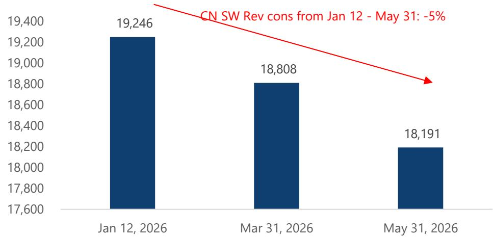

bar chart

| Date | Value |
| :--- | :--- |
| Jan 12, 2026 | 19,246 |
| Mar 31, 2026 | 18,808 |
| May 31, 2026 | 18,191 |
CN SW Rev cons from Jan 12 - May 31: -5%

Source: Bloomberg, JEF Note: date as of May 31, 2026

## AI is Like a Natural Selection Mechanism, Software Co.s with Moats that Fully Embrace AI Will Evolve

■ The rapid rise of large language models (LLM) and autonomous agents is triggering a profound structural transition in global software sector, aggressively altering traditional software/SaaS architecture and economics.  
■ We believe AI is like a “natural selection mechanism” not as a "SaaS-apocalypse".  
- Rather than a rising tide that lifts or sinks all software uniformly, AI will separate the industry into distinct groups: companies with defensible moats that fully embrace AI can extend their transition window and evolve into AI-native application platforms.  
- But those that are slow to adapt and lack moats (e.g. deep integration in customers' business process, proprietary data and know-how, etc.) risk being displaced.

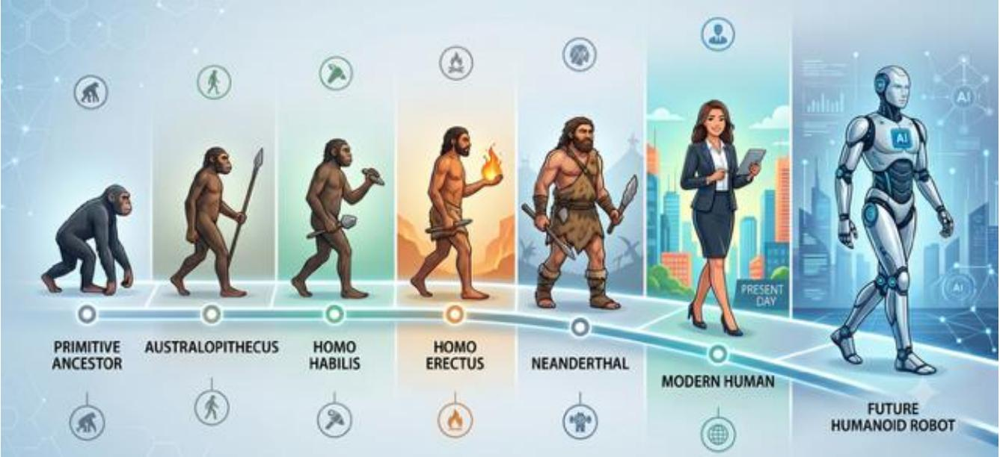

flowchart

```mermaid
graph LR
  A["PRIMITIVE ANCESTOR"] --> B["AUSTRALOPITHECUS"]
  B --> C["HOMO HABILIS"]
  C --> D["HOMO ERECTUS"]
  D --> E["NEANDERTHAL"]
  E --> F["MODERN HUMAN"]
  F --> G["FUTURE HUMANOID ROBOT"]
    
    style A fill:#f9f,stroke:#333
    style B fill:#f9f,stroke:#333
    style C fill:#f9f,stroke:#333
    style D fill:#f9f,stroke:#333
    style E fill:#f9f,stroke:#333
    style F fill:#f9f,stroke:#333
    style G fill:#ccf,stroke:#333
```

Source: JEF

The survivors will not simply be “software companies with AI.” They are the vendors with strong determination on AI transition and have the defensibility to extend the transition window.

## Defensible Software Co.s

- Deep integration in customers' mission-critical business process  
• Control proprietary workflow data and metadata  
• Customers have zero error tolerance  
- Owns deep industry know-how  
- Perform “dirty work” like implementation and customization  
- Requires qualifications to serve the customers  
• Could receive strong economies of scale  
• Do not rely on seat-based pricing model

AI as monetization opportunity

## Vulnerable Software Co.s

• Package generic workflows behind a thin UI  
- Product is highly standardized and can be abstracted by LLMs or agents  
- Adopt the labor outsourcing business model  
- Adopt seat-based pricing model  
- Weak proprietary data/know-how or low integration depth  
• Do not require qualifications to serve customers  
- Model hallucination would not lead to large economic, vital, social damage

AI as replacement risk

Source: JEF

## The Architectural Paradigm Shift: From Software-as-tool to Software-as-digital-labor (1)

Evaluating the structural disruption of generative AI requires understanding the evolution from traditional software/ SaaS to AI agents.  
Traditional Software/ SaaS functioned primarily as a database-backed system of record, essentially serving as a digital filing cabinet coupled with a manual workflow interface.  
Software are designed as tools for human operators. In this legacy model, the human operator served as the primary executor. Human operator needs to interpret data, navigate the user interface (UI), and manually execute discrete tasks.  
We are now transitioning to an AI-native paradigm where software shifts from being a passive tool to an active system of intelligence and action.  
Under this new paradigm, AI agents can autonomously navigate interfaces, interpret complex data, and execute entire workflows with minimal human involvement, thereby transforming the software itself into a digital labor.  
Traditional SW will transition from UI-centric, human-operated systems to API-first, agent-executable workflow platforms. Agents can automate tasks autonomously but still rely on SW APIs for workflows, business logic, and data.

## The Architectural Paradigm Shift: From Software-as-tool to Software-as-digital-labor (2)

Traditional Software/ SaaS  

flowchart

```mermaid
graph LR
  A["System of record"] --> B["UI / dashboard"]
  B --> C["Human operator input"]
  C --> D["Task done"]
    style C fill:#FFD700,stroke:#333
```

AI-native workflow execution  

flowchart

```mermaid
graph LR
  A["Enterprise data"] --> B["Agents<br>plans + calls tools + writes back"]
  B --> C["APIs / tools"]
  C --> D["Outcome"]
```

Value shifts to execution, data context, and measurable outcomes

Source: JEF

## The Evolution of AI Integration: From Copilots to Autonomous Agents

The introduction of generative AI copilots marked the first phase of this architectural shift by embedding conversational assistants directly into existing applications.  
While copilots successfully streamline information retrieval and content generation, they remain fundamentally passive tools that require continuous human prompting and step-by-step oversight.  
The transition to autonomous AI agents represents a far more disruptive paradigm shift because these agents are designed to execute complete, multi-step workflows with minimal human intervention.  
Agents achieve this autonomy through dynamic tool-calling and API orchestration, allowing them to interact seamlessly with external databases, web search, computation and analysis tools, enterprise apps, file editing tools, etc.  
By leveraging long-context reasoning and state preservation, modern agents can self-correct, handle exceptions, and evaluate intermediate outcomes against a final business objective.  
Compared to copilots, agents are more disruptive to software vendors because they directly threatens the manual labor that justifies seat-based pricing.

## UI's Value will be Weakened, But What's Underneath is Still Valuable in Agentic Era

We believe AI will weaken the traditional UI-based software moat because the software user is shifting from human operators to AI agents. Historically, enterprise software was sticky because employees “lived” inside the interface, building habits around specific dashboards, workflows and screens. In an agentic world, this becomes less defensible: agents do not need a browser or a polished dashboard. They need APIs, data access, context, permissions and the ability to execute actions.

As a result, UI is likely to become more of a human control layer rather than the core workflow layer. Humans will still use interfaces to set objectives, approve sensitive actions, monitor exceptions and audit outcomes, but most execution will happen underneath the UI through agent-driven orchestration.

As a result, software architecture will shift from "system of record" to "system of intelligence." Instead of simply storing data and displaying it through UI, AI-native software needs to understand context, coordinate across multiple systems and execute tasks end-to-end.

This requires the business logic layer to shift from human workflow to agent-driven task execution. It also requires open, machine-readable data structures and API-first integration so agents can read, write and act across CRM, ERP, email, payments, documents and internal databases.

Governance becomes a core architectural layer. Software must define which agent can perform which action, on behalf of which user, under what policy, with what approval requirement and audit trail. In this environment, permissioning, and action-level control become more important than UI design.

To sum up, AI reduces the defensibility of UI-centric SaaS, but increases the value of platforms that own business logic, proprietary data, orchestration, governance and the action layer. The future software moat is less about where users click, and more about how agents understand, decide, execute and learn across enterprise workflows.

## The "Seat-Based" Biz Model Disruption Is More Severe In the US than In China

The convergence of generative AI and agentic execution is fundamentally disrupting the pricing models of the software/ SaaS sector.  
In the US, legacy SaaS monetization is directly tied to employee headcount as they charge per seat, meaning that as a customer hires more workers, their software spend increases proportionally.  
However, when software evolves into an autonomous agent that replaces human workers, the manual headcount required to operate the software collapses.  
For example, if a customer support team shrinks from 100 agents to just 10 supervisors managing an AI workforce, a vendor relying purely on seat-based licensing will experience a severe contraction in its addressable revenue base.  
In China, however, most of the software companies adopted a project-based business model, as customers are generally large SOEs that demand heavy systems integration and customization services. These customers are also reluctant to adopt SaaS on public cloud due to data security concerns and difficult budget approvals.  
Even for Chinese SaaS companies, they seldom use a seat-based pricing model and instead tend to price their products on number of modules or functions (e.g. Kingdee and Yonyou).

## AI Will Drive Consumption-based or Outcome-based Monetization from Software

Seat-based pricing works when humans use software. It breaks when agents do the work.

## Per-seat subscription

\- Headcount-dependent
- High seat-loss risk

\- Predictable budget from enterprise customers

## Consumption / credits

- Bills for actions executed  
- Better usage alignment with cost  
- Unpredictable budget from enterprise customers

## Outcome / resolution

- Charges for successful task completion  
- Best link to labor savings  
- Outcome Is hard to define

Source: JEF

## Emerging Software Monetization Frameworks

To escape the seat-based pricing trap, leading enterprise software vendors are actively transitioning toward alternative monetization methods:  
1) Consumption-based and flex-credit models: align software billing directly with the volume of work executed by AI agents. Under these credit architectures, standard automated actions consume fewer credits, while complex reasoning tasks consume more, ensuring vendors are compensated for computational effort. In China, many software companies adopt a consumption-based pricing model.  
2) Outcome-based or resolution-based pricing: represents the highest value-capture model, where customers are charged strictly based on tasks successfully resolved without human intervention. This outcome-based mechanism fundamentally shifts software value from a simple utility license to a direct, highly scalable substitute for human labor. But in China, this model is still in early testing phase.  
3) AI-specific premium SKU bundling: For software suites where seat count remains stable, vendors would offer a premium tier with embedded AI functionality. This would drive higher ARPU to offset potential seat contraction. For example, Microsoft has bundled AI into its Office 365 Suite as copilot and charges a higher-priced seat licenses. In China, Kingsoft Office has followed suite and adopted this pricing strategy.

## AI's Impact on Software Companies' Margins

For software companies, the operational costs of delivering generative AI capabilities could be structurally higher and more capital-intensive than delivering traditional SaaS.  
While traditional software features incur negligible marginal costs and yield extremely high gross margins, generative AI generate large inference cost that scales to inference processing and API calls. Thus, model inferencing would place immediate downward pressure on the gross margins of software vendors.  
To defend their margin profiles, software companies must ensure they possess pricing power that exceeds their underlying inference costs or they need to transfer the inference cost burden to their customers.  
Meanwhile, software companies will also offset these external margin pressures by utilizing AI internally to drive massive corporate cost savings across their own coding, testing, and customer service departments.

## Evaluating Traditional Software Moats in the AI Era

The traditional competitive moats that protect software companies are being tested and reshaped by the capabilities of AI.  
The concept of "professional business processes" may become the strongest moat, as embedding complex, industry-specific workflows and unwritten rules into software creates barriers that AI alone cannot easily replicate.  
Network effects will not disappear because code becomes cheaper; instead, they will strengthen as AI applications connect more users, agents, and service providers into unified collaborative systems.  
However, AI could weaken traditional moats like user-switching cost and scale effects.  
User switching costs could weaken as intelligent tools can now automate complex data migrations and accelerate the transition between competing software vendors.  
Scale effects may also weaken if the software companies need to bear inference cost for customers to use their products.

## Software Incumbents' Moat to Mitigate AI Disruption (1)

Deep Integration in Customer's Business Process: 1) Deep integration creates high switching costs, including operational, compliance, legal, and financial risks. Customers must migrate data, rebuild integrations, retrain users, validate controls, and ensure business continuity. 2) Deeply integrated software often serves as the system of record, storing the authoritative source of truth such as customer records, invoices, contracts, and employee data. AI agents may operate on top of these systems, but still need to interact with them.

Proprietary Data: Software vendors that understand their customers' business logic, historical transactions, approval rules, user behaviors, exceptions, and process bottlenecks can leverage this data to build their own AI agents that deliver more accurate and business-specific outcomes. Once a software platform becomes the official system of record for a customer, it becomes very difficult to replace.

Deep Industry Know-how: Software that encapsulates complex industry logic, unwritten regulatory guidelines, specialized terminology, key pain points, and decades of best practices represents a depth of know-how that is difficult for AI companies to replicate or accumulate.

Zero Error Tolerance/ high compliance critical system : Enterprise software in industries such as finance, healthcare, and industrial manufacturing demands strict compliance and absolute accuracy. When errors occur, customers need an accountable vendor to take responsibility. AI models alone cannot meet this bar, as they remain prone to hallucination and lack guaranteed reliability. Moreover, systems managing high-stakes, regulated data such as payroll, HR, and ERP, require a legally defensible source of truth, strict access controls, and auditor involvement. Replacing these systems could lead to high compliance risks.

## Software Incumbents' Moat to Mitigate AI Disruption (2)

"Dirty Work" of Implementation and Customization: Enterprise IT environments are complex and different. Delivering IT solution often requires huge amount of consultation, implementation, customization and secondary development. AI co.s typically lack the engineering capability to handle this "dirty work".  
Industry Qualifications: In China, SOE and govt customers tend to select IT vendors with high qualifications and trustworthiness. This creates a moat to fend off competition from AI model co.s and startups.  
Economies of Scale: Software co. with strong scale effect could spread the high costs of R&D, regulatory compliance, and infrastructure across a large number of clients, achieving a unit cost that new startups cannot match.  
Revenue Model NOT tied to Seat/ User: Software cos. that price their product based on the number of customer seats or users would face severe contraction pressure on software renewals, as enterprise customers' number of employees shrinks in AI era.  
We believe these moats only buy more time for traditional software companies to make the transition in the AI era. If the software incumbents fail to make the transition, they are still likely to be driven out of the market eventually.

## Software Incumbents with High Risk of AI Displacement

| Labor-Intensive IT Services & Outsourcing: Business models are tied strictly to "billable hours" and engineering headcounts. Advanced code-generation could automate 30%–50% of routine coding, debugging, and testing, causing rapid demand contraction for low-cost manual engineering. AI would lead to severe compression of contract sizes, structural margin erosion, and a forced shift from "selling headcounts" to high-value AI integration consulting. Some vulnerable examples are: Chinasoft International (China), iSoftStone (China), Softtek (Global).

Companies with Seat-Based Pricing Risk: Companies charging by human user seats may face revenue pressure as AI agents automate tasks and reduce the number of employees needed to complete workflows. This is especially relevant in customer support, sales operations and back-office automation.

UI-Centric & "Data Pass-Through" SaaS: Software that merely serves as a functional graphical UI over database operations. As LLM-driven AI agents achieve end-to-end task execution via natural language, users can query and manipulate data directly, bypassing traditional application software screens entirely. AI would lead to massive customer churn for single-feature utilities that lack deep workflow integration, custom logic complexity, or proprietary data moats. Some vulnerable examples are: Formstack / Typeform (Global).

Thin-Wrapper Generative AI Applications: Applications built purely as out-of-the-box API wrappers around foundational LLMs without proprietary architectural moats. Platform giants (e.g., Microsoft, ByteDance) natively embed identical features into core operating environments for free or at zero marginal cost. AI would lead to instant commoditization, loss of product differentiation overnight, and rapid margin collapse due to extreme pricing pressure from hyper-scale foundational models. Some vulnerable examples are: Jasper AI (Global), Otter AI (Global).

JEF Software Coverage Ranking on AI Defensibility

<table><tr><td>Moats to Fend off AI Disruption</td><td>Supcon</td><td>Baosight</td><td>Hundsun</td><td>Yonyou</td><td>Kingdee</td><td>ZWSoft</td><td>Yusys</td><td>Asiainfo</td><td>QiAnXin</td><td>VenusTech</td><td>Sangfor</td><td>Glodon</td><td>Sinosoft</td><td>Chanjet</td></tr><tr><td>Deep Integration in Customer&#x27;s Business Process</td><td>5</td><td>5</td><td>5</td><td>5</td><td>5</td><td>4</td><td>4</td><td>4</td><td>3</td><td>3</td><td>3</td><td>4</td><td>3</td><td>3</td></tr><tr><td>Proprietary Data</td><td>5</td><td>5</td><td>5</td><td>5</td><td>5</td><td>5</td><td>4</td><td>4</td><td>3</td><td>3</td><td>3</td><td>4</td><td>3</td><td>3</td></tr><tr><td>Zero Error Tolerance</td><td>5</td><td>4</td><td>5</td><td>5</td><td>5</td><td>4</td><td>4</td><td>3</td><td>3</td><td>3</td><td>3</td><td>4</td><td>3</td><td>2</td></tr><tr><td>Deep Industry Know-how</td><td>5</td><td>5</td><td>5</td><td>5</td><td>5</td><td>5</td><td>4</td><td>4</td><td>3</td><td>3</td><td>3</td><td>5</td><td>3</td><td>3</td></tr><tr><td>Dirty Work of Implementation and Customization</td><td>3</td><td>4</td><td>1</td><td>5</td><td>4</td><td>1</td><td>4</td><td>3</td><td>4</td><td>4</td><td>3</td><td>1</td><td>4</td><td>1</td></tr><tr><td>Industry Qualifications</td><td>4</td><td>4</td><td>4</td><td>2</td><td>2</td><td>2</td><td>3</td><td>4</td><td>5</td><td>5</td><td>4</td><td>2</td><td>2</td><td>1</td></tr><tr><td>Economies of Scale</td><td>3</td><td>3</td><td>4</td><td>3</td><td>4</td><td>5</td><td>3</td><td>3</td><td>2</td><td>2</td><td>2</td><td>5</td><td>1</td><td>4</td></tr><tr><td>Revenue Model NOT Seat/ User Based</td><td>5</td><td>5</td><td>5</td><td>4</td><td>4</td><td>5</td><td>5</td><td>5</td><td>5</td><td>5</td><td>5</td><td>1</td><td>5</td><td>3</td></tr><tr><td>Total Score</td><td>35</td><td>35</td><td>34</td><td>34</td><td>34</td><td>31</td><td>31</td><td>30</td><td>28</td><td>28</td><td>26</td><td>26</td><td>24</td><td>20</td></tr></table>

Source: Company, JEF  
Source: JEF

## JEF Software Coverage's AI Defensibility and Timeframe of AI Transition

scatterplot

| Company     | Timeframe of AI Disruption | Moats to Fend off AI Disruption |
|-------------|----------------------------|---------------------------------|
| Chanjet     | 3.0                        | 20.0                            |
| Sinosoft    | 4.0                        | 24.0                            |
| Glodon      | 5.5                        | 26.0                            |
| Sangfor     | 6.0                        | 26.0                            |
| QiAnXin     | 6.5                        | 28.0                            |
| VenusTech   | 6.0                        | 28.0                            |
| Asiainfo    | 6.5                        | 30.0                            |
| Yusys       | 7.0                        | 31.0                            |
| ZWSoft      | 7.5                        | 31.0                            |
| Kingdee     | 8.0                        | 34.0                            |
| Yonyou      | 8.5                        | 34.0                            |
| Hudson     | 9.0                        | 34.0                            |
| Baosight    | 9.5                        | 35.0                            |
| Supcon      | 10.0                       | 35.0                            |

Source: Company, JEF Note: Timeframe only shows relative window for AI transition

## Metrics to Evaluate Software Companies' AI Revenue Quality

As most of software co. are still undergoing AI transition, we believe several metrics could help us better evaluate whether a software company's AI monetization is high-quality and sustainable, or merely a defensive, short-term packaging exercise. These critical metrics are:

1) Percentage of a company's total sales or annual recurring revenue (ARR) that is directly tied to AI capabilities/products. This is the most direct metric showing software companies' AI transition.  
2) Whether AI is priced separately as a premium offering/ add-on, or simply bundled for free. If AI features are offered for free to protect existing renewals and prevent customer churn, it might not be a sustainable solution as R&D and inference costs would be difficult to recover.  
3) Pricing model of the AI product. If it is seat-based, it would be prone to value compression as customers' employee number shrinks. If it is usage-based or outcome-based, it will be more align with customer's interest and more scalable.  
4) Paid conversion rates to the overall addressable customer base. This will serve as the clearest leading indicator of genuine enterprise adoption and willingness to pay.  
5) Tracking shifts in net dollar retention will reveal whether a software company is successfully expanding its value by upselling its AI features and products or slowly bleeding revenue due to structural seat-count compression.  
6) Pricing power above its compute and inference costs. Software companies must structure their AI packages via generative credit limits or action based pricing to ensure that customer usage does not cannibalize gross margins.

## CN SW is Less Prone to AI Disruption, but Frail IT Budgets Remain the Headwind; Bullish on KD

■ Most of Chinese software companies adopted a project-based business model that requires vendors to provide lots of customization and system integrations to enterprise clients. Meanwhile, their customers are often SOEs and governments, which requires vendors to have high qualification and are less willing to send data to LLM via cloud API owing to strong compliance.  
As a result, we believe Chinese software companies are generally more resilient to AI disruption compared to US software companies. Among our coverage, industrial SW, financial IT, and ERP are most resilient to AI disruption given deep workflow integration, proprietary data, zero tolerance for hallucination, and strict vendor qualifications.  
We believe the key problem for Chinese software companies is still customers' shrinking IT budget as enterprises cut their expenses/capex amid weak macro environment.  
We believe the sell-off of Chinese SaaS companies like KD provides a good entry opportunity: 1) KD's ERP is deeply embedded in clients' workflows as a system of record, and is costly and risky to replace; 2) KD's proprietary data and industry know-how difficult for AI vendors to replicate; 3) module-based pricing insulates rev from workforce reductions; 4) KD has launched its own AI-native ERP suite and Lingee AIOS, guiding Rmb1.0bn in AI rev for 2026; 5) SaaS now >50% of rev, drives teen% rev growth, GPM expansion, and strong op leverage aided by internal AI-driven cost efficiencies; and 6) valuation at 0.7x 2026E PEG is cheap.

## Supcon

Moat to defend AI disruption: 1) proprietary data: Supcon has accumulated over 100 EB of real-time industrial time-series data over its 30-year history, covering more than 100K DCS systems across various process industries; 2) Mechanistic models & zero hallucination: Supcon embeds over 30 years of accumulated mechanistic models into its TPT model, creating a strict boundary that constraints AI outputs. 3) deep integration in mission critical workflows: TPT forms a closed loop with Supcon's DCS. Replacing the AI model would require production stoppage, testing, and reintegration. In continuous process manufacturing, downtime costs far exceed software subscription costs, effectively locking in customers; 4) Qualification and deep customer trust: Decades of ensuring factory safety have built immense trust, granting Supcon the unique authorization to utilize client data for model training.

| Key AI products: TPT (Time-Series Pre-trained Transformer): The industry's first time-series pre-trained model, functioning as the "brain" of production. It possesses five core capabilities: simulation, control, optimization, prediction, and evaluation that help to solve specific operational problems.

AI rev/ guidance: In 2025, industrial AI generated over Rmb200m in revenue, almost entirely driven by TPT. In Q1 2026, a traditionally weak quarter, AI revenue alone hit Rmb184m. For 2026, company's equity incentive plan locks in a target of Rmb800mn\~1bn in Industrial AI revenue, which management is highly confident in achieving or exceeding. Medium-term targets are set at Rmb20 bn for TPT and Rmb5 bn for robotics.

AI-driven org/ culture change: Supcon launched its “Inferno” cultural strategy to transform into an industrial AI platform co., emphasizing strategic alignment, agile execution, and an innovation-driven workplace. It is reallocating 50–60% of future R&D budgets to AI and addressing hybrid talent gaps through Supcon Academy’s “Bootcamp,” training hundreds of ecosystem partners and clients weekly in AI.

Internal AI adoption and effect: AI Coding: 40%\~50% of the company's R&D code is now generated by AI, drastically shifting the R&D cost structure and allowing pure coders to transition to higher-value design/process roles. Digital Employees: The company deployed over 500 "digital humans" to handle internal tasks such as automated bidding document generation, internal process approvals, PPT creation, and meeting minutes.

## Baosight

Moat to defend AI disruption: Deep integration in critical workflows: Baosight's systems are deeply embedded in complex, heavy industrial environments like steel manufacturing, making its systems risky and hard to be replaced.. Deep proprietary data and deep know how: Decades of managing industrial processes have allowed Baosight to accumulate an exclusive, massive vault of domain-specific data. Co, could use this data to train its own vertical industrial AI solutions. Zero-tolerance for error: Industrial manufacturing operates with a zero-tolerance policy for errors or operational downtime. Because full-scale automation requires absolute precision and proven reliability, clients heavily favor Baosight's solutions.

Key AI products: Baoliandeng Steel Industry LLM: flagship product built on a three-tier architecture (foundation model + industry vertical model + scenario model). AI computing centers & MaaS: leveraging BaoCloud, Baosight operates the largest and most advanced AI computing center in China's steel industry, offering MaaS to clients. Industrial AI agents: 1,000+ agents deployed across production management, equipment maintenance, and quality monitoring. Scenario-specific AI applications: 1,000+ use cases, including blast furnace and converter LLMs, AI master operators, coal/ore blending, safety vision, and surface defect detection. Embodied robots: integrating vision-language-action models into robots for autonomous navigation, stable walking, and production line loading/unloading.

AI rev/ guidance: Baosight does not break out its AI revenue, nor does it provide quantitative revenue guidance for AI. However, Baosight views AI as a critical engine for its "second growth curve". Mgt acknowledges that AI commercialization in the short term remains challenging and a stable profit model is still being explored industry-wide.

AI-driven org/ culture change: Strategic identity shift: the co. is repositioning from a traditional "IT service provider" to an "industrial intelligence leader." Talent restructuring: Baosight has launched multi-phase "AI Talent Training Camps" and "Big Data Talent Training Camps" to build specialized emerging-tech capabilities. Performance and risk mgt: treating AI transition as an existential risk, the company has tied AI R&D milestones to employee performance appraisals to align the organization with its AI transformation goals.

Internal AI adoption and effect: R&D efficiency gain: Baosight embeds AI across the R&D lifecycle through a “human-machine symbiotic collaboration” model to boost engineering and technical team productivity. Reducing implementation costs: the company is rebuilding core legacy industrial software (MES, ERP, APS) with “AI + data intelligence” to enhance product competitiveness and lower project implementation costs. Preventive maintenance & operations: AI is integrated into Baosight’s “4S shop”-style service centers to automate preventive maintenance and accelerate response, while internal AI agents drive cross-organizational collaboration and business-technology integration.

## Hundsun

Moat to defend AI disruption: 1) deep integration in sell-side/buy-side institutions' mission critical business processes (e.g. trading, order management, clearing, etc); 2) possesses deep industry know-how and proprietary data such as hidden risk control rules in O32; 3) financial institutions have zero-tolerance on model hallucination. Hundsun builds private knowledge base that integrated with RAG to ensure accuracy. 4) strong engineering execution capabilities and scale effects ensure it can deliver complex, compliant and stable solutions that clients cannot easily self-develop

Key AI products: Hundsun has built a comprehensive AI matrix spanning from foundational models to AI applications. The company developed LightGPT, a proprietary financial LLM fine-tuned specifically for financial data, logical reasoning, and compliance. It also launched Guangzi AI middleware platform, that integrates LightGPT with top-tier external open-source models. On the app side, key products include the WarrenQ intelligent investment research platform, Xiaofan intelligent wealth components. Hundsun is transforming its core products (O45, UF3.0) into AI-friendly software by adding conversational interfaces. Its data subsidiary, Hundsun Juyuan, is pioneering AI-friendly databases that offer MCP subscriptions, allowing AI agents to directly use Hundsun's financial data.

AI rev/ guidance: Hundsun's AI commercialization is still in its early stages. As of 2025, AI-related revenue was in the tens of millions of RMB, still a small proportion of total revenue. Company has not provided a specific AI revenue target.

AI-driven org/ culture change: Co. adopted a core strategic philosophy of “internalizing AI in mind, empowering with AI in action”. Mgt enforced a strict top-down approach to drive internal AI adoption. Employees who cannot adapt to using AI tools will be gradually phased out. This culture pushed R&D, delivery, and customer service teams to integrate AI into daily workflows.

Internal AI adoption and effect: Hundsun relies on AI coding to drive internal efficiency. The company requires its developers to use AI for code generation and has moved beyond basic trials to tracking the proportion of AI-generated code across departments, with plans to monitor token usage at the individual employee level.

## Yonyou

Moat to defend AI disruption: 1) Deep customer workflow integration: Yonyou (YY) is embedded across supply chain, inventory, finance, etc., becoming a system of record that is risky and difficult to replace. 2) YY possesses 35+ years of industry know-how, complete business process knowledge, and a massive accumulation of enterprise data. Yonyou's capability to orchestrate AI to strictly follow an enterprise's organizational rules, compliance requirements, and specific workflows acts as a significant barrier to entry.

Key AI products: YY's AI offerings are built around the Yonyou BIP Enterprise AI matrix, including: 1) YonGPT & YonLOM: domain-specific business LLMs that understand enterprise semantics, support reasoning, and turn business capabilities into reusable AI "skills"; 2) YonMate: AI agents/digital employees using multimodal interaction to complete tasks across finance, HR, supply chain, and other domains; 3) YonKnow: a RAG-based knowledge management platform that converts enterprise data into knowledge graphs for reliable Q&A and support; 4) YonBI: LLM-powered analytics that enables natural-language visualization and business insight generation.

AI rev/ guidance: In 2025, YY's AI-related contract value reached RMB1.67bn, with multiple individual contracts exceeding RMB10m. For 2026, YY expects revenue growth to significantly accelerate, driven by core product Yonyou BIP, and an acceleration in AI orders. The company's primary financial goal for 2026 is to drastically reduce losses and strive for annual profitability.

AI-driven org/ culture change: The company is pushing a culture of comprehensive AI adoption, requiring all employees across R&D, business. YY is actively reducing low-end, repetitive roles (such as basic coders, manual testers, and customer service staff) and increasing the proportion of high-level AI talent, such as prompt engineers, AI trainers, and intelligent agent developers,. Total headcount is being strictly controlled and optimized for output, rather than scale,.

Internal AI adoption and effect: 1) R&D efficiency gain: Yonyou utilizes AI coding assistants for code generation, debugging, and automated testing. This has successfully reduced unit test case writing time by over 60%, improved code consistency, and allowed senior architects to replace low-end coders. 2) Delivery & Implementation: By automating implementation workflows with AI, delivery costs for AI-centric projects have been reduced to roughly 1/3 of traditional ERP projects, and some new projects have seen a 40% efficiency boost in delivery. 3) Customer Service & Operations: YY has deployed over 2,000 "digital employees" across its internal departments. Its AI-powered customer service bots provide 24/7 responses and have reached an independent reception rate of nearly 80%, directly allowing the co. to reduce its human customer service headcount and lower operating costs.

## Kingdee

Moat to defend AI disruption: 1) Deep customer workflow integration: Kingdee (KD) is embedded across supply chain, inventory, finance, etc., becoming a system of record that is risky and difficult to replace. 2) Deep industry know-how: With 30+ years serving 7.4mn+ enterprises, KD has built broad expertise in financial/tax compliance, global supply chain management, and complex manufacturing. 3) High-quality enterprise data governance: Private enterprise operating data has high privacy and security barriers, limiting LLM access. KD's advantage lies in balancing data desensitization with model training and handling dynamic business data changes. 4) Absolute consistency in core business logic: Finance and supply chain systems cannot tolerate LLM hallucinations. KD uses traditional ERP's strict rule and computing logic, encapsulated via APIs and Skills, as a safety net for reliable AI execution. 5) Data flywheel: KD uses a "standardized object model + scenario atomization" approach, where each AI execution generates structured feedback that refines models, rules, and industry knowledge graphs, creating a self-reinforcing loop.

| Key AI products: 1) Lingee: is positioned as a comprehensive enterprise AI OS, similar to Claude Cowork. Its primary function is to act as the connective layer between human employees, AI agents, and ERP systems, creating a platform that could automate complex corporate tasks. 2) AI ERP suites: is an all-in-one, integrated solution that bundles standard ERP SaaS, agents and end-to-end data governance.

AI rev/ guidance: In 2025, KD's AI-related contract value reached RMB356m. In 2026, KD has set a full-year AI rev target of RMB1bn. In 1Q26, KD newly signed RMB230m in AI suite contracts. By 2030, the co. targets a total revenue scale of around RMB14bn, with 50% coming from AI-enhanced SaaS, 50% from AI native products.

AI-driven org/ culture change: KD accelerated its organizational restructuring frequency from once a year to once a quarter or even monthly. Internally, employee performance and rewards are now heavily tied to AI adoption. As AI coding tools mature, the number of basic coding personnel is being reduced, while the number of high-end talent, such as AI product experts, algorithm engineers, and data scientists is increasing.

Internal AI adoption and effect: 1) R&D efficiency gain: Currently, 41% of newly added code is generated by AI, which has shortened R&D delivery cycles by 21%. Internal metrics show an optimized ROI where one AI developer, equipped with premium pay and token allowances, can match the output of 10 traditional developers. 2) Delivery efficiency gain: AI tools has boosted project delivery efficiency by 20%\~30%. The standard delivery cycle has been shortened from 100 days to 70-80 days, allowing the existing implementation workforce to take on more projects. 3) Cost mgt: KD is undergoing a massive workforce optimization. Headcount is projected to be reduced from \~12K at the beginning of 2025 to <10K by the end of 2026

## ZWSoft

Moat to defend AI disruption: Proprietary core technology: ZWSoft owns the Overdrive 3D geometric modeling kernel, the foundational root technology for its industrial software, with complex mathematical and topological algorithms that AI cannot easily replicate. Domain-specific data and architecture: ZWSoft uses AI to reinforce its moat, focusing on core professional domains like 3D modeling architecture and design intent understanding. Industry know-how and proprietary data: Industrial software requires deep integration of AI with industry experience, knowledge graphs, and technical specifications. ZWSoft leverages its industrial data and proprietary 3D data formats to build CAD vertical large models, creating barriers pure AI players cannot easily overcome.

Key AI products: Educational AI Products: ZWSoft offers "3D One AI", an artificial intelligence 3D simulation software designed to assist in ubiquitous AI teaching and competitions for primary and secondary school (K-12) innovation education. AI Functionality: ZWSoft has successfully embedded a series of AI-assisted features into its flagship ZWCAD and ZW3D products. These include intelligent command recommendation and prediction, multi-modal model retrieval (supporting models, pictures, and text), similar graphic retrieval, natural language specification retrieval, smart annotation, one-click drawing generation, and automated machining trajectory generation. AI Capability Building: The co. is currently developing CAD vertical large models and intelligent agents (ZW3D AI Copilot) that deeply understand design intent, possessing generative modeling and real-time simulation capabilities.

AI rev/ guidance: Co. did not disclose AI related revenue. However, mgt indicate that AI is a core driver for the co.'s overall commercial growth. By continuously delivering high-value AI features, ZWSoft significantly enhances user efficiency, which forms a differentiated competitive advantage intended to accelerate the replacement of foreign competitors. Guided by these product breakthroughs (including AI integrations), mgt targets a 15%-20% CAGR in the commercial market over the next few years, aiming to return the company to a double-digit growth trajectory.

AI-driven org/ culture change: Talent Acquisition: The co. has significantly increased its R&D investment specifically in the AI domain, bringing in a new batch of specialized AI professionals. It remains committed to recruiting high-end AI talent to drive continuous technological breakthroughs.

Internal AI adoption and effect: In 2025, ZWSoft extensively utilized AI tools within its R&D teams to automate routine workflows. This drastically reduced the time spent on daily coding, code reviews, software development, and document generation. By gradually realizing R&D process automation, the internal application of AI has directly contributed to the co.'s notable improvements in operational efficiency and cost mgt.

## Yusys

Moat to defend AI disruption: 1) deep integration in customer's workflow such as loan management, core trading system, risk management, 2) possesses proprietary data and deep "know-how" of complex financial scenarios, extensive private closed-loop data, and the crucial ability to deeply embed AI into local business workflows. 3) bank customers have zero tolerance for error.  
Key AI products: 1) credit & risk mgt: AI native transformation from rule-driven to model-driven systems, featuring AI agents for smart due diligence, intelligent credit approval, and automated post-loan collection. 2) data & knowledge lake: upgrading traditional data warehouses to "Knowledge Lakes" that store expert knowledge as Skills for AI agents. 3) regulatory & marketing: Intelligent regulatory reporting assistants for policy interpretation and data tracing, as well as AI marketing agents for precise customer targeting and private domain operations.  
AI rev/ guidance: By 2025, AI-related revenue surged to Rmb200m, encompassing AI hardware, software, and Agent businesses. Mgt has provided strong forward guidance, targeting Rmb400m-500m+ in AI revenue for 2026, supported by rapid order growth in Q1 2026.  
AI-driven org/ culture change: Culturally, mgt enforced a strict "reduce staff first, then incentivize" logic, demanding that all employees leverage AI tools to enhance productivity, while explicitly optimizing out staff who failed to adapt. Structurally, this allowed the company to proactively shrink its overall headcount from historical peaks down to \~9,500 employees by late 2025, shedding low-end delivery roles while hiring high-end AI talent, reasoning experts, and banking business specialists.  
Internal AI adoption and effect: Yusys used AI coding tools to drastically improve R&D and engineering efficiency. Tasks that previously required a senior developer a full day can now be completed by a junior developer in half a day. In operational tasks, such as data classification and grading for bank assets, AI integration reduced processing time from three days down to just one day. Because of this internal AI empowerment, Yusys achieved a remarkable 18% yoy increase in per capita revenue and per capita profit in Q1 2026, successfully decoupling its revenue growth from linear headcount expansion.

## Asiainfo

Moat to defend AI disruption: Proprietary Delivery Toolsets: Asiainfo has developed comprehensive AI delivery toolsets. These tools currently boost human delivery efficiency by 30%, with expectations to reach 60% as project data accumulates. Ecosystem partnership with Alibaba: The co. is the leading partner in Alibaba's large-model ecosystem and the only non-invested enterprise partner in its capability center. Data governance: The co.'s decades of experience handling massive telecom data provides it with a distinct edge in data governance and privacy, a critical prerequisite for enterprise AI deployment.

Key AI products: Vertical Large Models and Platforms: The core offering is the "Yuansi" industry large model product suite, which features 2 large model platforms, 5 vertical large models, and multiple intelligent agent tools. The company also rolled out a Digital Intelligence Ontology Platform and co-developed a hundred-bn-param multimodal vertical large model for power equipment diagnosis alongside Alibaba Cloud. AI All-In-One Machines: In cooperation with Alibaba, Asiainfo provides AI all-in-one machines that integrate self-developed software, OS, and open-source models for secure, localized private deployments. BSS/OSS AI Upgrades: Asiainfo incorporates intelligent agents into traditional telecom IT systems to automate customer service, generate tailored telecom plans, and remotely optimize network antenna signals.

AI rev/ guidance: For the AI delivery business specifically, the company achieved RMB200mn-300mn in orders and over RMB100mn in recognized revenue in 2025. In 2026, AI delivery orders are expected to reach RMB500mn-600mn, with revenue climbing to RMB200mn-400mn. By 2028, the company expects the AI business to mature with orders reaching RMB1bn.

AI driven org/ culture change: The co. instituted an "AI First" strategy for the next decade. Structural Optimization: To align with this new strategy, the company transformed its workforce structure from an "olive shape" to an "inverted pyramid". Headcount Reduction: This reorganization involved optimizing \~1,500 personnel in the first half of 2025, primarily trimming the traditional ICT workforce. The remaining and newly hired workforce is expected to consist of highly efficient, composite product managers and delivery engineers capable of navigating cross-functional AI environments.

Internal AI adoption and effect: Software development and coding: Co. uses open-source models to streamline coding workflows and has built SDLC intelligent agents to accelerate R&D, expected to lift overall R&D productivity by 20–30%. Back-office automation: AI is integrated across internal functions, including HR recruitment, contract management, and taxation. Overall efficiency impact: AI-driven automation of repetitive tasks has improved daily administrative and operational efficiency by 10–15%, supporting refined cost control.

## QiAnXin

Moat to defend AI disruption: 1) High qualifications to enter the industry as customers are many key SOEs (e.g. energy, finance, telecom), govt, military bodies. 2) Need to provide customization catering to customers' need. 3) deep industry know-how and proprietary data: LLM vendors lack the specific cybersecurity domain knowledge required to understand complex industry scenarios, and their models typically only discover surface-level logic vulnerabilities. In contrast, QAX trains its vertical models using a massive, proprietary repository of real-world attack/defense data and threat intelligence accumulated from serving critical infrastructure and govt clients.

Key AI products: 1) AI for Security (Upgrading traditional products): The core engine is co.'s QAX-GPT Security Model. Key products include the AI SOC and AI Tianyan, which act as virtual security experts to automate the triage of massive alert volumes, replacing a significant portion of manual operational work. It also features Code Guard, which detects vulnerabilities in AI-generated code and dominates the domestic market. 2) Security for AI (Protecting AI usage scenarios): This segment addresses the new risks introduced by generative AI (e.g., data leaks, prompt injection). The flagship product is LLM Guard, which helps enterprises securely govern their internal use of LLMs and ensure compliance.

AI rev/ guidance: QAX does not currently provide standalone revenue figures for its AI products at the group level. In early 2026, the co. spun off its entire AI business into a dedicated AI subsidiary.

AI-driven org/ culture change: AI Subsidiary Spin-off: Established in Feb 2026, this subsidiary isolates AI operations from the traditional security business. This prevents internal conflicts, allows for agile, AI-appropriate KPI mechanisms, and facilitates the introduction of strategic external investors who can bring necessary computing power and model ecosystem resources. 2) The "Four Major War Zones" Reform: QAX restructured into a "4+1" industrial architecture. This architecture deliberately separates standardized product R&D ("1") from customized client services (the "4" frontline product market BGs). By embedding tech experts, sales, and service teams together within these war zones, QAX can rapidly deliver complex, scenario-specific AI solutions directly to clients.

Internal AI adoption and effect: Internally, QAX utilizes AI to drive R&D efficiency and cost savings. The co. actively encourages developers to use AI coding assistants. Currently, 50%+ of new code at the co. is generated by AI, and these tools are utilized by over 72% of R&D personnel.

## Venustech

Moat to defend AI disruption: 1) High entry qualifications: customers include key SOEs (energy, finance, telecom), govt, and military bodies. 2) Deep customization required to meet client-specific needs. 3) Industry know-how and proprietary data: LLM vendors lack cybersecurity domain expertise and typically detect only surface-level vulnerabilities, while Venustech (VT) trains vertical models on a large proprietary repository of real-world attack/defense data and threat intelligence. 4) Strategic backing from China Mobile: As a CM subsidiary, VT gains access to qualifications, models, computing power, data, and 5G/cloud scenarios that native AI startups cannot easily replicate.

| Key AI products: 1) AI for Security: focuses on upgrading existing traditional security products with AI to enhance efficiency. The core engine is the Tianhe/Taihe Security Large Model, which drives the intelligent transformation of the co.'s portfolio. This model powers the Anxing Agent Matrix, integrating AI into situational awareness, threat intelligence, and data security. 2) Security for AI: This targets the new vulnerabilities introduced when enterprises adopt AI models. VT pioneered this space with its "New Three Pieces" which includes the Model Application Firewall (MAF) to block AI-specific attacks like prompt injections, the LangChain Gateway for secure isolation of AI agent frameworks, and the LangChain Security Scanner/Endpoint Security for vulnerability assessments.

AI rev/ guidance: 1) AI for Security rev: Mgt does not disclose isolated revenue targets for this segment because AI capabilities are deeply embedded across all existing product lines and services. 2) Security for AI rev: In 2025, new orders for AI app security products reached Rmb10+m. Momentum is accelerating rapidly; in Q1 2026, the signing volume for the AI Application Firewall alone surpassed the entire year of 2025. The co. has refrained from giving a precise AI revenue target in 2026.

AI-driven org/ culture change: VT's culture has evolved to embrace AI tools comprehensively, not just within R&D, but extending to pre-sales technical teams, back-office development. Organizationally, the co. has directly linked AI adoption to performance evaluations.

Internal AI adoption and effect: R&D Efficiency Gains: VT achieved a \~100% coverage rate of AI coding tools among its R&D staff. This has drastically accelerated development, improving overall R&D efficiency by over 25%-30%. For new products, AI-generated code now accounts for 70%-80% or more of the codebase, to the extent that some front-end engineering roles no longer require manual coding. Cost Reduction: implementation of AI coding effectively absorbed the workload pressure resulting from a \~14% reduction in the company's total headcount in 2025. Furthermore, the operational cost to sustain this AI integration is minimal; mgt noted that the API token expenses for large models have a negligible impact on corporate profit margins.

## Sangfor

Moat to defend AI disruption: : 1) High qualifications to enter the industry as customers are many key SOEs (e.g. energy, finance, telecom), govt, military bodies. 2) Need to provide customization catering to customers' need. 3) High-Quality Proprietary Data & Domain Expertise: SF leverages its years of accumulated, high-quality cybersecurity data, computing power, and specialized talent to train vertical-specific models.

Key AI products: Security GPT: As the first enterprise-level security LLM in China, it has iterated to version 3.0 (an anti-phishing model with over 98% accuracy) and version 4.0 (a data security model for automated data classification and risk analysis). AI compute platform: An all-in-one private platform for large model training and inference. It helps customers manage heterogeneous GPU computing power, orchestrate models, and reduce inference costs by up to 50% while boosting performance by 5x. AI in Cloud Infrastructure: Sangfor's HCI and cloud platforms utilize "AI Run" for intelligent CPU/resource scheduling and "AIOps" for predicting hardware faults days in advance. AI in Networking: The co. introduced "All-Network Intelligence 2.0" for enterprise wireless networks, featuring new Wi-Fi 7 hardware with built-in independent AI chips for intelligent network operations and maintenance.

AI rev/ guidance: Mgt did not disclose standalone revenue figures or specific quantitative guidance for AI products.

AI-driven org/ culture change: "AI First" Strategy: SF has officially adopted "AI First" as its core R&D and innovation strategy, embedding AI capabilities across its entire product lineup to upgrade its product and service capabilities. Strategic Repositioning: The co. is transforming its core identity from a traditional network security vendor into an AI infrastructure provider. Talent Acquisition Shift: organizational recruitment has pivoted toward high-potential, specialized AI talent.

Internal AI adoption and effect: Internal R&D and Operations: Mgt noted that they are using GPT models internally to enhance efficiency, which allows them to reduce the headcount needed for routine security operations and better focus their production lines. Customer Service Automation: SF has integrated AI into its technical support services by deploying AI assistants and chatbots (via platforms like WeChat). This digital, self-service infrastructure helps customers generate technical support solutions automatically, significantly improving service efficiency and reducing the burden on human support staff.

## Glodon

Moat to defend AI disruption: 1) Deep integration in critical workflow like construction cost and quantity estimation. 2) Low tolerance of error: Construction industry has extremely low error tolerance and requires strict adherence to business workflows and regulations. 3) Proprietary data and industry know-how: Glodon has vast amount of proprietary industry data and know-how. The co. possesses millions of 3D standard architectural components, layout data, and real-time IoT data collected directly from construction sites.

AI products: Glodon has integrated AI across its product matrix, anchored by its proprietary construction LLM AecGPT. Key commercialized AI products are: Digital Design: the Concetto AI platform automates early-stage planning, eliminating 70–80% of repetitive work and improving rendering and site layout efficiency by 10–20x; Digital Cost & Bidding: AI tools for one-click quantity extraction, automated bill-of-quantities analysis and quota mapping, and AI bidding/clearing to improve pricing accuracy; Digital Construction: PMSmart serves as an AI decision platform that aggregates scheduling, material, and labor data to optimize project profitability, while CV models support hazard identification and enable L4 autonomous tower cranes.

AI rev/ guidance: In 2025, Glodon's AI-native revenue reached \~RMB100mn\~150mn. Mgt expects AI to become a critical growth engine with a rapid growth trajectory as new products launch in 2026. AI driven org/ culture change: Dual-engine organizational structure: In 2026, Glodon split its AI operations into the AI Engineering Department (commercializing mature AI for near-term revenue) and the AI Research Institute (focused on long-term foundational algorithms such as 2D/3D spatial modeling). Workforce restructuring: The company reduced back-end staff by 10% and expanded front-line, customer-facing roles by 10%, transitioning developers into Front-end Deployment Engineers (FDEs) who embed at client sites for business modeling and value delivery, while AI handles back-end coding and processing. Cultural shift: Glodon launched a company-wide "Embrace AI, Apply AI" initiative to make AI usage pervasive across all levels, elevating organizational intelligence and efficiency.

Internal AI adoption and effect: R&D efficiency: Company-wide AI coding tools have boosted individual R&D efficiency by 30–50%, transforming the entire software engineering process from requirements to testing. Margin expansion: AI-driven low-code tools allow non-programmers to deliver customized POCs in 2–3 days, cutting implementation costs and supporting a “zero-code” vision, driving higher GPMs. Sales and operations: AI-driven customer evaluation and digital tools raised sales delivery efficiency by 15% and total sales efficiency by 30%, while enabling strict expense controls.

## Sinosoft

Moat to defend AI disruption: Provision of customization work: Sinosoft needs to provide lots customization to its large customers in different industries. This is labor intensive and difficult to be replaced by agents.  
Key AI products: Sinosoft's core offering is the vertical MaaS platform, which integrates external LLMs with clients' internal data and environments. Based on this platform, they deliver diverse AI solutions across multiple verticals: Insurance: AI-assisted pre-underwriting, intelligent claims processing, AI sales assistants/intelligent training, pricing assistance, and automated risk control. Medical & Healthcare: Multi-agent medical auxiliary diagnosis systems, AI-driven epidemic monitoring and early warning, and intelligent immunization services. Govt & Others: Intelligent official document processing, smart law enforcement systems, and AI-assisted emergency mgt. IT Infrastructure: Intelligent IT Operations for complex system maintenance, AI-assisted Low-Code platforms, and automated testing tools.  
AI rev/ guidance: Currently, direct revenue contribution from AI projects remains small, as both Sinosoft and its clients are in pilot testing and infrastructure preparation phases. AI is primarily monetized through project-based technical service fees. Looking ahead, management is optimistic that recovering IT budgets and maturing AI technology will make AI-driven software upgrades a core growth engine  
AI-driven org/ culture change: AI is transforming Sinosoft's engineering culture toward "Harness Engineering", with engineers shifting from traditional coding to designing data structures, guiding AI agents, and validating AI outputs. The co. hosts frequent internal AI conferences and competitions to share best practices, which supports its "Amoeba" structure and enables bottom-up innovation.  
Internal AI adoption and effect: Efficiency gain: Efficiency gain: Sinosoft uses AIGC tools internally to auto-generate code, draft technical documentation, and run AI-driven QA and automated testing, delivering significant efficiency gains and structural cost reductions. Profitability improvement: Higher per-capita productivity has allowed Sinosoft to keep headcount flat or reduced even as revenue stabilizes or grows, lowering rigid labor costs while preserving delivery capacity, supporting gross margins and operational leverage.

## Chanjet

Moat to defend AI disruption: Proprietary Data and Industry Know-how: Chanjet possesses deep industry know-how and proprietary data on finance and taxation accumulated over years, creating a formidable barrier that AI startups cannot easily replicate in the short term.

| Key AI products: Yi Bao Shui: An AI-native, fully automated bookkeeping and tax-filing product designed for micro-enterprises and accounting agencies. It leverages general models alongside Chanjet's specialized finance/tax models and rule engines to automate tax processes, increasing efficiency by up to 30x compared to manual operations and achieving an accuracy rate of over 98%. AI Agents: The co. has released over 58 enterprise mgt AI agents. Popular agents include AI financial report interpretation, AI bookkeeping tutoring, and intelligent billing. Chang Longxia: A dynamic orchestration agent product that enables cross-system automated operations and autonomous evolution. It can be accessed directly via third-party office platforms like DingTalk and Feishu. Xiao Chang: A unified AI assistant providing natural language interaction for knowledge Q&A, product interaction, and data querying.

AI rev/ guidance: Mgt has set a target for AI-related products to account for over 50% of total revenue within the next three years. This 50% target will be comprised of: 1) Direct sales of tokens from the Chang Longxia product; 2) Revenue sharing from standardized AI skills integrated into ecosystem platforms (like DingTalk/Feishu) based on API calls; 3) Revenue from the next-generation intelligent ERP (SaaS) products that are deeply integrated with AI agents.

AI-driven org/ culture change: Shift to AI Employees: The core organizational trend is to increase the proportion of digital employees while gradually reducing the number of human employees. In 2026, the company plans to advance the optimization of routine and auxiliary roles, including outsourced staff and interns, as AI assumes more of the operational workload. Empowering Core Staff: By using AI digital employees to handle preliminary tasks (like screening business leads), human product and sales experts are freed up to focus entirely on high-value tasks such as closing deals and upselling.

Internal AI adoption and effect: R&D Efficiency: By the end of 2025, over 80% of new code was generated by AI, with a one-time adoption rate of 40%-60%, boosting overall R&D efficiency by over 50%. Customer Service Automation: AI handles \~50% of all customer service inquiries, effectively doubling human efficiency in customer support. Sales & Marketing Optimization: The direct sales team achieved a 56% growth in subscription rev in 2025 with almost zero additional headcount, relying heavily on AI digital employees for lead generation and screening. Cost Control: Chanjet successfully kept its OPEX growth rate under 10% in 2024 and 2025, with clear plans to further compress costs in 2026.

## China's AI Models: Narrowing Performance Gap vs US, with Strong Agentic Capabilities

## Chinese Models Continue to Offer Superior Value for Performance vs. the US Peers

Hyperscalers' Capex - China vs. US (US\$Bn)  
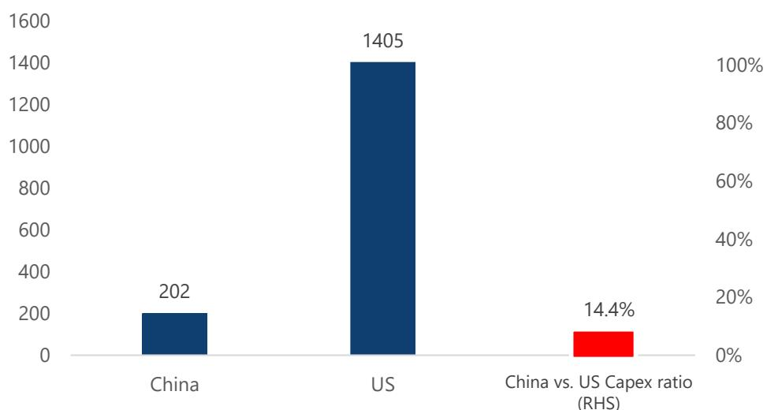

bar chart

| Country/Region | Value |
| :--- | :--- |
| China | 202 |
| US | 1405 |
| China vs. US Capex ratio (RHS) | 14.4% |

Source: Company, JEF; Note: 1) Chinese hyperscalers  
Alibaba+Baidu+Tencent+Bytedance+Netease+JD+Kuaishou+Meituan+Bilibili+PDD+Trip.com+Kingsof  
t Cloud. US hyperscalers = AWS+MSFT+GOOGL+META. 2) capex = 2023A+2024A+2025A+2026JEFe)

Frontier Model Price (USD/Mn Tokens)  
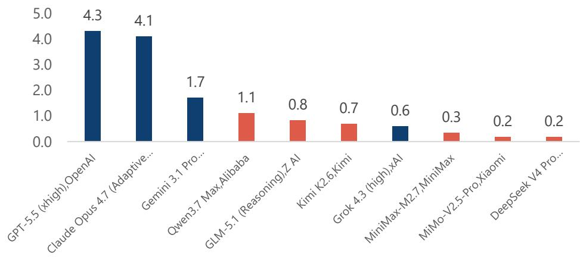

bar chart

| Model | Score |
| :--- | :--- |
| GPT-5.5 (xhigh),OpenAI | 4.3 |
| Claude Opus 4.7 (Adaptive...) | 4.1 |
| Gemini 3.1 Pro... | 1.7 |
| Qwen3.7 Max,Alibaba | 1.1 |
| GLM-5.1 (Reasoning),Z AI | 0.8 |
| Kimi K2.6,Kimi | 0.7 |
| Grok 4.3 (high),xAI | 0.6 |
| MiniMax-M2.7 MiniMax | 0.3 |
| MiMo-V2.5-Pro,Xiaomi | 0.2 |
| DeepSeek V4 Pro... | 0.2 |

Source: Artificial Analysis, Companies, JEF; Note: Price per token, represented as USD per million  
Tokens. Price is a blend of Cache & Input & Output token prices (7:2:1 ratio). As of May 2026

Frontier Language Model Intelligence China vs. US  
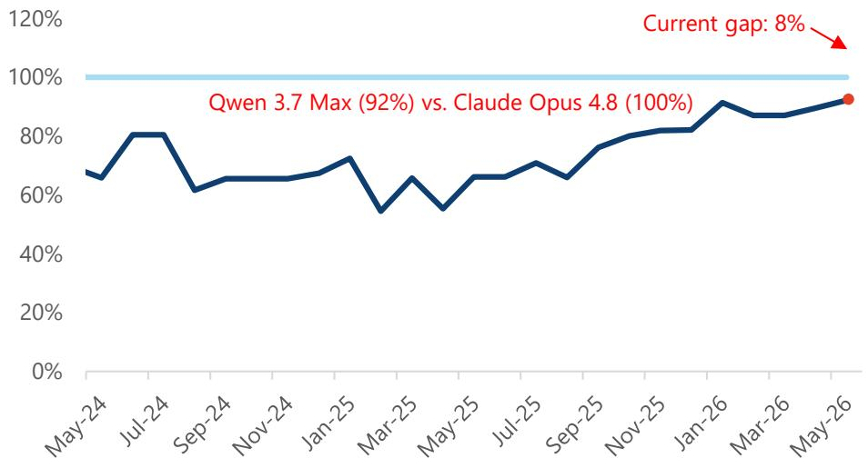

line chart

| Date    | Value |
|---------|-------|
| May-24  | 65%   |
| Jul-24  | 80%   |
| Sep-24  | 60%   |
| Nov-24  | 65%   |
| Jan-25  | 70%   |
| Mar-25  | 55%   |
| May-25  | 65%   |
| Jul-25  | 70%   |
| Sep-25  | 65%   |
| Nov-25  | 80%   |
| Jan-26  | 85%   |
| Mar-26  | 85%   |
| May-26  | 90%   |

Source: Artificial Analysis, JEF Footnote: US frontier model intelligence as benchmark (100%)

Frontier Model Price - US vs. CN Constant Methodology Price  
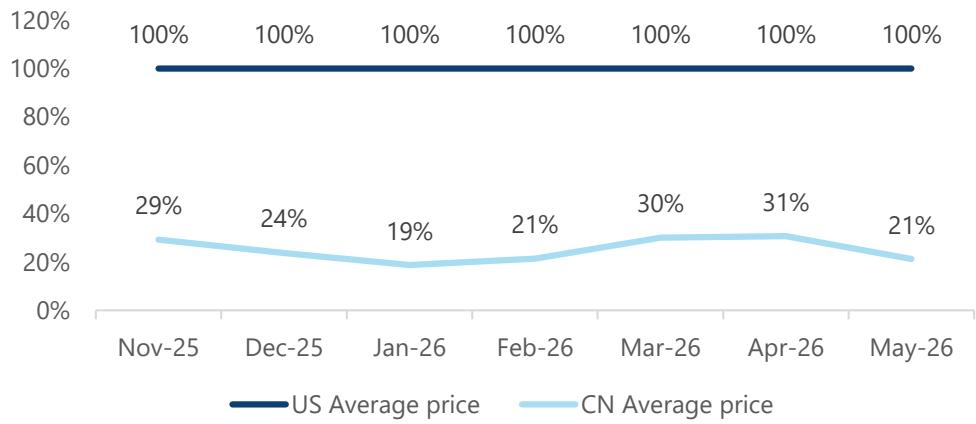

line chart

| Month    | US Average price | CN Average price |
| -------- | ---------------- | ---------------- |
| Nov-25   | 100%             | 29%              |
| Dec-25   | 100%             | 24%              |
| Jan-26   | 100%             | 19%              |
| Feb-26   | 100%             | 21%              |
| Mar-26   | 100%             | 30%              |
| Apr-26   | 100%             | 31%              |
| May-26   | 100%             | 21%              |

Source: Companies, Artificial Analysis, JEF; Note: Mode price is calculated by averaging each vendor's flagship model price in each month

## Intelligence Score is Generated Using Comprehensive Benchmarks

■ Artificial Analysis is an independent company that evaluates models and generates 'intelligence scores' using comprehensive benchmarks. OpenAI, Google, and Anthropic's models now dominate the majority of benchmark tests.

<table><tr><td colspan="2">Artificial Analysis Benchmark Tests</td><td>Description</td><td>Top 3</td></tr><tr><td rowspan="2">Agents (25%)</td><td>GDPval-AA - 16.7%</td><td>GDPval-AA is Artificial Analysis&#x27; evaluation framework for OpenAI&#x27;s GDPval dataset. It tests AI models on real-world tasks across 44 occupations and 9 major industries (based on an Elo system)</td><td>GPT, Claude, Gemini</td></tr><tr><td> $\tau^2$ -Bench Telecom - 8.3%</td><td>A dual-control conversational AI benchmark simulation technical support scenarios, examines AI model&#x27;s ability to coordinate actions (with user) to resolve telecom service issues.</td><td>Grok, GLM, DeepSeek</td></tr><tr><td rowspan="2">Coding (25%)</td><td>Terminal-Bench Hard - 16.7%</td><td>An agentic benchmark evaluating AI capabilities in terminal environments through software engineering, system administration, and data processing tasks</td><td>GPT, Claude, Gemini</td></tr><tr><td>SciCode - 8.3%</td><td>A scientist-curated coding benchmark featuring genuine laboratory problems across 16 scientific disciplines</td><td>Gemini, GPT, Claude</td></tr><tr><td rowspan="3">General (25%)</td><td>AA-LCR - 6.25%</td><td>Artificial Analysis Long Context Reasoning (AA-LCR) measuring AI models&#x27; ability to extract, reason about, and synthesize information from long-form documents ranging from 10k to 100k tokens</td><td>GPT, Mimo, Gemini</td></tr><tr><td>AA-Omniscience - 12.5%</td><td>AA-Omniscience is a knowledge and hallucination benchmark that rewards accuracy, punishes bad guesses and provides a comprehensive view of which models produce factually reliable outputs</td><td>Gemini, Claude, GPT</td></tr><tr><td>IFBench - 6.25%</td><td>A benchmark evaluating precise instruction-following generalization, focus on models&#x27; ability to follow specific output requirements</td><td>Grok, Qwen, Mimo</td></tr><tr><td rowspan="3">Scientific Reasoning (25%)</td><td>Humanity&#x27;s Last Exam - 12.5%</td><td>A frontier-level benchmark with questions across mathematics, sciences, and humanities, designed to be the final closed-ended academic evaluation</td><td>Gemini, GPT, Muse Spark</td></tr><tr><td>GPQA Diamond - 6.25%</td><td>The most challenging 198 questions from GPQA, examines the model&#x27;s ability in complex reasoning and professional knowledge</td><td>Gemini, GPT, Qwen</td></tr><tr><td>CritPt - 6.25%</td><td>CritPt evaluates language models on solving unpublished, frontier-level physics problems that require genuine research-scale reasoning</td><td>GPT, Gemini, Qwen</td></tr></table>

Source: Artificial Analysis, JEF

## US Models Still Lead on AA's Model Ranking While Qwen is Now No.4 Globally & No.1 In China

In May, NOT many top model vendors rolled out major new model updates, Anthropic's Claude Opus 4.8, OpenAI's GPT 5.5, and Google's Gemini 3.1 Pro remain top 3 on Artificial Analysis' (AA) model intelligence ranking.  
- Alibaba is the only major Chinese player to have released a new flagship model in May: Qwen 3.7 Max, which surpassed Moonshot's Kimi K2.6 to become the best Chinese model.

Artificial Analysis AI model Intelligence index  
  
Footnote: as of May 2026 Source: Artificial Analysis, JEF

## Anthropic, OpenAI and Google's Frontier Models Remain Top 3 of AA' Intelligence Index

- OpenAI, Anthropic and Google remain the world's leading AI labs with the state-of-the-art (SOTA) models.  
In China, the leader keeps changing. Alibaba's Qwen 3.7 Max surpassed Moonshot's Kimi K2.6 as the best Chinese model.  
■ The performance gap between the US and China has narrowed, with the best Chinese model (Qwen 3.7 Max) now 8% below the best US model in intelligence score, vs 10% in Apr 2026 (18% in Dec 2025).  
- Tencent's HY-3 Preview has joined the cohort, ranking No.8 among major Chinese model players.

Intelligence Score of Leading AI Labs' Models  
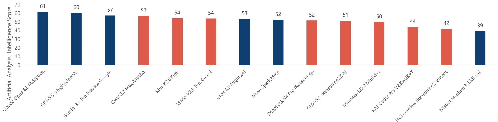

bar chart

Artificial Analysis Intelligence Score
| Model | Intelligence Score |
| :--- | :--- |
| Claude Opus 4.8 (Adaptive...) | 61 |
| GPT-5.5 (xhigh),OpenAI | 60 |
| Gemini 3.1 Pro Preview,Google | 57 |
| Qwen3.7 Max,Alibaba | 57 |
| Kimi K2.6,Kimi | 54 |
| MiMo-V2.5-Pro,Xiaomi | 54 |
| Grok 4.3 (high),xAI | 53 |
| Muse Spark,Meta | 52 |
| DeepSeek V4 Pro (Reasoning,...) | 52 |
| GLM-5.1 (Reasoning),Z AI | 51 |
| MiniMax-M2.7,MiniMax | 50 |
| KAT Coder Pro V2,KwaiKAT | 44 |
| Hy3-preview (Reasoning),Tencent | 42 |
| Mistral Medium 3.5,Mistral | 39 |

Source: Artificial Analysis, JEF

## Since End-2025, Chinese Models Improved More than their US Peers

■ Compared to Nov 2025 when we first launched our AI monthly report, many model vendors have experienced performance increase in their frontier models.  
- Overall, Chinese models have improved more compared to US models. In China, BABA, Zhipu and DeepSeek's frontier model improved 18-24 points since Nov 2025.  
- Meanwhile, OAI, Anthropic and Google's best models increased 8-13 points from Nov 2025 to May 2026.

Flagship Models' Artificial Analysis Score Change From Nov to May

<table><tr><td>Flagship Model In May 2026</td><td>AA Score</td><td>Change</td><td>Flagship Model In Nov 2025</td><td>AA Score</td></tr><tr><td>1.Claude Opus 4.8 (Adaptive Reasoni</td><td>61.4</td><td>+11.7</td><td>1. Claude Opus 4.5 reasoning (Anthrc</td><td>49.7</td></tr><tr><td>2.GPT-5.5 (xhigh),OpenAI</td><td>60.2</td><td>+12.6</td><td>2. Gemini 3 pro preview (Google)</td><td>48.4</td></tr><tr><td>3.Gemini 3.1 Pro Preview,Google</td><td>57.2</td><td>+8.8</td><td>3. GPT5.1 high (OpenAI)</td><td>47.6</td></tr><tr><td>4.Qwen3.7 Max,Alibaba</td><td>56.6</td><td>+24.2</td><td>4. Grok 4 (xAI)</td><td>41.4</td></tr><tr><td>5.Kimi K2.6,Kimi</td><td>53.9</td><td>+13.2</td><td>5. Kimi K2 Thinking (Moonshot)</td><td>40.7</td></tr><tr><td>6.MiMo-V2.5-Pro,Xiaomi</td><td>53.8</td><td>n.a</td><td>6. MiniMax M2 (MiniMax)</td><td>35.7</td></tr><tr><td>7.Grok 4.3 (high),xAI</td><td>53.2</td><td>+11.8</td><td>7. DeepSeek V3.1 Terminus (DeepSe</td><td>33.8</td></tr><tr><td>8.Muse Spark,Meta</td><td>52.2</td><td>n.a</td><td>8. GLM 4.6 Reasoning (zhipu)</td><td>32.5</td></tr><tr><td>9.DeepSeek V4 Pro (Reasoning, Max</td><td>51.5</td><td>+17.7</td><td>9. Qwen3 Max Thinking preview (AliI</td><td>32.5</td></tr><tr><td>10.GLM-5.1 (Reasoning),Z AI</td><td>51.4</td><td>+18.9</td><td>10. Magistral Medium 1.2 (Magistral)</td><td>27.0</td></tr></table>

Footnote: Flagship model = model with the highest Artificial Analysis score; models in orange are Chinese models

Source: Artificial Analysis, JEF

## On LMArena, US Model Vendors' Occupied the Top 5 Spots

■ LMArena's ranking is based on users' blind selection, thus its ranking methodology is different from Artificial Analysis (AA).  
■ LMArena rankings also showed U.S. labs are leading the pack, but rankings are different compared to AA.  
- On LMArena, Anthropic's Claude Opus 4.6 ranked first while Meta's Muse Spark ranked second. Alibaba's Qwen 3.7 Max is ranked sixth, and is also the top Chinese model.  
■ When ranked by AI labs, US AI labs held the top five positions, while Chinese AI labs held the $6^{th}$ -10 $^{th}$ spots.

LMArena Ranking - Text  
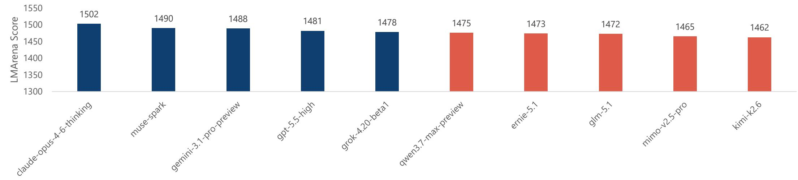

bar chart

| Model | LMArena Score |
| :--- | :--- |
| claude-opus-4-6-thinking | 1502 |
| muse-spark | 1490 |
| gemini-3.1-pro-preview | 1488 |
| gpt-5.5-high | 1481 |
| grok-4.20-beta1 | 1478 |
| qwen3.7-max-preview | 1475 |
| ernie-5.1 | 1473 |
| glm-5.1 | 1472 |
| mimo-v2.5-pro | 1465 |
| kimi-k2.6 | 1462 |

Footnote: ■ = Chinese model ■ = Global model, as of May 2026  
Source: LMArena

## DeepSeek Top Ranked in Token Market Share, Followed by Anthropic, Google, and Tencent

- OpenRouter is a model marketplace. It allows enterprises and developers to access models from various vendors via its platform. It is also the only platform that publishes token consumption data by models.  
- We believe token consumption market shares provide another perspective on each AI lab's industry position than pure benchmark scores.  
- According to OpenRouter's data, as of the week of May 25, DeepSeek ranked No.1 with \~18% in token consumption market share and Anthropic is No.2 with \~18% share.  
- OpenRouter's data could underestimate consumption of open-source models given it could not track tokens consumed on open-source models deployed in private cloud and on-premise.  
- But we estimate OpenRouter's global share of token consumption is $< 1\%$ , which means its market share data may not be representative of the whole market.

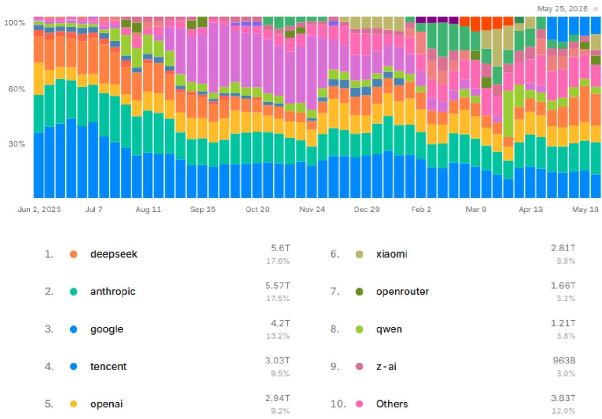

stacked bar chart

| Date       | deepseek | anthropic | google | tencent | openai | xiaomi | openrouter | qwen | z-ai | Others |
|------------|----------|-----------|--------|---------|--------|--------|------------|------|------|--------|
| Jun 2, 2025 | 17.6%    | 17.5%     | 13.2%  | 9.5%    | 9.2%   | -      | -          | -    | -    | -      |
| Jul 7      | -        | -         | -      | -       | -      | -      | -          | -    | -    | -      |
| Aug 11     | -        | -         | -      | -       | -      | -      | -          | -    | -    | -      |
| Sep 15     | -        | -         | -      | -       | -      | -      | -          | -    | -    | -      |
| Oct 20     | -        | -         | -      | -       | -      | -      | -          | -    | -    | -      |
| Nov 24     | -        | -         | -      | -       | -      | -      | -          | -    | -    | -      |
| Dec 29     | 5.6T     | -         | -      | -       | -      | -      | -          | -    | -    | -      |
| Feb 2      | -        | -         | -      | -       | -      | -      | -          | -    | -    | -      |
| Mar 9      | 2.81T    | 1.66T     | 1.21T  | 963B    | 3.0%   | -      | -          | -    | -    | -      |
| Apr 13     | -        | -         | -      | -       | -      | -      | -          | -    | -    | -      |
| May 18     | 3.83T    | -         | -      | -       | -      | -      | -          | -    | -    | -      |
| May 25, 2026| 8.8%     | 5.2%      | 3.8%   | 3.0%    | 3.0%   | 2.94T  | 2.94T      | 2.94T| 2.94T| 3.83T  |
The chart displays a stacked bar chart with the same axes and labels. The data is already in English.

Source: OpenRouter  
Footnote: as of the week of May 25, 2026

## On Coding, HY3 Preview, DeepSeek V4 Flash, and MiMo V2.5 were the Top Models Used

- According to OpenRouter, Hy3 preview, DeepSeek V4 Flash and Mimo V2.5 were the most used models for coding as of May 31.  
■ Hy3 preview tracked 10% of coding token usage market share on OpenRouter platform, while DeepSeek V4 Flash and Mimo V2.5 bagged 9% and 7% share respectively, as of May 31.  
- But it seems that in the past, leaders were dethroned by other model vendors with more capable new models as most model vendors are focusing their resources on the coding use case.

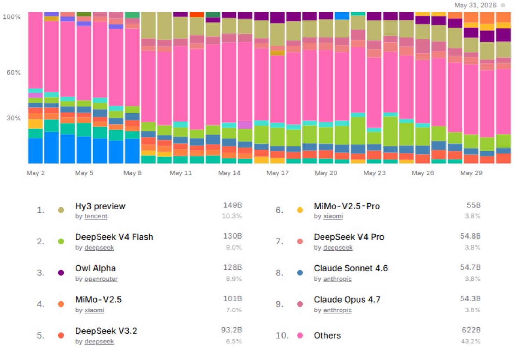

stacked bar chart

| Category                  | Value   |
| ------------------------- | ------- |
| Hy3 preview by tencent    | 149B    |
| DeepSeek V4 Flash by deepseek | 130B    |
| Owl Alpha by openrouter    | 128B    |
| MiMo-V2.5 by xiaomi       | 101B    |
| DeepSeek V3.2 by deepseek   | 93.2B   |
| MiMo-V2.5-Pro by xiaomi    | 55B     |
| DeepSeek V4 Pro by deepseek | 54.8B   |
| Claude Sonnet 4.6 by anthropic | 54.7B   |
| Claude Opus 4.7 by anthropic | 54.3B   |
| Others                    | 622B    |

Source: OpenRouter  
Footnote: as of May 31, 2026

## On Tool Calling, HY3 Preview, DeepSeek V4 Flash, and Claude Opus 4.7 were Top Models Used

- According to OpenRouter, HY3 Preview, DeepSeek V4 Flash, and Claude Opus 4.7 were the most used models for tool calling in the week of May 25.  
■ HY3 Preview tracked 10% of tool calls token usage market share on OpenRouter platform, while DeepSeek V4 Flash and Claude Opus 4.7 bagged 8% and 6% share respectively in the same week.  
■ Given tool calling is the essential capability for running AI agents such as OpenClaw. We believe this market share also indicates the aforementioned three models were mostly used on agentic workload.

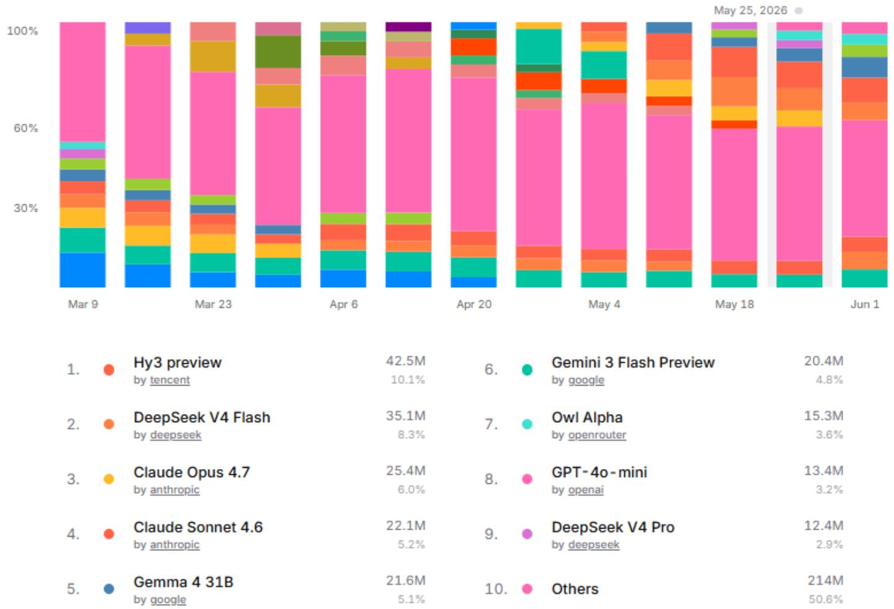

stacked bar chart

| Product | Date       | Value     |
|---------|------------|-----------|
| Hy3 preview | Mar 9     | 42.5M     |
| Gemini 3 Flash Preview | Apr 20    | 20.4M     |
| Gemmi 3 Flash Preview | May 4      | 15.3M     |
| Owl Alpha | May 4      | 15.3M     |
| GPT-4o-mini | May 18     | 13.4M     |
| GPT-4o-mini | Jun 1      | 12.4M     |
| DeepSeek V4 Pro | May 18     | 12.4M     |
| DeepSeek V4 Pro | Jun 1      | 214M      |
| Claude Sonnet 4.6 | May 18     | 22.1M     |
| Claude Sonnet 4.6 | Jun 1      | 21.6M     |
| Claude Opus 4.7 | May 18     | 25.4M     |
| Claude Opus 4.7 | Jun 1      | 5.1%      |
| DeepSeek V4 Flash | May 18     | 6.0%      |
| DeepSeek V4 Flash | Jun 1      | 8.3%      |
| Gemma 4 31B | May 18     | 5.2%      |
| Gemma 4 31B | Jun 1      | 50.6%     |
| Owl Alpha | May 18     | 3.2%      |
| Owl Alpha | Jun 1      | 3.6%      |
| DeepSeek V4 Pro | May 18     | 2.9%      |
| DeepSeek V4 Pro | Jun 1      | 5.1%      |
| Others   | May 25, 2026 | 50.6%    |

Source: OpenRouter  
Footnote: as of the week of May 25, 2026

## The LLM Performance Gap Between China and US Continues to Narrow

- As of May 2026, the leading Chinese frontier model (Qwen 3.7 Max) reached \~92% of the intelligence level of the leading U.S. frontier model (Claude Opus 4.8).  
- In Dec 2025, the leading Chinese frontier model (GLM 4.7) was at \~82% of the intelligence level of the leading US frontier model (GPT5.2 xhigh).  
• The performance gap between top Chinese and US LLM has narrowed from 18% to 8% over the past six months.  
- However, given the long model training and iteration cycle (\~3–6 months), the gap could be widened again as U.S. players roll out their next flagship models.

Frontier Language Model Intelligence China vs. US  
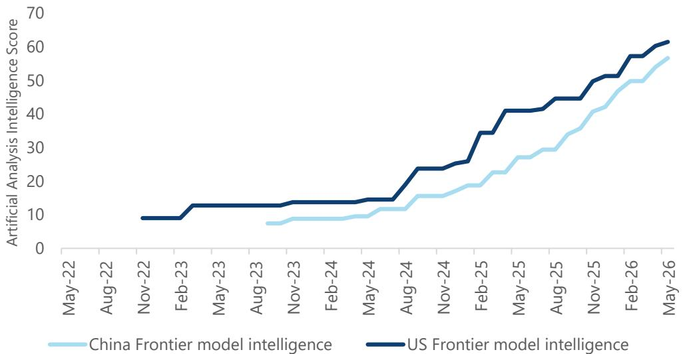

line chart

| Month    | China Frontier model intelligence | US Frontier model intelligence |
| -------- | ---------------------------------- | ------------------------------ |
| May-22   | 0                                  | 0                              |
| Aug-22   | 0                                  | 0                              |
| Nov-22   | 0                                  | 10                             |
| Feb-23   | 0                                  | 10                             |
| May-23   | 0                                  | 10                             |
| Aug-23   | 5                                  | 10                             |
| Nov-23   | 5                                  | 10                             |
| Feb-24   | 5                                  | 10                             |
| May-24   | 10                                 | 10                             |
| Aug-24   | 15                                 | 20                             |
| Nov-24   | 15                                 | 25                             |
| Feb-25   | 20                                 | 35                             |
| May-25   | 25                                 | 40                             |
| Aug-25   | 30                                 | 45                             |
| Nov-25   | 35                                 | 50                             |
| Feb-26   | 45                                 | 55                             |
| May-26   | 55                                 | 60                             |

Source: Artificial Analysis, JEF

Frontier Language Model Intelligence China vs. US  

line chart

| Date    | Value |
|---------|-------|
| May-24  | 65%   |
| Jul-24  | 80%   |
| Sep-24  | 60%   |
| Nov-24  | 65%   |
| Jan-25  | 70%   |
| Mar-25  | 55%   |
| May-25  | 65%   |
| Jul-25  | 70%   |
| Sep-25  | 65%   |
| Nov-25  | 80%   |
| Jan-26  | 85%   |
| Mar-26  | 85%   |
| May-26  | 90%   |

Footnote: US frontier model intelligence as benchmark (100%)  
Source: Artificial Analysis, JEF

## Chinese Open-Source Frontier Models Keep Outperforming US peers

- Top Chinese AI labs keep releasing new open-source models that outperform the best U.S. open-source model.  
- The leading Chinese open-source model, Kimi K2.6, now has an intelligence score $38 \%$ higher than the best U.S. open-source model (Gemma 4 31B Reasoning).  
- Given low price and high performance, as well as flexibility to fine-tune and be deployed locally, Chinese open-source models have become prevalent globally.

Open Weights Frontier Language Model Intelligence China vs. US  
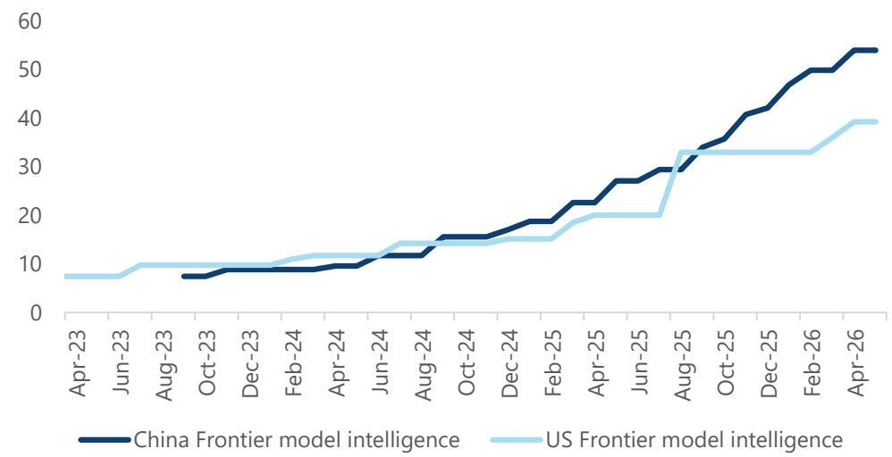

line chart

| Month    | China Frontier model intelligence | US Frontier model intelligence |
| -------- | --------------------------------- | ------------------------------ |
| Apr-23   | 7                                 | 7                              |
| Jun-23   | 8                                 | 10                             |
| Aug-23   | 8                                 | 10                             |
| Oct-23   | 9                                 | 10                             |
| Dec-23   | 9                                 | 10                             |
| Feb-24   | 10                                | 12                             |
| Apr-24   | 10                                | 12                             |
| Jun-24   | 12                                | 14                             |
| Aug-24   | 15                                | 14                             |
| Oct-24   | 16                                | 14                             |
| Dec-24   | 18                                | 15                             |
| Feb-25   | 20                                | 18                             |
| Apr-25   | 25                                | 20                             |
| Jun-25   | 28                                | 20                             |
| Aug-25   | 30                                | 33                             |
| Oct-25   | 35                                | 33                             |
| Dec-25   | 40                                | 33                             |
| Feb-26   | 45                                | 33                             |
| Apr-26   | 55                                | 40                             |

Source: Artificial Analysis, JEF

Open Source Frontier Language Model Intelligence China vs. US  
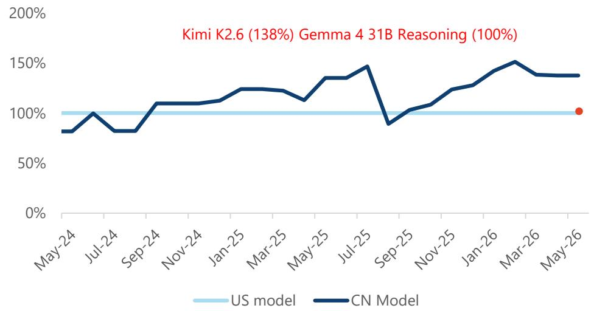

line chart

| Date    | US model | CN Model |
|---------|----------|----------|
| May-24  | 100%     | 80%      |
| Jul-24  | 100%     | 100%     |
| Sep-24  | 100%     | 80%      |
| Nov-24  | 100%     | 110%     |
| Jan-25  | 100%     | 120%     |
| Mar-25  | 100%     | 120%     |
| May-25  | 100%     | 130%     |
| Jul-25  | 100%     | 150%     |
| Sep-25  | 100%     | 90%      |
| Nov-25  | 100%     | 110%     |
| Jan-26  | 100%     | 130%     |
| Mar-26  | 100%     | 150%     |
| May-26  | 100%     | 140%     |

Footnote: US frontier model intelligence as benchmark (100%)  
Source: Artificial Analysis, JEF

## Some Chinese Vendors Have Closed Sourced Their Flagship Models for Better Monetization

■ Overall, closed source models achieve higher intelligence scores than open-source models, reflecting their technological edge, driven by access to superior data, larger compute resources, more advanced training and alignment pipelines, and proprietary inference techniques.  
- Open-source models offer flexibility, transparency, low costs and ecosystem benefits. They can be fine-tuned and deployed locally without vendor lock-in, while thriving communities and toolchains accelerate innovation and broaden adoption.  
As of May 2026, OAI's GPT 5.5 is the highest-ranked closed-source model by performance, and Kimi K2.6 is the highest-ranked open-source model by performance.  
■ Some Chinese flagship models, such as Qwen 3.7 Max and KAT Coder Pro V2 are closed-source models. Model vendors could close-source their flagship models to pursue better monetization.

Progress in Open Source vs. Close Source Intelligence  
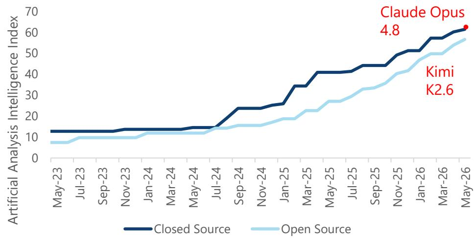

line chart

| Date    | Closed Source | Open Source |
|---------|---------------|-------------|
| May-26  | 60            | 55          |
| Claude Opus | 4.8         | 4.8         |
| Kimi K2.6 | 2.6         | 2.6         |

Source: Artificial Analysis, JEF

Intelligence index Open Source vs Closed Source model  
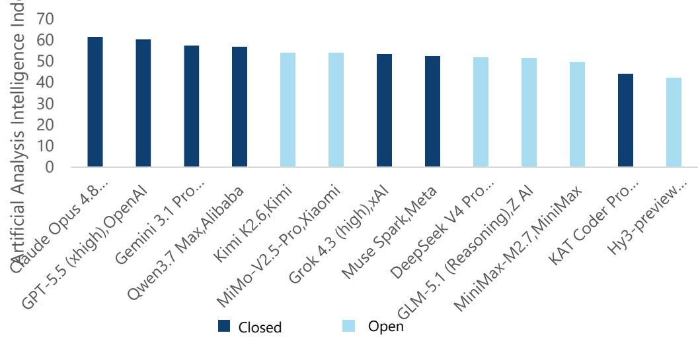

bar chart

Artificial Analysis Intelligence Ind
| Model | Closed | Open |
|---|---|---|
| Claude Opus 4.8... | 62 | |
| GPT-5.5 (xhigh),OpenAI | 61 | |
| Gemini 3.1 Pro... | 57 | |
| Qwen3.7 Max,Alibaba | 56 | |
| Kimi K2.6,Kimi | 54 | |
| MiMo-V2.5-Pro,Xiaomi | 54 | |
| Grok 4.3 (high),xAI | 53 | |
| Muse Spark,Meta | 52 | |
| DeepSeek V4 Pro... | 51 | |
| GLM-5.1 (Reasoning),Z AI | 51 | |
| MiniMax-M2.7,MiniMax | 49 | |
| KAT Coder Pro... | 44 | |
| Hy3-preview... | 42 | |

Source: Artificial Analysis, JEF

## US Models Still Leading in Coding & Agentic Capabilities (1)

■ Coding is currently the most promising use case of LLM. Thus, this is the domain every model vendor is competing in.  
- AA's coding index evaluates models' ability to solve programming problems, including those requiring scientific and research domain knowledge. AA's coding index includes benchmarks like SciCode and Terminal-Bench Hard.  
■ U.S. models delivered outstanding performance, with GPT 5.5 xhigh, Claude Opus 4.8, and Gemini 3.1 Pro leading in coding capability. Chinese models like Qwen 3.7 Max, DS V4 Pro, Kimi K2.6 and KAT Coder Pro V2 are ranked 4 $^{th}$ \~8 $^{th}$ among its peers.

Coding capability Global vs. China  
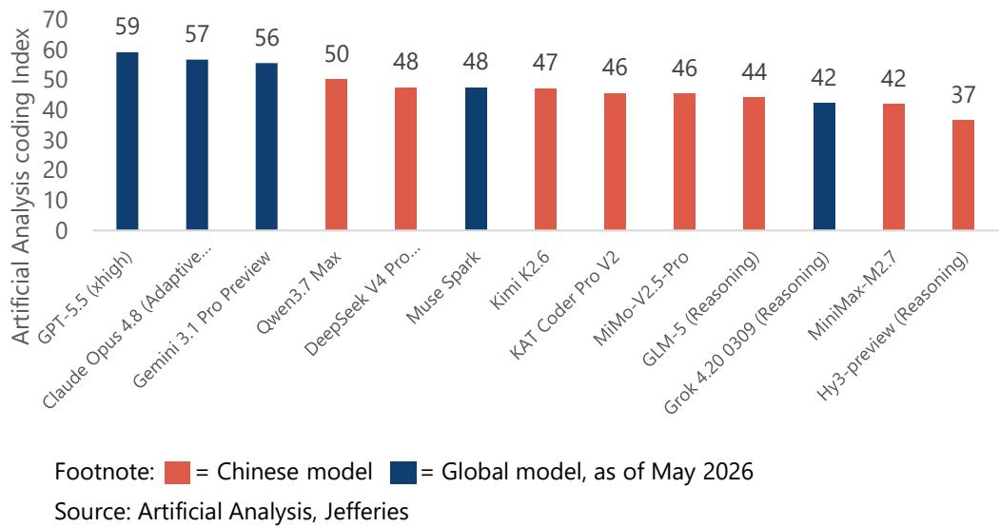

bar chart

Artificial Analysis coding Index
| Model | Chinese model | Global model |
| :--- | :--- | :--- |
| GPT-5.5 (xhigh) | 59 | 59 |
| Claude Opus 4.8 (Adaptive...) | 57 | 57 |
| Gemini 3.1 Pro Preview | 56 | 56 |
| Qwen3.7 Max | 50 | 50 |
| DeepSeek V4 Pro... | 48 | 48 |
| Muse Spark | 48 | 48 |
| Kimi K2.6 | 47 | 47 |
| KAT Coder Pro V2 | 46 | 46 |
| MiMo-V2.5-Pro | 46 | 46 |
| GLM-5 (Reasoning) | 44 | 44 |
| Grok 4.20 0309 (Reasoning) | 42 | 42 |
| MiniMax-M2.7 | 42 | 42 |
| Hy3-preview (Reasoning) | 37 | 37 |
Source: Artificial Analysis, JEF

Flagship Models' Artificial Analysis Coding Score Change From Nov to May

<table><tr><td>Flagship Model In May 2026</td><td>AA Score</td><td>Change</td><td>Flagship Model In Nov 2025</td><td>AA Score</td></tr><tr><td>1.GPT-5.5 (xhigh)</td><td>59</td><td>+14.1</td><td>1. Claude Opus 4.5</td><td>48</td></tr><tr><td>2.Claude Opus 4.8 (Adaptive Reasoni</td><td>57</td><td>+8.7</td><td>2. Gemini 3 Pro preview</td><td>46</td></tr><tr><td>3.Gemini 3.1 Pro Preview</td><td>56</td><td>+9.5</td><td>3. GPT 5.1 (high)</td><td>45</td></tr><tr><td>4.Qwen3.7 Max</td><td>50</td><td>+25.1</td><td>4. Grok 4</td><td>40</td></tr><tr><td>5.DeepSeek V4 Pro (Reasoning, Max</td><td>48</td><td>+13.5</td><td>5. Kimi K2 Thinking</td><td>35</td></tr><tr><td>6.Muse Spark</td><td>48</td><td>n.a</td><td>6. DeepSeek V3.1 Terminus</td><td>34</td></tr><tr><td>7.Kimi K2.6</td><td>47</td><td>+12.1</td><td>7. GLM 4.6</td><td>29</td></tr><tr><td>8.KAT Coder Pro V2</td><td>46</td><td>n.a</td><td>8. MiniMax M2</td><td>29</td></tr><tr><td>9.MiMo-V2.5-Pro</td><td>46</td><td>n.a</td><td>9. Qwen3 Max Thinking preview</td><td>25</td></tr><tr><td>10.GLM-5 (Reasoning)</td><td>44</td><td>+15.2</td><td>10. Magistral Medium 1.2</td><td>22</td></tr></table>

Footnote: models in orange are Chinese models  
Source: Artificial Analysis, JEF

## US Models Still Leading in Coding & Agentic Capabilities (2)

- AA's agentic index evaluates performance in agentic workflows, emphasizing behaviors such as tool use, planning, autonomy, instruction following, and complex problem-solving. Agentic index includes benchmarks like $\tau^2$ -Bench Telecom and Terminal-Bench Hard.  
■ Higher score on agentic index means more commercializable agents could be built based off the foundational model.  
- Frontier model like Claude Opus 4.8 and GPT 5.5 xhigh are leading the pack. Chinese models such as Xiaomi's MiMo-V2.5 Pro, DS V4 Pro and GLM 5.1 are ranked from $4^{\text{th}}$ to $6^{\text{th}}$ with only slightly lower performance scores.

Agentic capability Global vs. China  
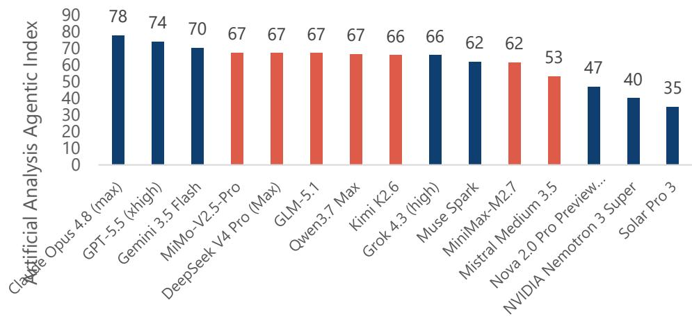

bar chart

Clasific Analysis Agentic Index
| Model | Clasific Analysis Agentic Index |
| :--- | :--- |
| Ace Opus 4.8 (max) | 78 |
| GPT-5.5 (xhigh) | 74 |
| Gemini 3.5 Flash | 70 |
| MiMo-V2.5-Pro | 67 |
| DeepSeek V4 Pro (Max) | 67 |
| GLM-5.1 | 67 |
| Qwen3.7 Max | 67 |
| Kimi K2.6 | 66 |
| Grok 4.3 (high) | 66 |
| Muse Spark | 62 |
| MiniMax-M2.7 | 62 |
| Mistral Medium 3.5 | 53 |
| Nova 2.0 Pro Preview... | 47 |
| NVIDIA Nemotron 3 Super | 40 |
| Solar Pro 3 | 35 |

Footnote: ■ = Chinese model ■ = Global model, as of May 2026  
Source: Artificial Analysis, JEF

Flagship Models' Artificial Analysis Agentic Score Change From Nov to May

<table><tr><td>Flagship Model In May 2026</td><td>AA Score</td><td>Change</td><td>Flagship Model In Nov 2025</td><td>AA Score</td></tr><tr><td>1.Claude Opus 4.8 (max)</td><td>78</td><td>+17.8</td><td>1. Claude Opus 4.5</td><td>60</td></tr><tr><td>2.GPT-5.5 (xhigh)</td><td>74</td><td>+23.1</td><td>2. Gemini 3 Pro preview</td><td>52</td></tr><tr><td>3.Gemini 3.5 Flash</td><td>70</td><td>+18.3</td><td>3. GPT 5.1 (high)</td><td>51</td></tr><tr><td>4.MiMo-V2.5-Pro</td><td>67</td><td>n.a</td><td>4. Kimi K2 Thinking</td><td>48</td></tr><tr><td>5.DeepSeek V4 Pro (Max)</td><td>67</td><td>+37.2</td><td>5. MiniMax M2</td><td>48</td></tr><tr><td>6.GLM-5.1</td><td>67</td><td>+25.1</td><td>6. Qwen3 Max Thinking preview</td><td>43</td></tr><tr><td>7.Qwen3.7 Max</td><td>67</td><td>+23.6</td><td>7. GLM 4.6</td><td>42</td></tr><tr><td>8.Kimi K2.6</td><td>66</td><td>+18</td><td>8. Grok 4</td><td>42</td></tr><tr><td>9.Grok 4.3 (high)</td><td>66</td><td>+23.9</td><td>9. DeepSeek V3.1 Terminus</td><td>30</td></tr><tr><td>10.Muse Spark</td><td>62</td><td>n.a</td><td>10. Magistral Medium 1.2</td><td>24</td></tr></table>

Footnote: models in orange are Chinese models  
Source: Artificial Analysis, JEF

## US models are Strong at Image Generation, Chinese Models Dominate in Video Generation (1)

■ Besides LLMs, multimode models that include image, video, and audio are becoming more important, as they provide more information for models to comprehend the world similarly to humans.  
■ We believe LLMs will excel in use cases like search, coding, office applications, and customer service. Meanwhile, multi-modal models are likely to power applications in autonomous driving, AR/VR, content creation, advertising and gaming industries.  
■ Besides text models, US AI labs also lead in text-to-image models as of May 2026, OpenAI’s GPT image 2 significantly outperforms all competitors.  
Notably, in the text-to-video model rankings, Chinese model Bytedance's Seedance 2.0 and BABA's HappyHorse 1.0 now rank first and second, and largely outperformed the others.

LMArena Ranking - Text to Image  
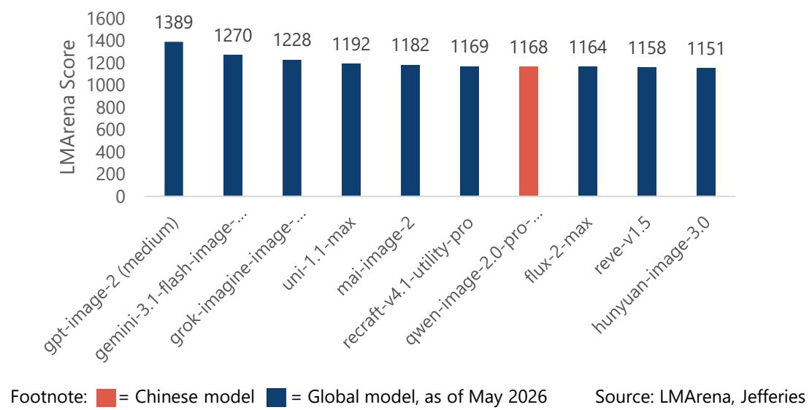

bar chart

| Model | LMArena Score |
| :--- | :--- |
| gpt-image-2 (medium) | 1389 |
| gemini-3.1-flash-image-... | 1270 |
| grok-imagine-image-... | 1228 |
| uni-1.1-max | 1192 |
| mai-image-2 | 1182 |
| recraft-v4.1-utility-pro | 1169 |
| qwen-image-2.0-pro-... | 1168 |
| flux-2-max | 1164 |
| reve-v1.5 | 1158 |
| hunyuan-image-3.0 | 1151 |
Footnote: = Chinese model; = Global model, as of May 2026 Source: LMArena, JEF

LMArena Ranking - Text to Video  
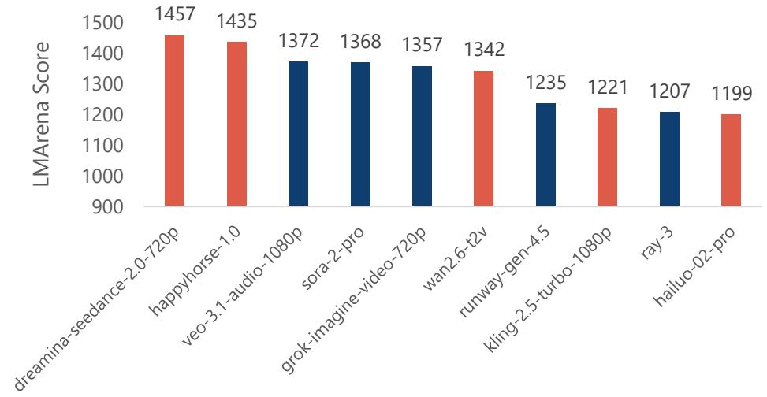

bar chart

| Video Sequence | LMArena Score |
| :--- | :--- |
| dreamina-seedance-2.0-720p | 1457 |
| happyhorse-1.0 | 1435 |
| veo-3.1-audio-1080p | 1372 |
| sora-2-pro | 1368 |
| grok-imagine-video-720p | 1357 |
| wan2.6-t2v | 1342 |
| runway-gen-4.5 | 1235 |
| kling-2.5-turbo-1080p | 1221 |
| ray-3 | 1207 |
| hailuo-02-pro | 1199 |

## US models are Strong at Image Generation, Chinese Models Dominate in Video Generation (2)

- Both LMArena and Artificial Analysis adopted Elo ranking which are based on users' blind selections to test out different model modes' multi modal capability.  
■ The key difference is: LMArena compares LLMs based on their ability to generate images that match prompt descriptions, while AA's Elo scores are primarily derived from evaluations on specific content such as cartoon and illustration, or UI/UX design etc.

AA Ranking - Text to Image  
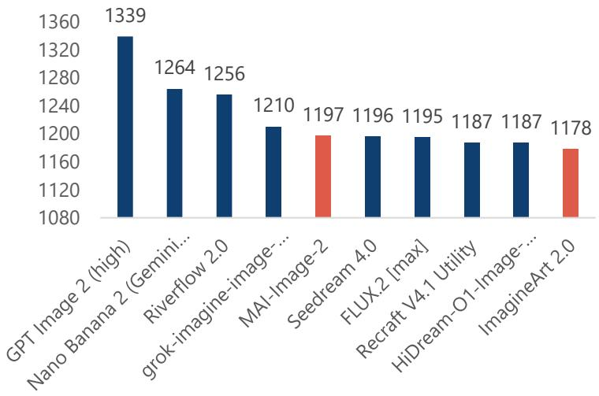

bar chart

| Model | Value |
| :--- | :--- |
| GPT Image 2 (high) | 1339 |
| Nano Banana 2 (Gemini... | 1264 |
| Riverflow 2.0 | 1256 |
| grok-imagine-image-... | 1210 |
| MAI-Image-2 | 1197 |
| Seedream 4.0 | 1196 |
| FLUX.2 [max] | 1195 |
| Recraft V4.1 Utility | 1187 |
| HiDream-O1-Image-... | 1187 |
| ImagineArt 2.0 | 1178 |

AA Ranking - Text to Video  
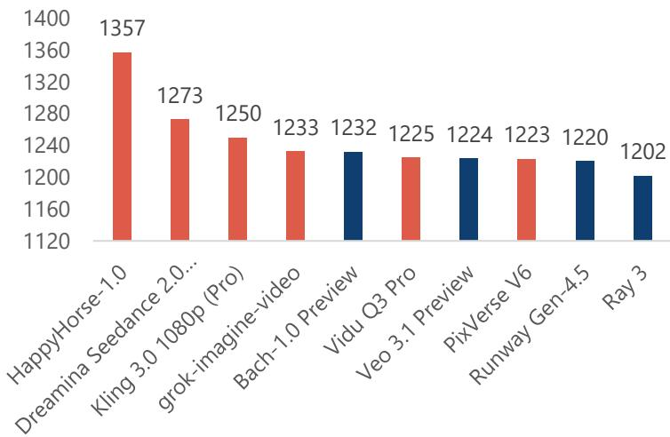

bar chart

| Video | Value |
| :--- | :--- |
| HappyHorse-1.0 | 1357 |
| Dreamina Seedance 2.0... | 1273 |
| Kling 3.0 1080p (Pro) | 1250 |
| grok-imagine-video | 1233 |
| Bach-1.0 Preview | 1232 |
| Vidu Q3 Pro | 1225 |
| Veo 3.1 Preview | 1224 |
| PixVerse V6 | 1223 |
| Runway Gen-4.5 | 1220 |
| Ray 3 | 1202 |

AA Ranking - Image to Video  
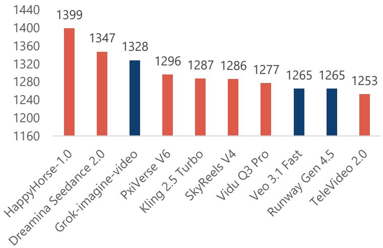

bar chart

| Video | Score |
| :--- | :--- |
| HappyHorse-1.0 | 1399 |
| Dreamina Seedance 2.0 | 1347 |
| Grok-imagine-video | 1328 |
| PxiVerse V6 | 1296 |
| Kling 2.5 Turbo | 1287 |
| SkyReels V4 | 1286 |
| Vidu Q3 Pro | 1277 |
| Veo 3.1 Fast | 1265 |
| Runway Gen 4.5 | 1265 |
| TeleVideo 2.0 | 1253 |

Footnote: ■ = Chinese model ■ = Global model, as of May 2026

Source: Artificial Analysis, JEF

## Chinese Models are Becoming More Popular Globally due to Low Price but High Performance

Global Models' Cumulative Downloads  
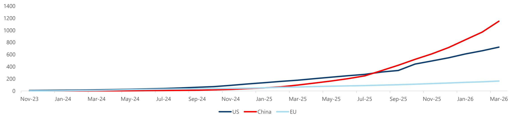

line chart

| Date    | US   | China | EU   |
|---------|------|-------|------|
| Nov-23  | 0    | 0     | 0    |
| Jan-24  | 0    | 0     | 0    |
| Mar-24  | 0    | 0     | 0    |
| May-24  | 0    | 0     | 0    |
| Jul-24  | 0    | 0     | 0    |
| Sep-24  | 50   | 10    | 0    |
| Nov-24  | 100  | 20    | 0    |
| Jan-25  | 150  | 50    | 0    |
| Mar-25  | 200  | 100   | 50   |
| May-25  | 250  | 150   | 75   |
| Jul-25  | 300  | 250   | 100  |
| Sep-25  | 350  | 400   | 125  |
| Nov-25  | 450  | 600   | 150  |
| Jan-26  | 600  | 800   | 175  |
| Mar-26  | 700  | 1150  | 175  |

New open source model published by region (%)  
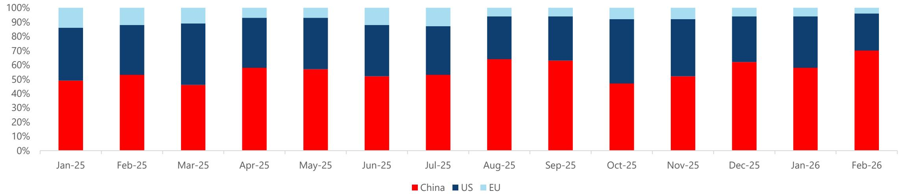

stacked bar chart

| Month    | China | US   | EU   |
| -------- | ----- | ---- | ---- |
| Jan-25   | 49%   | 31%  | 11%  |
| Feb-25   | 53%   | 28%  | 10%  |
| Mar-25   | 46%   | 34%  | 10%  |
| Apr-25   | 58%   | 27%  | 6%   |
| May-25   | 57%   | 29%  | 7%   |
| Jun-25   | 52%   | 28%  | 11%  |
| Jul-25   | 53%   | 27%  | 11%  |
| Aug-25   | 64%   | 24%  | 6%   |
| Sep-25   | 63%   | 25%  | 6%   |
| Oct-25   | 47%   | 37%  | 7%   |
| Nov-25   | 52%   | 31%  | 7%   |
| Dec-25   | 62%   | 26%  | 6%   |
| Jan-26   | 58%   | 28%  | 7%   |
| Feb-26   | 70%   | 21%  | 4%   |

Source: The ATOMProject, Huggingface, JEF

## BABA's Qwen Model Steadily Gaining Download Share Since Late 2024

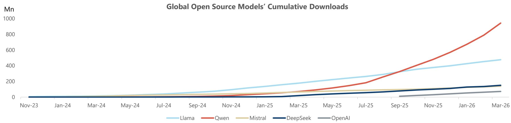

line chart

| Date    | Llama | Qwen  | Mistral | DeepSeek | OpenAI |
|---------|-------|-------|---------|----------|--------|
| Nov-23  | 0     | 0     | 0       | 0        | 0      |
| Jan-24  | 0     | 0     | 0       | 0        | 0      |
| Mar-24  | 0     | 0     | 0       | 0        | 0      |
| May-24  | 0     | 0     | 0       | 0        | 0      |
| Jul-24  | 0     | 0     | 0       | 0        | 0      |
| Sep-24  | 50    | 10    | 20      | 5        | 5      |
| Nov-24  | 100   | 20    | 40      | 10       | 10     |
| Jan-25  | 150   | 40    | 60      | 15       | 15     |
| Mar-25  | 200   | 80    | 80      | 20       | 20     |
| May-25  | 250   | 120   | 100     | 30       | 30     |
| Jul-25  | 300   | 180   | 120     | 40       | 40     |
| Sep-25  | 350   | 300   | 140     | 60       | 60     |
| Nov-25  | 400   | 450   | 160     | 80       | 80     |
| Jan-26  | 450   | 650   | 180     | 120      | 120    |
| Mar-26  | 480   | 950   | 150     | 150      | 70     |

Mkt Share of Derived Model Downloads Based on Each Foundation Models  
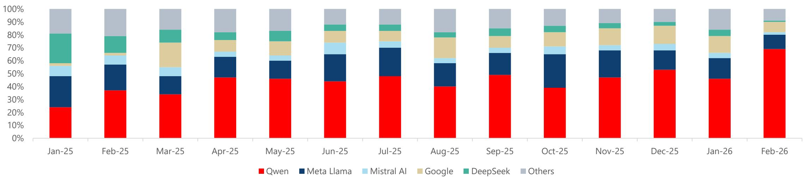

stacked bar chart

| Month    | Qwen  | Meta Llama | Mistral AI | Google | DeepSeek | Others |
| -------- | ----- | ---------- | ---------- | ------ | -------- | ------ |
| Jan-25   | 24%   | 23%        | 5%         | 1%     | 27%      | 18%    |
| Feb-25   | 37%   | 19%        | 5%         | 10%    | 10%      | 20%    |
| Mar-25   | 34%   | 13%        | 5%         | 15%    | 7%       | 15%    |
| Apr-25   | 47%   | 14%        | 3%         | 7%     | 4%       | 15%    |
| May-25   | 46%   | 13%        | 3%         | 10%    | 6%       | 15%    |
| Jun-25   | 44%   | 18%        | 5%         | 8%     | 3%       | 10%    |
| Jul-25   | 48%   | 20%        | 3%         | 7%     | 3%       | 10%    |
| Aug-25   | 40%   | 16%        | 3%         | 12%    | 3%       | 15%    |
| Sep-25   | 49%   | 14%        | 3%         | 8%     | 3%       | 15%    |
| Oct-25   | 39%   | 24%        | 5%         | 9%     | 3%       | 15%    |
| Nov-25   | 47%   | 18%        | 3%         | 10%    | 2%       | 10%    |
| Dec-25   | 53%   | 13%        | 3%         | 12%    | 2%       | 8%     |
| Jan-26   | 46%   | 14%        | 3%         | 10%    | 3%       | 15%    |
| Feb-26   | 68%   | 7%         | 0%         | 6%     | 0%       | 7%     |

Source: The ATOMProject, Huggingface, JEF

## Open-Source Models Generally Have More Hallucination but Could be Minimized After Fine-tuning

- AA-Omniscience Index rewards correct answers, penalizes hallucinations, and doesn’t penalize refusals. Its scores range from -100 to 100, with 0 indicating an equal number of correct and incorrect answers, and negatives meaning more wrong than right (e.g. A score of -30 means 65 wrong/35 right answers out of a total of 100 questions).  
- The index indicates even the frontier models hallucinate. Therefore, their accuracy would not be acceptable in commercial scenarios that are highly sensitive to hallucination (e.g. finance, healthcare). For now, LLMs need to be fine-tuned or RAG-enhanced to improve accuracy.  
- Chinese open-source models are more inclined to hallucinate than U.S. peers. But we believe Chinese models still have an advantage in commercial adoption because open-source models can be easily fine-tuned or RAG-enhanced by third-party, which leads to a stronger ecosystem (similar to Android), whereas closed-sourced models could only be fine-tuned by model vendor (similar to iOS).

Frontier Model Hallucination Index (the higher the better)  
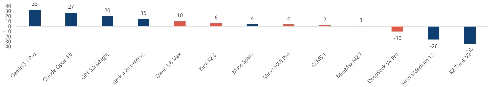

bar chart

| Model | Value |
| :--- | :--- |
| Gemini3.1 Pro... | 33 |
| Claude Opus 4.8... | 27 |
| GPT 5.5 (xhigh) | 20 |
| Grok 4.20 0309 v2 | 15 |
| Qwen 3.6 Max | 10 |
| Kimi K2.6 | 6 |
| Muse Spark | 4 |
| Mimo V2.5 Pro | 4 |
| GLM5.1 | 2 |
| MiniMax M2.7 | 1 |
| DeepSeek V4 Pro | -10 |
| MistralMedium 1.2 | -26 |
| K2 Think V2 | -34 |

Source: Artificial Analysis, JEF

Footnote: ■ = Chinese model ■ = Global model, as of May 2026

## We Updated Model API Pricing Methodology Taking into Consideration Cache-hit Tokens

In agentic AI use cases, cache-hit tokens are likely to be substantial. Thus, we updated our methodology for calculating the blended model API price, from an input:output ratio of 3:1 to a cache-hit:input:output ratio of 7:2:1. This new methodology has led to decrease in overall model price by c.60%-c70% in both the U.S. and China.  
■ We observed model vendors adopted different pricing strategies: Out of the 11 vendors, 5 lowered prices, 3 raised prices, and 3 kept prices unchanged for their new flagship models.  
■ Efficiency drives LLM scalability and unit economics: higher efficiency enables comparable performance with fewer resources.  
■ Chinese AI players continue to focus on compute and memory efficiency across training and inference

Frontier Model Price (USD/Mn Tokens)  
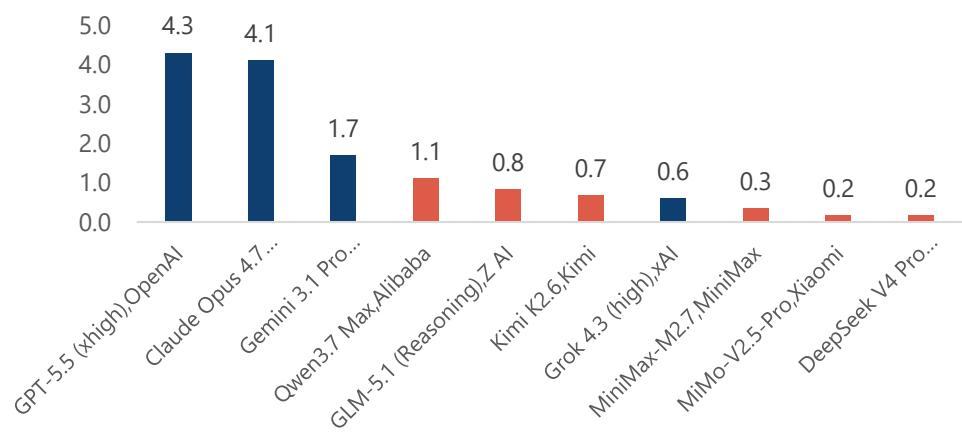

bar chart

| Model | Value |
| :--- | :--- |
| GPT-5.5 (xhigh),OpenAI | 4.3 |
| Claude Opus 4.7... | 4.1 |
| Gemini 3.1 Pro.. | 1.7 |
| Qwen3.7 Max,Alibaba | 1.1 |
| GLM-5.1 (Reasoning),Z AI | 0.8 |
| Kimi K2.6,Kimi | 0.7 |
| Grok 4.3 (high),xAI | 0.6 |
| MiniMax-M2.7,MiniMax | 0.3 |
| MiMo-V2.5-Pro,Xiaomi | 0.2 |
| DeepSeek V4 Pro.. | 0.2 |

Source: Artificial Analysis, Companies, JEF

USD/Mn Tokens  
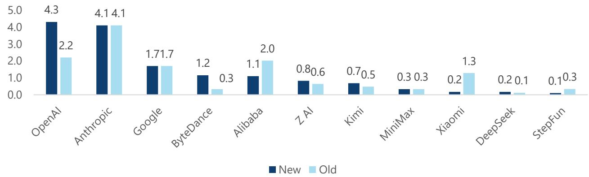

bar chart

| Company | New | Old |
| :--- | :--- | :--- |
| OpenAI | 4.3 | 2.2 |
| Anthropic | 4.1 | 4.1 |
| Google | 1.7 | 1.7 |
| ByteDance | 1.2 | 0.3 |
| Alibaba | 1.1 | 2.0 |
| Z AI | 0.8 | 0.6 |
| Kimi | 0.7 | 0.5 |
| MiniMax | 0.3 | 0.3 |
| Xiaomi | 0.2 | 1.3 |
| DeepSeek | 0.2 | 0.1 |
| StepFun | 0.1 | 0.3 |

Frontier Model Price - New vs previous models  
Source: Artificial Analysis, Companies, JEF  
\*Note: Price per token, represented as USD per million Tokens (assume USD:CNY = 1:7). Price is a blend of Cache-hit & Input & Output token prices (7:2:1 ratio). As of May 2026

## Chinese Models Still Offer Superior Value for Performance (1)

Chinese models' average price as a percentage of US models' price is down from $31\%$ in Apr to $21\%$ in May, mainly driven by Qwen and Xiaomi's price cuts on their flagship models.  
The average price of Chinese models has increased by 52% since Jan 2026. We believe this trend is driven by the increase in inference cost (high-end GPU and memory price hike), and Chinese vendors' increasing focus on monetization.  
However, we noticed that Qwen/Xiaomi lowered their flagship model prices by 46%/86% in May. Meanwhile, DeepSeek announced the 75% promotional discount on its V4 Pro would be permanent.  
We believe this likely signals intensifying competition in the model market as incumbents try to win more market shares. However, given sharply higher hardware costs, we remain worried that lower API pricing could depress ROI. for Chinese AI model players.

CH Frontier Model Price As % of US'  
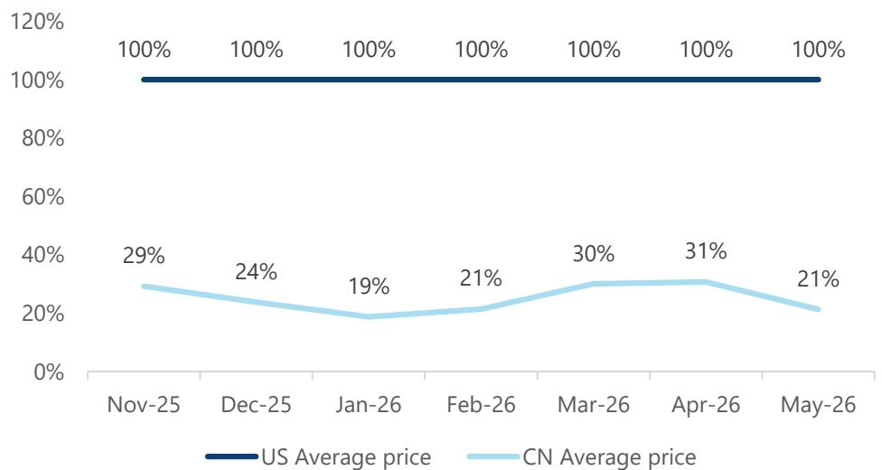

line chart

| Month    | US Average price | CN Average price |
| -------- | ---------------- | ---------------- |
| Nov-25   | 100%             | 29%              |
| Dec-25   | 100%             | 24%              |
| Jan-26   | 100%             | 19%              |
| Feb-26   | 100%             | 21%              |
| Mar-26   | 100%             | 30%              |
| Apr-26   | 100%             | 31%              |
| May-26   | 100%             | 21%              |

Frontier Model Price - US vs. CN  

line chart

| Date | US Average (USD/Mn Tokens) | CN Average (USD/Mn Tokens) |
| :--- | :--- | :--- |
| Nov-25 | 1.9 | 0.5 |
| Dec-25 | 2.0 | 0.5 |
| Jan-26 | 2.0 | 0.4 |
| Feb-26 | 2.0 | 0.4 |
| Mar-26 | 1.9 | 0.6 |
| Apr-26 | 2.7 | 0.8 |
| May-26 | 2.7 | 0.6 |

Source: Companies, Artificial Analysis, JEF; Note: Model price is calculated by averaging each vendor's flagship model price in each month

## Chinese Models Still Offer Superior Value for Performance (2)

■ Chinese models continue to deliver high value for performance compared to US models  
- Alibaba lowered its new flagship model Qwen 3.7 Max's price by 46% (vs Qwen 3.6 Max) to US\$1.1/Mn tokens in May 2026, ranking it as the second most expensive model in China (after Doubao Seed Code 2.0's US\$1.2/Mn tokens).  
Despite this, Qwen 3.7 Max's price is only $26\%$ of OpenAI's GPT 5.5 (xhigh)'s price, and $27\%$ of Claude Opus 4.8's; while Qwen 3.7 Max's model intelligence is already at $94\%$ and $92\%$ of these two peers.

China and US' API Price vs. Model Intelligence  

scatterplot

| Model | Model Intelligence score | API Price (USD/million tokens) |
| --- | --- | --- |
| Claude Opus 4.8 | 61.0 | 4.1 |
| GPT 5.5 xhigh | 60.0 | 4.3 |
| Qwen 3.6 Max | 51.0 | 2.0 |
| Gemini 3.1 pro | 57.0 | 1.7 |
| Qwen 3.7 Max | 56.0 | 1.1 |
| GLM 5.1 | 50.0 | 0.8 |
| MiniMax M2.7 | 49.0 | 0.5 |
| Kimi | 53.0 | 0.7 |
| Mimo V2.5 pro | 54.0 | 0.2 |
| DeepSeek V4 pro | 50.0 | 0.2 |
| Zhipu | 33.0 | 0.4 |
| DeepSeek | 34.0 | 0.3 |
| Gemini | 49.0 | 1.7 |
| MiniMax | 41.0 | 0.4 |
| Kimi | 47.0 | 0.5 |
| Xiaomi | 48.0 | 1.3 |
| AlphaTek | 41.0 | 0.1 |
| Zhipu | 36.0 | 0.3 |
| GPT | 52.0 | 1.9 |
| Qwen | 32.0 | 1.6 |
| BlueDeck | 40.0 | 0.1 |
| BlueDeck | 41.0 | 0.1 |
| BlueDeck | 42.0 | 0.1 |
| BlueDeck | 43.0 | 0.1 |
| BlueDeck | 44.0 | 0.1 |
| BlueDeck | 45.0 | 0.1 |
| BlueDeck | 46.0 | 0.1 |
| BlueDeck | 47.0 | 0.1 |
| BlueDeck | 48.0 | 0.1 |
| BlueDeck | 49.0 | 0.1 |
| BlueDeck | 50.0 | 0.1 |
| BlueDeck | 51.0 | 0.1 |
| BlueDeck | 52.0 | 0.1 |
| BlueDeck | 53.0 | 0.1 |
| BlueDeck | 54.0 | 0.1 |
| BlueDeck | 55.0 | 0.1 |
| BlueDeck | 56.0 | 0.1 |
| BlueDeck | 57.0 | 0.1 |
| BlueDeck | 58.0 | 0.1 |
| BlueDeck | 59.0 | 0.1 |
| BlueDeck | 60.0 | 0.1 |
| BlueDeck | 61.0 | 0.1 |
| BlueDeck | 62.0 | 0.1 |
| BlueDeck | 63.0 | 0.1 |
| BlueDeck | 64.0 | 0.1 |
| BlueDeck | 65.0 | 0.1 |
| BlueDeck | 66.0 | 0.1 |
| BlueDeck | 67.0 | 0.1 |
| BlueDeck | 68.0 | 0.1 |
| BlueDeck | 69.0 | 0.1 |
| BlueDeck | 70.0 | 0.1 |
| BlueDeck | 71.0 | 0.1 |
| BlueDeck | 72.0 | 0.1 |
| BlueDeck | 73.0 | 0.1 |
| BlueDeck | 74.0 | 0.1 |
| BlueDeck | 75.0 | 0.1 |
| BlueDeck | 76.0 | 0.1 |
| BlueDeck | 77.0 | 0.1 |
| BlueDeck | 78.0 | 0.1 |
| BlueDeck | 79.0 | 0.1 |
| BlueDeck | 80.0 | 0.1 |
| BlueDeck | 81.0 | 0.1 |
| BlueDeck | 82.0 | 0.1 |
| BlueDeck | 83.0 | 0.1 |
| BlueDeck | 84.0 | 0.1 |
| BlueDeck | 85.0 | 0.1 |
| BlueDeck | 86.0 | 0.1 |
| BlueDeck | 87.0 | 0.1 |
| BlueDeck | 88.0 | 0.1 |
| BlueDeck | 89.0 | 0.1 |
| BlueDeck | 90.0 | 0.1 |
| BlueDeck | 91.0 | 0.1 |
| BlueDeck | 92.0 | 0.1 |
| BlueDeck | 93.0 | 0.1 |
| BlueDeck | 94.0 | 0.1 |
| BlueDeck | 95.0 | 0.1 |
| BlueDeck | 96.0 | 0.1 |
| BlueDeck | 97.0 | 0.1 |
| BlueDeck | 98.0 | 0.1 |
| BlueDeck | 99.0 | 0.1 |
| BlueDeck | 100.0 | 0.1 |

LLM Intelligence/Price Ratio - DeepSeek vs. Zhipu vs. Qwen vs. GPT  

line chart

| Month | Mimo V2 Pro | DeepSeek V4 Pro | MiniMax M2.7 | Kimi K2.6 | GLM 5.1 | Qwen 3.7 Max | GPT5.5 xhigh |
| --- | --- | --- | --- | --- | --- | --- | --- |
| Oct-25 |  |  |  |  |  |  |  |
| Nov-25 |  |  |  |  |  |  |  |
| Dec-25 | 700.0 | 350.0 |  |  |  |  |  |
| Jan-26 | 700.0 | 350.0 |  |  |  |  |  |
| Feb-26 | 720.0 | 350.0 |  |  |  |  |  |
| Mar-26 | 40.0 | 350.0 | 150.0 |  |  |  |  |
| Apr-26 | 40.0 | 300.0 | 150.0 |  |  |  |  |
| May-26 | 310.0 | 300.0 | 150.0 |  |  |  |  |
| Jun-26 |  |  |  |  |  |  |  |

Source: Companies, Artificial Analysis, JEF

## DS V4 is Highly Cost-effective; Co. Still Focuses on AGI Instead of Short-term Monetization (1)

DS V4 demonstrates advanced intelligence and robust coding capabilities, while maintaining a highly competitive price of \$0.17 per million tokens. Several factors contribute to DS' low pricing strategy: 1) DeepSeek V4 leverages a new KV cache compression technique, enhancing cost-effectiveness; 2) it benefits from lower inherent training costs and full compatibility with Huawei's Ascend chips; 3) the company aims to aggressively gain market share and strengthen its ecosystem; and 4) it has received additional cash support from its latest fundraising round.

DS implemented a new KV cache compression technique (Hybrid CAS/HCA mechanism) in its DS V4 that allows it to save memory and compute cost and bring higher inference efficiency and lower margin pressure.

Thanks to several innovations implemented during the training phase, such as Manifold-Constrained Hyper-Connections (mHC), the Muon optimizer, and others, DS V4 achieves a lower inherent training cost compared to its peers. Moreover, its full compatibility with Huawei's Ascend chips gives it a distinct advantage within the domestic chip ecosystem. We believe DS is likely to secure preferential access to Huawei's upcoming Ascend 950 chips.

A low API pricing strategy can help DS gain more market share and help it build a low price + open-sourced ecosystem moat against frontier closed-source models. As more developers use DS' model, it will enhance the data flywheel and help the model to iterate quicker.

A recent news report shows that DS is seeking a massive Rmb50bn fundraising round (source: Reuters), the company's founder Wenfeng Liang will personally invest Rmb20bn and he explicitly stated that 'The fundraising is for pursuing AGI instead of getting listed'. Thus, we believe the company's focus is still pursuing AGI rather than monetization in the short term.

## DS V4 Is Highly Cost-effective; Co. Still Focuses on AGI Instead of Short-term Monetization (1)

DeepSeek V4 pro is priced at 0.025 CNY/Mn tokens for cache-hit tokens, 3 CNY/Mn tokens for input tokens, and 6 CNY/Mn tokens for output tokens, which resulted in a 1.2 CNY (\~0.17 USD)/Mn tokens blended API price.  
DeepSeek V4 Pro's price is now the second lowest among Chinese flagship models, accounting for only $4\%$ of US frontier model GPT 5.5 xhigh's price (4.3 USD/Mn tokens) and $10\%$ of Google's Gemini 3.1 Pro's price.  
Despite its low pricing strategy, we still noticed that DeepSeek V4's price is 45% higher than its previous flagship model DeepSeek V3.2 (input price is 50% higher and output price is doubled). This price hike is likely driven by increase in hardware cost (e.g. memory price has increased 4x yoy).

Top Model vendor's Flagship Model Price In Each Month  
Cache:input:output = 7:2:1

<table><tr><td>USD/Mn tokens</td><td>Nov-25</td><td>Dec-25</td><td>Jan-26</td><td>Feb-26</td><td>Mar-26</td><td>Apr-26</td><td>May-26</td></tr><tr><td>OpenAI</td><td>1.3</td><td>1.9</td><td>1.9</td><td>1.9</td><td>2.2</td><td>4.3</td><td>4.3</td></tr><tr><td>Meta</td><td>0.3</td><td>0.3</td><td>0.3</td><td>0.3</td><td>0.3</td><td></td><td></td></tr><tr><td>Anthropic</td><td>4.1</td><td>4.1</td><td>4.1</td><td>4.1</td><td>4.1</td><td>4.1</td><td>4.1</td></tr><tr><td>Google</td><td>1.7</td><td>1.7</td><td>1.7</td><td>1.7</td><td>1.7</td><td>1.7</td><td>1.7</td></tr><tr><td>xAI</td><td></td><td></td><td></td><td></td><td>1.1</td><td>0.6</td><td>0.6</td></tr><tr><td>US Average</td><td>1.9</td><td>2.0</td><td>2.0</td><td>2.0</td><td>1.9</td><td>2.7</td><td>2.7</td></tr><tr><td>Alibaba</td><td>1.6</td><td>1.6</td><td>0.7</td><td>0.4</td><td>0.4</td><td>2.0</td><td>1.1</td></tr><tr><td>DeepSeek</td><td>0.3</td><td>0.1</td><td>0.1</td><td>0.1</td><td>0.1</td><td>0.2</td><td>0.2</td></tr><tr><td>MiniMax</td><td>0.3</td><td>0.5</td><td>0.5</td><td>0.5</td><td>0.3</td><td>0.3</td><td>0.3</td></tr><tr><td>Kimi</td><td>0.4</td><td>0.4</td><td>0.5</td><td>0.5</td><td>0.5</td><td>0.7</td><td>0.7</td></tr><tr><td>Z AI</td><td>0.4</td><td>0.4</td><td>0.4</td><td>0.6</td><td>0.6</td><td>0.8</td><td>0.8</td></tr><tr><td>Xiaomi</td><td></td><td>0.06</td><td>0.06</td><td>0.06</td><td>1.3</td><td>1.3</td><td>0.2</td></tr><tr><td>ByteDance</td><td>0.3</td><td>0.3</td><td>0.3</td><td>1.2</td><td>1.2</td><td>1.2</td><td>1.2</td></tr><tr><td>StepFun</td><td>0.3</td><td>0.3</td><td>0.3</td><td>0.1</td><td>0.1</td><td>0.1</td><td>0.1</td></tr><tr><td>CN Average</td><td>0.5</td><td>0.5</td><td>0.4</td><td>0.4</td><td>0.6</td><td>0.8</td><td>0.6</td></tr></table>

Source: Artificial Analysis, Companies, JEF

DeepSeek's Historical Price of Its best Model in Each Month  
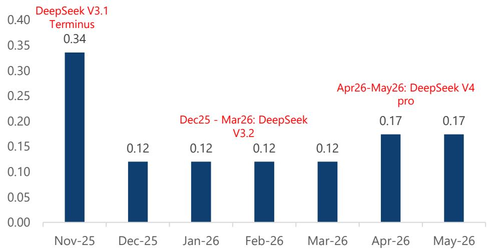

bar chart

| Date | Value |
| :--- | :--- |
| Nov-25 | 0.34 |
| Dec-25 | 0.12 |
| Jan-26 | 0.12 |
| Feb-26 | 0.12 |
| Mar-26 | 0.12 |
| Apr-26 | 0.17 |
| May-26 | 0.17 |
DeepSeek V3.1 Terminus; Dec25 - Mar26: DeepSeek V3.2; Apr26-May26: DeepSeek V4 pro

Source: Company, JEF

## Competition on AI Assistant Becomes Fiercer as Internet Giants Fight for New Traffic Entrance

## LLM App a Centralized Consumer Gateway That Unifies Fragmented Apps and Fosters AI Agents

■ We believe LLM Apps are important for model vendors mainly because:  
- Securing the AI Entrance and Ecosystem: AI vendors' core ambition is to create an omni consumer gateway or "AI OS" (Operating System) of the future, which is expected to replace traditional accesses such as browsers or app stores. The Internet giants aim to build a "Super App" or platform gateway to unify previously fragmented applications. Alibaba, for instance, views its "Qwen" app as a "life service entrance" designed to integrate its vast ecosystem, including commerce, payment, and local services, into a single user entrance.  
■ Platform for Agentic AI: The development of large language models has progressed from merely understanding language to being capable of executing complex tasks (known as Agentic AI or AI Agent). AI vendors could provide AI assistants that not only chat with users, but also genuinely "do things" for the user, such as generating elaborate PPTs or completing complex workflows.  
- Driving New Revenue and Growth: LLM apps could provide new source of revenue generation. Although unlike US vendors that are already monetizing via subscription on different tier accounts, Chinese vendors could still find ways to monetize via VAS, such as voice recording and transcribing, video creation etc. The AI gateway could enhance an Internet platform's ecosystem by raising the market share of its various Internet services.

## Doubao Still Leading on Mobile APP MAU, and has Slightly Widened the Gap with Qwen

- LLM apps are crucial to model vendors as they serve as key access points for consumers. These apps unify fragmented services into a single platform (e.g., Alibaba’s Qwen as an “omni access point”). LLM apps also enable agentic AI assistants that not only chat but execute complex tasks and workflows.  
In Apr, Doubao remained the leader on AICPB.com's list as China's largest LLM app as its mobile MAU reached 336m, followed by Qwen at 220m.  
■ After CNY campaigns, AI app growth has been stabilizing. Qwen's mobile MAU declined 1% MoM in Apr, while Doubao's MAU grew 1.5%. Thus, the MAU gap between Qwen and Doubao has slightly widened in Apr.  
In Apr, MAU of Tencent's Yuanbao and Baidu's Wenxin grew $3\%$ and $-6.6\%$ MoM, respectively.

Top Chinese LLM Apps' Ranking by MAU

<table><tr><td>Developer</td><td>AI Native App</td><td>Jul</td><td>Aug</td><td>Sep</td><td>Oct</td><td>Nov</td><td>Dec</td><td>Jan</td><td>Feb</td><td>Mar</td><td>Apr</td></tr><tr><td>Alibaba</td><td>Quark</td><td>1</td><td>1</td><td>1</td><td>2</td><td>2</td><td>2</td><td>2</td><td>3</td><td>3</td><td>3</td></tr><tr><td>ByteDance</td><td>Doubao</td><td>3</td><td>3</td><td>2</td><td>1</td><td>1</td><td>1</td><td>1</td><td>1</td><td>1</td><td>1</td></tr><tr><td>Tencent</td><td>Yuanbao</td><td>5</td><td>5</td><td>5</td><td>4</td><td>4</td><td>5</td><td>5</td><td>5</td><td>6</td><td>5</td></tr><tr><td>DeepSeek</td><td>DeepSeek</td><td>4</td><td>4</td><td>4</td><td>5</td><td>5</td><td>4</td><td>4</td><td>4</td><td>4</td><td>4</td></tr><tr><td>Moonshot</td><td>Kimi</td><td>7</td><td>7</td><td>7</td><td>7</td><td>7</td><td>8</td><td>8</td><td>8</td><td>8</td><td>8</td></tr><tr><td>Alibaba</td><td>Qwen</td><td>13</td><td>14</td><td>12</td><td>11</td><td>8</td><td>7</td><td>7</td><td>2</td><td>2</td><td>2</td></tr><tr><td>Baidu</td><td>WenXin</td><td>10</td><td>10</td><td>10</td><td>10</td><td>11</td><td>11</td><td>11</td><td>11</td><td>11</td><td>12</td></tr><tr><td>ZhipuAI</td><td>Qingyan</td><td>11</td><td>11</td><td>11</td><td>12</td><td>12</td><td>12</td><td>12</td><td>13</td><td>13</td><td>13</td></tr></table>

Top Chinese LLM Apps' MAU (Mn)

<table><tr><td>Developer</td><td>AI Native App</td><td>Jul</td><td>Aug</td><td>Sep</td><td>Oct</td><td>Nov</td><td>Dec</td><td>Jan</td><td>Feb</td><td>Mar</td><td>Apr</td></tr><tr><td>Alibaba</td><td>Quark</td><td>155.6</td><td>154.5</td><td>151.0</td><td>151.7</td><td>151.9</td><td>147.8</td><td>144.1</td><td>170.4</td><td>172.2</td><td>162.3</td></tr><tr><td>ByteDance</td><td>Doubao</td><td>132.8</td><td>140.9</td><td>150.0</td><td>159.4</td><td>167.9</td><td>163.2</td><td>168.3</td><td>315.3</td><td>331.0</td><td>336.0</td></tr><tr><td>Tencent</td><td>Yuanbao</td><td>44.7</td><td>56.5</td><td>64.2</td><td>73.3</td><td>81.6</td><td>84.4</td><td>88.3</td><td>109.5</td><td>107.9</td><td>111.1</td></tr><tr><td>DeepSeek</td><td>DeepSeek</td><td>82.9</td><td>74.9</td><td>73.4</td><td>72.1</td><td>69.4</td><td>131.5</td><td>129.6</td><td>132.6</td><td>136.5</td><td>139.0</td></tr><tr><td>Moonshot</td><td>Kimi</td><td>23.1</td><td>22.9</td><td>23.0</td><td>23.5</td><td>24.8</td><td>23.6</td><td>23.4</td><td>24.7</td><td>25.8</td><td>25.3</td></tr><tr><td>Alibaba</td><td>Qwen</td><td>5.8</td><td>6.0</td><td>7.0</td><td>7.4</td><td>18.3</td><td>25.5</td><td>31.1</td><td>202.7</td><td>222.6</td><td>220.4</td></tr><tr><td>Baidu</td><td>WenXin</td><td>11.6</td><td>11.1</td><td>10.8</td><td>10.5</td><td>9.9</td><td>9.0</td><td>8.4</td><td>9.3</td><td>8.2</td><td>7.7</td></tr><tr><td>ZhipuAI</td><td>Qingyan</td><td>7.7</td><td>7.4</td><td>7.1</td><td>6.9</td><td>6.6</td><td>6.3</td><td>6.0</td><td>5.8</td><td>5.5</td><td>5.3</td></tr></table>

Top Chinese LLM Apps' MAU (%MoM)

<table><tr><td>Developer</td><td>AI Native App</td><td>Jul</td><td>Aug</td><td>Sep</td><td>Oct</td><td>Nov</td><td>Dec</td><td>Jan</td><td>Feb</td><td>Mar</td><td>Apr</td></tr><tr><td>Alibaba</td><td>Quark</td><td>-0.4%</td><td>-0.7%</td><td>-2.2%</td><td>0.4%</td><td>0.2%</td><td>-2.7%</td><td>-2.5%</td><td>18.2%</td><td>1.1%</td><td>-5.8%</td></tr><tr><td>ByteDance</td><td>Doubao</td><td>5.5%</td><td>6.1%</td><td>6.4%</td><td>6.3%</td><td>5.3%</td><td>-2.8%</td><td>3.1%</td><td>87.4%</td><td>5.0%</td><td>1.5%</td></tr><tr><td>Tencent</td><td>Yuanbao</td><td>9.2%</td><td>26.3%</td><td>13.6%</td><td>14.2%</td><td>11.3%</td><td>3.5%</td><td>4.6%</td><td>24.0%</td><td>-1.4%</td><td>3.0%</td></tr><tr><td>DeepSeek</td><td>DeepSeek</td><td>-11.9%</td><td>-9.7%</td><td>-2.0%</td><td>-1.9%</td><td>-3.7%</td><td>89.5%</td><td>-1.4%</td><td>2.3%</td><td>3.0%</td><td>1.8%</td></tr><tr><td>Moonshot</td><td>Kimi</td><td>-1.6%</td><td>-1.2%</td><td>0.6%</td><td>2.0%</td><td>5.8%</td><td>-5.0%</td><td>-0.9%</td><td>5.8%</td><td>4.2%</td><td>-1.7%</td></tr><tr><td>Alibaba</td><td>Qwen</td><td>1.6%</td><td>4.0%</td><td>16.2%</td><td>5.7%</td><td>149.2%</td><td>38.8%</td><td>22.0%</td><td>552.8%</td><td>9.8%</td><td>-1.0%</td></tr><tr><td>Baidu</td><td>WenXin</td><td>-4.8%</td><td>-4.7%</td><td>-2.9%</td><td>-3.0%</td><td>-5.7%</td><td>-9.0%</td><td>-6.0%</td><td>9.9%</td><td>-10.9%</td><td>-6.6%</td></tr><tr><td>ZhipuAI</td><td>Qingyan</td><td>-4.0%</td><td>-3.6%</td><td>-3.8%</td><td>-3.8%</td><td>-3.6%</td><td>-4.1%</td><td>-4.9%</td><td>-4.3%</td><td>-4.0%</td><td>-4.3%</td></tr></table>

Source: AICPB.com, JEF

## Chinese LLM Apps Accumulated Decent-Sized User Base, But Monetization Still Lags US Peers

- ChatGPT is still the world's largest LLM app, tracking 958m MAU globally in Apr, decreased by -0.4% MoM, according to AICPB.com.  
■ Other major US LLM apps Gemini/Grok/Perplexity/Claude bagged 139m/76m/32m/30m of MAUs in Apr, and grew by 9.3%/-5.9%/-6.0%/28.4% MoM.  
Although 2025 is technically Chinese AI's first breakout year, major Chinese LLM apps have already accumulated decent-sized user base compared to their US counterparts. However, Chinese LLM apps still trail far behind their US peers in terms of commercialization, as the majority of ToC usage is still free of charge.

China Major LLMs Apr 2025 MAU Chg  
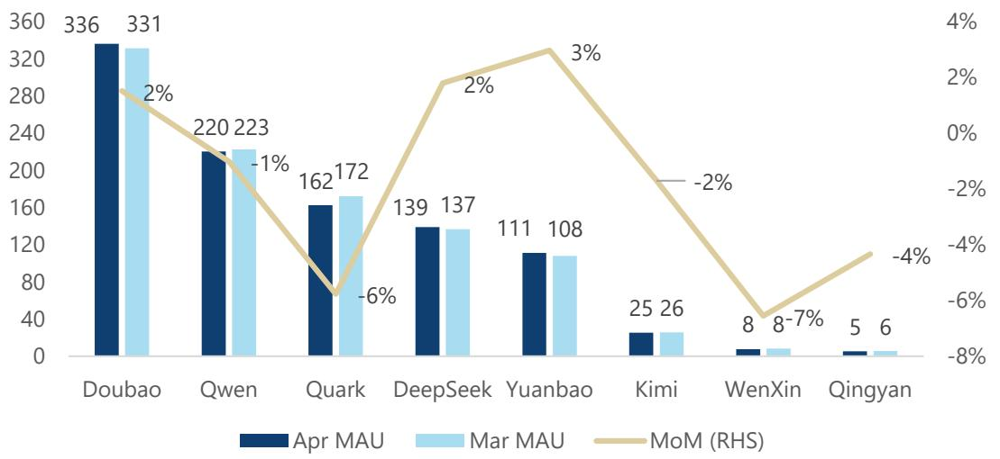

bar-line hybrid chart

| Ticker | Apr MAU | Mar MAU | MoM (RHS) |
| :--- | :--- | :--- | :--- |
| Doubao | 336 | 331 | 2 |
| Qwen | 220 | 223 | -1 |
| Quark | 162 | 172 | -6 |
| DeepSeek | 139 | 137 | 2 |
| Yuanbao | 111 | 108 | 3 |
| Kimi | 25 | 26 | -2 |
| WenXin | 8 | 8 | -7 |
| Qingyan | 5 | 6 | -4 |

Source: AICPB.com, JEF

US Major LLMs Apr 2025 MAU Chg  
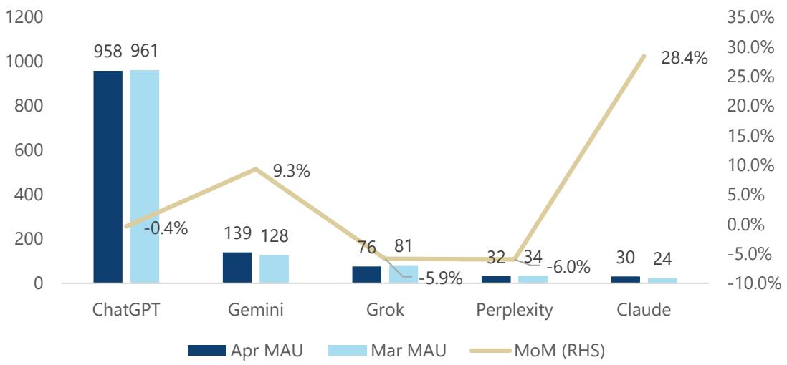

bar-line hybrid chart

| Company | Apr MAU | Mar MAU | MoM (RHS) (%) |
| :--- | :--- | :--- | :--- |
| ChatGPT | 958 | 961 | -0.4 |
| Gemini | 139 | 128 | 9.3 |
| Grok | 76 | 81 | -5.9 |
| Perplexity | 32 | 34 | -6.0 |
| Claude | 30 | 24 | 28.4 |

Source: AICPB.com, JEF

## Appendix

## Glossary

<table><tr><td>Term</td><td>Description</td></tr><tr><td>LLM</td><td>Large language model (LLM) is a type of artificial intelligence model trained on vast amounts of text data to generate human-like text and perform various language-related tasks</td></tr><tr><td>KV Cache</td><td>KV-cache is a transformer inference optimization that stores previously computed key/value attention tensors so the model can generate new tokens faster without recomputing the full context each step.</td></tr><tr><td>Cache-hit</td><td>A cache hit occurs when requested data is found in the cache, allowing it to be served quickly without fetching or recomputing it from the original</td></tr><tr><td>mHC</td><td>DeepSeek&#x27;s mHC, or Manifold-Constrained Hyper-Connections, is an architecture that stabilizes and enriches information flow in very large models by constraining how residual connections mix signals during training.</td></tr><tr><td>Muon Optimizer</td><td>Muon Optimizer is a neural network optimizer that improves training efficiency by applying momentum updates and then orthogonalizing weight-update matrices, typically using Newton–Schulz iteration</td></tr><tr><td>CSA</td><td>Compressed Sparse Attention, is an attention mechanism that compresses and sparsifies attention computation to support very long context windows with lower memory and compute cost</td></tr><tr><td>HCA</td><td>Heavily Compressed Attention, is an attention technique that compresses multiple tokens into fewer key-value entries, enabling efficient global attention over extremely long context windows with much lower memory and compute cost</td></tr><tr><td>AGI</td><td>Artificial General Intelligence, refers to AI that can understand, learn, and perform a broad range of intellectual tasks at human-level or better across domains</td></tr><tr><td>Fine-tuned</td><td>Fine-tuning an AI model is the process of taking a pre-trained model and continuing its training on a smaller, task-specific dataset so it can specialize in a particular use case or domain</td></tr><tr><td>RAG-enhanced</td><td>RAG-enhanced AI refers to improving an AI model&#x27;s capabilities by combining it with a Retrieval-Augmented Generation (RAG) pipeline</td></tr></table>

Source: JEF

Coverage List (1/2)

<table><tr><td rowspan="2">Company</td><td rowspan="2">Ticker</td><td rowspan="2">Ccy</td><td rowspan="2">Rec</td><td rowspan="2">Stock Px</td><td rowspan="2">JEF PT</td><td rowspan="2">% diff</td><td></td><td colspan="2">PE</td><td colspan="2">EPS CAGR</td><td colspan="2">PB</td><td></td><td colspan="2">ROE</td></tr><tr><td>2025</td><td>2026</td><td>2027</td><td>2025-2027</td><td>2025</td><td>2026</td><td>2027</td><td>2025</td><td>2026</td><td>2027</td></tr><tr><td colspan="17">IC design, foundries and semi cap equipment</td></tr><tr><td>ACMR</td><td>ACMR-US</td><td>USD</td><td>BUY</td><td>49.53</td><td>66.00</td><td>33%</td><td>29.9X</td><td>28.6X</td><td>18.7X</td><td>27%</td><td>1.7X</td><td>1.6X</td><td>1.4X</td><td>7%</td><td>6%</td><td>8%</td></tr><tr><td>AMEC</td><td>688012-CN</td><td>RMB</td><td>BUY</td><td>362.27</td><td>368.00</td><td>2%</td><td>107.8X</td><td>68.5X</td><td>49.6X</td><td>47%</td><td>10.0X</td><td>8.9X</td><td>7.6X</td><td>10%</td><td>14%</td><td>17%</td></tr><tr><td>Hua Hong</td><td>1347-HK</td><td>HKD</td><td>HOLD</td><td>113.30</td><td>91.00</td><td>-20%</td><td>456.7X</td><td>135.4X</td><td>94.9X</td><td>119%</td><td>3.8X</td><td>3.7X</td><td>3.6X</td><td>1%</td><td>3%</td><td>4%</td></tr><tr><td>InnoScience</td><td>2577-HK</td><td>HKD</td><td>BUY</td><td>64.20</td><td>109.53</td><td>71%</td><td>-66.6X</td><td>-371.9X</td><td>76.8X</td><td>NA</td><td>17.9X</td><td>19.0X</td><td>15.2X</td><td>-26%</td><td>-5%</td><td>22%</td></tr><tr><td>Maxscend</td><td>300782-CN</td><td>RMB</td><td>BUY</td><td>104.69</td><td>88.00</td><td>-16%</td><td>-458.5X</td><td>69.1X</td><td>41.6X</td><td>NA</td><td>5.5X</td><td>5.3X</td><td>4.9X</td><td>-9%</td><td>57%</td><td>95%</td></tr><tr><td>OmniVision</td><td>603501-CN</td><td>RMB</td><td>UNPF</td><td>103.55</td><td>85.00</td><td>-18%</td><td>30.8X</td><td>28.8X</td><td>24.0X</td><td>13%</td><td>2.9X</td><td>2.6X</td><td>2.4X</td><td>15%</td><td>15%</td><td>15%</td></tr><tr><td>SICC</td><td>688234-CN</td><td>RMB</td><td>UNPF</td><td>104.62</td><td>60.00</td><td>-43%</td><td>-222.6X</td><td>560.5X</td><td>89.8X</td><td>NA</td><td>4.1X</td><td>3.9X</td><td>3.7X</td><td>-3%</td><td>1%</td><td>6%</td></tr><tr><td>Silan</td><td>600460-CN</td><td>RMB</td><td>UNPF</td><td>28.44</td><td>27.00</td><td>-5%</td><td>90.3X</td><td>45.6X</td><td>34.3X</td><td>62%</td><td>1.9X</td><td>1.8X</td><td>1.7X</td><td>4%</td><td>7%</td><td>9%</td></tr><tr><td>SMIC</td><td>981-HK</td><td>HKD</td><td>BUY</td><td>65.45</td><td>87.00</td><td>33%</td><td>98.5X</td><td>62.4X</td><td>43.9X</td><td>50%</td><td>3.1X</td><td>3.0X</td><td>2.8X</td><td>2%</td><td>3%</td><td>4%</td></tr><tr><td>StarPower</td><td>603290-CN</td><td>RMB</td><td>BUY</td><td>111.08</td><td>123.00</td><td>11%</td><td>51.2X</td><td>35.8X</td><td>26.3X</td><td>39%</td><td>2.6X</td><td>2.3X</td><td>2.1X</td><td>7%</td><td>10%</td><td>12%</td></tr><tr><td>Wingtech</td><td>600745-CN</td><td>RMB</td><td>HOLD</td><td>27.80</td><td>39.00</td><td>40%</td><td>20.7X</td><td>13.3X</td><td>10.4X</td><td>41%</td><td>0.5X</td><td>0.5X</td><td>0.5X</td><td>5%</td><td>7%</td><td>8%</td></tr><tr><td colspan="17">Back-end IC design services</td></tr><tr><td>Alchip</td><td>3661-TW</td><td>TWD</td><td>BUY</td><td>4160.00</td><td>4200.00</td><td>1%</td><td>59.2X</td><td>30.4X</td><td>21.8X</td><td>65%</td><td>8.4X</td><td>7.0X</td><td>5.7X</td><td>14%</td><td>25%</td><td>29%</td></tr><tr><td>Faraday</td><td>3035-TW</td><td>TWD</td><td>HOLD</td><td>198.50</td><td>190.00</td><td>-4%</td><td>59.5X</td><td>17.1X</td><td>12.3X</td><td>120%</td><td>3.4X</td><td>3.0X</td><td>2.5X</td><td>5%</td><td>17%</td><td>21%</td></tr><tr><td>GUC</td><td>3443-TW</td><td>TWD</td><td>HOLD</td><td>2645.00</td><td>2500.00</td><td>-5%</td><td>149.6X</td><td>105.2X</td><td>61.3X</td><td>56%</td><td>43.7X</td><td>35.0X</td><td>24.3X</td><td>31%</td><td>37%</td><td>47%</td></tr><tr><td colspan="17">Smartphone and hardware</td></tr><tr><td>Apple</td><td>AAPL-US</td><td>USD</td><td>HOLD</td><td>294.91</td><td>270.71</td><td>-8%</td><td>36.1X</td><td>31.8X</td><td>28.8X</td><td>0.1X</td><td>10.9X</td><td>10.3X</td><td>9.9X</td><td>183%</td><td>218%</td><td>396%</td></tr><tr><td>Xiaomi</td><td>1810-HK</td><td>HKD</td><td>HOLD</td><td>29.92</td><td>30.45</td><td>2%</td><td>15.9X</td><td>18.5X</td><td>14.0X</td><td>0.1X</td><td>1.3X</td><td>1.2X</td><td>1.1X</td><td>16%</td><td>13%</td><td>15%</td></tr><tr><td>Luxshare</td><td>002475-CN</td><td>RMB</td><td>BUY</td><td>69.88</td><td>75.00</td><td>7%</td><td>30.5X</td><td>25.3X</td><td>18.9X</td><td>0.3X</td><td>18.9X</td><td>4.9X</td><td>4.1X</td><td>18%</td><td>18%</td><td>20%</td></tr><tr><td>Goertek</td><td>002241-CN</td><td>RMB</td><td>HOLD</td><td>24.39</td><td>28.00</td><td>15%</td><td>21.4X</td><td>29.8X</td><td>23.8X</td><td>-0.1X</td><td>23.8X</td><td>0.9X</td><td>0.9X</td><td>11%</td><td>7%</td><td>9%</td></tr><tr><td>LY</td><td>002600-CN</td><td>RMB</td><td>HOLD</td><td>13.96</td><td>15.00</td><td>7%</td><td>42.3X</td><td>42.4X</td><td>23.3X</td><td>0.3X</td><td>23.3X</td><td>1.7X</td><td>1.5X</td><td>10%</td><td>9%</td><td>15%</td></tr><tr><td>Everwin</td><td>300115-CN</td><td>RMB</td><td>HOLD</td><td>31.55</td><td>36.00</td><td>14%</td><td>71.7X</td><td>71.3X</td><td>39.4X</td><td>0.3X</td><td>39.4X</td><td>1.8X</td><td>1.5X</td><td>7%</td><td>6%</td><td>10%</td></tr><tr><td>Crystal</td><td>002273-CN</td><td>RMB</td><td>BUY</td><td>31.63</td><td>43.00</td><td>36%</td><td>36.8X</td><td>29.4X</td><td>22.3X</td><td>0.3X</td><td>22.3X</td><td>3.4X</td><td>3.1X</td><td>12%</td><td>14%</td><td>17%</td></tr><tr><td>Lante</td><td>688127-CN</td><td>RMB</td><td>BUY</td><td>68.69</td><td>67.00</td><td>-2%</td><td>71.6X</td><td>50.0X</td><td>35.8X</td><td>0.4X</td><td>35.8X</td><td>9.5X</td><td>8.1X</td><td>15%</td><td>23%</td><td>27%</td></tr><tr><td>Avary</td><td>002938-CN</td><td>RMB</td><td>BUY</td><td>74.62</td><td>65.00</td><td>-13%</td><td>46.3X</td><td>35.2X</td><td>25.1X</td><td>0.4X</td><td>25.1X</td><td>3.5X</td><td>3.4X</td><td>11%</td><td>14%</td><td>18%</td></tr><tr><td>Lens-A</td><td>300433-CN</td><td>RMB</td><td>HOLD</td><td>25.62</td><td>27.00</td><td>5%</td><td>32.4X</td><td>33.7X</td><td>22.4X</td><td>0.2X</td><td>22.4X</td><td>1.5X</td><td>1.6X</td><td>6%</td><td>6%</td><td>6%</td></tr><tr><td>WUS</td><td>002463-CN</td><td>RMB</td><td>BUY</td><td>101.88</td><td>135.00</td><td>33%</td><td>51.3X</td><td>30.9X</td><td>19.6X</td><td>0.6X</td><td>19.6X</td><td>6.9X</td><td>4.3X</td><td>28%</td><td>28%</td><td>30%</td></tr><tr><td>Delton-A</td><td>001389-CN</td><td>RMB</td><td>BUY</td><td>165.11</td><td>190.00</td><td>15%</td><td>68.8X</td><td>38.8X</td><td>23.3X</td><td>0.7X</td><td>23.3X</td><td>9.3X</td><td>5.8X</td><td>29%</td><td>33%</td><td>31%</td></tr><tr><td>Sytech</td><td>600183-CN</td><td>RMB</td><td>BUY</td><td>76.62</td><td>100.00</td><td>31%</td><td>55.8X</td><td>35.7X</td><td>22.4X</td><td>0.6X</td><td>22.4X</td><td>5.7X</td><td>4.7X</td><td>19%</td><td>25%</td><td>32%</td></tr><tr><td>AAC</td><td>2018-HK</td><td>HKD</td><td>HOLD</td><td>36.30</td><td>37.00</td><td>2%</td><td>14.6X</td><td>16.6X</td><td>12.7X</td><td>0.1X</td><td>12.7X</td><td>0.7X</td><td>0.7X</td><td>10%</td><td>9%</td><td>10%</td></tr><tr><td>Sunny</td><td>2382-HK</td><td>HKD</td><td>BUY</td><td>62.45</td><td>63.00</td><td>1%</td><td>12.8X</td><td>14.8X</td><td>11.9X</td><td>0.0X</td><td>11.9X</td><td>2.0X</td><td>1.8X</td><td>17%</td><td>13%</td><td>14%</td></tr><tr><td>Cowell</td><td>1415-HK</td><td>HKD</td><td>BUY</td><td>32.42</td><td>45.00</td><td>39%</td><td>18.0X</td><td>16.2X</td><td>10.8X</td><td>0.3X</td><td>10.8X</td><td>5.1X</td><td>3.9X</td><td>32%</td><td>27%</td><td>30%</td></tr><tr><td>BYDE</td><td>285-HK</td><td>HKD</td><td>HOLD</td><td>26.24</td><td>29.00</td><td>11%</td><td>14.6X</td><td>14.9X</td><td>10.5X</td><td>0.2X</td><td>10.5X</td><td>1.5X</td><td>1.4X</td><td>11%</td><td>10%</td><td>13%</td></tr><tr><td>Lens-H</td><td>6613-HK</td><td>HKD</td><td>HOLD</td><td>16.70</td><td>19.00</td><td>14%</td><td>18.4X</td><td>19.2X</td><td>12.7X</td><td>0.2X</td><td>12.7X</td><td>0.9X</td><td>0.9X</td><td>6%</td><td>6%</td><td>6%</td></tr><tr><td>Delton-H</td><td>1989-HK</td><td>HKD</td><td>BUY</td><td>174.30</td><td>200.00</td><td>15%</td><td>63.4X</td><td>35.8X</td><td>21.5X</td><td>0.7X</td><td>21.5X</td><td>8.5X</td><td>5.3X</td><td>29%</td><td>33%</td><td>31%</td></tr></table>

Source: FactSet, JEF estimates

Coverage List (2/2)

<table><tr><td rowspan="2">Company</td><td rowspan="2">Ticker</td><td rowspan="2">Ccy</td><td rowspan="2">Rec</td><td rowspan="2">Stock Px</td><td rowspan="2">JEF PT</td><td rowspan="2">% diff</td><td></td><td colspan="2">PE</td><td colspan="2">EPS CAGR</td><td colspan="3">PB</td><td colspan="2">ROE</td></tr><tr><td>2026</td><td>2027</td><td>2028</td><td>2026-2028</td><td>2026</td><td>2027</td><td>2028</td><td>2026</td><td>2027</td><td>2028</td></tr><tr><td colspan="17">Software</td></tr><tr><td>AsiaInfo</td><td>1675-HK</td><td>HKD</td><td>BUY</td><td>5.06</td><td>12.30</td><td>143%</td><td>13.2X</td><td>11.2X</td><td>8.9X</td><td>22%</td><td>1.2X</td><td>1.1X</td><td>1.0X</td><td>9%</td><td>10%</td><td>12%</td></tr><tr><td>Baosight</td><td>600845-CH</td><td>RMB</td><td>BUY</td><td>19.32</td><td>46.74</td><td>142%</td><td>13.8X</td><td>10.4X</td><td>7.7X</td><td>34%</td><td>5.2X</td><td>4.4X</td><td>3.6X</td><td>37%</td><td>42%</td><td>48%</td></tr><tr><td>Chanjet</td><td>1588-HK</td><td>HKD</td><td>BUY</td><td>4.67</td><td>11.88</td><td>154%</td><td>12.2X</td><td>7.7X</td><td>6.2X</td><td>40%</td><td>1.6X</td><td>1.3X</td><td>1.1X</td><td>14%</td><td>19%</td><td>20%</td></tr><tr><td>Digital China</td><td>861-HK</td><td>HKD</td><td>BUY</td><td>2.24</td><td>4.29</td><td>92%</td><td>11.9X</td><td>8.9X</td><td>7.2X</td><td>28%</td><td>0.7X</td><td>0.7X</td><td>0.6X</td><td>6%</td><td>8%</td><td>9%</td></tr><tr><td>Glodon</td><td>002410-CH</td><td>RMB</td><td>UNPF</td><td>9.47</td><td>10.61</td><td>12%</td><td>37.4X</td><td>28.4X</td><td>20.2X</td><td>36%</td><td>3.6X</td><td>3.4X</td><td>3.1X</td><td>10%</td><td>12%</td><td>16%</td></tr><tr><td>Hundsun</td><td>600570-CH</td><td>RMB</td><td>UNPF</td><td>23.15</td><td>28.64</td><td>24%</td><td>42.1X</td><td>35.0X</td><td>30.2X</td><td>18%</td><td>6.7X</td><td>5.8X</td><td>5.0X</td><td>16%</td><td>17%</td><td>17%</td></tr><tr><td>Insyde</td><td>6231-TW</td><td>TWD</td><td>BUY</td><td>312.00</td><td>532.00</td><td>71%</td><td>16.7X</td><td>13.0X</td><td>10.8X</td><td>24%</td><td>9.2X</td><td>7.4X</td><td>6.2X</td><td>62%</td><td>63%</td><td>62%</td></tr><tr><td>Kingdee</td><td>268-HK</td><td>HKD</td><td>BUY</td><td>7.98</td><td>18.85</td><td>136%</td><td>63.1X</td><td>26.9X</td><td>16.3X</td><td>97%</td><td>3.4X</td><td>3.0X</td><td>2.6X</td><td>6%</td><td>12%</td><td>17%</td></tr><tr><td>Longshine</td><td>300682-CH</td><td>RMB</td><td>BUY</td><td>12.85</td><td>12.54</td><td>-2%</td><td>9.9X</td><td>8.6X</td><td>7.4X</td><td>16%</td><td>1.0X</td><td>0.9X</td><td>0.8X</td><td>10%</td><td>11%</td><td>12%</td></tr><tr><td>QiAnXin</td><td>688561-CH</td><td>RMB</td><td>HOLD</td><td>25.80</td><td>37.41</td><td>45%</td><td>31.2X</td><td>19.2X</td><td>13.7X</td><td>51%</td><td>2.0X</td><td>1.9X</td><td>1.6X</td><td>7%</td><td>10%</td><td>13%</td></tr><tr><td>Sangfor</td><td>300454-CH</td><td>RMB</td><td>HOLD</td><td>107.90</td><td>62.03</td><td>-43%</td><td>19.9X</td><td>13.0X</td><td>8.9X</td><td>49%</td><td>2.2X</td><td>1.9X</td><td>1.6X</td><td>12%</td><td>16%</td><td>19%</td></tr><tr><td>SGIT</td><td>600131-CH</td><td>RMB</td><td>HOLD</td><td>16.16</td><td>15.56</td><td>-4%</td><td>18.0X</td><td>15.9X</td><td>14.0X</td><td>13%</td><td>2.4X</td><td>2.2X</td><td>2.0X</td><td>14%</td><td>14%</td><td>15%</td></tr><tr><td>Sinosoft</td><td>603927-CH</td><td>RMB</td><td>BUY</td><td>14.80</td><td>33.36</td><td>125%</td><td>14.4X</td><td>12.3X</td><td>10.4X</td><td>18%</td><td>3.6X</td><td>3.2X</td><td>2.7X</td><td>27%</td><td>27%</td><td>28%</td></tr><tr><td>Supcon</td><td>688777-CH</td><td>RMB</td><td>HOLD</td><td>100.00</td><td>45.00</td><td>-55%</td><td>33.1X</td><td>25.1X</td><td>19.3X</td><td>31%</td><td>3.5X</td><td>3.2X</td><td>3.0X</td><td>11%</td><td>13%</td><td>16%</td></tr><tr><td>Tuya</td><td>TUYA-US</td><td>USD</td><td>BUY</td><td>2.01</td><td>3.87</td><td>93%</td><td>21.1X</td><td>18.2X</td><td>16.0X</td><td>15%</td><td>1.4X</td><td>1.4X</td><td>1.3X</td><td>7%</td><td>8%</td><td>9%</td></tr><tr><td>Venustech</td><td>002439-CH</td><td>RMB</td><td>UNPF</td><td>13.78</td><td>10.90</td><td>-21%</td><td>35.8X</td><td>20.0X</td><td>13.1X</td><td>66%</td><td>1.4X</td><td>1.3X</td><td>1.2X</td><td>4%</td><td>7%</td><td>10%</td></tr><tr><td>Yonyou</td><td>600588-CH</td><td>RMB</td><td>UNPF</td><td>10.71</td><td>7.39</td><td>-31%</td><td>402.4X</td><td>115.1X</td><td>60.2X</td><td>159%</td><td>6.1X</td><td>5.9X</td><td>5.5X</td><td>1%</td><td>4%</td><td>8%</td></tr><tr><td>Yusys</td><td>300674-CH</td><td>RMB</td><td>BUY</td><td>16.33</td><td>17.24</td><td>6%</td><td>13.7X</td><td>11.2X</td><td>9.3X</td><td>21%</td><td>1.8X</td><td>1.7X</td><td>1.5X</td><td>14%</td><td>16%</td><td>17%</td></tr><tr><td>ZWSoft</td><td>688083-CH</td><td>RMB</td><td>HOLD</td><td>55.59</td><td>163.52</td><td>194%</td><td>62.1X</td><td>28.1X</td><td>17.2X</td><td>90%</td><td>6.8X</td><td>6.0X</td><td>5.0X</td><td>8%</td><td>16%</td><td>23%</td></tr><tr><td colspan="17">Data Centers</td></tr><tr><td>VNET</td><td>VNET-US</td><td>USD</td><td>BUY</td><td>9.71</td><td>24.79</td><td>155%</td><td>10.2X</td><td>10.0X</td><td>24.2X</td><td>-35%</td><td>2.0X</td><td>1.6X</td><td>1.5X</td><td>23%</td><td>18%</td><td>6%</td></tr><tr><td colspan="17">AI</td></tr><tr><td>Knowledge Atlas</td><td>2513-HK</td><td>HKD</td><td>HOLD</td><td>1297.00</td><td>912.55</td><td>-30%</td><td>-75.6X</td><td>-69.4X</td><td>-88.5X</td><td>-8%</td><td>-47.7X</td><td>-29.2X</td><td>-22.8X</td><td>62%</td><td>52%</td><td>29%</td></tr><tr><td colspan="17">Telecom services &amp; telecom equipment</td></tr><tr><td>CCS</td><td>552 HK</td><td>HKD</td><td>HOLD</td><td>4.06</td><td>4.24</td><td>4%</td><td>6.7X</td><td>6.5X</td><td>6.2X</td><td>4%</td><td>0.5X</td><td>0.5X</td><td>0.4X</td><td>7%</td><td>7%</td><td>7%</td></tr><tr><td>China Mobile</td><td>941-HK</td><td>HKD</td><td>BUY</td><td>82.40</td><td>98.19</td><td>19%</td><td>11.8X</td><td>10.8X</td><td>9.9X</td><td>9%</td><td>1.1X</td><td>1.1X</td><td>1.0X</td><td>9%</td><td>10%</td><td>11%</td></tr><tr><td>China Telecom</td><td>728-HK</td><td>HKD</td><td>BUY</td><td>4.99</td><td>6.17</td><td>24%</td><td>12.7X</td><td>11.2X</td><td>10.4X</td><td>10%</td><td>0.9X</td><td>0.8X</td><td>0.8X</td><td>7%</td><td>8%</td><td>8%</td></tr><tr><td>China Tower</td><td>788-HK</td><td>HKD</td><td>BUY</td><td>9.88</td><td>12.81</td><td>30%</td><td>11.3X</td><td>9.8X</td><td>8.9X</td><td>13%</td><td>0.8X</td><td>0.8X</td><td>0.8X</td><td>7%</td><td>8%</td><td>9%</td></tr><tr><td>China Unicom</td><td>762-HK</td><td>HKD</td><td>BUY</td><td>7.37</td><td>8.49</td><td>15%</td><td>9.8X</td><td>9.3X</td><td>8.7X</td><td>6%</td><td>0.5X</td><td>0.5X</td><td>0.5X</td><td>5%</td><td>6%</td><td>6%</td></tr><tr><td>YOFC</td><td>6869-HK</td><td>HKD</td><td>BUY</td><td>239.20</td><td>10.73</td><td>-96%</td><td>6.6X</td><td>6.0X</td><td>5.5X</td><td>10%</td><td>0.5X</td><td>0.4X</td><td>0.4X</td><td>6%</td><td>6%</td><td>6%</td></tr><tr><td>ZTE</td><td>763-HK</td><td>HKD</td><td>UNPF</td><td>29.66</td><td>18.89</td><td>-36%</td><td>23.7X</td><td>25.1X</td><td>22.3X</td><td>3%</td><td>1.4X</td><td>1.3X</td><td>1.3X</td><td>6%</td><td>5%</td><td>6%</td></tr></table>

We would like to thank Jon Zhang, employee of Evalueserve Inc., for providing research support services to our preparation of this report. We would like to thank Connie Yan, employee of Evalueserve Inc., for providing research support services to our preparation of this report.

## Company Valuation/Risks

For Important Disclosure information on companies recommended in this report, please visit our website at https://javatar.bluematrix.com/sellside/Disclosures.action or call 212.284.2300.

## Analyst Certification:

I, Edison Lee, CFA, certify that all of the views expressed in this research report accurately reflect my personal views about the subject security(ies) and subject company(ies). I also certify that no part of my compensation was, is, or will be, directly or indirectly, related to the specific recommendations or views expressed in this research report.

I, Matt Ma, certify that all of the views expressed in this research report accurately reflect my personal views about the subject security(ies) and subject company(ies). I also certify that no part of my compensation was, is, or will be, directly or indirectly, related to the specific recommendations or views expressed in this research report.

I, Annie Ping, CFA, FRM, certify that all of the views expressed in this research report accurately reflect my personal views about the subject security(ies) and subject company(ies). I also certify that no part of my compensation was, is, or will be, directly or indirectly, related to the specific recommendations or views expressed in this research report.

I, Nick Cheng, certify that all of the views expressed in this research report accurately reflect my personal views about the subject security(ies) and subject company(ies). I also certify that no part of my compensation was, is, or will be, directly or indirectly, related to the specific recommendations or views expressed in this research report.

I, Jacky He, certify that all of the views expressed in this research report accurately reflect my personal views about the subject security(ies) and subject company(ies). I also certify that no part of my compensation was, is, or will be, directly or indirectly, related to the specific recommendations or views expressed in this research report.

Registration of non-US analysts: Edison Lee, CFA is employed by JEF Hong Kong Limited, a non-US affiliate of JEF LLC and is not registered/qualified as a research analyst with FINRA. This analyst(s) may not be an associated person of JEF LLC, a FINRA member firm, and therefore may not be subject to the FINRA Rule 2241 and restrictions on communications with a subject company, public appearances and trading securities held by a research analyst.

Registration of non-US analysts: Matt Ma is employed by JEF Hong Kong Limited, a non-US affiliate of JEF LLC and is not registered/qualified as a research analyst with FINRA. This analyst(s) may not be an associated person of JEF LLC, a FINRA member firm, and therefore may not be subject to the FINRA Rule 2241 and restrictions on communications with a subject company, public appearances and trading securities held by a research analyst.

Registration of non-US analysts: Annie Ping, CFA, FRM is employed by JEF Hong Kong Limited, a non-US affiliate of JEF LLC and is not registered/qualified as a research analyst with FINRA. This analyst(s) may not be an associated person of JEF LLC, a FINRA member firm, and therefore may not be subject to the FINRA Rule 2241 and restrictions on communications with a subject company, public appearances and trading securities held by a research analyst.

Registration of non-US analysts: Nick Cheng is employed by JEF Hong Kong Limited, a non-US affiliate of JEF LLC and is not registered/qualified as a research analyst with FINRA. This analyst(s) may not be an associated person of JEF LLC, a FINRA member firm, and therefore may not be subject to the FINRA Rule 2241 and restrictions on communications with a subject company, public appearances and trading securities held by a research analyst.

Registration of non-US analysts: Jacky He is employed by JEF Hong Kong Limited, a non-US affiliate of JEF LLC and is not registered/qualified as a research analyst with FINRA. This analyst(s) may not be an associated person of JEF LLC, a FINRA member firm, and therefore may not be subject to the FINRA Rule 2241 and restrictions on communications with a subject company, public appearances and trading securities held by a research analyst. As is the case with all JEF employees, the analyst(s) responsible for the coverage of the financial instruments discussed in this report receives compensation based in part on the overall performance of the firm, including investment banking income. We seek to update our research as appropriate, but various regulations may prevent us from doing so. Aside from certain industry reports published on a periodic basis, the large majority of reports are published at irregular intervals as appropriate in the analyst's judgement.

## Investment Recommendation Record

(Article 3(1)e and Article 7 of MAR)

Recommendation Published

Recommendation Distributed

June 8, 2026 6:17 A.M.

June 8, 2026 6:17 A.M.

## Company Specific Disclosures

James Heaney has a long position in Facebook.

JEF Financial Group Inc., its affiliates or subsidiaries make a market in the securities or ADRs of NetEase Inc.

JEF Financial Group Inc., its affiliates or subsidiaries make a market in the securities or ADRs of Infosys.

Within the past twelve months, Kuaishou Technology has been a client of JEF Financial Group Inc., its affiliates or subsidiaries and investment banking services are being or have been provided.

JEF Financial Group Inc., its affiliates or subsidiaries is acting as a manager or co-manager in the underwriting or placement of securities for Kuaishou Technology or one of its affiliates.

Within the past 12 months, JEF Financial Group Inc., its affiliates or subsidiaries has received compensation from investment banking services from Kuaishou Technology.

JEF International Ltd, its affiliates or subsidiaries has, or had, within the past 12 months an agreement to provide investment services to Kuaishou Technology.

For Important Disclosure information on companies recommended in this report, please visit our website at https://avatar.bluematrix.com/sellside/Disclosures.action or call 212.284.2300.

## Explanation of JEF Ratings

Buy - Describes securities that we expect to provide a total return (price appreciation plus yield) of 15% or more within a 12-month period.

Hold - Describes securities that we expect to provide a total return (price appreciation plus yield) of plus 15% or minus 10% within a 12-month period.

Underperform - Describes securities that we expect to provide a total return (price appreciation plus yield) of minus 10% or less within a 12-month period. The expected total return (price appreciation plus yield) for Buy rated securities with an average security price consistently below \$10 is 20% or more within a 12-month period as these companies are typically more volatile than the overall stock market. For Hold rated securities with an average security price consistently below \$10, the expected total return (price appreciation plus yield) is plus or minus 20% within a 12-month period. For Underperform rated securities with an average security price consistently below \$10, the expected total return (price appreciation plus yield) is minus 20% or less within a 12-month period.

NR - The investment rating and price target have been temporarily suspended. Such suspensions are in compliance with applicable regulations and/or JEF policies.

CS - Coverage Suspended. JEF has suspended coverage of this company.

NC - Not covered. JEF does not cover this company.

Restricted - Describes issuers where, in conjunction with JEF engagement in certain transactions, company policy or applicable securities regulations prohibit certain types of communications, including investment recommendations.

Monitor - Describes securities whose company fundamentals and financials are being monitored, and for which no financial projections or opinions on the investment merits of the company are provided.

## Valuation Methodology

JEF' methodology for assigning ratings may include the following: market capitalization, maturity, growth/value, volatility and expected total return over the next 12 months. The price targets are based on several methodologies, which may include, but are not restricted to, analyses of market risk, growth rate, revenue stream, discounted cash flow (DCF), EBITDA, EPS, cash flow (CF), free cash flow (FCF), EV/EBITDA, P/E, PE/growth, P/CF, P/FCF, premium (discount)/average group EV/EBITDA, premium (discount)/average group P/E, sum of the parts, net asset value, dividend returns, and return on equity (ROE) over the next 12 months.

## JEF Franchise Picks

JEF Franchise Picks include stock selections from among the best stock ideas from our equity analysts over a 12 month period. Stock selection is based on fundamental analysis and may take into account other factors such as analyst conviction, differentiated analysis, a favorable risk/reward ratio and investment themes that JEF analysts are recommending. JEF Franchise Picks will include only Buy rated stocks and the number can vary depending on analyst recommendations for inclusion. Stocks will be added as new opportunities arise and removed when the reason for inclusion changes, the stock has met its desired return, if it is no longer rated Buy and/or if it triggers a stop loss. Stocks having 120 day volatility in the bottom quartile of S&P stocks will continue to have a 15% stop loss, and the remainder will have a 20% stop. Franchise Picks are not intended to represent a recommended portfolio of stocks and is not sector based, but we may note where we believe a Pick falls within an investment style such as growth or value.

## Risks which may impede the achievement of our Price Target

This report was prepared for general circulation and does not provide investment recommendations specific to individual investors. As such, the financial instruments discussed in this report may not be suitable for all investors and investors must make their own investment decisions based upon their specific investment objectives and financial situation utilizing their own financial advisors as they deem necessary. Past performance of the financial instruments recommended in this report should not be taken as an indication or guarantee of future results. The price, value of, and income from, any of the financial instruments mentioned in this report can rise as well as fall and may be affected by changes in economic, financial and political factors. If a financial instrument is denominated in a currency other than the investor's home currency, a change in exchange rates may adversely affect the price of, value of, or income derived from the financial instrument described in this report. To the extent prices are shown in non-US currency, please note that our local currency price targets are based on a currency conversion using an exchange rate as of the prior trading day (unless otherwise noted). Should there be fluctuations in the exchange rate after this date, that will affect the non-US target prices and should no longer be relied upon. In addition, investors in securities such as ADRs, whose values are affected by the currency of the underlying security, effectively assume currency risk.

## Other Companies Mentioned in This Report

• AAC Technologies Holdings Inc. (2018 HK: HK\$45.98, HOLD)  
• ACM Research Inc (ACMR: \$76.29, BUY)  
• Adobe Inc. (ADBE: \$251.44, HOLD)  
• Advanced Micro-Fabrication Eqp Inc China (688012 CH: CNY276.00, BUY)  
• Alchip Technologies Ltd (3661 TT: TWD4,285.00, BUY)

• Alibaba Group Holding Limited (9988 HK: HK\$122.40, BUY)  
• Alibaba Group Holding Limited (BABA: \$121.06, BUY)  
• Alphabet, Inc. (GOOGL: \$368.53, BUY)  
• Apple Inc. (AAPL: \$307.34, HOLD)  
• AsiaInfo Technologies Ltd (1675 HK: HK\$5.06, BUY)  
• Avary Holding (Shenzhen) Co., Ltd. (002938 CH: CNY106.15, BUY)  
• BYD Electronic (International) Co., Ltd. (285 HK: HK\$28.58, HOLD)  
• Baidu Inc. (9888 HK: HK\$125.60, BUY)  
• Baidu Inc. (BIDU: \$121.66, BUY)  
• Bilibili Inc (9626 HK: HK\$142.80, BUY)  
• Bilibili Inc (BILI: \$17.46, BUY)  
• Chanjet Information Technology Company Ltd. (1588 HK: HK\$4.67, BUY)  
• China Communications Services Corp (552 HK: HK\$4.06, HOLD)  
• China Mobile Limited (941 HK: HK\$82.40, BUY)  
• China Telecom Corp Ltd. (728 HK: HK\$4.99, BUY)  
• China Tower Corporation Limited (788 HK: HK\$9.88, BUY)  
• China Unicom (Hong Kong) Ltd. (762 HK: HK\$7.37, BUY)  
• Cognizant Technology Solutions Corp. (CTSH: \$53.21, BUY)  
• Cowell e Holdings Inc. (1415 HK: HK\$28.64, BUY)  
• Delton Technology (Guangzhou) Inc. (001389 CH: CNY174.02, BUY)  
• Delton Technology (Guangzhou) Inc. (1989 HK: HK\$161.00, BUY)  
• Digital China Holdings Ltd (861 HK: HK\$2.24, BUY)  
• DocuSign, Inc. (DOCU: \$47.26, HOLD)  
• Faraday Technology Corp (3035 TT: TWD192.00, HOLD)  
• Global Unichip Corp (3443 TT: TWD4,410.00, HOLD)  
- Glodon Software (002410 CH: CNY9.47, UNDERPERFORM)  
• Goertek Inc. (002241 CH: CNY24.82, HOLD)  
• Hangzhou Silan Microelectronics Co., Ltd. (600460 CH: CNY33.95, UNDERPERFORM)  
• Hua Hong Semiconductor (1347 HK: HK\$145.30, HOLD)  
• Hundsun Technologies Inc (600570 CH: CNY23.15, UNDERPERFORM)  
• Infosys (INFY: \$12.40, HOLD)  
• Infosys (INFO IN: INR1,197.00, HOLD)  
- InnoScience (Suzhou) Technology Holding Co., Ltd. (2577 HK: HK\$71.55, BUY)  
• Insyde Software Corp (6231 TT: TWD312.00, BUY)  
• JD.com, Inc. (9618 HK: HK\$115.80, BUY)  
• JD.com, Inc. (JD: \$28.88, BUY)  
• Kingdee International Software Group Co Ltd. (268 HK: HK\$7.98, BUY)  
• Kingsoft Cloud (KC: \$11.69, BUY)  
- Knowledge Atlas Technology Joint Stock Company Limited (2513 HK: HK\$1,297.00, HOLD)  
• Kuaishou Technology (1024 HK: HK\$46.86, BUY)  
- Lens Technology Co. Ltd. (300433 CH: CNY45.61, HOLD)  
- Lens Technology Co. Ltd. (6613 HK: HK\$27.36, HOLD)  
• Lingyi iTech (Guangdong) Co. (002600 CH: CNY15.08, HOLD)  
- Longshine Technology Group Co Ltd (300682 CH: CNY12.85, BUY)  
• Luxshare Precision Industry Co., Ltd. (002475 CH: CNY68.77, BUY)  
• Maxscend Microelectronics Co Ltd (300782 CH: CNY104.77, BUY)  
• Meituan (3690 HK: HK\$79.95, BUY)  
• Meta Platforms, Inc. (META: \$593.00, BUY)  
- MiniMax Group Inc. (100 HK: HK\$553.00, BUY)  
• NetEase Inc. (9999 HK: HK\$188.40, BUY)  
• NetEase Inc. (NTES: \$119.48, BUY)  
- OmniVision Integrated Circuits Group, Inc. (603501 CH: CNY95.39, UNDERPERFORM)  
• PDD Holdings Inc. (PDD: \$85.07, BUY)  
• QiAnXin (688561 CH: CNY25.80, HOLD)  
• SICC Co., Ltd. (688234 CH: CNY130.93, UNDERPERFORM)  
• Sangfor Technologies (300454 CH: CNY107.90, HOLD)  
- Semiconductor Manufacturing International Corporation (981 HK: HK\$75.65, BUY)  
• Shanghai Baosight Software Co., Ltd. (600845 CH: CNY19.32, BUY)  
• Shengyi Technology Co Ltd (600183 CH: CNY137.36, BUY)  
- Shenzhen Everwin Precision Technology Co., Ltd. (300115 CH: CNY33.66, HOLD)  
• Sinosoft (603927 CH: CNY14.80, BUY)  
• StarPower Semiconductor Ltd. (603290 CH: CNY113.18, BUY)

• State Grid Information & Telecommunication Co., Ltd (600131 CH: CNY16.16, HOLD)  
- Sunny Optical Technology (Group) Co., Ltd. (2382 HK: HK\$82.05, BUY)  
• Tencent Holdings Ltd. (700 HK: HK\$453.20, BUY)  
- Trip.com Group (9961 HK: HK\$369.40, BUY)  
• Trip.com Group (TCOM: \$47.69, BUY)  
• Tuya Inc. (2391 HK: HK\$17.18, BUY)  
• Tuya Inc. (TUYA: \$1.95, BUY)  
• VNET Group (VNET: \$8.84, BUY)  
• Venustech (002439 CH: CNY13.78, UNDERPERFORM)  
• WUS Printed Circuit (002463 CH: CNY133.22, BUY)  
• Wingtech Technology Co., Ltd. (600745 CH: CNY21.39, HOLD)  
• Xiaomi Corporation (1810 HK: HK\$27.80, UNDERPERFORM)  
• Yangtze Optical Fiber and Cable Joint Stock Ltd. Co. (6869 HK: HK\$239.20, BUY)  
• Yonyou Network Technology Co., Ltd. (600588 CH: CNY10.71, UNDERPERFORM)  
• Yusys Technologies Co Ltd (300674 CH: CNY16.33, BUY)  
• ZTE Corporation (763 HK: HK\$29.66, UNDERPERFORM)  
• ZWSoft CO., LTD (688083 CH: CNY55.59, HOLD)  
• Zhejiang Crystal-Optech Co., Ltd (002273 CH: CNY36.22, BUY)  
• Zhejiang Lante Optics Co., Ltd. (688127 CH: CNY83.76, BUY)  
• Zhejiang Supcon Technology Group Co., LTD (688777 CH: CNY100.00, HOLD)

Distribution of Ratings  
IB Serv./Past12 Mos.  
JIL Mkt Serv./Past12 Mos.

<table><tr><td></td><td>Count</td><td>Percent</td><td>Count</td><td>Percent</td><td>Count</td><td>Percent</td></tr><tr><td>BUY</td><td>2202</td><td>62.13%</td><td>383</td><td>17.39%</td><td>113</td><td>5.13%</td></tr><tr><td>HOLD</td><td>1179</td><td>33.27%</td><td>111</td><td>9.41%</td><td>20</td><td>1.70%</td></tr><tr><td>UNDERPERFORM</td><td>163</td><td>4.60%</td><td>1</td><td>0.61%</td><td>1</td><td>0.61%</td></tr></table>

## Other Important Disclosure

## Other Important Disclosures

JEF does business and seeks to do business with companies covered in its research reports, and expects to receive or intends to seek compensation for investment banking services among other activities from such companies. As a result, investors should be aware that JEF may have a conflict of interest that could affect the objectivity of this report. Investors should consider this report as only a single factor in making their investment decision.

JEF Equity Research refers to research reports produced by analysts employed by one of the following JEF Financial Group Inc. ("JEF") companies:

United States: JEF LLC which is an SEC registered broker-dealer and a member of FINRA (and distributed by JEF Services, LLC, an SEC registered Investment Adviser, to clients paying separately for such research).

Canada: JEF Securities Inc., which is an investment dealer registered in each of the thirteen Canadian jurisdictions and a dealer member of the Canadian Investment Regulatory Organization, including research reports produced jointly by JEF Securities Inc. and another JEF entity (and distributed by JEF Securities Inc.).

Where JEF Securities Inc. distributes research reports produced by JEF LLC, JEF International Limited, JEF Japan Company Limited, or JEF India Private Limited, you are advised that each of JEF LLC, JEF International Limited, JEF Japan Company Limited, and JEF India Private Limited operates as a dealer in your jurisdiction under an exemption from the dealer registration requirements contained in National Instrument 31-103 Registration Requirements, Exemptions and Ongoing Registrant Obligations and, as such, each of JEF LLC, JEF International Limited, JEF Japan Company Limited, and JEF India Private Limited is not required to be and is not a registered dealer or adviser in your jurisdiction. You are advised that where JEF LLC or JEF International Limited prepared this research report, it was not prepared in accordance with Canadian disclosure requirements relating to research reports in Canada.

United Kingdom: JEF International Limited, which is authorized and regulated by the Financial Conduct Authority; registered in England and Wales No. 1978621; registered office: 100 Bishopsgate, London EC2N 4JL; telephone +44 (0)20 7029 8000; facsimile +44 (0)20 7029 8010.

Germany: JEF GmbH, which is authorized and regulated by the Bundesanstalt fuer Finanzdienstleistungsaufsicht, BaFin-ID: 10150151; registered office: Bockenheimer Landstr. 24, 60323 Frankfurt a.M., Germany; telephone: +49 (0) 69 719 1870

Hong Kong: JEF Hong Kong Limited, which is licensed by the Securities and Futures Commission of Hong Kong with CE number ATS546; located at Level 26, Two International Finance Center, 8 Finance Street, Central, Hong Kong; telephone: +852 3743 8000.

Singapore: JEF Singapore Limited, which is licensed by the Monetary Authority of Singapore; located at 10 Collyer Quay #41-01, Ocean Financial Centre, Singapore 049315, telephone: +65 6551 3950.

Japan: JEF Japan Company Limited, which is a securities company registered by the Financial Services Agency of Japan and is a member of the Japan Securities Dealers Association; located at Tokyo Midtown Hibiya 30F Hibiya Mitsui Tower, 1-1-2 Yuraku-cho, Chiyoda-ku, Tokyo 100-0006; telephone +813 5251 6100; facsimile +813 5251 6101.

India: JEF India Private Limited (CIN - U74140MH2007PTC200509), licensed by the Securities and Exchange Board of India for: Stock Broker (NSE & BSE) INZ000243033, Research Analyst INH000000701 and Merchant Banker INM000011443, located at Level 16, Express Towers, Nariman Point, Mumbai 400 021, India; Tel +91 22 4356 6000. Compliance Officer name: Sanjay Pai, Tel No: +91 22 42246150, Email: spai@JEF.com, Grievance officer name: Sanjay Pai, Tel no. +91 22 42246150, Email: compliance\_india@JEF.com. Registration granted by SEBI and certification from NISM in no way guarantee performance of the intermediary or provide any assurance of returns to investors.

Australia: JEF (Australia) Pty Limited (ACN 623 059 898), which holds an Australian financial services license (AFSL 504712) and is located at Level 20, 60 Martin Place, Sydney NSW 2000; telephone +61 2 9364 2800.

Dubai: JEF International Limited, Dubai branch, which is licensed by the Dubai Financial Services Authority (DFSA Reference Number F007325); registered office Unit L31-06, L31-07, Level 31, ICD Brookfield Pace, DIFC, PO Box 121208, Dubai, UAE.

This report was prepared by personnel who are associated with JEF (JEF Securities Inc., JEF International Limited, JEF GmbH, JEF Hong Kong Limited, JEF Singapore Limited, JEF Japan Company Limited, JEF India Private Limited), and JEF (Australia) Pty Ltd; or by personnel who are associated with both JEF LLC and JEF Services LLC ("JRS"). JEF LLC is a US registered broker-dealer and is affiliated with JRS, which is a US registered investment adviser. JRS does not create tailored or personalized research and all research provided by JRS is impersonal. If you are paying separately for this research, it is being provided to you by JRS. Otherwise, it is being provided by JEF LLC. JEF LLC, JRS, and their affiliates are collectively referred to below as "JEF". JEF may seek to do business with companies covered in this research report. As a result, investors should be aware that JEF may have a conflict of interest that could affect the objectivity of this report. Investors should consider this report as only one of many factors in making their investment decisions. Specific conflict of interest and other disclosures that are required by FINRA, the Canadian Investment Regulatory Organization and other rules are set forth in this disclosure section.

\*\*\*

If you are receiving this report from a non-US JEF entity, please note the following: Unless prohibited by the provisions of Regulation S of the U.S. Securities Act of 1933, as amended, this material is distributed in the United States by JEF LLC, which accepts responsibility for its contents in accordance with the provisions of Rule 15a-6 under the US Securities Exchange Act of 1934, as amended. Transactions by or on behalf of any US person may only be effected through JEF LLC. In the United Kingdom and European Economic Area this report is issued and/or approved for distribution by JEF International Limited ("JIL") and/or JEF GmbH and is intended for use only by persons who have, or have been assessed as having, suitable professional experience and expertise, or by persons to whom it can be otherwise lawfully distributed. JEF LLC, JIL, JEF GmbH and their affiliates, may make a market or provide liquidity in the financial instruments referred to in this report; and where they do make a market, such activity is disclosed specifically in this report under "company specific disclosures".

For Canadian investors, this material is intended for use only by professional or institutional investors. None of the investments or investment services mentioned or described herein is available to other persons or to anyone in Canada who is not a "permitted client" as defined by National Instrument 31-103 Registration Requirements, Exemptions and Ongoing Registrant Obligations, as applicable. This research report is a general discussion of the merits and risks of a security or securities only, and is not in any way meant to be tailored to the needs and circumstances of any recipient. The information contained herein is not, and under no circumstances is to be construed as, an offer to sell securities described herein, or solicitation of an offer to buy securities described herein, in Canada or any province or territory thereof. Any offer or sale of the securities described herein in Canada will be made only under an exemption from the requirements to file a prospectus with the relevant Canadian securities regulators, if applicable, and only by a dealer properly registered under applicable securities laws or, alternatively, pursuant to an exemption from the dealer registration requirement in the relevant province or territory of Canada in which such offer or sale is made. The information contained herein is under no circumstances to be construed as investment advice in any province or territory of Canada and is not tailored to the needs of the recipient. To the extent that the information contained herein references securities of an issuer incorporated, formed or created under the laws of Canada or a province or territory of Canada, any trades in such securities must be conducted through a dealer registered in Canada. No securities commission or similar regulatory authority in Canada has reviewed or in any way passed judgment upon this research report, the information contained herein or the merits of the securities described herein, and any representation to the contrary is an offence. In Singapore, JEF Singapore Limited ("JSL") is regulated by the Monetary Authority of Singapore. For investors in the Republic of Singapore, where this material is prepared and issued by a JEF affiliate outside of Singapore, it is distributed by JSL pursuant to Regulation 32C of the Financial Advisers Regulations. The material contained in this document is intended solely for accredited, expert or institutional investors, as defined under the Securities and Futures Act 2001 (Singapore). If there are any matters arising from, or in connection with this material, please contact JSL, located at 80 Raffles Place #15-20, UOB Plaza 2, Singapore 048624, telephone: +65 6551 3950. In Dubai, this material is issued and distributed by JEF International Limited, Dubai branch, and is intended solely for Professional Clients and should not be distributed to, or relied upon by, Retail Clients (as defined by DFSA). A distribution of ratings in percentage terms in each sector covered is available upon request from your sales representative. In Japan, this material is issued and distributed by JEF Japan Company Limited to institutional investors only. In Hong Kong, this report is issued and approved by JEF Hong Kong Limited and is intended for use only by professional investors as defined in the Hong Kong Securities and Futures Ordinance and its subsidiary legislation. In the Republic of China (Taiwan), this report should not be distributed. The research in relation to this report is conducted outside the People's Republic of China ("PRC"). This report does not constitute an offer to sell or the solicitation of an offer to buy any securities in the PRC. PRC investors shall have the relevant qualifications to invest in such securities and shall be responsible for obtaining all relevant approvals, licenses, verifications and/or registrations from the relevant governmental authorities themselves. In India, this report is made available by JEF India Private Limited. In Australia, this report is issued and/or approved for distribution by, or on behalf of, JEF (Australia) Securities Pty Ltd (ACN 610 977 074), which holds an Australian financial services license (AFSL 487263). It is directed solely at wholesale clients within the meaning of the Corporations Act 2001 (Cth) of Australia (the "Corporations Act"), in connection with their consideration of any investment or investment service that is the subject of this report. This report may contain general financial product advice. Where this report refers to a particular financial product, you should obtain a copy of the relevant product disclosure statement or offer document before making any decision in relation to the product. Recipients of this document in any other jurisdictions should inform themselves about and observe any applicable legal requirements in relation to the receipt of this document.

This report is not an offer or solicitation of an offer to buy or sell any security or derivative instrument, or to make any investment. Any opinion or estimate constitutes the preparer's best judgment as of the date of preparation, and is subject to change without notice. JEF assumes no obligation to maintain or update this report based on subsequent information and events. JEF, and their respective officers, directors, and employees, may have long or short positions in, or may buy or sell any of the securities, derivative instruments or other investments mentioned or described herein, either as agent or as principal for their own account. This material is provided solely for informational purposes and is not tailored to any recipient, and is not based on, and does not take into account, the particular investment objectives, portfolio holdings, strategy, financial situation, or needs of any recipient. As such, any advice or recommendation in this report may not be suitable for a particular recipient. JEF assumes recipients of this report are capable of evaluating the information contained herein and of exercising independent judgment. A recipient of this report should not make any investment decision without first considering whether any advice or recommendation in this report is suitable for the recipient based on the recipient's particular circumstances and, if appropriate or otherwise needed, seeking professional advice, including tax advice. JEF does not perform any suitability or other analysis to check whether an investment decision made by the recipient based on this report is consistent with a recipient's investment objectives, portfolio holdings, strategy, financial situation, or needs.

By providing this report, neither JRS nor any other JEF entity accepts any authority, discretion, or control over the management of the recipient's assets. Any action taken by the recipient of this report, based on the information in the report, is at the recipient's sole judgment and risk. The recipient must perform his or her own independent review of any prospective investment. If the recipient uses the services of JEF LLC (or other affiliated broker-dealers), in connection with a purchase or sale of a security that is a subject of these materials, such broker-dealer may act as principal for its own accounts or as agent for another person. Only JRS is registered with the SEC as an investment adviser; and therefore neither JEF LLC nor any other JEF affiliate has any fiduciary duty in connection with distribution of these reports.

The price and value of the investments referred to herein and the income from them may fluctuate. Past performance is not a guide to future performance, future returns are not guaranteed, and a loss of original capital may occur. Fluctuations in exchange rates could have adverse effects on the value or price of, or income derived from, certain investments.

This report may contain forward looking statements that may be affected by inaccurate assumptions or by known or unknown risks, uncertainties, and other important factors. As a result, the actual results, events, performance or achievements of the financial product may be materially different from those expressed or implied in such statements.

This report has been prepared independently of any issuer of securities mentioned herein and not as agent of any issuer of securities. No Equity Research personnel have authority whatsoever to make any representations or warranty on behalf of the issuer(s). Any comments or statements made herein are those of the JEF entity producing this report and may differ from the views of other JEF entities.

This report may contain information obtained from third parties, including ratings from credit ratings agencies such as Standard & Poor's, and information derived from third-party or proprietary generative artificial intelligence (Gen AI) models. JEF does not guarantee the accuracy, completeness, timeliness or availability of this information, and is not responsible for any errors or omissions (negligent or otherwise), regardless of the cause, or for the results obtained from the use of such content. Neither JEF nor any third-party content providers, including providers of Gen AI models, give any express or implied warranties, including, but not limited to, any warranties of merchantability or fitness for a particular purpose or use. Neither JEF nor any third-party content provider shall be liable for any direct, indirect, incidental, exemplary, compensatory, punitive, special or consequential damages, costs, expenses, legal fees, or losses (including lost income or profits and opportunity costs) in connection with any use of their content, including ratings. Credit ratings are statements of opinions and are not statements of fact or recommendations to purchase, hold or sell securities. They do not address the suitability of securities or the suitability of securities for investment purposes, and should not be relied on as investment advice. Reproduction and distribution of third party content in any form is prohibited except with the prior written permission of the related third party.

JEF reports are disseminated and available electronically, and, in some cases, also in printed form. Electronic research is simultaneously made available to all clients. This report or any portion hereof may not be copied, reprinted, sold, or redistributed or disclosed by the recipient or any third party, by content scraping or extraction, automated processing, or any other form or means, without the prior written consent of JEF. Any unauthorized use is prohibited. Neither JEF nor any of its respective directors, officers or employees, is responsible for guaranteeing the financial success of any investment, or accepts any liability whatsoever for any direct, indirect or consequential damages or losses arising from any use of this report or its contents. Nothing herein shall be construed to waive any liability JEF has under applicable U.S. federal or state securities laws.

For Important Disclosure information relating to JRS, please see https://adviserinfo.sec.gov/IAPD/Content/Common/crd\_iapd\_Brochure.aspx?BRCHR\_VRSN\_ID=483878 and https://adviserinfo.sec.gov/Firm/292142 or visit our website at https://javatar.bluematrix.com/sellside/Disclosures.action, or www.JEF.com, or call 1.888.JEF.

© 2026 JEF