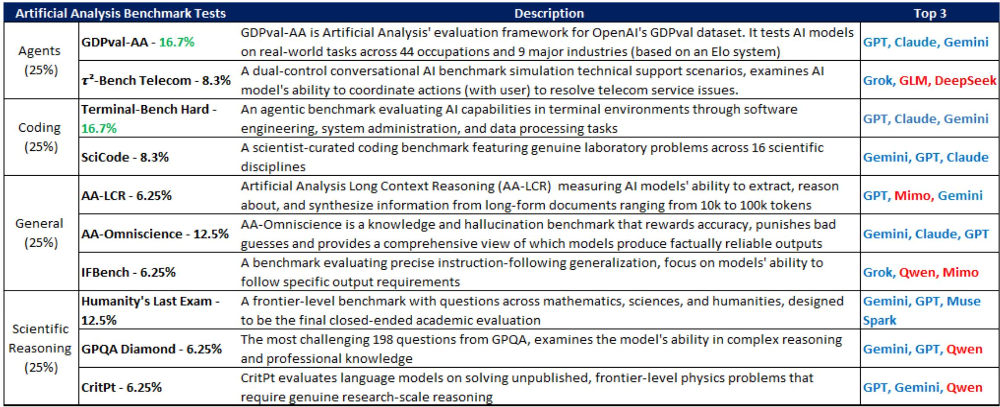
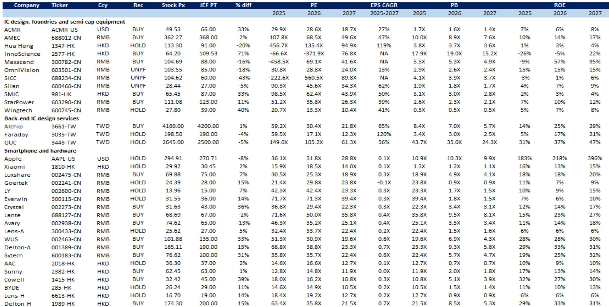
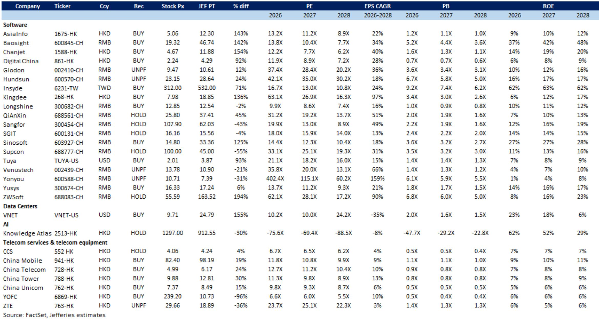

# AI Is Not a SaaS Apocalypse—It Is a Natural Selection Event, and China Software May Survive Better Than the Market Thinks

The software sector has been gripped by a singular fear over the past six months: that artificial intelligence will render traditional software companies obsolete. When Anthropic released Claude Cowork in January 2026, the US software basket dropped roughly 23 percent by the end of March. The narrative was simple and terrifying—AI agents would replace human operators, seat-based pricing would collapse, and the SaaS model would face an existential reckoning. Investors sold first and asked questions later.

That fear was overdone. Since late March, the US software basket has recovered approximately 21 percent as the market began to recognize that AI is not an apocalypse but a mechanism of natural selection. The distinction matters enormously for portfolio construction. An apocalypse destroys indiscriminately. Natural selection rewards the fit and eliminates the weak. The question is not whether software companies will survive AI, but which ones will evolve into AI-native platforms and which will be displaced.

For investors focused on China software, the stakes are even higher—and the opportunity set is more nuanced. China software has underperformed US software by 7 percent year to date, and the CSI 300 by 18 percent. The sell-off has been driven by both earnings downgrades and multiple compression. But beneath the surface, the structural dynamics of China's software market suggest a resilience that the current pricing does not reflect. This is not a sector to avoid. It is a sector to analyze with surgical precision.

## The US Software Sell-Off Was Driven by Multiple Compression, Not Earnings Destruction—But China Software Faces a Different Problem

The conventional narrative around the software sell-off conflates two very different phenomena. In the United States, the 6.4 percent year-to-date decline in our 14-stock software basket has been almost entirely a multiple compression story. Consensus 2026 revenue estimates have actually risen 2 percent since January 12, when Claude Cowork triggered the rout. The enterprise value-to-sales multiple contracted from 6.1 times to 5.7 times. Investors were not marking down earnings; they were repricing the risk that the SaaS model itself was broken.

China software tells a different story. Our 19-stock basket has fallen 13 percent year to date, but consensus 2026 revenue estimates have declined 5 percent since January 12. The enterprise value-to-sales multiple has compressed from 5.0 times to 4.3 times—a 15 percent contraction. The sell-off in China has been a double hit: real earnings downgrades combined with multiple compression. This is a more serious problem than what US software has experienced, but it also creates a more interesting entry point for investors who can distinguish between cyclical headwinds and structural disruption.

The earnings downgrades in China software are not primarily about AI. They reflect a weak macroeconomic environment in which large enterprises—particularly state-owned enterprises that are the primary customers for many China software vendors—are under sustained IT budget pressure. This is a cyclical issue, not a structural one. When the macro environment improves, IT budgets will recover. The multiple compression, however, reflects the market's uncertainty about whether AI will permanently impair the software business model. That is the question we need to answer.

## China Software Is Structurally Less Vulnerable to AI Disruption Than Its US Peers, and the Market Has Not Priced This Correctly

The thesis that China software is more resilient to AI disruption than US software rests on three structural differences that the market has largely ignored. First, the pricing model. Chinese software companies rarely use pure seat-based pricing. Instead, they charge by module. A customer buys the financial module, the procurement module, the HR module—each priced independently. When AI agents reduce the number of human operators, the revenue impact on a module-based vendor is far less direct than on a per-seat vendor. The customer still needs the module; they may simply need fewer people to operate it.

Second, the delivery model. Many Chinese software companies operate on project-based models, particularly when serving large state-owned enterprises. These projects require heavy systems integration, customization, and ongoing consulting. They are not plug-and-play SaaS deployments that can be replaced by an API call. The implementation complexity creates a natural moat that pure-play AI vendors cannot easily cross.

Third, the data environment. Data security concerns and an asset-based mentality among Chinese enterprises have limited public cloud SaaS penetration, especially among state-owned enterprises. Software vendors that operate on-premise or in private cloud environments have access to proprietary, workflow-embedded data that is difficult for external AI vendors to replicate. This data is not just a competitive advantage; it is a barrier to entry.

The market has not fully priced this structural resilience. The enterprise value-to-sales premium of China software over US software reached a three-year low in February 2026, during the peak of AI disruption fears. It has partially recovered since then, but remains compressed relative to historical levels. For investors who believe that AI disruption is a natural selection mechanism rather than an apocalypse, this compression represents an opportunity.

## The Most Resilient Sub-Sectors Share Three Characteristics: Deep Workflow Integration, Zero Tolerance for Hallucination, and Proprietary Data

Not all software is equally vulnerable to AI disruption. The distinction between winners and losers will depend on three factors: how deeply the software is embedded in critical workflows, how tolerant the use case is to AI hallucination, and how proprietary the underlying data is.

Industrial software, financial IT, and enterprise resource planning systems score highly on all three dimensions. These are systems of record, not systems of engagement. They manage inventory, process transactions, generate financial statements, and control manufacturing lines. The cost of error is high, and the tolerance for hallucination is effectively zero. An AI agent that generates a plausible but incorrect journal entry is not useful; it is dangerous. These systems also contain proprietary data that is specific to the enterprise and its industry—data that a general-purpose AI model cannot easily replicate.

Conversely, software that functions primarily as a user interface layer—customer relationship management tools, marketing automation platforms, basic analytics dashboards—faces higher disruption risk. These are systems where AI agents can increasingly replace the human interaction layer without needing deep access to proprietary workflows or data.

This framework suggests that the China software sell-off has been indiscriminate. Companies with strong moats have been marked down alongside companies with weak moats. The key analytical task is to identify which companies have the characteristics that will allow them to evolve into AI-native platforms rather than be displaced by them.

## Kingdee Represents the Archetype of a Software Company That Can Evolve Through AI, Not Be Destroyed by It

Kingdee, the leading China enterprise resource planning vendor, illustrates the characteristics that make a software company resilient to AI disruption. Its ERP system is deeply embedded in clients' workflows as a system of record. Replacing it is costly, risky, and disruptive. The company's proprietary data and industry know-how—accumulated over decades of serving Chinese enterprises—is difficult for AI vendors to replicate. Its module-based pricing insulates revenue from workforce reductions. And the company has already launched its own AI-native ERP suite and an AI operating system, guiding for one billion renminbi in AI-related revenue in 2026.

The sell-off in Kingdee's stock has created what appears to be an attractive entry point. Software-as-a-service now represents more than 50 percent of revenue, driving teen-percent revenue growth, gross profit margin expansion, and strong operating leverage aided by internal AI-driven cost efficiencies. The valuation, at 0.7 times 2026 estimated price-to-earnings growth, is low relative to the company's growth trajectory and competitive position.

But Kingdee is not the only company that fits this profile. The broader China software universe contains multiple companies with deep workflow integration, proprietary data, and pricing models that are less vulnerable to AI disruption than the market assumes. The analytical challenge is to distinguish between companies that are genuinely at risk of displacement and companies that are simply being dragged down by macro headwinds and indiscriminate selling.

## What the Report Does Not Fully Answer: The Second-Order Effects of AI on Software Margins and the China Model Pricing War

The framework of natural selection is analytically powerful, but it leaves several important questions unresolved. The most significant is the margin question. Traditional software has near-zero marginal cost of distribution. AI-native software, by contrast, has a significant usage-based variable cost: the cost of large language model inference. This changes the economics of the software business fundamentally.

Software companies will need to pass these costs on to customers or absorb them into margins. The ability to do either depends on pricing power, which in turn depends on competitive moats. Companies with strong moats may be able to charge a premium for AI-enhanced functionality. Companies with weak moats may find themselves in a race to the bottom, competing with AI vendors that have lower cost structures and different business models.

In China, this margin question is compounded by the aggressive pricing war in the AI model layer. Chinese model providers have cut prices dramatically. The average price of Chinese models as a percentage of US model prices fell to 21 percent in May, driven by price cuts of 46 percent and 86 percent on flagship models from two major providers. DeepSeek has made its promotional discount permanent. This is good news for software companies that use these models as inputs—their variable costs are falling. But it also signals intensifying competition that could pressure margins for model providers and potentially for software companies that rely on model-layer differentiation.

The report does not fully resolve how these dynamics will play out over a three-to-five-year horizon. Will the falling cost of inference accelerate AI adoption to the point where software companies can offset margin compression with volume growth? Or will the combination of AI variable costs and pricing pressure permanently compress software margins? These are open questions that require ongoing analysis.

## A Decision Framework for Investors: Four Questions to Distinguish Winners from Losers in the AI Transition

For investors navigating the China software space, the key is to move beyond the binary question of whether AI will destroy software and toward a more nuanced assessment of which companies will thrive. Four questions can serve as a decision framework.

First, is the software a system of record or a system of engagement? Systems of record—ERP, financial management, industrial control—are deeply embedded in critical workflows. They are costly to replace and have low tolerance for error. Systems of engagement—marketing automation, basic analytics, simple CRM—are more vulnerable to AI displacement.

Second, does the company have proprietary, workflow-embedded data that is difficult for AI vendors to replicate? Data is the ultimate moat in the AI era. Companies that sit on rich datasets generated by their customers' daily operations have a defensible advantage. Companies that simply provide a user interface to generic data do not.

Third, is the pricing model resilient to workforce reduction? Module-based pricing and project-based pricing are more resilient than pure seat-based pricing. Companies that charge for functionality rather than headcount will see less revenue disruption as AI automates tasks.

Fourth, is the company proactively building AI capabilities, or defensively hoping AI will not affect it? The natural selection framework rewards companies that embrace AI and evolve into AI-native platforms. Companies that resist or ignore the transition face the highest risk of displacement.

Companies that score well on all four questions—like Kingdee and other deeply embedded enterprise software vendors—are likely to emerge from the AI transition stronger, with larger addressable markets and deeper competitive moats. Companies that score poorly on multiple dimensions face genuine disruption risk.

## The Open Analytical Questions That Should Drive Your Own Research

The natural selection framework is powerful, but it is not a complete investment thesis. Several analytical questions remain unresolved, and investors should treat them as areas for ongoing investigation rather than settled conclusions.

How quickly will AI adoption actually occur in Chinese enterprises? The pace of adoption depends on factors that are difficult to predict: the willingness of state-owned enterprises to deploy AI in critical workflows, the regulatory environment for AI in enterprise settings, and the speed at which AI models improve in reliability and reduce in cost. The report provides a timeframe framework, but the actual pace could be faster or slower than current estimates.

Will the margin compression from AI variable costs be offset by volume growth? This is the central economic question for the software industry over the next five years. If AI drives a significant expansion in the total addressable market for software—by enabling automation of tasks that were previously too expensive to automate—then margin compression may be more than offset by revenue growth. If the market does not expand significantly, then margin compression will be a real problem.

How will the China model pricing war affect the competitive dynamics of the software layer? Falling model prices are good for software companies in the short term, but they may also enable new entrants and lower barriers to competition. The net effect on software industry structure is uncertain.

These are not questions that a single report can answer. They require ongoing analysis, company engagement, and a willingness to update views as new data emerges. The framework provides the structure for that analysis, but the conclusions will depend on how the future unfolds.

## Join the Community to Read the Full Report and Review the Original Charts

The analysis above is drawn from a detailed research report that includes original charts on software valuation trends, AI defensibility rankings, and revenue estimate revisions. The full report provides deeper data on individual company positioning, the specific AI strategies of leading China software vendors, and the detailed methodology behind the AI defensibility scoring.

For investors who want to move beyond the framework and into the specifics of portfolio construction, the full report offers the granular analysis needed to make informed decisions. The charts on enterprise value-to-sales trends, revenue estimate revisions, and AI defensibility rankings are particularly valuable for understanding where the market is mispricing risk.

Join the community to read the full report and review the original charts.

*This article is for learning and discussion only and does not constitute investment advice.*

Personal reading notes and learning share only. Not investment advice.

