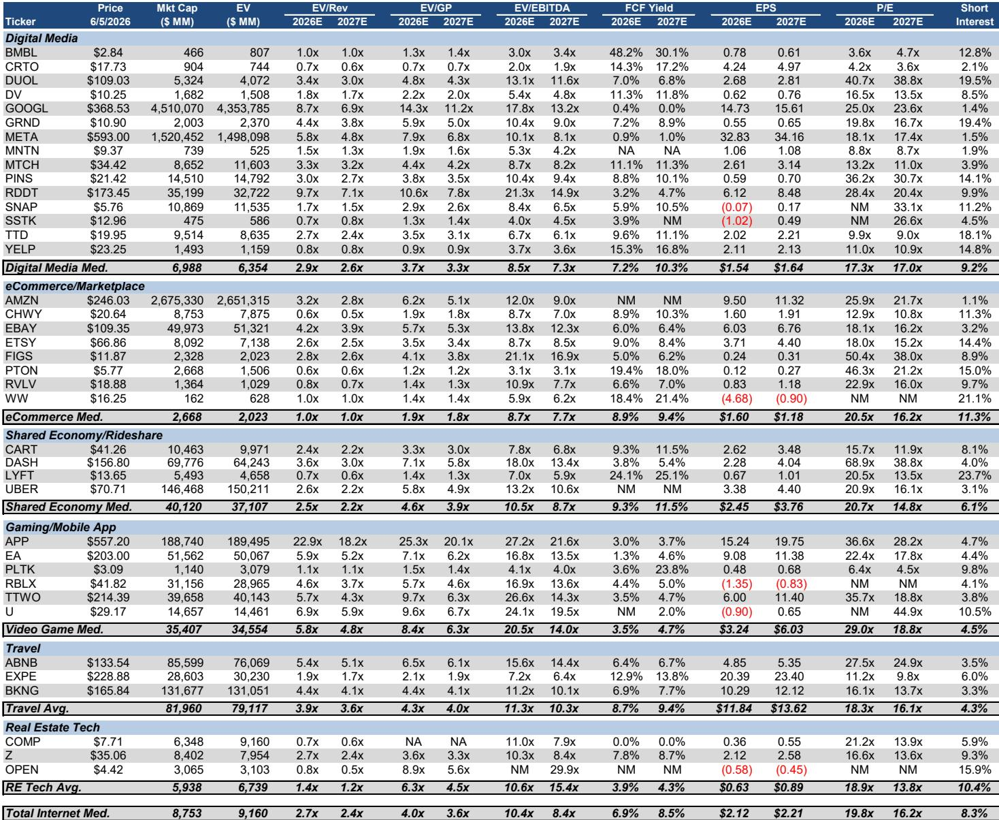
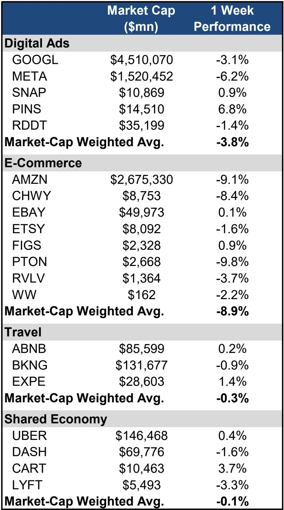
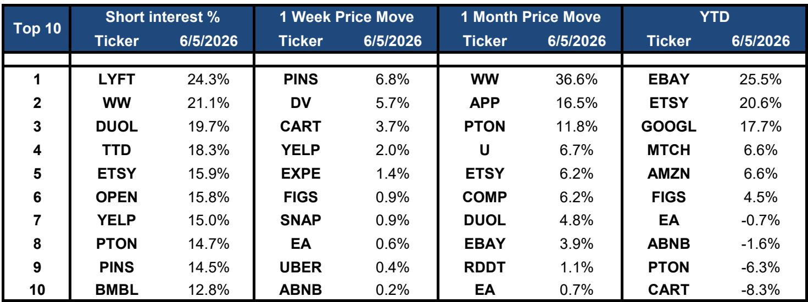

# The AI Monetization Debate Is Masking a Deeper Rotation: The Market Is Repricing Internet Stocks Based on Earnings Quality, Not AI Exposure

The North American internet sector experienced a sharp decline last week, with the broader index falling 5% and the NDX dropping a comparable 5%. Amazon and Meta led the selloff, down 9% and 6% respectively, while Google declined a more modest 3%. At first glance, this looks like another tremor in the ongoing debate about whether AI hardware or AI software will capture the economic value of the technology revolution. But the dispersion within the sector tells a different story entirely. The market is not merely rotating between AI hardware and software. It is executing a far more granular repricing based on capital efficiency, earnings visibility, and the durability of competitive moats.

This week's price action is not a random drawdown. It is a signal. The stocks that fell hardest were those where the market has begun to question the sustainability of earnings growth. Amazon, despite its cloud dominance, saw its P/E compress to 26x 2026 estimates, a 19% discount to its trailing twelve-month average. Meta now trades at 18x 2026 EPS, a 27% discount. These are not panic-driven multiples. They are deliberate repricing events. The market is telling us that high AI capital expenditure, combined with uncertain payback periods, is now a liability, not a catalyst.

The strategic question is not whether AI will transform the internet sector. That is settled. The question is which business models can convert AI investment into durable, compounding free cash flow without destroying margins in the process. The answer is not uniform across the sector, and the market is beginning to enforce that distinction with violence.

## The Magnificent Seven Are No Longer a Monolith: Earnings Quality Is Fracturing the Mega-Cap Internet Trade

For the past eighteen months, investors have treated the largest internet platforms as a single trade: long AI exposure, long scale, long market power. That consensus is breaking. The one-week performance gap between Amazon and Google is revealing. Amazon fell three times as much as Google, despite both companies having comparable cloud businesses and AI ambitions. The difference lies in earnings quality and capital allocation signaling.

Amazon's capital expenditure trajectory has become a source of anxiety. The market is struggling to model when the massive investment in data centers, logistics automation, and AI infrastructure will translate into margin expansion. The company's free cash flow yield remains negligible, and its capital intensity is rising at a time when retail margins face renewed pressure from competition and normalization of consumer spending. The market is effectively demanding a higher risk premium for this uncertainty.

Google, by contrast, trades at 25x 2026 earnings, only 2% below its historical average. The relative resilience reflects a business that generates substantially higher free cash flow margins and has a more defined path to AI monetization through search, cloud, and YouTube. The market is not punishing Google for AI spending. It is punishing companies where the spending has not yet produced visible, recurring earnings growth.

Meta sits in an intermediate position. Its 18x multiple, a 27% discount to its average, suggests the market is skeptical about the return on its massive AI infrastructure buildout, particularly in the context of an advertising market that faces cyclical headwinds and structural competition from newer platforms like Reddit and Pinterest. Meta's problem is not AI capability. It is the absence of a credible narrative that AI spending will lead to higher revenue per user rather than merely sustaining current engagement levels.

The implication is clear. The mega-cap internet trade is no longer a single bet. It is a set of individual stories about capital efficiency, competitive positioning, and the timing of AI returns. Investors who treat them as interchangeable are making a mistake.

## The Selloff Is Concentrated in High-Capex, Low-Visibility Models, While Asset-Light Platforms Are Holding Firm

The most instructive data point from this week is not the magnitude of the decline but its composition. The e-commerce and digital advertising platforms that require heavy infrastructure investment were hit disproportionately hard. The market-cap-weighted average for e-commerce fell 8.9%. Travel and shared economy stocks, which are structurally asset-light and generate high incremental margins, declined only 0.3% and 0.1% respectively.

This is not a coincidence. It is a repricing of risk. When the cost of capital was near zero, the market rewarded growth and punished capital discipline. The regime has shifted. The market is now paying a premium for business models that can generate free cash flow without requiring continuous large-scale reinvestment. Travel platforms like Booking, Expedia, and Airbnb have low capital intensity, high incremental margins, and proven pricing power. They do not need to build their own AI infrastructure to compete. They can consume AI as a service, and their earnings are highly visible.

Shared economy platforms like Uber and DoorDash share similar characteristics. Their variable cost structures and network effects mean that incremental revenue flows disproportionately to profit. The market is rewarding this predictability. Uber's stock was flat for the week. DoorDash declined only 1.6%. These are not AI stories in the traditional sense, but they are stories about capital efficiency, and that is what the market is buying.

The contrast with Amazon is stark. Amazon's e-commerce business requires massive investment in fulfillment, transportation, and technology. Its cloud business requires even larger capital outlays for data centers. The company's capital intensity is structurally higher than its travel and shared economy peers. The market is now demanding a higher return on that capital before it will re-rate the stock.

This does not mean Amazon is a poor business. It means the market has repriced the risk associated with its capital allocation strategy. The question investors must ask is whether Amazon's AI investments will eventually produce the same kind of high-margin, asset-light earnings that travel platforms generate today. That is a multi-year question, and the market is not willing to pay for optionality at current interest rates.

## Reddit and Pinterest Are Proving That AI-Enabled Advertising Platforms Can Disrupt Without Massive Infrastructure Spend

One of the most interesting signals in this week's data is the divergence within digital advertising. Pinterest rose 7% for the week, making it the best performer in the digital ads group. Reddit declined only 1%. This is happening while Meta and Google, which have far larger AI budgets, declined more sharply. The market is signaling that AI-enabled advertising platforms do not need to build their own large language models to win.

Pinterest and Reddit are benefiting from AI in a different way. They are using third-party AI models and in-house machine learning to improve ad targeting, recommendation quality, and user engagement. This does not require the same capital intensity as building foundational models from scratch. Their capital expenditure is modest relative to their revenue growth. The result is a business model that combines high growth with improving margins and free cash flow generation.

Pinterest trades at 36x 2026 earnings, which is expensive on an absolute basis but reflects a business that is growing revenue, expanding margins, and generating cash. The market is willing to pay for that combination. Reddit trades at 28x, which is below its recent average and suggests the market is still pricing in execution risk. But the trajectory is clear. These platforms are demonstrating that AI can be a tool for margin expansion, not just a cost center.

The strategic implication is profound. The market is beginning to differentiate between companies that use AI to improve their existing business and companies that are forced to build AI infrastructure to defend their position. The former group is being rewarded. The latter group is being penalized until they can demonstrate a return on that investment.

This has direct implications for how investors should evaluate the internet sector. The question is no longer "Which company has the best AI?" It is "Which company has the best AI ROI?" The answer may not be the largest platforms. It may be the platforms that can integrate AI without distorting their capital structure.

## The Report Leaves an Unanswered Question: How Should Investors Distinguish Between Defensible and Speculative AI Capex?

The report provides an excellent snapshot of current valuations and price action, but it does not fully resolve the central analytical challenge of this cycle. How do investors distinguish between AI capital expenditure that is strategically necessary and AI capital expenditure that is speculative or defensive?

Consider the range of capital intensity across the sector. Amazon and Meta are spending tens of billions annually on AI infrastructure. Google is spending similarly. But the report shows that their valuations are compressing at different rates. The market is not treating all AI spending equally. It is making judgments about which spending is likely to generate a return and which spending is a competitive necessity that may never produce above-cost-of-capital returns.

This is the unresolved question. The report provides the data on multiples and price performance, but it does not offer a framework for determining which companies have crossed the line from productive investment to capital destruction. That requires a deeper analysis of unit economics, customer retention, and the competitive dynamics in each sub-sector.

For example, is Meta's AI spending primarily defensive, designed to prevent market share loss to TikTok and emerging competitors? Or is it offensive, designed to open new revenue streams in areas like AI-powered advertising tools and virtual reality? The answer determines whether the current multiple compression is a buying opportunity or a warning sign.

Similarly, is Amazon's AI spending primarily about protecting its cloud market share from Microsoft and Google, or is it about creating new services that will generate incremental revenue at high margins? The market seems to be leaning toward the former interpretation. But the report does not resolve this debate.

This is the critical analytical gap that investors must fill themselves. The data on multiples and price performance is a starting point, not a conclusion.

## A Decision Framework for Navigating the AI Monetization Debate

For investors trying to operationalize the insights from this report, a structured decision framework is essential. The following approach is designed to help distinguish between companies that are likely to benefit from the current repricing and companies that may face further compression.

The first filter is capital efficiency. Calculate the ratio of capital expenditure to operating cash flow over the last three years. Companies with a ratio below 30% are in the asset-light category. They can scale AI capabilities without distorting their financial model. Companies with a ratio above 50% are in the capital-intensive category. Their AI investments must produce a higher return to justify the current valuation.

The second filter is earnings visibility. Examine the proportion of revenue that comes from subscription or recurring sources. Companies with high recurring revenue have more predictable earnings and are less sensitive to short-term AI investment cycles. Companies with transactional or advertising-based revenue face more uncertainty because AI spending may not produce immediate revenue gains.

The third filter is competitive moat durability. Ask whether the company's AI investments are reinforcing an existing competitive advantage or attempting to build a new one. The former is more likely to succeed. The latter carries significantly higher risk. Google's AI investments in search and cloud are reinforcing existing advantages. Meta's AI investments in social media are defending against disruption. Amazon's AI investments in cloud are competing in a market where all three major players have equivalent resources.

The fourth filter is valuation relative to intrinsic value. Use the report's comp sheet to compare current multiples to historical averages. A stock trading below its historical average with strong fundamentals may be a buying opportunity. A stock trading above its historical average with weak fundamentals is a sell.

This framework does not replace detailed company analysis, but it provides a systematic way to evaluate the AI investment debate without getting lost in the noise of weekly price movements. The market is repricing risk. The framework helps investors decide which risks are worth taking.

## Join the Community to Read the Full Report and Review the Original Charts

The analysis above draws on a detailed research report that includes comprehensive comp sheets, price performance tables, and sector-level breakdowns that are essential for making informed investment decisions. The full report contains the exact multiples, free cash flow yields, and short interest data that underpin the strategic conclusions presented here. It also includes the original charts that show the one-week and one-month price movements across every sub-sector of the North American internet market. These charts reveal patterns that are not visible in summary data alone.

To access the complete report and review the proprietary charts that informed this analysis, join the community. The community provides ongoing access to institutional-quality research, expert commentary, and a network of professionals who are actively navigating the AI monetization debate. This is not a promotional offer. It is an invitation to engage with the data and analysis that serious investors need to make decisions in a market that is repricing risk in real time.

The AI hardware versus AI software debate is not going to be resolved this quarter or this year. But the market is already telling us which companies are positioned to win and which companies are facing a more difficult path. The data is available. The question is whether you are using it.

*This article is for learning and discussion only and does not constitute investment advice.*

Personal reading notes and learning share only. Not investment advice.

